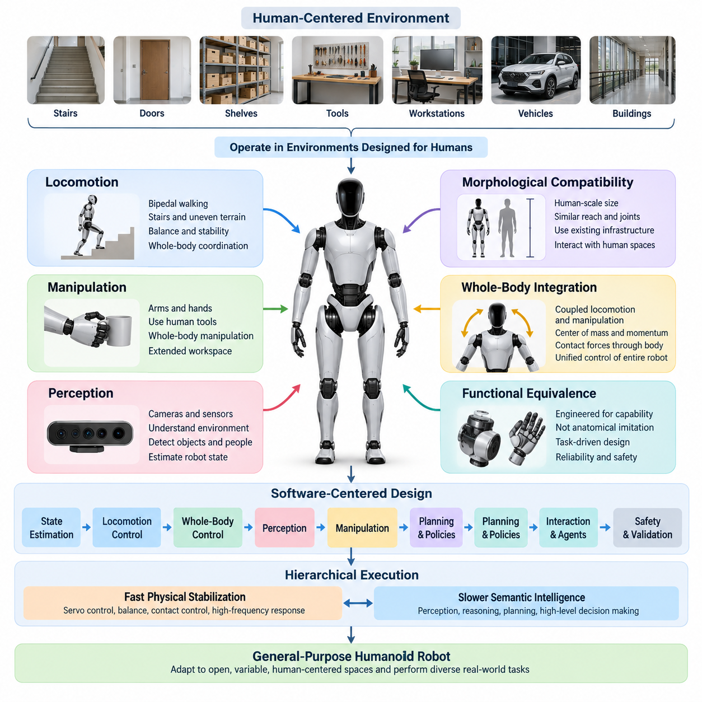
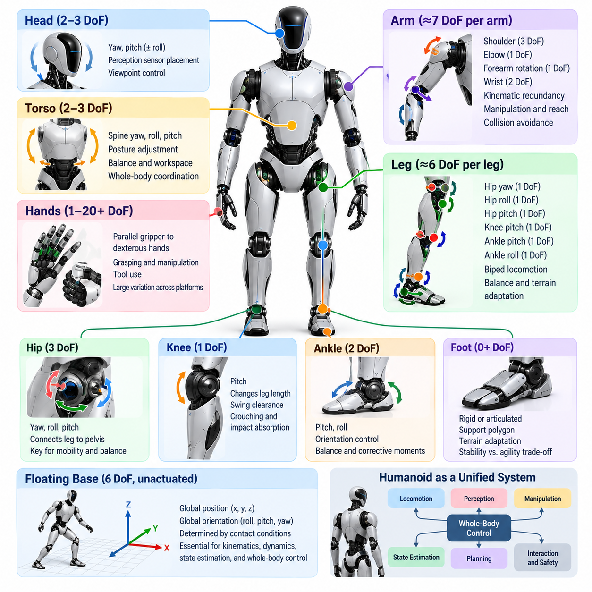
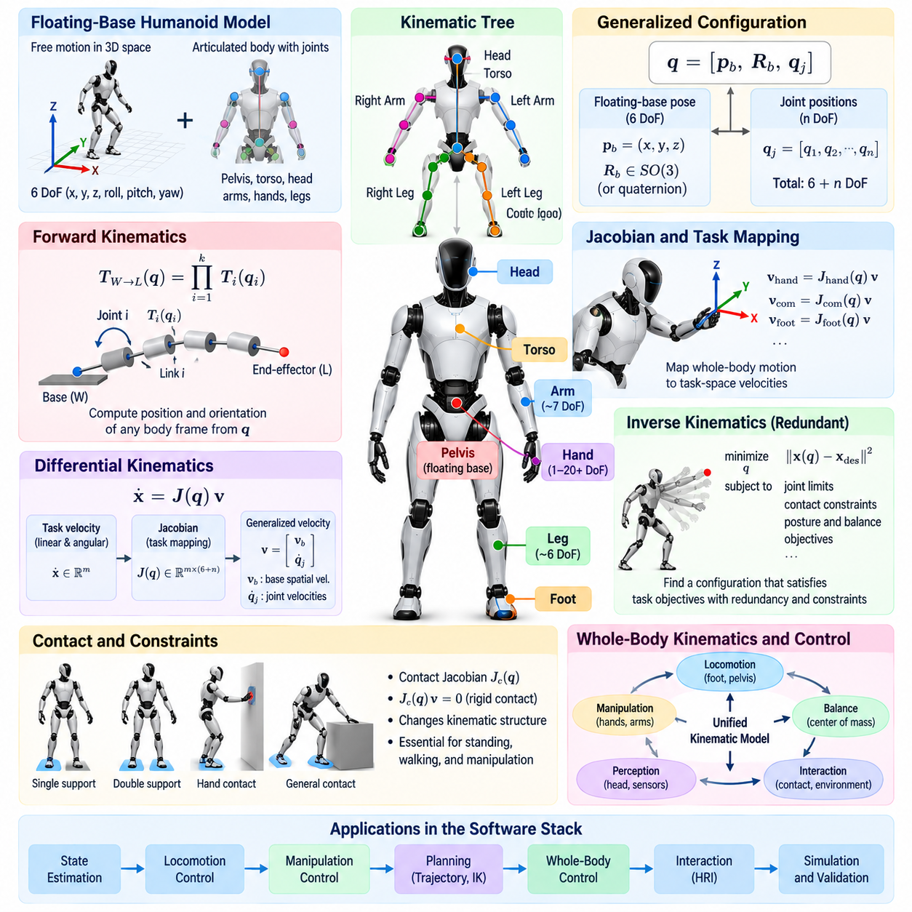
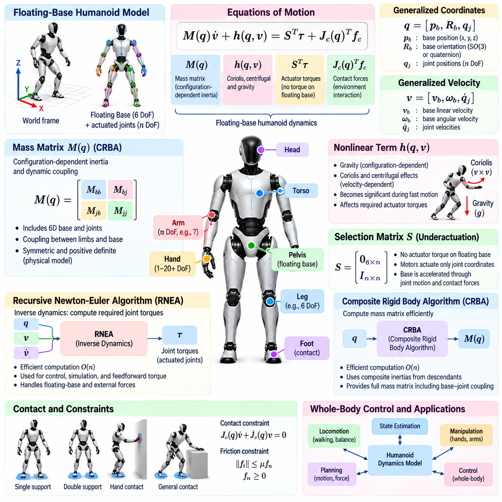
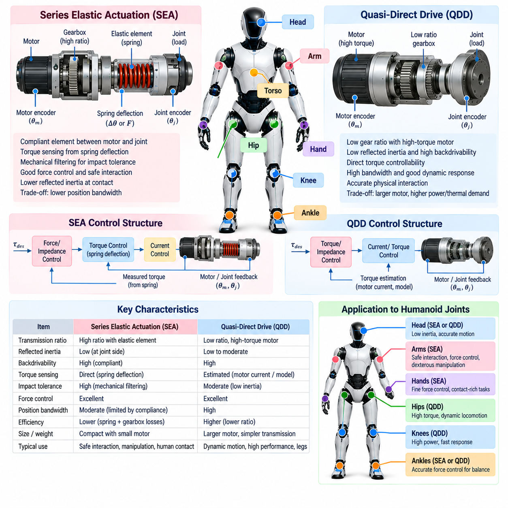
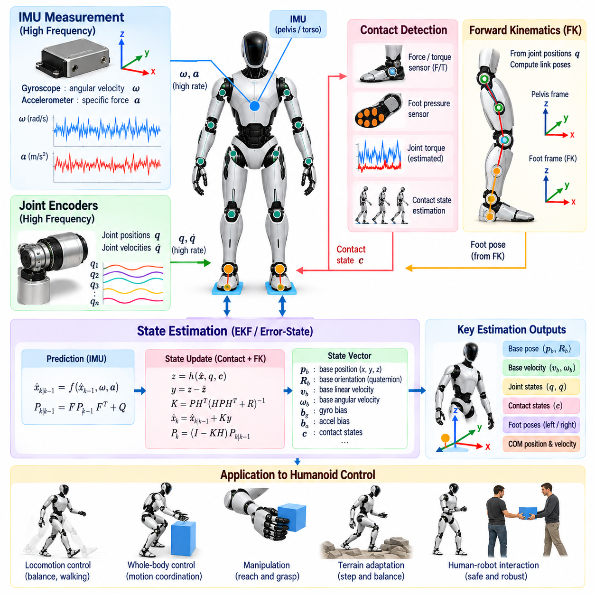
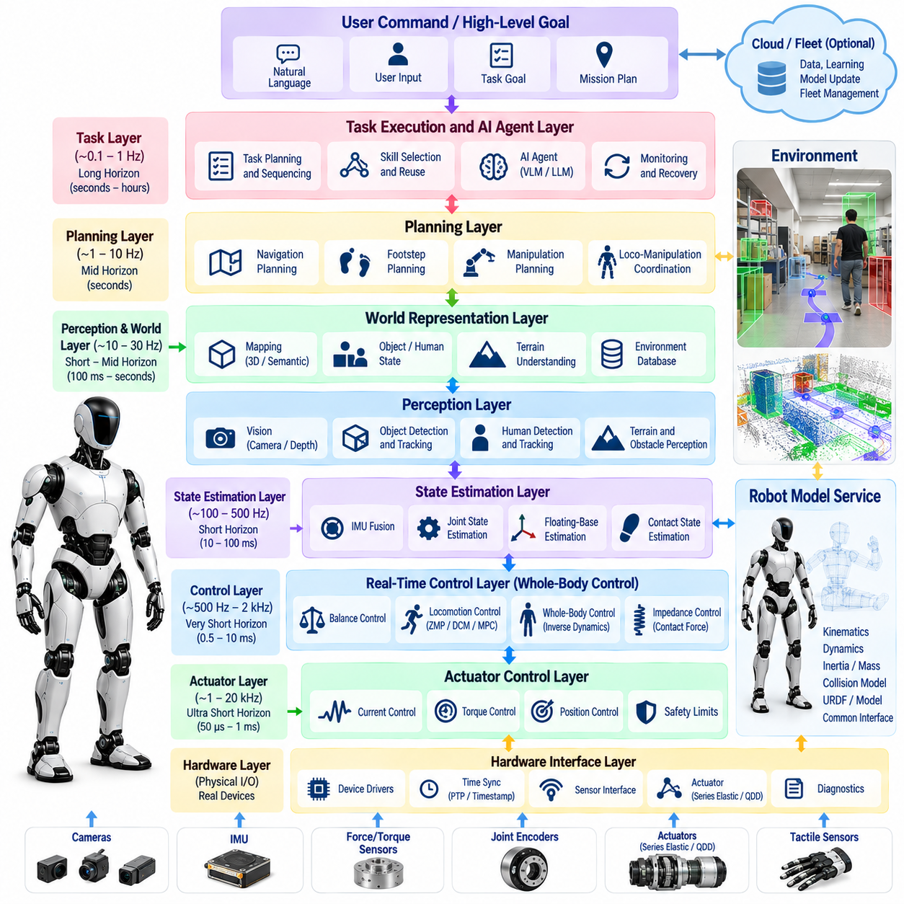
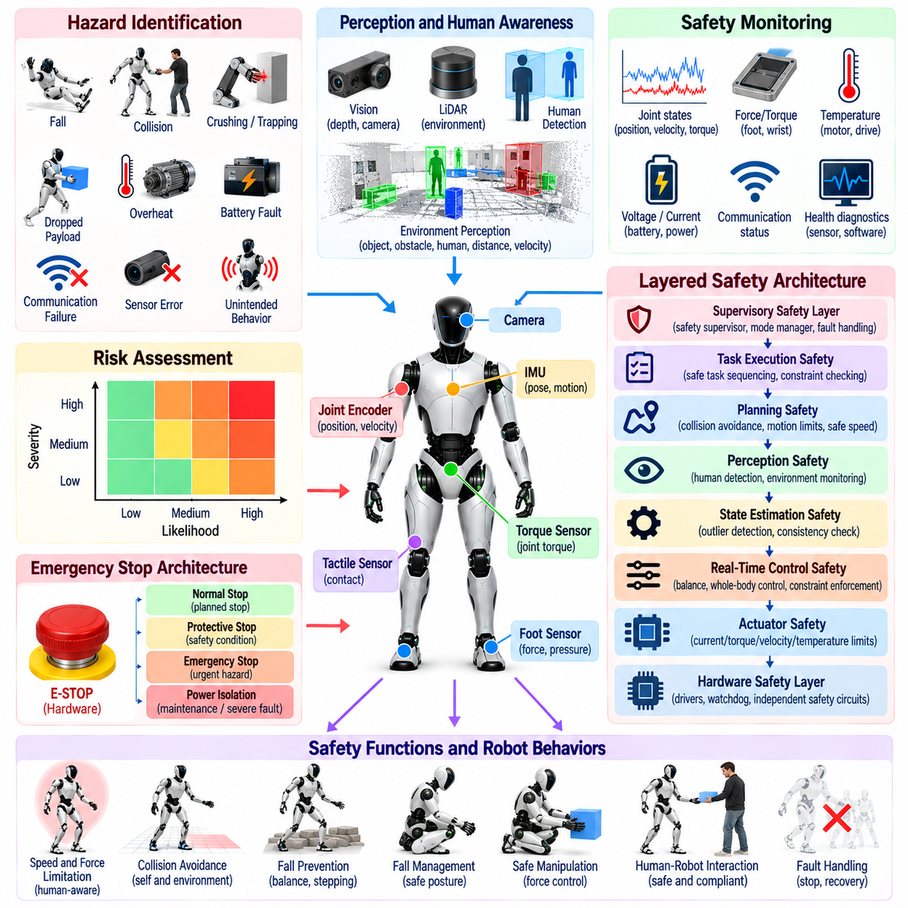
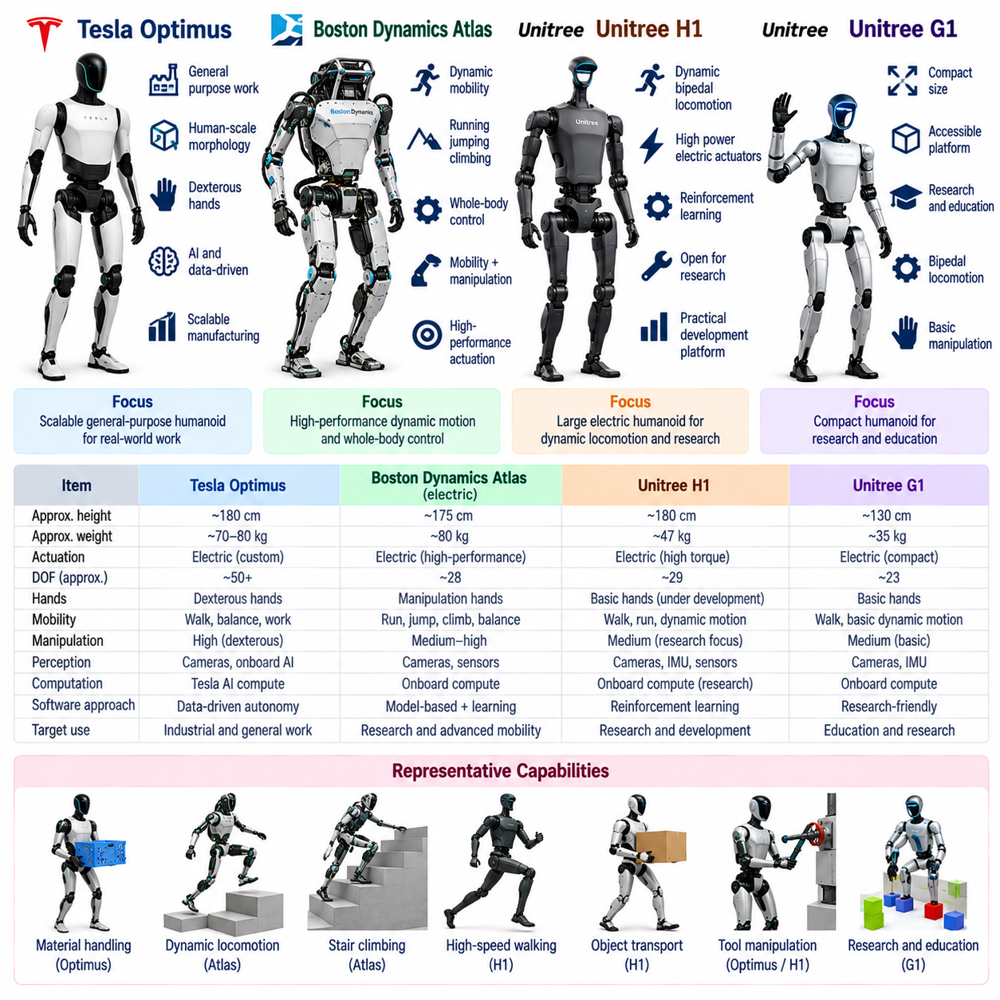
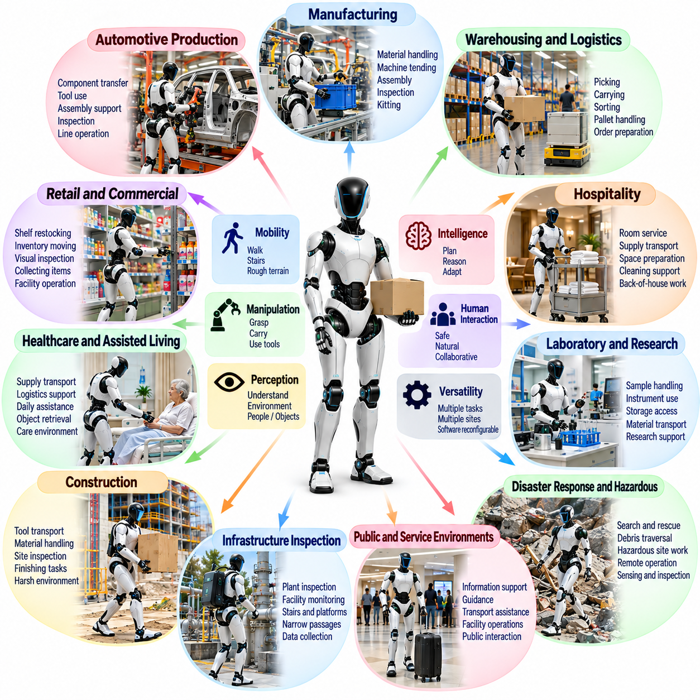

**Volume 22. Humanoid Robot Software**

# Chapter 01. Humanoid Robot Fundamentals

## 01.01. Humanoid Robot Motivation and Design Philosophy

{width="7.268055555555556in" height="7.268055555555556in"}

Humanoid robots are motivated by the simple but demanding idea that a machine should operate effectively in environments originally designed around the human body. Buildings, stairs, doors, tools, shelves, vehicles, workstations, and safety infrastructure all reflect human dimensions and movement patterns. A humanoid form therefore offers a pathway to robotic automation without requiring every existing environment to be redesigned around specialized machines. Volume_22_Humanoid_Robot_Softwa...

Unlike conventional industrial robots that achieve exceptional performance inside carefully structured cells, humanoids are intended to function within open, variable, and human-centered spaces. Their value is not determined merely by possessing two legs, two arms, and a head. The deeper engineering objective is to create a general physical platform capable of locomotion, manipulation, perception, communication, and adaptation through a unified embodied system.

The humanoid design philosophy begins with morphological compatibility. Human-scale height, reach, hand placement, joint arrangement, and mobility allow the robot to interact with infrastructure using approximately the same spatial assumptions as a person. A humanoid can potentially walk through existing passages, approach workbenches, reach storage locations, manipulate human tools, and perform tasks across environments where installing dedicated automation equipment would be impractical or uneconomical.

Human morphology, however, should not be interpreted as a requirement to reproduce human anatomy exactly. Biological joints, muscles, tendons, and sensory systems evolved under constraints very different from those of engineered machines. Humanoid engineering therefore seeks functional equivalence rather than anatomical imitation. Joint configurations, actuator placement, structural materials, transmission mechanisms, sensor locations, and computational architecture should be selected according to task capability, reliability, controllability, energy efficiency, and safety.

Bipedal locomotion illustrates this distinction particularly well. Two-legged movement provides access to stairs, narrow passages, uneven surfaces, and cluttered human environments, but it introduces significant control complexity. The robot operates as a floating-base system whose stability depends continuously on contact conditions, center-of-mass motion, momentum, and ground reaction forces. Consequently, humanoid mobility requires close integration among mechanical design, state estimation, dynamics, planning, and real-time control.

Manipulation provides the second major justification for humanoid morphology. Human environments contain objects whose location, orientation, dimensions, and interfaces implicitly assume the use of arms and hands. A humanoid can combine its torso, arms, wrists, hands, and legs to extend its effective workspace and manipulate objects while repositioning its body. This whole-body capability distinguishes humanoids from fixed manipulators and from mobile robots carrying relatively independent robotic arms.

The resulting design problem should therefore be considered at the whole-system level rather than as a collection of independent mechanical subsystems. Locomotion affects manipulation stability, arm motion changes whole-body momentum, payloads shift the center of mass, head motion changes perception geometry, and contact forces propagate through the entire kinematic chain. Software must consequently coordinate the complete robot state instead of treating legs, torso, arms, and hands as isolated devices.

Perception is equally fundamental because a general-purpose humanoid cannot assume that its environment is completely modeled in advance. Cameras, inertial sensors, force and torque sensors, joint encoders, tactile sensors, depth sensing, and other modalities provide complementary observations of the robot and its surroundings. These signals must support estimation of body configuration, contacts, objects, people, free space, terrain, and task-relevant relationships before reliable physical action becomes possible.

This requirement leads naturally to a software-centered design philosophy. Mechanical capability establishes the physical envelope of the platform, but software determines how effectively that capability can be transformed into behavior. State estimation, locomotion control, whole-body control, perception, manipulation, planning, learned policies, human-robot interaction, diagnostics, and safety mechanisms must operate as coordinated layers of a single computational system. The broader volume structure explicitly develops these capabilities from fundamentals through control, perception, manipulation, VLA policies, interaction, agents, and validation. Volume_22_Humanoid_Robot_Softwa... Volume_22_Humanoid_Robot_Softwa...

A further design principle is the separation of fast physical stabilization from slower semantic intelligence. Joint servo loops, balance regulation, contact control, and disturbance response require deterministic execution at high frequencies, whereas visual interpretation, language understanding, task reasoning, and learned policy inference may operate at substantially different rates. A practical humanoid architecture therefore coordinates multiple temporal layers rather than attempting to place every behavior inside one monolithic control loop.

Artificial intelligence expands this architecture from programmable motion toward adaptable physical behavior. Imitation learning, reinforcement learning, vision-language-action models, foundation models, and task-planning agents can allow humanoids to acquire behaviors that are difficult to specify through traditional rules alone. Within the volume structure, these capabilities complement rather than replace classical control, with dedicated treatment of humanoid VLA systems, language-conditioned execution, onboard inference, safety overrides, and AI-agent architectures. Volume_22_Humanoid_Robot_Softwa... Volume_22_Humanoid_Robot_Softwa...

This hybrid philosophy is important because intelligence without physical discipline is insufficient for humanoid operation. A high-level model may determine that an object should be picked up, but successful execution still requires feasible foot placement, collision avoidance, stable contact, accurate state estimation, appropriate grasp forces, actuator limits, and recovery from unexpected disturbances. Semantic reasoning and learned policies must therefore remain grounded in the robot\'s kinematic, dynamic, sensory, and safety constraints.

Safety must likewise be treated as an architectural property rather than an additional feature applied after development. Humanoids possess substantial mass, many powered joints, large reachable workspaces, and the ability to move close to people. Their design must therefore consider torque and velocity limits, collision detection, emergency stopping, fall behavior, fault monitoring, communication failures, thermal conditions, actuator faults, and degraded operating modes from the earliest stages of system development.

General-purpose capability also requires accepting an important engineering tradeoff. A specialized machine can usually outperform a humanoid on a narrowly defined repetitive operation, because every component can be optimized for that single task. The humanoid becomes attractive when environmental diversity, task variation, human infrastructure, and redeployment matter more than maximum performance on one operation. Its economic promise is therefore closely connected to versatility, software reuse, and the ability to transfer capabilities between tasks.

Modularity becomes essential under this philosophy. Hardware interfaces, sensor pipelines, actuator abstractions, control modules, perception models, task planners, and AI policies should be replaceable or upgradeable without redesigning the complete robot. Such modularity also supports simulation, software-in-the-loop testing, hardware-in-the-loop validation, field testing, regression testing, and controlled software releases, which the volume treats as integral parts of humanoid software engineering. Volume_22_Humanoid_Robot_Softwa...

Ultimately, the humanoid robot should be understood not simply as a human-shaped machine but as a general embodied computing platform. Its morphology provides compatibility with the physical world, its sensors establish situational awareness, its control system maintains physically valid behavior, and its AI components provide adaptation and task-level intelligence. Successful design emerges when these elements are engineered together around reliable interaction between perception, reasoning, action, and the constraints of the real world.

The long-term motivation is therefore broader than reproducing human motion. Humanoid robotics seeks a reusable physical platform that can acquire new skills through software and data while remaining compatible with existing human environments. This perspective connects humanoid development with the wider progression of robotics software toward Physical AI, foundation models, generalist policies, and AI-native robot systems represented elsewhere in the overall robotics software library. 08_Robotics_Software_Tree

## 01.02. Humanoid Morphology DoF Configuration Survey [w/Code]

{width="7.268055555555556in" height="7.268055555555556in"}

Humanoid morphology defines the physical arrangement through which perception, locomotion, manipulation, and interaction are expressed. Unlike fixed-base manipulators or wheeled mobile robots, a humanoid combines a floating body, articulated legs, torso, arms, hands, and often a movable head into one highly coupled kinematic system. The selection of body proportions and degrees of freedom therefore establishes the fundamental motion space available to every higher-level software function.

A degree of freedom, or DoF, represents an independent coordinate required to describe robot configuration. In most humanoid mechanisms, each actuated revolute joint contributes one controllable DoF, although compound joints may contain multiple rotational axes. The complete configuration also includes the six-dimensional position and orientation of the floating base, which are not directly actuated but become essential variables in kinematics, dynamics, state estimation, balance, and whole-body control.

The floating-base representation distinguishes humanoids from conventional industrial manipulators. A fixed robot arm has a base rigidly connected to the environment, while a humanoid moves its entire body relative to the world. During standing, walking, jumping, or climbing, the effective constraints on the floating base are created by foot or hand contacts. Consequently, the robot configuration must describe both internal joint coordinates and global body motion under changing contact conditions.

Lower-body morphology is primarily determined by the requirements of biped locomotion and balance. A common humanoid leg contains hip yaw, hip roll, hip pitch, knee pitch, ankle pitch, and ankle roll joints, resulting in approximately six DoF per leg. This arrangement provides sufficient mobility for forward progression, lateral balance, foot orientation, turning, crouching, stair negotiation, and adaptation to moderately irregular terrain while maintaining a manageable control structure.

The hip is especially important because it connects the leg to the floating pelvis and strongly influences whole-body mobility. Three rotational DoFs approximately corresponding to yaw, roll, and pitch allow the thigh to change orientation in three-dimensional space. Hip pitch dominates many walking motions, hip roll contributes to lateral weight transfer and balance, while hip yaw enables heading changes and supports foot orientation during turning and complex stepping maneuvers.

The knee is commonly implemented as a predominantly single-axis pitch joint. Although the biological human knee exhibits more complex coupled motion, a one-DoF robotic knee reduces mechanical complexity and simplifies control while retaining the major function required for locomotion. Knee flexion changes effective leg length, enables swing-foot clearance, supports crouching and sitting, and contributes significantly to impact absorption and vertical center-of-mass regulation.

Ankle morphology has a direct relationship with balance capability. Pitch and roll DoFs allow the foot to regulate orientation and generate corrective moments while maintaining contact with the ground. Robots equipped with sufficiently capable ankle actuation can employ ankle-based stabilization during standing and slow motion. Designs with limited ankle authority must rely more heavily on hip motion, stepping strategies, momentum regulation, or dynamic locomotion policies.

Foot design is another major morphological choice even when it does not introduce additional actuated DoFs. Large rigid feet provide a broad support polygon and simplify quasi-static standing, but they can restrict terrain adaptability and increase distal mass. Smaller feet improve agility and may better support dynamic locomotion, yet reduce passive stability margins. Some platforms introduce articulated toes or compliant foot structures to improve push-off, contact adaptation, or energy behavior.

The upper body introduces a different set of requirements centered on manipulation and workspace coverage. A practical humanoid arm frequently uses approximately seven DoFs, including multiple shoulder axes, elbow flexion, forearm rotation, and wrist articulation. Seven-DoF arms provide kinematic redundancy beyond the minimum required to position and orient an end effector, allowing the controller to satisfy additional objectives such as collision avoidance, joint-limit avoidance, posture optimization, or manipulation around obstacles.

Shoulder configuration strongly affects reachable workspace. A multi-axis shoulder allows the arm to move forward, sideways, and around the torso, while the elbow changes reach and provides geometric flexibility. Wrist pitch, yaw, or roll motions orient the hand independently of much of the arm configuration. The resulting redundancy becomes particularly valuable when the humanoid must manipulate tools and objects designed for human use while simultaneously maintaining balance.

Hands represent one of the largest variations in humanoid DoF configuration. Simple platforms may use parallel grippers or low-DoF adaptive hands, while dexterous humanoids may employ individually articulated fingers with many joints. Increasing hand DoF expands grasp diversity and enables in-hand manipulation, tool operation, and human-like interaction, but it also increases actuator count, sensing requirements, calibration complexity, control dimensionality, cost, and the amount of training data required for learned policies.

The torso can range from a nearly rigid connection between pelvis and shoulders to a multi-DoF articulated structure. Waist yaw enables the upper body to rotate relative to the pelvis, while pitch and roll can expand manipulation workspace and contribute to balance or momentum regulation. Additional torso mobility increases whole-body dexterity, but it also introduces structural, wiring, control, and collision-management complexity and may reduce mechanical stiffness under heavy manipulation loads.

Head and neck joints are generally motivated by perception and interaction rather than load-bearing motion. Pan and tilt DoFs allow cameras and other sensors to direct attention independently of the torso, improving visual coverage while reducing unnecessary whole-body movement. More elaborate neck mechanisms may add roll or additional coupled axes, but practical designs must balance perception flexibility against sensor stabilization, mechanical complexity, cable routing, and control requirements.

Total humanoid DoF therefore varies considerably between platforms because there is no universally optimal configuration. A robot optimized for robust industrial transport may favor fewer, stronger joints and simpler hands, while a platform intended for general manipulation may allocate substantially more DoFs to the wrists, fingers, torso, and neck. Research systems may deliberately increase redundancy to investigate human-like motion, dexterity, or learning, whereas production platforms often prioritize reliability and maintainability.

A higher DoF count should not automatically be interpreted as greater practical capability. Every additional actuated joint introduces mass, volume, power consumption, communication traffic, thermal load, calibration parameters, failure modes, and control variables. The useful metric is therefore not maximum articulation but task-relevant articulation. A well-selected morphology provides sufficient redundancy for required tasks while avoiding mechanical and computational complexity that contributes little to operational performance.

Morphology also determines the dimensionality of the software problem. Kinematic models must represent every joint and rigid-body transform, dynamic algorithms must compute coupled inertial and contact effects, and state estimators must track joint states together with floating-base motion. Whole-body controllers then distribute motion and forces across redundant joints while respecting torque limits, joint limits, contact constraints, self-collision constraints, and task priorities.

This coupling becomes particularly visible during loco-manipulation. Reaching for an object may require shoulder and elbow motion, but extending the arm changes the center of mass and angular momentum. The controller may respond through torso motion, ankle torque, hip adjustment, or a new foot placement. A humanoid morphology should therefore be evaluated not only by isolated limb workspace but by how effectively its complete DoF configuration supports coordinated whole-body behavior.

Actuator placement further modifies the practical meaning of morphology. Two robots with similar kinematic DoFs may exhibit very different capabilities if one concentrates heavy actuators near the torso and transmits power distally while another places motors directly at each joint. Distal mass influences limb inertia, impact behavior, energy consumption, and achievable acceleration. Morphological surveys must therefore consider joint arrangement together with transmission architecture and mass distribution.

Sensor configuration is similarly connected to mechanical morphology. Joint encoders provide configuration measurements, inertial measurement units estimate body motion, and force or torque sensing reveals physical interaction at feet, wrists, or joints. Tactile sensors can add contact observability to hands and body surfaces. The usefulness of these sensors depends on where they are integrated into the kinematic structure and how their measurements are fused into the robot state.

From a software perspective, a useful humanoid model separates platform-specific morphology from reusable algorithms. Robot descriptions can encode link geometry, joint axes, limits, inertial parameters, collision geometry, actuator characteristics, and sensor frames, while locomotion, estimation, planning, and whole-body control consume these descriptions through standardized interfaces. This abstraction allows algorithms to be transferred between humanoids without assuming identical mechanical configurations.

Morphological design must also consider self-collision and singularity. Human-like reachability does not guarantee that every mathematical joint configuration is physically safe or controllable. Arms can collide with the torso, legs can interfere during crossing motions, and redundant chains can approach singular configurations where desired Cartesian motion requires excessive joint velocity. Joint limits and collision geometry must therefore be incorporated directly into planning and control.

The configuration selected for a humanoid ultimately reflects its intended operational role. Manufacturing and logistics platforms may emphasize stable locomotion, payload capability, repetitive manipulation, and maintainability. Service humanoids may require broader interaction workspaces and safer compliant motion, while research platforms may prioritize dexterous hands and extensive redundancy. Morphology is therefore an engineering allocation of motion capability according to application requirements rather than a competition for the largest DoF count.

For this reason, humanoid morphology should be understood as the physical foundation of the complete software architecture. The chosen DoF configuration determines what motions are mechanically possible, which states must be estimated, what constraints the controller must enforce, and what action space an AI policy can command. Effective humanoid design emerges when morphology, actuation, sensing, dynamics, control, and learning are treated as a coordinated system rather than independently optimized components.

## 01.03. Humanoid Kinematics Full Body Model [w/Code]

{width="7.268055555555556in" height="7.268055555555556in"}

Humanoid kinematics provides the mathematical framework for describing how the complete robot body moves as a connected articulated system. A full-body model represents the pelvis, torso, head, arms, hands, and legs through rigid links connected by joints, while also accounting for the free motion of the robot relative to the environment. This model forms a fundamental layer beneath state estimation, locomotion, manipulation, planning, and whole-body control.

Unlike a conventional industrial manipulator whose base is rigidly attached to the world, a humanoid is naturally represented as a floating-base multibody system. The base typically contributes six generalized coordinates describing three-dimensional translation and orientation, while actuated joints contribute the remaining configuration variables. The generalized configuration therefore combines global body pose with internal articulation into a unified representation of the complete robot state.

A common mathematical description expresses the configuration as q, containing the floating-base pose and joint positions. Because three-dimensional orientation cannot always be represented globally without singularities using only three scalar angles, practical robotics libraries frequently represent base orientation with a quaternion or an element of the rotation group SO(3). The resulting configuration manifold must be handled carefully when integrating velocities or computing configuration differences.

The robot structure can be represented as a kinematic tree whose root corresponds to the floating base and whose branches extend toward the legs, torso, arms, and head. Each joint defines a transformation between adjacent rigid bodies. By recursively composing these transformations from the root toward a selected link, forward kinematics determines the position and orientation of any body frame, sensor frame, foot, hand, or other point of interest.

For a serial chain, the transformation from the world frame to an end-effector frame can be constructed from the ordered product of individual joint transformations. In a complete humanoid, the same principle is applied across multiple branches sharing common ancestors. A change in pelvis pose can therefore affect both feet and both hands simultaneously, while a torso joint may influence the arms and head without directly changing the leg configurations.

Forward kinematics is essential because many humanoid objectives are specified in Cartesian space rather than directly in joint coordinates. A controller may require a hand to reach a target pose, a foot to remain stationary on the ground, the pelvis to maintain a desired height, or the head camera to face an object. The kinematic model converts the current generalized configuration into the spatial quantities required to evaluate these objectives.

Differential kinematics describes how generalized velocities generate linear and angular velocities of robot bodies. This relationship is represented by the Jacobian matrix. For a task variable x, its velocity can be expressed conceptually as x-dot = J(q)v, where v is the generalized velocity vector. In a floating-base humanoid, v includes both base spatial velocity and actuated joint velocities, allowing body motion and internal articulation to contribute jointly to task execution.

Jacobians are central to humanoid control because they map motion between joint space and task space. A hand Jacobian relates whole-body generalized velocity to hand velocity, while a foot Jacobian describes the motion of a contact frame. Center-of-mass and centroidal quantities can also be related to generalized motion through corresponding mappings. These relationships allow controllers to coordinate multiple body parts without constructing independent controllers for every limb.

Contact changes the interpretation of the floating-base model. During single support, one foot may be treated as constrained against the environment while the other moves through a swing trajectory. During double support, both feet impose constraints on allowable body motion. Additional hand contact with a wall, railing, or manipulated object can introduce further constraints, causing the effective kinematic structure to change according to the active contact state.

A rigid contact constraint requires the velocity of the contact frame relative to the environment to remain zero. At the velocity level, this can be represented using the contact Jacobian and generalized velocity. Such constraints are fundamental to standing and walking because the floating base has no direct actuator connecting it to the world. Its motion is indirectly controlled through forces and kinematic constraints created at physical contacts.

Inverse kinematics addresses the complementary problem of determining a robot configuration that satisfies desired task-space objectives. For humanoids, this is generally a redundant and constrained optimization problem rather than a simple analytical inversion. A desired hand pose, for example, may be achievable using many combinations of shoulder, elbow, torso, pelvis, and leg motion, and the controller must select a solution consistent with balance and physical limitations.

Redundancy is therefore a valuable property of full-body kinematics. When the robot has more controllable DoFs than are required for a primary task, the remaining freedom can satisfy secondary objectives. These may include maintaining an upright torso, keeping joints away from limits, minimizing motion, avoiding self-collision, improving manipulability, maintaining visual attention, or preserving a configuration from which subsequent actions remain feasible.

A common numerical approach uses the pseudoinverse of a task Jacobian to calculate generalized motion that reduces task error. Null-space projection can then introduce secondary motion that does not interfere with the primary task. For complex humanoids, optimization-based inverse kinematics is often more flexible because equality and inequality constraints, joint limits, collision restrictions, velocity bounds, and multiple task priorities can be considered within a common formulation.

Task hierarchy is especially important when several objectives compete. Maintaining a stance foot contact may have higher priority than moving a hand, while balance-related pelvis motion may need precedence over a desired head orientation. Hierarchical inverse kinematics or optimization can preserve high-priority constraints before using remaining degrees of freedom for lower-priority objectives. This reflects the physical reality that not every desired motion can always be satisfied simultaneously.

Center-of-mass kinematics provides another important component of the full-body model. The total center of mass is computed from the masses and positions of all links, so motion of an arm, leg, or carried object can shift the overall body configuration. Tracking the center of mass is critical for balance and locomotion because its position and velocity are closely related to feasible contact forces and the robot\'s ability to remain dynamically stable.

Full-body kinematics must also model collision geometry in addition to idealized joint and link transformations. A mathematically reachable configuration may cause the forearm to intersect the torso or the legs to collide with each other. Practical planners and controllers therefore evaluate distances between selected collision geometries and impose constraints or costs that prevent self-collision while preserving useful motion throughout the robot workspace.

Joint limits create additional boundaries on the feasible configuration space. Mechanical stops, cable routing, transmission geometry, actuator packaging, and safety requirements restrict each joint to an allowable range. Approaching these limits can reduce available motion and degrade Jacobian conditioning. Full-body algorithms often include joint-limit avoidance terms so that the robot remains within configurations that preserve sufficient mobility for future actions.

Kinematic singularities occur when the Jacobian loses rank and the robot loses instantaneous mobility in one or more task directions. Near a singular configuration, small desired Cartesian motion may require very large joint velocities. Humanoid controllers therefore monitor manipulability or Jacobian conditioning and may use damped least-squares methods, posture objectives, or optimization constraints to prevent unstable commands near singular regions.

Accurate frame definition is essential for implementing the model correctly. Humanoid software typically contains frames associated with links, joints, sensors, end effectors, feet, hands, cameras, and inertial units. Consistent transformation conventions are required to express measurements and commands between world, base, body, sensor, and task frames. Errors in frame orientation or translation can propagate into state estimation and control even when the underlying algorithms are mathematically correct.

The kinematic model is commonly derived from a structured robot description containing link geometry, joint type, joint axis, parent-child relationships, limits, and inertial information. Software libraries can construct the corresponding multibody model and efficiently evaluate forward kinematics, Jacobians, frame transformations, and derivatives. This separates robot-specific geometry from reusable control and planning algorithms and simplifies adaptation to different humanoid platforms.

Kinematic computation must also satisfy real-time requirements. Whole-body controllers may repeatedly evaluate dozens of frame poses and Jacobians within high-frequency control loops. Recursive rigid-body algorithms and optimized multibody libraries reduce unnecessary computation by exploiting the tree structure of the robot. Efficient model updates become increasingly important as the number of joints, contacts, sensors, and simultaneous task constraints grows.

Model accuracy depends on calibration as well as nominal mechanical design. Manufacturing tolerances, encoder offsets, structural compliance, sensor mounting errors, and joint backlash can create discrepancies between the mathematical model and the physical robot. Calibration procedures estimate relevant parameters so that predicted link poses correspond more closely to actual geometry. Poor calibration can directly degrade foot placement, manipulation accuracy, perception alignment, and balance estimation.

For software development, the same full-body model should ideally remain consistent across simulation, planning, estimation, and real-time control. Differences in joint ordering, coordinate conventions, collision models, or frame definitions between subsystems can create subtle integration failures. Maintaining a canonical robot model and validating its transformations numerically provides a foundation for reliable software-in-the-loop, hardware-in-the-loop, and physical robot testing.

The full-body kinematic model ultimately acts as the geometric language shared by the humanoid software stack. Perception uses it to relate sensors to the body, estimation uses it to infer contact and base motion, planners use it to evaluate reachability, and controllers use it to coordinate task-space objectives. By representing the humanoid as one floating-base articulated system, kinematics provides the common structure required to transform high-level intentions into physically consistent whole-body motion.

## 01.04. Humanoid Dynamics Floating Base CRBA RNEA [w/Code]

{width="7.268055555555556in" height="7.268055555555556in"}

Humanoid dynamics describes how forces, torques, inertia, gravity, momentum, and physical contacts determine the motion of the complete robot. While kinematics specifies geometric relationships without considering their causes, dynamics connects generalized acceleration to actuator effort and external interaction. For a humanoid, this relationship must include the floating base because the pelvis and torso are not mechanically fixed to the world.

A floating-base humanoid is commonly modeled using generalized coordinates q and generalized velocity v. The equations of motion can be written conceptually as M(q)v-dot + h(q,v) = Sᵀτ + Jc(q)ᵀfc, where M is the mass matrix, h contains Coriolis, centrifugal, and gravity effects, τ represents actuator torques, Jc is the contact Jacobian, and fc contains external contact forces acting on the robot.

The selection matrix S reflects an essential property of humanoid dynamics: the floating base is unactuated. Motors generate torques at physical joints, but no actuator directly applies generalized torque to the six free-floating base coordinates. The base is accelerated indirectly through joint motion, gravity, and environmental contact forces. This underactuation distinguishes humanoid dynamics from the simpler equations of a fixed-base industrial manipulator.

The mass matrix M(q) captures the configuration-dependent inertia of the complete multibody system. Its diagonal and off-diagonal terms describe not only the apparent inertia of individual coordinates but also dynamic coupling among different body segments. Accelerating an arm can influence torso and base motion, while leg movement can modify whole-body momentum. Consequently, humanoid dynamics cannot generally be treated as a set of independent joint equations.

The nonlinear term h(q,v) combines several effects that must be considered during motion. Gravity produces configuration-dependent loading throughout the body, while Coriolis and centrifugal effects become increasingly significant as joint and base velocities increase. In slow postural motion gravity may dominate, but during fast walking, running, recovery, or manipulation, velocity-dependent effects can substantially alter the torque required to achieve a desired acceleration.

External contacts provide the physical connection between the floating robot and its environment. During standing, ground reaction forces at the feet support body weight and generate moments required for balance. During walking, these forces change as contacts are established and released. When a hand pushes against a wall or manipulates an object, additional contact wrenches enter the same whole-body dynamics and modify the feasible motion of the robot.

Contact dynamics therefore requires both equations of motion and constraints describing the active contacts. A rigid stationary contact ideally imposes zero acceleration at the corresponding contact frame, subject to the effects of current velocity. The controller must determine generalized acceleration, actuator torque, and contact force combinations that satisfy these constraints while also respecting friction, unilateral contact, torque limits, and desired motion objectives.

Friction constraints are particularly important because a foot cannot generate arbitrary horizontal force while remaining stationary on the ground. The tangential contact force must remain within a friction region related to the normal force. Likewise, the normal force cannot pull the ground toward the robot. Practical whole-body optimization frequently approximates these physical conditions using linear inequalities suitable for real-time quadratic programming.

Efficient rigid-body algorithms are required because directly constructing dynamics from symbolic equations becomes impractical for humanoids with many links and joints. Modern multibody software exploits the tree structure of the mechanism and spatial rigid-body algebra to compute dynamic quantities recursively. Two particularly important algorithms are the Composite Rigid Body Algorithm, or CRBA, and the Recursive Newton-Euler Algorithm, or RNEA.

CRBA is primarily used to compute the joint-space or generalized mass matrix efficiently. The method forms composite inertias by accumulating the inertial properties of descendant bodies toward their ancestors. Once these composite rigid-body inertias are available, the entries of the mass matrix can be assembled from the relationships between joint motion subspaces and the accumulated inertial structure of the robot.

For a floating-base humanoid, CRBA produces a mass matrix that includes coupling between the six-dimensional base motion and all actuated joints. This coupling is essential for whole-body control because limb acceleration can exchange momentum with the floating body. The resulting matrix is symmetric and, under a physically valid model, positive definite with respect to the appropriate generalized velocity representation.

RNEA solves a different but complementary problem. Given robot configuration, velocity, and desired acceleration, inverse dynamics determines the generalized forces required to produce that motion. RNEA performs an outward recursion to propagate body velocities and accelerations through the kinematic tree, followed by an inward recursion that accumulates spatial forces from the distal links toward the root.

For fixed-base manipulators, the output of inverse dynamics can be interpreted directly as required actuator torque. In a floating-base humanoid, however, the six base components reveal whether the requested acceleration is dynamically compatible with the assumed external forces. Since these base coordinates are unactuated, feasible motion must satisfy the floating-base equations through gravity and contact forces rather than through nonexistent base actuators.

RNEA is useful for gravity compensation, feedforward torque generation, model-based control, trajectory tracking, and evaluation of candidate motions. If acceleration is set appropriately, the algorithm can isolate gravity-related generalized forces or evaluate bias terms. Its recursive structure makes it computationally efficient enough to serve as a fundamental primitive inside high-frequency humanoid control and estimation pipelines.

CRBA and RNEA are closely related but should not be considered interchangeable. CRBA explicitly computes the inertia matrix needed by optimization, forward dynamics, and model analysis, whereas RNEA efficiently evaluates inverse dynamics for a particular state and acceleration. Many robotics libraries expose both because different controllers require either the complete matrix representation or repeated evaluations of generalized forces.

Forward dynamics addresses the opposite question: given actuator torques and external forces, what acceleration will result? Conceptually, this requires solving the equations of motion for generalized acceleration. Although the mass matrix obtained through CRBA can be used for this purpose, articulated-body algorithms can compute forward dynamics recursively without explicitly performing a dense matrix inversion, which can be advantageous in simulation and control.

The distinction between inverse and forward dynamics is important in humanoid software. Simulation commonly propagates the robot state by applying torques and calculating resulting accelerations, whereas torque-controlled motion often begins with desired acceleration or task behavior and calculates suitable forces and torques. Whole-body control may solve both relationships simultaneously through constrained optimization rather than treating them as separate sequential operations.

Centroidal dynamics provides a reduced description of the robot that is particularly useful for locomotion and balance. Instead of tracking every internal dynamic effect explicitly, it describes the evolution of total linear and angular momentum about the center of mass. Internal joint torques cannot directly change total system momentum; changes arise from gravity and external contact wrenches, making centroidal quantities natural variables for contact planning and balance control.

The centroidal momentum matrix maps generalized velocity to whole-body momentum. Because arm, torso, and leg motions all contribute, apparently local movements can influence angular momentum even when the center of mass changes little. Whole-body controllers can exploit this relationship to regulate momentum during walking, disturbance recovery, manipulation, and dynamic transitions while distributing motion across redundant joints.

Accurate inertial parameters are essential for these computations. Each rigid link requires mass, center-of-mass location, and rotational inertia expressed consistently with its body frame. Errors in these parameters lead directly to errors in gravity compensation, predicted contact forces, momentum estimates, and feedforward torque. Payloads and grasped objects may also need to be incorporated into the model when their mass is significant relative to the robot.

Model accuracy must nevertheless be balanced against computational and physical uncertainty. Gear friction, actuator dynamics, structural compliance, cable forces, backlash, and unmodeled contact behavior are not perfectly represented by an ideal rigid-body model. Practical controllers therefore combine model-based dynamics with feedback from encoders, inertial sensors, force sensors, and other measurements rather than relying exclusively on nominal equations.

Numerical consistency is equally important. Joint ordering, floating-base velocity conventions, gravity direction, spatial-vector conventions, frame definitions, and contact Jacobians must agree across kinematics and dynamics modules. A sign error or inconsistent reference frame can produce plausible-looking but physically incorrect forces. Automated consistency tests between CRBA, RNEA, energy calculations, and numerical derivatives are therefore valuable during software development.

Real-time humanoid control may evaluate forward kinematics, Jacobians, CRBA, RNEA, centroidal quantities, and contact constraints within every control cycle. Efficient implementations reuse intermediate calculations and exploit recursive rigid-body structure to keep computation predictable. This becomes particularly important for controllers operating near kilohertz rates while simultaneously handling multiple contacts, collision constraints, and hierarchical tasks.

The floating-base dynamic model ultimately provides the physical foundation for balance, locomotion, manipulation, and whole-body control. CRBA supplies the coupled inertia structure, RNEA provides efficient inverse-dynamics evaluation, and contact models explain how the unactuated body exchanges forces with the environment. Together, these tools transform desired humanoid motion from a purely geometric specification into commands that respect mass, momentum, gravity, actuation, and physical contact.

## 01.05. Actuator Architecture Series Elastic QDD [w/Code]

{width="7.268055555555556in" height="7.268055555555556in"}

Series Elastic Actuation (SEA) and Quasi-Direct Drive (QDD) represent two influential actuator architectures for modern humanoid robots. Both seek to improve force controllability, physical interaction, and dynamic performance compared with highly geared rigid transmissions, but they achieve these goals differently. Their selection affects joint torque bandwidth, compliance, impact tolerance, energy efficiency, mechanical packaging, sensing, and low-level control design.

A humanoid actuator must satisfy requirements that vary considerably across the body. Hip and knee joints may demand high continuous torque and large peak power during locomotion, while ankles require accurate force regulation for balance. Arms and wrists benefit from low reflected inertia and safe interaction, whereas hands prioritize compactness and dexterity. Consequently, actuator architecture should be selected according to joint function rather than by applying one identical solution everywhere.

Traditional electric robot joints often combine a high-speed motor with a large reduction gearbox. Gear reduction multiplies motor torque and allows relatively small motors to drive substantial loads, but high ratios also increase reflected inertia, friction, backlash, and transmission losses. External forces become less visible from the motor side, reducing backdrivability and making accurate contact-force control more difficult when the robot physically interacts with people or the environment.

Series Elastic Actuation introduces a deliberately compliant element between the motor-transmission assembly and the driven load. The elastic element deforms when torque passes through the actuator, creating a measurable relationship between spring deflection and transmitted force. Rather than treating structural compliance as an undesirable imperfection, SEA makes controlled elasticity an explicit part of the joint architecture and uses it for force sensing and interaction control.

In a simplified SEA, motor rotation drives a transmission whose output acts through a spring before reaching the robot joint. Sensors measure motor-side and load-side positions, or directly measure spring deformation. If the elastic element has a known stiffness, transmitted torque can be estimated approximately from its deflection. This creates an intrinsic torque-sensing mechanism that can support closed-loop force control without relying exclusively on motor current estimation.

The elastic element provides mechanical filtering during impacts. When a humanoid foot strikes the ground, a hand contacts an object unexpectedly, or an external disturbance pushes the robot, part of the transient energy can be temporarily stored in the spring instead of being transmitted immediately through rigid gears and structures. This can reduce peak loads and improve robustness, although the spring and surrounding components must still be designed for the expected energy and force range.

Compliance also improves physical interaction because the actuator can yield under external force rather than behaving as an extremely stiff position source. This property is useful for manipulation, human-robot contact, uncertain terrain, and dynamic locomotion. However, mechanical compliance introduces additional actuator dynamics, and excessive elasticity can reduce position-control bandwidth or create oscillatory behavior if the controller does not explicitly account for the spring dynamics.

SEA design therefore involves an important stiffness tradeoff. A softer spring produces larger measurable deformation for a given torque and can improve force resolution and impact compliance, but it also lowers mechanical resonance frequencies and can reduce motion bandwidth. A stiffer spring behaves more like a rigid transmission and supports faster position response, yet produces smaller deflections and less passive compliance. Spring stiffness must be coordinated with sensing resolution, load range, and control frequency.

Series elastic joints commonly use nested control structures. A fast inner loop may regulate motor current or motor torque, while another loop controls spring deflection or estimated output torque. Higher-level position, impedance, or whole-body controllers then generate desired joint forces and motions. The resulting architecture allows software to regulate apparent joint stiffness and damping while the physical spring provides a baseline level of mechanical compliance.

Quasi-Direct Drive takes a different approach by reducing transmission ratio and using a motor capable of generating relatively high torque directly. Instead of relying on a small high-speed motor and a large reduction gearbox, QDD typically combines a high-torque-density electric motor with a modest reduction stage. The objective is to preserve much of the torque capability required by the joint while keeping reflected inertia, friction, and transmission impedance comparatively low.

Low gear ratio is central to QDD behavior because reflected motor inertia scales strongly with transmission ratio. Reducing the ratio can make external forces more capable of moving the joint backward through the drivetrain, improving backdrivability. The actuator can therefore respond naturally to contact and disturbance while motor current becomes a more useful indicator of output torque than it would be through a highly geared, friction-dominated transmission.

QDD is particularly attractive for dynamic legged robots because low mechanical impedance supports rapid force modulation and interaction with uncertain terrain. Hip, knee, and ankle joints can generate contact forces while remaining responsive to external loading. The architecture can also reduce backlash and improve transparency between motor and load, characteristics that are valuable for torque control, impedance control, whole-body control, and reinforcement-learning-based locomotion policies.

The primary challenge of QDD is that reducing gear ratio transfers greater torque requirements to the motor. High torque requires suitable electromagnetic design, larger motor radius or active material volume, substantial current capability, and effective thermal management. Peak torque may be available for short dynamic events, but continuous torque is limited by winding temperature, magnetic conditions, inverter capability, and the ability of the mechanical structure to dissipate heat.

Motor geometry therefore becomes closely connected to humanoid mechanical design. High-torque motors are often relatively large in diameter, creating packaging challenges around hips, knees, shoulders, and other densely integrated joints. Designers must balance torque density against limb width, mass distribution, wiring, cooling, bearings, and structural stiffness. Placing heavy actuator components distally can significantly increase limb inertia and energy consumption during rapid motion.

SEA and QDD should not be viewed as mutually exclusive concepts. A low-ratio drivetrain can incorporate intentional compliance, and a series elastic actuator can use different motor and transmission technologies. The practical design space forms a continuum involving motor torque density, reduction ratio, elasticity, sensing, friction, and control bandwidth. Humanoid actuator design is therefore better understood through these physical properties than through architecture labels alone.

For torque-controlled humanoids, sensing architecture is as important as the mechanical transmission. Motor encoders provide rotor position, joint encoders measure output configuration, current sensors estimate electromagnetic torque, and spring or load sensors can measure transmitted force more directly. Using multiple sensing channels enables observers to estimate friction, deformation, disturbance, and joint torque, while also providing diagnostic information when measurements become inconsistent.

Actuator electronics must support these mechanical capabilities with deterministic high-rate control. Motor drives regulate phase currents through field-oriented control or related techniques, while joint controllers exchange desired torque, position, velocity, and status information with the robot computer. Communication latency and jitter directly influence achievable torque bandwidth, so humanoid actuator networks must be designed together with the real-time control architecture rather than treated as independent subsystems.

Safety functions should exist below the high-level behavior software. Each actuator can enforce current, torque, velocity, position, temperature, and voltage limits independently of task planning. Fault detection may monitor encoder disagreement, excessive tracking error, communication timeout, overtemperature, overcurrent, or unexpected mechanical resistance. Local protection is important because a failure in a high-level controller should not automatically produce unrestricted motor commands.

Energy efficiency is another major consideration because humanoids repeatedly accelerate and decelerate many articulated links. Transmission friction converts useful mechanical energy into heat, while high motor currents generate resistive losses. Backdrivable low-ratio systems can potentially support regenerative energy flow during negative mechanical work, although practical recovery depends on inverter architecture, battery acceptance, and system-level power management.

The appropriate actuator architecture can differ across the same humanoid. Powerful QDD-style joints may be advantageous in dynamically loaded legs, while compliant or force-sensitive actuators may be desirable in arms used for physical interaction. Smaller geared mechanisms may remain appropriate for fingers, neck joints, or other locations where packaging dominates. A heterogeneous architecture can therefore optimize the complete robot more effectively than a uniform actuator strategy.

Actuator characterization is necessary before reliable model-based control can be achieved. Engineers must identify torque constants, friction, transmission efficiency, backlash, compliance, thermal behavior, current limits, velocity limits, and sensor offsets. For SEA systems, spring stiffness and hysteresis require characterization, while QDD systems require accurate understanding of current-to-torque behavior and thermal limits. These parameters influence both simulation fidelity and controller performance.

At the software level, actuator abstraction should hide unnecessary hardware differences while preserving physically important capabilities. A common interface may expose measured position, velocity, torque, temperature, fault state, and supported command modes. Higher-level locomotion and whole-body controllers can then operate across different joint technologies while low-level drivers handle transmission-specific sensing, calibration, safety limits, and motor-control details.

Ultimately, SEA and QDD illustrate a broader transition in humanoid design from rigid position-driven machinery toward force-aware, physically interactive robots. SEA introduces controlled mechanical compliance and direct observation of transmitted force, while QDD emphasizes low transmission impedance, backdrivability, and high-bandwidth torque generation. Effective humanoid actuation emerges by coordinating these mechanical principles with sensing, electronics, thermal design, real-time software, and whole-body control.

## 01.06. State Estimation for Humanoid IMU FK Fusion [w/Code]

{width="7.268055555555556in" height="7.268055555555556in"}

State estimation is fundamental to humanoid control because the robot cannot directly measure every variable required for balance, locomotion, and whole-body coordination. Joint encoders provide internal configuration, but the floating base has no fixed mechanical reference to the world. A state estimator must therefore infer base orientation, position, linear and angular velocity, contact conditions, and related quantities by combining complementary sensor information.

An inertial measurement unit, or IMU, is commonly mounted on the pelvis or torso and provides angular velocity and specific force measurements at high frequency. Gyroscopes observe rotational motion directly, while accelerometers measure acceleration together with the effect of gravity. These signals provide rapid information about body motion, making the IMU particularly valuable during walking, disturbances, impacts, and other situations where the humanoid state changes quickly.

IMU measurements cannot simply be integrated indefinitely to recover global pose. Gyroscope bias produces orientation drift, while accelerometer bias and small orientation errors can cause rapidly growing velocity and position errors after integration. Vibration, impact, temperature variation, and sensor noise introduce additional uncertainty. Inertial sensing therefore provides excellent short-term motion information but requires external or kinematic constraints to control long-term drift.

Forward kinematics, or FK, provides an important complementary source of information. Given measured joint positions and the robot\'s kinematic model, the estimator can calculate the pose of each foot relative to the floating base. If a foot is known to be stationary on the ground, its kinematic relationship with the pelvis provides an indirect observation of base motion. This converts physical contact into a temporary reference that constrains inertial drift.

During stable single support, the stance foot can be approximated as fixed relative to the environment. Changes in measured joint configuration then imply corresponding changes in the floating-base pose relative to that foot. During double support, both feet can provide constraints, although modeling errors, structural compliance, uneven terrain, or imperfect contact may prevent both constraints from being satisfied exactly. The estimator must therefore represent measurement uncertainty rather than assume ideal geometry.

The fusion problem is naturally expressed as a probabilistic state-estimation process. A typical state may contain base position, velocity, orientation, gyroscope bias, accelerometer bias, and sometimes contact-related variables. IMU measurements propagate this state forward at high frequency, while kinematic contact observations periodically correct accumulated uncertainty. The estimator maintains both a best estimate and information describing confidence in that estimate.

Extended Kalman filtering, or EKF, is widely used for this type of fusion. The nonlinear inertial motion model predicts how the state evolves from one time step to the next, while covariance propagation represents increasing uncertainty. When a reliable contact-based kinematic observation becomes available, the measurement update compares predicted and observed quantities and applies a correction weighted according to their estimated uncertainties.

Orientation estimation requires particular care because three-dimensional rotations do not behave like ordinary Euclidean vectors. Quaternion or rotation-matrix representations are commonly used to avoid singularities associated with Euler angles. Error-state filtering can represent the nominal orientation on the rotation manifold while maintaining a small local rotational error for covariance calculations, providing a convenient structure for high-rate inertial estimation.

Gravity is a central reference in the inertial model. When the robot is approximately stationary, accelerometer measurements help determine roll and pitch relative to the gravity direction. During dynamic motion, however, measured specific force contains both gravitational and translational components, so acceleration cannot be interpreted as gravity alone. Reliable estimation must propagate full body dynamics rather than applying static orientation assumptions during locomotion.

Yaw presents a different challenge because gravity provides no heading reference. Foot-contact kinematics can constrain relative motion but may not provide an absolute global heading over long periods. Without an external heading source, yaw can gradually drift due to gyroscope bias and modeling error. Vision, LiDAR, magnetometers, or localization systems may therefore be incorporated when globally consistent heading and position are required.

Contact estimation is critical because forward-kinematic corrections are only valid when the assumed support is trustworthy. A controller may infer contact using foot force sensors, force-torque sensors, joint torque estimates, pressure measurements, or combinations of kinematic and dynamic evidence. Incorrectly declaring a slipping or swinging foot to be stationary can inject false constraints into the estimator and produce significant errors in base velocity and pose.

Foot slip is particularly problematic for legged state estimation. A stance foot may appear to provide a stable world reference while actually translating or rotating on the surface. Robust estimators therefore monitor contact force, residual velocity, innovation magnitude, friction conditions, or consistency between multiple sensors. When slip is suspected, the corresponding measurement can be rejected or assigned greater uncertainty so that it influences the fused estimate less strongly.

Forward-kinematic accuracy also depends on the quality of the robot model. Encoder offsets, link-length errors, joint compliance, structural deformation, and imperfect foot geometry can bias the inferred base state. Calibration of joint zero positions, IMU mounting orientation, sensor frames, and mechanical dimensions is therefore essential. Even a mathematically sophisticated filter cannot fully compensate for persistent systematic errors in the underlying kinematic model.

Sensor timing is another practical requirement. IMU samples may arrive at hundreds or thousands of hertz, while joint encoders, force sensors, and other measurements can operate at different rates and experience different communication delays. Fusion requires timestamps referenced to a consistent clock so that each observation corresponds to the correct robot configuration. Poor synchronization can appear as motion error and become especially damaging during fast locomotion.

The estimated base state must remain consistent with the full-body model used by downstream software. Given the estimated floating-base pose and measured joint positions, forward kinematics determines the world poses of all robot links. Estimated base velocity combined with joint velocities similarly determines link velocities. Whole-body controllers can then calculate center-of-mass motion, contact behavior, task errors, and dynamic quantities from one coherent robot state.

Center-of-mass estimation is particularly important for balance. The center of mass is not measured directly but computed from the estimated base pose, joint configuration, and link inertial parameters. Errors in base orientation or joint position therefore propagate into the estimated center-of-mass location. During dynamic motion, reliable velocity estimation is equally important because balance controllers often depend on both position and momentum-related quantities.

Humanoid estimation must also handle contact transitions smoothly. When a swing foot touches the ground, a new kinematic reference becomes available, while lifting a stance foot removes an existing constraint. Abruptly switching between perfect constraints can create discontinuities in the estimated state. Practical estimators manage contact probability, measurement covariance, or transition logic so that support changes do not introduce unrealistic jumps into the control state.

Filter tuning determines how strongly different information sources influence the result. Process noise represents uncertainty in inertial propagation and unmodeled motion, while measurement noise represents confidence in kinematic or contact observations. If contact measurements are trusted too strongly, compliance and slip can corrupt the estimate. If they are trusted too weakly, inertial drift may dominate. Tuning should therefore reflect actual sensor performance and operating conditions.

Bias estimation is necessary for long-duration operation. Gyroscope and accelerometer biases can change with temperature, time, vibration, and device characteristics. Including these biases in the estimator state allows contact and other observations to gradually correct them. Bias observability nevertheless depends on robot motion and available references, so some operating conditions provide substantially better calibration information than others.

A practical estimator also requires fault handling. Saturated IMU measurements, encoder communication loss, inconsistent joint data, failed force sensors, or impossible contact observations should not propagate unchecked into the control system. Innovation tests, range checks, timestamp validation, sensor-health flags, and redundant measurements can identify abnormal inputs and allow the estimator to continue in a degraded but controlled operating mode.

Simulation provides an important environment for validating estimator behavior before deployment. Known ground-truth base pose and velocity can be compared with estimated states while injecting realistic sensor noise, bias, latency, contact transitions, and foot slip. Hardware testing should then examine standing, walking, turning, impacts, stair motion, manipulation, and recovery behaviors because estimation performance can differ substantially across these dynamic regimes.

The state estimator usually operates at a rate compatible with the real-time controller. High-frequency IMU propagation can maintain a current state between slower measurement updates, while efficient kinematic computations provide foot and body observations without excessive latency. Predictable execution time is important because delayed state estimates effectively describe the robot\'s past configuration and can destabilize fast balance or torque-control loops.

IMU and forward-kinematic fusion should ultimately be viewed as the minimum core of a broader humanoid estimation architecture. Inertial sensing supplies rapid motion information, while trusted physical contacts constrain drift through the robot\'s articulated geometry. Vision, LiDAR, force sensing, and external localization can extend this foundation when the task requires global accuracy, environmental localization, or operation during weak and intermittent contacts.

The resulting fused state becomes a shared physical reference for the humanoid software stack. Locomotion controllers depend on it for balance and foot placement, whole-body controllers require it for dynamic consistency, manipulation uses it to locate hands relative to the environment, and safety systems use it to detect abnormal posture or motion. Reliable IMU-FK fusion therefore converts imperfect sensor measurements into the coherent floating-base state required for stable autonomous humanoid behavior.

## 01.07. Humanoid SW Architecture Layered Overview

{width="7.268055555555556in" height="7.268055555555556in"}

Humanoid software architecture must coordinate sensing, estimation, control, planning, artificial intelligence, safety, and hardware interaction across widely different timing requirements. A practical architecture therefore organizes the robot into layers with clearly defined responsibilities and interfaces. This separation allows high-frequency physical control to remain deterministic while slower perception and reasoning processes operate without directly disrupting stability-critical functions.

At the lowest level, the hardware interface layer connects software to actuators, encoders, inertial sensors, force-torque sensors, cameras, tactile devices, and other physical components. Device drivers convert hardware-specific protocols into standardized measurements and commands. This layer also manages initialization, calibration, communication status, timestamps, and basic fault information so that upper layers do not need to understand every device implementation.

Actuator control operates immediately above or alongside the hardware interface. Motor drives may execute current or field-oriented control at very high frequencies, while joint controllers regulate torque, velocity, position, or impedance. Local loops must maintain predictable timing because delays and jitter directly affect physical behavior. Joint-level safety limits are usually enforced here so that invalid high-level commands cannot bypass basic actuator protection.

The real-time control layer coordinates the complete articulated body. It consumes measured joint states, estimated floating-base motion, desired tasks, and contact information to generate commands for individual actuators. Balance controllers, locomotion controllers, inverse dynamics, impedance control, and whole-body control may execute within this layer. Computation must be bounded and deterministic because missed deadlines can immediately degrade stability.

State estimation forms a bridge between raw sensing and model-based control. Encoder, IMU, contact, force, and potentially visual information are fused to estimate the floating-base pose, velocity, contact state, and other quantities that cannot be measured directly. The resulting robot state should use the same kinematic and dynamic conventions as the controller, ensuring that perception of the robot\'s own motion remains physically consistent with commanded behavior.

A robot model service provides common geometric and dynamic knowledge across these layers. Link geometry, joint definitions, limits, inertial parameters, collision models, sensor frames, and actuator characteristics should originate from a canonical description rather than being independently duplicated. Kinematics, dynamics, planning, estimation, and simulation can then operate on consistent representations and avoid integration errors caused by incompatible conventions.

Above real-time stabilization, the motion-generation layer creates references that the lower controller can safely track. Walking generators may produce center-of-mass, footstep, pelvis, and swing-foot trajectories, while manipulation planners generate hand and arm objectives. Posture transitions, stair climbing, reaching, and coordinated loco-manipulation can similarly be expressed as structured references instead of direct actuator commands.

The perception layer transforms sensor streams into representations of the external environment. Camera, depth, audio, tactile, and other data may be processed to detect objects, people, terrain, obstacles, surfaces, and task-relevant relationships. Unlike the servo layer, perception often contains computationally expensive pipelines with variable latency. Its outputs should therefore be timestamped and consumed through interfaces that explicitly account for data age and uncertainty.

World representation connects perception to planning. Local geometric maps, semantic scene descriptions, object states, human locations, traversability information, and manipulation targets can be maintained as shared environmental knowledge. The representation should distinguish measured facts from uncertain estimates and stale information. A humanoid operating over extended tasks also benefits from maintaining temporal context rather than interpreting every sensor frame independently.

The planning layer converts goals into feasible sequences of robot actions. Navigation planning determines how the robot should move through the environment, footstep planning determines suitable support transitions, and manipulation planning determines collision-free motions for reaching and object interaction. Because humanoid tasks couple locomotion and manipulation, planners must eventually coordinate body movement rather than assuming that the legs and arms operate independently.

Task execution sits above individual motion planners and manages longer behavioral sequences. A command such as retrieving an object may require navigation, visual search, approach, stance adjustment, grasping, transport, and placement. A task executive tracks these phases, checks preconditions and completion conditions, selects appropriate skills, handles timeouts, and invokes recovery behavior when an expected action does not succeed.

Skill abstractions provide an important boundary between task reasoning and continuous control. Walking to a pose, opening a door, picking an object, handing an item to a person, or getting up from a crouched posture can be exposed as reusable skills with explicit parameters and success criteria. High-level systems can compose these capabilities without manipulating joint trajectories directly, while each skill remains responsible for invoking suitable planners and controllers.

AI and learned-policy layers can augment both perception and action generation. Reinforcement-learning locomotion policies, imitation-learning manipulation policies, and vision-language-action models may produce commands at different levels of abstraction. Their outputs should not be connected blindly to actuators. Learned commands must pass through interfaces that enforce physical limits, contact consistency, collision restrictions, and operational safety boundaries.

A humanoid AI-agent layer can operate above the skill system to interpret language, reason about task objectives, use semantic memory, and select multi-step actions. Large language models or multimodal models are well suited to semantic reasoning but are not substitutes for deterministic physical control. The architecture should therefore translate agent decisions into bounded robot skills while preserving independent verification of feasibility and safety.

Human-robot interaction forms another cross-layer capability. Voice commands, gestures, gaze, proximity, physical handover, and collaborative manipulation require perception, semantic interpretation, motion generation, and safety to cooperate. Interaction software should maintain a distinction between inferred human intent and confirmed executable commands, particularly when ambiguity could cause substantial robot motion or physical contact.

Safety should not exist as a single top-level module. It must be distributed through the architecture, with protection mechanisms operating at multiple levels. Motor drives enforce electrical limits, joint controllers enforce motion limits, whole-body control respects contact and collision constraints, planners reject infeasible trajectories, and supervisory safety logic monitors system health. Emergency stopping must remain available even if high-level AI or communication software fails.

A supervisory layer monitors the operational state of the complete robot. It can manage startup, calibration, enabling, autonomous operation, degraded modes, recovery, shutdown, and emergency states through an explicit state machine. Health information from actuators, sensors, computers, batteries, networks, and software processes is aggregated so that faults produce controlled transitions rather than unpredictable behavior.

Communication architecture must reflect the different criticality of data flows. High-rate torque and state information may require shared memory, real-time field buses, or other deterministic mechanisms, while perception results and task messages can use more flexible middleware. Separating critical control traffic from high-bandwidth camera or AI workloads prevents congestion in noncritical components from disturbing stabilization loops.

ROS 2 or comparable middleware can provide useful abstractions for distributed humanoid software through publish-subscribe communication, services, actions, lifecycle management, and tooling. However, general middleware alone does not guarantee real-time performance. Stability-critical paths may require carefully configured executors, memory management, scheduling, communication policies, or dedicated real-time processes separated from ordinary application nodes.

The computing platform is often partitioned according to workload. A real-time CPU can execute estimation and control, while GPU or NPU resources process perception, neural policies, and multimodal inference. Separate safety processors or motor controllers may remain operational even when the main AI computer fails. Such partitioning prevents computationally intensive inference from monopolizing resources required for deterministic physical control.

Data logging and observability are architectural requirements rather than debugging conveniences. Joint states, actuator commands, estimator outputs, contacts, perception results, planner decisions, faults, and timing statistics should be recorded with synchronized timestamps. Structured telemetry enables field failures to be reconstructed, controllers to be tuned, learned policies to be evaluated, and software regressions to be identified across robot versions.

Simulation should mirror the production architecture as closely as practical. The same controllers, planners, task logic, and communication interfaces should operate against simulated sensors and actuators when possible. Software-in-the-loop and hardware-in-the-loop testing can then validate individual layers and their interactions before deployment. Maintaining consistent interfaces reduces the gap between simulation development and physical robot integration.

Lifecycle and deployment mechanisms become increasingly important as humanoids evolve into continuously updated software platforms. Configuration management, versioned robot models, model deployment, parameter control, diagnostics, rollback, and over-the-air updates should preserve compatibility among tightly coupled subsystems. An update to a perception model or controller must not silently invalidate assumptions made elsewhere in the software stack.

The layered architecture should not be interpreted as a rigid one-directional pipeline. Humanoid behavior contains continuous feedback across layers: perception modifies planning, planning changes desired contacts, control outcomes affect estimation, and execution failures trigger replanning. The purpose of layering is to define responsibility and timing boundaries while allowing carefully designed feedback channels between components that must cooperate.

Ultimately, a robust humanoid software architecture separates semantic intelligence from physical execution without disconnecting them. Hardware interfaces and real-time controllers maintain deterministic interaction with the body, estimation provides a coherent physical state, perception and planning interpret the environment, and task or AI layers organize purposeful behavior. Safety, diagnostics, communication, and testing span all layers, creating a system in which increasingly capable intelligence can operate without compromising the foundations of stable physical control.

## 01.08. Safety Architecture for Humanoid Robots [w/Code]

{width="7.268055555555556in" height="7.268055555555556in"}

Safety architecture for humanoid robots must address risks created by a powerful, mobile, high-degree-of-freedom machine operating in direct contact with the physical world. Unlike fixed industrial equipment confined behind barriers, a humanoid may walk near people, manipulate objects, recover from disturbances, and interact with uncertain environments. Safety must therefore be treated as a system-wide architectural property rather than as a single emergency function.

A useful safety architecture begins with hazard identification and risk assessment. Potential hazards include falls, collisions, crushing, trapping, excessive contact force, unstable manipulation, dropped payloads, actuator overheating, battery faults, communication failures, sensor errors, and unintended autonomous behavior. The severity and likelihood of each hazardous event determine which preventive, protective, and recovery mechanisms must be implemented.

Safety should follow a layered defense strategy so that failure of one mechanism does not immediately create an uncontrolled condition. Protection can exist inside motor drives, joint controllers, real-time whole-body control, motion planning, task execution, and supervisory software. Independent hardware circuits may protect against failures that software cannot reliably contain. Each layer should reduce risk without assuming that every other layer remains healthy.

The actuator layer provides the first boundary against excessive mechanical energy. Motor current, torque, velocity, position, temperature, and voltage can be limited locally at the drive or joint controller. Mechanical stops, compliant transmissions, torque sensing, and backdrivable actuators can further reduce hazardous behavior. Local protection remains important because communication or high-level computation may fail while electrical power is still available to the motors.

Emergency stopping requires carefully defined behavior rather than simply removing power in every situation. Immediately disabling all joints may cause a standing humanoid to collapse, creating a different hazard. Depending on the detected condition, the system may require controlled stopping, torque reduction, posture stabilization, safe kneeling, brake engagement, or complete power isolation. Emergency behavior should therefore account for the robot\'s current dynamic and contact state.

A distinction is useful between normal stop, protective stop, emergency stop, and power isolation. A normal stop terminates motion under expected operating conditions, while a protective stop responds to a detected safety condition and may preserve controlled torque. An emergency stop addresses an urgent hazardous situation, and electrical isolation removes actuator energy for maintenance or severe faults. These mechanisms should have explicitly defined transitions and reset conditions.

Fall prevention is a central humanoid-specific safety requirement. The system continuously monitors orientation, angular velocity, center-of-mass behavior, support contacts, joint limits, and controller feasibility to detect declining stability. When ordinary balance regulation is insufficient, recovery may involve ankle or hip strategies, rapid stepping, hand support, lowering the center of mass, or transitioning toward a predefined protective posture.

Fall management remains necessary because no balance controller can guarantee recovery from every disturbance. Once a fall becomes unavoidable, the objective changes from maintaining upright posture to minimizing injury and hardware damage. The robot may reduce joint stiffness, protect vulnerable sensors, avoid extending the arms toward nearby people, manage impact orientation, and distribute contact across mechanically robust body regions where physically feasible.

Collision safety requires awareness of both the robot itself and its surroundings. Self-collision constraints prevent limbs from entering dangerous configurations, while environmental collision checking protects people, infrastructure, and the robot. Geometric distance alone may be insufficient because collision severity depends on relative velocity, effective mass, joint stiffness, contact geometry, and the amount of kinetic energy associated with the moving body segment.

Human-aware operation therefore benefits from dynamically adjusting speed and force according to proximity and context. A robot can move rapidly in an isolated workspace but reduce velocity, acceleration, or allowable contact force when a person enters the reachable region. Perception uncertainty must be considered because failure to detect a person cannot be interpreted as proof that the space is empty. Conservative behavior is appropriate when safety-relevant observations become unreliable.

Force and torque monitoring provides another safety channel during physical interaction. Joint torque sensors, motor-current estimates, wrist force-torque sensors, tactile sensors, and foot sensors can reveal unexpected resistance or contact. Observed forces can be compared with expected model-based values to detect collisions, obstruction, grasp failures, or abnormal loading. Thresholds should consider task context so that intended high-force operations are not confused with hazardous events.

Safe manipulation requires control of objects as well as robot motion. A grasped payload changes mass distribution, inertia, balance margins, and stopping behavior. Grasp quality should be monitored when dropping an object could create risk, and planned trajectories should consider nearby people and surfaces. If the payload estimate becomes unreliable or the grasp begins to fail, the robot should transition to a predefined response rather than continue the original task blindly.

State estimation is safety critical because many protective decisions depend on knowing the robot\'s physical condition. Incorrect base orientation, velocity, contact state, or joint configuration can cause an otherwise correct controller to generate unsafe commands. Safety monitoring should therefore evaluate estimator confidence, sensor consistency, contact residuals, timestamp validity, and state plausibility instead of assuming that every numerical estimate is trustworthy.

Redundant or diverse sensing can reduce dependence on a single measurement channel. Dual encoders may detect disagreement, force sensing can confirm contact inferred from kinematics, and multiple inertial or environmental observations can expose inconsistent motion estimates. Redundancy is most useful when failures can be detected independently rather than when several software components rely on the same hidden source of erroneous information.

Communication safety is equally important in distributed humanoid systems. Lost packets, excessive latency, stale commands, corrupted messages, or clock synchronization failures can make valid control information dangerous. Interfaces should therefore include sequence checking, timestamps, timeout behavior, validity flags, and bounded command lifetimes. When communication is lost, each subsystem should know which locally executable safe behavior to enter.

Real-time software must protect safety-critical computation from resource starvation. Balance and actuator-control loops should not miss deadlines because perception, logging, networking, or AI inference consumes excessive CPU, GPU, memory, or communication bandwidth. Resource partitioning, priority scheduling, bounded execution, watchdogs, and independent safety processors can preserve essential control even when noncritical software becomes overloaded or unresponsive.

Watchdog mechanisms provide a simple but important defense against stalled computation. Hardware or software watchdogs can require periodic evidence that critical processes are executing correctly. Failure to refresh the watchdog initiates a predefined transition, such as rejecting new commands, reducing torque, entering a stable posture, or disabling power. The response should be selected according to what remains controllable after the detected failure.

Supervisory safety logic manages the overall operational state of the humanoid. Explicit modes may include initialization, calibration, standby, enabled operation, autonomous operation, degraded operation, protective stop, emergency state, and maintenance. Transitions are permitted only when required conditions are satisfied. This prevents partially initialized sensors, uncalibrated joints, or unresolved faults from being bypassed by high-level task software.

Degraded operation can be safer than an immediate shutdown for some failures. Loss of a nonessential camera may permit limited standing or controlled return to a safe location, while failure of a critical joint encoder may require motion termination. Fault classification should therefore distinguish between conditions that allow reduced capability and those requiring immediate protective action. The remaining functionality must still satisfy explicitly defined safety assumptions.

Planning contributes to safety by rejecting motions that violate physical or environmental constraints before execution begins. Joint limits, self-collision, environmental clearance, support feasibility, actuator limits, reachable contacts, and payload restrictions can be incorporated into trajectory generation. Runtime monitoring remains necessary because planned assumptions may become invalid when people move, objects shift, terrain changes, or tracking performance deteriorates.

Learned policies and AI agents require additional containment because their outputs may be difficult to verify internally. Neural locomotion, manipulation policies, vision-language-action models, or language-based task planners should operate within bounded action spaces and independently enforced safety constraints. Semantic reasoning may propose an action, but deterministic components should retain authority over actuator limits, collision prevention, contact feasibility, and emergency response.

Safety-critical decisions should fail predictably when confidence is insufficient. If perception becomes unavailable, localization diverges, contact estimates become inconsistent, or the controller cannot find a feasible solution, the robot should not improvise unrestricted motion. A defined fallback hierarchy can reduce task performance progressively while preserving stability, stopping capability, and human protection as long as the remaining hardware permits.

Power architecture also participates in functional safety. Battery management, contactors, fuses, power distribution, motor-drive enable lines, braking systems, and independent emergency circuits determine whether hazardous energy can actually be removed. Software stop commands alone are insufficient for faults involving processors, communication buses, or motor controllers. Critical energy-isolation mechanisms should therefore remain accessible through an independent path.

Thermal monitoring protects both electronics and mechanical systems during sustained operation. Motors, inverters, batteries, processors, and gearboxes may accumulate heat even when instantaneous commands remain within limits. Temperature-dependent derating can progressively reduce allowable torque or computational load before critical thresholds are reached. This provides a controlled degradation path instead of waiting for abrupt thermal shutdown during a demanding task.

Safety validation must test failures as deliberately as normal functions. Simulation and hardware testing should examine sensor dropout, communication delay, actuator saturation, contact loss, foot slip, estimator divergence, planner failure, processor overload, unexpected obstacles, emergency-stop activation, and power faults. Fault-injection testing helps verify not only whether a fault is detected but whether the resulting system transition is physically safe.

Logs and synchronized telemetry are essential for validating and improving the safety architecture. Commands, measured states, estimator confidence, contact information, fault flags, safety transitions, watchdog events, and timing statistics should be recorded so that incidents can be reconstructed. Safety requirements can then be connected to repeatable tests and objective evidence rather than depending solely on successful demonstrations under nominal conditions.

Ultimately, humanoid safety emerges from coordinated control of mechanical energy, information quality, computation, autonomy, and physical interaction. No single sensor, emergency button, planner, or AI guardrail can provide sufficient protection by itself. A robust architecture combines local actuator protection, stable whole-body control, reliable estimation, constrained planning, supervisory monitoring, independent stopping mechanisms, and systematic validation into a defense-in-depth system.

## 01.09. Platform Survey Optimus Atlas H1 Unitree G1

{width="7.268055555555556in" height="7.268055555555556in"}

Modern humanoid platforms reveal different engineering strategies for combining locomotion, manipulation, perception, computation, and manufacturability into a general-purpose physical system. Tesla Optimus, Boston Dynamics Atlas, Unitree H1, and Unitree G1 represent particularly visible approaches. Comparing them is most useful not as a ranking exercise, but as a survey of how different design priorities shape humanoid hardware and software architectures.

Tesla Optimus is oriented toward a scalable general-purpose humanoid intended to perform useful physical work in environments designed around humans. Its development emphasizes integration between electromechanical design, perception, learned behavior, manipulation, and large-scale manufacturing. The platform is closely associated with Tesla\'s broader experience in AI computation, vision-based autonomy, data collection, and production engineering.

The Optimus design reflects the importance of human-compatible morphology. A bipedal lower body provides access to spaces built around stairs, narrow passages, and standing workstations, while two articulated arms support manipulation in work cells originally designed for people. Dexterous hands are particularly significant because many useful tasks depend not merely on reaching an object but on grasping, reorienting, carrying, and operating human tools or interfaces.

From a software perspective, Optimus illustrates the transition from manually engineered robot behaviors toward increasingly data-driven autonomy. Perception must identify relevant objects and workspace structure, while learned policies can map observations and task context into coordinated actions. Large-scale deployment could also create a data feedback loop in which robot experience contributes to subsequent model improvement, making fleet learning an important part of the platform concept.

Boston Dynamics Atlas represents a different lineage rooted in highly dynamic humanoid mobility and whole-body control. Atlas has historically demonstrated running, jumping, climbing, balancing, coordinated manipulation, and other behaviors requiring precise management of momentum and contact. The newer electric Atlas continues the emphasis on high-performance articulated motion while removing the hydraulic architecture associated with earlier generations.

Atlas demonstrates why humanoid capability cannot be evaluated only by whether a robot can walk. Dynamic tasks require the controller to coordinate the entire body as a coupled mechanical system. Legs generate support and propulsion, the torso regulates momentum, and the arms can contribute to manipulation and balance simultaneously. This makes Atlas an important reference for whole-body control, dynamic planning, contact transitions, and high-performance actuation.

The electric Atlas architecture also highlights the potential advantages of designing motion around robotic rather than strictly biological constraints. A humanoid does not necessarily need to reproduce human joint limits exactly. Appropriately designed joints can provide motion ranges that simplify turning, reaching, getting up, or manipulating objects around the body. This approach treats human morphology as an environmental compatibility requirement without requiring exact anatomical imitation.

Unitree H1 represents a comparatively large electric humanoid platform designed around dynamic bipedal mobility and practical robotic development. Its proportions and actuator arrangement support walking and high-speed legged motion while providing an upper-body structure suitable for continued manipulation development. H1 has become a useful reference for researchers and developers interested in deploying locomotion and whole-body algorithms on accessible electric humanoid hardware.

H1 also demonstrates the growing influence of reinforcement learning in humanoid locomotion. Policies trained in simulation can learn coordinated joint actions for walking, disturbance recovery, velocity tracking, and more dynamic behaviors. Successful transfer to hardware requires accurate actuator models, suitable domain randomization, reliable state estimation, and low-latency control. The physical platform and learning pipeline must therefore be designed as an integrated system.

For research, an important property of a humanoid platform is the degree to which developers can access sensing, computation, joint commands, and software interfaces. A platform that exposes useful low-level or mid-level control interfaces can support experimentation with state estimation, reinforcement learning, whole-body control, perception, and manipulation. Hardware capability alone is insufficient when the software stack prevents researchers from replacing or extending essential components.

Unitree G1 approaches the design space from a smaller and more compact form factor. Reduced size can lower material requirements, simplify transportation, and make experimental deployment easier while retaining the essential structure of a bipedal humanoid. G1 therefore illustrates how humanoid development can extend beyond full-size machines toward platforms suitable for research, education, algorithm development, and potentially broader deployment scenarios.

The compact form of G1 also changes the dynamics and safety considerations of development. Lower total mass can reduce some impact energies, although a moving robot still requires careful safety control. Smaller links and actuators influence inertia, torque requirements, reachable workspace, and payload capability. Algorithms transferred between G1, H1, or larger humanoids must therefore account for physical scale rather than assuming identical dynamic behavior.

G1 configurations can include articulated arms and hands intended to support increasingly capable manipulation. This is important because locomotion alone does not create a general-purpose humanoid. Useful autonomy requires coordinated perception and manipulation of doors, containers, tools, components, and everyday objects. As hand capability increases, the software problem expands from basic arm positioning toward contact-rich manipulation, grasp planning, tactile feedback, and learned dexterity.

Across Optimus, Atlas, H1, and G1, actuator architecture is one of the most important differentiating factors even when implementation details vary. Dynamic humanoids require joints with high torque density, suitable speed, low latency, and robust thermal behavior. Backdrivability, transmission friction, reflected inertia, torque sensing, and mechanical compliance influence how effectively the controller can regulate contact forces and survive unexpected interaction.

Morphology provides another useful comparison axis. Full-size humanoids generally offer human-compatible reach and workspace but require greater actuator power and structural strength. Compact platforms reduce scale and potentially cost but provide smaller reach and payload. Differences in torso articulation, arm redundancy, ankle design, joint range, and hand dexterity further determine which tasks can be performed without awkward or dynamically inefficient postures.

Perception architecture also reflects intended use. General-purpose humanoids require awareness of terrain, obstacles, objects, people, and their own physical interaction with the environment. Cameras and depth sensing support external perception, while IMUs, encoders, force sensing, and actuator feedback support proprioception. The important architectural issue is not simply the number of sensors but how reliably their information is synchronized and integrated into control.

Computation increasingly distinguishes modern humanoids from earlier machines. Classical real-time control remains essential for actuator regulation, estimation, balance, and dynamic consistency, while GPU-class or specialized AI computation enables visual perception and learned policies. The resulting architecture is heterogeneous: deterministic control protects physical stability while neural models provide richer perception, adaptation, and task-level generalization.

Manipulation provides perhaps the clearest test of whether a humanoid is progressing from a locomotion demonstrator toward a useful general-purpose robot. Walking places the robot near a task, but arms and hands must then interact with objects under uncertainty. Optimus strongly emphasizes useful manipulation, Atlas demonstrates tightly coordinated whole-body manipulation, while H1 and G1 provide evolving platforms on which locomotion and manipulation capabilities can be integrated.

The platforms also represent different deployment philosophies. Optimus is strongly associated with high-volume production and economically useful labor. Atlas emphasizes advanced robotic capability and industrially relevant whole-body behavior. H1 provides a larger electric humanoid foundation attractive for development and deployment experimentation, while G1 lowers the physical scale and entry barrier for humanoid research and application development.

No platform should be judged from demonstrations alone. A production-capable humanoid must repeat tasks reliably across long operating periods, recover from errors, tolerate calibration drift, manage thermal limits, detect faults, and operate safely around people. Metrics such as task success rate, intervention frequency, energy consumption, payload, cycle time, uptime, and recovery capability are ultimately more informative than isolated demonstrations of difficult motion.

Software portability across these platforms remains challenging because morphology, actuator dynamics, sensing, communication interfaces, and control rates differ. A policy or controller developed for one humanoid cannot generally be transferred directly to another. Standardized robot models, modular interfaces, simulation environments, and hardware abstraction layers can reduce this gap by separating platform-specific mechanisms from reusable estimation, planning, and learning components.

Simulation and digital models therefore play an important role across the humanoid ecosystem. Developers can train locomotion policies, test balance controllers, generate manipulation data, evaluate collisions, and inject failures before risking expensive hardware. The effectiveness of simulation depends on modeling actuator response, contact, latency, sensor noise, and mechanical properties closely enough that algorithms remain stable when transferred to the physical robot.

The comparison of Optimus, Atlas, H1, and G1 ultimately shows that there is no single definition of an optimal humanoid platform. Different systems emphasize manufacturing scale, dynamic performance, research accessibility, compactness, manipulation, or AI integration in different proportions. These choices lead to different mechanical structures and software stacks even though all platforms share the broad objective of autonomous operation in human-compatible environments.

The broader trend is convergence toward electrically actuated, computation-rich, force-aware humanoids whose capabilities increasingly depend on software and data. Advanced actuation provides the physical foundation, whole-body control maintains dynamic feasibility, perception connects the robot to its surroundings, and learned models expand behavioral flexibility. Platform design is consequently becoming a co-design problem spanning mechanics, electronics, real-time control, simulation, data, and artificial intelligence.

For humanoid software engineering, these platforms should therefore be studied as architectural references rather than isolated products. Optimus highlights scalable AI-driven general-purpose deployment, Atlas demonstrates exceptional whole-body dynamic coordination, H1 provides a full-size electric platform for dynamic humanoid development, and G1 illustrates a compact route toward accessible experimentation. Together, they reveal the major engineering dimensions shaping the emerging humanoid robotics ecosystem.

## 01.10. Robotics Humanoid Target Applications

{width="7.268055555555556in" height="7.268055555555556in"}

Humanoid robots are primarily motivated by the possibility of deploying autonomous machines in environments, workflows, and infrastructures originally designed for people. Human-scale morphology allows a robot to use stairs, doors, shelves, tools, workstations, and transportation systems without requiring complete redesign of the surrounding environment. Target applications should therefore exploit the combination of mobility, manipulation, perception, and human-compatible physical form.

Manufacturing is one of the most important target domains because factories contain many repetitive physical tasks that remain difficult to automate economically with dedicated machinery. A humanoid can potentially perform material handling, machine tending, component transfer, inspection, kitting, fastening, and light assembly while moving between existing workstations. The value increases when one platform can be reconfigured through software for multiple operations.

Automotive production provides a representative manufacturing application. Humanoids can potentially transport components, load fixtures, retrieve tools, inspect assemblies, and support tasks performed around vehicles where conventional fixed automation has limited reach or flexibility. Human-like mobility is especially useful in brownfield factories because production lines, aisles, racks, and work heights have already been designed around human workers rather than mobile robotic systems.

Warehousing and logistics offer another strong application domain. Humanoids can combine walking with picking, carrying, sorting, pallet-related handling, container movement, and order preparation. Existing warehouses contain shelves, carts, doors, loading areas, and packages intended for human handling. A mobile manipulator with legs and two arms could potentially move across these heterogeneous spaces without requiring separate automation equipment for every individual transfer operation.

Material handling is particularly suitable when tasks involve moderate payloads, repeated movement, and variable object locations. The robot may retrieve containers from shelves, carry parts between stations, load conveyors, or move tools to operators. Successful deployment requires more than walking and grasping independently; locomotion, balance, object mass estimation, bimanual manipulation, and collision avoidance must operate as one coordinated whole-body system.

Retail and commercial facilities create a different set of opportunities. A humanoid could restock shelves, move inventory, perform visual inspection, collect misplaced items, transport supplies, or support after-hours facility operations. Human-compatible reach allows interaction with shelves and storage systems already optimized for employees. However, operation around customers substantially increases requirements for safe motion, social awareness, robust perception, and predictable failure behavior.

Hospitality applications may include moving supplies, preparing spaces, collecting items, supporting room service, or performing repetitive back-of-house operations. Hotels, restaurants, and large commercial buildings contain elevators, doors, corridors, carts, and service areas designed for human workers. A humanoid form can provide infrastructure compatibility, although practical deployment depends on reliability, quiet operation, safe human interaction, and the ability to recover from unexpected environmental changes.

Healthcare and assisted-living environments offer potentially valuable but highly demanding applications. Humanoids may transport supplies, retrieve objects, support logistics, assist staff with nonclinical physical tasks, or provide limited assistance with daily activities. Direct physical assistance to vulnerable people requires substantially higher safety, reliability, compliance, perception, and validation standards than industrial material handling, making progressive deployment from lower-risk support tasks more realistic.

Laboratory and research facilities can benefit from robots capable of operating instruments and spaces designed for human technicians. A humanoid may move samples, open storage units, manipulate containers, transport materials, or interact with equipment whose controls cannot easily be automated electronically. Combining semantic task understanding with dexterous manipulation could allow automation of workflows containing many low-volume operations that are uneconomical to redesign individually.

Construction environments represent a challenging but potentially important target. Humanoids could transport tools, inspect partially completed structures, assist with material positioning, perform repetitive finishing tasks, or enter areas designed for human workers. Uneven terrain, stairs, dust, changing geometry, heavy objects, and uncertain contact make construction significantly more difficult than structured factories, demanding robust locomotion, perception, manipulation, and protective hardware.

Infrastructure inspection can exploit the humanoid ability to traverse stairs, platforms, doors, and narrow passages while carrying sensing equipment. Industrial plants, utility facilities, transportation infrastructure, and large buildings frequently require inspection routes originally intended for technicians. A humanoid could collect visual, thermal, acoustic, or other sensor data while operating existing handles, panels, and access mechanisms when necessary.

Hazardous-environment response provides a strong justification for human-compatible morphology because the objective is often to replace a person without rebuilding the environment. Chemical incidents, fires, radiation zones, damaged industrial facilities, or disaster sites may require opening doors, turning valves, moving debris, operating tools, or navigating stairs. Reliability becomes critical because communication, visibility, terrain, and infrastructure may all be degraded simultaneously.

Disaster response extends this concept to environments that may be partially destroyed and geometrically unpredictable. A humanoid could potentially enter structures, inspect inaccessible spaces, deliver emergency supplies, manipulate obstacles, or operate human tools. Such missions require more than nominal autonomous walking: the robot must tolerate irregular contacts, recover from falls, reason about uncertain terrain, and support teleoperation or shared autonomy when fully autonomous behavior is unreliable.

Maintenance and field service are attractive because many facilities contain equipment that cannot be economically redesigned for robotic access. A humanoid may inspect machinery, manipulate switches, open cabinets, replace simple components, transport tools, or perform routine servicing procedures. The economic advantage comes from using a common robotic platform across multiple maintenance tasks rather than engineering a specialized machine for each equipment type.

Energy facilities provide related opportunities in power generation, renewable-energy installations, substations, and process plants. Robots could perform inspection rounds, read instruments, detect thermal anomalies, transport equipment, and interact with selected controls. Humanoid deployment is most compelling where tasks combine navigation and manipulation in human-oriented infrastructure, particularly when exposure to heat, hazardous substances, or other occupational risks can be reduced.

Defense and security applications may use humanoids for logistics, inspection, hazardous-area reconnaissance, equipment handling, or operation of infrastructure where sending personnel would create unnecessary risk. The most technically relevant advantage is not human appearance but compatibility with human environments and tools. Robustness, communications resilience, energy endurance, cybersecurity, supervision, and clearly constrained operational authority become essential requirements in such applications.

Space exploration provides another long-term application because spacecraft, habitats, and maintenance procedures are often designed around human-scale interaction. Humanoids could potentially perform inspection, logistics, equipment manipulation, or maintenance before, during, or after crewed missions. Radiation, communication delay, extreme thermal conditions, limited maintenance opportunities, and high launch cost place exceptional demands on reliability, mass efficiency, autonomy, and fault tolerance.

Domestic environments represent one of the broadest but most difficult targets. A general household robot would need to navigate cluttered rooms, open doors, retrieve objects, carry items, organize spaces, perform cleaning-related manipulation, and interact safely with people and pets. Homes contain enormous variation in geometry and objects, making generalization, dexterous manipulation, semantic understanding, and long-term safety considerably more challenging than structured industrial deployment.

Elderly and accessibility assistance could eventually extend domestic humanoids toward useful physical support. Tasks such as retrieving objects, carrying household items, preparing simple environments, or connecting users with remote assistance may provide value without requiring direct body support. Activities involving lifting or physically stabilizing a person impose much greater safety requirements and should be distinguished from lower-risk assistive services when defining deployment maturity.

Humanoid robots can also serve as flexible telepresence and remote embodiment platforms. A remote operator may use the robot\'s cameras, microphones, arms, hands, and mobility to inspect a site or perform tasks from a distant location. Shared autonomy can reduce operator workload by allowing the robot to maintain balance, avoid collisions, execute grasps, or follow navigation goals while the human provides higher-level judgment.

A major advantage of humanoids across these applications is task transfer through software rather than mechanical reconfiguration. If locomotion, manipulation, perception, and task execution are exposed as reusable skills, a single platform can potentially learn new workflows through demonstration, simulation, teleoperation, or policy training. This changes the economic model from building a machine for one operation toward deploying a physical platform that accumulates capabilities over time.

Vision-language-action models and related generalist policies may expand this flexibility by connecting semantic instructions with visual observations and robot actions. A user could specify a task at a higher level while the system identifies relevant objects and selects appropriate skills. However, semantic generalization must remain constrained by verified physical capabilities, because understanding an instruction does not guarantee that the robot can execute it safely or mechanically.

Application selection should therefore consider technical maturity rather than pursuing maximum generality immediately. Early deployments are most attractive when environments are controlled, tasks are repetitive, economic value is measurable, and human intervention is available. As reliability, manipulation, autonomy, and safety improve, deployment can progress toward less structured environments and tasks requiring broader adaptation.

The economic value of a humanoid depends on complete task performance rather than individual demonstrations. Walking speed or grasp success alone does not determine productivity. Useful metrics include successful task cycles, intervention frequency, cycle time, uptime, energy consumption, maintenance requirements, tool compatibility, payload, recovery capability, and the number of distinct workflows that can be executed with acceptable reliability.

Target applications also determine the required hardware configuration. Logistics may emphasize endurance and carrying capacity, manufacturing may prioritize repeatability and cycle time, hazardous environments may require ruggedization and remote operation, and service applications may emphasize quiet motion and safe human interaction. Hand design, sensor configuration, computing resources, battery capacity, and actuator performance should therefore be derived from application requirements.

Ultimately, the strongest case for humanoid robotics exists where human-compatible morphology provides genuine infrastructure compatibility and where tasks require both mobility and manipulation. Manufacturing, logistics, maintenance, inspection, hazardous operations, commercial services, healthcare support, research, and eventually domestic assistance represent progressively broader opportunities. The long-term objective is not merely a robot shaped like a person, but a reusable physical intelligence platform capable of performing diverse useful work in the human-built world.
