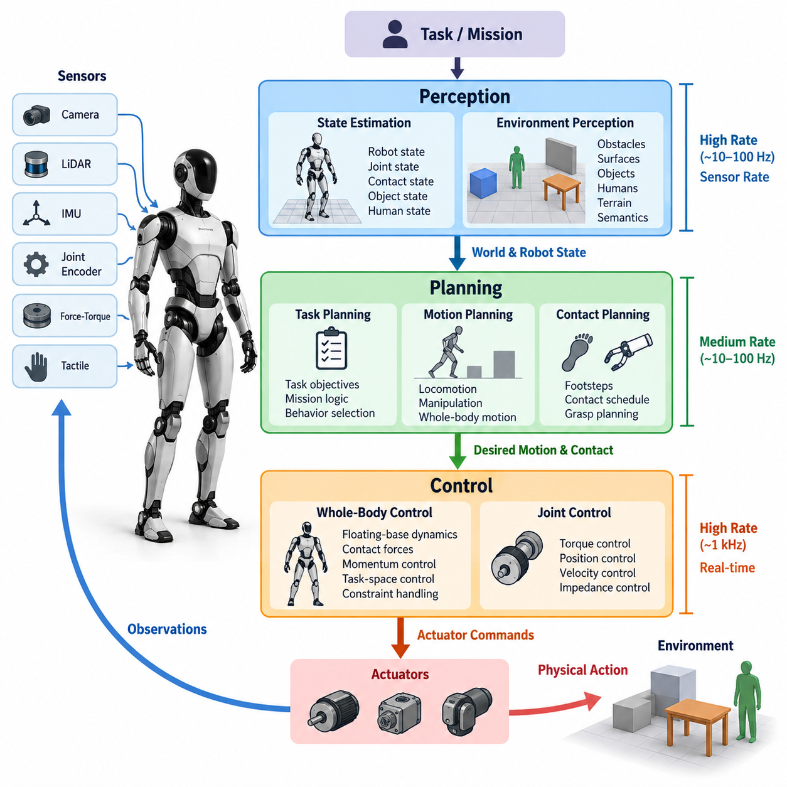
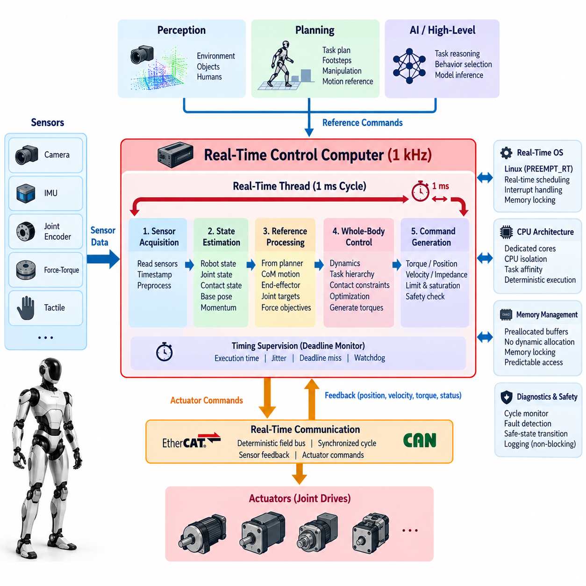
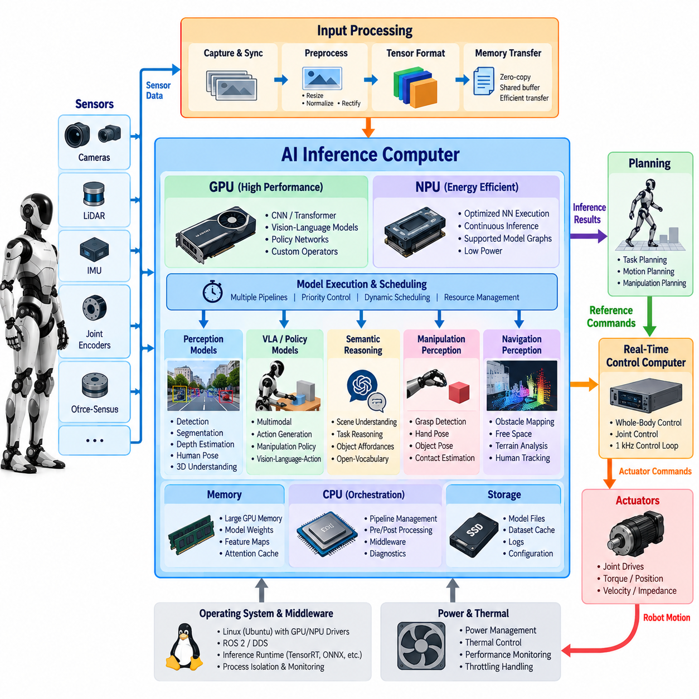
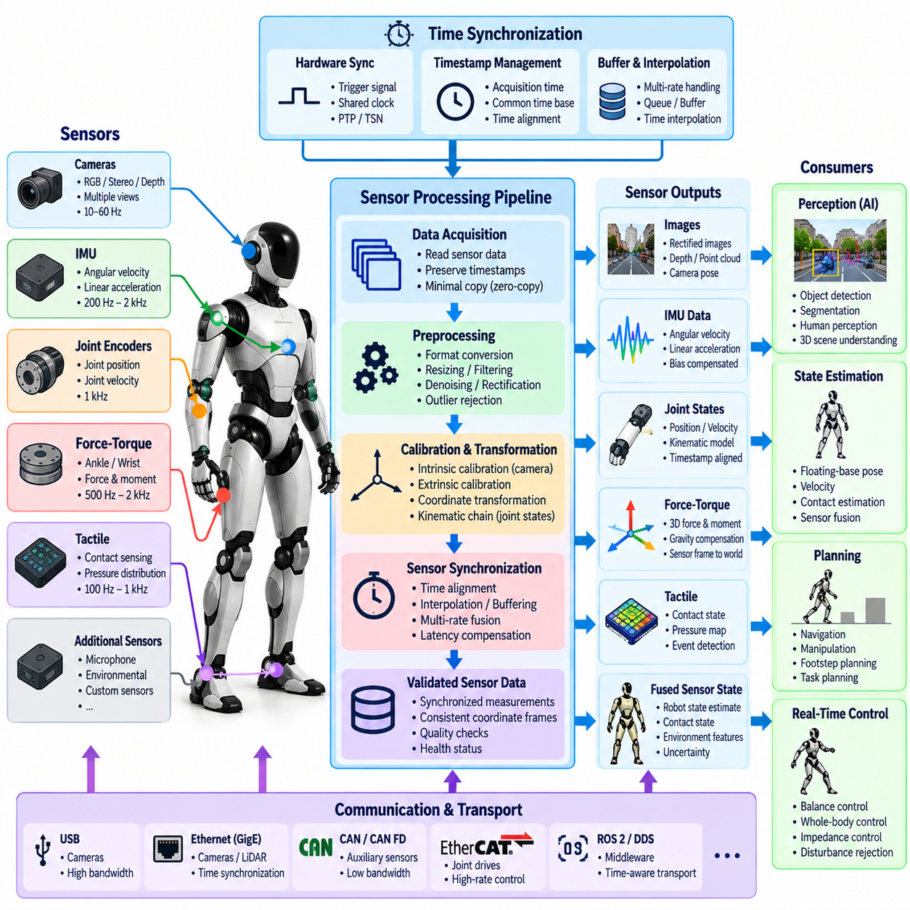
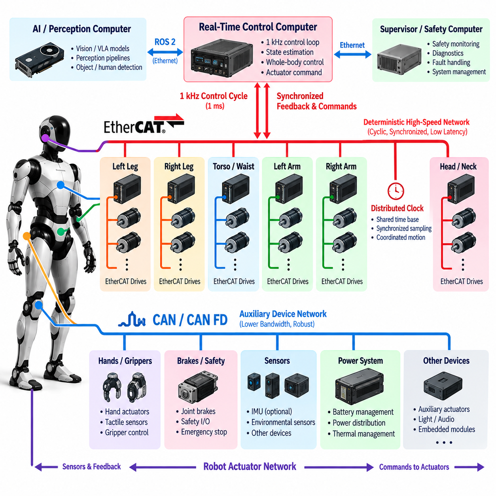
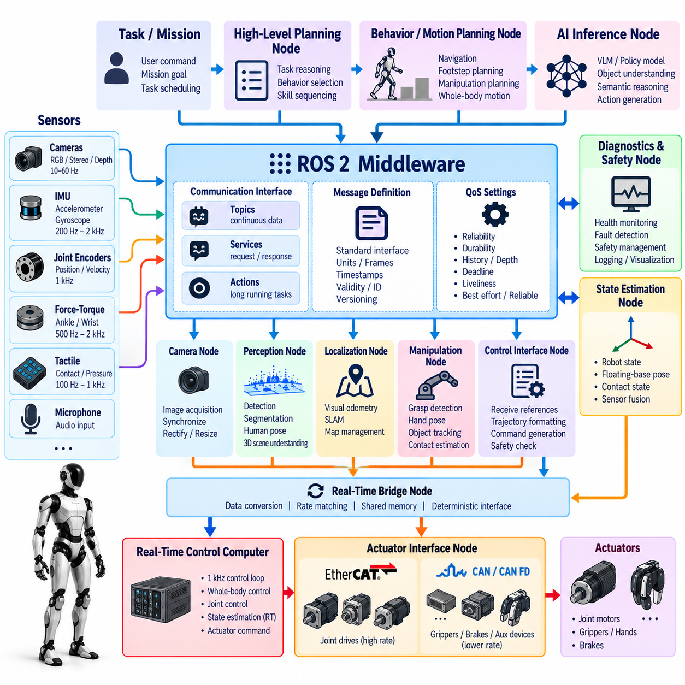
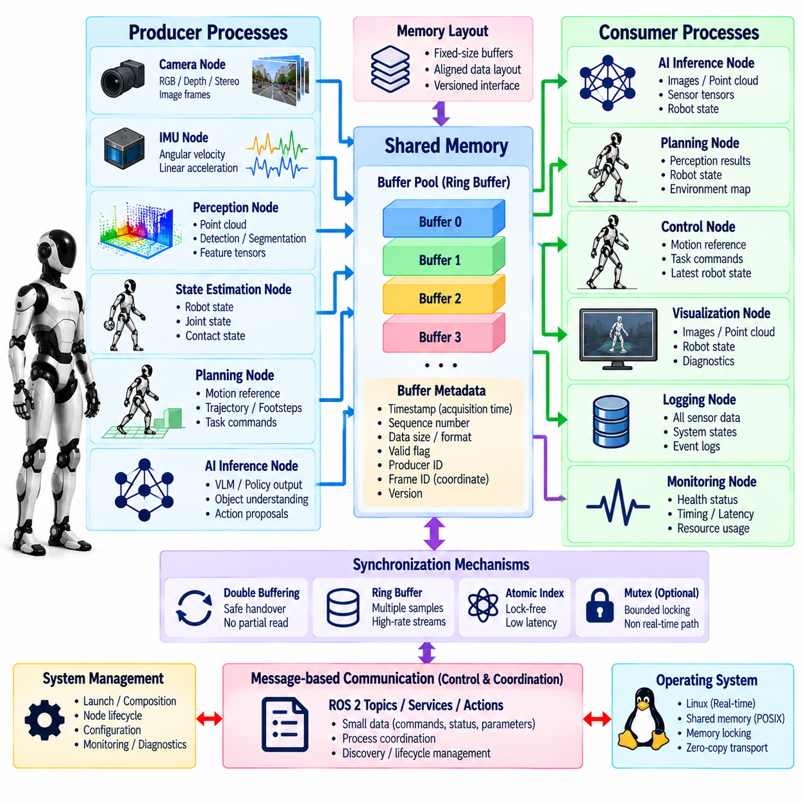
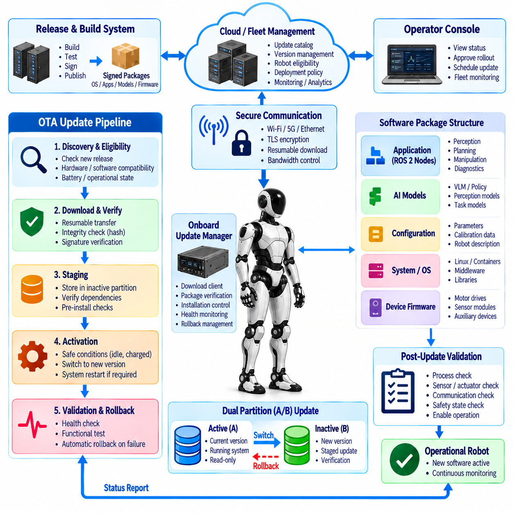
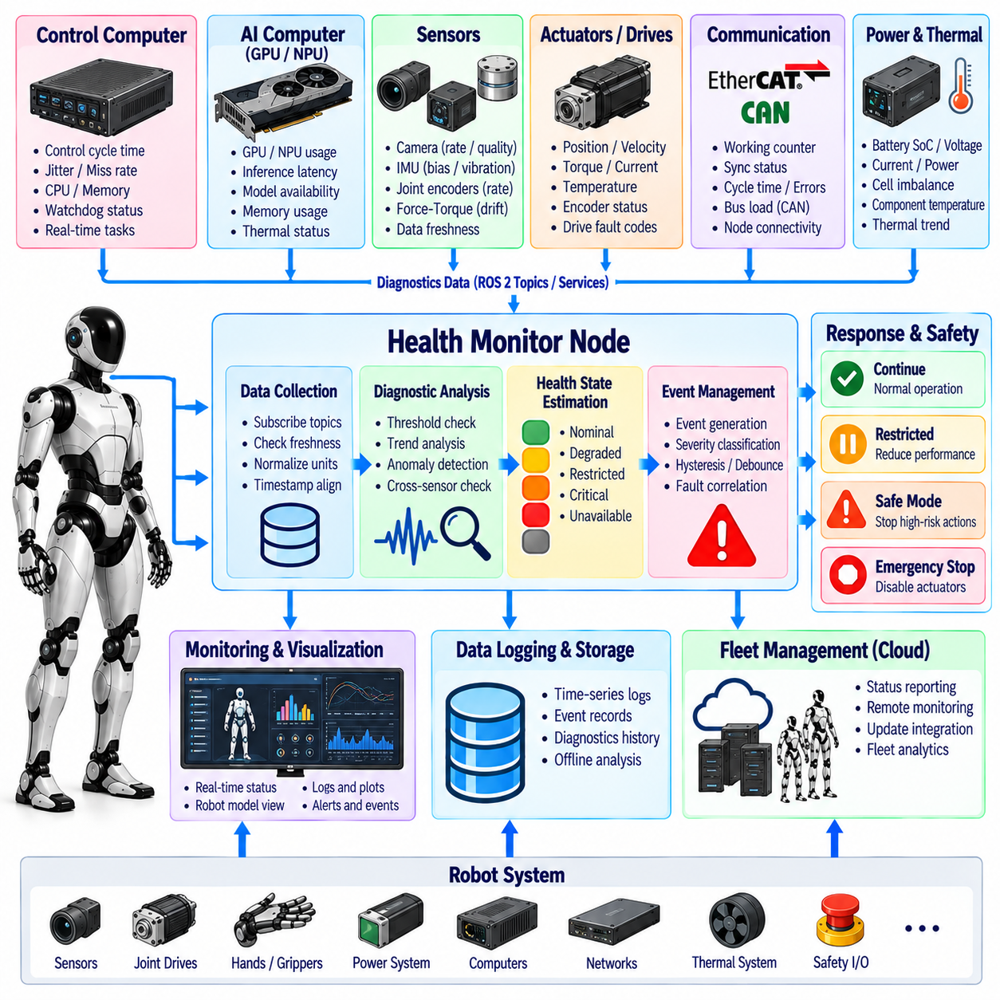
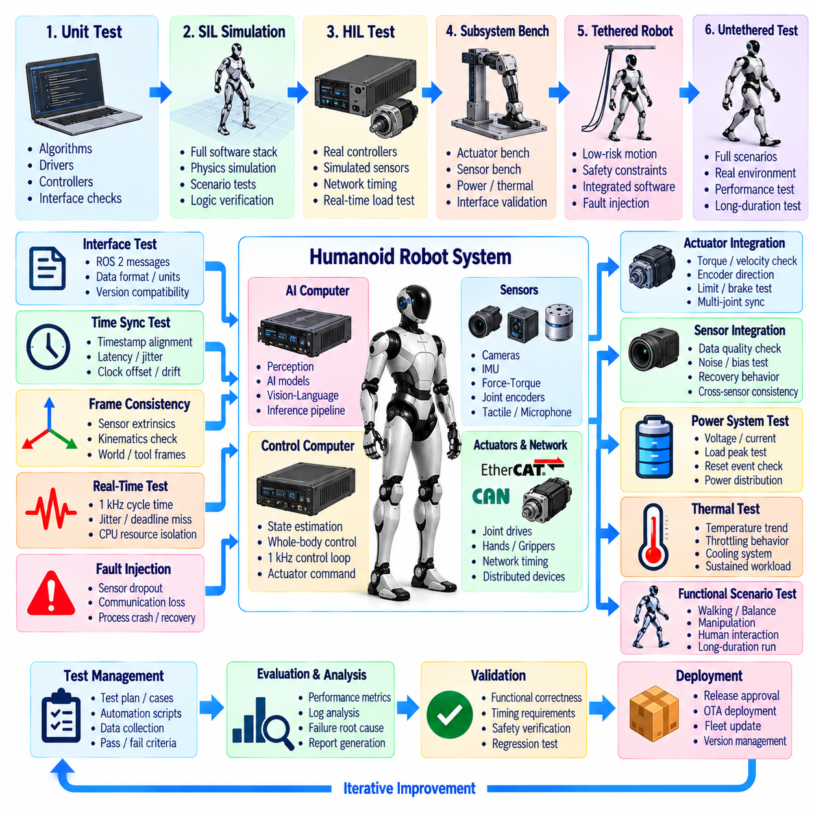

**Volume 22. Humanoid Robot Software**

# Chapter 02. Humanoid System Architecture

## 02.01. Humanoid SW Stack Overview Perception Plan Control

{width="7.268055555555556in" height="7.268055555555556in"}

휴머노이드 소프트웨어 스택(Humanoid Software Stack)은 인지(Perception), 계획(Planning), 제어(Control)를 서로 분리된 세 개의 기능 블록으로 다루는 것이 아니라 연속적인 폐루프 시스템(Closed-Loop System)으로 조정해야 한다. 인지는 다양한 센서 관측값을 로봇, 객체, 사람, 접촉 상태 및 주변 기하 구조에 대한 추정값으로 변환한다. 계획은 이러한 추정값과 작업 목표를 실행 가능한 행동으로 변환하며, 제어는 계획된 움직임을 엄격한 물리적 제약조건 아래에서 안정적인 액추에이터 명령(Actuator Command)으로 변환한다.

이 스택은 서로 다른 기능들이 근본적으로 매우 다른 시간 척도(Time Scale)에서 동작하기 때문에 본질적으로 계층적 구조(Hierarchical Architecture)를 가진다. 상위 수준 작업 추론(Task Reasoning)은 환경이나 임무가 변경될 때만 갱신될 수 있으며, 모션 계획(Motion Planning)은 수십 헤르츠(Hz), 인지 파이프라인(Perception Pipeline)은 카메라나 라이다(LiDAR)의 프레임 속도에 따라 동작할 수 있다. 반면 하위 수준 전신 제어(Whole-Body Control)는 약 1 kHz의 결정론적 실행(Deterministic Execution)을 요구할 수 있다. 따라서 각 계층이 적절한 주기로 동작하면서도 일관된 상태 정보를 유지할 수 있도록 아키텍처를 구성해야 한다.

인지(Perception)는 카메라(Camera), 관성측정장치(IMU), 관절 인코더(Joint Encoder), 힘-토크 센서(Force-Torque Sensor), 촉각 장치(Tactile Device), 기타 고유수용성 센서(Proprioceptive Sensor)와 외수용성 센서(Exteroceptive Sensor)로부터 동기화된 관측값을 수집하는 것에서 시작한다. 원시 측정값은 부동 기저 상태(Floating-Base State), 관절 구성(Joint Configuration), 접촉 상태(Contact State), 객체 자세(Object Pose), 사람 자세(Human Pose), 자유 공간(Free Space), 지형 기하(Terrain Geometry), 의미론적 장면 정보(Semantic Scene Information) 등의 표현으로 변환된다. 휴머노이드 인지는 기계적으로 안정된 센서 플랫폼이 아니라 지속적으로 움직이는 다관절 신체에서 센싱이 이루어진다는 점에서 특히 어렵다.

상태 추정(State Estimation)은 센싱(Sensing)과 물리적 제어(Physical Control)를 연결하는 핵심적인 가교 역할을 한다. 특히 보행, 충격, 조작 또는 일시적인 시각 정보 저하 상황에서는 제어기가 잡음이 포함된 개별 센서 측정값에 직접 의존할 수 없다. 대신 관성 측정값, 운동학(Kinematics), 접촉 정보 및 환경 관측값을 융합하여 동역학적으로 일관된 로봇 상태를 추정한다. 이렇게 추정된 상태는 보행(Locomotion), 균형(Balance), 조작(Manipulation), 안전(Safety) 기능에서 공통으로 사용하는 물리적 기준이 된다.

환경 인지(Environmental Perception)는 로봇 주변에 무엇이 존재하며 그것이 가능한 행동과 어떤 관계를 가지는지를 설명하는 두 번째 표현을 제공한다. 시각 및 기하학적 파이프라인(Visual and Geometric Pipeline)은 장애물, 표면, 사람, 조작 가능한 객체, 계단, 지지 영역 및 상호작용 대상을 식별한다. 의미론적 인지(Semantic Perception)는 객체를 잡을 수 있는지 또는 특정 표면에 발을 디딜 수 있는지와 같은 기능적 속성을 추가로 분류할 수 있으며, 이를 통해 계획 계층은 단순한 원시 기하 정보가 아니라 행동 가능한 표현(Actionable Representation)을 기반으로 동작할 수 있다.

계획(Planning)은 해석된 세계 상태(World State)와 실행 가능한 물리적 움직임 사이의 중간 계층을 담당한다. 작업 계획기(Task Planner)는 휴머노이드가 무엇을 수행해야 하는지를 결정하고, 행동 계획기(Behavior Planner)와 모션 계획기(Motion Planner)는 내비게이션(Navigation), 보행, 뻗기(Reaching), 파지(Grasping), 조작 또는 협조된 전신 동작을 통해 목표를 어떻게 달성할지를 결정한다. 이러한 계층 구조는 상징적 작업 추론(Symbolic Task Reasoning)이 개별 관절과 직접 결합되는 것을 방지하며, 동일한 작업 표현을 서로 다른 물리적 전략을 통해 실행할 수 있게 한다.

휴머노이드의 모션 계획(Motion Planning)은 전체 다관절 신체(Articulated Body)를 고려해야 한다. 객체에 손을 뻗는 것과 같은 단순해 보이는 명령도 발 위치 변경, 질량중심(Center of Mass) 이동, 몸통 회전, 양팔 이동, 시야 확보 및 충돌 없는 자세 유지가 동시에 필요할 수 있다. 따라서 계획은 운동학적 도달 가능성(Kinematic Reachability), 관절 한계(Joint Limit), 자기 충돌(Self-Collision), 환경 장애물, 접촉 가능성(Contact Feasibility), 균형 요구조건 및 액추에이터 성능을 동시에 고려해야 한다.

보행 계획(Locomotion Planning)은 추가적인 접촉 결정(Contact Decision)을 요구한다. 소프트웨어는 발이 환경의 어디에 언제 접촉해야 하는지를 결정하고, 각 접촉 사이에서 동역학적으로 실행 가능한 신체 움직임을 생성해야 한다. 발걸음 계획(Footstep Plan), 질량중심 기준(CoM Reference), 스윙 궤적(Swing Trajectory), 접촉 스케줄(Contact Schedule), 균형 목표(Balance Objective)는 서로 연결된 모션 표현(Motion Representation)의 구성요소가 된다. 이러한 출력은 하위 제어기가 외란(Disturbance)과 상태 추정 오차에 대응하면서 추종할 수 있는 구조화된 기준값을 제공한다.

조작(Manipulation)은 객체 자세(Object Pose), 파지 구성(Grasp Configuration), 팔 궤적(Arm Trajectory), 손 상태(Hand State), 예상 접촉력(Expected Contact Force)을 서로 조정해야 하는 또 다른 계획 경로를 추가한다. 휴머노이드에서는 작업 공간을 확장하거나 반력(Reaction Force)을 보상하기 위해 신체 전체가 움직여야 할 수 있으므로 조작을 보행과 항상 분리할 수는 없다. 따라서 고급 시스템에서는 보행과 조작을 독립적인 팔과 다리 서브시스템(Subsystem)으로 취급하기보다 결합된 전신 행동(Whole-Body Behavior)으로 표현하는 방향으로 발전하고 있다.

제어 계층(Control Layer)은 이러한 목표 행동을 물리적으로 실현 가능한 명령으로 변환한다. 전신 제어(Whole-Body Control)는 부동 기저 동역학(Floating-Base Dynamics), 관절 움직임, 접촉력(Contact Force), 운동량(Momentum), 작업 공간 목표(Task-Space Objective)를 조정하면서 토크(Torque), 마찰(Friction), 접촉 및 관절 제약조건을 만족시킨다. 이후 하위 수준 관절 제어기(Joint Controller)는 액추에이터 아키텍처에 따라 토크, 위치, 속도 또는 임피던스(Impedance)를 제어한다. 이러한 계층적 구성은 상위 소프트웨어가 모터 수준의 동역학을 직접 관리하지 않고도 물리적 목표를 표현할 수 있게 한다.

실시간 실행(Real-Time Execution)은 중요한 아키텍처 경계(Architectural Boundary)를 형성한다. 계산량이 많은 인지 및 인공지능 추론(AI Inference)은 GPU 또는 NPU 자원에서 비동기적으로 실행될 수 있지만, 균형 제어와 액추에이터 제어는 가변적인 추론 지연시간을 기다릴 수 없다. 따라서 시스템은 최선형 인공지능 연산(Best-Effort AI Computation)과 결정론적 제어 연산(Deterministic Control Computation) 사이에 명확한 인터페이스를 구성해야 한다. 타임스탬프(Timestamp), 버퍼링(Buffering), 공유 상태 표현(Shared State Representation), 제한된 통신 지연시간(Bounded Communication Latency), 오래된 정보(Stale Information)의 안정적인 처리는 기본적인 아키텍처 요구사항이다.

인지, 계획 및 제어 사이의 통신은 시간 정보뿐만 아니라 의미론적 의미(Semantic Meaning)도 보존해야 한다. 모든 내부 변수를 시스템 전체에 노출하는 대신 모듈들은 추정 로봇 상태, 추적 객체(Tracked Object), 접촉 계획(Contact Plan), 궤적(Trajectory), 작업 명령(Task Command), 제어기 상태(Controller Status)와 같이 명확하게 정의된 표현을 교환한다. ROS 2와 같은 미들웨어(Middleware)는 모듈화된 통신을 지원할 수 있으며, 지연시간에 민감한 제어 경로에는 최적화된 프로세스 간 통신(Inter-Process Communication)이나 공유 메모리(Shared Memory) 방식이 필요할 수 있다.

피드백(Feedback)은 전체 아키텍처를 폐루프(Closed Loop)로 완성한다. 제어 동작은 로봇의 자세와 환경 접촉 상태를 변화시키며, 이는 새로운 센서 관측값을 발생시켜 추정 상태를 변경하고 이전 계획을 무효화할 수도 있다. 따라서 인지는 지속적으로 계획 정보를 갱신해야 하며, 제어기는 추종 성능(Tracking Quality), 접촉 변화, 포화(Saturation), 불안정성 및 고장 정보를 상위 계층에 전달해야 한다. 계획 계층은 이전에 생성한 움직임이 계속 유효하다고 가정하는 대신 궤적을 수정하거나 다른 행동을 선택하고 필요하면 복구(Recovery)를 요청해야 한다.

안전(Safety)은 마지막에 추가되는 단순한 소프트웨어 래퍼(Software Wrapper)가 아니라 세 계층 전체를 관통해야 한다. 인지는 장애물, 사람, 접촉 및 이상 상태(Anomaly)에 관한 정보를 제공하고, 계획은 안전하지 않거나 실행 불가능한 행동을 제거하며, 제어는 물리적 한계와 안정성 제약조건을 강제한다. 필요한 경우 독립적인 감시 기능(Independent Monitoring)이 정상 명령을 재정의할 수 있어야 한다. 특히 학습 정책(Learned Policy)이나 인공지능이 생성한 행동은 의미론적으로 타당하더라도 동역학적으로 실행 가능하거나 물리적으로 안전하다는 보장이 없기 때문에 이러한 분리가 중요하다.

따라서 실제 운용을 위한 휴머노이드 시스템(Production Humanoid System)은 로봇과 세계 상태에 대한 공유 표현을 유지하면서 지능 기능을 책임에 따라 분리하는 구조가 적합하다. 인지는 로봇이 현재 무엇을 관측하고 어떤 상태로 추정하는지에 답하고, 계획은 다음에 어떤 물리적 행동을 수행해야 하는지를 결정하며, 제어는 해당 행동을 동역학과 접촉 제약조건 안에서 어떻게 실행할지를 결정한다. 진단(Diagnostics)과 상태 감시(Health Monitoring)는 이러한 기능 경로를 둘러싸면서 센서, 연산 장치, 네트워크 또는 액추에이터의 성능 저하가 위험한 움직임으로 전파되기 전에 이를 감지한다.

이러한 아키텍처는 학습 기반 구성요소(Learning-Based Component)를 통합하기 위한 자연스러운 접점도 제공한다. 신경망 인지 모델(Neural Perception Model)은 기존 탐지기를 대체하거나 보완할 수 있고, 학습 기반 보행 정책(Learned Locomotion Policy)은 행동을 제안할 수 있으며, 비전-언어-행동 시스템(Vision-Language-Action System)은 작업 조건에 따른 행동을 생성할 수 있다. 그러나 학습 기반 모듈 역시 명시적인 상태, 명령, 제약조건 및 안전 인터페이스를 통해 상호작용해야 한다. 이를 통해 인공지능 모델이 변경될 때마다 결정론적 제어 계층과 하드웨어 계층을 다시 설계하지 않고도 AI 기능을 지속적으로 발전시킬 수 있다.

결과적으로 휴머노이드 소프트웨어 스택(Humanoid Software Stack)은 다중 주기 폐루프 계층 구조(Multi-Rate Closed-Loop Hierarchy)로 이해하는 것이 가장 적절하다. 센서는 인지와 상태 추정에 정보를 제공하고, 해석된 상태는 작업 및 모션 계획으로 전달되며, 계획 결과는 전신 제어의 기준값이 되고, 제어기는 액추에이터 명령을 생성하며, 물리적 실행 결과는 다시 새로운 관측값으로 돌아온다. 이 폐루프를 둘러싸고 시간 동기화(Time Synchronization), 통신(Communication), 진단(Diagnostics), 안전(Safety), 연산 관리(Computation Management)가 안정적인 운용을 위한 기반을 제공한다. 이러한 구조는 이후 다루게 될 실시간 제어 컴퓨터(Real-Time Control Computer), AI 추론 하드웨어(AI Inference Hardware), 센서 통합(Sensor Integration), 액추에이터 네트워크(Actuator Network), ROS 2, 프로세스 간 통신(IPC), 무선 업데이트(OTA), 시스템 진단(System Diagnostics), 시스템 수준 통합 시험(System-Level Integration Testing)으로 자연스럽게 연결된다.

## 02.02. Real Time Control Computer Architecture 1kHz [w/Code]

{width="7.268055555555556in" height="7.268055555555556in"}

실시간 제어 컴퓨터(Real-Time Control Computer)는 휴머노이드 로봇의 결정론적 연산 핵심부(Deterministic Computational Core)로서, 엄격하게 제한된 시간 제약조건 안에서 균형(Balance), 전신 제어(Whole-Body Control), 관절 협조(Joint Coordination), 액추에이터 명령(Actuator Command)을 실행한다. 일반적인 1 kHz 제어 주파수에서는 하나의 제어 주기(Control Cycle)에 1 ms가 주어지며, 이 시간 안에 센서 획득, 상태 갱신, 제어 연산, 명령 전송 및 타이밍 감시가 완료되어야 한다. 이러한 요구조건은 실시간 제어 컴퓨터를 상위 수준의 AI 및 인지 컴퓨터(Perception Computer)와 구별하는 핵심적인 특징이다.

1 kHz 주기는 단순한 평균 실행 주파수가 아니라 실시간 마감시간(Real-Time Deadline)으로 이해해야 한다. 초당 1,000회의 반복 연산을 수행하더라도 개별 주기가 간헐적으로 1 ms의 시간 예산(Time Budget)을 초과한다면 충분하지 않다. 과도한 지터(Jitter)나 마감시간 누락(Deadline Miss)은 지연된 피드백, 불규칙한 액추에이터 명령 및 안정성 저하를 발생시킬 수 있다. 따라서 아키텍처는 단순히 연산 처리량을 극대화하는 것이 아니라 최악 실행시간(Worst-Case Execution Time), 스케줄링 예측성, 인터럽트 동작, 메모리 접근 및 통신 지연시간을 최적화해야 한다.

일반적인 제어 주기(Control Cycle)는 최신 관절 인코더(Joint Encoder), 모터, 관성측정장치(IMU), 힘-토크 센서(Force-Torque Sensor), 접촉 센서(Contact Sensor)의 측정값을 획득하는 것에서 시작한다. 이러한 관측값에는 타임스탬프(Timestamp)가 부여되며 제어 연산이 시작되기 전에 일관된 로봇 상태로 변환된다. 이후 상태 추정(State Estimation)은 부동 기저 자세(Floating-Base Pose), 속도, 관절 상태, 접촉 조건 및 신체 운동량(Body Momentum) 등을 갱신한다. 제어기는 계산 도중 임의의 시점에서 각각의 센서를 개별적으로 읽는 대신 이렇게 동기화된 상태 스냅샷(State Snapshot)을 사용한다.

상태 획득 이후 제어 파이프라인(Control Pipeline)은 보행(Locomotion), 조작(Manipulation) 또는 모션 계획(Motion Planning) 구성요소에서 전달된 기준 명령(Reference Command)을 평가한다. 목표 질량중심(Center of Mass) 움직임, 신체 방향, 발 접촉, 말단장치 자세(End-Effector Pose), 관절 기준값 및 힘 목표 등이 통제된 인터페이스를 통해 실시간 영역(Real-Time Domain)으로 전달될 수 있다. 비동기적으로 생성된 기준값은 버퍼링(Buffering)되어야 하며, 이를 통해 1 kHz 스레드(Thread)가 계획기, 인지 모델, 네트워크 서비스 또는 AI 추론 프로세스를 기다리면서 차단(Block)되는 것을 방지해야 한다.

전신 제어(Whole-Body Control)는 일반적으로 실시간 루프 내부에서 계산량이 가장 많은 연산 중 하나이다. 전신 제어기는 강체 동역학(Rigid-Body Dynamics), 자코비안(Jacobian), 접촉 제약조건(Contact Constraint), 운동량 목표(Momentum Objective), 작업 계층(Task Hierarchy), 최적화 문제(Optimization Problem)를 계산한 후 목표 관절 토크 또는 가속도를 생성할 수 있다. 로봇의 접촉 구성이 변경되거나 양손 조작(Bimanual Manipulation)을 수행하거나 정지 상태와 보행 상태 사이를 전환하는 경우에도 계산시간은 제한된 범위 안에 유지되어야 한다. 제어 복잡도의 증가로 인해 예측할 수 없는 제어 주기 초과가 발생해서는 안 된다.

액추에이터 명령 단계(Actuator Command Stage)는 제어기의 출력을 관절 구동기(Joint Drive)가 받아들일 수 있는 표현으로 변환한다. 휴머노이드 플랫폼에 따라 목표 토크, 위치, 속도, 임피던스 파라미터(Impedance Parameter) 또는 이들의 조합이 사용될 수 있다. 명령을 전송하기 전에 관절 위치, 속도, 토크, 온도 및 전력 제한조건을 확인해야 한다. 포화(Saturation)는 명시적으로 관리되어야 하는데, 통제되지 않은 클리핑(Clipping)은 전신 제어기가 전제로 한 조건을 무효화하고 예상하지 못한 동역학적 반응을 발생시킬 수 있기 때문이다.

따라서 실시간 통신(Real-Time Communication)은 외부 네트워크 문제가 아니라 제어 아키텍처 자체의 일부이다. 이더캣(EtherCAT)과 같은 결정론적 필드버스(Deterministic Fieldbus)는 제어 컴퓨터와 분산형 서보 드라이브(Distributed Servo Drive)를 연결할 수 있으며, CAN 기반 네트워크는 상대적으로 낮은 대역폭을 요구하는 장치나 보조 서브시스템에 사용할 수 있다. 통신 스케줄링은 센서 피드백이 제어 연산에 충분히 일찍 도착하고 액추에이터 명령이 다음 서보 갱신 이전에 드라이브에 전달되도록 보장해야 하므로, 네트워크 주기 설계(Network Cycle Design)는 1 kHz 연산 스케줄과 분리할 수 없다.

운영체제(Operating System)는 핵심 제어 스레드(Critical Control Thread)에 예측 가능한 스케줄링 동작을 제공해야 한다. 일반적으로 PREEMPT_RT 또는 이에 상응하는 메커니즘을 사용하는 실시간 리눅스(Real-Time Linux)는 범용 운영환경의 유연성을 유지하면서 스케줄링 및 인터럽트 지연시간을 줄일 수 있다. 핵심 스레드에는 적절한 실시간 우선순위(Real-Time Priority)를 부여해야 하며, 로깅(Logging), 시각화(Visualization), 모델 로딩(Model Loading), 파일 작업 또는 네트워크 서비스와 같은 비핵심 프로세스가 시간에 민감한 제어 실행을 선점해서는 안 된다.

CPU 아키텍처와 작업 할당(Task Allocation) 역시 결정론성(Determinism)에 영향을 준다. 전용 프로세서 코어(Dedicated Processor Core)를 제어, 통신 및 선택된 실시간 지원 기능에 할당함으로써 관련 없는 작업의 간섭을 줄일 수 있다. CPU 친화도(CPU Affinity), 인터럽트 친화도(Interrupt Affinity), 코어 격리(Core Isolation) 메커니즘은 핵심 코어에서 스케줄러에 의한 작업 이동과 과도한 인터럽트 처리를 방지할 수 있다. 목표는 반드시 프로세서 사용률을 최대화하는 것이 아니라 로봇에서 예상되는 최악의 운용 조건에서도 충분한 타이밍 여유(Timing Margin)를 유지하는 것이다.

동적 메모리 할당(Dynamic Memory Allocation)은 할당, 해제, 페이징(Paging) 및 예측하기 어려운 메모리 관리 동작이 지연시간 변동을 발생시킬 수 있으므로 하드 실시간 경로(Hard Real-Time Path) 내부에서는 최소화하거나 제거해야 한다. 대신 제어 데이터 구조는 초기화 과정에서 미리 할당(Preallocation)할 수 있으며, 메모리 잠금(Memory Locking)을 사용하여 중요한 메모리 페이지가 스왑(Swap)되는 것을 방지할 수 있다. 고정 크기 버퍼(Fixed-Size Buffer), 제한된 큐(Bounded Queue), 예측 가능한 데이터 구조는 실행 동작을 분석하기 쉽게 만들고 장시간 운용 중 발생할 수 있는 숨겨진 지터 원인을 줄인다.

스레드 사이의 동기화(Thread Synchronization)에도 동일한 수준의 엄격한 설계가 필요하다. 일반적인 뮤텍스(Mutex)를 잘못 사용하면 우선순위 역전(Priority Inversion)이나 제한되지 않은 대기시간이 발생할 수 있다. 따라서 실시간 아키텍처에서는 짧고 제한된 임계구역(Bounded Critical Section), 필요한 경우 잠금 없는 데이터 교환(Lock-Free Data Exchange)이나 대기 없는 데이터 교환(Wait-Free Data Exchange), 이중 버퍼링(Double Buffering), 단일 생산자-단일 소비자 큐(Single-Producer/Single-Consumer Queue)를 선호한다. 일반적으로 제어 스레드는 느린 생산자를 기다리지 않고 가장 최신의 유효 데이터를 사용함으로써 다른 서브시스템에 일시적인 과부하가 발생해도 결정론적 실행을 유지해야 한다.

실시간 컴퓨터(Real-Time Computer)와 AI 추론 컴퓨터(AI Inference Computer) 사이의 경계는 현대 휴머노이드 시스템에서 특히 중요하다. GPU 또는 NPU 기반 인지, 비전-언어-행동(Vision-Language-Action, VLA) 모델, 학습 정책(Learned Policy), 의미론적 추론(Semantic Reasoning)은 유용한 명령을 제공할 수 있지만 실행시간은 상당히 변할 수 있다. 따라서 이러한 출력은 비동기 기준값(Asynchronous Reference)이나 정책 갱신(Policy Update)으로 취급해야 한다. 지연된 AI 결과가 균형 제어기를 정지시켜서는 안 되며, 실시간 계층은 마지막으로 유효했던 기준값, 안전한 대체 행동(Safe Fallback Behavior) 또는 통제된 상태 전환을 사용하여 계속 동작해야 한다.

다중 주기 실행(Multi-Rate Execution)은 연산 구조를 더욱 효율적으로 구성할 수 있게 한다. 액추에이터 제어기가 1 kHz로 동작한다고 해서 모든 알고리즘이 반드시 1 kHz로 실행될 필요는 없다. 관절 서보 제어(Joint Servo Control)와 전신 안정화(Whole-Body Stabilization)는 가장 높은 주파수에서 실행할 수 있지만, 상태 추정의 일부 구성요소, 궤적 갱신, 진단, 열 관리(Thermal Management), 감독 기능(Supervisory Function)은 더 낮은 주파수에서 동작할 수 있다. 명확한 주기 분리는 불필요한 계산이 중요한 1 ms 시간 예산을 소비하는 것을 방지하면서 빠른 루프와 느린 루프 사이의 일관된 데이터 교환을 유지한다.

타이밍 계측(Timing Instrumentation)은 디버깅 과정에서만 추가되는 기능이 아니라 소프트웨어 자체에 통합되어야 한다. 각각의 제어 주기는 기상 지연시간(Wake-Up Latency), 센서 획득 시간, 상태 추정기 실행시간, 제어기 연산시간, 통신시간, 전체 주기시간 및 마감시간 상태를 기록할 수 있다. 통계적 평균도 유용하지만 시스템이 실시간 동작을 안전하게 지속할 수 있는지를 평가하려면 최대 지연시간(Maximum Latency), 상위 백분위 실행시간(High-Percentile Execution Time), 지터 분포(Jitter Distribution), 연속적인 마감시간 누락이 더욱 중요하다.

감시 타이머 메커니즘(Watchdog Mechanism)은 추가적인 보호 계층을 제공한다. 하드웨어 감시 타이머(Hardware Watchdog) 또는 독립적인 소프트웨어 감시 기능은 제어 실행 정지, 통신 주기 누락, 손상된 상태 갱신 또는 반복적인 마감시간 위반을 감지할 수 있다. 심각도에 따라 이전 명령을 짧은 시간 유지하거나, 안정적인 자세로 전환하거나, 액추에이터 출력을 제한하거나, 특정 관절을 비활성화하거나, 비상 정지(Emergency Stop)를 수행할 수 있다. 고장 처리는 정상적인 연산 조건이 이미 무너진 상황에서 수행될 수 있으므로 대응 전략 자체도 결정론적이어야 한다.

시작 및 종료 과정(Startup and Shutdown)에도 명시적인 실시간 상태 관리(Real-Time State Management)가 필요하다. 소프트웨어 프로세스가 시작되었다고 해서 시스템이 즉시 전체 액추에이터 토크를 활성화해서는 안 된다. 일반적으로 초기화 과정에서는 통신, 센서 유효성, 시간 동기화(Time Synchronization), 로봇 구성, 액추에이터 상태 및 제어기 준비 상태를 확인한 후 능동 제어(Active Control) 상태로 진입한다. 종료 과정 역시 액추에이터가 활성화된 상태에서 프로세스를 갑자기 종료하는 것이 아니라 명령을 단계적으로 감소시키고 로봇을 정의된 안전 상태(Safe State)로 전환하는 통제된 절차를 따라야 한다.

따라서 실용적인 휴머노이드 아키텍처는 중요도(Criticality)에 따라 연산 영역(Computational Domain)을 분리한다. 실시간 제어 컴퓨터는 동기화된 로봇 상태에서 액추에이터 명령으로 이어지는 결정론적 경로를 담당하며, 상위 수준 컴퓨터는 인지, 계획, 학습, 시각화 및 의미론적 추론을 담당한다. 이러한 영역 사이의 통신은 제한되고 명확하게 정의된 인터페이스를 통해 이루어진다. 이러한 분리는 계산시간이 가변적인 작업이 물리적 안정화를 방해하는 것을 제한하면서 정교한 AI 기능을 독립적으로 발전시킬 수 있게 한다.

1 kHz 아키텍처의 검증(Validation)은 개발 컴퓨터에서 부하가 없는 제어 루프를 단순히 실행하는 것이 아니라 현실적인 최악 조건의 부하(Worst-Case Load)에서 시스템의 동작을 측정해야 한다. 시험에서는 액추에이터 통신, 상태 추정, 전신 제어 연산, 로깅, 네트워크 트래픽, 센서 인터럽트 및 백그라운드 프로세스를 동시에 실행하면서 마감시간 성능을 기록해야 한다. 특히 장시간 스트레스 시험(Long-Duration Stress Test)은 열 스로틀링(Thermal Throttling), 자원 경합(Resource Contention), 메모리 동작 및 드물게 발생하는 스케줄링 이벤트로 인해 짧은 실험실 시험에서는 발견되지 않는 타이밍 문제가 나타날 수 있기 때문에 중요하다.

결과적으로 실시간 아키텍처(Real-Time Architecture)는 단순한 프로세서의 연산 성능보다 제한된 지연시간(Bounded Latency), 결정론적 통신(Deterministic Communication), 통제된 자원 소유권(Resource Ownership), 예측 가능한 고장 대응(Predictable Failure Behavior)에 의해 정의된다. 성공적인 1 kHz 휴머노이드 제어 컴퓨터는 센싱, 상태 추정, 전신 제어 연산, 안전 검사 및 액추에이터 출력을 1 ms의 마감시간 안에서 반복적으로 완료하면서 충분한 타이밍 여유를 유지해야 한다. 이러한 결정론적 기반은 상대적으로 느린 인지, 계획 및 AI 계층이 휴머노이드의 물리적 안정성을 직접적으로 훼손하지 않으면서 민첩하고 복잡한 행동을 명령할 수 있도록 한다.

## 02.03. AI Inference Computer Architecture GPU NPU [w/Code]

{width="7.268055555555556in" height="7.268055555555556in"}

AI 추론 컴퓨터(AI Inference Computer)는 휴머노이드 로봇에서 인지(Perception), 학습 정책(Learned Policy), 비전-언어-행동 모델(Vision-Language-Action Model), 의미론적 추론(Semantic Reasoning), 기타 신경망 연산(Neural Workload)에 필요한 높은 처리량의 연산 영역을 제공한다. 실시간 제어 컴퓨터(Real-Time Control Computer)와 달리 주요 목표는 결정론적인 1 kHz 실행이 아니라 응용 수준에서 제한된 지연시간을 유지하면서 대규모 텐서 연산(Tensor Operation)을 효율적으로 처리하는 것이다. 따라서 GPU와 NPU 가속기는 결정론적 제어 프로세서를 대체하는 것이 아니라 상호 보완한다.

아키텍처는 AI 연산을 작업 부하 특성(Workload Characteristic)에 따라 분리해야 한다. GPU는 높은 프로그래밍 유연성을 가진 병렬 연산(Parallel Computing)을 제공하며 합성곱 신경망(Convolutional Neural Network), 트랜스포머(Transformer), 비전 인코더(Vision Encoder), 멀티모달 모델(Multimodal Model), 정책 신경망(Policy Network), 사용자 정의 CUDA 계열 연산에 적합하다. NPU는 지원되는 신경망 연산의 에너지 효율적인 실행에 중점을 두며, 모델 그래프(Model Graph), 수치 정밀도(Numerical Precision), 연산자 집합(Operator Set)이 가속기와 호환되는 경우 지속적으로 실행되는 추론 작업을 효율적으로 처리할 수 있다.

휴머노이드 인지(Humanoid Perception)는 여러 카메라와 기타 센서가 로봇 자체가 움직이는 동안 동적인 환경을 지속적으로 관찰하기 때문에 특히 높은 AI 연산 부하를 발생시킨다. 객체 감지(Object Detection), 분할(Segmentation), 깊이 추정(Depth Estimation), 사람 자세 추정(Human Pose Estimation), 시각 추적(Visual Tracking), 개방형 어휘 인식(Open-Vocabulary Recognition), 3차원 장면 이해(3D Scene Understanding)가 동시에 동작할 수 있다. 따라서 추론 컴퓨터는 하나의 신경망에 대한 최대 성능만을 기준으로 설계하는 것이 아니라 여러 파이프라인의 동시 실행을 지원해야 한다.

입력 처리(Input Processing)는 신경망 자체가 실행되기 전부터 시작된다. 카메라 프레임에는 캡처(Capture), 동기화(Synchronization), 색상 변환(Color Conversion), 크기 조정(Resizing), 정규화(Normalization), 보정(Rectification), 자르기(Cropping), 텐서 형식 변환(Tensor Formatting) 등이 필요할 수 있다. 효율적인 아키텍처는 센서 인터페이스에서 가속기가 접근할 수 있는 메모리로 데이터를 이동할 때 불필요한 복사를 최소화한다. 하드웨어 기반 영상 처리와 무복사(Zero-Copy) 또는 공유 버퍼(Shared Buffer) 방식은 CPU 사용률과 메모리 대역폭 소비를 감소시킬 수 있으며, 카메라 수와 해상도가 증가할수록 그 중요성이 커진다.

GPU 메모리 용량은 단순한 연산 처리량만큼 중요하다. 모델 가중치(Model Weight), 중간 활성값(Intermediate Activation), 이미지 텐서(Image Tensor), 어텐션 캐시(Attention Cache), 특징 맵(Feature Map), 임시 실행 작업 공간(Execution Workspace)이 가속기 메모리를 공유한다. 대규모 멀티모달 모델이나 비전-언어-행동(VLA) 모델은 기존 인지 신경망보다 훨씬 많은 메모리를 사용할 수 있다. 따라서 시스템은 각각의 모델이 독립적인 벤치마크에서 전체 GPU 메모리를 사용할 수 있다고 가정하지 말고 동시 실행 시 필요한 전체 메모리 요구량을 평가해야 한다.

모델 실행은 서로 다른 우선순위와 갱신 주기를 가진 여러 서비스 또는 추론 파이프라인(Inference Pipeline)으로 구성할 수 있다. 빠른 장애물 또는 사람 탐지기는 높은 빈도로 실행되어야 하지만 의미론적 장면 해석(Semantic Scene Interpretation)은 상대적으로 느린 갱신을 허용할 수 있다. 손이 객체에 접근하는 동안에는 조작 인지(Manipulation Perception)의 우선순위가 높아질 수 있으며, 보행 중에는 내비게이션 관련 처리가 더 중요해질 수 있다. 동적 스케줄링(Dynamic Scheduling)은 모든 모델을 항상 최대 주파수로 실행하는 대신 제한된 가속기 자원을 로봇의 현재 운용 상황에 맞추어 할당할 수 있게 한다.

지연시간(Latency)은 종단 간(End-to-End) 관점에서 고려해야 한다. 신경망 자체의 추론시간이 10 ms라고 하더라도 센서 캡처, 전처리(Preprocessing), 대기열(Queuing), 메모리 전송, 후처리(Postprocessing), 프로세스 간 통신(Inter-Process Communication)에서 상당한 지연이 추가되면 실제로는 훨씬 오래된 정보를 출력할 수 있다. 따라서 각각의 추론 결과에는 원본 관측값에 연결된 타임스탬프(Timestamp)를 유지해야 한다. 이후 계획 및 제어 구성요소는 해당 AI 결과가 현재의 물리적 의사결정에 사용하기에 충분히 최신 정보인지를 판단할 수 있다.

AI 지연시간은 일반적으로 가변적이므로 비동기 실행(Asynchronous Execution)이 필수적이다. GPU 커널(GPU Kernel), 메모리 전송, 여러 모델의 동시 실행, 열 상태(Thermal Condition), 입력 데이터에 따른 처리 과정은 각 주기의 완료시간을 변화시킬 수 있다. 실시간 제어 영역(Real-Time Control Domain)은 추론 결과를 기다리면서 차단되어서는 안 된다. 대신 AI 컴퓨터는 제한된 인터페이스를 통해 가장 최신의 유효 상태, 탐지 결과, 궤적 제안(Trajectory Proposal), 정책 출력(Policy Output)을 전달하고, 제어 시스템은 해당 정보가 여전히 사용할 수 있는지를 독립적으로 판단해야 한다.

휴머노이드는 GPU와 NPU 자원을 서로 배타적인 대안으로 취급하지 않고 함께 사용할 수 있다. 안정적이고 빈번하게 실행되는 신경망은 효율적인 지원이 가능하다면 NPU에 배치할 수 있으며, GPU는 대규모 트랜스포머, 빠르게 변경되는 연구용 모델 또는 높은 프로그래밍 유연성이 필요한 연산을 처리할 수 있다. CPU 코어 역시 오케스트레이션(Orchestration), 전처리, 후처리, 미들웨어(Middleware), 진단(Diagnostics), 신경망 가속기에 효율적으로 매핑되지 않는 알고리즘을 처리하는 데 중요하다.

수치 정밀도(Numerical Precision)는 배포 효율에 큰 영향을 준다. 학습에서는 일반적으로 상대적으로 높은 정밀도의 부동소수점 표현(Floating-Point Representation)을 사용하지만, 추론에서는 모델 정확도가 허용하는 경우 FP16, BF16, INT8 또는 기타 저정밀도 형식을 사용할 수 있다. 양자화(Quantization)는 메모리 사용량, 메모리 대역폭, 전력 소비 및 추론 지연시간을 감소시킬 수 있지만 작업 수준의 성능(Task-Level Performance)을 기준으로 검증해야 한다. 작은 수치적 변화도 예측 결과가 파지, 접촉 또는 보행 결정에 영향을 미치는 경우 물리적으로 중요한 차이를 발생시킬 수 있다.

최적화 엔진(Optimization Engine)은 연산자를 융합하고 효율적인 커널을 선택하며 메모리를 관리하고 저정밀도 연산을 활용하여 학습된 모델을 가속기 전용 실행 그래프(Accelerator-Specific Execution Graph)로 변환할 수 있다. 그러나 최적화 과정에서도 원본 모델과 실제 배포 결과물 사이의 재현 가능한 관계를 유지해야 한다. 모델 버전(Model Version), 런타임 버전(Runtime Version), 대상 가속기, 정밀도 설정, 보정 데이터(Calibration Data), 성능 결과를 추적하여 디버깅과 회귀 시험(Regression Testing)에서 추론 동작을 재현할 수 있어야 한다.

비전-언어-행동 모델(Vision-Language-Action Model)은 기존 인지 신경망과 다른 연산 특성을 가진다. 하나의 추론 파이프라인에서 비전 인코더, 언어 처리(Language Processing), 멀티모달 어텐션(Multimodal Attention), 행동 생성(Action Generation)을 결합할 수 있다. 이러한 모델은 서보 제어 주파수보다 훨씬 낮은 빈도로 실행되면서도 복잡한 로봇 행동에 영향을 줄 수 있다. 따라서 상대적으로 느린 의미론적 또는 행동 수준 예측을 더 빠른 모션 및 제어 계층에서 안전하게 사용할 수 있는 기준값으로 변환하는 것이 중요한 아키텍처 과제가 된다.

학습 기반 보행 정책(Learned Locomotion Policy)과 조작 정책(Manipulation Policy)은 상위 수준 의미론적 모델보다 더 엄격한 지연시간을 요구할 수 있다. 정책은 고유수용성 상태(Proprioceptive State), 시각 특징(Visual Feature), 명령 또는 상태 이력(History)을 입력으로 사용하여 관절 수준 또는 작업 공간 수준의 행동을 생성할 수 있다. 이러한 정책이 물리적 제어 경계 가까이에서 동작할 경우 아키텍처는 명확한 최대 정보 수명(Maximum Age), 타임아웃(Timeout), 대체 동작(Fallback) 조건을 정의해야 한다. 정책 출력이 지나치게 늦게 도착한 경우 물리적 상태가 이미 변화했으므로 이를 그대로 실행하는 대신 폐기해야 한다.

AI 컴퓨터와 실시간 컴퓨터 사이의 데이터 교환은 명확하게 정의된 표현을 사용해야 한다. 인지 시스템은 객체 자세(Object Pose), 사람 추적 정보(Human Track), 지형 특징(Terrain Feature), 의미 지도(Semantic Map), 잠재 특징(Latent Feature)을 전달할 수 있으며, 학습 정책은 목표 속도, 자세, 궤적 또는 행동 기준값(Action Reference)을 전달할 수 있다. 대규모 원시 텐서(Raw Tensor)는 반복적인 복사로 대역폭을 소비하고 지연시간을 증가시키므로 반드시 필요한 경우에만 컴퓨터 경계를 넘어 전달해야 한다. 인터페이스는 하위 기능에서 실제로 필요한 최소한의 정보를 제공하도록 설계하는 것이 바람직하다.

추론 컴퓨터는 제어 컴퓨터와 독립적으로 고장(Failure)을 관리할 수 있어야 한다. GPU 프로세스가 중단되거나, NPU 런타임이 모델을 거부하거나, 메모리가 고갈되거나, 추론 지연시간이 허용 범위를 초과할 수 있다. 이러한 상황에서는 물리적 안정성이 즉시 붕괴하는 대신 AI 기능이 단계적으로 저하되어야 한다. 상태 감시(Health Monitoring)는 가속기 가용성, 모델 상태, 메모리 사용량, 추론 지연시간, 누락된 프레임(Dropped Frame), 오래된 출력(Stale Output)을 보고하여 감독 소프트웨어(Supervisory Software)가 대체 기능을 선택할 수 있도록 해야 한다.

열 및 전력 제약조건(Thermal and Electrical Constraint)은 온보드 휴머노이드 연산(Onboard Humanoid Computing)에서 특히 중요하다. 높은 AI 처리량을 제공하는 가속기는 상당한 전력을 소비하고 제한된 이동형 플랫폼 내부에서 집중적으로 열을 발생시킬 수 있다. 열 제한으로 인해 주파수 스로틀링(Frequency Throttling)이 발생하면 지속적인 추론 성능은 짧은 벤치마크 결과보다 낮아질 수 있다. 따라서 연산 장치 선정에서는 와트당 성능(Performance per Watt), 냉각 용량, 배터리 지속시간, 인클로저 공기 흐름(Enclosure Airflow), 주변 온도 및 다른 전기 서브시스템의 동시 부하를 고려해야 한다.

전력 모드(Power Mode)는 로봇의 활동 상태에 따라 조정할 수 있다. 높은 수준의 시각 처리가 필요한 조작이나 복잡한 자율 운용에서는 최대 가속기 성능을 사용할 수 있지만, 대기 상태, 원격조작(Teleoperation), 단순 반복 작업에서는 저전력 모드를 사용할 수 있다. 또한 상황에 따라 필요한 모델만 선택적으로 활성화할 수 있다. 이러한 전략은 AI 연산을 항상 최대 사용률로 동작하는 단순한 가속기가 아니라 관리되는 로봇 자원(Managed Robotic Resource)으로 취급한다.

소프트웨어 격리(Software Isolation)는 인지, VLA 및 학습 정책 구성요소가 하위 수준 제어 소프트웨어보다 훨씬 빠르게 변화하기 때문에 유지보수성을 향상시킨다. 컨테이너화(Containerization)되거나 별도로 격리된 추론 서비스는 안정적인 인터페이스를 통해 통신하면서 각각의 런타임 의존성(Runtime Dependency)을 유지할 수 있다. 이를 통해 결정론적 제어기를 다시 빌드하지 않고도 모델 업데이트를 검증하고 배포할 수 있으며, 새로운 모델에서 허용할 수 없는 지연시간, 메모리 사용량 또는 행동 회귀(Behavioral Regression)가 발생하면 이전 버전으로 쉽게 롤백(Rollback)할 수 있다.

아키텍처는 모델 수준과 시스템 수준 모두에서 관측 가능성(Observability)을 지원해야 한다. 유용한 측정값에는 전처리 시간, 대기열 지연시간, 가속기 실행시간, 후처리 시간, 종단 간 지연시간, 메모리 사용량, 가속기 사용률, 온도, 전력 상태 및 출력 정보의 수명(Output Age)이 포함된다. 이러한 측정값을 통해 로봇의 성능 저하가 신경망 자체의 정확도 문제인지, 스케줄링 자원 경합(Scheduling Contention), 데이터 이동, 열 스로틀링 또는 통신 문제에서 발생한 것인지를 구분할 수 있다.

따라서 실제 운용을 위한 휴머노드 시스템(Production Humanoid)은 CPU, GPU, NPU 자원이 서로 다른 책임을 담당하는 이기종 연산 아키텍처(Heterogeneous Computing Architecture)를 사용하는 것이 효과적이다. CPU는 소프트웨어와 데이터 흐름을 조정하고, GPU는 유연하면서도 높은 성능의 병렬 추론을 제공하며, NPU는 적합한 신경망 작업을 높은 효율로 실행한다. 결정론적 실시간 컴퓨터는 계속해서 물리적 안정화와 액추에이터 제어를 담당함으로써 확률적인 AI 연산(Probabilistic AI Computation)과 로봇 동역학(Robot Dynamics) 사이에 명확한 안전 및 타이밍 경계를 유지한다.

결과적으로 AI 추론 아키텍처(AI Inference Architecture)는 단순히 초당 테라 연산(Tera-Operations per Second)이나 벤치마크 처리량만으로 정의되지 않는다. 실제 효율성은 여러 모델이 메모리, 지연시간, 전력 및 열 예산 안에서 동시에 실행되면서 타임스탬프가 포함된 출력을 하위 시스템에 안정적으로 전달할 수 있는지에 의해 결정된다. 잘 설계된 GPU/NPU 아키텍처는 가변적인 AI 작업 부하가 휴머노이드 플랫폼의 결정론적 제어 기반을 침해하지 않으면서 인지와 학습 기반 지능의 기능을 지속적으로 확장할 수 있도록 한다.

## 02.04. Sensor Integration Architecture Camera IMU F T [w/Code]

{width="7.268055555555556in" height="7.268055555555556in"}

휴머노이드 로봇의 센서 통합(Sensor Integration)은 카메라(Camera), 관성측정장치(Inertial Measurement Unit, IMU), 힘-토크 센서(Force-Torque Sensor), 관절 인코더(Joint Encoder), 접촉 장치(Contact Device)에서 발생하는 이기종 측정값을 로봇과 주변 환경에 대한 시간적·공간적으로 일관된 표현으로 변환해야 한다. 핵심 과제는 단순히 센서를 컴퓨터에 연결하는 것이 아니다. 각 센싱 모달리티(Sensing Modality)는 서로 다른 샘플링 주파수, 지연시간, 잡음 특성, 좌표계, 대역폭 요구조건 및 고장 형태를 가지므로 이를 체계적으로 관리해야 한다.

카메라(Camera)는 객체 인식(Object Recognition), 사람 인지(Human Perception), 내비게이션(Navigation), 조작(Manipulation), 장면 이해(Scene Understanding)를 위한 풍부한 외수용성 정보(Exteroceptive Information)를 제공한다. 휴머노이드에서는 카메라가 머리, 손목, 몸통 또는 다른 신체 위치에 분산 배치될 수 있으며, 다관절 신체의 움직임에 따라 여러 시점이 지속적으로 변화한다. 따라서 통합 과정에서는 정확한 내부 파라미터 보정(Intrinsic Calibration), 렌즈 왜곡 보정(Lens Distortion Correction), 외부 파라미터 보정(Extrinsic Calibration), 타임스탬프 관리(Timestamp Management), 각 카메라와 로봇 신체 사이의 운동학적 관계에 대한 정확한 정보가 필요하다.

카메라 인터페이스(Camera Interface)는 상당한 데이터 대역폭도 처리해야 한다. 여러 대의 고해상도 RGB, 스테레오(Stereo), 깊이(Depth) 또는 글로벌 셔터(Global Shutter) 카메라는 USB, 이더넷(Ethernet), PCIe 및 메모리 자원을 경쟁적으로 사용하는 대규모 연속 데이터 스트림을 생성할 수 있다. 아키텍처는 불필요한 프레임 복사를 최소화하고 전처리와 추론 과정에서도 획득 타임스탬프를 유지해야 한다. 프레임 손실이나 지연을 명확하게 관리하지 않으면 인지 알고리즘이 시각 관측값을 잘못된 시점의 로봇 구성과 연결할 수 있다.

관성측정장치(IMU)는 높은 주파수의 각속도(Angular Velocity)와 선형 가속도(Linear Acceleration)를 제공하며 부동 기저 움직임(Floating-Base Motion)을 추정하는 데 핵심적인 역할을 한다. 휴머노이드는 보행 중 고정된 기저가 존재하지 않으므로 제어기는 신체 방향과 움직임에 관한 지속적인 정보를 필요로 한다. IMU 측정값은 일반적으로 관절 운동학(Joint Kinematics), 접촉 정보 및 기타 관측값과 융합되어 시각 정보가 일시적으로 사용할 수 없거나 지연되는 경우에도 기저 자세(Base Pose)와 속도를 추정한다.

IMU 통합에서는 바이어스(Bias), 잡음(Noise), 스케일 계수(Scale Factor), 장착 방향, 진동(Vibration), 온도에 따른 특성을 세심하게 처리해야 한다. 물리적인 장착 위치는 로봇 좌표계와 강체적으로 연결되어야 하며 해당 변환 관계가 운동학 모델(Kinematic Model)에 정확하게 표현되어야 한다. 액추에이터, 발 충격 또는 구조적 공진(Structural Resonance)에서 발생하는 고주파 진동은 관성 측정값을 오염시킬 수 있으므로 기계적 장착 방식과 필터링 결정 역시 단순한 소프트웨어 문제가 아니라 센싱 아키텍처의 일부가 된다.

힘-토크 센서(Force-Torque Sensor)는 물리적 상호작용(Physical Interaction)에 관한 직접적인 정보를 제공한다. 발목에 설치된 센서는 지면 반력(Ground Reaction Force)과 모멘트(Moment)를 측정할 수 있으며, 손목 센서는 파지, 밀기, 운반, 조립 또는 도구 사용 과정에서 발생하는 힘을 측정할 수 있다. 이러한 측정값은 접촉 감지(Contact Detection), 균형 제어(Balance Control), 임피던스 제어(Impedance Control), 조작 및 외부 외란(External Disturbance) 추정에 필수적이며, 시각 정보만으로 신뢰성 있게 추정하기 어려운 상호작용 물리량을 제공한다.

힘-토크 센서 통합에서는 센서 오프셋(Sensor Offset), 좌표 방향, 탑재물 영향(Payload Effect), 온도 드리프트(Temperature Drift)를 보정해야 한다. 예를 들어 손목 센서는 외부 접촉력뿐만 아니라 손, 그리퍼(Gripper), 운반 중인 객체의 질량과 가속도에 의해 발생하는 힘도 측정한다. 따라서 소프트웨어는 환경과의 상호작용에 의해 발생한 렌치(Wrench)를 해석하기 전에 중력과 알려진 관성 효과를 보상할 수 있다. 발목 센서를 이용하여 압력중심(Center of Pressure)이나 접촉 안정성을 추정할 때도 이와 유사한 주의가 필요하다.

관절 인코더(Joint Encoder)는 측정값을 서로 다른 좌표계 사이에서 변환하는 데 필요한 다관절 구성(Articulated Configuration)을 제공함으로써 다른 센서들을 보완한다. 카메라 자세는 머리, 몸통, 팔, 손목의 관절 상태에 따라 달라지며, 힘 측정값 역시 로컬 센서 좌표계에서 발, 손, 신체 또는 월드 좌표계(World Frame)로 변환해야 하는 경우가 많다. 따라서 관절 타임스탬프의 정확성이 중요하며, 정밀하게 보정된 변환 관계도 잘못된 시점의 관절 구성을 이용하면 부정확해진다.

시간 동기화(Time Synchronization)는 센서 통합의 핵심 요구조건 중 하나이다. 초당 수십 프레임으로 동작하는 카메라, 초당 수백 또는 수천 개의 샘플을 생성하는 IMU, 높은 제어 주파수로 동작하는 힘-토크 센서는 자연적으로 동일한 시점에 측정값을 생성하지 않는다. 시스템은 정확한 획득 타임스탬프(Acquisition Timestamp)를 유지하고 공통 시간 기준(Common Time Base)을 구축해야 하며, 이를 통해 상태 추정 알고리즘이 실제 물리적 사건이 발생한 시점을 기준으로 측정값을 보간(Interpolation), 버퍼링(Buffering) 또는 연계할 수 있도록 해야 한다.

엄격한 시간 정렬(Temporal Alignment)이 필요한 경우에는 하드웨어 동기화(Hardware Synchronization)가 바람직하다. 트리거 신호(Trigger Signal)를 이용해 카메라 노출 시점을 조정할 수 있으며, 공유 클록(Shared Clock), 정밀 시간 동기화(Precision Time Synchronization), 하드웨어 타임스탬핑(Hardware Timestamping)을 통해 분산된 센서 인터페이스를 정렬할 수 있다. 데이터가 운영체제 큐나 통신 스택을 통과한 이후 부여되는 소프트웨어 타임스탬프는 실제 획득시간이 아니라 도착시간을 나타낼 수 있다. 이러한 차이는 빠른 머리 움직임, 발 충격 또는 고속 조작 과정에서 특히 중요해진다.

공간 동기화(Spatial Synchronization) 역시 중요하다. 모든 센서 측정값은 특정 좌표계(Coordinate Frame)에 존재하며, 아키텍처는 카메라, IMU, 손목, 발, 몸통, 기저 및 월드 좌표계 사이의 명시적인 변환 관계를 유지해야 한다. 정적 변환(Static Transformation)은 강체로 장착된 센서를 설명하며, 관절형 변환(Articulated Transformation)은 현재 관절 상태에 따라 변화한다. 일관된 변환 트리(Transformation Tree)를 사용하면 인지 및 제어 알고리즘이 소프트웨어 곳곳에 중복된 좌표계 가정을 포함하지 않고도 측정값을 일관되게 해석할 수 있다.

따라서 보정(Calibration)은 관리되는 시스템 데이터(Managed System Data)로 취급해야 한다. 카메라 내부 파라미터, 카메라-신체 외부 파라미터(Camera-to-Body Extrinsic), IMU 방향, 힘-토크 센서 변환, 인코더 오프셋(Encoder Offset) 및 관련 파라미터는 로봇 구성과 함께 버전 관리되어야 한다. 카메라 교체, 장착 브래킷 변경, 관절 정비 또는 손목 어셈블리 변경은 기존 보정을 무효화할 수 있다. 따라서 소프트웨어는 보정 파라미터를 영구적인 상수가 아니라 실제 물리적 하드웨어 구성과 연결된 정보로 관리해야 한다.

센서 데이터는 하드웨어별 드라이버(Hardware-Specific Driver)를 상위 수준 상태 추정 및 인지 기능과 분리하는 명확하게 정의된 획득 구성요소(Acquisition Component)를 통해 소프트웨어 스택으로 입력되어야 한다. 드라이버는 장치 통신, 타임스탬프, 구성 및 기본 상태 정보를 관리하며, 하위 모듈은 표준화된 메시지 또는 공유 메모리 표현(Shared-Memory Representation)을 사용한다. 이러한 분리는 센서 모델이나 인터페이스가 변경되더라도 모든 인지 및 제어 알고리즘을 다시 작성하지 않고 시스템을 수정할 수 있게 한다.

서로 다른 데이터 경로에는 서로 다른 통신 전략이 필요하다. 대용량 카메라 영상은 반복적인 직렬화(Serialization)와 복사가 상당한 대역폭을 소비할 수 있으므로 공유 메모리(Shared Memory), 무복사 전송(Zero-Copy Transport), 가속기 접근 가능 버퍼(Accelerator-Accessible Buffer)를 사용하는 것이 유리하다. 작은 크기의 IMU, 인코더 및 힘-토크 메시지는 상대적으로 적은 데이터량으로 높은 주파수 전송이 가능하지만 시간 요구조건은 더 엄격할 수 있다. 따라서 통신 아키텍처는 데이터 크기와 시간적 중요도(Temporal Criticality)를 함께 고려하여 선택해야 한다.

실시간 제어 영역(Real-Time Control Domain)은 결정론적인 물리 제어에 필요한 센서 정보만 받아야 한다. 관절 상태, 관성 측정값, 접촉 추정값 및 힘-토크 데이터는 빠른 상태 추정과 안정화 과정에 직접 사용될 수 있다. 대용량 이미지와 높은 연산량을 요구하는 시각 처리는 인지 컴퓨터 또는 AI 컴퓨터에서 수행하는 것이 적합하다. 이후 시각 처리로부터 생성된 정보를 제한된 인터페이스를 통해 계획 또는 제어 계층으로 전달함으로써 카메라 처리가 1 kHz 서보 루프(Servo Loop) 내부에 포함되는 것을 방지할 수 있다.

센서 융합(Sensor Fusion)은 단순히 여러 측정값의 평균을 계산하는 것이 아니라 각 센서가 가진 상호 보완적인 장점을 결합한다. IMU 데이터는 빠른 움직임 정보를 제공하지만 드리프트(Drift)가 누적되고, 운동학적 추정값은 모델과 접촉 가정에 의존하며, 카메라는 환경 기준 정보를 제공하지만 상대적으로 높은 지연시간을 가진다. 힘 센서는 물리적 접촉을 직접 측정하지만 특정 위치에서만 정보를 제공한다. 융합 알고리즘은 이러한 차이를 활용하여 특정 센서가 잡음, 지연, 가림(Occlusion) 또는 일시적 사용 불능 상태에 놓이더라도 유용한 상태 추정값을 생성한다.

접촉 이벤트(Contact Event)는 센싱을 휴머노이드 동역학(Humanoid Dynamics)과 직접 연결하기 때문에 특별하게 처리해야 한다. 발 착지(Foot Touchdown)는 힘 측정값, 운동학, IMU 반응 또는 이러한 신호의 조합으로 추정할 수 있다. 잘못된 접촉 분류(Contact Classification)는 부동 기저 상태 추정을 손상시키고 균형 제어를 불안정하게 만들 수 있다. 따라서 아키텍처는 하나의 단순한 이진 신호만 제공하는 대신 접촉 상태와 함께 신뢰도(Confidence), 타이밍 및 센서 유효성(Sensor Validity)을 표현해야 한다.

상태 감시(Health Monitoring)는 모든 센서 스트림과 함께 동작해야 한다. 시스템은 누락된 프레임(Missing Frame), 오래된 타임스탬프(Stale Timestamp), 과도한 지연시간, 통신 오류, 포화(Saturation), 비현실적인 측정값, 보정 불일치 및 비정상적인 잡음을 감지해야 한다. 센서가 계속 데이터를 전송한다고 해서 반드시 정상적인 것은 아니다. 명시적인 유효성(Validity)과 품질 정보(Quality Information)를 제공하면 상태 추정 및 제어 구성요소가 성능이 저하된 측정값을 정상적인 정보로 처리하지 않고 의존도를 줄일 수 있다.

고장 처리(Failure Handling)는 센서의 중요도에 따라 설계해야 한다. 중복된 카메라 중 하나가 손실되면 인지 범위가 감소하더라도 운용을 계속할 수 있지만, 주 IMU 또는 핵심 관절 피드백이 손실되면 로봇 안정성이 직접적으로 위협받을 수 있다. 감독 시스템(Supervisory System)은 복구 가능한 성능 저하와 움직임 제한, 안전 자세(Safe Posture) 전환 또는 비상 정지(Emergency Stop)가 필요한 상황을 구분해야 한다. 중복성(Redundancy)은 고장을 신뢰성 있게 감지하고 격리할 수 있을 때에만 실질적인 가치를 가진다.

진단(Diagnostics)과 기록(Recording) 역시 센서 통합 아키텍처의 필수적인 부분이다. 원시 측정값, 타임스탬프, 동기화 상태, 보정 식별자(Calibration Identifier), 변환된 데이터 및 선택된 융합 상태(Fused State)를 오프라인 분석을 위해 기록할 수 있어야 한다. 휴머노이드가 균형을 잃거나 조작 작업에 실패한 경우 카메라 프레임, 관성 움직임, 접촉력 및 제어기 상태 사이의 시간적 관계를 재구성하는 것은 근본 원인이 센싱, 상태 추정, 통신 또는 제어 중 어디에서 발생했는지를 판단하는 데 필수적이다.

강건한 센서 아키텍처(Robust Sensor Architecture)는 결과적으로 물리적 측정값에서 동기화된 로봇 상태까지 이어지는 체계적인 데이터 경로를 구축한다. 카메라는 외부 세계를 설명하고, IMU는 빠른 신체 움직임을 측정하며, 힘-토크 센서는 물리적 상호작용을 나타내고, 관절 인코더는 이러한 측정값을 연결하는 다관절 기하 구조(Articulated Geometry)를 정의한다. 정확한 보정, 공통 시간 기준, 명시적인 좌표계, 효율적인 데이터 전송, 상태 감시 및 통제된 고장 처리를 통해 이러한 이기종 신호들을 하나의 일관된 센싱 시스템(Coherent Sensing System)으로 통합할 수 있다.

결과적으로 이러한 아키텍처는 휴머노이드의 모든 상위 기능에 필요한 기반을 제공한다. 안정적인 보행(Locomotion)은 동기화된 관성, 운동학 및 접촉 센싱에 의존하고, 조작은 보정된 시각 정보와 상호작용 힘에 의존하며, 인지는 정확한 카메라 자세를 필요로 하고, 전신 제어(Whole-Body Control)는 신뢰할 수 있는 상태 추정값에 의존한다. 따라서 센서 통합은 주변적인 하드웨어 작업이 아니라 물리적인 휴머노이드 신체를 인지, 계획, AI 추론 및 결정론적 제어(Deterministic Control)와 연결하는 핵심 시스템 아키텍처이다.

## 02.05. Actuator Network EtherCAT CAN Topology [w/Code]

{width="7.268055555555556in" height="7.268055555555556in"}

액추에이터 네트워크(Actuator Network)는 휴머노이드의 실시간 제어 컴퓨터(Real-Time Control Computer)를 분산형 관절 드라이브(Distributed Joint Drive), 모터 제어기(Motor Controller), 인코더(Encoder), 브레이크(Brake), 보조 장치와 연결하는 통신 백본(Communication Backbone)이다. 휴머노이드는 수십 개의 능동 제어 관절을 포함할 수 있으므로 네트워크는 동기화된 피드백과 명령을 예측 가능한 지연시간으로 전달해야 한다. 네트워크 아키텍처는 제어 대역폭(Control Bandwidth), 협조 정확도, 고장 격리(Fault Containment), 배선 복잡성, 궁극적으로 전신 안정성(Whole-Body Stability)에 직접적인 영향을 준다.

액추에이터 네트워크는 통신 타이밍 자체가 물리적 제어 루프(Physical Control Loop)의 일부라는 점에서 일반적인 데이터 네트워크와 근본적으로 다르다. 관절 위치, 속도, 토크, 온도 및 드라이브 상태는 제어 연산이 시작되기 전에 제어기에 도착해야 하며, 새로운 토크 또는 모션 명령은 동일하게 제한된 주기 안에서 액추에이터로 반환되어야 한다. 따라서 1 kHz 제어 주파수에서는 통신이 사용 가능한 1 ms 실시간 시간 예산(Real-Time Budget)의 일정 부분을 차지한다.

이더캣(EtherCAT)은 다수의 분산 장치에 대해 결정론적 순환 통신(Deterministic Cyclic Communication)을 지원하기 때문에 고성능 휴머노이드 관절 네트워크에 특히 적합하다. 기존 네트워크 패킷을 각 노드에서 독립적으로 처리하는 방식과 달리 이더캣 장치는 프레임(Frame)이 네트워크를 통과하는 동안 프로세스 데이터(Process Data)를 교환할 수 있다. 이러한 방식은 비교적 많은 서보 드라이브(Servo Drive) 사이에서 예측 가능한 타이밍을 유지하면서 액추에이터 피드백을 효율적으로 수집하고 명령을 배포할 수 있게 한다.

일반적인 이더캣 토폴로지(EtherCAT Topology)에서는 실시간 제어 컴퓨터가 마스터(Master) 역할을 하고 분산된 관절 드라이브가 슬레이브(Slave) 역할을 한다. 마스터는 제어 스케줄에 따라 순환 통신을 시작하며, 각 드라이브는 관절 위치, 속도, 토크, 상태 워드(Status Word), 명령값과 같이 미리 정의된 프로세스 데이터를 교환한다. 프로세스 이미지(Process Image)는 각 제어 주기에서 시간적으로 중요한 액추에이터 운용에 필요한 정보만 전송하도록 간결하고 결정론적으로 유지해야 한다.

분산 클록 동기화(Distributed Clock Synchronization)는 여러 관절이 하나의 협조된 기계 시스템처럼 동작해야 할 때 중요하다. 샘플링 또는 명령 적용 시점의 작은 차이도 동적 보행(Dynamic Walking), 충격 복구(Impact Recovery), 전신 조작(Whole-Body Manipulation) 과정에서는 중요한 영향을 미칠 수 있다. 이더캣 분산 클록(EtherCAT Distributed Clock)은 물리적으로 떨어져 있는 드라이브가 피드백을 샘플링하고 출력을 적용하는 시점을 정밀하게 정렬할 수 있도록 공통 시간 기준을 제공하며, 이를 통해 네트워크 통신과 실제 물리적 움직임 사이의 일관성을 향상시킨다.

물리적 토폴로지(Physical Topology)는 통신 요구조건뿐만 아니라 휴머노이드의 형태학적 구조(Humanoid Morphology)도 반영해야 한다. 단순한 라인(Line) 구조를 이용하면 다리, 몸통 또는 팔을 따라 드라이브를 순차적으로 연결하여 케이블 수를 줄이고 배선을 단순화할 수 있다. 적절한 정션 장치(Junction Device)를 통한 분기 구조는 좌우 팔다리 또는 상체와 하체 영역을 분리할 수 있다. 선택된 토폴로지는 케이블 길이와 커넥터 복잡성을 최소화하면서 하나의 기계적 또는 전기적 고장이 관련 없는 서브시스템까지 불필요하게 비활성화하지 않도록 설계해야 한다.

CAN과 CAN FD는 주 서보 네트워크와 동일한 수준의 대역폭이나 동기화 성능이 필요하지 않은 장치에 상호 보완적인 통신 기능을 제공한다. 보조 액추에이터(Auxiliary Actuator), 그리퍼(Gripper), 손(Hand), 브레이크, 배터리 제어기(Battery Controller), 열 관리 장치(Thermal Device), 임베디드 센서 모듈(Embedded Sensor Module) 등을 연결하는 데 사용할 수 있다. 폭넓은 임베디드 지원과 비교적 단순한 물리 계층(Physical Layer)을 제공하므로 매우 높은 순환 데이터 처리량보다 강건성과 구현 단순성이 중요한 영역에 적합하다.

CAN 통신에서는 여러 노드가 공통 통신 매체를 공유하고 메시지가 식별자 우선순위(Identifier Priority)에 따라 전송 권한을 경쟁하므로 버스 부하 분석(Bus-Load Analysis)이 중요하다. 높은 우선순위의 안전 또는 제어 프레임은 우선적인 접근 권한을 얻을 수 있지만, 과도한 트래픽은 낮은 우선순위 메시지의 지연시간을 증가시킬 수 있다. 따라서 장치를 단순히 추가하여 버스가 포화될 때까지 사용하는 것이 아니라 메시지 주기, 페이로드 크기, 우선순위, 타임아웃 동작 및 최대 예상 사용률을 명확하게 정의해야 한다.

CAN FD는 기존 CAN보다 큰 페이로드(Payload)를 지원하고 데이터 구간에서 더 높은 전송속도를 제공하므로 현대적인 분산 로봇 전자장치에 유용하다. 그러나 긴밀하게 동기화된 고성능 서보 필드버스(Servo Fieldbus)와 CAN FD의 역할은 명확하게 구분해야 한다. 이기종 휴머노이드 네트워크(Heterogeneous Humanoid Network)는 결정론적인 다축 모션 제어에 이더캣을 사용하고, 상대적으로 느린 액추에이터와 감독용 임베디드 장치에는 CAN 또는 CAN FD를 사용할 수 있다.

네트워크 분할(Network Segmentation)은 고장을 격리하고 로봇을 물리적 기능에 따라 구성하는 데 도움이 된다. 다리는 하나의 액추에이터 세그먼트(Actuator Segment), 팔은 다른 세그먼트를 사용할 수 있으며, 손이나 보조 메커니즘은 별도의 버스 또는 게이트웨이(Gateway)를 사용할 수 있다. 이러한 분할은 트래픽 집중을 줄이고 진단을 단순화할 수 있다. 또한 주변 네트워크에 고장이 발생했을 때 이를 격리하면서 균형 유지 또는 안전 자세로의 제어된 전환에 필요한 관절과의 통신을 유지할 수 있다.

게이트웨이 설계(Gateway Design)는 이더캣, CAN 또는 다른 임베디드 네트워크를 연결할 때 추가적인 버퍼링(Buffering)과 타이밍 동작이 발생하므로 특별한 주의가 필요하다. 게이트웨이는 느린 네트워크에서 전달되는 정보의 수명이나 유효성을 숨겨서는 안 된다. 네트워크 영역 사이에서 전달되는 데이터에는 타임스탬프(Timestamp), 상태 정보 및 타임아웃 의미를 유지하여 실시간 제어기가 최신 액추에이터 피드백과 지연되거나 반복된 값을 구분할 수 있도록 해야 한다.

명령 및 피드백 인터페이스(Command and Feedback Interface)는 명확한 공학적 의미(Engineering Semantics)를 사용해야 한다. 위치, 속도, 토크, 전류, 온도 및 임피던스 파라미터(Impedance Parameter)는 명확한 단위, 스케일링(Scaling), 범위, 부호 규약(Sign Convention), 좌표 방향을 가져야 한다. 네트워크 통신 자체가 정상적으로 동작하더라도 모호한 규약은 위험한 통합 오류를 발생시킬 수 있다. 따라서 인터페이스 정의는 액추에이터 펌웨어(Actuator Firmware) 및 로봇 구성과 함께 버전 관리되어야 한다.

제어 컴퓨터는 모든 운용 주기 동안 네트워크 타이밍(Network Timing)을 감시해야 한다. 유용한 정보에는 프레임 완료시간, 통신 지터(Communication Jitter), 워킹 카운터(Working Counter) 또는 노드 상태 정보, 응답 누락, 버스 오류 및 명령 수명(Command Age)이 포함된다. 논리적으로 연결된 상태를 유지하는 네트워크라도 지연시간이 과도하게 증가하거나 동기화 품질이 저하되면 제어에 적합하지 않을 수 있다. 따라서 타이밍 건전성(Timing Health)은 기본적인 연결 상태만큼 중요하다.

시작 과정(Startup)은 통제된 액추에이터 네트워크 상태 순서(Actuator-Network State Sequence)를 따라야 한다. 전원이 공급된 이후 시스템은 예상된 장치를 식별하고, 토폴로지와 구성을 검증하며, 펌웨어 호환성을 확인하고, 동기화를 설정한 후 유효한 피드백을 확인한 다음 토크를 활성화해야 한다. 개별 드라이브는 감독 제어기(Supervisory Controller)와 실시간 제어기가 통신 및 로봇 상태가 유효하다고 판단할 때까지 안전한 비활성 상태(Safe Disabled State)를 유지해야 한다. 이를 통해 시스템이 부분적으로만 초기화된 상황에서 액추에이터가 통제되지 않은 상태로 활성화되는 것을 방지한다.

운용 상태 전환(Operational State Transition)에서도 통신 준비 상태(Communication Readiness)와 모션 준비 상태(Motion Readiness)를 구분해야 한다. 드라이브가 네트워크에서 정상적으로 접근 가능한 상태라도 인코더 오류, 과열(Overtemperature), 저전압(Undervoltage), 브레이크 문제 또는 내부 제어기 오류를 보고할 수 있다. 시스템은 해당 관절을 제어 가능한 상태로 받아들이기 전에 네트워크 상태와 액추에이터 건전성을 모두 평가해야 한다. 전신 제어(Whole-Body Control)는 패킷 교환이 성공했다는 이유만으로 해당 관절을 기계적으로 사용할 수 있다고 가정해서는 안 된다.

고장 감지(Failure Detection)에는 명시적인 타임아웃과 타당성 검사 규칙(Plausibility Rule)이 필요하다. 순환 피드백 누락, 반복되는 값, 동기화 손실, 손상된 상태 정보 또는 예상하지 못한 토폴로지 변화는 제한된 시간 안에 감지되어야 한다. 대응 방식은 영향을 받은 관절과 현재 수행 중인 행동에 따라 달라진다. 정지 상태의 조작 작업 중 손 액추에이터에 고장이 발생하면 점진적인 성능 저하로 대응할 수 있지만, 보행 중 엉덩이, 무릎 또는 발목 드라이브가 손실되면 즉각적인 안정화 또는 보호 정지(Protective Stop)가 필요할 수 있다.

비상 정지 아키텍처(Emergency-Stop Architecture)는 일반적인 소프트웨어 메시지가 액추에이터 네트워크를 통해 전달되는 방식에만 의존해서는 안 된다. 안전에 중요한 토크 제거(Safety-Critical Torque Removal)를 위해서는 독립적인 하드웨어 경로, 드라이브 수준 안전 기능(Drive-Level Safety Function), 전용 안전 통신 메커니즘이 필요할 수 있다. 일반 필드버스는 제어된 정지를 조정하고 진단 정보를 보고할 수 있지만, 주 컴퓨터나 통신 스택에 장애가 발생하더라도 위험한 액추에이터 에너지를 제거할 수 있는 수단을 시스템이 유지해야 한다.

전기적 설계(Electrical Design)는 네트워크 신뢰성과 분리할 수 없다. 모터 드라이브는 통신 신호에 간섭할 수 있는 스위칭 잡음(Switching Noise)과 큰 과도 전류(Transient Current)를 발생시킨다. 케이블 차폐(Cable Shielding), 접지 전략(Grounding Strategy), 커넥터 품질, 차동 신호(Differential Signaling), 종단 처리(Termination), 고전류 도체와의 물리적 분리 및 스트레인 릴리프(Strain Relief)는 실제 운용 성능에 영향을 준다. 전자기적 및 기계적 조건을 무시하면 실험실 벤치에서 정상적으로 동작했던 토폴로지가 움직이는 휴머노이드에서는 실패할 수 있다.

통신 링크가 움직이는 관절과 좁은 팔다리 내부를 통과하기 때문에 케이블 라우팅(Cable Routing)은 특히 어렵다. 반복적인 굽힘, 비틀림, 커넥터 진동 및 제한된 굽힘 반경(Bend Radius)은 시간이 지나면서 케이블을 손상시키거나 간헐적인 고장을 발생시킬 수 있다. 따라서 네트워크 설계에서는 서비스 루프(Service Loop), 굴곡 대응 케이블(Flex-Rated Cable), 커넥터 고정, 교체 가능한 하네스 구간(Harness Section), 완전한 통신 손실이 발생하기 전에 간헐적인 링크 성능 저하를 식별할 수 있는 진단 방법을 고려해야 한다.

대역폭 계획(Bandwidth Planning)은 개별 장치 사양이 아니라 전체 로봇 구성을 기준으로 수행해야 한다. 설계자는 관절 수, 관절별 피드백 변수, 명령 페이로드, 순환 주파수, 프로토콜 오버헤드(Protocol Overhead), 진단 트래픽, 동기화 요구조건 및 향후 확장을 고려해야 한다. 네트워크를 이론적 최대 용량에 가깝게 지속적으로 운용하기보다는 비정상적인 상황과 엔지니어링 진단을 처리할 수 있는 충분한 여유를 확보해야 한다.

소프트웨어 아키텍처는 하드웨어별 네트워크 드라이버(Hardware-Specific Network Driver)를 전신 제어 로직에서 분리해야 한다. 실시간 하드웨어 추상화 계층(Real-Time Hardware Abstraction Layer)은 정규화된 관절 상태(Normalized Joint State)를 제공하고 정규화된 액추에이터 명령을 받아들이며, 이더캣 또는 CAN 구성요소가 세부 프로토콜을 처리하도록 구성할 수 있다. 이러한 접근방식을 사용하면 드라이브 모델, 펌웨어 또는 네트워크 토폴로지가 변경되어도 보행, 균형, 조작 및 상위 수준 제어 알고리즘을 크게 수정할 필요가 없다.

진단(Diagnostics)은 시스템 수준과 노드 수준의 증거를 모두 보존해야 한다. 관절 피드백, 명령, 드라이브 상태, 버스 오류, 동기화 상태 및 타임스탬프를 기록하면 여러 관절과 관련된 고장을 재구성할 수 있다. 휴머노이드에서는 단 몇 밀리초 동안 발생한 네트워크 장애도 균형 동역학(Balance Dynamics)을 통해 전파된 후 기계적 불안정성으로 나타날 수 있기 때문에 이러한 기록이 특히 중요하다. 기록이 없다면 최초 원인이 통신 문제였다는 사실을 식별하기 어려울 수 있다.

강건한 휴머노이드 액추에이터 토폴로지(Robust Humanoid Actuator Topology)는 결정론적인 고속 통신과 적절하게 분할된 저대역폭 네트워크를 결합한다. 이더캣은 동역학적으로 중요한 관절을 위한 주요 동기화 백본(Synchronized Backbone)을 구성할 수 있으며, CAN 또는 CAN FD는 특성이 적합한 보조 액추에이터와 임베디드 서브시스템을 지원할 수 있다. 게이트웨이, 타이밍 규칙, 상태 감시 및 안전 메커니즘은 느린 통신 영역이 주요 제어 루프를 방해하지 않도록 이러한 네트워크를 통합한다.

결과적으로 액추에이터 네트워크(Actuator Network)는 단순히 컴퓨터와 모터를 연결하는 배선이 아니라 로봇의 분산 실시간 제어 시스템(Distributed Real-Time Control System)의 일부로 다루어야 한다. 토폴로지, 동기화, 대역폭, 전기적 무결성(Electrical Integrity), 고장 처리 및 소프트웨어 인터페이스를 통합적으로 설계하면 물리적으로 분산된 수십 개의 액추에이터가 하나의 협조된 기계 시스템처럼 동작할 수 있다. 이러한 결정론적 통신 기반은 휴머노이드가 까다로운 동적 환경에서도 안정적인 보행, 균형 복구, 조작 및 전신 움직임을 수행할 수 있도록 한다.

## 02.06. ROS2 Based Humanoid Node Architecture [w/Code]

{width="7.268055555555556in" height="7.268055555555556in"}

ROS 2는 휴머노이드 로봇에 필요한 다양한 소프트웨어 기능을 구성하기 위한 분산 미들웨어 프레임워크(Distributed Middleware Framework)를 제공한다. 인지(Perception), 상태 추정(State Estimation), 계획(Planning), 보행(Locomotion), 조작(Manipulation), 진단(Diagnostics), 하드웨어 인터페이스(Hardware Interface)를 하나의 거대한 단일 프로세스(Monolithic Process)에 구현하는 대신, 명확한 통신 인터페이스를 가진 노드(Node)로 분리할 수 있다. 이러한 분해는 서로 다른 연산 주기와 하드웨어 의존성을 가진 구성요소들이 하나의 로봇 안에서 협력하면서 모듈성(Modularity)을 향상시킨다.

노드(Node)는 임의로 작게 나눈 연산 단위가 아니라 일관된 기능적 책임(Functional Responsibility)을 나타내야 한다. 일반적인 휴머노이드 노드는 카메라 획득(Camera Acquisition), IMU 처리, 상태 추정, 객체 인지(Object Perception), 발걸음 계획(Footstep Planning), 전신 제어(Whole-Body Control), 액추에이터 인터페이스(Actuator Interface), 시스템 진단 등을 담당할 수 있다. 지나치게 세분화하면 통신과 스케줄링 오버헤드가 증가하고, 반대로 지나치게 큰 노드는 강한 결합(Tight Coupling)을 발생시킨다. 따라서 노드 경계는 상태 소유권(State Ownership), 타이밍 요구조건, 고장 격리(Failure Containment)를 기준으로 결정해야 한다.

ROS 2 통신은 지속적인 데이터 교환을 위해 주로 발행자(Publisher)와 구독자(Subscriber)를 기반으로 구성된다. 센서 노드는 이미지, 관성 측정값, 관절 상태, 힘 정보를 발행할 수 있으며, 상태 추정 및 인지 노드는 필요한 데이터 스트림을 구독한 후 상위 수준의 표현을 발행한다. 계획 및 제어 구성요소는 이러한 표현을 생성한 하드웨어별 구현을 직접 알 필요 없이 데이터를 사용할 수 있으므로 소프트웨어 계층 사이의 의존성을 줄일 수 있다.

토픽(Topic)은 로봇 상태, 센서 관측값, 궤적(Trajectory), 진단 정보, 인지 출력과 같이 지속적으로 변화하는 정보에 적합하다. 서비스(Service)는 구성 조회 또는 특정 상태 전환 요청처럼 제한된 요청-응답(Request-Response) 작업에 더 적합하다. 액션(Action)은 진행 상황 피드백, 취소 및 완료 상태가 필요한 장시간 작업을 지원한다. 올바른 상호작용 패턴을 선택하면 명령의 의미가 일반적인 토픽 트래픽 내부에 불명확하게 포함되는 것을 방지할 수 있다.

메시지 정의(Message Definition)는 휴머노이드 서브시스템 사이의 계약(Contract)을 형성한다. 관절 상태, 접촉 상태, 객체 자세(Object Pose), 계획된 궤적, 제어기 명령 및 진단 정보에는 명확하게 정의된 단위, 좌표계, 타임스탬프(Timestamp), 유효성 표시(Validity Indicator), 식별자가 포함되어야 한다. 안정적인 인터페이스 정의를 사용하면 인지, 계획 및 제어 구현을 독립적으로 발전시킬 수 있다. 여러 로봇 소프트웨어 릴리스 또는 하드웨어 변형을 동시에 지원해야 하는 경우에는 버전 관리(Version Management)가 특히 중요하다.

서비스 품질(Quality of Service, QoS) 설정은 각 데이터 스트림의 물리적 의미에 따라 선택해야 한다. 카메라 스트림은 오래된 이미지의 전달을 보장하는 것보다 최신 프레임을 우선하는 것이 적절할 수 있지만, 구성 정보나 중요한 상태 전환 정보에는 신뢰성 있는 전달이 필요할 수 있다. 큐 깊이(Queue Depth), 신뢰성(Reliability), 지속성(Durability), 마감시간(Deadline), 이력(History), 생존성(Liveliness) 정책은 지연시간과 고장 동작 모두에 영향을 준다. 모든 토픽에 동일한 QoS 설정을 적용하는 것은 로봇 데이터가 가진 서로 다른 요구조건을 무시하는 것이다.

휴머노이드 센서 스트림에서는 타임스탬프 관리 원칙(Timestamp Discipline)이 필수적이다. 메시지는 단순히 ROS 2 콜백(Callback)이 데이터를 수신한 시점이 아니라 실제 데이터 획득시간(Acquisition Time)을 유지해야 한다. 카메라, IMU, 힘-토크 센서 및 관절 측정값은 서로 다른 드라이버와 서로 다른 주기로 도착할 수 있지만 상태 추정 알고리즘은 이들을 실제 물리적 측정 시점과 연결해야 한다. 따라서 ROS 2 전송 계층은 기반 센서 아키텍처에서 설정된 시간적 의미(Timing Semantics)를 유지해야 한다.

좌표계 관리(Coordinate-Frame Management)는 또 다른 공통 아키텍처 서비스를 제공한다. 머리, 몸통, 손목, 발 및 기타 링크에 장착된 센서는 휴머노이드의 자세 변화에 따라 지속적으로 움직인다. 정적 변환(Static Transform)은 강체로 장착된 센서 관계를 나타내며, 동적 변환(Dynamic Transform)은 관절 움직임과 추정된 부동 기저 자세(Floating-Base Pose)에 따라 변화한다. 일관된 프레임 트리(Frame Tree)를 사용하면 인지 및 계획 노드가 변환 로직을 중복 구현하지 않고 센서, 링크, 기저, 오도메트리(Odometry), 월드 좌표계(World Frame)에서 데이터를 해석할 수 있다.

실행기(Executor)는 ROS 2 콜백이 실제로 언제 실행되는지를 결정하므로 지연시간에 민감한 시스템에서는 실행기 설계가 중요하다. 높은 주파수의 상태 콜백이 느린 이미지 처리, 로깅(Logging), 차단형 서비스 콜백(Blocking Service Callback)과 동일한 실행기를 공유하면 중요한 작업에 예측하기 어려운 지연이 발생할 수 있다. 따라서 계산량이 많거나 잠재적으로 차단될 수 있는 작업이 예측 가능한 갱신 주기를 요구하는 기능을 방해하지 않도록 노드와 콜백 그룹(Callback Group)을 구성해야 한다.

다중 스레드 실행(Multi-Threaded Execution)은 처리량을 향상시킬 수 있지만 동시성(Concurrency) 문제를 발생시킨다. 여러 콜백이 접근하는 공유 상태(Shared State)는 과도한 잠금(Locking)이나 우선순위 역전(Priority Inversion)을 발생시키지 않으면서 보호되어야 한다. 콜백 그룹을 사용하면 상호 배타적으로 실행해야 하는 작업과 동시에 실행할 수 있는 콜백을 분리할 수 있다. 실행기 스레드를 단순히 추가한다고 자동으로 성능이 향상되는 것은 아니며, 통제되지 않은 동시성은 지터(Jitter)를 증가시키고 디버깅을 어렵게 만들 수 있으므로 병렬성(Parallelism)을 의도적으로 설계해야 한다.

ROS 2가 빠른 통신을 지원한다는 이유만으로 하드 실시간 동작(Hard Real-Time Behavior)을 제공한다고 가정해서는 안 된다. 휴머노이드의 결정론적 1 kHz 서보 루프(Servo Loop)는 전용 실시간 스레드, 세심하게 제어된 메모리 동작, 특수한 하드웨어 인터페이스 또는 일반적인 ROS 콜백 실행 외부의 공유 메모리 통신을 요구할 수 있다. ROS 2는 기준값, 상태, 진단 및 감독 명령(Supervisory Command)을 제공하면서 가장 시간적으로 중요한 제어 경로는 가변적인 미들웨어 작업 부하로부터 보호되도록 구성할 수 있다.

이러한 분리는 실시간 노드(Real-Time Node)와 비실시간 노드(Non-Real-Time Node) 사이에 유용한 경계를 형성한다. 인지, 의미론적 추론(Semantic Reasoning), 작업 계획(Task Planning), 시각화, 로깅, AI 추론은 비동기적으로 동작할 수 있으며, 하드웨어 인터페이스와 안정화 제어기(Stabilization Controller)는 더욱 엄격한 타이밍 규칙에 따라 실행된다. 이러한 경계를 통과하는 데이터는 버퍼링되고 타임스탬프가 유지되어야 한다. 실시간 제어기는 ROS 2 발행자가 새로운 메시지를 생성할 때까지 기다리지 않고 가장 최신의 유효 명령을 사용해야 한다.

컴포지션(Composition)은 여러 노드가 동일한 컴퓨터에서 실행되는 경우 통신 오버헤드를 줄일 수 있다. 공유 프로세스에 로드된 컴포넌트(Component)는 일부 구성에서 독립 프로세스보다 효율적으로 데이터를 교환하여 직렬화(Serialization)와 메모리 복사 비용을 감소시킬 수 있다. 그러나 프로세스 격리(Process Isolation)는 더욱 강력한 고장 격리를 제공한다. 따라서 실제 운용 아키텍처에서는 성능과 신뢰성 사이의 균형을 고려하여 어떤 기능을 컴포지션으로 구성하고 어떤 기능을 독립 프로세스로 유지할지 결정해야 한다.

대용량 이미지와 포인트 클라우드(Point Cloud) 스트림은 미들웨어를 통해 반복적으로 복사할 경우 CPU 시간과 메모리 대역폭을 크게 소비할 수 있으므로 특별한 주의가 필요하다. 지원되는 환경에서는 프로세스 내부 통신(Intra-Process Communication), 대여 메시지(Loaned Message), 공유 메모리 전송(Shared-Memory Transport), 하드웨어별 무복사 경로(Zero-Copy Path)를 이용하여 이러한 비용을 줄일 수 있다. 목표는 동일한 고대역폭 센서 데이터를 인지 또는 AI 가속 하드웨어에 전달하기 전에 여러 메모리 버퍼를 반복해서 이동하지 않도록 하는 것이다.

수명주기 관리(Lifecycle Management)는 복잡한 휴머노이드 시스템의 시작과 종료를 조정하는 데 도움이 된다. 노드는 프로세스가 시작되자마자 전체 기능을 수행하는 대신 미구성(Unconfigured), 비활성(Inactive), 활성(Active), 종료(Finalized)와 같은 통제된 상태를 거칠 수 있다. 센서 드라이버는 활성화 전에 구성될 수 있고, 제어기는 유효한 상태 추정값을 기다릴 수 있으며, 액추에이터 인터페이스는 필요한 종속 구성요소가 준비될 때까지 비활성 상태를 유지할 수 있다. 이를 통해 더욱 결정론적인 시스템 수준 초기화 순서를 구성할 수 있다.

노드 사이의 의존성(Dependency)은 임의의 시작 지연시간이 아니라 준비 상태 조건(Readiness Condition)을 통해 표현해야 한다. 제어기를 활성화하기 전에 단순히 몇 초를 기다린다고 해서 센서, 좌표 변환, 상태 추정 및 액추에이터 통신이 정상이라는 것을 보장할 수 없다. 감독 로직(Supervisory Logic)은 물리적 움직임을 활성화하기 전에 필요한 토픽, 유효한 타임스탬프, 보정 상태(Calibration State), 하드웨어 건전성 및 제어기 준비 상태를 확인해야 한다. 고장 이후 구성요소를 다시 시작할 때도 동일한 원칙을 적용해야 한다.

네임스페이스(Namespace)와 파라미터 관리(Parameter Management)는 소프트웨어가 여러 휴머노이드 플랫폼 또는 반복되는 서브시스템 인스턴스를 지원해야 할 때 중요하다. 좌우 팔, 손, 카메라 또는 여러 로봇은 공통 노드 구현을 공유하면서 구조화된 네임스페이스를 사용할 수 있다. 파라미터는 장치 식별자, 프레임 이름, 제어기 게인(Controller Gain), 모델 경로, 운용 모드 등을 정의할 수 있다. 배포 환경의 차이로 인해 불필요하게 소프트웨어를 수정하지 않도록 구성 정보(Configuration)는 소스 코드와 분리되어야 한다.

진단(Diagnostics)은 독립적으로 나중에 추가되는 기능이 아니라 노드 아키텍처에 통합되어야 한다. 노드는 갱신 주기, 지연시간, 데이터 손실, 내부 상태, 자원 사용량 및 하드웨어 오류를 보고할 수 있다. 감독 상태 노드(Supervisory Health Node)는 이러한 정보를 통합하여 로봇이 완전한 기능 상태를 유지하는지, 성능 저하 모드(Degraded Mode)로 전환해야 하는지, 또는 안전 상태(Safe State)로 이동해야 하는지를 판단할 수 있다. 통신 자체의 건전성(Communication Health) 역시 감시해야 한다.

고장 격리(Fault Containment)는 완전한 단일 ROS 2 프로세스를 피해야 하는 중요한 이유 중 하나이다. 인지 모델이 메모리를 고갈시키거나 충돌(Crash)하더라도 반드시 액추에이터 통신이나 균형 제어까지 종료되어야 하는 것은 아니다. 반대로 지나친 프로세스 격리는 전송 오버헤드와 운용 복잡성을 증가시킬 수 있다. 따라서 핵심 제어, 하드웨어 접근, 인지, AI 추론 및 사용자 인터페이스 기능은 성능 요구조건과 허용 가능한 고장 전파(Failure Propagation)를 함께 고려하여 그룹화해야 한다.

보안(Security)과 네트워크 경계(Network Boundary)는 ROS 2 통신이 온보드 컴퓨터(Onboard Computer)를 넘어 확장될 때 중요해진다. 개발 워크스테이션, 원격 운영자(Remote Operator), 엣지 서버(Edge Server), 플릿 인프라(Fleet Infrastructure)가 모든 내부 로봇 데이터 교환에 자동으로 참여해서는 안 된다. 디스커버리 범위(Discovery Scope), 네트워크 인터페이스, 권한(Permission), 인증(Authentication), 접근 정책(Access Policy)은 실제 운용 요구조건을 반영해야 한다. 특히 안전에 중요한 액추에이터 명령에는 엄격하게 통제된 통신 경로가 필요하다.

로깅과 데이터 기록(Data Recording)은 분산 시스템의 동작을 재구성할 수 있을 정도로 충분한 문맥 정보를 보존해야 한다. 복잡한 휴머노이드를 디버깅할 때 센서 메시지만 기록하는 것으로는 충분하지 않다. 관련 궤적, 제어기 상태, 좌표 변환, 타임스탬프, 진단 정보, 노드 상태 전환(Node Transition), 명령 메시지도 함께 기록해야 한다. 일관된 시간 기준을 사용하면 엔지니어가 고장의 원인이 인지, 계획, 미들웨어 지연시간, 제어 또는 하드웨어 중 어디에서 발생했는지 판단할 수 있다.

확장 가능한 ROS 2 기반 휴머노이드 아키텍처(Scalable ROS 2 Humanoid Architecture)는 결과적으로 모듈화된 노드와 의도적으로 설계된 통신 및 실행 정책을 결합한다. 노드는 각각의 책임을 캡슐화(Encapsulation)하고, 토픽은 지속적인 상태 정보를 전달하며, 서비스는 제한된 요청을 처리하고, 액션은 장시간 작업을 표현하며, 수명주기 메커니즘은 시스템 상태를 조정한다. QoS, 타임스탬프, 좌표 변환, 실행기, 컴포지션 및 진단은 이러한 개념적 모듈성이 실제로 신뢰할 수 있는 물리적 로봇 구현으로 이어질 수 있는지를 결정한다.

결과적으로 이 아키텍처에서 ROS 2는 모든 연산을 직접 담당하는 유일한 메커니즘이 아니라 휴머노이드의 여러 소프트웨어 영역을 연결하는 통합 기반(Integration Fabric)으로 위치한다. ROS 2는 센서, 인지, 계획, AI, 제어 감독(Control Supervision), 진단 및 하드웨어 추상화(Hardware Abstraction)를 연결할 수 있으며, 필요한 경우 결정론적 제어 경로는 특화된 실시간 메커니즘을 유지한다. 이러한 계층적 접근방식은 안정적인 물리적 동작에 필요한 타이밍 규율(Timing Discipline)을 희생하지 않으면서 빠른 소프트웨어 발전에 필요한 모듈성을 제공한다.

## 02.07. Inter Process Communication Design Shared Memory [w/Code]

{width="7.268055555555556in" height="7.268055555555556in"}

프로세스 간 통신(Inter-Process Communication, IPC)은 인지(Perception), 상태 추정(State Estimation), 계획(Planning), AI 추론(AI Inference), 제어(Control), 진단(Diagnostics), 하드웨어 인터페이스(Hardware Interface)가 서로 독립적인 프로세스로 실행되는 휴머노이드 로봇에서 핵심적인 아키텍처 계층이다. 이러한 프로세스들은 과도한 지연시간, 메모리 복사, 차단 동작(Blocking Behavior), 예측하기 어려운 스케줄링 간섭을 발생시키지 않으면서 정보를 교환해야 한다. 따라서 통신 설계에서는 데이터 크기, 갱신 주기, 시간적 중요도(Timing Criticality), 소유권(Ownership), 고장 격리(Failure Isolation)를 함께 고려해야 한다.

기존의 메시지 기반 통신(Message-Based Communication)은 생산자(Producer)와 소비자(Consumer)가 서로의 내부 메모리에 직접 접근하지 않고 명확한 인터페이스를 통해 상호작용하므로 높은 모듈성(Modularity)을 제공한다. 이러한 방식은 명령, 로봇 상태, 진단 정보, 구성 데이터와 같은 작은 크기의 정보에 적합하다. 그러나 고대역폭 카메라 이미지, 포인트 클라우드(Point Cloud), 신경망 텐서(Neural-Network Tensor)를 프로세스 사이에서 반복적으로 직렬화(Serialization)하고 복사하면 상당한 CPU 시간과 메모리 대역폭을 소비하므로 대안적인 통신 메커니즘이 필요하다.

공유 메모리(Shared Memory)를 사용하면 동일한 컴퓨터에서 실행되는 여러 프로세스가 중간 버퍼를 통해 페이로드(Payload)를 반복적으로 복사하지 않고 공통 물리 메모리 영역에 접근할 수 있다. 생산자는 센서 데이터 또는 연산 결과를 공유 영역에 기록한 후 유효한 버퍼, 타임스탬프(Timestamp), 크기, 데이터 형식을 식별하는 가벼운 디스크립터(Descriptor)를 발행할 수 있다. 소비자는 동일한 기반 데이터에 직접 접근할 수 있으므로 이미지, 깊이 맵(Depth Map), 포인트 클라우드, 특징 텐서(Feature Tensor)와 같은 대용량 데이터의 전송 오버헤드를 크게 줄일 수 있다.

공유 메모리의 성능상 이점이 명시적인 인터페이스 설계의 필요성을 제거하는 것은 아니다. 프로세스들은 데이터 배치(Data Layout), 정렬(Alignment), 차원(Dimension), 수치 표현(Numerical Representation), 버전, 유효성 의미(Validity Semantics)에 대해 동일한 규칙을 사용해야 한다. 가상 주소는 프로세스마다 다르고 객체 수명(Object Lifetime)을 제어해야 하므로 원시 메모리 포인터(Raw Memory Pointer)를 시스템 수준 인터페이스로 직접 사용할 수 없다. 따라서 공유 메모리 통신은 구현에 종속된 메모리 주소가 아니라 안정적인 핸들(Handle)이나 버퍼 식별자(Buffer Identifier)를 제공해야 한다.

버퍼 소유권(Buffer Ownership)은 핵심적인 설계 문제 중 하나이다. 다른 프로세스가 아직 데이터를 읽고 있는 동안 생산자가 동일한 버퍼를 덮어쓰면 소비자는 부분적으로 갱신되거나 일관성이 깨진 데이터를 읽을 수 있다. 이중 버퍼링(Double Buffering)은 현재 기록 중인 버퍼와 읽을 수 있는 버퍼를 분리할 수 있으며, 링 버퍼(Ring Buffer)는 최근의 여러 샘플을 포함하는 스트림을 지원한다. 여러 소비자가 서로 다른 속도로 동작하는 경우에는 다수의 재사용 가능한 블록을 제공하는 더욱 발전된 버퍼 풀(Buffer Pool)을 사용할 수 있다.

동기화(Synchronization)는 공유 메모리가 예측하기 어려운 차단의 원인이 되지 않도록 설계해야 한다. 대규모 공유 데이터 구조에 일반적인 뮤텍스(Mutex)를 사용하면 실시간 프로세스가 느린 인지 또는 로깅 프로세스를 기다려야 할 수 있다. 따라서 시간에 민감한 경로에서는 잠금 없는(Lock-Free) 방식이나 실행시간이 엄격하게 제한된 동기화 메커니즘을 사용하는 것이 바람직하다. 원자적 시퀀스 카운터(Atomic Sequence Counter), 소유권 플래그(Ownership Flag), 생산자-소비자 인덱스(Producer-Consumer Index), 버전 마커(Version Marker)를 사용하면 임계구역(Critical Section)을 매우 짧게 유지하면서 접근을 조정할 수 있다.

단일 생산자-단일 소비자(Single-Producer/Single-Consumer) 통신은 특히 효율적으로 구현하기 쉽다. 생산자는 하나의 데이터 항목을 완전히 기록한 후 쓰기 인덱스(Write Index)를 증가시키고, 소비자는 해당 데이터를 처리한 후 독립적으로 읽기 인덱스(Read Index)를 증가시킨다. 메모리 순서 규칙(Memory-Ordering Rule)은 대응하는 인덱스가 공개되기 전에 페이로드 기록이 다른 프로세스에 보이도록 보장한다. 이러한 패턴은 모든 과거 샘플을 유지하는 것보다 예측 가능한 실행이 중요한 고주파 상태, 명령 및 텔레메트리(Telemetry) 채널에 유용하다.

많은 휴머노이드 데이터 경로에서는 모든 메시지를 반드시 처리하는 방식보다 최신값 의미론(Latest-Value Semantic)이 더 적합하다. 모션 기준값(Motion Reference)을 수신하는 제어기는 일반적으로 오래된 명령이 쌓여 있는 대기열보다 가장 최신의 유효 명령을 필요로 한다. 마찬가지로 인지 처리 속도가 늦어지는 경우 소비자는 오래된 카메라 프레임보다 최신 프레임을 사용하는 것이 적합할 수 있다. 따라서 공유 메모리 인터페이스는 최신값 채널과 순차적 전달이 필요한 큐(Queue)를 명확히 구분하여 과부하 상황에서도 동작을 예측할 수 있도록 해야 한다.

무복사 전송(Zero-Copy Transport)이 정보 자체의 최신성을 보장하는 것은 아니므로 타임스탬프는 공유 데이터와 함께 전달되어야 한다. 각 버퍼에는 페이로드의 획득시간(Acquisition Time) 또는 생성시간(Generation Time)을 유지하고 필요한 경우 시퀀스 번호(Sequence Number)와 유효성 정보를 포함해야 한다. 이를 통해 소비자는 오래된 데이터(Stale Data), 누락된 갱신, 반복된 샘플 또는 과도한 전송 지연을 감지할 수 있다. 특히 비동기 AI 및 인지 프로세스가 더 빠른 계획 또는 제어 구성요소에 정보를 제공할 때 이러한 관리가 중요하다.

메모리 할당(Memory Allocation)은 일반적으로 시간적으로 중요한 통신 경로 내부가 아니라 초기화 과정에서 수행해야 한다. 운용 중에 공유 버퍼를 동적으로 생성하면 할당 지연, 메모리 단편화(Fragmentation), 페이지 폴트(Page Fault), 실행시간을 제한하기 어려운 실패 조건이 발생할 수 있다. 고정 크기 풀(Fixed-Size Pool)이나 사전 할당 영역(Preallocated Region)은 더욱 예측 가능한 동작을 제공한다. 통신 경로가 실시간 실행환경에 포함되는 경우에는 메모리 잠금(Memory Locking)과 페이지 사전 접근(Page Prefaulting)을 사용할 수도 있다.

데이터 정렬(Data Alignment)과 캐시 동작(Cache Behavior)은 공유 메모리 성능에 영향을 준다. 자주 갱신되는 제어 변수가 다른 프로세서 코어에서 기록되는 관련 없는 변수와 동일한 캐시 라인(Cache Line)을 의도치 않게 공유하면 거짓 공유(False Sharing)가 발생하여 불필요한 캐시 일관성 트래픽(Cache-Coherency Traffic)이 증가할 수 있다. 대용량 순차 센서 버퍼는 작은 고주파 상태 구조와 서로 다른 접근 특성을 가진다. 따라서 메모리 배치는 논리적인 인터페이스뿐만 아니라 기반 CPU 캐시 계층(Cache Hierarchy)의 동작까지 고려해야 한다.

고성능 휴머노이드 컴퓨터가 여러 프로세서 소켓 또는 복잡한 가속기 인터커넥트(Accelerator Interconnect)를 포함하는 경우 NUMA(Non-Uniform Memory Access) 효과가 중요해질 수 있다. 특정 연산 영역 가까이에 물리적으로 할당된 공유 버퍼를 다른 영역에서 반복적으로 접근하면 높은 비용이 발생할 수 있다. 많은 온보드 컴퓨터는 상대적으로 단순하지만, CPU, 개별 GPU, 여러 가속기를 결합하는 미래 시스템에서는 메모리 지역성(Memory Locality)을 고려해야 한다. 직접 접근이 의도적인 데이터 전송보다 실제로 저렴한 경우에만 무복사가 실질적인 이점을 제공한다.

공유 메모리는 센서 획득(Sensor Acquisition) 프로세스와 인지 프로세스 사이에서 특히 유용하다. 카메라 드라이버는 획득한 프레임을 재사용 가능한 버퍼에 저장하고 전체 이미지를 반복적으로 직렬화하지 않은 상태에서 하나 이상의 소비자에게 해당 디스크립터를 제공할 수 있다. 하드웨어와 소프트웨어가 지원하는 경우 비전 파이프라인(Vision Pipeline)은 공유 표현에서 직접 전처리 또는 추론을 수행할 수 있다. 동일한 방식은 깊이 이미지, 포인트 클라우드 및 고차원 특징 맵(High-Dimensional Feature Map)에도 적용할 수 있다.

GPU 및 NPU와의 통신은 가속기 메모리에 일반적인 CPU 공유 메모리 방식으로 직접 접근하지 못할 수 있으므로 추가적인 고려가 필요하다. 데이터 경로에서는 고정 호스트 메모리(Pinned Host Memory), 통합 메모리(Unified Memory), DMA 가능 버퍼(DMA-Capable Buffer), 플랫폼별 무복사 메커니즘을 이용하여 전송량을 줄일 수 있다. 하나의 CPU 메모리 복사를 제거했다고 해서 자동으로 종단 간 무복사(End-to-End Zero-Copy)가 달성되는 것은 아니므로 전체 센서-가속기 경로를 측정해야 한다.

작은 크기의 제어 데이터에는 복잡한 공유 메모리 최적화가 큰 이점을 제공하지 않을 수 있다. 관절 기준값(Joint Reference), 모드 명령(Mode Command), 상태 정보(Health State), 진단 이벤트(Diagnostic Event)는 명확한 의미와 프로세스 격리를 유지하면서 기존 미들웨어를 통해 효율적으로 교환할 수 있다. 따라서 대용량 고대역폭 페이로드에는 공유 또는 무복사 버퍼를 사용하고, 작은 제어 및 감독 정보에는 메시지 기반 통신을 사용하는 하이브리드 아키텍처(Hybrid Architecture)가 실용적이다.

ROS 2와 특화된 공유 메모리 전송(Specialized Shared-Memory Transport) 사이의 경계는 명확하게 유지해야 한다. ROS 2는 디스커버리(Discovery), 수명주기 조정(Lifecycle Coordination), 메타데이터(Metadata), 명령 및 분산 통신을 제공할 수 있으며, 최적화된 로컬 전송은 데이터 크기나 지연시간 때문에 반복적인 직렬화가 적합하지 않은 데이터를 처리할 수 있다. 통신 메커니즘이 변경되더라도 인지, 계획 또는 제어 로직을 다시 작성할 필요가 없도록 애플리케이션 알고리즘에 전송 방식별 가정을 노출하지 않는 것이 바람직하다.

실시간 제어 통신(Real-Time Control Communication)에는 특히 엄격한 규칙이 필요하다. 1 kHz 제어기는 다른 프로세스가 메모리를 해제하거나 새로운 데이터를 생성할 때까지 무기한 차단되어서는 안 된다. 입력은 제한된 시간의 읽기 연산을 통해 사용할 수 있어야 하며, 일반적으로 가장 최근에 완성된 샘플을 접근하는 방식을 사용할 수 있다. 출력 역시 느린 소비자를 기다리지 않고 발행되어야 한다. 데이터를 사용할 수 없는 경우 제어기는 실행 마감시간을 위반하는 대신 미리 정의된 타임아웃 및 대체 동작(Fallback Behavior)을 수행해야 한다.

프로세스 충돌(Process Crash)은 공유 자원의 수명주기 문제를 발생시킨다. 생산자가 버퍼의 소유권을 가진 상태에서 종료되면 소비자는 해당 데이터가 더 이상 갱신되지 않는다는 사실을 감지해야 한다. 시퀀스 카운터, 하트비트 정보(Heartbeat Information), 프로세스 세대 식별자(Process-Generation Identifier), 타임아웃 규칙을 사용하면 오래된 메모리가 무기한 유효한 데이터로 인식되는 것을 방지할 수 있다. 다시 시작된 프로세스는 이전 메모리 상태가 계속 신뢰할 수 있다고 가정하지 않고 통제된 초기화 과정을 통해 공유 자원에 다시 연결되어야 한다.

공유 메모리는 일반적으로 메시지 직렬화가 제공하는 일부 격리 기능을 우회하므로 접근 권한(Access Permission)도 중요하다. 허가된 프로세스만 제어에 중요한 영역(Control-Critical Region)을 수정할 수 있어야 한다. 쓰기 접근이 필요하지 않은 프로세스에는 읽기 전용 매핑(Read-Only Mapping)을 사용하여 데이터를 보호할 수 있으며, 명령과 텔레메트리는 별도의 채널로 분리할 수 있다. 프로세스가 물리 메모리를 공유하는 경우에도 통신 아키텍처는 가능한 범위에서 프로세스 격리를 유지해야 한다.

관측 가능성(Observability)은 IPC 계층 자체에 포함되어야 한다. 유용한 지표에는 발행 주기(Publication Rate), 소비 주기(Consumption Rate), 버퍼 점유율(Buffer Occupancy), 손실된 샘플, 덮어쓴 샘플, 최대 데이터 수명(Maximum Data Age), 잠금 경합(Lock Contention), 복사 횟수(Copy Count), 통신 지연시간이 포함된다. 이러한 측정값이 없다면 실제 원인이 큐 누적, 메모리 경합 또는 비효율적인 전송에 있음에도 성능 문제를 인지나 제어 알고리즘의 문제로 잘못 판단할 수 있다.

스트레스 시험(Stress Testing)에서는 생산자와 소비자의 처리 속도를 의도적으로 불일치시켜야 한다. 카메라 처리를 느리게 만들거나, 로깅 시스템에 과부하를 발생시키거나, AI 추론의 연산 부하를 증가시키면서 통신 동작을 감시할 수 있다. 시스템은 높은 우선순위 프로세스가 정해진 타이밍 한계 안에서 계속 동작하고 낮은 우선순위 소비자가 전체 시스템을 차단하거나 통제되지 않은 메모리 증가를 발생시키는 대신 정의된 정책에 따라 데이터를 손실하거나 건너뛰는 것을 입증해야 한다.

강건한 휴머노이드 IPC 아키텍처(Robust Humanoid IPC Architecture)는 모든 상호작용을 하나의 전송 방식에 강제로 통합하는 대신 데이터 특성에 따라 서로 다른 통신 메커니즘을 사용한다. 메시지 기반 미들웨어(Message-Based Middleware)는 모듈성과 분산 통신을 제공하고, 공유 메모리는 대용량 로컬 페이로드의 복사를 줄이며, 제한된 잠금 없는 구조(Bounded Lock-Free Structure)는 시간에 민감한 데이터 교환을 지원한다. 명확한 타임스탬프, 소유권, 버퍼 수명 및 과부하 정책(Overload Policy)은 이러한 메커니즘 전반에서 데이터의 정확성을 유지한다.

결과적으로 공유 메모리 아키텍처(Shared-Memory Architecture)는 최적화 과정이 상위 수준의 로봇 동작에 드러나지 않을 때 성공적이라고 할 수 있다. 인지는 적시에 센서 데이터를 수신하고, 계획기는 일관된 상태를 획득하며, AI 가속기는 대용량 입력에 효율적으로 접근하고, 실시간 제어기는 차단 없이 작은 크기의 기준값을 교환해야 한다. 메모리 소유권, 동기화, 타이밍, 고장 복구(Failure Recovery), 관측 가능성을 핵심 아키텍처 요소로 다룸으로써 프로세스 간 통신은 결정론성(Determinism)이나 모듈성을 훼손하지 않으면서 고성능 휴머노이드 소프트웨어를 지원할 수 있다.

## 02.08. Humanoid OTA Update Architecture [w/Code]

{width="7.268055555555556in" height="7.268055555555556in"}

무선 업데이트 아키텍처(Over-the-Air Update Architecture)는 휴머노이드 로봇이 온보드 컴퓨터(Onboard Computer)에 직접 물리적으로 접근하지 않고도 소프트웨어를 수신, 검증, 설치, 활성화하고 문제가 발생했을 때 복구할 수 있도록 한다. 일반적인 소비자 장치와 달리 휴머노이드는 움직이는 물리 시스템과 상호작용하는 안전 중요 제어 소프트웨어(Safety-Critical Control Software), AI 모델, 센서 드라이버, 액추에이터 인터페이스, 미들웨어(Middleware), 펌웨어(Firmware), 구성 데이터를 포함한다. 따라서 OTA 설계는 소프트웨어 배포를 단순한 파일 교체가 아니라 통제된 시스템 전환(Controlled System Transition)으로 다루어야 한다.

업데이트 아키텍처는 중요도(Criticality)와 운용 책임에 따라 소프트웨어를 여러 영역으로 분리해야 한다. 실시간 제어 소프트웨어(Real-Time Control Software), 하드웨어 드라이버, ROS 2 구성요소, 인지 서비스(Perception Service), AI 모델, 구성 패키지(Configuration Package), 임베디드 장치 펌웨어(Embedded-Device Firmware)는 서로 다른 검증 및 활성화 절차를 적용할 수 있다. 인지 모델은 비교적 독립적으로 교체할 수 있지만 액추에이터 펌웨어나 실시간 제어기를 변경할 경우 고장이 물리적 안정성에 직접 영향을 줄 수 있으므로 훨씬 엄격한 호환성 검사가 필요하다.

배포 가능한 모든 결과물(Deployable Artifact)은 명확한 식별 정보를 가져야 한다. 버전 정보에는 소프트웨어 릴리스, 대상 하드웨어, 운영체제 의존성, 인터페이스 버전, 구성 스키마(Configuration Schema), 모델 리비전(Model Revision), 필요한 경우 요구 펌웨어 버전이 포함되어야 한다. 매니페스트(Manifest)는 특정 로봇에서 함께 사용되어야 하는 전체 호환 구성요소 집합을 정의할 수 있다. 이를 통해 다운로드에는 성공했지만 개별적으로는 정상인 소프트웨어 패키지들이 서로 호환되지 않아 잘못된 시스템 조합을 생성하는 문제를 방지할 수 있다.

OTA 과정은 즉각적인 설치가 아니라 업데이트 검색(Update Discovery)과 정책 평가(Policy Evaluation)에서 시작해야 한다. 로봇 또는 플릿 관리 서비스(Fleet-Management Service)는 새로운 승인 릴리스가 존재하는지와 특정 로봇이 해당 업데이트를 적용할 수 있는지를 판단할 수 있다. 적용 가능 여부는 하드웨어 리비전, 현재 소프트웨어 기준선(Software Baseline), 배터리 수준, 네트워크 연결 상태, 유지보수 상태, 운용 일정 및 해결되지 않은 고장에 따라 달라질 수 있다. 단순히 패키지가 존재한다는 이유만으로 업데이트를 시작해서는 안 된다.

소프트웨어를 신뢰하기 전에 패키지의 진위성(Authenticity)과 무결성(Integrity)을 검증해야 한다. 디지털 서명된 매니페스트와 결과물을 사용하면 업데이트가 승인된 릴리스 프로세스에서 생성되었으며 배포 과정에서 변경되지 않았는지를 로봇이 확인할 수 있다. 암호학적 해시(Cryptographic Hash)를 이용하여 다운로드 이후 패키지 무결성을 검증할 수도 있다. 활성화 전에 서명 검증(Signature Verification)을 수행해야 하며, 보안에 중요한 신뢰 정보(Trust Material)는 일반 애플리케이션 데이터와 분리하여 보호해야 한다.

전송(Transport)은 신뢰성이 일정하지 않은 무선 연결을 견딜 수 있어야 한다. 대용량 운영체제 이미지, 컨테이너(Container), 신경망 가중치(Neural-Network Weight), 지도 패키지는 상당한 다운로드 시간이 필요할 수 있으며, 특히 로봇이 품질이 변하는 Wi-Fi 또는 셀룰러 네트워크를 사용하는 경우 더욱 그렇다. 재개 가능한 전송(Resumable Transfer), 청크 검증(Chunk Verification), 대역폭 제한, 재시도 메커니즘을 사용하면 일시적인 네트워크 중단으로 인해 전체 다운로드가 무효화되는 것을 방지할 수 있다. 업데이트 트래픽이 로봇 운용에 필요한 통신을 방해하지 않도록 해야 한다.

업데이트의 다운로드와 활성화(Activation)는 서로 분리된 단계로 구성해야 한다. 로봇은 운용 중에도 안전하게 패키지를 다운로드할 수 있지만 활성화는 정의된 안전 조건이 충족될 때만 수행해야 한다. 로봇이 정지 상태인지, 필요한 경우 기계적으로 지지되어 있는지, 위험한 탑재물을 운반하고 있지 않은지, 충분한 배터리를 확보했는지, 활성 임무를 수행하고 있지 않은지를 확인할 수 있다. 스테이징(Staging)과 활성화를 분리하면 플릿 운영자가 대용량 패키지를 사전에 배포한 후 통제된 유지보수 시간에 활성화할 수 있다.

원자적 업데이트 메커니즘(Atomic Update Mechanism)은 컴퓨터가 부분적으로 업데이트된 상태로 남을 위험을 줄인다. A/B 시스템 파티션 아키텍처(A/B System Partition Architecture)는 현재 활성화된 소프트웨어 이미지를 유지하면서 새로운 릴리스를 비활성 파티션(Inactive Partition)에 기록할 수 있다. 검증이 완료되면 기존의 정상 환경을 삭제하지 않고 후보 이미지(Candidate Image)로 부팅할 수 있다. 시작 검증에 실패하면 부트 메커니즘(Boot Mechanism)은 수동 복구 없이 이전의 정상 파티션(Known-Good Partition)으로 복귀할 수 있다.

전체 시스템 파티션을 사용할 필요가 없는 애플리케이션 수준 소프트웨어에서도 유사한 트랜잭션 원칙(Transactional Principle)을 적용할 수 있다. 컨테이너 이미지, 패키지 또는 버전별 배포 디렉터리를 현재 활성 릴리스 옆에 스테이징할 수 있다. 이후 활성화 과정에서 기존 버전에서 새로운 버전으로 통제된 참조를 변경한다. 새로운 소프트웨어가 상태 검사(Health Check)를 통과할 때까지 이전 릴리스를 유지하면 개별 파일로 과거 환경을 다시 구성하지 않고도 롤백(Rollback)할 수 있다.

성공적인 설치가 휴머노이드의 정상 운용을 보장하지 않기 때문에 부트 검증(Boot Validation)이 특히 중요하다. 재시작 후 시스템은 필요한 프로세스, 저장장치, 네트워크 인터페이스, 센서 드라이버, 액추에이터 통신, 보정 데이터(Calibration Data), 시간 동기화(Time Synchronization), 내부 의존성을 검증해야 한다. 상위 수준 소프트웨어는 이러한 검사에서 업데이트된 플랫폼이 알려진 일관된 상태에 도달했음을 확인하기 전까지 물리적 움직임을 활성화해서는 안 된다.

하드웨어 호환성(Hardware Compatibility)은 명시적으로 평가해야 한다. 동일한 제품명을 가진 휴머노이드 플릿이라도 서로 다른 모터 리비전, 카메라, 연산 모듈, 센서 보드 또는 배선 구성을 포함할 수 있다. 특정 하드웨어 리비전을 대상으로 한 업데이트는 다른 리비전에서 실패할 수 있다. 따라서 장치 식별자(Device Identifier), 보드 리비전(Board Revision), 펌웨어 버전 및 기능 지원 정보는 업데이트 적용 가능 여부와 설치 후 검증 과정에 포함되어야 한다.

펌웨어 업데이트(Firmware Update)는 중단될 경우 임베디드 장치를 사용할 수 없게 만들 수 있으므로 추가적인 보호가 필요하다. 모터 제어기, 센서 모듈, 배터리 시스템 또는 통신 게이트웨이는 새로운 펌웨어를 검증하고 실패한 프로그래밍에서 복구할 수 있는 부트로더(Bootloader)를 필요로 할 수 있다. 중요한 장치에는 가능한 경우 이중 펌웨어 뱅크(Dual Firmware Bank) 또는 보호된 복구 이미지(Recovery Image)를 유지할 수 있다. 프로그래밍 중 전원이 차단되더라도 장치가 영구적으로 비활성화되지 않고 복구 가능한 상태로 전환되어야 한다.

구성 및 보정 데이터(Configuration and Calibration Data)는 일반적인 소프트웨어 바이너리와 분리하여 관리해야 한다. 관절 오프셋(Joint Offset), 카메라 외부 파라미터(Camera Extrinsic), 힘-토크 보정, 로봇 고유 구성, 네트워크 주소 및 액추에이터 파라미터는 개별 로봇마다 다를 수 있다. 시스템 업데이트가 이러한 값을 일반적인 기본값으로 조용히 덮어써서는 안 된다. 마이그레이션 도구(Migration Tool)는 로봇별 파라미터를 보존하면서 구성 스키마를 변환하고 모든 변경 사항에 대한 추적 가능한 기록을 유지해야 한다.

AI 모델은 인터페이스가 동일하게 유지되더라도 모델 동작 자체가 달라질 수 있기 때문에 별도의 업데이트 범주가 된다. 새로운 인지 또는 비전-언어-행동(Vision-Language-Action, VLA) 모델은 동일한 입력 및 출력 메시지를 사용하면서도 서로 다른 판단, 지연시간, 메모리 사용량 또는 가속기 부하를 발생시킬 수 있다. 따라서 모델 배포에서는 모델 식별 정보, 런타임 요구조건, 정밀도 모드(Precision Mode), 예상 자원 소비량, 검증 결과, 주변 계획 및 안전 아키텍처와의 호환성을 기록해야 한다.

점진적 배포(Progressive Deployment)는 플릿 전체에 영향을 미치는 위험을 줄인다. 새로운 릴리스는 먼저 개발용 로봇에 설치한 후 소규모 통제 그룹에 적용하고, 상태 지표가 허용 가능한 범위를 유지하는 것이 확인되면 점차 더 큰 배포 그룹으로 확대할 수 있다. 이러한 단계적 롤아웃(Staged Rollout)은 실험실 시험에서 발견하지 못한 결함의 영향을 제한한다. 실험용, 내부 검증용, 파일럿(Pilot), 양산용 릴리스를 서로 다른 업데이트 채널로 구분하면서 동일한 기본 패키지 아키텍처를 유지할 수 있다.

일부 회귀 문제(Regression)는 장시간 운용 후에만 나타날 수 있으므로 활성화 이후에도 상태 감시(Health Monitoring)를 지속해야 한다. 시스템은 부팅 성공 여부, 프로세스 충돌, 제어 루프 타이밍(Control-Loop Timing), 센서 가용성, 추론 지연시간, 메모리 사용량, 온도, 통신 오류 및 임무 실패를 예상 범위와 비교할 수 있다. 기술적으로 부팅에는 성공했더라도 실시간 타이밍을 저하시키거나 특정 서브시스템을 반복적으로 불안정하게 만드는 업데이트는 성공적인 배포로 간주해서는 안 된다.

롤백 정책(Rollback Policy)은 업데이트가 릴리스되기 전에 정의되어야 한다. 로봇이 부팅되지 않거나 필수 서비스가 반복적으로 실패하거나 핵심 하드웨어 통신을 설정할 수 없는 경우 자동 롤백(Automatic Rollback)이 적합할 수 있다. 반면 일부 고장은 소프트웨어 복귀가 구성이나 펌웨어 호환성에 영향을 줄 수 있으므로 통제된 유지보수 판단이 필요하다. 아키텍처는 어떤 구성요소를 독립적으로 이전 버전으로 복귀할 수 있는지, 어떤 구성요소를 하나의 호환 릴리스 집합으로 함께 전환해야 하는지를 알고 있어야 한다.

데이터베이스 및 구성 마이그레이션(Database and Configuration Migration)은 새로운 소프트웨어가 영구 데이터를 이전 소프트웨어에서 이해할 수 없는 형식으로 변환할 수 있기 때문에 롤백을 복잡하게 만든다. 가역적 마이그레이션(Reversible Migration), 버전별 스키마, 백업 또는 호환성 계층(Compatibility Layer)을 사용하여 이러한 위험을 줄일 수 있다. 따라서 업데이트 시험에서는 순방향 설치뿐만 아니라 롤백 경로도 평가해야 한다. 실제로 시험해 보지 않은 복구 전략이 현장 고장 상황에서도 안정적으로 동작한다고 가정해서는 안 된다.

안전 상태(Safety State)는 항상 업데이트 상태보다 우선해야 한다. OTA 소프트웨어는 설치가 완료되었다는 이유만으로 독립적으로 액추에이터를 활성화해서는 안 된다. 업데이트 이후 정상적인 시작 감독 시스템(Startup Supervisor)이 센서, 상태 추정, 액추에이터 네트워크, 비상 정지 상태(Emergency-Stop State), 제어기 준비 상태를 검증한 이후에만 모션 권한(Motion Authority)을 부여해야 한다. 검증이 완료되지 않은 경우 로봇은 움직이지 않거나 별도로 정의된 안전 상태를 유지하면서 그 원인을 운영자에게 보고해야 한다.

여러 온보드 컴퓨터에 걸친 업데이트 오케스트레이션(Update Orchestration)에는 의존성 관리(Dependency Management)가 필요하다. 휴머노이드는 서로 다른 소프트웨어 이미지를 실행하는 실시간 컴퓨터, AI 컴퓨터, 센서 컴퓨터 및 감독 컴퓨터를 별도로 포함할 수 있다. 하나의 컴퓨터만 업데이트하면 일시적으로 호환되지 않는 인터페이스가 생성될 수 있다. 오케스트레이터(Orchestrator)는 의존성 순서를 이해하고 재부팅을 조정하며 각 전환 이후 통신을 검증하고 상호 의존적인 구성요소를 개별 패키지가 아니라 시험된 하나의 시스템 릴리스로 활성화해야 한다.

플릿 관리(Fleet Management)에는 로봇 식별과 감사 가능성(Auditability)이 추가로 필요하다. 운영자는 각 로봇에 어떤 릴리스가 설치되어 있는지, 언제 다운로드되었는지, 어떤 사용자 또는 정책이 활성화를 승인했는지, 검증에 성공했는지, 롤백이 발생했는지를 확인할 수 있어야 한다. 업데이트 이벤트는 지속적으로 보존되는 기록을 생성해야 하며, 이를 통해 현장 동작을 정확한 소프트웨어, 펌웨어, 모델 및 구성 버전과 연계하여 분석할 수 있다.

보안(Security)은 패키지 서명을 넘어 업데이트 서비스 자체까지 확장되어야 한다. 로봇 인증(Robot Authentication), 암호화된 전송(Encrypted Transport), 권한 부여 정책(Authorization Policy), 자격 증명 교체(Credential Rotation), 제한된 업데이트 권한을 통해 비인가 배포의 위험을 줄일 수 있다. OTA 서비스가 침해되면 다수의 물리적 로봇이 동시에 영향을 받을 수 있으므로 릴리스 서명과 배포 승인은 하나의 무제한 관리자 자격 증명에 의존하기보다 서로 분리된 신뢰 경계(Trust Boundary)를 사용하는 것이 바람직하다.

정상적인 OTA 인프라를 사용할 수 없는 경우에도 복구 메커니즘(Recovery Mechanism)을 사용할 수 있어야 한다. 플릿 서비스에 접속할 수 없거나 주 소프트웨어를 부팅할 수 없는 로봇은 보호된 로컬 복구 환경(Local Recovery Environment), 서비스 인터페이스 또는 정상 상태가 확인된 이미지(Known-Good Image)를 필요로 할 수 있다. 복구 절차는 애플리케이션 서비스, 미들웨어, 네트워크 구성 또는 최근 업데이트가 손상된 경우에도 사용할 수 있도록 정상 소프트웨어 스택보다 의도적으로 단순하게 설계해야 한다.

시험(Testing)은 성공적인 설치만 확인하는 것이 아니라 실제 발생 가능한 업데이트 실패 상황을 재현해야 한다. 엔지니어는 네트워크 전송을 중단하고, 허용된 단계에서 전원을 차단하며, 패키지를 손상시키고, 호환되지 않는 버전을 적용하며, 저장공간을 고갈시키고, 상태 검사를 실패시키며, 재부팅 실패를 시뮬레이션해야 한다. 각 실패 상황에서 기존 버전과 새로운 버전이 불명확하게 혼합된 상태가 아니라 명확하게 정의되고 복구 가능한 상태로 전환될 때 비로소 강건한 아키텍처라고 할 수 있다.

실제 운용을 위한 휴머노이드 OTA 아키텍처(Production Humanoid OTA Architecture)는 결과적으로 안전한 배포(Secure Distribution), 버전 관리된 결과물, 단계적 설치, 원자적 활성화(Atomic Activation), 하드웨어 인식형 호환성 검사(Hardware-Aware Compatibility Checking), 업데이트 후 상태 검증 및 검증된 롤백을 결합한다. 소프트웨어, 펌웨어, AI 모델, 구성 및 보정 데이터는 서로 연관되어 있지만 구별되는 자산으로 관리해야 한다. 이들의 의존성은 릴리스 메타데이터(Release Metadata)에 기록되어 로봇이 해당 업데이트가 일관된 하나의 배포 가능한 시스템인지 판단할 수 있도록 해야 한다.

결과적으로 이러한 아키텍처는 OTA를 단순한 유지보수 편의 기능이 아니라 휴머노이드 수명주기(Humanoid Lifecycle)의 일부로 만든다. 신뢰할 수 있는 업데이트 시스템은 결정론적 제어(Deterministic Control), 로봇별 보정 정보, 액추에이터 안전성을 보호하면서 인지 및 AI 기능을 빠르게 발전시킬 수 있도록 한다. 모든 업데이트를 되돌릴 수 있고(Reversible), 인증되며(Authenticated), 관측 가능한(Observable) 시스템 전환으로 다룸으로써 휴머노이드 플릿은 원격 소프트웨어 배포를 통제되지 않은 물리적 위험 요인으로 만들지 않으면서 지속적으로 기능을 향상시킬 수 있다.

## 02.09. System Diagnostics and Health Monitor [w/Code]

{width="7.268055555555556in" height="7.268055555555556in"}

시스템 진단(System Diagnostics)과 상태 모니터링(Health Monitoring)은 휴머노이드 로봇이 허용 가능한 연산, 전기, 열, 통신, 센싱 및 기계적 조건에서 동작하고 있는지를 판단하는 데 필요한 감독 수준의 인식(Supervisory Awareness)을 제공한다. 수십 개의 분산 서브시스템이 물리적 안정성을 유지하기 위해 협력하므로 하나의 고장이 국부적으로 시작되더라도 로봇 전체로 빠르게 전파될 수 있다. 따라서 상태 아키텍처(Health Architecture)는 성능 저하를 조기에 감지하고, 관련 문맥을 보존하며, 심각도를 분류하고, 적절한 시스템 대응을 시작해야 한다.

상태 모니터링은 원시 측정값(Raw Measurement), 진단 지표(Diagnostic Indicator), 해석된 상태(Interpreted Health State)를 구분해야 한다. 온도, 전압, 전류, 패킷 손실, 제어 루프 지연시간, 센서 갱신 주기 및 메모리 사용률은 측정값이다. 임계값 위반이나 타이밍 이상은 진단 이벤트(Diagnostic Event)가 되며, 감독 로직(Supervisory Logic)은 이러한 이벤트를 결합하여 정상(Nominal), 성능 저하(Degraded), 제한(Restricted), 위험(Critical), 사용 불가(Unavailable)와 같은 상태를 결정한다. 이러한 분리는 개별 측정값 하나가 로봇의 동작을 직접적이고 비협조적으로 변경하는 것을 방지한다.

진단 아키텍처(Diagnostic Architecture)는 모든 주요 연산 영역을 포괄해야 한다. 실시간 제어 컴퓨터(Real-Time Control Computer)는 제어 주기 실행시간, 지터(Jitter), 마감시간 초과(Deadline Miss), CPU 부하, 메모리 상태 및 워치독(Watchdog) 상태를 보고할 수 있다. AI 컴퓨터는 가속기 사용률, 추론 지연시간(Inference Latency), 모델 가용성, 메모리 사용량 및 열 스로틀링(Thermal Throttling)을 보고할 수 있다. 저장장치, 운영체제 서비스, 미들웨어 프로세스 및 통신 인터페이스도 이에 상응하는 상태 정보를 제공하여 소프트웨어 계층 전체에서 고장을 연계 분석할 수 있어야 한다.

센서 상태(Sensor Health)는 단순히 장치가 연결되어 있는지만 확인하는 것 이상이 필요하다. 카메라는 정지된 이미지, 손상된 이미지, 과다 노출된 이미지 또는 지연된 이미지를 생성하면서도 계속 데이터를 전송할 수 있다. IMU는 온라인 상태를 유지하면서 과도한 바이어스(Bias)나 진동이 발생할 수 있으며, 힘-토크 센서(Force-Torque Sensor)는 수치적으로 그럴듯한 값을 계속 발행하면서 드리프트(Drift)가 발생할 수 있다. 따라서 상태 모니터링은 갱신 주기, 타임스탬프 최신성(Timestamp Freshness), 신호 범위, 잡음 특성, 보정 상태(Calibration Status), 포화(Saturation), 필요한 경우 센서 간 일관성(Cross-Sensor Consistency)을 평가해야 한다.

액추에이터 진단(Actuator Diagnostics)은 물리적 안전과 직접적으로 연관된다. 각 관절 드라이브(Joint Drive)는 위치, 속도, 토크, 모터 전류, 온도, 버스 전압, 인코더 상태, 통신 상태, 브레이크 상태 및 내부 고장 코드를 보고할 수 있다. 감독 로직은 지속적인 과부하, 추종 오차(Tracking Error), 열적 스트레스(Thermal Stress), 예상하지 못한 전류, 인코더 불일치 또는 반복적인 드라이브 재시작을 식별하여 이러한 상태가 보행이나 조작 중 완전한 액추에이터 고장으로 발전하기 전에 대응해야 한다.

액추에이터 네트워크(Actuator Network) 자체도 지속적인 상태 감독이 필요하다. 이더캣 워킹 카운터(EtherCAT Working Counter), 동기화 상태, 통신 주기 시간, 누락된 노드, 프레임 오류 및 분산 클록 품질(Distributed-Clock Quality)은 통신이 완전히 손실되기 전에 성능 저하를 나타낼 수 있다. CAN 또는 CAN FD 네트워크에서도 버스 오류, 오류 카운터, 메시지 타임아웃 및 과도한 사용률을 감시할 수 있다. 패킷이 계속 도착하더라도 타이밍 성능 저하는 제어를 불안정하게 만들 수 있으므로 단순한 네트워크 연결 상태만으로는 충분하지 않다.

전력 시스템 모니터링(Power-System Monitoring)은 또 다른 핵심 진단 영역을 제공한다. 배터리 충전 상태(State of Charge), 팩 전압, 셀 불균형(Cell Imbalance), 전류, 온도, 전력 분배 상태, 컨버터 상태 및 순간적인 전압 강하(Transient Voltage Drop)는 다른 모든 서브시스템의 가용성에 영향을 준다. 동적 움직임을 수행하는 휴머노이드는 전력 요구량이 빠르게 변화할 수 있으므로 상태 모니터는 정상적인 부하 과도현상(Load Transient)과 배터리 성능 부족, 배선 고장 또는 전력전자 장치의 성능 저하를 나타내는 조건을 구분해야 한다.

열 모니터링(Thermal Monitoring)은 절대 온도뿐만 아니라 온도 변화 추세(Thermal Trend)도 고려해야 한다. CPU, GPU, NPU, 모터 드라이브, 배터리 및 액추에이터는 정지 임계온도에 도달하기 전에도 곧 스로틀링 또는 보호 동작을 발생시킬 상태에 접근할 수 있다. 온도 상승률(Rate of Rise)을 활용하면 감독 시스템이 강제 제한에 도달하기 전에 연산 부하 또는 동작 강도를 줄일 수 있다. 이를 통해 열 관리(Thermal Management)는 단순한 사후 대응 방식이 아니라 예측적인 방식으로 동작할 수 있다.

소프트웨어 프로세스 상태(Software Process Health)는 프로세스의 존재 여부만으로 판단해서는 안 된다. 노드는 실행 상태를 유지하면서도 교착 상태(Deadlock)에 빠지거나 오래된 데이터를 생성하거나 과도한 자원을 소비하거나 내부 작업을 반복적으로 실패할 수 있다. 하트비트(Heartbeat), 출력 데이터 최신성, 콜백 주기(Callback Rate), 큐 깊이(Queue Depth), 오류 카운터 및 진행 상태 지표(Progress Indicator)를 이용하면 기능적 고장을 감지할 수 있다. 모니터는 종료된 프로세스와 실행 중이지만 더 이상 유용한 작업을 수행하지 않는 프로세스를 구분해야 한다.

많은 휴머노이드 알고리즘이 일관된 타임스탬프에 의존하므로 시간 동기화(Time Synchronization)는 명시적인 진단 대상으로 다루어야 한다. 클록 오프셋(Clock Offset), 동기화 품질, 하드웨어 타임스탬프 가용성 및 컴퓨터 사이의 드리프트를 지속적으로 감시해야 한다. 분산 클록이 서로 어긋나면 시스템이 외관상 정상적으로 동작하면서도 센서 융합(Sensor Fusion) 성능이 조용히 저하될 수 있다. 따라서 과도한 시간 오차는 단순한 네트워크 통계가 아니라 시스템 수준 상태로 보고되어야 한다.

데이터 최신성(Data Freshness)은 여러 영역에서 공통으로 사용할 수 있는 가장 유용한 상태 개념 중 하나이다. 중요한 상태 추정값, 인지 결과, 계획기 명령, AI 출력 및 액추에이터 피드백 샘플은 현재 제어 결정 시점을 기준으로 각각 데이터 수명(Data Age)을 가진다. 이를 감시하면 중단된 생산자, 통신 지연, 과부하된 소비자 및 반복된 메시지를 공통된 방식으로 탐지할 수 있다. 허용 가능한 최대 데이터 수명은 하나의 전역 임계값이 아니라 각 데이터의 물리적 역할에 따라 정의해야 한다.

진단 임계값(Diagnostic Threshold)은 하나의 정상 또는 실패 경계가 아니라 여러 단계의 심각도 수준을 지원해야 한다. 액추에이터 온도가 상승하면 먼저 주의 상태(Advisory Condition)를 생성하고, 이후 성능을 제한해야 하는 성능 저하 상태로 전환하며, 최종적으로 정지가 필요한 위험 상태로 발전할 수 있다. 히스테리시스(Hysteresis)와 지속시간 규칙(Persistence Rule)을 사용하면 임계값 주변의 잡음으로 인해 시스템 상태가 반복적으로 전환되는 것을 방지할 수 있다. 심각도는 비정상 상태의 크기와 지속시간을 함께 반영해야 한다.

고장 상관분석(Fault Correlation)은 근본 원인(Root Cause)과 이차적인 증상(Secondary Symptom)을 구분하는 데 도움이 된다. 전원 전압 강하는 액추에이터 통신 오류, 컴퓨터 재시작 및 센서 중단을 동시에 발생시킬 수 있다. 각각을 독립적인 고장으로 처리하면 실제 원인을 파악하기 어려워질 수 있다. 따라서 상태 아키텍처는 시간적 관계와 서브시스템 의존성을 보존하여 감독 로직이나 오프라인 분석이 여러 경보가 하나의 공통 인프라 고장에서 발생했는지를 판단할 수 있도록 해야 한다.

중앙 집중형 상태 감독기(Centralized Health Supervisor)는 진단 정보를 통합할 수 있지만 개별 서브시스템은 로컬 보호(Local Protection)에 대한 책임을 유지해야 한다. 중앙 감독기가 실패하더라도 모터 드라이브는 자체적인 전기적·열적 제한을 적용해야 하며, 감독기는 로봇 수준에서 속도 감소, 조작 작업 비활성화, 안정 자세(Stable Posture) 전환 또는 운용 정지와 같은 대응을 조정한다. 이러한 계층적 접근방식은 모든 안전 판단을 하나의 소프트웨어 구성요소에 의존하는 것을 방지한다.

완전한 정지가 필요하지 않은 경우 성능 저하 운용(Degraded Operation)을 통해 유용한 기능을 유지할 수 있다. 중요도가 낮은 카메라 하나가 손실되면 인지 범위가 감소할 수 있고, 손 센서가 고장 나면 정교한 조작(Dexterous Manipulation)을 비활성화할 수 있으며, GPU 온도가 상승하면 AI 연산 부하를 낮출 수 있다. 균형, 위치 추정, 장애물 인식 및 기타 필수 기능을 신뢰할 수 있다면 로봇은 제한된 상태로 계속 운용할 수 있다. 성능 저하 정책(Degradation Policy)은 각 서브시스템에 어떤 기능이 의존하는지를 명확하게 정의해야 한다.

중대한 고장(Critical Failure)은 결정론적인 전환 동작(Deterministic Transition Behavior)을 필요로 한다. 필수 관절 피드백 손실, 심각한 액추에이터 네트워크 오류, 불안정한 전력, 반복적인 실시간 마감시간 초과 또는 유효하지 않은 상태 추정은 즉각적인 동작 제한이나 보호 정지(Protective Stop)를 요구할 수 있다. 상태 시스템은 물리적 안정성이 악화되는 동안 복잡한 복구를 무한정 시도해서는 안 된다. 각각의 중대한 상태에는 제한된 시간 안에 알려진 안전 상태(Known Safe State)로 이동하는 명확한 대응 경로가 필요하다.

워치독(Watchdog)은 정상적인 진단 정보 자체가 생성되지 못하는 고장을 탐지함으로써 의미론적 상태 모니터링(Semantic Health Monitoring)을 보완한다. 하드웨어 워치독(Hardware Watchdog)은 응답을 멈춘 컴퓨터를 재설정하거나 격리할 수 있으며, 소프트웨어 워치독은 제어 스레드, 미들웨어 프로세스 및 통신 채널을 감시할 수 있다. 로깅 서비스에서 허용 가능한 지연시간이 액추에이터 인터페이스나 균형 제어기에서는 허용되지 않을 수 있으므로 워치독 타임아웃은 각 서브시스템의 동역학 특성에 따라 설정해야 한다.

자동 복구(Automatic Recovery)는 고장 형태가 충분히 이해되어 있고 물리적으로 안전한 경우 유용하다. 충돌한 인지 프로세스를 다시 시작하거나, 연결이 끊어진 주변장치를 재초기화하거나, 일시적으로 중단된 네트워크 서비스를 다시 연결할 수 있다. 반복적인 재시작이 지속적인 결함을 숨길 수 있으므로 복구 시도 횟수는 제한되고 기록되어야 한다. 물리적 제어에 영향을 주는 구성요소는 고장 이후 다시 활성 서비스 상태로 복귀하기 전에 더욱 엄격한 검증을 거쳐야 한다.

진단 시스템은 현재의 경보만 표시하는 것이 아니라 구조화된 이벤트 이력(Structured Event History)을 유지해야 한다. 각 이벤트에는 가능한 경우 타임스탬프, 발생원(Source), 심각도, 관련 측정값, 소프트웨어 또는 펌웨어 버전 및 상태 전환 정보가 보존되어야 한다. 로봇이 넘어지거나 예상하지 못하게 정지했을 때 엔지니어는 눈에 보이는 고장이 발생하기 전에 어떤 일이 있었는지 재구성해야 한다. 이벤트 이전 버퍼링(Pre-Event Buffering)을 사용하면 그렇지 않을 경우 덮어써질 수 있는 수 초간의 중요한 텔레메트리(Telemetry)를 보존할 수 있다.

로깅 주기(Logging Rate)는 진단 가치와 저장공간 제약을 함께 반영해야 한다. 고주파 제어 변수에는 임시 링 버퍼(Ring Buffer)가 필요할 수 있으며, 장기간 플릿 모니터링(Fleet Monitoring)에서는 낮은 주기의 요약 정보와 예외 이벤트를 저장할 수 있다. 트리거 기반 기록(Triggered Recording)을 사용하면 모든 신호를 항상 최고 주파수로 저장하지 않으면서 고장 전후의 상세 데이터를 보존할 수 있다. 이러한 방식은 저장공간과 네트워크 요구량을 제어하면서 온보드 문제 해결과 대규모 운용 분석을 모두 지원한다.

상태 모니터링 인터페이스(Health-Monitoring Interface)는 운용 책임에 따라 정보를 제시해야 한다. 개발자는 상세한 노드, 센서, 버스 및 타이밍 지표가 필요할 수 있지만 운영자는 명확한 로봇 수준 상태, 영향을 받은 기능, 심각도 및 권장 조치를 필요로 한다. 플릿 시스템은 여러 로봇을 비교할 수 있는 표준화된 상태 요약(Standardized Health Summary)을 필요로 한다. 기반 진단 모델은 서로 다른 로봇 상태 정의를 별도로 생성하지 않고 이러한 다양한 관점을 지원해야 한다.

상태 정보는 계획 및 제어 결정에도 참여해야 한다. 액추에이터의 열적 여유(Thermal Margin)가 낮을 때 계획기는 고동적 움직임을 피할 수 있고, 열 스로틀링이 발생하면 AI 스케줄러(AI Scheduler)가 추론 부하를 낮출 수 있으며, 손목 센싱을 사용할 수 없는 경우 조작 시스템은 해당 작업을 거부할 수 있다. 따라서 진단은 고장이 발생한 이후 이를 보고하는 기능에 머무르지 않고 적응형 동작(Adaptive Behavior)을 결정하는 입력 정보가 된다.

상태 아키텍처의 시험에는 의도적인 고장 주입(Fault Injection)이 필요하다. 엔지니어는 센서 연결을 해제하고, 메시지를 지연시키고, CPU에 과부하를 발생시키고, 네트워크 손실을 유도하고, 액추에이터 고장을 시뮬레이션하며, 열 부하를 증가시키고, 타임스탬프를 손상시키고, 프로세스를 종료하면서 탐지 및 대응 동작을 관찰해야 한다. 목표는 단순히 경보를 생성하는 것이 아니라 탐지 지연시간, 심각도 분류, 고장 격리, 성능 저하 운용, 복구 동작 및 안전 상태 전환이 올바르게 수행되는지를 검증하는 것이다.

실제 운용을 위한 휴머노이드 상태 아키텍처(Production Humanoid Health Architecture)는 결과적으로 분산된 로컬 진단(Distributed Local Diagnostics)과 중앙 집중형 감독 해석(Centralized Supervisory Interpretation)을 결합한다. 센서, 액추에이터, 네트워크, 컴퓨터, 전력 시스템, 소프트웨어 프로세스 및 AI 서비스는 측정 가능한 상태 정보를 지속적으로 제공한다. 타임스탬프가 포함된 이벤트와 의존성을 고려한 상관분석을 통해 이러한 신호는 어떤 로봇 기능을 계속 신뢰할 수 있고 어떤 기능을 제한해야 하는지에 대한 통합적인 판단으로 변환된다.

결과적으로 시스템 상태 모니터(System Health Monitor)는 전체 휴머노이드 플랫폼을 지속적으로 관찰하는 관찰자(Observer) 역할을 수행한다. 단순히 구성요소가 온라인 상태인지 보고하는 것이 아니라 각 구성요소가 적시에 동작하는지, 정확한지, 열적으로 지속 가능한지, 전기적으로 안정적인지, 연산적으로 응답 가능한지, 안전하게 사용할 수 있는지를 평가한다. 진단을 성능 저하 정책, 복구 메커니즘, 제어 권한(Control Authority), 과거 이력과 연결함으로써 복잡한 휴머노이드 시스템이 예기치 않게 실패하는 대신 예측 가능한 방식으로 고장에 대응할 수 있도록 한다.

## 02.10. Humanoid System Integration Test Framework

{width="7.268055555555556in" height="7.268055555555556in"}

시스템 통합 시험(System Integration Testing)은 독립적으로 개발된 휴머노이드 서브시스템들이 완전한 물리적 로봇으로 결합되었을 때 올바르게 동작하는지를 검증한다. 단위 시험(Unit Test)은 개별 알고리즘, 드라이버 및 제어기의 정확성을 확인할 수 있지만 타이밍, 인터페이스, 좌표계, 자원 경합(Resource Contention), 전력 상호작용 또는 예상하지 못한 서브시스템 의존성에서 발생하는 많은 고장을 발견하지 못한다. 따라서 통합 시험 프레임워크(Integration Test Framework)는 기능적 정확성뿐만 아니라 전체 시스템의 협조된 동작(Coordinated Behavior)도 검증해야 한다.

체계적인 통합 전략(Integration Strategy)은 위험도가 낮은 소프트웨어 환경에서 시작하여 점진적으로 실제 물리적 운용 환경으로 발전해야 한다. 개별 구성요소는 먼저 기록된 데이터와 모의 인터페이스(Mock Interface)를 이용해 검증한 후 소프트웨어 인 더 루프 시뮬레이션(Software-in-the-Loop Simulation, SIL), 하드웨어 인 더 루프 시험(Hardware-in-the-Loop Testing, HIL), 서브시스템 시험 벤치(Subsystem Bench), 테더링된 로봇 운용(Tethered Robot Operation), 최종적으로 비테더링 시스템 시험(Untethered System Trial)으로 확장할 수 있다. 각 단계에서는 이전 단계가 정의된 진입 및 종료 기준(Entry and Exit Criteria)을 충족한 이후에만 추가적인 물리적 복잡성을 도입해야 한다.

인터페이스 검증(Interface Verification)은 가장 초기 단계에서 수행되는 통합 활동 중 하나이다. ROS 2 메시지, 공유 메모리 배치(Shared-Memory Layout), 액추에이터 명령, 센서 출력, 좌표계, 단위, 부호 규약(Sign Convention), 타임스탬프(Timestamp), 구성 스키마(Configuration Schema)가 문서화된 계약과 일치해야 한다. 많은 통합 고장은 개별적으로 올바른 모듈들이 동일한 데이터를 서로 다르게 해석하면서 발생한다. 자동화된 인터페이스 검사는 물리적 움직임을 시작하기 전에 호환되지 않는 버전, 누락된 필드, 유효하지 않은 범위 또는 예상하지 못한 메시지 주기를 탐지할 수 있다.

시간 동기화(Time Synchronization)는 개별 장치의 설정만으로 보장된다고 가정하지 않고 시스템 전체의 속성으로 시험해야 한다. 카메라 프레임, IMU 샘플, 관절 상태, 힘-토크 측정값, 액추에이터 피드백 및 제어기 출력은 분산 컴퓨터 전반에서 일관된 타이밍을 유지해야 한다. 시험에서는 실제적인 연산 부하 조건에서 클록 오프셋(Clock Offset), 타임스탬프 수명(Timestamp Age), 전송 지연시간, 지터(Jitter), 동기화 손실을 측정해야 한다. 타이밍 오류는 명확한 통신 장애를 발생시키지 않으면서 상태 추정(State Estimation)을 손상시킬 수 있기 때문이다.

좌표계 일관성(Coordinate-Frame Consistency) 역시 명시적인 검증이 필요하다. 센서 외부 파라미터(Sensor Extrinsic), 로봇 운동학(Robot Kinematics), 부동 기저 자세(Floating-Base Pose), 월드 좌표계(World Frame), 도구 좌표계(Tool Frame)를 알려진 자세와 통제된 움직임을 이용하여 검사해야 한다. 부호 오류나 잘못된 변환은 정적 시험에서는 드러나지 않다가 동적 제어 과정에서 위험해질 수 있다. 통합 시험에서는 측정된 움직임과 명령된 움직임이 인지, 상태 추정, 계획 및 제어 좌표계 전체에서 일관되게 대응하는지를 검증해야 한다.

실시간 제어 경로(Real-Time Control Path)는 최악 조건의 시스템 부하(Worst-Case System Load)에서 평가해야 한다. 정상적인 조건에서 1 kHz 제어기가 단독으로 실행될 때 마감시간을 충족하더라도 인지, 로깅, AI 추론, 네트워킹 또는 시각화가 동시에 활성화되면 제어 주기를 놓칠 수 있다. 시험에서는 비실시간 작업 부하를 의도적으로 증가시키면서 실행시간, 스케줄링 지터(Scheduling Jitter), 마감시간 초과, 통신 완료시간 및 CPU 간섭을 기록해야 한다. 목표는 단순히 평균 성능을 확인하는 것이 아니라 타이밍 격리(Timing Isolation)가 실제로 보장되는지를 입증하는 것이다.

액추에이터 통합(Actuator Integration)은 제한된 에너지 조건에서 시작해야 한다. 개별 관절은 먼저 낮은 토크와 속도로 동작시키면서 회전 방향, 인코더 극성(Encoder Polarity), 제한값, 브레이크 동작, 전류 센싱 및 명령 스케일링(Command Scaling)을 검증할 수 있다. 이후 다관절 시험을 통해 동기화된 움직임과 네트워크 타이밍을 평가한 다음 전신 동작을 활성화할 수 있다. 이러한 단계적 접근방식은 단순한 구성 오류가 즉시 고에너지 기계적 사고로 이어지는 것을 방지한다.

센서 통합 시험(Sensor Integration Test)은 정상 데이터뿐만 아니라 비정상적인 동작도 평가해야 한다. 카메라를 가리거나 지연시키고, IMU 신호에 외란을 가하며, 힘-토크 센서에 바이어스(Bias)를 추가하거나, 특정 데이터 스트림을 의도적으로 중단할 수 있다. 상태 추정 시스템은 손상된 정보를 아무런 검증 없이 받아들이는 대신 정의된 유효성 및 성능 저하 규칙(Degradation Rule)에 따라 대응해야 한다. 센서 재연결 이후 오래된 타임스탬프나 유효하지 않은 보정 상태가 유입되지 않는지도 시험해야 한다.

더 많은 액추에이터와 컴퓨터가 동시에 동작할수록 전력 통합(Power Integration)의 중요성이 증가한다. 동적 움직임은 개별 구성요소 시험에서는 나타나지 않는 전류 피크, 버스 전압 변화, 컨버터 부하 및 열적 영향을 발생시킬 수 있다. 프레임워크는 대표적인 동작을 수행하면서 배터리 전압, 전류, 전력 분배 레일(Power Distribution Rail), 컴퓨터 전력, 액추에이터 요구 전력 및 재시작 이벤트를 관찰해야 한다. 그렇지 않으면 전력 관련 고장이 통신이나 소프트웨어의 불안정성으로 잘못 해석될 수 있다.

열 통합 시험(Thermal Integration Testing)은 짧은 시연만이 아니라 지속적인 작업 부하를 재현해야 한다. 보행, 반복적인 조작, 연속적인 인지 및 AI 추론은 서로 다른 시간 규모에서 액추에이터, 드라이브, 프로세서, 배터리 및 밀폐된 전자장치를 가열할 수 있다. 시험에서는 온도 변화 추세, 스로틀링(Throttling), 팬 또는 냉각 시스템 동작, 성능 저하 및 보호 제한값을 측정하여 시스템의 지속 가능한 운용 영역(Sustainable Operating Envelope)과 단시간 최대 성능을 구분해야 한다.

기능 통합 시나리오(Functional Integration Scenario)는 인지, 계획, 제어 및 물리적 상호작용을 결합해야 한다. 휴머노이드는 목표를 탐지하고, 자신의 상태를 추정하고, 발걸음을 계획하고, 작업 공간에 접근하고, 객체를 조작한 후 안정적인 자세로 복귀할 수 있다. 이러한 종단 간 시나리오(End-to-End Scenario)는 서브시스템 시험만으로 발견할 수 없는 인터페이스 가정을 드러낸다. 성공 기준은 단순한 작업 완료뿐만 아니라 타이밍, 안정성, 안전 여유(Safety Margin), 숨겨진 진단 고장의 부재까지 포함해야 한다.

균형 및 보행 통합(Balance and Locomotion Integration)은 동적 난이도를 통제된 방식으로 증가시켜야 한다. 초기 시험에서는 외부 지지(External Support), 낮은 속도, 보수적인 궤적 및 평탄한 지형을 사용한 후 회전, 외란(Disturbance), 불규칙 지면, 계단 또는 빠른 보행 모드 전환으로 확장할 수 있다. 상태 추정, 접촉 감지(Contact Detection), 전신 제어(Whole-Body Control), 액추에이터 제한 및 안전 대응이 함께 동작해야 한다. 난이도는 객관적인 안정성 지표가 미리 정의된 임계값을 충족한 이후에만 증가시켜야 한다.

조작 통합(Manipulation Integration) 역시 여러 서브시스템을 결합한다. 비전(Vision)은 객체와 손 사이의 관계를 추정하고, 계획 시스템은 팔 또는 전신 움직임을 생성하며, 힘 센싱은 물리적 상호작용을 감지하고, 제어기는 접촉을 조절한다. 시험에는 자유 공간 도달(Free-Space Reaching), 파지(Grasping), 탑재물 처리(Payload Handling), 밀기, 양손 작업(Bimanual Task), 통제된 접촉이 포함되어야 한다. 개별적으로는 중요하지 않아 보이는 보정 또는 지연시간 오류도 시각 피드백과 힘 피드백이 물리적 상호작용 과정에서 일치해야 할 때 명확하게 드러날 수 있다.

휴머노이드 소프트웨어는 빈번하게 변경되므로 회귀 시험(Regression Testing)이 필수적이다. 인지, 미들웨어, 제어, 펌웨어 또는 구성의 변경이 이전에 검증된 동작을 의도하지 않게 변경할 수 있다. 따라서 안정적인 통합 시나리오는 가능한 범위에서 자동화하고 주요 릴리스마다 반복적으로 실행해야 한다. 시험 결과에는 소프트웨어, 펌웨어, AI 모델, 보정 및 하드웨어 구성 식별자를 함께 보존하여 성능 변화를 정확한 시스템 버전과 연결할 수 있어야 한다.

고장 주입(Fault Injection)은 통합 시험을 정상적인 기능 시연에서 강건성 검증(Robustness Validation)으로 확장한다. 엔지니어는 센서를 분리하고, 메시지를 지연시키고, ROS 2 노드를 종료하고, 네트워크 오류를 발생시키고, 액추에이터 고장을 시뮬레이션하며, CPU를 과부하시키고, 사용 가능한 전력을 감소시키거나 특정 상태 정보를 손상시킬 수 있다. 프레임워크는 단순히 경보가 발생하는지를 확인하는 것이 아니라 탐지 지연시간, 고장 분류, 성능 저하 운용, 복구 및 안전 상태 전환이 올바르게 수행되는지를 검증해야 한다.

분산 휴머노이드 소프트웨어는 적시의 데이터 교환에 크게 의존하므로 통신 고장(Communication Failure)을 위한 별도의 시나리오가 필요하다. 시험에서는 패킷 손실, 증가된 지연시간, 오래된 공유 메모리 버퍼(Stale Shared-Memory Buffer), 이더캣(EtherCAT) 장애, CAN 메시지 손실 및 온보드 컴퓨터 사이의 일시적인 연결 단절을 발생시킬 수 있다. 핵심 제어 기능은 제한된 범위에서 예측 가능하게 유지되어야 하며, 중요도가 낮은 서비스는 통제되지 않은 명령 적체나 잘못된 상태 전환을 발생시키지 않으면서 복구되어야 한다.

복구 시험(Recovery Testing)은 최초 고장 원인이 사라진 이후 어떤 일이 발생하는지를 검증해야 한다. 다시 시작된 센서 드라이버, 복구된 네트워크 링크, 재부팅된 AI 컴퓨터 또는 재초기화된 액추에이터가 검증 없이 자동으로 전체 제어 권한을 다시 획득해서는 안 된다. 시스템은 해당 구성요소를 활성 상태로 복귀시키기 전에 타임스탬프, 보정, 동기화, 상태 건전성 및 인터페이스 호환성을 확인해야 한다. 따라서 복구는 단순한 재연결이 아니라 통제된 상태 전환(Controlled State Transition)으로 다루어야 한다.

비상 정지(Emergency Stop)와 보호 정지(Protective Stop) 동작은 전체 통합 과정에서 지속적으로 시험해야 한다. 하드웨어 비상 정지, 소프트웨어 보호 정지, 액추에이터 토크 제거, 제동(Braking), 안전 자세 전환(Safe Posture Transition), 재시작 인터록(Restart Interlock)을 대표적인 로봇 상태에서 검증해야 한다. 정지 동역학은 로봇 상태에 따라 크게 달라지므로 서기, 보행, 조작 및 고장 조건을 모두 포함해야 한다. 로봇이 정지한 상태에서만 안전 대응을 검증한 것은 동적 운용의 충분한 증거가 될 수 없다.

시험 계측(Test Instrumentation)은 모든 중요한 고장을 재구성할 수 있을 만큼 충분한 동기화 정보를 기록해야 한다. 관절 상태, 명령, 제어 타이밍, 센서 스트림, 좌표 변환, 액추에이터 상태, 전력 측정값, 진단 정보, 프로세스 이벤트 및 안전 상태 전환은 일관된 시간 기준을 공유해야 한다. 근본 원인은 눈에 보이는 넘어짐, 정지 또는 작업 실패가 발생하기 수 초 전에 시작될 수 있으므로 이벤트 이전 및 이후 기록(Pre-Event and Post-Event Recording)이 특히 중요하다.

자동화된 시험 오케스트레이션(Automated Test Orchestration)은 반복성을 향상시킨다. 시험 실행기(Test Runner)는 로봇을 구성하고, 사전 조건을 검증하고, 필요한 프로세스를 시작하고, 시나리오를 실행하고, 측정값을 수집하고, 합격 기준을 평가하고, 결과를 보관할 수 있다. 자동화는 운영자의 주관적 판단에 대한 의존도를 줄이고 소프트웨어 또는 하드웨어 변경 이후 동일한 시험을 반복할 수 있게 한다. 다만 물리적 시험에서는 움직임이 발생하는 모든 단계에 앞서 명시적인 안전 승인(Safety Authorization)이 필요하다.

합격 기준(Acceptance Criteria)은 가능한 한 정량적으로 정의해야 한다. 단순히 보행이 안정적으로 보인다고 표현하는 대신 허용 가능한 추종 오차, 제어 루프 지터, 상태 추정 불확실성(State-Estimation Uncertainty), 접촉 일관성, 액추에이터 온도, 통신 지연시간 또는 복구 시간을 명시할 수 있다. 정량적 임계값은 회귀 분석을 의미 있게 만들며, 주관적인 시연이 공학적인 검증으로 잘못 간주되는 것을 방지한다.

프레임워크는 요구사항, 시험, 구성 및 결과 사이의 추적성(Traceability)을 유지해야 한다. 각각의 안전, 성능, 타이밍, 인터페이스 및 신뢰성 요구사항은 하나 이상의 검증 활동과 연결되어야 한다. 실패한 시험은 로그와 시스템 버전에 연결된 재현 가능한 증거를 생성해야 한다. 이러한 추적성은 엔지니어링 검토(Engineering Review)를 지원하고 특정 로봇 구성에 대해 실제로 어떤 기능이 검증되었는지를 명확하게 판단할 수 있도록 한다.

장시간 시험(Long-Duration Testing)은 짧은 실험실 시험에서 발견하기 어려운 고장을 드러내기 위해 필요하다. 메모리 누수(Memory Leak), 열 누적, 간헐적인 커넥터 문제, 클록 드리프트(Clock Drift), 저장공간 고갈, 액추에이터 발열 및 반복적인 복구 동작은 수 시간 동안 운용한 이후에만 나타날 수 있다. 내구성 시나리오(Endurance Scenario)는 대표적인 대기, 보행, 조작, 충전 및 연산 작업 부하를 결합하면서 시스템 상태와 자원 변화 추세를 지속적으로 감시해야 한다.

실제 운용을 위한 통합 프레임워크(Production Integration Framework)는 결과적으로 시뮬레이션, 하드웨어 인 더 루프 시험, 서브시스템 검증, 통제된 물리 시험, 회귀 시험, 고장 주입, 내구성 시험 및 정량적 합격 기준을 결합한다. 모든 단계에서는 구성 정보와 진단 증거를 보존하여 단순히 하나의 시연이 성공했다는 사실만 기록하는 것이 아니라 정확히 어떤 하드웨어와 소프트웨어 조합이 검증되었는지를 식별할 수 있어야 한다.

결과적으로 이러한 프레임워크는 휴머노이드 시스템 통합(Humanoid System Integration)을 비공식적인 시연의 연속에서 반복 가능한 검증 프로세스(Repeatable Verification Process)로 전환한다. 물리적 위험을 점진적으로 증가시키면서 인터페이스, 타이밍, 전력, 센싱, 액추에이션, 복구 및 안전을 서로 상호작용하는 시스템 속성으로 시험함으로써 엔지니어는 고장이 통제되지 않은 로봇 동작으로 발전하기 전에 문제를 발견할 수 있다. 궁극적으로 시스템 통합 시험은 완전한 휴머노이드가 하나의 협조되고(Coordinated), 관측 가능하며(Observable), 복구 가능한(Recoverable) 물리 시스템으로 동작한다는 공학적 증거를 제공한다.
