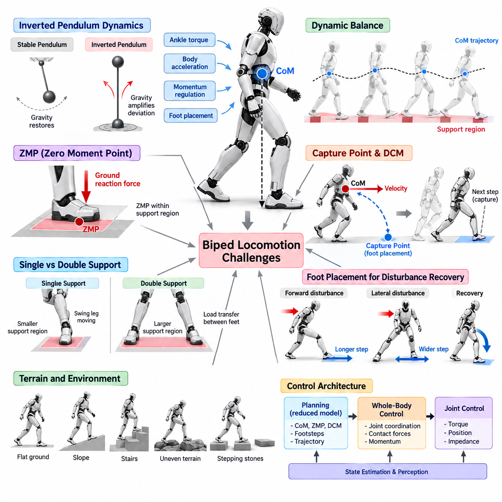
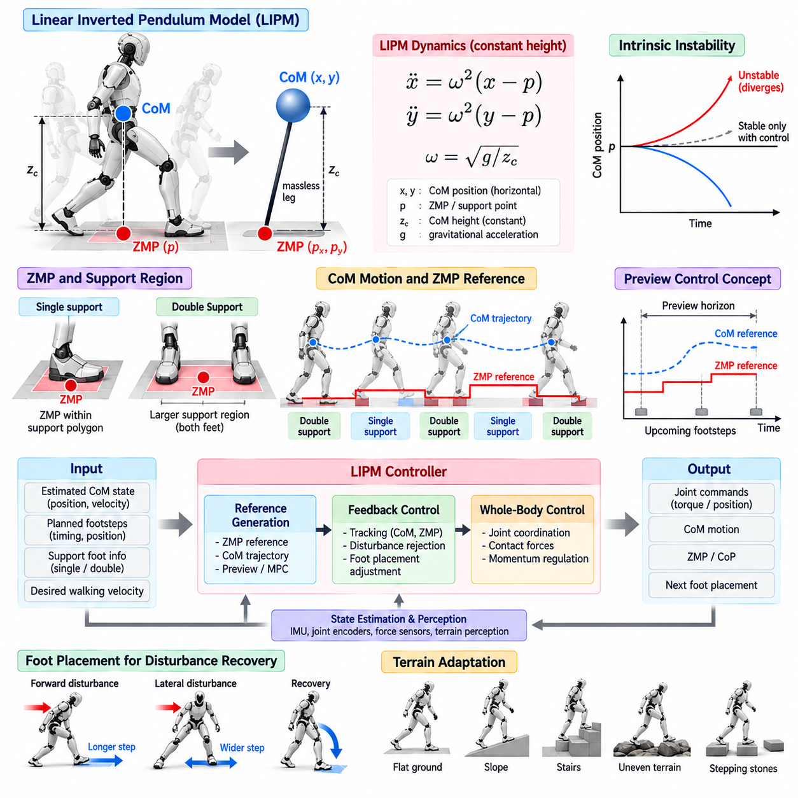
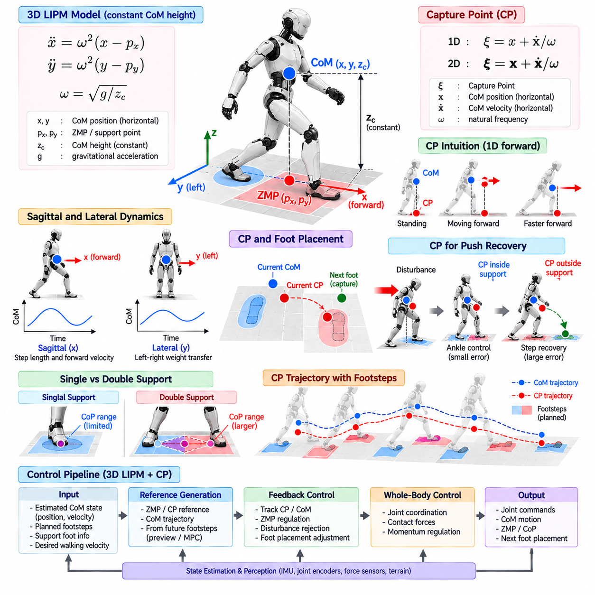
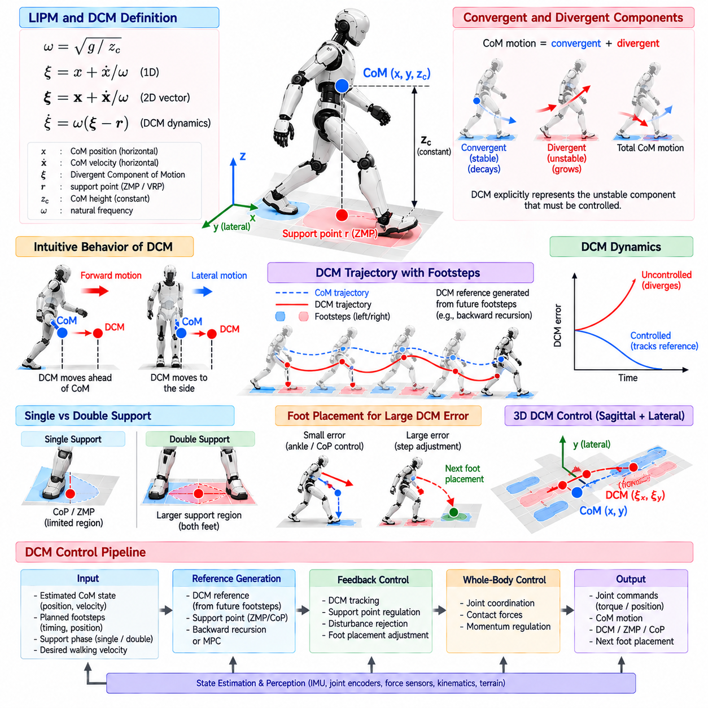
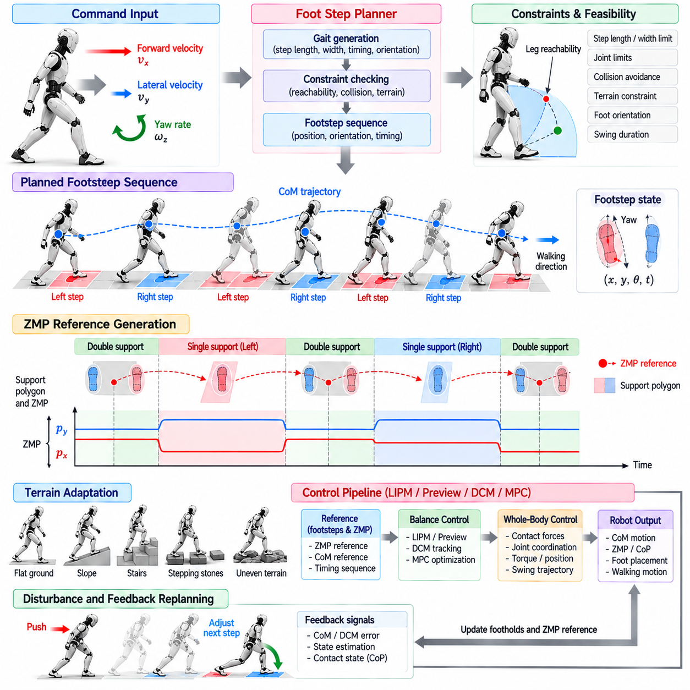
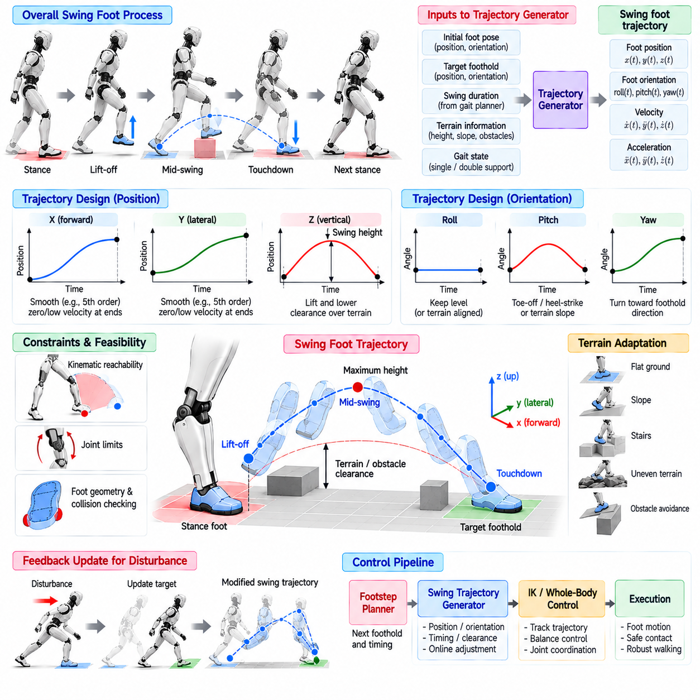
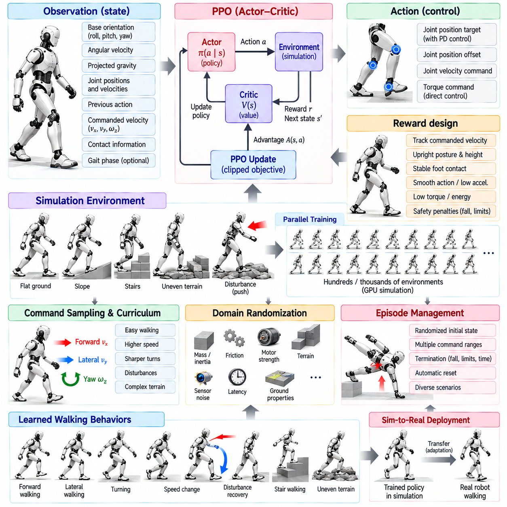
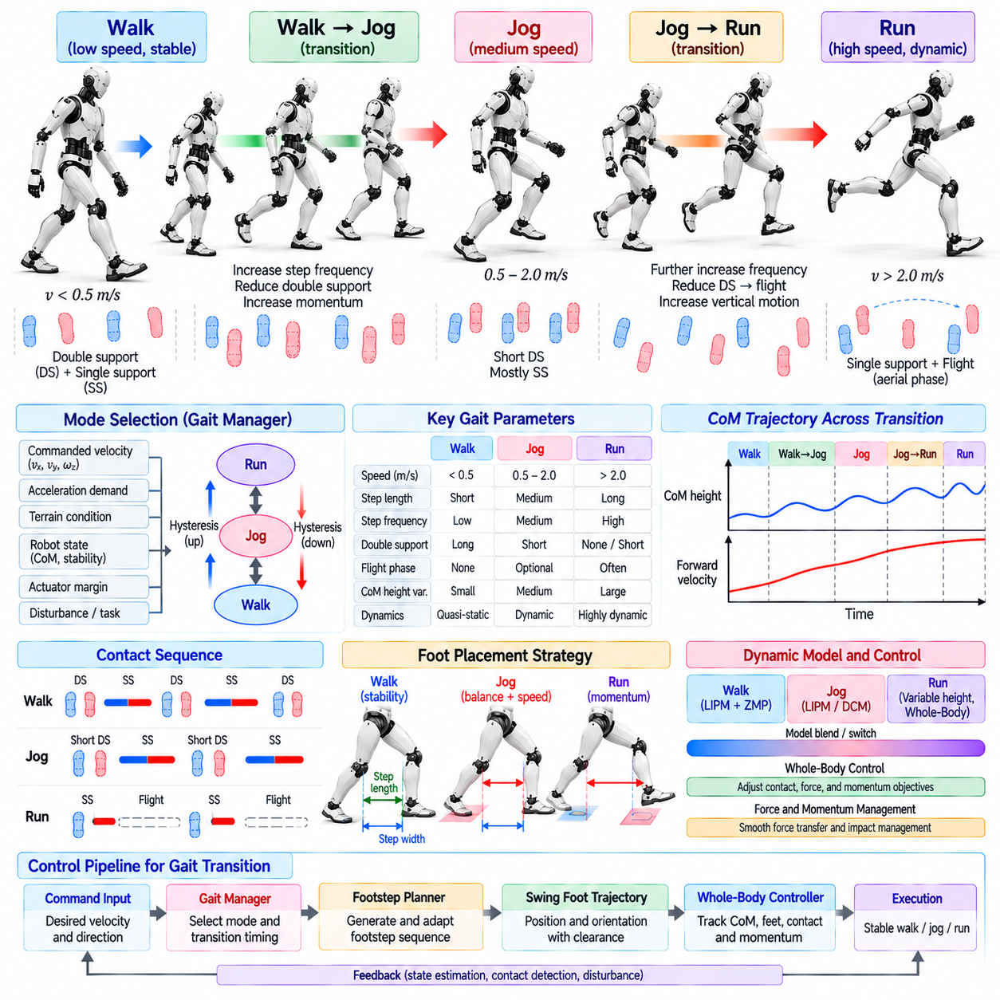
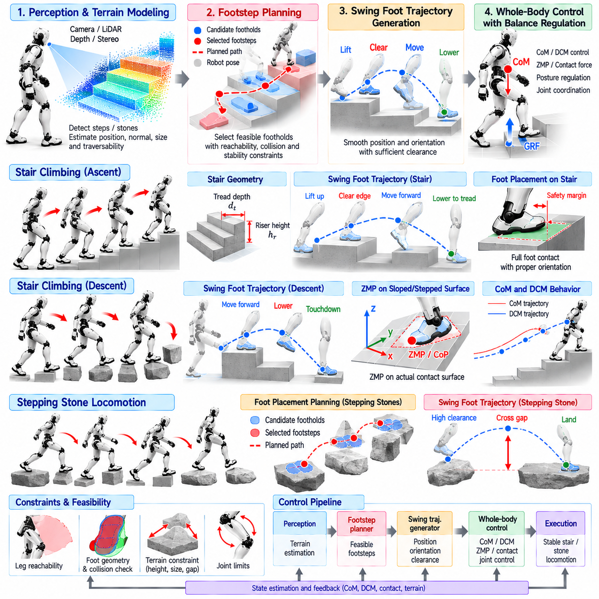
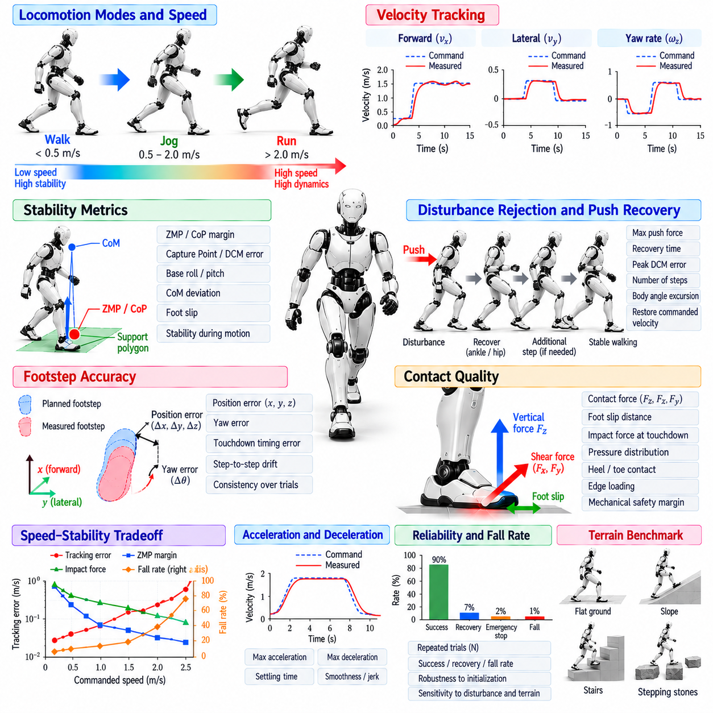

**Volume 22. Humanoid Robot Software**

# Chapter 03. Biped Locomotion Control

## 03.01. Biped Locomotion Challenges Inverted Pendulum

{width="7.268055555555556in" height="7.268055555555556in"}

이족 보행(Biped Locomotion)은 휴머노이드가 작고 지속적으로 변화하는 지지 영역(Support Region) 사이를 이동하면서 본질적으로 불안정한 몸체를 계속 제어해야 하기 때문에 근본적으로 어려운 문제이다. 지면과 지속적으로 접촉하는 바퀴형 로봇과 달리 이족 로봇은 한쪽 발에서 다른 쪽 발로 체중을 반복적으로 이동시킨다. 각각의 발걸음은 접촉 기하 구조(Contact Geometry), 사용 가능한 지면 반력(Ground Reaction Force), 기계적 제약 조건을 변화시키므로 균형 제어와 운동 생성이 긴밀하게 결합된 하나의 제어 문제로 동작해야 한다.

인간과 유사한 몸체 구조는 비교적 큰 질량을 좁은 발 위에 위치시키므로 역진자(Inverted Pendulum)와 유사한 동역학을 형성한다. 일반적인 진자에서는 중력이 질량을 안정적인 아래쪽 자세로 되돌리는 복원 작용을 하지만, 역진자에서는 중력이 직립 상태에서 발생한 편차를 오히려 증가시킨다. 따라서 휴머노이드는 발목 토크(Ankle Torque), 몸체 가속도, 운동량 조절(Momentum Regulation), 발 배치(Foot Placement)를 통해 지속적으로 보정 운동을 생성하여 발산을 방지해야 한다.

질량 중심(Center of Mass, CoM)은 전신 운동(Whole-Body Motion)을 단순화하여 표현하는 유용한 방법을 제공한다. 휴머노이드는 많은 관절 링크(Articulated Link)로 구성되지만 전체적인 균형은 질량 중심, 지지 접촉(Support Contact), 지면 반력 사이의 관계를 통해 해석할 수 있다. 질량 중심이 지지 영역에 대해 이동하면 제어기는 접촉력과 미래 발 디딤 위치를 조절하여 결과적으로 발생하는 가속도가 목표 보행 동작과 일치하도록 해야 한다.

정적 안정성(Static Stability) 개념만으로는 정상적인 이족 보행을 충분히 설명할 수 없다. 질량 중심이 모든 순간에 지지 다각형(Support Polygon)의 수직 상부에 위치할 필요가 없기 때문이다. 동적 보행(Dynamic Walking)은 순수한 정적 조건에서는 불안정한 자세를 의도적으로 허용하면서 몸체를 이동시킨다. 로봇은 운동량과 미래 접촉 위치를 이용하여 운동을 유지한다. 따라서 균형은 영 모멘트 점(Zero Moment Point, ZMP), 캡처 포인트(Capture Point), 발산 운동 성분(Divergent Component of Motion, DCM), 질량 중심 운동량(Centroidal Momentum), 예측된 미래 상태와 같은 동적 변수를 통해 평가해야 한다.

영 모멘트 점(Zero Moment Point, ZMP)은 지지 상태의 보행에서 동적 균형을 설명하는 대표적인 개념이다. 이는 합성 지면 반력(Resultant Ground Reaction Force)에 의해 발생하는 수평 모멘트가 가정된 균형 조건을 만족하는 지지 표면상의 위치를 나타낸다. 적절한 모델 가정에서 ZMP를 실현 가능한 지지 영역 내부에 유지하면 사용 가능한 발 접촉 조건과 일치하는 질량 중심 궤적(CoM Trajectory)을 생성하기 위한 실용적인 기준을 제공할 수 있다.

역진자 해석(Inverted-Pendulum Interpretation)은 전체 휴머노이드를 지면 위에서 지지되는 집중 질량(Concentrated Mass)으로 단순화한다. 이러한 축약은 많은 관절 수준의 세부 요소를 제거하면서 질량 중심 위치, 중력, 접촉 위치, 수평 가속도 사이의 핵심적인 관계를 유지한다. 이와 같은 단순화 모델(Simplified Model)은 빠른 궤적 생성과 예측 제어(Predictive Control)를 가능하게 한다는 점에서 유용하지만, 매우 동적인 보행이나 불규칙한 지형에 적용할 때는 모델의 가정을 명확하게 이해해야 한다.

중요한 문제 중 하나는 로봇이 제어 행동을 즉시 변경하지 않더라도 불안정 동역학(Unstable Dynamics)이 계속해서 진행된다는 것이다. 몸체가 전방으로 넘어지기 시작한 상태에서 보정을 지나치게 늦게 수행하면 회복에 필요한 제어량이 증가한다. 따라서 균형 제어는 시간에 매우 민감하다. 상태 추정(State Estimation), 궤적 생성, 최적화, 통신, 액추에이터 응답은 작은 편차가 회복 불가능한 상태로 발전하지 않도록 충분히 낮은 지연 시간(Latency)으로 동작해야 한다.

단일 지지 보행(Single-Support Locomotion)은 한쪽 발만이 주요 지지 영역을 제공하기 때문에 특히 어렵다. 사용 가능한 압력 중심(Center of Pressure, CoP)의 범위는 이중 지지 상태보다 작아지므로 접촉 구성을 변경하지 않고 생성할 수 있는 균형 보정량도 감소한다. 동시에 스윙 다리(Swing Leg)는 다음 발 디딤 위치를 향해 이동해야 하므로 현재의 균형 조절과 미래 지지를 위한 준비 사이에 강한 결합 관계가 형성된다.

이중 지지(Double Support)는 양쪽 발이 지면과 접촉하기 때문에 더 넓은 유효 지지 영역을 제공하지만 여러 접촉점 사이에서 힘을 분배해야 하는 문제가 발생한다. 제어기는 접촉력과 가속도에 불연속이 발생하지 않도록 뒤쪽 발(Trailing Foot)에서 앞쪽 발(Leading Foot)로 몸체 하중을 부드럽게 전달해야 한다. 하중 전달이 적절하게 조정되지 않으면 충격, 발 미끄러짐(Foot Slip), 과도한 관절 토크 또는 다음 단일 지지 단계까지 전달되는 교란이 발생할 수 있다.

발 배치(Foot Placement)는 불안정한 이족 운동을 제어하기 위한 가장 강력한 수단 중 하나이다. 발목과 접촉력 조절만으로 충분하지 않을 경우 로봇은 운동량을 포착하는 데 필요한 방향으로 다음 지지 위치를 이동시킬 수 있다. 전방 교란은 더 긴 발걸음을 요구할 수 있으며 측면 교란은 더 넓거나 측면으로 이동된 발 디딤 위치를 요구할 수 있다. 이러한 원리는 역진자 동역학을 발걸음 계획(Step Planning) 및 회복 동작(Recovery Behavior)과 직접 연결한다.

캡처 포인트(Capture Point)는 단순화된 불안정 운동을 회복 가능한 상태로 유도하기 위해 로봇이 지지점을 배치할 수 있는 위치를 나타낸다. 이는 몸체 속도와 필요한 발 배치 사이의 관계를 직관적으로 설명한다. 현재의 캡처 포인트가 지지발만으로 제어할 수 있는 영역 밖으로 이동하면 제어기는 다음 발걸음을 수정할 수 있다. 이를 통해 발걸음은 단순히 사전에 정의된 주기 운동이 아니라 의도적인 균형 제어 행동(Balance-Control Action)이 된다.

발산 운동 성분(Divergent Component of Motion, DCM)은 역진자 운동에서 불안정한 성분을 명시적으로 표현함으로써 이러한 해석을 확장한다. DCM 거동을 추종하면 제어기는 계획된 지지 위치에 대해 로봇의 운동이 어떻게 발산하고 있는지를 판단할 수 있다. 미래 발걸음으로부터 목표 DCM 궤적을 생성하고 이를 이용하여 ZMP, 접촉력, 발 배치를 조정할 수 있다. 이를 통해 축약 차수 계획(Reduced-Order Planning)과 전신 실행(Whole-Body Execution)을 연결하는 유용한 계층 구조를 구성할 수 있다.

측면 균형(Lateral Balance)은 전방 보행과는 다른 문제를 가진다. 로봇은 다리 사이에 충분한 여유 공간을 유지하면서 몸체를 왼쪽과 오른쪽 지지 사이로 반복적으로 이동시켜야 한다. 과도한 측면 운동은 에너지를 낭비하고 안정성을 감소시킬 수 있으며, 반대로 충분한 체중 이동이 이루어지지 않으면 스윙 발에서 안전하게 하중을 제거하기 어려울 수 있다. 따라서 보폭 폭(Step Width), 골반 운동(Pelvis Motion), 질량 중심 궤적, 타이밍을 함께 조정하여 반복 가능한 교대 보행을 유지해야 한다.

수직 동역학(Vertical Dynamics)은 많은 단순 모델이 거의 일정한 질량 중심 높이를 가정하기 때문에 역진자 근사를 더욱 복잡하게 만든다. 실제 휴머노이드는 무릎을 굽히고 계단을 오르며 불규칙한 지형을 통과하고 수직 방향으로 가속하며 순응형 운동(Compliant Motion)을 사용한다. 이러한 동작은 수평 힘과 질량 중심 가속도 사이의 관계를 변화시킨다. 따라서 수직 운동이 일정 높이 가정으로 설명하기 어려울 정도로 커지면 보다 일반적인 모델이나 전신 제어(Whole-Body Control)가 필요하다.

각운동량(Angular Momentum) 역시 균형에 영향을 준다. 팔 운동, 몸통 회전, 다리 스윙은 가장 단순한 점 질량 역진자 모델(Point-Mass Inverted-Pendulum Model)에서는 무시되는 상당한 운동량을 생성할 수 있다. 동적인 보행에서는 이러한 효과가 균형을 방해할 수도 있지만 유용한 제어 능력으로 활용될 수도 있다. 질량 중심 동역학(Centroidal Dynamics)과 전신 제어를 이용하면 선운동량과 각운동량을 함께 조절하여 접촉 실현 가능성을 유지하면서 로봇의 전체 관절 구조를 활용할 수 있다.

실제 물리 시스템에서는 접촉(Contact) 자체에도 불확실성이 존재한다. 발이 예상보다 조금 빠르거나 늦게 착지할 수 있고, 지면이 변형될 수 있으며, 마찰이 변화하거나 발바닥의 일부만 처음에 지면과 접촉할 수도 있다. 따라서 완벽한 강체 접촉(Rigid Contact)을 가정하는 제어기는 취약해질 수 있다. 힘 센싱(Force Sensing), 접촉 추정(Contact Estimation), 순응형 제어(Compliant Control), 이벤트 기반 위상 전환(Event-Based Phase Transition)은 수학적 보행 모델과 실제 발에서 발생하는 물리적 상호작용을 동기화하는 데 도움을 준다.

균형 제어기는 항상 직접 측정할 수 있는 것은 아닌 변수들을 이용하므로 상태 추정(State Estimation)이 필수적이다. 관성 측정 장치(Inertial Measurement Unit, IMU), 관절 엔코더(Joint Encoder), 접촉 센서, 힘 측정값, 운동학 모델을 결합하여 몸체 방향, 속도, 질량 중심 상태, 접촉 조건을 추정한다. 작은 추정 오차도 불안정 동역학에 의해 증폭될 수 있으며 특히 보행 속도가 높아질수록 그 영향이 커지므로 추정기의 정확도, 지연, 강건성(Robustness)은 보행 성능의 핵심 요소가 된다.

액추에이터 한계(Actuator Limitation)는 회복 가능한 운동의 물리적 경계를 결정한다. 관절 토크, 속도, 가속도, 운동 범위, 열 용량(Thermal Capacity), 제어 대역폭(Control Bandwidth)은 로봇이 자세나 접촉력을 얼마나 빠르게 변화시킬 수 있는지를 제한한다. 이론적으로 유효한 균형 명령이라도 실제 하드웨어에서는 실행할 수 없을 수 있다. 따라서 실제 보행 제어기는 교란이나 모델링 오차가 발생했을 때 추가적인 제어 능력을 사용할 수 있도록 액추에이터 여유도(Actuator Margin)를 유지해야 한다.

지형(Terrain)은 지지 표면이 평탄하거나 연속적이거나 정확하게 알려져 있지 않을 수 있기 때문에 문제를 더욱 복잡하게 만든다. 경사면, 계단, 디딤돌(Stepping Stone), 낮은 마찰 영역, 장애물은 로봇이 발을 배치할 수 있는 위치와 접촉력을 생성하는 방식을 제한한다. 보행 시스템은 인식(Perception)과 균형 예측(Balance Prediction)을 결합하여 동역학적으로 바람직한 발걸음이 기하학적으로도 도달 가능하고 물리적으로 안전하도록 해야 한다.

모델 기반 보행(Model-Based Locomotion)은 일반적으로 이러한 문제를 여러 제어 계층으로 구성한다. 선형 역진자 모델(Linear Inverted Pendulum Model, LIPM)과 같은 축약 차수 모델은 질량 중심, ZMP, DCM, 발걸음 기준을 생성할 수 있으며 전신 제어는 이를 협응된 관절 및 접촉력 목표로 변환한다. 이후 저수준 관절 제어기(Lower-Level Joint Controller)가 토크, 위치 또는 임피던스(Impedance) 명령을 실행한다. 이러한 계층 구조는 계획의 복잡성을 분리하면서 동적 균형에 필요한 상호 관계를 유지한다.

학습 기반 접근법(Learning-Based Approach)은 복잡한 로봇 동역학에서 협응된 대응 동작을 학습함으로써 이러한 해석적 방법을 보완할 수 있다. 강화학습(Reinforcement Learning, RL) 정책은 시뮬레이션 경험을 통해 발 배치, 관절 협응, 교란 회복 또는 잔차 보정(Residual Correction)을 학습할 수 있다. 그러나 근본적인 역진자 문제는 여전히 존재한다. 학습된 제어기도 제한된 접촉 영역, 액추에이터 한계, 지연된 관측, 불연속적인 미래 발걸음을 이용하여 불안정한 몸체 운동을 조절해야 한다.

따라서 강건한 이족 보행 제어기(Robust Biped Controller)는 정상적인 보행뿐만 아니라 교란 조건에서도 평가되어야 한다. 외부 밀림, 속도 변화, 타이밍 오차, 마찰 변화, 지형 불확실성, 불완전한 접촉은 제어기가 실제로 의미 있는 안정성 여유도를 갖는지를 보여준다. DCM 오차, ZMP 또는 CoP 여유도, 보정 발걸음 크기, 회복 시간, 관절 포화(Joint Saturation), 발 미끄러짐, 낙상 확률 등의 측정값을 이용하면 보행 강건성을 더욱 종합적으로 평가할 수 있다.

이족 보행(Biped Locomotion)은 궁극적으로 접촉(Contact)을 이용하여 불안정한 운동을 지속적으로 관리하는 과정으로 이해할 수 있다. 역진자(Inverted Pendulum)는 몸체 상태, 중력, 지지 위치, 가속도 사이의 관계를 연결함으로써 이 문제를 설명하는 간결한 개념적 기반을 제공한다. 이를 ZMP, 캡처 포인트, DCM, 발걸음 계획(Footstep Planning), 상태 추정, 전신 제어와 결합하면 본질적으로 불안정한 휴머노이드 구조를 제어 가능하고 반복 가능한 보행 시스템으로 변환하기 위한 기반을 형성할 수 있다.

## 03.02. Linear Inverted Pendulum LIPM Controller [w/Code]

{width="7.268055555555556in" height="7.268055555555556in"}

선형 역진자 모델(Linear Inverted Pendulum Model, LIPM)은 이족 보행 제어(Biped Locomotion Control)를 위한 가장 영향력 있는 축약 차수 표현(Reduced-Order Representation) 중 하나를 제공한다. 휴머노이드(Humanoid)의 모든 관절과 링크(Link)를 기술하는 대신, 로봇의 몸체를 질량이 없는 다리(Massless Leg)에 의해 지지되는 집중 질량 중심(Center of Mass)으로 근사한다. 질량 중심의 높이가 거의 일정하게 움직이도록 제한하면 비선형 동역학(Nonlinear Dynamics)이 실시간 보행 제어에 충분할 정도로 단순해진다.

선형 역진자 모델(LIPM)의 핵심 가정은 일반적인 보행(Nominal Walking)에서 수직 방향 질량 중심 운동(Vertical Center-of-Mass Motion)이 수평 방향 운동에 비해 작다는 것이다. 질량 중심 높이를 \\(z_c\\), 중력 가속도(Gravitational Acceleration)를 \\(g\\), 수평 방향 질량 중심 위치를 \\(x\\)라고 하면, 수평 동역학은 \\(\\ddot{x}=\\omega\^2(x-p)\\)로 표현할 수 있다. 여기서 \\(\\omega=\\sqrt{g/z_c}\\)이며, \\(p\\)는 유효 지지점(Effective Support Point) 또는 영 모멘트 점(Zero Moment Point, ZMP)의 위치를 나타낸다.

이 방정식은 휴머노이드 보행의 중요한 특성을 보여준다. 즉, 질량 중심(Center of Mass)은 본질적으로 불안정한 시스템(Intrinsically Unstable System)처럼 동작한다. 질량 중심이 지지점에서 벗어나면 중력 동역학(Gravitational Dynamics)은 그 편차를 자동으로 감소시키는 것이 아니라 오히려 증가시키는 방향으로 작용한다. 따라서 제어기는 불안정 성분이 회복 가능한 한계를 넘어 증가하지 않도록 질량 중심 위치와 속도, 지지점 위치, 미래 발 배치(Future Foot Placement)의 관계를 지속적으로 조절해야 한다.

영 모멘트 점(Zero Moment Point, ZMP)은 단순화된 진자 동역학(Pendulum Dynamics)과 발-지면 상호작용(Foot-Ground Interaction)을 연결하는 실용적인 수단을 제공한다. 안정적인 지지 단계(Support Phase)에서 목표 ZMP는 일반적으로 접촉 중인 한쪽 또는 양쪽 발이 형성하는 유효 지지 다각형(Feasible Support Polygon) 내부에 존재해야 한다. 시간에 따라 변화하는 ZMP 기준 궤적(Reference)을 설계하고 이에 대한 질량 중심 궤적을 제어하면, 모든 계획 단계에서 완전한 강체 동역학(Full Rigid-Body Dynamics)을 직접 계산하지 않고도 동적 균형 보행(Dynamically Balanced Walking)을 생성할 수 있다.

시상 방향(Sagittal Direction)과 측면 방향(Lateral Direction)의 선형 역진자 모델(LIPM) 방정식은 기본적인 모델 가정하에서 일반적으로 서로 독립적으로 다룰 수 있다. 시상 방향 성분은 주로 전후 방향 운동을 표현하며, 측면 방향 성분은 양발 사이의 좌우 균형 이동을 나타낸다. 이 두 평면 동역학(Planar Dynamics)을 결합하면 로봇이 지지발을 교대로 전환하면서 질량 중심을 일련의 동적으로 제어되는 상태를 통해 이동시키는 3차원 보행(Three-Dimensional Walking)을 간결하게 표현할 수 있다.

실제 선형 역진자 모델 제어기(LIPM Controller)는 일반적으로 추정된 질량 중심 상태, 계획된 발걸음(Planned Footsteps), 지지발 정보(Support-Foot Information), 목표 보행 속도(Desired Walking Velocity)를 입력으로 사용한다. 이러한 정보로부터 ZMP, 질량 중심 또는 관련 안정성 변수(Stability Variable)의 기준 궤적을 생성한다. 이후 피드백 제어(Feedback Control)를 이용하여 예측 운동과 측정 운동 사이의 편차를 보상한다. 모델링 오차, 액추에이터 동역학(Actuator Dynamics), 센서 잡음, 지형 불규칙성, 외부 교란으로 인해 완전한 개루프 실행(Open-Loop Execution)이 불가능하므로 이러한 폐루프 구조(Closed-Loop Structure)는 필수적이다.

발걸음 계획(Footstep Planning)과 선형 역진자 모델 제어(LIPM Control)는 강하게 결합되어 있다. 고정된 지지점은 추가적인 발걸음을 내딛지 않고 교란을 회복할 수 있는 제한된 영역만 제공한다. 질량 중심 상태가 이러한 회복 가능 영역(Recoverable Region)의 경계에 접근하면 로봇은 다음 발 접촉 위치 또는 시점을 수정할 수 있다. 따라서 발 배치(Foot Placement)는 미래의 지지 기하 구조(Support Geometry)를 변경하고 불안정한 질량 중심 운동을 억제하는 추가적인 제어 수단으로 기능한다.

이산시간 예측(Discrete-Time Prediction)은 선형 역진자 모델(LIPM)을 계산 기반 보행 제어기에 특히 유용하게 만든다. 연속시간 동역학(Continuous Dynamics)을 제어 또는 계획 주기에 따라 이산화하면 현재 상태와 일련의 지지점 명령으로부터 미래의 질량 중심 상태를 예측할 수 있다. 이러한 표현은 미래 발걸음과 ZMP 기준을 유한 예측 구간(Finite Horizon)에서 함께 고려하는 미리보기 제어(Preview Control)와 모델 예측 제어(Model Predictive Control, MPC)를 자연스럽게 지원한다.

미리보기 기반 선형 역진자 모델 제어(Preview-Based LIPM Control)는 앞으로 발생할 지지 전환(Support Transition)에 대한 정보를 활용한다. 계획된 발걸음 순서가 미래에 유효한 ZMP 영역이 어디에 형성될지를 결정하기 때문에 제어기는 각각의 지지 전환이 실제로 발생하기 전에 질량 중심 궤적을 미리 조정할 수 있다. 이러한 선제적 동작(Anticipatory Behavior)은 순수한 반응형 제어보다 부드러운 보행을 생성하며, 특히 보행 속도, 보폭(Step Length), 측면 보폭(Step Width)이 시간에 따라 변할 때 지지 전환 부근의 급격한 가속도를 감소시킨다.

제어기는 단일 지지 단계(Single-Support Phase)와 이중 지지 단계(Double-Support Phase)를 명시적으로 관리해야 한다. 단일 지지 단계에서는 실현 가능한 압력 중심(Center of Pressure, CoP) 영역이 대략 지지발 내부로 제한되므로 균형 제약이 상대적으로 엄격하다. 이중 지지 단계에서는 양쪽 발이 지지 영역에 기여하며 유효 압력 위치를 뒤쪽 발(Trailing Foot)에서 앞쪽 발(Leading Foot) 방향으로 이동시킬 수 있다. 이 전달 과정을 부드럽게 계획하는 것은 목표 가속도, 접촉 렌치(Contact Wrench), 전신 운동(Whole-Body Motion)의 불연속을 방지하는 데 중요하다.

상태 추정(State Estimation) 역시 중요하다. 선형 역진자 모델 제어기(LIPM Controller)는 항상 직접 측정할 수 없는 물리량을 기반으로 동작하기 때문이다. 관절 엔코더(Joint Encoder), 관성 측정(Inertial Measurement), 운동학 모델(Kinematic Model), 발 접촉 또는 힘 정보를 결합하여 부유 베이스 자세(Floating-Base Pose), 질량 중심 위치와 속도, 지지 상태를 추정하는 것이 일반적이다. 수학적으로 안정적인 제어기라도 지연되거나 편향된 상태 추정값 때문에 내부 진자 모델과 실제 로봇 사이에 차이가 발생하면 성능이 크게 저하될 수 있다.

단순화된 선형 역진자 모델(LIPM)의 출력은 일반적으로 개별 액추에이터(Actuator)에 직접 명령을 전달하는 대신 하위 제어 계층(Lower-Level Control)으로 전달된다. 목표 질량 중심 운동, 골반 운동(Pelvis Motion), 발 궤적(Foot Trajectory), 접촉 목표(Contact Objective)는 역운동학(Inverse Kinematics), 역동역학(Inverse Dynamics), 또는 전신 제어(Whole-Body Control, WBC)에 전달될 수 있다. 하위 계층은 축약된 진자 모델에서 의도적으로 생략된 접촉, 토크, 마찰, 관절 제한, 자세 제약을 만족하면서 휴머노이드의 많은 관절을 통합적으로 조정한다.

일정 높이 가정(Constant-Height Assumption)은 선형 역진자 모델(LIPM)의 가장 큰 장점인 동시에 중요한 한계이다. 이 가정은 간결한 선형 동역학(Linear Dynamics)과 빠른 예측을 가능하게 하지만, 실제 휴머노이드는 계단을 오르거나 웅크리고, 달리고, 불규칙한 지형을 밟거나 보행 중 조작 작업(Manipulation)을 수행할 때 질량 중심 높이를 변화시킨다. 또한 몸통과 사지에서 발생하는 큰 각운동량(Angular Momentum)은 단순 모델의 기본 가정을 위반할 수 있으므로 확장된 모델이나 보다 완전한 질량 중심 동역학(Centroidal Dynamics) 및 전신 동역학(Whole-Body Dynamics)이 필요할 수 있다.

또 다른 한계는 접촉 실현 가능성(Contact Feasibility)에서 발생한다. 수학적 선형 역진자 모델(LIPM)은 실제로 생성할 수 없는 지지점을 요구할 수 있는데, 이는 압력 중심이 접촉면 내부에 존재해야 하고 지면 반력(Ground Reaction Force)이 마찰 제약(Friction Constraint)을 만족해야 하기 때문이다. 따라서 실제 구현에서는 ZMP 또는 압력 중심 명령에 제약을 적용하고 이를 접촉 계획(Contact Planning)과 조정한다. 이러한 제약만으로 안정성을 유지할 수 없을 경우 발걸음 조정, 운동량 조절(Momentum Regulation), 또는 다른 회복 전략이 개입해야 한다.

제어기 튜닝(Controller Tuning)은 보행 속도, 질량 중심 높이, 샘플링 주기(Sampling Period), 예측 구간(Prediction Horizon), 발 크기, 보행 주기(Step Timing), 상태 추정 품질을 하나의 통합 시스템으로 고려해야 한다. 피드백 이득(Feedback Gain)을 증가시키면 교란 억제 성능을 향상시킬 수 있지만 측정 잡음을 증폭시키거나 액추에이터 및 구조 동역학을 가진시킬 수 있다. 지나치게 보수적인 ZMP 여유도(ZMP Margin)는 정상 상태의 강건성(Robustness)을 높이지만 기동성을 감소시킨다. 따라서 효과적인 튜닝은 추종 정확도, 안정성 여유, 응답성, 에너지 소비, 하드웨어 한계 사이의 균형을 필요로 한다.

소프트웨어 구현(Software Implementation)에서는 선형 역진자 모델 계층(LIPM Layer)이 상태 추정, 보행 스케줄링(Gait Scheduling), 기준 생성(Reference Generation), 예측 동역학(Predictive Dynamics), 피드백 제어, 전신 명령 구현(Whole-Body Command Realization)을 명확하게 분리해야 한다. 이러한 모듈성(Modularity)은 개별 구성요소를 교체하거나 개선하면서 동일한 보행 프레임워크를 먼저 시뮬레이션에서 평가하고 이후 실제 하드웨어에서 검증할 수 있게 한다. 진단 신호에는 예측 및 측정된 질량 중심 상태, 지지 단계, ZMP 기준, 추종 오차, 제약 여유도(Constraint Margin)가 포함되어야 한다.

검증(Validation)은 단순히 시각적으로 성공적인 보행을 확인하는 수준을 넘어야 한다. 유용한 시험에는 정지 균형(Stationary Balance), 반복 보행, 명령 속도 변화, 정지, 회전, 보폭과 좌우 간격 변화, 모델 매개변수 오차, 센서 잡음, 타이밍 지터(Timing Jitter), 제어된 외부 교란 등이 포함된다. 성능은 질량 중심 추종 오차, ZMP 여유도, 발 배치 정확도, 교란 회복 성능, 접촉 일관성, 관절 실현 가능성, 장시간 보행에서의 불안정 진동 발생 여부 등을 통해 평가할 수 있다.

휴머노이드 보행 아키텍처(Humanoid Locomotion Architecture)에서 선형 역진자 모델 제어기(LIPM Controller)는 추상적인 보행 계획(Gait Planning)과 고차원 전신 제어(High-Dimensional Whole-Body Control)를 연결하는 중간 계층으로 이해하는 것이 적절하다. 이 모델은 이족 보행의 핵심적인 불안정 동역학을 효율적으로 예측하고 제어할 수 있는 형태로 압축하며, 발걸음 계획은 미래의 지지 기회를 제공하고 전신 제어는 생성된 운동을 실제 로봇에서 구현한다. 이러한 계층적 해석은 선형 역진자 모델(LIPM)을 캡처 포인트(Capture Point), 발산 운동 성분(Divergent Component of Motion, DCM), 예측 제어(Predictive Control), 학습 기반 보행(Learning-Based Locomotion)과 같은 고급 보행 제어 기법으로 발전하기 위한 기본적인 기준 모델로 만든다.

## 03.03. 3D LIPM and Capture Point for Biped [w/Code]

{width="7.268055555555556in" height="7.268055555555556in"}

3차원 선형 역진자 모델(Three-Dimensional Linear Inverted Pendulum Model, 3D LIPM)은 이족 보행(Biped Walking)의 단순화된 역진자 표현(Inverted-Pendulum Representation)을 시상 방향(Sagittal Direction)과 측면 방향(Lateral Direction) 모두로 확장한다. 전방 운동만을 고려하는 대신 질량 중심(Center of Mass, CoM)의 높이를 거의 일정하게 유지하면서 지면 평면 위의 수평 운동을 모델링한다. 이러한 표현은 휴머노이드 보행에서 좌우 지지발을 교대로 전환하는 데 필요한 핵심적인 균형 동역학(Balance Dynamics)을 포착한다.

일정 높이 가정(Constant-Height Assumption)하에서 수평 방향 질량 중심(CoM) 동역학은 x축과 y축을 따라 독립적으로 표현할 수 있다. 질량 중심 높이가 \\(z_c\\)일 때 고유 주파수(Natural Frequency)는 \\(\\omega=\\sqrt{g/z_c}\\)로 정의된다. 이에 대응하는 방정식은 \\(\\ddot{x}=\\omega\^2(x-p_x)\\)와 \\(\\ddot{y}=\\omega\^2(y-p_y)\\)가 되며, 여기서 \\(p_x\\)와 \\(p_y\\)는 지면 평면에서 유효 지지점(Effective Support Point) 또는 영 모멘트 점(Zero Moment Point, ZMP)의 좌표를 나타낸다.

x와 y 방향 방정식은 수학적으로 독립적인 것처럼 보이지만 물리적인 의미에서는 로봇의 지지 기하 구조(Support Geometry)를 통해 서로 결합된다. 전방 진행은 보폭(Step Length)과 속도를 결정하고, 측면 운동은 왼발과 오른발 사이에서 체중을 이동시킨다. 성공적인 보행 제어기는 질량 중심(CoM)이 발 배치(Foot Placement), 지지 전환(Support Transition), 접촉 제약(Contact Constraint), 목표 이동 방향과 일관되게 움직이도록 두 성분을 함께 조정해야 한다.

3차원 선형 역진자 모델(3D LIPM)의 근본적인 어려움은 수평 동역학에 불안정 성분(Unstable Component)이 포함되어 있다는 것이다. 질량 중심(CoM)이 충분한 속도로 유효 지지점에서 멀어지면 현재의 발 접촉 상태를 단순히 유지하는 것만으로는 발산(Divergence)을 멈출 수 없다. 이러한 특성으로부터 캡처 포인트(Capture Point) 개념이 도출되며, 이는 로봇의 순간적인 질량 중심 상태와 불안정 운동을 정지시키기 위해 지지를 형성해야 하는 지면상의 위치를 직접 연결한다.

기본적인 선형 역진자 모델(LIPM)에서 캡처 포인트(Capture Point)는 하나의 수평 방향에 대해 \\(\\xi=x+\\dot{x}/\\omega\\)로 표현할 수 있다. 2차원에서는 동일한 관계가 평면 벡터(Planar Vector)인 \\(\\boldsymbol{\\xi}=\\mathbf{x}+\\dot{\\mathbf{x}}/\\omega\\)로 확장된다. 따라서 캡처 포인트는 위치와 속도를 하나의 안정성 관련 물리량(Stability-Related Quantity)으로 결합하며, 휴머노이드가 균형을 회복할 수 있는지를 판단할 때 질량 중심 위치만 사용하는 것보다 유용한 정보를 제공한다.

그 물리적 의미는 직관적이다. 정지한 질량 중심(CoM)이 지지 위치 바로 위에 있으면 캡처 포인트(Capture Point)는 현재 위치에 가깝게 형성된다. 몸체가 빠르게 전방으로 움직이면 불안정 운동을 억제하기 위해 로봇이 더 앞쪽에 지지를 형성해야 하므로 캡처 포인트가 질량 중심보다 전방으로 이동한다. 마찬가지로 측면 속도가 발생하면 캡처 포인트도 측면으로 이동하여 옆으로 넘어지는 것을 방지하기 위해 보정 발걸음(Corrective Step)이 필요한 위치를 나타낸다.

캡처 포인트 제어(Capture Point Control)는 질량 중심 동역학을 균형 제어 관점에서 보다 쉽게 해석할 수 있는 성분으로 분리한다. 위치와 속도를 각각 독립적으로 조절하는 대신 제어기는 계획된 발걸음(Planned Footsteps)과 연계된 목표 캡처 포인트 궤적을 추종할 수 있다. 측정된 캡처 포인트가 기준값에서 벗어나면 제어기는 유효 지지점, ZMP 또는 미래 발 배치를 수정하여 불안정 성분을 계획된 운동 방향으로 되돌린다.

단일 지지 단계(Single Support)에서는 압력 중심(Center of Pressure, CoP)이 지지발 접촉 영역 내부에 유지되어야 하기 때문에 로봇이 유효 지지점을 이동시킬 수 있는 범위가 제한된다. 작은 캡처 포인트 오차는 일반적으로 이 영역 안에서 압력 분포를 이동시켜 보정할 수 있다. 그러나 큰 오차는 사용 가능한 발목 제어 능력(Ankle-Control Authority)을 초과할 수 있으며, 이 경우 다음 발 위치를 변경해야 한다. 이를 통해 연속적인 균형 제어와 이산적인 발걸음 결정(Discrete Stepping Decision)이 자연스럽게 연결된다.

캡처 포인트(Capture Point)와 발 배치(Foot Placement)의 관계는 밀림 회복(Push Recovery)을 위한 강력한 메커니즘을 제공한다. 외부 교란(External Disturbance)이 발생하면 상태 추정기(State Estimator)가 질량 중심의 위치와 속도 변화를 감지하고, 이에 따라 추정된 캡처 포인트가 이동한다. 해당 지점이 현재 지지 다각형(Support Polygon)을 이용하여 회복할 수 있는 범위에 남아 있으면 로봇은 발목 또는 전신 보정을 수행할 수 있다. 범위를 벗어나면 발걸음 계획기(Footstep Planner)가 스윙 발(Swing Foot)을 실현 가능한 캡처 위치로 재배치할 수 있다.

3차원 보행에서는 측면 캡처 포인트(Lateral Capture Point)의 거동이 특히 중요하다. 이족 보행은 두 개의 좁은 발 사이에서 반복적으로 지지를 전환하기 때문이다. 목표 측면 궤적은 과도한 진동을 발생시키지 않으면서 몸체를 다음 지지발 방향으로 이동시켜야 한다. 따라서 각 좌우 지지 전환이 발생할 때 캡처 포인트가 적절한 영역에 도달하도록 보폭 폭(Step Width), 지지 시간(Support Duration), 질량 중심 속도, 발 배치를 함께 조정해야 한다.

목표 캡처 포인트 궤적(Desired Capture Point Trajectory)은 미래의 발걸음으로부터 역방향으로 생성하거나 계획된 질량 중심과 지지 순서로부터 순방향으로 생성할 수 있다. 불안정 동역학은 시간에 따라 오차를 증폭시키므로 미래 지지 위치에 대한 정보는 동역학적으로 일관된 기준 궤적을 구성하는 데 유용하다. 이를 통해 제어기는 큰 균형 오차가 발생할 때까지 기다리지 않고 앞으로의 발걸음을 예측하여 대응할 수 있으며, 접촉 전환 부근에서의 움직임을 부드럽게 하고 과도한 보정 동작을 줄일 수 있다.

실제 제어기는 이산시간(Discrete Time)으로 동작하며 측정된 로봇 상태로부터 캡처 포인트 추정값을 반복적으로 갱신한다. 각 제어 주기(Control Cycle)마다 측정값과 목표값을 비교하고 허용 가능한 지지점 보정량을 결정한 다음, 생성된 운동 목표를 하위 제어 계층(Lower Control Layer)에 전달한다. 질량 중심 속도 추정 또는 접촉 상태 감지의 지연은 불안정 동역학을 조절하는 제어기의 능력을 직접 저하시키므로 충분히 빠른 갱신 주기가 필요하다.

캡처 포인트 추정(Capture Point Estimation)은 신뢰성 높은 부유 베이스 상태 추정(Floating-Base State Estimation)에 크게 의존한다. 관절 엔코더(Joint Encoder), 관성 측정 장치(Inertial Measurement Unit, IMU), 운동학적 제약(Kinematic Constraint), 발 접촉 정보를 일반적으로 융합하여 로봇의 베이스 운동과 질량 중심 상태를 추정한다. 특히 캡처 포인트에는 질량 중심 속도가 명시적으로 포함되므로 속도 추정에 주의해야 한다. 잡음, 바이어스(Bias), 필터링 지연 또는 잘못된 접촉 감지는 질량 중심 위치가 정확해 보이는 경우에도 상당한 오차를 발생시킬 수 있다.

3차원 선형 역진자 모델(3D LIPM)과 캡처 포인트(Capture Point) 계층은 전신 제어(Whole-Body Control)를 대체하지 않는다. 이 계층은 로봇의 전체 질량이 어떻게 이동해야 하는지와 어느 위치에서 지지를 생성해야 하는지를 나타내는 축약 차수 목표(Reduced-Order Objective)를 제공한다. 전신 제어는 이러한 목표를 관절 가속도, 토크, 접촉력(Contact Force), 골반 운동(Pelvis Motion), 스윙 발 궤적으로 변환하면서 관절 제한, 마찰 제약, 액추에이터 성능과 실제 휴머노이드의 다양한 고차원 요구 조건을 만족시킨다.

기본적인 캡처 포인트 공식은 선형 역진자 모델(LIPM)의 가정을 그대로 계승한다. 일정한 질량 중심 높이, 단순화된 접촉 기하 구조, 무시 가능한 각운동량(Angular Momentum) 효과, 이상화된 지지 전환은 일반적인 보행에서는 합리적인 가정이 될 수 있지만 달리기, 계단 오르기, 웅크리기, 큰 상체 운동 또는 공격적인 교란 회복에서는 정확성이 감소한다. 이러한 상황에서는 질량 중심 동역학(Centroidal Dynamics), 가변 높이 모델(Variable-Height Model), 운동량 제어(Momentum Control), 비선형 예측 기법(Nonlinear Predictive Method)이 보다 정확한 표현을 제공할 수 있다.

또 다른 실질적인 문제는 도달 가능성(Reachability)이다. 이론적으로 계산된 캡처 포인트가 로봇이 실제로 해당 위치에 발을 놓을 수 있음을 보장하지는 않는다. 운동학적 한계(Kinematic Limit), 충돌 회피(Collision Avoidance), 스윙 시간(Swing Duration), 지형 형상, 마찰, 액추에이터 속도는 실현 가능한 발걸음의 범위를 제한한다. 따라서 실제 제어기는 목표 캡처 위치를 실현 가능한 발걸음 영역(Feasible Footstep Region)으로 투영하고 압력 조절, 발걸음 또는 보다 적극적인 전신 전략을 통해 회복할 수 있는지를 판단해야 한다.

다중 발걸음 회복(Multiple-Step Recovery)은 캡처 포인트 개념을 하나의 보정 발걸음을 넘어 확장한다. 외부 교란이 너무 커서 하나의 실현 가능한 발 배치만으로 로봇을 정지시키지 못하더라도 동역학적으로 계획된 여러 번의 발걸음을 통해 불안정 운동을 점진적으로 감소시킬 수 있다. 따라서 제어기는 미래의 지지 순서를 평가하고 회복 동작을 여러 접촉 단계에 분산시킴으로써 한 번의 발걸음으로 회복할 수 있는 능력을 넘어서는 교란에서도 휴머노이드가 직립 상태를 유지하도록 할 수 있다.

소프트웨어 아키텍처(Software Architecture) 관점에서 3차원 선형 역진자 모델과 캡처 포인트 제어기는 상태 추정(State Estimation), 보행 스케줄링(Gait Scheduling), 발걸음 계획(Footstep Planning), 접촉 관리(Contact Management), 전신 제어(Whole-Body Control)와 명확한 인터페이스를 제공해야 한다. 유용한 진단 변수에는 질량 중심 위치와 속도, 측정 및 목표 캡처 포인트, ZMP 또는 CoP 명령, 지지발 상태, 실현 가능한 지지 경계, 발걸음 보정량, 회복 상태 등이 포함된다. 이러한 신호를 기록하면 단순한 균형 상실로 보일 수 있는 실패 원인을 체계적으로 분석할 수 있다.

검증(Validation)은 시상 방향과 측면 방향 모두에서 정상 보행(Nominal Walking)과 제어된 교란 시나리오(Controlled Perturbation Scenario)를 포함해야 한다. 시험에서는 보행 속도, 보폭, 보폭 폭, 지지 시간, 질량 중심 높이 가정, 추정기 잡음, 제어 지연, 외부 밀림 등을 변화시킬 수 있다. 중요한 평가 지표에는 캡처 포인트 추종 오차, 지지점 여유도(Support-Point Margin), 보정 발걸음 크기, 회복 시간, 회복에 필요한 발걸음 수, 안정적인 보행을 복원할 수 있는 최대 교란 크기가 포함된다.

이족 보행 스택(Biped Locomotion Stack)에서 3차원 선형 역진자 모델(3D LIPM)과 캡처 포인트(Capture Point) 프레임워크는 기본적인 역진자 모델링에서 명시적인 불안정 운동 제어(Explicit Unstable-Motion Regulation)로 발전하는 중요한 연결 단계를 제공한다. 3D LIPM은 평면 지지 위에서 질량 중심이 어떻게 변화하는지를 예측하고, 캡처 포인트는 그 움직임을 억제하기 위해 어느 위치에서 지지를 생성해야 하는지를 결정한다. 이 두 개념은 함께 발산 운동 성분 제어(Divergent Component of Motion Control, DCM Control), 예측 기반 발걸음 최적화(Predictive Footstep Optimization), 밀림 회복(Push Recovery), 그리고 보다 발전된 휴머노이드 균형 전략의 개념적 기반을 형성한다.

## 03.04. Divergent Component of Motion DCM Control [w/Code]

{width="7.268055555555556in" height="7.268055555555556in"}

발산 운동 성분(Divergent Component of Motion, DCM)은 이족 보행 동역학(Biped Locomotion Dynamics)의 불안정한 부분을 간결하게 표현하는 방법을 제공한다. 선형 역진자 모델(Linear Inverted Pendulum Model, LIPM)을 기반으로 질량 중심(Center of Mass, CoM) 운동을 수렴 성분(Convergent Behavior)과 발산 성분(Divergent Behavior)으로 분리한다. 이러한 분리를 통해 휴머노이드 제어기는 넘어짐을 방지하기 위해 능동적으로 제어해야 하는 성분에 직접 집중할 수 있으며, 자연적으로 안정적인 성분에는 상대적으로 적은 제어 개입이 요구된다.

일정한 질량 중심 높이 \\(z_c\\)에 대해 선형 역진자 모델(LIPM)의 고유 주파수(Natural Frequency)는 \\(\\omega=\\sqrt{g/z_c}\\)로 정의된다. 이때 발산 운동 성분(DCM)은 \\(\\boldsymbol{\\xi}=\\mathbf{x}+\\dot{\\mathbf{x}}/\\omega\\)로 표현할 수 있으며, 여기서 \\(\\mathbf{x}\\)는 수평 방향 질량 중심 위치이고 \\(\\dot{\\mathbf{x}}\\)는 그 속도이다. 이 상태 변수는 위치와 속도를 결합하여 로봇이 회복 가능한 지지 상태를 향해 움직이는지 또는 그 상태에서 멀어지고 있는지를 직접적으로 나타낸다.

기본적인 선형 역진자 모델(LIPM)의 가정하에서 발산 운동 성분 동역학(DCM Dynamics)은 \\(\\dot{\\boldsymbol{\\xi}}=\\omega(\\boldsymbol{\\xi}-\\mathbf{r})\\)로 표현할 수 있으며, 여기서 \\(\\mathbf{r}\\)은 일반적으로 영 모멘트 점(Zero Moment Point, ZMP) 또는 가상 반발점(Virtual Repellent Point)과 연관되는 유효 지지점(Effective Support Point)을 의미한다. 이 방정식의 양의 지수적 거동(Positive Exponential Behavior)은 발산이라는 명칭의 이유를 보여준다. 적절한 지지점 제어가 없으면 DCM과 목표 궤적 사이의 작은 오차도 자연적으로 사라지지 않고 빠르게 증가한다.

발산 운동 성분(DCM)은 캡처 포인트(Capture Point)와 밀접한 관련이 있지만 여러 보행 단계에 걸친 연속적인 궤적 생성과 피드백 제어(Feedback Control)에 특히 유용하다. 캡처 포인트가 불안정 운동을 정지시키기 위해 로봇이 어디에 발을 디뎌야 하는지를 강조한다면, DCM 제어는 보행 전체 과정에서 불안정 상태가 어떻게 변화해야 하는지를 기술한다. 따라서 DCM은 연속 보행, 지지 전환(Support Transition), 속도 조절, 교란 회복(Disturbance Recovery), 예측 기반 발걸음 계획(Predictive Footstep Planning)에 적합하다.

목표 DCM 궤적(Desired DCM Trajectory)은 일반적으로 계획된 발걸음과 지지 시간(Support Duration)의 순서로부터 구성된다. 각각의 지지 단계에서 제어기는 적절한 지지점 변화를 지정하고 다음 접촉 구성(Contact Configuration)으로 이어지는 DCM 궤적을 결정한다. DCM 동역학은 순방향 시간에서 불안정하기 때문에 궤적 생성은 미래의 경계 조건(Future Boundary Condition)으로부터 역방향으로 수행되는 경우가 많으며, 이를 통해 연속된 발걸음과 최종 보행 목표 사이의 일관성을 확보할 수 있다.

역방향 재귀(Backward Recursion)는 보행 계획기(Gait Planner)가 여러 개의 미래 발걸음을 이미 제공하고 있을 때 특히 유용하다. 최종 DCM 조건에서 시작하여 계획기는 일련의 지지 단계를 거슬러 올라가며 목표 상태를 역방향으로 전파한다. 따라서 각각의 선행 단계는 로봇이 이후 어느 상태에 도달해야 하는지를 고려하여 설계된다. 이렇게 생성된 기준 궤적은 미래의 지지 기하 구조(Support Geometry)를 반영하며 균형 오차가 이미 발생한 이후의 반응형 보정에만 의존하는 것을 방지한다.

단일 지지 단계(Single Support)에서는 지지발이 유효 지지점을 생성할 수 있는 영역을 제한한다. DCM 제어기는 측정된 DCM과 목표 궤적을 비교하고 이 실현 가능한 영역 내부에서 보정 지지점 명령(Corrective Support-Point Command)을 계산한다. 작은 교란은 일반적으로 지지발 내부에서 압력 중심(Center of Pressure, CoP)을 조절하여 억제할 수 있으므로 계획된 발걸음 순서를 수정하지 않고도 균형을 회복할 수 있다.

DCM 오차가 압력 조절만으로 처리할 수 있는 범위를 초과하면 발 배치(Foot Placement)가 필수적인 제어 변수가 된다. 다음 발 디딤 위치를 이동시켜 미래의 지지 영역이 발산 운동을 보다 효과적으로 포착하도록 만들 수 있다. 이를 통해 비교적 작은 오차는 발목 또는 압력 제어가 처리하고 더 큰 교란은 발걸음으로 처리하는 계층적 균형 대응(Hierarchical Balance Response)이 형성된다. 더욱 심각한 경우에는 여러 번의 회복 발걸음 또는 추가적인 전신 운동량 조절(Whole-Body Momentum Regulation)이 필요할 수 있다.

이중 지지 단계(Double Support)는 실현 가능한 지지 영역이 양쪽 발 전체로 확장되고 하중이 뒤쪽 발(Trailing Foot)에서 앞쪽 발(Leading Foot)로 전달되어야 하므로 세심한 처리가 필요하다. 불연속적인 지지점 기준은 바람직하지 않은 질량 중심 가속도와 접촉력 변화를 발생시킬 수 있다. 따라서 실제 DCM 제어기는 DCM 변화, 압력 전달, 접촉 활성화(Contact Activation), 스윙 발 운동의 시작 또는 종료를 조정하는 부드러운 전환 프로파일(Smooth Transition Profile)을 사용한다.

3차원 DCM 제어(Three-Dimensional DCM Control)는 시상 방향(Sagittal Direction)과 측면 방향(Lateral Direction)의 균형을 동시에 조절한다. 시상 방향 동역학은 전진, 가속, 정지 동작을 결정하며 측면 동역학은 교대로 바뀌는 양발 사이의 체중 이동을 조정한다. 단순화된 방정식은 각 수평 방향에서 독립적으로 표현할 수 있지만 실제로는 실현 가능한 발걸음과 지지 다각형(Support Polygon)이 두 운동을 결합한다. 따라서 보폭(Step Length), 보폭 폭(Step Width), 타이밍, 회전 방향을 일관되게 계획해야 한다.

실시간 피드백(Real-Time Feedback)을 위해서는 현재 DCM에 대한 정확한 추정이 필요하다. DCM에는 질량 중심의 위치와 속도가 모두 포함되므로 부유 베이스 상태 추정(Floating-Base State Estimation)의 오차가 균형 제어기에 직접적인 영향을 준다. 일반적으로 관절 엔코더(Joint Encoder), 관성 측정 장치(Inertial Measurement Unit, IMU), 접촉 센싱(Contact Sensing), 힘 정보, 로봇 운동학을 융합하여 질량 중심 상태를 추정한다. 속도 필터링은 잡음 억제와 지연 사이의 균형을 유지해야 하며, 과도한 지연은 지수적으로 발산하는 동역학을 제어할 때 특히 큰 문제를 일으킬 수 있다.

실제 DCM 피드백 법칙(DCM Feedback Law)은 추종 오차를 목표 지지점 또는 접촉 렌치(Contact Wrench)의 수정량으로 변환한다. 높은 피드백 이득(Feedback Gain)은 교란을 빠르게 억제할 수 있지만 명령은 유한한 발 면적, 마찰 한계, 액추에이터 성능, 접촉력 실현 가능성(Contact-Force Feasibility)의 제약을 받는다. 따라서 포화(Saturation)를 명시적으로 처리해야 한다. 물리적으로 불가능한 ZMP 또는 CoP 위치를 요구하는 제어기는 수학적으로 안정적으로 보이더라도 실제 로봇에서는 실현할 수 없는 명령을 생성할 수 있다.

DCM 제어는 모델 예측 제어(Model Predictive Control, MPC)와 자연스럽게 결합될 수 있다. 순간적인 보정만 계산하는 대신 MPC는 유한 예측 구간(Finite Horizon)에 걸쳐 미래의 DCM 변화를 예측하고 물리적 제약 조건하에서 지지점 궤적, 발걸음 위치 또는 보행 타이밍을 최적화한다. 이러한 예측 구조는 교란에 대응하기 위해 하나의 국소적 보정이 아니라 여러 미래 발걸음에 걸친 조정이 필요한 경우 특히 유용하다.

보행 타이밍(Step Timing)은 DCM 조절을 위한 또 하나의 자유도(Degree of Freedom)를 제공한다. 발산 동역학은 시간에 따라 지수적으로 변화하기 때문에 다음 접촉이 발생하는 시점을 변경하면 착지 시점의 상태를 크게 변화시킬 수 있다. 발걸음을 앞당기면 발산이 진행될 시간을 줄일 수 있으며, 다른 보행 조건에서는 발걸음을 지연시키는 것이 적절할 수 있다. 따라서 발 위치와 타이밍을 동시에 최적화하면 고정된 보행 시간을 사용하는 제어기보다 회복 가능 영역(Recoverable Region)을 확장할 수 있다.

보행 제어 계층(Locomotion Layer)에서 생성된 DCM 기준은 일반적으로 관절 액추에이터에 직접 전달되지 않고 전신 제어(Whole-Body Control, WBC) 프레임워크로 전달된다. 전신 제어기는 관절 제한, 토크 제한, 마찰 원뿔(Friction Cone), 자기 충돌 제약(Self-Collision Constraint), 자세 목표(Posture Objective)를 만족하면서 목표 질량 중심 운동, 접촉력, 골반 거동, 스윙 발 궤적을 구현한다. 따라서 DCM 제어는 전역적인 균형을 조절하고 하위 계층은 로봇의 고차원 물리적 동작을 구현한다.

고전적인 DCM 공식은 일정 높이 선형 역진자 모델(Constant-Height LIPM)의 한계를 그대로 갖는다. 상당한 수직 방향 질량 중심 운동, 각운동량(Angular Momentum), 불규칙 지형, 달리기, 점프, 깊은 웅크리기, 적극적인 조작 동작은 기본 가정을 위반할 수 있다. 확장된 방법에서는 가변 높이 역진자 동역학(Variable-Height Inverted-Pendulum Dynamics), 질량 중심 운동량 모델(Centroidal Momentum Model), 향상된 지지 표현 또는 비선형 최적화(Nonlinear Optimization)를 사용할 수 있다. 이러한 접근법은 보다 풍부한 휴머노이드 동역학을 표현하면서 불안정 운동을 조절한다는 핵심 개념을 유지한다.

강건한 구현(Robust Implementation)을 위해서는 접촉 불확실성(Contact Uncertainty)도 명시적으로 처리해야 한다. 계획된 발 접촉이 예상보다 빠르거나 늦게 발생할 수 있으며, 발이 서로 다른 높이, 방향 또는 마찰 특성을 가진 표면에 착지할 수도 있다. 따라서 접촉 감지(Contact Detection)는 명목상의 타이밍에만 의존하지 않고 실제 측정 이벤트를 이용하여 보행 단계와 DCM 기준을 갱신해야 한다. 이러한 이벤트 인식 동작(Event-Aware Behavior)은 기준 궤적이 로봇의 실제 지지 상태와 불일치하는 것을 방지한다.

소프트웨어 아키텍처(Software Architecture)는 DCM 기준 생성, 상태 추정(State Estimation), 피드백 제어, 발걸음 조정, 접촉 스케줄링(Contact Scheduling), 전신 제어(Whole-Body Control)를 명확하게 분리해야 한다. 유용한 실행시간 진단 변수(Runtime Diagnostic Variable)에는 측정 및 목표 DCM, DCM 추종 오차, 질량 중심 상태, 지지점 명령, CoP 또는 ZMP 여유도, 지지 단계, 발걸음 보정량, 제어기 포화 상태가 포함된다. 이러한 신호를 통해 상태 추정 실패, 계획 오류, 접촉 문제, 제어 권한 부족을 구분할 수 있다.

검증(Validation)은 정상적인 직선 보행만을 평가해서는 안 된다. 출발과 정지, 속도 변화, 회전, 다양한 보폭 폭, 측면 전환, 제어된 외부 밀림, 타이밍 오차, 모델 불일치(Model Mismatch), 상태 추정 잡음, 제한된 발 배치 조건을 포함해야 한다. 관련 성능 지표에는 DCM 추종 오차, 지지점 여유도, 회복 시간, 보정 발걸음 변위, 회복에 필요한 발걸음 수, 접촉 일관성, 넘어지지 않고 억제할 수 있는 최대 교란 크기가 포함된다.

이족 보행 스택(Biped Locomotion Stack)에서 DCM 제어는 단순화된 진자 동역학(Pendulum Dynamics)을 예측 기반 균형 조절(Predictive Balance Regulation) 및 적응형 발걸음(Adaptive Stepping)으로 연결하는 직접적인 가교 역할을 한다. 질량 중심 운동의 지수적으로 불안정한 성분을 명시적으로 표현함으로써 제어기는 지지점 조절, 미래 발 디딤 위치, 보행 타이밍을 공통된 안정성 변수(Stability Variable)를 중심으로 조정할 수 있다. 이러한 프레임워크는 강건한 휴머노이드 보행, 밀림 회복(Push Recovery), 예측 보행 제어(Predictive Locomotion Control), 전신 제어와의 통합을 위한 실용적인 기반을 형성한다.

## 03.05. Foot Step Planner and ZMP Reference [w/Code]

{width="7.268055555555556in" height="7.268055555555556in"}

발걸음 계획(Footstep Planning)은 목표 보행 방향과 속도를 물리적으로 실현 가능한 일련의 발 접촉(Foot Contact)으로 변환하는 과정이다. 이족 로봇(Biped Robot)에서는 각각의 발걸음이 질량 중심(Center of Mass, CoM)의 움직임을 결정하는 지지 기하 구조(Support Geometry)를 변화시킨다. 따라서 계획기는 각 발이 어디에 착지할 것인지뿐만 아니라 언제 접촉할 것인지, 그리고 생성된 지지 순서가 보행 전체의 동적 균형(Dynamic Balance)에 어떻게 기여할 것인지도 결정해야 한다.

일반적인 발걸음 상태(Footstep State)는 각 발의 평면 위치와 방향, 그리고 지지 타이밍(Support Timing)을 포함한다. 목표 전진 속도는 보폭(Step Length)에 영향을 주고, 측면 속도는 횡방향 변위에 영향을 주며, 요 회전율(Yaw Rate)은 점진적인 발 방향을 결정한다. 이러한 명령을 임의의 발걸음으로 직접 변환할 수는 없으며, 다리 도달 가능성(Leg Reachability), 최소 및 최대 보폭 폭(Step Width), 충돌 회피(Collision Avoidance), 관절 한계(Joint Limit), 스윙 시간(Swing Duration)이 물리적으로 가능한 접촉의 범위를 제한한다.

왼발과 오른발을 교대로 지지하는 과정에는 추가적인 기하학적 요구 조건이 존재한다. 계획기는 다리 교차(Leg Crossing) 또는 과도한 고관절 운동(Hip Motion)을 유발하는 자세를 피하면서 양발 사이에 충분한 측면 간격을 유지해야 한다. 회전할 때는 안쪽 발과 바깥쪽 발이 서로 다른 궤적과 방향을 따른다. 따라서 실제 계획기는 일반적으로 로컬 보행 좌표계(Local Walking Frame)에서 발걸음을 생성한 후 일관된 좌우 지지 관계를 유지하면서 이를 월드 좌표계(World Frame)로 변환한다.

영 모멘트 점(Zero Moment Point, ZMP) 기준은 계획된 발걸음과 질량 중심 운동 사이의 동역학적 연결을 제공한다. 접촉 상태에서 ZMP는 축약 차수 모델(Reduced-Order Model)이 가정하는 균형 조건을 만족하도록 합성 접촉 렌치(Resultant Contact Wrench)의 수평 모멘트가 형성되는 지면상의 위치를 나타낸다. 안정적인 정상 보행(Nominal Walking)을 위해 기준 ZMP는 일반적으로 활성화된 발 접촉과 연관된 실현 가능한 영역 내부에 유지되도록 제한된다.

단일 지지 단계(Single Support)에서 ZMP 기준은 일반적으로 지지발의 지지 다각형(Support Polygon) 내부에 배치된다. 정확한 위치는 발 중심 부근으로 설정하거나 목표 질량 중심 궤적과 사용 가능한 안정성 여유도(Stability Margin)에 따라 변화시킬 수 있다. 기준 위치를 접촉 경계에서 충분히 떨어뜨리면 모델링 오차, 상태 추정 불확실성(State-Estimation Uncertainty), 불완전한 지면 접촉, 추가적인 압력 중심(Center of Pressure, CoP) 조절이 필요한 외부 교란에 대한 강건성(Robustness)을 확보할 수 있다.

이중 지지 단계(Double Support)는 양쪽 발이 지지 영역에 기여하는 전환 구간을 제공한다. 하중이 두 접촉점 사이에서 이동함에 따라 ZMP 기준은 뒤쪽 발(Trailing Foot)에서 앞쪽 발(Leading Foot) 방향으로 이동할 수 있다. 한쪽 발에서 다른 발로 순간적으로 전환하는 대신 부드러운 전달 프로파일(Smooth Transfer Profile)을 사용하면 목표 질량 중심 가속도와 접촉력의 불연속을 감소시킬 수 있다. 이러한 전환의 지속 시간과 형태는 보행의 부드러움에 큰 영향을 준다.

발걸음 순서(Footstep Sequence)는 각각의 지지 단계를 해당 접촉 영역과 연결함으로써 구간별 ZMP 기준(Piecewise ZMP Reference)으로 변환할 수 있다. 단일 지지 구간은 하나의 발과 연계되고, 이중 지지 구간은 연속되는 두 접촉 사이를 보간(Interpolation)한다. 이렇게 생성된 기준은 미래 보행 구간에서 동역학적으로 일관된 질량 중심 궤적을 계산하는 선형 역진자 모델(LIPM), 미리보기 제어(Preview Control), 발산 운동 성분(DCM), 모델 예측 제어(Model Predictive Control, MPC)의 입력으로 사용된다.

보행 타이밍(Step Timing)은 발 위치만큼 중요하다. 지지 구성이 유지되는 동안 역진자 동역학(Inverted-Pendulum Dynamics)이 지속적으로 변화하기 때문이다. 긴 지지 시간은 불안정 운동 성분이 증가할 수 있는 시간을 더 많이 제공하는 반면, 짧은 보행 주기는 지지 기하 구조를 더 빠르게 변화시킨다. 따라서 계획기는 시간 계획과 공간 계획을 독립적인 문제로 취급하지 않고 보행 주기, 단일 지지 시간, 이중 지지 시간, 스윙 발 실현 가능성, 목표 속도를 함께 조정해야 한다.

정상 발걸음(Nominal Footstep)은 초기에는 규칙적인 보행 패턴으로 생성할 수 있지만 측정된 로봇 상태가 계획 상태에서 벗어나면 피드백을 통해 이를 수정해야 한다. 질량 중심의 전방 속도를 증가시키는 교란은 더 길거나 더 빠른 발걸음을 요구할 수 있으며, 측면 교란은 다음 발 디딤 위치를 옆으로 이동시켜야 할 수 있다. 캡처 포인트(Capture Point) 또는 DCM 오차는 이러한 균형 편차를 보정 발 배치(Corrective Foot Placement)로 변환하는 데 유용한 신호를 제공한다.

발걸음 조정(Footstep Adjustment)은 로봇의 운동학과 환경에 의해 결정되는 실현 가능한 영역 내부에서 이루어져야 한다. 수학적으로 바람직한 착지 위치라도 과도한 고관절 운동을 요구하거나 다리 신장 한계를 초과하거나 자기 충돌(Self-Collision)을 발생시키거나 안전하지 않은 지형 영역에 위치할 수 있다. 따라서 계획기는 보정 요청을 도달 가능한 발 디딤 영역(Reachable Foothold Region)으로 투영하고 방향 및 접촉 제약을 만족하면서 양쪽 다리 사이의 최소 간격을 유지해야 한다.

평지가 아닌 환경에서 보행할 경우 지형 정보(Terrain Information)의 중요성이 더욱 증가한다. 후보 발 디딤 위치(Candidate Foothold)는 표면 높이, 경사, 거칠기, 사용 가능한 접촉 면적, 마찰, 장애물 여유 공간을 기준으로 평가해야 한다. 계단이나 디딤돌(Stepping Stone)에서는 기하학적 제약이 정상적인 보행 선호 조건보다 우선할 수 있다. 이 경우 계획기는 발의 위치와 방향을 스윙 궤적 생성(Swing Trajectory Generation) 및 적절한 몸체 운동 변화와 함께 조정해야 한다.

ZMP 기준 자체도 물리적으로 실현 가능해야 한다. 축약 차수 제어기(Reduced-Order Controller)가 이상적인 지지점을 계산할 수 있더라도 실제 압력 중심(CoP)은 사용 가능한 접촉면 밖으로 이동할 수 없다. 따라서 실제 구현에서는 지지 다각형 제약(Support-Polygon Constraint)을 적용하며 일반적으로 그 경계 주변에 설정 가능한 안전 여유도(Safety Margin)를 유지한다. 필요한 보정량이 이 영역을 초과하면 보행 시스템은 물리적으로 불가능한 압력 이동을 요구하는 대신 미래 발걸음을 수정해야 한다.

예측 계획(Predictive Planning)을 이용하면 발걸음과 ZMP 결정을 공동으로 최적화할 수 있다. 모델 예측 제어(MPC)는 미래의 질량 중심 또는 DCM 변화를 예측하고 유한 예측 구간(Finite Horizon)에 걸쳐 여러 발걸음, 지지점, 경우에 따라 보행 시간을 함께 최적화할 수 있다. 제약 조건에는 도달 가능한 발걸음 영역, 지지 다각형, 속도 한계, 목표 운동 등을 포함할 수 있다. 이후 이동 예측 구간 방식(Receding-Horizon Execution)을 통해 새로운 상태 추정값이 입력될 때마다 최적화를 반복한다.

회전(Turning)은 보행 기준 좌표계가 지속적으로 변화하기 때문에 특별한 고려가 필요하다. 한 번의 발걸음에서 과도한 요 회전(Yaw Rotation)을 요구하지 않으면서 발의 방향을 목표 진행 방향으로 점진적으로 변화시켜야 한다. ZMP와 질량 중심 기준도 회전된 지지 다각형과 일관성을 유지해야 한다. 진행 방향의 변화를 여러 발걸음에 분산시키고 안쪽 발과 바깥쪽 발의 측면 배치를 조정하면 부드러운 곡선 보행을 구현할 수 있다.

보행 시작과 정지 역시 서로 구별되는 계획 조건이다. 보행을 시작할 때 로봇은 반대쪽 발을 들어 올리기 전에 첫 번째 지지발 방향으로 체중을 이동시켜야 하며, 이를 위해 준비 단계의 ZMP 이동(Preparatory ZMP Shift)이 필요하다. 정지 과정에서는 단순히 스윙 순서를 종료하는 것이 아니라 질량 중심과 불안정 운동 상태가 안정적인 이중 지지 구성(Double-Support Configuration)으로 수렴하도록 최종 발걸음을 배치하면서 전방 운동을 감소시켜야 한다.

계획기는 스윙 발 궤적 생성(Swing-Foot Trajectory Generation)과 긴밀하게 상호작용해야 한다. 선택된 발 디딤 위치는 스윙 발이 주어진 시간 내에 지면 및 장애물과 충분한 간격을 유지하면서 해당 위치에 도달할 수 있을 때만 유효하다. 큰 보정 발걸음은 더 높은 스윙 속도 또는 변경된 타이밍을 요구할 수 있으며, 이는 액추에이터 한계를 위반할 수 있다. 따라서 발걸음 실현 가능성은 최종 위치의 도달 가능성뿐만 아니라 전체 스윙 운동을 동적으로 수행할 수 있는 능력까지 고려해야 한다.

실행 중에는 접촉 이벤트(Contact Event)를 이용하여 계획을 갱신해야 한다. 조기 착지(Early Touchdown), 지연된 접촉, 미끄러짐(Slipping), 불완전한 지지는 명목상의 보행 스케줄과 ZMP 기준을 무효화할 수 있다. 이벤트 기반 접촉 감지(Event-Based Contact Detection)를 이용하면 미리 정의된 시간에만 의존하지 않고 제어기의 지지 단계를 실제 로봇의 물리적 상태와 동기화할 수 있다. 이후 새롭게 관측된 상태를 기준으로 남아 있는 발걸음 및 ZMP 궤적을 이동하거나 다시 생성할 수 있다.

계층형 휴머노이드 소프트웨어 아키텍처(Layered Humanoid Software Architecture)에서 발걸음 계획기는 내비게이션 또는 속도 명령을 입력받아 미래 발 자세(Foot Pose), 지지 단계, 타이밍 정보를 생성한다. ZMP 기준 생성기(ZMP Reference Generator)는 이러한 접촉 스케줄을 동적 지지 기준(Dynamic Support Reference)으로 변환하고, LIPM 또는 DCM 제어는 전역적인 균형 거동을 결정한다. 이후 전신 제어(Whole-Body Control, WBC)는 로봇의 관절과 액추에이터를 통해 목표 질량 중심, 접촉, 골반, 스윙 발 목표를 실제 동작으로 구현한다.

실행시간 진단(Runtime Diagnostics)에서는 계획 및 측정된 발 자세, 현재 지지 단계, 미래 접촉 타이밍, ZMP 기준, 측정된 CoP, 지지 다각형 여유도, 발걸음 보정량, 계획기 실현 가능 상태(Planner Feasibility Status)를 확인할 수 있어야 한다. 이러한 변수는 보행 실패의 원인이 잘못된 균형 조절인지, 도달할 수 없는 발 디딤 위치인지, 부정확한 접촉 감지인지, 스윙 발 추종 문제인지, 또는 계획된 지지 조건과 실제 구현된 지지 조건 사이의 불일치인지를 구분하는 데 도움이 된다.

검증(Validation)에는 직선 보행, 측면 보행, 대각선 이동, 회전, 가속, 감속, 출발, 정지, 제어된 외부 교란이 포함되어야 한다. 시험에서는 보폭, 보폭 폭, 보행 타이밍, 지형 형상, 상태 추정 오차, 접촉 불확실성을 변화시켜야 한다. 유용한 평가 지표에는 발 디딤 위치 오차(Foothold Error), ZMP 또는 CoP 여유도, 발걸음 조정 크기, 계획 지연 시간(Planning Latency), 교란 회복 성능, 스윙 실현 가능성, 제약 위반 없이 완료된 보행 주기의 비율 등이 포함된다.

발걸음 계획(Footstep Planning)과 ZMP 기준 생성(ZMP Reference Generation)은 함께 모델 기반 이족 보행(Model-Based Biped Locomotion)의 공간적·시간적 기반을 형성한다. 발걸음은 미래에 지지를 확보할 위치를 결정하고, ZMP 기준은 이러한 접촉 사이에서 지지가 어떻게 변화해야 하는지를 기술한다. 이 구성요소들은 LIPM, 캡처 포인트(Capture Point), DCM, 예측 제어(Predictive Control), 전신 제어(Whole-Body Control)와 연계되어 상위 수준의 운동 명령을 동적으로 균형 잡히고 물리적으로 실행 가능한 휴머노이드 보행으로 변환한다.

## 03.06. Swing Foot Trajectory Generation [w/Code]

{width="7.268055555555556in" height="7.268055555555556in"}

스윙 발 궤적 생성(Swing-Foot Trajectory Generation)은 계획된 발 디딤 위치(Foothold)를 연속적인 운동으로 변환하여 비지지 발(Non-Supporting Foot)을 현재 접촉 위치에서 다음 접촉 위치로 이동시키는 과정이다. 궤적은 위치, 방향, 속도, 가속도, 타이밍, 여유 높이(Clearance) 요구 조건을 만족하면서 전신 균형(Whole-Body Balance)과 양립해야 한다. 휴머노이드에서는 동역학적으로 유효한 발걸음 계획이라도 스윙 운동을 안전하게 실행할 수 없다면 실패할 수 있으므로 이 과정이 필수적이다.

스윙 단계(Swing Phase)는 발에 가해지는 하중이 제거되어 지면에서 떨어질 때 시작하고 다음의 안정적인 접촉이 형성될 때 종료된다. 궤적 생성기는 초기 발 자세(Foot Pose), 목표 발 디딤 위치, 스윙 시간(Swing Duration), 지형 정보, 보행 상태를 입력받는다. 이후 시간에 따른 발 위치와 방향의 기준값을 생성한다. 이러한 기준값은 반대쪽 다리가 지지를 유지하는 동안 역운동학(Inverse Kinematics), 역동역학(Inverse Dynamics), 또는 전신 제어(Whole-Body Control)를 통해 추종된다.

수평 방향 발 운동은 다항식(Polynomial), 스플라인(Spline), 또는 다른 부드러운 보간 함수(Smooth Interpolation Function)를 이용하여 표현할 수 있다. 일반적인 설계에서는 발이 지면에서 떨어지는 이륙(Lift-Off)과 착지(Touchdown) 시점의 속도를 0 또는 작은 값으로 제한하면서 스윙 중간 구간에서는 더 높은 속도를 허용한다. 3차 또는 5차 다항식(Cubic or Quintic Polynomial)은 경계 위치, 속도, 가속도 조건을 명시적으로 지정할 수 있어 급격한 관절 명령이나 바람직하지 않은 반력을 발생시키는 불연속을 줄이는 데 유용하다.

수직 방향 운동은 발이 목표 위치를 향해 내려가기 전에 지면 위로 상승해야 하므로 다른 형태의 프로파일이 필요하다. 궤적은 개념적으로 상승 구간(Lifting Portion)과 하강 구간(Lowering Portion)으로 구분할 수 있으며 최대 스윙 높이(Maximum Swing Height)를 지정한다. 여유 높이는 지형과의 충돌을 방지할 만큼 충분해야 하지만 불필요하게 높아서는 안 된다. 과도한 수직 운동은 관절 속도와 에너지 소비를 증가시키고 다리를 재배치하는 데 필요한 시간을 늘리기 때문이다.

발 방향(Foot Orientation) 역시 전체 스윙 과정에서 부드럽게 변화해야 한다. 평지에서는 운동의 대부분 동안 발바닥을 지면과 거의 평행하게 유지할 수 있지만, 발끝 이륙(Toe-Off)과 뒤꿈치 착지(Heel-Strike) 전략에서는 제어된 피치(Pitch) 변화를 적용할 수 있다. 경사면, 계단 또는 불규칙한 표면에서는 최종 방향을 예상 접촉 평면(Contact Plane)에 맞춰야 한다. 방향 보간(Orientation Interpolation)은 급격한 각속도를 방지하면서 실현 가능한 발목, 무릎, 고관절 자세를 유지해야 한다.

경계 조건(Boundary Condition)은 궤적 품질에 큰 영향을 준다. 이륙 시 생성된 기준은 측정되거나 명령된 지지발 상태와 연속적으로 연결되어야 한다. 착지 시에는 과도한 충격을 발생시키지 않으면서 안정적인 접촉을 형성할 수 있도록 위치와 속도를 설정해야 한다. 종단 속도를 0으로 설정하면 충격을 줄일 수 있지만 실제 보행에서는 신뢰성 높은 접촉 감지와 지형 높이 불확실성에 대응하기 위해 작고 제어된 하향 속도(Downward Velocity)가 필요할 수 있다.

스윙 시간(Swing Duration)은 보행 안정성과 액추에이터 성능 모두에 연계된다. 짧은 스윙은 지지 구성을 빠르게 변경할 수 있지만 더 큰 발 속도와 가속도를 요구한다. 긴 스윙은 운동 요구량을 감소시키지만 로봇이 단일 지지 상태에 더 오래 머물게 하여 불안정한 몸체 동역학이 발전할 시간을 증가시킨다. 따라서 궤적 생성기는 보행 계획기(Gait Planner)가 제공하는 타이밍을 준수하면서 요청된 발 디딤 위치가 액추에이터 한계 내에서 도달 가능한지를 판단해야 한다.

스윙 중간의 여유 높이(Mid-Swing Clearance)는 명목상의 지면 높이뿐만 아니라 추가적인 요소를 고려해야 한다. 지형 지도(Terrain Map), 계단 모서리, 장애물, 인식 불확실성은 추가적인 수직 여유를 요구할 수 있다. 모든 발걸음에 하나의 고정된 스윙 높이를 사용하는 대신 적응형 생성기(Adaptive Generator)는 발 이동 경로에서 가장 높은 장애물을 추정하고 그 위를 통과하는 궤적을 구성할 수 있다. 이를 통해 평지에서는 불필요한 다리 상승을 줄이고 기하학적으로 복잡한 환경에서는 안전성을 높일 수 있다.

발목 또는 발 중심점만을 기준으로 한 충돌 검사는 충분하지 않으므로 발의 기하 형상(Foot Geometry)도 고려해야 한다. 기준점이 장애물을 안전하게 통과하더라도 발끝, 뒤꿈치, 측면 가장자리가 장애물과 충돌할 수 있다. 따라서 실제 시스템에서는 궤적을 따라 발의 휩쓸림 체적(Swept Volume) 또는 대표 충돌점(Representative Collision Point)을 평가한다. 지형 형상이나 발 자세 추정에 불확실성이 존재하면 추가적인 여유 공간을 적용할 수 있다.

스윙 궤적은 운동학적 도달 가능성(Kinematic Reachability)과 일관성을 유지해야 한다. 지면 평면에서 실현 가능해 보이는 목표 발 디딤 위치라도 현재 골반 위치와 몸체 자세를 함께 고려하면 관절 한계를 초과하는 자세를 요구할 수 있다. 궤적 중간의 자세도 모두 도달 가능해야 한다. 전신 제어(Whole-Body Control)는 골반과 지지 다리 사이에서 운동을 재분배할 수 있지만 계획기는 극단적인 자세에 의존하는 궤적을 피해야 한다.

균형 조절(Balance Regulation)은 발이 이미 지면에서 떨어진 이후에도 스윙 궤적을 수정하도록 요구할 수 있다. 외부 교란이 발생하면 캡처 포인트(Capture Point) 또는 발산 운동 성분(Divergent Component of Motion, DCM) 피드백을 통해 기존 착지 위치만으로는 충분하지 않다고 판단할 수 있다. 따라서 궤적 생성기는 온라인 목표 갱신(Online Target Update)을 지원하고 발 위치, 속도, 가속도에 불연속을 발생시키지 않으면서 남은 궤적을 수정된 발 디딤 위치 방향으로 부드럽게 변형해야 한다.

온라인 재계획(Online Replanning)은 착지 시점이 가까워질수록 발을 이동시킬 수 있는 시간이 감소하기 때문에 더욱 어려워진다. 늦은 시점에 큰 보정을 적용하면 비현실적인 가속도가 필요하거나 위험한 착지 자세가 발생할 수 있다. 따라서 실제 제어기는 남은 스윙 시간, 액추에이터 성능, 도달 가능 집합(Reachable Set)을 기준으로 보정량을 제한한다. 요구되는 보정량이 이러한 한계를 초과하면 추가 발걸음이나 운동량 제어(Momentum Control)와 같은 다른 회복 전략이 필요할 수 있다.

접촉 준비(Contact Preparation)는 스윙의 마지막 단계에서 중요한 부분이다. 발이 지면에 접근하면 제어기는 수평 및 수직 속도를 감소시키고 발바닥을 추정된 지형 평면과 정렬하며 하중 전달을 위해 접촉력 제어기(Contact-Force Controller)를 준비할 수 있다. 궤적 생성과 접촉 관리(Contact Management)를 부드럽게 조정하면 구속되지 않은 스윙 운동에서 강체 지지 제약(Rigid Stance Constraint)으로 갑작스럽게 전환되면서 전체 로봇이 불안정해지는 것을 방지할 수 있다.

착지 감지(Touchdown Detection)는 계획된 궤적 시간에만 의존하지 않고 물리적 센싱(Physical Sensing)을 이용해야 한다. 힘 또는 토크 센서, 관절 토크 추정값, 발 스위치(Foot Switch), 고유수용성 신호(Proprioceptive Signal), 기타 접촉 관측값을 통해 발이 지면에 도달했음을 판단할 수 있다. 조기 접촉이 발생하면 하강 궤적을 종료하거나 수정해야 하며, 예상 시점에 접촉이 발생하지 않으면 제어된 다리 연장, 지형 재추정 또는 보호 회복 동작(Protective Recovery Response)이 필요할 수 있다.

예상하지 못한 조기 접촉(Early Contact)은 불규칙한 지형에서 특히 중요하다. 발이 이미 장애물과 접촉했는데도 명목상의 하향 궤적을 계속 명령하면 큰 접촉력이 발생하거나 로봇이 불안정해질 수 있다. 순응형 대응(Compliant Response)은 명령 운동을 감소시키고 영향을 받은 방향을 힘 제어(Force Regulation)로 전환하며 추정된 접촉 상태를 갱신할 수 있다. 이러한 전환은 나머지 몸체의 지지를 유지하면서 신속하게 수행되어야 한다.

궤적 생성기는 발끝 이륙(Toe-Off) 및 뒤꿈치-발끝 접촉(Heel-to-Toe Contact) 전략과도 상호작용한다. 지지발이 발끝을 중심으로 회전하도록 허용하면 유효 보폭을 증가시킬 수 있으며, 착지 시 제어된 뒤꿈치 접촉은 보다 인간과 유사한 전진 운동을 생성할 수 있다. 이러한 동작에는 발 방향, 접촉 제약, 압력 중심(Center of Pressure) 변화, 전신 제어 사이의 조정이 필요하다. 보다 단순한 로봇에서는 강건성을 높이기 위해 거의 평평한 발 접촉(Flat-Foot Contact)을 사용할 수 있다.

계단 오르기(Stair Climbing)에서는 스윙 발에 더 높은 여유 높이와 정확한 수직 위치 결정이 필요하다. 계단 수직면(Stair Riser)과 충돌하지 않도록 발을 충분히 들어 올린 후 전진시키고 안정적인 접촉에 적합한 방향으로 디딤면(Tread)에 접근해야 한다. 계단 내려가기는 목표 표면이 현재 지지 높이보다 아래에 있고 인식하기 어려울 수 있어 다른 문제를 발생시킨다. 보수적인 착지 운동(Conservative Touchdown Motion)은 충격을 줄이고 높이 불확실성을 보상할 수 있다.

궤적 생성은 하위 제어기(Lower-Level Control)가 충분히 부드럽게 추종할 수 있는 미분값을 제공해야 한다. 불연속적인 속도는 이론적으로 무한한 가속도를 발생시키며, 급격한 가속도 변화는 기계적 순응성(Mechanical Compliance)을 가진 구조를 가진시키고 높은 토크 과도응답(Torque Transient)을 발생시킬 수 있다. 연속적인 미분값을 갖는 다항식 또는 스플라인 표현은 관절 수준 제어기의 기준 추종 성능을 높이고 토크 제어 또는 순응형 휴머노이드 액추에이터와의 호환성을 향상시킨다.

계층형 소프트웨어 아키텍처(Layered Software Architecture)에서 발걸음 계획기(Footstep Planner)는 목표 접촉 위치와 타이밍을 결정하고, 스윙 발 궤적 생성기는 이러한 이산적인 결정을 연속적인 카테시안 운동(Continuous Cartesian Motion)으로 변환한다. 상태 추정(State Estimation)은 현재 발과 몸체 상태를 제공하고, 지형 인식(Terrain Perception)은 기하학적 제약을 제공하며, 균형 제어는 온라인 발 디딤 위치 보정을 요청할 수 있다. 전신 제어는 생성된 발 기준과 질량 중심 및 접촉 목표를 함께 사용하여 통합된 관절 명령으로 변환한다.

실행시간 진단(Runtime Diagnostics)에는 명령 및 측정된 발 자세, 스윙 단계, 목표 발 디딤 위치, 남은 스윙 시간, 최대 여유 높이, 추종 오차, 온라인 발 디딤 위치 보정량, 착지 상태가 포함되어야 한다. 속도와 가속도 한계를 모니터링하는 것도 수학적으로는 부드럽지만 물리적으로 과도한 궤적을 식별하는 데 중요하다. 이러한 신호를 통해 궤적 생성 문제를 인식, 계획, 액추에이터 또는 접촉 추정 문제와 구분할 수 있다.

검증(Validation)은 평지 보행, 다양한 보폭과 보폭 폭, 급격한 속도 변화, 회전, 장애물 회피, 계단, 디딤돌(Stepping Stone), 외부 교란에 의해 발생하는 발걸음 보정을 포함해야 한다. 시험에는 조기 및 지연 착지, 지형 높이 오차, 추종 교란, 감소된 스윙 시간이 포함되어야 한다. 유용한 평가 지표에는 착지 위치 오차, 방향 오차, 최소 여유 높이, 최대 속도 및 가속도, 충격 크기, 재계획 지연 시간(Replanning Latency), 성공적인 접촉 비율이 포함된다.

스윙 발 궤적 생성(Swing-Foot Trajectory Generation)은 궁극적으로 이산적인 발걸음 계획과 연속적인 물리적 실행을 연결한다. 강건한 궤적 생성기는 운동학적 및 액추에이터 한계를 준수하면서 부드러운 운동, 충분한 여유 높이, 정확한 착지, 온라인 적응성, 안전한 접촉 전환을 동시에 제공해야 한다. 발걸음 계획, DCM 또는 캡처 포인트 조절(Capture Point Regulation), 접촉 관리, 전신 제어와 통합함으로써 계획된 지지 전환을 실제 휴머노이드에서 신뢰성 있게 실행할 수 있는 발걸음으로 변환한다.

## 03.07. RL Based Biped Walking Policy PPO [w/Code]

{width="7.268055555555556in" height="7.268055555555556in"}

강화학습(Reinforcement Learning, RL)은 이족 보행 제어기(Biped Walking Controller)의 모든 구성요소를 명시적으로 설계하는 방식에 대한 대안을 제공한다. 균형, 관절 협응(Joint Coordination), 교란 회복(Disturbance Recovery)을 위한 세부 규칙을 직접 정의하는 대신, 강화학습 정책(RL Policy)은 시뮬레이션 환경과 반복적으로 상호작용하면서 관측값(Observation)에서 행동(Action)으로의 매핑을 학습한다. 휴머노이드 보행에서는 이러한 접근법을 통해 수작업으로 설계한 제어 법칙만으로 구현하기 어려운 협응 동작을 발견할 수 있다.

근접 정책 최적화(Proximal Policy Optimization, PPO)는 비교적 안정적인 정책 갱신(Policy Update)과 효율적인 병렬 시뮬레이션(Parallel Simulation)을 결합할 수 있기 때문에 보행 학습에 널리 사용된다. PPO는 액터-크리틱 구조(Actor-Critic Architecture)를 사용하며, 액터(Actor)는 관측된 로봇 상태로부터 행동을 생성하고 크리틱(Critic)은 예상되는 미래 누적 보상(Expected Future Return)을 추정한다. 학습 과정에서는 수집된 궤적을 이용하여 두 네트워크를 개선하면서 연속된 최적화 반복 사이에서 정책이 지나치게 크게 변화하지 않도록 제한한다.

관측 벡터(Observation Vector)는 시뮬레이션에 특화된 변수를 불필요하게 노출하지 않으면서 로봇의 보행 상태를 추론하기에 충분한 정보를 포함해야 한다. 일반적인 관측값에는 베이스 방향(Base Orientation), 각속도, 투영 중력(Projected Gravity), 관절 위치와 속도, 이전 행동, 명령된 선속도와 각속도, 접촉 관련 정보가 포함된다. 일부 학습 시스템에서는 정책이 주기적인 좌우 보행 동작을 구성할 수 있도록 보행 위상(Gait Phase) 또는 기준 신호(Reference Signal)를 추가로 제공한다.

행동(Action)은 일반적으로 목표 관절 위치, 관절 위치 오프셋, 관절 속도 또는 토크 명령을 나타낸다. 저수준 비례-미분 제어(Proportional-Derivative Control, PD Control)와 결합된 위치 목표 정책(Position-Target Policy)은 학습 유연성과 액추에이터 안정성 사이에서 유용한 절충점을 제공하기 때문에 자주 사용된다. 직접 토크 정책(Direct Torque Policy)은 더 큰 제어 권한을 제공하지만 네트워크가 액추에이터 수준의 동작을 더 많이 학습해야 하며 실제 하드웨어로 전이할 때 시뮬레이션 불일치에 더욱 민감할 수 있다.

보상 함수(Reward Function)는 PPO가 어떤 보행 동작을 학습하도록 유도할 것인지를 정의한다. 주요 보상은 일반적으로 명령된 전방, 측면, 요 방향 속도(Yaw Velocity)의 추종 성능을 측정한다. 추가적인 항은 직립 자세, 적절한 몸체 높이, 부드러운 행동, 안정적인 발 접촉, 낮은 관절 가속도, 제한된 토크, 에너지 효율을 장려할 수 있다. 이러한 항들의 상대적 가중치는 학습된 보행의 형태, 강건성(Robustness), 물리적 실현 가능성에 큰 영향을 미친다.

보상 설계(Reward Design)는 하나의 성능 지표만을 독립적으로 최적화하지 않아야 한다. 전진 속도에 대해서만 보상받는 정책은 수치적인 목표를 만족하면서도 불안정한 뜀 동작, 과도한 몸체 운동 또는 액추에이터에 큰 부담을 주는 행동을 학습할 수 있다. 작업 보상(Task Reward)을 정규화 항(Regularization) 및 안전 관련 페널티와 결합하면 기계적·운용적 제약을 만족하면서 명령된 운동을 달성하는 방향으로 학습을 유도할 수 있다.

PPO는 한 번의 학습 반복에서 행동 확률이 지나치게 크게 변화하는 것을 방지하는 클리핑 대리 목적 함수(Clipped Surrogate Objective)를 이용하여 정책을 갱신한다. 갱신된 정책과 이전 정책 사이의 확률비(Probability Ratio)를 제한된 구간 주변으로 제약함으로써 파괴적인 정책 갱신을 줄인다. 이러한 메커니즘이 안정성을 보장하는 것은 아니지만 일반적으로 제약이 없는 정책 경사법(Policy Gradient)보다 최적화 과정을 예측 가능하게 만들며 대규모 병렬 보행 실험에 적합하다.

병렬 시뮬레이션(Parallel Simulation)은 실제적인 휴머노이드 강화학습 훈련에 핵심적이다. 수백 또는 수천 대의 시뮬레이션 로봇이 서로 다른 에피소드(Episode)를 동시에 수행하면서 각 최적화 주기마다 대량의 경험 데이터를 생성할 수 있다. GPU 가속 물리 시뮬레이션(GPU-Accelerated Physics Simulation)은 처리량을 더욱 증가시킬 수 있다. 이러한 대규모 데이터 수집을 통해 실제 하드웨어를 반복적인 낙상에 노출하지 않고 다양한 초기 상태, 교란, 명령 속도, 지형 조건을 정책이 경험하도록 할 수 있다.

에피소드 초기화(Episode Initialization)는 완벽하게 직립한 하나의 자세만을 사용해서는 안 된다. 관절 구성, 베이스 속도, 보행 위상, 작은 방향 오차를 무작위화하면 실제 운용 과정에서 발생할 수 있는 상태로부터 정책이 회복하도록 학습할 수 있다. 일반적으로 로봇이 넘어지거나 방향 한계를 초과하거나 중요 제약을 위반하거나 최대 지속 시간에 도달하면 에피소드를 종료한다. 적절하게 설계된 종료 조건(Termination Criteria)은 실패 이후의 물리적으로 의미 없는 상태가 학습 데이터를 지배하는 것을 방지한다.

명령 샘플링(Command Sampling)은 하나의 정책이 학습하는 보행 동작의 범위를 결정한다. 학습 과정에서 목표 전진 속도, 측면 속도, 요 회전율(Yaw Rate)을 사전에 정의된 범위에서 샘플링하고 주기적으로 변경할 수 있다. 이를 통해 정책은 하나의 고정된 보행이 아니라 조건부 동작(Conditional Behavior)을 학습한다. 커리큘럼 학습(Curriculum Learning)은 중간 수준의 명령에서 시작하여 학습 성능이 향상됨에 따라 더 빠른 속도, 급격한 회전, 외부 교란, 어려운 지형을 점진적으로 도입할 수 있다.

도메인 무작위화(Domain Randomization)는 시뮬레이션에서 학습된 정책을 실제 휴머노이드에 배포할 때 필수적이다. 질량, 관성, 관절 마찰, 모터 출력, 제어 지연, 센서 잡음, 지면 마찰, 지형 특성과 같은 물리 매개변수를 에피소드마다 무작위화할 수 있다. 이러한 분포에 걸쳐 학습하면 하나의 정확한 시뮬레이터 설정에 정책이 의존하는 것을 방지하고 실제 하드웨어의 불확실성에서도 학습된 정책이 효과적으로 동작할 가능성을 높인다.

학습 과정에서 외부 교란(External Perturbation)을 적용하면 교란 회복 성능을 향상시킬 수 있다. 몸통에 무작위 밀림(Random Push)을 가하거나 지면 조건을 변경하여 정책이 정상 보행에서 벗어난 상태를 경험하도록 한다. 반복적인 경험을 통해 네트워크는 각각의 회복 모드를 명시적으로 프로그래밍하지 않고도 발목, 고관절, 발걸음, 전신을 협응하는 대응 방법을 학습할 수 있다. 교란 크기는 학습 가능성을 유지하면서 강건성을 확장할 수 있도록 점진적으로 증가시키는 것이 적절하다.

시뮬레이션 제어 주파수(Control Frequency)는 목표 하드웨어 아키텍처를 반영해야 한다. 물리 시뮬레이션은 높은 내부 주파수로 실행되는 반면 신경망 정책(Neural Policy)은 더 낮은 주파수로 동작하고 저수준 관절 제어기는 더 빠른 로컬 루프(Local Loop)를 실행할 수 있다. 행동 데시메이션(Action Decimation)을 사용하면 학습 과정에서 이러한 계층 구조를 재현할 수 있다. 시뮬레이션과 실제 배포 환경의 타이밍이 크게 다르면 정책이 경험하지 못한 동역학에 노출될 수 있으므로 지연 무작위화와 현실적인 액추에이터 모델링이 특히 중요하다.

관측값 정규화(Observation Normalization)는 보행 변수들의 수치 범위가 크게 다를 수 있기 때문에 신경망 최적화를 개선한다. 관절 각도, 각속도, 명령 속도, 이전 행동은 일반적으로 정책에 입력되기 전에 정규화하거나 클리핑(Clipping)한다. 실제 배포에서도 동일한 정규화 매개변수를 그대로 재현해야 한다. 학습과 추론(Inference) 과정의 전처리가 서로 다르면 정책 네트워크 자체가 정확하게 이전되었더라도 동작 성능이 심각하게 저하될 수 있다.

비대칭 액터-크리틱 학습(Asymmetric Actor-Critic Training)은 실제 배포되는 액터가 사용할 수 없는 측정값에 의존하지 않으면서 크리틱에 추가적인 정보를 제공할 수 있다. 예를 들어 크리틱은 정확한 지형 특성, 접촉력, 물리 매개변수와 같은 시뮬레이션의 특권 정보(Privileged Information)를 받을 수 있지만 액터는 실제 로봇에서 획득 가능한 정보만 관측한다. 이는 학습된 보행 정책이 실제 배포 가능한 관측 인터페이스를 유지하면서 가치 추정(Value Estimation)과 학습 효율을 향상시킬 수 있다.

학습된 정책은 명시적인 안전 경계(Safety Envelope) 내부에서 동작해야 한다. 행동 출력은 유효한 관절 범위로 클리핑할 수 있고, 변화율 제한(Rate Limit)을 이용하여 급격한 명령 변화를 제한할 수 있으며, 저수준 제어기는 토크 또는 속도 한계를 적용할 수 있다. 추가적인 안전 로직은 몸체 방향, 접촉 상태, 액추에이터 온도, 통신 상태, 상태 추정 신뢰도를 감시할 수 있다. 따라서 강화학습은 결정론적 안전 메커니즘(Deterministic Safety Mechanism)을 제한 없이 대체하는 것이 아니라 하나의 제어 구성요소로 취급해야 한다.

시뮬레이션-실환경 전이(Sim-to-Real Transfer)를 위해서는 액추에이터 동작을 세심하게 일치시켜야 한다. 실제 관절에는 이상적인 시뮬레이션 모델에서 생략될 수 있는 지연, 마찰, 백래시(Backlash), 순응성(Compliance), 포화(Saturation), 대역폭 제한이 존재한다. 시스템 식별(System Identification)은 명목 액추에이터 모델을 개선하고 도메인 무작위화는 남아 있는 불확실성을 보완할 수 있다. 비현실적으로 강력하거나 즉각적으로 반응하는 액추에이터를 사용해 학습된 정책은 시뮬레이션에서는 우수하지만 실제 모터에서는 실패할 가능성이 높다.

상태 추정(State Estimation)은 학습된 정책과 로봇 사이의 또 다른 핵심 인터페이스이다. 정책은 매 추론 주기마다 베이스 방향, 각속도, 관절 상태, 추정된 몸체 속도에 의존할 수 있다. 이러한 값의 잡음과 지연은 관측값 분포를 학습 환경과 다르게 만들 수 있다. 시뮬레이션 과정에서 현실적인 센서 잡음과 지연을 주입하면 실제 하드웨어에서 추정값이 완벽하지 않은 상황에서도 안정적으로 동작하는 정책을 학습하는 데 도움이 된다.

실제 운용을 위한 보행 스택(Production Locomotion Stack)은 강화학습과 모델 기반 제어(Model-Based Control) 중 하나만을 선택하는 대신 두 방식을 결합할 수 있다. 강화학습 정책은 관절 목표, 잔차 보정(Residual Correction), 보행 매개변수 또는 기준 궤적을 생성하고 결정론적 제어기가 접촉 제약과 안전 한계를 적용할 수 있다. 반대로 보행 위상, 목표 발 디딤 위치, 균형 기준과 같은 모델 기반 정보를 정책에 제공할 수도 있다. 하이브리드 아키텍처(Hybrid Architecture)는 해석 가능성을 유지하면서 학습 기반 적응 능력을 활용할 수 있다.

정책 배포(Policy Deployment)에는 결정론적이고 제한된 추론 지연 시간(Inference Latency)이 필요하다. 학습된 액터 네트워크는 목표 실행 환경으로 내보내지고 온보드 CPU, GPU 또는 NPU에서 고정된 제어 주파수로 평가된다. 입력 전처리, 신경망 추론, 출력 스케일링, 안전 필터링은 모두 제어 마감 시간(Control Deadline) 이전에 완료되어야 한다. 실행시간 모니터링은 관측값 유효성, 행동 크기, 추론 시간, 포화 발생, 명령된 보행으로부터의 편차를 기록해야 한다.

검증(Validation)은 평균 학습 보상(Average Training Reward)을 확인하는 수준을 훨씬 넘어야 한다. 정책은 다양한 속도 명령, 회전, 출발, 정지, 지형 변화, 마찰 변화, 탑재 하중 차이, 센서 잡음, 액추에이터 성능 저하, 제어된 외부 밀림 조건에서 시험해야 한다. 중요한 평가 지표에는 속도 추종 오차, 낙상률(Fall Rate), 회복 성공률, 에너지 소비, 발 미끄러짐(Foot Slip), 행동 부드러움, 관절 한계 여유도, 최대 토크, 안정적인 연속 보행 시간이 포함된다.

시뮬레이션 평가는 최적화 과정에서 직접 경험하지 않은 매개변수 분포와 시나리오를 사용해야 한다. 이를 통해 정책이 학습 환경의 규칙성을 단순히 이용한 것인지, 아니면 강건한 보행 원리(Robust Locomotion Principle)를 학습했는지를 판단할 수 있다. 모델 기반 기준 제어기(Model-Based Baseline)와의 비교 역시 중요하며, 이를 통해 강화학습이 교란 허용 능력, 지형 적응, 효율성 또는 실현 가능한 보행 범위에서 실제로 측정 가능한 개선을 제공하는지를 평가할 수 있다.

PPO로 학습된 강화학습 기반 이족 보행 정책(RL-Based Biped Walking Policy)은 궁극적으로 보행 명령과 추정된 로봇 상태를 학습된 피드백을 통해 협응된 전신 행동으로 변환한다. 그 효과는 신경망 자체뿐만 아니라 보상 설계, 시뮬레이션 충실도(Simulation Fidelity), 도메인 무작위화, 액추에이터 모델링, 상태 추정, 안전 감독(Safety Supervision), 체계적인 검증에 의해 결정된다. 신중하게 통합된 PPO는 휴머노이드 보행 아키텍처에서 선형 역진자 모델(LIPM), 발산 운동 성분(DCM), 발걸음 계획(Footstep Planning), 전신 제어(Whole-Body Control)를 보완하는 강력한 방법을 제공한다.

## 03.08. Gait Transition Walk Jog Run Mode Switch [w/Code]

{width="7.268055555555556in" height="7.268055555555556in"}

보행 전환(Gait Transition)은 명령 속도, 지형, 안정성 요구 조건 또는 작업 조건이 변화함에 따라 이족 로봇(Biped Robot)이 보행 패턴을 변경할 수 있도록 한다. 걷기(Walking), 조깅(Jogging), 달리기(Running)는 단순히 하나의 제어기에서 속도 설정만 다르게 적용하는 것이 아니라 서로 다른 접촉 타이밍(Contact Timing), 지지 구조(Support Structure), 몸체 동역학(Body Dynamics), 에너지 교환(Energy Exchange)을 포함한다. 따라서 신뢰성 높은 휴머노이드는 서로 독립적인 운동 모드를 갑작스럽게 전환하는 대신 이러한 전환 과정을 명시적으로 관리해야 한다.

걷기(Walking)는 일반적으로 최소한 한쪽 발이 지면과 접촉을 유지하는 단일 지지 단계(Single-Support Phase)와 이중 지지 단계(Double-Support Phase)가 교대로 나타나는 형태로 특징지어진다. 속도가 증가하면 일반적으로 이중 지지 시간이 감소하고 필요한 보행 주파수(Step Frequency)와 운동량(Momentum)이 증가한다. 조깅은 더욱 동적인 운동을 도입하며 짧은 공중 단계(Aerial Phase)에 접근하거나 이를 포함할 수 있고, 달리기는 순응형 다리 거동(Compliant Leg Behavior), 충격 관리, 운동 에너지와 위치 에너지의 빠른 교환에 더욱 크게 의존한다.

보행 모드 관리자(Gait-Mode Manager)는 어떤 이동 체계(Locomotion Regime)를 활성화할 것인지 결정한다. 입력에는 명령된 선속도, 가속도 요구량, 지형 조건, 로봇 상태, 액추에이터 여유도(Actuator Margin), 안정성 지표(Stability Indicator)가 포함될 수 있다. 하나의 고정된 속도 임계값에서 모드를 변경하는 대신 실제 시스템에서는 서로 다른 진입 및 이탈 임계값을 사용할 수 있다. 이러한 히스테리시스(Hysteresis)는 명령 속도가 전환 경계 부근에서 변동할 때 걷기-조깅 또는 조깅-달리기 모드가 반복적으로 전환되는 현상을 방지한다.

모드 전환(Mode Switching)은 일반적으로 중간 전환 상태(Intermediate Transition State)를 통해 수행해야 한다. 걷기에서 조깅으로 변경할 때 제어기는 더욱 동적인 동작을 활성화하기 전에 보행 주파수를 점진적으로 증가시키고 보폭(Step Length)을 수정하며 이중 지지 시간을 단축하고 질량 중심(Center of Mass, CoM) 운동을 조정할 수 있다. 반대 방향의 전환에서는 운동량을 점진적으로 감소시키고 더 긴 지지 구간을 복원한다. 이러한 혼합(Blending)은 접촉력, 관절 토크, 전신 가속도의 불연속을 감소시킨다.

접촉 스케줄링(Contact Scheduling)은 각 이동 모드를 구분하는 핵심적인 차이 중 하나이다. 걷기 스케줄러는 왼발 지지, 이중 지지, 오른발 지지, 다시 이중 지지로 이어지는 구간을 명시적으로 표현한다. 더 빠른 모드에서는 동시 접촉 시간이 점진적으로 감소하며 어느 발도 몸체를 지지하지 않는 비행 단계(Flight Phase)가 도입될 수 있다. 따라서 제어 아키텍처는 계획과 실제 물리적 실행 사이의 동기화를 잃지 않으면서 변화하는 접촉 상태 순서를 지원해야 한다.

보행 속도가 증가할수록 발걸음 타이밍(Step Timing)의 중요성도 커진다. 느린 보행 제어기는 어느 정도의 타이밍 오차를 허용할 수 있지만 조깅과 달리기에서는 착지(Touchdown), 이륙(Lift-Off), 몸체 운동량 사이의 정확한 조정이 필요하다. 보행 생성기(Gait Generator)는 지지 시간, 스윙 시간, 케이던스(Cadence), 위상 관계(Phase Relationship)를 지속적으로 조정해야 한다. 더 빠른 운동 명령으로 인해 도달할 수 없는 발 궤적이 생성되지 않도록 타이밍 변화는 액추에이터 대역폭과 스윙 다리의 성능을 고려해야 한다.

발 배치(Foot Placement) 역시 이동 모드에 따라 달라진다. 걷기는 보수적인 지지 여유도와 적당한 보폭을 우선할 수 있지만 더 빠른 이동에서는 증가된 전방 운동량을 조절할 수 있는 발 디딤 위치가 필요하다. 접촉 시간이 감소할수록 측면 발 배치도 균형을 유지해야 한다. 캡처 포인트(Capture Point), 발산 운동 성분(Divergent Component of Motion, DCM), 예측 제어(Predictive Control), 또는 학습 기반 정책(Learned Policy)은 측정된 몸체 상태에 따라 미래 발 디딤 위치를 수정하여 가속 및 전환 동작이 동역학적으로 일관되도록 할 수 있다.

질량 중심(CoM) 궤적은 보행 전환 과정에서 부드럽게 변화해야 한다. 목표 질량 중심 높이, 속도 또는 가속도가 갑작스럽게 변화하면 큰 관절 토크와 접촉력 과도응답(Contact-Force Transient)이 발생할 수 있다. 전환 궤적(Transition Trajectory)은 목표 보행에 따라 수직 진동, 전방 기울기(Forward Lean), 측면 운동을 점진적으로 변경할 수 있다. 달리기에서는 기존의 일정 높이 보행 모델보다 더 큰 수직 질량 중심 변화가 허용될 수 있으므로 고속 운동에서는 더욱 풍부한 동역학 표현이 필요하다.

단순화된 균형 모델(Simplified Balance Model)의 유효성은 전환 과정에서 달라질 수 있다. 선형 역진자 모델(Linear Inverted Pendulum Model, LIPM)과 영 모멘트 점(Zero Moment Point, ZMP) 방법은 연속적인 지지와 적당한 수직 운동을 갖는 보행 조건에 적합하지만 수직 가속도, 각운동량(Angular Momentum), 비행 단계가 중요해지면 실제 동역학을 충분히 표현하기 어려워진다. 따라서 보행 시스템은 공통된 상태 추정 및 안전 프레임워크를 유지하면서 모델 기반 제어기를 혼합하거나 동역학 모델을 전환하거나 학습된 정책을 활성화할 수 있다.

전신 제어(Whole-Body Control, WBC)는 접촉 구성이 변화함에 따라 목표와 제약 조건을 조정해야 한다. 걷기에서는 질량 중심, 골반, 스윙 발 목표를 추종하면서 지지발 제약을 적용할 수 있다. 달리기에서는 더 짧은 접촉과 잠재적인 비행 단계 때문에 서로 다른 힘 분배(Force Distribution)와 운동량 목표가 필요하다. 제어기가 이미 지면에서 떨어진 발에 지지 제약을 적용하지 않도록 접촉 활성화 및 비활성화는 실제 측정 이벤트와 동기화되어야 한다.

부드러운 힘 전달(Smooth Force Transfer)은 전환 과정에서 필수적이다. 목표 지면 반력(Ground Reaction Force)의 급격한 변화는 구조 진동을 유발하거나 발 미끄러짐을 발생시키거나 액추에이터 한계를 초과할 수 있다. 특히 착지와 이륙 부근에서는 가능한 한 힘 기준을 연속적으로 변화시켜야 한다. 순응형 관절 제어(Compliant Joint Control), 임피던스 조절(Impedance Regulation), 접촉력 피드백(Contact-Force Feedback)은 충격을 감소시키면서 예측된 접촉 시점과 실제 접촉 시점 사이의 작은 차이에 로봇이 적응하도록 할 수 있다.

스윙 발 궤적(Swing-Foot Trajectory) 역시 보행 모드에 맞게 조정되어야 한다. 빠른 이동에서는 다리를 재배치할 시간이 줄어들기 때문에 더 높은 속도와 가속도가 요구된다. 궤적 생성기는 목표 보행에 따라 여유 높이(Clearance), 착지 속도, 발 방향, 다리 회수 동작(Retraction Behavior)을 조절할 수 있다. 특히 달리기에서는 높은 충격력이 발생할 수 있으므로 빠른 하중 수용(Load Acceptance)을 위한 발의 준비가 중요하며, 부적절한 자세로 접촉하면 로봇 전체가 불안정해질 수 있다.

고동적 전환(High-Dynamic Transition) 과정에서는 상태 추정(State Estimation)이 더욱 어려워진다. 빠른 각운동, 충격, 일시적인 접촉 상실, 진동은 부유 베이스 추정기(Floating-Base Estimator)가 사용하는 기본 가정을 저하시킬 수 있다. 추정기는 실제 지지 접촉과 순간적인 충격을 구별하고 운동학적 제약이 감소하는 구간을 정확하게 처리해야 한다. 관성 측정 장치(Inertial Measurement Unit, IMU), 관절, 힘, 접촉 정보를 보행 피드백 루프에 과도한 지연을 발생시키지 않으면서 융합해야 한다.

전환 결정은 명령 속도만이 아니라 액추에이터 성능(Actuator Capability)도 고려해야 한다. 관절 토크, 모터 속도, 온도, 배터리 상태, 사용 가능한 제어 여유도는 더 빠른 보행이 안전한지를 결정할 수 있다. 로봇이 하드웨어 한계에 접근하면 보행 모드 관리자는 지속할 수 없는 모드로 진입하는 대신 가속 요청을 거부하거나 감소시켜야 한다. 이를 통해 이동 모드 선택은 시스템 수준의 자원 및 안전 관리(System-Level Resource and Safety Management)의 일부가 된다.

지형(Terrain)은 어떤 보행 전환이 적절한지를 제한할 수 있다. 평탄하고 예측 가능한 지면에서는 조깅이나 달리기가 가능하지만 계단, 느슨한 표면, 좁은 발 디딤 위치, 불확실한 지형에서는 더 높은 속도가 요구되더라도 느린 걷기가 필요할 수 있다. 따라서 지형 인식(Terrain Perception)은 보행 모드 관리자에 보행 제약 또는 신뢰도 추정값(Confidence Estimate)을 제공할 수 있다. 빠른 이동 중 환경 품질이 불확실해지면 보수적인 대체 동작(Conservative Fallback Behavior)을 사용할 수 있어야 한다.

학습 기반 보행 정책(Learning-Based Locomotion Policy)은 하나의 신경망 제어기 내부에서 여러 보행 모드를 표현할 수 있다. 명령 속도, 보행 위상, 목표 모드 또는 다른 조건 변수(Conditioning Variable)를 사용하면 하나의 정책이 걷기, 조깅, 달리기 동작을 생성할 수 있다. 학습 과정에서는 정상 상태의 개별 모드뿐만 아니라 모드 사이의 전환도 정책이 경험하도록 해야 한다. 그렇지 않으면 각각의 모드는 우수하게 동작하더라도 정책이 두 모드를 연결하는 방법을 학습하지 못해 중간 상태가 불안정해질 수 있다.

또 다른 접근법은 서로 다른 보행 영역에 별도의 정책을 사용하고 감독 제어기(Supervisory Controller)가 전환을 관리하는 것이다. 이러한 방식은 각 정책의 전문화를 단순화할 수 있지만 정책 사이에서 내부 상태와 행동 기준을 전달해야 하는 문제가 발생한다. 한 정책의 출력을 다른 정책의 출력으로 즉시 교체하면 급격한 관절 명령이 발생할 수 있다. 혼합 영역(Blending Region), 공통 관측 규칙, 호환 가능한 행동 공간(Action Space), 전환 정책(Transition Policy)을 이용하면 이러한 불연속을 줄이고 모드 전환의 신뢰성을 향상시킬 수 있다.

강화학습(Reinforcement Learning, RL)은 속도 추종, 안정성, 효율성, 부드러운 행동을 장려하는 보상 함수(Reward Function)를 통해 보행 전환 자체를 자동으로 발견할 수도 있다. 명시적인 보행 레이블(Gait Label)을 지정하는 대신 정책이 서로 다른 명령 속도에서 서로 다른 이동 패턴을 스스로 발전시킬 수 있다. 그러나 높은 보상만으로 운용에 적합한 동작이 보장되는 것은 아니므로 이러한 창발적 전환(Emergent Transition)은 실제 배포 전에 반복 가능성, 하드웨어 안전성, 접촉 품질, 해석 가능성을 평가해야 한다.

유한 상태 기계(Finite-State Machine, FSM) 또는 계층형 상태 기계(Hierarchical State Machine)는 실제 운용 시스템을 위한 실용적인 감독 구조를 제공한다. 상태는 정지, 걷기, 조깅 전환, 조깅, 달리기 전환, 달리기, 감속, 회복 등을 나타낼 수 있다. 각각의 전환은 명령 지속성, 추정된 안정성, 접촉 위상, 하드웨어 준비 상태와 관련된 조건에 의해 허용된다. 타임아웃(Timeout)과 대체 전환(Fallback Transition)은 시스템이 안전하지 않은 중간 상태에 무기한 머무르는 것을 방지한다.

비상 동작(Emergency Behavior)은 정상적인 보행 전환과 독립적으로 유지되어야 한다. 과도한 몸체 기울기, 예상하지 못한 지지 상실, 액추에이터 고장 또는 심각한 추종 오차가 감지되면 시스템은 요청된 모드 전환을 완료하는 것보다 안정화 또는 보호 동작(Protective Behavior)을 우선해야 한다. 빠른 보행 상태에서도 현재의 물리적 상태에 따라 회복 가능한 발걸음 패턴, 제어된 정지(Controlled Stop), 또는 보호 대응으로 전환할 수 있어야 한다.

실행시간 진단(Runtime Diagnostics)은 명령된 보행 모드와 활성 보행 모드, 전환 상태, 위상 타이밍, 접촉 순서, 질량 중심 상태, 발 배치, 지면 반력, 관절 한계, 모드 전환 이유를 기록해야 한다. 전환에 소요된 시간과 거부된 전환 요청을 기록하는 것도 유용하다. 이러한 신호를 통해 감독 로직(Supervisory Logic)으로 발생한 실패와 궤적 생성, 상태 추정, 접촉 제어 또는 액추에이터 한계에서 발생한 실패를 구분할 수 있다.

검증(Validation)은 광범위한 운용 영역에서 양방향 전환을 모두 시험해야 한다. 걷기에서 조깅, 조깅에서 달리기, 달리기에서 조깅, 조깅에서 걷기로 이어지는 전환을 가속, 감속, 회전, 외부 교란, 매개변수 변화, 다양한 지면 조건에서 평가해야 한다. 평가 지표에는 전환 성공률, 속도 추종 성능, 최대 접촉력, 토크 여유도, 발 미끄러짐, 몸체 자세 편차, 전환 시간, 에너지 소비, 필요한 회복 동작 횟수 등이 포함될 수 있다.

보행 전환 제어(Gait Transition Control)는 궁극적으로 연속적인 물리적 동작을 유지하면서 접촉 토폴로지(Contact Topology), 타이밍, 발 배치, 몸체 동역학, 제어 전략의 변화를 조정한다. 걷기, 조깅, 달리기 사이의 신뢰성 높은 전환은 단순히 새로운 속도 기준을 선택하는 것 이상의 기능을 요구한다. 감독 기반 모드 관리, 적응형 궤적 생성(Adaptive Trajectory Generation), 상태 추정, 균형 조절, 전신 제어, 안전 제약을 통합함으로써 휴머노이드는 전환 과정 자체의 안정성을 유지하면서 이동 성능 범위(Locomotion Envelope)를 확장할 수 있다.

## 03.09. Stair Climbing and Stepping Stone Control [w/Code]

{width="7.268055555555556in" height="7.268055555555556in"}

계단 오르기 및 디딤돌 보행 제어(Stair Climbing and Stepping-Stone Locomotion Control)는 이족 로봇(Biped Robot)이 상당한 기하학적 제약(Geometric Constraint)을 가진 불연속적인 지지 표면(Discrete Support Surface)에 발을 배치하면서 균형을 제어하도록 요구한다. 일반적인 평지 보행과 달리 로봇은 연속적인 지면 평면의 모든 위치에서 접촉이 가능하다고 가정할 수 없다. 각각의 발걸음은 변화하는 지지 높이 사이에서 전신 운동을 조정하면서 발 디딤 위치, 방향, 높이, 접촉 면적, 도달 가능성(Reachability), 안정성 요구 조건을 만족해야 한다.

신뢰성 높은 제어는 후보 지지 표면(Candidate Support Surface)을 식별하는 환경 표현(Environment Representation)에서 시작된다. 깊이 카메라(Depth Camera), 스테레오 비전(Stereo Vision), 라이다(LiDAR) 또는 기타 인식 시스템을 이용하여 계단 디딤면(Stair Tread), 계단 수직면(Riser), 플랫폼 경계, 디딤돌 형상을 추정할 수 있다. 보행 시스템은 이러한 정보를 위치, 표면 법선(Surface Normal), 크기, 신뢰도, 통과 가능성(Traversability) 속성을 포함하는 지형 패치(Terrain Patch)로 변환하고 발걸음 계획기(Footstep Planner)가 이를 평가하도록 한다.

계단 형상(Stair Geometry)은 구조화되어 있지만 까다로운 제약 조건을 부여한다. 계획기는 디딤면 깊이(Tread Depth), 계단 높이(Riser Height), 계단 진행 방향, 사용 가능한 착지 영역의 위치를 추정해야 한다. 발 디딤 위치는 디딤면 가장자리와 수직면으로부터 충분한 여유를 유지하면서 발바닥이 충분히 접촉할 수 있도록 해야 한다. 여러 계단을 이동하면서 인식 오차가 누적될 수 있으므로 로봇은 오르기 또는 내려가기를 시작하기 전에 생성된 지도에 전적으로 의존하지 않고 계단 모델을 지속적으로 갱신해야 한다.

디딤돌(Stepping Stone)은 실현 가능한 지지 영역이 간격을 두고 분리되어 있으며 불규칙하게 배치될 수 있기 때문에 다른 형태의 계획 문제를 발생시킨다. 계획기는 현재 자세에서 목표 위치까지 연결되는 도달 가능한 표면의 순서를 선택해야 한다. 각각의 후보 발걸음은 다리 도달 범위, 허용 가능한 보폭 폭(Step Width), 몸체 방향, 충돌 위험, 착지 이후 균형 유지 능력에 의해 제한된다. 따라서 기하학적 경로 계획(Geometric Path Planning)과 동역학적 실현 가능성(Dynamic Feasibility)은 긴밀하게 결합된다.

발 배치(Foot Placement)는 단순히 명목상의 발 중심점만이 아니라 전체 발바닥 형상(Sole Geometry)을 고려해야 한다. 목표 지점의 중심은 유효해 보이더라도 발끝이나 뒤꿈치가 지지 표면 밖으로 벗어날 수 있다. 실제 계획기에서는 안전 여유도(Safety Margin)를 적용하여 지형 패치의 사용 가능 영역을 축소하거나 변환된 발 다각형(Foot Polygon)이 사용 가능한 영역 내부에 포함되는지를 명시적으로 검사한다. 이를 통해 위치 추정 오차, 인식 불확실성, 실제 실행 과정에서 발생하는 작은 착지 오차에 대한 강건성(Robustness)을 확보할 수 있다.

수직 방향 전환(Vertical Transition)은 골반(Pelvis)과 발 사이의 운동학적 관계를 변화시킨다. 계단을 올라갈 때 스윙 발(Swing Foot)은 계단 모서리 위로 충분히 상승해야 하며 몸체는 다음 지지 높이로 올라갈 준비를 해야 한다. 골반 높이가 지나치게 높으면 다리 신장 한계(Leg-Extension Limit)에 접근할 수 있고, 상승량이 부족하면 하중 전달에 부적절한 자세가 형성될 수 있다. 따라서 계획기는 발 디딤 위치 선택과 실현 가능한 골반 및 질량 중심(Center of Mass, CoM) 궤적을 함께 조정해야 한다.

스윙 발 궤적(Swing-Foot Trajectory)은 평지 보행보다 더욱 세심하게 다루어야 한다. 계단을 오를 때 발은 먼저 충분한 수직 여유 높이(Vertical Clearance)를 확보한 다음 계단 수직면을 넘어 전진하고 디딤면을 향해 내려가야 한다. 발목 궤적만 보면 충돌하지 않는 것처럼 보여도 발끝이 계단과 충돌할 수 있으므로 전체 발 형상을 고려해야 한다. 인식된 계단 높이에 따라 여유 높이를 조정하는 적응형 클리어런스(Adaptive Clearance)는 고정된 스윙 높이 매개변수보다 안전한 방법을 제공한다.

계단 내려가기(Stair Descent)는 목표 지지면이 현재 지지면보다 아래에 있고 부분적으로 가려질 수 있기 때문에 추가적인 어려움이 발생한다. 로봇은 안정적인 접촉이 확인되기 전에 몸체가 지나치게 앞으로 이동하는 것을 방지하면서 과도한 충격 없이 스윙 발을 내려야 한다. 보수적인 전방 운동, 제어된 하향 발 속도(Controlled Downward Foot Velocity), 신속한 착지 감지(Touchdown Detection)는 추정된 디딤면 높이에 불확실성이 존재하는 상황에서 강건성을 향상시킬 수 있다.

디딤돌 환경의 스윙 궤적은 장애물 여유뿐만 아니라 지지면 사이의 간격도 고려해야 한다. 중간 지면 접촉이 불가능할 수 있으므로 착지 실패는 즉시 심각한 균형 문제를 발생시킬 수 있다. 따라서 궤적 생성기(Trajectory Generator)는 온라인 보정에 충분한 시간을 확보하면서 정확한 최종 위치와 방향을 우선해야 한다. 착지 직전의 과도한 측면 보정은 불안정한 접촉을 발생시키거나 스윙 다리의 성능 한계를 초과할 수 있으므로 제한해야 한다.

질량 중심(CoM) 운동은 사용 가능한 지지 형상과 일관성을 유지해야 한다. 넓은 평지에서는 균형 제어기가 비교적 넓은 지지 영역을 활용할 수 있지만 계단과 작은 디딤돌에서는 압력 중심(Center of Pressure, CoP)의 여유도가 좁을 수 있다. 제어기는 질량 중심과 발산 운동 성분(Divergent Component of Motion, DCM)의 거동을 조절하여 불안정 운동 성분이 발을 디딜 수 없는 영역이 아니라 다음의 실현 가능한 지지 위치를 향하도록 해야 한다.

영 모멘트 점(Zero Moment Point, ZMP) 또는 압력 중심(CoP) 기준은 실제 접촉 표면을 반영해야 한다. 계단을 이동하는 동안 지지 다각형(Support Polygon)은 다음 접촉 위치와 서로 다른 높이에 위치한 발에 의해 형성되므로 전환 과정에서는 단순한 평면 가정의 정확성이 낮아질 수 있다. 중간 수준의 운동에서는 국부 지지 평면 근사(Local Support-Plane Approximation)가 여전히 유용할 수 있지만, 더욱 복잡한 동작에서는 비동일 평면 접촉(Non-Coplanar Contact)을 명시적으로 처리하는 질량 중심 동역학(Centroidal Dynamics) 또는 접촉 렌치 최적화(Contact-Wrench Optimization)가 유용할 수 있다.

발걸음 타이밍(Footstep Timing)은 기하학적 난이도와 강하게 결합된다. 큰 수직 높이 차이 또는 멀리 떨어진 디딤돌은 추가적인 스윙 시간을 요구할 수 있지만 단일 지지 시간이 증가하면 불안정한 몸체 운동이 발전할 시간도 증가한다. 제어기는 이러한 상충되는 요구 조건 사이에서 균형을 유지해야 한다. 필요할 경우 적응형 타이밍(Adaptive Timing)을 통해 스윙 시간을 증가시킬 수 있지만 새로운 접촉 시간이 동역학적으로 일관되도록 관련 질량 중심 및 DCM 기준도 다시 생성해야 한다.

전신 제어(Whole-Body Control, WBC)는 보행 목표와 로봇의 고차원 제약 조건을 조정한다. 계단을 오르는 동안 관절, 토크, 마찰 한계를 만족하면서 질량 중심 운동, 골반 방향, 지지발 접촉, 스윙 발 추종을 제어할 수 있다. 팔과 몸통 운동도 각운동량(Angular Momentum)을 관리하는 데 사용할 수 있다. 큰 수직 발걸음으로 인해 다리가 균형 제어 능력이 감소하는 자세에 놓일 경우 이러한 전신 운동의 활용은 더욱 중요해진다.

발이 서로 다른 높이에 위치하는 경우 접촉력 분배(Contact-Force Distribution)를 특별히 고려해야 한다. 인접한 계단 디딤면 사이의 이중 지지(Double Support)에서는 로봇이 서로 동일 평면에 있지 않은 두 표면과 동시에 접촉할 수 있다. 제어기는 마찰 제약을 만족하고 한쪽 다리에 과도한 하중이 집중되지 않도록 수직 및 접선 방향 힘을 분배해야 한다. 낮은 지지면에서 높은 지지면으로 하중을 부드럽게 전달하면 몸체 가속도와 액추에이터 토크의 급격한 변화를 줄일 수 있다.

착지 감지(Touchdown Detection)는 인식된 지형 높이와 실제 형상이 완벽하게 일치하는 경우가 드물기 때문에 필수적이다. 힘 센서(Force Sensor), 관절 토크 추정값, 발 접촉 센서(Foot Contact Sensor), 고유수용성 관측(Proprioceptive Observation)을 이용하여 예상보다 빠르거나 늦게 발생하는 접촉을 감지할 수 있다. 조기 접촉이 발생하면 제어기는 기존의 하향 궤적을 계속해서 명령하지 않아야 한다. 접촉이 지연되면 지지되지 않은 발에 갑자기 체중을 싣는 대신 제어된 탐색 또는 연장 운동을 수행하는 것이 적절할 수 있다.

인식 불확실성(Perception Uncertainty)은 계획 여유도에 명시적으로 반영되어야 한다. 기하학적 신뢰도가 높은 발 디딤 위치에서는 비교적 정밀한 발 배치를 사용할 수 있지만 불확실하거나 부분적으로 관측된 지형에서는 더 큰 가장자리 여유도, 낮은 이동 속도 또는 다른 지지 위치를 선택해야 한다. 최소 신뢰도와 도달 가능성 요구 조건을 만족하는 발 디딤 위치가 존재하지 않으면 로봇은 검증되지 않은 가정을 바탕으로 계속 이동하기보다 정지하거나 환경을 다시 관측해야 한다.

온라인 발 디딤 위치 조정(Online Foothold Adjustment)은 시스템이 인식 정보의 갱신과 균형 교란 모두에 대응할 수 있도록 한다. 스윙 과정에서 디딤돌의 위치가 더욱 정확하게 추정되면 남아 있는 도달 가능 영역 내에서 착지 목표를 정밀하게 수정할 수 있다. 마찬가지로 DCM 편차가 발생하면 균형 유지를 위한 보정이 요구될 수 있다. 궤적 생성기는 전체 발이 사용 가능한 지지 표면 내부에 유지되어야 한다는 조건을 보존하면서 이러한 요청을 통합해야 한다.

회복 전략(Recovery Strategy)은 연속적인 평지보다 더 많은 제약을 받는다. 평지에서는 외부 밀림을 캡처 포인트(Capture Point) 방향으로 발을 이동시켜 처리할 수 있지만 디딤돌 환경에서는 원하는 회복 위치에 지지 표면이 존재하지 않을 수 있다. 따라서 제어기는 사용 가능한 발 디딤 위치 중에서 현재 운동을 포착할 수 있는 지점을 탐색해야 한다. 적절한 위치가 없다면 몸통과 팔의 운동량, 접촉력 조절 또는 추가적인 실현 가능 발걸음의 연속 동작이 필요할 수 있다.

계단 및 디딤돌 제어는 모델 예측 제어(Model Predictive Control, MPC)와 통합하여 여러 미래 접촉을 동시에 고려할 수 있다. 최적화기는 유한 예측 구간(Finite Horizon)에서 발 디딤 위치, 접촉 타이밍, 질량 중심 또는 DCM 변화, 지지 제약을 함께 고려할 수 있다. 이는 현재 가장 쉬운 발걸음을 선택하는 것이 이후에 불리한 자세를 만드는 경우 특히 유용하다. 예측 계획(Predictive Planning)은 각각의 접촉이 전체 이동의 지속 가능성에 어떻게 기여하는지를 평가한다.

계층형 소프트웨어 아키텍처(Layered Software Architecture)는 지형 인식(Terrain Perception), 지지 표면 추출(Support-Surface Extraction), 발걸음 계획, 스윙 발 생성, 균형 제어, 접촉 추정(Contact Estimation), 전신 제어를 명확하게 정의된 인터페이스를 통해 연결해야 한다. 지형 갱신 정보에는 신뢰도와 기하학적 정보가 포함되어야 하며 계획기는 선택된 발 디딤 위치와 실현 가능성 여유도(Feasibility Margin)를 제공해야 한다. 제어기는 접촉 이벤트와 실행 오차를 보고하여 인식 및 계획 계층이 이후의 발걸음을 갱신할 수 있도록 해야 한다.

실행시간 진단(Runtime Diagnostics)에는 감지된 지형 패치, 선택된 발 디딤 위치, 발 다각형 여유도(Foot-Polygon Margin), 계단 치수, 스윙 여유 높이, 측정 및 명령된 발 자세, 질량 중심과 DCM 상태, 접촉력, 착지 이벤트, 계획 실현 가능성이 포함되어야 한다. 이러한 변수의 모니터링은 특히 중요하다. 겉으로 균형 문제처럼 보이는 실패가 실제로는 지형 추정 오류, 부족한 여유 높이, 도달 불가능한 발 배치 또는 부정확한 접촉 타이밍에서 발생할 수 있기 때문이다.

검증(Validation)은 제어된 기하학적 환경에서 시작하여 점진적으로 불확실한 환경으로 확장해야 한다. 서로 다른 디딤면 깊이와 계단 높이를 가진 계단, 계단 오르기와 내려가기, 독립된 플랫폼, 규칙적 및 불규칙한 디딤돌, 다양한 간격, 표면 경사, 위치 추정 오차, 제어된 외부 교란을 시험할 수 있다. 평가 지표에는 발 디딤 정확도, 최소 가장자리 여유도, 여유 높이, 접촉 성공률, 충격력, 통과 시간, 회복 성공률, 재계획 또는 제약 위반 없이 완료된 발걸음의 비율이 포함되어야 한다.

계단 오르기 및 디딤돌 제어(Stair Climbing and Stepping-Stone Control)는 이족 보행을 연속적인 평면 보행에서 불연속적인 3차원 지지 구조(Three-Dimensional Support Structure) 위의 이동으로 확장한다. 성공적인 동작을 위해서는 지형 인식, 제약 기반 발걸음 계획(Constrained Footstep Planning), 적응형 스윙 궤적(Adaptive Swing Trajectory), 동적 균형 조절(Dynamic Balance Regulation), 접촉 관리(Contact Management), 전신 제어를 긴밀하게 통합해야 한다. 지지가 존재하는 위치와 로봇의 불안정 운동이 해당 지지 위치를 향해 어떻게 변화하는지를 함께 고려함으로써 휴머노이드는 계단과 불연속적인 발 디딤 환경을 더욱 신뢰성 있고 안전하게 통과할 수 있다.

## 03.10. Biped Locomotion Benchmark Speed Stability [w/Code]

{width="7.268055555555556in" height="7.268055555555556in"}

이족 보행 벤치마킹(Biped Locomotion Benchmarking)은 휴머노이드가 균형, 제어 가능성(Controllability), 반복 가능성(Repeatability), 기계적 안전성을 유지하면서 얼마나 빠르게 이동할 수 있는지를 평가한다. 최대 속도만으로는 충분한 평가가 되지 않는다. 이상적인 조건에서만 높은 속도를 달성하는 로봇은 실제 활용 가치가 낮을 수 있기 때문이다. 따라서 유용한 벤치마크는 속도와 함께 안정성 여유도(Stability Margin), 추종 정확도, 교란 허용 능력, 접촉 품질, 넘어지지 않고 보행 작업을 완료할 확률을 함께 측정해야 한다.

전방 보행 속도(Forward Walking Speed)는 가장 직관적인 성능 지표 중 하나이다. 가속 및 감속 구간을 제외한 일정한 시험 거리에서 베이스(Base) 또는 질량 중심(Center of Mass, CoM)의 평균 속도로 측정할 수 있다. 순간 최대 속도(Peak Instantaneous Velocity)는 지속 가능한 보행 성능을 나타내지 않을 수 있으므로 별도로 보고해야 한다. 벤치마크 프로토콜(Benchmark Protocol)은 명령 속도, 실제 달성 속도, 시험 지속 시간, 지면 조건, 외부 지지 장치 또는 안전 장비가 측정에 영향을 주는지 여부를 명시해야 한다.

속도 추종(Velocity Tracking)은 실제 로봇이 단순히 가능한 한 빠르게 움직이는 것이 아니라 주어진 명령을 정확하게 따라야 한다는 점에서 최대 속도보다 더 많은 정보를 제공한다. 시험에서는 전방, 측면, 회전 방향의 속도 명령을 순차적으로 제공하고 이를 측정된 몸체 운동과 비교할 수 있다. 평균 절대 오차(Mean Absolute Error), 평균 제곱근 오차(Root Mean Square Error), 정착 시간(Settling Time), 오버슈트(Overshoot), 정상 상태 바이어스(Steady-State Bias) 등의 지표는 전체 운용 속도 범위에서 보행 제어기의 응답 정확도를 보여준다.

안정성(Stability)은 여러 상호 보완적인 지표를 이용하여 평가해야 한다. 지지 경계에 대한 압력 중심(Center of Pressure, CoP) 또는 영 모멘트 점(Zero Moment Point, ZMP)의 여유도는 사용 가능한 접촉 제어 능력을 나타내며, 캡처 포인트(Capture Point) 또는 발산 운동 성분(Divergent Component of Motion, DCM)의 추종 오차는 불안정한 몸체 운동을 평가한다. 베이스의 롤(Roll)과 피치(Pitch), 각속도, 질량 중심 편차, 발 미끄러짐, 예상하지 못한 접촉 이벤트도 추가적인 정보를 제공한다. 하나의 단일 스칼라 지표만으로 모든 보행 영역에서 동적 이족 안정성을 완전히 설명할 수는 없다.

낙상률(Fall Rate)은 시스템 수준의 신뢰성을 직접적으로 나타내는 지표이다. 동일한 보행 작업을 여러 차례 반복하고 성공적인 완료, 제어된 회복(Controlled Recovery), 비상 정지(Emergency Stop), 낙상 결과를 각각 기록할 수 있다. 한 번의 성공적인 시연만을 보고하면 초기화 조건, 상태 추정 잡음 또는 접촉 조건 변화에 대한 민감성이 숨겨질 수 있다. 반복 시험은 제어기가 특정한 유리한 조건에서만 성공하는 것이 아니라 일관된 성능을 제공하는지를 통계적으로 평가할 수 있게 한다.

교란 억제 시험(Disturbance-Rejection Testing)은 정상 보행이 방해받았을 때 로봇이 직립 상태를 유지할 수 있는 능력을 측정한다. 제어된 밀림(Controlled Push)을 보행 주기의 서로 다른 시점에서 전방, 후방, 측면 방향으로 가할 수 있다. 벤치마크에서는 교란 크기, 작용 시간, 몸체에 힘이 가해진 위치, 보행 상태, 회복 동작을 기록해야 한다. 회복에는 발목 조절, 고관절 운동, 수정된 발 배치, 추가 발걸음 또는 협응된 전신 운동량(Coordinated Whole-Body Momentum)이 포함될 수 있다.

밀림 회복(Push Recovery) 성능은 넘어지지 않고 억제할 수 있는 최대 교란을 이용하여 요약할 수 있지만 회복 과정 자체도 측정해야 한다. 유용한 지표에는 최대 DCM 편차, 보정 발걸음 수, 최대 발걸음 변위, 회복 시간, 몸체 자세 변화량, 명령 속도의 복원 여부가 포함된다. 이러한 지표를 이용하면 빠르고 제어된 회복과 로봇이 기술적으로는 넘어지지 않았지만 장시간 불안정한 상태에 머무르는 경우를 구분할 수 있다.

발걸음 수준 성능(Step-Level Performance)은 공간적 정확도와 시간적 정확도를 모두 측정해야 한다. 명령된 발 디딤 위치와 실제 발 디딤 위치를 전후, 좌우, 수직, 요(Yaw) 방향으로 비교할 수 있으며 착지 타이밍(Touchdown Timing)을 계획된 접촉 스케줄과 비교할 수 있다. 발 배치 오차는 이후의 지지 기하 구조에 직접적인 영향을 주며 여러 발걸음에 걸쳐 누적될 수 있다. 따라서 벤치마킹에서는 개별 착지 오차뿐만 아니라 반복되는 보행 주기에 따른 장시간 드리프트(Long-Horizon Drift)도 평가해야 한다.

접촉 품질(Contact Quality)은 시각적으로 성공적인 보행이 지면과의 불량한 상호작용을 숨길 수 있기 때문에 특히 중요하다. 측정 항목에는 발 미끄러짐 거리, 충격력, 접촉력 분포(Contact-Force Distribution), 조기 발끝 또는 뒤꿈치 접촉, 의도하지 않은 가장자리 하중(Edge Loading)이 포함될 수 있다. 로봇이 균형을 유지하더라도 과도한 충격은 하드웨어 수명을 감소시킬 수 있다. 따라서 보행 벤치마크에서는 달성된 속도가 허용 가능한 기계적 하중과 접촉 동작을 유지할 수 있는지도 평가해야 한다.

속도와 안정성은 서로 독립적인 지표가 아니라 상충 관계(Tradeoff)로 평가해야 한다. 명령 속도가 증가하면 일반적으로 스윙 발 배치, 상태 추정, 교란 보정, 지지 전환에 사용할 수 있는 시간이 감소한다. 유용한 벤치마크에서는 속도를 점진적으로 증가시키면서 추종 오차, 안정성 여유도, 충격력, 미끄러짐, 낙상 확률이 어떻게 변화하는지를 기록한다. 이렇게 생성된 성능 영역(Performance Envelope)은 하나의 최대 속도 값보다 훨씬 많은 정보를 제공한다.

가속 및 감속 성능은 정상 상태 보행(Steady Walking)과 별도로 벤치마킹해야 한다. 로봇에 정지 상태에서 목표 속도까지 가속하고, 서로 다른 속도 수준 사이를 전환하며, 정의된 거리 안에서 정지하도록 명령할 수 있다. 측정 항목에는 가속도, 정지 거리, 과도 상태의 몸체 자세, 최대 접촉력, 오버슈트가 포함될 수 있다. 빠른 속도 변화는 일정한 속도의 보행에서는 나타나지 않는 제어상의 약점을 드러내는 경우가 많다.

회전 성능(Turning Performance)은 벤치마크를 직선 운동 이상으로 확장한다. 시험에서는 전방 운동을 유지하면서 일정한 요 회전율(Yaw Rate), 원형 경로, 슬라럼 궤적(Slalom Trajectory), 불연속적인 진행 방향 변경 등을 지정할 수 있다. 평가 지표에는 방향 오차, 경로 편차, 안쪽 및 바깥쪽 발 배치 정확도, 회전 중 속도 감소, 안정성 여유도가 포함된다. 고속 회전은 측면 균형과 회전 운동량을 비대칭적인 발 배치와 함께 조정해야 하므로 특히 어렵다.

측면 및 대각선 보행(Lateral and Diagonal Locomotion)도 평가에 포함해야 한다. 휴머노이드는 모든 이동 방향에 몸체 방향을 정렬하지 않고도 위치를 변경해야 할 수 있기 때문이다. 측면 보행은 지지 폭, 고관절 운동, 측면 질량 중심 동역학 사이의 관계를 변화시킨다. 벤치마크 명령은 전방 속도, 측면 속도, 요 속도를 결합하여 다방향 추종(Multidirectional Tracking)을 평가할 수 있다. 이를 통해 직선 전방 보행만을 시험할 때 드러나지 않는 한계를 확인할 수 있다.

지형 조건(Terrain Condition)은 표준화한 후 점진적으로 다양화해야 한다. 기본 시험에서는 평탄하고 마찰력이 높은 표면을 사용할 수 있으며, 이후 낮은 마찰의 바닥, 경사면, 작은 높이 변화, 계단, 불연속적인 발 디딤 위치로 확장할 수 있다. 필요한 경우 동일한 제어기를 정의된 여러 지형 등급(Terrain Class)에서 평가해야 한다. 서로 다른 표면에서 측정된 속도나 안정성 값을 지형 조건에 대한 정보 없이 직접 비교할 수 없으므로 시험 결과에는 환경 조건을 명확하게 기록해야 한다.

에너지 효율(Energy Efficiency)은 보행 성능의 또 다른 중요한 평가 차원을 제공한다. 전기 에너지 소비량을 일정한 이동 거리에서 측정한 후 로봇 질량, 이동 거리 또는 작업 시간으로 정규화할 수 있다. 액추에이터 전력 정보를 사용할 수 있다면 기계적 이동 비용(Mechanical Cost of Transport)도 추정할 수 있다. 높은 속도를 달성하더라도 과도한 에너지를 소비하거나 큰 열 부하를 발생시키는 제어기는 단시간 보행 성능이 우수하더라도 장시간 운용에는 적합하지 않을 수 있다.

벤치마크 시험 전체에서 액추에이터 사용률(Actuator Utilization)을 모니터링해야 한다. 관절 토크, 속도, 전력, 온도, 포화 발생 빈도(Saturation Frequency)는 특정 보행 속도에서 하드웨어 여유도가 얼마나 남아 있는지를 보여준다. 지속적으로 토크 또는 속도 한계에 도달하는 보행은 외부 교란에 대응할 강건성이 부족할 수 있다. 따라서 속도와 함께 액추에이터 여유도(Actuator Margin)를 보고하면 지속 가능한 성능과 하드웨어의 물리적 한계에 지속적으로 의존하는 성능을 구분할 수 있다.

보행 성능은 정확한 피드백에 의존하므로 상태 추정 강건성(State-Estimation Robustness)도 시험해야 한다. 제어된 센서 잡음, 지연, 접촉 감지 오류 또는 일시적인 측정 성능 저하를 시뮬레이션에서 적용하고, 안전한 범위에서 실제 하드웨어에도 재현할 수 있다. 평가 지표는 추종 정확도, 안정성, 회복 성능이 어떻게 변화하는지를 측정해야 한다. 이를 통해 제어기가 비현실적으로 정확한 상태 정보에 의존하는지 또는 실제적인 불확실성에서도 기능을 유지하는지를 확인할 수 있다.

실제 운용 시스템에서는 제어 지연(Control Latency)과 계산 성능(Computational Performance)도 벤치마크의 일부가 되어야 한다. 보행 계획, 정책 추론(Policy Inference), 전신 제어(Whole-Body Control), 안전 감독(Safety Supervision)은 각각 할당된 마감 시간 안에 완료되어야 한다. 평균 실행 시간, 최악 조건 지연(Worst-Case Latency), 마감 시간 초과(Deadline Miss), 타이밍 지터(Timing Jitter)를 측정해야 한다. 동역학적으로 우수하더라도 목표 컴퓨팅 플랫폼에서 결정론적으로 실행되지 않는 제어기는 신뢰성 높은 실제 배포에 적합하지 않다.

모델 기반 제어기(Model-Based Controller)와 학습 기반 제어기(Learning-Based Controller)는 가능한 경우 동일한 물리적 작업을 사용하여 평가해야 한다. LIPM, DCM, 모델 예측 제어(Model Predictive Control, MPC), 전신 제어, 강화학습 기반 정책(RL-Based Policy)은 서로 다른 내부 목적을 최적화할 수 있으므로 비교는 외부에서 측정 가능한 동작을 중심으로 수행해야 한다. 속도 추종, 낙상률, 교란 회복, 에너지 사용량, 접촉 품질, 액추에이터 여유도와 같은 공통 지표를 이용하면 특정 제어 아키텍처가 본질적으로 우수하다고 가정하지 않고 의미 있는 비교가 가능하다.

시뮬레이션 벤치마킹(Simulation Benchmarking)은 대규모 매개변수 탐색과 위험한 실패 조건을 평가하는 데 유용하다. 수천 번의 시험에서 마찰, 질량, 탑재 하중, 액추에이터 출력, 센서 잡음, 지형, 교란 크기를 변화시킬 수 있다. 그러나 시뮬레이션 결과를 실제 하드웨어 결과와 동일하게 취급해서는 안 된다. 실제 시험에서는 모델링되지 않은 순응성(Compliance), 백래시(Backlash), 통신 지연, 열 영향, 표면 변화, 접촉 거동이 나타나며 이러한 요소는 보행 성능을 크게 변화시킬 수 있다.

하드웨어 검증(Hardware Validation)은 보수적인 시험에서 시작하여 점진적으로 운용 영역의 한계까지 확장해야 한다. 초기 시험에서는 낮은 속도, 평탄한 지형, 안전 장비를 사용하고 이후 속도, 교란 크기, 회전율, 지형 난이도를 증가시킬 수 있다. 안전 시스템은 개입 이벤트(Intervention Event)를 기록해야 한다. 낙상이 방지되더라도 보호 정지가 빈번하게 발생한다면 강건성이 충분하지 않다는 의미이기 때문이다. 벤치마크 결과에서는 자율적인 회복과 외부 또는 감독 시스템의 개입을 명확히 구분해야 한다.

반복 가능성(Repeatability)을 확보하려면 초기 조건과 보고 절차를 표준화해야 한다. 로봇 구성, 소프트웨어 버전, 탑재 하중, 배터리 상태, 표면 재질, 발바닥 조건, 제어 주파수, 관련 제어기 매개변수를 기록해야 한다. 각 시험은 성능 변동을 평가할 수 있을 만큼 충분히 반복되어야 한다. 평균값과 함께 분산 지표(Dispersion Measure) 또는 성공률을 제시하여 단일 최상의 시험 결과만으로 성능 차이를 판단하지 않도록 해야 한다.

종합적인 벤치마크(Comprehensive Benchmark)는 보행 능력을 하나의 순위 점수가 아니라 다차원 운용 영역(Multidimensional Operating Envelope)으로 요약할 수 있다. 평가 축에는 지속 가능한 속도, 속도 추종 정확도, 교란 허용 능력, 지형 난이도, 에너지 효율, 액추에이터 여유도, 낙상 확률 등이 포함될 수 있다. 이러한 표현은 공학적 상충 관계를 명확하게 보여주며 하나의 지표를 최적화하면서 다른 성능이 저하되는 문제를 숨기는 것을 방지한다. 또한 제어기 버전 간의 체계적인 비교를 지원한다.

이족 보행 벤치마킹(Biped Locomotion Benchmarking)은 궁극적으로 제어 알고리즘의 개선이 신뢰성 높은 물리적 이동 성능으로 실제 연결되는지를 판단한다. 속도는 로봇이 얼마나 빠르게 이동할 수 있는지를 보여주며, 안정성 지표는 교란, 불확실성, 하드웨어 제약 조건에서도 해당 운동이 제어 가능한 상태를 유지하는지를 나타낸다. 반복 가능한 속도 시험, 균형 측정, 밀림 회복, 접촉 분석, 에너지 평가, 계산 타이밍, 하드웨어 검증을 통합함으로써 개발자는 단편적인 시연에 의존하지 않고 휴머노이드의 실질적인 보행 성능을 정량화할 수 있다.
