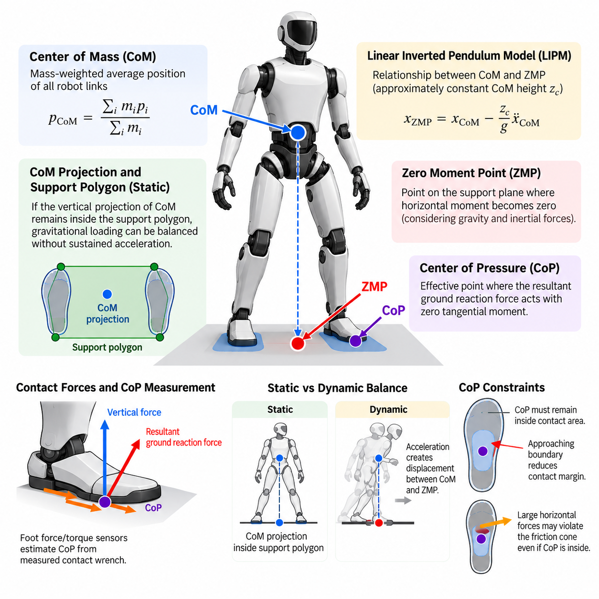
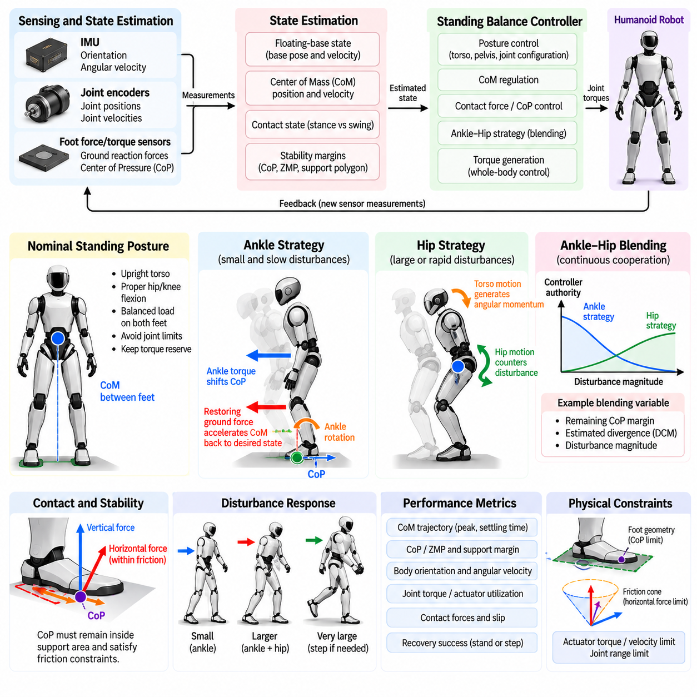
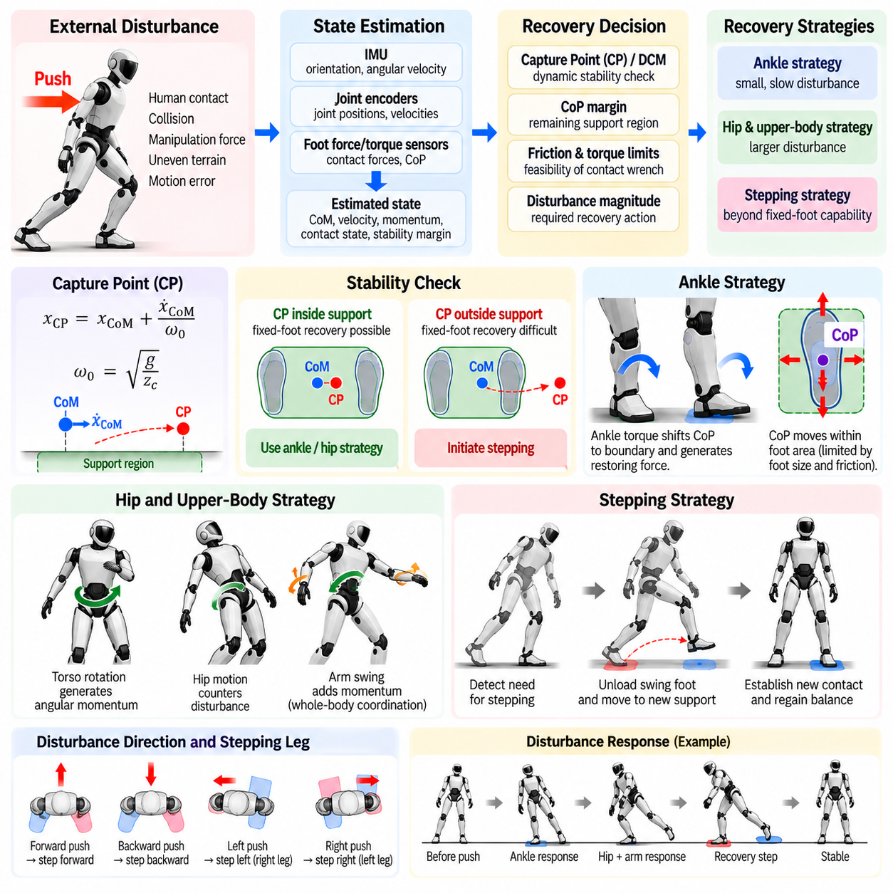
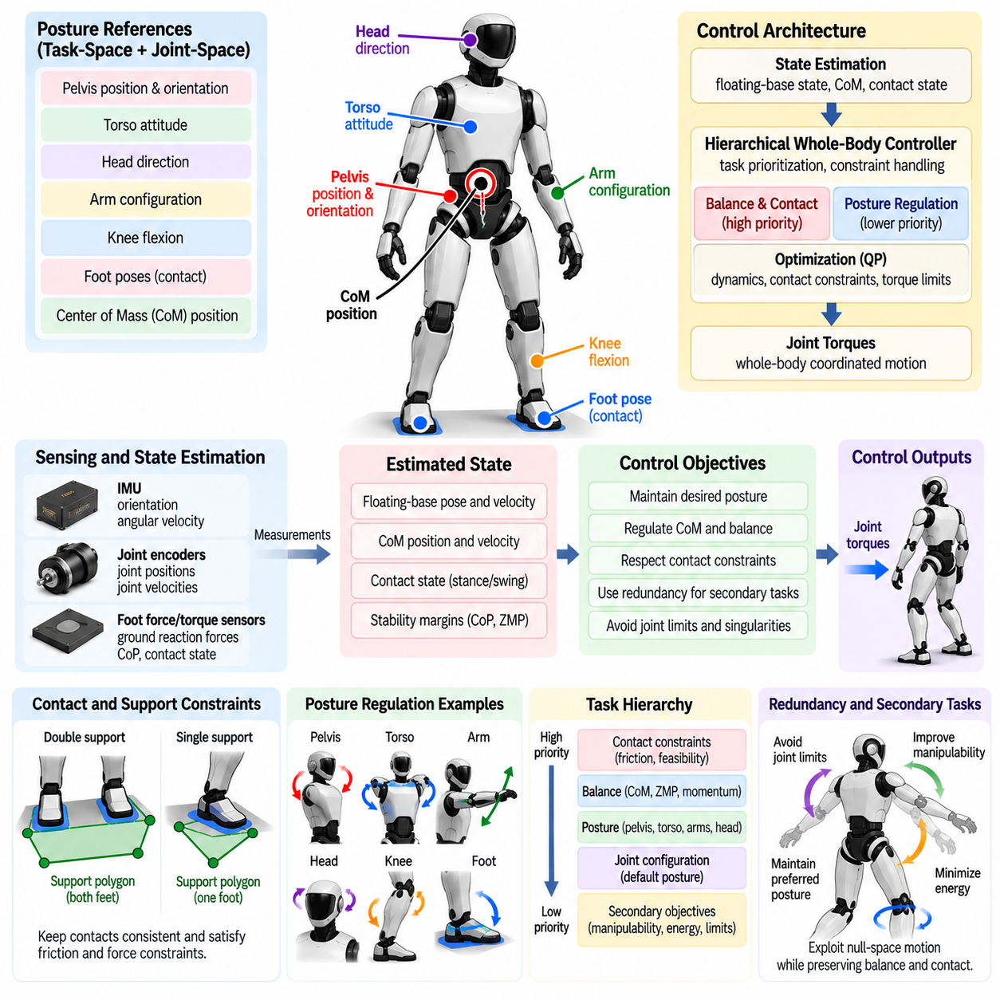
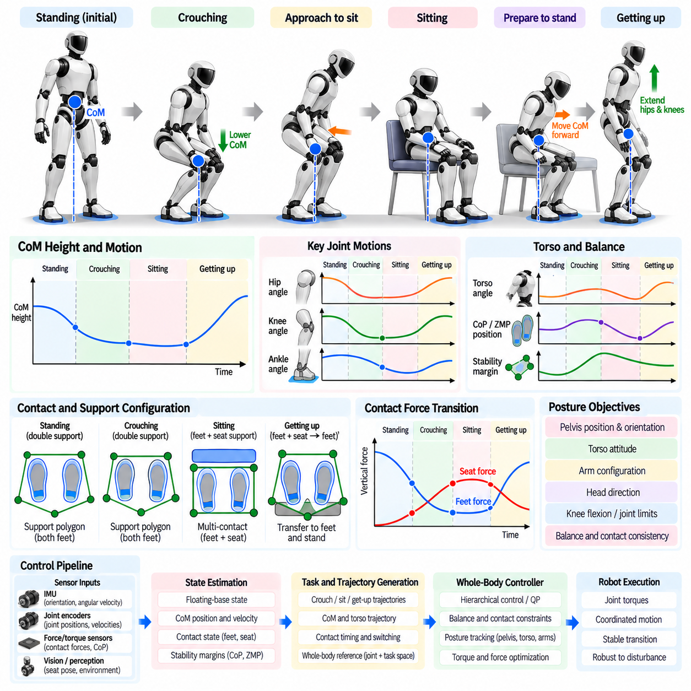
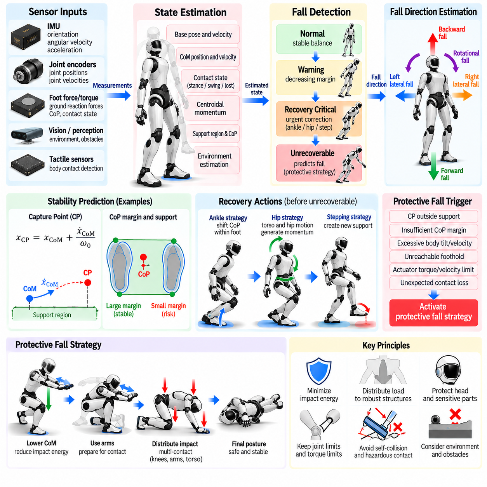
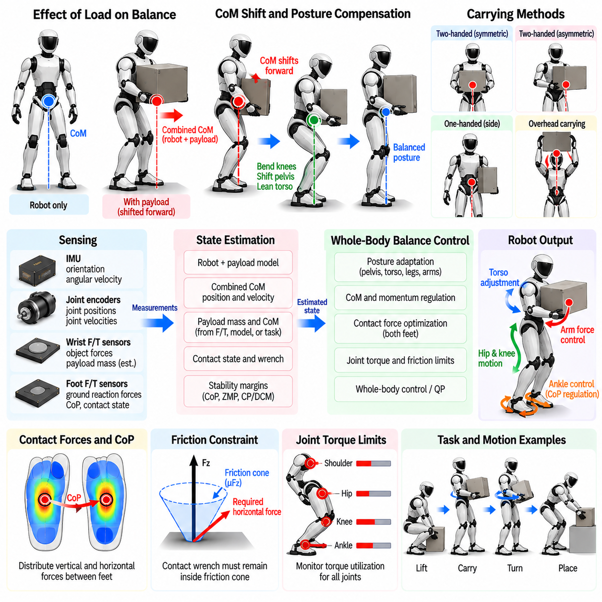
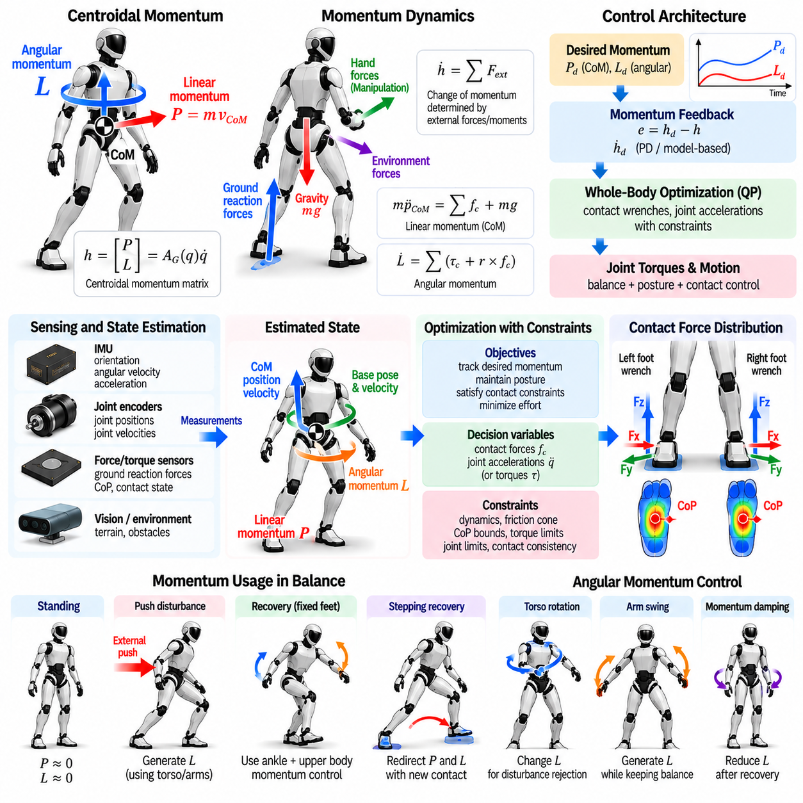
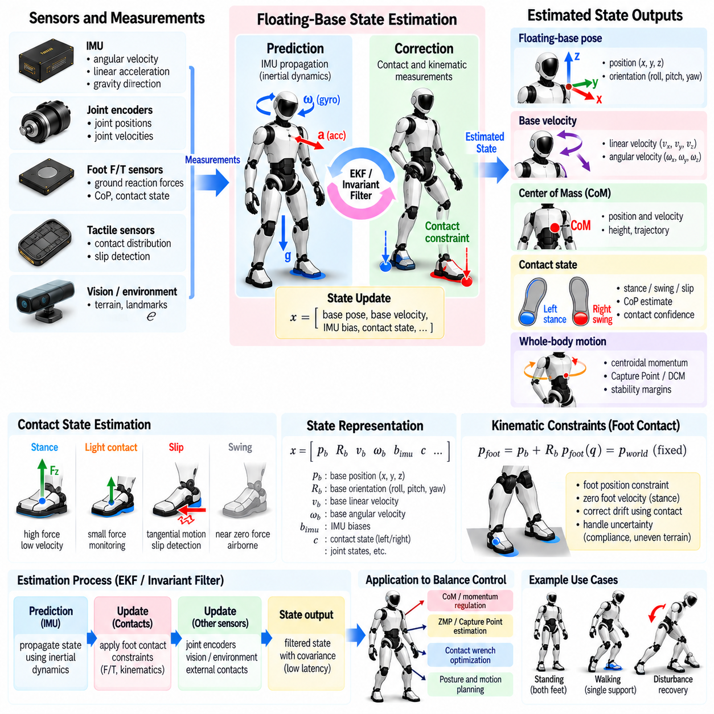
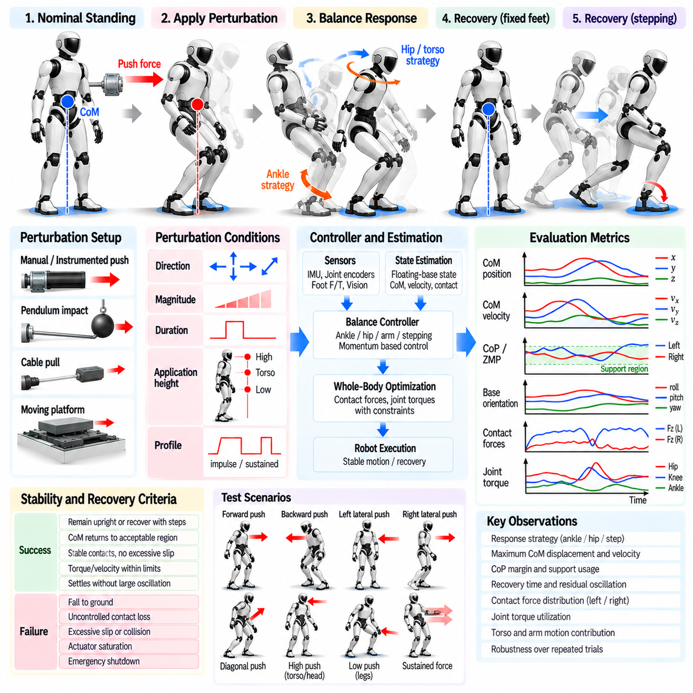

**Volume 22. Humanoid Robot Software**

# Chapter 04. Balance and Posture Control

## 04.01. Humanoid Balance Theory CoM CoP ZMP

{width="7.268055555555556in" height="7.268055555555556in"}

Humanoid balance is fundamentally the problem of regulating the relationship between the robot's mass distribution, ground contact forces, and allowable support region. Unlike fixed-base manipulators, a humanoid must continuously prevent its floating body from developing motion that cannot be arrested through available contacts. Center of Mass (CoM), Center of Pressure (CoP), and Zero Moment Point (ZMP) therefore provide complementary descriptions of balance from geometric, force-interaction, and dynamic perspectives. Volume_22_Humanoid_Robot_Softwa...

The Center of Mass represents the mass-weighted average position of all robot links and provides a compact description of the global configuration of the humanoid. For links with masses \\(m_i\\) and individual center positions \\(p_i\\), the whole-body CoM is obtained from \\(p_{CoM}=\\sum_i m_i p_i/\\sum_i m_i\\). Joint motion, torso inclination, arm motion, payload manipulation, and leg configuration all modify this position, making CoM regulation a whole-body problem rather than a leg-only problem.

For static balance, a useful first approximation is the projection of the CoM onto the ground. When the vertical projection remains inside the support polygon generated by the active contacts, gravitational loading can generally be balanced without requiring sustained acceleration. During double support the polygon spans both feet, while single support reduces the admissible region approximately to the supporting foot. This geometric criterion is intuitive, but it becomes insufficient once significant acceleration, angular momentum, or external disturbance appears.

The Center of Pressure describes the effective point on a contact surface through which the resultant ground reaction force acts with zero tangential moment about that surface. Foot force/torque sensors can estimate CoP from measured contact wrench components, allowing the controller to observe how the robot is loading the sole. A CoP approaching a foot boundary indicates diminishing contact margin; once the required pressure location leaves the physical support area, the assumed flat-foot contact can no longer generate the demanded balancing wrench.

CoP is particularly useful because it connects whole-body motion to measurable ground interaction. A standing controller may intentionally shift CoP toward the toes or heels to accelerate the CoM, while lateral CoP motion can regulate side-to-side sway. However, the CoP is constrained by contact geometry and friction. The controller cannot arbitrarily command it beyond the support surface, and large horizontal forces may violate the friction cone even when the desired pressure point remains geometrically inside the foot.

The Zero Moment Point extends the balance description to dynamic motion. ZMP is conventionally defined as the point on the support plane where the horizontal components of the resultant moment generated by gravity and inertial forces become zero. If the computed or commanded ZMP remains within the feasible support region, the ground contacts can generally produce the wrench required by the planned motion under the assumptions of the model. ZMP therefore became a central concept in classical humanoid walking and posture stabilization.

Under the Linear Inverted Pendulum Model (LIPM), the relationship between horizontal CoM position and ZMP becomes especially clear. Assuming approximately constant CoM height \\(z_c\\), negligible angular-momentum variation, and a flat support plane, the sagittal relation can be expressed as \\(x_{ZMP}=x_{CoM}-(z_c/g)\\ddot{x}_{CoM}\\), with an analogous equation in the lateral direction. Thus ZMP is not simply the ground projection of CoM; acceleration causes a dynamic displacement between them.

This distinction explains why a humanoid may remain dynamically balanced even when the instantaneous CoM projection approaches or temporarily passes a simple static boundary. By appropriately accelerating the body and relocating future contacts, the controller can manage the evolving dynamics rather than satisfying only a static geometric condition. Conversely, a CoM projection inside the support polygon does not guarantee robust dynamic stability if momentum is rapidly carrying the robot toward a state from which available contact forces cannot recover it.

CoM, CoP, and ZMP should therefore be interpreted as related but non-identical quantities. CoM describes the distribution of robot mass, CoP represents the location of the resultant measured or commanded contact pressure, and ZMP expresses a dynamic moment-balance condition. In idealized planar flat-foot contact, measured CoP and ZMP may coincide closely, but their conceptual roles differ. Practical software should preserve this distinction because sensor estimation, model prediction, and reference generation use these quantities differently.

The support polygon provides the geometric feasibility region commonly associated with CoP and ZMP. For multiple coplanar contacts, it can be constructed from the convex hull of the active contact areas. Controllers normally retain a safety margin rather than exploiting the exact boundary because model uncertainty, sole compliance, force-sensor noise, contact deformation, timing error, and friction variation reduce usable stability margin. A planned ZMP trajectory near an edge may therefore be mathematically feasible yet operationally fragile.

Humanoid balance also depends on angular momentum, which simple ZMP and LIPM formulations deliberately simplify. Rapid arm swings, torso rotation, manipulation forces, and whole-body recovery motions can generate substantial centroidal angular momentum. More complete formulations use centroidal dynamics to relate CoM acceleration, contact forces, contact moments, and angular-momentum rate. This enables the robot to exploit upper-body motion as part of balance regulation instead of treating the body as a point mass above a massless support mechanism.

External disturbances reveal the hierarchy of balance mechanisms particularly clearly. Small disturbances can often be rejected by changing ankle torque and moving CoP within the foot. Larger disturbances may require hip and torso motion to reshape whole-body momentum. If the required ground reaction can no longer be generated within the existing support region, the robot must change its contact configuration through a recovery step. Balance is therefore better understood as management of feasible momentum and contact transitions than as merely keeping CoM above the feet.

The sagittal and lateral directions also present different practical constraints. Human-like feet usually provide greater support length in the forward-backward direction than width in the lateral direction, while leg configuration and self-collision further affect feasible motion. A controller must consequently consider direction-dependent stability margins. During walking, the support region also changes discontinuously between double support and single support, requiring smooth reference generation despite rapidly changing contact constraints.

Reliable balance software depends strongly on state estimation. Joint encoders and the robot model estimate link configuration and CoM, while an inertial measurement unit contributes base orientation and angular velocity. Foot force/torque sensing provides contact wrench and CoP information, and contact estimation determines which feet or other body surfaces should participate in the support model. Errors in floating-base pose or contact state can corrupt the estimated stability condition even when the underlying controller is mathematically correct.

In a practical control architecture, desired posture and motion generate CoM and momentum objectives, while a planner produces feasible contact and ZMP or CoP references. A lower-level whole-body controller then distributes the required forces and joint torques across available contacts while respecting friction, actuator, kinematic, and contact constraints. This organization naturally connects balance theory to the subsequent standing, push-recovery, posture-regulation, momentum-control, and floating-base estimation functions defined for the humanoid balance chapter. Volume_22_Humanoid_Robot_Softwa...

Balance quality should therefore be evaluated using margins rather than a single binary stable-or-unstable condition. Useful quantities include minimum distance of CoP or ZMP from the support boundary, CoM tracking error, centroidal momentum, contact-force distribution, friction margin, torso orientation, and recovery capability after perturbation. Monitoring these quantities over time provides a more meaningful representation of robustness than checking whether one instantaneous point lies inside a polygon.

Ultimately, CoM, CoP, and ZMP form a foundational vocabulary for understanding humanoid balance, but none should be treated as a complete stability theory by itself. CoM captures global mass motion, CoP exposes physical interaction with the support surface, and ZMP links desired dynamics to feasible contact moments. Their combined interpretation establishes the conceptual bridge from static posture to dynamic balance, disturbance recovery, whole-body momentum regulation, and eventually locomotion-manipulation behaviors in which contact and mass distribution continually change.

## 04.02. Standing Balance Controller Ankle Hip Strategy [w/Code]

{width="7.268055555555556in" height="7.268055555555556in"}

Standing balance control enables a humanoid robot to maintain an upright posture while compensating for modeling errors, sensor noise, small surface variations, internal body motion, and external disturbances. Even when the desired posture is nominally static, the robot behaves as a dynamically coupled floating-base system. A practical controller must therefore regulate body orientation, Center of Mass motion, contact forces, and joint torques continuously rather than simply holding fixed joint angles.

The standing controller operates on top of reliable state and contact estimation. Joint encoders describe the articulated configuration, while an IMU estimates torso orientation and angular velocity. Foot force/torque sensors provide ground reaction forces and Center of Pressure information. These measurements are fused with the robot model to estimate CoM position and velocity, floating-base motion, contact state, and stability margins required by the balance feedback loops.

A nominal standing posture defines the equilibrium around which stabilization is performed. The desired configuration normally places the CoM between the feet, keeps the torso approximately upright, maintains suitable knee and hip flexion, and distributes vertical load across both feet. The reference should avoid joint limits and provide sufficient torque reserve because a geometrically stable posture with saturated actuators may offer little practical capability for disturbance rejection.

The ankle strategy is the primary response to relatively small and slow disturbances. The humanoid behaves approximately like an inverted pendulum rotating around the ankle region while both feet remain firmly in contact with the ground. Corrective ankle torques shift the Center of Pressure within the available foot area, generating horizontal ground reaction forces that accelerate the CoM back toward its desired state without requiring large motion of the upper body.

In the sagittal direction, ankle pitch torque primarily regulates forward and backward sway. If the robot begins falling forward, the controller modifies ankle torque and the corresponding pressure distribution to create a restoring effect. Ankle roll performs a similar function for lateral sway. Because these actions preserve the overall posture and require relatively little joint motion, ankle regulation is usually preferred whenever the required CoP remains comfortably inside the support polygon.

A simple ankle controller can be constructed from feedback of body angle, angular velocity, CoM error, or CoP error. Proportional and derivative terms generate corrective torque according to the deviation from the desired equilibrium. More advanced implementations may use state-space control, Linear Quadratic Regulation, Model Predictive Control, or whole-body optimization, but the underlying objective remains similar: produce a feasible contact wrench that reverses the unstable motion before the support margin is exhausted.

The effectiveness of ankle control is fundamentally limited by foot geometry and contact conditions. The commanded CoP cannot move beyond the physical sole, while horizontal ground reaction forces must remain compatible with available friction. Actuator torque and velocity limits further constrain corrective action. As disturbance magnitude increases, the ankle controller may demand a pressure location or contact wrench that cannot physically be generated, indicating that another balance mechanism must become dominant.

The hip strategy addresses disturbances that are too rapid or too large for ankle regulation alone. Instead of treating the entire body as a nearly rigid inverted pendulum, the controller deliberately creates relative motion between the upper and lower body. Rapid hip and torso motion changes whole-body angular momentum and modifies the dynamics of the CoM, allowing the robot to counter disturbances without immediately changing the support contact configuration.

When the humanoid is pushed forward, for example, coordinated hip extension and torso motion can generate angular momentum that opposes the developing fall. The legs, pelvis, torso, and sometimes the arms participate in this response. Because upper-body segments contain substantial mass, relatively modest joint motions can significantly influence centroidal momentum. The hip strategy therefore expands the recoverable disturbance range beyond what can be achieved through CoP modulation alone.

The ankle and hip strategies should not normally be implemented as completely independent operating modes. Human-like robust balance emerges from coordinated use of both mechanisms. Small disturbances can be handled predominantly by ankle torque, while increasing disturbance magnitude progressively activates hip and torso motion. A continuous blending mechanism avoids abrupt controller switching and allows the robot to exploit the available support margin and momentum authority simultaneously.

One practical blending variable is the remaining CoP margin. While the measured or predicted CoP remains near the center of the foot, the controller can assign greater authority to ankle regulation. As the CoP approaches the support boundary, additional ankle torque becomes less useful because the contact wrench is approaching its feasibility limit. The controller can then increase hip, torso, and whole-body momentum objectives before the balance state becomes unrecoverable.

Frequency characteristics provide another interpretation of strategy selection. Slow body sway can often be corrected efficiently through ankle motion because sufficient time exists to relocate the CoP and gradually accelerate the CoM. Fast disturbances require a more immediate response, making rapid upper-body angular momentum generation valuable. A controller may therefore distribute correction across ankle and hip joints according to both disturbance magnitude and frequency rather than relying on a fixed threshold.

Standing balance also requires coordinated control in sagittal and lateral directions. Lateral stability is often more restrictive because humanoid feet provide less support width than forward-backward length. Hip abduction and adduction, ankle roll, pelvis translation, and torso lean can be coordinated to maintain lateral balance. During narrow stance, the available lateral CoP range becomes especially small, increasing the importance of whole-body momentum regulation and accurate state estimation.

Force distribution between the two feet forms another important layer of standing control. In double support, the controller can modify not only the CoP within each foot but also the proportion of total load carried by the left and right legs. Appropriate load transfer can enlarge the effective control authority for lateral stabilization and prepare the robot for subsequent stepping. However, excessive unloading of one foot may reduce frictional capability or unintentionally initiate a contact transition.

A modern implementation often expresses standing stabilization as a hierarchy of whole-body objectives. High-priority constraints maintain valid foot contacts, friction limits, actuator limits, and safe joint configurations. Balance objectives regulate CoM acceleration, torso orientation, centroidal momentum, and contact wrench. Lower-priority posture objectives keep the arms, pelvis, knees, and other joints near comfortable configurations without interfering with the forces required to preserve stability.

The controller must also account for compliant structures and imperfect ground contact. Real humanoid feet, shoes, force sensors, transmissions, and joint mechanisms introduce elasticity that differs from an ideal rigid-contact model. Uneven floors can further change the effective contact geometry. Excessively aggressive feedback gains may excite structural oscillations, while gains that are too low permit large body sway. Filtering, damping, contact estimation, and experimentally validated gain scheduling are therefore essential.

Disturbance monitoring provides the transition from ordinary standing stabilization toward active recovery behavior. CoM velocity, body angular velocity, CoP margin, ZMP margin, centroidal momentum, and predicted future balance state can indicate whether the current ankle-and-hip response remains sufficient. Rather than waiting until the measured CoP reaches the edge of the foot, predictive logic can identify when existing contacts will soon become incapable of arresting the motion.

If both ankle and hip strategies are insufficient, the controller must recognize that maintaining the original foot placement is no longer the correct objective. At this point a stepping strategy becomes necessary, creating a new support region in the direction of the disturbance. This produces a natural hierarchy of recovery behavior: ankle regulation handles small disturbances, hip and whole-body momentum regulation handle larger disturbances, and contact relocation handles disturbances beyond the recoverable range of fixed-foot standing.

Validation of a standing controller should examine more than whether the robot remains upright. Relevant measurements include peak CoM displacement, settling time, torso-angle deviation, CoP excursion, contact-force distribution, maximum joint torque, residual oscillation, and the magnitude of disturbance that can be rejected without stepping. Repeated perturbations from different directions and magnitudes reveal whether ankle-to-hip coordination remains consistent across the practical operating envelope.

A robust standing balance controller therefore combines local ankle torque regulation with coordinated hip and whole-body motion rather than relying on a single stabilization mechanism. The ankle strategy efficiently exploits the available contact-pressure region, while the hip strategy uses internal body motion and angular momentum when that region becomes insufficient. Their coordinated operation provides the foundation for push recovery, posture regulation, momentum-based balance control, and safe transition from stationary standing to dynamic humanoid motion.

## 04.03. Push Recovery from External Disturbance [w/Code]

{width="7.268055555555556in" height="7.268055555555556in"}

Push recovery is the capability of a humanoid robot to restore a stable state after an unexpected external disturbance changes its posture, velocity, or momentum. A push may originate from human contact, collision with an object, manipulation reaction forces, uneven terrain, or errors in planned motion. Effective recovery requires rapid estimation of the disturbance and coordinated use of contact forces, body momentum, and contact relocation before the unstable motion becomes irreversible.

Unlike nominal standing stabilization, push recovery must explicitly consider the robot's evolving dynamic state. Immediately after an impulse, the Center of Mass may still lie inside the support polygon while its velocity is already carrying the robot toward failure. Position-based stability measures alone are therefore insufficient. Recovery logic must evaluate CoM velocity, body angular velocity, contact wrench, Center of Pressure, centroidal momentum, and the remaining ability of existing contacts to decelerate the motion.

A useful interpretation of recoverability is provided by the Capture Point concept. For a simplified Linear Inverted Pendulum Model with constant CoM height, the Capture Point represents the ground location at which the robot could place support and eventually come to rest without continued stepping. In one horizontal direction it can be approximated as \\(x_{CP}=x_{CoM}+\\dot{x}_{CoM}/\\omega_0\\), where \\(\\omega_0=\\sqrt{g/z_c}\\). The term involving CoM velocity makes the criterion inherently dynamic.

When the Capture Point remains inside the available support region, the disturbance may often be rejected without changing foot placement. The controller can shift the CoP and generate an appropriate ground reaction force to decelerate the CoM. If the Capture Point moves outside the feasible region, fixed-foot recovery becomes increasingly difficult or impossible under the simplified model. This provides a physically meaningful trigger for escalating from ankle regulation toward hip motion or stepping.

The first recovery mechanism is generally the ankle strategy. Corrective ankle torque moves the CoP toward the boundary of the foot and produces a restoring horizontal force. This response is efficient because it requires little change in overall posture and preserves the original contact configuration. Its effectiveness, however, is limited by sole dimensions, friction, ankle torque capability, and the remaining distance between the current CoP and the support boundary.

For larger disturbances, the robot can exploit the hip strategy and upper-body motion. Rapid rotation of the torso, pelvis, and arms changes centroidal angular momentum and modifies the relationship between CoM motion and ground reaction forces. This mechanism can temporarily extend recovery capability beyond the range available through ankle torque alone. The controller must coordinate these motions carefully because excessive upper-body rotation may create secondary momentum that must later be dissipated.

Arm motion can also contribute significantly to disturbance rejection. Because humanoid arms possess distributed mass and relatively large motion ranges, fast arm swings can generate useful angular momentum while the feet remain fixed. Such behavior is analogous to human reactions during balance loss. Nevertheless, arm motion should be integrated into a whole-body optimization framework so that balance recovery does not violate joint limits, cause self-collision, or interfere with objects being manipulated.

A practical recovery controller should continuously estimate whether the current contact configuration can still arrest the unstable motion. This estimate can combine Capture Point or Divergent Component of Motion behavior with CoP margin, friction constraints, joint torque reserve, and predicted momentum evolution. Recovery decisions should therefore be based on future feasibility rather than waiting for the robot to reach a geometric boundary where corrective options have already become severely restricted.

When fixed-contact recovery is no longer feasible, the robot must create a new support region through stepping. The recovery step should be placed so that the new contact can capture the divergent motion while remaining kinematically reachable and collision-free. Step location depends on CoM state, disturbance direction, swing-leg capability, terrain geometry, and available time. A theoretically ideal foothold is useless if the leg cannot reach it before the robot loses balance.

Step timing is as important as step position. Strong disturbances shorten the time available before the unstable component of motion grows beyond recoverability. The controller may need to interrupt a nominal standing or locomotion plan, rapidly unload the selected swing foot, generate a shortened swing trajectory, and establish a new contact. This emergency behavior differs from ordinary gait generation because recovery priority may temporarily override comfort, symmetry, or nominal walking objectives.

The choice of stepping leg depends on disturbance direction and current load distribution. A forward push may require a forward step, while lateral disturbances often demand rapid widening of the support base. Diagonal pushes produce coupled sagittal and lateral requirements that cannot be treated independently. The controller should evaluate candidate footholds in two dimensions or three dimensions while considering reachability, terrain, self-collision, and the expected support polygon after touchdown.

Multiple steps may be required when a single contact relocation cannot dissipate the disturbance. After the first recovery step, the robot should immediately reevaluate its dynamic state rather than assuming stability has been restored. Residual CoM velocity or angular momentum may require a second or third step. This naturally leads to receding-horizon recovery strategies in which foot placement and momentum regulation are repeatedly updated as new state estimates become available.

Push recovery must also handle disturbances that occur during walking. In this case the robot already has a planned swing foot, changing support phases, and nonzero momentum. The controller can modify the current foothold, accelerate or delay touchdown, adjust step width or length, or replace the planned contact sequence entirely. Recovery therefore becomes tightly coupled with locomotion control rather than functioning as a separate standing-only safety behavior.

Whole-body control provides the execution layer for these recovery decisions. Desired CoM acceleration, torso orientation, centroidal momentum, foot motion, and contact wrench can be formulated as coordinated objectives while friction cones, unilateral contacts, torque limits, joint limits, and self-collision remain explicit constraints. Priority or optimization-based control allows balance-critical tasks to temporarily dominate nominal posture and manipulation objectives during a disturbance.

Accurate and low-latency state estimation is essential because push recovery operates under severe time constraints. IMU measurements reveal sudden angular motion, joint encoders describe configuration changes, and foot force/torque sensors detect variations in contact wrench and pressure distribution. Estimated floating-base velocity and CoM velocity are particularly important because a small velocity error can produce a substantial error in predicted Capture Point or future balance state.

Disturbance detection should distinguish genuine external perturbations from expected dynamic forces. Rapid acceleration caused by intentional arm motion, payload handling, or gait transition should not unnecessarily trigger emergency recovery. Model-based residuals, momentum observers, force sensing, and contact information can help identify unexpected external impulses. The detection threshold must balance sensitivity against false activation, especially in robots operating physically close to humans.

Recovery behavior must respect safety even when preventing a fall is the dominant objective. A large emergency step can create collision risk for nearby people, while aggressive arm motion may strike surrounding objects. The controller should therefore combine dynamic recovery requirements with environmental awareness and collision constraints. In some situations, controlled protective falling may be safer than attempting an infeasible recovery maneuver that increases risk to humans or hardware.

Validation requires controlled perturbation experiments with repeatable direction, magnitude, duration, and application point. Tests should progressively cover forward, backward, lateral, and diagonal pushes while recording CoM motion, Capture Point, CoP, contact forces, joint torques, step timing, and recovery duration. The resulting recovery envelope characterizes the range of disturbances that can be rejected with fixed feet, one step, multiple steps, or cannot be safely recovered.

A mature push-recovery system is therefore not a single reflex but a hierarchy of dynamically coordinated responses. Small disturbances are rejected through ankle and CoP modulation, larger disturbances recruit hip and whole-body momentum, and disturbances beyond fixed-contact capability trigger one or more recovery steps. By continuously predicting recoverability and selecting the least disruptive feasible response, the humanoid can transform balance control from passive posture maintenance into active management of unexpected physical interaction.

## 04.04. Whole Body Posture Regulation [w/Code]

{width="7.268055555555556in" height="7.268055555555556in"}

Whole-body posture regulation maintains a humanoid robot near a desired body configuration while preserving balance, contact consistency, and physical feasibility. Unlike simple joint-position control, posture regulation must account for the floating base and strong dynamic coupling among the legs, pelvis, torso, arms, and head. A motion at one joint changes mass distribution and momentum elsewhere, so posture must be treated as a coordinated whole-body control problem.

A desired posture is usually represented by a combination of joint configurations and task-space quantities rather than a single vector of joint angles. Important references may include pelvis position and orientation, torso attitude, head direction, arm configuration, knee flexion, foot poses, and Center of Mass position. These references define a nominal body shape while allowing the controller to modify individual joints when balance or contact constraints require corrective motion.

Posture regulation operates within the constraints imposed by active contacts. During double-support standing, both feet should remain compatible with the ground while the remaining joints regulate the desired configuration. In single support or multi-contact situations, the available motion changes because the supporting contacts constrain the floating base. The controller must therefore distinguish unconstrained posture objectives from contact conditions that cannot be violated without changing the support mode.

A basic joint-space posture objective can be constructed from the difference between desired and measured joint positions and velocities. Proportional and derivative feedback generates restoring commands that drive joints toward their references while damping oscillatory motion. However, applying independent joint controllers without considering whole-body dynamics may create conflicting torques, disturb contact forces, or move the CoM toward an unsafe region, particularly in highly coupled humanoid configurations.

Task-space regulation provides a more physically meaningful way to control important body segments. Instead of prescribing every joint directly, the controller can regulate pelvis height, torso orientation, hand pose, head direction, or other operational quantities. Inverse kinematics or whole-body optimization then determines the coordinated joint motion required to achieve these objectives. This allows redundant degrees of freedom to be used for secondary posture and balance requirements.

The pelvis plays a central role because it connects the upper body to both legs and strongly influences the floating-base configuration. Pelvis orientation affects leg kinematics, torso alignment, and load distribution, while pelvis translation changes the relationship between the CoM and support region. A posture controller therefore commonly regulates pelvis height and attitude while allowing limited horizontal motion when balance correction requires the body to shift over the feet.

Torso regulation is equally important for maintaining a useful and stable humanoid configuration. Keeping the torso approximately upright supports perception, manipulation, and human interaction while limiting unnecessary angular momentum. Nevertheless, rigidly fixing torso orientation can reduce recovery capability. The controller should permit controlled torso motion when ankle authority becomes insufficient or when whole-body momentum must be generated to reject a disturbance.

The arms and head are often assigned lower-priority posture objectives when they are not executing manipulation or perception tasks. Their joints can be maintained near comfortable nominal configurations that avoid self-collision and joint limits. Because arm motion changes the CoM and angular momentum, even apparently secondary posture regulation must remain coordinated with balance. During disturbances, arm posture objectives may be relaxed temporarily so the arms can contribute to recovery.

Redundancy is one of the main advantages of whole-body posture regulation. A humanoid typically possesses more degrees of freedom than are required to satisfy the highest-priority balance and contact tasks. The remaining null-space motion can be used to maintain preferred joint configurations, improve manipulability, avoid singularities, minimize energy, or increase distance from joint limits. This allows posture quality to improve without significantly interfering with primary stability objectives.

Hierarchical control provides a systematic method for resolving conflicts between posture and safety-critical tasks. Contact constraints, friction feasibility, and balance objectives normally receive higher priority than nominal posture tracking. Torso, pelvis, arm, and joint configuration objectives can then occupy lower levels. If two objectives conflict, the lower-priority posture task is modified rather than allowing the controller to violate a contact condition or destabilize the robot.

Optimization-based approaches can formulate posture regulation together with whole-body dynamics in a quadratic programming framework. Decision variables may include generalized accelerations, joint torques, and contact forces. Desired posture accelerations appear as tracking objectives, while rigid-contact equations, friction cones, torque limits, acceleration bounds, and joint limits become constraints. This formulation produces dynamically consistent commands while exposing explicit tradeoffs among competing objectives.

Joint-limit avoidance must be integrated before the robot reaches a mechanical boundary. A controller can introduce configuration-dependent penalties or repulsive objectives that increase as a joint approaches its allowable range. Similar methods can keep the robot away from kinematic singularities where small task-space motions require excessive joint velocity. Preventive regulation is preferable to abruptly clipping commands because discontinuous saturation can disturb balance and produce undesirable contact forces.

Self-collision avoidance is another essential posture constraint for high-degree-of-freedom humanoids. Arms can collide with the torso, hands can intersect the legs, and the knees or feet can enter undesirable configurations during large corrective motions. Collision distances can be monitored and converted into inequality constraints or repulsive objectives. This becomes particularly important when balance recovery temporarily produces motions that differ significantly from the nominal posture.

Posture transitions should be generated smoothly rather than commanding an instantaneous change from one configuration to another. Reference interpolation can limit joint velocity, acceleration, and jerk while maintaining feasible CoM and contact behavior. Smooth transitions are especially important when changing torso inclination, pelvis height, stance width, or knee flexion because these motions redistribute mass and contact forces. A posture trajectory must therefore be evaluated dynamically, not only geometrically.

Compliance improves posture regulation when the robot interacts with uncertain environments or humans. Impedance control can define a desired relationship between configuration error and corrective force rather than enforcing perfectly rigid tracking. Lower stiffness may be appropriate for the arms or torso during physical interaction, while the legs require sufficient authority to preserve support. Variable stiffness and damping allow the robot to adapt posture behavior according to task and contact conditions.

Whole-body posture regulation depends on accurate state estimation and a consistent robot model. Joint encoders provide configuration information, while the IMU estimates floating-base orientation and motion. Contact sensing determines which kinematic constraints should be active, and force measurements reveal whether the intended load distribution is physically realized. Errors in these quantities can cause the optimizer to compensate for a posture deviation that does not actually exist or to generate inconsistent contact commands.

Payloads and external forces modify the posture-control problem because they change the effective mass distribution and required joint torques. Holding a heavy object in front of the torso shifts the combined CoM and increases loading on the back, hip, knee, and ankle joints. The controller should compensate by adjusting pelvis, torso, and leg configuration while redistributing ground reaction forces. Maintaining the original unloaded posture may be inefficient or dynamically infeasible.

Posture quality should be monitored using both tracking and feasibility measures. Joint error, torso orientation error, pelvis deviation, CoM position, contact-force balance, torque utilization, distance from joint limits, and self-collision margin provide complementary information. A small joint-space tracking error does not necessarily indicate a good posture if actuators are near saturation or stability margin is poor. Evaluation should therefore consider the entire physical state.

During disturbance recovery, nominal posture regulation should degrade gracefully rather than compete with balance control. When a strong push occurs, the controller may permit temporary torso lean, arm swing, deeper knee flexion, or pelvis displacement. After the disturbance has been rejected, posture objectives can gradually restore the preferred configuration. This separation between temporary recovery motion and long-term posture restoration prevents unnecessary conflicts during safety-critical behavior.

Whole-body posture regulation therefore serves as the continuous configuration-management layer between balance objectives and task execution. It maintains a useful nominal body shape while exploiting redundancy, respecting contacts, and yielding when stability requires corrective motion. By combining joint-space regulation, task-space objectives, hierarchical optimization, limit avoidance, and dynamic feasibility, the humanoid can preserve stable and adaptable posture across standing, manipulation, recovery, and locomotion.

## 04.05. Sitting Crouching Getting Up Posture Control [w/Code]

{width="7.268055555555556in" height="7.268055555555556in"}

Sitting, crouching, and getting-up motions require a humanoid robot to perform large whole-body posture transitions while continuously preserving balance and contact feasibility. Unlike small standing corrections, these behaviors involve substantial changes in Center of Mass height, joint configuration, support geometry, and actuator loading. Successful control therefore requires coordinated trajectory generation for the pelvis, torso, legs, and arms rather than independent joint-position commands.

Crouching is typically produced by coordinated flexion of the hip, knee, and ankle joints while lowering the pelvis and Center of Mass. The controller must maintain the horizontal CoM location within a dynamically feasible region as the body descends. Knee flexion changes leg leverage and required joint torque, while torso inclination can compensate for the changing mass distribution. The resulting motion should preserve sufficient foot contact and avoid excessive loading near joint limits.

The desired crouching depth should be selected according to mechanical range, actuator capability, balance margin, and task requirements. A shallow crouch can increase compliance and prepare the robot for lifting or disturbance recovery, whereas a deep crouch may be required to reach low objects or transition toward sitting. As depth increases, knee and hip torque demands can become substantial, making torque limits and thermal constraints important components of trajectory feasibility.

Smooth vertical Center of Mass regulation is essential during crouching. Rapid downward acceleration may unload the feet, while aggressive deceleration near the target posture can produce large ground reaction forces. The controller should therefore generate bounded position, velocity, acceleration, and preferably jerk profiles for pelvis height. Whole-body optimization can distribute the required motion across the ankle, knee, hip, and torso while maintaining desired contact forces.

Sitting introduces an additional contact transition because support gradually changes from the feet alone to a combination of feet and the seat. Before contact, the robot must position its pelvis relative to the chair while maintaining standing balance. The descent trajectory should move the pelvis toward the expected seat location without allowing the CoM to develop excessive backward velocity. Perception and geometric estimation are required when the seat pose is not precisely known in advance.

The approach to the seat should remain dynamically conservative because premature or misplaced contact can destabilize the robot. The controller can reduce descent velocity as the expected contact point approaches and monitor force, torque, or tactile information for actual seat contact. Once contact is detected, the control model should update the active contact set rather than continuing to treat the pelvis as unconstrained. This transition prevents conflicting motion and force commands.

After seat contact, vertical load should be transferred progressively from the legs to the seat. An abrupt transfer can create impact forces or cause the feet to slip, while unloading the legs too early may allow the pelvis to fall onto the chair. Contact-force regulation can manage this process by increasing seat support while reducing foot loading in a controlled manner. The torso and pelvis should remain coordinated so that the combined support configuration stays stable throughout the transfer.

The final seated posture should satisfy more than geometric comfort. Feet should remain placed where they can support a later standing transition, the knees and hips should remain within safe ranges, and the torso should retain sufficient mobility for manipulation or interaction tasks. The robot should also avoid configurations in which joint torque or contact friction is unnecessarily high. Planning the seated posture with the future getting-up motion in mind improves overall robustness.

Getting up from a chair reverses the support transition but is not simply a time-reversed sitting trajectory. The robot must first generate a configuration from which the legs can produce sufficient vertical and forward force. A common strategy moves the torso and CoM forward over the feet before significant seat unloading begins. This forward transfer creates a mechanically favorable condition for lifting the pelvis while preventing the body from rotating backward as seat support disappears.

During the initial getting-up phase, the feet and seat form a multi-contact system. The controller can use the seat reaction force while repositioning the upper body and preparing the legs for load acceptance. As the CoM moves forward, vertical force is gradually transferred toward the feet. Seat contact should be released only when the legs possess sufficient torque reserve and the projected dynamic state can be supported by the foot contact region.

The lift phase requires coordinated extension of the knee and hip joints together with ankle and torso regulation. Large knee-extension torque is often required when the pelvis is low, while hip extension raises and stabilizes the upper body. The ankle regulates the relationship between CoM motion and the support area. Rather than forcing identical joint trajectories for every situation, the controller should adapt the motion according to seat height, body configuration, payload, and actuator capability.

Torso motion is particularly important during getting up. Forward trunk inclination shifts the CoM toward the feet and reduces the tendency to fall backward during seat unloading. As the pelvis rises, the torso can gradually return toward an upright orientation. Excessive forward inclination, however, can generate large recovery demands near the end of the motion, so torso and pelvis trajectories should be planned together rather than controlled as unrelated posture variables.

Arm support can extend the feasible range of sitting and getting-up behaviors. If handrails, armrests, or other stable surfaces are available, the hands can create additional contacts that reduce leg torque requirements and enlarge the support region. Such contacts must be explicitly represented in the whole-body controller, including unilateral force and friction constraints. The robot should not assume that an environmental support can sustain load unless contact has been reliably established.

Trajectory generation should account for the different dynamic phases of each posture transition. A crouch may remain a fixed-foot motion, whereas sitting involves approach, seat contact, load transfer, and final stabilization. Getting up includes preparation, forward momentum generation, seat unloading, vertical extension, and standing stabilization. Representing these phases explicitly allows control objectives and contact constraints to change in a predictable and physically consistent manner.

Contact transitions require special attention because the robot dynamics change when a new support is created or removed. Switching constraints instantaneously can generate discontinuous torque commands or unrealistic impulses. Practical controllers use contact detection, force ramps, compliant control, or transition phases to introduce and remove constraints smoothly. The state estimator must also update its contact assumptions promptly so that floating-base motion remains consistent with the actual physical support.

Whole-body optimization provides a natural framework for coordinating these motions. Pelvis trajectory, CoM motion, torso orientation, foot contact, hand contact, and joint posture can be expressed as tasks with different priorities. Dynamic equations, friction cones, torque limits, joint limits, and collision constraints define feasibility. The optimizer can then redistribute motion across redundant joints when a nominal posture becomes difficult or when environmental contact differs from expectation.

Self-collision and environmental collision constraints become especially important in deep crouching and sitting. Large hip and knee flexion can bring the torso, thighs, arms, and legs into close proximity, while the chair introduces additional geometry around the robot. Collision-aware planning should preserve clearance without forcing unnatural motions. The arms may also need to move away from the nominal posture to avoid the seat or to prepare for protective support.

Failure detection should accompany every transition. Unexpected loss of foot contact, excessive joint torque, insufficient seat reaction force, unexpected collision, or rapidly growing body velocity may indicate that the planned motion is no longer feasible. The controller should be able to stop, return toward a safer posture, increase environmental support, or activate balance-recovery behavior rather than continuing an invalid trajectory.

Validation should cover different seat heights, crouching depths, motion speeds, payload conditions, foot placements, and contact uncertainties. Relevant measurements include CoM trajectory, pelvis height, torso angle, contact-force transfer, joint torque utilization, foot CoP, transition duration, and final posture error. Repeated testing is especially important near low-seat or deep-crouch conditions where mechanical leverage and actuator demands become most challenging.

Sitting, crouching, and getting-up control therefore represents a coordinated multi-phase whole-body posture problem rather than a collection of predefined joint motions. Reliable execution depends on dynamic balance, smooth CoM and pelvis trajectories, explicit contact transitions, force redistribution, torque feasibility, and adaptive posture regulation. These capabilities allow a humanoid to move safely between standing and low-height configurations while remaining prepared for manipulation, locomotion, or balance recovery.

## 04.06. Fall Detection and Protective Fall Strategy [w/Code]

{width="7.268055555555556in" height="7.268055555555556in"}

Fall detection and protective falling form the final safety layer when ordinary balance control and push-recovery mechanisms can no longer maintain a humanoid robot within a recoverable state. A fall should not be treated simply as a controller failure. Once recovery becomes physically infeasible, continuing aggressive stabilization may increase impact energy or damage. The control objective must therefore change from preserving upright balance to minimizing injury, hardware damage, and hazardous environmental interaction.

Fall detection begins with continuous observation of the robot's dynamic state rather than waiting for physical impact. Useful signals include torso orientation, base angular velocity, Center of Mass position and velocity, Center of Pressure margin, contact state, centroidal momentum, and joint motion. A large body tilt alone is not sufficient because intentional crouching or manipulation can produce similar configurations. Reliable detection must combine posture with motion and support feasibility.

A practical detector can distinguish several stages of instability. The robot may initially enter a warning region where balance margins are decreasing but ordinary correction remains feasible. A subsequent recovery-critical state indicates that ankle, hip, or stepping strategies must act immediately. The final unrecoverable state occurs when predicted motion cannot be arrested using reachable contacts and available actuator authority. Protective falling should normally begin only after this transition is identified with sufficient confidence.

Predictive criteria are particularly valuable because a humanoid can be dynamically unstable before its geometric posture appears dangerous. Capture Point, Divergent Component of Motion, predicted Center of Mass trajectory, or centroidal momentum can estimate whether future support can arrest the motion. These indicators should be evaluated together with reachable footholds, friction limits, torque reserves, and remaining reaction time so that fall declaration reflects physical recoverability rather than a single threshold.

Sensor fusion improves robustness of fall detection. The IMU provides body orientation, angular velocity, and acceleration, while joint encoders reveal rapid configuration changes. Foot force/torque sensors identify unloading, slipping, or unexpected contact loss, and tactile or distributed contact sensors can detect new body-environment contacts. Combining these observations reduces false activation caused by noisy measurements and helps determine the direction and progression of an actual fall.

Fall direction is important because protective actions differ for forward, backward, lateral, and rotational falls. A forward fall may require the arms, knees, or other suitable structures to manage contact, while a backward fall requires protection of the head, spine, and rear body. Lateral falling introduces risks to shoulders, hips, and arms. The controller should estimate the dominant fall direction from body orientation, velocity, angular momentum, and predicted impact geometry rather than relying only on current tilt.

Once a fall is declared unrecoverable, the controller should stop pursuing the original standing, locomotion, or manipulation objective. Balance tasks that would otherwise demand extreme torques can be relaxed, and a dedicated protective posture can receive higher priority. This mode transition should occur rapidly but smoothly enough to avoid discontinuous actuator commands. Safety-critical limits remain active throughout the transition, including joint, torque, collision, and contact constraints.

A central objective of protective falling is reduction of impact energy. The controller can lower the Center of Mass before major impact when sufficient time remains, reducing gravitational potential energy. Knee, hip, and torso motion can reshape the body trajectory, while compliant joint behavior can absorb part of the collision energy. The objective is not necessarily to stop the fall, which may already be impossible, but to control how and where kinetic energy is dissipated.

Impact distribution is another important principle. Concentrating collision energy at a fragile joint, sensor, hand, or head can cause severe damage even when total energy is moderate. Protective motion should seek contact through mechanically appropriate structures and distribute loads across multiple contact regions when possible. The preferred strategy depends strongly on robot morphology, structural reinforcement, joint range, actuator backdrivability, and the location of sensitive onboard components.

Head protection deserves explicit priority because humanoid perception and computing hardware may be concentrated in the head or upper torso. During a backward or rotational fall, neck and torso motion can be coordinated to reduce direct head impact where the mechanical design permits. Arms may sometimes contribute to shielding or redirecting motion, but they should not be commanded into configurations that create excessive wrist, elbow, or shoulder loads.

The arms should therefore be used carefully during protective falling. Extending an arm toward the ground may increase the time over which momentum is dissipated, but a rigidly locked arm can transmit large impact forces through relatively vulnerable joints. Compliant contact, controlled elbow flexion, and appropriate shoulder motion can provide energy absorption when supported by the mechanical design. The strategy must reflect actual actuator and structural limits rather than imitate human reflexes blindly.

Lower-body configuration also influences impact severity. Controlled knee and hip flexion can reduce effective fall height and prepare the robot for contact through stronger structures. However, excessive folding may cause self-collision or expose sensitive components. During lateral or rotational falls, asymmetric leg motion may help redirect the body away from hazardous contact. Such actions should be generated from whole-body geometry rather than from independent joint reflexes.

Environmental awareness can significantly improve protective-fall decisions. A fall toward an open floor differs from a fall toward a wall, machine, staircase, person, or sharp obstacle. If sufficient perception and computation time are available, predicted collision geometry can influence body rotation and contact selection. Nevertheless, protective control must retain a reliable fallback strategy because perception may be degraded precisely when rapid motion, vibration, or sensor occlusion occurs.

Manipulated objects create additional safety considerations. When the robot is carrying a payload, the controller must determine whether retaining or releasing it produces the safer outcome. Continuing to grip a heavy object may increase angular momentum or create hazardous impact forces, whereas uncontrolled release may endanger nearby people. Object handling during a fall should therefore be governed by task-specific safety rules and environmental context rather than a universal release command.

Whole-body control can coordinate protective motion while respecting remaining physical constraints. Desired torso rotation, limb configuration, Center of Mass lowering, and prospective contact behavior can be represented as high-priority objectives. Joint torque limits, velocity limits, self-collision, and actuator constraints remain active. As impact becomes imminent, impedance or damping control can replace rigid tracking so that joints absorb energy rather than resisting collision with excessive stiffness.

Impact detection marks another important state transition. Sudden acceleration, contact-force impulses, new tactile contacts, and abrupt velocity changes can indicate that the body has reached the environment. After impact, the controller should not automatically attempt to return to the previous posture. It should first stabilize the current contacts, suppress residual motion, and determine whether the robot has reached a mechanically safe resting configuration before initiating any recovery behavior.

Post-fall assessment is necessary before attempting to stand again. The robot should evaluate joint states, actuator faults, sensor health, contact geometry, orientation, and communication status. Unexpected torque offsets, encoder inconsistencies, excessive temperature, structural contact, or unavailable sensors may indicate damage. A get-up sequence should begin only when the system determines that continued actuation is safe and the surrounding environment provides sufficient clearance.

Protective falling should also integrate with emergency-stop and fault-management logic. Some failures require controlled actuation to reduce impact, whereas others may make continued torque production unsafe. Loss of communication, power faults, actuator runaway, or corrupted state estimation can require different responses. The safety architecture must therefore define which protective functions remain available under each fault class and which conditions require immediate actuator shutdown or passive behavior.

Validation requires repeatable testing across fall directions, initial velocities, support conditions, and disturbance magnitudes. Simulation can explore dangerous cases before hardware experiments, while instrumented physical tests can measure impact acceleration, peak contact force, joint torque, absorbed energy, and component loading. Protective strategies should be evaluated not only by whether damage occurs, but also by how consistently they reduce impact severity compared with uncontrolled falling.

Fall detection and protective falling therefore complete the hierarchy of humanoid balance safety. Normal balance regulation attempts to preserve the support state, push recovery expands the recoverable region through momentum control and stepping, and protective falling becomes active when those mechanisms can no longer succeed. By detecting unrecoverable motion early and deliberately managing posture, contact, compliance, and impact energy, the robot can convert an uncontrolled collapse into a structured safety behavior.

## 04.07. Balance Under Load Carrying Heavy Objects [w/Code]

{width="7.268055555555556in" height="7.268055555555556in"}

Carrying a heavy object changes humanoid balance from a robot-only stabilization problem into a coupled robot-payload dynamics problem. The payload modifies total mass, Center of Mass location, inertia, required joint torques, and ground reaction forces. Even when the feet remain stationary, moving or rotating the object can generate substantial disturbances. Balance control must therefore model the payload as part of the physical system rather than treating manipulation forces as small external perturbations.

The combined Center of Mass is determined by both the robot and the carried object. If the payload is held far in front of the torso, its moment arm can shift the combined CoM forward even when its mass is moderate. The robot must compensate through ankle, knee, hip, pelvis, and torso configuration. A posture that is stable without a payload may consequently become inefficient, torque-limited, or dynamically infeasible after the object is grasped.

Payload location can be as important as payload mass. Holding an object close to the torso generally reduces gravitational moments at the shoulder, back, hip, and ankle, whereas extending the arms increases leverage and actuator demand. The balance controller should therefore consider not only whether the robot can lift a specified mass but also where that mass can be safely carried. Reachability and load capacity are inherently configuration-dependent quantities.

Accurate payload estimation improves balance regulation. Object mass may be known from task information, estimated from wrist force/torque sensing, or inferred from the difference between expected and measured joint or contact forces. The controller may also need an estimate of the payload Center of Mass and inertia. Errors in these properties can produce incorrect whole-body compensation, particularly during acceleration, deceleration, or rotation of a large object.

Once the object is grasped rigidly, the robot and payload can be treated approximately as an augmented multibody system. The additional mass and inertia should influence gravity compensation, centroidal dynamics, inverse dynamics, and contact-force optimization. This avoids a situation in which arm controllers attempt to support the object locally while the lower-body controller continues to regulate balance using an unloaded robot model that no longer represents the actual physical system.

Ground reaction forces increase as payload mass increases and must be distributed without violating contact constraints. During double support, the controller can redistribute vertical and horizontal forces between the two feet while regulating the Center of Pressure within each sole. Uneven loading may be intentional when the payload is asymmetric, but excessive concentration on one foot reduces available balance margin and can increase the risk of slip or actuator saturation.

Friction becomes a critical constraint when a loaded humanoid accelerates or changes direction. Greater vertical force can increase the available frictional force, but a heavy payload also demands larger horizontal forces during motion. The required contact wrench must remain inside the feasible friction region while the CoP remains within the support area. Conservative friction margins are desirable because floor properties may be uncertain and payload motion can generate transient forces.

Joint torque limits often become the dominant restriction during heavy-object carrying. The shoulders and elbows support the object, while the torso, hips, knees, and ankles counteract the resulting gravitational and inertial moments. A controller should monitor torque utilization throughout the body rather than checking only arm capacity. A grasp may be kinematically reachable yet unsuitable for sustained carrying because lower-body or torso actuators operate too close to their limits.

Posture adaptation can substantially reduce these loads. The robot may bend the knees slightly, shift the pelvis, incline the torso, widen the stance, or reposition the hands to keep the combined CoM and payload moment within a favorable region. These adjustments should emerge from coordinated whole-body objectives rather than isolated compensatory motions. The preferred posture balances stability margin, actuator effort, joint limits, manipulability, and task requirements.

Symmetric two-handed carrying is often advantageous because it distributes manipulation forces and reduces rotational loading on the torso. However, the object may still have an asymmetric mass distribution, or the grasp points may not be symmetric around its Center of Mass. Wrist force/torque measurements can reveal these imbalances. Whole-body control can then adjust arm forces, torso posture, and foot loading so that internal grasp forces do not unnecessarily disturb global balance.

One-handed carrying produces stronger asymmetric effects. A payload held on one side shifts the combined CoM laterally and creates moments around the torso and pelvis. The robot may compensate by shifting the pelvis or leaning the upper body in the opposite direction while redistributing force between the feet. Such compensation must remain limited because excessive torso lean can reduce mobility, increase joint loading, and leave little reserve for unexpected disturbances.

Payload motion itself should be planned as part of balance control. Rapidly lifting, lowering, or swinging an object generates inertial forces that propagate through the arms into the torso and support contacts. Smooth trajectories with bounded velocity, acceleration, and jerk reduce these disturbances. When fast manipulation is unavoidable, predicted payload acceleration can be included in feedforward dynamics so the legs and torso prepare the required counteracting forces before the disturbance develops.

Heavy-object carrying also reduces disturbance-recovery capability. Actuators already producing large torques to support the payload have less reserve available for ankle, hip, or stepping responses. The combined system may possess greater momentum, while arm motion normally available for balance recovery may be constrained by the object. Stability margins should therefore become more conservative as load increases, and the controller should explicitly monitor remaining recovery authority.

Stepping with a heavy payload introduces additional dynamic challenges. Each support transition temporarily concentrates load on one leg, while swing-foot placement must account for the shifted combined CoM. Step length, width, velocity, and acceleration may need to be reduced to maintain feasible contact forces and joint torques. Footstep planning should use the loaded dynamic model rather than simply applying an unloaded walking pattern at a lower speed.

Load transfer during gait should be coordinated with payload motion. Before lifting one foot, the controller must move the support state toward the stance leg while maintaining the object in a dynamically favorable configuration. Sudden lateral payload motion during single support can rapidly consume the narrow balance margin. Coordinating hand trajectory, torso orientation, CoM motion, and foot placement is therefore essential for stable load-carrying locomotion.

Whole-body optimization provides a suitable framework for this coordination. Decision variables can include generalized accelerations, joint torques, contact forces, and manipulation wrenches. Balance, object pose, torso posture, and joint configuration appear as objectives, while friction cones, torque limits, contact constraints, grasp conditions, and collision limits define feasibility. Optimization allows posture and force distribution to adapt automatically as payload properties or support conditions change.

Grasp stability must be considered together with body balance. Increasing hand force may prevent object slip but can consume actuator capacity and introduce unnecessary internal forces. Insufficient grip may allow the payload to shift suddenly, producing an unexpected change in mass distribution. Force or tactile sensing can regulate grasp forces according to object weight, surface friction, acceleration, and uncertainty while the whole-body controller manages the resulting reaction forces.

Safety logic should detect when the payload exceeds the feasible operating envelope. Indicators include sustained torque saturation, shrinking CoP or ZMP margin, excessive joint temperature, grasp slip, unexpected payload motion, or insufficient friction reserve. Rather than continuing the task until balance is lost, the robot should reduce motion, place the object on a safe surface, widen its stance, request assistance, or transition to another predefined load-handling strategy.

Validation should cover different payload masses, Center of Mass locations, grasp positions, carrying heights, stance widths, and motion profiles. Measurements should include combined CoM behavior, foot CoP, ground reaction forces, joint torque utilization, torso deviation, grasp force, thermal loading, and disturbance-recovery margin. Testing both static holding and dynamic transport is necessary because a configuration that is safe while stationary may become infeasible during acceleration or stepping.

Balance under heavy load therefore requires unified reasoning about manipulation and locomotion rather than separate arm and leg controllers. The payload changes the robot's effective dynamics, contact requirements, actuator reserve, and recovery capability from the moment it is grasped. By incorporating payload properties into whole-body dynamics, adapting posture and force distribution, and preserving explicit safety margins, a humanoid can carry substantial objects while maintaining stable and physically feasible behavior.

## 04.08. Momentum Based Balance Controller [w/Code]

{width="7.268055555555556in" height="7.268055555555556in"}

Momentum-based balance control regulates the global motion of a humanoid robot by directly reasoning about the linear and angular momentum of the entire body. Instead of stabilizing each joint independently, the controller considers how all body segments collectively interact with the environment. This representation is especially useful for humanoids because leg, pelvis, torso, and arm motions are strongly coupled through contact forces and floating-base dynamics.

The total momentum of a humanoid can be separated into linear momentum and angular momentum. Linear momentum is directly related to the velocity of the Center of Mass, while angular momentum describes the rotational motion of all body segments about a selected reference point, commonly the CoM. Together they form centroidal momentum, which provides a compact representation of whole-body dynamics without requiring every internal joint motion to be considered separately at the balance-planning level.

Centroidal momentum can be written as a function of the generalized robot velocity through the centroidal momentum matrix. If the generalized velocity is denoted by \\(\\dot{q}\\), the momentum vector can be expressed as \\(h=A_G(q)\\dot{q}\\), where \\(A_G(q)\\) is the centroidal momentum matrix. This relation connects joint and floating-base motion to the global linear and angular momentum that ultimately determines the robot's balance behavior.

The rate of change of centroidal momentum is governed by external forces and moments. Internal joint forces redistribute motion inside the robot but cannot directly change the total momentum of the complete system. Ground reaction forces, gravitational force, hand contacts, environmental supports, and other external interactions determine momentum evolution. Balance control can therefore be formulated around selecting feasible contact wrenches that produce the desired rate of momentum change.

For linear momentum, the centroidal dynamics follow the familiar relationship between total mass, CoM acceleration, gravity, and external contact forces. Regulating linear momentum is therefore closely related to regulating CoM motion. If the robot begins translating too rapidly toward the edge of its support region, the controller seeks contact forces that decelerate the CoM while remaining compatible with friction, Center of Pressure limits, and available actuator authority.

Angular momentum provides an additional control mechanism that simpler CoM-only models may neglect. Motion of the torso, pelvis, arms, and legs can generate or redistribute angular momentum while the feet remain in contact with the ground. This capability becomes particularly important during large disturbances, rapid posture transitions, manipulation, or narrow-support conditions where CoP modulation alone cannot provide sufficient balance authority.

A momentum controller normally defines desired linear and angular momentum trajectories. During quiet standing, desired linear momentum is near zero and angular momentum is usually regulated toward a small value. During dynamic behavior, nonzero momentum may be deliberately commanded. For example, torso and arm motion can temporarily generate angular momentum during push recovery, after which the controller must dissipate or reverse that momentum to return the robot toward a stable configuration.

Momentum feedback can be constructed from the difference between desired and estimated momentum. Desired momentum-rate commands are then generated using proportional, derivative, or model-based feedback terms. Rather than commanding joint torques directly from these errors, a whole-body controller determines contact forces and joint accelerations that realize the requested momentum evolution while simultaneously satisfying posture, contact, and actuator constraints.

Contact wrench optimization is central to momentum-based control. Each supporting foot can generate forces and moments only within physically feasible limits. Normal forces must remain compressive, tangential forces must satisfy friction constraints, and the effective CoP must remain inside the contact surface. The optimizer distributes the required total wrench across available contacts while preserving these constraints and avoiding unnecessarily large or poorly conditioned forces.

During double support, multiple combinations of left and right foot forces can produce the same desired centroidal momentum rate. This redundancy can be exploited to improve robustness and efficiency. The controller may balance vertical loading, preserve CoP margin, reduce joint torque, or prepare one leg for unloading. Momentum regulation therefore determines the required global effect, while contact-force distribution determines how individual supports collectively realize that effect.

Angular momentum regulation is strongly connected to torso and limb behavior. If the upper body rotates unexpectedly, the controller can generate compensating ground moments or coordinate other body segments to reduce the resulting momentum. Conversely, deliberately rotating the torso or swinging the arms can help recover balance when foot-based control is approaching its limits. These actions should be planned globally because local joint corrections may unintentionally amplify whole-body angular momentum.

The relationship between momentum and Zero Moment Point or Center of Pressure becomes important when comparing simplified and whole-body balance models. Under assumptions of nearly constant CoM height and small angular-momentum variation, balance can often be approximated using CoM and ZMP dynamics alone. When angular momentum changes significantly, however, the contact wrench required for balance differs from that predicted by simplified inverted-pendulum models, making centroidal dynamics more informative.

Momentum-based control is particularly valuable during manipulation because arm forces can disturb the entire body. Pushing, pulling, lifting, or carrying an object generates reaction forces and moments that propagate through the torso and legs to the ground. By incorporating these interactions into the external wrench model, the controller can modify foot forces, CoM acceleration, and body momentum before manipulation forces destabilize the robot.

The same framework naturally supports multi-contact behavior. A humanoid may simultaneously use two feet, one or both hands, a knee, or another body surface to interact with the environment. Every valid contact contributes an external wrench to centroidal dynamics. The controller can exploit these additional contacts to expand the feasible momentum-rate region, provided unilateral-force, friction, reachability, and contact-stability constraints are respected.

Momentum-based balance control is commonly integrated with whole-body inverse dynamics or quadratic programming. Decision variables may include generalized accelerations, joint torques, and contact forces. Momentum-rate tracking is represented as a high-priority objective, while equations of motion and contact conditions enforce physical consistency. Lower-priority objectives can regulate torso orientation, arm posture, joint configuration, manipulability, or other task-specific quantities.

The balance controller must preserve actuator feasibility because a mathematically valid external wrench may still require impossible joint torques. Contact forces are transmitted through the robot's kinematic structure, and configurations near singularities or joint limits can greatly increase actuator demand. Torque limits should therefore be included explicitly in the optimization rather than checking them only after a desired momentum command has already been generated.

Accurate state estimation is essential for momentum feedback. Linear momentum depends on total mass and CoM velocity, while angular momentum requires knowledge of body configuration and segment velocities. Joint encoders, IMU measurements, floating-base estimation, and contact information are combined with the robot model to estimate centroidal momentum. Noise or delay in velocity estimation can directly degrade feedback performance, especially during rapid disturbance rejection.

Reference generation must also avoid commanding momentum changes that exceed the available contact authority. A very aggressive desired CoM deceleration may require horizontal forces beyond the friction limit, while rapid angular-momentum correction may demand unavailable contact moments or joint torques. Momentum references should therefore be generated with knowledge of the feasible wrench region, often through predictive optimization or saturation-aware control.

Model Predictive Control can extend momentum regulation by predicting future CoM, momentum, contact forces, and support transitions over a finite horizon. This allows the controller to anticipate when the current contact configuration will become insufficient and to adjust momentum before reaching a stability boundary. Future footsteps or hand contacts can also be incorporated, linking momentum regulation directly with contact planning and dynamic locomotion.

Validation should examine both momentum tracking and physical balance performance. Useful measurements include linear and angular momentum error, CoM trajectory, CoP or ZMP margin, contact-force distribution, joint torque utilization, disturbance-rejection capability, and settling behavior. Tests should include quiet standing, posture changes, external pushes, manipulation forces, and contact transitions to verify that global momentum regulation remains effective across different operating conditions.

Momentum-based balance control therefore provides a unified dynamic description of humanoid stabilization. Linear momentum captures global translational behavior, angular momentum represents rotational whole-body effects, and external contact wrenches determine how both evolve. By controlling these quantities within contact and actuator constraints, a humanoid can coordinate its entire body for standing, manipulation, disturbance recovery, multi-contact support, and dynamic locomotion.

## 04.09. Balance State Estimation Floating Base [w/Code]

{width="7.268055555555556in" height="7.268055555555556in"}

Balance state estimation provides the real-time physical state required for humanoid stabilization when the robot has a floating base that is not directly anchored to the world. Unlike a fixed-base manipulator, the pelvis or torso pose cannot be obtained from joint encoders alone. The estimator must reconstruct base position, orientation, linear velocity, angular velocity, contact state, and related whole-body quantities by combining proprioceptive sensing with kinematic and dynamic constraints.

A floating-base humanoid is commonly modeled with six unactuated base degrees of freedom followed by the actuated joint coordinates. The generalized configuration therefore contains global base translation, base orientation, and internal joint positions. Because no actuator directly controls the floating base, its motion emerges from contact forces and whole-body dynamics. Reliable balance control depends on estimating these unactuated states accurately and with sufficiently low latency.

The inertial measurement unit is a primary sensor for floating-base estimation. Gyroscopes provide angular velocity, while accelerometers measure specific force containing both translational acceleration and gravity effects. Integrating these signals can propagate orientation, velocity, and position at high frequency. However, sensor bias and noise accumulate through integration, causing drift, so inertial propagation must be continuously corrected using additional physical information.

Orientation estimation is generally more reliable than position estimation because gravity provides a strong reference for roll and pitch during moderate motion. Gyroscope integration captures rapid rotational changes, while accelerometer information can correct slower orientation drift when dynamic acceleration is appropriately handled. Yaw is more difficult because gravity does not constrain heading. Additional sensing or contact-based information may therefore be needed to prevent long-term yaw drift.

Joint encoders provide the articulated configuration needed to relate the floating base to the feet and other body segments. If a foot is assumed to be stationary on the ground, forward kinematics creates a constraint between the measured joint configuration and the base pose. This contact constraint can correct inertial drift and provide information about base position and velocity. The reliability of this correction depends directly on whether the assumed contact is actually stable.

Contact estimation is therefore a central component of balance state estimation. Foot force/torque sensors, joint torque information, tactile sensing, kinematic velocity, and expected gait phase can be combined to determine whether a foot is firmly supporting the robot, lightly touching the ground, slipping, or airborne. Incorrectly treating a slipping foot as stationary introduces systematic errors into the estimated base motion and can rapidly degrade balance feedback.

During double support, both feet provide constraints on floating-base motion. Ideally, these constraints improve observability and reduce drift, but real contacts are not perfectly rigid. Foot compliance, sole deformation, structural flexibility, uneven terrain, and small slips can make the two contact constraints inconsistent. The estimator must therefore handle contact uncertainty rather than enforcing every measured foot pose as an exact rigid constraint.

During single support, the stance foot becomes the primary kinematic reference while the swing foot moves freely. The estimator must transition between support feet without creating discontinuities in base pose or velocity. At touchdown, the new contact should be introduced only after sufficient evidence of stable support exists. During liftoff, its constraint should be removed promptly so that intentional foot motion is not misinterpreted as floating-base motion.

A common estimation framework uses an Extended Kalman Filter. The filter propagates the state using IMU measurements and a process model, then applies corrections from contact kinematics and other observations. The state may contain base orientation, position, velocity, IMU biases, and sometimes contact-point locations. Covariance propagation provides a principled mechanism for representing uncertainty and weighting measurements according to their expected reliability.

Invariant filtering methods can also be attractive for floating-base robots because the state contains rotations and rigid-body transformations that do not naturally live in ordinary Euclidean vector spaces. By respecting the geometric structure of orientation and pose, invariant or manifold-based estimators can improve consistency under large rotations. Regardless of formulation, the estimator must provide stable outputs suitable for high-bandwidth balance and whole-body control.

Base linear velocity is particularly important because dynamic balance depends strongly on how rapidly the robot is moving rather than only where it is located. Center of Mass velocity, Capture Point, Divergent Component of Motion, and momentum estimates all depend on reliable velocity information. Even a small velocity bias can shift predicted stability measures enough to trigger inappropriate recovery behavior or delay a necessary corrective action.

The estimated floating-base state is combined with the robot model to compute Center of Mass position and velocity. Each link contributes according to its mass and current pose, allowing the whole-body CoM to be reconstructed from the estimated base and measured joints. These quantities then support CoM regulation, ZMP or CoP monitoring, momentum control, footstep planning, and disturbance recovery. Errors in base state therefore propagate directly into multiple balance-control layers.

Centroidal momentum estimation extends this process by incorporating segment velocities and inertial properties. Linear momentum depends on total mass and CoM velocity, while angular momentum reflects the motion of all body segments about the CoM. Accurate floating-base velocity is consequently essential for momentum-based balance control. Noisy differentiation of position signals should be avoided when better velocity estimates can be obtained directly through sensor fusion.

Force sensing provides complementary information about the physical support state. Foot force/torque sensors can estimate ground reaction forces, contact moments, and Center of Pressure. These quantities do not directly provide global base pose, but they reveal whether the estimated motion is compatible with the actual support interaction. Unexpected force changes can indicate impact, unloading, slip, external disturbance, or a contact-model mismatch that should influence estimator confidence.

External disturbances create an important challenge because acceleration measured by the IMU may arise from both expected robot motion and unexpected forces. The estimator should not interpret every acceleration as orientation error or sensor bias. Dynamic models, contact forces, momentum observers, and innovation residuals can help distinguish plausible motion from inconsistent measurements. Robust estimation is especially important during pushes, impacts, and rapid recovery maneuvers.

Foot slip requires explicit treatment because it violates one of the most useful assumptions in legged state estimation. Slip can be detected through inconsistent foot velocity, unexpected tangential force, friction-margin violation, or disagreement between multiple sensing modalities. Once a contact becomes unreliable, its measurement weight should be reduced or its stationary constraint removed. Continuing to trust a slipping contact can create a false sense of stability in the controller.

Additional exteroceptive sensors can reduce long-term drift when balance estimation must remain globally consistent over extended operation. Visual-inertial odometry, LiDAR odometry, depth sensing, or external localization can provide position and heading corrections unavailable from proprioception alone. These measurements normally operate at lower rates or higher latency than IMU and encoder feedback, so they should complement rather than replace the high-frequency floating-base estimator.

Timing and synchronization are critical because state estimation combines sensors operating at different frequencies and latencies. An IMU sample, encoder reading, and force measurement representing different physical times can create apparent motion that never occurred. Hardware timestamps, synchronized clocks, deterministic communication, and careful buffering improve consistency. For high-bandwidth balance control, an accurate state delivered late can be almost as harmful as an inaccurate state.

Estimator outputs should include uncertainty or health information rather than only a single best state estimate. Growing covariance, repeated innovation rejection, inconsistent contacts, or unavailable sensors can indicate degraded confidence. The balance controller can respond by reducing motion speed, increasing stability margins, avoiding aggressive single-support behavior, or transitioning toward a safer posture instead of continuing to operate as though state information were fully reliable.

Validation should include static standing, controlled body sway, walking, support transitions, external pushes, foot slip, uneven surfaces, and temporary sensor degradation. Estimated base pose and velocity can be compared against motion capture or another high-accuracy reference when available. Important metrics include orientation error, position drift, velocity error, contact-detection delay, estimator latency, discontinuity at contact switching, and resulting balance-control performance.

Floating-base balance state estimation therefore acts as the sensory foundation of humanoid stabilization. IMU propagation provides fast motion information, joint kinematics connect the body to supporting contacts, force sensing identifies physical interaction, and probabilistic fusion manages noise and uncertainty. By maintaining an accurate and contact-aware estimate of base motion, CoM state, and whole-body dynamics, the controller can make reliable decisions for standing, locomotion, momentum regulation, and recovery.

## 04.10. Balance Controller Validation Perturbation Test

{width="7.268055555555556in" height="7.268055555555556in"}

Balance-controller validation determines whether a humanoid can maintain or recover stability when exposed to controlled disturbances that reproduce realistic operating conditions. Nominal standing alone cannot demonstrate robustness because many controllers perform well when the environment is predictable. Perturbation testing deliberately drives the robot away from equilibrium and measures whether sensing, estimation, contact control, momentum regulation, and recovery logic operate together within physical limits.

A validation program should begin with clearly defined stability and recovery criteria. Success may require the robot to remain upright, preserve intended contacts, return the Center of Mass to an acceptable region, and settle without excessive oscillation. More demanding tests can permit recovery stepping while evaluating whether the controller selects an appropriate strategy. Failure criteria should include falls, uncontrolled contact loss, actuator saturation, excessive slip, unsafe collision, or emergency shutdown.

Perturbations should be characterized by direction, magnitude, duration, application point, and temporal profile. Forward, backward, lateral, and diagonal disturbances exercise different combinations of ankle, hip, torso, and stepping responses. Short impulses primarily change momentum, while sustained forces test the controller's ability to establish a displaced equilibrium. Applying the same nominal force at different body heights can produce substantially different translational and rotational effects.

Repeatable disturbance generation is essential for meaningful comparison. Instrumented push devices, pendulum impactors, linear actuators, cable-pull mechanisms, or controlled moving platforms can produce known perturbations more consistently than manual pushing. Force sensors or load cells should record the actual disturbance delivered to the robot. Repeating identical conditions allows controller versions, gain settings, estimators, and recovery strategies to be compared quantitatively rather than subjectively.

Low-intensity testing should establish the nominal fixed-foot stabilization region before stronger disturbances are introduced. Small perturbations reveal whether ankle control, CoP regulation, state estimation, and damping behave correctly without activating emergency recovery. The disturbance magnitude can then be increased systematically until hip motion, arm motion, or stepping becomes necessary. This progression exposes the boundaries between different balance-control mechanisms.

The Center of Mass trajectory is one of the primary validation signals. Peak displacement indicates how far the disturbance drives the robot from its nominal state, while CoM velocity reveals the dynamic severity of the event. Recovery time and residual oscillation show how effectively the controller dissipates disturbance-induced motion. CoM behavior should be evaluated together with support geometry because the same displacement can have different significance for different stance widths.

Center of Pressure and Zero Moment Point measurements provide complementary information about how the controller uses the available support area. During fixed-foot recovery, the CoP may move rapidly toward the foot boundary to generate a restoring ground reaction force. The remaining CoP margin indicates how much contact authority is still available. Repeated saturation near the support edge may reveal that the controller is operating too close to its physical stability limit.

Capture Point or Divergent Component of Motion can provide dynamic measures of recoverability. These quantities incorporate CoM velocity and can indicate instability before the CoM itself leaves the support region. During testing, their trajectories can reveal when a fixed-foot response becomes insufficient and whether stepping is triggered at an appropriate time. A delayed transition may cause failure, whereas unnecessarily early stepping may indicate overly conservative recovery logic.

Contact forces should be recorded at sufficient bandwidth to capture both smooth load redistribution and short impact events. Vertical force reveals unloading and support transfer, while tangential force helps evaluate friction utilization and slip risk. Contact moments and CoP trajectories indicate how each foot contributes to stabilization. In double support, left-right force distribution also reveals whether the controller uses available redundancy efficiently.

Joint torque and actuator utilization are necessary for distinguishing theoretical stability from physically feasible stability. A robot may remain upright during a test while repeatedly operating near torque, velocity, or current limits. Such behavior leaves little reserve for stronger disturbances and may produce thermal problems during repeated operation. Validation should therefore report peak and sustained actuator utilization together with the external perturbation that generated it.

Torso orientation and angular velocity reveal how strongly the controller relies on upper-body motion. Small disturbances should normally produce limited torso deviation, whereas larger perturbations may deliberately activate hip and momentum strategies. Measuring centroidal angular momentum can show whether these motions contribute constructively to recovery. Excessive residual angular momentum after the disturbance may indicate poor coordination between upper-body motion and contact-force regulation.

State-estimation performance must be evaluated as part of the balance test rather than as an isolated subsystem. External pushes produce rapid base acceleration, contact-force changes, and possible foot slip that challenge floating-base estimation. Estimator latency, velocity error, contact-state transitions, and innovation behavior should be recorded. A controller cannot reliably recover from a disturbance if the estimated state lags significantly behind the physical robot.

Perturbation testing should include different stance configurations because support geometry strongly affects recovery capability. Wide and narrow stances alter lateral CoP range, while staggered foot placement changes directional stability. Single-support tests are especially demanding because the available contact region is much smaller. Comparing these conditions helps separate controller limitations from stability restrictions that arise directly from robot geometry.

Surface conditions should also be varied. High-friction laboratory flooring may hide weaknesses that appear on smooth, compliant, inclined, or slightly uneven surfaces. Reduced friction changes the feasible ground reaction force and may cause slip before the CoP reaches its geometric boundary. A robust controller should recognize declining contact feasibility and avoid commanding horizontal forces that cannot be supported by the actual surface.

Payload conditions are important because carrying an object changes mass distribution, inertia, joint loading, and available recovery authority. Validation should repeat selected perturbations with representative payloads and grasp configurations. A controller that tolerates a strong push while unloaded may fail under the same disturbance when actuator reserve is consumed by carrying. The combined robot-payload Center of Mass and momentum should therefore be included in the evaluation.

Recovery-step tests should evaluate both step location and timing. Once fixed-foot stabilization becomes infeasible, the robot should unload the appropriate leg, generate a reachable swing trajectory, and establish a new support contact before divergent motion becomes unrecoverable. Foot-placement error, touchdown time, swing clearance, post-contact momentum, and the number of required recovery steps provide quantitative measures of stepping performance.

Multi-directional and unexpected perturbations are required after deterministic single-direction tests are passed. Randomized disturbance timing prevents the controller from relying on synchronized or preprogrammed reactions. Direction and magnitude can also be randomized within a safe envelope to test whether recovery decisions genuinely depend on measured state. Such trials better approximate collisions, human interaction, manipulation disturbances, and uncertain field conditions.

Repeated perturbations evaluate robustness beyond a single successful recovery. A second disturbance may arrive before the robot has completely dissipated momentum or restored its nominal posture. Sequential testing exposes controller assumptions about settling time, contact reset, estimator convergence, and actuator reserve. It can also reveal thermal accumulation or gradual posture drift that would not appear during isolated laboratory trials.

Safety procedures must be integrated into the validation setup. Overhead support systems, fall-arrest mechanisms, emergency-stop interfaces, exclusion zones, and progressive disturbance limits can protect personnel and hardware without materially affecting normal balance behavior. Test intensity should increase only after lower-energy cases are consistently successful. Protective equipment should be configured so that it does not unintentionally provide stabilizing forces during valid measurements.

Simulation, Software-in-the-Loop, and Hardware-in-the-Loop testing can reduce risk before full physical perturbation experiments. Simulation enables broad sweeps across disturbance magnitude, direction, friction, delay, and model uncertainty. Hardware testing remains essential because compliance, backlash, sensor noise, structural vibration, contact impact, and actuator saturation are difficult to reproduce perfectly. Validation should therefore progress from virtual testing toward increasingly realistic physical trials.

A recovery envelope provides a compact summary of controller capability. For each disturbance direction and operating condition, the maximum recoverable impulse or force-duration combination can be identified for fixed-foot, single-step, and multi-step recovery. Comparing these envelopes across controller versions reveals whether an algorithm actually expands practical stability. The envelope should always be associated with stance, payload, surface, and actuator conditions.

Balance-controller validation therefore requires more than demonstrating that a humanoid survives a few manual pushes. A rigorous perturbation test measures disturbance input, state evolution, contact utilization, momentum response, actuator demand, estimator performance, and recovery outcome under repeatable conditions. By progressively mapping the boundary from nominal stabilization to stepping and eventual failure, validation converts balance robustness into measurable engineering performance.
