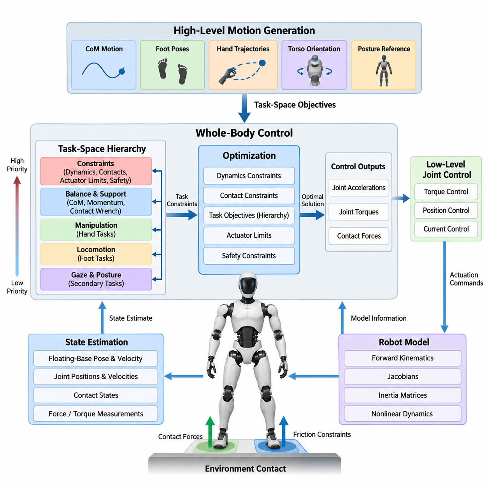
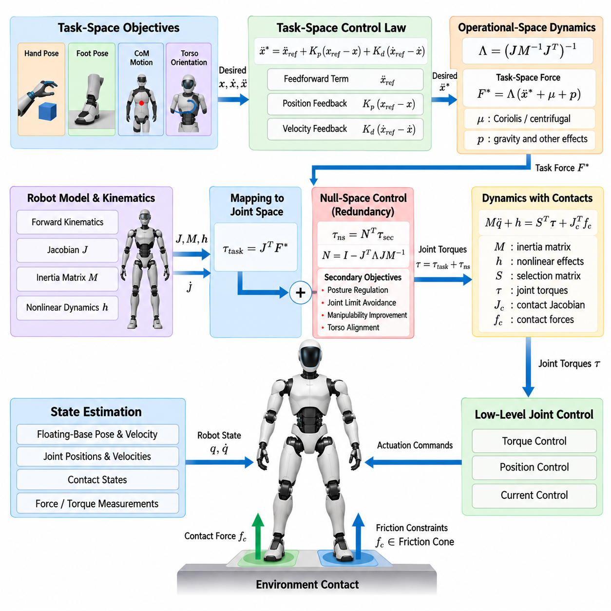
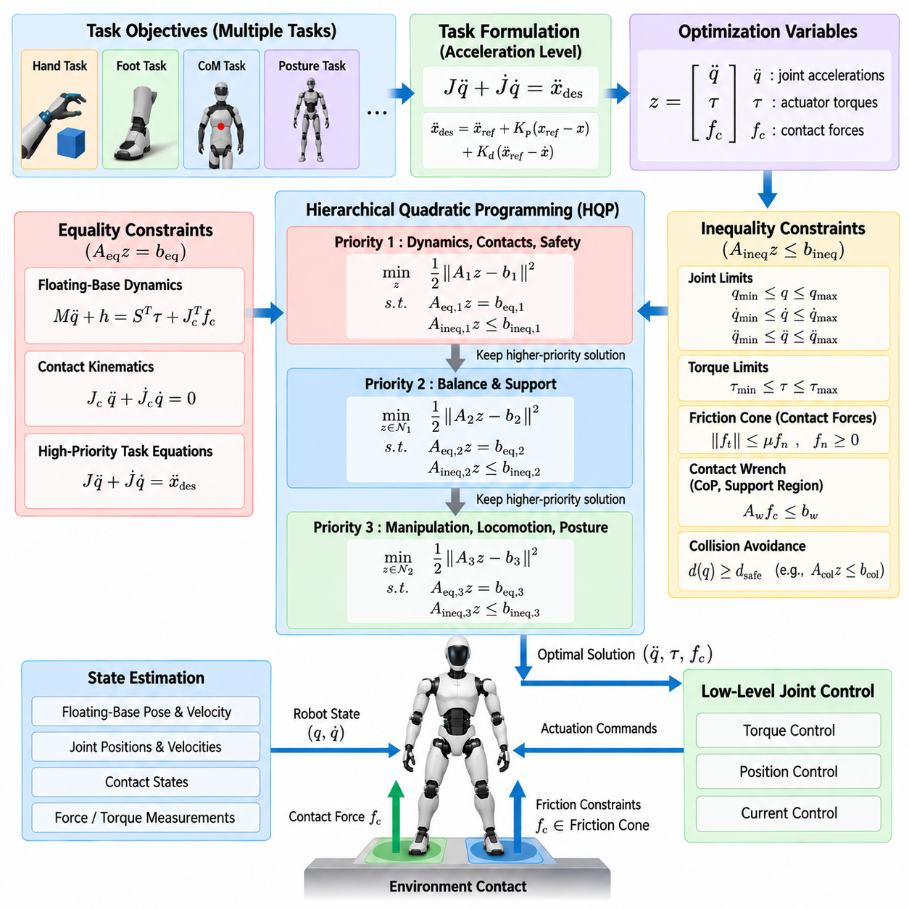
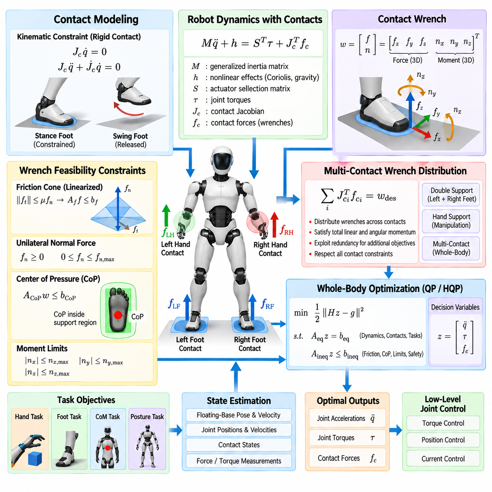
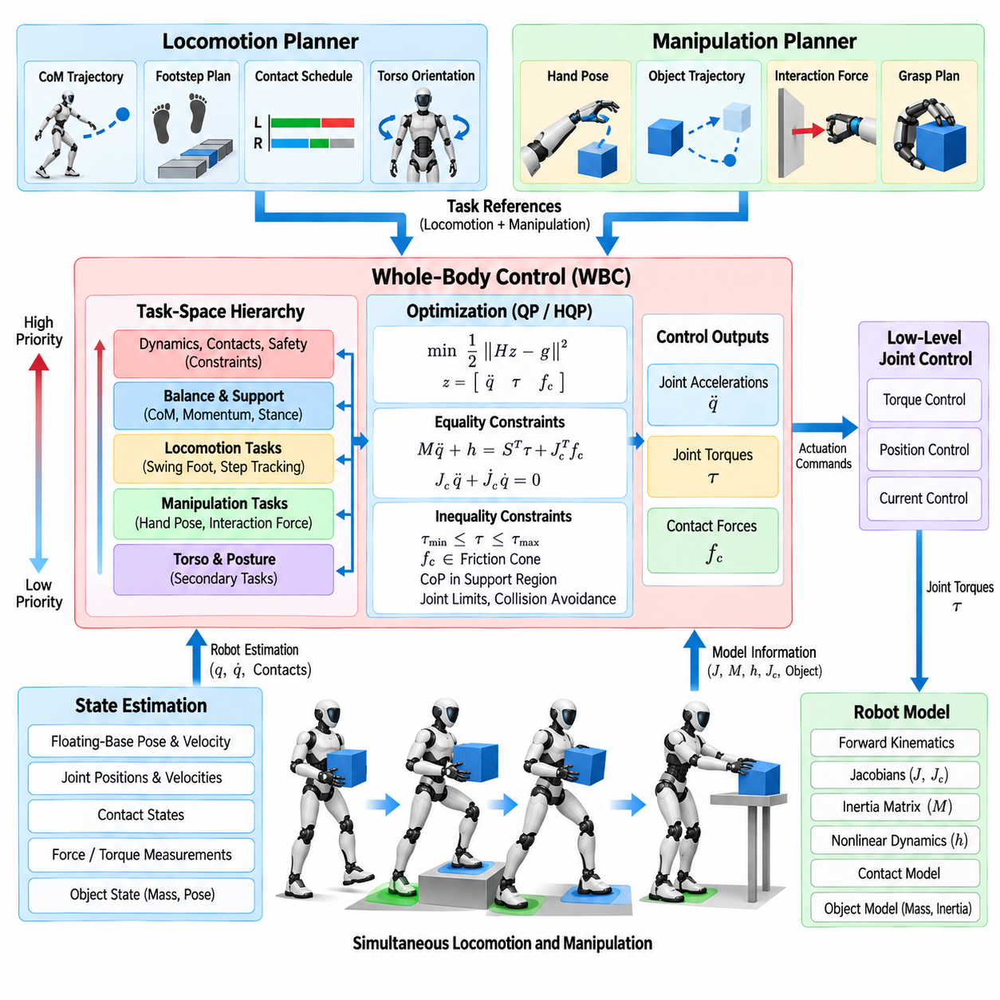
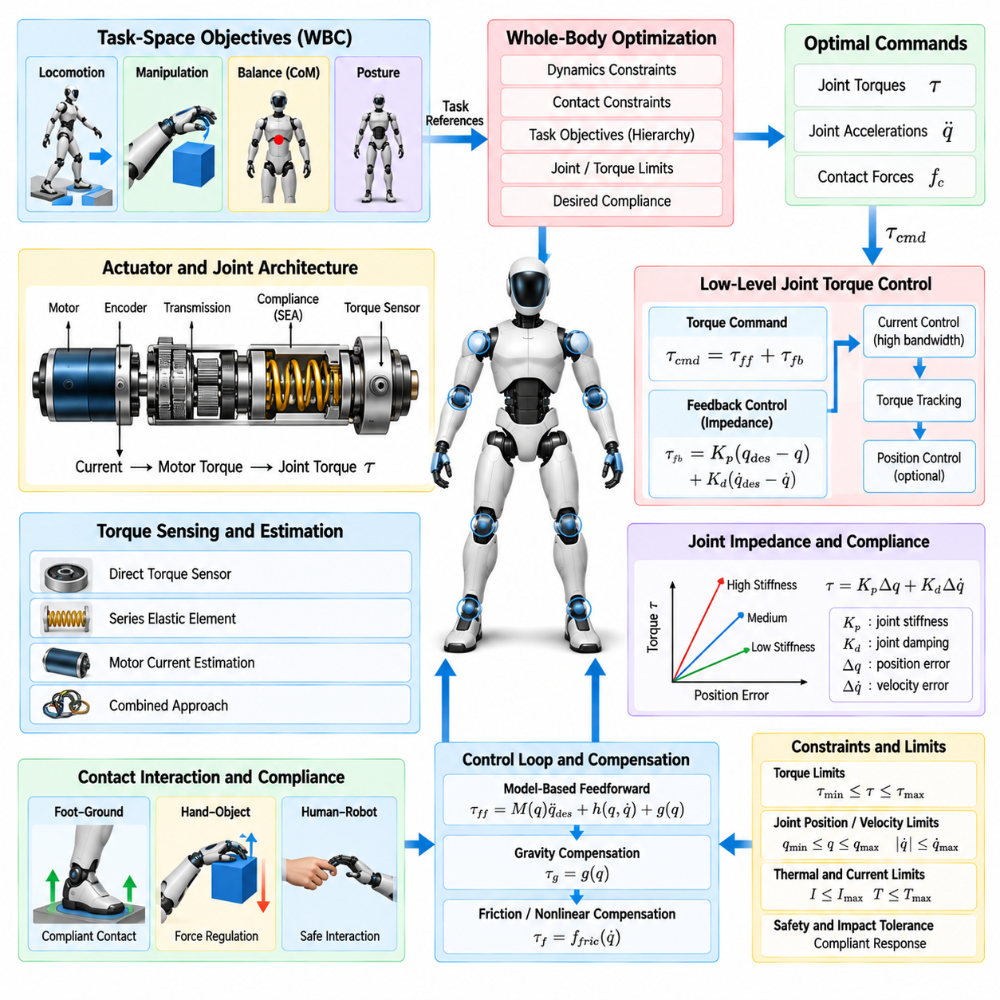
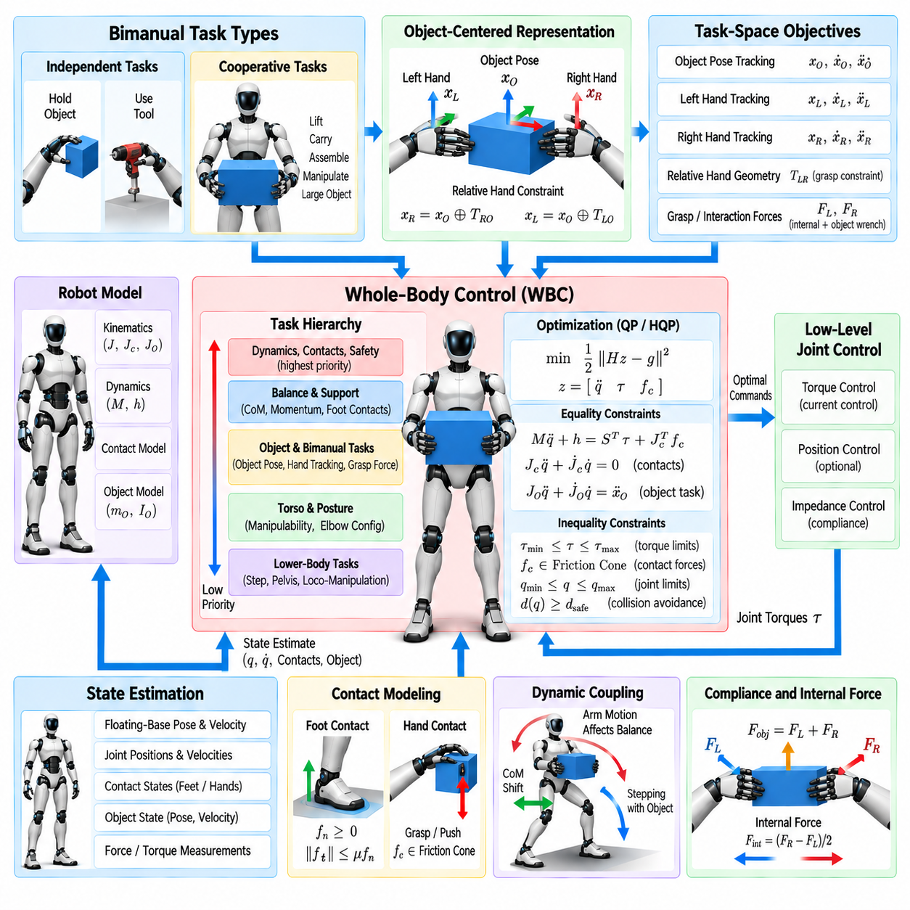
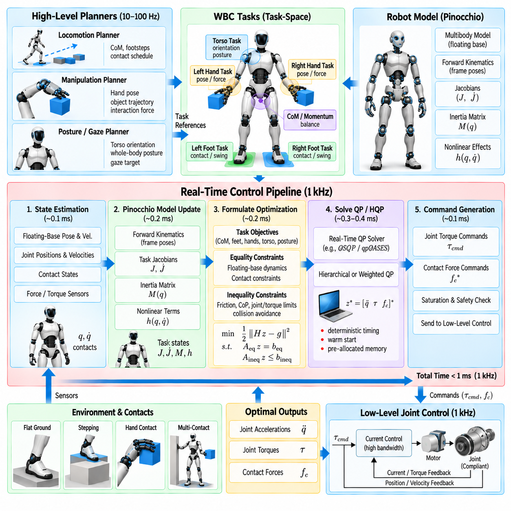
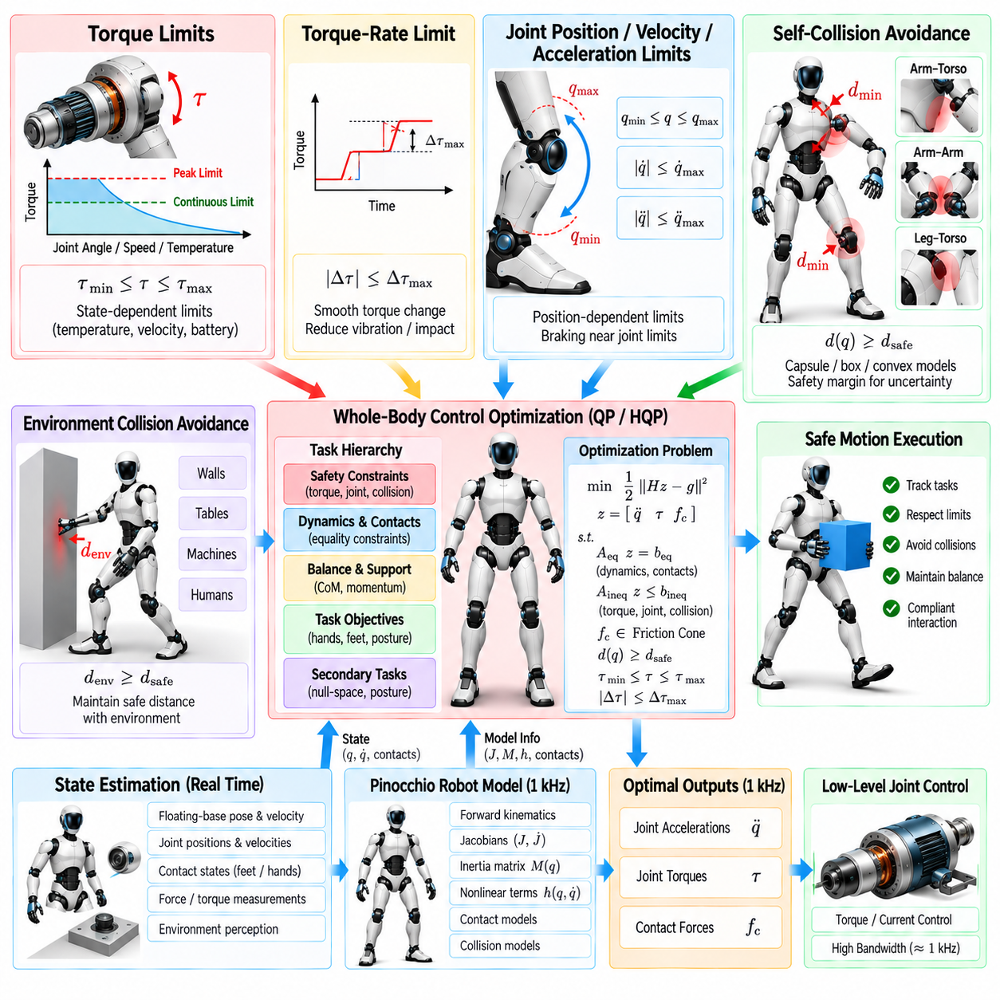
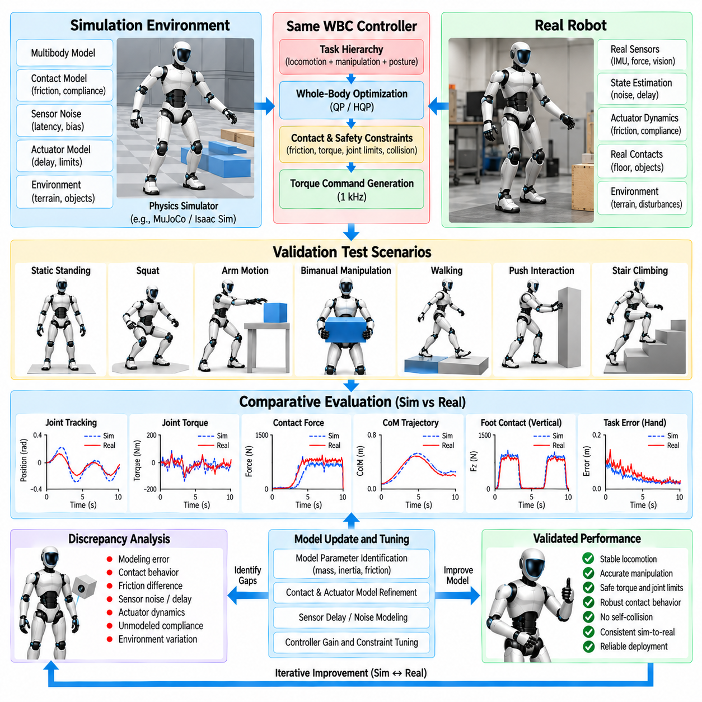

**Volume 22. Humanoid Robot Software**

# Chapter 05. Whole Body Control for Humanoids

## 05.01. Humanoid WBC Architecture Task Space Hierarchy

{width="7.268055555555556in" height="7.268055555555556in"}

휴머노이드 로봇(Humanoid Robot)을 위한 전신 제어(Whole-Body Control, WBC)는 다리, 몸통, 팔, 머리에 분산된 수많은 자유도(Degrees of Freedom, DoF)를 통합적으로 조정하기 위한 프레임워크를 제공한다. 각 관절이나 팔다리를 독립적으로 제어하는 대신, WBC는 로봇의 동작을 물리적 일관성(Physical Consistency), 접촉 안정성(Contact Stability), 액추에이터 실행 가능성(Actuator Feasibility)을 유지하면서 동시에 만족해야 하는 상호 결합된 작업(Task)의 집합으로 해석한다.

휴머노이드 WBC 아키텍처(Architecture)는 일반적으로 상위 수준 모션 생성(High-Level Motion Generation)과 하위 수준 관절 제어(Low-Level Joint Control) 사이에서 동작한다. 모션 플래너(Motion Planner)는 무게중심(Center of Mass, CoM) 운동, 발 자세(Foot Pose), 손 궤적(Hand Trajectory), 몸통 방향(Torso Orientation), 자세 기준(Posture Reference) 등의 목표값을 제공한다. WBC는 이러한 작업 공간(Task Space) 목표를 로봇이 실제 실행할 수 있는 동역학적으로 일관된 관절 가속도(Joint Acceleration), 토크(Torque), 접촉력(Contact Force)으로 변환한다.

작업 공간 제어(Task-Space Control)가 중요한 이유는 휴머노이드의 제어 목표가 본질적으로 데카르트 좌표계(Cartesian Coordinates) 또는 물리적으로 의미 있는 좌표로 표현되기 때문이다. 조작 작업(Manipulation Task)은 손의 원하는 6차원 자세(6D Pose)를 지정할 수 있으며, 보행(Locomotion)은 발의 위치와 방향을 지정한다. 반면 균형 제어(Balance Control)는 무게중심(CoM), 중심 운동량(Centroidal Momentum), 접촉 렌치(Contact Wrench)를 조절할 수 있다. WBC는 이러한 서로 다른 종류의 목표가 하나의 수학적 제어 문제 안에서 공존하도록 한다.

휴머노이드가 가지는 부유 베이스(Floating Base) 특성은 고정형 산업용 매니퓰레이터(Fixed Industrial Manipulator)의 제어 문제와 근본적으로 구별된다. 골반(Pelvis)이나 몸통(Torso)은 환경에 단단히 고정되어 있지 않으며, 발, 손, 무릎 또는 기타 지지 신체 영역에서 생성되는 접촉력(Contact Force)을 통해서만 간접적으로 운동에 영향을 줄 수 있다. 따라서 실행 가능한 전신 운동(Whole-Body Motion)은 강체 동역학(Rigid-Body Dynamics)과 환경 접촉 제약(Environmental Contact Constraints)을 동시에 만족해야 한다.

일반적인 제어기(Controller)는 부유 베이스 자세 및 속도(Floating-Base Pose and Velocity), 관절 위치 및 속도(Joint Position and Velocity), 접촉 상태(Contact State), 필요에 따라 힘 또는 토크 측정값(Force or Torque Measurement)을 포함하는 상태 추정(State Estimate)을 입력으로 받는다. 로봇 모델(Robot Model)은 순기구학(Forward Kinematics), 자코비안(Jacobian), 관성 행렬(Inertia Matrix), 비선형 동역학(Nonlinear Dynamics) 등 제어에 필요한 정보를 제공한다. 따라서 상태 추정(State Estimation), 모델링(Modeling), 제어(Control) 사이의 정확한 동기화는 안정적인 작업 수행에 필수적이다.

핵심적인 구성 원리는 작업 공간 계층 구조(Task-Space Hierarchy)이다. 작업(Task)은 단순히 서로 독립적인 관절 명령으로 결합되는 것이 아니라 물리적 중요도에 따라 우선순위(Priority)가 부여된다. 동역학(Dynamics), 접촉 유지(Contact Maintenance), 액추에이터 제한(Actuator Limits), 안전(Safety)과 관련된 제약은 일반적으로 가장 높은 수준을 차지한다. 그 다음 균형 및 지지 목표(Balance and Support Objectives)가 배치되며, 조작(Manipulation), 보행(Locomotion), 시선(Gaze), 자세(Posture) 목표는 현재 수행 중인 행동에 따라 구성된다.

엄격한 계층 구조(Strict Hierarchy)는 낮은 우선순위의 목표가 더 중요한 목표를 훼손하지 못하도록 한다. 예를 들어 휴머노이드가 물체를 향해 손을 뻗을 때 손 위치 오차(Hand-Position Error)를 줄이기 위해 발 접촉(Foot Contact)을 희생하거나 무게중심을 불안정하게 만들어서는 안 된다. 제어기는 먼저 중요한 목표를 만족하는 데 필요한 실행 가능 해 공간(Feasible Solution Space)을 보존하고, 이후 남아 있는 자유도를 이용하여 하위 우선순위 작업의 성능을 향상시킨다.

수학적으로 데카르트 작업(Cartesian Task)은 자코비안(Jacobian)을 통해 일반화 로봇 운동(Generalized Robot Motion)과 연결될 수 있다. 원하는 작업 가속도(Desired Task Acceleration)는 피드포워드 궤적 가속도(Feedforward Trajectory Acceleration)와 위치 및 속도 오차(Position and Velocity Errors)에 기반한 피드백 항(Feedback Terms)을 결합하여 구성할 수 있다. 이후 제어기는 운동 방정식(Equations of Motion)과 다른 활성 작업(Active Tasks)을 만족하면서 원하는 동작을 구현하는 일반화 가속도(Generalized Acceleration) 또는 토크(Torque)를 탐색한다.

여유도(Redundancy)는 작업 공간 WBC(Task-Space WBC)의 주요 장점 중 하나이다. 휴머노이드는 일반적으로 하나의 말단장치(End-Effector) 목표를 달성하는 데 필요한 것보다 많은 제어 가능 자유도를 가지고 있다. 손 자세가 구속된 상태에서도 남은 자유도를 이용하여 몸통 방향(Torso Orientation)을 조절하고, 편안한 관절 구성(Joint Configuration)을 유지하며, 관절 한계(Joint Limits)에서 멀어지고, 균형을 개선하거나 다음 동작을 위한 신체 자세를 준비할 수 있다.

영공간 추론(Null-Space Reasoning)은 이러한 여유도를 활용하는 개념적인 방법을 제공한다. 높은 우선순위 작업이 수행에 필요한 운동 방향을 사용한 이후, 낮은 우선순위 명령은 해당 작업을 방해하지 않는 방향으로 투영(Project)된다. 이를 통해 부차적인 동작은 상위 목표의 달성 상태를 변경하지 않으면서 로봇의 구성을 최적화할 수 있는 계층적 관계를 형성한다.

그러나 실제 휴머노이드 시스템에서는 순수한 기구학적 영공간 제어(Kinematic Null-Space Control)만으로 충분하지 않다. 로봇 운동은 동역학(Dynamics), 접촉(Contact), 마찰(Friction), 제한된 액추에이터 성능(Finite Actuator Capability)에 의해 제약되기 때문이다. 따라서 현대적인 WBC는 제어 문제를 최적화 문제(Optimization Problem)로 구성하는 경우가 많다. 결정 변수(Decision Variables)에는 일반화 가속도, 관절 토크, 접촉력 또는 이들의 조합이 포함될 수 있으며, 이를 통해 기구학적 목표와 물리적 실행 가능성을 함께 고려할 수 있다.

접촉 모델링(Contact Modeling)은 정지 자세(Standing)와 보행(Locomotion)에서 특히 중요하다. 지지 발(Stance Foot)은 지면과의 접촉을 유지하면서 신체를 지지하고 가속할 수 있는 힘을 생성해야 한다. 접촉력은 허용 가능한 마찰 조건(Friction Conditions) 안에 있어야 하며, 그 결과로 발생하는 렌치(Wrench)는 사용 가능한 지지 영역(Support Region)과 일관되어야 한다. 이러한 조건은 다른 모든 전신 작업이 사용할 수 있는 해 공간을 제한한다.

작업 계층 구조(Task Hierarchy)는 로봇의 접촉 모드(Contact Mode)에 따라 변화한다. 양발 지지(Double Support)에서는 두 발 모두 신체 운동을 제한하며 비교적 넓은 지지 영역을 제공한다. 한발 지지(Single Support)에서는 한쪽 발이 환경과 연결되는 주요 물리적 접점이 되고 반대쪽 다리는 스윙 작업(Swing Task)을 수행한다. 조작 과정에서 추가적인 손 접촉(Hand Contact)이 발생하면 제어 문제는 다시 변화하며, 경우에 따라 사용 가능한 지지 능력을 증가시킬 수도 있다.

전신 운동량(Whole-Body Momentum)은 또 다른 유용한 협조 제어 변수(Coordination Variable)를 제공한다. 각각의 신체 부분을 독립적으로 안정화하려는 대신 제어기는 모든 링크(Link)가 생성하는 결합된 선형 및 각운동량(Linear and Angular Momentum)을 조절할 수 있다. 따라서 팔, 몸통, 다리의 움직임은 외란(Disturbance), 조작력(Manipulation Force), 급격한 자세 변화에 대응하면서 전체적인 균형을 유지하도록 협력할 수 있다.

자세 조절(Posture Regulation)은 일반적으로 계층 구조에서 비교적 낮은 수준에 위치하지만 여전히 필수적이다. 적절한 자세 목표가 없다면 주요 데카르트 작업이 만족되더라도 여유 관절(Redundant Joints)이 바람직하지 않은 구성으로 이동할 수 있다. 기준 자세(Nominal Posture Reference)는 로봇을 기계적으로 유리한 구성 근처에 유지하며 관절 범위(Joint Range), 조작성(Manipulability), 에너지 사용(Energy Use), 가시성(Visibility), 충돌 회피(Collision Avoidance) 등의 선호 조건을 포함할 수 있다.

작업 우선순위(Task Priority)는 전체 동작 과정에서 반드시 고정될 필요가 없다. 보행(Walking), 뻗기(Reaching), 운반(Carrying), 밀기(Pushing), 복구(Recovery)는 각각 서로 다른 물리적 요구조건을 가진다. 상위 감독 제어기(Supervisory Controller)는 행동 상태(Behavioral State)에 따라 작업을 활성화하고 기준값을 변경하거나 상대적 중요도를 조절할 수 있다. 우선순위나 제약의 급격한 변화는 명령 가속도, 힘, 토크에 불연속(Discontinuity)을 발생시킬 수 있으므로 부드러운 전환(Smooth Transition)이 필요하다.

따라서 효과적인 아키텍처는 작업 생성(Task Generation)과 전신 해석(Whole-Body Resolution)을 분리한다. 보행(Locomotion), 조작(Manipulation), 균형(Balance), 상위 행동 모듈(High-Level Behavioral Module)은 로봇이 무엇을 수행해야 하는지를 정의하고, WBC는 사용 가능한 신체 좌표와 접촉력을 이용해 이러한 요청을 동시에 어떻게 구현할 것인지를 결정한다. 이러한 분리는 각각의 전문 플래너가 완전한 결합 신체 제어 문제를 독립적으로 해결하지 않고도 동작할 수 있도록 한다.

이러한 계층 구조는 보행과 조작을 통합하기 위한 자연스러운 인터페이스(Interface)도 제공한다. 물체를 운반하는 휴머노이드는 손 자세를 추종하고, 물체 방향을 조절하며, 몸통 자세를 유지하고, 무게중심 거동을 제어하면서 동시에 발 접촉을 유지해야 할 수 있다. 이러한 요구사항은 기계적으로 서로 영향을 주기 때문에 독립적인 팔 제어기와 보행 제어기는 충돌하는 명령을 생성할 수 있지만, WBC는 공통된 로봇 모델 안에서 이를 통합적으로 해결한다.

안전 제약(Safety Constraints)은 가능한 경우 제어기의 실행 가능 영역(Feasible Control Region)에 직접 포함되어야 한다. 관절 위치, 속도, 가속도, 토크 제한(Joint Position, Velocity, Acceleration, and Torque Limits)을 이용하여 명령이 액추에이터에 전달되기 전에 후보 해를 제한할 수 있다. 자기 충돌 회피(Self-Collision Avoidance)와 접촉력 제한(Contact-Force Bounds)도 유사하게 표현할 수 있다. 이를 통해 이미 실행 불가능한 명령을 사후에 단순 제한하는 대신 안전을 모션 생성 자체의 일부로 포함할 수 있다.

WBC 출력(Output)은 액추에이션 인터페이스(Actuation Interface)에 따라 달라진다. 가속도 수준 제어기(Acceleration-Level Controller)는 하위 수준 서보(Servo)를 위한 목표 관절 가속도를 생성할 수 있으며, 역동역학 WBC(Inverse-Dynamics WBC)는 직접 토크 명령을 계산할 수 있다. 토크 제어형 휴머노이드(Torque-Controlled Humanoid)는 명시적인 동역학적 일관성과 순응적 상호작용(Compliant Interaction)의 장점을 얻지만 정확한 모델, 신뢰성 있는 힘 추정, 결정론적 실행(Deterministic Execution), 강건한 액추에이터 수준 제어가 요구된다.

따라서 실시간 실행(Real-Time Execution)은 단순한 성능 최적화가 아니라 아키텍처 요구사항이다. 상태 추정, 모델 업데이트, 작업 구성, 제약 평가, 최적화, 명령 전송이 예측 가능한 제어 주기(Control Period) 내에서 완료되어야 한다. 특히 WBC가 휴머노이드 소프트웨어 스택의 고주파 제어 계층(High-Frequency Control Layer)에서 실행될 경우 접촉과 작업이 변화하더라도 계산 복잡도(Computational Complexity)가 제한된 범위 내에서 유지되어야 한다.

주변 장의 구성은 이러한 아키텍처 원리에서 보다 구체적인 구현으로 발전하는 흐름을 반영한다. WBC 아키텍처와 작업 공간 계층 구조는 운용 공간 제어(Operational-Space Control), 계층적 이차 계획법(Hierarchical Quadratic Programming), 접촉 및 렌치 모델링(Contact and Wrench Modeling), 통합 보행-조작(Unified Locomotion-Manipulation), 순응 토크 제어(Compliant Torque Control), 양손 작업 실행(Bimanual Execution), 실시간 최적화(Real-Time Optimization), 안전 제약(Safety Constraints), 최종 시뮬레이션-실환경 검증(Simulation-to-Real Validation)으로 이어지는 개념적 기반을 형성한다.

궁극적으로 휴머노이드 WBC는 실시간 물리적 중재 계층(Real-Time Physical Arbitration Layer)으로 이해할 수 있다. 상위 수준 모듈은 여러 행동을 동시에 요청할 수 있지만, 로봇은 하나의 물리적 환경과 상호작용하는 하나의 기계적으로 결합된 신체만을 가지고 있다. 제어기는 매 제어 주기마다 작업 우선순위, 로봇 동역학, 접촉 실행 가능성, 여유도, 액추에이터 능력, 안전 조건에 따라 이러한 요청을 지속적으로 조정하여 하나의 일관된 전신 동작(Whole-Body Action)을 생성한다.

## 05.02. Operational Space Control OSC Framework [w/Code]

{width="7.268055555555556in" height="7.268055555555556in"}

운용 공간 제어(Operational Space Control, OSC)는 개별 관절 좌표(Joint Coordinates)가 아니라 물리적으로 의미 있는 작업 좌표(Task Coordinates)에서 휴머노이드의 운동 목표를 직접 표현하는 제어 프레임워크(Control Framework)를 제공한다. 따라서 제어기는 손 위치(Hand Position), 발 자세(Foot Pose), 몸통 방향(Torso Orientation), 무게중심 운동(Center-of-Mass Motion) 등의 물리량을 직접 조절하면서 각 목표를 실현하는 데 필요한 다수의 관절을 자동으로 협조 제어할 수 있다.

OSC의 기반은 일반화 로봇 운동(Generalized Robot Motion)과 작업 공간 운동(Task-Space Motion) 사이의 관계이다. 작업 변수(Task Variable) \\(x\\)에 대해 그 속도는 작업 자코비안(Task Jacobian) \\(J\\)를 통해 일반화 속도(Generalized Velocity)와 연결되며, \\(\\dot{x}=J\\dot{q}\\)로 표현된다. 이를 미분하면 작업 가속도(Task Acceleration)는 \\(\\ddot{x}=J\\ddot{q}+\\dot{J}\\dot{q}\\)가 되며, 이는 가속도 수준 작업 제어(Acceleration-Level Task Control)에 필요한 기본적인 매핑 관계를 제공한다.

휴머노이드 로봇(Humanoid Robot)의 일반화 좌표(Generalized Coordinates)는 일반적으로 부유 베이스 구성(Floating-Base Configuration)과 구동 관절 좌표(Actuated Joint Coordinates)를 모두 포함한다. 6차원 부유 베이스(Six-Dimensional Floating Base)는 액추에이터에 의해 직접 명령될 수 없기 때문에 이러한 구분은 매우 중요하다. 부유 베이스의 운동은 관절 토크(Joint Torque)와 외부 접촉력(External Contact Force)의 결과로 발생하므로 OSC는 휴머노이드를 일반적인 고정 베이스 매니퓰레이터(Fixed-Base Manipulator)처럼 취급하지 않고 전체 강체 동역학(Full Rigid-Body Dynamics)과 일관되게 동작해야 한다.

운동 방정식(Equations of Motion)은 일반화 관성 행렬(Generalized Inertia Matrix), 비선형 코리올리 및 원심 효과(Nonlinear Coriolis and Centrifugal Effects), 중력(Gravity), 액추에이터 토크(Actuator Torque), 외부 접촉력(External Contact Force)을 사용하여 표현할 수 있다. OSC는 이러한 동역학 모델(Dynamic Model)을 이용해 작업 공간에서 지정된 힘이나 가속도를 일반화 힘(Generalized Force)으로 변환하는 방법을 결정하면서 휴머노이드 신체의 모든 링크(Link) 사이에 존재하는 물리적 결합을 고려한다.

동역학적으로 일관된 OSC(Dynamically Consistent OSC)의 핵심 물리량 중 하나는 운용 공간 관성 행렬(Operational-Space Inertia Matrix)이다. 개념적으로 이 행렬은 선택된 작업 좌표에서 관찰되는 유효 관성(Effective Inertia)을 나타낸다. 로봇이 운동에 저항하는 겉보기 특성은 구성(Configuration), 운동 방향(Direction), 질량 분포(Mass Distribution)에 따라 달라지므로 운용 공간 관성은 휴머노이드가 팔다리를 움직이거나 자세를 변경하고 서로 다른 환경 접촉을 형성함에 따라 지속적으로 변화한다.

완전 계수 작업 자코비안(Full-Rank Task Jacobian)에 대해 운용 공간 관성은 일반적으로 \\(\\Lambda=(JM\^{-1}J\^T)\^{-1}\\)로 표현되며, 여기서 \\(M\\)은 일반화 관성 행렬(Generalized Inertia Matrix)을 나타낸다. 이 공식은 작업 공간 가속도 요구사항(Task-Space Acceleration Requirements)을 동역학적으로 의미 있는 작업 힘(Task Force)으로 변환한다. 또한 단순히 기구학적 역변환(Kinematic Inverse)만을 사용하여 데카르트 오차(Cartesian Error)를 관절 명령으로 변환할 경우 손실될 수 있는 동역학적 결합을 반영한다.

목표 작업 가속도(Desired Task Acceleration)는 기준 궤적 정보(Reference Trajectory Information)와 피드백 조절(Feedback Regulation)을 이용하여 구성할 수 있다. 피드포워드 가속도(Feedforward Acceleration)는 의도된 운동을 나타내며, 비례 및 미분 피드백 항(Proportional and Derivative Feedback Terms)은 작업 위치 및 속도 오차(Task Position and Velocity Errors)를 보상한다. 이렇게 생성된 명령은 플래너(Planner)가 각각의 개별 관절 운동을 직접 결정하지 않고도 선택된 운용 좌표가 어떻게 변화해야 하는지를 지정한다.

이에 대응하는 작업 공간 힘(Task-Space Force)은 운용 공간 동역학(Operational-Space Dynamics)을 이용하여 결정할 수 있다. 사용되는 공식에 따라 속도 의존 동역학(Velocity-Dependent Dynamics), 중력(Gravity), 기타 비선형 효과(Nonlinear Effects)를 보상하는 항이 포함될 수 있다. 이후 작업 명령은 자코비안 전치(Jacobian Transpose)를 통해 다시 일반화 힘으로 매핑되어 물리적으로 의미 있는 작업 목표와 관절 수준 액추에이션(Joint-Level Actuation) 사이에 직접적인 관계를 형성한다.

동역학적 일관성(Dynamic Consistency)은 OSC를 정의하는 핵심 특성 중 하나이다. 일반적인 자코비안 의사역행렬(Jacobian Pseudoinverse)은 기하학적 기준에 따라 운동을 분배하지만 로봇의 질량 분포를 반드시 고려하는 것은 아니다. 동역학적으로 일관된 역행렬(Dynamically Consistent Inverse)은 관성 행렬을 포함하여 실제 기구의 동역학에 따라 여유도(Redundancy)를 해석하며, 이는 크고 강하게 결합된 휴머노이드 시스템에서 특히 중요하다.

여유도(Redundancy)는 휴머노이드가 주요 운용 공간 작업(Operational-Space Task)을 방해하지 않으면서 부차적인 목표를 수행할 수 있도록 한다. 주 작업에 필요한 힘이나 운동이 결정된 이후 남은 자유도는 자세 조절(Posture Regulation), 관절 한계 회피(Joint-Limit Avoidance), 조작성 향상(Manipulability Improvement), 몸통 정렬(Torso Alignment), 후속 운동 준비 등에 사용할 수 있다. 영공간 투영(Null-Space Projection)은 이러한 행동을 분리하기 위한 수학적 메커니즘을 제공한다.

동역학적으로 일관된 제어(Dynamically Consistent Control)에서는 부차적인 명령이 제어되는 주 작업 방향으로 가속도를 발생시키지 않도록 영공간 투영기(Null-Space Projector)를 구성한다. 예를 들어 손은 원하는 데카르트 자세(Cartesian Pose)를 유지하면서 팔꿈치, 어깨, 몸통 및 기타 여유 관절을 부차적인 목표에 따라 재구성할 수 있다. 이러한 협조 제어는 자연스러운 휴머노이드 운동을 구현하기 위한 핵심 요소이다.

환경 접촉(Environmental Contact)이 도입되면 휴머노이드 OSC는 더욱 복잡해진다. 정지 상태(Standing)에서는 한쪽 또는 양쪽 발이 로봇 운동의 일부를 구속하며, 조작 과정에서는 손이 추가적인 접촉을 형성할 수 있다. 이러한 제약은 사용 가능한 운동 공간(Motion Space)뿐 아니라 명령된 관절 토크, 접촉력, 부유 베이스 가속도(Floating-Base Acceleration), 운용 공간 거동 사이의 관계도 변화시킨다.

따라서 접촉 일관 제어(Contact-Consistent Control)는 작업 명령을 활성 제약(Active Constraints)과 호환되는 방향으로 투영한다. 고정 상태를 유지해야 하는 지지 발(Stance Foot)은 손 또는 자세 제어기로부터 충돌하는 운동 명령을 받아서는 안 된다. 대신 접촉 제약(Contact Constraints)은 휴머노이드와 환경 사이의 필요한 물리적 연결을 유지하면서 운용 작업을 수행할 수 있는 허용 가능한 부분공간(Admissible Subspace)을 정의한다.

이 원리는 양발 지지(Double Support)와 한발 지지(Single Support) 사이의 전환에서 특히 중요하다. 양발 지지에서는 두 발이 모두 부유 신체(Floating Body)를 구속하면서 지지력을 분담한다. 한쪽 발이 스윙 단계(Swing Phase)를 시작하면 해당 발의 접촉 제약이 사라지고 동일한 다리는 운용 공간 운동 작업(Operational-Space Motion Task)으로 전환된다. 따라서 OSC는 접촉 상태가 변화할 때 관련 자코비안, 제약 조건, 동역학적 매핑을 함께 갱신해야 한다.

무게중심(Center of Mass, CoM) 역시 운용 작업(Operational Task)으로 표현할 수 있다. CoM 위치 또는 가속도를 조절하면 전신 균형 거동(Whole-Body Balance Behavior)을 직접 협조 제어할 수 있으며, 몸통 방향 역시 별도의 작업으로 제어할 수 있다. 따라서 발, 손, CoM, 몸통의 목표는 각각 차원과 물리적 기능이 크게 다르더라도 공통된 작업 공간 언어(Task-Space Language)를 사용하여 표현할 수 있다.

조작(Manipulation)에서 OSC는 휴머노이드가 모든 팔과 몸통 관절의 궤적을 명시적으로 지정하지 않고도 손의 운동과 상호작용 힘(Interaction Force)을 명령할 수 있도록 한다. 6차원 말단장치 작업(Six-Dimensional End-Effector Task)은 병진 및 회전 거동(Translational and Rotational Behavior)을 동시에 조절할 수 있다. 물체나 표면과의 상호작용이 발생하면 힘 목표(Force Objective)를 포함하여 사용 가능한 동역학적 제약 안에서 운동과 물리적 상호작용을 함께 관리할 수 있다.

다수의 운용 작업(Multiple Operational Tasks)을 동시에 수행하려면 작업 간 경쟁을 해결하는 메커니즘이 필요하다. 가중치 기반 공식(Weighted Formulation)은 여러 목표 사이에서 오차를 절충할 수 있으며, 엄격한 계층적 공식(Strict Hierarchical Formulation)은 하위 우선순위 목표를 최적화하기 전에 상위 우선순위 작업을 보존한다. 휴머노이드 응용에서는 일반적으로 접촉 일관성과 균형이 부차적인 자세 또는 조작 선호보다 강하게 보호되어야 하므로 이후 전신 최적화(Whole-Body Optimization) 방법에서 다루는 계층 구조가 필요하다.

OSC는 순응 거동(Compliant Behavior)을 구현하기 위한 중요한 기반도 제공한다. 상호작용 상태와 관계없이 말단장치가 경직된 기하학적 궤적을 강제로 추종하도록 하는 대신 원하는 작업 공간 강성(Task-Space Stiffness)과 감쇠(Task-Space Damping)를 정의하여 변위와 외력에 대한 로봇의 반응을 결정할 수 있다. 이러한 특성으로 인해 운용 좌표는 인간 상호작용(Human Interaction), 물체 취급(Object Handling), 조립(Assembly), 밀기(Pushing) 등의 접촉 중심 휴머노이드 행동에 특히 적합하다.

그러나 OSC의 효과는 모델 품질(Model Quality)에 크게 의존한다. 링크 질량(Link Mass), 무게중심 위치(Center of Mass), 관성 파라미터(Inertial Parameters), 관절 마찰(Joint Friction), 액추에이터 동역학(Actuator Dynamics), 접촉 추정(Contact Estimation)의 오차는 동역학적 보상의 정확도를 저하시킬 수 있다. 따라서 실제 구현에서는 수학적 모델과 실제 로봇 사이의 불확실성을 허용하기 위해 모델 기반 제어와 피드백, 필터링, 상태 추정, 강건한 게인(Robust Gains), 경우에 따라 외란 관측기(Disturbance Observer)를 함께 사용한다.

수치적 조건성(Numerical Conditioning) 역시 실용적인 관점에서 중요한 문제이다. 작업 자코비안은 특정 데카르트 운동을 생성하기 어렵거나 불가능해지는 특이 구성(Singular Configuration)에 접근할 수 있다. 따라서 운용 공간 관성과 역매핑(Inverse Mapping)은 정규화(Regularization), 감쇠 역행렬(Damped Inverse), 특이값 임계값(Singular-Value Threshold), 특이점 근처의 작업 적응(Task Adaptation) 등을 포함한 수치적으로 강건한 방법을 사용하여 계산해야 한다.

로봇 모델과 모든 작업 공간 물리량이 지속적으로 변화하기 때문에 실시간 계산(Real-Time Computation)은 필수적이다. 순기구학(Forward Kinematics), 자코비안, 자코비안 미분(Jacobian Derivatives), 관성 행렬, 비선형 동역학, 접촉 모델, 영공간 매핑(Null-Space Mapping), 제어 명령을 각 제어 주기마다 갱신해야 한다. 따라서 고주파 휴머노이드 OSC를 위해서는 효율적인 강체 동역학 라이브러리(Rigid-Body Dynamics Library)와 결정론적 메모리 및 계산 전략(Deterministic Memory and Computation Strategy)이 중요하다.

보다 광범위한 휴머노이드 WBC 아키텍처에서 OSC는 작업 수준 의도(Task-Level Intent)와 동역학적으로 일관된 전신 액추에이션(Whole-Body Actuation)을 연결하는 수학적 다리를 형성한다. OSC는 여유도를 활용하고 신체의 결합 동역학을 고려하면서 데카르트 목표를 힘과 토크로 변환하는 방법을 설명한다. 이후 보다 복잡한 최적화 기반 제어기는 이러한 기반을 확장하여 명시적인 부등식 제약(Inequality Constraints), 액추에이터 한계, 마찰 제약(Friction Constraints), 다중 접촉 조건(Multiple Contact Conditions)을 포함할 수 있다.

장의 구성은 OSC를 WBC 아키텍처 및 작업 공간 계층 구조(Task-Space Hierarchy) 바로 다음에 배치하고, 이후 계층적 이차 계획법(Hierarchical Quadratic Programming), 접촉 제약 및 렌치 모델링(Contact-Constraint and Wrench Modeling), 동시 보행 및 조작(Simultaneous Locomotion and Manipulation), 순응 토크 제어(Compliant Torque Control), 양손 작업 실행(Bimanual Execution), 실시간 최적화(Real-Time Optimization), 안전 제약(Safety Constraints), 시뮬레이션-실환경 검증(Simulation-to-Real Validation)으로 이어진다. 이러한 흐름에서 OSC는 이후의 제약 기반 WBC(Constrained WBC) 방법들이 구축되는 핵심 동역학적 작업 공간 공식(Dynamic Task-Space Formulation)으로 위치한다.

## 05.03. Hierarchical QP with Inequality Constraints [w/Code]

{width="7.268055555555556in" height="7.268055555555556in"}

계층적 이차 계획법(Hierarchical Quadratic Programming, HQP)은 여러 휴머노이드 작업과 물리적 제약을 명시적인 우선순위(Priority)에 따라 구성할 수 있는 전신 제어(Whole-Body Control, WBC)용 체계적 최적화 프레임워크(Optimization Framework)를 제공한다. 서로 경쟁하는 오차를 하나의 가중 목적함수(Weighted Objective)에서 절충하는 방식과 달리, HQP는 낮은 우선순위 목표가 남아 있는 실행 가능 자유도를 사용하기 전에 높은 우선순위 작업의 해를 보존한다.

이차 계획법(Quadratic Programming, QP)은 제어 목표를 이차 비용함수(Quadratic Cost)로 표현하면서 결정 변수(Decision Variables)에 등식 제약(Equality Constraints)과 부등식 제약(Inequality Constraints)을 적용한다. 휴머노이드 WBC에서 이러한 변수에는 일반화 관절 가속도(Generalized Joint Accelerations), 액추에이터 토크(Actuator Torques), 접촉력(Contact Forces) 또는 이들의 조합이 포함될 수 있다. 이를 통해 작업 추종(Task Tracking)과 로봇 동역학(Robot Dynamics)을 독립적인 제어 단계로 처리하지 않고 하나의 문제에서 함께 해결할 수 있다.

가속도 수준(Acceleration Level)에서 데카르트 작업(Cartesian Task)은 \\(J\\ddot{q}+\\dot{J}\\dot{q}=\\ddot{x}_{des}\\)의 관계로 표현할 수 있다. 여러 작업이 서로 양립할 수 없는 가속도를 요구할 수 있기 때문에 제어기는 물리적 제약을 만족하면서 작업 잔차 오차(Residual Error)를 최소화한다. 따라서 최적화 과정은 현재 실행 가능 영역(Feasible Region) 안에서 요청된 작업 거동을 가장 가깝게 구현하는 일반화 운동(Generalized Motion)을 결정한다.

계층 구조(Hierarchical Structure)는 목표를 여러 우선순위 수준(Priority Levels)으로 분리함으로써 이러한 공식을 확장한다. 높은 우선순위의 최적화 문제를 먼저 해결하고, 그 결과로 얻어진 해를 보존하면서 다음 수준의 최적화를 수행한다. 낮은 수준의 목표는 상위 수준에서 이미 결정된 최적해를 저하시키지 않는 해 공간(Solution Space) 안에서만 부차적인 거동을 개선할 수 있다.

이러한 특성은 모든 목표가 동일한 물리적 중요성을 갖지 않는 휴머노이드 로봇(Humanoid Robot)에서 특히 유용하다. 강체 동역학적 일관성(Rigid-Body Dynamic Consistency), 유효한 환경 접촉(Valid Environmental Contacts), 안전 한계(Safety Limits)를 유지하는 것은 손 궤적 오차를 최소화하거나 선호 자세를 달성하는 것보다 근본적으로 중요하다. HQP는 단순히 수치 가중치를 수동으로 선택하는 대신 이러한 차이를 직접 표현하는 수학적 메커니즘을 제공한다.

등식 제약(Equality Constraints)은 일반적으로 정확하게 또는 매우 엄격한 허용 오차 안에서 만족되어야 하는 물리적 관계를 표현한다. 부유 베이스 운동 방정식(Floating-Base Equations of Motion), 활성 접촉 기구학(Active Contact Kinematics), 선택된 높은 우선순위 작업 방정식을 이러한 형태로 표현할 수 있다. 이러한 제약은 나머지 최적화 목표가 동작해야 하는 실행 가능 다양체(Feasible Manifold)를 정의한다.

부등식 제약(Inequality Constraints)은 휴머노이드의 많은 중요한 제한 조건이 정확한 하나의 값이 아니라 허용 가능한 범위로 정의되기 때문에 필수적이다. 관절 위치, 속도, 가속도 및 액추에이터 토크는 최소값과 최대값 사이에 유지되어야 한다. 접촉력은 마찰 및 단방향 접촉 조건(Friction and Unilateral-Contact Conditions)을 만족해야 하며, 충돌 회피(Collision Avoidance)는 거리 또는 상대 운동이 지정된 안전 경계의 허용 영역에 머물도록 요구한다.

일반적인 부등식은 \\(A_{ineq}z \\leq b_{ineq}\\)로 표현할 수 있으며, 여기서 \\(z\\)는 최적화 변수(Optimization Variables)를 포함한다. 이러한 간결한 표현을 사용하면 다양한 물리적 제한 조건을 동일한 솔버 인터페이스(Solver Interface) 안에서 기술할 수 있다. 또한 제한값은 로봇 구성(Configuration), 접촉 상태(Contact State), 추정된 환경 형상(Environment Geometry), 액추에이터 상태(Actuator Condition), 작업 단계(Task Phase)에 따라 매 제어 주기마다 변경될 수 있다.

마찰 제약(Friction Constraints)은 휴머노이드 제어에서 부등식이 중요한 이유를 대표적으로 보여준다. 지지 발(Stance Foot)은 지면을 밀 수 있지만 일반적으로 지면을 자신 쪽으로 당길 수 없으며, 미끄러짐을 방지하려면 접선 접촉력(Tangential Contact Force)이 수직력(Normal Force)에 비해 충분히 작게 유지되어야 한다. 따라서 마찰 원뿔(Friction Cone)은 허용 가능한 접촉력 영역을 정의하며, 실시간 최적화 효율성을 위해 일반적으로 선형 부등식(Linear Inequalities)으로 근사된다.

접촉 렌치 제약(Contact Wrench Constraints)은 지지 발 아래에서 발생하는 힘의 위치와 분포를 추가적으로 제한할 수 있다. 생성되는 렌치(Wrench)는 유한한 접촉 표면(Finite Contact Surface)과 사용 가능한 마찰 조건에 부합해야 한다. 이러한 제한을 HQP에 직접 포함하면 제어기가 물리적으로 불가능하거나 불안정한 지면 반력(Ground Reaction Forces)을 필요로 하는 수학적으로만 매력적인 전신 운동을 생성하는 것을 방지할 수 있다.

관절 한계(Joint Limits)는 기계적 경계에 도달할 때까지 기다리지 않고 선제적으로 처리할 수 있다. 위치 의존 속도 또는 가속도 제한(Position-Dependent Velocity or Acceleration Bounds)은 관절이 허용 범위에 접근할수록 운동을 점진적으로 제한할 수 있다. 이를 통해 최적화기를 위험한 구성에서 벗어나도록 유도하면서 남아 있는 자유도가 명령된 전신 거동에 계속 기여할 수 있는 실행 가능 영역을 형성한다.

토크 부등식(Torque Inequalities)은 또 다른 중요한 실행 가능성 계층을 제공한다. 원하는 가속도가 기구학적으로 달성 가능하더라도 필요한 액추에이터 토크가 모터, 기어박스, 열적 또는 전기적 한계(Motor, Gearbox, Thermal, or Electrical Capability)를 초과할 수 있다. 명시적인 토크 제한은 최적화기가 실제로 사용할 수 없는 구동 능력을 가정하는 것을 방지하며, 결과적으로 생성되는 운동을 실제 휴머노이드가 수행할 수 있는 동작과 더욱 일치시킨다.

부유 베이스 동역학(Floating-Base Dynamics)은 이러한 액추에이터 제약과 접촉 제약을 서로 결합한다. 베이스 자체는 비구동(Unactuated)이므로 원하는 베이스 가속도를 독립적으로 명령할 수 없다. 최적화기는 뉴턴-오일러 동역학(Newton-Euler Dynamics)을 만족하면서 요구되는 전신 가속도를 생성할 수 있는 관절 토크와 환경 접촉력의 조합을 찾아야 하며, 이러한 이유로 토크 수준 HQP(Torque-Level HQP)에서는 접촉력 변수가 특히 중요하다.

작업 우선순위(Task Priorities)는 현재 휴머노이드가 수행하는 행동에 따라 구성할 수 있다. 접촉 유지(Contact Preservation), 동역학적 일관성(Dynamic Consistency), 액추에이터 실행 가능성(Actuator Feasibility), 핵심 안전 제약(Critical Safety Constraints)은 일반적으로 가장 강한 우선순위 수준을 차지한다. 그 다음 무게중심 또는 운동량 거동과 같은 균형 관련 물리량이 배치되며, 발 운동, 손 조작, 몸통 방향, 시선(Gaze), 기준 자세(Nominal Posture)는 운용 요구사항에 따라 구성된다.

예를 들어 보행(Walking) 중에는 지지 발이 구속된 상태를 유지하면서 스윙 발(Swing Foot)이 궤적을 추종하고 무게중심이 균형 기준(Balance Reference)을 따라갈 수 있다. 조작(Manipulation) 중에는 손 자세 또는 상호작용 목표가 더욱 중요해지는 동안 다리는 지지 상태를 유지한다. HQP는 공통된 전신 최적화 프레임워크를 유지하면서 이러한 변화하는 행동 요구조건을 계층 구조에 반영할 수 있다.

그러나 엄격한 우선순위(Strict Priorities)는 신중한 전환 관리(Transition Management)를 요구한다. 작업이 갑자기 활성화되거나 제거되거나 다른 우선순위 수준으로 이동하면 실행 가능 해가 급격하게 변화하여 가속도, 접촉력 또는 토크에 불연속(Discontinuity)이 발생할 수 있다. 따라서 실제 시스템에서는 제어 모드 사이의 전환을 관리하기 위해 부드러운 기준 생성(Smooth Reference Generation), 제약 램핑(Constraint Ramping), 작업 활성화 함수(Task Activation Functions), 상태 기계 로직(State-Machine Logic) 등을 사용한다.

HQP는 요청된 작업 집합이 실행 불가능(Infeasible)해지는 상황도 처리해야 한다. 휴머노이드는 작업 공간을 넘어서는 위치로 손을 뻗도록 명령받거나, 서로 양립할 수 없는 접촉을 유지하도록 요구받거나, 액추에이터 능력을 초과하는 힘을 생성하도록 요청받을 수 있다. 모든 요구사항을 강제적으로 적용하면 최적화 문제에 해가 존재하지 않을 수 있으며, 항상 안전한 명령을 생성해야 하는 실시간 제어기에서는 이러한 상황을 허용할 수 없다.

슬랙 변수(Slack Variables)는 제어된 완화(Controlled Relaxation)를 제공하는 하나의 방법이다. 모든 작업이나 제약을 정확하게 만족하도록 요구하는 대신 선택된 조건에 제한된 위반(Bounded Violation)을 허용하고 목적함수에서 이에 큰 페널티(Penalty)를 부여할 수 있다. 핵심 안전 제약은 강성 제약(Hard Constraints)으로 유지하면서 덜 중요한 추종 목표는 연성화(Softening)할 수 있다. 이를 통해 모든 요구조건을 완벽하게 동시에 만족할 수 없을 때 어떤 요구를 희생할 것인지 계층 구조가 명시적으로 결정한다.

이러한 강성 제약(Hard Constraints)과 연성 목표(Soft Objectives)의 구분은 강건한 휴머노이드 WBC(Robust Humanoid WBC)의 핵심이다. 필요한 경우 손은 수 센티미터의 추종 오차를 허용할 수 있지만, 해당 궤적을 유지하기 위해 액추에이터가 파괴적인 토크 한계를 초과해서는 안 된다. 마찬가지로 외란 복구(Disturbance Recovery) 중에는 기준 자세를 희생할 수 있지만 접촉 안정성과 균형에는 지배적인 우선순위를 부여할 수 있다.

충돌 회피(Collision Avoidance) 역시 로봇 신체 사이 또는 로봇과 환경 사이의 거리로부터 생성된 부등식을 이용하여 포함할 수 있다. 두 형상이 최소 허용 거리(Minimum Allowed Separation)에 접근하면 제어기는 두 형상 사이의 상대 속도 또는 가속도를 제한한다. 이러한 제약을 통해 자기 충돌 방지(Self-Collision Protection)를 단순한 비상 하위 단계 검사로만 사용하는 대신 전신 운동 생성 과정에 직접 포함할 수 있다.

실시간 성능(Real-Time Performance)은 HQP 솔버(Solver)에 강한 요구조건을 부과한다. 자코비안, 동역학, 접촉, 제한 조건, 작업 기준이 변화함에 따라 최적화 문제를 반복적으로 재구성하고 해결해야 한다. 웜 스타팅(Warm Starting), 희소 행렬 연산(Sparse Matrix Operations), 활성 집합 방법(Active-Set Methods), 효율적인 행렬 분해(Efficient Factorization), 예측 가능한 메모리 할당(Predictable Memory Allocation)은 계산량을 크게 줄이고 높은 제어 주파수에서 결정론적 실행을 향상시킬 수 있다.

HQP는 미터, 라디안, 뉴턴, 뉴턴미터, 가속도, 작업 잔차처럼 단위와 크기가 매우 다른 물리량을 하나의 문제에서 다룰 수 있기 때문에 수치 스케일링(Numerical Scaling) 역시 중요하다. 부적절한 스케일링은 수치 조건성(Conditioning)과 솔버 수렴(Solver Convergence)을 저하시킬 수 있다. 적절한 정규화(Normalization)와 신중하게 설계된 허용 오차(Tolerances)는 수치적 인공 효과가 의도된 물리적 계층 구조를 비의도적으로 변화시키지 않도록 한다.

따라서 HQP는 운용 공간 추론(Operational-Space Reasoning)을 보다 일반적인 제약 기반 최적화 아키텍처(Constrained Optimization Architecture)로 확장한다. 운용 공간 제어(Operational Space Control, OSC)가 의미 있는 데카르트 작업과 전신 동역학 사이의 관계를 정의한다면, HQP는 등식 제약, 부등식 제한, 접촉 실행 가능성, 액추에이터 한계, 안전 요구사항 아래에서 여러 작업을 명시적으로 해결하는 메커니즘을 제공한다. 두 관점은 서로 대체되는 것이 아니라 상호 보완적이다.

휴머노이드 WBC의 전체적인 발전 과정에서 이러한 제약 기반 계층적 공식(Constrained Hierarchical Formulation)은 보다 상세한 접촉 및 렌치 분배(Contact and Wrench Distribution), 동시 보행 및 조작(Simultaneous Locomotion and Manipulation), 순응 토크 제어(Compliant Torque Control), 양손 협조(Bimanual Coordination), 실시간 최적화(Real-Time Optimization), 안전 제약 적용(Safety Enforcement)을 위한 기반을 제공한다. 핵심 역할은 서로 경쟁하는 행동 요청과 물리적 한계를 매 제어 주기마다 하나의 우선순위화되고 동역학적으로 실행 가능한 전신 명령(Prioritized, Dynamically Feasible Whole-Body Command)으로 변환하는 것이다.

## 05.04. Contact Constraint Modeling and Wrench Dist [w/Code]

{width="7.268055555555556in" height="7.268055555555556in"}

접촉 제약 모델링(Contact Constraint Modeling)은 부유 베이스 로봇(Floating-Base Robot)이 환경과의 물리적 상호작용을 통해서만 전체적인 운동을 조절할 수 있기 때문에 휴머노이드 전신 제어(Humanoid Whole-Body Control)의 핵심 구성 요소이다. 발, 손, 무릎 또는 기타 신체 표면은 운동을 구속하고 힘을 생성하는 접촉(Contact)을 형성할 수 있다. 제어기는 이러한 상호작용을 로봇 동역학(Robot Dynamics)과 일관되게 표현하면서 작업 수행 중 접촉이 생성되고 제거되거나 변화할 수 있도록 해야 한다.

강체 접촉(Rigid Contact)은 일반적으로 선택된 접촉 프레임(Contact Frame)의 속도 또는 가속도를 구속하는 방식으로 표현된다. 접촉이 정지 상태를 유지해야 한다면 그 속도는 \\(J_c\\dot{q}=0\\)을 만족하며, 여기서 \\(J_c\\)는 접촉 자코비안(Contact Jacobian)이다. 이를 가속도 수준에서 미분하면 \\(J_c\\ddot{q}+\\dot{J}_c\\dot{q}=0\\)이 되며, 전신 최적화(Whole-Body Optimization)에 직접 포함할 수 있는 등식 제약(Equality Constraint)을 제공한다.

이러한 방정식은 명령된 일반화 가속도(Generalized Acceleration)가 가정된 접촉 상태(Contact State)와 양립할 수 없는 운동을 생성하지 못하도록 한다. 예를 들어 정지 상태(Standing)에서는 이상적인 강체 접촉 가정 아래 지지 발(Stance Feet)이 지지 바닥에 대해 병진하거나 회전해서는 안 된다. 한발 지지(Single Support)에서는 지지 발만 계속 구속되며, 스윙 발(Swing Foot)은 접촉 모델에서 해제되어 능동적으로 제어되는 운동 작업(Motion Task)으로 전환된다.

접촉 제약(Contact Constraints)은 부유 베이스 운동 방정식(Floating-Base Equations of Motion)과 직접적으로 상호작용한다. 일반적인 동역학 표현에는 일반화 관성 행렬(Generalized Inertia Matrix), 비선형 효과(Nonlinear Effects), 액추에이터 토크(Actuator Torques), 환경 접촉에 의해 생성되는 일반화 힘(Generalized Forces)이 포함된다. 접촉력(Contact Forces)은 접촉 자코비안의 전치(Contact Jacobian Transpose)를 통해 작용하여 발이나 손에 가해지는 힘이 비구동 부유 베이스와 구동 관절 모두에 영향을 줄 수 있도록 한다.

접촉 렌치(Contact Wrench)는 단순한 힘의 표현을 힘과 모멘트(Force and Moment)의 결합 효과로 확장한다. 평면 발 접촉(Planar Foot Contact)의 경우 렌치는 적절한 접촉 프레임에서 표현되는 세 개의 힘 성분과 세 개의 모멘트 성분을 포함할 수 있다. 이러한 6차원 표현(Six-Dimensional Representation)은 휴머노이드의 발이 유한한 지지 면적을 가지며 적절한 접촉 조건에서 병진력뿐 아니라 모멘트도 전달할 수 있기 때문에 유용하다.

수학적으로 가능한 모든 렌치가 물리적으로 실현 가능한 것은 아니다. 단방향 지면 접촉(Unilateral Ground Contact)은 일반적으로 압축 수직력(Compressive Normal Force)은 허용하지만 임의의 인장력(Tensile Force)은 허용하지 않는다. 접선력(Tangential Force)은 사용 가능한 마찰에 의해 제한되고 접촉 모멘트(Contact Moment)는 발의 형상과 압력 분포(Pressure Distribution)에 의해 제한된다. 따라서 전신 제어기는 접촉 렌치가 물리적으로 허용 가능한 영역(Physically Admissible Region) 안에 유지되도록 제한해야 한다.

쿨롱 마찰(Coulomb Friction)은 접선 방향 접촉의 실행 가능성을 나타내는 기본 모델을 제공한다. 접선력의 크기는 마찰 계수(Coefficient of Friction)에 따라 수직력에 대한 일정 범위 내로 제한되어야 한다. 이로 인해 생성되는 마찰 원뿔(Friction Cone)은 비선형이지만, 실시간 이차 계획법(Real-Time Quadratic Programming)에서는 일반적으로 여러 개의 선형 부등식 제약(Linear Inequality Constraints)으로 표현되는 다면체 마찰 피라미드(Polyhedral Friction Pyramid)로 근사한다.

수직력 제약(Normal-Force Constraint)은 지지 표면이 로봇을 비현실적으로 끌어당기는 것이 아니라 로봇을 밀어 지지하도록 보장한다. 최소 지지 요구조건이나 환경 및 로봇 하드웨어와 관련된 실질적인 한계를 표현하기 위해 하한 및 상한(Lower and Upper Bounds)을 추가할 수도 있다. 이러한 조건은 접선 방향 마찰 한계와 함께 후보 지면 반력(Ground Reaction Force)이 접촉 분리나 미끄러짐 없이 유지될 수 있는지를 결정한다.

유한한 크기의 발에서는 가정된 평면 접촉이 유지되기 위해 압력 중심(Center of Pressure, CoP)이 지지 표면(Support Surface) 내부에 존재해야 한다. 이러한 요구사항은 접촉 렌치의 성분과 관련된 부등식으로 표현할 수 있다. CoP를 제한하면 최적화기가 실제 발의 외부에 압력이 존재해야만 생성 가능한 모멘트를 요구하는 것을 방지하며, 그렇지 않을 경우 발의 모서리를 중심으로 한 회전이나 접촉 손실이 발생할 수 있다.

표면 법선(Surface Normal)을 중심으로 하는 요 모멘트(Yaw Moment) 역시 명시적인 제한이 필요할 수 있다. 평면 발은 분포된 마찰(Distributed Friction)을 통해 일정 수준의 비틀림 하중(Torsional Loading)에 저항할 수 있지만 그 능력에는 한계가 있다. 무제한의 요 모멘트를 허용하는 렌치 모델은 동역학적으로는 유효하지만 물리적으로 비현실적인 해를 생성할 수 있다. 따라서 실제적인 렌치 원뿔(Wrench Cone)은 접촉 표면의 특성에 따라 힘과 모멘트를 함께 제한한다.

여러 접촉이 동시에 휴머노이드를 지지할 때는 렌치 분배(Wrench Distribution)가 중요해진다. 양발 지지(Double-Support) 상태에서는 전신 운동을 조절하는 데 필요한 전체 힘과 모멘트를 왼발과 오른발이 분담할 수 있다. 조작(Manipulation) 중에는 한 손 또는 양손이 추가적으로 환경 반력(Environmental Reaction Force)에 기여할 수 있으므로 필요한 순 렌치(Net Wrench)를 생성할 수 있는 여러 방법을 가진 다중 접촉 시스템(Multi-Contact System)이 형성된다.

제어기는 원하는 전체 동역학(Global Dynamics)을 유지하면서 이러한 접촉 렌치를 어떻게 분배할 것인지 결정해야 한다. 적절하게 좌표 변환된 접촉 효과의 합은 명령된 운동에 필요한 선형 및 각운동량 변화(Linear and Angular Momentum Change)를 제공해야 한다. 여러 접촉은 여유도(Redundancy)를 생성하므로 동일한 전체 동역학적 요구조건을 만족하는 다양한 렌치 조합이 존재할 수 있다.

최적화(Optimization)는 이러한 여유성을 해결하기 위한 자연스러운 메커니즘을 제공한다. 전신 제어기는 접촉력의 크기를 최소화하거나, 양발 사이의 하중을 균형 있게 분배하고, 선호하는 압력 중심 위치를 유지하거나, 마찰 경계(Friction Boundaries)로부터 충분한 여유를 확보하도록 최적화할 수 있다. 이러한 부차적인 기준은 결합된 접촉 렌치가 원하는 전신 동역학을 지지해야 한다는 주요 요구조건을 변경하지 않으면서 강건성(Robustness)을 향상시킨다.

중심 동역학(Centroidal Dynamics)은 렌치 분배를 이해하기 위한 유용한 관점을 제공한다. 전신 선형 운동량(Whole-Body Linear Momentum)의 변화율은 외력에 의해 결정되며, 각운동량(Angular Momentum)의 변화는 외부 모멘트와 무게중심(Center of Mass, CoM)에 대한 외력의 작용 위치에 의해 결정된다. 따라서 접촉 렌치는 휴머노이드가 전체적인 병진 및 회전 거동을 조절하는 물리적 인터페이스(Physical Interface)를 제공한다.

정적인 직립 상태(Quiet Standing)에서는 렌치 분배가 양발 사이의 대략적인 균형 하중을 선호하도록 구성될 수 있다. 로봇이 보행을 준비할 때는 다른 발의 하중을 제거하여 지면에서 해제할 수 있도록 제어기가 하중을 미래의 지지 발(Future Stance Foot) 쪽으로 점진적으로 이동시킨다. 접촉력의 급격한 변화는 바람직하지 않은 가속도, 충격(Impact), 불안정성을 발생시킬 수 있으므로 이러한 하중 이동(Load Transfer)은 연속적으로 이루어져야 한다.

따라서 접촉 전환(Contact Transition)은 접촉 모델에서 중요한 부분을 차지한다. 들어 올릴 예정인 발이 높은 하중을 받는 강체 접촉 상태에서 갑자기 제약이 없는 스윙 작업으로 변화해서는 안 된다. 제어기는 목표 수직력(Desired Normal Force)을 점진적으로 감소시키고 접촉 제약을 수정하면서 스윙 궤적(Swing Trajectory)을 활성화할 수 있다. 착지(Touchdown)에서는 반대 과정이 수행되며, 접촉 형성 과정에서 충격과 힘의 증가를 고려해야 한다.

실제 접촉(Real Contact)은 완전한 강체가 아니다. 발바닥(Foot Sole), 구조적 순응성(Structural Compliance), 표면 변형(Surface Deformation), 액추에이터 탄성(Actuator Elasticity), 추정 오차(Estimation Error)로 인해 수학적 모델에서 접촉 속도를 0으로 가정하더라도 실제로는 움직임이 발생할 수 있다. 지나치게 엄격한 제약은 이러한 모델 불일치를 증폭시킬 수 있으므로 실제 제어기에서는 순응 접촉 모델(Compliant Contact Model), 연성화된 제약(Softened Constraints), 감쇠(Damping), 피드백 보정(Feedback Correction) 등을 사용할 수 있다.

접촉 상태 추정(Contact-State Estimation) 역시 최적화 모델이 실제로 존재하는 접촉 상태를 반영해야 하므로 중요하다. 힘-토크 센서(Force-Torque Sensor), 관절 토크 추정(Joint Torque Estimation), 촉각 센서(Tactile Sensor), 기구학적 일관성(Kinematic Consistency), 기타 측정 정보를 이용하여 발이나 손이 실제로 하중을 지지하고 있는지를 판단할 수 있다. 존재하지 않는 접촉을 잘못 가정하면 제어기가 환경에서 제공할 수 없는 반력에 의존하게 될 수 있다.

접촉 모델은 기준 좌표계(Reference Frames)도 고려해야 한다. 힘과 모멘트는 로컬 발 좌표계(Local Foot Frame), 월드 좌표계(World Coordinates) 또는 다른 좌표계에서 측정하거나 최적화할 수 있지만, 동역학 방정식에서는 일관된 좌표 변환이 필요하다. 렌치 변환(Wrench Transformation)은 회전뿐 아니라 기준점 차이로 발생하는 모멘트 변화까지 올바르게 고려해야 하며, 여러 접촉을 하나의 순 전신 효과(Net Whole-Body Effect)로 결합할 때 특히 중요하다.

계층적 이차 계획법(Hierarchical Quadratic Programming, HQP)에서는 요구되는 지지 접촉의 위반이 즉각적으로 균형을 손상시킬 수 있기 때문에 접촉 기구학(Contact Kinematics)을 일반적으로 높은 우선순위 제약으로 처리한다. 마찰, 단방향 힘(Unilateral Force), 압력 중심, 렌치 제한은 자연스럽게 부등식 제약(Inequality Constraints)으로 포함된다. 이후 손 추종(Hand Tracking)이나 기준 자세(Nominal Posture)와 같은 낮은 우선순위 작업은 이러한 접촉 조건이 허용하는 운동 및 힘 공간 안에서만 최적화된다.

접촉 제약은 조작(Manipulation)에도 영향을 준다. 휴머노이드가 벽을 밀거나 손으로 신체를 지지하고, 표면에 물체를 대고 운반하거나 접촉 중심 조립(Contact-Rich Assembly)을 수행할 때 손은 더 이상 단순한 자유 공간 자세 작업(Free-Space Pose Task)이 아니다. 손의 상호작용은 접촉 형상(Contact Geometry)과 허용 가능한 렌치 조건을 통해 표현되어야 하며, 이를 통해 동일한 WBC 프레임워크에서 보행 접촉과 조작 접촉을 함께 협조 제어할 수 있다.

접촉 자코비안, 실행 가능한 렌치 영역(Feasible Wrench Region), 힘 분배가 매 제어 주기마다 변화할 수 있기 때문에 계산 효율성(Computational Efficiency)은 여전히 필수적이다. 제어기는 결정론적인 제어 주기(Deterministic Control Period) 내에서 기구학과 동역학을 갱신하고, 접촉 등식 및 부등식을 구성하며, 운동과 힘을 계산하고, 액추에이터 명령을 전송해야 한다. 따라서 효율적인 행렬 구성(Matrix Assembly)과 웜 스타트 최적화(Warm-Started Optimization)는 실시간 휴머노이드 구현에서 중요한 역할을 한다.

접촉 제약 모델링과 렌치 분배는 궁극적으로 추상적인 전신 운동 목표를 부유 베이스 제어를 실제로 가능하게 하는 물리적 메커니즘과 연결한다. 접촉 기구학, 마찰, 단방향 지지(Unilateral Support), 유한 접촉 형상(Finite Contact Geometry), 다중 접촉 힘 분배(Multi-Contact Force Sharing)를 하나의 최적화 프레임워크 안에서 표현함으로써 WBC는 수학적으로 일관될 뿐 아니라 물리적으로 실행 가능한 운동을 생성할 수 있다.

전체 휴머노이드 WBC 구조에서 이러한 접촉 공식(Contact Formulation)은 운용 공간 제어(Operational Space Control)와 계층적 이차 계획법(Hierarchical QP)의 다음 단계에 위치하며, 동시 보행 및 조작(Simultaneous Locomotion and Manipulation)을 위한 기반을 제공한다. 제어기가 신체의 어느 부분이 구속되어 있는지, 그리고 환경 반력 렌치(Environmental Reaction Wrench)를 어떻게 분배해야 하는지를 명시적으로 추론할 수 있게 되면 발과 손을 하나의 동역학적으로 결합된 다중 접촉 시스템(Dynamically Coupled Multi-Contact System)의 구성 요소로 통합하여 협조 제어할 수 있다.

## 05.05. Simultaneous Loco and Manipulation WBC [w/Code]

{width="7.268055555555556in" height="7.268055555555556in"}

동시 보행 및 조작(Simultaneous Locomotion and Manipulation)은 휴머노이드가 보행, 균형, 자세, 물체 상호작용을 하나의 동역학적으로 결합된 제어 문제(Dynamically Coupled Control Problem)로 협조 제어할 것을 요구한다. 팔의 운동은 질량 및 운동량 분포를 변화시키고, 보행은 조작에 사용할 수 있는 지지 형상(Support Geometry)을 변화시킨다. 따라서 전신 제어(Whole-Body Control, WBC)는 보행과 조작을 독립적인 하위 시스템으로 처리한 뒤 관절 수준에서만 명령을 결합하는 방식을 피한다.

제어 아키텍처(Control Architecture)는 보행 및 조작 플래너(Locomotion and Manipulation Planner)로부터 기준값을 받아 공통 전신 모델(Common Whole-Body Model)을 통해 이를 통합적으로 해결한다. 보행은 무게중심(Center of Mass, CoM) 운동, 지지 접촉(Stance Contacts), 스윙 발 궤적(Swing-Foot Trajectory), 몸통 방향(Torso Orientation)을 지정할 수 있으며, 조작은 손 자세(Hand Pose), 상호작용 힘(Interaction Force), 물체 궤적(Object Trajectory)을 제공한다. WBC는 물리적 제약 안에서 이러한 목표를 만족하는 관절 운동, 토크, 접촉력을 결정한다.

부유 베이스 동역학(Floating-Base Dynamics)은 두 동작을 통합하는 공통된 물리적 기반을 제공한다. 골반이나 몸통은 데카르트 공간(Cartesian Space)에서 직접 구동되지 않으므로 전체 신체 운동은 내부 관절 토크와 환경 반력(Environmental Reaction Force)의 결합으로 발생한다. 따라서 두 동작이 결합된 운동 방정식(Equations of Motion)을 통해 협조 제어되지 않으면 팔 명령이 균형에 영향을 주고 다리 명령이 손의 운동을 변화시킬 수 있다.

작업 공간 표현(Task-Space Representation)은 이러한 통합을 자연스럽게 만든다. 발, 손, 무게중심, 골반, 몸통 및 기타 신체 프레임(Body Frames)은 각각 관련 자코비안(Jacobian)을 가진 데카르트 작업(Cartesian Task)으로 표현할 수 있다. 제어기는 물리적으로 의미 있는 좌표에서 이러한 목표를 다루면서 내부적으로 일반화 좌표(Generalized Coordinates)를 사용하여 전체 휴머노이드에 대한 하나의 일관된 운동을 결정할 수 있다.

보행과 조작 목표가 서로 경쟁할 때 작업 계층 구조(Task Hierarchy)는 필수적이다. 접촉 유지(Contact Preservation), 동역학적 일관성(Dynamic Consistency), 액추에이터 실행 가능성(Actuator Feasibility), 안전 제약(Safety Constraints)은 일반적으로 가장 강하게 보호된다. 이후 균형 및 지지 목표가 배치되며, 스윙 발 운동, 손 추종, 몸통 조절, 기준 자세(Nominal Posture)는 현재 행동 단계와 운용 목적에 따라 우선순위가 결정된다.

휴머노이드가 물체를 운반하면서 작업대로 걸어가는 상황을 생각할 수 있다. 손은 안정적인 파지(Stable Grasp)를 유지하고 물체를 원하는 자세 근처에 유지해야 하며, 다리는 교대로 지지 및 스윙 운동을 생성해야 한다. 몸통과 팔은 보행으로 발생하는 외란을 보상할 수 있어야 하며, 무게중심은 전체 이동 과정에서 계속 변화하는 지지 구성(Support Configuration)과 양립할 수 있는 상태를 유지해야 한다.

이 문제는 보행 제어기(Walking Controller)에 단순히 팔 제어기(Arm Controller)를 중첩하는 방식으로는 신뢰성 있게 해결할 수 없다. 조작 운동은 전신 관성과 운동량을 변화시키며, 보행은 팔 아래에 위치한 골반을 지속적으로 이동시킨다. 따라서 독립적인 제어기는 서로 충돌하는 관절 가속도나 토크를 요구할 수 있으며, 그 결과 추종 성능 저하, 불필요한 내부 힘(Internal Force), 균형 상실이 발생할 수 있다.

통합 WBC(Unified WBC)는 두 행동의 영향을 동일한 최적화(Optimization) 안에서 평가한다. 일반화 가속도(Generalized Accelerations), 액추에이터 토크(Actuator Torques), 접촉력(Contact Forces)을 결정 변수(Decision Variables)로 선택할 수 있으며, 보행 및 조작 목표는 작업 방정식(Task Equations)이나 비용함수(Costs)로 포함된다. 등식 및 부등식 제약(Equality and Inequality Constraints)은 동역학, 접촉, 마찰, 관절 한계, 토크 한계 및 기타 실행 가능성 조건을 강제한다.

접촉 스케줄링(Contact Scheduling)은 보행과 전신 최적화를 연결하는 구조적인 역할을 한다. 양발 지지(Double Support)에서는 두 발 모두 반력 렌치(Reaction Wrench)를 제공하고 신체 운동을 구속한다. 한발 지지(Single Support)에서는 한쪽 발이 스윙 작업으로 전환되고 남은 지지 발은 균형, 조작, 나머지 신체의 가속에 필요한 반력을 제공해야 한다.

조작은 추가적인 접촉을 도입할 수 있다. 벽을 미는 손, 도구를 조작하는 손 또는 신체를 지지하는 손은 전신 안정성에 기여하는 환경 반력 렌치(Environmental Reaction Wrench)를 생성할 수 있다. 따라서 제어기는 전체적인 동적 평형(Global Dynamic Equilibrium)을 유지하는 데 다리만 참여한다고 가정하지 않고 발과 손을 공통된 다중 접촉 공식(Multi-Contact Formulation) 안에서 처리할 수 있다.

중심 운동량(Centroidal Momentum)은 보행과 상체 운동 사이를 결합하는 유용한 변수이다. 빠른 팔 또는 물체 운동은 상당한 각운동량(Angular Momentum)을 발생시킬 수 있으며, 이는 몸통, 다리 또는 접촉력을 통해 보상되어야 한다. 운동량 조절(Momentum Regulation)은 조작 중 각각의 신체 부분을 독립적으로 고정하려는 대신 이러한 영향을 전신 수준에서 협조 제어할 수 있도록 한다.

조작하는 물체의 질량이 상당한 경우 무게중심 제어(Center-of-Mass Control)는 물체의 영향도 고려해야 한다. 무거운 페이로드(Payload)를 운반하면 유효 질량 분포(Effective Mass Distribution)가 변화하고 결합 무게중심(Combined Center of Mass)이 무부하 로봇 모델의 CoM에서 벗어날 수 있다. 이러한 영향을 무시하면 손의 기하학적 추종이 정확하더라도 계획된 지지력과 균형 거동이 부정확해질 수 있다.

물체 인식 제어(Object-Aware Control)는 추정된 페이로드 특성을 동역학 모델에 포함하거나 측정된 상호작용 렌치(Interaction Wrench)를 통해 그 영향을 표현할 수 있다. 제어기는 이를 기반으로 페이로드에 따라 자세, 발 하중, 팔 구성을 조정할 수 있다. 이는 물체에서 발생하는 힘이 휴머노이드 자체의 동역학적 여유에 비해 큰 들어 올리기, 운반, 밀기, 당기기 작업에서 특히 중요하다.

여유도(Redundancy)는 보행을 포기하지 않으면서 신체 전체가 조작을 지원할 수 있도록 한다. 손 목표가 팔의 작업 공간 경계(Workspace Boundary)에 접근하면 몸통을 회전시키거나 골반을 이동시키거나 로봇이 추가적인 보행 스텝을 수행할 수 있다. 따라서 전신 협조 제어는 팔 관절만을 사용하는 경우보다 실질적인 조작 작업 공간(Manipulation Workspace)을 확장한다.

이러한 능력은 이동 중 뻗기(Mobile Reaching)도 지원한다. 조작을 시작하기 전에 내비게이션 시스템(Navigation System)이 골반을 정확히 하나의 특정 자세에 배치하도록 요구하는 대신, 제어기는 베이스 운동과 손 운동이 함께 진행되도록 할 수 있다. 접촉 실행 가능성, 균형, 충돌 회피, 작업 우선순위가 만족되는 한 로봇은 팔을 뻗으면서 계속 보행할 수 있다.

양손 조작(Bimanual Manipulation)은 양손이 동일한 물체의 자세를 구속할 수 있기 때문에 결합도를 더욱 증가시킨다. 이 경우 양손 사이의 상대 형상(Relative Hand Geometry), 물체 자세, 내부 파지력(Internal Grasp Forces), 몸통 방향, 하체 균형을 동시에 협조 제어해야 한다. 지나치게 강성인 독립적 손 명령은 시스템을 과도하게 구속할 수 있으므로 순응적(Compliant) 또는 물체 중심 작업 표현(Object-Centered Task Representation)이 유용하다.

힘 상호작용(Force Interaction)은 보행 요구조건에도 영향을 준다. 휴머노이드가 무거운 물체를 밀 때 손을 통해 전달되는 반력은 궁극적으로 발의 지면 반력(Ground Reaction Forces)에 의해 균형을 이루어야 한다. 따라서 손과 발 접촉 모두의 마찰 한계(Friction Limits)가 사용할 수 있는 최대 밀기 힘을 제한하며, WBC는 실행 가능한 접촉 조건을 유지하면서 필요한 렌치를 분배할 수 있다.

작업 우선순위(Task Priorities)는 보행-조작 시퀀스(Loco-Manipulation Sequence) 전체에서 지속적으로 변화할 수 있다. 보행 스텝 중에는 스윙 발의 지면 여유(Swing-Foot Clearance)와 지지 안정성이 일시적으로 손의 정확도보다 우선할 수 있다. 삽입(Insertion)이나 조립(Assembly) 과정에서는 정밀한 말단장치 운동이 더 중요해지는 반면 하체는 거의 정지된 지지 구성을 유지할 수 있다. 부드러운 우선순위 전환(Smooth Priority Transition)은 가속도나 토크의 급격한 변화를 방지한다.

팔, 다리, 몸통, 물체, 환경의 운동이 동시에 발생하기 때문에 충돌 제약(Collision Constraints)은 특히 중요하다. 제어기는 자기 충돌(Self-Collision)을 방지하면서 주변 구조물과의 안전거리도 유지해야 한다. 거리 기반 부등식(Distance-Based Inequalities)은 위험한 상대 운동을 제한하고 여유 자유도를 이용해 주요 조작이나 보행 작업을 불필요하게 중단하지 않으면서 신체의 움직임을 다른 방향으로 유도할 수 있다.

액추에이터 한계(Actuator Limits)는 또 다른 결합 요인을 제공한다. 페이로드를 운반하면 팔의 토크 요구량이 증가하지만 이를 보상하는 몸통과 다리의 운동 역시 하체 부하를 증가시킬 수 있다. 동역학적으로 실행 가능한 WBC는 이러한 한계를 통합적으로 고려하여 기구학적으로는 유효하지만 하나 이상의 관절이 토크, 속도, 가속도 또는 열적 능력(Thermal Capability)을 초과하여 실행할 수 없는 운동을 방지한다.

상태 추정(State Estimation)은 전체 상호작용에 대한 일관된 정보를 제공해야 한다. 부유 베이스 자세 및 속도, 관절 상태, 발 접촉, 손의 힘, 물체 상호작용, 필요한 경우 페이로드 추정값을 로봇 모델과 동기화해야 한다. 접촉 또는 베이스 추정 오차는 조작 정확도와 균형 모두에 직접 전파될 수 있으므로 신뢰성 높은 상태 추정은 통합 제어(Unified Control)의 핵심 요소이다.

실시간 실행(Real-Time Execution)을 위해서는 지지 접촉, 조작 목표, 제약 조건이 변화함에 따라 최적화 문제도 적응해야 한다. 기구학, 동역학, 작업 자코비안(Task Jacobians), 접촉 모델, 렌치 한계, 충돌 조건을 각 제어 주기마다 갱신해야 한다. 웜 스타팅(Warm Starting)과 효율적인 수치 해석 방법(Numerical Methods)은 활성 작업의 수와 종류가 변화할 때도 결정론적 실행(Deterministic Execution)을 유지하는 데 도움을 준다.

실용적인 아키텍처는 계획(Planning)과 제어(Control) 사이의 분리도 유지한다. 상위 수준 모듈은 어디로 걸어갈 것인지, 어떤 물체를 조작할 것인지, 어떤 작업 순서를 수행할 것인지를 결정한다. WBC는 이러한 플래너를 대체하지 않는다. 대신 동시에 전달되는 여러 기준값을 전체 휴머노이드 신체를 위한 하나의 동역학적으로 일관된 명령으로 변환하는 실시간 물리적 협조 계층(Real-Time Physical Coordination Layer)의 역할을 수행한다.

따라서 동시 보행-조작 WBC(Simultaneous Loco-Manipulation WBC)는 특화된 휴머노이드 행동에서 통합 물리 자율성(Integrated Physical Autonomy)으로 발전하는 중요한 전환점을 나타낸다. 보행, 뻗기, 운반, 밀기, 상호작용은 더 이상 서로 분리된 모드가 아니라 공유된 전신 프레임워크를 통해 처리되는 작업 목표와 접촉 조건의 서로 다른 조합이 된다. 이를 통해 휴머노이드는 자신의 전체 신체를 하나의 협조된 기계 시스템(Coordinated Mechanical System)으로 활용할 수 있다.

전체 장의 흐름에서 이러한 공식은 작업 공간 계층 구조(Task-Space Hierarchy), 운용 공간 제어(Operational Space Control), 계층적 이차 계획법(Hierarchical QP), 접촉 렌치 모델링(Contact-Wrench Modeling)을 직접적인 기반으로 한다. 또한 휴머노이드 WBC에서 이후 다루게 되는 순응 관절 토크 제어(Compliant Joint Torque Control), 양손 작업 실행(Bimanual Execution), 고주파 실시간 최적화(High-Frequency Real-Time Optimization), 안전 제약(Safety Constraints), 시뮬레이션-실환경 검증(Simulation-to-Real Validation)에 필요한 통합 제어 기반을 확립한다.

## 05.06. Torque Control for Compliant Humanoid Joints [w/Code]

{width="7.268055555555556in" height="7.268055555555556in"}

순응형 휴머노이드 관절(Compliant Humanoid Joints)을 위한 토크 제어(Torque Control)는 전신 제어(Whole-Body Control, WBC)가 운동, 힘, 환경과의 상호작용을 조절할 수 있도록 하는 하위 수준의 물리적 인터페이스(Physical Interface)를 제공한다. 관절 위치만을 명령하는 대신 토크 제어형 휴머노이드(Torque-Controlled Humanoid)는 액추에이터 출력(Actuator Effort)을 직접 조절함으로써 작업 동역학, 접촉 조건, 원하는 순응성(Compliance)에 따라 각 관절의 기계적 반응을 조정할 수 있다.

이러한 능력은 휴머노이드가 빈번하고 불확실한 물리적 접촉(Physical Contact)을 통해 동작하기 때문에 중요하다. 발은 지면과 상호작용하고 손은 물체를 조작하며 신체는 사람이나 주변 구조물과 접촉할 수 있다. 지나치게 강성인 위치 제어기(Position Controller)는 모델 오차나 예상하지 못한 접촉이 발생했을 때 큰 힘을 생성할 수 있지만, 순응 토크 제어(Compliant Torque Control)는 제어된 거동을 유지하면서 로봇이 이러한 편차를 흡수하도록 한다.

명령 관절 토크(Commanded Joint Torque)는 전신 운동 방정식(Whole-Body Equations of Motion)을 만족하기 위해 필요한 액추에이터의 기여분으로 해석할 수 있다. WBC 솔버(Solver)는 원하는 일반화 가속도(Generalized Acceleration)와 접촉력(Contact Force)을 계산한 다음 강체 동역학(Rigid-Body Dynamics)과 일관된 액추에이터 토크를 결정할 수 있다. 이러한 명령은 모터 전류 또는 생성 토크와 밀접하게 관련된 다른 액추에이터 물리량을 조절하는 고대역폭 관절 제어기(High-Bandwidth Joint Controller)로 전달된다.

정확한 토크 생성은 액추에이터 아키텍처(Actuator Architecture)에 따라 달라진다. 전기 모터(Electric Motor)는 일반적으로 모터 전류에 대략 비례하는 토크를 생성하지만 변속기(Transmission), 마찰(Friction), 탄성(Elasticity), 온도(Temperature), 비선형 효과(Nonlinear Effects)는 출력 관절에서 관측되는 관계를 변화시킨다. 따라서 실제 토크 제어에서는 요청된 모터 전류가 항상 정확한 관절 토크를 생성한다고 가정하는 대신 보정(Calibration)과 보상(Compensation)이 필요하다.

관절 토크 감지(Joint Torque Sensing)는 직접 토크 센서(Direct Torque Sensor), 변형률 기반 측정(Strain-Based Measurement), 직렬 탄성 요소(Series Elastic Element), 모터 전류 추정(Motor-Current Estimation) 또는 이러한 방법의 조합을 통해 구현할 수 있다. 직접 측정은 상호작용 힘의 관측 가능성(Interaction-Force Observability)을 향상시키며, 전류 기반 추정은 하드웨어 복잡도를 줄일 수 있다. 적절한 설계는 액추에이터 변속 구조, 요구 대역폭, 기계적 순응성, 비용, 안전 요구조건에 따라 결정된다.

직렬 탄성 구동(Series Elastic Actuation)은 모터와 부하 사이에 순응 요소(Compliant Element)를 배치하여 탄성 변형으로부터 관절 토크를 추정할 수 있도록 한다. 스프링은 기계적 에너지 저장(Mechanical Energy Storage)과 충격 허용 능력(Impact Tolerance)도 제공하므로 접촉 상황에서 유용할 수 있다. 그러나 탄성은 추가적인 동역학을 발생시키므로 토크 대역폭, 감쇠(Damping), 위치 조절, 전신 제어를 설계할 때 이를 고려해야 한다.

준직접 구동 액추에이터(Quasi-Direct-Drive Actuator)는 비교적 낮은 감속비와 고토크 모터를 사용하여 반사 관성(Reflected Inertia)을 감소시키고 역구동성(Backdrivability)을 향상시킨다. 외부 부하가 높은 감속비의 변속기에 의해 모터로부터 크게 분리되지 않기 때문에 반응성이 높은 힘 제어(Force Control)를 구현할 수 있다. 반면 모터 크기, 열 관리(Thermal Management), 전류 요구량, 패키징, 휴머노이드 관절에 필요한 토크 밀도(Torque Density) 사이의 절충이 필요하다.

일반적인 순응 관절 제어 전략은 피드포워드 토크(Feedforward Torque)와 임피던스 피드백(Impedance Feedback)을 결합한다. 피드포워드 성분은 예측된 동역학적 부하를 보상하며, 강성(Stiffness)과 감쇠 항은 원하는 관절 상태로부터 발생하는 편차를 조절한다. 개념적으로 명령은 원하는 모델 기반 토크(Model-Based Torque)에 비례 위치 보정(Proportional Position Correction)과 미분 속도 보정(Derivative Velocity Correction)을 더한 형태로 표현할 수 있다.

관절 임피던스(Joint Impedance)는 액추에이터가 기준 상태로부터의 변위에 얼마나 강하게 저항하는지를 결정한다. 높은 강성은 정확한 위치 추종을 제공하지만 예상하지 못한 접촉과 모델링 오차에 대한 민감도를 증가시킨다. 낮은 강성은 더 큰 편차와 부드러운 상호작용을 허용하지만 추종 정밀도를 감소시킬 수 있다. 따라서 휴머노이드 제어에서는 각 작업의 물리적 요구조건에 따라 강성과 감쇠를 조절한다.

작업 공간 임피던스(Task-Space Impedance)는 이러한 개념을 개별 관절에서 물리적으로 의미 있는 데카르트 좌표(Cartesian Coordinates)로 확장한다. 손은 원하는 자세 주변에서 가상 스프링 및 댐퍼(Virtual Spring and Damper)처럼 동작하도록 명령할 수 있으며, 해당 자코비안(Jacobian)을 통해 관절 토크가 생성된다. 이를 통해 여러 팔과 몸통 관절이 운동에 참여하더라도 말단장치(End Effector)가 물체와 상호작용할 때 자연스럽게 순응하도록 만들 수 있다.

순응성(Compliance)은 각 액추에이터에 독립적으로 설정하는 대신 전신에 걸쳐 협조되어야 한다. 정지 상태(Standing)에서 하체 강성이 부족하면 자세 안정성이 감소할 수 있으며, 지나치게 높은 강성은 충격을 전달하고 접촉 오차를 증폭시킬 수 있다. 조작 중에는 팔에 더 부드러운 상호작용이 요구되는 반면 지지 다리는 더 강한 지지 특성을 유지해야 할 수 있으므로 작업에 따라 기계적 거동을 다르게 분배해야 한다.

토크 제어형 WBC(Torque-Controlled WBC)는 이러한 요구조건을 체계적으로 협조하기 위한 방법을 제공한다. 최적화(Optimization)는 부유 베이스 동역학(Floating-Base Dynamics), 지지 접촉 제약(Stance Constraints), 마찰 한계(Friction Limits), 관절 제한(Joint Bounds), 작업 우선순위(Task Priorities)를 만족하면서 토크와 접촉력을 계산할 수 있다. 이후 원하는 순응성을 작업 피드백이나 하위 수준 임피던스 루프(Impedance Loop)에 포함하면서 전체 휴머노이드의 물리적 일관성을 유지할 수 있다.

중력 보상(Gravity Compensation)은 순응 제어의 중요한 구성 요소이다. 중력 부하를 정확하게 예측하고 피드포워드 토크를 통해 보상할 수 있다면 로봇을 중력에 대항하여 유지하기 위해 피드백 게인을 불필요하게 높게 설정할 필요가 없다. 따라서 관절은 자세를 유지하면서도 더 낮은 겉보기 강성(Apparent Stiffness)을 나타낼 수 있으며, 역구동성과 물리적 상호작용 성능을 향상시킬 수 있다.

코리올리 효과(Coriolis Effects), 원심 효과(Centrifugal Effects), 관성 효과(Inertial Effects)는 동적 운동에서 더욱 중요해진다. 피드포워드 역동역학(Feedforward Inverse Dynamics)을 이용하여 이러한 효과를 보상하면 피드백은 주로 추종 오차와 불확실성을 처리할 수 있다. 이러한 보상의 품질은 로봇 모델, 상태 추정값(State Estimates), 페이로드 정보(Payload Information), 액추에이터 특성에 따라 달라지므로 정교한 모델 기반 제어에서도 강건한 피드백(Robust Feedback)이 필요하다.

외란 제거(Disturbance Rejection)는 순응성과 균형을 이루어야 한다. 모든 변위를 공격적으로 제거하는 제어기는 강체처럼 동작하지만 지나치게 순응하는 제어기는 균형이나 작업 정확도를 유지하지 못할 수 있다. 따라서 적절한 임피던스는 외란을 저항해야 하는지, 흡수해야 하는지, 또는 환경 상호작용에 대한 정보로 활용해야 하는지에 따라 달라진다.

토크 제어형 휴머노이드에서는 접촉 전환(Contact Transition)을 특히 신중하게 처리해야 한다. 발이 지면에 닿거나 손이 물체와 접촉하면 상호작용 힘이 빠르게 증가할 수 있다. 급격한 토크 명령이나 높은 강성은 충격 피크(Impact Peak)와 진동(Oscillation)을 발생시킬 수 있다. 부드러운 힘 기준(Smooth Force Reference), 감쇠, 접촉 감지(Contact Detection), 궤적 적응(Trajectory Adaptation), 제어된 강성 전환을 통해 이러한 영향을 감소시킬 수 있다.

토크 제한(Torque Limits)은 전체 제어 스택(Control Stack)에 걸쳐 명시적으로 유지되어야 한다. WBC는 액추에이터의 연속 또는 최대 성능을 초과하는 출력을 요구해서는 안 되며, 하위 수준 제어기 역시 독립적으로 안전 한계를 적용해야 한다. 속도, 온도, 전류, 전압, 기어박스 부하(Gearbox Loading), 기계적 응력(Mechanical Stress)은 특정 운전 조건에서 사용 가능한 토크를 추가로 제한할 수 있다.

명령 토크의 변화율 제한(Torque Rate Limits) 역시 유용하다. 수치적으로 실행 가능한 토크의 급격한 변화도 구조적 진동이나 액추에이터 동역학을 자극할 수 있기 때문이다. 토크 미분값을 제한하고 기준값을 필터링하면 물리적 거동을 개선할 수 있지만 과도한 필터링은 지연(Delay)을 발생시킨다. 따라서 부드러운 동작과 균형 복구 및 동적 접촉 조절에 필요한 대역폭 사이에서 적절한 균형이 필요하다.

마찰 보상(Friction Compensation)은 또 다른 실용적인 과제를 제공한다. 정지 마찰(Static Friction), 쿨롱 마찰(Coulomb Friction), 점성 효과(Viscous Effects), 기어박스 손실, 변속기 히스테리시스(Transmission Hysteresis)는 작은 명령 토크가 관절에서 정확하게 나타나는 것을 방해할 수 있다. 모델 기반 보상은 성능을 향상시킬 수 있지만 지나치게 공격적인 마찰 상쇄는 특히 마찰 파라미터가 온도나 마모에 따라 변화할 때 상호작용을 불안정하게 만들 수 있다.

센서 품질과 동기화(Synchronization)는 토크 제어 성능에 큰 영향을 준다. 관절 위치, 속도, 토크, 모터 전류, 관성 측정(Inertial Measurements), 힘-토크 데이터(Force-Torque Data)는 일관된 제어 시점(Control Instant)에 대응해야 한다. 속도 또는 토크 신호의 잡음은 고대역폭 피드백에 의해 증폭될 수 있으므로 안정적인 제어에 필요한 충분한 위상 여유(Phase Margin)를 보존하면서 신중하게 설계된 필터링이 필요하다.

통신 및 계산 지연(Communication and Computation Latency)도 마찬가지로 중요하다. 전신 최적화기가 물리적으로 정확한 토크를 계산하더라도 전달이 지연되면 해당 명령이 적용되는 로봇 상태가 달라진다. 따라서 결정론적 실시간 실행(Deterministic Real-Time Execution), 동기화된 센싱(Synchronized Sensing), 제한된 통신 지연(Bounded Communication Delay), 고주파 액추에이터 루프(High-Rate Actuator Loops)는 안정적인 토크 제어형 휴머노이드 시스템의 핵심 아키텍처 요구사항이다.

안전 모니터링(Safety Monitoring)은 정상적인 토크 조절과 독립적으로 유지되어야 한다. 하드웨어 또는 하위 수준 소프트웨어는 과도한 전류, 토크, 속도, 위치 오차, 온도, 통신 손실, 센서 불일치 등을 감지하여 액추에이터를 안전 상태(Safe State)로 전환할 수 있어야 한다. 최적화 수준의 제약만으로는 모든 하드웨어 고장이나 타이밍 오류를 처리할 수 없기 때문에 이러한 보호 계층이 필요하다.

순응 토크 제어는 의도하지 않은 접촉의 기계적 충격을 줄임으로써 더욱 안전한 인간-로봇 상호작용(Human-Robot Interaction)을 지원한다. 그러나 순응성 자체가 안전을 보장하는 것은 아니다. 효과적인 보호를 위해서는 적절한 힘 제한(Force Limits), 충돌 감지(Collision Detection), 속도 조절(Speed Regulation), 기계적 설계(Mechanical Design), 감독 로직(Supervisory Logic), 작업 의존적 제약(Task-Dependent Constraints)이 전신 제어기와 함께 협조되어야 한다.

따라서 휴머노이드 WBC에서 토크 제어는 동역학적으로 일관된 최적화 결과를 실제 관절 거동으로 변환하는 실행 계층(Execution Layer)을 형성한다. 정확한 토크 생성은 필요한 제어 권한(Control Authority)을 제공하며, 임피던스와 순응성은 이러한 제어력이 불확실성과 접촉에 어떻게 반응할지를 결정한다. 이들의 결합을 통해 휴머노이드는 불필요하게 강성인 기계 구조처럼 동작하지 않으면서 안정성과 정밀성을 유지할 수 있다.

이러한 토크 제어 기반은 이후의 양손 전신 제어(Bimanual WBC)를 자연스럽게 지원한다. 양팔이 힘과 운동을 협조하는 동안 하체는 균형을 유지해야 하기 때문이다. 또한 순응적인 전신 거동은 동역학 모델링과 최적화부터 센싱, 통신, 액추에이터 실행까지 전체 제어 체인의 성능에 의존하므로 고주파 실시간 최적화(High-Frequency Real-Time Optimization), 명시적 안전 제약(Explicit Safety Constraints), 시뮬레이션-실환경 검증(Simulation-to-Real Validation)의 필요성으로 이어진다.

## 05.07. WBC for Bimanual Task Execution [w/Code]

{width="7.268055555555556in" height="7.268055555555556in"}

양손 작업 실행(Bimanual Task Execution)은 휴머노이드가 두 팔, 두 손, 몸통, 하체를 하나의 기계적으로 결합된 시스템(Mechanically Coupled System)의 구성 요소로 협조 제어할 것을 요구한다. 독립적인 단일 팔 조작(Single-Arm Manipulation)과 달리 한 손에서 발생하는 운동이나 힘은 다른 손의 요구조건과 로봇의 균형에 직접 영향을 줄 수 있다. 전신 제어(Whole-Body Control, WBC)는 이러한 상호작용을 일관되게 해결하는 데 필요한 프레임워크를 제공한다.

양손 작업(Bimanual Task)은 두 개의 독립적인 말단장치(End-Effector)가 서로 다른 동작을 수행하거나 두 손이 동일한 물체를 협력하여 조작하는 형태로 구성할 수 있다. 독립적인 작업에서는 한 손이 부품을 잡고 다른 손이 도구를 조작할 수 있다. 협력 작업(Cooperative Task)에는 상자 들어 올리기, 트레이 운반, 대형 패널 조작 또는 양손에 의해 동시에 자세가 구속되는 물체의 조립 등이 포함된다.

각 손은 선택된 기준 좌표계(Reference Frame)에 대한 위치와 방향을 이용하여 작업 공간 목표(Task-Space Objective)로 표현할 수 있다. 이에 대응하는 왼손과 오른손의 자코비안(Jacobian)은 일반화 휴머노이드 운동(Generalized Humanoid Motion)을 말단장치 운동으로 매핑한다. WBC는 이러한 매핑을 몸통, 무게중심(Center of Mass, CoM), 발, 자세 작업과 결합하여 전체 기구학 및 동역학 모델을 통해 양팔을 협조 제어한다.

두 손의 목표가 서로 관련되지 않은 경우 월드 좌표계(World Coordinates)에서 각각의 손을 독립적으로 제어하는 것이 유용하지만, 협력 조작(Cooperative Manipulation)에서는 물체 중심 표현(Object-Centered Representation)이 효과적인 경우가 많다. 제어기는 가상 물체 프레임(Virtual Object Frame)의 목표 자세와 함께 양손 사이의 상대 구성을 정의할 수 있다. 이를 통해 조작 물체 자체의 운동과 양손 파지 내부의 조정을 분리할 수 있다.

양손이 동일한 물체를 강체 파지(Rigid Grasp)할 때는 상대 손 제약(Relative Hand Constraints)이 특히 중요하다. 명령 궤적이 양손 사이의 거리나 방향에 대해 서로 일관되지 않으면 개별 손의 자세 오차가 작더라도 큰 내부 힘(Internal Force)이 발생할 수 있다. 따라서 협조 제어 공식은 공유된 물체 제약과 양립할 수 있는 방식으로 전신이 움직이도록 허용하면서 파지 형상(Grasp Geometry)을 유지한다.

양손 조작에는 물체 운동(Object Motion)과 내부 힘 성분(Internal Force Components)이 동시에 존재한다. 순 물체 렌치(Net Object Wrench)에 기여하는 힘은 물체를 가속하거나 지지하지만, 양손 사이에서 서로 반대 방향으로 작용하는 힘은 물체의 운동을 크게 변화시키지 않으면서 파지 압력(Grasp Pressure)을 변화시킬 수 있다. WBC는 이러한 성분을 구분하여 물체, 손, 액추에이터에 불필요한 부하를 가하지 않으면서 안정적인 파지를 유지하도록 내부 힘을 조절할 수 있다.

조작되는 물체의 질량이나 관성(Inertia)이 상당한 경우 해당 물체는 결합된 동역학 문제(Coupled Dynamic Problem)의 일부가 된다. 무거운 상자를 들어 올리면 팔에 작용하는 유효 부하가 변화하고 로봇-물체 시스템(Robot-Object System)의 결합 무게중심(Combined Center of Mass)이 이동한다. 따라서 정확한 전신 거동을 위해서는 자세와 지지력을 결정할 때 페이로드 질량(Payload Mass), 무게중심, 관성 또는 측정된 상호작용 힘을 고려해야 한다.

균형 제약(Balance Constraints)은 양손 작업 실행 전체 과정에서 계속 활성 상태로 유지된다. 양손이 물체 궤적을 정확하게 추종하더라도 그 결과 발생하는 힘이 로봇을 불안정하게 만든다면 작업은 성공적이라고 할 수 없다. 따라서 무게중심 거동, 중심 운동량(Centroidal Momentum), 발 접촉(Foot Contacts), 지면 반력 렌치(Ground Reaction Wrenches)를 팔 명령과 협조하여 조작이 사용 가능한 지지 구성(Support Configuration)과 양립하도록 해야 한다.

몸통(Torso)은 상체와 하체 목표 사이에서 중요한 여유도(Redundancy)를 제공한다. 몸통을 회전하거나 이동시키면 양팔의 유효 작업 공간을 확장하고 조작성(Manipulability)을 향상시키며 관절 부하를 줄이고 팔꿈치를 보다 유리한 구성으로 유지할 수 있다. WBC는 몸통을 팔을 위한 고정 플랫폼으로 취급하는 대신 능동적으로 활용하면서 그 운동이 균형을 손상시키지 않도록 할 수 있다.

하체 운동(Lower-Body Motion)은 이러한 여유도를 더욱 확장할 수 있다. 물체가 팔의 편안한 도달 범위를 벗어나 이동하면 휴머노이드는 양손 파지를 유지하면서 골반을 이동하고 자세를 변경하거나 추가적인 스텝을 수행할 수 있다. 이를 통해 정적인 양팔 조작은 보행과 물체 제어가 하나의 협조된 행동을 구성하는 전신 이동 조작(Whole-Body Mobile Manipulation)으로 확장된다.

계층적 제어(Hierarchical Control)는 이러한 목표들이 서로 경쟁할 때 우선순위를 결정한다. 접촉 유지(Contact Preservation), 동역학적 일관성(Dynamic Consistency), 충돌 회피(Collision Avoidance), 액추에이터 한계(Actuator Limits), 균형은 일반적으로 높은 우선순위를 갖는다. 이후 물체 자세, 상대 손 형상, 파지력(Grasp Force)은 작업 요구조건에 따라 배치되며, 충분한 여유도가 남아 있을 경우 팔꿈치 구성, 몸통 자세, 조작성, 기준 관절 자세(Nominal Joint Posture)가 낮은 수준에 배치된다.

계층적 이차 계획법(Hierarchical Quadratic Programming, HQP)은 이를 구현하기 위한 실용적인 메커니즘을 제공한다. 일반화 가속도(Generalized Accelerations), 관절 토크(Joint Torques), 접촉력(Contact Forces)을 최적화하면서 강체 접촉이나 파지 관계를 등식 제약(Equality Constraints)으로 표현하고, 마찰, 토크, 관절, 충돌 한계를 부등식 제약(Inequality Constraints)으로 적용할 수 있다. 이를 통해 전체 휴머노이드 시스템의 물리적 실행 가능성을 위반하지 않으면서 양손 추종 목표를 해결할 수 있다.

두 개의 말단장치를 강체 방식으로 명령하면 실제 물체를 쉽게 과구속(Overconstrain)할 수 있기 때문에 순응성(Compliance)은 특히 중요하다. 작은 캘리브레이션 오차, 구조적 유연성(Structural Flexibility), 부정확한 물체 형상 또는 불확실한 접촉 위치도 서로 충돌하는 명령을 생성할 수 있다. 작업 공간 임피던스(Task-Space Impedance) 또는 순응 파지 제어(Compliant Grasp Control)는 전체적인 조작 목표를 유지하면서 양손이 이러한 불일치를 흡수할 수 있도록 한다.

서로 다른 방향에 서로 다른 순응성을 적용할 수도 있다. 예를 들어 트레이를 운반할 때 수직 방향 지지는 비교적 강한 조절이 필요할 수 있지만 특정 수평 또는 회전 방향은 더 부드럽게 설정할 수 있다. 삽입(Insertion)이나 조립(Assembly)에서는 한 손이 물체를 안정화하는 동안 다른 손이 완전히 강성인 궤적을 강제하기보다 환경 제약을 따르는 순응 운동(Compliant Motion)을 수행할 수 있다.

힘 및 토크 감지(Force and Torque Sensing)는 양손 사이에서 부하가 어떻게 분배되는지를 파악함으로써 양손 협조 성능을 향상시킨다. 손목 힘-토크 센서(Wrist Force-Torque Sensor), 관절 토크 센싱(Joint Torque Sensing), 외력 추정(External Force Estimation)을 이용하여 비대칭 부하와 예상하지 못한 접촉을 감지할 수 있다. 제어기는 이러한 정보를 사용하여 한쪽 팔이 기계적 한계에 접근하기 전에 힘을 재분배하거나 파지력을 변경하고 신체 자세를 조정할 수 있다.

하중 분배(Load Sharing)는 양팔의 구성과 액추에이터 능력 차이를 고려해야 한다. 한쪽 팔이 더 유리한 자세나 더 큰 토크 여유(Torque Margin)를 가질 수 있기 때문에 동일한 힘을 양팔에 분배하는 것이 항상 최적은 아니다. 최적화는 물체에 필요한 순 효과(Net Effect)를 유지하면서 조작성, 관절 부하, 열적 상태(Thermal Condition), 액추에이터 한계까지의 여유에 따라 물체 렌치를 분배할 수 있다.

양팔이 서로 겹치는 작업 공간에서 동작하기 때문에 자기 충돌 회피(Self-Collision Avoidance)는 더욱 어려워진다. 각 말단장치가 목표 작업을 만족하고 있더라도 손, 전완(Forearm), 팔꿈치, 몸통, 조작 물체가 서로 가까워질 수 있다. 거리 기반 제약(Distance-Based Constraints)을 이용하면 WBC가 여유 관절과 몸통 운동을 활용하여 양손 작업을 불필요하게 포기하지 않으면서 안전한 이격 거리(Safe Separation)를 유지할 수 있다.

필요한 경우 환경 충돌 제약(Environmental Collision Constraints)에는 조작 물체도 포함해야 한다. 로봇 링크만 보호하는 제어기는 운반 중인 물체를 테이블, 벽, 선반 또는 사람과 충돌시킬 수 있다. 따라서 물체 형상(Object Geometry)과 추정된 환경 형상(Environment Geometry)을 충돌 제약에 포함하여 전신 운동 생성 과정에서 결합된 로봇-물체 시스템을 일관되게 처리할 수 있다.

작업 전환(Task Transition)은 협조된 방식으로 관리해야 한다. 일반적인 시퀀스는 양손 뻗기, 접촉 형성, 파지력 증가, 물체 들어 올리기, 운반, 배치, 파지 해제, 팔 후퇴의 과정으로 구성될 수 있다. 각 단계에서 활성 작업과 제약 조건이 변화하며 갑작스러운 전환은 토크나 힘의 불연속(Discontinuity)을 발생시킬 수 있다. 부드러운 활성화 함수(Smooth Activation Functions)와 기준값 보간(Reference Interpolation)은 이러한 영향을 감소시킨다.

파지 형성(Grasp Establishment)은 양손이 정확히 동일한 순간에 물체와 접촉하는 경우가 드물기 때문에 특히 민감하다. 첫 번째 손은 두 번째 손이 접근하는 동안 순응 상태를 유지해야 할 수 있으며, 이후 제어기는 폐쇄 체인 양손 제약(Closed-Chain Bimanual Constraint)을 점진적으로 활성화한다. 파지 해제 과정에서도 한쪽 접촉을 제거하는 순간 전체 부하가 예상하지 못하게 다른 팔로 전달되지 않도록 유사한 로직이 필요하다.

상태 추정(State Estimation)은 양팔, 부유 베이스(Floating Base), 접촉 상태, 조작 물체에 대한 일관된 정보를 유지해야 한다. 물체 자세 또는 손 접촉 형상의 오차는 인위적인 제약 위반으로 나타나 불필요한 내부 힘을 생성할 수 있다. 따라서 비전(Vision), 고유감각(Proprioception), 힘 센싱(Force Sensing), 촉각 정보(Tactile Information)를 결합하는 센서 융합(Sensor Fusion)은 정밀 협력 조작의 강건성을 향상시킬 수 있다.

제어기는 양팔 자코비안(Dual-Arm Jacobians), 로봇 동역학, 접촉 조건, 물체 관계, 충돌 거리, 최적화 제약을 반복적으로 갱신해야 하므로 실시간 성능(Real-Time Performance)이 필수적이다. 효율적인 강체 계산(Rigid-Body Computation)과 웜 스타트 최적화(Warm-Started Optimization)를 이용하면 활성화된 양손 제약의 수가 변화하더라도 예측 가능한 지연을 유지하면서 높은 주파수에서 작업 계층 구조를 해결할 수 있다.

고장 처리(Failure Handling)는 실행 아키텍처에 통합되어야 한다. 파지 손실(Loss of Grasp), 예상하지 못한 물체 운동, 과도한 내부 힘, 액추에이터 포화(Actuator Saturation), 균형 성능 저하는 제어기가 조작 목표를 완화하거나 물체를 낮추고, 지지력을 증가시키거나, 안전 자세(Safe Posture)로 전환하도록 요구할 수 있다. 모든 손 궤적을 유지하는 것보다 물리적 실행 가능성과 로봇 안전을 보존하는 것이 더 중요하다.

따라서 양손 WBC(Bimanual WBC)는 양팔 조작을 단순히 동기화된 두 개의 팔 궤적에서 하나의 통합된 전신 상호작용 문제(Unified Whole-Body Interaction Problem)로 전환한다. 물체 운동, 상대 손 형상, 내부 힘, 몸통 여유도, 균형, 접촉 렌치(Contact Wrenches), 액추에이터 한계, 충돌 제약을 함께 해결함으로써 휴머노이드는 전체 신체를 활용하여 더욱 강건한 협조 조작(Coordinated Manipulation)을 수행할 수 있다.

전체 휴머노이드 WBC의 흐름에서 양손 작업 실행은 운용 공간 제어(Operational-Space Control), 계층적 이차 계획법(Hierarchical QP), 접촉 렌치 모델링(Contact-Wrench Modeling), 동시 보행-조작(Simultaneous Locomotion-Manipulation), 순응 토크 제어(Compliant Torque Control)를 직접적인 기반으로 한다. 또한 높은 계산 성능과 안전 요구조건을 발생시키므로 이후 다루는 고주파 실시간 WBC 최적화(High-Frequency Real-Time WBC Optimization), 명시적 안전 제약(Explicit Safety Constraints), 시뮬레이션-실환경 검증(Simulation-to-Real Validation)의 필요성으로 이어진다.

## 05.08. WBC Real Time 1kHz Pinocchio Optimization [w/Code]

{width="7.268055555555556in" height="7.268055555555556in"}

1kHz 실시간 전신 제어(Real-Time Whole-Body Control)를 구현하려면 전체 센싱(Sensing), 모델 갱신(Model Update), 최적화(Optimization), 명령 생성(Command Generation) 파이프라인을 약 1밀리초 이내에 완료해야 한다. 이는 수십 개의 일반화 좌표(Generalized Coordinates), 다중 접촉(Multiple Contacts), 작업 자코비안(Task Jacobians), 강체 동역학(Rigid-Body Dynamics), 부등식 제약(Inequality Constraints)을 결정론적 거동(Deterministic Behavior)을 유지하면서 반복적으로 계산해야 하는 휴머노이드에서 매우 까다로운 요구조건이다.

1kHz 제어 주파수(Control Frequency)는 접촉 변화, 외란(Disturbance), 관절 운동, 상호작용 힘(Interaction Forces)에 빠르게 대응할 수 있도록 한다. 높은 갱신 주파수는 지연된 보정이 임피던스 거동(Impedance Behavior)과 균형 안정성(Balance Stability)을 저하시킬 수 있는 토크 제어형 휴머노이드(Torque-Controlled Humanoid)에서 특히 중요하다. 그러나 명목상의 주파수만으로는 충분하지 않으며, 낮은 타이밍 지터(Timing Jitter)와 제한된 최악 조건 계산 시간(Bounded Worst-Case Computation) 역시 예측 가능한 물리 제어를 위해 중요하다.

Pinocchio는 고주파 WBC 구현에 적합한 효율적인 강체 기구학 및 동역학(Rigid-Body Kinematics and Dynamics) 알고리즘을 제공한다. 휴머노이드 모델은 부유 베이스(Floating Base), 링크(Link), 관절(Joint), 관성 특성(Inertial Properties), 기준 프레임(Reference Frames)을 포함하는 다물체 트리(Multibody Tree)로 표현할 수 있다. 동일한 모델을 이용하여 자세, 자코비안, 속도, 가속도, 관성 물리량, 비선형 동역학 항을 반복적으로 계산할 수 있다.

각 제어 주기의 시작에서 제어기는 최신 추정 부유 베이스 상태, 관절 위치, 관절 속도, 접촉 상태(Contact States), 관련 힘 측정값을 수신한다. 이러한 물리량을 이용하여 일반화 구성(Generalized Configuration) \\(q\\)와 속도 \\(\\dot{q}\\)를 갱신한다. 빠른 동역학 라이브러리를 사용하더라도 서로 크게 다른 물리적 시점에 대응하는 측정값은 보상할 수 없기 때문에 일관된 상태 타이밍(Consistent State Timing)이 필수적이다.

순기구학(Forward Kinematics)은 발, 손, 골반, 몸통, 센서와 같은 작업 프레임(Task Frames)의 현재 구성을 결정한다. Pinocchio는 기구학 트리(Kinematic Tree)를 따라 링크 변환(Link Transformations)을 전파하고 WBC에 필요한 프레임 배치(Frame Placements)를 제공할 수 있다. 이러한 결과는 측정된 작업 상태와 보행, 조작 또는 자세 플래너가 제공하는 기준값 사이의 추종 오차(Tracking Errors)를 계산하는 기반이 된다.

작업 자코비안(Task Jacobians)은 일반화 속도를 데카르트 운동(Cartesian Motion)으로 매핑하므로 운용 공간 제어(Operational-Space Control)와 최적화 기반 WBC 전반에서 사용된다. 1kHz 환경에서는 자코비안을 비효율적으로 반복 구성할 경우 사용 가능한 계산 시간의 상당 부분을 소비할 수 있다. 따라서 중간 기구학 계산 결과를 재사용하고 불필요한 재계산을 방지하는 것이 중요한 구현 원칙이다.

가속도 수준 작업(Acceleration-Level Tasks)은 추가적으로 일반적으로 \\(\\dot{J}\\dot{q}\\)로 표현되는 자코비안 변화 관련 항을 필요로 한다. 이러한 항은 동적 운동 중 정확한 데카르트 가속도 추종(Cartesian Acceleration Tracking)에 영향을 준다. 프레임 가속도(Frame Accelerations)와 관련 기구학 물리량을 효율적으로 계산하면 연속된 제어 주기 사이에서 비용이 큰 자코비안 수치 미분(Numerical Differentiation)에 의존하지 않고 작업 방정식을 구성할 수 있다.

일반화 관성 행렬(Generalized Inertia Matrix) \\(M(q)\\)은 동역학적으로 일관된 제어(Dynamically Consistent Control)의 핵심이다. Pinocchio는 복합 강체 알고리즘(Composite Rigid Body Algorithm, CRBA)과 같은 강체 알고리즘을 사용하여 이 물리량을 효율적으로 계산할 수 있다. WBC 공식에 따라 제어기는 명시적인 역행렬을 반복적으로 계산하는 대신 전체 행렬, 선택된 블록 또는 행렬 분해(Matrix Factorizations)를 사용할 수 있다.

중력(Gravity), 코리올리(Coriolis), 원심 효과(Centrifugal Effects)를 포함하는 비선형 효과(Nonlinear Effects) 역시 역동역학 기반 제어(Inverse-Dynamics-Based Control)에 필요하다. 재귀 뉴턴-오일러 계산(Recursive Newton-Euler Computation)은 이러한 항을 효율적으로 구하는 방법을 제공한다. 관성 및 비선형 동역학과 접촉 자코비안(Contact Jacobians)을 결합하면 최적화기가 부유 베이스 운동 방정식(Floating-Base Equations of Motion)을 명시적인 등식 제약(Equality Constraints)으로 적용할 수 있다.

최적화 계층(Optimization Layer)은 갱신된 모델 물리량을 실행 가능한 전신 명령(Feasible Whole-Body Command)으로 변환한다. 결정 변수(Decision Variables)는 일반화 가속도(Generalized Accelerations), 액추에이터 토크(Actuator Torques), 접촉력(Contact Forces) 또는 이 세 가지를 모두 포함하는 결합 벡터로 구성할 수 있다. 선택된 공식은 문제 크기, 수치 조건성(Numerical Conditioning), 제약 구조, 매 1밀리초 주기마다 필요한 계산량에 영향을 준다.

접촉 제약(Contact Constraints)은 최적화 문제에 추가적인 행을 도입한다. 지지 발(Stance Feet)은 접촉 가속도 0을 요구할 수 있으며, 마찰 피라미드(Friction Pyramids), 수직력 제한(Normal-Force Bounds), 압력 중심 조건(Center-of-Pressure Conditions), 렌치 제한(Wrench Limits)은 부등식으로 표현된다. 보행이나 조작 중 접촉이 변화할 때 솔버 구조(Solver Structure)는 과도한 메모리 할당, 문제 재구성 오버헤드 또는 불연속을 발생시키지 않으면서 적응해야 한다.

작업 목표(Task Objectives)는 무게중심(Center of Mass), 운동량(Momentum), 스윙 발(Swing Feet), 손, 몸통, 자세 및 기타 운용 좌표(Operational Coordinates)에 대한 기준값으로 구성된다. 계층적 WBC(Hierarchical WBC)는 여러 우선순위 최적화 단계를 순차적으로 해결할 수 있으며, 가중 이차 계획법(Weighted QP)은 선택된 목표를 하나의 비용함수로 결합한다. 엄격한 계층 구조(Strict Hierarchy)는 우선순위를 보다 명확하게 보존하지만 여러 최적화 문제를 순차적으로 해결해야 하는 경우 계산 복잡도가 증가할 수 있다.

따라서 실용적인 1kHz 아키텍처는 서보 주파수(Servo Rate)에서 수행할 필요가 없는 계산을 최소화한다. 상위 수준 궤적 생성(High-Level Trajectory Generation), 인지(Perception), 전역 계획(Global Planning), 복잡한 행동 결정(Behavior Decisions)은 더 느린 스레드에서 실행할 수 있다. 고속 WBC 루프는 간결한 기준값을 받아 상태 의존적 기구학, 동역학, 제약, 최적화, 액추에이터 명령 생성에 집중한다.

메모리 관리(Memory Management)는 산술 연산 성능만큼 중요하다. 실시간 루프 내부의 동적 메모리 할당(Dynamic Allocation)은 힙 연산(Heap Operations)과 운영체제 동작으로 인해 예측하기 어려운 지연을 발생시킬 수 있다. 따라서 행렬, 벡터, 솔버 작업 공간(Solver Workspaces), 작업 버퍼(Task Buffers), 접촉 구조(Contact Structures)는 가능한 한 사전 할당(Preallocation)해야 하며, 예상되는 휴머노이드 구성에 맞춰 고정된 최대 차원을 설정하는 것이 바람직하다.

희소 구조(Sparse Structure)는 많은 최적화 행렬이 예측 가능한 블록과 영(Zero) 성분을 포함하기 때문에 상당한 계산상의 이점을 제공할 수 있다. 동역학, 접촉 제약, 경계 조건(Bounds), 작업 방정식은 제어 주기 사이에서도 유사한 희소 패턴(Sparsity Patterns)을 유지하는 경우가 많다. 수치값만 변화할 때 기호적 행렬 분해(Symbolic Factorizations) 또는 솔버 구조를 재사용하면 오버헤드를 줄일 수 있다.

웜 스타팅(Warm Starting)은 인접한 1밀리초 제어 주기 사이에서 로봇 상태와 최적 명령이 일반적으로 연속적으로 변화한다는 특성을 활용한다. 이전 해를 일반화 가속도, 접촉력, 토크 또는 활성 제약(Active Constraints)에 대한 초기 추정값으로 사용할 수 있다. 적절한 QP 솔버에서는 이를 통해 다음 해를 구하는 데 필요한 반복 횟수를 크게 줄일 수 있다.

명시적 행렬 역산(Explicit Matrix Inversion)은 선형 방정식 풀이(Linear Solve) 또는 행렬 분해를 통해 필요한 결과를 더 효율적이고 강건하게 얻을 수 있는 경우 일반적으로 피해야 한다. 이는 관성 행렬, 운용 공간 물리량(Operational-Space Quantities), KKT 시스템(Karush-Kuhn-Tucker System)에서 특히 중요하다. 촐레스키(Cholesky), LDLT, QR 또는 기타 구조적 행렬 분해에 기반한 수치 방법은 속도와 수치 조건성을 모두 향상시킬 수 있다.

최적화 변수가 서로 매우 다른 크기와 단위를 갖는 가속도, 토크, 힘, 데카르트 오차를 함께 포함할 때 수치 스케일링(Numerical Scaling)은 매우 중요해진다. 부적절한 스케일링은 솔버 반복 횟수를 증가시키거나 제약 처리 정확도를 저하시킬 수 있다. 정규화(Normalization), 적절한 변수 스케일링(Variable Scaling), 물리적으로 의미 있는 솔버 허용 오차(Solver Tolerances)는 제한된 실시간 계산 예산 안에서 안정적인 수렴을 유지하는 데 도움을 준다.

제어기는 최적화 실패(Optimization Failure) 또는 계산 기한 초과(Deadline Overrun)에 대한 동작도 정의해야 한다. 평균 계산 시간이 짧더라도 솔버가 간헐적으로 수 밀리초를 필요로 한다면 실시간 제어에서는 허용하기 어려울 수 있다. 실제 구현에서는 솔버 상태와 경과 시간을 감시하고 이전의 안전한 명령을 재사용하거나 단순화된 폴백 제어기(Fallback Controller)를 적용하거나 보호 운전 모드(Protected Operating Mode)로 전환할 수 있다.

실시간 운영체제 설정(Real-Time Operating-System Configuration)은 결정론적 성능에 직접적으로 기여한다. WBC 스레드에는 실시간 스케줄링 우선순위(Real-Time Scheduling Priority)와 격리된 프로세서 자원을 할당할 수 있으며 중요하지 않은 프로세스가 실행을 방해하지 않도록 구성할 수 있다. 메모리 잠금(Memory Locking), CPU 친화성(CPU Affinity), 신중한 인터럽트 처리(Interrupt Handling), 블로킹 연산(Blocking Operations) 회피를 통해 타이밍 변동을 더욱 줄일 수 있다.

액추에이터 제어기와의 통신 역시 동일한 타이밍 아키텍처(Timing Architecture) 안에 포함되어야 한다. 600마이크로초 안에 토크를 계산하더라도 필드버스(Fieldbus) 전송에서 제어되지 않은 추가 1밀리초 지연이 발생한다면 얻을 수 있는 이점은 제한적이다. 따라서 센서 획득, 상태 추정, WBC 계산, 명령 전송, 액추에이터 실행을 하나의 종단 간 지연 체인(End-to-End Latency Chain)으로 설계해야 한다.

이론적인 알고리즘 효율성만으로 1kHz 구현이 보장되는 것은 아니므로 프로파일링(Profiling)이 필요하다. 개발자는 상태 갱신, Pinocchio 기구학, 자코비안, 동역학, 제약 구성, QP 풀이, 명령 출력에 필요한 실행 시간을 각각 측정해야 한다. 실시간 실행 가능성을 평가할 때는 평균 실행 시간보다 실행 시간 분포(Histograms)와 최악 조건 타이밍(Worst-Case Timing)이 더 중요한 정보를 제공한다.

모델 복잡도(Model Complexity) 역시 신중하게 선택해야 한다. 충돌 형상(Collision Geometry), 상세 액추에이터 모델, 다수의 보조 프레임(Auxiliary Frames)은 계산량을 증가시킬 수 있다. 일부 물리량은 더 낮은 주파수에서 계산하거나 필요한 경우에만 평가하고, 안전에 중요한 동역학과 접촉 제약은 고주파 루프에 유지할 수 있다. 따라서 다중 주파수 계산(Multi-Rate Computation)은 모델의 풍부함과 결정론적 실행 사이의 실용적인 절충안을 제공한다.

Pinocchio 통합에서는 모델 데이터(Model Data)와 제어 로직(Control Logic)을 명확하게 분리하는 것이 유용하다. 로봇 기술 정보(Robot Description)는 기구학 및 관성 구조를 정의하고, 런타임 데이터 구조(Runtime Data Structures)는 현재 상태에 대한 중간 계산 결과를 저장한다. 작업 모듈(Task Modules)은 동일한 동역학을 독립적으로 재계산하지 않고 이러한 모델 결과를 공유하여 중복 계산을 줄이고 소프트웨어 유지보수성을 향상시킬 수 있다.

1kHz 루프의 검증(Verification)은 수치적 정확성뿐 아니라 최악 조건 작업 구성에서의 타이밍 거동도 포함해야 한다. 최대 접촉 수(Maximum Contact Count), 양손 조작(Bimanual Manipulation), 충돌 제약(Collision Constraints), 특이점에 가까운 구성(Near-Singular Configurations), 빠른 작업 전환(Rapid Task Transitions)은 일반적인 정지 상태보다 많은 계산량을 요구할 수 있다. 이러한 조건을 스트레스 테스트(Stress Testing)하면 목표 운용 범위 전체에서 실시간 계산 예산이 유지되는지 확인할 수 있다.

잘 최적화된 WBC 파이프라인은 Pinocchio, 최적화 솔버(Optimization Solver), 상태 추정(State Estimation), 실시간 소프트웨어 아키텍처(Real-Time Software Architecture)를 하나의 계산 시스템(Computational System)의 구성 요소로 취급한다. 빠른 강체 알고리즘만으로 고주파 제어가 보장되는 것은 아니다. 결정론적 메모리 사용, 솔버 설계, 통신 지연, 작업 스케줄링, 수치 조건성, 폴백 동작이 함께 1kHz 운용의 신뢰성을 결정한다.

1kHz 실시간 WBC는 동적 보행(Dynamic Locomotion), 순응 조작(Compliant Manipulation), 협조 양손 작업(Coordinated Bimanual Tasks)과 같은 고급 휴머노이드 행동에 필요한 실행 인프라(Execution Infrastructure)를 형성한다. 서보 주파수에서 전신 모델과 제약 기반 최적화를 지속적으로 갱신함으로써 제어기는 작업 목표를 접촉 상태, 액추에이터 능력, 빠르게 변화하는 로봇 상태와 실시간으로 조정할 수 있다.

전체 WBC의 발전 흐름에서 이러한 실시간 구현은 운용 공간 제어(Operational-Space Control), 계층적 이차 계획법(Hierarchical QP), 접촉 모델링(Contact Modeling), 보행-조작 통합(Loco-Manipulation), 순응 토크 제어(Compliant Torque Control), 양손 협조(Bimanual Coordination)와 같은 수학적 공식을 실제 실행 가능한 로봇 소프트웨어(Executable Robot Software)로 전환한다. 또한 실제 휴머노이드 운용 조건에서 명시적 안전 제약(Explicit Safety Constraints)과 체계적인 시뮬레이션-실환경 검증(Simulation-to-Real Validation)을 수행하기 위한 계산 기반을 확립한다.

## 05.09. WBC Safety Torque Limit Self Collision [w/Code]

{width="7.268055555555556in" height="7.268055555555556in"}

전신 제어 안전성(Whole-Body Control Safety)은 명령이 계산된 이후에만 적용되는 감독 기능(Supervisory Function)으로 처리하는 것이 아니라 운동 및 토크 생성 과정에 직접 포함되어야 한다. 휴머노이드는 높은 액추에이터 출력(Actuator Power), 큰 운동 링크(Moving Links), 다중 접촉(Multiple Contacts), 사람 및 물체와의 근접 상호작용을 결합한다. 따라서 WBC는 물리적 실행 가능성(Physical Feasibility)을 유지하면서 로봇이나 주변 환경을 손상시킬 수 있는 명령을 지속적으로 방지해야 한다.

토크 제한(Torque Limits)은 가장 기본적인 안전 제약(Safety Constraints) 중 하나이다. 모든 액추에이터는 모터 특성, 변속기 설계(Transmission Design), 전력 전자 장치(Power Electronics), 열적 상태(Thermal State), 기계적 강도에 의해 결정되는 연속 및 최대 토크 능력(Continuous and Peak Torque Capabilities)을 가진다. WBC 최적화기(Optimizer)는 작업 추종이 물리적으로 사용 가능하고 안전하게 허용된 액추에이터 범위를 초과하는 출력을 요구하지 않도록 명령 관절 토크를 명시적으로 제한해야 한다.

단순한 토크 제약은 \\(\\tau_{min}\\leq\\tau\\leq\\tau_{max}\\)로 표현할 수 있지만 실제 한계는 운전 조건에 따라 달라질 수 있다. 사용 가능한 토크는 모터 온도, 관절 속도, 배터리 전압 또는 지속적인 부하에 따라 감소할 수 있다. 따라서 안전성을 고려하는 WBC(Safety-Aware WBC)는 모든 휴머노이드 행동에서 하나의 고정된 토크 범위가 항상 유효하다고 가정하는 대신 상태 의존적 제한(State-Dependent Limits)을 사용할 수 있다.

연속 한계(Continuous Limits)와 최대 한계(Peak Limits)도 구분해야 한다. 짧은 동적 동작에서는 일시적으로 최대 토크를 안전하게 사용할 수 있지만 지속적인 조작이나 직립 상태에서는 연속 정격에 가까운 범위에서 동작해야 한다. 열 추정기(Thermal Estimator)는 누적된 액추에이터 부하를 추적하고 과열이 발생하기 전에 사용 가능한 토크를 점진적으로 디레이팅(Derating)하여 비상 정지에만 의존하지 않고 최적화 계층이 동작을 조정할 수 있도록 한다.

토크 변화율 제약(Torque-Rate Constraints)은 또 다른 보호 메커니즘을 제공한다. 연속된 두 토크 값이 각각 허용 범위 내에 있더라도 순간적인 변화가 크면 구조적 진동(Structural Vibration), 구동계 탄성(Drivetrain Elasticity), 충격과 유사한 거동을 유발할 수 있다. \\(\\dot{\\tau}\\) 또는 제어 주기 사이의 이산 토크 증분(Discrete Torque Increment)을 제한하면 외란 복구(Disturbance Recovery)에 필요한 충분한 대역폭을 유지하면서 더욱 부드러운 액추에이터 명령을 생성하고 기계적 응력을 감소시킬 수 있다.

관절 위치 제한(Joint Position Limits)은 기계적 스토퍼(Mechanical Stops)에 도달하기 전에 적용되어야 한다. 관절이 강성 경계(Hard Boundary)에 도달할 때까지 자유롭게 움직이도록 허용하는 대신 WBC는 안전 범위의 가장자리에 가까워질수록 점진적으로 엄격해지는 위치 의존 속도 또는 가속도 제한(Position-Dependent Velocity or Acceleration Limits)을 구성할 수 있다. 이를 통해 최적화기가 남아 있는 전신 여유도(Whole-Body Redundancy)를 이용해 운동 방향을 변경하는 제동 영역(Braking Region)을 형성할 수 있다.

속도 및 가속도 제한(Velocity and Acceleration Bounds)은 위치 보호를 보완한다. 과도한 관절 속도는 충격 에너지(Impact Energy)를 증가시키고 액추에이터의 제어 가능성을 감소시킬 수 있으며, 급격한 가속은 큰 관성 부하(Inertial Loads)를 발생시킬 수 있다. 이러한 물리량을 부등식 제약(Inequality Constraints)으로 포함하면 기구학적으로 유효한 작업이라도 액추에이터, 구조적 또는 운용 안전 요구조건을 위반하는 운동을 휴머노이드에 강제하지 못하도록 할 수 있다.

자기 충돌 회피(Self-Collision Avoidance)는 팔, 손, 다리, 몸통, 머리가 서로 겹치는 작업 공간에서 움직이는 휴머노이드에서 특히 중요하다. 원하는 손 궤적이 기하학적으로 도달 가능하더라도 팔꿈치가 몸통에 충돌하거나 한쪽 팔이 다른 팔과 충돌할 수 있다. 따라서 전신 안전은 말단장치 위치(End-Effector Position)만 감시하는 것이 아니라 전체 로봇 형상(Complete Robot Geometry)을 고려해야 한다.

충돌 모델(Collision Models)은 일반적으로 로봇 링크를 캡슐(Capsules), 구(Spheres), 박스(Boxes), 볼록 형상(Convex Shapes) 또는 단순화된 메시(Simplified Meshes)로 근사한다. 제어기는 선택된 충돌 쌍(Collision Pairs) 사이의 거리를 계산하고 이를 사전에 정의된 안전 여유(Safety Margins)와 비교한다. 정확한 메시 간 충돌 계산(Exact Mesh-to-Mesh Collision Calculation)은 결정론적 서보 주기 실행에 지나치게 많은 계산량을 요구할 수 있기 때문에 고주파 WBC에서는 단순화된 형상을 사용하는 경우가 많다.

최소 거리 제약(Minimum-Distance Constraint)은 속도 또는 가속도 수준의 부등식으로 변환할 수 있다. 두 신체 형상이 서로 접근하면 제어기는 두 형상 사이의 거리를 추가적으로 감소시키는 방향의 상대 운동을 제한한다. 여유 관절(Redundant Joints)은 접선 방향이나 충돌로부터 멀어지는 방향으로 계속 움직일 수 있으므로 안전한 대체 구성이 존재하는 경우 WBC는 주요 작업을 유지할 수 있다.

안전 여유(Safety Margins)는 단순한 기하학적 접촉 이상의 요소를 고려해야 한다. 상태 추정 불확실성(State-Estimation Uncertainty), 통신 지연(Communication Latency), 구조적 유연성(Structural Flexibility), 추종 오차(Tracking Error), 제한된 제동 능력(Finite Braking Capability)을 고려하면 기하학적 간격이 0이 되는 지점을 적절한 제어 경계로 사용할 수 없다. 더 큰 보호 거리(Protective Distance)를 설정하면 물리적 충돌이 불가피해지기 전에 제어기가 대응할 시간을 확보할 수 있다.

충돌 제약(Collision Constraints)은 위험의 심각도에 따라 우선순위를 설정할 수도 있다. 기계적으로 취약한 링크 사이의 접촉을 방지하거나 머리를 보호하는 경우에는 다른 구조 사이의 비교적 위험하지 않은 근접 상태보다 더 큰 안전 여유가 필요할 수 있다. 그러나 안전에 중요한 충돌 제약은 일반적으로 강성 제약(Hard Constraints) 또는 매우 강하게 보호되는 제약으로 유지하여 낮은 우선순위의 손 추종이나 자세 목표가 이를 무시하지 못하도록 해야 한다.

환경 충돌 회피(Environmental Collision Avoidance)는 동일한 원리를 자기 충돌의 범위를 넘어 외부 환경으로 확장한다. 휴머노이드는 벽, 테이블, 기계, 선반, 도구 또는 사람 주변에서 동작할 수 있다. 인지(Perception) 또는 유지 관리되는 장면 모델(Scene Model)로부터 얻은 환경 형상을 이용하여 관련 로봇 링크에 거리 제약을 생성하면 WBC 최적화기가 위험한 접근이 발생하기 전에 자세나 작업 운동을 수정할 수 있다.

사람 근접성(Human Proximity)은 환경이 동적이고 불확실하기 때문에 추가적인 고려가 필요하다. 사람이 로봇에 접근함에 따라 속도와 힘 제한을 낮출 수 있으며, 더 큰 보호 여유를 적용하여 인지 지연(Perception Latency)이나 운동 예측 불확실성(Motion Prediction Uncertainty)을 보상할 수 있다. 이러한 적응은 독립적인 안전 모니터링(Safety Monitoring)과 하드웨어 수준 보호 메커니즘을 대체하는 것이 아니라 이를 보완해야 한다.

접촉력 제한(Contact-Force Limits)은 WBC 안전성의 또 다른 중요한 구성 요소이다. 동역학적으로 실행 가능한 운동이라도 과도한 지면 반력(Ground Reaction Force), 손 상호작용 힘(Hand Interaction Force), 접촉 모멘트(Contact Moment)를 발생시킬 수 있다. 수직력, 접선력, 접촉 렌치(Contact Wrenches)를 제한하면 로봇, 조작 물체, 환경 구조물 및 주변 사람에게 불필요하게 큰 상호작용 하중이 가해지는 것을 방지할 수 있다.

마찰 제약(Friction Constraints)은 실행 가능성과 안전성 모두에 기여한다. 최적화기가 사용 가능한 마찰 영역(Friction Region)을 벗어나는 접촉력을 요구하면 명령된 관절 토크가 제한 범위 안에 있더라도 발이나 손이 미끄러질 수 있다. 따라서 마찰 원뿔(Friction Cone) 또는 마찰 피라미드(Friction Pyramid) 부등식은 물리적으로 유지할 수 없는 접촉력에 제어기가 의존하는 것을 방지한다.

균형 관련 제약(Balance-Related Constraints)은 휴머노이드가 넘어질 가능성이 있는 구성으로 진입하는 것을 방지한다. WBC 공식에 따라 압력 중심 제한(Center-of-Pressure Limits), 중심 운동량 조절(Centroidal Momentum Regulation), 지지 렌치 실행 가능성(Support-Wrench Feasibility), 접촉력 분배(Contact-Force Distribution), 무게중심 거동(Center-of-Mass Behavior)을 포함할 수 있다. 빠른 운동에서는 단순한 기하학적 지지 다각형(Support Polygon)만으로 충분하지 않기 때문에 안전성을 동적으로 평가해야 한다.

작업 공간 안전 경계(Task-Space Safety Boundaries)는 운용 좌표(Operational Coordinates)를 직접 제한할 수 있다. 손이 얼굴 주변의 민감한 영역에 진입하지 못하도록 하거나 스윙 중인 발에 최소 지면 여유(Minimum Clearance)를 요구하고 몸통이 과도하게 기울어지는 것을 제한할 수 있다. 이러한 경계는 응용 분야별 안전 요구조건을 전신 최적화에 직접 포함할 수 있는 형태로 변환한다.

계층적 이차 계획법(Hierarchical Quadratic Programming, HQP)은 안전 제약과 성능 목표(Performance Objectives)를 분리하기 위한 자연스러운 구조를 제공한다. 토크 제한, 충돌 회피, 필수 접촉(Required Contacts), 핵심 안정성 조건(Critical Stability Conditions)을 보호된 우선순위 수준에 배치할 수 있으며, 필요한 경우 손 추종, 자세 최적화, 시선(Gaze), 조작성(Manipulability)의 성능을 저하시킬 수 있다. 따라서 안전은 단순히 큰 수치 가중치가 아니라 우선순위(Priority) 자체로 표현된다.

그러나 강성 제약(Hard Constraints)은 서로 충돌할 경우 최적화 문제를 실행 불가능(Infeasible)하게 만들 수 있으므로 신중하게 선택해야 한다. 충돌 회피, 접촉 유지, 관절 제한을 동시에 만족할 수 없는 경우 제어기는 사전에 정의된 복구 전략(Recovery Strategy)을 필요로 한다. 안전 아키텍처는 어떤 제약을 완화할 수 있는지, 어떤 제약은 절대로 위반해서는 안 되는지, 그리고 어떤 비상 행동(Emergency Behavior)이 정상 최적화를 대체해야 하는지를 정의해야 한다.

슬랙 변수(Slack Variables)는 선택된 비핵심 제약에 대해 제어된 완화(Controlled Relaxation)를 제공할 수 있다. 예를 들어 원하는 자세나 조작 궤적은 토크 및 충돌 제한을 유지하기 위해 오차를 허용할 수 있다. 각 슬랙 변수에 부여되는 페널티(Penalty)는 위반 비용을 나타내므로 요청된 행동이 실행 불가능해졌을 때 제어기가 예측할 수 없는 방식으로 실패하는 대신 체계적으로 작업 성능을 희생하도록 할 수 있다.

솔버 상태(Solver Health) 자체도 실시간 WBC의 안전 요소이다. 솔버가 실행 불가능, 수치 계산 실패(Numerical Failure), 과도한 잔차(Excessive Residuals), 계산 기한 초과(Deadline Overrun)를 보고한 경우 최적화 결과를 그대로 적용해서는 안 된다. 실행 계층(Execution Layer)은 토크를 액추에이터로 전송하기 전에 해의 상태와 명령 제한을 검증하고 정상적인 해를 사용할 수 없을 경우를 위한 결정론적 폴백 경로(Deterministic Fallback Path)를 유지해야 한다.

폴백 제어(Fallback Control)는 고장 조건에 따라 이전에 검증된 명령을 짧은 시간 동안 유지하거나 명령 운동을 감소시키고, 감쇠(Damping)를 증가시키거나 안정된 자세로 전환하거나 제어된 정지(Controlled Stopping)를 시작할 수 있다. 적절한 대응은 로봇이 정지 상태인지, 보행 중인지, 물체를 운반 중인지 또는 환경과 물리적으로 상호작용하고 있는지에 따라 달라진다. 하나의 보편적인 폴백만으로 모든 휴머노이드 상태를 처리하기는 어렵다.

WBC에 포괄적인 제약이 포함되어 있더라도 독립적인 하위 수준 보호(Independent Low-Level Protection)는 여전히 필요하다. 모터 드라이브와 관절 제어기는 전류, 토크, 속도, 온도, 위치 제한을 로컬 수준에서 강제할 수 있다. 비상 정지 로직(Emergency-Stop Logic), 통신 워치독(Communication Watchdogs), 하드웨어 인터록(Hardware Interlocks), 전력단 보호(Power-Stage Protection)는 최적화 과정이나 상위 수준 컴퓨터가 고장난 경우에도 동작하는 추가적인 보호 계층을 제공한다.

따라서 안전 모니터링은 심층 방어(Defense in Depth) 구조를 사용해야 한다. WBC 계층은 정상 운전 중 위험한 명령을 방지하고, 실시간 실행 계층은 수치적 및 타이밍 유효성을 검사하며, 관절 제어기는 로컬 액추에이터 제한을 적용하고, 독립적인 감독 또는 하드웨어 메커니즘은 심각한 고장을 처리한다. 어떠한 단일 소프트웨어 최적화 계층도 유일한 보호 메커니즘으로 간주해서는 안 된다.

고주파 구현(High-Frequency Implementation)은 중요한 계산상의 절충을 발생시킨다. 많은 충돌 쌍과 동적 안전 제약을 1kHz로 평가하면 계산 비용이 커질 수 있다. 중요한 근접 충돌 쌍은 서보 주파수(Servo Rate)에서 검사하고 더 광범위한 환경 형상은 낮은 주파수에서 갱신할 수 있다. 보수적인 경계(Conservative Bounds)와 다중 주파수 처리(Multi-Rate Processing)를 사용하면 필수적인 보호 기능을 제거하지 않으면서 계산 효율성을 확보할 수 있다.

시험(Testing)은 정상적인 운동뿐 아니라 의도적으로 경계 조건(Boundary Conditions)을 대상으로 수행해야 한다. 검증에는 관절 한계에 근접한 구성, 토크 포화(Torque Saturation), 자기 충돌에 가까운 상태, 감소된 마찰, 예상하지 못한 접촉, 솔버 실행 불가능성(Solver Infeasibility), 센서 지연, 통신 손실, 열적 디레이팅(Thermal Derating)이 포함되어야 한다. 이러한 시나리오는 여러 보호 메커니즘이 동시에 활성화될 때도 안전 제약이 효과적으로 유지되는지를 확인할 수 있도록 한다.

안전성을 고려한 WBC는 궁극적으로 액추에이터 제한, 기하학적 이격 거리(Geometric Separation), 접촉 실행 가능성(Contact Feasibility), 안정성 여유(Stability Margins), 계산 유효성(Computational Validity)을 전신 운동에 대한 명시적인 조건으로 변환한다. 이를 통해 휴머노이드는 안전한 대안이 존재할 경우 여유도를 활용하여 작업을 계속 수행하고, 물리적 한계가 요구할 경우 위험을 감수하면서 목표를 추종하는 대신 의도적으로 추종 성능을 희생할 수 있다.

휴머노이드 WBC 아키텍처에서 토크 제한과 자기 충돌 회피는 운용 공간 작업(Operational-Space Tasks), 계층적 최적화(Hierarchical Optimization), 접촉 제어(Contact Control), 보행-조작 통합(Loco-Manipulation), 순응 토크 실행(Compliant Torque Execution), 양손 협조(Bimanual Coordination), 1kHz 계산을 둘러싸는 보호 계층(Protective Layer)을 형성한다. 이러한 안전 구조는 더욱 동적인 전신 행동을 실제 하드웨어에 배포하기 전에 체계적인 시뮬레이션-실환경 검증(Simulation-to-Real Validation)을 수행하기 위한 필수적인 기반을 제공한다.

## 05.10. WBC Validation Sim and Real Comparison

{width="7.268055555555556in" height="7.268055555555556in"}

휴머노이드 전신 제어(Humanoid Whole-Body Control)의 검증에는 시뮬레이션 거동과 실제 로봇 성능 사이의 체계적인 비교가 필요하다. 이상적인 시뮬레이터에서 성공하는 제어기라도 실제 시스템에는 센싱 잡음(Sensing Noise), 통신 지연(Communication Delay), 액추에이터 동역학(Actuator Dynamics), 마찰(Friction), 구조적 순응성(Structural Compliance), 접촉 불확실성(Contact Uncertainty), 모델링 오차(Modeling Error)가 존재하기 때문에 하드웨어에서 실패할 수 있다. 따라서 검증은 작업의 성공 여부뿐 아니라 WBC를 뒷받침하는 가정이 실제 환경에서도 유효한지를 판단해야 한다.

시뮬레이션(Simulation)은 잠재적으로 불안정한 명령에 고가의 하드웨어를 노출하기 전에 전체 WBC 아키텍처를 평가하는 첫 번째 환경을 제공한다. 가능한 경우 실제 로봇에 적용할 것과 동일한 작업 계층 구조(Task Hierarchy), 접촉 모델(Contact Model), 토크 제한(Torque Limits), 궤적 기준(Trajectory References), 제어 인터페이스(Control Interfaces)를 사용해야 한다. 시뮬레이션과 하드웨어 사이의 소프트웨어 유사성을 유지하면 최종적으로 배포될 제어기와 다른 제어기를 검증하게 되는 위험을 줄일 수 있다.

초기 검증에서는 기구학(Kinematics)과 동역학(Dynamics)의 기본적인 일관성을 확인해야 한다. 관절 규약(Joint Conventions), 좌표 프레임(Coordinate Frames), 관성 파라미터(Inertial Parameters), 무게중심 위치(Center-of-Mass Location), 자코비안(Jacobians), 중력 방향(Gravity Direction), 액추에이터 부호(Actuator Signs)가 WBC 모델과 시뮬레이터 사이에서 일치해야 한다. 작은 규약 오류는 단순한 자세 시험에서는 드러나지 않을 수 있지만 접촉력, 운동량 조절(Momentum Regulation), 협조 조작(Coordinated Manipulation)이 활성화되면 심각한 문제로 나타날 수 있다.

정적 직립(Static Standing)은 예상되는 거동을 비교적 쉽게 해석할 수 있기 때문에 유용한 기준 시험을 제공한다. 휴머노이드는 타당한 지면 반력(Ground Reaction Forces), 관절 토크(Joint Torques), 압력 중심 위치(Center-of-Pressure Locations), 무게중심 오차(Center-of-Mass Errors)를 생성하면서 자세를 유지해야 한다. 이후 시뮬레이션과 하드웨어 측정값을 비교하여 하중 분배, 모델 보상(Model Compensation), 센서 바이어스(Sensor Bias), 액추에이터 출력의 체계적인 차이를 식별할 수 있다.

동적 검증(Dynamic Validation)은 점진적으로 복잡도가 증가하는 제어된 운동을 도입한다. 스쿼트(Squatting), 몸통 회전(Torso Rotation), 팔 운동, 무게중심 이동, 보행 스텝(Stepping)은 정적 시험에서 보이지 않는 오류를 드러낼 수 있다. 추종 오차(Tracking Error), 명령 토크, 측정 토크, 접촉력, 운동량, 솔버 거동(Solver Behavior)을 동기화하여 기록하면 특정 동적 사건과 불일치를 연관시켜 분석할 수 있다.

접촉 거동(Contact Behavior)은 시뮬레이션과 실제 환경 사이의 차이를 발생시키는 가장 큰 원인 중 하나이다. 시뮬레이터는 선택된 강성(Stiffness), 감쇠(Damping), 마찰, 반발 계수(Restitution), 솔버 파라미터(Solver Parameters)를 가진 강체 또는 순응 수치 모델을 이용하여 접촉을 근사한다. 실제 접촉은 발바닥 재질, 바닥 특성, 구조적 유연성, 표면 불규칙성, 모델링되지 않은 변형에 영향을 받는다. 따라서 WBC 검증에서는 동일한 힘 프로파일을 가정하기보다 접촉 거동 자체를 조사해야 한다.

발 착지(Foot Touchdown)는 타이밍과 순응성 차이를 명확하게 드러내기 때문에 특히 중요한 검증 항목이다. 시뮬레이션된 발은 계획된 순간에 정확하게 접촉할 수 있지만 실제 로봇에서는 조기 접촉(Early Contact), 지연 접촉(Delayed Contact), 충격 진동(Impact Oscillation), 부분적인 발바닥 접촉(Partial Sole Contact)이 발생할 수 있다. 수직력 증가, 발 속도, 접촉 감지 타이밍(Contact Detection Timing), 충격 이후 운동을 비교하면 궤적, 감쇠 또는 접촉 전환 로직(Contact-Transition Logic)의 조정 필요성을 판단할 수 있다.

마찰 검증(Friction Validation)은 예상되는 접촉 한계에 접근하지만 의도적으로 이를 초과하지 않는 운동을 포함해야 한다. 횡방향 무게중심 이동, 제어된 밀기(Controlled Pushing), 비대칭 하중(Asymmetric Loading)을 통해 WBC가 가정한 마찰 계수가 실제적인지를 확인할 수 있다. 물리적 표면이 지지할 수 없는 힘을 허용하는 모델은 예상하지 못한 미끄러짐을 발생시킬 수 있으므로 일반적으로 낙관적인 마찰 가정보다 보수적인 마찰 추정(Conservative Friction Estimate)이 바람직하다.

토크 검증(Torque Validation)에서는 최적화기의 명령과 실제 액추에이터 거동을 비교해야 한다. 요청 토크, 추정 또는 측정 관절 토크, 모터 전류(Motor Current), 관절 속도, 온도를 기록하여 추종 정확도를 평가할 수 있다. 지속적인 차이는 마찰, 변속기 손실(Transmission Losses), 캘리브레이션 오차(Calibration Error), 포화(Saturation), 액추에이터 대역폭 한계(Actuator Bandwidth Limitations), 강체 모델에 포함되지 않은 동역학적 효과를 나타낼 수 있다.

주파수 응답(Frequency Response)은 제어기가 느린 운동에서는 정확하게 동작하지만 빠른 운동에서는 실제 시스템과 차이를 보일 수 있기 때문에 중요하다. 점진적으로 더 빠른 기준값을 적용하는 시험을 통해 위상 지연(Phase Lag), 감쇠(Attenuation), 구조 공진(Structural Resonance), 통신 지연을 확인할 수 있다. 목표는 시뮬레이션과 하드웨어의 궤적을 완전히 동일하게 만드는 것이 아니라 WBC를 위해 모델이 실제 거동을 충분히 정확하게 예측할 수 있는 대역폭을 파악하는 것이다.

지연(Latency)은 종단 간 특성(End-to-End Property)으로 측정해야 한다. 센서 획득(Sensor Acquisition), 상태 추정(State Estimation), WBC 계산, 네트워크 전송(Network Transmission), 액추에이터 처리, 기계적 응답이 각각 전체 지연에 기여한다. 시뮬레이션에서는 이러한 단계가 무시할 수 있을 정도로 빠르거나 완벽하게 결정론적인 타이밍으로 실행되는 경우가 많다. 실제 측정된 지연을 시뮬레이션에 도입하면 실제 제어 성능을 예측하는 능력을 크게 향상시킬 수 있다.

WBC는 완벽한 로봇 상태가 아니라 추정된 상태를 기반으로 동작하기 때문에 상태 추정 검증(State-Estimation Validation) 역시 중요하다. 따라서 시뮬레이션 시험에는 실제적인 잡음(Noise), 바이어스(Bias), 지연, 접촉 상태 불확실성을 포함해야 하며 실제 상태값(Ground-Truth States)에만 의존해서는 안 된다. 하드웨어 로그(Hardware Logs)를 통해 이러한 효과의 특성을 분석하고 분포를 얻은 후 이를 시뮬레이션에서 재현하여 더욱 현실적인 시험을 수행할 수 있다.

외란 제거 시험(Disturbance-Rejection Tests)은 제어기의 가정이 일시적으로 위반되는 상황에서도 안정성을 유지할 수 있는지를 평가한다. 외부 밀기(External Pushes), 페이로드 변화(Payload Changes), 기준값 교란(Reference Perturbations), 접촉력 외란(Contact-Force Disturbances)을 제어된 조건에서 적용할 수 있다. 비교 항목에는 복구 시간(Recovery Time), 무게중심 변위, 운동량 응답, 발 하중, 관절 토크 피크(Joint Torque Peaks), 복구 중 안전 제약 활성화 여부가 포함되어야 한다.

조작 검증(Manipulation Validation)은 상호작용 힘과 페이로드 불확실성(Payload Uncertainty)을 추가한다. 휴머노이드는 시뮬레이션과 실제 환경에서 질량을 알고 있는 물체를 들어 올릴 수 있으며, 이 과정에서 손 자세 오차, 손목 렌치(Wrist Wrench), 팔 토크, 몸통 보상(Torso Compensation), 발 하중을 비교할 수 있다. 페이로드를 점진적으로 증가시키면 제어기가 전신 부하를 올바르게 재분배하는지 또는 비현실적으로 정확한 모델 보상에 의존하는지를 확인할 수 있다.

양손 시험(Bimanual Tests)에서는 상대 손 오차(Relative Hand Error)와 내부 힘(Internal Force)을 추가로 평가해야 한다. 양손이 명령된 자세를 정확하게 추종하더라도 캘리브레이션 또는 물체 형상 불일치로 인해 과도한 반대 방향의 힘이 발생할 수 있다. 시뮬레이션과 실제 환경 사이에서 파지력 분배(Grasp-Force Distribution)와 물체 운동을 비교하면 양손 WBC에 사용되는 순응 작업 공식(Compliant Task Formulations)과 폐쇄 체인 제약(Closed-Chain Constraints)을 검증하는 데 도움이 된다.

보행-조작 검증(Locomotion-Manipulation Validation)에서는 상체와 하체 작업 사이의 결합을 평가해야 한다. 물체를 운반하면서 지지 자세를 변경하거나 보행하면 운동량, 페이로드, 접촉 모델의 오차가 동시에 나타날 수 있다. 유용한 지표에는 물체 자세 오차(Object-Pose Error), 발 배치(Foot Placement), 무게중심 추종, 지지 렌치(Support Wrench), 손 힘, 관절 토크 여유(Joint Torque Margin), 낮은 우선순위 목표를 완화해야 하는 빈도가 포함된다.

안전 제약(Safety Constraints)은 수동적인 관찰이 아니라 전용 검증을 필요로 한다. 시험에서는 위험한 물리적 경계를 넘지 않으면서 토크 제한, 관절 한계, 자기 충돌 여유(Self-Collision Margins), 마찰 경계(Friction Boundaries), 작업 공간 안전 영역(Task-Space Safety Regions)에 의도적으로 접근해야 한다. 기록된 결과를 통해 보호 경계에 도달하기 전에 WBC가 운동을 수정하는지, 그리고 의도한 대로 낮은 우선순위의 추종 오차가 증가하는지를 확인해야 한다.

자기 충돌 검증(Self-Collision Validation)은 하드웨어 위험 없이 어려운 자세를 탐색할 수 있는 시뮬레이션에서 먼저 수행할 수 있다. 조작 및 자세 작업이 서로 경쟁하는 동안 보호 대상 링크 쌍(Protected Link Pairs) 사이의 최소 거리를 감시해야 한다. 이후 하드웨어 시험에서는 더 큰 안전 여유와 낮은 운동 속도를 사용하여 기하학적 모델, 관절 캘리브레이션, 실제 구조 치수가 시뮬레이션의 안전 표현과 충분히 일치하는지 검증할 수 있다.

실시간 성능(Real-Time Performance) 역시 환경 간 비교 대상이 되어야 한다. 시뮬레이션은 충분한 계산 자원을 제공하거나 비실시간 방식으로 실행되어 계산 기한 문제(Deadline Problems)를 숨길 수 있다. 하드웨어 검증에서는 활성화된 충돌 제약을 포함하는 다중 접촉 양손 조작(Multi-Contact Bimanual Manipulation)과 같은 최악 조건 구성을 실행하면서 WBC 계산 시간, 솔버 반복 횟수(Solver Iterations), 수치 잔차(Numerical Residuals), 계산 기한 초과(Deadline Overruns), 통신 타이밍을 기록해야 한다.

유용한 검증 과정에서는 시험을 시작하기 전에 정량적 지표(Quantitative Metrics)를 정의한다. 데카르트 추종 오차(Cartesian Tracking Error), 방향 오차(Orientation Error), 관절 오차, 토크 오차, 접촉력 오차, 무게중심 편차, 운동량 오차, 최소 충돌 거리(Minimum Collision Distance), 솔버 시간(Solver Time), 제약 여유(Constraint Margin)를 시뮬레이션과 하드웨어에서 일관되게 평가할 수 있다. 반복 시험을 통해 하나의 성공적인 시연에 의존하는 대신 성능 분포를 얻을 수 있다.

직접적인 궤적 비교(Direct Trajectory Comparison)는 시간 정렬(Time Alignment)을 신중하게 수행해야 한다. 접촉 타이밍이나 통신 지연이 서로 다르면 물리적으로 유사한 두 응답도 타임스탬프만으로 비교할 경우 큰 차이가 있는 것처럼 보일 수 있다. 착지, 이륙(Lift-Off), 파지 형성(Grasp Establishment), 외란 시작(Disturbance Onset)을 이용한 이벤트 기반 정렬(Event-Based Alignment)은 타이밍 차이와 실제 운동 및 힘 응답의 차이를 분리하는 데 도움이 된다.

파라미터 식별(Parameter Identification)은 지속적으로 발생하는 시뮬레이션-실환경 불일치(Simulation-to-Real Mismatch)를 감소시킬 수 있다. 링크 관성 파라미터, 관절 마찰, 모터 상수(Motor Constants), 변속 효율(Transmission Efficiency), 액추에이터 지연, 강성, 감쇠, 접촉 특성을 전용 실험을 통해 추정할 수 있다. 갱신된 파라미터는 시뮬레이터를 하나의 특정 궤적에 과적합(Overfitting)시키지 않으면서 예측 정확도를 향상시켜야 한다.

정확한 파라미터 식별이 불가능한 경우 랜덤화(Randomization)는 이를 보완하는 전략을 제공한다. 시뮬레이션에서 마찰, 페이로드, 지연, 센서 잡음, 접촉 강성, 선택된 관성 파라미터를 현실적으로 가능한 범위에서 변화시킬 수 있다. 이러한 변화에서도 안정적으로 동작하는 WBC는 하나의 명목 모델(Nominal Model)에 대한 의존성이 낮으며 실제 하드웨어에서 발생하는 불확실성을 견딜 가능성이 높다.

검증은 시뮬레이션에서 즉시 동적인 전신 하드웨어 실험으로 이동하는 것이 아니라 통제된 단계(Controlled Gates)를 따라 진행되어야 한다. 오프라인 모델 검사(Offline Model Checks) 이후 시뮬레이션, 소프트웨어 인 더 루프 시험(Software-in-the-Loop Testing), 제한된 구동을 사용하는 하드웨어 인터페이스, 지지 장치 또는 테더(Tether)를 적용한 로봇 시험, 저에너지 실제 운동, 최종적으로 대표적인 운용 작업으로 확장할 수 있다. 각 단계에는 명시적인 승인 기준(Acceptance Criteria)이 필요하다.

제어기를 수정한 이후에는 회귀 시험(Regression Testing)이 필요하다. 작업 가중치(Task Weights), 계층 구조, 접촉 로직, 모델 파라미터, 솔버 설정, 안전 여유의 변경은 하나의 행동을 개선하면서 다른 행동을 저하시킬 수 있다. 표준화된 시뮬레이션 시험군(Standardized Simulation Suite)을 통해 새로운 소프트웨어를 하드웨어 시험에 승인하기 전에 직립, 보행, 조작, 양손 작업, 외란, 경계 조건 시나리오를 자동으로 반복 실행할 수 있다.

따라서 시뮬레이션-실환경 비교(Simulation-to-Real Comparison)의 목적은 시뮬레이션이 실제 로봇을 완벽하게 재현한다는 것을 증명하는 데 있지 않다. 그 목적은 모델이 일치하는 영역을 정량화하고, 불확실성이 중요한 영역을 식별하며, 이러한 차이가 존재하더라도 WBC가 안정성과 안전성을 유지하는지를 검증하고, 수치 모델과 실제 물리적 상호작용 사이에서 제어기 성능이 전이된다는 근거를 확립하는 데 있다.

성숙한 WBC 검증 프레임워크(Validation Framework)는 시뮬레이션과 하드웨어 사이에 폐루프(Closed Loop)를 형성한다. 실제 측정값은 모델 파라미터와 불확실성 범위를 개선하고, 갱신된 시뮬레이션은 제어기를 더욱 다양한 조건에 노출시키며, 실제 실험은 그 결과로 얻어진 강건성(Robustness)을 확인한다. 이러한 반복 과정은 시뮬레이션을 단순한 시연 환경에서 신뢰성 높은 휴머노이드 전신 제어를 개발하기 위한 공학적 도구(Engineering Instrument)로 전환한다.

전체 WBC 아키텍처에서 시뮬레이션-실환경 검증은 앞서 다룬 모든 구성 요소를 통합한다. 여기에는 작업 공간 계층 구조(Task-Space Hierarchy), 운용 공간 제어(Operational-Space Control), 계층적 이차 계획법(Hierarchical QP), 접촉 렌치 분배(Contact-Wrench Distribution), 동시 보행 및 조작(Simultaneous Locomotion and Manipulation), 순응 토크 제어(Compliant Torque Control), 양손 작업 실행(Bimanual Execution), 1kHz 최적화(1 kHz Optimization), 안전 제약(Safety Constraints)이 포함된다. 검증은 이러한 구성 요소들이 독립적인 수학적 공식에 머무르지 않고 하나의 일관된 물리 제어 시스템(Coherent Physical Control System)으로 함께 동작한다는 것을 확인한다.
