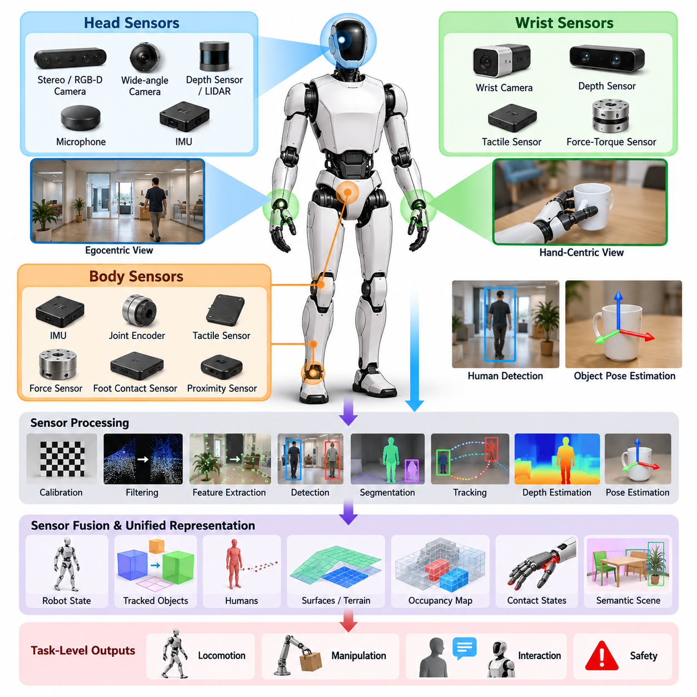
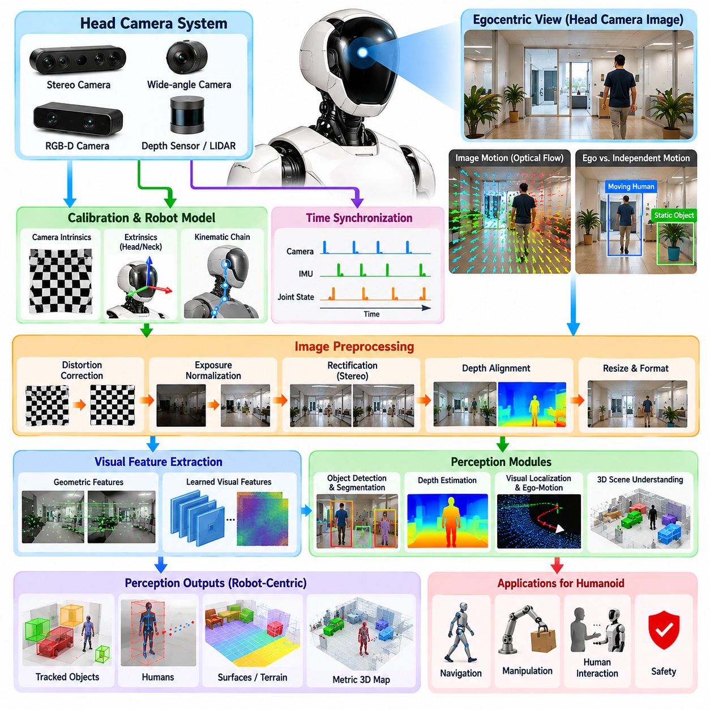
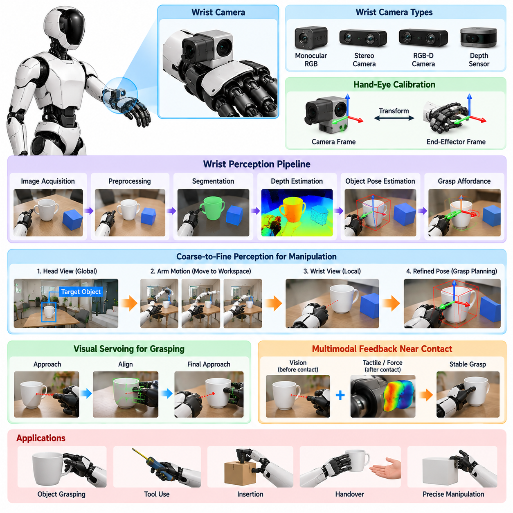
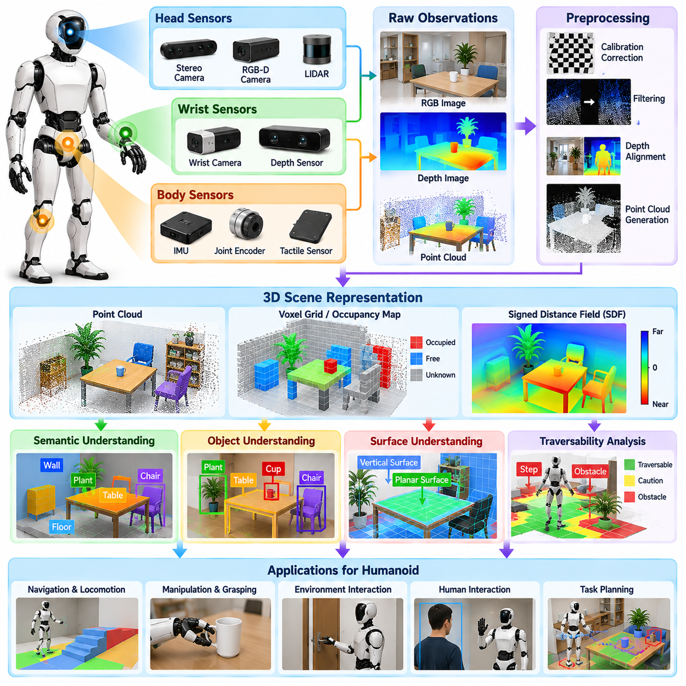
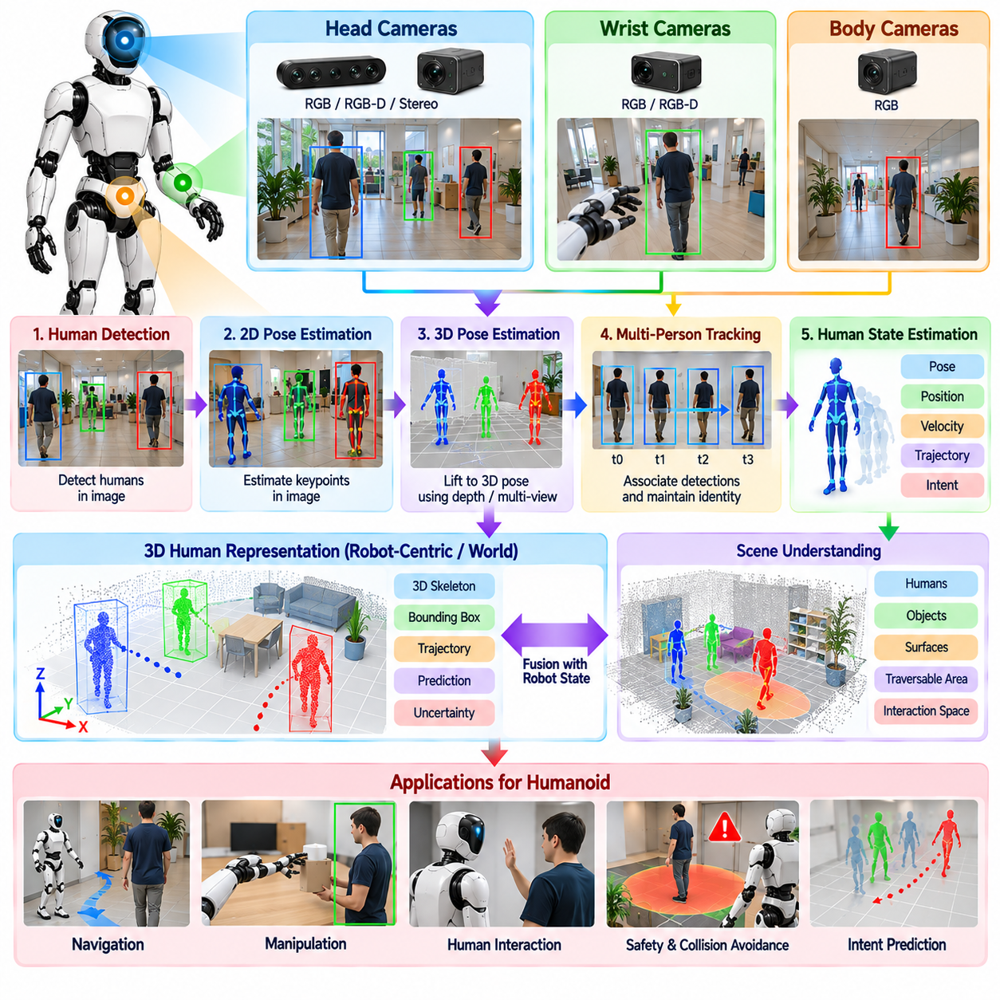
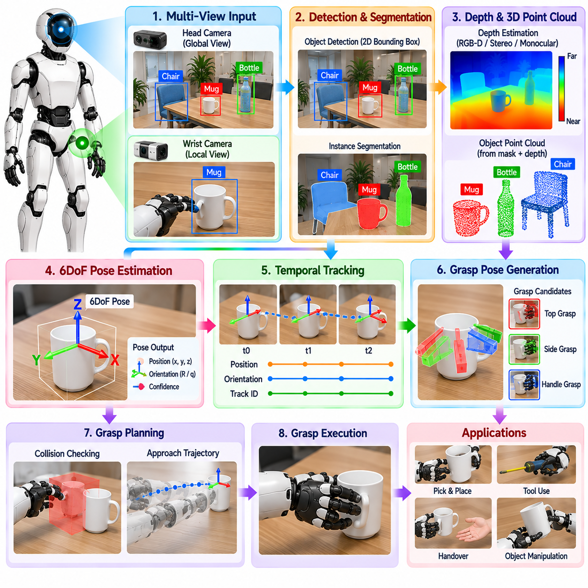
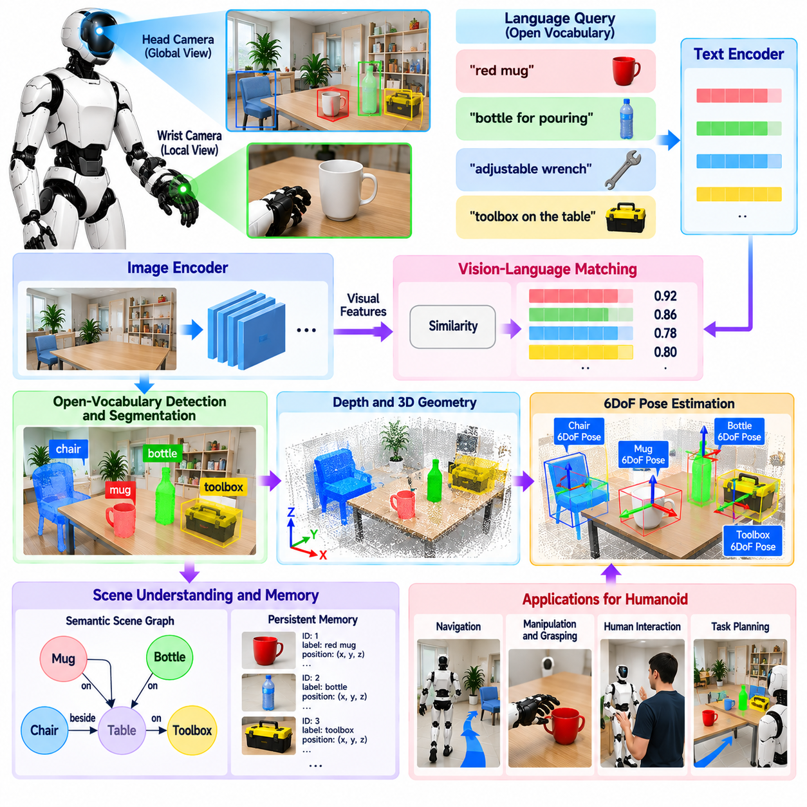
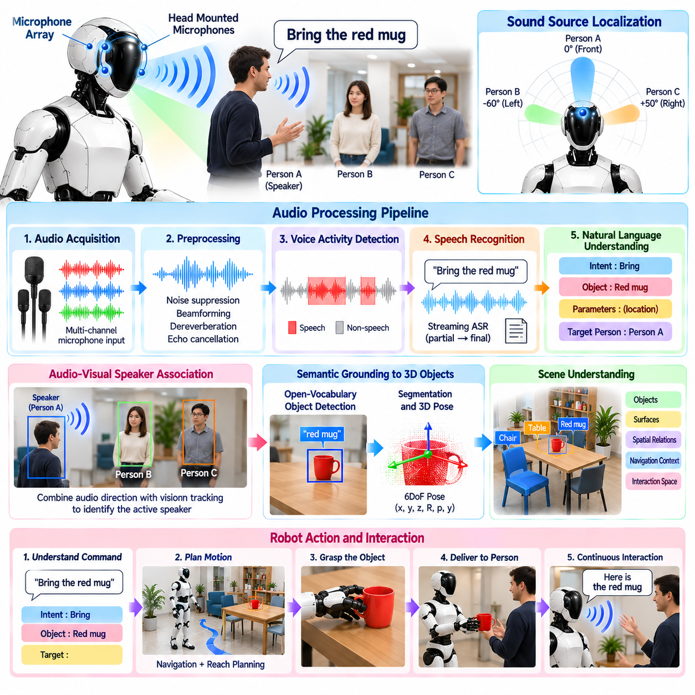
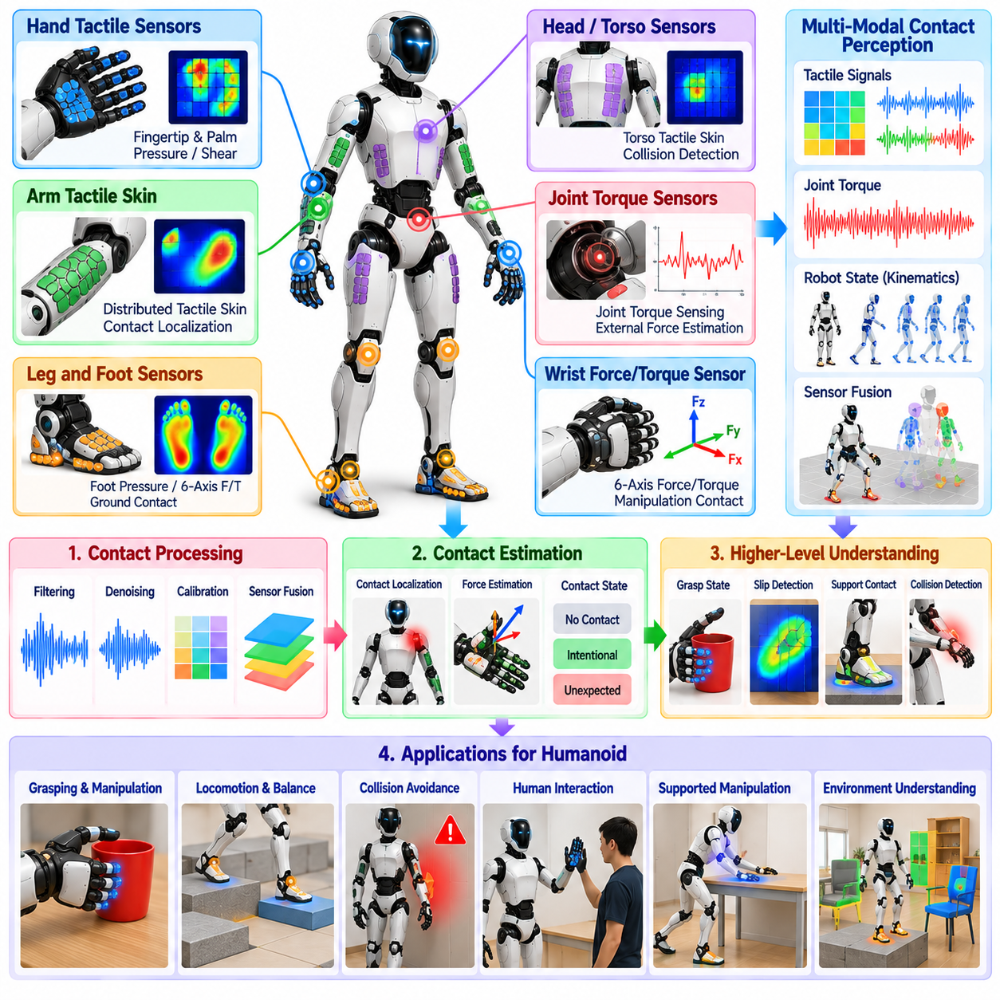
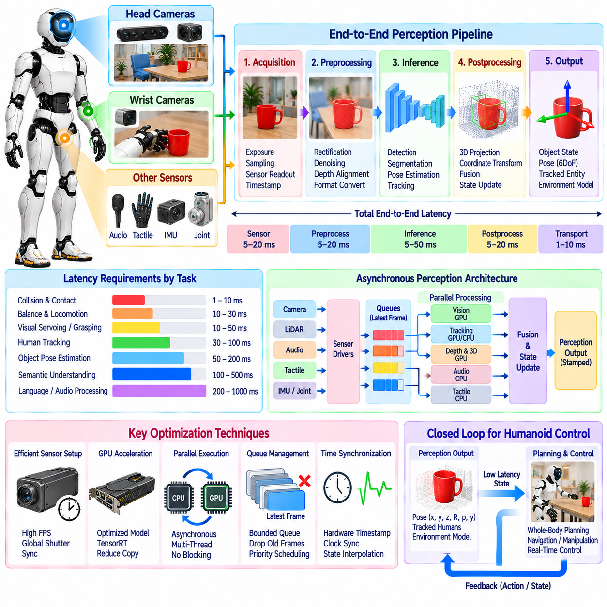

**Volume 22. Humanoid Robot Software**


# Chapter 06. Humanoid Perception

##  

## 06.01. Humanoid Perception Architecture Head Wrist Body

{width="7.268055555555556in" height="7.268055555555556in"}

Humanoid perception is fundamentally different from perception in fixed manipulators or wheeled mobile robots because sensing is distributed across a moving articulated body. A practical architecture therefore treats perception as a coordinated system of head, wrist, and body sensors rather than as a single camera pipeline. This organization supports locomotion, manipulation, interaction, and safety while maintaining a consistent representation of the environment as the robot continuously changes posture. Volume_22_Humanoid_Robot_Softwa...

The head sensing system provides the primary egocentric view of the world. Stereo or RGB-D cameras, wide-angle cameras, depth sensors, microphones, and sometimes LiDAR can be mounted near the head to observe objects, humans, terrain, and workspace structure. Because the head can rotate independently of the torso, its perception pipeline must continuously transform measurements through the head, neck, floating-base, and world coordinate frames before observations can be used by planning or control.

Head perception is especially important for long-range and task-level understanding. It identifies potential manipulation targets, estimates human locations, recognizes traversable regions, and constructs semantic descriptions of the surrounding scene. Unlike a static surveillance camera, however, a humanoid head experiences rapid rotations, walking-induced oscillation, self-motion, and temporary occlusion. Visual processing must therefore combine image observations with accurate timestamps, joint states, inertial measurements, and robot kinematics.

Wrist-mounted cameras complement the head view by providing close-range observations around the hands. During reaching, grasping, insertion, tool operation, or object handover, an object that was clearly visible from the head may become partially hidden behind the robot\'s arm or hand. Wrist cameras preserve visual access to the local manipulation region and provide higher effective spatial resolution for estimating object pose, contact geometry, grasp alignment, and small relative motions near the end effector.

The relationship between head and wrist perception naturally creates a coarse-to-fine sensing strategy. Head sensors can locate a target within the larger environment and guide the arm toward the appropriate workspace, while wrist sensing progressively refines the target estimate as the hand approaches it. This allows manipulation to transition from global scene understanding to local visual servoing without requiring a single sensor to provide both wide-area coverage and millimeter-scale task information.

Body perception extends sensing beyond vision. Inertial measurement units, joint encoders, force-torque sensors, tactile sensors, foot contact sensors, and distributed proximity or contact sensors provide information about the robot\'s own physical state and its interaction with the environment. These measurements are essential because humanoid perception must estimate not only what exists around the robot but also how the robot\'s articulated body is positioned, moving, loaded, and contacting external surfaces.

A unified perception architecture therefore requires a common spatial reference system. Every camera, IMU, tactile region, force sensor, and articulated link should have a calibrated transformation relative to the robot model. Forward kinematics continuously updates these relationships as joints move. Sensor observations can then be transformed into base, pelvis, torso, hand, or world frames, allowing a detected object from the head camera and a refined observation from the wrist camera to refer to the same physical entity.

Temporal synchronization is equally important. During dynamic walking, even a small timestamp mismatch between an image and joint configuration can produce significant geometric error because the head, torso, arms, and floating base may all be moving simultaneously. Hardware timestamps, synchronized clocks, buffered transforms, and interpolation of joint and inertial states help reconstruct the robot configuration corresponding to each observation. Perception quality therefore depends as much on timing integrity as on individual sensor accuracy.

The architecture should separate low-level sensor processing from higher-level perceptual representations. Device interfaces first acquire images, depth, inertial data, force measurements, audio, and tactile signals. Processing modules then perform calibration correction, filtering, feature extraction, detection, segmentation, tracking, depth estimation, and pose estimation. Fusion layers transform these outputs into persistent representations such as tracked objects, humans, surfaces, occupancy structures, contact states, and semantic scene elements.

Different perception products operate at different rates and latency requirements. Balance and contact estimation may require very fast proprioceptive updates, while object detection can operate at a lower image-frame frequency. Semantic scene understanding or open-vocabulary recognition may tolerate still longer inference times. A well-designed humanoid architecture therefore avoids forcing every perception algorithm into one synchronous loop and instead publishes time-stamped results that consumers can access according to their own control or planning frequencies.

Perception must also account explicitly for the robot\'s own body. Head and wrist cameras frequently observe arms, hands, legs, or torso surfaces, especially during manipulation and crouched postures. Using the known robot geometry and current joint configuration, self-regions can be predicted and separated from external objects. The same body model supports self-occlusion reasoning, collision monitoring, visibility prediction, and selection of alternative viewpoints when important regions become hidden.

Sensor redundancy improves robustness because no single viewpoint remains reliable throughout humanoid operation. Head cameras may lose an object during close manipulation, wrist cameras may have a narrow field of view, depth sensors may fail on reflective surfaces, and vision may degrade under poor illumination or motion blur. Combining multiple viewpoints with proprioception, force, tactile, and contact sensing allows the system to maintain useful state estimates even when one modality becomes temporarily unreliable.

The fused output should form a robot-centered world representation rather than a collection of unrelated detections. Objects require identities, poses, confidence estimates, semantic attributes, and temporal histories. Humans require position, pose, motion, and interaction state. Surfaces require geometry and traversability information, while contacts require location, force, and persistence. Maintaining these entities across sensor updates provides a stable interface between perception and downstream intelligence.

This shared representation connects directly to locomotion, whole-body control, manipulation, VLA policies, and human-robot interaction. The surrounding chapter structure reflects this progression from head and wrist vision through 3D understanding, human tracking, object pose estimation, open-vocabulary perception, audio, tactile sensing, and latency optimization. The architecture is therefore the integration foundation on which the specialized perception capabilities of the subsequent sections operate. Volume_22_Humanoid_Robot_Softwa...

For locomotion, perception supplies terrain geometry, obstacles, humans, free space, and potentially safe contact regions. For manipulation, it supplies object identity, 3D position, orientation, grasp-relevant geometry, and hand-object relationships. For interaction, it provides human pose, voice, gesture, gaze-related cues, and proximity information. These consumers may use different subsets of the same world model, making standardized representations and confidence information important for avoiding duplicated perception pipelines.

A production architecture must additionally expose uncertainty and health information. Each perception result should carry confidence, age, source, and validity information so that planning and control components can distinguish reliable observations from stale or ambiguous estimates. Sensor diagnostics should detect dropped frames, calibration drift, synchronization errors, blocked cameras, abnormal latency, and unavailable devices. Failure of perception must become an observable system state rather than silently propagating incorrect information.

Computational placement also influences architecture. Fast preprocessing and safety-critical estimation should remain close to the sensors and real-time control system, while GPU-intensive detection, segmentation, multimodal reasoning, and foundation-model inference can execute on dedicated AI computing hardware. Data movement between these domains should be minimized through efficient image transport, shared memory, zero-copy mechanisms, compressed representations where appropriate, and carefully defined interfaces between real-time and AI processes.

Ultimately, humanoid perception should be understood as active embodied sensing. The robot can move its head to inspect a region, reposition its torso to reduce occlusion, move a wrist camera closer to an object, touch a surface to resolve uncertainty, or change stance to obtain a better viewpoint. Head, wrist, and body perception therefore form a closed perception-action loop in which sensing guides motion and motion deliberately improves sensing, providing the perceptual foundation required for autonomous humanoid behavior.

휴머노이드 인식(Humanoid Perception)은 고정형 매니퓰레이터(Fixed Manipulator)나 바퀴형 이동 로봇(Wheeled Mobile Robot)의 인식과 근본적으로 다르다. 센싱(Sensing)이 움직이는 관절형 신체(Articulated Body) 전체에 분산되어 있기 때문이다. 따라서 실용적인 아키텍처(Architecture)는 인식을 단일 카메라 파이프라인(Camera Pipeline)이 아니라 머리(Head), 손목(Wrist), 신체(Body) 센서가 협력하는 시스템으로 구성한다. 이러한 구조는 로봇의 자세가 지속적으로 변하는 상황에서도 일관된 환경 표현을 유지하면서 보행(Locomotion), 조작(Manipulation), 상호작용(Interaction), 안전(Safety)을 지원한다.

머리 센싱 시스템(Head Sensing System)은 주변 세계에 대한 주요 자기중심적 시야(Egocentric View)를 제공한다. 스테레오(Stereo) 또는 RGB-D 카메라, 광각 카메라(Wide-Angle Camera), 깊이 센서(Depth Sensor), 마이크(Microphone), 경우에 따라 라이다(LiDAR)를 머리 주변에 장착하여 물체, 사람, 지형, 작업공간 구조를 관찰할 수 있다. 머리는 몸통(Torso)과 독립적으로 회전할 수 있으므로 인식 파이프라인은 측정값을 머리, 목, 부동 베이스(Floating Base), 월드 좌표계(World Coordinate Frame) 사이에서 지속적으로 변환해야 한다.

머리 인식(Head Perception)은 특히 장거리 인식(Long-Range Perception)과 작업 수준 이해(Task-Level Understanding)에 중요하다. 잠재적인 조작 대상(Target)을 식별하고, 사람의 위치를 추정하며, 이동 가능한 영역(Traversable Region)을 인식하고, 주변 장면의 의미론적 표현(Semantic Representation)을 구성한다. 그러나 고정형 감시 카메라와 달리 휴머노이드의 머리는 빠른 회전, 보행에 따른 진동, 자기 운동(Self-Motion), 일시적인 가림(Occlusion)을 경험한다. 따라서 시각 처리는 영상 관측과 정확한 타임스탬프(Timestamp), 관절 상태(Joint State), 관성 측정(Inertial Measurement), 로봇 운동학(Robot Kinematics)을 결합해야 한다.

손목 장착 카메라(Wrist-Mounted Camera)는 손 주변의 근거리 관측을 제공하여 머리 시야를 보완한다. 뻗기(Reaching), 파지(Grasping), 삽입(Insertion), 도구 조작(Tool Operation), 물체 전달(Object Handover) 과정에서는 머리에서 명확하게 보였던 물체가 로봇의 팔이나 손에 의해 부분적으로 가려질 수 있다. 손목 카메라는 국부적인 조작 영역(Local Manipulation Region)의 시각 정보를 유지하며, 물체 자세(Object Pose), 접촉 형상(Contact Geometry), 파지 정렬(Grasp Alignment), 말단장치(End Effector) 주변의 미세한 상대 운동을 보다 정밀하게 추정할 수 있도록 한다.

머리와 손목 인식의 관계는 자연스럽게 거친 단계에서 정밀 단계로 이어지는 센싱 전략(Coarse-to-Fine Sensing Strategy)을 형성한다. 머리 센서는 넓은 환경에서 목표물을 찾고 팔을 적절한 작업공간으로 유도하며, 손목 센싱은 손이 목표물에 접근할수록 목표 상태 추정을 점진적으로 정밀화한다. 이를 통해 하나의 센서가 광범위한 환경 관측과 밀리미터 수준의 작업 정보를 동시에 제공하지 않아도 전역 장면 이해(Global Scene Understanding)에서 국부 시각 서보잉(Local Visual Servoing)으로 자연스럽게 전환할 수 있다.

신체 인식(Body Perception)은 센싱을 시각 영역 이상으로 확장한다. 관성 측정 장치(Inertial Measurement Unit, IMU), 관절 엔코더(Joint Encoder), 힘-토크 센서(Force-Torque Sensor), 촉각 센서(Tactile Sensor), 발 접촉 센서(Foot Contact Sensor), 분산형 근접 또는 접촉 센서(Distributed Proximity or Contact Sensor)는 로봇 자체의 물리적 상태와 환경과의 상호작용 정보를 제공한다. 휴머노이드 인식은 주변에 무엇이 존재하는지를 파악하는 것뿐만 아니라 관절형 신체가 어디에 위치하고 어떻게 움직이며 어떤 하중과 접촉을 받고 있는지를 추정해야 하기 때문이다.

통합 인식 아키텍처(Unified Perception Architecture)는 공통 공간 기준 체계(Common Spatial Reference System)를 필요로 한다. 모든 카메라, IMU, 촉각 영역, 힘 센서, 관절 링크(Articulated Link)는 로봇 모델을 기준으로 보정된 변환 관계(Calibrated Transformation)를 가져야 한다. 순기구학(Forward Kinematics)은 관절이 움직일 때 이러한 관계를 지속적으로 갱신한다. 이를 통해 머리 카메라가 검출한 물체와 손목 카메라가 정밀하게 관측한 물체를 동일한 물리적 객체로 연결할 수 있다.

시간 동기화(Temporal Synchronization) 역시 중요하다. 동적 보행(Dynamic Walking) 중에는 영상과 관절 상태 사이에 작은 타임스탬프 불일치만 발생해도 상당한 기하학적 오차(Geometric Error)가 생길 수 있다. 머리, 몸통, 팔, 부동 베이스가 동시에 움직일 수 있기 때문이다. 하드웨어 타임스탬프(Hardware Timestamp), 동기화된 클록(Synchronized Clock), 버퍼링된 변환(Buffered Transform), 관절 및 관성 상태의 보간(Interpolation)을 사용하면 각 관측 시점에 대응하는 로봇 구성을 복원할 수 있다. 따라서 인식 품질은 개별 센서의 정확도뿐 아니라 시간 무결성(Timing Integrity)에도 크게 의존한다.

아키텍처는 저수준 센서 처리(Low-Level Sensor Processing)와 고수준 인식 표현(High-Level Perceptual Representation)을 분리해야 한다. 장치 인터페이스(Device Interface)는 먼저 영상, 깊이, 관성 데이터, 힘 측정값, 오디오(Audio), 촉각 신호를 획득한다. 이후 처리 모듈은 보정 보정(Calibration Correction), 필터링(Filtering), 특징 추출(Feature Extraction), 검출(Detection), 분할(Segmentation), 추적(Tracking), 깊이 추정(Depth Estimation), 자세 추정(Pose Estimation)을 수행한다. 융합 계층(Fusion Layer)은 이러한 결과를 추적 물체, 사람, 표면, 점유 구조(Occupancy Structure), 접촉 상태, 의미론적 장면 요소와 같은 지속적인 표현으로 변환한다.

각 인식 결과물(Perception Product)은 서로 다른 처리 주기와 지연시간 요구조건(Latency Requirement)을 가진다. 균형 및 접촉 추정(Balance and Contact Estimation)은 매우 빠른 고유수용성(Proprioceptive) 갱신을 요구할 수 있지만, 물체 검출(Object Detection)은 상대적으로 낮은 영상 프레임 주기로 동작할 수 있다. 의미론적 장면 이해(Semantic Scene Understanding)나 개방형 어휘 인식(Open-Vocabulary Recognition)은 더 긴 추론 시간을 허용할 수 있다. 따라서 모든 인식 알고리즘을 하나의 동기식 루프(Synchronous Loop)에 강제로 배치하기보다는 시간 정보가 포함된 결과를 발행하여 각 소비자가 자신의 제어 및 계획 주기에 맞게 이용하도록 해야 한다.

인식 시스템은 로봇 자신의 신체도 명시적으로 고려해야 한다. 머리와 손목 카메라는 특히 조작 작업이나 웅크린 자세에서 팔, 손, 다리, 몸통 표면을 자주 관찰한다. 알려진 로봇 형상(Robot Geometry)과 현재 관절 구성을 이용하면 자기 신체 영역(Self-Region)을 예측하여 외부 물체와 구분할 수 있다. 동일한 신체 모델(Body Model)은 자기 가림(Self-Occlusion) 추론, 충돌 모니터링(Collision Monitoring), 가시성 예측(Visibility Prediction), 중요한 영역이 가려졌을 때 대체 시점(Alternative Viewpoint)을 선택하는 데에도 활용될 수 있다.

센서 중복성(Sensor Redundancy)은 휴머노이드 동작 전체에서 하나의 시점만 지속적으로 신뢰할 수 없기 때문에 강건성(Robustness)을 향상시킨다. 머리 카메라는 근접 조작 중 물체를 놓칠 수 있고, 손목 카메라는 시야각(Field of View)이 좁으며, 깊이 센서는 반사 표면에서 실패할 수 있다. 또한 조명 부족이나 모션 블러(Motion Blur)로 시각 인식이 저하될 수 있다. 여러 시점과 고유수용성, 힘, 촉각, 접촉 센싱을 결합하면 특정 센서나 모달리티(Modality)가 일시적으로 불안정해져도 유용한 상태 추정을 유지할 수 있다.

융합된 출력은 서로 관련 없는 검출 결과의 집합이 아니라 로봇 중심의 월드 표현(Robot-Centered World Representation)을 형성해야 한다. 물체에는 식별자(Identity), 자세, 신뢰도(Confidence), 의미론적 속성(Semantic Attribute), 시간 이력(Temporal History)이 필요하다. 사람에 대해서는 위치, 자세, 움직임, 상호작용 상태를 유지해야 하며, 표면에는 형상과 이동 가능성(Traversability) 정보가 필요하다. 접촉에는 위치, 힘, 지속성(Persistence)이 포함되어야 한다. 이러한 엔티티(Entity)를 센서 갱신 과정에서 지속적으로 유지함으로써 인식과 상위 지능 시스템 사이에 안정적인 인터페이스를 제공할 수 있다.

이러한 공유 표현(Shared Representation)은 보행, 전신 제어(Whole-Body Control), 조작, 비전-언어-행동 정책(Vision-Language-Action Policy, VLA), 인간-로봇 상호작용(Human-Robot Interaction, HRI)과 직접 연결된다. 이어지는 구성 역시 머리 및 손목 비전(Head and Wrist Vision)에서 시작하여 3차원 이해(3D Understanding), 사람 추적(Human Tracking), 물체 자세 추정(Object Pose Estimation), 개방형 어휘 인식, 오디오, 촉각 센싱, 지연시간 최적화(Latency Optimization)로 확장된다. 따라서 이 아키텍처는 이후의 전문적인 인식 기능들이 동작하기 위한 통합 기반이다.

보행을 위해 인식 시스템은 지형 형상(Terrain Geometry), 장애물, 사람, 자유 공간(Free Space), 잠재적으로 안전한 접촉 영역을 제공한다. 조작을 위해서는 물체의 정체성, 3차원 위치, 방향, 파지 관련 형상, 손과 물체 사이의 관계를 제공한다. 상호작용을 위해서는 사람 자세, 음성, 제스처(Gesture), 시선 관련 단서(Gaze-Related Cue), 근접 정보를 제공한다. 각 소비자는 동일한 월드 모델(World Model)의 서로 다른 부분을 사용할 수 있으므로 표준화된 표현과 신뢰도 정보를 사용하면 중복된 인식 파이프라인을 줄일 수 있다.

실제 운용을 위한 아키텍처(Production Architecture)는 불확실성(Uncertainty)과 상태 건전성 정보(Health Information)도 명시적으로 제공해야 한다. 각 인식 결과에는 신뢰도, 데이터의 경과 시간(Age), 출처(Source), 유효성(Validity)이 포함되어야 하며, 이를 통해 계획 및 제어 구성요소가 신뢰할 수 있는 관측과 오래되거나 모호한 추정값을 구분할 수 있다. 센서 진단(Sensor Diagnostics)은 프레임 손실(Dropped Frame), 보정 드리프트(Calibration Drift), 동기화 오류, 카메라 가림, 비정상적인 지연시간, 장치 사용 불가 상태를 검출해야 한다. 인식 실패는 잘못된 정보가 조용히 전달되는 것이 아니라 관측 가능한 시스템 상태가 되어야 한다.

연산 배치(Computational Placement) 역시 전체 아키텍처에 영향을 준다. 빠른 전처리(Fast Preprocessing)와 안전 중요 추정(Safety-Critical Estimation)은 센서 및 실시간 제어 시스템 가까이에 배치하는 것이 바람직하며, GPU 연산량이 큰 검출, 분할, 멀티모달 추론(Multimodal Reasoning), 파운데이션 모델 추론(Foundation Model Inference)은 전용 AI 연산 하드웨어에서 수행할 수 있다. 이러한 영역 사이의 데이터 이동은 효율적인 영상 전송, 공유 메모리(Shared Memory), 제로 카피(Zero-Copy), 필요한 경우 압축 표현, 실시간 프로세스와 AI 프로세스 사이의 명확한 인터페이스를 통해 최소화해야 한다.

궁극적으로 휴머노이드 인식은 능동적 체화 센싱(Active Embodied Sensing)으로 이해해야 한다. 로봇은 특정 영역을 관찰하기 위해 머리를 움직이고, 가림을 줄이기 위해 몸통의 자세를 변경하며, 물체를 자세히 보기 위해 손목 카메라를 가까이 이동할 수 있다. 또한 불확실성을 해소하기 위해 표면을 직접 접촉하거나 더 나은 시점을 확보하기 위해 자세를 바꿀 수도 있다. 따라서 머리, 손목, 신체 인식은 센싱이 움직임을 안내하고 움직임이 다시 센싱 품질을 향상시키는 폐루프 인식-행동 구조(Closed Perception-Action Loop)를 형성하며, 이는 자율적인 휴머노이드 행동을 구현하기 위한 핵심적인 인식 기반이 된다.

##  

## 06.02. Egocentric Visual Perception Head Camera [w/Code]

{width="7.268055555555556in" height="7.268055555555556in"}

Egocentric visual perception allows a humanoid robot to interpret the environment from a viewpoint that moves with its head and body. Unlike fixed-camera perception, the visual coordinate system continuously changes as the robot walks, turns, bends, or directs its gaze. The head camera therefore acts as a primary perceptual interface between the humanoid and its surroundings, supporting scene understanding, navigation, manipulation, and human interaction.

A typical head vision system combines one or more RGB cameras with stereo, RGB-D, or other depth-sensing technologies. Wide-angle cameras provide broad situational awareness, while stereo or depth sensors recover three-dimensional structure around the robot. The sensor configuration must balance field of view, spatial resolution, depth range, frame rate, dynamic range, and computational bandwidth because the same visual stream may support several perception tasks simultaneously.

The defining characteristic of egocentric vision is that apparent image motion contains both environmental motion and motion generated by the robot itself. Head rotation, neck movement, torso oscillation, and locomotion can produce substantial optical flow even when surrounding objects remain stationary. Consequently, interpreting visual motion requires knowledge of the robot\'s own motion so that ego-motion can be separated from independently moving objects, humans, and other dynamic elements.

Accurate calibration connects head images to the physical humanoid model. Camera intrinsic parameters describe focal length, principal point, distortion, and projection characteristics, while extrinsic calibration defines the camera pose relative to the head or neck link. Because the head belongs to an articulated kinematic chain, the camera pose relative to the torso, floating base, and world changes continuously according to neck joints, body posture, and estimated base motion.

Time synchronization is critical when transforming visual observations through this moving kinematic chain. Each image should correspond to the joint positions, inertial measurements, and base state that existed when the frame was captured. If an image is associated with a delayed robot state, projected object locations can shift significantly during fast head rotation or walking. Timestamped sensor acquisition and interpolated state histories therefore form an essential part of reliable egocentric perception.

Image preprocessing prepares head-camera data for downstream algorithms. Typical operations include distortion correction, exposure normalization, image resizing, rectification for stereo cameras, depth alignment, and conversion into inference-compatible formats. These operations should preserve geometric consistency because later functions such as depth reconstruction, object localization, visual odometry, and 3D scene understanding depend on accurate relationships between pixels, camera rays, and physical coordinates.

Visual feature extraction converts raw images into representations useful for perception. Traditional geometric features can support tracking, localization, and motion estimation, while learned visual encoders provide semantic representations for object recognition, segmentation, open-vocabulary perception, and multimodal reasoning. Modern humanoid systems may therefore maintain both geometric and semantic pathways rather than forcing every visual task to depend on a single representation.

Object detection and segmentation transform the egocentric image into task-relevant entities. Detection identifies objects and humans within image regions, while semantic or instance segmentation provides more detailed spatial boundaries. For humanoid operation, these outputs become more useful when combined with depth information, allowing image detections to be projected into three-dimensional space and represented relative to the robot, local environment, or persistent world frame.

Depth perception is particularly important because humanoid behavior requires physical interaction with three-dimensional space. Stereo disparity, RGB-D sensing, monocular depth estimation, or combinations of these methods can provide distance information for obstacles, surfaces, humans, and manipulation targets. Depth uncertainty must be considered explicitly, especially for reflective, transparent, textureless, distant, or partially occluded objects where individual sensing technologies may become unreliable.

Head-camera perception also supports visual localization and ego-motion estimation. Consecutive observations can be used to estimate relative camera movement by tracking geometric or learned features across frames. When combined with IMU measurements and robot kinematics, visual information can contribute to a more stable estimate of head and body motion. This is especially valuable when the humanoid moves through environments where external localization infrastructure is unavailable or unreliable.

Dynamic scene understanding requires distinguishing ego-motion from independently moving entities. A person walking across the robot\'s field of view produces motion that differs from background motion caused by head rotation or forward walking. By combining optical flow, depth, camera motion, object tracking, and semantic information, the perception system can estimate which scene components are static and which are moving, enabling safer navigation and more reliable human-aware behavior.

Because the humanoid head is controllable, visual perception can be active rather than passive. The robot can rotate its neck to inspect an uncertain region, track a moving person, maintain visibility of a manipulation target, or search for an object outside the current field of view. Gaze direction can therefore be selected according to task relevance, uncertainty, safety, or expected information gain instead of simply pointing the camera in the direction of locomotion.

Active head motion introduces an important tradeoff between observation quality and motion-induced degradation. Rapid gaze changes increase coverage but may create motion blur and temporarily destabilize feature tracking. Slow movements preserve image quality but may respond too late to dynamic events. A practical gaze controller should therefore coordinate head velocity, camera exposure, tracking confidence, task priority, and body motion to obtain useful observations without unnecessarily disrupting perception.

Self-occlusion is another characteristic problem of egocentric humanoid vision. During reaching or manipulation, the robot\'s arms and hands can occupy large portions of the head-camera image and hide target objects. Current joint states and the robot\'s geometric model can predict where body links should appear in the image. These predicted regions can be masked, classified as self-body, or explicitly incorporated into visibility reasoning and viewpoint planning.

Persistent perception requires information to survive beyond individual frames. A detected object should not be treated as entirely new whenever the camera moves or the object temporarily disappears. Tracking and data association maintain object identities across time, while a local or global scene representation stores estimated poses, semantic labels, confidence, and observation history. This converts rapidly changing egocentric images into a more stable representation suitable for planning and reasoning.

Head vision has a direct relationship with manipulation perception. The head camera provides broad workspace awareness and identifies candidate objects before reaching begins. As the hand approaches a target, wrist-camera observations can provide higher-resolution local information and compensate for head-view occlusion. The two viewpoints can share object identities and coordinate frames, enabling perception to transition from global target acquisition to precise hand-object alignment.

Human perception is another major responsibility of the head camera. Detection, pose estimation, tracking, gesture recognition, and proximity analysis can transform visual observations into representations of nearby people. Because humans can move unpredictably and may interact directly with the robot, their states should be updated continuously with uncertainty estimates. These observations can then support collision avoidance, social interaction, handover, collaborative tasks, and safety monitoring.

Egocentric visual perception also provides an important input to higher-level semantic and language-conditioned intelligence. Visual encoders can associate observed regions with semantic concepts, while open-vocabulary models can identify objects beyond a fixed training taxonomy. Vision-language systems can connect linguistic instructions such as finding, approaching, picking, or pointing to objects with actual regions in the robot\'s current visual scene, grounding abstract commands in physical observations.

Real-time performance requires careful management of computation. Not every visual algorithm needs to process every camera frame at full resolution. Fast pathways can provide motion, obstacle, or human-safety information, while more expensive detection, segmentation, and semantic models operate asynchronously or only when requested. Region-of-interest processing, model optimization, reduced precision, GPU acceleration, and efficient memory transfer can reduce latency while preserving task-relevant visual quality.

Robustness requires continuous assessment of visual reliability. Excessive blur, poor illumination, saturation, blocked lenses, depth failure, dropped frames, or inference delays should be detectable conditions rather than hidden failures. Perception outputs should carry confidence and timing information so downstream components can determine whether an observation remains usable. When head vision becomes unreliable, the system can reduce motion, seek another viewpoint, or rely more heavily on other sensing modalities.

Ultimately, the head camera is not merely an image acquisition device but the central component of an embodied visual loop. The humanoid observes the environment, interprets relevant geometry and semantics, moves its eyes or head to improve visibility, and uses the resulting information to guide locomotion, manipulation, and interaction. Egocentric visual perception therefore links sensing, body motion, attention, spatial understanding, and task intelligence into a continuously operating perception-action process.

자기중심적 시각 인식(Egocentric Visual Perception)은 휴머노이드 로봇(Humanoid Robot)이 자신의 머리와 신체 움직임에 따라 변화하는 시점에서 환경을 해석할 수 있도록 한다. 고정 카메라 인식(Fixed-Camera Perception)과 달리 로봇이 걷고, 회전하고, 몸을 굽히거나 시선 방향을 바꿀 때 시각 좌표계(Visual Coordinate System)도 지속적으로 변화한다. 따라서 머리 카메라(Head Camera)는 휴머노이드와 주변 환경을 연결하는 핵심 인식 인터페이스(Perceptual Interface)로 작동하며, 장면 이해(Scene Understanding), 내비게이션(Navigation), 조작(Manipulation), 인간 상호작용(Human Interaction)을 지원한다.

일반적인 머리 비전 시스템(Head Vision System)은 하나 이상의 RGB 카메라와 스테레오(Stereo), RGB-D 또는 기타 깊이 센싱 기술(Depth-Sensing Technology)을 결합한다. 광각 카메라(Wide-Angle Camera)는 넓은 상황 인식(Situational Awareness)을 제공하고, 스테레오 또는 깊이 센서는 로봇 주변의 3차원 구조를 복원한다. 동일한 시각 스트림(Visual Stream)이 여러 인식 작업을 동시에 지원할 수 있으므로 센서 구성에서는 시야각(Field of View), 공간 해상도(Spatial Resolution), 깊이 범위(Depth Range), 프레임 속도(Frame Rate), 동적 범위(Dynamic Range), 연산 대역폭(Computational Bandwidth) 사이의 균형을 고려해야 한다.

자기중심적 비전(Egocentric Vision)의 가장 중요한 특징은 영상에서 관측되는 움직임에 환경 자체의 움직임과 로봇이 만들어내는 움직임이 동시에 포함된다는 것이다. 머리 회전, 목 움직임, 몸통 진동, 보행은 주변 물체가 정지해 있어도 상당한 광학 흐름(Optical Flow)을 발생시킬 수 있다. 따라서 시각적 움직임을 올바르게 해석하려면 로봇 자신의 움직임에 대한 정보가 필요하며, 이를 통해 자기 운동(Ego-Motion)과 독립적으로 움직이는 물체, 사람, 기타 동적 요소를 구분해야 한다.

정확한 보정(Calibration)은 머리 영상을 실제 휴머노이드 모델(Humanoid Model)과 연결한다. 카메라 내부 파라미터(Camera Intrinsic Parameters)는 초점 거리(Focal Length), 주점(Principal Point), 왜곡(Distortion), 투영 특성(Projection Characteristics)을 정의하며, 외부 보정(Extrinsic Calibration)은 머리 또는 목 링크(Neck Link)에 대한 카메라 자세를 정의한다. 머리는 관절형 운동학 체인(Articulated Kinematic Chain)에 포함되므로 몸통, 부동 베이스(Floating Base), 월드(World)에 대한 카메라 자세는 목 관절, 신체 자세, 추정된 베이스 움직임에 따라 지속적으로 변화한다.

이렇게 움직이는 운동학 체인을 통해 시각 관측값을 변환하려면 시간 동기화(Time Synchronization)가 매우 중요하다. 각 영상은 해당 프레임이 촬영된 순간의 관절 위치, 관성 측정값(Inertial Measurement), 베이스 상태(Base State)와 대응되어야 한다. 영상이 지연된 로봇 상태와 연결되면 빠른 머리 회전이나 보행 중 투영된 물체 위치에 상당한 오차가 발생할 수 있다. 따라서 타임스탬프 기반 센서 획득(Timestamped Sensor Acquisition)과 보간된 상태 이력(Interpolated State History)은 신뢰성 높은 자기중심적 인식을 구성하는 핵심 요소이다.

영상 전처리(Image Preprocessing)는 머리 카메라 데이터를 후속 알고리즘에 적합한 형태로 준비한다. 일반적인 처리에는 왜곡 보정(Distortion Correction), 노출 정규화(Exposure Normalization), 영상 크기 조정(Image Resizing), 스테레오 카메라 정류(Rectification), 깊이 정렬(Depth Alignment), 추론 호환 형식(Inference-Compatible Format)으로의 변환이 포함된다. 이후 수행되는 깊이 복원(Depth Reconstruction), 물체 위치 추정(Object Localization), 시각 오도메트리(Visual Odometry), 3차원 장면 이해가 픽셀, 카메라 광선(Camera Ray), 실제 좌표 사이의 정확한 관계에 의존하므로 이러한 처리 과정은 기하학적 일관성(Geometric Consistency)을 유지해야 한다.

시각 특징 추출(Visual Feature Extraction)은 원시 영상(Raw Image)을 인식에 유용한 표현으로 변환한다. 전통적인 기하학 특징(Geometric Feature)은 추적, 위치 추정, 움직임 추정을 지원할 수 있으며, 학습 기반 시각 인코더(Learned Visual Encoder)는 물체 인식, 분할, 개방형 어휘 인식(Open-Vocabulary Perception), 멀티모달 추론(Multimodal Reasoning)을 위한 의미론적 표현(Semantic Representation)을 제공한다. 따라서 현대적인 휴머노이드 시스템은 모든 시각 작업을 하나의 표현에 의존시키기보다 기하학적 경로(Geometric Pathway)와 의미론적 경로(Semantic Pathway)를 동시에 유지할 수 있다.

물체 검출(Object Detection)과 분할(Segmentation)은 자기중심적 영상을 작업과 관련된 엔티티(Task-Relevant Entity)로 변환한다. 검출은 영상 영역에서 물체와 사람을 식별하며, 의미론적 분할(Semantic Segmentation)이나 인스턴스 분할(Instance Segmentation)은 보다 상세한 공간 경계를 제공한다. 휴머노이드 동작에서는 이러한 결과를 깊이 정보와 결합할 때 활용도가 더욱 높아지며, 영상에서 검출된 대상을 3차원 공간으로 투영하여 로봇, 국부 환경(Local Environment), 지속적인 월드 좌표계(Persistent World Frame)를 기준으로 표현할 수 있다.

휴머노이드 행동은 3차원 공간과의 물리적 상호작용을 필요로 하므로 깊이 인식(Depth Perception)은 특히 중요하다. 스테레오 시차(Stereo Disparity), RGB-D 센싱, 단안 깊이 추정(Monocular Depth Estimation), 또는 이러한 방법의 조합을 통해 장애물, 표면, 사람, 조작 대상까지의 거리 정보를 얻을 수 있다. 특히 반사체, 투명체, 질감이 부족한 물체, 멀리 떨어진 물체, 부분적으로 가려진 물체에서는 개별 센싱 기술의 신뢰성이 낮아질 수 있으므로 깊이 불확실성(Depth Uncertainty)을 명시적으로 고려해야 한다.

머리 카메라 인식은 시각적 위치 추정(Visual Localization)과 자기 운동 추정(Ego-Motion Estimation)도 지원한다. 연속적인 프레임 사이에서 기하학적 특징이나 학습된 특징을 추적하여 상대적인 카메라 움직임을 추정할 수 있다. 이러한 시각 정보를 IMU 측정값과 로봇 운동학(Robot Kinematics)에 결합하면 머리와 신체 움직임을 보다 안정적으로 추정할 수 있다. 이는 외부 위치 추정 인프라(External Localization Infrastructure)를 사용할 수 없거나 신뢰하기 어려운 환경에서 휴머노이드가 이동할 때 특히 중요하다.

동적 장면 이해(Dynamic Scene Understanding)를 위해서는 자기 운동과 독립적으로 움직이는 엔티티를 구별해야 한다. 로봇의 시야를 가로질러 걷는 사람의 움직임은 머리 회전이나 전진 보행으로 발생하는 배경 움직임과 다른 특성을 가진다. 광학 흐름, 깊이, 카메라 움직임, 물체 추적(Object Tracking), 의미론적 정보를 결합하면 장면의 어떤 요소가 정적이고 어떤 요소가 움직이는지를 추정할 수 있으며, 이를 통해 보다 안전한 내비게이션과 신뢰성 높은 인간 인식 행동(Human-Aware Behavior)을 구현할 수 있다.

휴머노이드의 머리는 제어할 수 있으므로 시각 인식은 수동적(Passive) 과정이 아니라 능동적(Active) 과정이 될 수 있다. 로봇은 불확실한 영역을 관찰하기 위해 목을 회전하거나, 움직이는 사람을 추적하거나, 조작 대상의 가시성을 유지하거나, 현재 시야 밖에 있는 물체를 찾을 수 있다. 따라서 시선 방향(Gaze Direction)은 단순히 이동 방향을 향하도록 설정하는 것이 아니라 작업 관련성(Task Relevance), 불확실성, 안전, 예상 정보 이득(Expected Information Gain)을 기준으로 선택할 수 있다.

능동적인 머리 움직임(Active Head Motion)은 관측 품질과 움직임에 따른 성능 저하 사이에 중요한 절충 관계(Tradeoff)를 만든다. 빠른 시선 이동은 관측 범위를 증가시키지만 모션 블러(Motion Blur)를 발생시키고 특징 추적(Feature Tracking)을 일시적으로 불안정하게 만들 수 있다. 반대로 느린 움직임은 영상 품질을 유지하지만 동적 사건에 너무 늦게 대응할 수 있다. 따라서 실용적인 시선 제어기(Gaze Controller)는 머리 속도, 카메라 노출(Camera Exposure), 추적 신뢰도(Tracking Confidence), 작업 우선순위(Task Priority), 신체 움직임을 조정하여 인식을 불필요하게 방해하지 않으면서 유용한 관측을 확보해야 한다.

자기 가림(Self-Occlusion) 역시 자기중심적 휴머노이드 비전의 특징적인 문제이다. 뻗기(Reaching)나 조작 과정에서 로봇의 팔과 손이 머리 카메라 영상의 상당 부분을 차지하면서 목표 물체를 가릴 수 있다. 현재 관절 상태와 로봇의 기하학 모델(Geometric Model)을 이용하면 영상에서 신체 링크가 나타날 위치를 예측할 수 있다. 이러한 영역을 마스킹(Masking)하거나 자기 신체(Self-Body)로 분류하거나 가시성 추론(Visibility Reasoning) 및 시점 계획(Viewpoint Planning)에 명시적으로 반영할 수 있다.

지속적 인식(Persistent Perception)을 위해서는 개별 프레임을 넘어 정보가 유지되어야 한다. 검출된 물체는 카메라가 움직이거나 물체가 일시적으로 사라질 때마다 완전히 새로운 물체로 처리되어서는 안 된다. 추적(Tracking)과 데이터 연관(Data Association)을 통해 시간에 따라 물체의 식별자를 유지하고, 국부 또는 전역 장면 표현(Scene Representation)에 추정 자세, 의미론적 레이블(Semantic Label), 신뢰도, 관측 이력(Observation History)을 저장한다. 이를 통해 빠르게 변화하는 자기중심적 영상을 계획과 추론에 적합한 안정적인 표현으로 변환할 수 있다.

머리 비전(Head Vision)은 조작 인식(Manipulation Perception)과 직접적인 관계를 가진다. 머리 카메라는 넓은 작업공간에 대한 상황 인식을 제공하고 팔의 접근 동작이 시작되기 전에 후보 물체를 식별한다. 손이 목표에 가까워지면 손목 카메라(Wrist Camera)가 더 높은 해상도의 국부 정보를 제공하고 머리 시야에서 발생하는 가림을 보완할 수 있다. 두 시점이 물체 식별자와 좌표계를 공유하면 전역적인 목표 획득(Global Target Acquisition)에서 정밀한 손-물체 정렬(Hand-Object Alignment)로 자연스럽게 인식을 전환할 수 있다.

사람 인식(Human Perception)은 머리 카메라의 또 다른 핵심 역할이다. 검출, 자세 추정(Pose Estimation), 추적, 제스처 인식(Gesture Recognition), 근접도 분석(Proximity Analysis)을 통해 시각 관측을 주변 사람에 대한 상태 표현으로 변환할 수 있다. 사람은 예측하기 어렵게 움직일 수 있고 로봇과 직접 상호작용할 수 있으므로 불확실성 추정(Uncertainty Estimation)과 함께 상태를 지속적으로 갱신해야 한다. 이러한 관측은 충돌 회피, 사회적 상호작용(Social Interaction), 물체 전달, 협업 작업(Collaborative Task), 안전 모니터링을 지원할 수 있다.

자기중심적 시각 인식은 상위 수준의 의미론적 및 언어 조건부 지능(Language-Conditioned Intelligence)에도 중요한 입력을 제공한다. 시각 인코더(Visual Encoder)는 관측 영역을 의미론적 개념과 연결할 수 있으며, 개방형 어휘 모델(Open-Vocabulary Model)은 고정된 학습 분류 체계를 넘어 새로운 물체를 식별할 수 있다. 비전-언어 시스템(Vision-Language System)은 물체를 찾거나, 접근하거나, 집거나, 가리키라는 언어 명령을 로봇의 현재 시각 장면에 존재하는 실제 영역과 연결하여 추상적인 명령을 물리적 관측에 기반하도록 한다.

실시간 성능(Real-Time Performance)을 확보하려면 연산 자원을 신중하게 관리해야 한다. 모든 시각 알고리즘이 모든 카메라 프레임을 전체 해상도로 처리할 필요는 없다. 빠른 처리 경로(Fast Pathway)는 움직임, 장애물, 사람 안전 정보를 제공하고, 연산 비용이 높은 검출, 분할, 의미론적 모델은 비동기적(Asynchronous)으로 동작하거나 필요한 경우에만 실행할 수 있다. 관심 영역 처리(Region-of-Interest Processing), 모델 최적화(Model Optimization), 저정밀 연산(Reduced Precision), GPU 가속(GPU Acceleration), 효율적인 메모리 전송을 통해 작업에 필요한 시각 품질을 유지하면서 지연시간을 줄일 수 있다.

강건성(Robustness)을 확보하기 위해서는 시각 신뢰성(Visual Reliability)을 지속적으로 평가해야 한다. 과도한 영상 흐림, 불량한 조명, 포화(Saturation), 렌즈 가림, 깊이 센싱 실패, 프레임 손실(Dropped Frame), 추론 지연(Inference Delay)은 숨겨진 장애가 아니라 검출 가능한 상태가 되어야 한다. 인식 결과에는 신뢰도와 시간 정보가 포함되어야 하며, 이를 통해 하위 구성요소가 관측값을 계속 사용할 수 있는지 판단할 수 있다. 머리 비전의 신뢰성이 저하되면 시스템은 움직임을 줄이거나 다른 시점을 확보하거나 다른 센싱 모달리티(Sensing Modality)에 대한 의존도를 높일 수 있다.

궁극적으로 머리 카메라는 단순한 영상 획득 장치(Image Acquisition Device)가 아니라 체화된 시각 폐루프(Embodied Visual Loop)의 핵심 구성요소이다. 휴머노이드는 환경을 관찰하고, 관련된 기하학적 정보와 의미론적 정보를 해석하며, 가시성을 개선하기 위해 시선이나 머리를 움직이고, 새롭게 획득한 정보를 보행, 조작, 상호작용에 활용한다. 따라서 자기중심적 시각 인식은 센싱, 신체 움직임, 주의(Attention), 공간 이해(Spatial Understanding), 작업 지능(Task Intelligence)을 지속적으로 작동하는 인식-행동 과정(Perception-Action Process)으로 연결한다.

##  

## 06.03. Wrist Camera for Manipulation Grasping [w/Code]

{width="7.268055555555556in" height="7.268055555555556in"}

Wrist-mounted cameras provide a humanoid robot with a local visual perspective directly connected to manipulation and grasping. While head cameras offer broad scene awareness, their view becomes less effective as the hand approaches an object and the arm begins to occlude the target. A wrist camera moves with the manipulator, preserving visibility of the immediate workspace and enabling perception to remain tightly coupled with hand motion during physical interaction.

The wrist camera is typically mounted near the end effector, hand, or distal forearm so that its optical axis covers the region in which grasping and contact occur. Depending on the task, the system may use monocular RGB, stereo, RGB-D, or compact depth cameras. Camera placement must balance visibility, mechanical protection, field of view, minimum focusing distance, cable routing, and interference with the hand\'s reachable workspace.

Unlike a head camera, the wrist camera undergoes large translations and rotations generated directly by arm motion. Every joint movement changes the camera pose relative to the environment, making accurate hand-eye calibration essential. The transformation between the camera and end-effector coordinate frames must be known precisely so that visual observations can be converted into positions and orientations usable by inverse kinematics, motion planning, visual servoing, and grasp control.

Wrist perception usually operates as part of a coarse-to-fine perception architecture. The head camera first identifies a target and estimates its approximate location within the global workspace. The arm then moves toward the target, bringing the wrist camera into a favorable observation region. Local perception subsequently refines object position, orientation, surface geometry, and grasp features, reducing the uncertainty inherited from longer-range head-camera observations.

This transition requires consistent object identities and coordinate transformations between head and wrist perception. A target detected from the head should remain the same logical object when observed from the wrist, even though its appearance, scale, viewing angle, and illumination may change dramatically. Shared spatial representations and data association allow the manipulation system to combine global context with local observations instead of restarting perception whenever the viewpoint changes.

Depth estimation becomes particularly valuable near the hand. Grasp execution depends not only on recognizing an object but also on estimating the relative translation and orientation between the hand and target. Stereo disparity, active depth sensing, structured depth measurements, or learned monocular depth can provide local geometric information. At short range, calibration accuracy and depth noise can directly determine whether the fingers align correctly with intended contact regions.

Object pose estimation converts local visual observations into a manipulation-ready geometric state. For known rigid objects, model-based or learned methods can estimate six-degree-of-freedom pose, including three-dimensional position and orientation. For unfamiliar objects, segmentation, point-cloud geometry, surface normals, keypoints, or grasp-affordance representations can provide sufficient information to generate candidate grasps without requiring an exact object model.

Segmentation is important because wrist images often contain visually complex mixtures of the target, hand, fingers, nearby objects, support surfaces, and background regions. Instance segmentation can isolate the intended object, while self-body masking can remove image regions occupied by the robot\'s own hand or arm. Combining segmentation with depth allows the system to extract a local three-dimensional representation that is more suitable for grasp planning than a raw image alone.

As the hand approaches the target, closed-loop visual servoing can replace purely open-loop motion. Rather than executing an entire trajectory from an initial pose estimate, the robot repeatedly measures the target relative to the wrist camera and corrects the hand trajectory. Image-based visual servoing uses visual features directly, while position-based approaches reconstruct geometric error in three dimensions. Both methods can reduce errors caused by calibration uncertainty or object displacement.

The final centimeters before contact are particularly important because small pose errors can cause grasp failure. A wrist camera can monitor the relative alignment between fingers, object boundaries, handles, holes, edges, or other grasp features as the hand closes in. The controller can reduce approach velocity and increase perception frequency near contact, creating a precision phase in which visual feedback becomes more influential than the initial global motion plan.

Wrist vision and tactile sensing naturally complement each other. Vision provides information before physical contact, while tactile and force sensing become increasingly informative after contact begins. The manipulation system can therefore transition from visual guidance to multimodal contact control as the fingers touch the object. If visual alignment appears correct but tactile feedback indicates unexpected contact, the robot can stop, adjust the hand pose, or initiate a recovery action.

Occlusion remains challenging even with wrist-mounted sensing. Fingers may block the target during grasp closure, and the object itself may hide important contact regions depending on the approach direction. Multiple wrist cameras, wide-angle optics, head-camera observations, or active viewpoint changes can reduce this problem. The robot can also reposition the wrist before grasping to obtain an observation that maximizes visibility of critical geometric features.

Motion blur and rapid viewpoint changes can degrade wrist-camera perception during fast arm movement. A practical system may therefore coordinate manipulator velocity with visual confidence, slowing temporarily when precise observation is required. Short exposure, sufficient illumination, high frame rate, and motion-aware tracking can further improve image stability. Perception and manipulation should consequently be designed as coupled processes rather than independent software pipelines.

Bimanual humanoid manipulation introduces additional opportunities and complexity. Cameras mounted on both wrists provide complementary views of an object and allow each hand to observe the other\'s interaction region. During cooperative grasping, assembly, folding, or handover, the system can fuse observations from the left wrist, right wrist, and head. Accurate calibration across both kinematic chains is necessary to maintain a consistent shared representation of the task.

Wrist cameras are especially useful for tasks requiring precise alignment, such as inserting a connector, turning a handle, placing an object into a narrow slot, or operating a tool. In these cases, global object detection alone is insufficient because the relevant state is the small relative error between task features. Local vision can identify edges, holes, mating surfaces, markers, or functional components and provide continuous corrections throughout the operation.

Open-vocabulary and learned visual representations can extend wrist perception beyond predefined object categories. Instead of requiring every manipulated object to belong to a fixed detector class, a semantic model can associate local image regions with language descriptions or task concepts. This capability is important for general-purpose humanoids that may encounter previously unseen tools, containers, household objects, industrial parts, and other objects during deployment.

Manipulation policies can also consume wrist images directly. Imitation learning, reinforcement learning, and vision-language-action models may map local visual observations together with proprioception and task commands into end-effector or joint actions. In such architectures, the wrist camera becomes part of the policy observation space. Nevertheless, geometric calibration and explicit perception remain valuable for safety, diagnostics, interpretability, and integration with conventional planners.

Real-time execution requires careful control of the wrist vision pipeline. High-resolution images can improve fine-feature recognition but increase inference latency and memory bandwidth. The system may therefore crop regions of interest, reduce resolution during large arm motions, and switch to higher-detail processing near the target. GPU acceleration, efficient image transport, asynchronous inference, and optimized neural networks help maintain responsive perception without blocking the manipulation control loop.

Reliability monitoring should detect blurred images, blocked lenses, depth failure, calibration inconsistency, dropped frames, excessive latency, and unexpected disagreement between head and wrist observations. Each estimated object pose or grasp feature should include confidence and timing information. When local visual confidence falls below an acceptable level, the robot can pause the approach, move to another viewpoint, request a new global observation, or rely on contact sensing.

A robust grasping architecture therefore treats the wrist camera as an active sensor rather than a passive recorder. The manipulator can deliberately move the camera to reduce uncertainty before committing to contact, inspect multiple sides of an object, verify grasp success, and observe the object after lifting. Perception becomes part of the manipulation strategy itself, allowing actions to be selected not only to accomplish the task but also to obtain better information.

Ultimately, wrist-camera perception bridges the gap between global scene understanding and physical contact. Head vision identifies where interaction should occur, wrist vision resolves the local geometry required to approach accurately, and tactile or force perception confirms the interaction once contact begins. This progression creates a closed perception-action-contact loop that enables a humanoid to transform visual understanding into precise, adaptive, and robust grasping behavior.

손목 장착 카메라(Wrist-Mounted Camera)는 휴머노이드 로봇(Humanoid Robot)이 조작(Manipulation)과 파지(Grasping)에 직접 연결된 국부적인 시각 관점(Local Visual Perspective)을 확보할 수 있도록 한다. 머리 카메라(Head Camera)가 넓은 장면 인식(Scene Awareness)을 제공하는 반면, 손이 물체에 접근하고 팔이 목표물을 가리기 시작하면 머리 카메라의 시야는 제한될 수 있다. 손목 카메라는 매니퓰레이터(Manipulator)와 함께 움직이면서 가까운 작업공간의 가시성을 유지하고, 물리적 상호작용 과정에서 인식과 손의 움직임을 긴밀하게 연결한다.

손목 카메라는 일반적으로 말단장치(End Effector), 손(Hand), 또는 전완부 끝단(Distal Forearm) 근처에 장착하여 광축(Optical Axis)이 파지와 접촉이 발생하는 영역을 관찰하도록 구성한다. 작업 특성에 따라 단안 RGB(Monocular RGB), 스테레오(Stereo), RGB-D 또는 소형 깊이 카메라(Compact Depth Camera)를 사용할 수 있다. 카메라 배치는 가시성(Visibility), 기계적 보호(Mechanical Protection), 시야각(Field of View), 최소 초점 거리(Minimum Focusing Distance), 케이블 배선(Cable Routing), 손의 도달 작업공간(Reachable Workspace)에 대한 간섭을 종합적으로 고려해야 한다.

머리 카메라와 달리 손목 카메라는 팔의 움직임에 의해 큰 병진 이동(Translation)과 회전(Rotation)을 경험한다. 모든 관절 움직임은 환경에 대한 카메라 자세를 변화시키므로 정확한 핸드-아이 보정(Hand-Eye Calibration)이 필수적이다. 카메라 좌표계(Camera Frame)와 말단장치 좌표계(End-Effector Frame) 사이의 변환 관계를 정확하게 알아야 시각 관측값을 역기구학(Inverse Kinematics), 모션 계획(Motion Planning), 시각 서보잉(Visual Servoing), 파지 제어(Grasp Control)에 사용할 수 있는 위치와 방향 정보로 변환할 수 있다.

손목 인식(Wrist Perception)은 일반적으로 거친 단계에서 정밀 단계로 진행되는 인식 아키텍처(Coarse-to-Fine Perception Architecture)의 일부로 동작한다. 머리 카메라는 먼저 목표물을 식별하고 전역 작업공간(Global Workspace)에서 대략적인 위치를 추정한다. 이후 팔이 목표 방향으로 이동하면서 손목 카메라를 적절한 관측 영역으로 가져간다. 국부 인식(Local Perception)은 물체의 위치, 방향, 표면 형상(Surface Geometry), 파지 특징(Grasp Feature)을 더욱 정밀하게 추정하여 장거리 머리 카메라 관측에서 발생한 불확실성을 감소시킨다.

이러한 전환을 위해서는 머리 인식과 손목 인식 사이에서 일관된 물체 식별자(Object Identity)와 좌표 변환(Coordinate Transformation)이 유지되어야 한다. 머리에서 검출한 목표물은 손목에서 관찰할 때 외관, 크기, 관찰 각도, 조명이 크게 달라지더라도 동일한 논리적 물체로 유지되어야 한다. 공유 공간 표현(Shared Spatial Representation)과 데이터 연관(Data Association)을 사용하면 시점이 변경될 때마다 인식을 다시 시작하지 않고 전역 문맥(Global Context)과 국부 관측(Local Observation)을 결합할 수 있다.

깊이 추정(Depth Estimation)은 손 주변에서 특히 중요하다. 파지 실행은 물체를 인식하는 것뿐만 아니라 손과 목표물 사이의 상대적인 병진 위치와 방향을 추정해야 하기 때문이다. 스테레오 시차(Stereo Disparity), 능동형 깊이 센싱(Active Depth Sensing), 구조화된 깊이 측정(Structured Depth Measurement), 학습 기반 단안 깊이(Learned Monocular Depth)를 이용하여 국부 기하학 정보를 얻을 수 있다. 근거리에서는 보정 정확도와 깊이 노이즈(Depth Noise)가 손가락과 목표 접촉 영역의 정확한 정렬 여부를 직접 결정할 수 있다.

물체 자세 추정(Object Pose Estimation)은 국부적인 시각 관측을 조작에 사용할 수 있는 기하학적 상태(Manipulation-Ready Geometric State)로 변환한다. 알려진 강체 물체(Known Rigid Object)의 경우 모델 기반(Model-Based) 또는 학습 기반(Learned) 방법으로 3차원 위치와 방향을 포함하는 6자유도 자세(6-DoF Pose)를 추정할 수 있다. 익숙하지 않은 물체의 경우에는 정확한 물체 모델이 없더라도 분할(Segmentation), 포인트 클라우드 형상(Point-Cloud Geometry), 표면 법선(Surface Normal), 키포인트(Keypoint), 파지 어포던스(Grasp Affordance) 표현을 이용하여 후보 파지를 생성할 수 있다.

손목 영상에는 목표 물체, 손, 손가락, 주변 물체, 지지 표면(Support Surface), 배경이 복잡하게 혼합되어 나타나는 경우가 많기 때문에 분할은 중요하다. 인스턴스 분할(Instance Segmentation)은 목표 물체를 분리할 수 있으며, 자기 신체 마스킹(Self-Body Masking)은 로봇 자신의 손이나 팔이 차지하는 영상 영역을 제거할 수 있다. 분할 결과를 깊이 정보와 결합하면 원시 영상만 사용하는 것보다 파지 계획(Grasp Planning)에 적합한 국부 3차원 표현(Local 3D Representation)을 추출할 수 있다.

손이 목표물에 접근함에 따라 순수한 개루프 동작(Open-Loop Motion)을 폐루프 시각 서보잉(Closed-Loop Visual Servoing)으로 전환할 수 있다. 초기 자세 추정값을 이용하여 전체 궤적을 한 번에 실행하는 대신, 로봇은 손목 카메라를 기준으로 목표의 상대 위치를 반복적으로 측정하고 손의 궤적을 수정한다. 영상 기반 시각 서보잉(Image-Based Visual Servoing)은 시각 특징을 직접 사용하며, 위치 기반 방식(Position-Based Approach)은 3차원 공간에서 기하학적 오차를 복원한다. 두 방식 모두 보정 불확실성이나 물체 이동으로 발생하는 오차를 줄일 수 있다.

접촉 직전의 마지막 수 센티미터는 작은 자세 오차만으로도 파지 실패가 발생할 수 있기 때문에 특히 중요하다. 손목 카메라는 손이 목표물에 가까워지는 동안 손가락, 물체 경계, 손잡이, 구멍, 모서리 또는 기타 파지 특징 사이의 상대 정렬(Relative Alignment)을 관찰할 수 있다. 제어기는 접촉에 가까워질수록 접근 속도를 낮추고 인식 주기(Perception Frequency)를 높여 초기 전역 모션 계획보다 시각 피드백의 영향력을 높이는 정밀 단계(Precision Phase)를 구성할 수 있다.

손목 비전(Wrist Vision)과 촉각 센싱(Tactile Sensing)은 자연스럽게 서로를 보완한다. 시각은 물리적 접촉 이전의 정보를 제공하고, 촉각과 힘 센싱(Force Sensing)은 접촉이 시작된 이후 점차 더 중요한 정보를 제공한다. 따라서 조작 시스템은 손가락이 물체와 접촉함에 따라 시각 유도(Visual Guidance)에서 멀티모달 접촉 제어(Multimodal Contact Control)로 전환할 수 있다. 시각적 정렬이 정상적으로 보이더라도 촉각 피드백에서 예상하지 못한 접촉이 감지되면 로봇은 정지하거나 손 자세를 조정하거나 복구 동작(Recovery Action)을 시작할 수 있다.

손목 장착 센싱에서도 가림(Occlusion)은 여전히 중요한 문제이다. 파지 과정에서 손가락이 목표물을 가릴 수 있으며, 접근 방향에 따라 물체 자체가 중요한 접촉 영역을 숨길 수도 있다. 여러 개의 손목 카메라, 광각 광학계(Wide-Angle Optics), 머리 카메라 관측 또는 능동적인 시점 변경(Active Viewpoint Change)을 사용하면 이러한 문제를 줄일 수 있다. 또한 로봇은 파지 전에 손목 위치를 변경하여 중요한 기하학 특징의 가시성을 최대화하는 관측 시점을 확보할 수 있다.

빠른 팔 움직임 중에는 모션 블러(Motion Blur)와 급격한 시점 변화가 손목 카메라의 인식 성능을 저하시킬 수 있다. 따라서 실용적인 시스템에서는 시각 신뢰도(Visual Confidence)에 따라 매니퓰레이터 속도를 조절하고, 정밀한 관측이 필요한 순간에는 일시적으로 움직임을 늦출 수 있다. 짧은 노출 시간(Short Exposure), 충분한 조명, 높은 프레임 속도(High Frame Rate), 움직임 인식 추적(Motion-Aware Tracking)을 사용하면 영상 안정성을 더욱 향상시킬 수 있다. 따라서 인식과 조작은 독립적인 소프트웨어 파이프라인이 아니라 서로 결합된 과정으로 설계되어야 한다.

양팔 휴머노이드 조작(Bimanual Humanoid Manipulation)은 추가적인 가능성과 복잡성을 제공한다. 양쪽 손목에 장착된 카메라는 하나의 물체를 서로 보완적인 시점에서 관찰할 수 있으며, 각 손은 상대 손의 상호작용 영역을 관찰할 수도 있다. 협력 파지(Cooperative Grasping), 조립(Assembly), 접기(Folding), 물체 전달(Handover) 과정에서 시스템은 왼쪽 손목, 오른쪽 손목, 머리에서 획득한 관측값을 융합할 수 있다. 작업에 대한 일관된 공유 표현을 유지하려면 양쪽 운동학 체인 사이의 정확한 보정이 필요하다.

손목 카메라는 커넥터 삽입(Inserting a Connector), 손잡이 회전(Turning a Handle), 좁은 슬롯에 물체 배치, 도구 조작과 같이 정밀한 정렬이 필요한 작업에서 특히 유용하다. 이러한 작업에서는 중요한 상태가 작업 특징 사이의 매우 작은 상대 오차이기 때문에 전역적인 물체 검출만으로는 충분하지 않다. 국부 비전(Local Vision)은 모서리, 구멍, 결합 표면(Mating Surface), 마커(Marker), 기능적 구성요소(Functional Component)를 식별하고 작업 수행 과정 전체에 걸쳐 지속적인 보정값을 제공할 수 있다.

개방형 어휘(Open-Vocabulary) 및 학습 기반 시각 표현(Learned Visual Representation)은 손목 인식을 사전에 정의된 물체 범주 이상으로 확장할 수 있다. 조작 대상이 반드시 고정된 검출 클래스에 포함될 필요 없이 의미론적 모델(Semantic Model)이 국부 영상 영역을 언어 설명(Language Description)이나 작업 개념(Task Concept)과 연결할 수 있다. 이러한 능력은 배치 환경에서 처음 접하는 도구, 용기, 가정용 물체, 산업 부품 등 다양한 물체를 다뤄야 하는 범용 휴머노이드(General-Purpose Humanoid)에 중요하다.

조작 정책(Manipulation Policy)은 손목 영상을 직접 입력으로 사용할 수도 있다. 모방 학습(Imitation Learning), 강화학습(Reinforcement Learning), 비전-언어-행동 모델(Vision-Language-Action Model, VLA)은 국부 시각 관측, 고유수용성(Proprioception), 작업 명령을 함께 입력받아 말단장치 또는 관절 행동으로 변환할 수 있다. 이러한 아키텍처에서는 손목 카메라가 정책의 관측 공간(Observation Space)을 구성한다. 그럼에도 기하학적 보정과 명시적인 인식은 안전, 진단, 해석 가능성(Interpretability), 기존 계획기와의 통합을 위해 여전히 중요한 역할을 한다.

실시간 실행(Real-Time Execution)을 위해서는 손목 비전 파이프라인(Wrist Vision Pipeline)을 신중하게 관리해야 한다. 고해상도 영상은 미세 특징 인식을 향상시키지만 추론 지연(Inference Latency)과 메모리 대역폭 사용량을 증가시킨다. 따라서 시스템은 관심 영역(Region of Interest)을 잘라내어 처리하거나, 큰 팔 움직임 중에는 해상도를 낮추고, 목표물 근처에서는 보다 세밀한 처리로 전환할 수 있다. GPU 가속, 효율적인 영상 전송, 비동기 추론(Asynchronous Inference), 최적화된 신경망을 이용하면 조작 제어 루프를 차단하지 않으면서 반응성이 높은 인식을 유지할 수 있다.

신뢰성 모니터링(Reliability Monitoring)은 영상 흐림, 렌즈 가림, 깊이 센싱 실패, 보정 불일치(Calibration Inconsistency), 프레임 손실(Dropped Frame), 과도한 지연시간, 머리와 손목 관측 사이의 비정상적인 불일치를 검출해야 한다. 추정된 각 물체 자세와 파지 특징에는 신뢰도와 시간 정보가 포함되어야 한다. 국부 시각 신뢰도가 허용 수준 이하로 떨어지면 로봇은 접근을 일시 중지하거나 다른 시점으로 이동하거나 새로운 전역 관측을 요청하거나 접촉 센싱(Contact Sensing)에 더 의존할 수 있다.

강건한 파지 아키텍처(Robust Grasping Architecture)는 손목 카메라를 수동적인 기록 장치가 아니라 능동 센서(Active Sensor)로 취급한다. 매니퓰레이터는 접촉을 실행하기 전에 불확실성을 줄이기 위해 의도적으로 카메라를 이동시키고, 물체의 여러 면을 관찰하며, 파지 성공 여부를 확인하고, 물체를 들어 올린 후에도 상태를 관찰할 수 있다. 이를 통해 인식 자체가 조작 전략의 일부가 되며, 로봇은 작업 수행뿐 아니라 더 좋은 정보를 획득하기 위한 목적으로도 행동을 선택할 수 있다.

궁극적으로 손목 카메라 인식(Wrist-Camera Perception)은 전역적인 장면 이해(Global Scene Understanding)와 실제 물리적 접촉(Physical Contact) 사이의 간극을 연결한다. 머리 비전은 상호작용이 이루어져야 할 위치를 식별하고, 손목 비전은 정확한 접근에 필요한 국부 형상을 해석하며, 촉각 또는 힘 인식(Tactile or Force Perception)은 접촉이 시작된 이후 실제 상호작용 상태를 확인한다. 이러한 단계적 연결은 폐루프 인식-행동-접촉 구조(Closed Perception-Action-Contact Loop)를 형성하며, 휴머노이드가 시각적 이해를 정밀하고 적응적이며 강건한 파지 행동으로 변환할 수 있도록 한다.

##  

## 06.04. 3D Scene Understanding for Humanoid [w/Code]

{width="7.268055555555556in" height="7.268055555555556in"}

Three-dimensional scene understanding enables a humanoid robot to convert raw sensory observations into a spatial representation of the physical environment. Unlike image-level perception, which primarily describes what appears in individual camera frames, 3D understanding estimates where objects, surfaces, humans, obstacles, and interaction regions exist relative to the robot. This spatial representation supports locomotion, manipulation, whole-body planning, and safe physical interaction.

A humanoid can obtain 3D information from stereo cameras, RGB-D sensors, LiDAR, monocular depth models, or combinations of these sources. Each sensing method has different characteristics in range, resolution, field of view, noise, and failure conditions. A practical perception system therefore treats depth measurements as uncertain observations and integrates complementary sensors when necessary rather than assuming that every measured 3D point is equally reliable.

The moving humanoid body makes 3D reconstruction more complex than reconstruction from a fixed sensor platform. Head cameras rotate with the neck, wrist cameras move with the arms, and the floating base changes position during walking. Every depth observation must therefore be transformed through calibrated sensor extrinsics and the current robot kinematic state into a consistent coordinate frame before measurements acquired from different viewpoints can be combined.

Accurate temporal alignment is essential during this transformation process. A depth image captured at one instant must be associated with the joint configuration, IMU state, and estimated base pose corresponding to that same instant. Even small synchronization errors can distort reconstructed geometry when the head or body moves rapidly. Timestamped measurements, buffered transforms, and state interpolation help maintain geometric consistency across asynchronous sensing streams.

The first useful representation may be a depth image or organized point cloud in the camera coordinate frame. By applying camera calibration and depth measurements, image pixels can be projected into three-dimensional points containing position and potentially color or semantic information. These local point clouds provide immediate geometric evidence but usually require filtering to remove invalid depth, isolated noise, reflective artifacts, and measurements outside the robot\'s useful operating region.

Multiple observations can be accumulated into a larger spatial representation as the humanoid moves. Registration aligns successive point clouds or depth observations using estimated camera motion, robot kinematics, visual odometry, or SLAM information. Accumulation increases coverage beyond a single viewpoint and allows the robot to reason about regions that are temporarily outside the camera view, although stale information must be handled carefully in dynamic environments.

Dense scene representations can use point clouds, voxel grids, occupancy maps, signed distance fields, or related structures depending on the task. Point clouds preserve measured geometry efficiently, while voxel representations provide regular spatial indexing. Occupancy structures indicate whether regions are free, occupied, or unknown, and signed distance representations can support collision checking, surface reconstruction, trajectory optimization, and manipulation planning.

A humanoid requires more than geometric reconstruction because physical tasks depend on the meaning and function of scene elements. Semantic segmentation can associate 3D regions with categories such as floor, wall, table, container, tool, human, or obstacle. Instance-level representations separate individual objects within the same category. Combining geometry with semantics produces a structured scene in which the robot understands both spatial arrangement and task-relevant identity.

Object-level 3D understanding transforms dense sensor measurements into persistent entities. Each object can maintain an estimated position, orientation, dimensions, semantic label, confidence, and observation history. When an object is observed from several viewpoints, its state can be refined rather than recreated from each frame. Persistent object representations are particularly useful for task planning because actions are usually expressed in terms of objects rather than millions of individual points.

Surface understanding is equally important for humanoid behavior. Floors, stairs, ramps, shelves, tables, walls, handles, and support surfaces impose different constraints on locomotion and manipulation. Surface normals, planar regions, edges, curvature, height changes, and local roughness can be extracted from 3D geometry. These properties help determine whether a region can support a foot, receive an object, permit contact, or provide a useful manipulation feature.

For locomotion, the 3D scene representation must describe traversable and hazardous regions around the humanoid. Ground geometry can be analyzed to identify steps, gaps, slopes, obstacles, and changes in elevation. Because humanoid locomotion involves discrete foot contacts rather than only planar driving, perception may need to estimate candidate footholds and their orientation, dimensions, clearance, and local surface quality for use by footstep and whole-body planners.

Manipulation requires a different interpretation of the same scene. The perception system must identify reachable objects, estimate their geometry and pose, determine free approach directions, and understand surrounding obstacles. A target may be visually detectable but physically inaccessible because another object blocks the hand trajectory. Three-dimensional reasoning therefore connects object perception with reachability, collision constraints, grasp planning, and whole-body configuration.

Head and wrist cameras provide complementary contributions to 3D scene understanding. Head sensing captures broad environmental structure and establishes global context, while wrist sensing provides detailed geometry near the manipulation target. Observations from both viewpoints can be transformed into a shared reference frame and fused. This allows the robot to preserve global awareness while refining local geometry during reaching, grasping, insertion, or tool use.

Human-aware 3D perception is necessary when humanoids operate near people. Human detection and pose estimation can be projected into three-dimensional space to estimate body locations, limb configurations, motion, and proximity. Tracking these states over time allows the robot to distinguish occupied regions from potentially safe motion space and provides spatial information for collaborative manipulation, handover, social interaction, and collision avoidance.

Dynamic environments require the scene model to distinguish persistent structure from moving or temporary content. A table may remain static while people, tools, containers, or mobile equipment move through the workspace. If all observations are permanently fused into one static map, moving objects can leave incorrect geometry behind. Dynamic scene understanding therefore requires tracking, temporal decay, change detection, and object-aware map updates to maintain a current representation.

Occlusion must also be represented explicitly. A region that has not been observed is different from a region known to be empty. Three-dimensional occupancy models can preserve unknown space behind objects, walls, furniture, or the robot\'s own body. This distinction is important for safe motion planning because a humanoid should not assume that unobserved space is collision-free merely because no sensor measurement currently occupies it.

Scene graphs can provide a higher-level representation above dense geometry. Instead of describing only coordinates, a graph can encode objects and regions as entities connected by spatial or functional relations such as on, inside, next to, supported by, reachable from, or held by. Such relational representations allow task planners and language-conditioned systems to reason about physical scenes using structured concepts while retaining links to underlying metric geometry.

Open-vocabulary perception can further extend the semantic layer by allowing scene elements to be associated with language concepts beyond a fixed detector taxonomy. Visual and multimodal models can connect regions of the 3D environment with textual descriptions, enabling commands referring to previously unseen objects or functional concepts. Metric grounding remains necessary so that semantic recognition ultimately produces physical locations usable for robot action.

Uncertainty should propagate through the complete 3D perception pipeline. Depth measurements, camera poses, object detections, registration, and semantic predictions all contain error. A useful scene model therefore stores confidence, covariance, observation age, or related quality measures rather than representing every estimate as exact. Planning components can use this information to avoid uncertain regions or request additional observations before executing risky physical actions.

Active perception allows the humanoid to improve the scene model through deliberate movement. The robot can rotate its head to reveal an occluded region, move its torso to obtain depth from another viewpoint, approach an object for higher-resolution sensing, or reposition a wrist camera before manipulation. Viewpoint selection can be driven by uncertainty or task relevance, turning 3D reconstruction into an interactive perception-action process rather than passive mapping.

Real-time operation requires multiple spatial representations at different scales and update rates. A rapidly updated local map can support collision avoidance and immediate motion, while a broader semantic representation can evolve more slowly for task planning and memory. GPU acceleration, efficient voxel structures, region-of-interest updates, asynchronous processing, and selective map maintenance help control computation and memory consumption on onboard hardware.

Ultimately, 3D scene understanding provides the spatial foundation that connects humanoid perception with physical intelligence. Raw images and depth measurements become surfaces, objects, humans, free space, obstacles, relations, and actionable regions expressed in consistent coordinates. By maintaining these representations over time and updating them through active sensing, the humanoid gains a continuously evolving model of where it is, what surrounds it, and how its body can safely interact with the world.

3차원 장면 이해(3D Scene Understanding)는 휴머노이드 로봇(Humanoid Robot)이 원시 센서 관측(Raw Sensory Observation)을 물리적 환경에 대한 공간 표현(Spatial Representation)으로 변환할 수 있도록 한다. 개별 카메라 프레임에 무엇이 나타나는지를 주로 설명하는 영상 수준 인식(Image-Level Perception)과 달리, 3차원 이해는 물체, 표면, 사람, 장애물, 상호작용 영역이 로봇을 기준으로 어디에 존재하는지를 추정한다. 이러한 공간 표현은 보행(Locomotion), 조작(Manipulation), 전신 계획(Whole-Body Planning), 안전한 물리적 상호작용을 지원한다.

휴머노이드는 스테레오 카메라(Stereo Camera), RGB-D 센서, 라이다(LiDAR), 단안 깊이 모델(Monocular Depth Model) 또는 이러한 센서의 조합을 통해 3차원 정보를 획득할 수 있다. 각 센싱 방법은 측정 거리, 해상도, 시야각(Field of View), 노이즈, 실패 조건에서 서로 다른 특성을 가진다. 따라서 실용적인 인식 시스템은 모든 3차원 측정점을 동일하게 신뢰하기보다 깊이 측정값을 불확실성을 포함한 관측으로 취급하고 필요한 경우 상호 보완적인 센서를 통합한다.

움직이는 휴머노이드 신체는 고정된 센서 플랫폼에서 수행하는 3차원 복원(3D Reconstruction)보다 문제를 복잡하게 만든다. 머리 카메라는 목과 함께 회전하고, 손목 카메라는 팔과 함께 움직이며, 부동 베이스(Floating Base)는 보행 중 위치가 변화한다. 따라서 서로 다른 시점에서 획득한 측정값을 결합하려면 모든 깊이 관측값을 보정된 센서 외부 파라미터(Sensor Extrinsics)와 현재 로봇 운동학 상태(Robot Kinematic State)를 통해 일관된 좌표계로 변환해야 한다.

이러한 변환 과정에서는 정확한 시간 정렬(Temporal Alignment)이 필수적이다. 특정 순간에 획득한 깊이 영상은 동일한 순간의 관절 구성(Joint Configuration), 관성 측정 장치 상태(IMU State), 추정 베이스 자세(Estimated Base Pose)와 연결되어야 한다. 머리나 신체가 빠르게 움직이는 동안에는 작은 동기화 오차도 복원된 형상을 왜곡할 수 있다. 타임스탬프 기반 측정(Timestamped Measurement), 버퍼링된 변환(Buffered Transform), 상태 보간(State Interpolation)은 비동기 센싱 스트림 사이의 기하학적 일관성을 유지하는 데 도움을 준다.

첫 번째로 유용한 표현은 카메라 좌표계의 깊이 영상(Depth Image)이나 구조화된 포인트 클라우드(Organized Point Cloud)가 될 수 있다. 카메라 보정값과 깊이 측정값을 적용하면 영상 픽셀을 위치와 색상 또는 의미론적 정보를 포함하는 3차원 점으로 투영할 수 있다. 이러한 국부 포인트 클라우드(Local Point Cloud)는 즉각적인 기하학 정보를 제공하지만 일반적으로 유효하지 않은 깊이, 고립된 노이즈, 반사 아티팩트(Reflective Artifact), 로봇의 유효 작업 범위를 벗어난 측정값을 제거하는 필터링이 필요하다.

휴머노이드가 움직이는 동안 여러 관측값을 누적하여 더 넓은 공간 표현을 구성할 수 있다. 정합(Registration)은 추정된 카메라 움직임, 로봇 운동학, 시각 오도메트리(Visual Odometry), 또는 동시적 위치추정 및 지도작성(Simultaneous Localization and Mapping, SLAM) 정보를 이용하여 연속적인 포인트 클라우드나 깊이 관측을 정렬한다. 누적은 단일 시점보다 넓은 영역을 제공하고 현재 카메라 시야 밖의 공간에 대해서도 추론할 수 있게 하지만, 동적 환경에서는 오래된 정보(Stale Information)를 신중하게 처리해야 한다.

밀집 장면 표현(Dense Scene Representation)은 작업에 따라 포인트 클라우드(Point Cloud), 복셀 그리드(Voxel Grid), 점유 지도(Occupancy Map), 부호 거리장(Signed Distance Field) 또는 관련 구조를 사용할 수 있다. 포인트 클라우드는 측정된 형상을 효율적으로 보존하고, 복셀 표현은 규칙적인 공간 인덱싱(Spatial Indexing)을 제공한다. 점유 구조는 영역이 자유 공간, 점유 공간, 미관측 공간인지 나타내며, 부호 거리 표현은 충돌 검사(Collision Checking), 표면 복원, 궤적 최적화(Trajectory Optimization), 조작 계획을 지원할 수 있다.

휴머노이드는 물리적 작업을 수행하기 위해 기하학적 복원 이상의 정보를 필요로 한다. 작업은 장면 요소의 의미와 기능에 의존하기 때문이다. 의미론적 분할(Semantic Segmentation)은 3차원 영역을 바닥, 벽, 테이블, 용기, 도구, 사람, 장애물과 같은 범주와 연결할 수 있다. 인스턴스 수준 표현(Instance-Level Representation)은 동일한 범주의 개별 물체를 분리한다. 기하학과 의미론을 결합하면 로봇이 공간적 배치와 작업 관련 정체성을 동시에 이해할 수 있는 구조화된 장면(Structured Scene)을 형성할 수 있다.

물체 수준 3차원 이해(Object-Level 3D Understanding)는 밀집된 센서 측정값을 지속적으로 유지되는 엔티티(Persistent Entity)로 변환한다. 각 물체는 추정 위치, 방향, 크기, 의미론적 레이블(Semantic Label), 신뢰도, 관측 이력을 유지할 수 있다. 하나의 물체가 여러 시점에서 관찰되면 각 프레임마다 새로운 물체로 생성하는 대신 기존 상태를 지속적으로 정밀화할 수 있다. 작업 계획은 일반적으로 수백만 개의 개별 점보다 물체를 기준으로 표현되므로 지속적인 물체 표현은 특히 유용하다.

표면 이해(Surface Understanding) 역시 휴머노이드 행동에 중요하다. 바닥, 계단, 경사로, 선반, 테이블, 벽, 손잡이, 지지 표면(Support Surface)은 보행과 조작에 서로 다른 제약조건을 제공한다. 3차원 형상으로부터 표면 법선(Surface Normal), 평면 영역(Planar Region), 모서리, 곡률(Curvature), 높이 변화, 국부 거칠기(Local Roughness)를 추출할 수 있다. 이러한 속성은 특정 영역이 발을 지지하거나, 물체를 놓거나, 접촉을 허용하거나, 유용한 조작 특징을 제공할 수 있는지를 판단하는 데 활용된다.

보행을 위해 3차원 장면 표현은 휴머노이드 주변의 이동 가능한 영역(Traversable Region)과 위험 영역을 설명해야 한다. 지면 형상을 분석하여 계단, 틈, 경사, 장애물, 높이 변화를 식별할 수 있다. 휴머노이드 보행은 단순한 평면 주행이 아니라 이산적인 발 접촉(Discrete Foot Contact)을 사용하므로 인식 시스템은 발걸음 계획기(Footstep Planner)와 전신 계획기에서 사용할 후보 발판(Candidate Foothold)의 방향, 크기, 여유 공간(Clearance), 국부 표면 품질을 추정해야 할 수 있다.

조작에서는 동일한 장면을 다른 방식으로 해석해야 한다. 인식 시스템은 도달 가능한 물체를 식별하고, 물체의 형상과 자세를 추정하며, 접근 가능한 방향과 주변 장애물을 파악해야 한다. 목표물이 시각적으로 검출되더라도 다른 물체가 손의 이동 궤적을 막고 있다면 물리적으로 접근할 수 없을 수 있다. 따라서 3차원 추론(3D Reasoning)은 물체 인식을 도달 가능성(Reachability), 충돌 제약조건(Collision Constraint), 파지 계획(Grasp Planning), 전신 구성(Whole-Body Configuration)과 연결한다.

머리 카메라와 손목 카메라는 3차원 장면 이해에서 상호 보완적인 역할을 한다. 머리 센싱(Head Sensing)은 넓은 환경 구조를 포착하고 전역적인 문맥(Global Context)을 구성하며, 손목 센싱(Wrist Sensing)은 조작 대상 주변의 상세한 형상을 제공한다. 두 시점의 관측값을 공유 기준 좌표계(Shared Reference Frame)로 변환하여 융합할 수 있다. 이를 통해 로봇은 전역적인 상황 인식을 유지하면서 뻗기, 파지, 삽입, 도구 사용 과정에서 국부 형상을 정밀화할 수 있다.

휴머노이드가 사람 주변에서 동작하려면 인간 인식 3차원 인식(Human-Aware 3D Perception)이 필요하다. 사람 검출(Human Detection)과 자세 추정(Pose Estimation) 결과를 3차원 공간에 투영하여 신체 위치, 팔다리 구성, 움직임, 근접도를 추정할 수 있다. 이러한 상태를 시간에 따라 추적하면 로봇이 사람이 점유한 영역과 잠재적으로 안전한 이동 공간을 구분할 수 있으며, 협업 조작, 물체 전달(Handover), 사회적 상호작용(Social Interaction), 충돌 회피에 필요한 공간 정보를 제공한다.

동적 환경(Dynamic Environment)에서는 장면 모델이 지속적인 구조와 움직이거나 일시적으로 존재하는 요소를 구분해야 한다. 테이블은 정지해 있을 수 있지만 사람, 도구, 용기, 이동 장비는 작업공간에서 계속 움직일 수 있다. 모든 관측값을 하나의 정적 지도에 영구적으로 융합하면 움직이는 물체가 잘못된 형상을 남길 수 있다. 따라서 동적 장면 이해에는 추적(Tracking), 시간 감쇠(Temporal Decay), 변화 검출(Change Detection), 물체 인식 기반 지도 갱신(Object-Aware Map Update)이 필요하다.

가림(Occlusion) 역시 명시적으로 표현해야 한다. 아직 관측되지 않은 영역과 비어 있다고 확인된 영역은 서로 다르다. 3차원 점유 모델(3D Occupancy Model)은 물체, 벽, 가구 또는 로봇 자신의 신체 뒤에 있는 미관측 공간(Unknown Space)을 그대로 유지할 수 있다. 이러한 구분은 안전한 모션 계획(Motion Planning)에 중요하며, 센서 측정값이 현재 존재하지 않는다는 이유만으로 휴머노이드가 관측되지 않은 공간을 충돌 없는 자유 공간으로 가정해서는 안 된다.

장면 그래프(Scene Graph)는 밀집 기하학(Dense Geometry) 위에서 더 높은 수준의 표현을 제공할 수 있다. 단순히 좌표만 기술하는 대신 그래프는 물체와 영역을 엔티티로 표현하고 위에 있음(On), 내부에 있음(Inside), 옆에 있음(Next To), 지지됨(Supported By), 도달 가능함(Reachable From), 잡혀 있음(Held By)과 같은 공간적 또는 기능적 관계로 연결할 수 있다. 이러한 관계 표현(Relational Representation)은 작업 계획기와 언어 조건부 시스템(Language-Conditioned System)이 물리적 장면을 구조화된 개념으로 추론하면서도 하위의 미터법 기하학(Metric Geometry)과 연결되도록 한다.

개방형 어휘 인식(Open-Vocabulary Perception)은 장면 요소를 고정된 검출 분류 체계를 넘어 언어 개념(Language Concept)과 연결함으로써 의미론 계층(Semantic Layer)을 더욱 확장할 수 있다. 시각 및 멀티모달 모델(Multimodal Model)은 3차원 환경의 특정 영역을 텍스트 설명과 연결하여 이전에 보지 못한 물체나 기능적 개념을 참조하는 명령을 처리할 수 있다. 그러나 의미론적 인식 결과를 실제 로봇 행동에 사용할 수 있는 물리적 위치로 변환하기 위해서는 미터법 기반 그라운딩(Metric Grounding)이 필요하다.

불확실성(Uncertainty)은 전체 3차원 인식 파이프라인을 따라 전달되어야 한다. 깊이 측정, 카메라 자세, 물체 검출, 정합, 의미론적 예측에는 모두 오차가 포함된다. 따라서 유용한 장면 모델은 모든 추정값을 정확한 값으로 취급하기보다 신뢰도, 공분산(Covariance), 관측 경과 시간(Observation Age) 또는 관련 품질 척도를 저장해야 한다. 계획 구성요소는 이러한 정보를 사용하여 불확실한 영역을 회피하거나 위험한 물리적 행동을 실행하기 전에 추가 관측을 요청할 수 있다.

능동 인식(Active Perception)은 휴머노이드가 의도적인 움직임을 통해 장면 모델을 개선할 수 있도록 한다. 로봇은 가려진 영역을 보기 위해 머리를 회전하고, 다른 시점을 확보하기 위해 몸통을 이동하며, 더 높은 해상도의 센싱을 위해 물체에 접근하거나, 조작 전에 손목 카메라의 위치를 변경할 수 있다. 시점 선택(Viewpoint Selection)은 불확실성이나 작업 관련성에 따라 결정될 수 있으며, 이를 통해 3차원 복원은 수동적인 지도 작성이 아니라 상호작용적인 인식-행동 과정(Perception-Action Process)이 된다.

실시간 동작(Real-Time Operation)을 위해서는 서로 다른 공간 규모와 갱신 속도를 갖는 여러 공간 표현을 사용할 필요가 있다. 빠르게 갱신되는 국부 지도(Local Map)는 충돌 회피와 즉각적인 움직임을 지원하고, 보다 넓은 의미론적 표현은 작업 계획과 메모리를 위해 상대적으로 느리게 갱신될 수 있다. GPU 가속(GPU Acceleration), 효율적인 복셀 구조(Efficient Voxel Structure), 관심 영역 갱신(Region-of-Interest Update), 비동기 처리(Asynchronous Processing), 선택적 지도 유지(Selective Map Maintenance)를 활용하면 온보드 하드웨어(Onboard Hardware)의 연산량과 메모리 사용량을 관리할 수 있다.

궁극적으로 3차원 장면 이해는 휴머노이드 인식(Humanoid Perception)과 물리 지능(Physical Intelligence)을 연결하는 공간적 기반을 제공한다. 원시 영상과 깊이 측정값은 일관된 좌표계에서 표면, 물체, 사람, 자유 공간, 장애물, 관계, 행동 가능한 영역(Actionable Region)으로 변환된다. 이러한 표현을 시간에 따라 유지하고 능동 센싱(Active Sensing)을 통해 지속적으로 갱신함으로써 휴머노이드는 자신이 어디에 있으며, 주변에 무엇이 존재하고, 자신의 신체가 물리적 세계와 어떻게 안전하게 상호작용할 수 있는지에 대한 지속적으로 진화하는 모델을 구축할 수 있다.

##  

## 06.05. Human Detection Pose Estimation and Tracking [w/Code]

{width="7.268055555555556in" height="7.268055555555556in"}

Human detection is a fundamental perception capability for humanoid robots operating in environments shared with people. The robot must determine whether humans are present, where they are located, how their bodies are configured, and how they are moving. Unlike simple image classification, humanoid perception must convert visual observations into continuously updated spatial states that can support navigation, manipulation, collaboration, interaction, and safety-critical motion decisions.

Human detection typically begins with RGB or RGB-D images acquired from the humanoid\'s head cameras, although wrist or body cameras may provide additional viewpoints. A detector identifies image regions likely to contain people and assigns confidence values to each observation. Modern learned detectors can operate under variations in clothing, body size, background, and orientation, but their reliability still depends on image resolution, illumination, occlusion, motion blur, and viewing distance.

Detection alone provides only a coarse representation because a bounding box does not describe the configuration of the human body. Human pose estimation extends perception by locating anatomical keypoints such as the head, shoulders, elbows, wrists, hips, knees, and ankles. These landmarks form an articulated representation that allows the robot to distinguish standing, walking, reaching, bending, sitting, and other body configurations relevant to physical and social interaction.

Two-dimensional pose estimation predicts keypoints in the image plane and can operate efficiently using a single RGB camera. For humanoid interaction, however, image coordinates often need to be converted into metric three-dimensional positions. Depth measurements, stereo reconstruction, multi-view geometry, or learned 3D pose estimation can associate keypoints with spatial coordinates, allowing the robot to reason about human limbs and body regions relative to its own physical workspace.

Three-dimensional human pose is particularly important when the humanoid and person occupy the same manipulation space. Knowing that a hand exists in an image is insufficient when the robot must determine whether that hand intersects an arm trajectory or is approaching an object. A 3D skeletal representation provides approximate body geometry that can be incorporated into collision checking, handover planning, collaborative manipulation, and dynamic safety-zone estimation.

The moving viewpoint of a humanoid introduces additional complexity. When the robot walks or turns its head, human image positions change even if people remain stationary. The perception system must therefore distinguish apparent motion caused by robot ego-motion from actual human movement. Camera pose estimates, robot kinematics, inertial measurements, depth, and visual tracking can be combined to express detected people in a stable robot-centered or world coordinate frame.

Temporal tracking connects detections across successive frames and maintains persistent identities. Without tracking, a person would appear as a new observation every time the detector runs. A tracker associates current measurements with previously observed individuals using position, motion, visual appearance, body pose, or combinations of these features. Persistent tracks allow the robot to estimate velocity, trajectory, observation history, and interaction context for each nearby person.

Tracking commonly combines a motion model with repeated perception updates. A person\'s previous position and velocity can predict where that person is expected to appear next, while new detections correct the prediction. Filtering methods can smooth noisy measurements and provide more stable states than individual frames. The resulting track should include uncertainty because human motion can change rapidly and visual observations can become unreliable without warning.

Occlusion is one of the most difficult problems in human tracking. A person may disappear behind furniture, another person, machinery, or even the humanoid\'s own arm. A robust tracker should preserve the identity for a limited period rather than immediately deleting it. Motion prediction and appearance information can support re-identification when the person becomes visible again, while uncertainty should increase as the duration without direct observation becomes longer.

Multi-person environments require data association between several simultaneous detections and existing tracks. People may cross paths, overlap in the image, or temporarily exchange relative positions. Incorrect association can cause identity switches that corrupt trajectory prediction and interaction state. Combining geometric proximity, appearance embeddings, pose consistency, depth, and motion history can improve identity preservation when multiple humans occupy the robot\'s operating region.

Human pose itself can also be tracked temporally rather than estimated independently in every frame. Joint trajectories can be filtered to reduce keypoint jitter and reject implausible changes. Temporal models can exploit relationships between consecutive body configurations to improve estimates when individual joints are briefly hidden. This is valuable for recognizing gestures, estimating reaching motion, and determining whether a person is entering or leaving the robot\'s workspace.

Human motion prediction extends tracking from estimating the present to anticipating the near future. Velocity and trajectory estimates can predict where a person may move over the next short interval, while body pose can reveal intent-related cues such as reaching or turning. Predictions should remain probabilistic because human behavior is inherently uncertain. Conservative uncertainty bounds allow planners to account for several plausible future positions rather than relying on one deterministic trajectory.

For navigation, tracked humans become dynamic obstacles with richer semantics than ordinary moving objects. The humanoid can maintain appropriate clearance, avoid crossing directly through a person\'s path, and adapt its velocity when approaching crowded regions. Human-aware navigation may also consider orientation and motion direction so that the robot behaves predictably around people rather than merely satisfying geometric collision constraints.

For manipulation, human detection and pose estimation provide spatial constraints around shared workspaces. During object handover, the robot can estimate the person\'s hand location and approach direction while monitoring the rest of the body. During collaborative carrying or assembly, pose tracking helps maintain awareness of partner motion. These observations can influence grasp timing, arm trajectory, impedance behavior, and whole-body configuration throughout physical cooperation.

Safety requires a conservative interpretation of human perception. Detection confidence, pose uncertainty, tracking age, and sensor visibility should accompany estimated human states. If a person becomes partially hidden or the perception pipeline loses confidence, the system should not simply assume that the space has become free. Instead, planners can enlarge safety margins, reduce robot velocity, restrict motion, or wait for reliable observations before continuing potentially hazardous movement.

The humanoid\'s own body can interfere with human perception. Arms, hands, tools, and carried objects may block the head camera during manipulation, while body rotation can move people outside the field of view. Robot geometry and joint states can predict self-occluded image regions, and additional cameras may provide complementary coverage. Active head motion can also restore visibility by directing the camera toward humans whose states are important for the current task.

Active perception is especially useful during interaction because the robot can deliberately orient its head toward a person, their hands, or another task-relevant body region. Gaze control can prioritize individuals based on proximity, interaction role, uncertainty, or expected risk. Rather than continuously processing every direction with equal priority, the perception system can allocate visual attention according to the current task and the importance of maintaining reliable human state estimates.

Pose information also provides a foundation for gesture and activity interpretation. A raised arm, pointing motion, extended hand, or reaching movement can be represented as temporal patterns of body keypoints. Higher-level interaction modules can combine these patterns with gaze, speech, object context, and task state to infer possible commands or intentions. Pose estimation therefore forms an important bridge between low-level visual detection and human-robot interaction.

Real-time performance is essential because stale human states can be dangerous. Detection, pose estimation, and tracking may operate at different frequencies, with fast tracking updating states between more expensive neural-network inference cycles. GPU acceleration, reduced-resolution processing, region-of-interest inference, asynchronous pipelines, and efficient data transfer can reduce latency while preserving sufficient accuracy for the robot\'s current operating speed and interaction distance.

A production system should continuously monitor perception quality. Missing detections, abnormal keypoint configurations, identity switches, excessive inference latency, camera obstruction, and disagreement between depth and visual estimates should be detectable conditions. Human tracks should carry timestamps and confidence values so downstream components can determine whether information is current enough for planning, control, or safety decisions.

Ultimately, human detection, pose estimation, and tracking form a unified temporal perception process rather than three isolated algorithms. Detection establishes human presence, pose estimation describes articulated body configuration, and tracking preserves identity and motion across time. Combined with 3D geometry, uncertainty, robot ego-motion, and active sensing, these capabilities allow a humanoid to maintain a continuously evolving model of nearby people and interact with them safely and intelligently.

사람 검출(Human Detection)은 사람과 환경을 공유하며 동작하는 휴머노이드 로봇(Humanoid Robot)의 핵심적인 인식 기능이다. 로봇은 주변에 사람이 존재하는지, 어디에 위치하는지, 신체가 어떤 자세를 취하고 있는지, 어떻게 움직이는지를 파악해야 한다. 단순한 영상 분류(Image Classification)와 달리 휴머노이드 인식은 시각 관측을 지속적으로 갱신되는 공간 상태(Spatial State)로 변환하여 내비게이션(Navigation), 조작(Manipulation), 협업(Collaboration), 상호작용(Interaction), 안전 중요 모션 결정(Safety-Critical Motion Decision)을 지원해야 한다.

사람 검출은 일반적으로 휴머노이드의 머리 카메라(Head Camera)에서 획득한 RGB 또는 RGB-D 영상으로 시작하지만, 손목이나 신체 카메라가 추가적인 시점을 제공할 수도 있다. 검출기(Detector)는 사람이 존재할 가능성이 높은 영상 영역을 식별하고 각 관측에 신뢰도(Confidence)를 부여한다. 현대적인 학습 기반 검출기(Learned Detector)는 의복, 신체 크기, 배경, 방향의 변화에도 동작할 수 있지만, 신뢰성은 여전히 영상 해상도, 조명, 가림(Occlusion), 모션 블러(Motion Blur), 관측 거리에 영향을 받는다.

검출만으로는 사람 신체의 구성을 설명할 수 없기 때문에 경계 상자(Bounding Box)는 제한적인 표현만 제공한다. 사람 자세 추정(Human Pose Estimation)은 머리, 어깨, 팔꿈치, 손목, 엉덩이, 무릎, 발목과 같은 해부학적 키포인트(Anatomical Keypoint)를 찾아 인식을 확장한다. 이러한 랜드마크(Landmark)는 관절형 표현(Articulated Representation)을 구성하여 로봇이 서기, 걷기, 뻗기, 몸 굽히기, 앉기와 같이 물리적 및 사회적 상호작용에 중요한 신체 자세를 구별할 수 있도록 한다.

2차원 자세 추정(2D Pose Estimation)은 영상 평면에서 키포인트를 예측하며 하나의 RGB 카메라만으로도 효율적으로 동작할 수 있다. 그러나 휴머노이드 상호작용에서는 영상 좌표를 실제 거리 단위의 3차원 위치로 변환해야 하는 경우가 많다. 깊이 측정(Depth Measurement), 스테레오 복원(Stereo Reconstruction), 다중 시점 기하학(Multi-View Geometry), 학습 기반 3차원 자세 추정(Learned 3D Pose Estimation)을 이용하여 키포인트에 공간 좌표를 연결하면 로봇 자신의 물리적 작업공간을 기준으로 사람의 팔다리와 신체 영역을 추론할 수 있다.

3차원 사람 자세(3D Human Pose)는 휴머노이드와 사람이 동일한 조작 공간을 공유할 때 특히 중요하다. 로봇이 사람의 손이 자신의 팔 궤적과 교차하는지 또는 특정 물체에 접근하고 있는지를 판단해야 하는 상황에서는 영상에 손이 존재한다는 정보만으로 충분하지 않다. 3차원 스켈레톤 표현(3D Skeletal Representation)은 대략적인 신체 형상을 제공하며 충돌 검사(Collision Checking), 물체 전달 계획(Handover Planning), 협업 조작(Collaborative Manipulation), 동적 안전 영역 추정(Dynamic Safety-Zone Estimation)에 활용할 수 있다.

휴머노이드의 움직이는 시점(Moving Viewpoint)은 추가적인 복잡성을 발생시킨다. 로봇이 걷거나 머리를 돌리면 사람이 정지해 있더라도 영상에서 사람의 위치가 변화한다. 따라서 인식 시스템은 로봇의 자기 운동(Ego-Motion)으로 발생하는 겉보기 움직임과 실제 사람의 움직임을 구분해야 한다. 카메라 자세 추정(Camera Pose Estimation), 로봇 운동학(Robot Kinematics), 관성 측정(Inertial Measurement), 깊이, 시각 추적(Visual Tracking)을 결합하여 검출된 사람을 안정적인 로봇 중심 또는 월드 좌표계(World Coordinate Frame)로 표현할 수 있다.

시간적 추적(Temporal Tracking)은 연속적인 프레임 사이의 검출 결과를 연결하고 지속적인 식별자(Persistent Identity)를 유지한다. 추적이 없다면 검출기가 실행될 때마다 동일한 사람이 새로운 관측으로 나타날 수 있다. 추적기(Tracker)는 위치, 움직임, 시각적 외형(Visual Appearance), 신체 자세 또는 이러한 특징의 조합을 사용하여 현재 측정값을 이전에 관찰된 사람과 연결한다. 지속적인 트랙(Persistent Track)을 통해 로봇은 주변 사람마다 속도, 궤적, 관측 이력, 상호작용 문맥(Interaction Context)을 추정할 수 있다.

추적은 일반적으로 움직임 모델(Motion Model)과 반복적인 인식 갱신을 결합한다. 사람의 이전 위치와 속도를 이용하여 다음에 나타날 위치를 예측하고, 새로운 검출 결과를 이용하여 예측값을 보정할 수 있다. 필터링 방법(Filtering Method)은 노이즈가 포함된 측정값을 평활화하여 개별 프레임보다 안정적인 상태를 제공한다. 사람의 움직임은 급격하게 변할 수 있고 시각 관측의 신뢰성이 예고 없이 저하될 수 있으므로 결과 트랙에는 불확실성(Uncertainty) 정보가 포함되어야 한다.

가림은 사람 추적에서 가장 어려운 문제 중 하나이다. 사람은 가구, 다른 사람, 기계 또는 휴머노이드 자신의 팔 뒤로 사라질 수 있다. 강건한 추적기(Robust Tracker)는 사람이 보이지 않는 즉시 식별자를 삭제하지 않고 일정 시간 동안 유지해야 한다. 움직임 예측과 외형 정보를 이용하면 사람이 다시 나타났을 때 재식별(Re-Identification)을 지원할 수 있으며, 직접적인 관측 없이 경과한 시간이 길어질수록 불확실성을 증가시켜야 한다.

다수의 사람이 존재하는 환경에서는 여러 개의 동시 검출 결과와 기존 트랙 사이의 데이터 연관(Data Association)이 필요하다. 사람들은 서로 경로를 교차하거나 영상에서 겹칠 수 있으며 일시적으로 상대적인 위치가 바뀔 수도 있다. 잘못된 연관은 식별자 전환(Identity Switch)을 발생시켜 궤적 예측과 상호작용 상태를 손상시킨다. 기하학적 근접성(Geometric Proximity), 외형 임베딩(Appearance Embedding), 자세 일관성(Pose Consistency), 깊이, 움직임 이력을 결합하면 여러 사람이 로봇의 작업 영역을 공유하는 상황에서도 식별자를 보다 안정적으로 유지할 수 있다.

사람 자세 역시 각 프레임에서 독립적으로 추정하는 대신 시간적으로 추적할 수 있다. 관절 궤적(Joint Trajectory)을 필터링하면 키포인트 흔들림(Keypoint Jitter)을 줄이고 비현실적인 변화를 제거할 수 있다. 시간 모델(Temporal Model)은 연속적인 신체 자세 사이의 관계를 이용하여 개별 관절이 잠시 가려진 상황에서도 추정 성능을 향상시킬 수 있다. 이는 제스처 인식(Gesture Recognition), 뻗기 움직임 추정(Reaching Motion Estimation), 사람이 로봇의 작업공간에 들어오거나 나가는지를 판단하는 데 유용하다.

사람 움직임 예측(Human Motion Prediction)은 현재 상태 추정을 넘어 가까운 미래의 움직임을 예상하도록 추적 기능을 확장한다. 속도와 궤적 추정값으로 사람이 짧은 시간 후 어디로 이동할지를 예측할 수 있으며, 신체 자세는 뻗기나 방향 전환과 같은 의도 관련 단서(Intent-Related Cue)를 제공할 수 있다. 사람의 행동에는 본질적인 불확실성이 있으므로 예측은 확률적(Probabilistic)으로 처리해야 한다. 보수적인 불확실성 범위를 사용하면 계획기가 하나의 결정론적 궤적에 의존하지 않고 여러 가능한 미래 위치를 고려할 수 있다.

내비게이션에서 추적되는 사람은 일반적인 이동 물체보다 풍부한 의미를 가진 동적 장애물(Dynamic Obstacle)이 된다. 휴머노이드는 사람과 적절한 간격을 유지하고, 사람의 이동 경로를 직접 가로지르는 행동을 피하며, 혼잡한 영역에 접근할 때 속도를 조절할 수 있다. 인간 인식 내비게이션(Human-Aware Navigation)은 방향과 이동 방향까지 고려하여 단순한 기하학적 충돌 제약조건을 만족하는 수준을 넘어 사람 주변에서 예측 가능한 방식으로 행동하도록 할 수 있다.

조작에서는 사람 검출과 자세 추정이 공유 작업공간(Shared Workspace)에 대한 공간적 제약조건을 제공한다. 물체 전달 과정에서는 사람의 손 위치와 접근 방향을 추정하면서 나머지 신체 상태를 동시에 관찰할 수 있다. 협력 운반(Collaborative Carrying)이나 조립 과정에서는 자세 추적을 통해 협업자의 움직임을 지속적으로 파악할 수 있다. 이러한 관측은 물리적 협업 전반에서 파지 시점(Grasp Timing), 팔 궤적, 임피던스 동작(Impedance Behavior), 전신 구성(Whole-Body Configuration)에 영향을 줄 수 있다.

안전을 위해서는 사람 인식 결과를 보수적으로 해석해야 한다. 검출 신뢰도, 자세 불확실성, 추적 경과 시간(Tracking Age), 센서 가시성(Sensor Visibility)을 추정된 사람 상태와 함께 제공해야 한다. 사람이 부분적으로 가려지거나 인식 파이프라인의 신뢰도가 낮아졌다고 해서 해당 공간이 자유 공간이 되었다고 가정해서는 안 된다. 대신 계획기는 안전 여유(Safety Margin)를 확대하고, 로봇 속도를 낮추며, 움직임을 제한하거나 위험 가능성이 있는 동작을 계속하기 전에 신뢰할 수 있는 관측을 기다릴 수 있다.

휴머노이드 자신의 신체도 사람 인식을 방해할 수 있다. 조작 과정에서 팔, 손, 도구, 운반 물체가 머리 카메라를 가릴 수 있으며, 신체 회전에 따라 사람이 시야각 밖으로 벗어날 수도 있다. 로봇 형상(Robot Geometry)과 관절 상태를 이용하면 자기 가림(Self-Occlusion)이 발생하는 영상 영역을 예측할 수 있으며, 추가 카메라를 통해 보완적인 관측 범위를 확보할 수 있다. 능동적인 머리 움직임(Active Head Motion)을 이용하여 현재 작업에서 중요한 사람을 향해 카메라를 움직이고 가시성을 회복할 수도 있다.

능동 인식(Active Perception)은 상호작용 중에 특히 유용하다. 로봇은 의도적으로 머리를 사람이나 사람의 손 또는 작업과 관련된 다른 신체 영역으로 향하게 할 수 있다. 시선 제어(Gaze Control)는 근접도, 상호작용 역할, 불확실성, 예상 위험에 따라 사람의 우선순위를 결정할 수 있다. 모든 방향을 동일한 우선순위로 지속적으로 처리하기보다 현재 작업과 신뢰성 높은 사람 상태 추정 유지의 중요성에 따라 시각적 주의(Visual Attention)를 배분할 수 있다.

자세 정보는 제스처와 활동 해석(Activity Interpretation)을 위한 기반도 제공한다. 팔을 들어 올리는 동작, 가리키기(Pointing), 손을 내미는 동작, 물체를 향해 뻗는 움직임은 신체 키포인트의 시간적 패턴으로 표현할 수 있다. 상위 수준의 상호작용 모듈은 이러한 패턴을 시선(Gaze), 음성(Speech), 물체 문맥(Object Context), 작업 상태와 결합하여 가능한 명령이나 의도를 추론할 수 있다. 따라서 자세 추정은 저수준 시각 검출과 인간-로봇 상호작용(Human-Robot Interaction)을 연결하는 중요한 역할을 한다.

오래된 사람 상태 정보는 위험할 수 있으므로 실시간 성능(Real-Time Performance)이 필수적이다. 검출, 자세 추정, 추적은 서로 다른 주기로 동작할 수 있으며, 빠른 추적 과정이 연산 비용이 높은 신경망 추론(Neural-Network Inference) 사이에서 상태를 갱신할 수 있다. GPU 가속(GPU Acceleration), 저해상도 처리(Reduced-Resolution Processing), 관심 영역 추론(Region-of-Interest Inference), 비동기 파이프라인(Asynchronous Pipeline), 효율적인 데이터 전송을 이용하면 로봇의 동작 속도와 사람과의 상호작용 거리에 필요한 정확도를 유지하면서 지연시간을 줄일 수 있다.

실제 운용 시스템(Production System)은 인식 품질을 지속적으로 모니터링해야 한다. 검출 누락(Missing Detection), 비정상적인 키포인트 구성, 식별자 전환, 과도한 추론 지연, 카메라 가림, 깊이와 시각 추정 사이의 불일치는 검출 가능한 상태가 되어야 한다. 사람 트랙에는 타임스탬프(Timestamp)와 신뢰도 값이 포함되어야 하며, 이를 통해 하위 구성요소가 해당 정보가 계획, 제어 또는 안전 판단에 사용할 수 있을 만큼 최신 상태인지를 판단할 수 있다.

궁극적으로 사람 검출(Human Detection), 자세 추정(Pose Estimation), 추적(Tracking)은 서로 분리된 세 개의 알고리즘이 아니라 하나의 통합된 시간적 인식 과정(Unified Temporal Perception Process)을 형성한다. 검출은 사람의 존재를 확인하고, 자세 추정은 관절형 신체 구성을 설명하며, 추적은 시간에 따라 식별자와 움직임을 유지한다. 이러한 기능을 3차원 기하학, 불확실성, 로봇 자기 운동, 능동 센싱(Active Sensing)과 결합하면 휴머노이드는 주변 사람에 대한 지속적으로 변화하는 모델을 유지하면서 사람과 안전하고 지능적으로 상호작용할 수 있다.

##  

## 06.06. Object Detection and 6DoF Pose for Grasping [w/Code]

{width="7.268055555555556in" height="7.268055555555556in"}

Object detection provides the first semantic link between visual observations and physical manipulation. A humanoid must identify which objects are present, distinguish the intended target from surrounding items, and determine where the target appears in the visual scene. For grasping, however, a two-dimensional bounding box is insufficient because the hand must approach an object at a physically meaningful position and orientation in three-dimensional space.

A typical grasping perception pipeline begins with RGB, stereo, or RGB-D observations from head and wrist cameras. Head vision provides broad workspace awareness and identifies candidate targets, while wrist sensing refines perception near the hand. Object detectors produce class labels, regions, masks, or semantic features that can be associated with depth measurements and transformed into metric coordinates for downstream manipulation.

Instance segmentation is often more useful than rectangular detection when objects are closely packed or partially overlapping. A segmentation mask isolates the visible target pixels from the background, support surface, neighboring objects, and robot body. When combined with depth, the mask can extract a target-specific point cloud, providing geometric information that supports pose estimation, grasp generation, collision reasoning, and local refinement.

Six-degree-of-freedom pose estimation represents an object\'s three-dimensional translation and three-dimensional orientation relative to a defined coordinate frame. The translation specifies where the object is located, while rotation specifies how it is oriented. This 6DoF representation provides the geometric connection between visual perception and robot motion because grasp poses, approach directions, and end-effector trajectories can be expressed relative to the estimated object frame.

For known objects, pose estimation can use geometric models, CAD data, learned object representations, or combinations of these sources. Visual features or predicted correspondences associate observed image regions with locations on the object model. Perspective geometry then estimates the camera-relative pose, which may be refined using depth measurements or point-cloud registration to improve alignment between the observed surface and expected object geometry.

Depth information can significantly improve pose estimation when reliable measurements are available. RGB-D cameras or stereo systems provide three-dimensional points associated with the detected object, enabling direct geometric comparison with a reference model. Depth is nevertheless imperfect around reflective, transparent, dark, thin, or distant surfaces. A robust estimator should therefore reject invalid measurements and represent uncertainty rather than treating all depth samples as equally accurate.

Objects without predefined geometric models require more general representations. The system may estimate object center, principal axes, visible surfaces, keypoints, oriented bounding volumes, or grasp-relevant affordances instead of an exact model pose. For general-purpose humanoids, this distinction is important because many deployment environments contain unfamiliar objects that cannot be represented by a complete CAD database prepared before operation.

Object symmetry introduces ambiguity into 6DoF pose estimation. Cylindrical containers, repeated geometric structures, and visually symmetric parts may have several orientations that produce nearly identical observations. A pose estimator should represent equivalent orientations or task-relevant symmetry rather than penalizing all deviations from one arbitrary reference pose. For grasping, the important question is often whether the estimated orientation supports a valid grasp rather than whether one canonical rotation is recovered exactly.

Occlusion creates another major challenge. Objects may be partially hidden behind containers, tools, furniture, the robot\'s own hand, or other items in a cluttered workspace. Pose estimation must operate using incomplete observations and avoid excessive confidence when only a small surface region is visible. Multi-view sensing, temporal accumulation, head motion, and wrist-camera repositioning can expose additional geometry and reduce ambiguity before the robot commits to a grasp.

The estimated pose must be transformed from the camera coordinate frame into a coordinate system usable by manipulation. Accurate camera intrinsics, hand-eye calibration, robot kinematics, and synchronized joint states are therefore essential. A small error in the camera-to-robot transformation can become a significant grasp error at the fingers, especially when the robot performs precise insertion, narrow-handle grasping, or manipulation of small objects.

Pose estimates should be maintained over time rather than generated independently for every frame. Temporal filtering and object tracking can stabilize translation and orientation, reject isolated outliers, and preserve object identity when the viewpoint changes. When the object itself moves, the tracker can estimate its motion and update the target state continuously. This enables manipulation planning to operate on a persistent object representation rather than unstable frame-level detections.

The relationship between object pose and grasp pose must be explicitly defined. Object pose describes the state of the target, whereas grasp pose describes a desired hand or end-effector configuration relative to that target. A grasp generator can transform predefined grasp templates through the estimated object pose, or it can infer candidate grasps directly from local geometry. Candidates may differ in approach direction, contact locations, hand orientation, and required finger configuration.

Grasp selection requires more than geometric reachability. Candidate poses should be evaluated for collision with surrounding objects, kinematic feasibility, joint limits, hand clearance, expected contact quality, and compatibility with the intended task. A grasp suitable for lifting an object may not be appropriate for pouring, handing it to a person, inserting it into another component, or using it as a tool. Perception should therefore expose geometry and semantics needed for task-conditioned grasp selection.

Head and wrist perception naturally support hierarchical pose refinement. The head camera can estimate an initial target pose that is sufficiently accurate for coarse reaching. As the arm approaches, the wrist camera obtains a closer view and updates the object pose with higher local precision. The manipulator can repeatedly correct its trajectory using these estimates, reducing dependence on a single perception result acquired before arm motion begins.

Visual servoing provides a direct mechanism for closing this perception-action loop. The system compares the current relative pose between the hand and object with the desired grasp relationship and generates corrective motion. As the hand approaches the target, motion can slow while perception updates become more influential. This iterative correction helps compensate for pose-estimation noise, calibration errors, mechanical deflection, or small object movements occurring after the original plan was generated.

Contact sensing becomes increasingly important during the final grasp phase. Vision can guide the hand toward the predicted contact configuration, but tactile and force sensors determine whether physical contact actually occurs as expected. Unexpected contact may indicate pose error, object displacement, or inaccurate geometry. The controller can then stop, reopen the hand, modify the approach, or perform a local search instead of continuing a potentially damaging grasp.

Bimanual manipulation increases the importance of consistent object pose representation. Both hands may need to approach different regions of the same object while maintaining coordinated geometry. Head and two wrist cameras can provide multiple observations that are transformed into a common frame. This shared representation supports coordinated lifting, assembly, hand-to-hand transfer, and manipulation of large objects whose geometry cannot be observed completely from one viewpoint.

Learned grasping systems may reduce reliance on explicit object models by predicting grasp quality directly from RGB images, depth maps, point clouds, or multimodal features. Such systems can generalize across object categories and generate grasps for previously unseen items. Explicit 6DoF pose estimation nevertheless remains valuable when manipulation requires object-relative reasoning, precise task geometry, explainable intermediate states, or integration with conventional motion planners.

Vision-language-action systems can connect object detection and pose estimation with language-conditioned manipulation. A command such as selecting a particular container or tool first requires semantic grounding to identify the intended object. The corresponding spatial estimate must then connect that semantic target to a physically executable grasp. Thus semantic recognition, metric 6DoF localization, and action generation form complementary layers rather than independent perception problems.

Real-time deployment requires balancing accuracy with latency. High-resolution segmentation and pose networks may provide precise estimates but can delay manipulation if inference is too slow. A practical system can use fast detection for target acquisition, selective high-resolution processing for the chosen object, and rapid tracking between expensive pose updates. GPU acceleration, reduced precision, region-of-interest processing, and asynchronous pipelines can further reduce response time.

Every pose estimate should include a measure of reliability. Detection confidence alone is insufficient because an object may be correctly classified while its orientation remains uncertain. Visibility, depth quality, geometric fit, temporal consistency, and pose covariance can provide additional evidence. When uncertainty exceeds task-specific limits, the robot can acquire another viewpoint, move closer, delay grasping, or select a grasp that is less sensitive to pose error.

Ultimately, object detection and 6DoF pose estimation transform visual recognition into actionable spatial knowledge. Detection determines what object should be manipulated, pose estimation determines where it is and how it is oriented, grasp generation defines how the hand should engage it, and closed-loop visual and contact feedback correct remaining errors. Together these processes provide the geometric foundation for precise, adaptive, and reliable humanoid grasping.

물체 검출(Object Detection)은 시각 관측(Visual Observation)과 물리적 조작(Physical Manipulation)을 연결하는 첫 번째 의미론적 연결 고리(Semantic Link)를 제공한다. 휴머노이드는 어떤 물체가 존재하는지 식별하고, 주변 물체에서 의도된 목표물을 구분하며, 시각 장면에서 목표물이 어디에 나타나는지를 판단해야 한다. 그러나 파지(Grasping)를 위해서는 손이 3차원 공간에서 물리적으로 의미 있는 위치와 방향으로 물체에 접근해야 하므로 2차원 경계 상자(Bounding Box)만으로는 충분하지 않다.

일반적인 파지 인식 파이프라인(Grasping Perception Pipeline)은 머리 및 손목 카메라에서 획득한 RGB, 스테레오(Stereo), RGB-D 관측으로 시작한다. 머리 비전(Head Vision)은 넓은 작업공간을 인식하고 후보 목표물을 식별하며, 손목 센싱(Wrist Sensing)은 손 주변에서 인식을 정밀화한다. 물체 검출기는 클래스 레이블(Class Label), 영역, 마스크(Mask), 의미론적 특징(Semantic Feature)을 생성하며, 이를 깊이 측정값과 연결하고 미터법 좌표(Metric Coordinate)로 변환하여 후속 조작 과정에 사용할 수 있다.

물체가 밀집되어 있거나 부분적으로 겹치는 환경에서는 직사각형 검출보다 인스턴스 분할(Instance Segmentation)이 더 유용한 경우가 많다. 분할 마스크(Segmentation Mask)는 배경, 지지 표면(Support Surface), 주변 물체, 로봇 신체로부터 눈에 보이는 목표 물체의 픽셀을 분리한다. 이를 깊이 정보와 결합하면 목표물 전용 포인트 클라우드(Target-Specific Point Cloud)를 추출할 수 있으며, 이는 자세 추정(Pose Estimation), 파지 생성(Grasp Generation), 충돌 추론(Collision Reasoning), 국부 정밀화(Local Refinement)를 위한 기하학 정보를 제공한다.

6자유도 자세 추정(Six-Degree-of-Freedom Pose Estimation)은 정의된 좌표계를 기준으로 물체의 3차원 병진(3D Translation)과 3차원 방향(3D Orientation)을 표현한다. 병진은 물체가 어디에 위치하는지를 나타내고, 회전은 물체가 어떤 방향을 향하고 있는지를 나타낸다. 이러한 6자유도 표현(6DoF Representation)은 파지 자세(Grasp Pose), 접근 방향(Approach Direction), 말단장치 궤적(End-Effector Trajectory)을 추정된 물체 좌표계에 대해 표현할 수 있게 하므로 시각 인식과 로봇 움직임을 연결하는 기하학적 기반이 된다.

알려진 물체(Known Object)의 경우 자세 추정은 기하학적 모델(Geometric Model), CAD 데이터, 학습된 물체 표현(Learned Object Representation) 또는 이들의 조합을 사용할 수 있다. 시각 특징(Visual Feature)이나 예측된 대응 관계(Predicted Correspondence)를 이용하여 관측된 영상 영역을 물체 모델의 위치와 연결한다. 이후 원근 기하학(Perspective Geometry)을 이용하여 카메라 기준 자세를 추정하며, 깊이 측정이나 포인트 클라우드 정합(Point-Cloud Registration)을 사용하여 관측 표면과 예상 물체 형상의 정렬을 더욱 정밀화할 수 있다.

신뢰할 수 있는 측정값을 확보할 수 있다면 깊이 정보(Depth Information)는 자세 추정 성능을 크게 향상시킬 수 있다. RGB-D 카메라나 스테레오 시스템은 검출된 물체와 연결된 3차원 점을 제공하여 기준 모델과 직접적인 기하학 비교를 가능하게 한다. 그러나 반사체, 투명체, 어두운 표면, 얇은 구조 또는 멀리 떨어진 표면에서는 깊이 정보가 불완전할 수 있다. 따라서 강건한 추정기(Robust Estimator)는 잘못된 측정값을 제거하고 모든 깊이 샘플을 동일하게 정확하다고 취급하지 않으며 불확실성(Uncertainty)을 표현해야 한다.

사전에 정의된 기하학 모델이 없는 물체는 보다 일반적인 표현이 필요하다. 시스템은 정확한 모델 자세 대신 물체 중심(Object Center), 주축(Principal Axis), 가시 표면(Visible Surface), 키포인트(Keypoint), 방향성 경계 볼륨(Oriented Bounding Volume), 파지 관련 어포던스(Grasp-Relevant Affordance)를 추정할 수 있다. 범용 휴머노이드(General-Purpose Humanoid)의 실제 운용 환경에는 사전에 완전한 CAD 데이터베이스로 정의할 수 없는 익숙하지 않은 물체가 많이 존재하므로 이러한 구분은 중요하다.

물체 대칭성(Object Symmetry)은 6자유도 자세 추정에 모호성(Ambiguity)을 발생시킨다. 원통형 용기, 반복되는 기하학 구조, 시각적으로 대칭적인 부품은 거의 동일한 관측 결과를 만드는 여러 방향을 가질 수 있다. 자세 추정기는 하나의 임의 기준 자세와 다른 모든 방향에 오차를 부여하기보다 동등한 방향(Equivalent Orientation)이나 작업 관련 대칭성(Task-Relevant Symmetry)을 표현해야 한다. 파지에서는 하나의 표준 회전을 정확하게 복원했는지보다 추정된 방향이 유효한 파지를 지원하는지가 더 중요할 수 있다.

가림(Occlusion)은 또 다른 중요한 문제이다. 복잡한 작업공간에서 물체는 용기, 도구, 가구, 로봇 자신의 손 또는 다른 물체 뒤에 부분적으로 가려질 수 있다. 자세 추정은 불완전한 관측을 사용하여 동작해야 하며, 물체 표면의 작은 영역만 보이는 경우 지나치게 높은 신뢰도를 부여해서는 안 된다. 다중 시점 센싱(Multi-View Sensing), 시간적 관측 누적(Temporal Accumulation), 머리 움직임, 손목 카메라 재배치(Repositioning)를 이용하면 추가적인 형상을 관측하고 로봇이 파지를 실행하기 전에 모호성을 줄일 수 있다.

추정된 자세는 카메라 좌표계(Camera Coordinate Frame)에서 조작에 사용할 수 있는 좌표계로 변환되어야 한다. 따라서 정확한 카메라 내부 파라미터(Camera Intrinsics), 핸드-아이 보정(Hand-Eye Calibration), 로봇 운동학(Robot Kinematics), 동기화된 관절 상태(Synchronized Joint State)가 필수적이다. 카메라와 로봇 사이의 변환에서 발생하는 작은 오차도 손가락 위치에서는 상당한 파지 오차로 확대될 수 있으며, 특히 정밀 삽입, 좁은 손잡이 파지, 소형 물체 조작에서 이러한 문제가 중요해진다.

자세 추정값은 매 프레임마다 독립적으로 생성하기보다 시간에 따라 유지해야 한다. 시간적 필터링(Temporal Filtering)과 물체 추적(Object Tracking)은 병진과 방향을 안정화하고, 일시적인 이상치(Outlier)를 제거하며, 시점이 변해도 물체 식별자를 유지할 수 있다. 물체 자체가 움직이는 경우 추적기는 움직임을 추정하고 목표 상태를 지속적으로 갱신할 수 있다. 이를 통해 조작 계획은 불안정한 프레임 수준 검출보다 지속적인 물체 표현(Persistent Object Representation)을 기반으로 수행될 수 있다.

물체 자세(Object Pose)와 파지 자세(Grasp Pose)의 관계는 명확하게 정의되어야 한다. 물체 자세는 목표물의 현재 상태를 나타내는 반면, 파지 자세는 해당 목표물에 대한 손 또는 말단장치의 원하는 구성을 나타낸다. 파지 생성기(Grasp Generator)는 미리 정의된 파지 템플릿(Grasp Template)을 추정된 물체 자세를 이용해 변환하거나 국부 형상에서 직접 후보 파지를 추론할 수 있다. 후보들은 접근 방향, 접촉 위치, 손 방향, 필요한 손가락 구성(Finger Configuration)에서 서로 다를 수 있다.

파지 선택(Grasp Selection)은 단순한 기하학적 도달 가능성(Geometric Reachability) 이상을 고려해야 한다. 후보 자세는 주변 물체와의 충돌, 운동학적 실현 가능성(Kinematic Feasibility), 관절 한계(Joint Limit), 손의 여유 공간(Hand Clearance), 예상 접촉 품질(Contact Quality), 의도된 작업과의 적합성을 기준으로 평가해야 한다. 물체를 들어 올리기에 적합한 파지가 따르기(Pouring), 사람에게 전달하기, 다른 부품에 삽입하기 또는 도구로 사용하기에는 적합하지 않을 수 있다. 따라서 인식 시스템은 작업 조건 기반 파지 선택(Task-Conditioned Grasp Selection)에 필요한 기하학 및 의미 정보를 제공해야 한다.

머리와 손목 인식은 자연스럽게 계층적 자세 정밀화(Hierarchical Pose Refinement)를 지원한다. 머리 카메라는 거친 접근(Coarse Reaching)에 충분한 초기 목표 자세를 추정할 수 있다. 팔이 접근하면 손목 카메라가 더 가까운 시점에서 목표물을 관찰하고 더 높은 국부 정확도로 물체 자세를 갱신한다. 매니퓰레이터는 이러한 추정값을 이용해 궤적을 반복적으로 보정할 수 있으므로 팔 움직임이 시작되기 전에 획득한 하나의 인식 결과에 대한 의존성을 줄일 수 있다.

시각 서보잉(Visual Servoing)은 이러한 인식-행동 폐루프(Perception-Action Loop)를 직접 구현하는 방법을 제공한다. 시스템은 손과 물체 사이의 현재 상대 자세를 원하는 파지 관계와 비교하고 보정 움직임을 생성한다. 손이 목표물에 가까워질수록 움직임 속도를 낮추고 인식 갱신의 영향력을 증가시킬 수 있다. 이러한 반복 보정은 자세 추정 노이즈, 보정 오차, 기계적 변형(Mechanical Deflection), 초기 계획 이후 발생한 작은 물체 움직임을 보상하는 데 도움이 된다.

최종 파지 단계에서는 접촉 센싱(Contact Sensing)이 점차 중요해진다. 비전은 손을 예측된 접촉 구성으로 유도할 수 있지만, 촉각 및 힘 센서(Tactile and Force Sensor)는 실제 물리적 접촉이 예상대로 발생했는지를 판단한다. 예상하지 못한 접촉은 자세 오차, 물체 이동 또는 부정확한 형상을 의미할 수 있다. 이 경우 제어기는 잠재적으로 손상을 일으킬 수 있는 파지를 계속 수행하는 대신 정지하거나 손을 다시 열고 접근 방향을 수정하거나 국부 탐색(Local Search)을 수행할 수 있다.

양팔 조작(Bimanual Manipulation)은 일관된 물체 자세 표현의 중요성을 더욱 높인다. 두 손이 동일한 물체의 서로 다른 영역에 접근하면서 기하학적 관계를 유지해야 할 수 있다. 머리 카메라와 양쪽 손목 카메라는 여러 시점의 관측을 제공하고 이를 공통 좌표계(Common Frame)로 변환할 수 있다. 이러한 공유 표현(Shared Representation)은 협력 들어 올리기(Coordinated Lifting), 조립, 손 사이의 물체 전달, 하나의 시점에서 전체 형상을 관측하기 어려운 대형 물체 조작을 지원한다.

학습 기반 파지 시스템(Learned Grasping System)은 RGB 영상, 깊이 지도(Depth Map), 포인트 클라우드 또는 멀티모달 특징(Multimodal Feature)에서 직접 파지 품질을 예측함으로써 명시적인 물체 모델에 대한 의존성을 줄일 수 있다. 이러한 시스템은 여러 물체 범주로 일반화하고 처음 보는 물체에 대해서도 파지를 생성할 수 있다. 그러나 물체 기준 추론, 정밀한 작업 형상, 해석 가능한 중간 상태, 기존 모션 계획기와의 통합이 필요한 경우 명시적인 6자유도 자세 추정은 여전히 중요한 가치를 가진다.

비전-언어-행동 시스템(Vision-Language-Action System, VLA)은 물체 검출과 자세 추정을 언어 조건부 조작(Language-Conditioned Manipulation)과 연결할 수 있다. 특정 용기나 도구를 선택하라는 명령은 먼저 의미론적 그라운딩(Semantic Grounding)을 통해 의도된 물체를 식별해야 한다. 이후 해당 공간 추정값을 물리적으로 실행 가능한 파지와 연결해야 한다. 따라서 의미론적 인식, 미터법 기반 6자유도 위치 추정(Metric 6DoF Localization), 행동 생성(Action Generation)은 독립적인 문제가 아니라 서로 보완하는 계층을 구성한다.

실시간 배치(Real-Time Deployment)에서는 정확도와 지연시간(Latency) 사이의 균형을 고려해야 한다. 고해상도 분할 및 자세 추정 네트워크는 정밀한 결과를 제공할 수 있지만 추론 시간이 너무 길면 조작을 지연시킬 수 있다. 실용적인 시스템은 빠른 검출을 이용해 목표물을 획득하고, 선택된 물체에 대해서만 고해상도 처리를 수행하며, 연산 비용이 높은 자세 갱신 사이에서는 빠른 추적을 사용할 수 있다. GPU 가속, 저정밀 연산(Reduced Precision), 관심 영역 처리(Region-of-Interest Processing), 비동기 파이프라인(Asynchronous Pipeline)을 통해 응답 시간을 더욱 줄일 수 있다.

모든 자세 추정값에는 신뢰성 척도(Reliability Measure)가 포함되어야 한다. 물체가 올바르게 분류되었더라도 방향이 불확실할 수 있으므로 검출 신뢰도만으로는 충분하지 않다. 가시성(Visibility), 깊이 품질(Depth Quality), 기하학적 적합도(Geometric Fit), 시간적 일관성(Temporal Consistency), 자세 공분산(Pose Covariance)을 추가적인 판단 근거로 사용할 수 있다. 불확실성이 작업별 허용 한계를 초과하면 로봇은 다른 시점을 확보하거나, 더 가까이 이동하거나, 파지를 지연하거나, 자세 오차에 덜 민감한 파지 방법을 선택할 수 있다.

궁극적으로 물체 검출과 6자유도 자세 추정(Object Detection and 6DoF Pose Estimation)은 시각적 인식(Visual Recognition)을 실제 행동이 가능한 공간 지식(Actionable Spatial Knowledge)으로 변환한다. 물체 검출은 어떤 물체를 조작해야 하는지를 결정하고, 자세 추정은 물체가 어디에 있으며 어떤 방향을 향하는지를 결정하며, 파지 생성은 손이 물체와 어떻게 결합해야 하는지를 정의한다. 여기에 폐루프 시각 피드백과 접촉 피드백을 결합하면 남아 있는 오차를 지속적으로 보정할 수 있으며, 이러한 과정은 정밀하고 적응적이며 신뢰성 높은 휴머노이드 파지를 위한 기하학적 기반을 제공한다.

##  

## 06.07. Open Vocabulary Perception for Novel Objects [w/Code]

{width="7.268055555555556in" height="7.268055555555556in"}

Open-vocabulary perception enables a humanoid robot to recognize and reason about objects beyond a fixed set of categories defined during detector training. Conventional closed-set perception assumes that every relevant object belongs to a predefined label space, but general-purpose humanoids operate in environments containing unfamiliar tools, containers, components, personal items, and task-specific objects. Open-vocabulary methods connect visual observations with flexible semantic concepts expressed through language.

The central idea is to represent images and language within compatible semantic spaces. A visual encoder extracts features from an observed scene, while a text encoder represents names, descriptions, attributes, or functional concepts. Similarity between these representations allows the system to associate image regions with textual queries even when the queried category was not explicitly included as a conventional detector class during training.

For humanoid operation, open-vocabulary perception should provide spatial grounding rather than only image-level classification. A language query such as "red container," "adjustable wrench," or "object used for pouring" must be associated with a specific region of the current scene. Detection, segmentation, or region-grounding models can localize candidate objects and produce masks or bounding regions that connect semantic descriptions to physical observations.

Language descriptions can express more than object names. Attributes such as color, shape, material, size, state, and relative location can help distinguish among visually similar candidates. Functional descriptions are particularly valuable for novel objects because a robot may not know an exact category label but can still reason about an object as something that can hold liquid, turn a fastener, provide support, or serve as a handle.

Open-vocabulary perception becomes physically useful when semantic grounding is connected to depth and three-dimensional geometry. A detected image region can be associated with RGB-D measurements, stereo depth, or reconstructed point clouds to estimate its spatial location and extent. The resulting representation links flexible language concepts to metric coordinates that can be consumed by navigation, reaching, grasp planning, and whole-body motion.

Head and wrist cameras provide complementary viewpoints for this process. The head camera can search a broad workspace using semantic queries and identify likely target regions from a distance. After the robot approaches, a wrist camera can inspect the candidate at higher effective resolution. Local observations can confirm object identity, refine segmentation, and estimate manipulation-relevant geometry before the hand commits to physical contact.

Novel-object perception should separate semantic recognition from geometric manipulation requirements. A model may correctly associate an unfamiliar object with a language description while still lacking an accurate estimate of its pose or graspable geometry. Consequently, semantic grounding should trigger additional geometric processing such as depth extraction, surface reconstruction, keypoint estimation, affordance prediction, or candidate grasp generation before manipulation begins.

Open-vocabulary segmentation is useful when the robot needs the actual spatial extent of an unfamiliar object rather than a coarse detection box. Pixel-level masks can separate the target from nearby objects and support extraction of object-specific depth points. These masks can then contribute to local point clouds, collision models, grasp regions, and scene representations without requiring the object to belong to a predefined segmentation taxonomy.

Ambiguous language introduces an additional reasoning problem. A command such as "pick up the bottle" may correspond to several visible objects, while a description such as "the tool near the box" depends on spatial relationships. The perception system can combine semantic similarity with color, geometry, depth, scene relations, interaction history, and task context to rank candidates instead of selecting an object from language similarity alone.

Scene memory can preserve open-vocabulary detections across time. Once an unfamiliar object has been grounded and assigned a temporary identity, the robot should not need to rediscover it from scratch whenever the camera moves. Object tracks can maintain semantic descriptors, position, appearance features, confidence, and observation history, allowing later commands to refer to previously observed objects even when they are temporarily outside the current field of view.

A semantic scene graph can organize these persistent observations into relational knowledge. Objects may be connected by relations such as on, inside, beside, behind, held by, or reachable from. Language-conditioned reasoning can then resolve expressions involving both object properties and spatial relationships. The graph provides a bridge between open-ended semantic concepts and the metric 3D scene representation required for physical robot action.

Open-vocabulary models can also support affordance-oriented perception. Instead of asking only what an object is, the robot can reason about what actions the object may support. Candidate regions may correspond to graspable handles, pushable surfaces, containers, buttons, support areas, or tool-like structures. Affordance predictions should remain grounded in observed geometry because semantic plausibility alone does not guarantee that a physical interaction is feasible.

Generalization to novel objects does not eliminate uncertainty. Semantic similarity scores can be misleading when objects have unusual appearances, labels are ambiguous, or the visual model lacks relevant experience. A robust system should retain multiple candidate hypotheses when appropriate and expose confidence to downstream modules. Low-confidence grounding can trigger additional observations, alternative queries, closer inspection, or confirmation through another sensing modality.

Active perception is particularly valuable for resolving semantic uncertainty. The humanoid can rotate its head, move closer, inspect an object from another angle, or reposition a wrist camera to reveal hidden features. Instead of immediately acting on the highest-scoring prediction, the robot can deliberately acquire observations that distinguish competing hypotheses. This turns novel-object recognition into an iterative perception-action process.

Occlusion and clutter remain difficult because open-vocabulary recognition still depends on observable evidence. A partially hidden object may expose too little appearance information for reliable semantic matching. Instance segmentation, depth ordering, multi-view accumulation, object tracking, and active viewpoint changes can progressively reveal the target. Persistent scene memory can preserve earlier evidence when the object becomes temporarily occluded during reaching or manipulation.

Language-conditioned perception must also account for changing object state. An open container, closed container, empty cup, filled cup, connected cable, or disconnected cable may require different actions despite belonging to the same semantic category. Combining appearance, geometry, temporal observations, and task context allows the robot to represent object state in addition to identity, improving the relevance of perception for sequential manipulation tasks.

Vision-language-action models can consume open-vocabulary visual representations directly when generating robot behavior. Language specifies a task or target, visual features ground the instruction in the current scene, and an action policy predicts movements appropriate to that grounding. However, explicit object representations remain useful for validating targets, enforcing safety constraints, supporting motion planning, and diagnosing failures when an end-to-end policy produces uncertain behavior.

Open-vocabulary perception also requires mechanisms for rejecting unsupported concepts. A robot should not assume that every textual query corresponds to an object actually present in the scene. Similarity thresholds, background hypotheses, cross-view consistency, geometric validation, and temporal evidence can help distinguish genuine detections from forced matches. The ability to represent "not observed" or "uncertain" is essential for reliable autonomous operation.

Real-time deployment requires selective use of computationally expensive semantic models. Broad visual-language inference can identify candidate regions, after which detailed segmentation or high-resolution processing can focus only on relevant objects. Cached visual features, region-of-interest inference, GPU acceleration, reduced-precision computation, and asynchronous processing can reduce latency while allowing semantic perception to coexist with faster safety and control pipelines.

Evaluation should measure more than recognition accuracy on predefined datasets. For humanoid applications, important outcomes include whether novel targets can be correctly grounded from language, whether the correct physical instance is selected in clutter, whether semantic observations remain stable across viewpoints, and whether the resulting representation enables successful reaching or grasping. Task success therefore provides an important complement to conventional detection metrics.

Ultimately, open-vocabulary perception expands humanoid intelligence from recognizing a catalog of known classes to grounding flexible concepts in the physical world. Language supplies adaptable semantic descriptions, vision identifies corresponding scene regions, 3D perception converts them into spatial entities, and manipulation determines how those entities can be physically used. This integration enables a humanoid to encounter novel objects, reason about their likely meaning and function, and transform that understanding into task-directed action.

개방형 어휘 인식(Open-Vocabulary Perception)은 휴머노이드 로봇(Humanoid Robot)이 검출기 학습 과정에서 정의된 고정된 물체 범주를 넘어 다양한 물체를 인식하고 추론할 수 있도록 한다. 기존의 폐쇄형 인식(Closed-Set Perception)은 모든 관련 물체가 사전에 정의된 레이블 공간(Label Space)에 속한다고 가정하지만, 범용 휴머노이드는 익숙하지 않은 도구, 용기, 부품, 개인 물품, 작업 특화 물체가 존재하는 환경에서 동작한다. 개방형 어휘 방식은 시각 관측(Visual Observation)을 언어로 표현되는 유연한 의미론적 개념(Semantic Concept)과 연결한다.

핵심 개념은 영상과 언어를 서로 호환되는 의미 공간(Semantic Space)에서 표현하는 것이다. 시각 인코더(Visual Encoder)는 관측된 장면에서 특징을 추출하고, 텍스트 인코더(Text Encoder)는 이름, 설명, 속성 또는 기능적 개념을 표현한다. 이러한 표현 사이의 유사도(Similarity)를 이용하면 질의된 범주가 기존 검출기의 학습 클래스에 명시적으로 포함되지 않았더라도 영상 영역과 텍스트 질의(Text Query)를 연결할 수 있다.

휴머노이드 동작을 위해서는 개방형 어휘 인식이 단순한 영상 수준 분류(Image-Level Classification)를 넘어 공간적 그라운딩(Spatial Grounding)을 제공해야 한다. 예를 들어 "빨간색 용기(Red Container)", "조절식 렌치(Adjustable Wrench)", "액체를 따르는 데 사용하는 물체(Object Used for Pouring)"와 같은 언어 질의는 현재 장면의 특정 영역과 연결되어야 한다. 검출, 분할(Segmentation), 영역 그라운딩(Region Grounding) 모델은 후보 물체의 위치를 파악하고 의미론적 설명을 물리적 관측과 연결하는 마스크 또는 경계 영역을 생성할 수 있다.

언어 설명(Language Description)은 물체 이름 이상의 정보를 표현할 수 있다. 색상, 형상, 재질, 크기, 상태, 상대 위치와 같은 속성은 시각적으로 유사한 여러 후보를 구별하는 데 도움을 준다. 기능적 설명(Functional Description)은 새로운 물체를 인식할 때 특히 유용하다. 로봇이 정확한 물체 범주 이름을 알지 못하더라도 액체를 담거나, 체결부를 돌리거나, 지지 기능을 제공하거나, 손잡이 역할을 수행하는 물체와 같이 기능을 중심으로 추론할 수 있기 때문이다.

개방형 어휘 인식은 의미론적 그라운딩이 깊이 및 3차원 기하학(3D Geometry)과 연결될 때 물리적으로 유용해진다. 검출된 영상 영역을 RGB-D 측정값, 스테레오 깊이(Stereo Depth), 복원된 포인트 클라우드(Point Cloud)와 연결하여 공간적 위치와 크기를 추정할 수 있다. 이렇게 생성된 표현은 유연한 언어 개념을 내비게이션(Navigation), 뻗기(Reaching), 파지 계획(Grasp Planning), 전신 움직임(Whole-Body Motion)에 사용할 수 있는 미터법 좌표(Metric Coordinate)와 연결한다.

머리 카메라(Head Camera)와 손목 카메라(Wrist Camera)는 이 과정에서 상호 보완적인 시점을 제공한다. 머리 카메라는 의미론적 질의(Semantic Query)를 이용하여 넓은 작업공간을 탐색하고 원거리에서 가능성이 높은 목표 영역을 식별할 수 있다. 로봇이 접근한 이후에는 손목 카메라가 더 높은 유효 해상도(Effective Resolution)로 후보 물체를 관찰할 수 있다. 국부 관측(Local Observation)을 이용하여 물체의 정체성을 확인하고, 분할을 정밀화하며, 손이 실제 접촉을 수행하기 전에 조작 관련 기하학을 추정할 수 있다.

새로운 물체 인식(Novel-Object Perception)에서는 의미론적 인식과 기하학적 조작 요구조건(Geometric Manipulation Requirement)을 구분해야 한다. 모델이 익숙하지 않은 물체를 언어 설명과 올바르게 연결했더라도 정확한 자세나 파지 가능한 형상을 파악하지 못할 수 있다. 따라서 의미론적 그라운딩 이후에는 조작을 시작하기 전에 깊이 추출, 표면 복원(Surface Reconstruction), 키포인트 추정(Keypoint Estimation), 어포던스 예측(Affordance Prediction), 후보 파지 생성(Candidate Grasp Generation)과 같은 추가적인 기하학 처리가 수행되어야 한다.

개방형 어휘 분할(Open-Vocabulary Segmentation)은 로봇이 익숙하지 않은 물체의 대략적인 검출 상자가 아니라 실제 공간적 범위(Spatial Extent)를 필요로 할 때 유용하다. 픽셀 수준 마스크(Pixel-Level Mask)는 목표물을 주변 물체에서 분리하고 물체에 해당하는 깊이 점을 추출하는 데 사용할 수 있다. 이러한 마스크는 물체가 사전에 정의된 분할 분류 체계에 포함되지 않더라도 국부 포인트 클라우드, 충돌 모델(Collision Model), 파지 영역(Grasp Region), 장면 표현(Scene Representation)을 구성하는 데 활용할 수 있다.

모호한 언어(Ambiguous Language)는 추가적인 추론 문제를 발생시킨다. "병을 집어라(Pick Up the Bottle)"라는 명령은 여러 개의 보이는 물체에 대응할 수 있으며, "상자 옆에 있는 도구(The Tool Near the Box)"와 같은 설명은 공간적 관계에 의존한다. 인식 시스템은 언어 유사도만으로 하나의 물체를 선택하는 대신 의미론적 유사성과 색상, 기하학, 깊이, 장면 관계(Scene Relation), 상호작용 이력, 작업 문맥(Task Context)을 결합하여 후보들의 우선순위를 결정할 수 있다.

장면 메모리(Scene Memory)는 개방형 어휘 검출 결과를 시간에 따라 유지할 수 있다. 익숙하지 않은 물체가 한 번 그라운딩되고 임시 식별자(Temporary Identity)가 부여되면 카메라가 움직일 때마다 처음부터 다시 발견할 필요가 없다. 물체 트랙(Object Track)은 의미론적 설명, 위치, 외형 특징(Appearance Feature), 신뢰도, 관측 이력을 유지할 수 있으며, 이를 통해 이전에 관측된 물체가 현재 시야각(Field of View) 밖에 있더라도 이후의 명령에서 해당 물체를 다시 참조할 수 있다.

의미론적 장면 그래프(Semantic Scene Graph)는 이러한 지속적인 관측을 관계적 지식(Relational Knowledge)으로 구성할 수 있다. 물체는 위에 있음(On), 내부에 있음(Inside), 옆에 있음(Beside), 뒤에 있음(Behind), 잡혀 있음(Held By), 도달 가능함(Reachable From)과 같은 관계로 연결될 수 있다. 언어 조건부 추론(Language-Conditioned Reasoning)은 물체 속성과 공간 관계가 함께 포함된 표현을 해석할 수 있으며, 장면 그래프는 개방형 의미 개념과 실제 로봇 행동에 필요한 미터법 3차원 장면 표현(Metric 3D Scene Representation)을 연결한다.

개방형 어휘 모델(Open-Vocabulary Model)은 어포던스 중심 인식(Affordance-Oriented Perception)도 지원할 수 있다. 단순히 물체가 무엇인지를 판단하는 것뿐 아니라 해당 물체가 어떤 행동을 지원할 수 있는지를 추론할 수 있다. 후보 영역은 파지 가능한 손잡이, 밀 수 있는 표면, 용기, 버튼, 지지 영역 또는 도구와 유사한 구조에 대응할 수 있다. 그러나 의미론적으로 가능성이 높다는 사실만으로 물리적 상호작용이 가능하다는 것이 보장되지는 않으므로 어포던스 예측은 반드시 관측된 기하학에 기반해야 한다.

새로운 물체에 대한 일반화(Generalization)가 가능하더라도 불확실성(Uncertainty)이 사라지는 것은 아니다. 물체가 특이한 외형을 가지거나, 레이블이 모호하거나, 시각 모델이 관련 경험을 충분히 갖고 있지 않으면 의미론적 유사도 점수가 잘못될 수 있다. 강건한 시스템(Robust System)은 필요한 경우 여러 후보 가설(Candidate Hypothesis)을 유지하고 하위 모듈에 신뢰도를 제공해야 한다. 신뢰도가 낮은 그라운딩은 추가 관측, 대체 질의, 근거리 관찰 또는 다른 센싱 모달리티(Sensing Modality)를 통한 확인을 유도할 수 있다.

능동 인식(Active Perception)은 의미론적 불확실성을 해결하는 데 특히 유용하다. 휴머노이드는 머리를 회전하거나, 물체에 가까이 접근하거나, 다른 각도에서 물체를 관찰하거나, 숨겨진 특징을 확인하기 위해 손목 카메라의 위치를 변경할 수 있다. 가장 높은 점수를 받은 예측에 즉시 행동하는 대신 경쟁하는 여러 가설을 구별할 수 있는 관측을 의도적으로 획득할 수 있다. 이를 통해 새로운 물체 인식은 반복적인 인식-행동 과정(Perception-Action Process)으로 발전한다.

가림(Occlusion)과 복잡한 장면(Clutter)은 개방형 어휘 인식에서도 어려운 문제로 남는다. 부분적으로 가려진 물체는 신뢰성 높은 의미론적 매칭(Semantic Matching)에 필요한 외형 정보를 충분히 노출하지 않을 수 있다. 인스턴스 분할(Instance Segmentation), 깊이 순서(Depth Ordering), 다중 시점 누적(Multi-View Accumulation), 물체 추적, 능동적 시점 변경을 사용하면 목표물을 점진적으로 더 많이 관측할 수 있다. 지속적인 장면 메모리는 뻗기나 조작 과정에서 물체가 일시적으로 가려지더라도 이전의 관측 정보를 유지할 수 있다.

언어 조건부 인식(Language-Conditioned Perception)은 변화하는 물체 상태(Object State)도 고려해야 한다. 열린 용기와 닫힌 용기, 빈 컵과 내용물이 들어 있는 컵, 연결된 케이블과 분리된 케이블은 동일한 의미론적 범주에 속하더라도 서로 다른 행동이 필요할 수 있다. 외형, 기하학, 시간적 관측(Temporal Observation), 작업 문맥을 결합하면 물체의 정체성뿐 아니라 상태도 표현할 수 있으며, 이를 통해 순차적 조작 작업(Sequential Manipulation Task)에 더 적합한 인식 결과를 제공할 수 있다.

비전-언어-행동 모델(Vision-Language-Action Model, VLA)은 로봇 행동을 생성할 때 개방형 어휘 시각 표현을 직접 사용할 수 있다. 언어는 작업이나 목표를 지정하고, 시각 특징은 현재 장면에서 명령을 그라운딩하며, 행동 정책(Action Policy)은 해당 그라운딩에 적합한 움직임을 예측한다. 그러나 명시적 물체 표현(Explicit Object Representation)은 목표 검증, 안전 제약조건 적용, 모션 계획(Motion Planning), 종단간 정책(End-to-End Policy)이 불확실한 행동을 생성했을 때의 실패 진단을 위해 여전히 중요하다.

개방형 어휘 인식에는 지원되지 않는 개념을 거부하는 메커니즘도 필요하다. 로봇은 모든 텍스트 질의가 실제 장면에 존재하는 물체와 대응한다고 가정해서는 안 된다. 유사도 임계값(Similarity Threshold), 배경 가설(Background Hypothesis), 다중 시점 일관성(Cross-View Consistency), 기하학적 검증(Geometric Validation), 시간적 증거(Temporal Evidence)를 이용하면 실제 검출과 강제된 잘못된 매칭을 구분하는 데 도움이 된다. "관측되지 않음(Not Observed)" 또는 "불확실함(Uncertain)"을 표현할 수 있는 능력은 신뢰성 높은 자율 동작에 필수적이다.

실시간 배치(Real-Time Deployment)를 위해서는 연산 비용이 높은 의미론적 모델을 선택적으로 사용해야 한다. 광범위한 비전-언어 추론(Vision-Language Inference)을 통해 후보 영역을 식별한 후 세부 분할이나 고해상도 처리를 관련 물체에만 집중할 수 있다. 캐시된 시각 특징(Cached Visual Feature), 관심 영역 추론(Region-of-Interest Inference), GPU 가속(GPU Acceleration), 저정밀 연산(Reduced-Precision Computation), 비동기 처리(Asynchronous Processing)를 이용하면 빠른 안전 및 제어 파이프라인과 의미론적 인식을 함께 운용하면서 지연시간을 줄일 수 있다.

평가(Evaluation)는 사전에 정의된 데이터셋에서의 인식 정확도만 측정해서는 안 된다. 휴머노이드 응용에서는 언어를 통해 새로운 목표물을 올바르게 그라운딩할 수 있는지, 복잡한 환경에서 올바른 물리적 인스턴스(Physical Instance)를 선택하는지, 의미론적 관측이 서로 다른 시점에서도 안정적으로 유지되는지, 생성된 표현이 성공적인 뻗기나 파지를 가능하게 하는지가 중요하다. 따라서 작업 성공률(Task Success)은 기존의 검출 지표를 보완하는 중요한 평가 기준이 된다.

궁극적으로 개방형 어휘 인식은 휴머노이드 지능을 알려진 클래스 목록을 인식하는 수준에서 유연한 개념을 물리적 세계에 그라운딩하는 수준으로 확장한다. 언어는 적응 가능한 의미론적 설명을 제공하고, 비전은 이에 대응하는 장면 영역을 식별하며, 3차원 인식은 해당 영역을 공간 엔티티(Spatial Entity)로 변환하고, 조작 시스템은 이러한 엔티티를 물리적으로 어떻게 사용할 수 있는지를 결정한다. 이러한 통합을 통해 휴머노이드는 새로운 물체를 접하고, 그 물체의 가능한 의미와 기능을 추론하며, 그 이해를 작업 지향적 행동(Task-Directed Action)으로 변환할 수 있다.

##  

## 06.08. Audio Processing Voice Command for HRI [w/Code]

{width="7.268055555555556in" height="7.268055555555556in"}

Audio processing provides a humanoid robot with an acoustic communication channel for human-robot interaction. Voice commands allow people to express goals without using a physical interface, while environmental audio can reveal speakers, events, and changes outside the robot\'s visual field. A practical humanoid audio system must therefore convert continuously captured microphone signals into reliable speech and interaction information despite motion, reverberation, machinery, and competing voices.

The sensing front end commonly uses a microphone array mounted in the head or upper body. Multiple microphones provide spatial information that a single microphone cannot capture, allowing the system to estimate sound direction and improve speech quality through spatial filtering. Array geometry, microphone spacing, sampling rate, synchronization, acoustic shielding, and placement relative to motors and cooling systems directly influence the quality of downstream voice processing.

Humanoid robots generate substantial self-noise while operating. Joint actuators, cooling fans, footsteps, gear mechanisms, manipulators, and structural vibration can contaminate recorded speech. Because some of this noise is correlated with robot motion, the audio pipeline can combine conventional noise suppression with knowledge of motor state or reference signals. Robust voice interaction therefore requires acoustic design and signal processing to be considered together with mechanical system behavior.

The raw microphone channels normally pass through preprocessing before speech recognition. Processing may include gain control, filtering, denoising, dereverberation, echo cancellation, and suppression of stationary or transient noise. The objective is not simply to produce pleasant audio but to preserve linguistic information needed by downstream models. Excessive filtering can distort speech features, so preprocessing should improve signal quality without removing information required for recognition.

Beamforming combines signals from multiple microphones to emphasize sound arriving from a selected direction while suppressing interference from other directions. When a speaker is localized, the array can steer an acoustic beam toward that person and improve the effective signal-to-noise ratio. Adaptive beamforming can update spatial filters as the speaker or robot moves, which is particularly important for humanoids whose head orientation and body configuration change during interaction.

Sound source localization estimates the direction from which speech or another acoustic event originates. Differences in arrival time, phase, and amplitude across microphones provide cues for estimating azimuth and potentially elevation. The estimated direction can be transformed into the robot coordinate system and combined with visual human detections. This enables the humanoid to associate a voice with a nearby person and orient its head toward the likely speaker.

Audio-visual fusion can significantly improve speaker identification in multi-person environments. Visual tracking provides candidate human positions, while acoustic localization indicates the probable direction of the active speaker. Combining these observations helps determine who is speaking when several people are visible. The robot can then maintain speaker identity across time and associate commands with the appropriate person instead of treating speech as an anonymous acoustic signal.

Voice activity detection determines when meaningful speech is present in the incoming audio stream. Continuous speech recognition on every audio sample wastes computation and increases false activations caused by environmental noise. A voice activity detector identifies likely speech intervals and forwards relevant segments to subsequent processing. In noisy environments, detection should use temporal and spectral evidence rather than relying only on simple energy thresholds.

Automatic speech recognition converts detected speech into textual or token-based representations. The recognition model must tolerate differences in accent, speaking rate, distance, background noise, reverberation, and vocabulary. For humanoid applications, command accuracy may be more important than perfect transcription of unrestricted conversation. Domain-specific vocabulary, contextual decoding, and task information can therefore help resolve acoustically ambiguous words that have different consequences for robot behavior.

Streaming speech recognition is useful because the robot often needs to respond before a long utterance has completely finished. Partial hypotheses can be generated while speech continues, allowing early interpretation of likely intent. However, preliminary transcriptions can change as additional words arrive. The interaction architecture should distinguish unstable partial results from finalized speech segments so that irreversible physical actions are not triggered by incomplete recognition.

Natural language understanding transforms recognized speech into representations that can guide robot behavior. A command such as asking the robot to bring an object contains information about an intended action, target object, destination, and possibly constraints. Language parsing or language models can extract these elements and connect them with task representations. The resulting intent must then be grounded in the robot\'s current perception and operational capabilities.

Semantic grounding connects spoken expressions to entities in the physical environment. A phrase such as "pick up that box" is incomplete without determining which visible box the speaker means. Visual perception, pointing gestures, gaze, spatial relations, dialogue history, and scene memory can help resolve the reference. Voice-command processing therefore becomes most useful when integrated with visual and spatial perception rather than operating as an isolated speech interface.

Open-vocabulary perception provides an important connection between language and unfamiliar objects. A user may refer to an item by name, appearance, location, or function even when the object is not part of a predefined detector taxonomy. The humanoid can use the spoken description as a semantic query, search the current visual scene, and associate candidate regions with the command. Geometric perception can then determine whether the selected object is physically reachable and manipulable.

Ambiguous commands should trigger clarification rather than arbitrary action. If several cups are present and the user says "bring me the cup," the robot may need additional information before moving. A dialogue manager can identify unresolved references, missing parameters, or conflicting interpretations and request clarification. This behavior is especially important when an incorrect interpretation could cause unsafe motion, object damage, or interference with another person\'s activity.

Command interpretation must also distinguish conversational language from executable instructions. People near the robot may discuss actions without intending the robot to perform them. Wake words, explicit addressing, interaction state, speaker identity, gaze, or dialogue context can help determine whether an utterance is directed toward the humanoid. The system should avoid converting every recognized imperative phrase in ambient conversation into a robot command.

Safety-critical commands require a different treatment from ordinary task requests. Commands such as stop, freeze, cancel, or emergency-related instructions may need low-latency detection paths that do not depend on a complete high-level language pipeline. A dedicated command recognizer can operate alongside general speech understanding so that urgent instructions are detected rapidly. Final safety behavior should also remain integrated with physical emergency-stop and protective control mechanisms.

The robot must verify that a recognized command is executable before sending it to motion or manipulation systems. A linguistically valid instruction may request an unreachable object, prohibited region, unavailable capability, or unsafe action. Task-level validation should compare interpreted intent with scene state, robot capability, safety constraints, and current operational mode. Speech recognition therefore proposes user intent, while execution remains governed by the robot\'s planning and safety architecture.

Dialogue feedback helps users understand whether their command was received correctly. The humanoid can acknowledge an instruction, repeat an uncertain target, request missing information, or report that a requested action cannot currently be performed. Spoken feedback may be combined with head orientation, gestures, displays, or other interaction cues. Clear feedback reduces uncertainty for both the person and robot and supports recovery when recognition or grounding fails.

Text-to-speech provides the output side of the acoustic interaction loop. The system converts generated responses into intelligible speech while controlling timing, volume, and speaking style according to the environment. The robot should coordinate speech playback with microphone processing because its own loudspeaker output can re-enter the microphone array. Acoustic echo cancellation can use the known playback signal to reduce this interference and preserve the ability to hear users while speaking.

Turn-taking determines when the robot should listen, speak, interrupt, or yield. Human conversation contains pauses, overlaps, corrections, and incomplete sentences that cannot be handled reliably by a rigid request-response sequence. Voice activity, speech recognition state, dialogue context, speaker behavior, and task urgency can contribute to turn management. A humanoid should also support interruption when a user needs to correct or stop an ongoing action.

Audio processing can contribute information beyond explicit speech commands. Alarms, impacts, breaking sounds, machinery changes, calls for attention, or other acoustic events may provide useful environmental context. Event classification and anomaly detection can complement vision, particularly when the sound source lies outside the camera field of view. Such observations should be associated with confidence and location estimates before influencing autonomous physical behavior.

Real-time implementation requires different audio components to operate at appropriate rates and latency budgets. Low-level filtering, voice activity detection, localization, speech recognition, language understanding, and dialogue reasoning need not run within one synchronous loop. Streaming buffers and asynchronous processing allow fast acoustic functions to continue while computationally expensive language models operate at slower rates. Timestamps preserve relationships between audio, vision, and robot state.

Ultimately, voice-command processing for human-robot interaction is a multimodal perception and action problem rather than only a speech-recognition task. Microphone arrays capture sound, signal processing isolates relevant speech, localization identifies the speaker direction, speech recognition extracts language, semantic grounding connects words to the physical scene, and task reasoning determines safe execution. Together these functions allow a humanoid to transform spoken human intent into context-aware physical behavior.

오디오 처리(Audio Processing)는 휴머노이드 로봇(Humanoid Robot)이 인간-로봇 상호작용(Human-Robot Interaction, HRI)을 수행할 수 있도록 음향 기반 의사소통 채널(Acoustic Communication Channel)을 제공한다. 음성 명령(Voice Command)을 사용하면 사람이 물리적 인터페이스 없이 목표를 전달할 수 있으며, 환경 오디오(Environmental Audio)를 통해 로봇의 시야 밖에 있는 화자, 사건, 환경 변화를 감지할 수 있다. 따라서 실용적인 휴머노이드 오디오 시스템은 움직임, 잔향(Reverberation), 기계 소음, 여러 사람의 음성이 존재하는 상황에서도 연속적으로 수집되는 마이크 신호를 신뢰성 높은 음성 및 상호작용 정보로 변환해야 한다.

센싱 프런트엔드(Sensing Front End)는 일반적으로 머리 또는 상체에 장착된 마이크 어레이(Microphone Array)를 사용한다. 여러 개의 마이크는 단일 마이크로 얻을 수 없는 공간 정보를 제공하여 시스템이 음원의 방향을 추정하고 공간 필터링(Spatial Filtering)을 통해 음성 품질을 향상시킬 수 있도록 한다. 어레이 형상(Array Geometry), 마이크 간격, 샘플링 속도(Sampling Rate), 동기화, 음향 차폐(Acoustic Shielding), 모터 및 냉각 시스템에 대한 배치 위치는 후속 음성 처리 품질에 직접적인 영향을 미친다.

휴머노이드 로봇은 동작 과정에서 상당한 자기 소음(Self-Noise)을 발생시킨다. 관절 액추에이터(Joint Actuator), 냉각 팬, 발걸음, 기어 메커니즘(Gear Mechanism), 매니퓰레이터(Manipulator), 구조 진동(Structural Vibration)은 녹음되는 음성을 오염시킬 수 있다. 이러한 소음 중 일부는 로봇 움직임과 상관관계를 가지므로 오디오 파이프라인은 기존의 잡음 억제(Noise Suppression)와 모터 상태 또는 기준 신호(Reference Signal)에 대한 정보를 결합할 수 있다. 따라서 강건한 음성 상호작용(Robust Voice Interaction)을 구현하려면 음향 설계와 신호 처리를 기계 시스템의 동작 특성과 함께 고려해야 한다.

원시 마이크 채널(Raw Microphone Channel)은 일반적으로 음성 인식 이전에 전처리(Preprocessing)를 거친다. 처리 과정에는 이득 제어(Gain Control), 필터링, 잡음 제거(Denoising), 잔향 제거(Dereverberation), 에코 제거(Echo Cancellation), 정상 또는 순간 잡음 억제가 포함될 수 있다. 목적은 단순히 듣기 좋은 오디오를 만드는 것이 아니라 후속 모델에 필요한 언어 정보를 보존하는 것이다. 과도한 필터링은 음성 특징을 왜곡할 수 있으므로 전처리는 인식에 필요한 정보를 제거하지 않으면서 신호 품질을 개선해야 한다.

빔포밍(Beamforming)은 여러 마이크의 신호를 결합하여 선택된 방향에서 도달하는 소리를 강조하고 다른 방향에서 발생하는 간섭을 억제한다. 화자의 위치가 추정되면 마이크 어레이는 해당 사람을 향해 음향 빔(Acoustic Beam)을 조향하여 유효 신호대잡음비(Signal-to-Noise Ratio)를 개선할 수 있다. 적응형 빔포밍(Adaptive Beamforming)은 화자나 로봇이 움직일 때 공간 필터를 지속적으로 갱신할 수 있으며, 이는 상호작용 중 머리 방향과 신체 구성이 계속 변화하는 휴머노이드에서 특히 중요하다.

음원 위치 추정(Sound Source Localization)은 음성이나 다른 음향 이벤트가 어느 방향에서 발생했는지를 추정한다. 여러 마이크에 도달하는 시간, 위상, 진폭의 차이는 방위각(Azimuth)과 경우에 따라 고도각(Elevation)을 추정하기 위한 단서를 제공한다. 추정된 방향을 로봇 좌표계(Robot Coordinate System)로 변환하고 시각 기반 사람 검출(Visual Human Detection) 결과와 결합할 수 있다. 이를 통해 휴머노이드는 음성을 주변 사람과 연결하고 머리를 예상 화자 방향으로 향하게 할 수 있다.

오디오-비주얼 융합(Audio-Visual Fusion)은 여러 사람이 존재하는 환경에서 화자 식별(Speaker Identification)을 크게 향상시킬 수 있다. 시각 추적(Visual Tracking)은 후보 사람들의 위치를 제공하고, 음향 위치 추정(Acoustic Localization)은 현재 발화 중인 화자의 가능성이 높은 방향을 제공한다. 이러한 관측을 결합하면 여러 사람이 보이는 상황에서 누가 말하고 있는지를 판단할 수 있다. 이후 로봇은 시간에 따라 화자 식별자를 유지하고 음성을 익명의 음향 신호로 처리하는 대신 적절한 사람과 명령을 연결할 수 있다.

음성 활동 검출(Voice Activity Detection, VAD)은 입력 오디오 스트림에서 의미 있는 음성이 존재하는 시점을 판단한다. 모든 오디오 샘플에 대해 지속적으로 음성 인식을 실행하면 연산 자원을 낭비하고 환경 소음으로 인한 잘못된 활성화(False Activation)를 증가시킨다. 음성 활동 검출기는 음성이 존재할 가능성이 높은 구간을 식별하여 관련 구간만 후속 처리 단계로 전달한다. 소음이 많은 환경에서는 단순한 에너지 임계값만 사용하기보다 시간적 및 스펙트럼 증거(Temporal and Spectral Evidence)를 함께 활용해야 한다.

자동 음성 인식(Automatic Speech Recognition, ASR)은 검출된 음성을 텍스트 또는 토큰 기반 표현(Token-Based Representation)으로 변환한다. 인식 모델은 억양, 발화 속도, 거리, 배경 소음, 잔향, 어휘의 차이를 처리할 수 있어야 한다. 휴머노이드 응용에서는 제한 없는 대화 전체를 완벽하게 전사하는 것보다 명령을 정확하게 인식하는 것이 더 중요할 수 있다. 따라서 도메인 특화 어휘(Domain-Specific Vocabulary), 문맥 기반 디코딩(Contextual Decoding), 작업 정보를 활용하여 로봇 행동에 서로 다른 영향을 미치는 음향적으로 모호한 단어를 구별할 수 있다.

스트리밍 음성 인식(Streaming Speech Recognition)은 긴 발화가 완전히 끝나기 전에 로봇이 반응해야 하는 상황에서 유용하다. 음성이 계속되는 동안 부분 가설(Partial Hypothesis)을 생성하여 예상되는 의도를 조기에 해석할 수 있다. 그러나 추가적인 단어가 입력되면서 초기 전사 결과가 변경될 수 있다. 따라서 상호작용 아키텍처는 불안정한 부분 결과와 최종 확정된 음성 구간을 구분하여 불완전한 인식 결과가 되돌릴 수 없는 물리적 행동을 직접 유발하지 않도록 해야 한다.

자연어 이해(Natural Language Understanding, NLU)는 인식된 음성을 로봇 행동을 안내할 수 있는 표현으로 변환한다. 로봇에게 특정 물체를 가져오라고 요청하는 명령에는 의도된 행동, 목표 물체, 목적지, 경우에 따라 추가 제약조건에 대한 정보가 포함된다. 언어 파싱(Language Parsing) 또는 언어 모델(Language Model)은 이러한 요소를 추출하여 작업 표현(Task Representation)과 연결할 수 있다. 이후 해석된 의도는 로봇의 현재 인식 상태와 실제 수행 능력에 기반하여 그라운딩되어야 한다.

의미론적 그라운딩(Semantic Grounding)은 음성 표현을 물리적 환경의 엔티티(Entity)와 연결한다. "저 상자를 집어라(Pick Up That Box)"라는 표현만으로는 화자가 어떤 상자를 의미하는지 결정할 수 없다. 시각 인식(Visual Perception), 가리키기 제스처(Pointing Gesture), 시선(Gaze), 공간 관계(Spatial Relation), 대화 이력(Dialogue History), 장면 메모리(Scene Memory)를 활용하여 참조 대상을 결정할 수 있다. 따라서 음성 명령 처리는 독립적인 음성 인터페이스로 동작하기보다 시각 및 공간 인식과 통합될 때 가장 효과적이다.

개방형 어휘 인식(Open-Vocabulary Perception)은 언어와 익숙하지 않은 물체를 연결하는 중요한 역할을 한다. 사용자는 물체가 사전에 정의된 검출 분류 체계에 포함되지 않았더라도 이름, 외형, 위치 또는 기능을 이용하여 물체를 지칭할 수 있다. 휴머노이드는 음성으로 제공된 설명을 의미론적 질의(Semantic Query)로 사용하여 현재 시각 장면을 탐색하고 후보 영역을 명령과 연결할 수 있다. 이후 기하학적 인식(Geometric Perception)을 통해 선택된 물체가 실제로 도달 가능하고 조작 가능한지를 판단할 수 있다.

모호한 명령(Ambiguous Command)에 대해서는 임의로 행동하기보다 명확화(Clarification)를 요청해야 한다. 여러 개의 컵이 존재하는 상황에서 사용자가 "컵을 가져와(Bring Me the Cup)"라고 말한다면 로봇은 움직이기 전에 추가적인 정보가 필요할 수 있다. 대화 관리자(Dialogue Manager)는 해결되지 않은 참조, 누락된 파라미터, 상충하는 해석을 식별하고 명확화를 요청할 수 있다. 이러한 동작은 잘못된 해석이 위험한 움직임, 물체 손상 또는 다른 사람의 활동 방해로 이어질 수 있는 상황에서 특히 중요하다.

명령 해석(Command Interpretation)은 일반적인 대화와 실제 실행 명령(Executable Instruction)을 구분해야 한다. 로봇 주변의 사람들이 로봇에게 행동을 요구하지 않으면서 특정 행동에 대해 대화할 수도 있다. 호출어(Wake Word), 명시적인 호명(Explicit Addressing), 상호작용 상태(Interaction State), 화자 식별, 시선 또는 대화 문맥을 이용하여 발화가 실제로 휴머노이드를 대상으로 하는지 판단할 수 있다. 시스템은 주변 대화에서 인식된 모든 명령형 문장을 로봇 명령으로 변환하지 않아야 한다.

안전 중요 명령(Safety-Critical Command)은 일반적인 작업 요청과 다르게 처리해야 한다. 정지(Stop), 동작 고정(Freeze), 취소(Cancel), 비상 관련 명령은 완전한 상위 수준 언어 파이프라인에 의존하지 않는 저지연 검출 경로(Low-Latency Detection Path)를 필요로 할 수 있다. 전용 명령 인식기(Dedicated Command Recognizer)를 일반 음성 이해 시스템과 병렬로 운용하면 긴급 명령을 빠르게 감지할 수 있다. 최종적인 안전 동작은 물리적 비상 정지(Emergency Stop) 및 보호 제어(Protective Control) 메커니즘과도 통합되어야 한다.

로봇은 인식된 명령을 모션 또는 조작 시스템에 전달하기 전에 실제 실행 가능성(Executability)을 검증해야 한다. 언어적으로 올바른 명령이라도 도달할 수 없는 물체, 접근이 금지된 영역, 사용할 수 없는 기능 또는 안전하지 않은 행동을 요구할 수 있다. 작업 수준 검증(Task-Level Validation)은 해석된 의도를 장면 상태(Scene State), 로봇 기능(Robot Capability), 안전 제약조건(Safety Constraint), 현재 운용 모드(Operational Mode)와 비교해야 한다. 따라서 음성 인식은 사용자의 의도를 제안하지만 실제 실행은 로봇의 계획 및 안전 아키텍처에 의해 관리된다.

대화 피드백(Dialogue Feedback)은 사용자가 자신의 명령이 올바르게 전달되었는지 이해할 수 있도록 한다. 휴머노이드는 명령 수신을 확인하거나, 불확실한 목표를 다시 말하거나, 누락된 정보를 요청하거나, 현재 수행할 수 없는 작업임을 알릴 수 있다. 음성 피드백은 머리 방향, 제스처, 디스플레이 또는 기타 상호작용 단서와 결합할 수 있다. 명확한 피드백은 사람과 로봇 모두의 불확실성을 줄이고 인식 또는 그라운딩이 실패했을 때 복구(Recovery)를 지원한다.

텍스트-음성 변환(Text-to-Speech, TTS)은 음향 상호작용 루프의 출력 측을 담당한다. 시스템은 생성된 응답을 이해하기 쉬운 음성으로 변환하면서 환경에 따라 발화 시점, 음량, 말하기 방식을 조절한다. 로봇 자신의 스피커 출력이 마이크 어레이로 다시 입력될 수 있으므로 음성 재생과 마이크 처리를 조정해야 한다. 음향 에코 제거(Acoustic Echo Cancellation)는 알려진 재생 신호를 이용하여 이러한 간섭을 줄이고 로봇이 말하는 동안에도 사용자의 음성을 들을 수 있도록 한다.

대화 순서 제어(Turn-Taking)는 로봇이 언제 듣고, 말하고, 끼어들거나, 발화권을 양보해야 하는지를 결정한다. 사람의 대화에는 일시 정지, 발화 중첩(Overlap), 수정, 불완전한 문장이 포함되므로 경직된 요청-응답 방식만으로는 안정적으로 처리하기 어렵다. 음성 활동, 음성 인식 상태, 대화 문맥, 화자 행동, 작업 긴급도를 대화 순서 관리에 활용할 수 있다. 또한 사용자가 진행 중인 행동을 수정하거나 중지해야 하는 경우 휴머노이드는 중간 개입(Interruption)을 지원해야 한다.

오디오 처리는 명시적인 음성 명령 이외의 정보도 제공할 수 있다. 경보음(Alarm), 충격음, 파손음, 기계 작동 변화, 주의를 요청하는 호출 또는 기타 음향 이벤트는 유용한 환경 문맥(Environmental Context)을 제공할 수 있다. 이벤트 분류(Event Classification)와 이상 탐지(Anomaly Detection)는 특히 음원이 카메라 시야 밖에 있을 때 비전을 보완할 수 있다. 이러한 관측이 자율적인 물리적 행동에 영향을 주기 전에는 신뢰도와 위치 추정값이 함께 고려되어야 한다.

실시간 구현(Real-Time Implementation)을 위해서는 각각의 오디오 구성요소가 적절한 주기와 지연시간 요구조건(Latency Budget)에 따라 동작해야 한다. 저수준 필터링, 음성 활동 검출, 위치 추정, 음성 인식, 언어 이해, 대화 추론이 하나의 동기식 루프에서 모두 실행될 필요는 없다. 스트리밍 버퍼(Streaming Buffer)와 비동기 처리(Asynchronous Processing)를 사용하면 연산 비용이 높은 언어 모델이 상대적으로 느린 속도로 동작하는 동안에도 빠른 음향 기능을 지속적으로 수행할 수 있다. 타임스탬프(Timestamp)는 오디오, 비전, 로봇 상태 사이의 시간적 관계를 유지한다.

궁극적으로 인간-로봇 상호작용을 위한 음성 명령 처리(Voice-Command Processing)는 단순한 음성 인식 작업이 아니라 멀티모달 인식 및 행동 문제(Multimodal Perception and Action Problem)이다. 마이크 어레이는 소리를 수집하고, 신호 처리는 관련 음성을 분리하며, 음원 위치 추정은 화자의 방향을 식별하고, 음성 인식은 언어를 추출하며, 의미론적 그라운딩은 언어를 물리적 장면과 연결하고, 작업 추론(Task Reasoning)은 안전한 실행 방법을 결정한다. 이러한 기능의 통합을 통해 휴머노이드는 사람이 말로 표현한 의도(Spoken Human Intent)를 상황 인식 기반의 물리적 행동(Context-Aware Physical Behavior)으로 변환할 수 있다.

##  

## 06.09. Whole Body Contact and Tactile Perception [w/Code]

{width="7.268055555555556in" height="7.268055555555556in"}

Whole-body contact and tactile perception enables a humanoid robot to sense physical interactions occurring across its hands, feet, arms, torso, and other body surfaces. Vision can predict contact before interaction, but tactile sensing provides direct evidence that physical contact has actually occurred. For humanoids operating in human environments, this capability supports grasping, balance, collision detection, compliant manipulation, physical collaboration, and safe interaction with people.

A whole-body tactile system may combine fingertip sensors, palm arrays, force-sensitive skin, joint torque sensing, six-axis force-torque sensors, pressure sensors, and foot contact measurements. These sensing modalities differ in spatial resolution, force range, bandwidth, and mechanical robustness. Their outputs must be integrated into a common contact representation so that the robot can reason consistently about interactions occurring at different body locations.

Tactile sensors mounted on the hands provide detailed information about grasp contacts. Fingertip and palm measurements can indicate whether an object has been touched, where contact occurs, how pressure is distributed, and whether the object is beginning to slip. This information complements wrist-camera perception because visual sensing becomes increasingly unreliable when fingers occlude the object during the final stages of grasping and manipulation.

Foot contact perception is essential for humanoid locomotion and balance. Pressure sensors, force-torque measurements, or distributed tactile arrays can estimate whether each foot is firmly supported and how the ground reaction force is distributed across the sole. These measurements help determine contact transitions, center of pressure, unexpected edge contact, and partial support conditions that may not be predicted accurately from kinematics alone.

Contact sensing on the arms and torso expands perception beyond planned hand and foot interactions. A humanoid may touch furniture, walls, equipment, or people with parts of its body during navigation or manipulation. Distributed tactile skin can localize these contacts and estimate their intensity. The controller can then distinguish expected support contacts from unexpected collisions and modify whole-body motion before excessive forces develop.

Joint torque sensing provides an indirect but broadly available source of contact information. External forces acting on the robot create deviations between expected and measured joint torques. By combining actuator models, dynamics, and state estimation, the system can infer that an unmodeled external interaction has occurred. Although torque-based contact localization may be less precise than tactile skin, it can provide coverage for body regions without dedicated surface sensors.

Contact localization determines where an external interaction occurs on the robot body. Distributed tactile arrays provide direct spatial measurements, while model-based approaches infer likely contact points from joint torques and robot dynamics. Accurate localization is important because the same measured force can require different responses depending on whether it acts on a fingertip, forearm, shoulder, torso, or leg.

Contact force estimation extends localization by determining the magnitude and direction of physical interaction. Normal force describes compression against a surface, while tangential components provide information about friction and potential slip. Force estimates can be expressed in local sensor frames and transformed into robot or world coordinates, allowing whole-body controllers to incorporate measured interactions directly into optimization and stability calculations.

Tactile perception should distinguish intentional contact from unexpected collision. During grasping, leaning, pushing, or supported manipulation, contact may be explicitly planned and necessary for task completion. In contrast, an unexpected impact on the torso or arm may indicate an obstacle, human interaction, or planning error. Task context, predicted contact regions, timing, force direction, and contact magnitude can help classify the interaction appropriately.

Contact state estimation converts noisy sensor measurements into stable discrete or continuous states. A controller may need to know whether a foot is in contact, a finger has established a stable grasp, or an arm is pressing against an external surface. Hysteresis, temporal filtering, confidence estimation, and sensor fusion help prevent rapid switching caused by noise near contact thresholds and provide more reliable information to downstream control systems.

Slip detection is particularly important during object manipulation. An object can begin moving relative to the fingers even when substantial normal force remains present. High-frequency tactile signals, changes in pressure distribution, shear measurements, or learned tactile features can indicate incipient slip. The hand controller can respond by adjusting grip force, finger posture, or object support before the grasp fails completely.

Tactile information also improves object property estimation. During contact, the robot can infer characteristics such as surface compliance, texture, friction, approximate stiffness, and contact geometry. These properties may be difficult to estimate reliably from vision alone. By combining visual predictions with tactile observations, the humanoid can adapt grasp force and manipulation strategy according to the actual physical behavior of the object.

Whole-body tactile perception becomes especially valuable during constrained manipulation. Tasks such as insertion, opening doors, pushing objects, operating tools, or sliding along surfaces involve sustained contact rather than isolated touch events. The robot must continuously estimate contact forces and constraints while moving. Tactile and force feedback can reveal misalignment or jamming earlier than vision and support compliant correction before large forces accumulate.

Physical human-robot interaction requires conservative interpretation of whole-body contact. A person may touch, guide, push, or accidentally collide with the humanoid. Distributed tactile sensing can identify where this interaction occurs and estimate its intensity. Combined with human tracking and task context, the robot can reduce stiffness, stop motion, yield, or interpret deliberate physical guidance while maintaining appropriate safety constraints.

Whole-body control can incorporate measured contacts as additional physical constraints or opportunities. A humanoid may deliberately place a hand against a wall for support, use a forearm to stabilize an object, or establish multiple contacts while performing a difficult task. Once these contacts are detected and validated, the controller can include their locations, force limits, friction constraints, and stability contributions within its optimization problem.

Unexpected contact should trigger rapid protective behavior before high-level perception completes complex reasoning. Fast tactile and torque monitoring can operate at control frequency and detect abnormal force changes with low latency. Depending on severity and location, the robot may reduce commanded torque, stop the affected limb, increase compliance, freeze whole-body motion, or transition to a safe posture while higher-level modules determine the cause.

Self-contact must be distinguished from external contact. During complex whole-body motion, one robot link may touch another, producing tactile or torque responses similar to environmental interaction. The robot\'s kinematic model and collision geometry can predict potential self-contact regions. Combining this prediction with tactile measurements helps prevent false environmental interpretations and provides useful information for detecting unintended body-body collisions.

Sensor calibration is essential because tactile measurements can drift with temperature, mechanical preload, aging, and repeated impacts. Zero offsets, sensitivity, cross-axis coupling, and spatial calibration should be characterized for each sensing element. Online bias estimation and health monitoring can compensate for gradual changes, while abnormal patterns may indicate damaged sensors, loose mounting, or degraded protective skin.

Temporal synchronization is also important when tactile perception is fused with vision, proprioception, and control state. A contact event should correspond to the robot configuration and commanded motion at the instant it occurred. Accurate timestamps allow the system to determine whether contact was expected along the planned trajectory and to associate tactile observations with visual objects or surfaces being manipulated.

Multimodal fusion combines tactile perception with cameras, depth sensors, joint states, force-torque measurements, and inertial sensing. Vision predicts where contact should occur, proprioception describes body configuration, and tactile sensing confirms the actual interaction. Disagreement between modalities can be informative: expected visual contact without tactile confirmation may indicate pose error, while unexpected tactile contact may reveal an unobserved obstacle.

Learned tactile representations can complement explicit force and contact models. Neural networks may classify slip, contact type, surface properties, or manipulation state from high-dimensional tactile arrays. Multimodal policies can combine tactile features with images and proprioception to produce actions directly. Explicit physical quantities nevertheless remain valuable for safety monitoring, whole-body optimization, diagnostics, and interpretable contact reasoning.

Real-time implementation requires tactile processing to operate across multiple time scales. Protective collision detection and force limiting require fast updates, while object property estimation or semantic interpretation can operate more slowly. Local preprocessing near sensors can reduce communication bandwidth, and asynchronous pipelines can separate high-frequency safety functions from computationally expensive learned perception without delaying critical control responses.

Reliability monitoring should detect saturated sensors, missing channels, abnormal bias, communication loss, inconsistent force estimates, and disagreement between redundant measurements. Contact estimates should carry confidence, timestamp, location, and force information so that controllers can determine how strongly to trust them. When tactile sensing becomes unreliable, the robot may reduce speed, restrict contact-rich behavior, or rely more heavily on alternative sensing.

Ultimately, whole-body contact and tactile perception transforms physical interaction into observable state information. Hands sense grasp quality, feet measure support, body surfaces detect external interaction, and force or torque sensors reveal contact dynamics. By integrating these signals with vision, proprioception, planning, and whole-body control, a humanoid can move beyond visually guided behavior toward contact-aware physical intelligence that is adaptive, compliant, and safe.

전신 접촉 및 촉각 인식(Whole-Body Contact and Tactile Perception)은 휴머노이드 로봇(Humanoid Robot)이 손, 발, 팔, 몸통 및 기타 신체 표면에서 발생하는 물리적 상호작용을 감지할 수 있도록 한다. 비전(Vision)은 상호작용 전에 접촉을 예측할 수 있지만, 촉각 센싱(Tactile Sensing)은 실제 물리적 접촉이 발생했다는 직접적인 증거를 제공한다. 사람과 환경을 공유하는 휴머노이드에서 이러한 기능은 파지(Grasping), 균형(Balance), 충돌 감지(Collision Detection), 순응 조작(Compliant Manipulation), 물리적 협업, 사람과의 안전한 상호작용을 지원한다.

전신 촉각 시스템(Whole-Body Tactile System)은 손끝 센서(Fingertip Sensor), 손바닥 어레이(Palm Array), 힘 감응형 스킨(Force-Sensitive Skin), 관절 토크 센싱(Joint Torque Sensing), 6축 힘-토크 센서(Six-Axis Force-Torque Sensor), 압력 센서(Pressure Sensor), 발 접촉 측정(Foot Contact Measurement)을 결합할 수 있다. 이러한 센싱 모달리티는 공간 해상도, 힘 측정 범위, 대역폭, 기계적 강건성에서 서로 다른 특성을 가진다. 로봇이 서로 다른 신체 위치에서 발생하는 상호작용을 일관되게 추론하려면 이들의 출력을 공통 접촉 표현(Common Contact Representation)으로 통합해야 한다.

손에 장착된 촉각 센서(Tactile Sensor)는 파지 접촉에 대한 상세한 정보를 제공한다. 손끝과 손바닥 측정값을 통해 물체와 접촉했는지, 접촉이 어디에서 발생했는지, 압력이 어떻게 분포하는지, 물체가 미끄러지기 시작했는지를 판단할 수 있다. 이러한 정보는 파지 및 조작의 마지막 단계에서 손가락이 물체를 가려 시각 센싱의 신뢰성이 낮아지는 상황에서 손목 카메라 인식(Wrist-Camera Perception)을 보완한다.

발 접촉 인식(Foot Contact Perception)은 휴머노이드 보행(Locomotion)과 균형 유지에 필수적이다. 압력 센서, 힘-토크 측정 또는 분산형 촉각 어레이(Distributed Tactile Array)를 이용하여 각 발이 안정적으로 지지되고 있는지와 지면 반력(Ground Reaction Force)이 발바닥 전체에 어떻게 분포하는지를 추정할 수 있다. 이러한 측정값은 접촉 전환(Contact Transition), 압력 중심(Center of Pressure), 예상하지 못한 모서리 접촉, 부분 지지 상태를 판단하는 데 도움을 주며, 이러한 상태는 운동학만으로 정확하게 예측하기 어려울 수 있다.

팔과 몸통의 접촉 센싱(Contact Sensing)은 계획된 손과 발의 상호작용을 넘어 인식 범위를 확장한다. 휴머노이드는 내비게이션이나 조작 과정에서 신체 일부로 가구, 벽, 장비 또는 사람과 접촉할 수 있다. 분산형 촉각 스킨(Distributed Tactile Skin)은 이러한 접촉 위치를 파악하고 접촉 강도를 추정할 수 있다. 이후 제어기는 예상된 지지 접촉(Expected Support Contact)과 예상하지 못한 충돌을 구분하고 과도한 힘이 발생하기 전에 전신 움직임을 수정할 수 있다.

관절 토크 센싱은 간접적이지만 신체 전체에서 활용할 수 있는 접촉 정보의 원천을 제공한다. 로봇에 작용하는 외력(External Force)은 예상 관절 토크와 실제 측정 토크 사이에 편차를 발생시킨다. 액추에이터 모델(Actuator Model), 동역학(Dynamics), 상태 추정(State Estimation)을 결합하면 모델에 포함되지 않은 외부 상호작용이 발생했음을 추론할 수 있다. 토크 기반 접촉 위치 추정은 촉각 스킨보다 정밀도가 낮을 수 있지만 전용 표면 센서가 없는 신체 영역까지 접촉 감지 범위를 확장할 수 있다.

접촉 위치 추정(Contact Localization)은 외부 상호작용이 로봇 신체의 어느 위치에서 발생했는지를 판단한다. 분산형 촉각 어레이는 직접적인 공간 측정값을 제공하고, 모델 기반 방식(Model-Based Approach)은 관절 토크와 로봇 동역학을 이용하여 가능성이 높은 접촉 지점을 추론한다. 동일한 크기의 힘이라도 손끝, 전완, 어깨, 몸통 또는 다리 중 어디에 작용하는지에 따라 필요한 대응이 달라질 수 있으므로 정확한 위치 추정이 중요하다.

접촉력 추정(Contact Force Estimation)은 위치 추정을 확장하여 물리적 상호작용의 크기와 방향을 결정한다. 수직력(Normal Force)은 표면에 대한 압축력을 나타내고, 접선 성분(Tangential Component)은 마찰과 잠재적인 미끄러짐에 대한 정보를 제공한다. 힘 추정값을 국부 센서 좌표계(Local Sensor Frame)에서 표현한 후 로봇 또는 월드 좌표계(World Coordinate Frame)로 변환하면 전신 제어기(Whole-Body Controller)가 측정된 상호작용을 최적화와 안정성 계산에 직접 반영할 수 있다.

촉각 인식은 의도된 접촉(Intentional Contact)과 예상하지 못한 충돌(Unexpected Collision)을 구분해야 한다. 파지, 기대기, 밀기 또는 지지 기반 조작에서는 접촉이 작업 완료를 위해 명시적으로 계획되고 필요한 경우가 있다. 반면 몸통이나 팔에 발생하는 예상하지 못한 충격은 장애물, 사람과의 상호작용 또는 계획 오류를 의미할 수 있다. 작업 문맥(Task Context), 예상 접촉 영역, 발생 시점, 힘의 방향, 접촉 크기를 이용하여 상호작용을 적절하게 분류할 수 있다.

접촉 상태 추정(Contact State Estimation)은 노이즈가 포함된 센서 측정값을 안정적인 이산 또는 연속 상태로 변환한다. 제어기는 발이 지면과 접촉하고 있는지, 손가락이 안정적인 파지를 형성했는지, 팔이 외부 표면을 누르고 있는지를 판단해야 할 수 있다. 히스테리시스(Hysteresis), 시간적 필터링(Temporal Filtering), 신뢰도 추정(Confidence Estimation), 센서 융합(Sensor Fusion)을 사용하면 접촉 임계값 주변의 노이즈로 인한 빠른 상태 전환을 방지하고 하위 제어 시스템에 더욱 신뢰성 높은 정보를 제공할 수 있다.

미끄러짐 감지(Slip Detection)는 물체 조작에서 특히 중요하다. 상당한 수직력이 유지되는 상황에서도 물체가 손가락에 대해 상대적으로 움직이기 시작할 수 있다. 고주파 촉각 신호, 압력 분포 변화, 전단력 측정(Shear Measurement), 학습된 촉각 특징(Learned Tactile Feature)을 이용하여 초기 미끄러짐(Incipient Slip)을 감지할 수 있다. 손 제어기(Hand Controller)는 파지가 완전히 실패하기 전에 파지력, 손가락 자세 또는 물체 지지 방법을 조정하여 대응할 수 있다.

촉각 정보는 물체의 물리적 특성 추정(Object Property Estimation)도 향상시킨다. 접촉 과정에서 로봇은 표면 순응성(Surface Compliance), 질감(Texture), 마찰(Friction), 대략적인 강성(Stiffness), 접촉 형상(Contact Geometry)과 같은 특성을 추론할 수 있다. 이러한 특성은 비전만으로 신뢰성 있게 추정하기 어려울 수 있다. 시각적 예측과 촉각 관측을 결합하면 휴머노이드는 물체의 실제 물리적 거동에 따라 파지력과 조작 전략을 적응적으로 조절할 수 있다.

전신 촉각 인식은 구속 조작(Constrained Manipulation) 과정에서 특히 높은 가치를 가진다. 삽입(Insertion), 문 열기, 물체 밀기, 도구 조작, 표면을 따라 미끄러지는 작업은 순간적인 접촉이 아니라 지속적인 접촉을 포함한다. 로봇은 움직이는 동안 접촉력과 제약조건을 지속적으로 추정해야 한다. 촉각 및 힘 피드백은 비전보다 정렬 불량(Misalignment)이나 끼임(Jamming)을 빠르게 감지하고 큰 힘이 누적되기 전에 순응적인 보정(Compliant Correction)을 수행하도록 지원할 수 있다.

물리적 인간-로봇 상호작용(Physical Human-Robot Interaction)에서는 전신 접촉을 보수적으로 해석해야 한다. 사람은 휴머노이드를 만지거나, 안내하거나, 밀거나, 실수로 충돌할 수 있다. 분산형 촉각 센싱은 이러한 상호작용이 발생한 위치와 강도를 추정할 수 있다. 사람 추적(Human Tracking) 및 작업 문맥과 결합하면 로봇은 적절한 안전 제약조건을 유지하면서 강성을 낮추거나, 움직임을 정지하거나, 힘에 따라 양보하거나, 의도적인 물리적 안내(Physical Guidance)로 해석할 수 있다.

전신 제어(Whole-Body Control)는 측정된 접촉을 추가적인 물리적 제약조건 또는 활용 가능한 상호작용으로 반영할 수 있다. 휴머노이드는 의도적으로 손을 벽에 대어 신체를 지지하거나, 전완을 이용해 물체를 안정화하거나, 어려운 작업을 수행하면서 여러 접촉점을 형성할 수 있다. 이러한 접촉이 검출되고 검증되면 제어기는 접촉 위치, 힘 제한(Force Limit), 마찰 제약조건(Friction Constraint), 안정성 기여도를 최적화 문제에 포함할 수 있다.

예상하지 못한 접촉은 상위 수준 인식이 복잡한 추론을 완료하기 전에 빠른 보호 동작(Protective Behavior)을 유발해야 한다. 고속 촉각 및 토크 모니터링은 제어 주기(Control Frequency)에서 동작하면서 비정상적인 힘 변화를 낮은 지연시간으로 검출할 수 있다. 접촉의 심각도와 위치에 따라 로봇은 명령 토크를 줄이고, 영향을 받은 팔다리를 정지시키며, 순응성(Compliance)을 증가시키거나, 전신 움직임을 정지시키거나, 상위 모듈이 원인을 판단하는 동안 안전 자세(Safe Posture)로 전환할 수 있다.

자기 접촉(Self-Contact)은 외부 접촉과 구분되어야 한다. 복잡한 전신 움직임 중 하나의 로봇 링크가 다른 링크와 접촉하면 환경과의 상호작용과 유사한 촉각 또는 토크 반응이 발생할 수 있다. 로봇의 운동학 모델(Kinematic Model)과 충돌 형상(Collision Geometry)을 이용하여 잠재적인 자기 접촉 영역을 예측할 수 있다. 이러한 예측을 촉각 측정과 결합하면 환경 접촉에 대한 잘못된 해석을 방지하고 의도하지 않은 신체 간 충돌을 검출하는 데 유용한 정보를 제공할 수 있다.

센서 보정(Sensor Calibration)은 촉각 측정값이 온도, 기계적 예압(Mechanical Preload), 노화(Aging), 반복적인 충격에 따라 드리프트할 수 있기 때문에 필수적이다. 각 센싱 요소에 대해 영점 오프셋(Zero Offset), 감도(Sensitivity), 축간 결합(Cross-Axis Coupling), 공간 보정(Spatial Calibration)을 특성화해야 한다. 온라인 바이어스 추정(Online Bias Estimation)과 상태 모니터링(Health Monitoring)을 이용하면 점진적인 변화를 보상할 수 있으며, 비정상적인 패턴은 손상된 센서, 느슨한 장착 상태 또는 보호 스킨의 성능 저하를 나타낼 수 있다.

촉각 인식을 비전, 고유수용성(Proprioception), 제어 상태와 융합할 때는 시간 동기화(Temporal Synchronization)도 중요하다. 접촉 이벤트는 해당 접촉이 발생한 순간의 로봇 구성과 명령된 움직임에 대응되어야 한다. 정확한 타임스탬프(Timestamp)를 이용하면 시스템은 계획된 궤적에서 접촉이 예상된 것이었는지 판단하고 촉각 관측을 조작 중인 시각적 물체 또는 표면과 연결할 수 있다.

멀티모달 융합(Multimodal Fusion)은 촉각 인식을 카메라, 깊이 센서, 관절 상태, 힘-토크 측정, 관성 센싱(Inertial Sensing)과 결합한다. 비전은 접촉이 발생해야 할 위치를 예측하고, 고유수용성은 신체 구성을 설명하며, 촉각 센싱은 실제 상호작용을 확인한다. 모달리티 사이의 불일치도 중요한 정보를 제공할 수 있다. 시각적으로 예상된 접촉에 촉각 확인이 없다면 자세 오차를 의미할 수 있고, 예상하지 못한 촉각 접촉은 관측되지 않은 장애물을 나타낼 수 있다.

학습 기반 촉각 표현(Learned Tactile Representation)은 명시적인 힘 및 접촉 모델을 보완할 수 있다. 신경망(Neural Network)은 고차원 촉각 어레이로부터 미끄러짐, 접촉 유형, 표면 특성 또는 조작 상태를 분류할 수 있다. 멀티모달 정책(Multimodal Policy)은 촉각 특징을 영상 및 고유수용성과 결합하여 직접 행동을 생성할 수도 있다. 그럼에도 명시적인 물리량(Explicit Physical Quantity)은 안전 모니터링, 전신 최적화, 진단, 해석 가능한 접촉 추론을 위해 여전히 중요한 가치를 가진다.

실시간 구현(Real-Time Implementation)을 위해서는 촉각 처리가 여러 시간 척도(Time Scale)에서 동작해야 한다. 보호 충돌 감지(Protective Collision Detection)와 힘 제한(Force Limiting)은 빠른 갱신을 필요로 하지만 물체 특성 추정이나 의미론적 해석은 상대적으로 느리게 동작할 수 있다. 센서 근처의 국부 전처리(Local Preprocessing)를 이용하면 통신 대역폭을 줄일 수 있으며, 비동기 파이프라인(Asynchronous Pipeline)은 고주파 안전 기능과 연산 비용이 높은 학습 기반 인식을 분리하여 중요한 제어 응답이 지연되지 않도록 할 수 있다.

신뢰성 모니터링(Reliability Monitoring)은 포화된 센서(Saturated Sensor), 채널 손실, 비정상적인 바이어스, 통신 장애, 일관되지 않은 힘 추정, 중복 측정값 사이의 불일치를 검출해야 한다. 접촉 추정값에는 신뢰도, 타임스탬프, 위치, 힘 정보가 포함되어야 하며, 이를 통해 제어기가 해당 정보를 어느 정도 신뢰할 것인지 판단할 수 있다. 촉각 센싱의 신뢰성이 저하되면 로봇은 속도를 줄이고 접촉이 많은 행동(Contact-Rich Behavior)을 제한하거나 대체 센싱에 대한 의존도를 높일 수 있다.

궁극적으로 전신 접촉 및 촉각 인식은 물리적 상호작용을 관측 가능한 상태 정보(Observable State Information)로 변환한다. 손은 파지 품질을 감지하고, 발은 지지 상태를 측정하며, 신체 표면은 외부 상호작용을 검출하고, 힘 또는 토크 센서는 접촉 동역학(Contact Dynamics)을 파악한다. 이러한 신호를 비전, 고유수용성, 계획(Planning), 전신 제어와 통합함으로써 휴머노이드는 시각 중심 행동을 넘어 적응적이고 순응적이며 안전한 접촉 인식 기반 물리 지능(Contact-Aware Physical Intelligence)을 구현할 수 있다.

##  

## 06.10. Humanoid Perception Latency Optimization [w/Code]

{width="7.268055555555556in" height="7.268055555555556in"}

Perception latency is a fundamental systems constraint for humanoid robots because sensing is useful only when information reaches planning and control while it still represents the physical world accurately. A delayed object pose, human position, contact estimate, or terrain model can cause the robot to react to a state that no longer exists. Latency optimization therefore concerns the complete sensing-to-decision pipeline rather than only accelerating individual neural networks.

End-to-end perception latency begins when a physical event is sampled by a sensor and ends when the resulting state becomes available to a consuming module. This interval may include sensor exposure, data transfer, synchronization, preprocessing, inference, postprocessing, coordinate transformation, fusion, middleware transport, and scheduling delay. Measuring only model inference time can therefore hide substantial delays elsewhere in the perception architecture.

Humanoid systems contain perception functions with very different timing requirements. Collision detection and contact monitoring may require extremely fast responses, while semantic scene understanding or language-conditioned recognition can tolerate longer delays. Human tracking, object pose estimation, visual servoing, terrain perception, and audio processing occupy intermediate ranges. The architecture should therefore assign latency budgets according to the physical consequence of stale information.

Sensor acquisition itself contributes latency. Camera exposure time, rolling or global shutter behavior, depth reconstruction, LiDAR scanning, microphone buffering, and tactile sampling all determine when observations become available. Increasing image exposure may improve visual quality but also increase delay and motion blur sensitivity. Sensor configuration should therefore balance measurement quality, frame rate, synchronization accuracy, and response time according to the humanoid\'s operating speed.

Time synchronization is critical because low computational latency does not guarantee temporally correct perception. Images, depth measurements, IMU samples, joint states, tactile signals, and audio streams may arrive at different rates and with different transport delays. Each observation should carry a reliable timestamp representing its acquisition time so that fusion modules can reconstruct the robot and environment state corresponding to the actual measurement instant.

Motion makes temporal errors especially important for humanoids. A head camera may rotate rapidly, a wrist camera may move during reaching, and the floating base changes continuously during locomotion. If perception uses the latest joint state rather than the state corresponding to image exposure, spatial estimates can become systematically distorted. Buffered transforms and state interpolation allow observations to be projected using temporally aligned robot configurations.

Pipeline profiling should identify where time is actually spent before optimization begins. Instrumentation can record timestamps at sensor acquisition, host arrival, preprocessing completion, inference start and finish, postprocessing, fusion, and publication. These measurements reveal average latency, worst-case latency, jitter, queue waiting time, and dropped frames. A system optimized only for average throughput may still fail when occasional latency spikes occur during critical motion.

Throughput and latency should be treated as different quantities. A perception network capable of processing thirty frames per second does not necessarily provide a thirty-three-millisecond response if frames accumulate in a queue. When processing is slower than sensor production, queued observations become progressively older. For real-time humanoid behavior, processing the newest relevant observation is often more valuable than completing every historical frame.

Queue management is therefore an important optimization mechanism. Bounded queues, latest-frame policies, selective frame dropping, and task-dependent priorities can prevent outdated observations from consuming computational resources. Safety-critical streams may receive guaranteed processing priority, while expensive semantic modules can skip intermediate frames. The objective is to preserve temporal relevance rather than maximizing the number of processed samples.

Asynchronous execution allows independent perception components to operate without blocking one another. Camera capture, neural inference, tracking, mapping, audio processing, and tactile estimation can run in separate execution contexts connected by timestamped messages. Slow semantic reasoning should not prevent fast obstacle or contact updates. Properly designed asynchronous pipelines improve responsiveness, although they require explicit management of data age and cross-module consistency.

GPU acceleration is central to many humanoid perception workloads, but efficient utilization requires more than moving neural networks onto a GPU. Repeated host-device copies, synchronization barriers, inefficient memory allocation, small sequential kernels, and unnecessary format conversions can dominate execution time. Persistent buffers, pinned memory, device-resident preprocessing, kernel fusion, and reduced synchronization can shorten the path between sensor data and inference output.

Reduced-precision computation can further decrease inference latency and memory bandwidth requirements. Models may execute using lower-precision numerical formats when accuracy remains acceptable for the task. Quantization and optimized inference engines can improve performance on embedded accelerators, but conversion should be validated against perception quality. Small numerical errors can become significant when they affect depth, pose, keypoints, or confidence near decision thresholds.

Model architecture should be selected according to the required latency envelope rather than benchmark accuracy alone. Large perception networks may produce strong offline results but be unsuitable for high-rate onboard operation. Lightweight backbones, efficient attention mechanisms, reduced input resolution, model pruning, distillation, and task-specific networks can reduce computational cost. The appropriate model is the one that satisfies accuracy requirements within the robot\'s real execution constraints.

Region-of-interest processing can avoid repeatedly analyzing the entire sensor image at maximum resolution. A broad detector may first identify relevant people, objects, hands, or workspace regions, after which more expensive pose estimation or segmentation operates only on selected areas. During manipulation, wrist-camera processing can focus on the target and nearby obstacles instead of processing unrelated background content with equal computational priority.

Multi-rate perception is particularly suitable for humanoids. Fast tracking can update object or human states between slower neural detections, while local obstacle maps can refresh more frequently than global semantic maps. Tactile safety processing may operate at control-related rates, whereas open-vocabulary reasoning can execute only when requested. Separating these rates prevents the most computationally expensive perception functions from defining the timing of the entire system.

Tracking provides an effective bridge between expensive inference updates. Once an object, person, or feature has been detected, lightweight temporal estimation can propagate its state using motion models, optical flow, geometric tracking, or filtering. Periodic neural inference corrects accumulated drift. This combination can deliver high-rate state estimates without requiring the complete detection and recognition stack to execute at every sensor frame.

Prediction can compensate for unavoidable perception delay. If a human or object state was measured several milliseconds earlier, its current position can be estimated from velocity and motion history. Robot ego-motion can similarly propagate spatial observations into the present frame. Prediction does not eliminate latency and should not conceal excessive delays, but it can reduce temporal error when bounded processing and communication delays are known.

Spatial representations should also be designed for efficient updates. Rebuilding a complete three-dimensional map whenever a new depth frame arrives wastes computation. Local voxel updates, incremental point-cloud integration, rolling maps, sparse representations, and region-based invalidation allow the system to modify only affected areas. Manipulation can maintain a high-resolution local model while navigation uses a coarser representation over a larger region.

Memory bandwidth frequently becomes a hidden bottleneck in multimodal perception. High-resolution RGB images, depth maps, point clouds, feature tensors, and intermediate neural representations can generate substantial data movement. Zero-copy transport, shared-memory communication, compact representations, memory reuse, and avoiding unnecessary serialization can reduce both latency and processor load, particularly when multiple perception nodes consume the same sensor stream.

Middleware and interprocess communication should be included in latency analysis. Serialization, message copying, scheduling, network transport, and subscriber backlogs can add significant delay even when individual algorithms are fast. In a distributed humanoid architecture, timestamps and sequence identifiers should accompany messages so that downstream modules can detect stale or reordered data rather than assuming that arrival time equals acquisition time.

Scheduling must reflect perception criticality. Contact detection, human proximity estimation, collision monitoring, and state estimation should not compete equally with background mapping or semantic indexing. CPU affinity, thread priority, accelerator scheduling, and resource reservation can protect time-sensitive workloads from interference. Deterministic execution is often more valuable for control integration than achieving the highest possible average computational utilization.

Thermal and power constraints must be considered because humanoid perception operates continuously on onboard hardware. A configuration that achieves low latency briefly may throttle after sustained GPU or CPU loading. Model selection, accelerator utilization, cooling, power modes, and workload scheduling should therefore be evaluated over realistic mission durations. Stable sustained performance is more useful than peak benchmark throughput that cannot be maintained.

Latency monitoring should continue during deployment rather than remaining a development-time benchmark. Each perception output can carry acquisition time, processing completion time, confidence, and data age. Planning and control modules can reject states that exceed freshness limits or switch to conservative behavior when perception becomes delayed. Runtime diagnostics can also detect queue growth, inference slowdown, dropped sensors, or communication congestion before they cause unsafe behavior.

Validation should reproduce the timing conditions of real humanoid operation. Benchmarks should include head motion, walking vibration, simultaneous camera streams, manipulation, audio processing, mapping, and other concurrent workloads rather than testing each model in isolation. Important metrics include end-to-end latency distributions, worst-case delay, jitter, frame age, deadline misses, resource utilization, and the effect of timing on actual task success.

Ultimately, humanoid perception latency optimization is a co-design problem spanning sensors, synchronization, algorithms, compute hardware, middleware, scheduling, and control. Fast inference alone cannot guarantee responsive physical intelligence. By measuring complete data paths, prioritizing freshness, separating workloads by timing requirements, reducing unnecessary computation and data movement, and continuously monitoring runtime delay, the humanoid can maintain perception that remains synchronized with a rapidly changing physical world.

인식 지연시간(Perception Latency)은 휴머노이드 로봇(Humanoid Robot)의 핵심적인 시스템 제약조건이다. 센싱을 통해 얻은 정보는 실제 물리 세계의 상태를 정확하게 나타내고 있는 동안 계획 및 제어 시스템에 전달되어야 의미가 있기 때문이다. 지연된 물체 자세(Object Pose), 사람 위치, 접촉 추정(Contact Estimate), 지형 모델(Terrain Model)은 이미 존재하지 않는 과거 상태에 로봇이 반응하게 만들 수 있다. 따라서 지연시간 최적화(Latency Optimization)는 개별 신경망(Neural Network)의 가속만이 아니라 전체 센싱-의사결정 파이프라인(Sensing-to-Decision Pipeline)을 대상으로 해야 한다.

종단간 인식 지연시간(End-to-End Perception Latency)은 물리적 사건이 센서에 의해 샘플링되는 순간부터 그 결과 상태가 이를 사용하는 모듈에 전달되는 순간까지의 전체 시간을 의미한다. 이 구간에는 센서 노출(Sensor Exposure), 데이터 전송, 동기화(Synchronization), 전처리(Preprocessing), 추론(Inference), 후처리(Postprocessing), 좌표 변환(Coordinate Transformation), 융합(Fusion), 미들웨어 전송(Middleware Transport), 스케줄링 지연(Scheduling Delay)이 포함될 수 있다. 따라서 모델 추론 시간만 측정하면 인식 아키텍처의 다른 부분에서 발생하는 상당한 지연을 놓칠 수 있다.

휴머노이드 시스템에는 서로 매우 다른 시간 요구조건을 가진 인식 기능이 존재한다. 충돌 감지(Collision Detection)와 접촉 모니터링(Contact Monitoring)은 매우 빠른 응답을 필요로 할 수 있지만, 의미론적 장면 이해(Semantic Scene Understanding)나 언어 조건부 인식(Language-Conditioned Recognition)은 상대적으로 긴 지연을 허용할 수 있다. 사람 추적(Human Tracking), 물체 자세 추정(Object Pose Estimation), 시각 서보잉(Visual Servoing), 지형 인식(Terrain Perception), 오디오 처리(Audio Processing)는 그 중간 범위에 위치한다. 따라서 아키텍처는 오래된 정보가 초래할 물리적 결과에 따라 각각의 지연시간 예산(Latency Budget)을 설정해야 한다.

센서 획득(Sensor Acquisition) 자체도 지연시간에 영향을 준다. 카메라 노출 시간(Camera Exposure Time), 롤링 또는 글로벌 셔터(Rolling or Global Shutter) 동작, 깊이 복원(Depth Reconstruction), 라이다 스캐닝(LiDAR Scanning), 마이크 버퍼링(Microphone Buffering), 촉각 샘플링(Tactile Sampling)은 모두 관측값이 언제 사용 가능해지는지를 결정한다. 영상 노출 시간을 증가시키면 시각 품질을 향상시킬 수 있지만 지연시간과 모션 블러(Motion Blur)에 대한 민감도도 증가할 수 있다. 따라서 센서 설정은 휴머노이드의 동작 속도에 맞추어 측정 품질, 프레임 속도(Frame Rate), 동기화 정확도, 응답시간 사이의 균형을 맞춰야 한다.

낮은 연산 지연시간만으로 시간적으로 올바른 인식이 보장되는 것은 아니므로 시간 동기화(Time Synchronization)가 중요하다. 영상, 깊이 측정, 관성 측정 장치 샘플(IMU Sample), 관절 상태(Joint State), 촉각 신호, 오디오 스트림은 서로 다른 속도와 전송 지연을 가지고 도착할 수 있다. 각 관측값에는 실제 획득 시점을 나타내는 신뢰성 높은 타임스탬프(Timestamp)가 포함되어야 하며, 이를 통해 융합 모듈은 실제 측정 순간에 해당하는 로봇과 환경의 상태를 재구성할 수 있다.

휴머노이드에서는 움직임 때문에 시간적 오차(Temporal Error)가 특히 중요하다. 머리 카메라는 빠르게 회전할 수 있고, 손목 카메라는 뻗기 동작 중 이동하며, 부동 베이스(Floating Base)는 보행 중 지속적으로 변화한다. 인식 시스템이 영상 노출 시점의 관절 상태 대신 가장 최근의 관절 상태를 사용하면 공간 추정값이 체계적으로 왜곡될 수 있다. 버퍼링된 변환(Buffered Transform)과 상태 보간(State Interpolation)을 이용하면 시간적으로 정렬된 로봇 구성을 기반으로 관측값을 투영할 수 있다.

최적화를 시작하기 전에 파이프라인 프로파일링(Pipeline Profiling)을 통해 실제로 시간이 어디에서 소비되는지를 식별해야 한다. 계측 시스템(Instrumentation)은 센서 획득, 호스트 도착, 전처리 완료, 추론 시작과 종료, 후처리, 융합, 발행(Publication) 단계마다 타임스탬프를 기록할 수 있다. 이러한 측정을 통해 평균 지연시간, 최악 조건 지연시간(Worst-Case Latency), 지터(Jitter), 큐 대기시간(Queue Waiting Time), 프레임 손실(Dropped Frame)을 파악할 수 있다. 평균 처리량만 최적화된 시스템은 중요한 움직임 중 발생하는 일시적인 지연시간 급증으로 인해 실패할 수 있다.

처리량(Throughput)과 지연시간(Latency)은 서로 다른 개념으로 다루어야 한다. 초당 30프레임을 처리할 수 있는 인식 네트워크라고 하더라도 프레임이 큐에 누적된다면 반드시 33밀리초의 응답시간을 제공하는 것은 아니다. 처리 속도가 센서 데이터 생성 속도보다 느리면 대기 중인 관측값은 점점 오래된 정보가 된다. 실시간 휴머노이드 동작에서는 과거의 모든 프레임을 처리하는 것보다 현재 시점과 가장 관련성이 높은 최신 관측값을 처리하는 것이 더 중요할 수 있다.

따라서 큐 관리(Queue Management)는 중요한 최적화 메커니즘이다. 제한된 크기의 큐(Bounded Queue), 최신 프레임 우선 정책(Latest-Frame Policy), 선택적 프레임 드롭(Selective Frame Dropping), 작업 의존적 우선순위(Task-Dependent Priority)를 사용하면 오래된 관측값이 연산 자원을 소비하는 것을 방지할 수 있다. 안전 중요 스트림(Safety-Critical Stream)은 처리 우선권을 보장받을 수 있고, 연산 비용이 높은 의미론적 모듈은 중간 프레임을 건너뛸 수 있다. 목표는 처리된 샘플 수를 최대화하는 것이 아니라 정보의 시간적 유효성(Temporal Relevance)을 유지하는 것이다.

비동기 실행(Asynchronous Execution)은 독립적인 인식 구성요소가 서로를 차단하지 않고 동작할 수 있도록 한다. 카메라 획득, 신경망 추론, 추적(Tracking), 매핑(Mapping), 오디오 처리, 촉각 추정은 타임스탬프가 포함된 메시지로 연결된 서로 다른 실행 컨텍스트(Execution Context)에서 동작할 수 있다. 느린 의미론적 추론이 빠른 장애물 또는 접촉 상태 갱신을 차단해서는 안 된다. 적절하게 설계된 비동기 파이프라인(Asynchronous Pipeline)은 응답성을 향상시키지만 데이터의 경과 시간(Data Age)과 모듈 간 일관성을 명시적으로 관리해야 한다.

GPU 가속(GPU Acceleration)은 많은 휴머노이드 인식 워크로드의 핵심이지만, 효율적으로 활용하려면 단순히 신경망을 GPU에서 실행하는 것 이상이 필요하다. 반복적인 호스트-디바이스 복사(Host-Device Copy), 동기화 장벽(Synchronization Barrier), 비효율적인 메모리 할당, 작은 순차 커널(Sequential Kernel), 불필요한 데이터 형식 변환은 실행시간의 상당 부분을 차지할 수 있다. 지속형 버퍼(Persistent Buffer), 고정 메모리(Pinned Memory), 디바이스 상주 전처리(Device-Resident Preprocessing), 커널 융합(Kernel Fusion), 동기화 최소화를 통해 센서 데이터에서 추론 결과까지의 처리 경로를 단축할 수 있다.

저정밀 연산(Reduced-Precision Computation)은 추론 지연시간과 메모리 대역폭 요구량을 더욱 줄일 수 있다. 작업에 필요한 정확도가 유지되는 경우 모델은 더 낮은 정밀도의 수치 형식으로 실행될 수 있다. 양자화(Quantization)와 최적화된 추론 엔진(Optimized Inference Engine)은 임베디드 가속기(Embedded Accelerator)의 성능을 향상시킬 수 있지만, 변환된 모델의 인식 품질을 반드시 검증해야 한다. 깊이, 자세, 키포인트(Keypoint), 결정 임계값 주변의 신뢰도에 영향을 주는 작은 수치 오차도 실제 로봇 동작에서는 중요한 결과를 초래할 수 있다.

모델 아키텍처(Model Architecture)는 벤치마크 정확도만을 기준으로 선택하기보다 요구되는 지연시간 범위(Latency Envelope)에 맞추어 선택해야 한다. 대형 인식 네트워크는 오프라인 평가에서 높은 성능을 제공할 수 있지만 높은 주기의 온보드 운용(Onboard Operation)에는 적합하지 않을 수 있다. 경량 백본(Lightweight Backbone), 효율적인 어텐션 메커니즘(Efficient Attention Mechanism), 입력 해상도 축소, 모델 가지치기(Model Pruning), 지식 증류(Distillation), 작업 특화 네트워크를 이용하여 연산 비용을 줄일 수 있다. 적절한 모델은 실제 로봇 실행 제약조건 안에서 필요한 정확도를 만족하는 모델이다.

관심 영역 처리(Region-of-Interest Processing)는 전체 센서 영상을 매번 최대 해상도로 분석하는 비효율성을 줄일 수 있다. 넓은 범위를 처리하는 검출기가 먼저 관련 사람, 물체, 손 또는 작업공간 영역을 식별하고, 이후 더 많은 연산이 필요한 자세 추정이나 분할(Segmentation)을 선택된 영역에만 적용할 수 있다. 조작 과정에서는 손목 카메라 처리를 목표물과 주변 장애물에 집중하여 관련 없는 배경을 동일한 연산 우선순위로 처리하는 것을 방지할 수 있다.

다중 주기 인식(Multi-Rate Perception)은 휴머노이드에 특히 적합하다. 빠른 추적은 상대적으로 느린 신경망 검출 사이에서 물체 또는 사람 상태를 갱신할 수 있으며, 국부 장애물 지도(Local Obstacle Map)는 전역 의미 지도(Global Semantic Map)보다 더 높은 빈도로 갱신할 수 있다. 촉각 안전 처리(Tactile Safety Processing)는 제어와 연계된 높은 주기로 동작하고, 개방형 어휘 추론(Open-Vocabulary Reasoning)은 필요한 경우에만 실행할 수 있다. 이러한 주기 분리는 가장 연산량이 높은 인식 기능이 전체 시스템의 동작 주기를 결정하는 것을 방지한다.

추적(Tracking)은 연산 비용이 높은 추론 갱신 사이를 연결하는 효과적인 방법을 제공한다. 물체, 사람 또는 특징이 한 번 검출되면 경량 시간 추정(Lightweight Temporal Estimation)을 통해 움직임 모델, 옵티컬 플로(Optical Flow), 기하학적 추적(Geometric Tracking), 필터링을 사용하여 상태를 전파할 수 있다. 주기적인 신경망 추론을 통해 누적되는 드리프트(Drift)를 보정한다. 이러한 조합은 모든 센서 프레임에서 전체 검출 및 인식 스택을 실행하지 않고도 높은 주기의 상태 추정을 제공할 수 있다.

예측(Prediction)은 피할 수 없는 인식 지연을 보상할 수 있다. 사람이나 물체 상태가 수 밀리초 전에 측정되었다면 속도와 움직임 이력을 이용하여 현재 위치를 추정할 수 있다. 마찬가지로 로봇의 자기 운동(Ego-Motion)을 이용하여 공간 관측을 현재 좌표계로 전파할 수 있다. 예측은 지연시간 자체를 제거하지 않으며 과도한 지연을 숨기는 용도로 사용해서는 안 되지만, 처리 및 통신 지연이 제한된 범위에서 알려져 있다면 시간적 오차를 감소시킬 수 있다.

공간 표현(Spatial Representation) 역시 효율적인 갱신을 고려하여 설계해야 한다. 새로운 깊이 프레임이 도착할 때마다 전체 3차원 지도를 다시 구성하는 것은 연산 자원을 낭비한다. 국부 복셀 갱신(Local Voxel Update), 증분형 포인트 클라우드 통합(Incremental Point-Cloud Integration), 롤링 맵(Rolling Map), 희소 표현(Sparse Representation), 영역 기반 무효화(Region-Based Invalidation)를 이용하면 영향을 받은 영역만 수정할 수 있다. 조작 시스템은 고해상도 국부 모델을 유지하고, 내비게이션 시스템은 더 넓은 영역에 대해 상대적으로 거친 표현을 사용할 수 있다.

메모리 대역폭(Memory Bandwidth)은 멀티모달 인식(Multimodal Perception)에서 숨겨진 병목이 되는 경우가 많다. 고해상도 RGB 영상, 깊이 지도(Depth Map), 포인트 클라우드(Point Cloud), 특징 텐서(Feature Tensor), 신경망 중간 표현은 상당한 데이터 이동을 발생시킬 수 있다. 제로 카피 전송(Zero-Copy Transport), 공유 메모리 통신(Shared-Memory Communication), 압축된 표현(Compact Representation), 메모리 재사용, 불필요한 직렬화(Serialization) 제거를 통해 지연시간과 프로세서 부하를 모두 감소시킬 수 있으며, 특히 여러 인식 노드가 동일한 센서 스트림을 사용하는 경우 효과가 크다.

미들웨어(Middleware)와 프로세스 간 통신(Interprocess Communication) 역시 지연시간 분석에 포함해야 한다. 직렬화, 메시지 복사, 스케줄링, 네트워크 전송, 구독자 백로그(Subscriber Backlog)는 개별 알고리즘이 빠르더라도 상당한 지연을 추가할 수 있다. 분산형 휴머노이드 아키텍처(Distributed Humanoid Architecture)에서는 메시지에 타임스탬프와 시퀀스 식별자(Sequence Identifier)를 포함하여 하위 모듈이 도착 시간을 획득 시간으로 잘못 간주하지 않고 오래되거나 순서가 바뀐 데이터를 식별할 수 있도록 해야 한다.

스케줄링(Scheduling)은 인식 기능의 중요도를 반영해야 한다. 접촉 감지, 사람 근접도 추정(Human Proximity Estimation), 충돌 모니터링, 상태 추정(State Estimation)은 백그라운드 매핑이나 의미론적 인덱싱(Semantic Indexing)과 동일한 우선순위로 연산 자원을 경쟁해서는 안 된다. CPU 어피니티(CPU Affinity), 스레드 우선순위(Thread Priority), 가속기 스케줄링(Accelerator Scheduling), 자원 예약(Resource Reservation)을 통해 시간에 민감한 워크로드를 간섭으로부터 보호할 수 있다. 제어 시스템과 통합할 때는 최대 평균 연산 활용률보다 결정론적 실행(Deterministic Execution)이 더 중요한 경우가 많다.

휴머노이드 인식은 온보드 하드웨어에서 지속적으로 실행되므로 열 및 전력 제약조건(Thermal and Power Constraints)을 고려해야 한다. 짧은 시간 동안 낮은 지연시간을 달성하는 구성도 GPU나 CPU 부하가 지속되면 열 스로틀링(Thermal Throttling)으로 성능이 저하될 수 있다. 따라서 모델 선택, 가속기 활용, 냉각, 전력 모드(Power Mode), 워크로드 스케줄링은 실제 임무 시간 동안 평가해야 한다. 유지할 수 없는 순간적인 최고 벤치마크 처리량보다 안정적으로 지속 가능한 성능(Sustained Performance)이 더 중요하다.

지연시간 모니터링(Latency Monitoring)은 개발 단계의 벤치마크로 끝나지 않고 실제 배치 과정에서도 지속되어야 한다. 각 인식 출력에는 획득 시각, 처리 완료 시각, 신뢰도, 데이터 경과 시간(Data Age)을 포함할 수 있다. 계획 및 제어 모듈은 최신성 제한(Freshness Limit)을 초과한 상태를 거부하거나 인식 지연이 증가할 경우 보수적인 동작으로 전환할 수 있다. 런타임 진단(Runtime Diagnostics)은 큐 증가, 추론 속도 저하, 센서 데이터 손실, 통신 혼잡을 안전 문제로 이어지기 전에 검출할 수 있다.

검증(Validation)은 실제 휴머노이드 운용의 시간 조건을 재현해야 한다. 각 모델을 독립적으로 시험하는 대신 머리 움직임, 보행 진동, 다중 카메라 스트림, 조작, 오디오 처리, 매핑 및 기타 동시 실행 워크로드를 포함하여 벤치마크해야 한다. 중요한 평가 지표에는 종단간 지연시간 분포(End-to-End Latency Distribution), 최악 조건 지연, 지터, 프레임 경과 시간(Frame Age), 데드라인 미스(Deadline Miss), 자원 활용률(Resource Utilization), 시간 특성이 실제 작업 성공률에 미치는 영향이 포함된다.

궁극적으로 휴머노이드 인식 지연시간 최적화(Humanoid Perception Latency Optimization)는 센서, 동기화, 알고리즘, 연산 하드웨어(Compute Hardware), 미들웨어, 스케줄링, 제어를 함께 고려하는 공동 설계 문제(Co-Design Problem)이다. 빠른 추론만으로 반응성 높은 물리 지능(Responsive Physical Intelligence)을 보장할 수는 없다. 전체 데이터 경로를 측정하고, 정보의 최신성을 우선하며, 시간 요구조건에 따라 워크로드를 분리하고, 불필요한 연산과 데이터 이동을 줄이며, 런타임 지연을 지속적으로 모니터링함으로써 휴머노이드는 빠르게 변화하는 물리 세계와 동기화된 인식 상태를 유지할 수 있다.
