**Volume 22. Humanoid Robot Software**

# Chapter 07. Humanoid Manipulation

## 07.01. Humanoid Manipulation Architecture Hand Arm Body

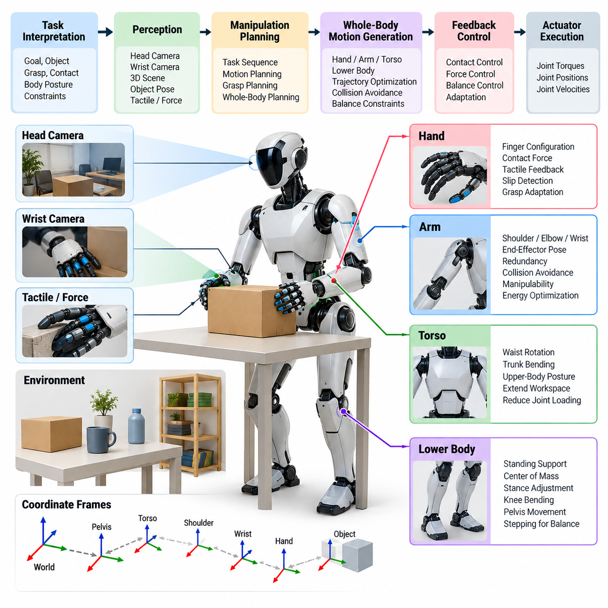{width="7.268055555555556in" height="7.268055555555556in"}

휴머노이드 조작(Humanoid Manipulation)은 로봇이 균형(Balance)을 유지하면서 손(Hand), 팔(Arm), 몸통(Torso), 지지 몸체(Supporting Body)를 동시에 조정해야 한다는 점에서 고정 기반 산업용 조작(Fixed-Base Industrial Manipulation)과 근본적으로 다르다. 따라서 조작 아키텍처(Manipulation Architecture)는 팔을 독립된 운동학 체인(Kinematic Chain)으로 취급할 수 없다. 대신 파지(Grasping), 도달(Reaching), 자세 조절(Posture Regulation), 접촉 관리(Contact Management), 균형 제약(Balance Constraints)이 지속적으로 결합되는 전신 과정(Whole-Body Process)으로 조작을 구성해야 한다.

가장 높은 수준에서 휴머노이드 조작 시스템(Humanoid Manipulation System)은 작업 해석(Task Interpretation), 인식(Perception), 조작 계획(Manipulation Planning), 전신 동작 생성(Whole-Body Motion Generation), 피드백 제어(Feedback Control), 액추에이터 실행(Actuator Execution)으로 구성할 수 있다. 물체를 집는 것과 같은 요청 작업은 목표 자세(Target Pose), 파지 구성(Grasp Configuration), 접촉 순서(Contact Sequence), 허용 힘(Allowable Forces), 몸체 자세(Body Posture), 완료 조건(Completion Conditions)을 포함하는 기하학적·물리적 목표로 변환되고, 다시 손·팔·몸통·하체에 분배된다.

손(Hand)은 휴머노이드와 물리적 환경(Physical Environment) 사이의 최종 상호작용 계층(Interaction Layer)을 형성한다. 단순 평행 그리퍼(Parallel Gripper)와 달리 다관절 손(Dexterous Hand)은 여러 개의 관절형 손가락(Articulated Fingers)을 포함할 수 있으며, 이들의 협응 동작이 파지 안정성(Grasp Stability), 접촉 기하(Contact Geometry), 조작 능력(Manipulation Capability)을 결정한다. 따라서 손 제어(Hand Control)는 다양한 형상, 크기, 재질, 기계적 특성을 가진 물체에 대응하도록 손가락 구성, 접촉력(Contact Force), 촉각 피드백(Tactile Feedback), 미끄럼 감지(Slip Detection), 파지 적응(Grasp Adaptation)을 결합한다.

팔(Arm)은 손의 위치와 방향을 결정하는 주요 작업 공간(Workspace)을 제공한다. 어깨(Shoulder), 팔꿈치(Elbow), 손목(Wrist) 관절은 조작 작업에 필요한 말단장치 자세(End-Effector Pose)를 생성하며, 여유 자유도(Redundant Degrees of Freedom)는 동일한 손 자세에 대해 여러 관절 구성을 허용한다. 이러한 여유성(Redundancy)을 활용하면 제어기는 도달 가능성(Reachability), 관절 한계(Joint Limits), 충돌 회피(Collision Avoidance), 조작성(Manipulability), 에너지 소비(Energy Consumption), 나머지 몸체 자세와의 적합성을 동시에 최적화할 수 있다.

휴머노이드 몸통(Torso)은 팔의 명목상 도달 범위를 넘어 유효 조작 작업 공간(Effective Manipulation Workspace)을 확장한다. 허리 회전(Waist Rotation), 몸통 굽힘(Trunk Bending), 상체 자세(Upper-Body Posture)는 물체에 대한 어깨 위치를 변화시켜 과도한 팔 신전 없이 더 먼 곳에 도달하거나 큰 물체를 조작할 수 있게 한다. 몸통 운동은 조작성 향상과 관절 부하 감소에도 기여하지만, 큰 상체 운동은 로봇의 질량중심(Center of Mass)과 운동량(Momentum)을 변화시키므로 균형 제어(Balance Control)와 직접적으로 상호작용한다.

하체(Lower Body)는 조작을 위한 동적 지지 구조(Dynamic Support Structure)를 제공한다. 서 있는 상태에서 조작할 때 발(Feet)은 접촉 제약(Contact Constraints)을 형성하고 사용 가능한 지지 영역(Support Region)을 정의하며, 다리(Legs)는 몸체 높이, 질량중심 위치, 반력을 조절한다. 무거운 물체나 큰 외부 접촉력이 발생하면 로봇은 팔의 운동만으로 이를 보상하기보다 스탠스(Stance)를 변경하거나 무릎을 굽히고 골반(Pelvis)을 이동하거나 한 걸음 내딛어야 할 수 있다.

따라서 실용적인 아키텍처는 조작 목표를 독립적인 관절 명령(Joint Commands)이 아니라 협응 작업(Coordinated Tasks)으로 표현한다. 손에는 파지 목표(Grasp Objective), 손목에는 말단장치 자세 목표(End-Effector Pose Objective), 팔꿈치에는 선호 구성(Preferred Configuration), 몸통에는 자세 목표(Posture Objective), 골반과 발에는 균형 관련 제약이 주어질 수 있다. 전신 제어기(Whole-Body Controller)는 이러한 동시 요구를 해결하여 물리적·안전 제약을 만족하는 동역학적으로 일관된 관절 토크(Joint Torque), 위치 또는 속도를 생성한다.

조작 계획(Manipulation Planning)은 여러 시간적·공간적 규모에서 동작한다. 작업 계획기(Task Planner)는 접근(Approach), 도달(Reach), 파지(Grasp), 들어 올리기(Lift), 운반(Transport), 배치(Place), 해제(Release) 등의 행동을 결정하고, 동작 계획기(Motion Planner)는 구성 사이의 실행 가능한 궤적을 결정한다. 전신 계획기(Whole-Body Planner)는 추가적으로 몸통 움직임, 스탠스 조정(Stance Adjustment), 보행(Stepping)을 결정할 수 있다. 이러한 계층 구조는 비교적 느린 의미론적 결정(Semantic Decision)과 물리적 상호작용에 필요한 빠른 안정화 및 접촉 제어 루프를 함께 운용할 수 있게 한다.

인식(Perception)은 조작 아키텍처에 로봇, 물체, 환경 상태에 대한 지속적으로 갱신되는 추정값을 제공한다. 머리 카메라(Head Camera)는 넓은 장면 문맥(Scene Context)을 제공하고, 손목 카메라(Wrist Camera)는 손 주변의 근거리 관측을 제공하며, 힘 또는 촉각 센서(Force or Tactile Sensor)는 시각만으로 신뢰성 있게 판단하기 어려운 상호작용 상태를 제공한다. 따라서 휴머노이드 조작에서는 시각적 인식(Visual Perception)과 물리적 접촉 인식(Physical Contact Perception)이 폐루프(Closed Loop) 형태로 결합되어야 한다.

좌표 프레임 관리(Coordinate-Frame Management)는 조작 명령이 서로 다른 기준 좌표계(Reference Frames)에서 생성되기 때문에 특히 중요하다. 물체 자세(Object Pose)는 카메라 좌표계에서 추정되고, 파지 목표는 물체 좌표계에서 표현되며, 손 궤적은 월드 좌표계(World Frame)를 기준으로 생성되고, 제어 오차는 몸체 또는 관절 좌표계에서 평가될 수 있다. 따라서 월드(World), 골반(Pelvis), 몸통(Torso), 어깨(Shoulder), 손목(Wrist), 손(Hand), 손가락(Finger), 센서(Sensor), 물체(Object) 좌표계 사이의 정확한 변환은 전체 조작 파이프라인의 기하학적 일관성을 유지하는 데 필수적이다.

접촉(Contact)은 자유 공간 운동(Free-Space Motion)과 물리적 상호작용(Physical Interaction)을 구분하는 또 다른 아키텍처 경계를 형성한다. 접촉 전에는 시스템이 주로 충돌을 회피하면서 위치와 방향을 제어한다. 접촉 후에는 힘(Force), 토크(Torque), 순응성(Compliance), 마찰(Friction), 물체 동역학(Object Dynamics)이 핵심 변수가 된다. 따라서 제어기는 위치 중심 운동과 순응적 상호작용(Compliant Interaction) 사이의 전환을 지원하여 밀기, 문 열기, 부품 삽입, 손잡이 돌리기, 하중 운반, 도구 조작과 같은 작업을 안전하게 수행해야 한다.

임피던스 제어(Impedance Control)는 손이나 팔을 무한히 강체인 위치 명령원(Position Source)이 아니라 프로그램 가능한 기계 시스템(Programmable Mechanical System)처럼 동작하게 하므로 동작 계획과 물리적 상호작용 사이의 유용한 인터페이스를 제공한다. 원하는 강성(Stiffness)과 감쇠(Damping)는 작업 단계, 불확실성, 접촉 상태에 따라 조절할 수 있다. 이러한 능력은 기하학적 모델이 완벽하지 않고 예상하지 못한 접촉을 안전하게 흡수해야 하는 인간 환경(Human Environment)의 휴머노이드에서 특히 중요하다.

양팔 조작(Bimanual Manipulation)은 독립적으로 관절화된 두 팔과 두 손 사이의 협응을 추가한다. 두 말단장치(End Effectors)는 각각 별도의 행동을 수행하거나 하나의 물체에 협력하거나 동시 접촉을 통해 폐쇄 운동학 체인(Closed Kinematic Chain)을 형성할 수 있다. 예를 들어 협동 운반(Cooperative Carrying)에서는 제어기가 상대적인 손 자세와 내부 힘(Internal Force)을 조절하는 동시에 전신이 물체의 질량과 관성(Inertia)을 보상해야 한다.

전신 조작(Whole-Body Manipulation)은 조작 목표가 상지(Upper Limbs)의 편안한 작업 공간이나 힘 능력을 초과할 때 필요하다. 이동(Locomotion)과 조작을 독립적으로 계획하는 대신 로봇은 보행, 골반 운동, 몸통 방향, 팔 궤적, 손 접촉을 하나의 통합 작업으로 조정할 수 있다. 이를 통해 휴머노이드는 물체에 접근하고, 물체를 운반하면서 위치를 변경하며, 큰 구조물을 밀거나, 보행과 작업을 인위적으로 분리하지 않고 작업 공간의 경계를 넘어 조작을 지속할 수 있다.

안전 제약(Safety Constraints)은 모든 아키텍처 계층에서 지속적으로 활성화되어야 한다. 관절 위치 및 속도 한계, 토크 한계(Torque Limits), 자기 충돌 제약(Self-Collision Constraints), 환경 충돌 제약(Environmental Collision Constraints), 접촉력 한계(Contact-Force Limits), 균형 여유도(Balance Margins), 액추에이터 열 한계(Actuator Thermal Limits), 비상 조건(Emergency Conditions)은 다른 측면에서 유효한 조작 명령도 제한한다. 휴머노이드는 큰 질량과 다수의 구동 관절을 가지므로 국부적으로 정확한 손 궤적이라도 몸체를 불안정하게 만들거나 다른 부위에 위험한 운동을 발생시킨다면 허용될 수 없다.

아키텍처는 또한 정상 실행(Nominal Execution)과 복구 동작(Recovery Behavior)을 구분해야 한다. 도달 과정에서 물체 위치 추정값이 변경되거나, 예상보다 일찍 파지 접촉이 발생하거나, 손가락이 미끄러지거나, 도구 움직임이 방해받거나, 외부 교란(External Disturbance)이 몸체 자세를 변화시킬 수 있다. 따라서 피드백은 인식과 저수준 제어(Low-Level Control)에서 조작 계획 계층으로 다시 전달되어야 하며, 미리 결정된 순서를 맹목적으로 실행하는 대신 궤적, 파지 파라미터, 접촉 모드(Contact Mode), 전신 구성을 수정할 수 있어야 한다.

현대의 학습 기반 정책(Learning-Based Policy)은 이러한 물리적 구조를 제거하지 않고 아키텍처의 상위 또는 내부 계층에 통합할 수 있다. 학습 정책은 파지 구성, 손 동작, 팔 궤적 또는 전신 행동 목표(Full-Body Action Target)를 생성할 수 있으며, 기존 제어 계층은 동역학, 접촉, 균형, 안전 제약을 강제한다. 이러한 분리는 모방 학습(Imitation Learning), 강화 학습(Reinforcement Learning), 범용 조작 정책(Generalist Manipulation Policy)을 수용하면서도 핵심 저수준 실행에는 결정론적 메커니즘(Deterministic Mechanism)을 유지할 수 있게 한다.

결과적으로 손-팔-몸체 아키텍처(Hand-Arm-Body Architecture)는 세 개의 독립적인 하위 시스템이 아니라 긴밀하게 결합된 물리적 기능의 계층 구조로 이해하는 것이 적절하다. 손은 상호작용을 형성하고 조절하며, 팔은 상호작용 인터페이스의 위치를 결정하고 이동시키고, 몸체는 작업 공간, 운동량 조절(Momentum Regulation), 지지(Support), 이동성(Mobility)을 제공한다. 인식, 계획, 학습, 전신 제어, 안전 감독(Safety Supervision)은 이러한 기능을 하나의 폐루프 조작 시스템(Closed-Loop Manipulation System)으로 연결한다.

이러한 아키텍처 관점은 이후 휴머노이드 조작 기술 개발의 기반을 제공한다. 다지 손 제어(Multi-Finger Control)는 손의 동작을 정교화하고, 임피던스 제어는 접촉을 관리하며, 양팔 협응(Bimanual Coordination)은 협력 능력을 확장하고, 물체 전달(Object Handover)과 손안 조작(In-Hand Manipulation)은 손재주(Dexterity)를 향상시키며, 도구 사용(Tool Use)은 기능적 작업 범위를 확장한다. 이러한 기능들은 궁극적으로 통합 이동-조작(Unified Loco-Manipulation)과 학습 기반 정책으로 수렴하며, 휴머노이드가 실제 환경에서 복잡한 물리적 작업을 수행할 수 있는 통합 조작 능력을 형성한다.

## 07.02. Dexterous Hand Control Multi Finger Policy [w/Code]

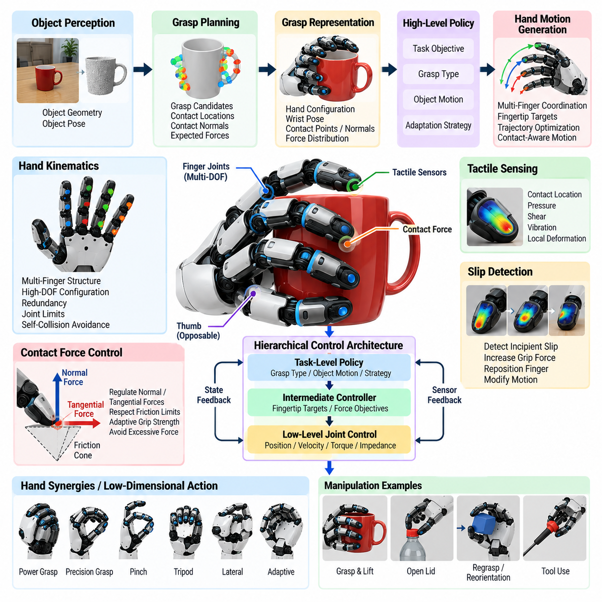{width="7.268055555555556in" height="7.268055555555556in"}

정교한 손 제어(Dexterous Hand Control)는 휴머노이드 로봇(Humanoid Robot)이 팔 수준의 위치 결정을 정밀한 물리적 상호작용(Physical Interaction)으로 변환할 수 있게 한다. 주로 열고 닫는 동작을 수행하는 단순 그리퍼(Simple Gripper)와 달리, 다지 손(Multi-Finger Hand)은 접촉 위치(Contact Location), 손가락 자세(Finger Posture), 힘(Force), 물체 운동(Object Motion)을 협응해야 하는 다수의 결합된 자유도(Degrees of Freedom)를 가진다. 따라서 제어 문제는 고차원 동작 생성(High-Dimensional Motion Generation), 접촉 기반 피드백(Contact-Rich Feedback), 작업 의존적 적응(Task-Dependent Adaptation)을 결합해야 한다.

정교한 손(Dexterous Hand)은 일반적으로 손가락마다 여러 개의 관절을 가진 다수의 관절형 손가락(Articulated Fingers)으로 구성되며, 특히 대립 가능한 엄지(Opposable Thumb)는 사용 가능한 파지 집합(Grasp Set)을 크게 확장한다. 각 관절은 넓은 구성 공간(Configuration Space)을 형성하며, 동일한 물체 접촉을 달성할 수 있는 여러 손 자세가 존재한다. 효과적인 제어는 이러한 여유성(Redundancy)을 활용하는 동시에 관절 한계(Joint Limits), 자기 충돌(Self-Collision), 과도한 액추에이터 부하(Actuator Loading), 기계적으로 취약한 구성을 회피해야 한다.

다지 제어기(Multi-Finger Controller)의 근본적인 목표는 단순히 손가락 관절 각도(Finger Joint Angle)를 명령하는 것이 아니라 손과 물체 사이에 유용한 접촉(Contact)을 형성하고 유지하는 것이다. 각각의 손끝 접촉(Fingertip Contact)은 위치(Position), 표면 법선(Surface Normal), 마찰(Friction), 접촉력(Contact Force)에 관한 기하학적·기계적 관계를 형성한다. 안정적인 조작은 이러한 접촉들이 원하지 않는 물체 운동을 전체적으로 제한하면서 의도된 작업에 필요한 운동 자유도를 유지할 때 달성된다.

파지 표현(Grasp Representation)은 인식(Perception), 계획(Planning), 제어(Control)를 연결하는 중요한 인터페이스를 제공한다. 파지는 손 구성(Hand Configuration), 손목 자세(Wrist Pose), 손끝 접촉 위치(Fingertip Contact Location), 접촉 법선(Contact Normal), 예상 힘 분포(Expected Force Distribution)로 표현할 수 있다. 익숙하지 않은 물체의 경우 인식 시스템이 물체의 형상과 자세를 추정한 후 파지 계획기(Grasp Planner)가 후보 구성을 생성한다. 손 제어기는 선택된 파지를 협응된 손가락 궤적(Finger Trajectory)으로 변환하고 실제 접촉이 형성됨에 따라 이를 지속적으로 조정한다.

개별 손가락의 운동은 물체를 통해 강하게 결합되므로 다지 협응(Multi-Finger Coordination)은 매우 어렵다. 하나의 손가락을 움직이는 것만으로도 물체 자세가 변하거나 힘 분포가 재조정되며 다른 모든 손가락의 접촉 상태가 달라질 수 있다. 따라서 독립적인 위치 제어기(Position Controller)는 과도한 내부 힘(Internal Force)을 발생시키거나 파지를 불안정하게 만들 수 있다. 협응 제어(Coordinated Control)는 손-물체 시스템(Hand-Object System)을 결합된 기구로 취급하고 물체 안정성과 조작성에 대한 손가락들의 종합적인 영향을 기준으로 운동을 제어한다.

손가락이 물체에 접촉하면 접촉력 제어(Contact Force Control)가 필수적이다. 접촉력은 중력(Gravity), 관성(Inertia), 외부 교란(External Disturbance)을 견딜 수 있을 만큼 충분히 커야 하지만 불필요하게 높아서는 안 된다. 과도한 힘은 에너지를 낭비하고 액추에이터 온도를 증가시키며 깨지기 쉬운 물체를 손상시키고 순응적 동작(Compliant Behavior)을 감소시킨다. 따라서 실용적인 제어기는 마찰 제약(Friction Constraints)을 만족하면서 법선 및 접선 접촉력(Normal and Tangential Contact Forces)을 조절하고 작업 요구에 따라 파지력을 적응시킨다.

마찰 원뿔(Friction Cone)은 접촉이 미끄러지지 않고 원하는 힘을 지지할 수 있는지를 평가하는 유용한 물리 모델(Physical Model)을 제공한다. 접선력(Tangential Force)은 법선 접촉력(Normal Contact Force)에 대한 사용 가능한 마찰 범위 내에서 유지되어야 한다. 실제 마찰계수(Friction Coefficient)는 불확실하고 물체 표면 특성도 다양하므로 실용적인 정책은 이론적 경계에서 직접 동작하기보다 적절한 안전 여유(Safety Margin)를 유지해야 한다. 촉각 관측(Tactile Observation)은 실제 접촉 상태가 이러한 가정에서 벗어나는 경우를 추가적으로 감지할 수 있다.

촉각 감지(Tactile Sensing)는 시각 인식(Visual Perception)만으로 신뢰성 있게 얻기 어려운 정보를 정교한 조작에 제공한다. 분산형 촉각 센서(Distributed Tactile Sensor)는 손끝이나 손가락 표면에서 접촉 위치, 압력(Pressure), 전단력(Shear), 진동(Vibration), 국부 변형(Local Deformation)을 추정할 수 있다. 이러한 측정을 통해 제어기는 접촉 발생 여부, 압력의 불균형, 물체가 손에 대해 움직이기 시작했는지를 판단할 수 있다. 따라서 촉각 피드백(Tactile Feedback)은 물리적 상호작용 표면에서 직접 제어 루프(Control Loop)를 폐쇄한다.

미끄럼 감지(Slip Detection)는 필요한 최소한의 힘으로 안정적인 파지를 유지하는 데 특히 중요하다. 작은 상대 운동(Relative Motion), 전단력의 변화, 특징적인 촉각 진동은 물체가 눈에 띄게 움직이기 전에 초기 미끄럼(Incipient Slip)을 나타낼 수 있다. 미끄럼이 감지되면 정책은 파지력을 증가시키거나 손가락 위치를 변경하고 손목 방향을 조정하거나 계획된 물체 가속도를 수정할 수 있다. 이러한 피드백 메커니즘은 불확실한 질량, 마찰, 표면 특성에 대한 파지의 강건성(Robustness)을 향상시킨다.

다지 제어는 복잡성을 줄이기 위해 계층적 구조(Hierarchical Structure)로 구성할 수 있다. 상위 정책(High-Level Policy)은 원하는 파지 유형(Grasp Type), 접촉 구성(Contact Configuration), 물체 운동을 결정하고, 중간 수준 제어기(Intermediate Controller)는 이러한 목표를 손끝 목표(Fingertip Target)로 변환한다. 하위 관절 제어기(Low-Level Joint Controller)는 높은 주파수에서 위치, 속도, 토크 또는 임피던스 기준(Impedance Reference)을 추종한다. 이러한 분해는 작업 추론(Task Reasoning)과 빠른 물리적 안정화를 분리하면서 접촉 사건이 상위 의사결정에 영향을 줄 수 있는 피드백 경로를 유지한다.

손 시너지(Hand Synergy)는 정교한 제어의 차원(Dimensionality)을 줄이는 또 다른 방법을 제공한다. 인간과 유사한 파지 자세에서는 모든 관절이 임의로 독립 운동하기보다 손가락 사이에 상관된 운동(Correlated Motion)이 자주 나타난다. 시너지 표현(Synergy Representation)은 이러한 상관관계를 더 적은 수의 협응 변수(Coordinated Variables)로 표현한다. 축소된 행동 공간(Reduced Action Space)에서 동작하는 정책은 유용한 파지 패턴을 보다 효율적으로 학습할 수 있으며, 잔여 관절 수준 제어(Residual Joint-Level Control)를 통해 물체별 세밀한 접촉 조정을 유지할 수 있다.

정확한 접촉 기하(Contact Geometry)를 예측할 수 없는 상황에서는 임피던스 제어(Impedance Control)가 유용하다. 각 손끝이 강체 궤적(Rigid Trajectory)을 강제로 추종하도록 하는 대신 제어기는 변위와 상호작용 힘 사이의 순응적 관계(Compliant Relationship)를 지정한다. 그러면 손가락은 원하는 파지 특성을 유지하면서 물체 표면에 자연스럽게 적응할 수 있다. 가변 임피던스(Variable Impedance)를 이용하면 초기 접촉에서는 손을 비교적 부드럽게 만들고, 들어 올릴 때는 더 단단하게 하며, 섬세한 조작이나 인간과의 상호작용에서는 다시 순응적으로 만들 수 있다.

다지 정책(Multi-Finger Policy)은 시연(Demonstration), 강화 학습(Reinforcement Learning), 또는 모델 기반 제어(Model-Based Control)와 데이터 기반 제어(Data-Driven Control)의 결합을 통해 학습할 수도 있다. 시연은 유용한 손 구성과 조작 전략의 예제를 제공하며, 강화 학습은 반복적인 상호작용을 통해 행동을 최적화할 수 있다. 정책은 고유수용감각(Proprioception), 촉각 신호(Tactile Signal), 시각 특징(Visual Feature), 물체 상태(Object State), 작업 명령(Task Command)을 입력으로 받아 손가락 위치, 토크 또는 저차원 시너지 행동(Low-Dimensional Synergy Action)을 출력할 수 있다.

정교한 손을 위한 강화 학습은 행동 공간(Action Space)이 크고 접촉 동역학(Contact Dynamics)이 불연속적이기 때문에 어렵다. 손가락 위치의 작은 변화만으로 접촉이 새롭게 형성되거나 끊어질 수 있으며 이후 물체 운동이 크게 달라질 수 있다. 따라서 보상(Reward)은 불안정한 지름길을 유도하지 않으면서 작업 진행도(Task Progress), 파지 안정성, 제어 노력(Control Effort), 충돌 회피, 성공적인 완료를 표현해야 한다. 이러한 정책에 필요한 대규모 상호작용 경험을 생성하기 위해 병렬 시뮬레이션(Parallel Simulation)을 활용할 수 있다.

시뮬레이션(Simulation)은 실제 손가락-물체 상호작용(Finger-Object Interaction)을 완벽하게 재현할 수 없다. 마찰, 순응성, 액추에이터 백래시(Actuator Backlash), 텐던 거동(Tendon Behavior), 촉각 응답(Tactile Response), 물체 표면 특성은 시뮬레이션과 실제 시스템 사이에서 상당한 차이를 보일 수 있다. 도메인 무작위화(Domain Randomization)를 이용하면 학습 과정에서 이러한 파라미터 변화에 정책을 노출할 수 있으며, 실제 환경 미세조정(Real-World Fine-Tuning)을 통해 배치 이후 정책을 추가로 적응시킬 수 있다. 따라서 강건한 제어는 시뮬레이션의 접촉 파라미터가 정확하다고 가정하기보다 실제 피드백에 의존해야 한다.

손안 조작(In-Hand Manipulation)은 정교한 손 제어를 정적인 파지 유지 이상의 능력으로 확장한다. 로봇은 손목을 비교적 고정한 상태에서 손가락 접촉을 협응적으로 변화시켜 물체를 회전(Rotation), 병진(Translation), 피벗(Pivot), 롤링(Rolling), 재지향(Reorientation)할 수 있다. 이러한 행동에는 일부 손가락이 물체를 안정화하는 동안 다른 손가락이 접촉을 해제하고 새로운 접촉을 형성하는 의도적인 접촉 전환(Contact Transition)이 필요하다. 제어기는 이러한 전환 과정 전체에서 물체의 안정성을 유지하면서 목표 자세로 이동시켜야 한다.

손가락 게이팅(Finger Gaiting)은 물체를 완전히 놓지 않고 파지 구성을 변경하기 위한 하나의 전략이다. 일부 손가락이 힘 폐쇄(Force Closure)를 유지하는 동안 다른 손가락이 새로운 접촉 위치로 이동하며, 원하는 손-물체 구성이 만들어질 때까지 이 과정을 반복한다. 이러한 전환을 계획하려면 일시적인 파지 안정성(Temporary Grasp Stability), 도달 가능한 접촉 영역(Reachable Contact Region), 충돌 제약, 각 손가락 운동이 초래하는 기계적 결과를 함께 고려해야 한다.

손의 정교성(Dexterity)은 전체 상지에 분산되어 있으므로 손 정책은 팔 및 손목 제어와 통합되어야 한다. 일부 물체 회전은 손가락 동작보다 손목 운동으로 더 효율적으로 수행할 수 있으며, 다른 회전은 손가락 수준의 조작이 필요하다. 마찬가지로 불리한 손 구성은 손가락을 관절 한계까지 강제로 움직이는 대신 팔의 위치를 재조정하여 해결할 수 있다. 따라서 협응 최적화(Coordinated Optimization)는 필요한 운동을 손가락, 손목, 팔 또는 더 큰 몸체 중 어느 부분에 할당할 것인지 결정해야 한다.

안전 및 하드웨어 제약(Safety and Hardware Constraints)은 소형 손 액추에이터가 물체와 인간 가까이에서 동작하기 때문에 특히 중요하다. 관절 한계, 모터 전류(Motor Current), 텐던 장력(Tendon Tension), 온도(Temperature), 손끝 힘(Fingertip Force), 충돌, 통신 오류(Communication Fault)를 지속적으로 감시해야 한다. 촉각 또는 액추에이터 측정값이 안전 임계값(Safety Threshold)을 초과하면 제어기는 현재 작업의 위험 수준에 따라 힘을 감소시키거나 운동을 정지하고 안전한 파지를 유지하거나 물체를 놓을 수 있다.

제품 수준의 정교한 손 제어기(Production-Quality Dexterous Hand Controller)는 측정 가능한 성능 지표(Performance Indicators)도 제공해야 한다. 파지 성공률(Grasp Success Rate), 미끄럼 발생 빈도(Slip Frequency), 물체 자세 오차(Object Pose Error), 접촉력 안정성(Contact-Force Stability), 조작 완료 시간, 에너지 소비, 복구 성공률(Recovery Success), 물체 변화에 대한 강건성은 서로 보완적인 성능 평가 기준을 제공한다. 평가는 성공적인 시연뿐 아니라 체계적인 교란, 불확실한 물체 특성, 인식 오류(Perception Error), 반복 시험도 포함해야 한다.

궁극적으로 다지 정책(Multi-Finger Policy)은 휴머노이드 손을 개별적으로 구동되는 관절들의 집합에서 적응형 물리적 상호작용 시스템(Adaptive Physical Interaction System)으로 변환한다. 신뢰성 높은 손재주(Dexterity)는 협응된 손가락 운동, 접촉 역학(Contact Mechanics), 촉각 피드백, 힘 조절(Force Regulation), 순응 제어(Compliant Control), 인식, 학습된 행동(Learned Behavior)의 결합을 통해 형성된다. 이러한 능력이 손목, 팔, 전신 제어(Whole-Body Control)와 통합되면 물체 전달(Object Handover), 도구 사용(Tool Use), 손안 조작, 양팔 작업(Bimanual Work), 범용 휴머노이드 조작(General-Purpose Humanoid Manipulation)을 위한 핵심 기반이 된다.

## 07.03. Arm Impedance Control for Contact Tasks [w/Code]

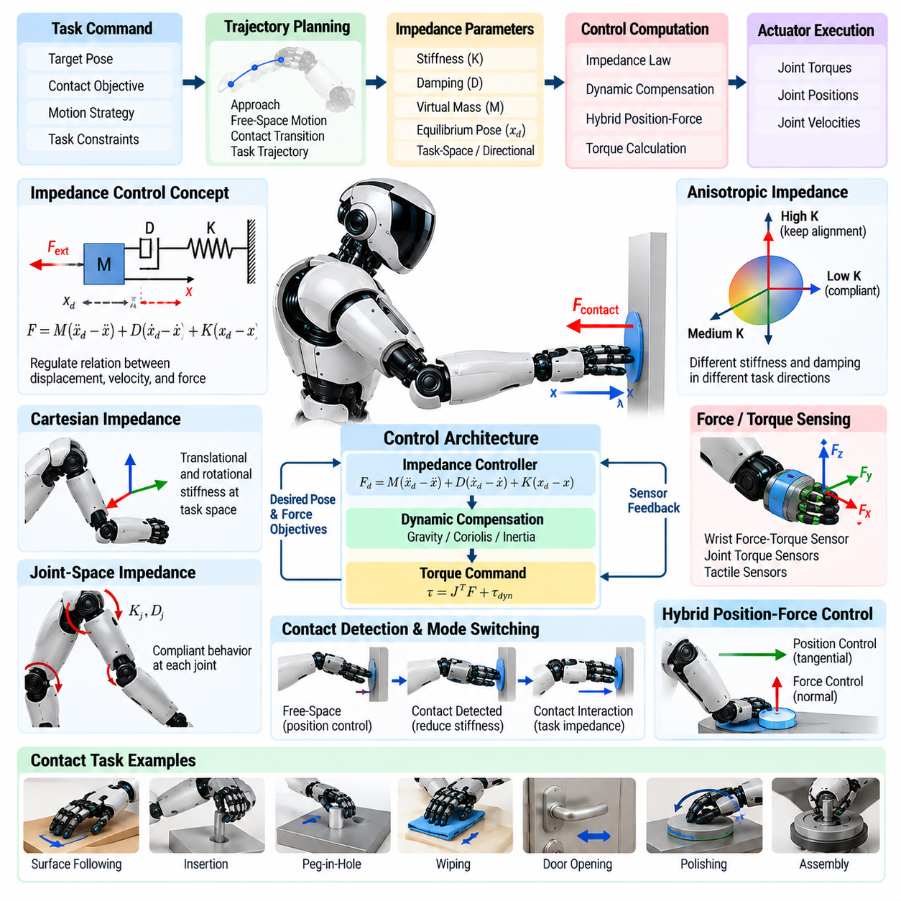{width="7.268055555555556in" height="7.268055555555556in"}

팔 임피던스 제어(Arm Impedance Control)는 휴머노이드 로봇(Humanoid Robot)이 운동(Motion)과 힘(Force) 사이의 동적 관계를 조절함으로써 물리적 환경과 안전하고 효과적으로 상호작용할 수 있게 한다. 외부 접촉과 관계없이 팔이 강체 위치 궤적(Rigid Position Trajectory)을 추종하도록 명령하는 대신, 임피던스 제어는 접촉력(Contact Force)에 의해 말단장치(End Effector)가 변위될 때 어떻게 반응할지를 결정한다. 이를 통해 팔은 선택 가능한 강성(Stiffness), 감쇠(Damping), 평형 거동(Equilibrium Behavior)을 가진 프로그램 가능한 기계 시스템(Programmable Mechanical System)처럼 동작한다.

핵심 개념은 말단장치 변위(End-Effector Displacement), 속도(Velocity), 상호작용 힘(Interaction Force) 사이에 원하는 관계를 정의하는 것이다. 손이 물체와 접촉하면 제어기는 단순히 명령된 자세를 향해 계속 밀어붙이지 않는다. 대신 설정된 임피던스(Impedance)에 따라 복원력(Restoring Force)을 생성한다. 높은 강성은 정확한 위치 조절(Position Regulation)을 제공하는 반면, 낮은 강성은 물리적 접촉 과정에서 불확실성을 흡수하고 충격을 감소시키는 순응적 운동(Compliant Motion)을 허용한다.

일반적인 작업 공간(Operational Space) 공식화에서는 가상 질량(Virtual Mass), 감쇠, 강성을 사용하여 원하는 접촉 거동(Contact Behavior)을 표현한다. 평형 자세(Equilibrium Pose)는 외부 교란이 없을 때 말단장치가 이동하려는 위치와 방향을 지정하며, 임피던스 파라미터(Impedance Parameters)는 접촉으로 인해 이 자세에서 벗어났을 때 얼마나 강하게 반응할지를 결정한다. 이러한 공식화는 기하학적 운동 명령(Geometric Motion Command)과 물리적 상호작용 거동 사이에 직관적인 연결을 제공한다.

접촉 작업(Contact Task)에서는 강성 선택(Stiffness Selection)이 매우 중요하다. 지나치게 높은 강성은 실제 환경의 위치가 모델과 다를 때 큰 충격력(Impact Force)을 발생시킬 수 있으며, 너무 낮은 강성은 로봇이 충분한 힘을 가하거나 정확한 정렬을 유지하지 못하게 할 수 있다. 따라서 실용적인 제어기는 작업 방향(Task Direction), 예상 불확실성(Expected Uncertainty), 접촉 기하(Contact Geometry), 물체 취약성(Object Fragility), 작업 완료에 필요한 힘 수준에 따라 강성을 선택한다.

카테시안 임피던스 제어(Cartesian Impedance Control)는 접촉 목표가 개별 관절보다 손(Hand)을 기준으로 자연스럽게 표현되는 경우가 많기 때문에 특히 유용하다. 원하는 병진 및 회전 강성(Translational and Rotational Stiffness)을 작업 공간 축(Task-Space Axes)에 따라 지정하여 특정 방향에서는 단단하고 다른 방향에서는 순응적으로 동작하도록 할 수 있다. 예를 들어 표면 추종(Surface Following)에서는 표면 법선 방향으로 순응성을 부여하면서 자세 유지에 필요한 방향에서는 상대적으로 높은 강성을 유지할 수 있다.

비등방성 임피던스(Anisotropic Impedance)는 서로 다른 작업 방향에 서로 다른 기계적 거동을 할당함으로써 이러한 원리를 확장한다. 삽입 작업(Insertion Task)은 정렬을 유지하기 위해 높은 회전 강성이 필요하지만 기하학적 불확실성이 존재하는 방향에서는 비교적 낮은 병진 강성이 필요할 수 있다. 닦기 작업(Wiping Task)에서는 제어된 법선 방향 순응성을 유지하면서 부드러운 접선 운동(Tangential Motion)을 허용해야 할 수 있다. 따라서 방향 의존적 임피던스(Direction-Dependent Impedance)는 작업의 물리적 구조를 제어기에 직접 반영할 수 있게 한다.

관절 공간 임피던스(Joint-Space Impedance)도 특히 액추에이터 수준의 순응성(Actuator-Level Compliance)을 직접 제어해야 하는 경우 유용하다. 각 관절에는 기준 각도(Reference Angle)를 중심으로 원하는 강성과 감쇠를 설정하여 전체 운동학 체인(Kinematic Chain)에 순응적 거동을 형성할 수 있다. 그러나 관절 공간 파라미터는 로봇 구성에 따라 매핑 관계가 달라지므로 말단장치의 기계적 특성과 직접적으로 대응하지 않는다. 따라서 작업 공간 임피던스(Task-Space Impedance)는 흔히 하위 수준 관절 토크 제어(Joint Torque Control)와 결합된다.

토크 제어형 휴머노이드 팔(Torque-Controlled Humanoid Arm)은 원하는 말단장치 힘을 구현하는 데 필요한 관절 토크를 직접 명령할 수 있기 때문에 임피던스 조절의 강력한 기반을 제공한다. 작업 공간 명령을 액추에이터 토크(Actuator Torque)로 변환할 때는 관성(Inertia), 중력(Gravity), 코리올리 효과(Coriolis Effects), 외력(External Forces)을 포함하는 로봇 동역학(Robot Dynamics)을 고려해야 한다. 정확한 동역학 보상(Dynamic Compensation)은 실제 팔의 거동이 상위 제어기에서 지정한 임피던스와 일치하도록 하는 데 기여한다.

힘·토크 감지(Force and Torque Sensing)는 접촉 작업에 중요한 피드백을 제공한다. 손목 힘·토크 센서(Wrist Force-Torque Sensor)는 손을 통해 전달되는 상호작용 하중(Interaction Load)을 측정할 수 있으며, 관절 토크 센서(Joint Torque Sensor)는 팔 전체에 작용하는 분산된 외력을 추정할 수 있다. 이러한 측정을 통해 제어기는 초기 접촉을 감지하고 지속적인 힘을 조절하며 예상하지 못한 충돌을 식별하고 실제 물리적 상호작용이 계획된 접촉 조건과 다를 경우 임피던스를 수정할 수 있다.

접촉 감지(Contact Detection)는 일반적으로 자유 공간 운동(Free-Space Motion)에서 순응적 상호작용(Compliant Interaction)으로 전환되는 기준점이다. 접촉 전에는 비교적 높은 위치 조절 강성을 이용하여 팔이 궤적을 추종할 수 있다. 힘 측정값, 촉각 신호(Tactile Signal), 모델 잔차(Model Residual)가 접촉을 나타내면 제어기는 강성을 낮추거나 힘 목표(Force Objective)를 활성화하거나 작업별 임피던스 프로파일(Task-Specific Impedance Profile)로 전환할 수 있다. 갑작스러운 게인 변화(Gain Change)는 원하지 않는 토크나 속도 불연속성을 발생시킬 수 있으므로 부드러운 전환이 중요하다.

작업이 서로 다른 방향에 서로 다른 제약을 요구하는 경우에는 위치-힘 혼합 거동(Hybrid Position-Force Behavior)이 필요하다. 표면을 연마하는 로봇은 법선 접촉력(Normal Contact Force)을 조절하면서 접선 방향의 위치 또는 속도를 제어할 수 있다. 마찬가지로 문 열기(Door Opening) 작업에서는 구속 방향의 힘을 수용하면서 곡선 형태의 손 궤적을 추종해야 할 수 있다. 임피던스 제어는 순응적인 방향과 정확하게 제어되는 운동 방향을 동시에 구현할 수 있으므로 이러한 혼합 상호작용(Mixed Interaction)의 자연스러운 기반을 제공한다.

가변 임피던스 제어(Variable Impedance Control)는 작업 전체에서 고정된 파라미터를 유지하는 대신 강성과 감쇠를 동적으로 변경한다. 접근 단계에서는 비교적 낮은 강성을 사용하여 충돌의 심각도를 줄일 수 있다. 안정적인 접촉이 형성된 후에는 정확도 또는 하중 전달 능력을 향상시키기 위해 강성을 높일 수 있다. 불확실성이나 예상하지 못한 저항이 감지되면 제어기는 다시 부드럽게 동작하도록 변경할 수 있다. 이러한 적응적 거동(Adaptive Behavior)을 통해 하나의 팔 제어기가 여러 단계의 접촉 기반 조작(Contact-Rich Manipulation)을 지원할 수 있다.

감쇠(Damping)는 접촉 이후 발생하는 진동(Oscillation)을 억제하므로 강성만큼 중요하다. 감쇠가 적절하지 않은 고순응성 팔(Highly Compliant Arm)은 단단한 환경과 접촉할 때 반복적으로 튕기면서 불안정하거나 비효율적인 상호작용을 발생시킬 수 있다. 반대로 지나친 감쇠는 운동을 느리게 만들고 추종 오차(Tracking Error)를 증가시킬 수 있다. 따라서 적절한 감쇠는 강성과 함께 선택되어야 하며 팔의 관성, 접촉 강성(Contact Rigidity), 제어 주파수(Control Frequency), 예상 작업 동역학을 고려하여 조정해야 한다.

제어되는 로봇이 알려지지 않은 환경과 상호작용할 때 수동성(Passivity)과 안정성(Stability)은 핵심적인 고려사항이 된다. 팔이 자유 공간에서 안정적이더라도 강성이 높은 외부 물체와 접촉하면 결합 동역학(Coupled Dynamics)에 의해 진동이나 불안정성이 발생할 수 있다. 샘플링 지연(Sampling Delay), 센서 잡음(Sensor Noise), 액추에이터 대역폭(Actuator Bandwidth), 통신 지연(Communication Latency), 모델 오차(Model Error)는 안정성 여유(Stability Margin)를 추가로 감소시킬 수 있다. 따라서 임피던스 설계는 로봇-제어기-환경(Robot-Controller-Environment)이 결합된 전체 시스템을 고려해야 한다.

널 공간 제어(Null-Space Control)는 원하는 작업 공간 임피던스를 유지하면서 휴머노이드의 팔 자세를 조절할 수 있게 한다. 휴머노이드 팔은 일반적으로 여유 자유도(Redundant Degrees of Freedom)를 가지므로 동일한 손 자세를 여러 관절 구성으로 구현할 수 있다. 이때 보조 목표(Secondary Objective)를 이용하여 주된 접촉 작업을 크게 방해하지 않으면서 팔꿈치를 장애물에서 멀리 이동시키고, 편안한 관절 구성을 유지하며, 특이점(Singularity)을 회피하거나 액추에이터 부하를 감소시킬 수 있다.

접촉력이 커지면 몸통(Torso)과 전신(Whole Body)도 임피던스 거동에 기여할 수 있다. 팔만으로 수행하는 접촉 작업은 관절 토크 또는 작업 공간 한계에 도달할 수 있지만, 몸통을 협응하여 움직이면 하중을 로봇의 더 넓은 영역으로 분산시킬 수 있다. 따라서 전신 조작(Whole-Body Manipulation)에서는 손의 임피던스가 균형 제약(Balance Constraints), 발 접촉(Foot Contacts), 질량중심 조절(Center-of-Mass Regulation), 전체 운동량 제어(Overall Momentum Control)와 호환되어야 한다.

접촉 작업에는 기하학적 불확실성(Geometric Uncertainty)이 자주 존재한다. 실제 표면은 추정된 위치에서 수 밀리미터 벗어날 수 있고, 물체가 약간 회전되어 있거나, 하중을 받는 지그나 고정구(Fixture)가 변형될 수 있다. 강체 궤적 추종(Rigid Trajectory Tracking)은 이러한 작은 오차를 직접적으로 큰 힘으로 변환할 수 있다. 반면 임피던스 제어는 오차의 일부를 제어된 변위(Controlled Displacement)로 변환하여 물리적 목표를 계속 수행하면서 불확실성을 수용할 수 있게 한다.

조립 및 삽입 작업(Assembly and Insertion Tasks)은 대표적인 예이다. 페그-인-홀 삽입(Peg-in-Hole Insertion), 커넥터 결합(Connector Mating), 부품 배치(Component Placement), 도구 체결(Tool Engagement)은 정밀한 정렬을 요구하지만 작은 자세 오차(Pose Error)를 포함하는 경우가 많다. 순응적 운동을 사용하면 접촉하는 기하 구조가 말단장치를 올바른 구성으로 유도할 수 있다. 따라서 적절하게 설계된 임피던스는 환경 제약(Environmental Constraints)에 저항하는 대신 이를 활용하여 불완전한 인식과 캘리브레이션으로 발생하는 힘의 피크(Force Peak)를 감소시킬 수 있다.

도구 사용(Tool Use)은 실제 상호작용 지점이 손을 넘어 존재할 수 있기 때문에 추가적인 문제를 발생시킨다. 제어기는 작업 지점(Task Point)의 기계적 거동을 결정할 때 도구의 형상, 질량, 관성, 접촉 위치를 고려해야 한다. 드라이버(Screwdriver), 스크레이퍼(Scraper), 브러시(Brush), 레버(Lever)는 팔이 경험하는 동역학을 크게 변화시킬 수 있다. 따라서 임피던스 파라미터는 손목만을 기준으로 정의하기보다 기능적 도구 좌표계(Functional Tool Frame)를 기준으로 정의해야 한다.

인간-로봇 물리적 상호작용(Human-Robot Physical Interaction)에서도 순응적인 팔 거동은 중요한 장점을 제공한다. 물체 전달(Handover), 공동 운반(Co-Carrying), 유도(Guidance), 협업 조립(Collaborative Assembly) 과정에서는 인간이 의도적으로 로봇 팔을 움직이거나 로봇이 강하게 저항해서는 안 되는 힘을 가할 수 있다. 낮은 강성과 적절한 감쇠를 사용하면 로봇이 작업 목표를 유지하면서 자연스럽게 양보할 수 있다. 힘 임계값(Force Threshold)과 안전 감독(Safety Supervision)을 추가하면 의도적인 협업과 잠재적으로 위험한 접촉을 구분하는 데 도움이 된다.

학습 기반 방법(Learning-Based Method)은 경험을 이용하여 임피던스 파라미터를 선택하거나 적응함으로써 임피던스 제어를 확장할 수 있다. 정책(Policy)은 물체 상태(Object State), 접촉력, 작업 단계(Task Phase), 촉각 정보(Tactile Information), 실행 이력(Execution History)을 관측한 후 원하는 강성, 감쇠, 평형 자세 또는 힘 목표를 출력할 수 있다. 이를 통해 학습된 적응(Learned Adaptation)을 하위 물리 제어기와 분리하여 안정성과 액추에이터 제약에 대한 명시적 제어를 유지하면서 데이터 기반 거동(Data-Driven Behavior)을 구현할 수 있다.

강화 학습(Reinforcement Learning)은 적절한 순응성을 수동으로 설계하기 어려운 작업에서 임피던스 스케줄(Impedance Schedule)을 최적화할 수 있다. 정책은 성공적인 작업 완료, 낮은 접촉력, 짧은 실행 시간, 에너지 효율(Energy Efficiency), 불확실성에 대한 강건성(Robustness)을 기준으로 보상받을 수 있다. 시뮬레이션에서는 다양한 접촉 상황을 탐색할 수 있지만 마찰, 강성, 지연, 액추에이터 거동은 실제 하드웨어와 차이가 있을 수 있으므로 학습된 정책을 실제 시스템으로 전이할 때 주의해야 한다.

안전 감독(Safety Supervision)은 어떤 임피던스 정책이 사용되더라도 항상 활성 상태를 유지해야 한다. 최대 관절 토크(Maximum Joint Torque), 말단장치 힘(End-Effector Force), 충돌력(Collision Force), 속도, 전력(Power), 온도, 작업 공간 한계(Workspace Limits)는 명령되는 거동을 제한해야 한다. 접촉력이 안전 임계값을 초과하거나 환경이 예상보다 지나치게 단단한 것으로 판단되면 임피던스 제어를 무한히 지속하는 대신 강성을 낮추거나 후퇴(Retreat), 팔 정지, 사전에 정의된 복구 모드(Recovery Mode)로 전환할 수 있다.

성능 평가(Performance Evaluation)는 작업 완료 여부뿐 아니라 상호작용 품질(Interaction Quality)도 측정해야 한다. 유용한 지표에는 최대 접촉력(Contact-Force Peak), 정상 상태 힘 오차(Steady-State Force Error), 위치 오차(Position Error), 정착 시간(Settling Time), 진동 진폭(Oscillation Amplitude), 삽입 성공률(Insertion Success), 교란 복구(Disturbance Recovery), 에너지 소비, 모델 불확실성에 대한 민감도(Sensitivity to Model Uncertainty)가 포함된다. 다양한 환경 강성과 접촉 기하에서 반복 시험을 수행하는 것이 정상 조건의 궤적만 평가하는 것보다 의미 있는 성능 평가를 제공한다.

궁극적으로 팔 임피던스 제어(Arm Impedance Control)는 휴머노이드의 동작 계획(Motion Planning)을 실제 물리적 상호작용과 연결하는 기계적 인터페이스(Mechanical Interface)를 제공한다. 정확성이 필요한 상황에서는 정밀성을 유지하고, 불확실성이나 인간 접촉이 존재할 때는 순응적으로 동작하며, 상호작용 조건이 변화하면 적응할 수 있게 한다. 인식(Perception), 힘 감지(Force Sensing), 정교한 손 제어(Dexterous Hand Control), 전신 협응(Whole-Body Coordination), 안전 감독과 결합될 때 접촉이 풍부한 휴머노이드 조작(Contact-Rich Humanoid Manipulation)을 신뢰성 있게 수행하기 위한 핵심 능력을 형성한다.

## 07.04. Bimanual Coordination for Humanoid [w/Code]

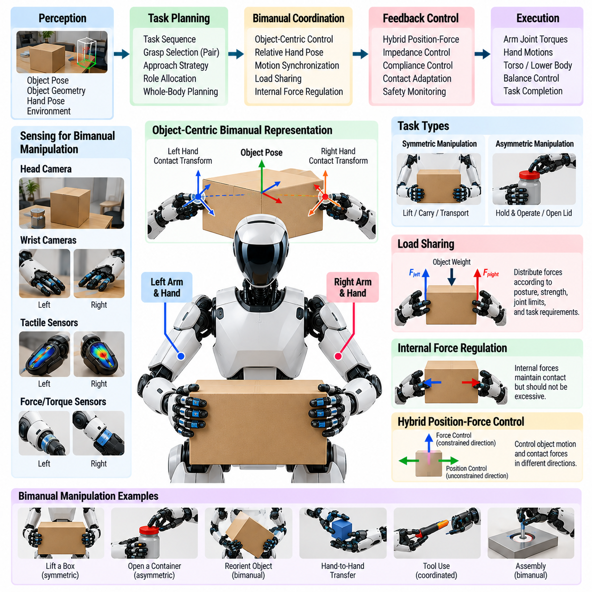{width="7.268055555555556in" height="7.268055555555556in"}

양손 협응(Bimanual Coordination)은 휴머노이드가 두 팔과 손을 서로 독립적인 두 개의 조작기(Manipulator)가 아니라 하나의 통합된 조작 시스템(Unified Manipulation System)으로 사용할 수 있도록 한다. 많은 물리적 작업에서는 한 손이 물체를 안정화하는 동안 다른 손이 작업을 수행하거나, 두 손이 동일한 물체를 공동으로 지지하고 방향을 조절하며 운반해야 한다. 따라서 효과적인 협응에는 인식(Perception), 상대적 손 제어(Relative Hand Control), 힘 조절(Force Regulation), 작업 계획(Task Planning), 전신 안정화(Whole-Body Stabilization)가 결합되어야 한다.

양손 작업(Bimanual Task)은 두 손 사이의 관계에 따라 분류할 수 있다. 대칭 조작(Symmetric Manipulation)에서는 큰 상자를 들어 올리거나 트레이를 운반하는 것처럼 양손이 유사한 운동을 수행한다. 비대칭 조작(Asymmetric Manipulation)에서는 한 손으로 용기를 잡고 다른 손으로 뚜껑을 여는 것처럼 두 손이 상호 보완적인 역할을 수행한다. 각 패턴은 운동 동기화(Motion Synchronization)와 힘 분배(Force Distribution)에 서로 다른 요구조건을 부과하므로 제어기는 이러한 역할을 명시적으로 표현해야 한다.

유용한 표현 방식은 각각의 손을 세계 좌표계(World Frame)에서 독립적으로 제어하기보다 조작 대상 물체를 기준으로 작업 목표를 정의하는 것이다. 물체 자세(Object Pose)를 공통 기준으로 사용하고, 원하는 왼손 및 오른손 접촉 변환(Contact Transform)을 통해 각 손이 어떻게 물체에 부착되어야 하는지를 정의할 수 있다. 이러한 물체 중심 표현(Object-Centric Formulation)은 물체가 병진 또는 회전하더라도 협응된 기하 관계를 유지하며, 강체 양손 파지(Rigid Bimanual Grasp)의 계획을 단순화한다.

두 손이 동일한 강체 물체(Rigid Object)에 접촉할 때에는 상대적 손 자세(Relative Hand Pose)가 특히 중요하다. 각 팔이 작은 기하학적 오차를 가진 독립적인 궤적을 추종하면 두 손이 의도하지 않게 서로 반대 방향으로 힘을 가하여 큰 내부 힘(Internal Force)을 생성할 수 있다. 따라서 협응 제어기(Coordinated Controller)는 전체 물체 운동과 두 손 사이의 상대적 변환을 함께 조절하고, 필요한 경우 작은 순응성(Compliance)을 허용하여 과도한 기계적 응력(Mechanical Stress)을 방지해야 한다.

파지 선택(Grasp Selection)은 두 개의 파지를 서로 결합된 하나의 구성(Coupled Configuration)으로 고려해야 한다. 개별적으로 안정적인 두 파지라도 물체 회전을 제한하거나, 불편한 팔 자세를 만들거나, 두 손 사이의 거리가 지나치게 가까우면 양손 조작에는 적합하지 않을 수 있다. 계획기는 최종 접촉 쌍(Contact Pair)을 선택하기 전에 파지 간격(Grasp Separation), 힘 전달(Force Transmission), 팔의 도달 가능성(Arm Reachability), 충돌 여유(Collision Clearance), 조작성(Manipulability), 예상되는 물체 궤적(Object Trajectory)을 평가해야 한다.

접촉이 발생하기 전의 접근 계획(Approach Planning)에서도 두 팔을 협응해야 한다. 동시 접근(Simultaneous Approach)은 실행 시간을 줄일 수 있지만 팔-팔 또는 손-물체 간 간섭 가능성을 증가시킨다. 순차 접근(Sequential Approach)은 한 손이 안정적인 기준 접촉(Reference Contact)을 먼저 형성한 후 두 번째 손이 참여하도록 할 수 있다. 선택되는 전략은 물체 크기, 불확실성(Uncertainty), 사용 가능한 작업 공간, 일시적인 한 손 지지(One-Handed Support)가 기계적으로 가능한지에 따라 달라진다.

접촉 형성(Contact Establishment)은 공유된 작업 목표를 유지하면서 각 손에서 독립적으로 확인되어야 한다. 촉각 감지(Tactile Sensing), 손가락 힘(Finger Force), 관절 토크(Joint Torque), 손목 힘·토크 측정(Wrist Force-Torque Measurement)을 통해 양손의 파지가 올바르게 형성되었는지 확인할 수 있다. 한 손이 먼저 접촉한 경우 다른 손이 아직 접근하는 동안 해당 팔이 물체를 의도하지 않게 움직이지 않도록 해야 한다. 일시적인 순응성(Temporary Compliance)을 사용하면 작은 동기화 오차(Synchronization Error)를 흡수할 수 있다.

양손이 모두 물체에 접촉하면 하중 분담(Load Sharing)이 핵심적인 제어 문제가 된다. 물체의 무게와 외부에서 가해지는 힘은 각 팔의 자세, 힘 생성 능력, 관절 한계(Joint Limit), 접촉 품질(Contact Quality)에 따라 두 팔 사이에 분배되어야 한다. 동일한 하중 분담이 항상 최적인 것은 아니다. 한쪽 팔은 수직 하중을 지지하기에 더 유리할 수 있고, 다른 팔은 물체 방향을 제어하거나 작업에 필요한 측면 힘(Lateral Force)을 저항하는 역할에 더 적합할 수 있다.

내부 힘(Internal Force)은 폐쇄 체인 양손 조작(Closed-Chain Bimanual Manipulation)의 특징적인 요소이다. 두 손이 가하는 힘은 물체 수준에서는 서로 상쇄되면서도 물체-손-팔 폐쇄 루프(Object-Hand-Arm Loop) 내부에는 상당한 응력을 발생시킬 수 있다. 일정 수준의 내부 힘은 안정적인 접촉을 유지하는 데 유용하지만, 지나치게 큰 내부 힘은 액추에이터 성능을 낭비하고 깨지기 쉬운 물체를 손상시킬 수 있다. 따라서 제어기는 물체를 움직이는 순 힘·토크(Net Wrench)와 내부 힘을 독립적으로 조절해야 한다.

혼합 위치-힘 제어(Hybrid Position-Force Control)를 사용하면 물체 운동 목표와 접촉력 목표를 분리할 수 있다. 로봇은 구속되지 않은 방향(Unconstrained Direction)에서는 물체의 위치와 방향을 제어하고, 구속된 접촉 방향(Constrained Contact Direction)에서는 힘을 조절할 수 있다. 임피던스 제어(Impedance Control)는 캘리브레이션 및 기하학적 오차에 대한 추가적인 허용성을 제공한다. 이러한 결합은 정확한 크기나 파지 위치를 완벽하게 알 수 없는 강체 물체를 조작할 때 특히 유용하다.

비대칭 작업(Asymmetric Task)에서는 두 손 사이의 역할 할당(Role Allocation)을 명확하게 정의해야 한다. 안정화 역할을 수행하는 손은 물체 자세를 유지하고 반력(Reaction Force)을 견디며, 능동 손(Active Hand)은 회전, 삽입(Insertion), 절삭(Cutting), 체결(Fastening) 또는 다른 기능적 동작을 수행할 수 있다. 이러한 역할은 작업 실행 과정에서 변경될 수도 있다. 따라서 작업 계획기는 한 손을 항상 주도 손(Dominant Hand), 다른 손을 항상 보조 손(Supportive Hand)으로 고정하지 않고 손의 역할을 동적으로 표현해야 한다.

용기 열기(Opening a Container)는 비대칭 협응의 대표적인 사례이다. 한 손은 용기 몸체에 안정적인 파지를 형성하고 다른 손은 뚜껑에 접근하여 파지한다. 지지 손(Supporting Hand)은 뚜껑 회전으로 발생하는 토크를 견디며, 능동 손은 필요한 회전 궤적(Rotational Trajectory)을 따른다. 힘과 운동 피드백을 통해 뚜껑이 정상적으로 회전하는지, 걸려 있는지, 완전히 분리되었는지를 판단하고 이에 따라 양팔의 행동을 적응시킬 수 있다.

대형 물체 조작(Large-Object Manipulation)은 대칭적인 협력을 강조한다. 상자를 들어 올릴 때 양손은 서로 호환되는 접촉을 형성하고, 지지력을 증가시키며, 과도한 기울어짐(Tilt)을 발생시키지 않으면서 물체를 들어 올려야 한다. 운반 중에는 양손이 상대적인 기하 관계를 유지하고 몸통과 다리가 페이로드 운동(Payload Motion)을 보상한다. 물체를 내려놓기 전에는 한쪽 면이 다른 쪽보다 지나치게 먼저 표면에 접촉하지 않도록 두 팔이 일관되게 물체를 하강시켜야 한다.

양손 물체 재지향(Bimanual Object Reorientation)은 단순한 강체 운반보다 복잡한 협응 운동을 요구할 수 있다. 로봇은 양손 사이에서 물체를 회전시키거나, 파지 위치를 변경하거나, 한 손이 일시적으로 주요 지지 역할을 담당하는 동안 다른 손으로 재파지(Regrasp)를 수행할 수 있다. 이러한 전환은 접촉 구조(Contact Structure)와 사용 가능한 힘 분배를 변화시킨다. 따라서 계획 과정에서는 모든 재파지 단계에서 남아 있는 접촉이 충분한 안정성을 유지하도록 해야 한다.

손에서 손으로의 전달(Hand-to-Hand Transfer) 역시 중요한 협응 기술이다. 현재 파지가 이후 작업에 적합하지 않거나 반대쪽 팔이 더 나은 도달 가능성을 제공하는 경우 물체를 한 손에서 다른 손으로 이동해야 할 수 있다. 전달 과정에서는 물체를 받는 손(Receiving Hand)이 먼저 접촉을 형성한 후 기존 손이 점진적으로 파지력을 감소시킨다. 촉각 및 힘 피드백을 통해 하중의 소유권(Load Ownership)이 안전하게 전환되었는지를 확인한 후 기존 손이 물체를 놓는다.

양손 조작을 위한 인식(Perception)은 물체 자세 이상의 정보를 추정해야 한다. 시스템은 양손의 구성, 접촉 영역(Contact Region), 상대적인 손-물체 변환(Hand-Object Transform), 주변 장애물, 작업과 관련된 기능적 특징(Functional Feature)을 추적해야 한다. 두 팔이 동일한 물체를 둘러싸면 시각적 가림(Visual Occlusion)이 더욱 심해지므로 손목 카메라(Wrist Camera), 촉각 감지, 고유수용감각(Proprioception), 힘 측정은 외부 카메라 또는 머리 장착 시각(Head-Mounted Vision)을 보완하는 중요한 정보원이 된다.

양손 협응은 몸통 구성(Torso Configuration)과 강하게 결합되어 있다. 몸통을 회전하거나 기울이면 양팔이 공통으로 사용할 수 있는 도달 공간(Common Reachable Workspace)을 확대하고 조작성을 향상시킬 수 있다. 부적절한 몸통 자세는 한쪽 팔이 편안한 상태에서도 다른 팔을 관절 한계 가까이 밀어 넣을 수 있다. 따라서 전신 계획(Whole-Body Planning)은 양쪽 조작기 모두에서 유용한 관절 여유(Joint Margin)와 균형 잡힌 조작 능력을 유지할 수 있도록 몸통과 골반 구성을 선택해야 한다.

무거운 페이로드에서는 물체와 양팔이 결합된 동역학(Combined Object and Arm Dynamics)이 더욱 중요해진다. 제어기는 팔의 힘과 토크를 계산할 때 물체의 질량, 관성(Inertia), 질량중심(Center of Mass), 가속도를 고려해야 한다. 빠른 물체 회전은 두 팔에 서로 다른 상당한 동적 하중(Dynamic Load)을 발생시킬 수 있다. 협응된 가속도 제한(Coordinated Acceleration Limit)과 피드포워드 보상(Feedforward Compensation)은 한쪽 조작기에 일시적인 하중이 과도하게 집중되는 것을 방지하는 데 도움이 된다.

이동 중 양손 조작(Bimanual Manipulation During Locomotion)은 또 다른 수준의 결합을 추가한다. 휴머노이드가 보행하거나 지지 자세를 변경하거나 장애물을 우회하는 동안에도 양손은 물체에 계속 접촉할 수 있다. 팔 운동은 몸통 진동(Torso Oscillation)을 보상해야 하고, 다리는 페이로드로 인해 변화한 질량중심을 관리해야 한다. 이동 중 지지 다각형(Support Polygon)과 지면 접촉 구성이 변화하더라도 물체는 안정적인 상태를 유지해야 한다.

충돌 회피(Collision Avoidance)는 환경뿐 아니라 두 팔 사이의 상호작용도 고려해야 한다. 두 말단장치(End-Effector)의 궤적이 각각 실행 가능한 것처럼 보이더라도 팔꿈치, 전완(Forearm), 손목, 손이 서로 충돌할 수 있다. 조작 중인 물체도 재지향 과정에서 몸통이나 다리와 충돌할 수 있다. 따라서 전신 충돌 검사(Whole-Body Collision Checking)는 각 팔에 개별적으로 적용하는 것이 아니라 궤적 생성(Trajectory Generation) 과정에 통합되어야 한다.

해석적인 작업 분해(Analytical Task Decomposition)가 어려운 경우 학습(Learning)을 통해 양손 협응 성능을 향상시킬 수 있다. 시연(Demonstration)은 동기화, 역할 할당, 물체 안정화, 재파지, 협응된 힘 적용의 사례를 제공한다. 모방 학습(Imitation Learning)은 이러한 구조를 재현할 수 있으며, 강화 학습(Reinforcement Learning)은 물체 형상, 질량, 마찰, 접촉 시점(Contact Timing)의 변화에 대한 강건성을 향상시킬 수 있다. 학습 정책(Learned Policy)은 모델 기반 제어기(Model-Based Controller)에 잔여 보정(Residual Correction)을 제공하는 방식으로도 사용할 수 있다.

실패 감지(Failure Detection)는 국부적인 오류와 협응 오류를 모두 식별해야 한다. 한 손이 미끄러지는 동안 다른 손은 안정적으로 물체를 잡고 있을 수 있으며, 물체가 예상하지 못하게 회전하거나 내부 힘이 증가하거나 두 팔이 운동학적으로 호환되지 않는 상태에 도달할 수 있다. 시스템은 상대 자세(Relative Pose), 접촉 상태(Contact State), 힘 균형(Force Balance), 물체 운동을 지속적으로 감시해야 한다. 이러한 상태를 조기에 감지하면 로봇이 운동을 감소시켜 국부적인 오류가 전체 조작을 불안정하게 만드는 것을 방지할 수 있다.

복구(Recovery)는 두 손이 제공하는 여유성(Redundancy)을 적극적으로 활용해야 한다. 한쪽 파지가 약해지면 다른 손이 일시적으로 더 많은 하중을 지지하는 동안 불안정한 손이 재파지를 수행할 수 있다. 물체 방향이 불확실해지면 양손의 순응성을 증가시키고 물체를 안정적인 구성으로 복귀시킬 수 있다. 복구가 불가능한 경우에는 점점 불안정해지는 폐쇄 체인 상호작용을 계속하는 대신 가까운 지지 표면(Support Surface)에 물체를 내려놓아야 한다.

두 팔은 눈에 띄는 물체 운동을 발생시키지 않으면서도 서로 반대 방향으로 큰 힘을 생성할 수 있으므로 안전 제약(Safety Constraint)이 특히 중요하다. 관절 토크, 내부 힘, 손끝 압력(Fingertip Pressure), 물체 응력(Object Stress), 팔 사이 거리, 충돌 위험, 전신 균형(Whole-Body Balance)을 지속적으로 감시해야 한다. 폐쇄 체인 구성이 위험해지는 경우 안전 감독(Safety Supervision)은 힘을 감소시키고, 순응성을 증가시키며, 협응 운동을 정지하거나 하나의 접촉을 해제할 수 있어야 한다.

성능 평가(Performance Evaluation)는 개별 팔의 정확도와 실제 양손 협응 품질(True Coordination Quality)을 구분해야 한다. 유용한 지표에는 양손 작업 성공률(Bimanual Task Success), 상대적 손 자세 오차, 물체 자세 정확도(Object-Pose Accuracy), 내부 힘 크기(Internal-Force Magnitude), 하중 분담 오차(Load-Sharing Error), 동기화 지연(Synchronization Delay), 접촉 손실, 재파지 성공률, 충돌률(Collision Rate), 완료 시간이 포함된다. 물체 크기, 질량, 파지 위치, 마찰, 초기 자세, 교란을 변화시키면서 협응이 강건하게 유지되는지를 평가해야 한다.

궁극적으로 양손 협응은 두 개의 휴머노이드 팔을 어느 한쪽 팔만으로 수행하기 어려운 물체 조작이 가능한 협력적 물리 시스템(Cooperative Physical System)으로 변화시킨다. 물체 중심 계획(Object-Centric Planning), 동기화된 접촉(Synchronized Contact), 내부 힘 조절(Internal-Force Regulation), 동적 역할 할당(Dynamic Role Allocation), 순응 제어(Compliant Control), 인식, 전신 안정화를 결합함으로써 휴머노이드는 안정적인 운반, 조립(Assembly), 도구 사용(Tool Use), 손에서 손으로의 전달, 복잡한 협력 조작(Cooperative Manipulation)을 수행할 수 있다.

## 07.05. Object Handover and In Hand Manipulation [w/Code]

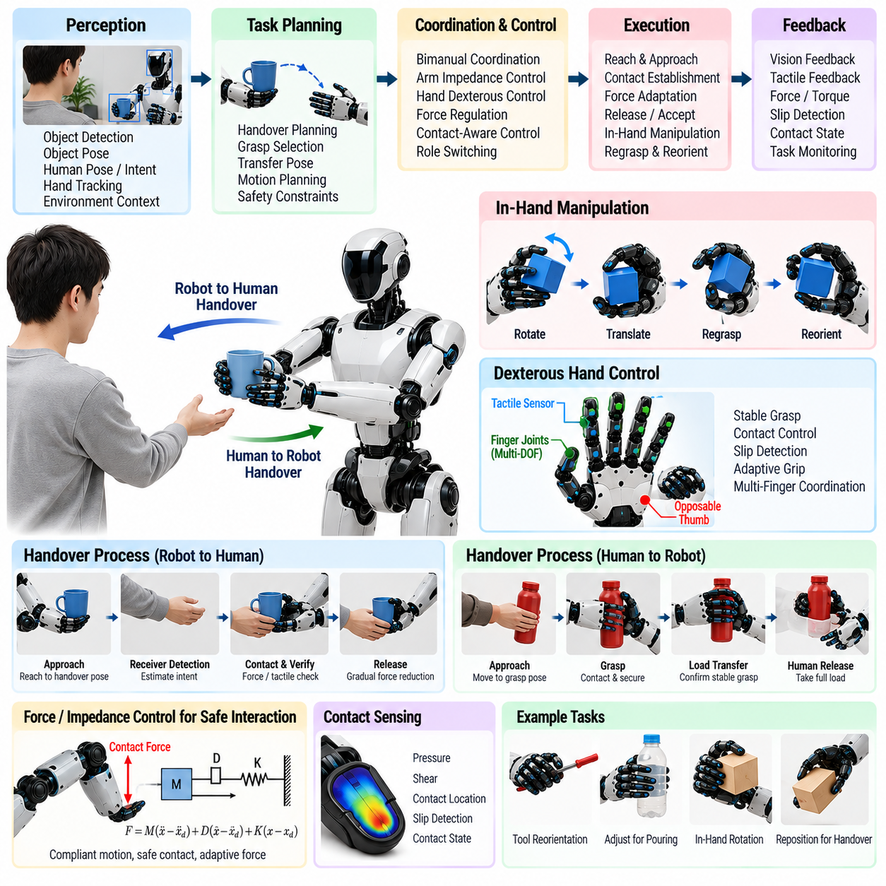{width="7.268055555555556in" height="7.268055555555556in"}

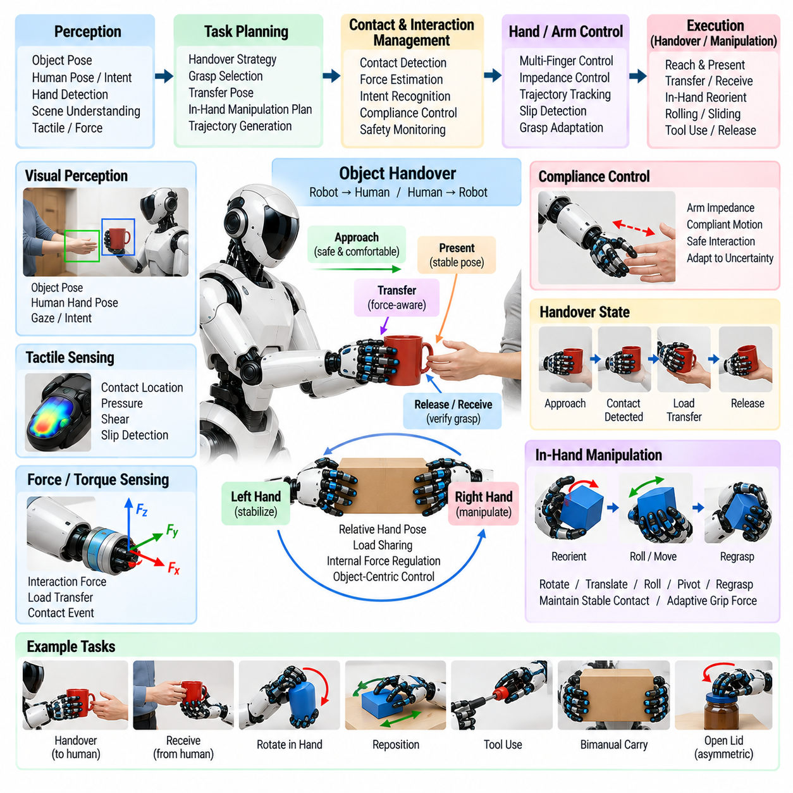{width="7.268055555555556in" height="7.268055555555556in"}

물체 전달(Object Handover)과 손안 조작(In-Hand Manipulation)은 휴머노이드가 접촉(Contact), 힘(Force), 자세(Pose), 물체 소유 상태(Ownership)의 지속적인 변화를 관리해야 하는 밀접하게 연관된 두 가지 능력이다. 물체 전달은 로봇과 다른 행위자(Agent) 사이에서 물체를 이전하는 과정이며, 손안 조작은 파지(Grasp)를 유지하면서 손 내부에서 물체의 구성을 변화시키는 과정이다. 두 능력 모두 인식(Perception), 정교한 손 제어(Dexterous Hand Control), 팔 운동(Arm Motion), 촉각 피드백(Tactile Feedback), 접촉 인지 계획(Contact-Aware Planning)의 협응을 요구한다.

성공적인 물체 전달은 실제 물리적 접촉이 발생하기 전부터 시작된다. 로봇은 물체를 식별하고 자세를 추정하며 적절한 파지를 결정하고, 물체를 받을 대상(Receiver)을 인식하며, 양쪽 참여자 모두가 접근 가능하고 안전한 전달 구성을 선택해야 한다. 선택된 전달 자세(Handover Pose)는 상대방이 물체의 접근 가능한 부분을 쉽게 잡을 수 있도록 노출하면서도, 상대가 안정적인 접촉을 형성할 때까지 로봇이 충분한 파지 안정성(Grasp Stability)을 유지할 수 있어야 한다.

인간을 대상으로 하는 물체 전달(Human-Oriented Handover)에서는 준비 상태(Readiness)와 의도(Intent)를 추가적으로 추정해야 한다. 손 위치, 몸체 자세, 시선(Gaze), 접근 운동(Approach Motion)에 대한 시각적 관측을 통해 사람이 물체를 받을 준비가 되었는지 판단할 수 있다. 로봇은 다른 손이 단순히 작업 공간에 들어왔다는 이유만으로 물체를 놓아서는 안 된다. 대신 인식 정보와 물리적 피드백을 함께 사용하여 상대가 의도적으로 안정적인 파지를 형성하고 물체의 하중을 받을 준비가 되었는지를 판단해야 한다.

물체 전달을 위한 궤적 생성(Trajectory Generation)은 예측 가능하고 편안한 운동을 만들어야 한다. 급격한 가속, 불필요하게 굽은 경로, 예상하지 못한 손목 회전은 상호작용을 어렵게 만들고 체감 안전성(Perceived Safety)을 저하시킬 수 있다. 팔은 제어된 속도로 전달 영역에 접근하면서 상대가 물체를 쉽게 받을 수 있는 방향을 유지해야 한다. 상대방 가까이에서는 위치 불확실성과 물리적 상호작용의 중요성이 증가하므로 낮은 속도와 순응적 거동(Compliant Behavior)이 일반적으로 바람직하다.

전달 자세는 물체 형상(Object Geometry), 로봇 운동학(Robot Kinematics), 수신자의 접근 가능성(Receiver Accessibility), 작업 문맥(Task Context)에 의해 제한된다. 컵은 손잡이를 노출한 상태로 제공할 수 있으며, 도구는 일반적으로 상대가 기능적 손잡이(Functional Handle)를 바로 잡을 수 있도록 전달해야 한다. 날카롭거나 뜨겁거나 깨지기 쉽거나 무거운 물체에는 추가적인 제약이 필요하다. 따라서 전달 계획(Handover Planning)은 기하학적 도달 가능성뿐 아니라 물체를 안전하게 전달하는 방법에 대한 의미론적 정보(Semantic Information)도 고려한다.

상대가 물체와 접촉하면 힘 및 촉각 감지(Force and Tactile Sensing)가 중요해진다. 손끝 압력(Fingertip Pressure), 손목 힘(Wrist Force), 물체 하중(Object Load), 접선력(Tangential Force)의 변화는 다른 행위자가 물체를 지지하거나 당기기 시작했음을 나타낼 수 있다. 로봇은 이러한 신호를 이용하여 우연한 접촉과 실제 전달 동작을 구분할 수 있다. 두 손이 동시에 하나의 물체와 상호작용하면 시각적 가림(Visual Occlusion)이 증가하기 때문에 다중모달 확인(Multimodal Confirmation)이 특히 중요하다.

물체 해제(Release)는 순간적인 명령이 아니라 제어된 전환(Controlled Transition)으로 다루어야 한다. 상대가 물체의 무게를 받아들이기 시작하면 로봇은 안정적인 외부 지지가 유지되는지를 감시하면서 파지력을 점진적으로 감소시킬 수 있다. 상대방의 파지가 약해지거나 사라지면 물체를 완전히 놓는 대신 자신의 파지를 다시 강화할 수 있다. 이러한 점진적 하중 전달(Progressive Load Transfer)은 의사소통이나 동작 시점이 완벽하지 않은 상황에서 물체를 떨어뜨릴 가능성을 감소시킨다.

로봇-인간 물체 전달(Robot-to-Human Handover)에서는 팔 임피던스 제어(Arm Impedance Control)도 유용하다. 순응적인 팔은 예측된 상대의 움직임과 실제 움직임 사이의 작은 차이에 높은 강성으로 저항하지 않고 이를 수용할 수 있다. 사람이 물체를 부드럽게 당기면 로봇은 전달 의도를 평가하면서 제한된 변위를 허용할 수 있다. 적절한 순응성(Compliance)은 상호작용을 덜 경직되게 만들고 손의 위치나 동작 시점의 불확실성으로 발생하는 힘도 감소시킨다.

물체를 받는 동작(Receiving an Object)은 이러한 요구사항의 상당 부분을 반대로 수행하지만 고유한 문제도 가진다. 휴머노이드는 물체를 주는 사람의 손가락을 방해하지 않는 파지 영역(Grasp Region)을 식별하고, 손을 해당 위치로 이동시켜 충분한 접촉을 형성한 후 점진적으로 물체의 하중을 받아야 한다. 파지 안정성이 확인된 이후에만 상대방이 물체를 놓을 수 있도록 신호를 제공하거나 물리적으로 해제를 허용해야 한다. 따라서 접근, 접촉 형성, 하중 전달, 후퇴(Retreat)의 협응이 필요하다.

손안 조작은 원하는 물체 자세를 손목이나 팔 운동만으로 효율적으로 달성할 수 없을 때 시작된다. 손은 물체에 대한 제어를 유지하면서 손바닥(Palm)에 상대적으로 물체를 회전(Rotate), 병진(Translate), 롤링(Roll), 피벗(Pivot), 이동(Shift)시킬 수 있다. 예를 들어 도구를 사용 방향으로 회전시키거나, 삽입 전에 부품 방향을 조정하고, 따르기 위해 병의 자세를 변경하거나, 다른 사람이 쉽게 잡을 수 있도록 물체를 재배치하는 작업이 이에 해당한다.

손안 조작 중의 손-물체 시스템(Hand-Object System)은 접촉이 풍부한 동적 메커니즘(Contact-Rich Dynamic Mechanism)이다. 손가락 운동은 물체 자세와 접촉 사이의 힘 분포를 동시에 변화시킨다. 일부 접촉은 고정 상태를 유지하고, 다른 접촉은 구르거나 미끄러질 수 있으며, 특정 손가락은 일시적으로 접촉을 해제한 후 새로운 접촉을 형성할 수 있다. 개별 손가락 궤적이 국부적으로 합리적이더라도 물체 전체가 불안정해질 수 있으므로 제어기는 이러한 접촉 전환(Contact Transition)을 함께 고려해야 한다.

구름 접촉(Rolling Contact)은 접촉면에서 큰 미끄러짐 없이 물체와 손끝 표면이 각자의 좌표계에 대해 상대적으로 움직일 수 있게 한다. 이를 이용하면 접촉 안정성을 유지하면서 물체를 정밀하게 회전시킬 수 있다. 미끄럼 접촉(Sliding Contact)은 마찰 조건이 허용되는 경우 의도적으로 접선 방향 운동을 허용한다. 조작 정책은 어떤 접촉 모드(Contact Mode)가 적합한지를 결정하고, 의도하지 않은 미끄러짐이 계획된 구름이나 미끄럼 동작을 방해하지 않도록 법선력(Normal Force)을 조절해야 한다.

손가락 게이팅(Finger Gaiting)은 모든 접촉을 지속적으로 유지하는 상태에서는 달성할 수 없는 범위까지 물체 운동을 확장한다. 하나 이상의 손가락이 물체를 안정화하는 동안 다른 손가락은 접촉을 해제하고 새로운 위치로 이동하여 다시 접촉한다. 이 과정을 반복하면 물체를 떨어뜨리지 않고 전체 파지 구성을 변경할 수 있다. 효과적인 손가락 게이팅을 위해서는 각 전환 단계에서 임시 지지 조건(Temporary Support Condition)을 계획하고 남아 있는 접촉만으로 물체를 안전하게 유지할 수 있는지를 확인해야 한다.

손안 조작 과정에서는 손 자체가 외부 카메라의 물체 시야를 자주 가리기 때문에 물체 자세 추정(Object Pose Estimation)이 어려워진다. 손목 카메라(Wrist Camera)는 부분적인 관측을 제공할 수 있지만 시각적 가시성이 감소할수록 촉각 감지와 고유수용감각(Proprioception)의 중요성이 증가한다. 접촉 위치, 손가락 관절 상태, 측정된 힘, 물체 운동 모델(Object Motion Model)을 시각 정보와 융합하여 조작 전체 과정에서 물체의 6자유도 자세(Six-Degree-of-Freedom Pose)를 지속적으로 추정할 수 있다.

촉각 피드백은 물체 자세만으로는 파악할 수 없는 국부적 상호작용 정보를 제공한다. 압력 분포(Pressure Distribution)를 통해 손끝이 표면 중심에 적절히 위치하는지를 판단할 수 있고, 전단력 측정(Shear Measurement)은 접선 방향 하중을 나타내며, 고주파 신호(High-Frequency Signal)는 초기 미끄럼(Incipient Slip)을 나타낼 수 있다. 제어기는 파지가 불안정해지기 전에 법선력을 증가시키거나 계획된 운동을 수정하고, 손가락을 재배치하거나 손목 자세를 변경할 수 있다.

손안 조작은 물체 중심 제어 문제(Object-Centric Control Problem)로 구성할 수 있다. 모든 손가락의 궤적을 독립적으로 지정하는 대신 상위 제어기는 원하는 물체 운동(Object Motion)을 정의하고 현재 사용 가능한 접촉들이 그 운동을 어떻게 생성해야 하는지를 결정한다. 이후 접촉력과 손가락 운동을 협응하여 마찰, 관절, 충돌, 액추에이터 제약을 만족하면서 원하는 물체 렌치(Object Wrench)를 생성한다. 이러한 표현은 조작 목표를 물체의 실제 물리적 거동과 직접 연결한다.

손 시너지(Hand Synergy)와 학습된 잠재 행동 공간(Learned Latent Action Space)은 다지 조작(Multi-Finger Manipulation)의 차원을 줄일 수 있다. 모든 손가락 관절을 독립적으로 제어하는 대신 정책은 일반적인 파지 조정이나 물체 회전을 나타내는 협응 패턴(Coordinated Pattern)을 생성할 수 있다. 이후 잔여 관절 수준 행동(Residual Joint-Level Action)을 통해 촉각 피드백에 따라 이러한 패턴을 세밀하게 수정할 수 있다. 이 조합은 효율적인 학습을 가능하게 하면서 접촉에 민감한 조작에 필요한 정밀 제어를 유지한다.

해석적인 접촉 계획(Analytical Contact Planning)이 지나치게 복잡해지는 경우에는 학습 기반 정책(Learning-Based Policy)이 특히 유용하다. 시연(Demonstration)은 물체 전달 시점, 파지 전환, 물체 재지향(Object Reorientation)의 사례를 제공할 수 있으며, 강화 학습(Reinforcement Learning)은 반복적인 상호작용을 통해 강건성을 향상시킬 수 있다. 정책 입력에는 시각, 촉각 신호, 관절 상태, 물체 자세, 힘 측정값, 작업 명령이 포함될 수 있으며, 출력은 손가락 행동, 손목 운동, 임피던스 또는 원하는 물체 변위를 정의할 수 있다.

시뮬레이션(Simulation)은 대량의 학습 경험을 생성할 수 있지만 물체 전달과 손안 조작은 시뮬레이션-현실 차이(Simulation-to-Reality Difference)에 매우 민감하다. 마찰, 손끝 순응성(Fingertip Compliance), 액추에이터 백래시(Actuator Backlash), 촉각 응답, 물체 질량, 접촉 기하는 실제 하드웨어와 다를 수 있다. 도메인 무작위화(Domain Randomization)와 파라미터 변화(Parameter Variation)는 강건성을 향상시킬 수 있지만 작은 접촉 모델 오차가 정교한 조작 과정에서 빠르게 누적될 수 있으므로 실제 피드백은 여전히 필수적이다.

접촉 전환은 빈번하게 실패할 수 있으므로 복구 동작(Recovery Behavior)이 필수적이다. 물체 전달 중 상대방이 손을 철회하거나, 물체가 미끄러지기 시작하거나, 손가락이 목표 접촉 위치를 놓치거나, 물체 자세 추정의 불확실성이 증가할 수 있다. 로봇은 이러한 상태를 감지하고 현재 파지를 강화하거나 안정적인 구성으로 복귀하며, 팔의 위치를 재조정하거나 다시 전달을 시도하도록 요청하고, 필요한 경우 물체를 안전하게 내려놓는 등의 적절한 대응을 선택해야 한다.

안전 제약(Safety Constraints)은 물체 전달과 손안 조작 전체 과정에 적용된다. 파지력(Grip Force), 손끝 압력, 팔 속도, 관절 토크, 손의 닫힘 속도(Hand Closing Speed), 충돌 거리(Collision Distance), 작업 공간 경계(Workspace Boundaries)를 지속적으로 감시해야 한다. 특히 사람의 손가락이 로봇이 원래 파지를 닫도록 계획한 영역으로 들어올 수 있으므로 인간 손 근접성(Human Hand Proximity)을 세심하게 고려해야 한다. 위험한 접촉 가능성이 발생하면 인식 및 촉각 안전 메커니즘이 정상 조작 명령보다 우선해야 한다.

성능 평가(Performance Evaluation)는 물체가 최종 목적지에 도달했는지만 측정해서는 안 된다. 물체 전달 성능에는 전달 성공률(Transfer Success), 해제 시점(Release Timing), 최대 상호작용 힘(Peak Interaction Force), 완료 시간, 낙하율(Drop Rate), 복구 성공률(Recovery Success)이 포함될 수 있다. 손안 조작에서는 최종 물체 자세 오차(Final Object Pose Error), 의도하지 않은 미끄러짐, 접촉 안정성(Contact Stability), 재파지 횟수(Number of Regrasp Events), 에너지 소비, 물체 형상·질량·마찰·초기 자세 변화에 대한 강건성을 추가적으로 평가할 수 있다.

물체 전달과 손안 조작은 함께 파지(Grasping)를 정적인 물체 유지 능력에서 동적인 접촉 관리 과정(Dynamic Contact Management Process)으로 확장한다. 물체 전달은 서로 다른 행위자 사이의 접촉을 협응하고, 손안 조작은 로봇 손 내부에서 변화하는 접촉을 협응한다. 이러한 능력이 인식, 촉각 감지(Tactile Sensing), 순응적 팔 제어(Compliant Arm Control), 다지 정책(Multi-Finger Policy), 전신 협응(Whole-Body Coordination)과 통합되면 휴머노이드는 복잡한 조작 작업에서 물체를 자연스럽게 전달하고, 재지향하고, 준비하며, 실제 작업에 활용할 수 있다.

## 07.06. Table Top Manipulation Pick Place Pour [w/Code]

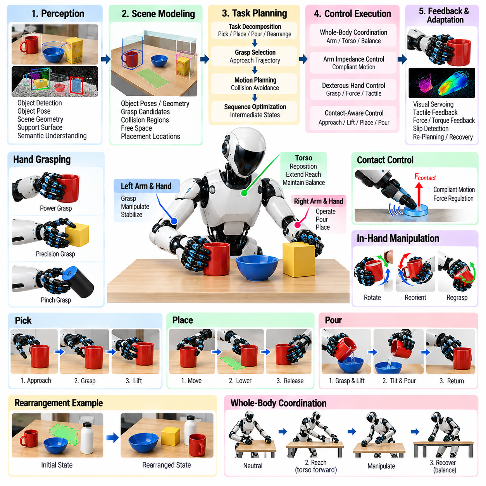{width="7.268055555555556in" height="7.268055555555556in"}

테이블탑 조작(Table-Top Manipulation)은 구조화되어 있지만 물리적으로 까다로운 작업 공간에서 인식(Perception), 파지 계획(Grasp Planning), 팔 제어(Arm Control), 정교한 손 동작(Dexterous Hand Behavior), 접촉 추론(Contact Reasoning)을 결합하는 휴머노이드의 핵심 능력이다. 집기(Picking), 놓기(Placing), 재배치(Rearranging), 따르기(Pouring)와 같은 작업에서는 조작 과정 전체에 걸쳐 손, 손목, 팔, 몸통, 균형 시스템(Balance System)을 협응하면서 물체의 형상과 상태를 이해해야 한다.

일반적인 테이블탑 작업은 장면 인식(Scene Perception)에서 시작된다. 머리 카메라(Head Camera)와 손목 카메라(Wrist Camera)는 작업 표면을 관측하고 관련 물체를 검출하며, 물체 자세(Object Pose)를 추정하고 빈 공간을 식별하며, 지지 표면(Supporting Surface)과 장애물을 구분한다. 깊이 감지(Depth Sensing) 또는 다중 시점 기하(Multi-View Geometry)를 통해 3차원 구조를 얻을 수 있으며, 의미론적 인식(Semantic Perception)을 통해 손잡이, 개구부, 뚜껑, 용기, 목표 배치 영역과 같은 물체 범주와 기능 영역(Functional Region)을 식별할 수 있다.

조작 시스템은 테이블을 단순한 평면 기하 구조 이상의 대상으로 표현해야 한다. 물체들이 서로 겹치거나 부분적으로 가려질 수 있고, 테이블 가장자리 가까이에 놓이거나 접근 방향을 제한하는 영역을 차지할 수 있다. 따라서 로봇은 물체 자세, 근사 형상(Approximate Geometry), 지지 관계(Support Relationship), 충돌 영역(Collision Region), 파지 후보(Grasp Candidate), 사용 가능한 배치 위치를 포함하는 작업 관련 장면 모델(Task-Relevant Scene Model)을 구성한다. 이 표현은 계획과 제어에서 공통으로 사용하는 상태 정보를 제공한다.

집기 동작(Pick Operation)에서는 파지와 접근 궤적(Approach Trajectory)을 모두 선택해야 한다. 선택된 파지는 현재 팔과 몸체 구성에서 도달 가능하면서 충분한 안정성을 제공해야 한다. 접근 방향은 주변 물체와 테이블 표면과의 충돌을 피해야 한다. 정교한 손(Dexterous Hand)을 사용하는 경우 계획기는 접촉이 발생하기 전에 손이 적절한 구성으로 물체에 도달할 수 있도록 손가락 사전 형상화(Finger Preshaping)까지 추가적으로 결정할 수 있다.

접근 단계(Approach Phase)는 일반적으로 비교적 빠른 자유 공간 운동(Free-Space Motion)에서 물체 근처의 느리고 접촉에 민감한 운동(Contact-Sensitive Motion)으로 전환된다. 손목 장착 인식(Wrist-Mounted Perception)은 손이 물체에 접근하면서 물체 자세를 더욱 정밀하게 추정하여 캘리브레이션 불확실성(Calibration Uncertainty)이나 이전 관측으로 발생한 오차를 줄일 수 있다. 시각 서보잉(Visual Servoing)은 측정된 물체 위치에 따라 손 궤적을 지속적으로 갱신하여 초기 장면 추정과 실제 구성 사이의 차이를 보상할 수 있게 한다.

파지 형성(Grasp Establishment)에서는 실제 물리적 접촉이 계획된 파지와 일치하는지 확인해야 한다. 손가락 위치만으로 물체를 성공적으로 획득했는지를 보장할 수 없다. 촉각 센서(Tactile Sensor), 모터 전류(Motor Current), 관절 토크(Joint Torque), 손끝 힘(Fingertip Force)을 이용하여 접촉 여부와 하중이 적절하게 분포되어 있는지를 판단할 수 있다. 접촉이 비대칭적이거나 불안정하면 물체를 들어 올리기 전에 손가락 위치나 파지력(Grip Force)을 조정할 수 있다.

들어 올리기(Lifting)는 파지를 지지 접촉 상태(Supported Contact State)에서 하중 지지 상태(Load-Bearing State)로 전환한다. 제어기는 미끄러짐(Slip), 접촉력(Contact Force), 물체 자세를 감시하면서 수직 운동을 점진적으로 증가시켜야 한다. 예상하지 못한 변화는 물체가 주변 형상에 여전히 구속되어 있거나 파지가 충분하지 않다는 것을 의미할 수 있다. 안전한 정책은 불안정한 하중을 계속 들어 올리는 대신 동작을 정지하고 물체를 내려놓은 후 파지를 수정하여 다시 시도할 수 있다.

놓기 동작(Place Operation)은 단순히 집기 궤적을 역방향으로 수행하는 것 이상을 요구한다. 목표 위치에는 물체를 위한 충분한 빈 공간과 안정적인 지지 구성(Stable Support Configuration)이 존재해야 한다. 원하는 배치 방향(Placement Orientation)은 작업의 의미에 따라서도 달라질 수 있다. 병은 일반적으로 세워 놓아야 하고, 도구는 이후 사용을 위해 특정 방향이 필요할 수 있으며, 조립 부품은 지그(Fixture)나 다른 물체에 정밀하게 정렬되어야 할 수 있다.

배치 과정에서 팔은 물체와 로봇 모두에 대해 충돌 여유(Collision Clearance)를 유지하면서 목표 위치로 물체를 이동시킨다. 지지 표면에 가까워지면 운동은 더 느리고 순응적(Compliant)으로 변해야 한다. 힘 또는 촉각 피드백을 통해 테이블과의 초기 접촉을 감지할 수 있으며, 이후 제어기는 물체의 무게를 손에서 표면으로 점진적으로 전달한다. 안정적인 지지가 확인된 이후에만 손가락이 물체를 놓아야 한다.

배치 불확실성(Placement Uncertainty)은 완벽한 기하학적 정확성을 요구하기보다 순응 제어(Compliant Control)를 통해 처리할 수 있다. 추정된 테이블 높이가 실제 높이와 조금만 달라도 강체 하강 궤적(Rigid Downward Trajectory)은 과도한 힘을 발생시킬 수 있다. 임피던스 제어(Impedance Control)는 접촉 이후 원하는 하향 상호작용을 유지하면서 손이 순응하도록 한다. 이러한 거동은 깨지기 쉬운 물체를 배치하거나 형상이 정확하게 알려지지 않은 표면과 상호작용할 때 특히 유용하다.

재배치 작업(Rearrangement Task)은 여러 번의 집기 및 놓기 동작을 결합하면서 중간 상태(Intermediate State)에 대한 추가적인 추론을 요구한다. 다른 물체로의 접근을 방해하는 물체를 일시적으로 이동해야 하거나, 복잡한 테이블에서는 최종 배치를 수행하기 전에 빈 공간을 먼저 만들어야 할 수 있다. 따라서 계획은 개별 궤적을 넘어 작업 전체에서 도달 가능성(Reachability), 충돌 없는 공간(Collision-Free Space), 안정적인 물체 구성을 유지할 수 있는 행동 순서(Action Ordering)를 결정해야 한다.

따르기(Pouring)는 일반적인 집기 및 놓기보다 연속적인 물체 운동(Continuous Object Motion)과 동적 추론(Dynamic Reasoning)을 추가한다. 로봇은 원액 용기(Source Container)를 파지하고, 내용물을 받을 용기(Receiving Container)를 식별하며, 적절한 위치 위로 원액 용기를 이동한 다음 적절한 따르기 축(Pouring Axis)을 중심으로 회전시켜야 한다. 필요한 손목 및 팔 운동은 용기 형상(Container Geometry), 내용물 수준(Fill Level), 원하는 유량(Desired Flow), 수용 용기의 개구부 위치에 따라 달라진다.

따르기 궤적(Pouring Trajectory)은 원액 배출구(Source Outlet)와 수용 용기 사이의 공간 정렬(Spatial Alignment)을 유지하면서 방향을 점진적으로 변경해야 한다. 지나치게 빠른 회전은 과도한 유량이나 동적 교란(Dynamic Disturbance)을 발생시킬 수 있으며, 기울기가 부족하면 내용물이 흐르지 않을 수 있다. 따라서 제어기는 원액 용기가 목표 위에 위치하도록 병진과 회전 운동을 협응하면서 따르기 과정 전체에서 용기의 방향을 부드럽게 변화시켜야 한다.

액체 조작(Liquid Manipulation)은 일반적인 로봇 고유수용감각(Proprioception)만으로 직접 관측하기 어려운 상태 변수를 포함한다. 남아 있는 액체의 양, 유량(Flow Rate), 용기 내부의 액체 분포는 작업 진행 상태와 동역학 모두에 영향을 미친다. 시각 시스템은 관측 가능한 경우 수용 용기 또는 액체 흐름을 관찰할 수 있으며, 무게, 힘 또는 학습 기반 인식(Learned Perception)을 통해 간접적인 정보를 얻을 수도 있다. 따라서 조작 시스템은 사전에 정의된 운동에만 의존하지 않고 작업 상태를 지속적으로 추정해야 한다.

변화하는 액체 분포는 파지된 용기의 유효 질량(Effective Mass)과 질량중심(Center of Mass)도 변화시킨다. 이러한 변화는 특히 용기가 크거나 몸체에서 멀리 떨어진 상태로 유지될 때 손목 토크(Wrist Torque)와 팔 하중에 영향을 준다. 힘·토크 감지(Force-Torque Sensing)를 통해 이러한 변화를 파악하여 파지력과 팔의 거동을 적응시킬 수 있다. 편안한 관절 구성(Joint Configuration)과 균형을 유지하기 위해 전신 자세(Whole-Body Posture)를 함께 조정할 수도 있다.

따르기에는 명시적인 종료 로직(Termination Logic)이 포함되어야 한다. 요청된 양이 전달되거나, 시각적으로 측정된 내용물 높이가 임계값에 도달하거나, 원액 용기가 비어 있거나, 비정상적인 흐름이 감지되면 로봇은 따르기를 중단할 수 있다. 이후 용기를 이동시키기 전에 다시 세워진 방향으로 회전시킨다. 지나치게 급격하게 원위치로 복귀하면 남은 액체가 흘러나올 수 있으므로 복귀 운동(Recovery Motion) 역시 부드럽고 제어된 형태로 수행해야 한다.

테이블탑 조작은 많은 동작이 자유 운동과 접촉 상태 사이를 반복적으로 전환하므로 작업 공간 제어(Task-Space Control)와 임피던스 제어의 이점을 크게 활용할 수 있다. 집기에는 접촉 형성이 필요하고, 놓기에는 제어된 지지 하중 전달(Support Load Transfer)이 필요하며, 따르기에는 변화하는 하중 아래에서 안정적인 파지가 필요하다. 통합 제어기(Unified Controller)는 모든 단계를 강체 위치 추종으로 처리하는 대신 현재 조작 단계에 따라 강성(Stiffness), 감쇠(Damping), 힘 목표(Force Target), 궤적 속도를 변경할 수 있다.

충돌 회피(Collision Avoidance)는 로봇과 물체를 결합한 전체 시스템을 고려해야 한다. 손의 궤적 자체는 충돌이 없어 보이더라도 팔꿈치가 테이블과 충돌하거나, 전완(Forearm)이 다른 물체에 접촉하거나, 운반 중인 물체가 장애물에 부딪힐 수 있다. 따라서 계획 과정에서는 손, 팔, 몸통, 조작 중인 물체의 형상을 동시에 평가해야 한다. 휴머노이드 팔의 여유 구성(Redundant Configuration)을 활용하면 원하는 손 자세를 유지하면서 팔꿈치 또는 몸통 위치를 변경할 수 있다.

양팔 조작(Bimanual Manipulation)은 물체가 크거나 불안정하거나 동시에 여러 작업이 필요한 경우 테이블탑 조작 능력을 확장할 수 있다. 한 손으로 용기를 안정화하면서 다른 손으로 뚜껑을 제거하거나, 한 손으로 그릇을 잡은 상태에서 다른 손으로 내용물을 따르거나, 한 손이 물체를 재배치하는 동안 다른 손이 도구 작업을 수행할 수 있다. 이러한 작업에서는 실행 가능한 전신 자세를 유지하면서 상대적인 손 자세(Relative Hand Pose), 접촉력, 물체 제약(Object Constraints)을 협응해야 한다.

겉보기에는 단순한 테이블탑 작업에도 많은 불확실한 사건이 포함되므로 실패 감지(Failure Detection)가 필요하다. 파지가 빗나가거나, 들어 올리는 동안 물체가 미끄러지거나, 배치 영역이 다른 물체에 의해 점유되거나, 따르기 동작이 의도된 목표에서 벗어날 수 있다. 시스템은 예상되는 상태 전환(Expected State Transition)을 감시하고 이를 인식 및 접촉 피드백과 비교해야 한다. 불일치가 발생하면 원래 순서를 맹목적으로 계속 실행하는 대신 재계획(Replanning)이나 복구(Recovery)를 수행해야 한다.

복구 전략(Recovery Strategy)은 가능한 경우 작업을 알려진 안정 상태(Known Stable State)로 되돌려야 한다. 파지 실패가 발생하면 손을 후퇴시키고 장면을 다시 인식할 수 있으며, 불안정한 들어 올리기가 감지되면 물체를 테이블로 다시 내려놓을 수 있다. 배치 상태가 불확실하면 안정적인 지지가 확인될 때까지 파지를 유지할 수 있다. 따르기 과정에서 비정상적인 흐름이나 예상하지 못한 움직임이 발생하면 용기를 세운 방향으로 복귀시키고 안정화할 수 있다. 이러한 거동은 국부적 오류가 더 큰 작업 실패로 발전하는 것을 방지한다.

학습 기반 정책(Learning-Based Policy)은 테이블탑 조작에서 기하학적 계획(Geometric Planning)을 보완할 수 있다. 모방 학습(Imitation Learning)은 도달, 파지, 배치, 따르기의 시연을 학습할 수 있으며, 강화 학습(Reinforcement Learning)은 자세, 마찰, 물체 형상, 접촉 조건 변화에 대한 강건성을 향상시킬 수 있다. 학습된 정책은 파지 선택, 잔여 운동 보정(Residual Motion Correction), 임피던스 적응(Impedance Adaptation), 또는 완전한 조작 기술(Manipulation Skill) 수준에서 동작할 수 있으며 기존의 안전 제약은 계속 유지할 수 있다.

성능 평가(Performance Evaluation)는 인식, 계획, 제어, 작업 수준 결과(Task-Level Outcome)를 구분하여 측정해야 한다. 유용한 지표에는 집기 성공률(Pick Success Rate), 파지 안정성(Grasp Stability), 배치 위치 및 방향 오차(Placement Position and Orientation Error), 충돌률(Collision Rate), 실행 시간, 복구 성공률(Recovery Success), 유출률(Spill Rate), 따르기 정확도(Pouring Accuracy), 장면 변화에 대한 강건성이 포함된다. 복잡도, 서로 다른 물체 형상, 불확실한 자세, 변화하는 표면 높이, 다양한 용기 상태에서 반복 평가하면 실제적인 조작 능력을 측정할 수 있다.

테이블탑 집기, 놓기, 따르기 작업(Table-Top Pick, Place, and Pour Tasks)은 휴머노이드 조작을 위한 작지만 포괄적인 벤치마크(Benchmark)를 제공한다. 이러한 작업은 일상적인 물리 환경에서 시각적 이해(Visual Understanding), 기하학적 계획, 정교한 파지(Dexterous Grasping), 순응적 접촉(Compliant Contact), 동적 하중 처리(Dynamic Load Handling), 실패 복구, 작업 순서 결정(Task Sequencing)을 결합한다. 이러한 작업을 숙달하는 것은 조립(Assembly), 식품 취급(Food Handling), 물류(Logistics), 실험실 작업(Laboratory Work), 범용 서비스 작업(General Service Tasks)과 같은 더욱 복잡한 휴머노이드 활동을 위한 실용적인 기반을 제공한다.

## 07.07. Tool Use and Instrument Manipulation [w/Code]

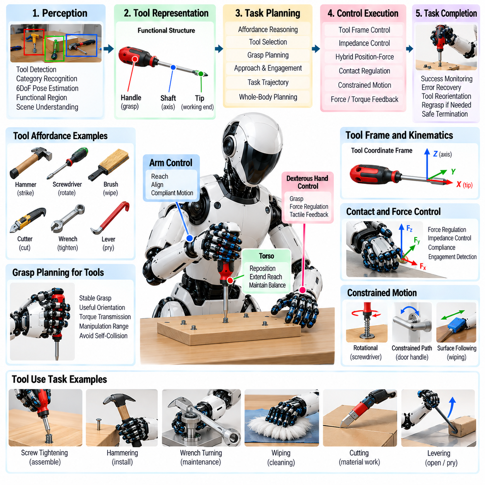{width="7.268055555555556in" height="7.268055555555556in"}

도구 사용(Tool Use)은 로봇이 중간의 물리적 기구(Physical Instrument)를 통해 환경을 변화시킬 수 있도록 함으로써 휴머노이드 조작(Humanoid Manipulation)을 직접적인 손-물체 상호작용(Hand-Object Interaction) 이상으로 확장한다. 도구는 실질적으로 손의 기하 구조, 도달 범위, 힘 전달 방식, 기능적 능력을 변화시킨다. 따라서 신뢰할 수 있는 도구 사용을 위해서는 도구를 단순한 수동적 물체로 취급하는 것이 아니라 인식(Perception), 파지(Grasping), 도구 좌표계 추정(Tool-Frame Estimation), 접촉 제어(Contact Control), 동작 계획(Motion Planning), 전신 안정화(Whole-Body Stabilization)를 협응해야 한다.

조작 구조(Manipulation Structure)에서 도구 및 기구 조작(Tool and Instrument Manipulation)은 정교한 손 제어(Dexterous Hand Control), 임피던스 기반 접촉 작업(Impedance-Based Contact Tasks), 물체 전달(Object Handover), 테이블탑 조작(Table-Top Manipulation) 이후에 위치하며, 통합 전신 조작(Unified Whole-Body Manipulation) 이전 단계에 해당한다. 이러한 진행 구조는 도구 사용이 안정적인 파지와 접촉 상호작용을 기반으로 하면서도 팔과 몸체의 더욱 광범위한 협응 운동을 요구하는 경우가 많다는 점을 반영한다.

도구는 단순히 외부 형상(External Geometry)만으로 표현하기보다 기능적 구조(Functional Structure)에 따라 표현해야 한다. 시스템은 파지 영역(Grasp Region), 기능적 작업 영역(Functional Working Region), 상호작용 축(Interaction Axis), 유효 끝단(Effective Tip), 의도된 작업과 관련된 기준 좌표계(Reference Frame)를 구분할 수 있다. 예를 들어 드라이버(Screwdriver)의 손잡이는 파지를 담당하지만 축과 끝부분은 기능적 상호작용을 결정한다. 이러한 분해를 통해 계획 시스템은 도구가 로봇의 행동 공간(Action Space)을 어떻게 변화시키는지를 직접 추론할 수 있다.

도구 인식(Tool Recognition)은 시각 및 기하학적 인식(Geometric Perception)에서 시작되지만 도구의 범주를 인식하는 것만으로는 충분하지 않다. 로봇은 도구의 6자유도 자세(Six-Degree-of-Freedom Pose)를 추정하고, 도구를 어떻게 잡고 사용해야 하는지를 결정하는 기능 영역(Functional Region)을 식별해야 한다. 특히 방향(Orientation)은 중요할 수 있는데, 시각적으로 유사한 두 개의 파지라도 작업 끝단(Working End)이 손목, 환경, 목표물에 대해 완전히 다른 구성을 갖도록 만들 수 있기 때문이다.

어포던스 추론(Affordance Reasoning)은 인식된 형상을 가능한 행동과 연결한다. 망치(Hammer)는 타격(Striking)을 지원하고, 드라이버는 회전 결합(Rotational Engagement)을 지원하며, 브러시(Brush)는 분산된 표면 접촉(Distributed Surface Contact)을 지원하고, 레버(Lever)는 구속 조건을 중심으로 힘을 증폭할 수 있다. 따라서 조작 시스템은 물체가 무엇인지만이 아니라 어떤 물리적 변환(Physical Transformation)을 만들어낼 수 있는지도 추론해야 한다. 이후 필요한 작업 효과(Task Effect)와 사용 가능한 어포던스의 적합성을 기반으로 도구를 선택할 수 있다.

도구의 파지 계획(Grasp Planning)은 파지 안정성만을 목표로 하지 않는다는 점에서 일반적인 물체 파지와 다르다. 선택된 파지는 유용한 방향, 충분한 토크 전달(Torque Transmission), 편안한 관절 구성(Joint Configuration), 적절한 조작 범위(Manipulation Range)를 함께 제공해야 한다. 도구의 잘못된 부분을 매우 안정적으로 잡더라도 의도된 작업을 수행할 수 없을 수 있다. 따라서 기능적 파지 품질(Functional Grasp Quality)은 이후 수행할 작업 궤적(Task Trajectory)을 기준으로 평가해야 한다.

도구를 파지하면 도구는 로봇 운동학 구조(Kinematic Structure)의 확장으로 작동한다. 제어기는 손 또는 손목 좌표계와 도구 좌표계(Tool Coordinate Frame), 특히 도구 중심점(Tool Center Point) 또는 기능적 상호작용점(Functional Interaction Point) 사이의 변환 관계를 설정해야 한다. 이후 운동 명령을 손바닥이 아니라 실제 작업 끝단을 기준으로 표현할 수 있다. 이러한 변환 관계의 캘리브레이션 오차(Calibration Error)는 환경과 접촉하는 위치에서 직접적인 위치 오차로 나타난다.

긴 도구(Long Tool)는 유용한 도달 범위를 확장하는 동시에 기하학적 오차(Geometric Error)도 증폭시킨다. 손목에서 작은 각도 오차가 발생해도 멀리 떨어진 도구 끝단에서는 상당한 위치 변위가 발생할 수 있으므로 방향 정확도(Orientation Accuracy)가 특히 중요하다. 로봇은 파지 이후 손목 카메라(Wrist Camera), 외부 시각(External Vision), 알려진 기하 구조, 접촉 관측(Contact Observation)을 이용하여 도구 자세를 더욱 정밀하게 보정할 수 있다. 온라인 보정(Online Correction)을 통해 초기 계획만으로 제거하기 어려운 작은 파지 위치 변화를 보상할 수 있다.

기구 조작(Instrument Manipulation)은 주요 동작을 시작하기 전에 결합 단계(Engagement Phase)를 포함하는 경우가 많다. 드라이버는 나사 머리에 삽입되어야 하고, 열쇠(Key)는 슬롯과 정렬되어야 하며, 프로브(Probe)는 정확한 표면 위치에 접촉해야 할 수 있다. 이러한 동작은 정밀 위치 제어와 접촉 감지를 결합한다. 정렬이 완벽하지 않은 상태에서 강체 궤적 추종(Rigid Trajectory Tracking)을 수행하면 과도한 힘이 발생할 수 있으므로 순응 운동(Compliant Motion)과 임피던스 제어(Impedance Control)를 사용하여 환경의 기하 구조가 최종 정렬을 유도하도록 하는 것이 유용하다.

접촉력(Contact Force)은 도구의 기능에 따라 조절되어야 한다. 필기 도구(Writing Instrument)는 비교적 작은 법선력(Normal Force)을 요구하지만, 긁기(Scraping)나 조임(Tightening)은 훨씬 큰 힘 또는 토크를 요구할 수 있다. 제어기는 도구의 결합 상태를 유지하는 데 필요한 힘과 실제 작업을 수행하는 힘을 구분해야 한다. 손목 힘·토크 감지(Wrist Force-Torque Sensing), 관절 토크 추정(Joint Torque Estimation), 촉각 피드백(Tactile Feedback)을 결합하여 도구를 통해 전달되는 상호작용을 추정할 수 있다.

많은 도구는 결합 이후 구속된 운동(Constrained Motion)을 요구한다. 드라이버는 주로 자신의 축을 중심으로 회전하고, 문 손잡이(Door Handle)는 기계적으로 제한된 회전 경로를 따르며, 절삭 또는 닦기 도구(Cutting or Wiping Instrument)는 표면을 따라 이동할 수 있다. 따라서 구속되지 않은 직교 좌표 궤적(Unconstrained Cartesian Trajectory)을 명령하기보다 허용 방향과 구속 방향에 대응하는 작업 좌표(Task Coordinates)를 사용하여 이러한 동작을 표현할 수 있다. 이를 통해 불필요한 힘을 감소시키고 물리적 일관성을 향상시킬 수 있다.

혼합 위치-힘 제어(Hybrid Position-Force Control)와 임피던스 제어는 기구 조작에 특히 적합하다. 정확한 궤적 추종이 필요한 방향에서는 위치 제어(Position Control)를 사용할 수 있고, 구속된 방향에서는 힘 제어(Force Control)를 통해 접촉을 유지할 수 있다. 임피던스 제어는 이러한 제어 목표 사이에 존재하는 잔여 기하학적 불확실성(Residual Geometric Uncertainty)을 흡수할 수 있다. 이를 통해 도구는 세계 모델(World Model)과 현실 사이의 작은 차이를 강제로 극복하려 하기보다 실제 물리적 구조를 따라 움직일 수 있다.

도구 동역학(Tool Dynamics) 역시 조작 과정에 포함되어야 한다. 기구의 질량과 관성(Inertia)은 팔의 유효 동역학(Effective Dynamics)을 변화시키며, 편향된 질량중심(Offset Center of Mass)은 상당한 손목 토크를 발생시킬 수 있다. 무겁거나 긴 도구는 로봇 전체의 운동량(Momentum)과 균형 요구조건도 변화시킬 수 있다. 따라서 동역학 보상(Dynamic Compensation)은 파지된 페이로드(Payload)를 고려해야 하며, 전신 제어기(Whole-Body Controller)는 실행 가능한 관절 하중을 유지하기 위해 몸통이나 자세를 재배치할 수 있다.

한 손으로 환경을 안정화하면서 동시에 기구를 작동시킬 수 없는 경우에는 양손 도구 사용(Bimanual Tool Use)이 필요하다. 한 손으로 부품을 잡고 다른 손으로 체결부(Fastener)를 조이거나, 한 손으로 용기를 안정화하면서 다른 손으로 뚜껑을 조작하거나, 서로 떨어진 두 접촉점을 이용해 긴 도구를 양손으로 안내할 수 있다. 이러한 작업에서는 작업 도구의 기능적 궤적을 유지하면서 상대적인 양손 협응(Relative Hand Coordination)과 내부 힘 관리(Internal-Force Management)를 수행해야 한다.

도구 교환(Tool Exchange)은 또 다른 조작 문제를 발생시킨다. 로봇은 보관 위치에서 기구를 가져오거나, 사람으로부터 전달받거나, 자신의 한 손에서 다른 손으로 옮기거나, 사용 후 원래 위치로 반환해야 할 수 있다. 각각의 전환 과정에서는 활성 파지(Active Grasp)와 도구 기준 좌표계가 변경된다. 이후 계획이 기하학적으로 일관성을 유지하려면 시스템은 이러한 전환 과정 전체에서 도구의 정체성, 방향, 기능적 끝단에 대한 정보를 유지해야 한다.

일부 기구 작업에서는 기계적 운동뿐 아니라 이산적인 작동 상태(Discrete Operating State)도 고려해야 한다. 트리거(Trigger), 버튼(Button), 스위치(Switch), 래치(Latch), 조절 메커니즘(Adjustable Mechanism)은 도구의 동작 방식을 변화시킬 수 있다. 따라서 동일한 팔 궤적이라도 기구의 구성에 따라 서로 다른 효과가 발생할 수 있으므로 조작 계획기는 이러한 상태를 명시적으로 표현해야 한다. 실행을 계속하기 전에 인식 또는 힘 피드백을 통해 예상된 상태 전환(State Transition)이 실제로 발생했는지 확인할 수 있다.

따라서 작업 실행(Task Execution)은 단순히 명령된 궤적만을 기준으로 하기보다 관측 가능한 물리적 효과(Observable Physical Effect)를 중심으로 구성해야 한다. 체결부를 조일 때에는 저항의 증가나 토크 임계값(Torque Threshold) 도달을 통해 완료 여부를 판단할 수 있다. 닦기 작업에서는 목표 영역의 커버리지(Coverage)가 완료 조건이 될 수 있으며, 프로빙(Probing)에서는 지정된 위치에서의 접촉이 중요한 결과가 될 수 있다. 효과 기반 모니터링(Effect-Based Monitoring)을 통해 로봇은 도구 운동이 실제로 의도한 목적을 달성했는지를 판단할 수 있다.

환경의 기하 구조, 마찰(Friction), 기계적 저항(Mechanical Resistance), 도구 상태를 정확하게 알 수 없는 경우가 많기 때문에 도구 사용에는 상당한 불확실성이 존재한다. 나사가 예상보다 큰 저항을 보이거나, 도구가 목표에서 미끄러지거나, 표면이 힘에 의해 변형될 수 있다. 제어기는 예상 운동과 실제 측정된 운동, 힘, 접촉 상태를 지속적으로 비교해야 한다. 큰 잔차(Residual)가 발생하면 기존에 가정한 상호작용 모델(Interaction Model)이 더 이상 유효하지 않음을 의미할 수 있다.

실패 복구(Failure Recovery)는 도구와 주변 환경을 모두 보호해야 한다. 결합 상태가 손실되면 로봇은 가해지는 힘을 줄이고 약간 후퇴한 다음 목표를 다시 인식하고 정렬을 재시도할 수 있다. 토크가 예상하지 못하게 증가하는 상황에서 동작을 계속하면 도구나 대상이 손상될 수 있으므로 실행을 중단하거나 역방향으로 움직여야 한다. 복구 정책(Recovery Policy)은 불확실한 상호작용을 계속하는 대신 알려진 안정적인 접촉 상태(Known Stable Contact State)로 복귀하는 것을 우선해야 한다.

학습 기반 조작(Learning-Based Manipulation)은 도구 접촉이 복잡하거나 명시적으로 설명하기 어려운 경우 해석적 모델(Analytical Model)을 보완할 수 있다. 시연(Demonstration)은 접근 방향, 결합, 힘 적용, 작업 완료 거동의 사례를 제공할 수 있다. 강화 학습(Reinforcement Learning)은 자세 및 접촉 변화에 대한 강건성을 향상시킬 수 있으며, 잔여 정책(Residual Policy)은 기본 안전 제어기(Safety Controller)를 대체하지 않으면서 시각, 촉각, 힘 관측을 이용해 모델 기반 궤적(Model-Based Trajectory)을 보정할 수 있다.

일반화(Generalization)를 위해서는 로봇이 작업의 원리와 개별 도구의 기하 구조를 분리하여 이해할 수 있어야 한다. 특정 드라이버나 특정 브러시 하나만을 암기한 정책은 실용적 가치가 제한적이다. 파지 영역, 행동 축(Action Axis), 접촉 표면(Contact Surface), 도구 중심점을 기반으로 한 기능적 표현(Functional Representation)은 크기나 외형이 서로 다른 기구 사이에서 학습된 능력을 전이할 수 있도록 한다. 의미론적 인식(Semantic Perception)은 새로운 도구를 이전에 학습한 물리적 어포던스와 연결하는 데 추가적으로 활용될 수 있다.

도구를 통해 발생하는 힘이 증가할수록 전신 협응(Whole-Body Coordination)의 중요성도 증가한다. 밀기(Pushing), 드릴링(Drilling), 지렛대 사용(Levering), 긴 기구 조작은 팔을 통해 몸통과 다리까지 전달되는 반력(Reaction Force)을 발생시킬 수 있다. 로봇은 질량중심(Center of Mass)을 조정하고, 지지 자세(Stance)를 넓히거나, 몸통을 회전시키거나, 발 위치를 변경해야 할 수 있다. 따라서 도구 조작은 전신 이동-조작 통합 능력(Unified Loco-Manipulation Capability)과 자연스럽게 연결된다.

안전 감독(Safety Supervision)은 로봇의 운동뿐 아니라 기구가 발생시키는 물리적 효과도 제한해야 한다. 도구 끝단 속도(Tool-Tip Velocity), 접촉력, 적용 토크(Applied Torque), 관절 하중(Joint Loading), 충돌 거리(Collision Distance), 작업 공간(Workspace)에 대한 제한은 작업 실행 전체에서 유지되어야 한다. 또한 제어기는 의도된 도구 접촉과 손, 팔, 환경 또는 주변 사람에게 발생하는 의도하지 않은 접촉을 구분해야 하며, 위험한 상호작용이 감지되면 즉시 에너지를 감소시켜야 한다.

성능 평가(Performance Evaluation)는 운동 정확도뿐 아니라 기능적인 작업 성공(Function Task Success)도 측정해야 한다. 유용한 평가 지표에는 도구 파지 성공률(Tool-Grasp Success), 도구 끝단 자세 오차(Tool-Tip Pose Error), 결합 성공률(Engagement Success), 접촉력 안정성(Contact-Force Stability), 적용 토크 정확도(Applied Torque Accuracy), 작업 완료 시간, 의도하지 않은 미끄러짐(Unintended Slip), 복구 성공률(Recovery Success), 도구 및 목표물 변화에 대한 강건성이 포함된다. 초기 자세, 마찰, 목표 정렬, 페이로드, 환경 강성(Environmental Stiffness)의 오차와 변화도 함께 시험해야 한다.

궁극적으로 도구 및 기구 조작은 휴머노이드가 정교한 파지(Dexterous Grasping)를 훨씬 더 광범위한 물리적 세계와의 기능적 상호작용(Functional Interaction)으로 확장할 수 있게 한다. 도구는 손의 일시적인 확장(Temporary Extension)으로 작동하며, 도구의 기하 구조, 동역학, 어포던스, 접촉 상태를 로봇의 제어 모델(Control Model)에 통합해야 한다. 이러한 능력이 인식, 순응 제어(Compliant Control), 양손 협응(Bimanual Coordination), 학습(Learning), 전신 안정화와 결합되면 휴머노이드는 점점 더 범용적인 물리적 작업(General Physical Task)을 수행할 수 있다.

## 07.08. Whole Body Manipulation Loco Manip Unified [w/Code]

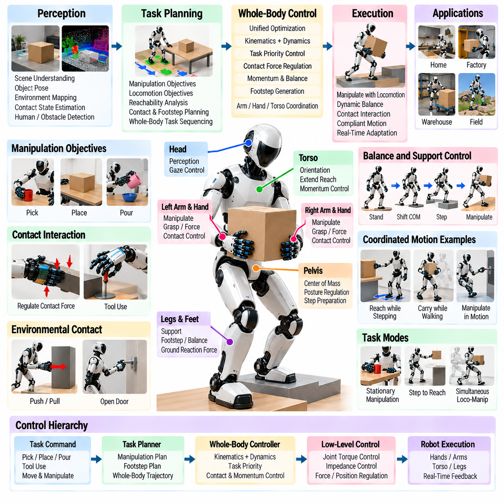{width="7.268055555555556in" height="7.268055555555556in"}

전신 조작(Whole-Body Manipulation)은 휴머노이드 조작(Humanoid Manipulation)을 개별적인 팔과 손의 운동에서 전신을 협응하여 사용하는 수준으로 확장한다. 손은 작업 접촉(Task Contact)을 형성하고, 팔은 상호작용을 조절하며, 몸통(Torso)은 도달 범위를 확장하고 운동량(Momentum)을 재분배하고, 다리는 지지를 유지하거나 로봇의 위치를 변경한다. 통합 이동-조작(Unified Loco-Manipulation)은 이러한 기능을 이동과 조작이라는 독립된 단계로 분리하지 않고 하나의 결합된 물리적 거동(Coupled Physical Behavior)으로 취급한다.

전통적인 조작(Traditional Manipulation)은 로봇의 베이스(Base)가 고정된 상태에서 팔이 작업을 수행한다고 가정하는 경우가 많다. 이러한 가정은 넓거나 변화하는 작업 공간에서 동작하는 휴머노이드에게 제약이 된다. 물체가 편안한 도달 범위 밖에 있거나, 운반 중인 하중 때문에 몸체 위치를 변경해야 하거나, 상호작용 힘이 상체가 안전하게 지지할 수 있는 수준을 초과할 수 있다. 전신 조작은 지지 구성(Support Configuration) 자체가 작업에 참여하도록 함으로써 이러한 상황을 해결한다.

핵심 아키텍처 원리(Architectural Principle)는 조작 목표(Manipulation Objective)와 이동 목표(Locomotion Objective)가 동일한 몸체를 사용하므로 동일한 동역학 제약(Dynamic Constraints)을 공유한다는 것이다. 팔의 움직임은 질량중심(Center of Mass)과 각운동량(Angular Momentum)을 변화시키며, 보행(Stepping)은 손의 기준 좌표계와 도달 가능한 작업 공간을 변화시킨다. 따라서 통합 제어기(Unified Controller)는 각 하위 시스템을 독립적으로 최적화하는 대신 손 자세, 접촉력(Contact Force), 몸통 자세, 질량중심 운동, 발 배치(Foot Placement), 운동량을 협응해야 한다.

작업 표현(Task Representation)은 일반적으로 상호작용 지점(Interaction Point)에서 시작된다. 원하는 손 자세, 물체 궤적(Object Trajectory), 접촉력, 도구 운동(Tool Motion), 양손 제약(Bimanual Constraint)이 주요 조작 목표를 정의한다. 추가적인 목표는 몸통 방향, 골반 높이(Pelvis Height), 시선(Gaze), 관절 자세(Joint Posture), 발 접촉(Foot Contact)을 조절한다. 제어기는 작업 우선순위(Task Priority)에 따라 이러한 목표를 결합하면서 관절 한계(Joint Limits), 마찰(Friction), 충돌 회피(Collision Avoidance), 액추에이터 성능(Actuator Capability)과 같은 물리적 제약을 적용한다.

전신 운동학(Whole-Body Kinematics)은 이러한 작업 목표와 로봇의 많은 자유도(Degrees of Freedom) 사이의 기하학적 관계를 제공한다. 휴머노이드는 높은 여유성(Redundancy)을 가지므로 동일한 손 자세를 어깨, 팔꿈치, 몸통, 골반, 다리의 서로 다른 조합으로 구현할 수 있다. 이러한 여유성을 활용하여 조작성(Manipulability)을 높이고, 특이점(Singularity)을 회피하며, 관절 여유도(Joint Margin)를 유지하고, 에너지 소비를 줄이거나 이후 동작을 수행하기에 유리한 몸체 자세를 준비할 수 있다.

조작으로 상당한 힘이 발생하는 경우에는 동역학적 일관성(Dynamic Consistency)이 필수적이다. 무거운 물체를 밀거나, 문을 당기거나, 큰 페이로드(Payload)를 운반하거나, 긴 도구를 작동하면 반력(Reaction Force)이 팔을 통해 몸통과 다리로 전달된다. 제어기는 실행 가능한 지면 반력(Ground Reaction Force)을 유지하면서 이러한 하중을 사용 가능한 접촉들에 분배해야 한다. 따라서 조작은 단순히 팔의 토크 한계만이 아니라 전체 로봇-환경 접촉 시스템(Robot-Environment Contact System)의 제약을 받는다.

발 접촉(Foot Contact)은 서 있는 상태에서 조작을 수행할 때 주요 지지 구조(Primary Support Structure)를 형성한다. 사용 가능한 압력중심 영역(Center-of-Pressure Region), 마찰 한계(Friction Limit), 발의 형상은 보행하지 않고 로봇이 얼마나 큰 외력을 견딜 수 있는지를 결정한다. 조작력이 증가하면 제어기는 질량중심을 이동시키거나 몸통 방향을 변경하고, 무릎을 굽히거나 양발 사이의 하중을 재분배할 수 있다. 이러한 조정을 통해 안정적인 지지를 유지하면서 수행 가능한 상호작용의 범위를 확장할 수 있다.

정적 균형 기준(Static Balance Criteria)만으로는 동적 조작(Dynamic Manipulation)을 충분히 처리할 수 없다. 빠른 팔 운동, 물체 가속(Object Acceleration), 외부 충격(External Impact)은 전신에서 관리해야 하는 운동량을 발생시킨다. 중심 운동량 조절(Centroidal Momentum Regulation)은 이러한 영향을 협응하기 위한 유용한 표현을 제공한다. 제어기는 필요한 손 궤적과 상호작용 힘을 유지하면서 몸통, 팔, 다리 운동을 이용하여 선형 및 각운동량을 조절할 수 있다.

현재 지지 구성만으로 원하는 작업을 완료할 수 없는 경우 보행(Stepping)은 조작의 일부가 된다. 통합 이동-조작에서는 한 걸음을 조작의 중단으로 취급하는 대신 발 배치를 또 하나의 의사결정 변수(Decision Variable)로 고려한다. 로봇은 물체에 더 가까이 접근하거나, 물체를 운반하면서 측면으로 이동하거나, 도구 작업 중 지지 자세를 회전시키거나, 힘을 가하기에 더욱 유리한 방향을 만들기 위해 발 위치를 변경할 수 있다.

따라서 도달 가능성(Reachability)은 팔의 작업 공간뿐 아니라 가능한 베이스 운동(Base Motion)까지 포함하여 평가해야 한다. 현재 자세에서 도달할 수 없는 목표도 작은 보행이나 몸통 이동 이후에는 쉽게 조작할 수 있다. 계획 시스템은 팔을 뻗는 방법, 몸체를 기울이는 방법, 몸통을 회전하는 방법, 발을 이동하는 방법 등의 대안을 비교할 수 있다. 선택된 전략은 작업 효율성과 안정성, 관절 하중(Joint Loading), 충돌 위험, 이후 필요한 작업 공간을 함께 고려해야 한다.

이동과 조작은 순차적으로 또는 동시에 수행될 수 있다. 순차적 전략(Sequential Strategy)에서는 휴머노이드가 유리한 지지 자세까지 이동하고 안정화한 후 조작을 수행한다. 동시 전략(Simultaneous Strategy)에서는 로봇이 물체를 운반하거나, 밀거나, 당기거나, 위치를 변경하는 동안에도 계속 이동한다. 동시 이동-조작(Simultaneous Loco-Manipulation)은 발 접촉과 지지 조건이 지속적으로 변화하는 동안에도 손-물체 제약(Hand-Object Constraint)을 유지해야 하므로 더욱 어렵다.

물체 운반(Object Carrying)은 대표적인 통합 작업이다. 휴머노이드는 테이블에서 물체를 들어 올리고 몸체 가까이로 이동시킨 후 보행을 시작하며, 장애물을 피해 이동한 다음 다른 위치에 물체를 내려놓을 수 있다. 페이로드는 로봇과 물체가 결합된 시스템의 질량중심과 관성(Inertia)을 변화시켜 균형과 보행에 영향을 준다. 제어기는 이동 전체 과정에서 파지 안정성(Grasp Stability)을 유지하고 과도한 팔 하중을 방지하면서 이러한 변화를 고려해야 한다.

크거나 무거운 물체에는 양손 전신 협응(Bimanual Whole-Body Coordination)이 필요한 경우가 많다. 양손이 물체와 접촉하는 동안 몸통과 다리는 추가적인 운동 및 힘 생성 능력을 제공할 수 있다. 상대적인 손 자세(Relative Hand Pose)는 물체의 강성(Rigidity)과 호환되어야 하며, 양손 사이의 내부 힘(Internal Force)도 조절해야 한다. 로봇은 양손 접촉을 유지하면서 지지 자세를 변경하거나 보행할 수도 있으며, 이 경우 전신을 포함하는 폐쇄 체인 상호작용(Closed-Chain Interaction)이 형성된다.

밀기(Pushing)와 당기기(Pulling)는 조작력과 이동 사이의 직접적인 결합을 보여준다. 카트나 큰 물체를 밀 때 로봇은 몸을 앞으로 기울이고 원하는 손의 힘을 지지하는 지면 반력을 생성할 수 있다. 당기는 동안에는 지지 자세와 질량중심이 반대 방향으로 이동할 수 있다. 필요한 상호작용이 현재의 지지 여유(Support Margin)를 초과하는 경우 단순히 팔 토크를 증가시키는 대신 보행을 통해 기계적으로 유리한 구성을 다시 확보할 수 있다.

전신 임피던스 제어(Whole-Body Impedance Control)는 여러 신체 구간에 걸쳐 순응적 거동(Compliant Behavior)을 제공할 수 있다. 손에는 작업별 임피던스(Task-Specific Impedance)를 설정하고 몸통과 다리는 자세와 균형을 조절할 수 있다. 이때 손에 작용하는 외력은 팔에서만 흡수되는 것이 아니라 전신에 걸친 협응 운동을 유발할 수 있다. 이를 통해 상호작용 하중을 분산시키고 불확실한 환경을 조작하거나 인간과 협업할 때 더욱 자연스럽게 적응할 수 있다.

여러 목표가 동일한 자유도를 두고 경쟁할 수 있으므로 작업 우선순위 결정(Task Prioritization)이 중요하다. 균형과 안전한 접촉을 유지하는 것은 일반적으로 정확한 손 궤적 추종보다 높은 우선순위를 가지며, 자세 최적화(Posture Optimization)나 시각 정렬(Visual Alignment)은 더 낮은 우선순위를 가질 수 있다. 계층적 최적화(Hierarchical Optimization)는 중요한 제약을 먼저 적용한 후 남아 있는 여유성을 보조 목표에 사용할 수 있다. 이를 통해 낮은 우선순위의 선호도가 물리적 안정성이나 안전성을 손상시키는 것을 방지한다.

최적화 기반 전신 제어(Optimization-Based Whole-Body Control)는 일반적으로 높은 주파수에서 제약 조건을 포함하는 문제를 해결한다. 의사결정 변수에는 관절 가속도(Joint Acceleration), 토크(Torque), 접촉력, 일반화 속도(Generalized Velocity)가 포함될 수 있다. 제약 조건은 강체 동역학(Rigid-Body Dynamics), 발 접촉, 마찰 원뿔(Friction Cone), 토크 한계, 관절 한계, 충돌 조건을 표현한다. 이후 작업 목표는 이러한 실행 가능한 영역 내에서 원하는 손 운동, 질량중심 거동, 운동량 조절, 자세, 상호작용 힘을 정의한다.

계획(Planning)은 하위 수준 전신 제어기보다 긴 시간 범위에서 동작한다. 계획기는 물체 운동, 손 접촉 순서(Contact Sequence), 지지 자세 전환(Stance Transition), 발 디딤 위치(Foothold), 중간 몸체 구성(Intermediate Body Configuration)을 결정할 수 있다. 이후 제어기는 교란(Disturbance)과 모델 오차(Model Error)에 대응하면서 이러한 결정을 실제 운동으로 구현한다. 예측적 계획(Predictive Planning)과 빠른 피드백 제어(Fast Feedback Control)를 분리하면 복잡한 조작 순서도 실제 물리적 실행 과정에서 적응성을 유지할 수 있다.

통합 이동-조작에서는 손과 발 모두 접촉을 형성하거나 해제할 수 있으므로 접촉 전환(Contact Transition)이 특히 중요하다. 양손이 물체와 계속 접촉하는 동안 한쪽 발을 들어 올릴 수도 있고, 다리가 지지를 유지하는 동안 한 손이 물체에서 떨어질 수도 있다. 각각의 전환은 로봇의 제약 구조(Constraint Structure)와 사용 가능한 힘 분포(Force Distribution)를 변화시킨다. 따라서 계획 시스템은 하나의 접촉을 제거하기 전에 남아 있는 접촉들이 충분한 안정성을 제공하는지를 확인해야 한다.

인식(Perception)은 조작 목표와 이동에 필요한 환경 형상을 모두 추적해야 한다. 로봇은 물체 자세, 파지 상태, 도구 구성, 장애물, 지지 표면(Support Surface), 발 디딤 가능 영역(Foothold Region), 필요한 경우 인간의 움직임까지 파악해야 한다. 조작 과정에서 로봇의 몸체 자체가 센서를 가릴 수 있으므로 머리 카메라(Head Camera), 손목 카메라(Wrist Camera), 고유수용감각(Proprioception), 촉각 감지(Tactile Sensing), 힘 감지(Force Sensing)를 결합하여 지속적으로 갱신되는 세계 및 몸체 상태 추정(World and Body-State Estimate)을 구성해야 한다.

실패 복구(Failure Recovery)는 국부적인 팔 보정에만 의존하지 않고 전신을 활용해야 한다. 물체가 미끄러지기 시작하면 로봇은 보행 속도를 낮추고, 물체를 몸통 가까이 가져오며, 파지를 강화하거나, 이동을 멈추고 더 넓은 지지 자세를 취할 수 있다. 상호작용 힘이 지나치게 커지면 힘이 작용하는 방향으로 한 걸음 이동하거나 자세를 수정하거나 작업을 안전하게 해제할 수 있다. 따라서 전신 복구(Whole-Body Recovery)는 로봇이 사용할 수 있는 대응 공간(Response Space)을 크게 확장한다.

학습 기반 정책(Learning-Based Policy)은 상위 수준 행동, 접촉 순서, 발 디딤 위치, 잔여 행동(Residual Action)을 선택함으로써 모델 기반 전신 제어(Model-Based Whole-Body Control)를 보완할 수 있다. 강화 학습(Reinforcement Learning)은 특히 동적 운반(Dynamic Carrying)이나 접촉이 풍부한 이동(Contact-Rich Locomotion)처럼 수동으로 명시하기 어려운 협응 패턴을 발견할 수 있다. 실용적인 아키텍처에서는 학습 기반 의사결정과 명시적인 동역학, 균형 제약, 토크 한계, 하위 제어 수준의 안전 감독(Safety Supervision)을 결합할 수 있다.

통합 정책(Unified Policy)을 학습하려면 페이로드, 마찰, 물체 형상, 지형(Terrain), 교란, 접촉 시점(Contact Timing)의 다양한 변화에 노출되어야 한다. 시뮬레이션(Simulation)은 확장 가능한 학습 경험을 제공하며, 도메인 무작위화(Domain Randomization)는 불확실한 동역학에 대한 강건성을 향상시킬 수 있다. 그러나 접촉, 액추에이터 거동, 페이로드 추정의 오차는 균형에 직접적인 영향을 미치므로 실제 환경 피드백(Real-World Feedback)은 여전히 필수적이다. 따라서 시뮬레이션-현실 전이(Sim-to-Real Transfer)에서는 실제 배치 과정에서도 보수적인 물리적 제약을 유지해야 한다.

안전 감독은 조작과 이동 전체에서 동시에 작동해야 한다. 관절 토크, 손의 힘, 발 마찰(Foot Friction), 질량중심 상태, 충돌 거리, 보행 안정성(Gait Stability), 페이로드 운동, 액추에이터 온도(Actuator Temperature)를 정의된 한계 내에서 유지해야 한다. 안전 여유(Safety Margin)가 감소하면 시스템은 조작 속도를 낮추고, 상호작용 힘을 감소시키며, 보행을 정지하거나, 지지 자세를 넓히고, 물체를 내려놓거나, 다른 안정적인 구성으로 전환할 수 있다.

성능 평가(Performance Evaluation)는 보행과 조작을 서로 독립된 벤치마크(Benchmark)로 취급하기보다 통합 성능을 측정해야 한다. 유용한 지표에는 작업 완료(Task Completion), 손 추종 오차(Hand Tracking Error), 상호작용 힘 정확도(Interaction-Force Accuracy), 파지 안정성, 발 배치 오차(Foot-Placement Error), 균형 여유(Balance Margin), 에너지 소비, 복구 성공률(Recovery Success), 페이로드 변화 허용도(Payload Variation Tolerance), 실행 시간이 포함된다. 평가는 정지 상태 조작, 접촉 중 보행, 물체 운반, 밀기, 당기기, 양손 운반(Bimanual Transport)을 포함해야 한다.

궁극적으로 통합 이동-조작(Unified Loco-Manipulation)은 휴머노이드를 단순히 조작기를 탑재한 이동 플랫폼(Mobile Platform)에서 하나의 동역학적으로 협응된 물리 시스템(Dynamically Coordinated Physical System)으로 변화시킨다. 손, 팔, 몸통, 골반, 다리는 작업 수행에 공동으로 기여하며, 접촉력과 운동은 변화하는 물리적 요구조건에 따라 전신에 분배된다. 이러한 통합을 통해 휴머노이드는 더 먼 곳에 도달하고, 더 무거운 물체를 조작하며, 상호작용하면서 이동하고, 넓은 실제 작업 공간(Real-World Workspace)에서 중단 없이 연속적으로 작업할 수 있다.

## 07.09. IL RL Hybrid Policy for Dexterous Tasks [w/Code]

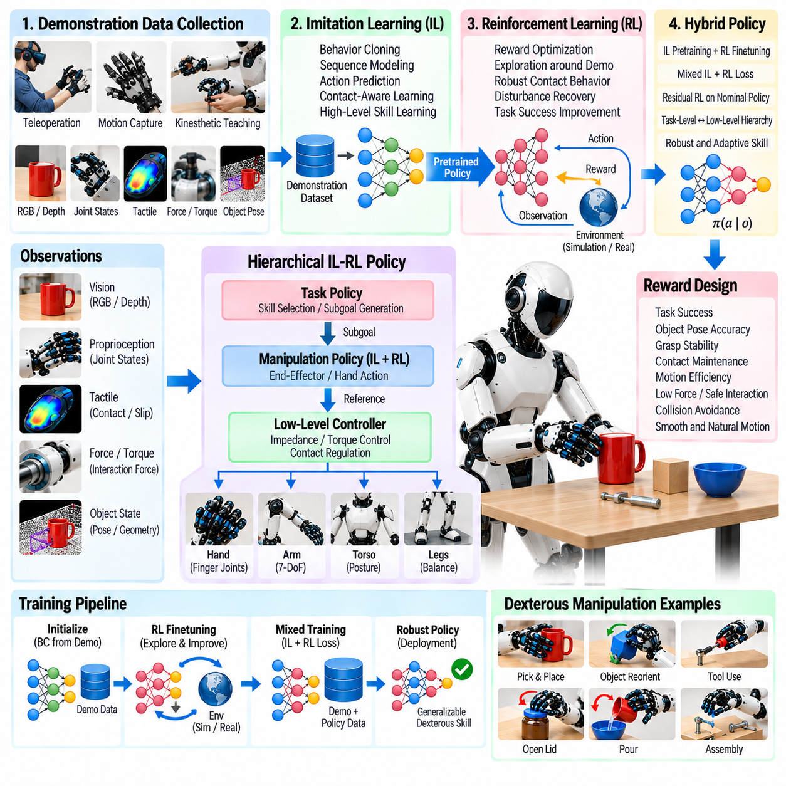{width="7.268055555555556in" height="7.268055555555556in"}

정교한 휴머노이드 조작(Dexterous Humanoid Manipulation)에는 목적성을 가진 인간과 유사한 행동을 재현하면서 접촉 불확실성(Contact Uncertainty), 물체 변화(Object Variation), 예상하지 못한 교란(Unexpected Disturbance)에 강건하게 대응할 수 있는 정책이 필요하다. 모방 학습(Imitation Learning)은 시연(Demonstration)으로부터 구조화된 행동을 제공하고, 강화 학습(Reinforcement Learning)은 상호작용과 보상 기반 탐색(Reward-Driven Exploration)을 통해 성능을 향상시킨다. IL-RL 하이브리드 정책(IL-RL Hybrid Policy)은 이러한 장점을 결합하여 데이터 효율성과 적응성을 모두 갖춘 조작 기술을 생성한다.

순수 모방 학습(Pure Imitation Learning)은 모든 접촉 전환(Contact Transition)을 수동으로 지정하지 않고도 유용한 조작 행동을 학습할 수 있다. 인간 시연(Human Demonstration)은 도달 동작(Reaching), 파지 형성(Grasp Formation), 손가락 협응(Finger Coordination), 물체 재지향(Object Reorientation), 도구 상호작용(Tool Interaction), 복구(Recovery)의 사례를 제공한다. 정책은 관측에서 행동으로의 매핑을 학습하여 성공적인 작업 구조를 반영한다. 이는 다지 궤적(Multi-Finger Trajectory)을 해석적으로 도출하기 어려운 정교한 작업에 특히 유용하다.

시연 데이터(Demonstration Data)는 원격조작(Teleoperation), 모션 캡처(Motion Capture), 직접 교시(Kinesthetic Teaching), 가상현실 인터페이스(Virtual Reality Interface), 자율 전문가 제어기(Autonomous Expert Controller)를 통해 수집할 수 있다. 휴머노이드 손의 경우 시연에는 손가락 관절 상태, 손목 및 팔 운동, 물체 자세(Object Pose), 촉각 관측(Tactile Observation), 힘 측정(Force Measurement), 작업 문맥(Task Context)이 포함되는 것이 바람직하다. 이러한 모달리티(Modality)를 동기화하면 학습 정책이 시각적으로 관측되는 작업 진행과 실제 조작을 발생시키는 접촉 사건을 연관시킬 수 있다.

행동 복제(Behavior Cloning)는 모방 학습의 직접적인 출발점이다. 신경망 정책(Neural Policy)은 대응되는 관측으로부터 시연된 행동을 예측하도록 학습되며, 실질적으로 전문가 궤적(Expert Trajectory)에 대한 지도 학습(Supervised Learning)을 수행한다. 이 접근법은 배치 시의 상태가 시연 분포(Demonstration Distribution)에 가까운 경우 일반적인 행동을 효율적으로 재현할 수 있다. 그러나 작은 실행 오차만으로도 로봇이 학습 과정에서 거의 또는 전혀 관측하지 못했던 상태로 이동할 수 있다.

이러한 분포 이동(Distribution Shift)은 접촉 오차가 빠르게 누적되는 정교한 조작에서 특히 문제가 된다. 손끝의 작은 위치 변화만으로도 마찰(Friction), 물체 자세, 이후의 접촉 기하(Contact Geometry)가 달라져 후속 행동이 부적절해질 수 있다. 따라서 정책은 단순히 정상 궤적(Nominal Trajectory)을 재생하는 것이 아니라 시연에서 벗어난 상태(Off-Demonstration State)에서도 복구할 수 있어야 한다. 추가 시연, 교정 데이터 수집(Corrective Data Collection), 상호작용형 모방(Interactive Imitation)을 통해 학습 중 표현되는 상태 분포를 확장할 수 있다.

모방 학습은 원시 관절 명령(Raw Joint Command) 대신 상위 수준 표현(High-Level Representation)을 대상으로 수행할 수도 있다. 시연은 원하는 물체 운동, 말단장치 자세(End-Effector Pose), 파지 전환(Grasp Transition), 접촉 모드(Contact Mode), 잠재 조작 기술(Latent Manipulation Skill)을 정의할 수 있다. 이후 하위 수준 제어기(Low-Level Controller)가 이러한 명령을 관절 행동과 힘으로 변환한다. 이러한 계층적 표현(Hierarchical Representation)은 서로 다른 로봇 구성 사이의 전이성을 향상시키고, 학습 정책이 작업 전략을 담당하는 동안 모델 기반 제어(Model-Based Control)가 안정성을 유지하도록 한다.

강화 학습은 상호작용을 통해 행동을 최적화함으로써 모방 학습을 보완한다. 정교한 조작 정책은 관측값을 입력받아 행동을 선택하고, 작업 진행, 안정성, 효율성, 안전성을 나타내는 보상(Reward)을 받는다. 반복적인 경험을 통해 정책은 시연에 포함되지 않았던 보정 행동과 접촉 전략을 발견할 수 있다. 따라서 강화 학습은 불확실한 전환 구간에서 강건성을 향상시키고 실행 오류로부터 복구하는 데 특히 유용하다.

보상 설계(Reward Design)는 학습되는 조작 행동에 큰 영향을 미친다. 보상에는 물체 자세 정확도(Object Pose Accuracy), 파지 안정성(Grasp Stability), 접촉 유지(Contact Maintenance), 작업 완료(Task Completion), 운동 효율성(Motion Efficiency)이 포함될 수 있으며, 과도한 힘, 충돌, 물체 낙하, 안전하지 않은 관절 구성에는 페널티(Penalty)를 부여할 수 있다. 밀집 보상(Dense Shaping Reward)은 초기 학습을 가속할 수 있고, 종단 성공 보상(Terminal Success Reward)은 실제 작업 목표를 유지한다. 잘못 설계된 보상은 물리적으로 의미 있는 조작을 수행하지 않으면서 수치적 보상만 극대화하는 행동을 만들 수 있다.

하이브리드 접근법(Hybrid Approach)은 일반적으로 모방 학습으로 정책을 사전 학습(Pretraining)한 다음 강화 학습으로 세부 조정(Refinement)하는 방식으로 시작한다. IL은 이미 작업과 관련된 상태에 도달할 수 있는 유용한 초기 정책을 제공하여 RL의 탐색 부담(Exploration Burden)을 감소시킨다. 이후 강화 학습은 시연 행동 주변의 다양한 조건을 탐색하고 교란 상황에서 성능을 최적화한다. 이러한 순서는 무작위 탐색(Random Exploration)만으로 성공적인 정교한 접촉 순서를 발견하기 어려운 작업에서 특히 효과적이다.

시연은 초기화 이후 폐기되지 않고 강화 학습 과정에서도 계속 활용될 수 있다. 학습 배치(Training Batch)는 전문가 전이(Expert Transition)와 새롭게 수집된 정책 경험(Policy Experience)을 결합할 수 있으며, 모방 손실(Imitation Loss)을 사용하여 정책이 유용한 시연 행동에서 지나치게 벗어나지 않도록 할 수 있다. 모방 목표와 강화 학습 목표 사이의 상대적 가중치는 학습 과정에서 변화시킬 수 있다. 초기 단계에서는 시연을 강조하고 이후 단계에서는 더 많은 탐색과 작업별 최적화를 허용할 수 있다.

또 다른 전략은 모방 정책 또는 모델 기반 정책(Model-Based Policy)을 기준으로 강화 학습을 잔여 보정(Residual Correction)에 사용하는 것이다. 기본 제어기(Nominal Controller)는 안전하고 의미 있는 행동을 생성하고, 학습된 잔여 정책(Residual Policy)은 관측된 오류에 따라 손가락 위치, 손목 운동, 힘 또는 임피던스(Impedance)를 수정한다. 잔여 학습(Residual Learning)은 RL이 탐색해야 하는 행동 공간(Action Space)을 축소하고 기존 제어기의 해석 가능한 구조를 유지하면서 모델링되지 않은 접촉 효과에 대한 강건성을 향상시킬 수 있다.

정교한 작업에는 풍부한 정책 관측(Policy Observation)이 필요하다. 시각(Vision)은 물체 형상과 장면 문맥을 제공하고, 고유수용감각(Proprioception)은 손과 팔의 구성을 제공하며, 촉각 감지(Tactile Sensing)는 접촉 분포와 미끄러짐(Slip)을 식별하고, 힘·토크 감지(Force-Torque Sensing)는 상호작용 하중을 나타낸다. 물체 자세 추정과 작업 명령(Task Command)은 추가적인 구조를 제공한다. 다중모달 정책(Multimodal Policy)은 서로 다른 샘플링 속도, 노이즈, 차원, 일시적인 센서 가림(Occlusion)을 가진 이러한 신호를 융합해야 한다.

순간적인 관측만으로 현재 접촉 상태를 파악하기 어려울 수 있으므로 시간 정보(Temporal Information)도 중요하다. 짧은 시간 동안의 촉각 변화 이력은 미끄러짐을 나타낼 수 있으며, 힘의 변화 과정은 삽입(Insertion)이나 조임(Tightening)이 정상적으로 진행되는지를 보여줄 수 있다. 순환 신경망(Recurrent Network), 시간 인코더(Temporal Encoder), 상태 추정기(State Estimator)를 통해 시간에 걸친 정보를 유지할 수 있다. 이러한 내부 문맥(Internal Context)은 시각적으로 유사하지만 서로 다른 조작 행동이 필요한 상태를 구분하는 데 도움을 준다.

행동 표현(Action Representation)은 정책이 로봇 동역학과 얼마나 직접적으로 상호작용하는지를 결정한다. 정책은 관절 위치, 관절 속도, 토크, 손끝 목표(Fingertip Target), 말단장치 자세, 원하는 물체 운동, 임피던스 파라미터(Impedance Parameter)를 출력할 수 있다. 상위 수준 행동은 학습을 단순화하고 기존 제어기가 동역학을 관리하도록 할 수 있는 반면, 하위 수준 행동은 더 높은 유연성을 제공한다. 하이브리드 시스템은 학습된 작업 공간 명령(Task-Space Command)과 신뢰할 수 있는 하위 수준 힘 및 관절 제어를 결합하는 경우가 많다.

다지 조작(Multi-Finger Manipulation)은 매우 큰 행동 공간을 가지므로 모든 관절을 직접 독립적으로 제어하는 방법은 학습하기 어렵다. 손 시너지(Hand Synergy), 잠재 행동(Latent Action), 협응된 손가락 프리미티브(Coordinated Finger Primitive)를 이용하면 일반적인 손가락 운동 패턴을 표현하여 차원을 줄일 수 있다. 정책은 이러한 압축된 공간에서 동작하고 필요할 경우 잔여 보정을 생성할 수 있다. 이러한 표현은 유용한 협응을 유지하면서도 개별 물체의 형상과 접촉 조건에 적응할 수 있게 한다.

커리큘럼 학습(Curriculum Learning)은 정교한 작업의 난이도를 점진적으로 증가시킬 수 있다. 초기 학습에서는 고정된 물체 자세와 안정적인 파지에서 시작하고 이후 위치, 방향, 마찰, 질량, 형상, 교란의 변화를 추가할 수 있다. 간단한 행동이 안정화된 이후 더 어려운 접촉 전환이나 긴 작업 순서를 도입할 수 있다. 이러한 진행 방식은 초기 탐색 복잡성을 감소시키면서 실제 환경에서 필요한 강건성을 점진적으로 구축한다.

강화 학습에는 실제 휴머노이드에서 안전하게 수집하기 어려울 정도로 많은 상호작용이 필요할 수 있으므로 시뮬레이션(Simulation)이 특히 중요하다. 병렬 시뮬레이션(Parallel Simulation)은 수천 가지 물체 및 환경 변화에서 경험을 생성할 수 있다. 도메인 무작위화(Domain Randomization)는 마찰, 질량, 순응성(Compliance), 액추에이터 응답, 센서 노이즈, 접촉 파라미터를 변화시켜 정책이 하나의 시뮬레이션 모델에만 의존하지 않도록 하며 실제 환경 배치에 대비하도록 한다.

정교한 조작에서는 접촉 동역학(Contact Dynamics)이 작은 모델링 오차에도 민감하기 때문에 시뮬레이션-현실 전이(Sim-to-Real Transfer)가 여전히 어렵다. 손끝 순응성(Fingertip Compliance), 마찰 전환(Friction Transition), 액추에이터 백래시(Actuator Backlash), 촉각 응답, 물체 표면 특성이 시뮬레이션과 실제 환경에서 크게 다를 수 있다. 따라서 정책이 비현실적인 시뮬레이터 거동을 악용하지 않도록 해야 한다. 실제 환경 미세 조정(Real-World Fine-Tuning), 보수적인 행동 제한, 시스템 식별(System Identification), 잔여 적응(Residual Adaptation)을 통해 남아 있는 전이 격차를 줄일 수 있다.

대규모 시연 또는 로봇 동작 데이터셋이 이미 존재하는 경우 오프라인 강화 학습(Offline Reinforcement Learning)은 또 다른 접근법을 제공한다. 지속적인 온라인 탐색을 요구하는 대신 이전에 수집된 성공 및 실패 행동의 전이 데이터로부터 정책을 학습한다. 이는 안전성을 향상시키고 기존 데이터를 재사용할 수 있게 하지만, 알고리즘이 사용 가능한 데이터 분포에서 크게 벗어난 행동을 선택하지 않도록 해야 한다. 따라서 시연 품질(Demonstration Quality)과 데이터셋 커버리지(Dataset Coverage)가 여전히 중요하다.

실패 데이터(Failure Data)는 성공적인 시연만큼 중요한 정보를 제공할 수 있다. 물체 낙하, 불안정한 파지, 접촉 실패, 과도한 힘, 삽입 실패는 교정 행동이 필요한 상태 공간 영역을 보여준다. 하이브리드 학습은 이러한 사례를 이용하여 실패 예측기(Failure Predictor), 가치 추정(Value Estimate), 복구 정책(Recovery Policy)을 학습할 수 있다. 목표는 단순히 성공 행동을 재현하는 것이 아니라 실행이 실패 방향으로 진행되는 시점을 인식하고 복구 가능한 상태로 돌아가는 것이다.

복구(Recovery)는 동일한 정책의 일부로 표현하거나 별도의 기술 계층(Skill Layer)으로 구성할 수 있다. 촉각 피드백이 미끄러짐을 나타내면 로봇은 파지력을 증가시키고, 손가락을 재배치하거나, 손바닥으로 물체를 지지하거나, 하중을 감소시키도록 팔을 움직일 수 있다. 불확실성이 지나치게 증가하면 현재 시도를 종료하고 물체를 안정적인 표면으로 되돌릴 수 있다. 명시적인 복구 행동(Explicit Recovery Behavior)은 실제 작업 신뢰성을 크게 향상시킨다.

안전 제약(Safety Constraint)은 학습 정책과 독립적으로 계속 활성화되어야 한다. 관절 한계(Joint Limit), 토크 한계(Torque Limit), 손끝 힘(Fingertip Force), 충돌 거리(Collision Distance), 손 닫힘 속도(Hand Closing Speed), 팔 속도, 전신 안정성(Whole-Body Stability)은 하위 수준 제어기 또는 안전 필터(Safety Filter)를 통해 적용할 수 있다. 강화 학습은 실제 물리적 실패를 통해 안전 경계를 발견하도록 하는 것이 아니라 이러한 실행 가능한 영역 내부에서 행동을 최적화해야 한다. 이는 시뮬레이션에서 실제 휴머노이드로 정책을 전이할 때 특히 중요하다.

성능 평가(Performance Evaluation)는 학습 조건을 암기한 상태에서의 성공이 아니라 일반화(Generalization)를 측정해야 한다. 시험에서는 물체 자세, 형상, 질량, 마찰, 초기 파지, 센서 노이즈, 외부 교란을 변화시켜야 한다. 유용한 지표에는 작업 성공률(Task Success), 완료 시간, 물체 자세 오차, 미끄러짐 빈도(Slip Frequency), 최대 접촉력(Peak Contact Force), 복구 성공률, 시연 효율성(Demonstration Efficiency), 분포 이동 상황에서의 성능 저하가 포함된다. IL 전용, RL 전용, 하이브리드 정책을 비교하면 각 구성요소의 기여도를 평가할 수 있다.

효과적인 IL-RL 하이브리드 아키텍처(IL-RL Hybrid Architecture)는 시연을 구조화된 사전 지식(Structured Prior Knowledge)으로 사용하고 강화 학습을 적응과 최적화를 위한 메커니즘으로 활용한다. 모방 학습은 정책을 의미 있는 조작 행동 근처에 배치하고, RL은 시연된 궤적을 넘어 강건성을 확장한다. 다중모달 피드백(Multimodal Feedback), 계층적 행동(Hierarchical Action), 시뮬레이션, 복구 학습(Recovery Learning), 명시적 안전 제약을 함께 사용하면 이러한 결합을 정교한 휴머노이드 조작을 위한 실용적인 프레임워크로 발전시킬 수 있다.

궁극적으로 IL-RL 하이브리드 정책은 인간의 지식(Human Knowledge)과 자율적인 물리 학습(Autonomous Physical Learning)을 연결하는 가교를 제공한다. 휴머노이드는 모든 조작 순서를 무작위 탐색으로 처음부터 발견하지 않고도 정교한 손가락 및 팔 행동을 학습하면서 시연의 한계를 넘어 적응할 수 있다. 이러한 결합은 변화하는 실제 환경에서 점점 더 범용적인 파지(Grasping), 손안 조작(In-Hand Manipulation), 도구 사용(Tool Use), 접촉이 풍부한 상호작용(Contact-Rich Interaction), 전신 정교 조작(Whole-Body Dexterous Task)을 지원한다.

## 07.10. Humanoid Manipulation Benchmark Protocol

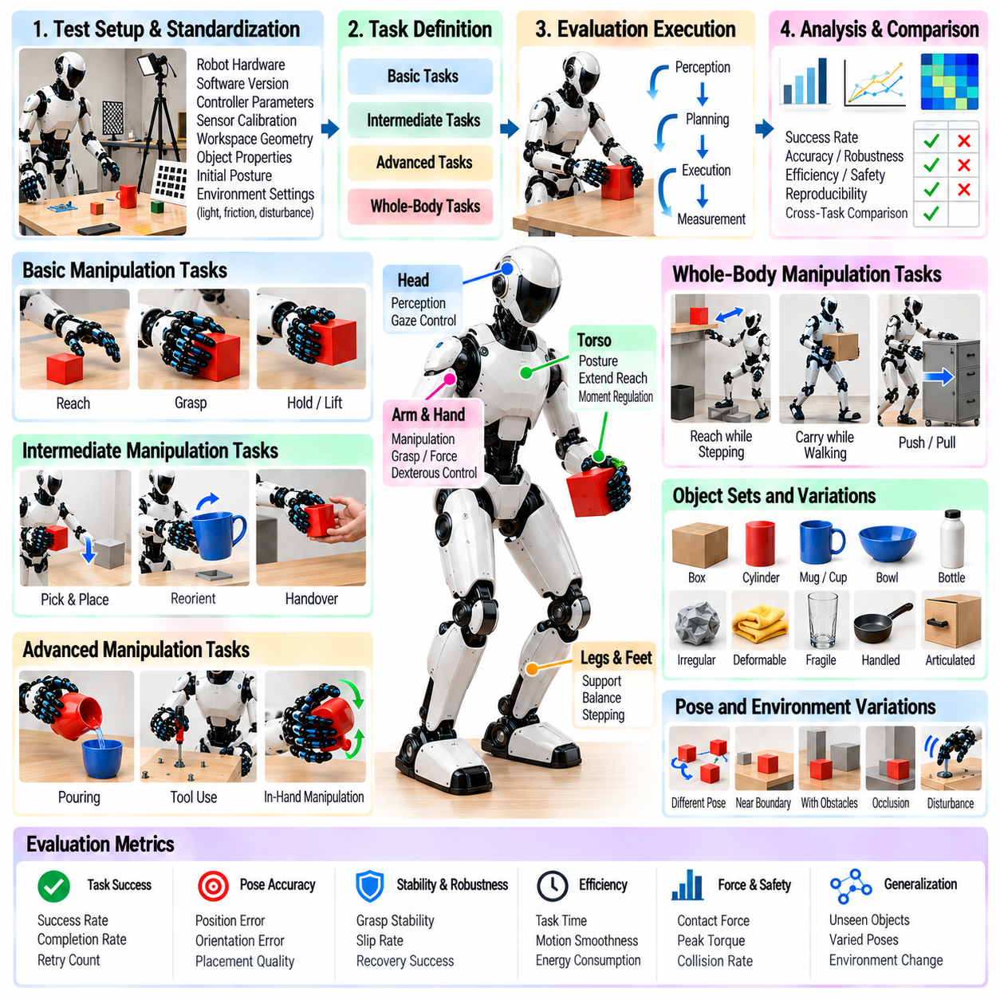{width="7.268055555555556in" height="7.268055555555556in"}

휴머노이드 조작 벤치마크 프로토콜(Humanoid Manipulation Benchmark Protocol)은 대표적인 물리 작업 전반에서 조작 능력이 정확성, 강건성(Robustness), 안전성, 반복성(Repeatability)을 유지하는지를 체계적으로 측정하기 위한 프레임워크를 제공한다. 벤치마크는 단순한 개별 파지 성공 여부를 넘어 인식(Perception), 도달(Reaching), 접촉 형성(Contact Establishment), 정교한 제어(Dexterous Control), 물체 처리(Object Handling), 복구(Recovery), 전신 협응(Whole-Body Coordination)을 실제 시스템의 한계가 드러나는 통제된 변화 조건에서 평가해야 한다.

유용한 벤치마크는 표준화된 시험 조건(Standardized Test Conditions)에서 시작된다. 각 실험 전에 로봇 하드웨어 구성, 소프트웨어 버전, 제어기 파라미터(Controller Parameters), 센서 캘리브레이션(Sensor Calibration), 물체 특성, 작업 공간 기하(Workspace Geometry), 초기 자세를 기록해야 한다. 조명, 표면 마찰(Surface Friction), 물체 배치 허용오차(Object Placement Tolerance), 외부 교란(External Disturbance)과 같은 환경 변수도 명시하여 서로 다른 시스템이나 개발 단계 사이에서 결과를 재현하고 비교할 수 있도록 해야 한다.

조작 평가는 물리적·인지적 난이도가 점진적으로 증가하는 작업군(Task Family)을 중심으로 구성해야 한다. 기본 시험에서는 도달, 파지 획득(Grasp Acquisition), 들어 올리기, 안정적인 유지 능력을 측정할 수 있다. 중간 단계 시험에는 집기 및 놓기(Pick-and-Place), 물체 재지향(Object Reorientation), 물체 전달(Handover), 따르기(Pouring), 도구 사용(Tool Use)을 포함할 수 있다. 고급 시험에서는 양손 협응(Bimanual Coordination), 접촉이 풍부한 작업(Contact-Rich Operation), 페이로드 처리(Payload Handling), 자세 조정이나 보행을 포함하는 통합 전신 조작(Unified Whole-Body Manipulation)을 도입해야 한다.

물체 세트(Object Set)는 단순히 실험실에서 사용하기 편리한 물체 집합이 아니라 의미 있는 변화를 대표해야 한다. 시험 물체는 크기, 형상, 질량, 표면 마찰, 순응성(Compliance), 취약성(Fragility), 파지 어포던스(Grasp Affordance)를 다양하게 구성할 수 있다. 원통형, 상자형, 불규칙형, 관절형(Articulated), 변형 가능형(Deformable), 손잡이가 있는 물체는 서로 다른 시스템 한계를 드러낸다. 벤치마크에서는 개발 과정에서 사용한 물체와 일반화(Generalization) 평가를 위해 별도로 사용하는 미관측 물체(Unseen Object)를 구분해야 한다.

초기 물체 자세(Initial Object Pose) 역시 체계적으로 변화시켜야 한다. 물체는 도달 가능한 작업 공간 내의 서로 다른 위치와 방향에 배치하거나, 작업 공간 경계 가까이, 장애물 주변, 부분적으로 가려진 구성에 배치할 수 있다. 세심하게 준비된 표준 자세(Canonical Pose)에서만 성공하는 조작 시스템은 실제적인 강건성을 충분히 입증하지 못한다. 따라서 자세 무작위화(Pose Randomization)를 통해 인식 오차, 도달 가능성(Reachability), 파지 선택, 계획에 대한 민감도를 측정해야 한다.

집기 성능(Pick Performance)은 인식에서 안정적인 들어 올리기까지의 전체 전환을 평가해야 한다. 성공적인 시험에서는 목표를 검출하고, 실행 가능한 파지를 선택하며, 의도하지 않은 충돌 없이 접근하고, 접촉을 형성한 다음, 물체에 대한 제어를 유지하면서 정의된 높이까지 들어 올려야 한다. 평가 지표에는 획득 성공률(Acquisition Success Rate), 파지 안정성(Grasp Stability), 접근 시간, 재시도 횟수, 의도하지 않은 접촉, 파지 전 물체 변위(Object Displacement), 들어 올리는 동안의 미끄러짐(Slip)이 포함될 수 있다.

배치 평가(Placement Evaluation)는 작업 완료뿐 아니라 최종 구성 정확도(Final Configuration Accuracy)도 측정해야 한다. 로봇은 물체를 목표 영역으로 운반하고, 안정적인 지지를 형성하며, 하중을 지지 표면으로 전달한 후 원하는 자세를 방해하지 않고 물체를 놓아야 한다. 위치 오차(Position Error), 방향 오차(Orientation Error), 배치 성공률, 물체 전도(Object Tipping), 잔류 운동(Residual Motion), 해제 품질(Release Quality), 완료 시간은 계획 정확도와 순응적 접촉 제어(Compliant Contact Control)에 대한 상호 보완적인 정보를 제공한다.

정교한 손 평가(Dexterous Hand Evaluation)는 단순한 평행 그리퍼 파지(Parallel-Jaw Grasping)로 표현할 수 없는 능력을 평가해야 한다. 시험에는 손가락 협응, 제어된 재파지(Regrasping), 구름(Rolling), 미끄럼(Sliding), 손가락 게이팅(Finger Gaiting), 손 내부 물체 회전(Object Rotation)을 포함할 수 있다. 물체 형상과 마찰 조건을 변화시키면서 최종 물체 자세, 의도하지 않은 미끄러짐, 접촉 손실(Contact Loss), 재파지 횟수, 조작 시간, 복구 성공률을 측정해야 한다.

인간 상호작용이 목표 응용 범위에 포함되는 경우 물체 전달 벤치마크(Handover Benchmark)는 로봇-인간 전달(Robot-to-Human Transfer)과 인간-로봇 전달(Human-to-Robot Transfer)을 모두 평가해야 한다. 로봇이 접근 가능한 파지 영역을 제시하고, 상대방의 준비 상태를 감지하며, 상호작용 힘을 조절하고, 적절한 시점에 물체를 해제하는지를 측정해야 한다. 전달 성공률, 최대 힘(Peak Force), 해제 지연(Release Delay), 물체 낙하율(Object Drop Rate), 상대방의 노력(Receiver Effort), 중단된 전달에서의 복구 성능을 통해 상호작용 품질을 평가할 수 있다.

따르기 시험(Pouring Test)은 연속적인 조작과 변화하는 페이로드 동역학(Payload Dynamics)을 평가한다. 로봇은 원액 용기(Source Container)를 파지하고, 수용 용기(Receiving Container)에 정렬하며, 제어된 따르기 궤적(Pouring Trajectory)을 생성하고, 목표한 양이나 상태에서 동작을 종료한 다음 용기를 안전하게 원래 자세로 복귀시켜야 한다. 따르기 정확도(Pouring Accuracy), 유출량(Spill Amount), 궤적 부드러움(Trajectory Smoothness), 잔류 액체 손실, 완료 시간, 파지 안정성, 서로 다른 내용물 수준(Fill Level)에 대한 강건성을 유용한 벤치마크 지표로 사용할 수 있다.

도구 사용 벤치마크(Tool-Use Benchmark)는 로봇이 손, 도구, 목표물 사이의 기능적 관계를 이해하고 제어할 수 있는지를 평가해야 한다. 작업에는 도구의 적절한 영역 파지, 작업 끝단(Working End) 정렬, 접촉 형성, 구속된 작업(Constrained Operation) 수행이 포함될 수 있다. 도구 끝단 자세 오차(Tool-Tip Pose Error), 결합 성공률(Engagement Success), 적용 힘 또는 토크, 의도하지 않은 미끄러짐, 작업 완료 품질, 정렬 실패로부터의 복구 성능을 통해 기능적 조작 능력을 정량화할 수 있다.

접촉이 풍부한 조작(Contact-Rich Manipulation)은 기하학적 궤적 정확도만으로 물리적 상호작용 품질을 설명할 수 없으므로 별도의 평가가 필요하다. 시험에는 누르기(Pressing), 삽입(Inserting), 닦기(Wiping), 돌리기(Turning), 당기기(Pulling), 구속된 미끄럼(Constrained Sliding)을 포함할 수 있다. 프로토콜은 상호작용 힘, 힘 추종 오차(Force Tracking Error), 접촉 안정성, 과도한 힘 발생 사건, 작업 성공률, 작은 기하학적 오프셋(Geometric Offset)에 대한 반응을 기록해야 한다. 이러한 시험은 임피던스 및 힘 제어(Force Control) 성능을 직접 평가한다.

양손 조작(Bimanual Manipulation)은 두 손이 독립된 두 개의 조작기가 아니라 하나의 협응된 시스템으로 동작할 수 있는지를 시험해야 한다. 대표적인 작업으로는 큰 물체 운반, 한 손으로 안정화하면서 다른 손으로 조작하기, 강체 물체에 두 개의 접촉을 유지하는 작업을 사용할 수 있다. 상대적 손 자세 오차(Relative Hand-Pose Error), 내부 힘(Internal Force), 물체 안정성, 동기화(Synchronization), 완료 시간, 접촉 손실을 통해 다중 팔 협응(Multi-Arm Coordination)의 문제를 파악할 수 있다.

전신 조작 벤치마크(Whole-Body Manipulation Benchmark)는 조작이 자세, 균형, 이동과 어떻게 상호작용하는지를 평가해야 한다. 작업에는 일반적인 팔 작업 공간을 넘어서는 도달, 보행 중 페이로드 운반, 물체 밀기 또는 당기기, 보행하면서 조작하기, 큰 물체의 양손 운반(Bimanual Transport)을 포함할 수 있다. 평가 항목에는 균형 여유(Balance Margin), 발 배치(Foot Placement), 손 추종(Hand Tracking), 상호작용 힘, 페이로드 안정성, 복구 행동, 전체 작업 완료 여부가 포함되어야 한다.

강건성 시험(Robustness Testing)은 정상적인 조건의 시험에만 의존하지 않고 의도적으로 조건에 교란을 가해야 한다. 물체 자세 추정에는 통제된 오차를 추가하고, 마찰을 변화시키며, 페이로드 질량을 변경하고, 장애물을 움직이거나, 외력을 이용하여 로봇 또는 물체에 교란을 가할 수 있다. 목적은 불확실성이 증가함에 따라 성능이 어떻게 저하되는지를 확인하는 것이다. 강건한 시스템은 갑작스럽게 실패하는 대신 측정 가능한 동작 범위(Operating Envelope) 내에서 허용 가능한 성능을 유지해야 한다.

일반화 시험(Generalization Test)은 암기된 작업 실행과 재사용 가능한 조작 능력을 구분해야 한다. 이전에 관측하지 않은 물체, 목표 위치, 물체 방향, 도구 크기, 페이로드, 환경 배치(Environmental Layout)를 작업별 재학습 없이 도입할 수 있다. 벤치마크는 익숙한 조건과 새로운 조건 사이의 성능 차이(Performance Gap)를 보고해야 한다. 성능 저하가 작다면 정책이 좁은 작업별 궤적이 아니라 전이 가능한 물리적 구조(Transferable Physical Structure)를 학습했다는 것을 의미한다.

실패 감지(Failure Detection)는 정상적인 작업 성공과 독립적으로 평가해야 한다. 벤치마크에서는 의도적으로 파지 실패(Missed Grasp), 불안정한 접촉, 차단된 궤적(Blocked Trajectory), 물체 미끄러짐, 예상하지 못한 저항, 사용할 수 없는 배치 영역 등을 생성할 수 있다. 시스템은 손상이나 제어 상실이 발생하기 전에 실행이 예상 상태에서 벗어났음을 인식해야 한다. 감지 지연(Detection Latency), 오경보(False Alarm), 실패 미감지(Missed Failure), 상태 추정 신뢰도(State-Estimation Confidence)를 기록할 수 있다.

이후 복구 성능(Recovery Performance)은 실패를 감지한 뒤 로봇이 유용한 상태를 복원할 수 있는지를 측정해야 한다. 파지 실패는 후퇴 및 재파지로 이어질 수 있고, 미끄러짐은 힘 조정 또는 물체 지지 행동을 유발할 수 있다. 과도한 상호작용 힘이 발생하면 후퇴해야 하며, 배치 상태가 불확실하면 지지가 확인될 때까지 파지를 유지해야 한다. 복구 성공률(Recovery Success Rate)과 추가 완료 시간(Additional Completion Time)을 통해 첫 번째 시도의 성공 여부를 넘어 실질적인 자율성을 평가할 수 있다.

안전 평가(Safety Evaluation)는 모든 벤치마크 범주에서 지속적으로 수행되어야 한다. 관련 항목에는 관절 토크(Joint Torque), 액추에이터 하중(Actuator Load), 손끝 힘(Fingertip Force), 손 닫힘 속도(Hand Closing Velocity), 도구 끝단 속도(Tool-Tip Velocity), 충돌 거리(Collision Distance), 외부 상호작용 힘(External Interaction Force), 균형 상태(Balance State), 비상 정지(Emergency Stop) 작동이 포함된다. 정의된 안전 한계를 위반해야만 완료할 수 있는 작업은 성공으로 간주해서는 안 된다. 따라서 안전 관련 사건은 일반적인 작업 성공 지표와 별도로 보고해야 한다.

반복성(Repeatability)을 평가하려면 동일한 정상 조건에서 여러 차례 시험을 수행해야 한다. 가장 성공적인 실행만 보고하면 확률적 실패(Stochastic Failure), 인식 불안정성(Perception Instability), 초기화에 대한 민감도를 숨길 수 있다. 반복 시험을 통해 성공률, 평균 성능, 분산(Variance), 백분위 통계(Percentile Statistics), 실패 분포(Failure Distribution)를 계산해야 한다. 보고된 성능의 신뢰도를 적절하게 해석할 수 있도록 시험 횟수도 명시해야 한다.

벤치마크 로깅(Benchmark Logging)은 시험 이후 원인을 진단할 수 있을 만큼 충분한 정보를 보존해야 한다. 센서 관측, 추정된 물체 상태, 명령 및 측정된 관절 운동, 접촉력, 촉각 신호, 제어기 상태, 정책 출력(Policy Output), 실패 플래그(Failure Flag), 시간 정보를 가능한 한 동기화하여 기록해야 한다. 외부 및 로봇 탑재 카메라 영상도 추가적인 문맥을 제공한다. 구조화된 로그(Structured Log)를 사용하면 실패 원인을 인식, 계획, 제어 또는 하드웨어 한계로 추적할 수 있다.

시간 측정(Timing Measurement)은 인식 지연(Perception Latency), 계획 지연(Planning Latency), 제어 실행(Control Execution), 물리적 작업 시간, 복구 오버헤드(Recovery Overhead)를 구분해야 한다. 시스템이 높은 성공률을 달성하더라도 지나치게 느리다면 실용성이 낮을 수 있으며, 반대로 빠른 시스템이 불안정한 접촉을 대가로 속도를 얻을 수도 있다. 성공률과 시간을 함께 보고하면 이러한 절충 관계(Tradeoff)를 파악할 수 있다. 물리적으로 까다로운 작업에서는 실시간 데드라인 위반(Real-Time Deadline Violation)과 제어 루프 불규칙성(Control-Loop Irregularity)도 기록해야 한다.

비교 평가(Comparative Evaluation)에서는 서로 다른 알고리즘이나 정책 버전을 시험할 때 가능한 한 동일한 작업 정의와 점수 산정 규칙(Scoring Rule)을 사용해야 한다. 인식, 파지 계획, 임피던스 제어, 모방 학습(Imitation Learning), 강화 학습(Reinforcement Learning), 전신 제어(Whole-Body Control)의 변경 사항은 통제된 절제 실험(Ablation)을 통해 평가할 수 있다. 각 비교에서는 가능한 한 적은 요소만 변경하여 성능 향상이 특정 아키텍처 구성요소에 기인하는지를 확인할 수 있도록 해야 한다.

종합 점수(Composite Score)를 사용하여 전체 벤치마크 성능을 요약할 수 있지만 개별 지표는 계속 제공되어야 한다. 성공률, 정확도, 속도, 힘 제어 품질(Force Quality), 강건성, 복구, 안전성을 하나의 수치로 결합하면 시스템 수준 비교가 간단해지지만 중요한 약점을 감출 수 있다. 따라서 프로토콜은 종합 점수와 함께 범주별 결과(Category-Level Result)와 실패 분포를 유지하여 엔지니어링 팀이 실제 제한 요소가 되는 하위 시스템을 식별할 수 있도록 해야 한다.

최종 벤치마크 보고서(Final Benchmark Report)는 시험 구성, 작업 정의, 물체 세트, 환경 조건, 시험 횟수, 평가 지표, 통계 결과, 관측된 실패 모드(Failure Mode), 복구 행동을 문서화해야 한다. 결과에서는 정상 조건 성능(Nominal Performance)과 강건성 및 일반화 시험 결과를 명확하게 구분해야 한다. 이러한 문서화는 벤치마킹을 선택적으로 성공한 사례를 보여주는 데모(Demonstration)가 아니라 반복 가능한 검증 프로세스(Repeatable Validation Process)로 전환한다.

궁극적으로 휴머노이드 조작 벤치마크 프로토콜은 인식, 접촉, 물체, 몸체 구성이 변화하더라도 조작 기술이 신뢰할 수 있는 수준을 유지하는지를 판단해야 한다. 표준화된 집기, 놓기, 정교한 조작, 물체 전달, 따르기, 도구 사용, 양손 상호작용, 전신 작업을 강건성, 복구, 안전 시험과 결합함으로써 벤치마크는 실제 환경의 휴머노이드 조작(Real-World Humanoid Manipulation)에 대한 준비 수준을 통합적으로 측정할 수 있다.
