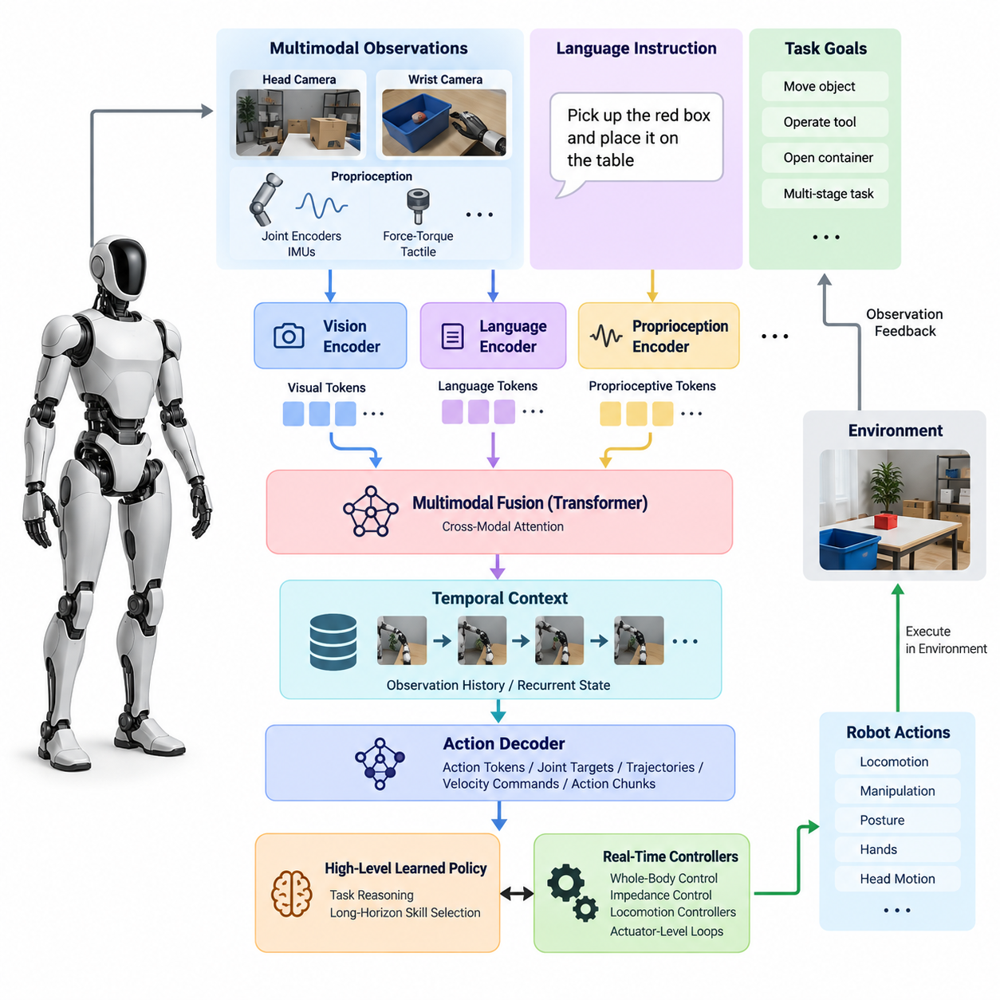
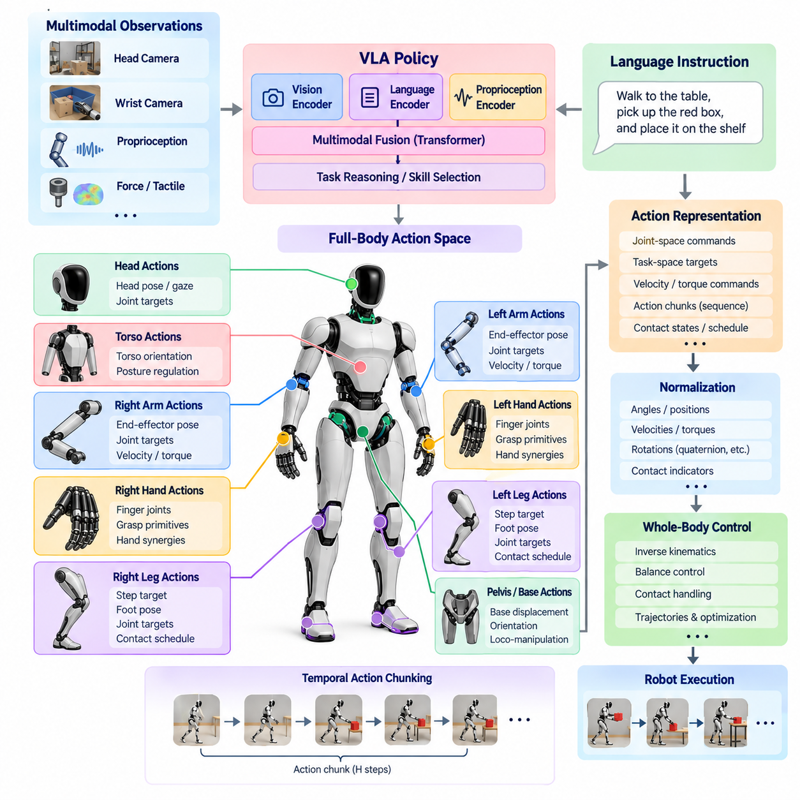
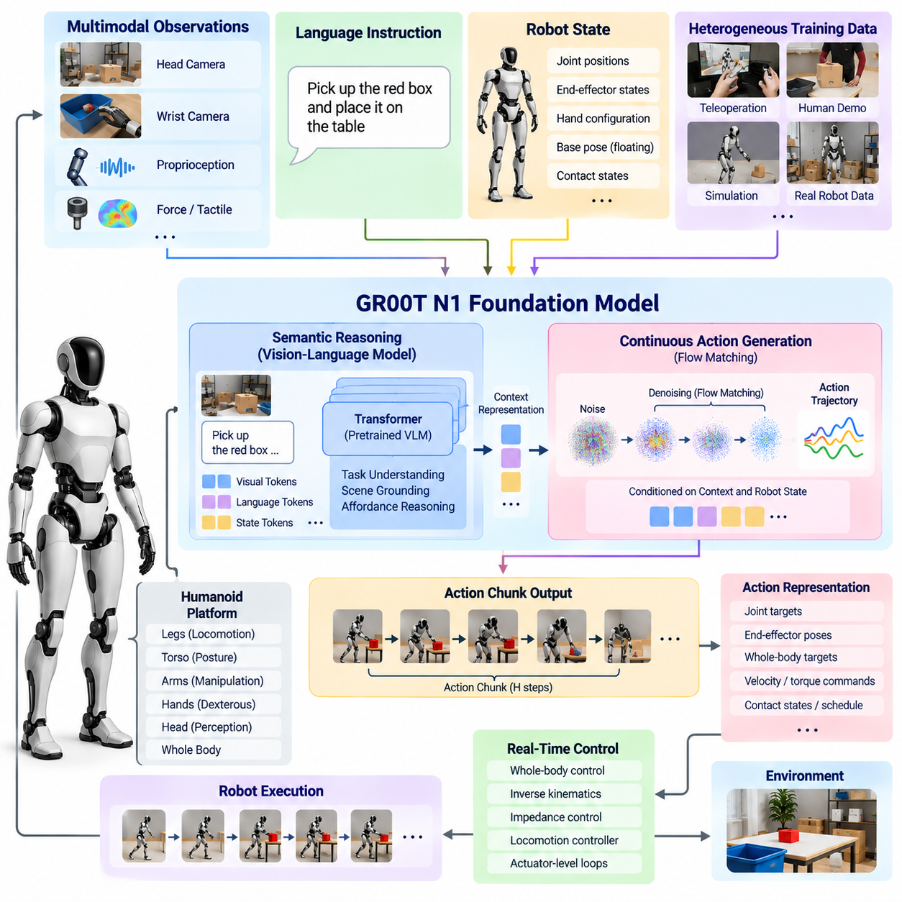
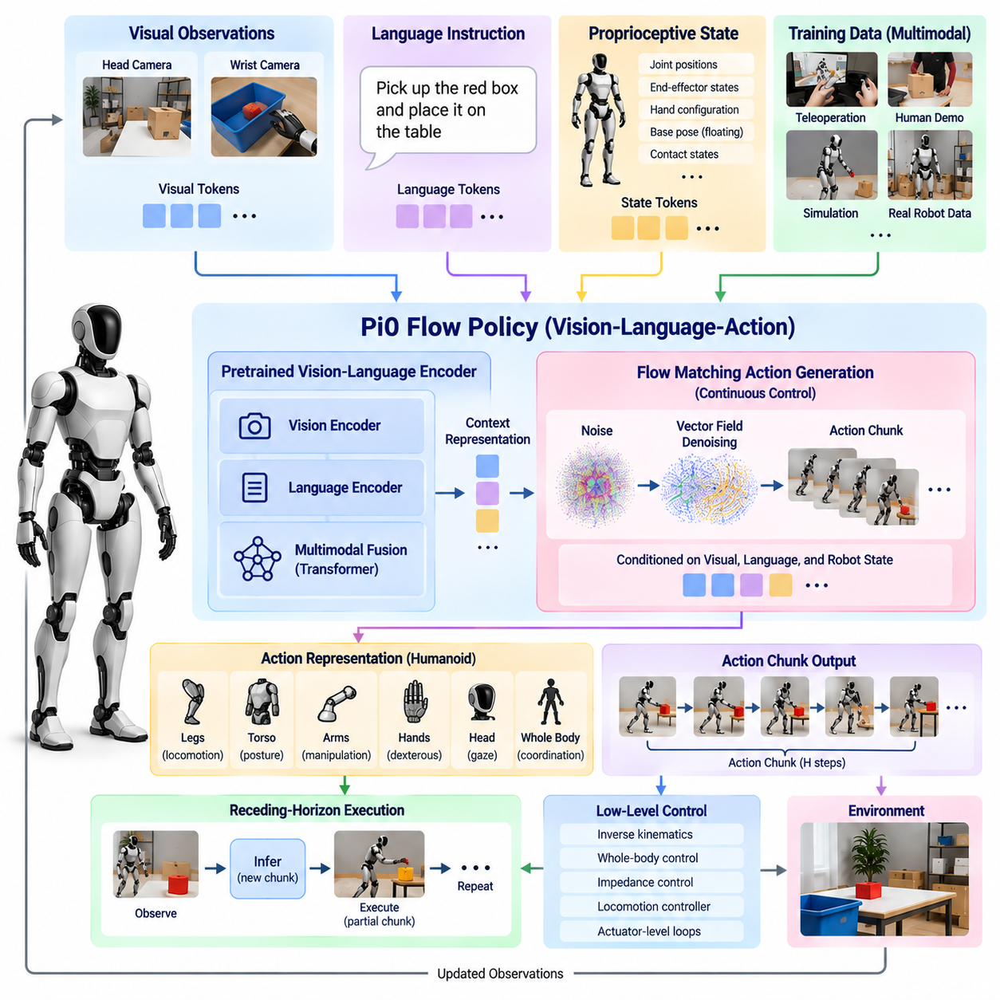
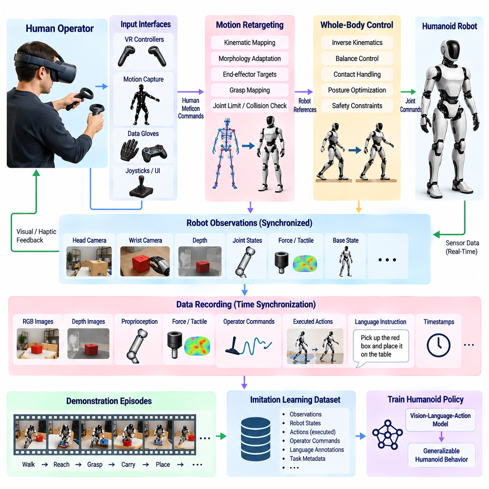
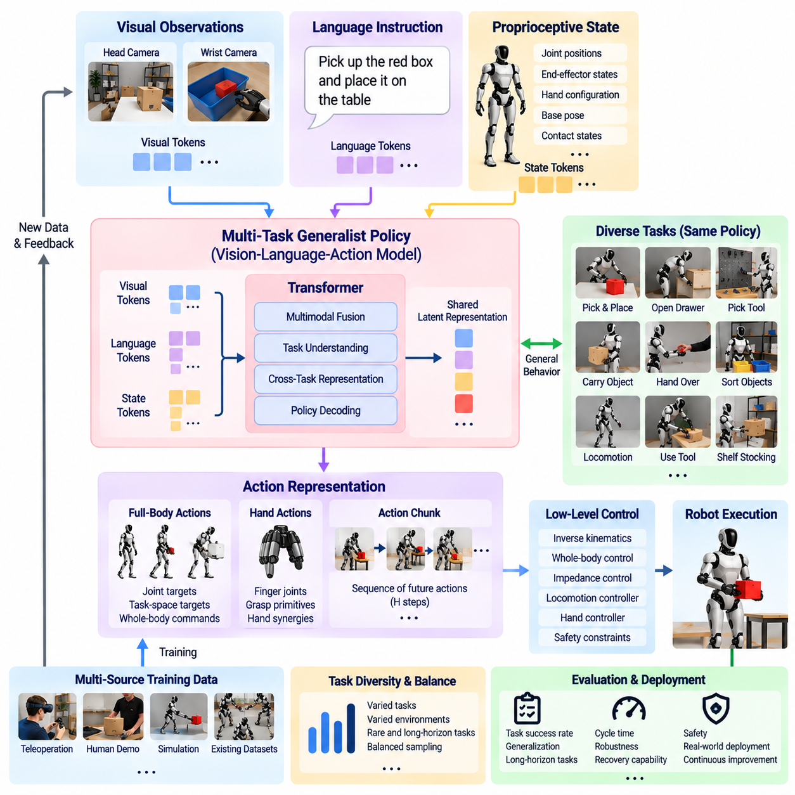
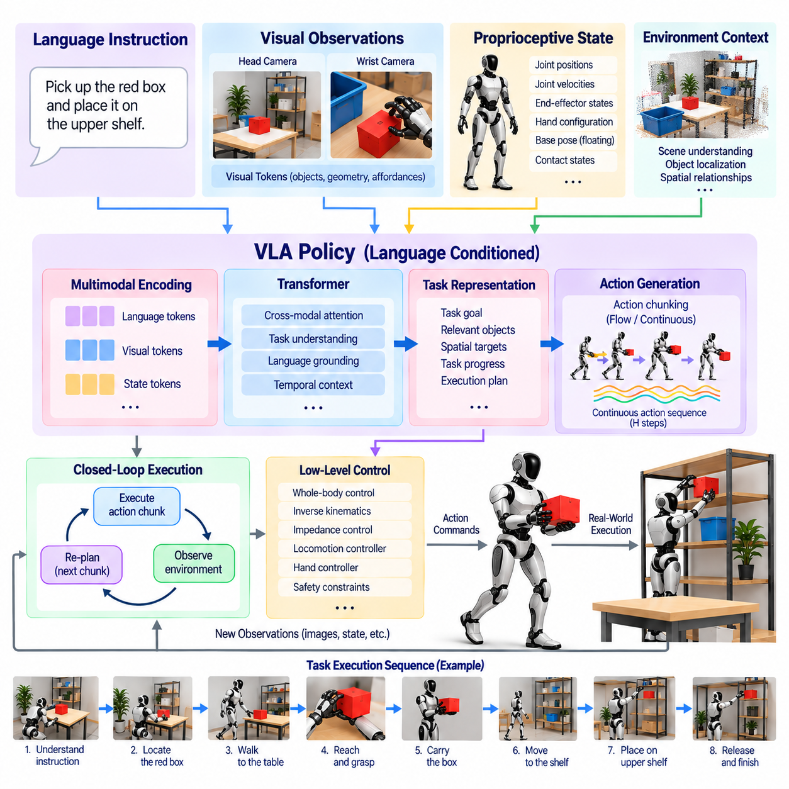
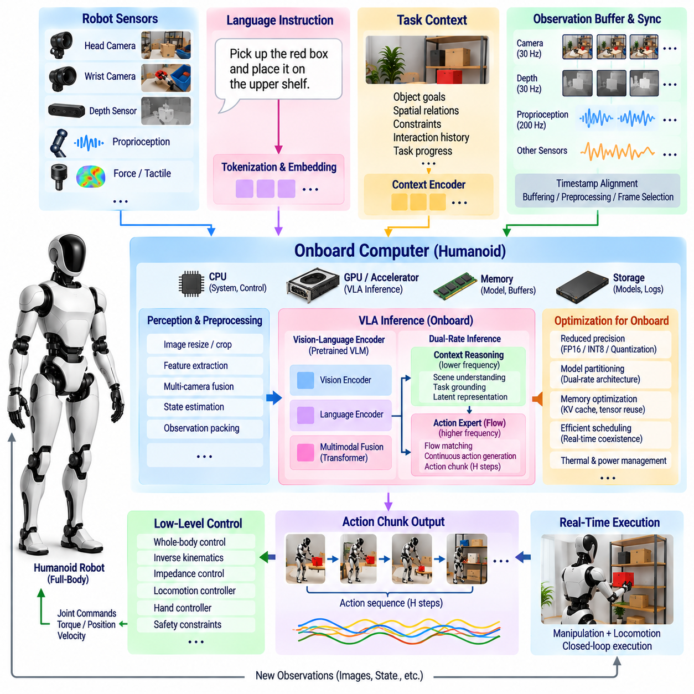
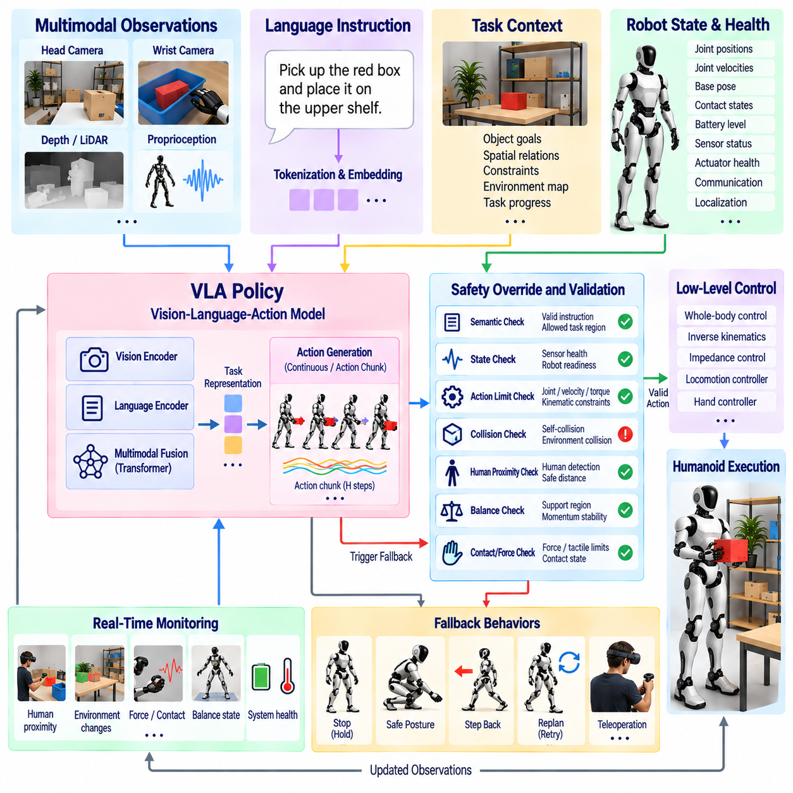
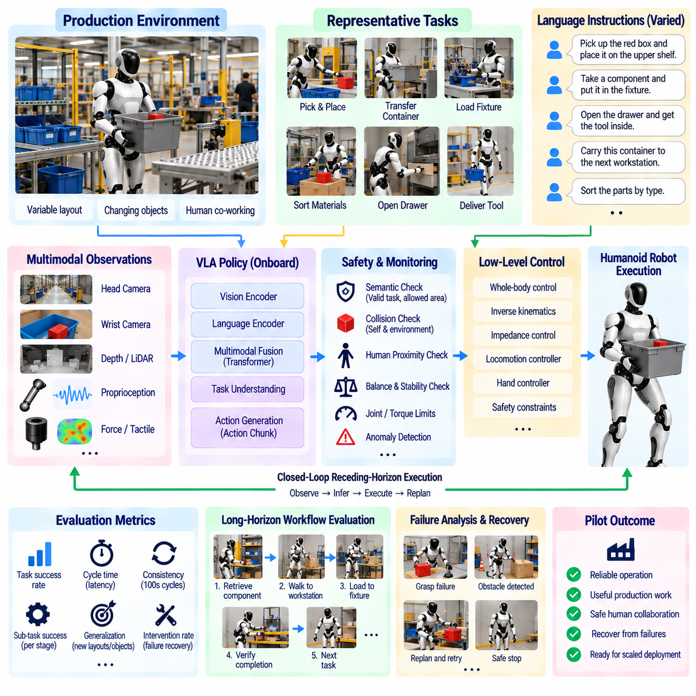

**Volume 22. Humanoid Robot Software**

# Chapter 08. Humanoid VLA and Generalist Policies

## 08.01. Humanoid VLA System Architecture Overview

{width="7.268055555555556in" height="7.268055555555556in"}

A humanoid Vision-Language-Action system connects multimodal perception, language understanding, task reasoning, and physical control within a unified embodied intelligence architecture. Unlike conventional robotic pipelines that separate perception, planning, and control into independently engineered modules, a VLA system learns relationships between observations, instructions, and actions from large-scale multimodal robot data. The resulting policy can interpret human intent while grounding decisions in the robot's current physical environment.

The architecture begins with multimodal observations collected from the humanoid platform. Head cameras provide an egocentric representation of the surrounding workspace, while wrist cameras offer detailed views of objects during manipulation. Joint encoders, IMUs, force-torque sensors, tactile sensors, and other proprioceptive channels describe the robot's body state. Language instructions provide semantic goals such as moving an object, operating a tool, opening a container, or completing a multi-stage task.

Because humanoids possess many actuated joints and interact through their entire body, the VLA observation representation must extend beyond ordinary image-language inputs. Visual tokens may describe objects, geometry, people, and scene context, while proprioceptive tokens encode joint positions, velocities, contact states, and body configuration. These heterogeneous observations are transformed into latent representations that allow the policy to associate semantic concepts with physically reachable states and executable behaviors.

A vision encoder converts camera observations into compact visual features representing objects, spatial relationships, surfaces, affordances, and task-relevant scene structure. Modern systems may use pretrained vision transformers or vision-language encoders so that previously unseen objects can be recognized through semantic similarity rather than fixed object classes. For humanoids, visual encoding must remain sensitive to spatial relationships because locomotion, reaching, grasping, and whole-body interaction depend directly on geometry and relative pose.

Language processing provides the semantic interface between human goals and robot behavior. Natural-language instructions are tokenized and mapped into representations that express objects, actions, constraints, destinations, and task relationships. Rather than translating every command into manually programmed robot states, a generalist policy learns associations between language and demonstrated physical behaviors. Language therefore acts as a flexible conditioning signal that can select or compose behaviors from a shared policy representation.

The multimodal fusion stage combines vision, language, proprioception, and potentially force or tactile information. Transformer-based architectures are particularly suitable because attention mechanisms can dynamically establish relationships among tokens originating from different modalities. A command referring to a particular object can attend to the corresponding visual region, while the predicted manipulation behavior can simultaneously depend on arm configuration, hand state, balance condition, and recent observation history.

Temporal context is essential because humanoid tasks cannot normally be solved from a single observation. Walking toward an object, grasping it, carrying it, and placing it elsewhere forms a sequence whose current action depends on previous observations and actions. The VLA model therefore processes observation histories, recurrent state representations, or temporally organized token sequences. This enables the policy to infer task progress and maintain behavioral continuity even when objects become temporarily occluded or the robot changes viewpoint.

The action decoder transforms the learned multimodal representation into robot commands. Depending on the architecture, outputs may be discrete action tokens, continuous joint targets, end-effector trajectories, velocity commands, action chunks, or latent commands interpreted by downstream controllers. Humanoid systems require particularly careful action-space design because locomotion, manipulation, posture, hands, and head motion may need to operate simultaneously while respecting balance, contact, torque, and kinematic constraints.

A practical architecture separates high-level learned intelligence from deterministic real-time stabilization. The VLA policy may determine what motion or skill should be executed over a relatively long horizon, while whole-body control, impedance control, locomotion controllers, and actuator-level loops enforce the command at substantially higher frequencies. This separation prevents a large neural policy from being responsible for every millisecond-scale stabilization decision and allows conventional control theory to preserve dynamically feasible physical behavior.

Action chunking provides another useful abstraction between semantic reasoning and continuous control. Instead of predicting only the next instantaneous motor command, the policy can generate a short sequence of coordinated actions covering a meaningful temporal interval. Chunked prediction reduces repeated inference requirements and can improve temporal consistency during manipulation. The execution layer can monitor these commands and request replanning when environmental conditions diverge from the state assumed by the predicted action sequence.

A generalist humanoid policy differs from a collection of isolated task-specific policies because many tasks share the same internal representation and action model. Picking, carrying, opening, placing, tool use, and bimanual manipulation can be learned from heterogeneous demonstrations within one model. Shared representations allow knowledge obtained from one task to influence another, creating the possibility of compositional generalization rather than requiring a separately engineered perception and control pipeline for every new application.

Training such systems requires synchronized trajectories containing observations, instructions, robot states, and actions. Teleoperation and human demonstrations are especially important because they provide examples of coordinated whole-body behavior that would be difficult to specify manually. Simulation, autonomous rollouts, synthetic variation, and curated real-world demonstrations can supplement these datasets. The broader software structure explicitly places teleoperation data collection, multi-task policies, language-conditioned execution, and onboard VLA inference within the humanoid VLA chapter.

The VLA model should not directly replace the robot's safety architecture. Predicted actions must pass through validation layers that check joint limits, workspace constraints, collision conditions, balance margins, contact forces, velocity limits, and other platform-specific requirements. A safety supervisor can reject unsafe commands, modify requested motion, stop execution, or transfer authority to a fallback controller. Learned autonomy is therefore bounded by deterministic mechanisms whose behavior can be independently tested and verified.

Onboard deployment introduces a further architectural boundary between model capability and real-time feasibility. Large multimodal models require substantial GPU or accelerator resources, while humanoid control systems must maintain predictable latency. Practical implementations can separate high-rate control computers from AI inference computers and exchange compact observations, commands, and health information through controlled interfaces. This arrangement reflects the broader humanoid system architecture, which distinguishes real-time control and AI inference computing.

Inference latency also determines how the policy interacts with a changing physical world. If perception, reasoning, and action generation require too much time, the robot may act on outdated observations. Efficient vision encoders, reduced token counts, quantized models, cached representations, action chunking, and asynchronous execution can therefore be as important as model accuracy. Fast reflexive controllers continue operating locally while slower semantic inference updates goals or action segments whenever new decisions become necessary.

The complete humanoid VLA architecture can consequently be viewed as a hierarchy connecting semantic intelligence to physical execution. Multimodal sensors describe the environment and body, representation models transform observations into shared latent states, language provides task intent, a generalist policy predicts coordinated actions, and conventional control layers realize those actions on the physical platform. Feedback continuously returns new visual, proprioceptive, force, and execution information to the policy.

This closed-loop organization transforms the VLA model from a passive multimodal predictor into an embodied policy. Every generated action changes the physical environment and therefore changes the observations used for subsequent decisions. Successful operation depends not only on recognizing scenes or understanding language, but also on maintaining stable perception-action feedback under uncertainty, disturbances, partial observability, contact events, and execution errors. The robot must repeatedly observe, infer, act, evaluate the result, and adapt its next action.

Ultimately, a humanoid VLA system provides the intelligence bridge between general semantic commands and coordinated physical behavior. Its architecture combines foundation-model representations with robot-specific state, action, control, and safety interfaces rather than treating the foundation model as the entire robot controller. This layered design creates a practical path toward humanoids that can reuse learned knowledge across tasks while retaining the deterministic control, monitoring, and safety mechanisms required for reliable deployment.

## 08.02. Full Body Action Space for Humanoid VLA [w/Code]

{width="7.268055555555556in" height="7.268055555555556in"}

A full-body action space defines how a humanoid Vision-Language-Action model represents and generates physical behavior across the entire robot. Unlike a fixed manipulator whose actions may be described primarily through one end-effector, a humanoid must coordinate legs, torso, arms, hands, head, and contacts. The action representation therefore becomes a central interface connecting generalist policy inference with locomotion, manipulation, posture regulation, and whole-body control.

The most direct action representation uses joint-space commands covering the robot's actuated degrees of freedom. A policy may predict joint positions, position increments, velocities, torques, or combinations of these quantities. Joint-space representations provide a close connection to the physical mechanism, but their dimensionality grows rapidly for humanoids with dexterous hands. They can also make learning difficult because semantically simple tasks may require coordinated changes across many joints.

Task-space actions provide a more structured alternative by describing desired motion through physically meaningful quantities. The VLA policy can predict target poses or pose increments for the left hand, right hand, pelvis, torso, head, or feet instead of directly controlling every joint. A downstream inverse-kinematics or whole-body controller then converts these targets into feasible joint commands while respecting kinematic limits, contacts, balance requirements, and collision constraints.

Humanoid behavior frequently requires locomotion and manipulation to occur within the same action representation. Reaching an object may first require walking toward it, repositioning the pelvis, rotating the torso, extending an arm, and finally controlling the hand. Treating these behaviors as unrelated policies creates difficult transition boundaries. A unified full-body action space allows the generalist policy to express coordinated loco-manipulation behaviors in which mobility and manipulation are components of one physical objective.

The floating-base state creates an important distinction between humanoid and fixed-base manipulation. The robot's base is not rigidly attached to the environment, and its position and orientation evolve through contact forces generated at the feet or other support surfaces. A VLA policy therefore cannot treat base motion as an ordinary independently actuated variable. Desired base displacement must ultimately be realized through dynamically feasible contact transitions, stepping motions, momentum regulation, and whole-body control.

Contact is consequently part of the semantics of the action space. Humanoid tasks involve making, maintaining, and releasing contacts with the feet, hands, knees, or other body regions. An action representation may contain explicit contact states, predicted contact schedules, support-foot selections, or implicit contact behavior learned from demonstrations. Correct contact reasoning is essential because an otherwise plausible geometric motion can become physically impossible when the required support configuration is unavailable.

The hands introduce another major increase in action dimensionality. Dexterous humanoids may possess multiple independently controlled finger joints, making direct full-body prediction computationally expensive and statistically difficult to learn. Practical VLA architectures can represent hand actions through reduced coordinates, grasp primitives, synergies, latent hand states, or lower-frequency finger commands. These abstractions preserve useful dexterity while preventing finger-level control from overwhelming the higher-level action representation.

Temporal abstraction is equally important for full-body action generation. Instead of predicting one instantaneous command at every inference step, the VLA model can generate an action chunk containing a sequence of future targets. A chunk may represent several arm waypoints, coordinated body motion, or a short manipulation segment. This approach provides smoother temporal structure and reduces inference frequency while allowing the lower-level control system to interpolate and stabilize motion between policy updates.

Action normalization is necessary when heterogeneous robot variables share one learning architecture. Joint angles, Cartesian positions, rotations, velocities, gripper states, and contact indicators occupy different numerical ranges and physical units. Training becomes more stable when these variables are normalized into comparable representations. The normalization procedure must remain consistent between dataset construction, training, inference, and deployment because even small representation mismatches can produce physically significant execution errors.

Rotation requires particular care because orientation cannot always be treated like ordinary Euclidean coordinates. Euler angles can introduce discontinuities and singularities, while quaternions require normalization and contain equivalent representations. Rotation matrices or continuous rotation representations may provide alternatives depending on the learning architecture. The selected representation should support stable optimization while remaining compatible with the downstream kinematics and whole-body control framework used by the humanoid.

A generalist policy also benefits from separating semantic action intent from high-frequency actuator execution. The VLA layer can predict goals such as hand displacement, body motion, grasp state, or locomotion direction, while a whole-body controller solves the detailed coordination problem. Operational-space control, hierarchical optimization, and whole-body quadratic programming can enforce task priorities and physical constraints beneath the learned policy, consistent with the volume's earlier treatment of humanoid whole-body control.

Hierarchical action spaces can further divide decisions according to temporal and physical scale. A higher layer may select navigation, reaching, grasping, carrying, or placement objectives, while an intermediate policy produces coordinated full-body references. Fast controllers then regulate joint torque, impedance, contact forces, and balance. Such hierarchy does not eliminate end-to-end learning; instead, it defines interfaces where learned generalization can coexist with deterministic mechanisms required for stable physical execution.

The action space must also accommodate bimanual coordination. Many human-oriented environments contain tasks that require one hand to stabilize an object while the other manipulates it, or both hands to carry a large payload. Independent left- and right-arm commands can produce conflicting motions unless the policy understands their shared objective. Coupled action representations allow both end-effectors, torso configuration, and support posture to be generated as components of a single coordinated behavior.

Whole-body actions are constrained by balance and momentum. Moving a heavy object, extending both arms, or accelerating the torso changes the center of mass and angular momentum of the complete robot-object system. The policy may learn some of these relationships from demonstrations, but execution should still be supervised by balance-aware control. Desired actions can be projected into feasible regions or modified when they violate support, friction, torque, momentum, or stability constraints.

Safety filtering therefore forms the final boundary of the learned action space. Before commands reach the physical robot, the system should evaluate joint limits, self-collision, environmental collision, velocity and acceleration bounds, actuator capability, contact feasibility, and stability conditions. Unsafe predictions can be clipped, projected, rejected, or replaced by a predefined fallback behavior. This enables expressive learned policies without granting unrestricted authority over safety-critical actuator commands.

Cross-platform generalization introduces an additional challenge because humanoids differ in morphology, joint count, limb proportions, actuator limits, and hand design. A raw joint vector learned for one robot cannot automatically control another. More transferable action representations can use embodiment descriptors, normalized task-space targets, semantic body-part definitions, or robot-specific action adapters. The generalist model can then share high-level behavioral knowledge while embodiment-specific layers translate predictions into commands appropriate for each platform.

Training data must use the same action semantics expected during inference. Teleoperation trajectories, motion-capture retargeting, simulation demonstrations, autonomous rollouts, and human-generated examples should therefore be converted into a canonical action representation before model training. Accurate timestamps and synchronization between images, proprioception, language, and actions are especially important because temporal misalignment can teach the model incorrect relationships between observed events and the movements that produced them.

The full-body action space ultimately determines what a humanoid VLA model is capable of learning and expressing. An overly low-level representation creates a difficult high-dimensional prediction problem, while an excessively abstract representation can prevent the policy from exploiting the physical versatility of the humanoid body. Effective systems therefore combine semantically meaningful action variables with embodiment-aware control interfaces, temporal abstraction, contact reasoning, and deterministic feasibility constraints.

A well-designed full-body action space turns language-conditioned intent into coordinated physical behavior without forcing the foundation model to solve every actuator-level problem directly. It provides a structured bridge from multimodal reasoning to walking, reaching, grasping, bimanual manipulation, posture adjustment, and contact interaction. Through this interface, the VLA policy can remain general across diverse tasks while specialized real-time controllers preserve balance, dynamic feasibility, precision, and safety during physical execution.

## 08.03. GR00T N1 Foundation Model Architecture [w/Code]

{width="7.268055555555556in" height="7.268055555555556in"}

GR00T N1 is a foundation model architecture designed to support general-purpose humanoid robot behavior by connecting multimodal understanding with continuous physical action generation. Within a humanoid VLA stack, it represents a transition from separately trained task policies toward a shared model that can interpret visual observations, language instructions, and robot state while producing actions applicable across manipulation and embodied interaction tasks.

A central architectural idea is the separation of semantic reasoning from precise motor generation. High-level reasoning must understand what the robot observes, what the instruction means, and which aspects of the scene are relevant to the requested task. Motor generation must then translate this understanding into temporally coherent continuous actions. Separating these functions allows large pretrained representations to contribute semantic knowledge without requiring the same network pathway to solve every low-level control detail.

The semantic component processes multimodal context such as natural-language commands, camera observations, and task-related visual information. A vision-language representation provides knowledge about objects, relationships, affordances, and instructions, allowing the model to associate linguistic concepts with elements of the physical scene. For a humanoid, this grounding is important because commands such as picking, placing, handing over, or rearranging objects must ultimately refer to specific entities and spatial relationships.

Robot state information complements vision and language by describing the current embodiment configuration. Joint positions, end-effector states, hand configuration, and other proprioceptive variables indicate what actions are physically relevant from the current state. The architecture therefore reasons over both external observations and internal robot state rather than treating visual understanding as sufficient for action. This coupling converts multimodal semantic representations into embodiment-conditioned physical decisions.

GR00T N1 uses a dual-system perspective in which slower semantic processing and faster action generation perform complementary roles. The reasoning pathway provides contextual representations describing the task and environment, while the action pathway generates continuous robot behavior conditioned on this context. This resembles the broader principle of combining deliberative intelligence with rapid sensorimotor execution, although both components remain integrated within a learned foundation-model framework.

The action-generation component is designed for continuous control rather than ordinary text-token prediction. Physical robot trajectories contain strongly correlated values across joints and across time, so predicting actions requires a representation suited to continuous multidimensional signals. Flow-based action generation provides a mechanism for transforming an initially simple action distribution toward trajectories consistent with the multimodal context, demonstrations, and current state of the robot.

Flow matching can be interpreted as learning a vector field that progressively transforms noisy action samples into structured robot actions. During training, the model learns how action trajectories should evolve toward demonstrated behavior under particular observations and instructions. During inference, this learned transformation generates continuous action sequences rather than selecting only from a small predefined action vocabulary. This is especially useful for manipulation where precise trajectories contain substantial continuous variation.

The resulting action output is naturally compatible with action chunking. Instead of generating only one control value and immediately repeating the complete foundation-model inference process, the policy can predict a short horizon of coordinated future actions. Action chunks preserve temporal relationships between successive movements and reduce the effective inference burden. A robot can execute part of the predicted sequence while preparing subsequent observations and policy updates.

For humanoids, the action representation may include coordinated arm, hand, torso, or other embodiment-specific variables depending on the training configuration and target platform. The foundation model should not be interpreted as eliminating robot-specific interfaces. Different humanoids have different kinematics, joint arrangements, actuator limits, sensing configurations, and control conventions, so adaptation layers and embodiment-specific preprocessing remain important when transferring shared learned capabilities to physical platforms.

Training a generalist humanoid model requires heterogeneous robot experience rather than a single narrowly defined dataset. Demonstrations can originate from teleoperation, human demonstrations transformed into robot-compatible trajectories, simulation, existing robot datasets, or platform-specific collection. The purpose of combining diverse experience is to expose the model to variations in objects, environments, instructions, embodiments, and task sequences so that shared behavioral structure can emerge across individual demonstrations.

Data standardization becomes critical when multiple robots contribute to foundation-model training. Camera layouts, control rates, action dimensions, coordinate frames, joint conventions, and episode formats can differ substantially. Training pipelines therefore require transformations that align observations and actions into model-compatible representations while preserving embodiment-specific information where necessary. Poor alignment can cause a large dataset to become less useful despite its apparent scale.

Simulation and synthetic data can extend the distribution of experiences available to the model. A humanoid can encounter variations in object position, lighting, scene arrangement, camera viewpoint, and task configuration without requiring every example to be collected manually on physical hardware. Simulation also enables repeated generation of difficult or rare scenarios. Real-world demonstrations remain necessary because contact behavior, sensor characteristics, actuator response, and environmental uncertainty are difficult to reproduce perfectly.

Another important capability of the foundation-model approach is transfer from broad pretraining to platform-specific adaptation. A pretrained model can provide general visual-language understanding and reusable manipulation knowledge, while smaller adaptation stages specialize the policy for a particular humanoid, sensor arrangement, action representation, or operational domain. This reduces the requirement to learn every behavior from the beginning whenever a new robot platform or application is introduced.

Post-training can further adapt the model to behaviors that are underrepresented in the broad pretraining distribution. A manufacturing humanoid may require repeated insertion, handling, and tool interaction, while a logistics humanoid may emphasize picking, carrying, sorting, and placement. The same foundation representation can therefore support different operational profiles when appropriate demonstrations and adaptation procedures are provided, although successful transfer still depends on sufficient coverage of the target physical behavior.

The architecture must remain connected to conventional humanoid control. Foundation-model outputs generally operate above the fastest actuator loops, while real-time controllers regulate joint motion, impedance, balance, and contact. Whole-body control can translate learned action references into dynamically feasible commands and resolve conflicts among manipulation, posture, and support requirements. This prevents semantic intelligence and motor learning from replacing mechanisms that must execute with deterministic timing.

Safety likewise remains outside unrestricted policy authority. Generated actions should be checked against joint limits, collision constraints, workspace boundaries, velocity limits, force limits, balance conditions, and operational safety rules. If the learned policy proposes an invalid action, a supervisory layer can modify, reject, or terminate execution. Foundation-model generality therefore expands the behavioral envelope of the humanoid without removing the need for deterministic safety enforcement.

Onboard inference creates practical constraints on model size, memory bandwidth, accelerator utilization, and latency. Semantic processing can be computationally expensive, while physical interaction requires timely responses to environmental change. Efficient deployment may use optimized inference engines, reduced precision, cached multimodal features, asynchronous pipelines, and action chunks. The system architecture must balance model capability against the requirement that the robot continuously perceive and respond to the physical world.

The dual-system structure is valuable in this context because semantic reasoning and action generation do not necessarily require identical update frequencies. Scene interpretation and language context can remain stable for multiple control intervals, while motor actions require more frequent updates. Reusing semantic representations while repeatedly generating or executing short action segments can reduce unnecessary computation and provide a more practical interface between large multimodal intelligence and real-time robotic behavior.

Evaluation must examine more than whether the model reproduces demonstration trajectories. A generalist humanoid policy should be tested for task success, robustness to changed object positions, response to unfamiliar instructions, recovery from execution variation, temporal consistency, and transfer across environments. Safety violations and failure modes must also be measured explicitly because increasing generality expands the range of situations in which unexpected model behavior can occur.

GR00T N1 consequently illustrates an important direction for humanoid VLA systems: semantic multimodal intelligence and continuous action generation can be trained as complementary parts of a reusable robot foundation model. The architecture provides a path from vision, language, and proprioceptive context to temporally structured physical behavior while retaining interfaces for embodiment adaptation, real-time control, and safety supervision.

In a broader humanoid software stack, such a foundation model functions as a learned generalist policy layer rather than the entire control system. Perception supplies multimodal observations, the foundation model interprets context and generates actions, whole-body controllers enforce physical feasibility, and safety mechanisms supervise execution. This layered integration enables broad learned capabilities to coexist with the deterministic control infrastructure required for reliable humanoid operation.

## 08.04. Pi0 Flow Policy for Humanoid Tasks [w/Code]

{width="7.268055555555556in" height="7.268055555555556in"}

Pi0 is a Vision-Language-Action policy architecture designed to convert multimodal observations and natural-language instructions into continuous robot actions. Its importance for humanoid robotics comes from treating manipulation as a general conditional generation problem rather than a collection of individually programmed skills. Visual observations describe the physical scene, language specifies the intended task, and robot state provides embodiment context from which coordinated actions can be generated.

A defining characteristic of Pi0 is the use of flow matching for continuous action generation. Conventional autoregressive models often represent actions as discrete tokens and predict them sequentially, but physical robot commands naturally exist in continuous, high-dimensional spaces. Flow matching instead learns a continuous transformation from a simple noisy distribution toward action trajectories that resemble demonstrated robot behavior under the current visual, linguistic, and proprioceptive context.

The flow model can be understood as learning a velocity field over possible action trajectories. During training, noisy action samples are associated with target demonstrations, and the network learns the direction in which those samples should evolve to approach valid actions. During inference, numerical integration follows the learned field from noise toward a structured action sequence. This formulation allows the policy to model complex continuous behaviors without reducing every motor variable to a discrete vocabulary.

This property is particularly relevant to humanoids because their action spaces can contain many continuously valued variables. Arm joints, wrist orientation, hand configuration, torso motion, and other controlled quantities must change smoothly and coherently. Discretizing these variables too aggressively can reduce precision, while independently predicting each value can ignore important correlations. A flow-based policy can represent joint distributions across multiple action dimensions and multiple future time steps.

Pi0 combines a pretrained vision-language representation with an action-generating expert specialized for physical control. The vision-language component provides semantic features associated with objects, scene relationships, and instructions, while the action component conditions on these features to generate robot motion. This division enables knowledge from large-scale multimodal pretraining to support physical tasks while preserving an action pathway designed specifically for continuous control rather than text generation.

Visual observations provide the policy with information about objects, geometry, task progress, and environmental changes. Multiple camera views can be used when available, allowing external or head-mounted observations to describe the broader scene while wrist-mounted cameras provide detailed manipulation information. The visual representation must retain features relevant to physical interaction because recognizing an object is insufficient if the policy cannot determine where and how the robot should interact with it.

Language acts as a flexible task-conditioning mechanism. Instead of selecting a separately trained controller for every behavior, the user can describe a goal using natural language, and the multimodal model relates the instruction to relevant visual evidence and learned demonstrations. Commands involving picking, placing, opening, folding, transferring, or arranging objects can therefore share a common policy representation while differing in their linguistic context and observed scene state.

Proprioceptive state provides the embodiment information required to transform semantic intent into feasible motion. The same visual instruction can require different actions depending on current arm position, hand configuration, or previous movement. Joint states and other robot variables therefore condition the action expert together with vision and language. This closes the gap between understanding what should happen and determining what motion should occur from the robot's present configuration.

Rather than producing only one instantaneous command, Pi0 can predict an action chunk containing multiple future action steps. Action chunking captures short-term temporal structure and allows correlated movements to be generated together. For manipulation, this is valuable because reaching, approaching, grasping, and moving an object require smooth transitions. The robot can execute a portion of the chunk and then obtain new observations before generating another sequence.

Receding-horizon execution can use these action chunks in a closed perception-action loop. The policy observes the environment, predicts a future action segment, executes an appropriate portion, and then performs inference again using updated sensory information. This approach prevents a long open-loop prediction from determining the complete task. Environmental changes, execution errors, and object motion can instead influence subsequent policy decisions through repeated observation and replanning.

For humanoid tasks, Pi0 should be integrated with an appropriate full-body action representation rather than interpreted as an unrestricted actuator controller. Manipulation outputs may describe arms, hands, or task-space targets, while locomotion and balance remain coordinated through specialized control layers. If torso or whole-body motion is included in the learned action space, downstream control must still ensure that the requested motion remains compatible with support contacts and dynamic stability.

A whole-body controller can therefore serve as the execution interface between the flow policy and the humanoid mechanism. Learned action references are converted into joint-level commands while respecting kinematics, contact constraints, balance, actuator limits, and task priorities. This architecture preserves the generalization benefits of the VLA policy while allowing deterministic controllers to solve fast stabilization problems that are poorly suited to large multimodal inference loops.

The quality of a flow policy depends strongly on the diversity and consistency of its training data. Demonstrations must align images, language instructions, robot states, and actions accurately in time. Heterogeneous robot datasets can broaden behavioral coverage, but differences in action definitions, coordinate systems, camera configurations, and embodiment must be normalized or explicitly represented. Dataset scale alone cannot compensate for inconsistent action semantics or incorrect temporal alignment.

Cross-embodiment training is attractive because many manipulation concepts are shared across different robots. Reaching toward an object, closing a gripper, moving an item to a destination, or performing coordinated bimanual behavior contains reusable structure even when robot morphology differs. However, raw joint commands are not directly transferable. Robot-specific state and action interfaces are therefore required to map shared semantic knowledge onto the kinematics and control conventions of each target humanoid.

Fine-tuning provides a mechanism for specializing a broadly pretrained Pi0-style policy to humanoid applications. A general model may already understand many objects, instructions, and manipulation patterns, while additional humanoid demonstrations teach platform-specific reachability, hand behavior, body coordination, and operational tasks. Fine-tuning can therefore focus expensive physical data collection on the differences between general manipulation knowledge and the requirements of the target embodiment.

Flow matching also offers an important conceptual advantage for multimodal action distributions. A manipulation problem may permit several valid trajectories rather than one deterministic solution. The robot might approach an object from different directions or use different intermediate configurations while still completing the task. Modeling a distribution over continuous trajectories allows the policy to represent this behavioral diversity more naturally than a regression objective that averages incompatible demonstrations.

Inference efficiency remains a practical concern because flow-based generation requires multiple evaluations while transforming an initial sample into an action trajectory. The number of integration steps influences both latency and action quality. On a humanoid, the deployment architecture must therefore balance numerical sampling cost, multimodal model size, action horizon, and required response rate. Accelerated inference, reduced precision, optimized attention, and asynchronous execution can help satisfy onboard computing constraints.

Safety filtering is required after action generation and before physical execution. A plausible action under the learned distribution may still violate a joint limit, cause self-collision, exceed velocity or force constraints, or destabilize the humanoid. Deterministic safety layers can inspect predicted trajectories and reject, modify, or project unsafe commands into feasible regions. Emergency stopping and fallback controllers must remain independent of the learned VLA policy.

Evaluation should measure whether the policy generalizes beyond memorized demonstrations. Relevant tests include changed object poses, different scene arrangements, linguistic variations, novel combinations of familiar skills, disturbances during execution, and repeated long-horizon tasks. For humanoids, evaluation must additionally consider balance, whole-body coordination, contact safety, recovery behavior, inference latency, and whether manipulation remains reliable while the robot changes posture or position.

Pi0-style flow policies consequently provide a powerful mechanism for connecting semantic multimodal understanding with continuous physical behavior. Their value is not simply that they generate robot trajectories, but that vision, language, proprioception, and action can participate in one learned conditional policy. Flow matching provides the continuous generative mechanism, while action chunking and closed-loop execution transform generated trajectories into practical sequential behavior.

Within a humanoid VLA architecture, Pi0 should therefore be viewed as a generalist action policy operating inside a larger robotic control hierarchy. The model interprets multimodal context and generates structured continuous actions, while embodiment adapters, whole-body controllers, real-time stabilization, and safety supervision convert those actions into reliable physical execution. This combination provides a practical path from language-conditioned intelligence to adaptable humanoid manipulation.

## 08.05. Humanoid Teleoperation for IL Data Collection [w/Code]

{width="7.268055555555556in" height="7.268055555555556in"}

Teleoperation is a fundamental mechanism for collecting imitation-learning data for humanoid robots because it allows human operators to demonstrate complex physical behaviors through the robot's own embodiment. Instead of manually specifying desired trajectories or reward functions, the operator performs a task while the system records synchronized observations, robot states, commands, and executed actions. These demonstrations become supervised examples from which a humanoid policy can learn reusable sensorimotor behavior.

Humanoid teleoperation is more difficult than controlling a conventional manipulator because the operator may need to coordinate two arms, dexterous hands, torso posture, head orientation, locomotion, and balance. A useful interface must capture human intent without requiring the operator to control every joint independently. The teleoperation architecture therefore maps human motion or device commands into robot-compatible references while lower-level controllers maintain physical feasibility and stability.

The operator interface can use several input modalities depending on the required task fidelity. Virtual-reality controllers can provide six-degree-of-freedom hand targets, motion-capture systems can estimate upper-body or full-body pose, gloves can capture finger configurations, and conventional joysticks can command locomotion or discrete modes. Combining these interfaces enables the operator to express manipulation and mobility simultaneously while preserving an intuitive relationship between human motion and robot behavior.

Motion retargeting converts human movements into commands appropriate for the humanoid's morphology. Directly copying human joint angles is generally impossible because the robot has different limb lengths, joint ranges, kinematic structures, and hand mechanisms. Retargeting instead preserves task-relevant quantities such as end-effector pose, relative hand position, torso orientation, or grasp configuration while solving for robot states that satisfy its own kinematic and mechanical constraints.

Whole-body retargeting becomes especially important when manipulation requires posture changes. Reaching a low shelf, lifting a large object, or using both hands may require coordinated motion of the legs, pelvis, torso, and arms. Optimization-based inverse kinematics or whole-body control can distribute the operator's desired motion across available robot degrees of freedom. Joint limits, self-collision, support conditions, and balance constraints can be incorporated directly into this mapping process.

Teleoperation should normally separate operator intent from high-frequency stabilization. The human operator provides desired motion, grasp, or task-level commands at a manageable rate, while the robot's real-time controllers maintain balance, joint regulation, contact forces, and actuator safety at much higher frequencies. This hierarchy prevents network delay or irregular operator updates from directly destabilizing the robot and produces demonstrations that remain consistent with the physical capabilities of the platform.

Bilateral or multimodal feedback can improve demonstration quality. Visual feedback from head and wrist cameras allows the operator to observe the task from the robot's perspective, while force, haptic, tactile, or contact-state feedback can communicate physical interaction. Even when full force reflection is unavailable, displaying contact forces, joint limits, collision warnings, and grasp status can help the operator avoid unsafe actions and produce cleaner demonstrations for subsequent imitation learning.

The data recorder must capture substantially more than the operator's input commands. A useful imitation-learning episode can include synchronized RGB or depth images, joint positions and velocities, end-effector poses, force-torque measurements, tactile states, base state, contact information, operator commands, controller outputs, and timestamps. Language instructions and task metadata should also be stored when the demonstrations are intended for Vision-Language-Action training.

Temporal synchronization is critical because imitation learning assumes that observations correspond correctly to demonstrated actions. Camera frames, proprioception, force measurements, operator commands, and executed robot states may arrive at different frequencies and through different communication paths. A shared clock, accurate timestamps, buffering, and deterministic alignment procedures are therefore required to reconstruct the actual observation-action sequence used during each demonstration.

The distinction between commanded and executed action is particularly important for humanoids. A teleoperator may request a hand trajectory that is modified by inverse kinematics, balance control, collision avoidance, or actuator limits before reaching the robot. Recording only the operator command can therefore misrepresent what physically occurred. High-quality datasets should preserve both the intended reference and the final executed state or action so that training pipelines can choose the appropriate supervision target.

Demonstration segmentation organizes long teleoperation sessions into meaningful episodes and task phases. A complete manipulation sequence may contain approach, reach, pre-grasp, grasp, transport, placement, and release phases. Explicit episode boundaries and success labels simplify dataset filtering and evaluation. Additional annotations can identify task objects, failure events, operator interventions, contact transitions, or recovery behavior without requiring every action to be manually labeled at the joint level.

Failed demonstrations should not automatically be discarded because they can contain valuable information about difficult states and recovery behavior. However, imitation-learning datasets must distinguish successful behavior from accidental or unsafe actions. Failure labels, intervention markers, and task outcome metadata allow training procedures to exclude unsuitable segments or deliberately use them for failure prediction and recovery learning. Dataset curation therefore becomes as important as raw collection volume.

Operator skill strongly affects data quality. Different operators may choose different trajectories, speeds, grasp strategies, or body configurations for the same task. Diversity can improve policy generalization, but inconsistent or unnecessarily complex demonstrations may make learning more difficult. Training operators with standardized procedures and collecting repeated demonstrations across multiple people can provide behavioral diversity while maintaining a consistent definition of task success.

Latency is another important consideration in remote operation. Delayed visual feedback or command transmission can cause oscillation, overshoot, or unnecessary corrective motion, contaminating the demonstration trajectory. Local stabilization, predictive visualization, command smoothing, and bounded-rate interfaces can reduce these effects. For high-precision contact tasks, the collection system should record communication delay so that abnormal episodes can be detected during later dataset validation.

Safety supervision must remain active throughout data collection. Teleoperation does not guarantee safe behavior simply because a human is controlling the robot. Joint limits, self-collision checking, environmental collision monitoring, force thresholds, balance constraints, workspace boundaries, and emergency-stop mechanisms should operate independently of the operator interface. Unsafe commands can be rejected or projected into feasible regions before they reach the physical actuators.

For mobile humanoids, locomotion introduces an additional layer of teleoperation design. Directly mapping human leg motion to robot walking is often unnecessary and can be unstable. A practical interface may allow the operator to command walking direction, velocity, or target location while an autonomous locomotion controller generates footsteps and maintains balance. Manipulation commands can then be coordinated with locomotion to collect demonstrations of integrated loco-manipulation tasks.

Bimanual data collection requires preserving relationships between the two hands rather than treating them as independent manipulators. Tasks such as opening containers, folding materials, carrying large objects, or stabilizing a component during insertion depend on relative hand pose and synchronized force application. Teleoperation systems should therefore capture both absolute and relative motion, enabling imitation policies to learn the coordination structure underlying successful two-handed behavior.

Language annotation transforms ordinary teleoperation trajectories into data suitable for language-conditioned generalist policies. Operators can receive a predefined instruction before each episode, verbally describe the task, or associate demonstrations with standardized textual descriptions. Multiple linguistic descriptions can be attached to the same behavior to reduce dependence on a single wording. The resulting dataset connects semantic task intent with visual observations and physical actions.

Scaling data collection requires automated dataset infrastructure around the teleoperation process. Episodes should be assigned identifiers and accompanied by robot configuration, software version, sensor calibration, task definition, operator information, environmental metadata, and outcome status. Automated validation can detect missing frames, timestamp discontinuities, invalid joint values, corrupted images, or incomplete episodes before the data enters the training repository.

Simulation can supplement physical teleoperation when collecting dangerous, rare, or highly variable scenarios. The same operator interface can control a simulated humanoid, allowing rapid generation of demonstrations across randomized environments. These trajectories can broaden task coverage before expensive real-world collection begins. However, physical demonstrations remain essential for capturing real contact dynamics, sensor noise, actuator characteristics, communication effects, and operational constraints.

The final imitation-learning dataset should represent not merely how an operator moved the robot but why particular actions were appropriate under specific observations and instructions. Carefully synchronized multimodal trajectories allow behavioral cloning, sequence modeling, action-chunk prediction, and VLA policies to learn mappings from perception and language to physical behavior. Dataset quality therefore directly limits the reliability and generalization of the learned humanoid policy.

Humanoid teleoperation ultimately serves as a bridge between human task competence and scalable robot learning. By combining intuitive operator interfaces, motion retargeting, whole-body control, synchronized multimodal recording, language annotation, safety supervision, and systematic dataset curation, the system converts human demonstrations into reusable training experience. This infrastructure is a key foundation for developing multi-task generalist humanoid policies that can progressively reduce their dependence on direct human control.

## 08.06. Multi Task Generalist Policy for Humanoid [w/Code]

{width="7.268055555555556in" height="7.268055555555556in"}

A multi-task generalist policy enables a humanoid robot to perform many behaviors through a shared learned model rather than maintaining an independent policy for every task. Within the humanoid VLA architecture, the policy receives visual observations, language instructions, proprioceptive state, and task context, then generates actions appropriate to the current situation. The objective is not merely to combine many skills, but to learn reusable representations that transfer knowledge across tasks.

Traditional task-specific robot policies are typically optimized for narrowly defined behaviors such as grasping one object, opening one type of container, or executing one manipulation sequence. This approach becomes difficult to scale because every new application requires additional data, training, integration, and validation. A generalist policy instead learns common structures among tasks, allowing perception, language grounding, manipulation knowledge, and action generation to be shared across a broad behavioral repertoire.

Language provides a natural mechanism for selecting behavior from a multi-task policy. Instructions such as picking an object, moving it to another location, opening a drawer, or handing an item to a person can condition the same policy network. The model does not require a manually assigned controller identifier for every task. Instead, linguistic context specifies the intended objective while visual and proprioceptive observations determine how that objective should be executed in the current physical state.

Vision supplies the environmental grounding required to distinguish tasks that may have similar language but different physical configurations. The policy must identify relevant objects, their locations, surrounding obstacles, available surfaces, and changes produced by previous actions. Open-vocabulary visual representations can further support objects or categories that were not explicitly represented as fixed classes during task-specific training, increasing the practical range of a generalist humanoid policy.

Proprioception provides the embodiment context that connects general task understanding to executable behavior. A command cannot determine the next physical action without information about arm configuration, hand state, body posture, and previous motion. The policy therefore conditions action generation on both external observations and internal state. This enables the same semantic instruction to produce different motor responses when the robot begins from different configurations.

Multi-task learning depends on a dataset that contains diverse combinations of tasks, environments, objects, instructions, and action trajectories. Teleoperation demonstrations are particularly useful because they provide coordinated examples of manipulation and whole-body behavior. Simulation, autonomous rollouts, and existing robot datasets can extend this experience. The important requirement is that observations, language, states, and actions use consistent semantics and accurate temporal synchronization.

Dataset balance strongly influences what the generalist policy learns. If simple or frequently collected tasks dominate training, the model may achieve high average performance while remaining poor at difficult but operationally important behaviors. Sampling strategies can increase the contribution of rare tasks, recovery situations, contact-rich manipulation, or long-horizon demonstrations. Task diversity should therefore be evaluated together with frequency rather than measured only by the total number of trajectories.

A shared representation allows positive transfer between related tasks. Experience reaching toward many objects can improve new reaching behaviors, while knowledge learned from placing objects can support sorting or shelf-stocking tasks. Bimanual demonstrations can contribute representations useful for carrying and assembly. Generalization emerges when the model learns these common structures instead of memorizing isolated trajectories associated with individual task labels.

Negative transfer is also possible when tasks require conflicting behaviors or when heterogeneous datasets use inconsistent action conventions. A representation that benefits one task may reduce performance on another, particularly when data distributions are highly imbalanced. Training therefore requires careful normalization, task conditioning, dataset mixing, and evaluation by task category. Increasing model or dataset scale alone does not guarantee that all behaviors improve simultaneously.

Action representation is a major design choice for multi-task humanoid policies. Raw joint commands provide direct control but are highly embodiment-specific and difficult to share across robots. Task-space targets, action chunks, hand states, locomotion commands, or other structured representations can expose common behavioral patterns. A full-body policy may combine several representations so that manipulation, posture adjustment, and mobility can be expressed within a coherent action interface.

Temporal abstraction helps the policy represent tasks extending beyond individual motor commands. Action chunks can encode short coordinated sequences, while longer tasks emerge through repeated closed-loop inference. The robot observes the result of its previous action segment and predicts the next one using updated context. This receding-horizon process allows a shared policy to execute multi-stage behaviors without requiring the entire task trajectory to be generated in a single open-loop prediction.

Long-horizon tasks create additional challenges because small execution errors accumulate over time. A policy that performs individual reaching and grasping motions successfully may still fail when these skills must be composed into a long sequence. Training data should therefore include complete task episodes and recovery examples, not only successful short segments. Task progress representations or observation histories can help the model determine which subgoal has already been completed and what should happen next.

Generalist behavior also requires robustness to linguistic variation. Human users may describe the same task using different words, levels of detail, or references to objects and locations. Training with multiple instruction forms can reduce dependence on fixed command templates. A vision-language representation can associate related expressions with similar semantic objectives while still using the current visual scene to resolve references such as "that box," "the upper shelf," or "the object beside the container."

For humanoids, multi-task generalization extends beyond manipulation because body configuration affects task feasibility. The robot may need to walk toward a workstation, reposition its feet, bend its torso, use one or both hands, and recover posture after completing the task. A generalist policy can provide coordinated references across these behaviors, but fast balance and locomotion stabilization should remain within dedicated real-time control layers.

Hierarchical execution provides a practical interface between general intelligence and robot dynamics. The learned policy can generate semantic or task-space action references, while whole-body control converts them into dynamically feasible joint behavior. Contact constraints, balance, self-collision avoidance, torque limits, and task priorities can be enforced below the policy. This structure allows learning to focus on behavioral generalization without requiring the foundation model to replace deterministic control.

Cross-embodiment learning can further expand the available training experience. Data from different manipulators or humanoids may contain common task knowledge even though their joint structures differ. Embodiment-specific adapters can transform robot states and actions into representations compatible with a shared model. The common policy then learns transferable semantic and behavioral structure, while the adapters preserve platform-specific kinematics and control conventions.

Fine-tuning allows a broadly trained generalist policy to become specialized for a particular humanoid or operational domain without discarding its shared knowledge. A manufacturing deployment may emphasize assembly and material handling, while a logistics deployment may emphasize picking, carrying, and sorting. Platform-specific demonstrations can adapt the model to these distributions while retaining general visual-language and manipulation representations acquired during broader pretraining.

Safety supervision remains necessary regardless of the number of tasks represented by the policy. Greater behavioral coverage also creates a larger space of possible failures. Predicted actions should therefore be checked for joint limits, collisions, excessive velocity or force, unstable posture, invalid contacts, and workspace violations. A safety layer must be able to modify or reject policy output and transition the robot to a predefined fallback state when execution becomes unsafe.

Evaluation of a multi-task policy must report more than a single average success rate. Performance should be examined across task families, object variations, environmental changes, instruction variations, initial robot configurations, and previously unseen combinations. Long-horizon completion, recovery behavior, safety violations, action smoothness, and inference latency are also important because a policy that succeeds only under narrowly repeated demonstrations cannot be considered genuinely generalist.

Generalization should be tested compositionally whenever possible. A robot may have learned to open containers, pick objects, carry items, and place them independently, but a stronger test asks it to combine these capabilities in a new sequence. Such evaluation reveals whether the model has learned reusable task structure or merely associated familiar observations with memorized action trajectories. Compositional testing is therefore central to measuring progress toward general-purpose humanoid intelligence.

A multi-task generalist policy ultimately acts as the reusable behavioral layer of the humanoid VLA system. Vision and language provide semantic context, proprioception describes the current embodiment, and the policy transforms these inputs into structured physical actions across many tasks. Teleoperation and heterogeneous datasets supply the experience from which common behavior is learned, while adaptation procedures specialize that knowledge for particular robots and applications.

The practical goal is not a single neural network that replaces every component of humanoid software, but a shared policy that reduces the amount of task-specific engineering required as capabilities expand. When combined with whole-body control, real-time stabilization, safety supervision, and closed-loop perception, a multi-task generalist policy provides a scalable path from individually demonstrated skills toward humanoids capable of adapting learned physical knowledge to increasingly diverse tasks.

## 08.07. Language Conditioned Humanoid Task Execution [w/Code]

{width="7.268055555555556in" height="7.268055555555556in"}

Language-conditioned humanoid task execution enables a robot to transform natural-language instructions into physical behavior while continuously grounding those instructions in perception and body state. Within a humanoid VLA system, language does not simply select a predefined program. It conditions a generalist policy that combines visual observations, proprioception, task context, and learned action representations to determine what the robot should do in the current environment.

Natural language provides a flexible interface because the same physical capability can be requested in many different forms. A user may ask the humanoid to pick up a box, place an object on a shelf, bring a tool, open a container, or move an item beside another object. The policy must extract the intended action, relevant entities, spatial relationships, and constraints without requiring every possible sentence to be associated with a separately programmed behavior.

Language grounding connects symbolic expressions to entities and relationships in the physical scene. When an instruction refers to "the red container," "the upper shelf," or "the object beside the cup," the system must identify the corresponding visual evidence before generating an action. A vision-language representation provides semantic associations, while spatial perception supplies geometry and relative pose information required to convert linguistic references into physically meaningful targets.

The current robot state is equally important because language specifies an objective rather than a complete motor trajectory. An instruction such as "place the part in the tray" does not specify the robot's arm configuration, distance from the tray, grasp state, or balance condition. Proprioceptive information therefore conditions the policy together with language and vision, allowing the same instruction to generate different actions depending on the humanoid's current physical configuration.

Instruction interpretation may also require resolving ambiguity. Several objects may satisfy the same description, or the requested destination may be partially occluded. The robot can use visual context, interaction history, task memory, or additional language to determine the intended referent. When confidence remains insufficient, requesting clarification is preferable to executing an uncertain physical action, particularly when incorrect behavior could create a collision or safety hazard.

Language-conditioned execution can operate at different levels of abstraction. A short instruction may correspond directly to a learned behavior, while a complex request may require decomposition into multiple subgoals. For example, delivering an object can involve locating it, approaching the workspace, reaching, grasping, transporting, identifying the destination, placing the object, and releasing it. Each stage produces new observations that influence subsequent execution.

A generalist VLA policy can represent these behaviors within a shared model instead of invoking an independently trained policy for every subtask. Language provides the semantic objective, visual observations describe the evolving environment, and the action model generates appropriate physical responses. Shared representations allow experience from reaching, grasping, carrying, and placing tasks to contribute to new combinations of these behaviors.

Temporal context is necessary because the meaning of an instruction depends on task progress. After the robot has already grasped an object, the appropriate interpretation of the remaining task differs from the interpretation before contact. Observation histories, previous actions, or internal task-state representations help the policy determine what has already occurred. This prevents repeated execution of completed steps and supports coherent behavior across longer task sequences.

Closed-loop execution is therefore preferable to generating an entire long-horizon trajectory from the initial instruction and observation. The policy can predict a short action segment, execute it, observe the resulting state, and then generate the next segment. This receding-horizon process allows the humanoid to respond to object displacement, grasp failure, unexpected obstacles, human motion, or differences between predicted and actual physical outcomes.

Action chunking provides a useful mechanism for implementing this process. Instead of producing a single instantaneous command, the VLA model can predict several temporally related future actions. The chunk may describe reaching motion, hand closure, or coordinated arm movement over a short horizon. After executing an appropriate portion, the robot obtains updated multimodal observations and generates another chunk conditioned on the continuing language instruction.

Humanoid task execution often requires language to influence the whole body rather than only the hands. An instruction may require the robot to walk toward a workstation, turn its body, reposition its feet, bend the torso, manipulate an object, and then return to a stable posture. The VLA policy can provide coordinated task references, while dedicated locomotion and whole-body controllers maintain dynamic stability throughout these transitions.

Bimanual tasks create additional grounding requirements because language may specify relationships between actions performed by both hands. Instructions such as holding a container while opening its lid or stabilizing a component while inserting another part require coordinated roles. The policy must associate each object and action with the appropriate hand while maintaining relative pose, timing, contact, and force relationships across the complete body.

Spatial language must ultimately be translated into geometric constraints. Terms such as above, below, inside, beside, behind, or facing describe relationships rather than exact robot coordinates. Perception and scene representations must convert these semantic relationships into positions, orientations, regions, or constraints that can guide motion. The execution system then maps these grounded targets into feasible whole-body trajectories while respecting the geometry of the environment.

Language can also specify behavioral constraints rather than only task goals. A user may request that an object be moved carefully, kept upright, held with both hands, or placed without contacting nearby items. Such modifiers influence trajectory generation, grasp strategy, velocity, orientation, or force. A capable language-conditioned policy must therefore preserve relevant constraints throughout execution instead of extracting only the primary action verb and target object.

Training requires demonstrations that associate linguistic descriptions with observations and physical actions. Teleoperation episodes can be paired with predefined instructions, operator descriptions, or post-processed annotations. Multiple descriptions of the same behavior improve robustness to linguistic variation, while demonstrations of similar instructions in different scenes teach the policy that language meaning must be interpreted together with the observed environment rather than memorized as fixed action sequences.

The dataset should also contain compositional variation. If every instruction appears only with one object or one location, the model may learn superficial correlations rather than grounded semantics. Training combinations should vary objects, destinations, initial poses, environments, and linguistic expressions. This encourages the policy to separate concepts such as action, object identity, spatial relation, and destination so that familiar concepts can be recombined in previously unseen configurations.

Failure recovery is especially important for language-conditioned long-horizon tasks. A grasp may slip, a drawer may fail to open, an object may move unexpectedly, or a planned path may become blocked. The policy should detect when the observed result differs from expected task progress and select an appropriate recovery action or replan the remaining sequence. Recovery demonstrations can teach the model that a language instruction remains active even when the first execution attempt fails.

Safety supervision must constrain the interpretation and execution of language commands. A syntactically valid instruction may request behavior that is physically impossible, outside the allowed workspace, or unsafe around people and equipment. Language understanding therefore cannot directly authorize unrestricted actuator motion. Joint limits, collision checking, force limits, balance constraints, restricted regions, and operational rules should be enforced by independent safety and control layers.

Execution confidence can provide another boundary between semantic interpretation and physical action. The system may estimate uncertainty in object grounding, task interpretation, or action feasibility before committing to motion. High-confidence commands can proceed normally, while uncertain cases can trigger additional perception, slower execution, clarification, or human intervention. This is particularly valuable when language refers to unfamiliar objects or ambiguous spatial relationships.

Evaluation should test both linguistic understanding and physical completion. A humanoid may correctly identify the requested object yet fail to grasp it, or execute a successful manipulation while misunderstanding a spatial constraint. Tests should therefore vary wording, object identity, scene layout, initial body configuration, and task length while measuring grounding accuracy, completion rate, recovery behavior, safety violations, execution efficiency, and responsiveness to environmental change.

Compositional evaluation is a particularly strong measure of language-conditioned generalization. A robot that has separately learned picking, opening, carrying, and placement should be tested with new instructions that combine these concepts in unfamiliar sequences. Successful execution indicates that the policy has learned reusable relationships between language, perception, and action rather than merely associating memorized commands with fixed trajectories.

Language-conditioned task execution ultimately provides the semantic control interface for a generalist humanoid. Language expresses human intent, multimodal perception grounds that intent in the physical world, proprioception identifies the robot's current capabilities, and the VLA policy generates structured actions. Closed-loop observation and replanning maintain progress while whole-body control converts learned references into physically feasible motion.

The practical architecture therefore combines flexible language understanding with deterministic physical execution boundaries. A generalist policy can interpret diverse instructions and reuse learned skills across tasks, while locomotion control, whole-body control, collision avoidance, real-time stabilization, and safety supervision preserve reliable operation. This integration allows natural language to guide increasingly capable humanoid behavior without treating language interpretation itself as unrestricted low-level robot control.

## 08.08. VLA Inference on Humanoid Onboard Computer [w/Code]

{width="7.268055555555556in" height="7.268055555555556in"}

Onboard VLA inference allows a humanoid robot to execute vision-language-action policies using computing resources physically integrated into the robot rather than depending continuously on a remote cloud server. This architecture reduces communication dependency and enables perception, language-conditioned reasoning, and action generation to remain available during network degradation. The central challenge is fitting a large multimodal policy into strict limits on computation, memory, power, thermal capacity, and response latency.

A humanoid onboard computer must support several workloads simultaneously. Camera processing, state estimation, localization, perception, VLA inference, motion planning, whole-body control, diagnostics, and communication may compete for CPU, GPU, accelerator, and memory resources. VLA deployment therefore cannot be optimized as an isolated benchmark. Its inference schedule must coexist with safety-critical and real-time processes whose timing requirements are often stricter than those of semantic reasoning.

The inference pipeline begins by collecting synchronized multimodal observations. Head cameras, wrist cameras, depth sensors, proprioceptive states, task instructions, and recent action history may form the policy input. These streams operate at different rates, so the onboard system requires timestamp alignment, buffering, preprocessing, and selection of the most relevant observations. Incorrect temporal alignment can cause the model to generate actions from visual information that no longer corresponds to the robot's current physical state.

Visual processing represents a major portion of the computational load because multiple high-resolution camera streams can produce far more data than the policy needs at each inference cycle. Images may therefore be resized, cropped, normalized, or selectively sampled before entering the vision encoder. Features from slowly changing views can also be reused when appropriate. Efficient visual preprocessing reduces memory movement and accelerator workload without changing the semantic task interface presented to the VLA model.

Language context usually changes more slowly than sensor observations. A task instruction may remain valid for seconds or minutes while the robot repeatedly observes the environment and generates new actions. Tokenized language representations or intermediate semantic features can therefore be cached rather than recomputed at every control update. This separation between slowly changing semantic context and rapidly changing physical state is important for efficient humanoid VLA inference.

Model partitioning can exploit the different temporal requirements of semantic reasoning and motor generation. A large vision-language backbone may update contextual features at a moderate frequency, while a smaller action expert produces continuous actions more frequently. Such a dual-rate architecture reduces unnecessary computation and resembles the separation between deliberative reasoning and fast sensorimotor response. The exact frequencies depend on task dynamics, model size, and available onboard hardware.

Action chunking further reduces the required VLA inference frequency. Instead of predicting one actuator-related command per model evaluation, the policy can generate a sequence of future action references covering a short horizon. The robot executes part of this sequence while the next observation is prepared. This approach amortizes expensive multimodal inference across multiple control intervals while preserving the ability to replan before accumulated prediction error becomes excessive.

The VLA inference rate should not be confused with the robot's low-level control frequency. A humanoid may require joint servo, balance, or torque regulation at hundreds of hertz or higher, while a large multimodal model can operate at a much lower rate. Learned action outputs should therefore be passed to interpolation, impedance control, trajectory tracking, or whole-body control layers that execute deterministically between VLA updates and maintain stable physical behavior.

Memory capacity is a fundamental deployment constraint because model parameters are only one part of runtime memory consumption. Vision features, attention caches, temporary tensors, action history, camera buffers, and other robotic processes also occupy memory. A model that fits into accelerator memory during a synthetic test may fail when the complete humanoid software stack is active. Deployment validation must therefore measure peak memory consumption under realistic concurrent workloads.

Reduced-precision inference is one of the primary techniques for decreasing memory usage and increasing throughput. Weights and activations can be represented with lower numerical precision when model accuracy remains acceptable. Quantization can further reduce storage and memory bandwidth requirements, although aggressive compression may degrade visual grounding or continuous action quality. Each precision configuration should therefore be validated using physical task metrics rather than language-model benchmarks alone.

Model compilation and optimized inference runtimes can reduce overhead by fusing operations, selecting efficient kernels, minimizing memory copies, and exploiting the target accelerator architecture. Static or bounded tensor shapes can simplify optimization when camera resolution, token length, and action horizon are known. The deployment pipeline should treat preprocessing, model execution, and postprocessing as one latency path because improvements inside the neural network provide limited value if data conversion or transfer remains expensive.

Asynchronous execution is particularly useful on humanoid computers. Camera acquisition, visual encoding, VLA inference, action execution, and logging do not need to block one another completely. Separate pipelines can operate concurrently using timestamped buffers and carefully controlled synchronization points. While the robot executes the current action chunk, the system can prepare the next observation and begin inference, reducing idle accelerator time and improving effective response latency.

Scheduling must nevertheless protect real-time control from resource contention. A VLA process that temporarily consumes all available GPU, CPU, or memory bandwidth can interfere with perception or control components required for safe operation. Resource priorities, dedicated compute partitions, bounded queues, and watchdog mechanisms can prevent semantic inference from starving critical processes. The VLA policy should be treated as an important workload, but not as the highest-authority process in the robot.

Thermal and electrical limits are also part of inference architecture. Sustained multimodal inference can maintain high accelerator utilization for long periods, producing heat and consuming battery energy that would otherwise be available for locomotion and manipulation. Short benchmark bursts therefore do not represent realistic deployment conditions. Evaluation should measure sustained throughput, temperature, power consumption, frequency throttling, and remaining control performance during extended physical operation.

Latency should be measured end to end from sensor availability to usable action output. This includes image capture delay, synchronization, preprocessing, host-to-device transfer, model execution, action decoding, safety checking, and controller handoff. Average inference time alone is insufficient because occasional latency spikes can be more damaging to physical interaction than a slightly higher but predictable delay. Tail latency and timing jitter should therefore be monitored explicitly.

The required latency depends strongly on the task. Slow object rearrangement may tolerate relatively infrequent semantic updates, while dynamic handover, contact-rich manipulation, or interaction with moving people demands faster adaptation. The system can use different inference modes according to task phase, increasing update frequency during critical interaction and reducing it during stable transport or waiting periods. Adaptive scheduling can improve efficiency while preserving responsiveness where it matters.

Safety checking must remain independent of VLA inference speed. Every generated action chunk should pass through deterministic constraints before execution, including joint limits, collision checks, velocity and acceleration limits, force restrictions, workspace boundaries, and balance conditions. If inference becomes unavailable or exceeds a timing deadline, the robot should not continue indefinitely using stale actions. A timeout can trigger holding, controlled stopping, or another predefined fallback behavior.

Onboard execution also improves privacy and operational resilience because camera streams and robot state do not need to be continuously transmitted to external infrastructure. This can be important in factories, laboratories, homes, and other environments containing sensitive visual information. Network connectivity can still support model updates, fleet learning, remote diagnostics, or high-level services, but immediate physical control remains functional when external communication is unavailable.

A hybrid edge-cloud architecture can nevertheless be useful when some reasoning tasks exceed onboard resources. The onboard policy can maintain time-critical perception and action generation while remote computation handles noncritical planning, large-context reasoning, dataset processing, or model improvement. The boundary must be designed so that communication loss reduces optional capability rather than removing the robot's ability to stabilize itself, stop safely, or complete basic local actions.

Profiling should be performed on the complete target robot rather than only on a development workstation. Measurements should include model loading time, warm and cold inference, accelerator utilization, memory pressure, camera pipeline cost, concurrent controller load, power draw, and thermal behavior. Testing should also reproduce realistic episode duration because memory fragmentation, thermal throttling, or accumulated queue delays may appear only after prolonged operation.

Deployment evaluation must connect computing metrics with robot performance. Higher inference throughput is useful only when it improves task success, responsiveness, or robustness. Appropriate measurements therefore include end-to-end latency, action update rate, task completion rate, recovery capability, trajectory smoothness, safety interventions, energy consumption, and sustained runtime. Model optimization should seek the best physical behavior within the available computing envelope rather than maximizing raw neural-network throughput.

Onboard VLA inference ultimately creates a bridge between large multimodal intelligence and the strict timing requirements of physical humanoid operation. Efficient visual processing, cached semantic context, reduced precision, optimized runtimes, asynchronous pipelines, and action chunking allow expensive learned models to operate within constrained hardware. Real-time controllers then preserve fast deterministic response beneath the slower semantic policy.

A practical humanoid architecture therefore treats the onboard VLA model as one component of a multi-rate computing hierarchy. The model performs semantic grounding and generalist action generation, while perception services, whole-body control, safety supervision, and actuator loops operate at frequencies appropriate to their functions. Careful resource isolation and latency management allow increasingly capable VLA policies to run locally without sacrificing the stability and predictability required for reliable physical execution.

## 08.09. Humanoid VLA Safety Override and Fallback [w/Code]

{width="7.268055555555556in" height="7.268055555555556in"}

A humanoid VLA safety override and fallback architecture prevents a learned Vision-Language-Action policy from having unrestricted authority over physical execution. A generalist policy can generate useful actions across many tasks, but its predictions remain probabilistic and may become unreliable under unfamiliar scenes, ambiguous instructions, sensor failures, or distribution shift. Independent safety mechanisms must therefore supervise every stage between learned action generation and actuator execution.

The fundamental design principle is separation between intelligent task behavior and safety authority. The VLA policy may determine semantic goals, manipulation strategies, or short action sequences, but a deterministic safety layer retains permission to modify, reject, interrupt, or replace those outputs. This separation ensures that increasing model capability does not weaken the robot's basic physical constraints and allows safety functions to remain operational even when the learned policy fails.

Safety supervision begins before action generation by validating the robot's current operating state. Sensor availability, localization quality, joint status, actuator health, communication state, battery condition, and controller readiness can be checked before accepting a new VLA command. If critical information is missing or inconsistent, the system should avoid requesting aggressive physical behavior and instead remain stationary, enter a restricted operating mode, or initiate a predefined recovery procedure.

Language-conditioned tasks require semantic safety checking because a valid natural-language instruction is not necessarily a valid robot command. An instruction may refer to an unavailable object, request motion outside the permitted workspace, conflict with operational rules, or be ambiguous in a safety-critical context. The system should therefore distinguish between understanding an instruction and authorizing its execution. Semantic interpretation can propose intent, while a supervisory layer determines whether that intent is permissible.

Action-level validation examines the trajectory or action chunk produced by the VLA policy before it reaches lower-level controllers. Joint positions, velocities, accelerations, workspace targets, and hand commands can be compared against known limits. Predictions containing invalid numerical values, discontinuities, excessive changes, or unreachable targets should be rejected or corrected. These checks provide a deterministic boundary around a policy whose internal reasoning cannot be assumed to satisfy physical constraints.

Collision safety requires checking both the robot itself and its environment. A predicted arm or whole-body trajectory may cause self-collision even when individual joint values remain valid. Environmental collision checking must also consider fixtures, tools, furniture, equipment, and other obstacles represented by the perception system. The safety layer can stop execution, modify the trajectory, or request replanning when predicted motion violates required separation distances.

Human proximity introduces stricter constraints because the environment can change during execution. A person may enter the robot's workspace after an action chunk has already been generated. Perception-based safety monitoring should therefore continue while the action is executing rather than validating the trajectory only once. Changes in human position can trigger reduced velocity, increased separation, temporary holding, replanning, or immediate interruption depending on the assessed risk.

Humanoid balance adds a safety dimension that fixed-base manipulators do not face. An action can be collision-free yet dynamically unsafe if it moves the center of mass beyond the available support region or generates excessive momentum. Whole-body safety checks should evaluate support contacts, balance state, joint torque capability, friction constraints, and expected body motion. Unsafe VLA references can then be projected into dynamically feasible commands or rejected before destabilizing the robot.

Contact-rich manipulation requires monitoring forces as well as geometry. Insertion, pushing, opening, lifting, and handover tasks can produce unexpected contact even when the planned trajectory appears valid. Force-torque sensors, tactile sensing, motor current, and estimated external wrench can provide evidence of abnormal interaction. Thresholds and contact-state logic can reduce commanded motion, release force, retreat, or stop the task when measured interaction departs from the expected range.

A safety override should operate at multiple levels rather than relying on a single emergency mechanism. Minor violations may be handled by clipping velocity, modifying a target, or projecting an action into a feasible region. More serious conditions can cancel the current action chunk and request replanning. Critical events require immediate transition to a protective state. This graduated response preserves useful autonomy while ensuring that severe hazards receive faster and stronger intervention.

Fallback behavior defines what happens after an override rather than merely stopping the learned policy. The safest response depends on the robot's physical state. A standing humanoid may hold posture, a robot carrying an object may need to maintain its grasp, and a dynamically unstable robot may require a recovery step before stopping. Fallback policies should therefore be state-aware and designed together with locomotion, manipulation, and whole-body control rather than treated as one universal stop command.

A controlled hold is useful when the environment becomes temporarily uncertain but the current posture is stable. The VLA policy is suspended while real-time controllers maintain joint position, balance, and necessary contact forces. Perception can then reassess the environment before execution resumes. Holding is preferable to continuing stale actions, but it must not be used when maintaining the current configuration itself creates excessive force, instability, or collision risk.

Controlled retreat provides another fallback for manipulation failures. If unexpected contact, poor grasp quality, or uncertain object motion is detected, the robot can move toward a previously verified configuration rather than immediately generating another learned action. Retreat trajectories can be constrained to remain within known safe regions. This creates a deterministic escape mechanism from local manipulation failures and can provide a stable state from which the VLA policy may later replan.

Humanoids also require balance-recovery fallbacks. External disturbances, failed footsteps, object forces, or inappropriate upper-body commands can push the robot toward instability. Fast balance controllers must respond without waiting for foundation-model inference. Recovery stepping, posture adjustment, momentum regulation, or controlled descent can take temporary authority over VLA commands. The learned policy can resume only after the robot returns to a validated operating state.

Inference failure itself must be treated as a safety event. The VLA process may exceed its timing deadline, run out of memory, return invalid outputs, or become unavailable because of hardware or software faults. The robot should never depend on receiving a valid neural-network prediction in order to remain safe. Watchdogs can detect missed deadlines or process failure and transfer control to deterministic holding, stopping, or recovery behavior.

Stale action detection is particularly important when action chunking is used. A previously generated sequence may no longer be appropriate after an object moves, a person enters the workspace, or the robot deviates from its expected trajectory. Each action chunk can therefore have validity conditions or a maximum execution age. Significant changes in perception or state should invalidate the remaining commands and trigger fresh inference or fallback rather than blindly completing the sequence.

Uncertainty can be used as an additional trigger for conservative behavior. Low confidence in object identity, language grounding, depth estimation, grasp state, or action feasibility indicates that the policy may be operating outside reliable conditions. Instead of always forcing a prediction into execution, the system can gather another observation, slow the motion, request clarification, replan, or transfer control to a human operator. Uncertainty therefore becomes an operational signal rather than merely a diagnostic metric.

Recovery should be explicitly represented in the task state. After an override, the system must know whether the original instruction remains valid, whether the manipulated object has changed state, and whether the task should resume, restart, or terminate. Simply returning control to the VLA policy without updating context can cause repeated failure. Recovery logic should therefore provide the policy with refreshed observations and a clear representation of the intervention outcome.

Human intervention remains an important fallback for situations outside autonomous capability. Remote supervision can allow an operator to inspect the scene, clarify an instruction, teleoperate through a difficult segment, or authorize task termination. Control transfer must be explicit so that autonomous and human commands do not compete. Events surrounding the intervention should also be logged because they provide valuable examples for later failure analysis and policy improvement.

Logging and traceability are essential for validating the safety architecture. The system should record the original VLA output, safety checks, modified command, override reason, robot state, relevant sensor data, fallback behavior, and final outcome. These records allow engineers to determine whether a failure originated from perception, language grounding, action generation, control, or safety logic and provide structured data for regression testing after software or model updates.

Safety validation should deliberately test abnormal conditions rather than evaluating only successful task execution. Scenarios can include ambiguous commands, missing sensor streams, delayed inference, invalid actions, unexpected obstacles, moving people, excessive contact force, failed grasps, balance disturbances, and controller faults. The objective is to verify not only that unsafe actions are detected but also that the robot transitions predictably into an appropriate fallback state.

The VLA policy and safety architecture should consequently evolve independently enough that a new foundation model can be introduced without redesigning every protective mechanism. Model updates may improve reasoning and task success, but deterministic constraints, watchdogs, emergency stopping, balance recovery, and actuator protections should remain stable interfaces. This modularity makes it possible to evaluate new learned policies inside a previously validated physical safety envelope.

A practical humanoid system therefore uses layered authority. The VLA policy proposes behavior, task and motion supervisors validate intent and trajectories, whole-body controllers enforce physical feasibility, and independent safety mechanisms retain the ability to override execution. Fallback states provide deterministic responses when normal autonomy cannot continue. No single learned component is responsible for simultaneously maximizing task performance and guaranteeing physical safety.

Humanoid VLA safety ultimately depends on designing failure as an expected operating condition rather than an exceptional event. Learned policies will occasionally encounter uncertainty, distribution shift, timing failures, and incorrect predictions. By combining continuous monitoring, deterministic overrides, state-aware fallback behavior, recovery control, human intervention, and traceable logging, a generalist humanoid can fail in controlled ways while preserving the opportunity to resume useful autonomous operation.

## 08.10. Humanoid VLA Production Pilot Evaluation Case

{width="7.268055555555556in" height="7.268055555555556in"}

A production pilot evaluation determines whether a humanoid VLA system can move beyond laboratory demonstrations and operate reliably within a real working environment. The objective is not simply to prove that the robot can complete selected tasks once, but to measure whether perception, language understanding, generalist policy inference, whole-body execution, safety supervision, and recovery remain dependable across repeated operations under realistic production conditions.

The pilot should begin with a clearly bounded operational domain. A manufacturing case may include retrieving components, transferring containers, loading fixtures, sorting materials, opening storage units, or delivering tools between workstations. Tasks should represent useful production activity while remaining sufficiently controlled for systematic evaluation. Defining the workspace, objects, human interaction zones, expected task sequences, and prohibited behaviors establishes the operating envelope against which performance can be measured.

A representative pilot environment should preserve the variability encountered in normal operation rather than becoming an artificially simplified demonstration area. Object positions may change, containers may appear in different orientations, lighting can vary, workstations may become partially occluded, and people may move through shared areas. These variations reveal whether the VLA policy has learned transferable task structure or merely reproduces trajectories associated with fixed laboratory configurations.

Task instructions should also vary while preserving equivalent operational meaning. The humanoid may receive commands such as retrieving a specified component, placing material into a designated container, carrying an item to another station, or reorganizing objects according to a requested rule. Linguistic variation tests whether the system grounds language in the current scene instead of depending on a small collection of memorized instruction templates.

Pilot evaluation must separate semantic understanding from physical execution. A failure to retrieve the correct object may originate from language grounding, visual recognition, motion generation, grasp execution, balance control, or task-state tracking. Recording these stages independently makes the resulting metrics more useful. A single task-success number cannot reveal which subsystem limits production readiness or what engineering improvement should receive priority.

Task completion rate is a primary metric, but success should be defined using operational criteria. Completing a pick-and-place task may require selecting the correct object, maintaining an acceptable grasp, transporting it without damage, placing it within a specified region, and returning the robot to an acceptable final state. Partial completion should be distinguished from full success so that apparently high performance does not hide recurring failures in important task phases.

Cycle time provides another important production metric. A humanoid may complete a task reliably but operate too slowly to provide practical value. Evaluation should measure total task duration together with time spent on perception, VLA inference, walking, manipulation, replanning, recovery, and waiting. Comparing these components reveals whether performance is limited by learned inference, physical motion, conservative safety constraints, or inefficient task sequencing.

Consistency across repeated trials is more important than the fastest individual demonstration. Production systems must perform similar tasks over hundreds or thousands of cycles without frequent unexplained degradation. The pilot should therefore report success distributions, latency variation, intervention frequency, and failure recurrence over extended operation. Performance that is impressive during selected demonstrations but unstable over long runs should not be considered production-ready.

Generalization testing should introduce controlled variations that were not present in the exact training demonstrations. Objects can be repositioned, task order can change, familiar objects can appear in new combinations, and instructions can use alternative wording. The goal is not unrestricted open-world autonomy, but evidence that the generalist policy can tolerate reasonable production variation without requiring retraining or manual programming for every configuration.

Long-horizon evaluation is particularly important because production tasks often contain multiple dependent stages. A humanoid may need to approach a station, identify an object, grasp it, walk to another location, place it, verify completion, and continue to the next assignment. Small errors can accumulate across these stages. Evaluation should therefore measure complete workflow success in addition to isolated manipulation skills.

Recovery capability distinguishes a robust pilot from a scripted demonstration. Objects may slip, grasps may fail, paths may become blocked, or the robot may reach a configuration from which the original action cannot continue. The VLA system should recognize abnormal progress and attempt an appropriate recovery, re-observation, or replanning procedure. Metrics should distinguish autonomous recovery from failures requiring human intervention.

Human intervention rate is a direct indicator of operational autonomy. Operators may need to clarify ambiguous instructions, reposition objects, reset the robot, teleoperate through difficult situations, or recover from software faults. Each intervention should be categorized and timed. A robot with a high nominal task-success rate may still impose excessive operational burden if workers must frequently supervise or rescue it.

Safety performance must be evaluated independently from productivity. The pilot should record collision avoidance events, excessive force conditions, balance interventions, workspace violations, emergency stops, protective stops, and rejected VLA actions. A task completed quickly through unsafe behavior cannot be treated as successful. Safety overrides should be tested deliberately to confirm that they operate predictably under abnormal commands and environmental disturbances.

Human proximity tests are particularly relevant when humanoids share production spaces with workers. The robot should respond appropriately when a person enters its operating region, approaches a manipulated object, or temporarily blocks a planned path. Depending on the system design, responses may include speed reduction, holding, replanning, or protective stopping. Resumption behavior after the workspace becomes clear should also be evaluated because unnecessary manual resets reduce practical availability.

Whole-body stability should be monitored throughout manipulation and locomotion. Production tasks may require reaching near workspace boundaries, carrying loads, bending, turning, or coordinating both hands. Evaluation should capture balance-controller interventions, unexpected foot adjustments, posture-limit violations, contact instability, and recovery events. A VLA policy that succeeds at hand-level manipulation but repeatedly drives the body toward unstable configurations requires additional integration work.

Onboard inference performance should be measured under the complete production software workload. End-to-end latency includes sensor acquisition, preprocessing, VLA execution, safety checking, and controller handoff rather than neural-network runtime alone. Peak memory usage, accelerator utilization, thermal behavior, and power consumption should also be observed during extended operation. These measurements determine whether the computing platform can sustain the policy without degrading other robot functions.

Network dependency should be evaluated explicitly even when the pilot normally uses reliable connectivity. Temporary loss of external services should not eliminate basic safety, balance, or controlled stopping capability. If cloud or remote resources provide optional planning or monitoring, the test should verify how functionality degrades when communication is unavailable. Recovery after reconnection should occur without corrupting task state or producing duplicated actions.

Data logging is essential because the pilot is also a mechanism for improving the generalist policy. Each episode should preserve synchronized observations, instructions, VLA outputs, executed actions, safety modifications, controller states, interventions, recovery attempts, and final outcomes. Failure episodes are especially valuable because they reveal distribution gaps that may not appear in curated training demonstrations and can guide subsequent data collection or fine-tuning.

Evaluation datasets should preserve a fixed benchmark subset so that policy updates can be compared objectively. New demonstrations collected during the pilot may improve difficult cases, but training on every observed failure can make later evaluation misleading if the same scenarios are reused. A controlled regression suite should therefore remain separate from adaptation data and include previously successful tasks to detect performance regressions caused by new model versions.

A staged pilot reduces deployment risk. Initial testing can use isolated workspaces and supervised operation before introducing longer autonomous sessions or shared human environments. Capability can expand only after defined reliability, safety, recovery, and intervention thresholds are achieved. This progression allows engineering teams to distinguish experimental capability from validated operating capability and prevents a successful demonstration from being interpreted prematurely as production maturity.

Operational availability should be measured over complete sessions rather than only during active task execution. Model crashes, sensor faults, calibration loss, thermal throttling, battery replacement, software restart, and manual recovery all reduce useful availability. Mean time between interventions and time required to restore operation provide a more realistic view of production performance than task accuracy alone.

Economic evaluation can be added after technical reliability is established. Useful measures include completed tasks per operating hour, human supervision time, recovery labor, energy consumption, maintenance requirements, and the amount of task-specific engineering needed for new variants. The value of a generalist VLA system lies partly in reducing repeated programming and integration effort, so adaptation cost should be considered alongside direct cycle-time performance.

Production acceptance criteria should therefore combine task performance, safety, reliability, generalization, recovery, computing sustainability, and operational burden. No single metric is sufficient. A pilot can be considered successful when the humanoid repeatedly completes useful workflows within its defined operating envelope, handles expected variation, transitions safely during abnormal conditions, and requires a level of human intervention compatible with the intended deployment model.

The final pilot report should connect every observed failure to an actionable system category such as perception, language grounding, VLA policy, action representation, whole-body control, hardware, safety supervision, or operational procedure. This transforms pilot evaluation from a demonstration score into an engineering feedback loop. Improvements can then be prioritized according to their effect on production reliability rather than according to isolated model benchmarks.

A humanoid VLA production pilot ultimately validates the complete perception-to-action system under sustained physical operation. Generalist intelligence provides flexible task execution, but production readiness emerges only when that intelligence is integrated with deterministic control, safety override, recovery, reliable onboard computing, structured evaluation, and continuous operational measurement. The pilot therefore represents the transition from learned capability to validated physical autonomy.
