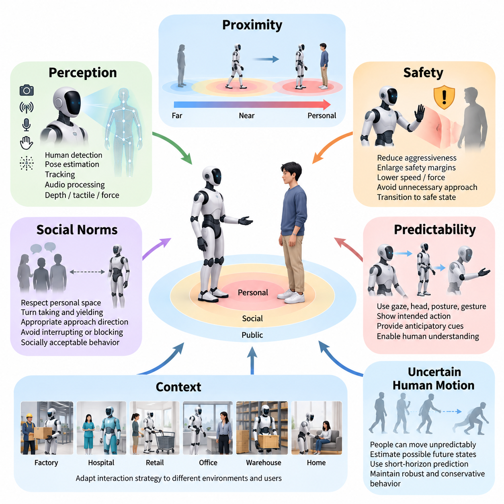
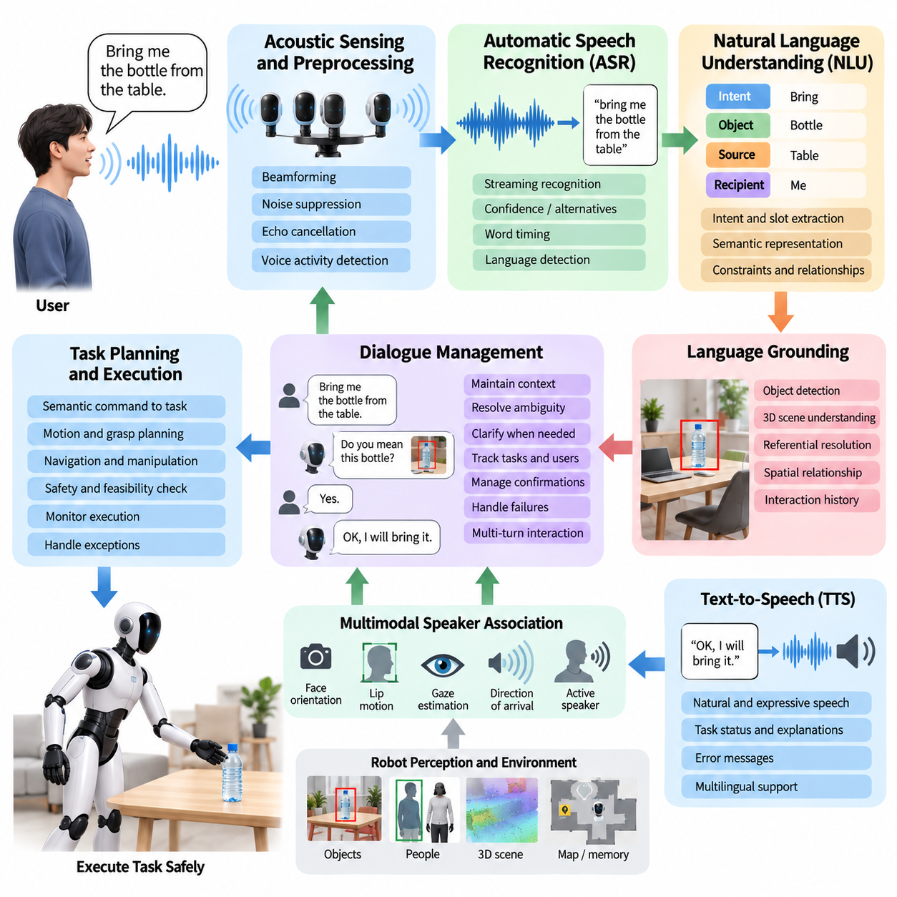
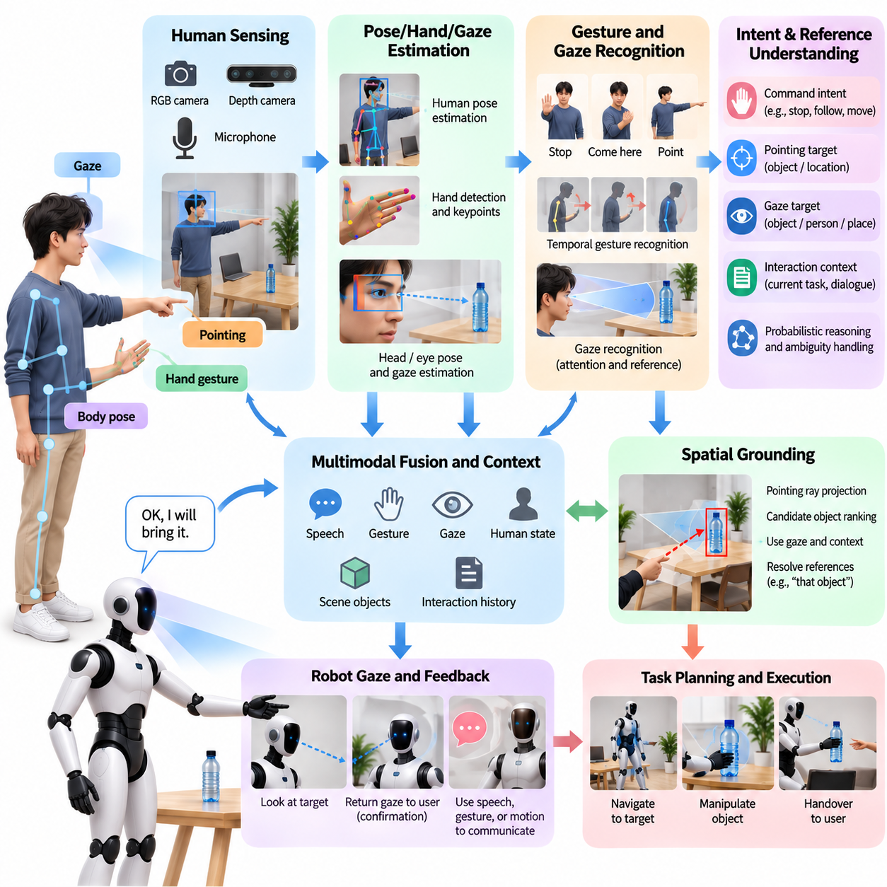
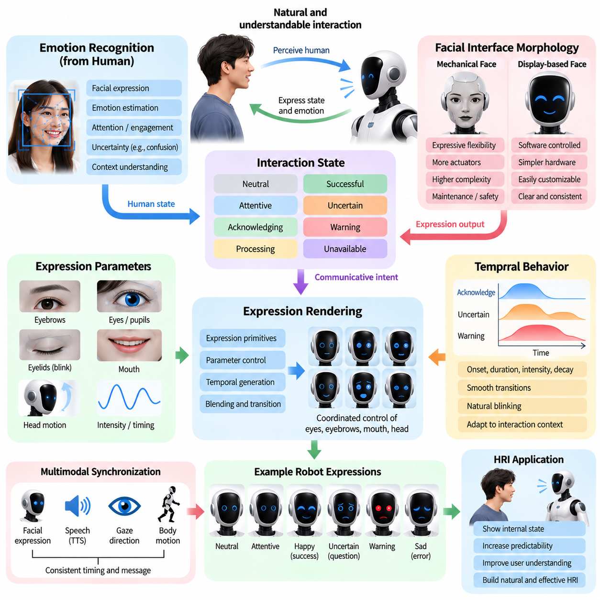
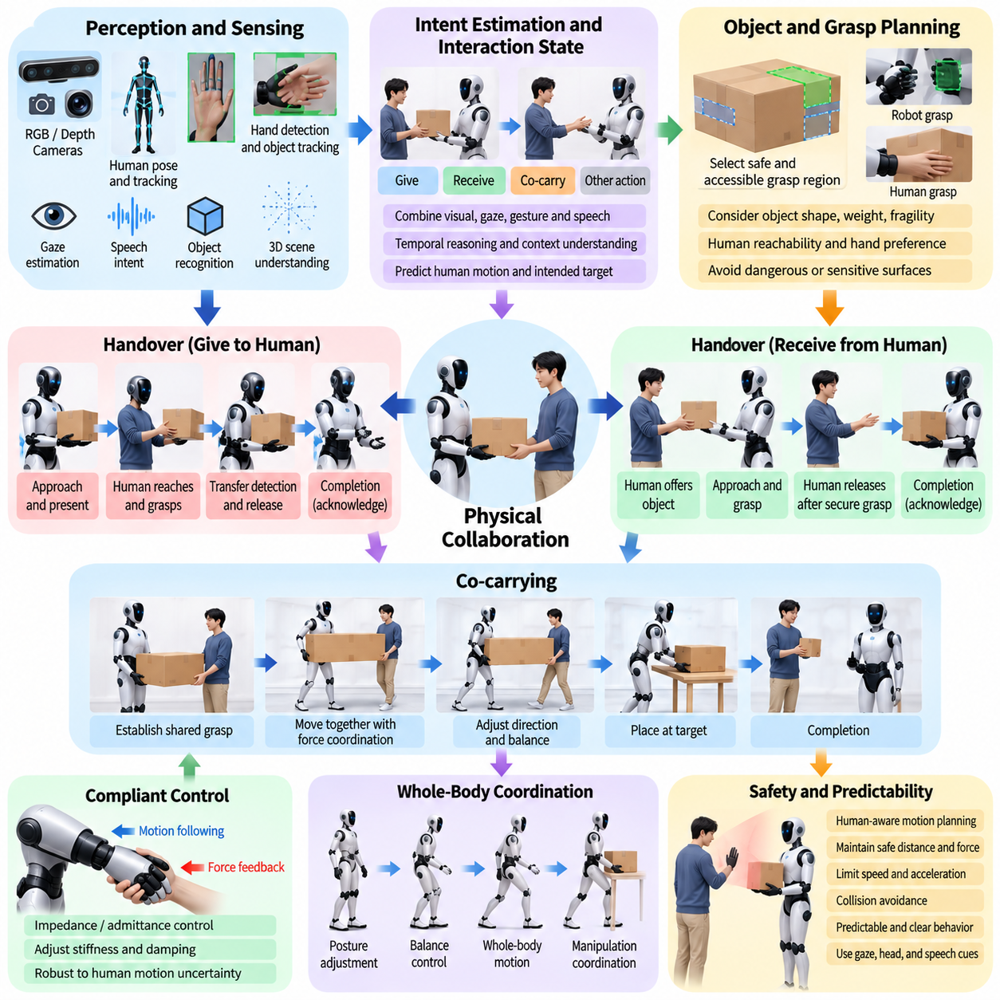
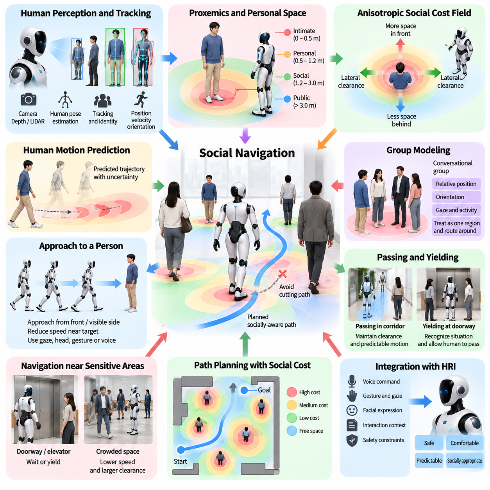
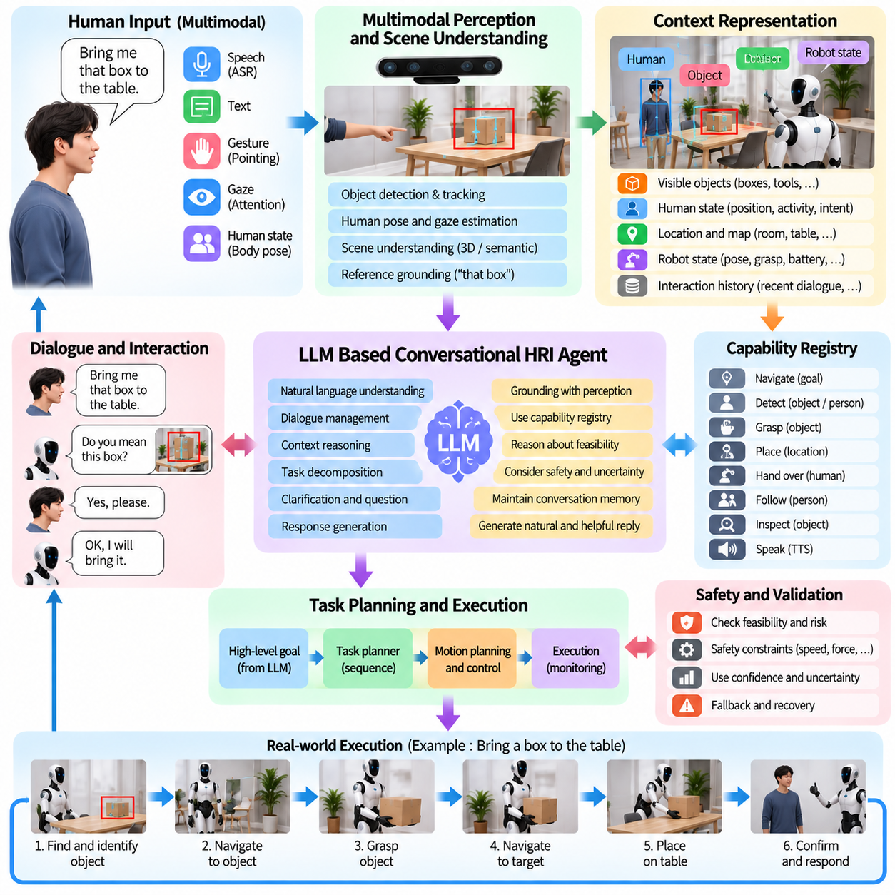
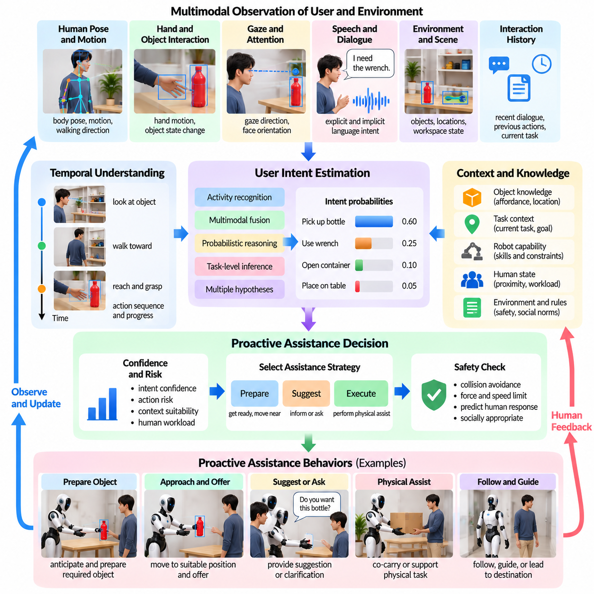
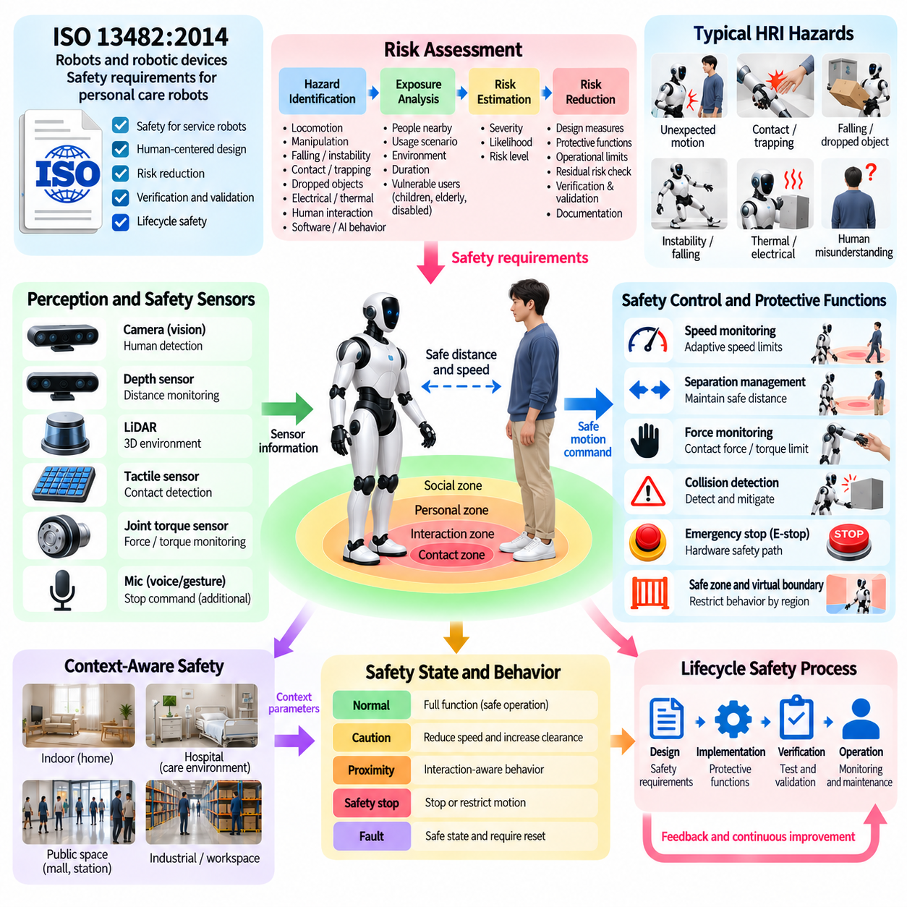
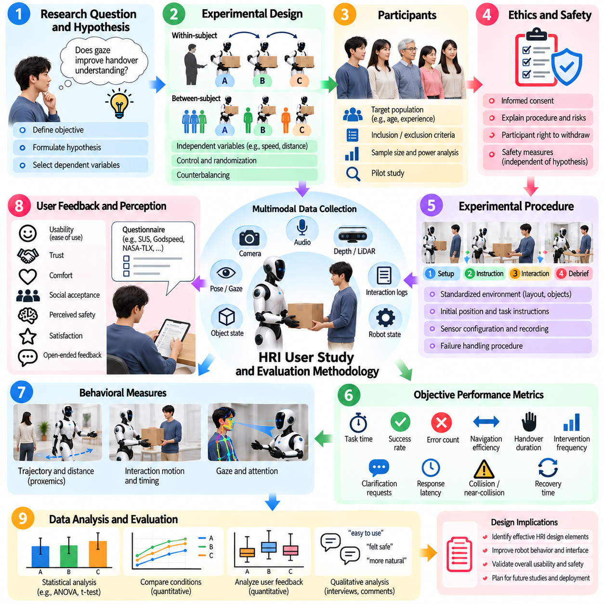

**Volume 22. Humanoid Robot Software**

# Chapter 09. Human Robot Interaction

## 09.01. HRI Principles Proximity Safety Social Norms

{width="7.268055555555556in" height="7.268055555555556in"}

휴머노이드 로봇(Humanoid Robot)을 위한 인간-로봇 상호작용(Human--Robot Interaction, HRI)은 인간과 물리적 능력을 갖춘 자율 기계(Autonomous Machine)가 동일한 공간을 공유하고, 의도(Intention)를 교환하며, 허용할 수 없는 위험이나 사회적 불편을 발생시키지 않으면서 협력할 수 있도록 하는 원칙을 다룬다. 안전 펜스 뒤에서 격리되어 작동하는 기존 산업용 로봇과 달리, 휴머노이드는 사람 옆을 걷고 공용 물체를 조작하며 음성과 제스처를 통해 소통하고 개인 공간(Personal Space)에 진입할 수 있다. 따라서 HRI는 물리적 안전(Physical Safety), 인식(Perception), 행동 예측 가능성(Behavioral Predictability), 의사소통(Communication), 사회적 규범(Social Norms)을 하나의 통합된 상호작용 프레임워크(Interaction Framework)로 결합해야 한다.

근접성(Proximity)은 인간-휴머노이드 상호작용을 지배하는 가장 기본적인 변수 중 하나이다. 로봇은 주변 사람과의 기하학적 거리(Geometric Distance)뿐만 아니라 그 거리가 움직임, 방향, 활동 및 환경적 맥락(Environmental Context)과 어떤 관계를 갖는지도 지속적으로 추정해야 한다. 두 개체가 정지해 있을 때 허용되는 동일한 거리가 휴머노이드가 빠르게 접근하거나, 큰 물체를 운반하거나, 사람을 향해 팔을 뻗을 때에는 위험해질 수 있다. 따라서 근접성은 고정된 거리 임계값(Fixed Distance Threshold)이 아니라 동적으로 해석되어야 한다.

실용적인 HRI 시스템은 사람 주변의 공간을 여러 개의 상호작용 영역(Interaction Zones)으로 표현할 수 있으며, 각 영역의 경계는 상황에 따라 변화한다. 먼 영역에서는 일반적으로 비교적 자유로운 이동이 허용되지만, 가까운 영역으로 접근할수록 더 높은 수준의 인식, 낮은 속도, 보수적인 움직임이 요구된다. 로봇이 개인 공간이나 접촉 수준의 공간에 진입하면 행동은 명시적으로 상호작용 인식형(Interaction-Aware)이 되어야 한다. 이러한 영역은 단순한 고정 원으로 취급해서는 안 되며, 사람의 방향, 시선(Gaze), 이동 방향, 장애물 및 상호작용 목적이 허용 가능한 거리에 큰 영향을 미친다.

안전(Safety)은 불확실성(Uncertainty)이 증가할수록 로봇의 행동 적극성을 높이는 것이 아니라 낮춰야 한다는 원칙에서 시작한다. 사람 검출(Human Detection), 자세 추정(Pose Estimation), 추적(Tracking), 깊이 인식(Depth Perception), 촉각 센싱(Tactile Sensing), 힘 센싱(Force Sensing)은 상호작용 상태에 관한 상호보완적인 정보를 제공한다. 인식 신뢰도(Perception Confidence)가 낮아질 경우 휴머노이드는 안전 여유(Safety Margin)를 확대하고 속도나 힘을 줄이며 불필요한 접근 동작을 피하고, 필요한 경우 안전 상태(Safe State)로 전환해야 한다. 이러한 원칙은 HRI를 사람 검출, 자세 추정, 추적, 오디오 처리(Audio Processing), 전신 접촉 인식(Whole-Body Contact Perception)을 포함하는 휴머노이드 인식 구조(Humanoid Perception Architecture)와 직접 연결한다.

충돌 회피(Collision Avoidance)만으로는 안전한 상호작용을 보장하기에 충분하지 않다. 수학적으로 충돌이 없는 궤적(Collision-Free Trajectory)이라도 사람에게 위협적으로 느껴질 수 있기 때문이다. 얼굴 근처에서의 빠른 팔 동작, 갑작스러운 보행 방향 변경, 뒤쪽에서의 접근, 사람 옆의 좁은 공간을 빠르게 통과하는 행동은 기하학적 제약조건을 만족하면서도 불안이나 놀람을 유발할 수 있다. 따라서 인간 인식형 동작 계획(Human-Aware Motion Planning)은 기존의 장애물 회피 거리뿐만 아니라 가시성(Visibility), 예측 가능성(Predictability), 속도, 가속도, 신체 방향 및 대인 거리(Interpersonal Distance)를 함께 고려해야 한다.

예측 가능성(Predictability)은 휴머노이드에서 특히 중요하다. 인간과 유사한 형태(Human-Like Morphology)는 사람들이 로봇의 움직임을 자연스럽게 의도적인 행동으로 해석하도록 만들기 때문이다. 로봇의 움직임은 다음에 무엇을 수행할 것인지를 전달할 수 있어야 한다. 사람의 이동 경로를 가로질러 걷거나, 물체를 향해 손을 뻗거나, 물리적 협업(Physical Collaboration)을 시작하기 전에 휴머노이드는 시선 방향, 머리 방향, 신체 자세, 손동작, 음성 또는 의도적으로 설계된 궤적을 통해 사전 신호(Anticipatory Cue)를 제공할 수 있다. 이러한 신호는 모호성을 줄이고 사람이 로봇의 의도된 행동을 이해하고 대응할 시간을 제공한다.

사회적 규범(Social Norms)은 물리적 안전을 넘어서는 또 하나의 계층을 형성한다. 인간은 개인 공간, 순서 지키기(Turn Taking), 양보(Yielding), 시선, 접근 방향, 대화 거리 및 허용 가능한 신체 접촉과 관련된 암묵적인 관습을 따른다. 사회적 능력(Social Competence)을 갖춘 휴머노이드는 기술적으로 안전하지만 사회적으로 부적절한 행동을 피할 수 있을 정도로 이러한 관습을 모델링해야 한다. 예를 들어 대화 중인 사람들 사이의 공간에 갑자기 진입하거나, 낯선 사람에게 불필요하게 가까이 서거나, 출입구를 막거나, 사람을 지속적으로 응시하는 행동은 피해야 한다.

맥락(Context)은 이러한 사회적 규범이 어떻게 해석되어야 하는지를 결정한다. 공장에서 적절한 상호작용 행동은 병원, 소매점, 사무실, 물류창고 또는 가정에서 요구되는 행동과 크게 다를 수 있다. 산업 현장의 작업자는 협력적 자재 운반(Coordinated Material Handling) 과정에서 가까운 접근을 허용할 수 있지만, 환자나 고객은 더 넓은 개인 거리와 명확한 의사소통을 기대할 수 있다. 따라서 HRI 정책(HRI Policy)은 하나의 보편적인 사회적 거리 모델이 아니라 상황별 매개변수(Contextual Parameters)를 필요로 하며, 이를 통해 동일한 휴머노이드 플랫폼이 서로 다른 환경과 사용자 집단에 맞게 상호작용 전략을 조정할 수 있다.

사람의 움직임 역시 불확실하고 잠재적으로 예측 불가능한 것으로 다루어야 한다. 사람은 갑자기 멈추거나, 이동 방향을 바꾸거나, 팔을 뻗거나, 물체를 떨어뜨리거나, 의도하지 않게 로봇의 계획된 궤적 안으로 진입할 수 있다. 따라서 HRI 계획(HRI Planning)은 현재 위치에만 의존하는 것이 아니라 가능한 미래 인간 상태(Future Human State)를 추정해야 한다. 단기 예측(Short-Horizon Prediction)을 이용하여 사람 주변에 확률적 점유 영역(Probabilistic Occupancy Region)을 구성하면, 휴머노이드는 가장 가능성이 높은 하나의 예측만 가까스로 회피하는 대신 여러 개의 가능한 인간 움직임에서도 강건성을 유지하는 궤적을 선택할 수 있다.

물리적 협업(Physical Collaboration)에서는 상호작용 안전이 더욱 중요해진다. 물체 전달(Object Handover), 공동 운반(Co-Carrying), 안내 보조(Guided Assistance), 공유 조작(Shared Manipulation)은 의도적으로 인간과 로봇 사이의 거리를 감소시킨다. 이러한 상황에서 안전한 행동은 순응 제어(Compliant Control), 힘 제한(Force Limitation), 접촉 감지(Contact Detection), 안정적인 자세 및 예상하지 못한 저항에 대한 빠른 대응에 의존한다. 휴머노이드는 의도된 협력 접촉과 우발적 충돌(Accidental Collision)을 구별해야 하며, 이러한 분류에 불확실성이 존재할 경우에도 위험한 힘이 허용되지 않도록 해야 한다.

전신 행동(Whole-Body Behavior)도 반드시 고려해야 한다. 휴머노이드는 고정된 베이스 위에 장착된 단순한 로봇 팔이 아니기 때문이다. 손을 뻗는 동작은 몸통을 이동시키고, 균형 상태를 변화시키며, 팔꿈치를 다른 사람 쪽으로 움직이거나 보상 스텝(Compensating Step)을 요구할 수 있다. 마찬가지로 물체를 운반하면서 걷는 행동은 로봇의 물리적 점유 영역과 충돌 결과를 모두 변화시킨다. 따라서 HRI 안전은 엔드 이펙터(End Effector)만 감시하는 것이 아니라 전신에 걸쳐 예상 이동 체적(Swept Volume), 접촉 에너지(Contact Energy), 균형 상태, 조작 물체의 형상 및 주변 사람의 상태를 평가해야 한다.

의사소통(Communication)은 또 하나의 안전 채널(Safety Channel)을 제공한다. 음성, 시선, 제스처, 디스플레이 및 신체 움직임은 물리적 행동이 발생하기 전에 로봇의 상태와 의도를 사람에게 전달할 수 있다. 휴머노이드는 명령을 인식했음을 표시하고, 의도가 모호할 때 확인을 요청하며, 접근하기 전에 신호를 제공하거나, 특정 명령을 안전하게 수행할 수 없는 이유를 설명할 수 있다. 다중모달 의사소통(Multimodal Communication)은 하나의 채널만으로 항상 신뢰성을 확보할 수 없기 때문에 특히 중요하다. 음성은 소음에서 실패할 수 있고, 시선은 관찰되지 않을 수 있으며, 제스처는 모호하거나 문화에 따라 다르게 해석될 수 있다.

로봇은 인간의 주의(Attention)를 당연한 것으로 가정해서도 안 된다. 다른 방향을 바라보거나, 헤드폰을 착용하거나, 다른 작업에 집중하거나, 장애물 뒤에 있는 사람은 로봇의 신호를 인지하지 못할 수 있다. 따라서 상호작용 로직(Interaction Logic)은 인간의 인식 여부에 의존하는 행동을 실행하기 전에 의사소통이 실제로 전달되었을 가능성을 추정해야 한다. 확인(Acknowledgment)이 불확실하다면 로봇은 사람이 성공적으로 협조했다고 가정하기보다 속도를 낮추고, 거리를 확대하며, 다른 모달리티(Modality)를 통해 신호를 반복하거나 기다릴 수 있어야 한다.

사회적으로 적절한 행동(Socially Appropriate Behavior)은 기본적인 안전 제약조건(Safety Constraints)을 절대로 우선해서는 안 된다. 로봇은 일반적으로 정중하게 양보하거나, 대화에 적절한 거리를 유지하거나, 사용자를 계속 지원할 수 있지만 이러한 선호는 충돌 방지, 액추에이터 한계(Actuator Limits), 균형 안정성(Balance Stability), 비상 정지(Emergency Stop) 및 기타 보호 기능보다 하위에 위치해야 한다. 즉, 강제적인 안전 제약조건(Hard Safety Constraints)이 허용 가능한 행동 영역을 정의하고, 사회적 규범은 그 안전 영역 내부에서 행동을 최적화하는 계층 구조가 필요하다. 이러한 분리는 학습 기반 또는 생성형 상호작용 정책(Generative Interaction Policy)이 기본적인 보호 메커니즘을 침해하는 것을 방지한다.

HRI 설계는 취약 사용자(Vulnerable Users)와 개인별 차이(Individual Differences)도 고려해야 한다. 어린이, 고령자, 이동 능력이 제한된 사람, 숙련 작업자 및 처음 로봇을 접하는 사용자는 동일한 로봇 행동에도 서로 다르게 반응할 수 있다. 보행 속도, 의사소통 타이밍, 개인 공간 선호도, 반응 시간 및 물리적 근접성에 대한 허용 수준에는 상당한 차이가 존재한다. 따라서 강건한 휴머노이드는 하나의 이상화된 인간 모델(Idealized Human Model)을 가정하지 않아야 하며, 개별 사용자의 선호도에 대한 신뢰할 수 있는 정보가 확보될 경우 이를 신중하게 반영하여 행동을 조정해야 한다.

프라이버시(Privacy)와 존엄성(Dignity) 역시 중요한 상호작용 원칙이다. 휴머노이드는 주변 사람을 이해하기 위해 얼굴, 음성, 제스처 및 활동을 지속적으로 관찰할 수 있기 때문이다. 인식 시스템은 정당한 로봇 기능에 필요한 정보만 수집하고 보존해야 하며, 상호작용 행동은 불필요한 감시라는 인상을 만들지 않도록 설계되어야 한다. 센싱 또는 기록 상태를 보여주는 명확한 표시, 로봇 행동에 대한 이해 가능한 설명, 상호작용 데이터 저장에 대한 적절한 제어는 사용자가 내부 인공지능 구조를 이해하지 않더라도 신뢰를 높이는 데 기여할 수 있다.

신뢰(Trust)는 인간과 유사한 외형 자체가 아니라 일관된 능력과 행동으로부터 형성되어야 한다. 안정적으로 행동하고, 경계를 존중하며, 불확실성을 전달하고, 상황이 모호해질 때 안전하게 정지하는 휴머노이드는 인간처럼 보이려고 노력하면서 예측 불가능하게 행동하는 로봇보다 높은 신뢰성을 제공한다. 따라서 설계자는 로봇이 실제로 보유하지 않은 능력을 가지고 있는 것처럼 인식시키는 상호작용 방식을 피해야 한다. 인식 실패, 작업 한계(Task Limitation), 신뢰도(Confidence)에 대한 적절한 투명성(Transparency)은 사용자가 시스템의 실제 능력에 맞는 정확한 기대를 형성하도록 돕는다.

이러한 원칙은 이 장에서 다루는 보다 전문화된 HRI 메커니즘의 기반을 형성한다. 음성 인터페이스(Voice Interface), 제스처 및 시선 상호작용(Gesture and Gaze Interaction), 표정 표현(Expression Rendering), 물리적 협업, 근접학(Proxemics), 대화형 에이전트(Conversational Agent), 사용자 의도 추정(User Intent Estimation), 안전 요구사항(Safety Requirements), 사용자 평가(User Evaluation)는 모두 인간 상태, 로봇 상태, 환경적 맥락, 안전 제약조건 및 사회적으로 허용 가능한 행동 사이의 동일한 기본 관계 위에서 작동하는 서로 다른 메커니즘으로 이해할 수 있다.

궁극적으로 효과적인 휴머노이드 HRI는 사람을 인식하고, 상호작용 맥락을 추정하며, 가능한 인간 행동을 예측하고, 물리적으로 안전하면서 사회적으로 적절한 행동을 선택하고, 로봇의 의도를 전달하며, 인간의 반응을 관찰하고, 이후 행동을 다시 조정하는 지속적인 폐루프 과정(Closed-Loop Process)으로 볼 수 있다. 근접 안전(Proximity Safety)은 로봇이 어디에서 어떻게 움직일 수 있는지를 정의하고, 물리적 안전장치(Physical Safeguards)는 무엇을 수행할 수 있는지를 제한하며, 사회적 규범은 허용 가능한 행동이 어떤 방식으로 표현되어야 하는지를 결정한다. 이 세 요소의 통합을 통해 휴머노이드는 단순히 사람 근처에서 작동하는 자율 기계가 아니라 인간 환경에서 이해 가능하고 협력적인 참여자(Cooperative Participant)로 기능할 수 있다.

## 09.02. Voice Command Interface ASR NLU TTS [w/Code]

{width="7.268055555555556in" height="7.268055555555556in"}

음성 명령 인터페이스(Voice Command Interface)는 휴머노이드 로봇(Humanoid Robot)이 자연스러운 음성(Natural Speech)을 통해 인간의 지시를 수신하고, 이를 작업 계획(Task Planning) 및 제어 시스템(Control System)이 해석할 수 있는 행동으로 변환하도록 한다. 인간-로봇 상호작용(Human--Robot Interaction, HRI) 아키텍처에서 음성은 제스처(Gesture), 시선(Gaze), 물리적 상호작용(Physical Interaction), 선제적 지원(Proactive Assistance)을 보완한다. 실용적인 파이프라인은 일반적으로 자동 음성 인식(Automatic Speech Recognition, ASR), 자연어 이해(Natural Language Understanding, NLU), 대화 또는 의도 관리(Dialogue or Intent Management), 음성 합성(Text-to-Speech, TTS)을 결합하여 사용자와 휴머노이드 사이의 폐루프 통신(Closed Communication Loop)을 구성한다.

음성 상호작용 파이프라인(Voice Interaction Pipeline)은 음향 센싱(Acoustic Sensing)에서 시작한다. 머리나 상체에 장착된 마이크로폰(Microphone)은 사람의 음성과 함께 환경 소음, 로봇 액추에이터 소음, 잔향(Reverberation), 다른 사람의 음성을 수집한다. 휴머노이드는 통제된 녹음실이 아니라 동적인 환경에서 작동하므로 원시 오디오(Raw Audio)는 일반적으로 빔포밍(Beamforming), 반향 제거(Echo Cancellation), 잡음 억제(Noise Suppression), 자동 이득 제어(Automatic Gain Control), 음성 활동 감지(Voice Activity Detection)와 같은 전처리를 필요로 한다. 이러한 단계는 ASR에 입력되는 신호를 개선하고 사람이 실제로 로봇에게 말하고 있는지를 판단하는 데 도움을 준다.

마이크로폰 배열 처리(Microphone-Array Processing)는 여러 사람이나 소음원이 휴머노이드 주변에 존재할 때 특히 유용하다. 도래 방향 추정(Direction-of-Arrival Estimation)은 현재 말하고 있는 화자의 대략적인 위치를 식별할 수 있으며, 빔포밍은 해당 방향에서 도달하는 음향 신호를 강조한다. 이러한 음향 정보는 시각 기반 사람 검출(Visual Human Detection), 얼굴 방향(Face Orientation), 입술 움직임(Lip Motion), 시선 추정(Gaze Estimation)과 결합할 수도 있다. 다중모달 화자 연계(Multimodal Speaker Association)를 통해 로봇은 무엇이 말해졌는지뿐만 아니라 누가 명령했으며 그 사람이 실제로 로봇을 대상으로 말했는지도 판단할 수 있다.

자동 음성 인식(Automatic Speech Recognition, ASR)은 전처리된 오디오 파형(Audio Waveform)을 텍스트 또는 다른 언어적 표현(Linguistic Representation)으로 변환한다. 현대적인 ASR 시스템은 일반적으로 신경망 기반 음향 및 언어 모델링(Neural Acoustic and Language Modeling)을 사용하여 미리 정의된 개별 명령어만 요구하는 대신 연속적인 음성을 인식한다. 휴머노이드 응용에서는 명령이 온보드 GPU, NPU 또는 CPU에서 해석되어야 하는 경우가 많기 때문에 인식 정확도와 지연시간(Latency), 계산 비용(Computational Cost) 사이의 균형이 필요하다. 따라서 사용자가 아직 말하고 있는 동안에도 부분적인 인식 결과를 생성할 수 있는 스트리밍 ASR(Streaming ASR)이 유용하다.

ASR 불확실성(ASR Uncertainty)은 가장 가능성이 높은 전사 결과(Transcript)를 선택한 이후 제거하는 대신 후속 구성요소에 전달되어야 한다. 인식 신뢰도(Recognition Confidence), 대안 가설(Alternative Hypotheses), 단어별 시간 정보(Word Timing), 감지된 언어(Detected Language)는 상호작용 관리자(Interaction Manager)에 중요한 정보를 제공할 수 있다. 서로 다른 전사 후보가 크게 다른 물리적 행동으로 이어질 가능성이 있다면 로봇은 가장 높은 확률의 해석을 자동 실행하기보다 사용자에게 명확화를 요청해야 한다. 이는 보행(Locomotion), 조작(Manipulation), 인간과의 근접 접촉이 포함된 명령에서 특히 중요하다.

자연어 이해(Natural Language Understanding, NLU)는 인식된 언어를 로봇이 추론할 수 있는 표현으로 변환한다. 예를 들어 "테이블 위에 있는 병을 나에게 가져와"라는 명령에는 의도된 행동, 대상 물체, 출발 위치 및 암묵적인 수령자가 포함되어 있다. NLU는 이러한 요소를 의도와 슬롯(Intent and Slot), 의미 프레임(Semantic Frame), 구조화된 작업 기술(Structured Task Description), 또는 언어 접지 표현(Grounded Language Representation)으로 추출할 수 있다. 목표는 단순히 문장을 분류하는 것이 아니라 언어적 표현을 로봇이 인식한 환경의 개체, 행동, 제약조건 및 관계와 연결하는 것이다.

언어 접지(Language Grounding)는 NLU를 휴머노이드 인식(Humanoid Perception)과 연결한다. "저 상자", "노트북 옆의 컵", "문 근처에 있는 사람"과 같은 표현은 텍스트만으로 해결할 수 없다. 상호작용 시스템은 언어적 설명을 현재 장면에서 감지된 물체 및 사람과 연결해야 한다. 객체 검출(Object Detection), 3차원 장면 이해(3D Scene Understanding), 추적(Tracking), 개방형 어휘 인식(Open-Vocabulary Perception), 의미 기억(Semantic Memory)은 후보 개체를 제공할 수 있으며, 공간적 관계(Spatial Relationships)와 상호작용 이력(Interaction History)은 사용자가 어떤 개체를 의도했는지 판단하는 데 도움을 준다.

따라서 모호성 관리(Ambiguity Management)는 음성 기반 HRI의 핵심 기능이다. 비슷한 병 두 개가 보이는 상황에서 "병을 집어"라는 명령을 즉시 실행하면 ASR과 NLU가 각각 정확하게 작동했더라도 잘못된 행동이 발생할 수 있다. 대신 로봇은 "왼쪽에 있는 병을 말씀하시는 건가요?"라고 질문하고 사용자의 응답을 이용해 작업 표현(Task Representation)을 구체화할 수 있다. 명확화(Clarification)는 행동 위험도와 불확실성에 따라 실행되어야 하며, 위험성이 낮은 모호성은 효율적으로 해결하면서 안전이 중요한 행동에는 더욱 엄격한 확인 절차를 적용해야 한다.

대화 관리(Dialogue Management)는 여러 번의 대화 차례(Conversational Turns)에 걸쳐 상호작용 상태를 유지한다. 인간의 명령은 이전 맥락에 의존하는 경우가 많다. 예를 들어 "빨간 상자를 집어"라는 명령에 이어 "그것을 저쪽에 놓아"라고 말할 수 있다. 두 번째 명령을 이해하려면 이전에 참조된 물체를 기억하면서 새로운 목적지를 해석해야 한다. 따라서 대화 상태(Dialogue State)는 현재 사용자, 참조된 물체, 진행 중인 작업, 해결되지 않은 모호성, 확인 상태, 로봇의 기능, 실행 상태 및 관련 상호작용 이력을 포함할 수 있다.

이렇게 생성된 의미 명령(Semantic Command)은 관절 명령(Joint Command)으로 직접 변환되는 것이 아니라 실행 가능한 로봇 작업(Executable Robot Task)으로 변환되어야 한다. 작업 인터페이스(Task Interface)는 해석된 지시를 기호적 행동(Symbolic Action), 행동 트리 노드(Behavior-Tree Node), 플래너 목표(Planner Goal), 조작 기술(Manipulation Skill), 내비게이션 목표(Navigation Goal), 또는 상위 수준 에이전트 요청(High-Level Agent Request)으로 매핑할 수 있다. 이러한 아키텍처적 분리는 음성 이해 계층이 사용자가 무엇을 원하는지를 정의하고, 보행, 조작, 전신 제어(Whole-Body Control), 안전 시스템이 물리적 행동을 어떻게 안전하게 수행할지를 결정하도록 한다는 점에서 중요하다.

실행 전에 명령은 기능 및 안전 검증(Capability and Safety Validation)을 통과해야 한다. 언어적으로 유효한 명령이 반드시 물리적으로 실행 가능하거나 안전한 것은 아니다. 요청된 물체가 로봇의 가반하중(Payload Limit)을 초과할 수도 있고, 목적지에 도달할 수 없거나, 이동 경로가 제한 영역(Restricted Region)을 통과하거나, 다른 사람이 계획된 동작에 지나치게 가까이 있을 수도 있다. 따라서 HRI 계층은 명령 실행을 사용자에게 확정하기 전에 계획 및 안전 구성요소와 통신해야 하며, 대화상의 확신(Conversational Confidence)이 물리적 수행 능력(Physical Capability)으로 오인되지 않도록 해야 한다.

음성 합성(Text-to-Speech, TTS)은 휴머노이드가 자신의 해석, 상태, 질문, 경고 및 작업 결과를 사용자에게 전달하도록 함으로써 상호작용 루프를 완성한다. TTS는 자연스러운 대화 순서(Turn Taking)를 유지할 수 있을 정도로 낮은 지연시간과 명확한 음성을 제공해야 한다. 운율(Prosody), 발화 속도(Speaking Rate), 음량(Volume), 문장 표현(Phrasing)은 환경 조건과 상호작용 맥락에 맞게 조정할 수 있다. 목표는 단순히 인간과 유사한 음성을 생성하는 것이 아니라 사용자가 시스템이 무엇을 수행하고 있는지 이해할 수 있도록 로봇 상태를 명확하고 예측 가능하게 전달하는 것이다.

음성 피드백(Spoken Feedback)은 중요한 작업 상태 전환(Task Transition)을 중심으로 구성할 수 있다. 로봇은 요청을 들었다는 사실을 확인하고, 부족한 정보를 요청하며, 잠재적으로 위험한 작업을 다시 확인하고, 실행이 시작되었음을 알리거나, 작업을 완료할 수 없는 이유를 설명할 수 있다. 그러나 지나치게 많은 음성 피드백은 상호작용을 느리고 방해가 되도록 만들 수 있다. 따라서 효과적인 시스템은 음성을 머리 움직임, 시선, 조명, 디스플레이, 제스처와 같은 비언어적 신호(Nonverbal Signals)와 결합하여 일상적인 상태 변화마다 완전한 음성 응답이 필요하지 않도록 한다.

대화 순서 제어(Turn-Taking Behavior)는 로봇이 언제 듣고 언제 말할지를 결정한다. 로봇이 사용자의 말을 가로막거나 명령이 끝난 이후 불필요하게 기다리는 것을 방지하려면 음성 활동 감지, 발화 종료 감지(Endpoint Detection), 인터럽트 처리(Interruption Handling), 대화 상태가 필요하다. 또한 시스템은 사용자가 합성 음성이 출력되는 동안 새로운 명령이나 긴급 정지 요청으로 로봇의 발화를 중단할 수 있는 발화 중단 입력(Barge-In)을 지원해야 한다. 안전 관련 인터럽트 채널(Safety-Related Interruption Channel)은 일반적인 대화보다 높은 우선순위를 가져야 한다.

로봇 자체에서 발생하는 소음(Robot-Generated Noise)은 휴머노이드 음성 인터페이스에서 특별한 문제를 발생시킨다. 냉각 팬, 관절 액추에이터, 발걸음, 충격음 및 합성 음성이 마이크로폰 신호를 오염시킬 수 있다. 음향 반향 제거(Acoustic Echo Cancellation)는 이미 알려진 TTS 출력을 입력 오디오에서 제거할 수 있으며, 적응형 필터링(Adaptive Filtering)과 잡음 억제는 예측 가능한 로봇 소음을 감소시킬 수 있다. 보행이나 조작 중에는 인식 임계값(Recognition Threshold)을 동적으로 조정하거나 오디오와 시각적 정보를 결합하여 안정적인 명령 감지를 유지할 수 있다.

호출어 감지(Wake-Word Detection) 또는 명시적인 상호작용 상태 관리(Interaction-State Management)는 주변 사람들의 일반적인 대화가 로봇 명령으로 잘못 해석되는 것을 방지할 수 있다. 그러나 모든 지시 전에 호출어를 요구하면 장시간 협업이 부자연스러워질 수 있다. 실용적인 설계에서는 활성화 문구(Activation Phrase)를 사용하여 상호작용 세션(Interaction Session)을 시작한 다음, 사용자가 근처에 머물면서 로봇에게 주의를 기울이는 동안 일시적으로 대화 상태를 유지할 수 있다. 사용자의 주의가 다른 곳으로 이동하거나, 사용자가 자리를 떠나거나, 설정된 시간 제한(Timeout)이 지나면 세션을 종료할 수 있다.

다국어 동작(Multilingual Operation)은 언어 식별(Language Identification), ASR 모델, NLU 표현, TTS 음성과 관련된 추가 요구사항을 발생시킨다. 공공장소나 국제적인 환경에 배치된 휴머노이드는 서로 다른 억양, 말하기 속도, 어휘 및 언어 혼용(Code-Switching)을 사용하는 사람을 만날 수 있다. 시스템은 익숙하지 않은 음성을 잘못된 해석으로 강제 변환하기보다 불확실성으로 처리해야 한다. 도메인 특화 용어(Domain-Specific Terminology), 물체 이름, 작업장 어휘 및 사용자 정의 표현도 일반 언어 처리 능력을 손상시키지 않으면서 통합할 수 있어야 한다.

전체 ASR--NLU--TTS 파이프라인의 지연시간은 사용자가 체감하는 상호작용 품질에 큰 영향을 준다. 매우 정확하더라도 응답하기까지 수 초가 걸리는 시스템은 반응성이 떨어지는 것으로 느껴지며 자연스러운 대화를 방해할 수 있다. 스트리밍 오디오 처리(Streaming Audio Processing), 점진적 ASR(Incremental ASR), 조기 의도 추정(Early Intent Estimation), 캐시된 언어 자원(Cached Language Resources), 온보드 추론(Onboard Inference)을 이용하면 응답 지연을 줄일 수 있다. 복잡한 계획이 필요한 명령의 경우 더 높은 계산 비용의 추론을 비동기적으로 수행하면서 즉각적인 확인 응답을 통해 사용자에게 처리가 계속되고 있음을 알릴 수 있다.

대규모 언어 모델(Large Language Model, LLM)은 유연한 명령을 해석하고, 대화 맥락을 해결하며, 자연어를 구조화된 작업 표현으로 변환함으로써 기존 NLU를 확장할 수 있다. 그러나 LLM의 출력은 제한 없는 물리적 명령(Unrestricted Physical Command)으로 취급해서는 안 된다. 생성된 계획은 인식된 물체와 연결되어야 하고, 로봇의 기능에 대해 검증되어야 하며, 결정론적 안전 제약조건(Deterministic Safety Constraints)을 통과하고, 제어된 작업 인터페이스를 통해 변환되어야 한다. 이러한 분리는 물리적 힘을 가할 수 있는 임바디드 시스템(Embodied System)에 언어 모델이 참여할 때 필수적이다.

실패 처리(Failure Handling)는 예외적인 상황이 아니라 정상적인 음성 상호작용 과정의 일부로 설계되어야 한다. 로봇은 명령을 듣지 못하거나, 잘못된 단어를 인식하거나, 물체 참조를 오해하거나, 네트워크 연결을 잃거나, 실행 도중 요청된 작업이 불가능하다는 사실을 발견할 수 있다. 인터페이스는 가능하면 어느 단계에서 실패가 발생했는지를 식별하고 유용한 복구 경로(Recovery Path)를 사용자에게 전달해야 한다. 전체 상호작용을 처음부터 반복하는 것보다 누락되었거나 불확실한 정보만 구체적으로 다시 요청하는 것이 더 효과적이다.

따라서 휴머노이드 음성 인터페이스의 평가(Evaluation)는 기존의 단어 오류율(Word Error Rate)만으로 제한되어서는 안 된다. 관련 평가 지표에는 명령 인식 정확도(Command Recognition Accuracy), 의도 정확도(Intent Accuracy), 접지 성공률(Grounding Success), 명확화 빈도(Clarification Frequency), 종단 간 지연시간(End-to-End Latency), 작업 완료율(Task Completion Rate), 오작동 활성화율(False Activation Rate), 인터럽트 응답(Interruption Response), 복구 성공률(Recovery Success), 로봇 피드백에 대한 사용자 이해도가 포함된다. 시험은 조용한 환경과 소음 환경, 다수의 화자, 로봇 자체 소음, 다양한 거리, 억양, 모호한 명령 및 안전이 중요한 인터럽트 상황을 포함해야 한다.

궁극적으로 제품 수준의 음성 인터페이스(Production-Quality Voice Interface)는 인간 언어와 물리적 로봇 행동 사이를 연결하는 양방향 브리지(Bidirectional Bridge)로 기능한다. ASR은 음성을 언어적 정보로 변환하고, NLU는 이를 환경에 접지된 의도(Grounded Intent)로 변환하며, 대화 관리는 맥락을 유지하고 불확실성을 해결하고, 작업 인터페이스는 의도를 로봇의 기능과 연결하며, TTS는 해석과 실행 상태를 다시 인간에게 전달한다. 이러한 파이프라인이 인식, 계획, 조작, 보행 및 안전 메커니즘과 통합될 때, 언어적 유연성이 신뢰할 수 있는 휴머노이드 동작에 필요한 물리적·안전적 제약조건을 우회하지 않으면서도 자연스러운 음성 기반 상호작용을 구현할 수 있다.

## 09.03. Gesture and Gaze Based Interaction [w/Code]

{width="7.268055555555556in" height="7.268055555555556in"}

제스처 및 시선 기반 상호작용(Gesture- and Gaze-Based Interaction)은 휴머노이드 로봇(Humanoid Robot)이 인간 행동에 자연스럽게 수반되는 비언어적 신호(Nonverbal Signals)를 통해 사람과 의사소통할 수 있도록 한다. 손 제스처, 팔 움직임, 신체 방향, 머리 자세, 시선은 지속적인 음성 없이도 명령, 주의, 참조 대상, 의도 또는 대화 상태를 나타낼 수 있다. 인간-로봇 상호작용(Human--Robot Interaction, HRI)에서 이러한 채널은 음성 인터페이스(Voice Interface)를 보완하며, 특히 소음이 많은 환경, 공동 작업 공간 및 음성 의사소통이 불편하거나 모호한 상황에서 중요한 역할을 한다.

제스처 상호작용 파이프라인(Gesture Interaction Pipeline)은 인간의 신체를 검출하고 추적하는 과정에서 시작한다. RGB 카메라, 깊이 카메라(Depth Camera) 또는 다중모달 인식 시스템(Multimodal Perception System)은 머리, 몸통, 팔, 손 및 주요 골격 관절(Skeletal Joint)의 위치를 추정할 수 있다. 제스처는 일반적으로 하나의 신체 자세가 아니라 시간에 따른 움직임으로 정의되므로 시간적 추적(Temporal Tracking)이 중요하다. 따라서 시스템은 의도적인 의사소통 움직임과 걷기, 물체에 손을 뻗기, 몸을 긁기, 물체 운반, 옷을 정리하는 등의 일반적인 행동을 구별해야 한다.

인간 자세 추정(Human Pose Estimation)은 비교적 큰 신체 제스처를 인식할 수 있는 구조화된 표현(Structured Representation)을 제공한다. 관절 좌표, 상대적인 팔다리 각도, 손의 궤적, 신체 방향 및 움직임 속도는 제스처 분류(Gesture Classification)를 위한 특징으로 변환될 수 있다. 휴머노이드는 정지, 이쪽으로 오기, 왼쪽으로 이동하기, 따라오기 또는 기다리기와 같은 명령을 인식할 수 있다. 그러나 동일한 신체 움직임이라도 맥락에 따라 다른 의미를 가질 수 있으므로 제스처 인식은 독립적인 시각 분류 문제가 아니라 상호작용 상태(Interaction State)와 연결되어야 한다.

손 제스처(Hand Gesture)는 더욱 세밀한 상호작용 채널을 제공한다. 손 검출(Hand Detection)과 키포인트 추정(Keypoint Estimation)을 통해 손바닥 방향, 손가락 형태, 지시 방향 및 동적인 손가락 움직임을 표현할 수 있다. 단순한 상징적 제스처(Symbolic Gesture)는 사전에 정의된 로봇 기능을 실행할 수 있으며, 가리키기(Pointing)는 물체나 위치에 대한 공간적 참조(Spatial Reference)를 설정할 수 있다. 자연스러운 상호작용에서는 손이 카메라 영상에서 작게 보이거나, 물체에 의해 일부 가려지거나, 사용자의 신체 뒤에 일시적으로 숨겨질 수 있으므로 안정적인 인식을 위해 충분한 영상 해상도와 가시성이 필요하다.

동적 제스처(Dynamic Gesture)는 시간적 추론(Temporal Reasoning)을 필요로 한다. 손 흔들기, 이쪽으로 오라는 동작, 방향을 나타내는 손짓 또는 반복적인 정지 신호는 한 장의 영상만으로 안정적으로 이해하기 어렵다. 인식 시스템은 일정한 시간 구간에 걸쳐 골격 또는 손 상태의 시퀀스(Sequence)를 유지하고 움직임 패턴을 분류할 수 있다. 순환 모델(Recurrent Model), 시간적 합성곱(Temporal Convolution), 트랜스포머(Transformer) 또는 학습 기반 행동 인식 정책을 사용할 수 있지만, 실제 시스템에서는 지속적인 인간 움직임이 반복적인 오명령(False Command)을 발생시키지 않도록 제스처의 시작과 종료 시점도 판단해야 한다.

가리키기(Pointing)는 인간의 의사소통과 공간 접지(Spatial Grounding)를 연결하기 때문에 특히 중요하다. 사용자가 특정 방향을 가리키면서 "저 물체를 집어"라고 말하면 로봇은 어깨, 팔꿈치, 손목, 손 또는 검지로부터 가리키기 광선(Pointing Ray)을 추정하고 이를 인식된 3차원 환경에 투영할 수 있다. 해당 방향 근처의 후보 물체는 기하학적 근접성, 의미 정보(Semantic Information), 시선 및 음성 설명을 이용하여 우선순위를 결정할 수 있다. 이러한 다중모달 접지(Multimodal Grounding)는 언어나 제스처를 개별적으로 해석하는 경우보다 모호성을 줄일 수 있다.

시선(Gaze)은 인간의 주의(Attention)에 관한 정보를 제공하며 참조 대상 결정과 대화 조정(Conversational Coordination)을 모두 지원할 수 있다. 휴머노이드는 머리 방향, 얼굴 랜드마크(Facial Landmark), 눈의 방향 또는 머리와 눈의 결합 자세를 추정하여 사람이 어디를 보고 있는지를 판단할 수 있다. 먼 거리에서는 정확한 눈 추적(Eye Tracking)이 어려울 수 있으므로 머리 자세(Head Pose)가 유용한 대략적 추정값을 제공할 수 있다. 추정된 시선 방향은 로봇의 장면 모델(Scene Model)에 표현된 물체, 다른 사람, 로봇 신체 영역 또는 특정 위치와 연결될 수 있다.

시선은 일반적으로 정확한 기하학적 광선이 아니라 확률적으로 해석되어야 한다. 카메라 해상도, 눈의 가시성, 안경, 조명, 머리 움직임 및 보정 오차(Calibration Error)는 불확실성을 발생시킨다. 시스템은 사람이 하나의 정확한 지점을 바라보고 있다고 가정하는 대신 후보 대상에 대한 시선 원뿔(Gaze Cone) 또는 확률 분포(Probability Distribution)를 표현할 수 있다. 이러한 분포를 물체 위치, 대화 맥락, 가리키기 제스처 및 최근 상호작용 이력과 결합하면 사용자가 의도한 참조 대상을 더욱 강건하게 추정할 수 있다.

공동 주의(Joint Attention)는 인간과 로봇이 동일한 개체나 사건을 향해 주의를 조정하는 것을 의미한다. 이러한 능력은 많은 명령이 공유된 시각적 맥락(Shared Visual Context)에 의존하기 때문에 자연스러운 HRI의 기본 요소이다. 로봇은 사람의 시선을 따라 물체를 바라보고, 머리를 해당 물체 방향으로 회전시킨 다음, 다시 사용자 쪽으로 시선을 돌려 참조 대상이 성공적으로 확인되었음을 나타낼 수 있다. 이러한 행동은 물리적 행동을 시작하기 전에 로봇이 사람이 주목하고 있는 대상을 올바르게 이해했다는 가시적인 확인 신호를 제공한다.

로봇의 시선(Robot Gaze) 자체도 하나의 상호작용 출력이다. 휴머노이드는 머리를 회전시키거나 시각 센서를 사람 쪽으로 향하게 하여 주의와 상호작용 준비 상태를 나타낼 수 있다. 보행 전에 의도된 목적지를 바라보거나 물체에 손을 뻗기 전에 해당 물체를 바라보는 행동 역시 이후 행동을 전달할 수 있다. 이러한 예측적 시선 신호(Anticipatory Gaze Cue)는 로봇 행동을 더 쉽게 예측하도록 한다. 그러나 지나치게 오래 지속되거나 기계적으로 고정된 응시는 부자연스럽게 느껴질 수 있으므로 시선 행동은 작업 요구사항, 센싱 요구사항 및 사회적으로 적절한 주의 사이의 균형을 유지해야 한다.

제스처와 시선은 음성(Speech)과 통합될 때 특히 효과적이다. 사용자는 하나의 물체를 들고 목적지를 가리키면서 "이것을 저기에 놓아"라고 말하거나, 다른 사람을 바라보면서 "저 사람을 따라가"라고 말할 수 있다. 언어는 의미적 관계(Semantic Relationship)를 제공하고 제스처와 시선은 공간적 접지를 제공한다. 다중모달 융합 계층(Multimodal Fusion Layer)은 ASR 신뢰도, NLU 의도, 골격 관측값, 가리키기 기하학(Pointing Geometry), 시선 확률, 객체 검출 결과 및 대화 맥락을 결합하여 가장 가능성이 높은 사용자 의도를 추정할 수 있다.

다중모달 신호는 완벽하게 동기화되는 경우가 드물기 때문에 융합 과정에서는 시간적 관계를 고려해야 한다. 사람은 말하기 전에 먼저 손으로 가리킬 수도 있고, 물체를 설명하는 동안 제스처를 유지하거나, 문장을 끝낸 뒤 시선을 이동할 수도 있다. 따라서 상호작용 시스템에는 의미 있는 시간 범위 안에서 발생한 관측값을 서로 연계하는 시간적 연관 구간(Temporal Association Window)이 필요하다. 단기 다중모달 기억(Short-Term Multimodal Memory)을 유지하면 로봇은 "저기", "저것", "그 사람"과 같은 표현을 약간 앞서거나 뒤이어 발생한 제스처 및 시선 신호와 연결할 수 있다.

의도성(Intentionality) 역시 중요한 문제이다. 인간은 로봇에게 명령하지 않을 때에도 지속적으로 손과 머리, 눈을 움직인다. 감지된 모든 제스처를 의도적인 상호작용으로 처리하면 빈번한 오작동 활성화(False Activation)가 발생한다. 따라서 로봇은 신체 방향, 거리, 로봇을 향한 시선, 대화 상태, 이전 활성화 상태, 제스처 지속시간 및 환경적 맥락을 고려하여 사용자가 실제로 자신과 상호작용하고 있는지를 추정해야 한다. 명시적인 참여 상태(Engagement State)를 사용하면 혼잡하거나 협업이 이루어지는 환경에서 우발적인 명령을 크게 줄일 수 있다.

신뢰도가 충분하지 않을 경우 휴머노이드는 불확실한 해석을 조용히 선택하기보다 사용자에게 확인을 요청해야 한다. 가리키는 방향에 여러 개의 인접한 물체가 존재한다면 로봇은 가장 가능성이 높은 후보를 바라본 뒤 해당 물체가 맞는지 질문할 수 있다. 손 신호가 부분적으로 가려졌다면 제스처를 다시 수행해 달라고 요청할 수도 있다. 확인 과정 자체도 다중모달 방식으로 구성할 수 있어 사용자가 음성으로 대답하거나, 고개를 끄덕이거나, 다시 가리키거나, 간단한 승인 제스처를 사용할 수 있다. 이를 통해 단방향 인식 파이프라인이 아니라 폐루프 상호작용(Closed-Loop Interaction)을 형성할 수 있다.

안전 관련 제스처(Safety-Related Gesture)는 특별하게 처리해야 한다. 정지 제스처, 후퇴 신호 또는 사람이 불편함을 나타내는 표현은 낮은 지연시간으로 인식되어 높은 우선순위의 상호작용 경로를 통해 전달되어야 한다. 이러한 명령이 로봇 행동에 영향을 주기 전에 복잡하고 긴 대화 추론을 거쳐서는 안 된다. 필요한 경우 제스처 기반 정지 요청은 물리적 비상 정지(Physical Emergency Stop), 음성 인터럽트(Voice Interruption), 근접성 감시(Proximity Monitoring), 충돌 회피(Collision Avoidance)를 보완할 수 있으며, 최종적인 보호 동작은 전용 안전 기능이 책임져야 한다.

제스처 인식(Gesture Recognition)은 서로 다른 사용자에 대해서도 강건성을 유지해야 한다. 신체 크기, 주로 사용하는 손, 이동 능력, 의복, 문화적 관습, 제스처 크기 및 개인적인 의사소통 방식에는 상당한 차이가 존재할 수 있다. 과장된 실험실 제스처만으로 학습된 시스템은 자연스러운 상호작용에서 성능이 저하될 수 있다. 따라서 학습 및 검증 데이터에는 다양한 사용자, 관찰 각도, 거리, 부분 가림(Partial Occlusion), 조명 조건, 배경 및 의사소통 행동과 비의사소통 행동 사이의 실제적인 전환이 포함되어야 한다.

사회적 관습(Social Convention) 역시 시선 해석에 영향을 미친다. 직접적인 눈맞춤(Direct Eye Contact)은 상호작용 참여를 나타낼 수 있지만, 허용 가능한 시선 지속시간과 의미는 개인 및 문화적 환경에 따라 달라질 수 있다. 마찬가지로 상황에 따라 손가락, 손 전체, 머리 또는 시선을 이용한 가리키기가 선호될 수 있다. 따라서 휴머노이드는 하나의 제스처 어휘(Gesture Vocabulary)가 보편적인 인간 행동을 대표한다고 가정해서는 안 된다. 설정 가능한 상호작용 정책(Configurable Interaction Policy)과 학습 기반 적응(Learned Adaptation)은 사용자의 선호도를 알 수 없는 상황에서 보수적인 행동을 유지하면서 사용성을 향상시킬 수 있다.

실시간 성능(Real-Time Performance)은 인간의 신호와 로봇 행동 사이의 반응이 지연될수록 상호 연관성이 약화되기 때문에 필수적이다. 사람 검출, 자세 추정, 손 추적, 시선 추정, 시간적 제스처 인식 및 다중모달 융합은 충분히 낮은 종단 간 지연시간(End-to-End Latency)으로 동작해야 한다. 계산 스케줄링(Computational Scheduling)은 로봇이 움직이는 동안 빠르고 대략적인 인식을 우선적으로 수행하고, 상호작용이 감지되면 보다 정밀한 손 또는 눈 분석을 활성화하는 방식으로 구성할 수 있다. 이를 통해 현재의 HRI 요구사항에 따라 온보드 계산 자원(Onboard Computational Resources)을 효율적으로 할당할 수 있다.

가림 처리(Occlusion Handling)는 사람 가까이에서 작동하는 휴머노이드에서 특히 중요하다. 손은 물체 뒤로 사라질 수 있고, 팔이 카메라 시야(Field of View)를 벗어날 수 있으며, 협력 작업 중 로봇 자신의 매니퓰레이터(Manipulator)가 시각적 관측을 가릴 수도 있다. 다중 카메라(Multiple Cameras), 깊이 센싱, 시간적 추적 및 예측을 사용하면 짧은 관측 손실 동안에도 상호작용 상태를 유지할 수 있다. 그러나 관측 정보가 사라질 경우 시스템은 이전 제스처가 무기한 유효하다고 가정하지 말고 신뢰도를 낮춰야 한다.

평가(Evaluation)는 프레임 단위 제스처 분류 정확도(Frame-Level Gesture Classification Accuracy)만 측정해서는 안 된다. 관련 지표에는 제스처 검출 정밀도 및 재현율(Precision and Recall), 오작동 활성화율, 가리키기 대상 정확도(Pointing-Target Accuracy), 시선 대상 정확도(Gaze-Target Accuracy), 참여 상태 감지(Engagement Detection), 다중모달 접지 성공률, 인식 지연시간, 명확화 빈도, 작업 완료율 및 안전 정지 응답(Safety-Stop Response)이 포함된다. 시험에는 자연스러운 배경 움직임, 여러 사람, 음성과 제스처의 동시 사용, 부분적 가시성, 모호한 참조, 휴머노이드가 보행하거나 물체를 조작하는 동안의 상호작용이 포함되어야 한다.

궁극적으로 제품 수준의 제스처 및 시선 기반 HRI 시스템은 지속적인 인식, 해석 및 피드백 루프(Perception, Interpretation, and Feedback Loop)를 형성한다. 인간의 자세, 손 움직임, 가리키기, 머리 방향 및 시선은 주의와 의도에 관한 비언어적 정보를 제공하고, 다중모달 추론(Multimodal Reasoning)은 이러한 신호를 음성 및 환경 인식과 결합하며, 휴머노이드는 움직임, 시선, 제스처 또는 음성을 통해 응답한다. 불확실성, 시간적 관계, 안전 및 사회적 맥락을 명시적으로 처리할 때 비언어적 상호작용은 인간과 휴머노이드 로봇 사이의 직관적이고 신뢰할 수 있는 협업을 가능하게 하는 강력한 메커니즘이 된다.

## 09.04. Facial Expression and Emotion Rendering [w/Code]

{width="7.268055555555556in" height="7.268055555555556in"}

얼굴 표정 및 감정 표현(Facial Expression and Emotion Rendering)은 휴머노이드 로봇(Humanoid Robot)이 내부의 상호작용 상태(Interaction State)를 사람에게 전달하기 위한 비언어적 메커니즘(Nonverbal Mechanism)을 제공한다. 얼굴, 애니메이션 디스플레이(Animated Display), 눈, 눈꺼풀, 입, 머리 움직임 또는 이들의 조합을 통해 주의, 확인, 불확실성, 작업 완료, 경고 또는 대화 참여 상태를 나타낼 수 있다. 목표는 반드시 인간의 감정을 완벽하게 재현하는 것이 아니라 인간-로봇 상호작용(Human--Robot Interaction, HRI) 과정에서 로봇의 상태를 사람이 더 쉽게 이해하도록 만드는 것이다.

휴머노이드 얼굴 인터페이스(Humanoid Facial Interface)는 기계적으로 구동되는 얼굴(Mechanically Actuated Face)부터 애니메이션 눈과 입을 사용하는 단순한 디스플레이까지 다양한 형태로 구현될 수 있다. 높은 자유도를 가진 얼굴은 풍부한 표현 능력을 제공할 수 있지만 추가적인 액추에이터, 제어 복잡성, 유지보수 및 안전 고려사항을 요구한다. 단순화된 그래픽 얼굴(Graphical Face)은 적은 기계 구성요소만으로 핵심 상태를 전달할 수 있다. 적절한 설계는 로봇의 형태, 적용 환경, 상호작용 거리, 예상 사용자 및 필요한 사회적 의사소통 수준에 따라 결정된다.

표정 표현(Expression Rendering)은 임의의 액추에이터 명령에서 직접 시작하는 것이 아니라 명시적인 상호작용 상태(Explicit Interaction State)에서 시작해야 한다. HRI 시스템은 중립(Neutral), 주의(Attentive), 확인(Acknowledging), 처리 중(Processing), 성공(Successful), 불확실(Uncertain), 경고(Warning), 사용 불가(Unavailable)와 같은 상태를 유지할 수 있다. 표현 계층(Rendering Layer)은 이러한 의미적 상태를 서로 조정된 얼굴, 시선, 머리 및 음성 행동으로 변환한다. 이러한 분리를 통해 상위 수준의 상호작용 로직은 의사소통 의도를 지정하고 표현 서브시스템(Rendering Subsystem)은 그 의도를 물리적 또는 시각적으로 어떻게 표현할지를 결정할 수 있다.

인간의 얼굴 표정은 눈썹, 눈, 뺨 및 입과 같은 영역의 조정된 변화를 통해 만들어진다. 관절형 얼굴(Articulated Face)을 가진 휴머노이드는 제어 가능한 얼굴 자유도(Facial Degrees of Freedom)를 이용하여 이러한 변화를 근사할 수 있다. 모든 액추에이터를 개별적으로 명령하는 대신 시스템은 서로 연계된 목표 위치, 움직임 크기, 속도 및 지속시간을 정의하는 재사용 가능한 표정 프리미티브(Expression Primitive)를 구성할 수 있다. 여러 프리미티브를 혼합하면 갑작스러운 기계적 변화 없이 서로 다른 표정 사이를 자연스럽게 전환할 수 있다.

디스플레이 기반 얼굴(Display-Based Face)을 사용하는 로봇에서는 표정 매개변수(Expression Parameter)를 통해 눈 모양, 동공 방향, 눈 깜박임, 눈썹 형태의 그래픽, 입의 곡률 및 애니메이션 타이밍을 제어할 수 있다. 디스플레이 표현은 기계 하드웨어를 변경하지 않고 소프트웨어만으로 표정을 수정할 수 있기 때문에 높은 유연성을 제공한다. 그러나 지나치게 복잡한 시각적 표현은 로봇 행동을 산만하거나 만화적으로 보이게 할 수 있다. 일반적으로 사용 가능한 얼굴 애니메이션의 수를 최대화하는 것보다 일관되고 쉽게 해석할 수 있는 신호를 제공하는 것이 더 중요하다.

시간적 행동(Temporal Behavior)은 표정이 단순한 정적 얼굴 구성(Static Facial Configuration)이 아니기 때문에 필수적이다. 표정이 시작되는 시점, 지속시간, 강도 및 사라지는 과정은 사람이 이를 어떻게 해석하는지에 영향을 준다. 확인 표정은 빠르게 나타난 뒤 부드럽게 중립 상태로 돌아갈 수 있으며, 불확실성을 나타내는 신호는 명확화가 완료될 때까지 지속될 수 있다. 따라서 얼굴 행동이 대화, 시선, 작업 실행 및 물리적 움직임과 동기화되도록 제어된 전환을 이용하여 시간에 따른 표정 궤적(Expression Trajectory)을 생성해야 한다.

눈 깜박임(Blinking)은 작은 시간적 행동이 로봇의 자연스러움에 대한 인식에 어떻게 영향을 미치는지를 보여주는 간단한 사례이다. 전혀 눈을 깜박이지 않는 로봇은 기계적으로 고정된 것처럼 보일 수 있으며, 지나치게 빈번하거나 완벽하게 주기적인 눈 깜박임 역시 부자연스럽게 느껴질 수 있다. 눈 깜박임 시점은 적절한 변동성을 포함하도록 생성하고 시선 이동이나 대화 전환과 조정할 수 있다. 그러나 애니메이션 눈의 뒤쪽이나 주변에 카메라가 배치된 경우 외형을 위한 눈 움직임이 센싱을 방해하거나 불필요한 기계적 동작을 발생시키지 않도록 해야 한다.

사람은 시선과 얼굴 표정을 함께 해석하므로 시선(Gaze)과 얼굴 표정은 서로 조정되어야 한다. 휴머노이드가 사람의 말을 음성으로 확인하면서 다른 방향을 바라보고 있다면 음성 인식이 정상적으로 작동하더라도 주의를 기울이지 않는 것처럼 보일 수 있다. 대화 중 로봇은 현재 발화자를 향하고, 짧은 확인 신호를 제공하고, 참조된 물체를 향해 시선을 이동한 다음 다시 사용자에게 주의를 돌릴 수 있다. 따라서 얼굴 표현은 독립적인 애니메이션 모듈이 아니라 더 넓은 다중모달 행동 시스템(Multimodal Behavior System)의 일부로 동작해야 한다.

음성과 표정 역시 시간적으로 동기화되어야 한다. 음성 확인에는 미묘한 긍정적 표정이 함께 사용될 수 있으며, 명확화를 요청할 때에는 주의 또는 불확실성을 나타내는 외형을 사용할 수 있다. 경고 음성은 모호하고 친근한 애니메이션이 아니라 명확하게 구별되는 시각적 상태와 결합되어야 한다. 음성 합성(Text-to-Speech, TTS)의 시간 정보, 대화 상태 및 발화 경계(Utterance Boundary)를 이용하여 표정 전환을 스케줄링하면 언어적 채널과 비언어적 채널이 서로 일치하는 정보를 전달하도록 만들 수 있다.

감정 표현(Emotion Rendering)은 감정 인식(Emotion Recognition)과 구분되어야 한다. 로봇은 사람이 혼란스러워하거나, 불편해하거나, 주의를 기울이거나, 만족하는 것으로 보이는지를 추정할 수 있지만 이러한 추론은 본질적으로 불확실하며 맥락에 의존한다. 표현은 로봇이 외부로 무엇을 전달하는지에 관한 것이며, 인식은 인간의 상태를 해석하는 것에 관한 것이다. 강건한 HRI 아키텍처는 불확실한 인간 감정 추정이 자동으로 부적절한 로봇 행동으로 연결되지 않도록 두 기능을 개념적으로 분리해야 한다.

로봇 행동을 설명할 때 감정(Emotion)이라는 용어 역시 신중하게 사용해야 한다. 휴머노이드는 사회적으로 의미 있는 신호를 표현하기 위해 자신이 인간과 동일한 감정을 경험한다고 주장할 필요가 없다. 대신 표정은 신뢰도(Confidence), 불확실성(Uncertainty), 사용 가능 상태(Availability), 경고, 확인 또는 작업 결과와 같은 기능적 상호작용 상태(Functional Interaction State)를 표현할 수 있다. 이러한 접근은 시스템이 실제로 가지고 있다고 확인할 수 없는 주관적 경험을 암시하지 않으면서 상호작용에 필요한 정보를 전달하므로 투명성(Transparency)을 향상시킨다.

표정 강도(Expression Intensity)는 상호작용 맥락을 반영해야 한다. 큰 동작과 과장된 표정은 먼 거리 또는 시연 환경에서 유용할 수 있지만, 가까운 거리에서 협업할 때에는 미묘한 표현이 더 적합할 수 있다. 표현 강도는 사용자와의 거리, 주변 환경 조건, 긴급성 및 사용 가능한 의사소통 채널에 따라 조정할 수 있다. 안전이 중요한 경고(Safety-Critical Warning)는 사용자가 로봇의 얼굴을 직접 관찰하지 않는 상황에서도 일반적인 사회적 표정과 명확하게 구별되어야 한다.

얼굴 행동(Facial Behavior)은 작업 진행 상태(Task Progress)를 전달하는 데에도 사용할 수 있다. 긴 추론이나 계획 과정에서는 처리 중 상태(Processing State)를 표시하여 로봇이 사용자의 명령을 무시하는 것이 아니라 명령을 수신하여 계속 처리하고 있음을 나타낼 수 있다. 성공적인 완료 후에는 짧은 확인 표현을 사용할 수 있으며, 실패가 발생하면 중립적인 설명 상태와 함께 음성 안내를 제공할 수 있다. 이러한 피드백은 지속적인 음성 안내 없이도 로봇 상태에 대한 불확실성을 줄이고 음성, 조명, 디스플레이 및 신체 제스처를 보완한다.

표정 선택(Expression Selection)은 물리적 행동과 충돌해서는 안 된다. 휴머노이드가 친근한 얼굴을 표시하면서 사람에게 빠르게 접근하더라도 물리적 움직임이 안전성에 대한 판단을 지배하기 때문에 여전히 위협적으로 느껴질 수 있다. 마찬가지로 긍정적인 표정이 근접성 감시(Proximity Monitoring), 충돌 회피(Collision Avoidance), 작업 안전 시스템에서 발생하는 경고를 무시해서는 안 된다. 따라서 얼굴 표현은 물리적 안전보다 하위에 위치해야 하며 로봇의 실제 동작 상태와 모순되는 것이 아니라 이를 강화해야 한다.

개인화(Personalization)는 상호작용을 향상시킬 수 있지만 적응은 보수적으로 이루어져야 한다. 사용자마다 선호하는 표현 정도, 눈맞춤, 애니메이션 빈도 또는 대화 피드백 수준이 다를 수 있다. 로봇은 명시적인 사용자 선호도나 신뢰할 수 있는 상호작용 이력을 기반으로 이러한 매개변수를 점진적으로 조정할 수 있다. 단순히 표정 방식을 선택하기 위해 얼굴 외형에서 민감한 개인적 특성을 추론해서는 안 되며, 사용자 선호도를 확실하게 알 수 없는 경우에는 중립적이고 폭넓게 이해할 수 있는 행동을 사용해야 한다.

문화적 차이(Cultural Variation)는 얼굴 표정, 시선 패턴 및 적절한 표현 수준이 사회나 상황에 따라 다르게 해석될 수 있기 때문에 또 다른 과제를 제시한다. 일부 신호는 폭넓게 인식될 수 있지만 다른 신호는 사회적 맥락에 크게 의존할 수 있다. 따라서 제품 수준의 휴머노이드는 단순하고 기능적인 표정을 중심으로 구성하고, 필요한 경우 설정 가능한 행동 프로파일(Configurable Behavior Profile)을 제공하며, 하나의 표현 어휘(Expression Vocabulary)가 보편적으로 이해된다고 가정하는 대신 대표적인 사용자 집단을 대상으로 상호작용 설계를 검증해야 한다.

기계식 얼굴 시스템(Mechanical Facial System)은 추가적인 제어 제약조건을 발생시킨다. 액추에이터 위치, 속도, 토크, 온도, 백래시(Backlash) 및 기계적 한계를 감시하여 손상과 부적절한 움직임을 방지해야 한다. 표정은 보정된 범위(Calibrated Range) 안에서 생성되어야 하며 서로 다른 얼굴 구성 사이를 부드럽게 보간해야 한다. 얼굴 액추에이터 일부를 사용할 수 없게 되면 표현 시스템은 비대칭적이거나 오해를 유발하는 표정을 방지하면서 시선, 음성, 디스플레이 또는 다른 의사소통 채널을 더 적극적으로 활용하는 방식으로 점진적으로 성능을 저하시켜야 한다.

표현 지연시간(Rendering Latency)은 표정이 해당 표정을 발생시킨 사건과 연결되어 보이는지에 영향을 준다. 로봇이 음성으로 명령을 확인한 뒤 수 초가 지나 확인 표정을 표시한다면 사용자는 두 사건을 서로 독립적인 것으로 해석할 수 있다. 따라서 HRI 소프트웨어는 관련 대화, 인식 및 작업 이벤트에 타임스탬프(Timestamp)를 부여하고 예측 가능한 지연시간으로 얼굴 반응을 스케줄링해야 한다. 경량 로컬 표현(Lightweight Local Rendering)은 상위 수준의 추론이 원격 처리나 높은 계산 비용을 필요로 하는 경우에도 지속적으로 작동할 수 있다.

표정 관리자(Expression Manager)는 대화, 내비게이션, 조작, 안전 및 작업 관리 모듈에서 동시에 발생하는 표현 요청을 중재할 수 있다. 예를 들어 대화상의 확인 표현이 활성화된 상태에서 갑자기 안전 경고가 발생할 수 있다. 우선순위 규칙(Priority Rule)은 경고 상태가 사회적 애니메이션을 즉시 선점(Preemption)할 수 있도록 해야 한다. 안전 조건이 사라진 이후에는 이미 유효하지 않은 이전 표정 시퀀스를 그대로 재개하는 대신 적절한 중립 상태 또는 현재 작업에 맞는 상태로 복귀할 수 있다.

평가(Evaluation)는 애니메이션이 설계된 대로 실행되는지만 측정하는 것이 아니라 사용자가 표현된 상태를 올바르게 이해하는지를 측정해야 한다. 관련 평가 항목에는 의도된 표정에 대한 인식 정확도(Recognition Accuracy), 응답 시간(Response Time), 인지된 명확성(Perceived Clarity), 적절성(Appropriateness), 주의 분산(Distraction), 신뢰 보정(Trust Calibration), 음성 및 로봇 움직임과의 일관성이 포함된다. 시험은 서로 다른 관찰 거리, 조명 조건, 사용자 집단, 동시 작업 활동 및 정상, 불확실, 성공, 실패, 경고 상태 사이의 전환을 포함해야 한다.

궁극적으로 제품 수준의 얼굴 표정 및 감정 표현 시스템(Facial Expression and Emotion-Rendering System)은 내부 HRI 상태와 외부에서 관찰 가능한 로봇 행동 사이를 연결하는 의사소통 계층(Communication Layer)으로 기능한다. 의미적 상호작용 상태는 서로 조정된 얼굴 움직임, 그래픽 애니메이션, 시선, 머리 움직임 및 음성으로 변환되며, 이 과정에서도 안전 및 하드웨어 제약조건은 최우선 권한을 유지한다. 표정이 적절한 시점에 절제된 방식으로 제공되고, 쉽게 해석할 수 있으며, 실제 물리적 행동과 일관성을 유지한다면 휴머노이드가 인간의 모든 감정 행동을 그대로 모방하지 않더라도 사용자가 로봇의 행동을 훨씬 쉽게 이해할 수 있다.

## 09.05. Physical Collaboration Handover Co Carry [w/Code]

{width="7.268055555555556in" height="7.268055555555556in"}

물리적 협업(Physical Collaboration)은 휴머노이드 로봇(Humanoid Robot)과 사람이 동일한 물체, 작업 공간 또는 물리적 작업 과정에 함께 참여하여 작업을 수행할 수 있도록 한다. 음성이나 제스처만을 이용하는 상호작용과 달리 협력적 조작(Collaborative Manipulation)에서는 인간, 로봇 및 환경 사이에 직접적인 힘이 발생한다. 물체 전달(Object Handover)과 공동 운반(Co-Carrying)은 인식(Perception), 의도 추정(Intent Estimation), 순응 제어(Compliant Control), 전신 협응(Whole-Body Coordination), 안전(Safety)이 실시간으로 함께 동작해야 하는 대표적인 작업이다.

물체 전달(Object Handover)은 두 주체 사이에서 물체의 소유 또는 제어를 협력적으로 이전하는 과정으로 볼 수 있다. 로봇은 물체를 식별하고, 사람이 물체를 주려는 것인지 받으려는 것인지 판단하며, 적절한 파지 또는 제시 자세를 선택하고, 전달 영역으로 접근한 뒤, 실제 전달이 이루어져야 하는 시점을 인식해야 한다. 따라서 성공적인 전달은 조작 정확도뿐만 아니라 타이밍, 접근성, 예측 가능성 및 전달 과정에서 나타나는 미묘한 인간 행동을 해석하는 능력에 의존한다.

물체 전달 과정은 인간의 상호작용 상태(Human Interaction State)를 추정하는 것에서 시작한다. 시각 인식(Visual Perception)은 신체 자세, 팔 움직임, 손 위치, 시선 및 물체 위치를 추적할 수 있으며, 음성이나 제스처는 명시적인 의도를 제공할 수 있다. 사람이 물체를 로봇 쪽으로 내미는 행동은 전달 요청을 의미할 수 있지만 일반적인 물체 조작 동작일 수도 있다. 휴머노이드는 특히 팔을 사람 가까이 움직여야 하는 경우 물리적 반응을 시작하기 전에 시간에 따른 여러 관측 정보를 결합해야 한다.

로봇이 사람에게 물체를 전달할 때에는 사람이 쉽고 안전하게 잡을 수 있도록 물체 제시 자세(Presentation Pose)를 결정해야 한다. 선택된 방향은 적절한 파지 영역을 노출하면서 가능한 경우 위험하거나 날카롭거나 뜨겁거나 깨지기 쉽거나 기능적으로 중요한 표면이 수령자를 향하지 않도록 해야 한다. 또한 로봇은 모든 물체를 자신의 신체를 기준으로 고정된 위치에 제시하기보다 인간의 도달 가능성(Reachability), 선호하는 손, 신체 자세 및 주변 장애물을 고려해야 한다.

물체 전달을 위한 궤적 생성(Trajectory Generation)은 예측 가능한 움직임을 우선해야 한다. 빠르거나 불필요하게 복잡한 팔 궤적은 충돌이 발생하지 않더라도 사람에게 불편함을 줄 수 있다. 로봇은 적절한 속도와 가속도를 사용하여 물체를 눈에 잘 보이는 전달 영역으로 이동시킨 후 사람의 손이 접근하면 속도를 낮출 수 있다. 머리 방향, 시선 또는 짧은 음성 신호를 통해 전달 의도를 알리면 사람이 물체가 어디에 제시될 것이며 언제 안전하게 받을 수 있는지를 이해하는 데 도움이 된다.

전달 감지(Transfer Detection)는 로봇이 언제 물체를 놓아야 하는지를 결정한다. 시각 정보는 사람의 손이 물체와 접촉했음을 나타낼 수 있으며, 촉각 센서(Tactile Sensor), 손가락 힘 센서(Finger Force Sensor), 관절 토크 측정(Joint Torque Measurement), 손목 힘-토크 센서(Wrist Force-Torque Sensor)는 파지력과 외부에서 당기는 힘을 감지할 수 있다. 하나의 임계값에만 의존하면 신뢰성이 낮을 수 있으므로 여러 신호를 결합하여 전달 신뢰도(Transfer Confidence)를 추정할 수 있다. 로봇은 사람의 파지가 충분히 안정적이고 전달로 인해 위험한 물체 움직임이 발생하지 않는 경우에만 물체를 놓아야 한다.

로봇이 사람으로부터 물체를 받을 때에는 반대 과정이 이루어진다. 로봇은 접근 가능한 파지 영역을 식별하고, 사람의 손가락과 충돌하지 않도록 접근하며, 접촉을 형성하고, 적절한 수준까지 파지력을 증가시킨 다음 물체가 안전하게 확보되었음을 전달해야 한다. 로봇이 안정적인 파지를 확보하기 전에 사람이 먼저 물체를 놓도록 요구해서는 안 된다. 로봇의 파지 신뢰도(Grasp Confidence)가 충분히 증가한 이후 사람이 물체를 놓도록 하는 협응된 전환은 물체를 떨어뜨릴 가능성을 줄여준다.

순응 제어(Compliant Control)는 근거리 물리적 협업에서 핵심적인 요소이다. 완전히 강체적인 위치 제어(Rigid Position Control)는 인간의 움직임이 로봇이 계획한 궤적과 달라질 경우 큰 힘을 발생시킬 수 있다. 임피던스 제어(Impedance Control) 또는 어드미턴스 제어(Admittance Control)를 사용하면 작업 목표를 유지하면서 외력에 대응할 수 있다. 적절한 강성(Stiffness)과 감쇠(Damping)는 상호작용 단계에 따라 달라져야 하며, 자유 공간 이동에서는 비교적 높은 정밀도를 유지할 수 있지만 물체 전달이나 공유 접촉 단계에서는 일반적으로 더 높은 순응성과 보수적인 힘 제한이 필요하다.

전신 제어(Whole-Body Control)는 물체 전달이 단순한 팔 작업이 아니기 때문에 중요하다. 휴머노이드는 편안한 전달 위치에 도달하면서 균형을 유지하기 위해 몸통을 이동하거나, 무릎을 굽히거나, 자세를 조정하거나, 질량중심(Center of Mass)을 이동해야 할 수 있다. 팔 움직임으로 발생하는 운동량 역시 정지 균형에 영향을 줄 수 있다. 따라서 상호작용 제어기는 손의 궤적을 신체의 나머지 부분과 독립적으로 처리하는 대신 자세, 균형, 조작 및 충돌 제약조건을 통합적으로 조정해야 한다.

공동 운반(Co-Carrying)은 물리적 협업을 짧은 전달 과정에서 지속적인 공유 조작(Shared Manipulation)으로 확장한다. 인간과 휴머노이드는 상자, 패널, 컨테이너 또는 긴 부품과 같은 동일한 물체를 동시에 지지하고 이동시킨다. 물체의 움직임이 양쪽 참여자의 행동에 의해 결정되므로 어느 한쪽도 완전히 독립적으로 제어할 수 없다. 따라서 로봇은 자신의 힘을 조절하고, 균형을 유지하고, 충돌을 방지하고, 안정적인 파지를 유지하면서 공유된 움직임 의도(Shared Motion Intent)를 지속적으로 추정해야 한다.

힘 및 토크 측정(Force and Torque Measurement)은 공동 운반 과정에서 중요한 의사소통 채널을 제공한다. 사람이 공유 물체를 밀거나, 당기거나, 회전시키거나, 들어 올리거나, 낮추면 이러한 힘은 원하는 이동 방향을 나타낼 수 있다. 로봇은 측정된 상호작용 렌치(Interaction Wrench)로부터 의도된 물체 속도 또는 자세 변화를 추정하고 순응적 움직임으로 대응할 수 있다. 센서 잡음, 진동, 발걸음, 물체 동역학 및 순간적인 충격이 의도적인 인간 명령으로 잘못 해석되지 않도록 필터링이 필요하다.

인간 움직임 관측(Human Motion Observation)은 힘 기반 의도 추정(Force-Based Intent Estimation)을 보완할 수 있다. 신체 방향, 보행 방향, 팔 자세, 시선 및 물체 움직임은 큰 힘이 발생하기 전에 사람이 어느 방향으로 이동하려는지를 나타낼 수 있다. 시각적 예측과 힘 센싱을 결합하면 로봇은 더 빠르고 부드럽게 대응할 수 있다. 예를 들어 사람이 긴 물체를 운반하면서 회전을 시작하는 것을 시각적으로 감지하면 큰 비틀림 힘이 발생하기 전에 휴머노이드가 발걸음을 조정할 수 있다.

공유 물체 표현(Shared Object Representation)은 협력적인 운반을 위해 필수적이다. 로봇은 물체의 자세, 크기, 질량 특성, 파지 위치 및 양쪽 참여자와의 관계를 추정해야 한다. 큰 물체를 운반할 때 충돌 검사는 로봇 신체뿐만 아니라 물체 전체의 형상을 고려해야 한다. 계획기(Planner)는 물체의 회전이나 병진 이동에 따라 이동 점유 체적(Swept Volume)이 어떻게 변하는지를 예측하고 공유 하중이 벽, 가구, 장비 또는 주변 사람과 충돌하지 않도록 해야 한다.

하중 분담(Load Sharing)은 각 참여자가 물체의 무게와 이동에 필요한 힘을 어느 정도 부담할지를 결정한다. 인간의 능력, 로봇의 가반하중 한계, 파지 형상 및 작업 방향이 서로 다를 수 있으므로 항상 동일한 힘으로 분담하는 것이 바람직한 것은 아니다. 휴머노이드는 수직 지지력(Vertical Support Force)을 조절하면서 수평 이동은 사람이 유도하도록 하거나, 필요한 경우 더 큰 비율의 하중을 담당할 수 있다. 하중 추정값은 작업 전체에서 액추에이터, 관절, 파지 및 균형 한계 내에 유지되어야 한다.

이동형 공동 운반(Mobile Co-Carrying)에서는 보행(Locomotion)과 조작(Manipulation)이 긴밀하게 통합되어야 한다. 로봇은 손으로 물체를 따라가도록 명령하면서 발에는 독립적인 보행 정책을 적용할 수 없다. 물체의 움직임은 요구되는 신체 속도, 몸통 방향, 발 위치 및 균형에 영향을 준다. 협응 제어기(Coordinated Controller)는 공유 물체의 움직임을 전신 목표(Whole-Body Objective)로 변환하면서 실행 가능한 지지 접촉을 유지할 수 있다. 이는 회전, 후진 보행, 좁은 통로, 경사로 또는 불규칙한 지형에서 특히 중요하다.

물리적인 힘이 지속적으로 정보를 제공하는 상황에서도 의사소통(Communication)은 여전히 중요하다. 로봇은 물체를 들어 올리기 전에 준비 상태를 확인하고, 한계에 접근할 때 더 천천히 움직일 것을 요청하거나, 주변 장애물을 경고하거나, 발 위치를 다시 조정해야 할 때 이를 알릴 수 있다. 짧은 음성 신호, 시선, 머리 움직임 및 신체 방향은 로봇 내부의 제약조건을 사람에게 보이도록 만들 수 있다. 효과적인 협업은 아무런 설명 없이 예측 불가능하게 움직이는 것과 지나치게 많은 의사소통으로 물리적 작업을 방해하는 것 사이에서 균형을 유지해야 한다.

안전 제약조건(Safety Constraints)은 물체 전달 및 공동 운반의 전체 과정에서 최우선 권한을 유지해야 한다. 관절 토크, 접촉력, 파지력, 속도, 가속도, 자기 충돌(Self-Collision), 인간과의 거리, 균형 여유(Balance Margin), 액추에이터 능력을 지속적으로 감시해야 한다. 한계에 접근하면 로봇은 속도를 줄이고, 순응성을 높이며, 도움을 요청하거나, 물체를 안전하게 내려놓거나, 정지할 수 있다. 공유 하중을 갑자기 떨어뜨리는 것은 일시적으로 접촉을 유지하는 것보다 더 큰 위험을 발생시킬 수 있으므로 갑작스럽고 제어되지 않은 해제는 일반적으로 피해야 한다.

실패 처리(Failure Handling)는 변화하는 인간 행동과 물체 상태를 고려해야 한다. 사람은 예상하지 못하게 하중을 놓거나, 파지를 강화하거나, 예상하지 않은 방향으로 움직이거나, 비틀거리거나, 반응을 멈출 수 있다. 물체가 미끄러지거나 환경과 충돌할 수도 있다. 휴머노이드는 이러한 변화를 빠르게 감지하고 기존의 궤적을 계속 따르는 대신 지지력을 증가시키고, 움직임을 정지하고, 자세를 안정화하며, 물체를 내려놓거나, 인간의 개입을 요청하는 등의 안정적인 대응 상태로 전환해야 한다.

협력 작업 중에는 상호작용 역할(Interaction Role)이 변화할 수 있다. 어느 순간에는 사람이 주도하고 로봇이 순응적으로 힘을 따라갈 수 있으며, 이후에는 로봇이 계획된 목적지나 장애물이 없는 경로를 알고 있기 때문에 로봇이 주도할 수 있다. 유연한 제어기는 임피던스나 움직임이 갑작스럽게 변하지 않으면서 리더-팔로워 전환(Leader-Follower Transition)을 지원해야 한다. 공유 자율성(Shared Autonomy)은 인간의 물리적 안내와 로봇의 인식 및 계획을 결합하여 각 참여자가 상대방에게 부족한 정보나 능력을 제공하도록 할 수 있다.

사람마다 키, 힘, 도달 범위, 보행 속도, 선호하는 물체 전달 거리 및 로봇을 물리적으로 유도하려는 정도가 다르기 때문에 개인화(Personalization)는 협업을 향상시킬 수 있다. 휴머노이드는 명시적인 설정이나 반복적인 상호작용에서 얻은 정보를 이용하여 물체 제시 높이, 접근 속도, 순응성 및 하중 분담 매개변수를 조정할 수 있다. 이러한 적응은 항상 안전 제약조건 내부에서 이루어져야 하며, 인간의 능력을 확실하게 추정할 수 없는 경우에는 공격적인 가정보다 보수적인 행동을 선택해야 한다.

물체 전달의 평가(Evaluation)는 단순히 물체가 다른 참여자에게 전달되었는지만 측정해서는 안 된다. 관련 지표에는 전달 성공률(Transfer Success), 전달 시간(Handover Duration), 물체 낙하, 최대 상호작용 힘(Peak Interaction Force), 파지 안정성(Grasp Stability), 인간 대기 시간, 로봇 대기 시간, 궤적 예측 가능성, 명확화 빈도 및 인지된 편안함(Perceived Comfort)이 포함된다. 시험에는 다양한 물체 크기와 질량, 접근 방향, 사용자 신장, 의도적인 지연, 파지 실패 및 예상하지 못한 해제 조건을 포함해야 한다.

공동 운반 평가(Co-Carry Evaluation)에서는 공유 물체 궤적 오차, 하중 분포, 상호작용 렌치, 보행 안정성, 동기화(Synchronization), 장애물 여유 거리, 작업 완료 시간 및 외란으로부터의 복구 능력을 추가로 측정해야 한다. 시험에는 직선 운반, 회전, 좁은 통로, 속도 변화, 일시 정지, 비대칭 하중 및 역할 전환이 포함되어야 한다. 시뮬레이션(Simulation)과 통제된 실험실 시험을 통해 기본 동작을 검증한 후 실제 인간 행동의 다양성과 현장 조건을 점진적으로 추가할 수 있다.

궁극적으로 제품 수준의 물리적 협업 시스템(Physical-Collaboration System)은 인간 인식, 물체 이해(Object Understanding), 의도 추정, 힘 및 촉각 센싱, 순응 조작(Compliant Manipulation), 전신 제어, 보행, 의사소통 및 안전 감독(Safety Supervision)을 통합한다. 물체 전달은 신뢰할 수 있는 소유 및 제어의 전환을 필요로 하는 반면, 공동 운반은 공유된 움직임과 하중에 대한 지속적인 협의를 요구한다. 이러한 메커니즘이 하나의 협응된 폐루프(Coordinated Closed Loop)로 작동할 때 휴머노이드는 예측 가능성과 반응성을 유지하고 적절한 안전 제약조건을 준수하면서 사람과 물리적으로 협력할 수 있다.

## 09.06. Proxemics and Social Navigation in HRI [w/Code]

{width="7.268055555555556in" height="7.268055555555556in"}

근접학(Proxemics)과 사회적 내비게이션(Social Navigation)은 휴머노이드 로봇(Humanoid Robot)이 사람 주변에서 안전, 편안함 및 사회적 기대를 존중하면서 자신의 위치를 결정하고 이동하는 방법을 다룬다. 기존의 내비게이션은 주로 충돌이 없고 효율적인 이동을 추구하지만, 사회 인식형 내비게이션(Socially Aware Navigation)은 대인 거리(Interpersonal Distance), 신체 방향, 주의, 집단 구조 및 인간 활동도 함께 고려해야 한다. 따라서 인간과 공간을 공유하는 휴머노이드의 내비게이션은 기하학적 경로 계획 문제인 동시에 인간-로봇 상호작용(Human--Robot Interaction, HRI) 문제이다.

근접학(Proxemics)은 사람들이 사회적 상호작용 과정에서 물리적 거리를 어떻게 사용하는지를 설명한다. 사람 주변의 공간은 고정된 반경을 가진 단순한 장애물 영역이 아니다. 사람이 지나가고 있는지, 대화하고 있는지, 작업하고 있는지, 기다리고 있는지, 물체를 운반하고 있는지 또는 의도적으로 로봇과 상호작용하고 있는지에 따라 허용 가능한 로봇과의 거리가 달라지기 때문이다. 따라서 휴머노이드 내비게이션 시스템은 개인 공간(Personal Space)을 일정한 충돌 여유가 아니라 동적이고 맥락 의존적인 영역으로 표현해야 한다.

개인 공간 모델(Personal-Space Model)은 감지된 사람 주변에 비용장(Cost Field)을 구성하는 방식으로 구현할 수 있다. 일반적으로 로봇이 사람에게 가까워질수록 비용이 증가하도록 하여 다른 경로가 존재할 경우 계획기가 편안한 간격을 유지하는 궤적을 선택하도록 유도한다. 이러한 비용장이 반드시 원형일 필요는 없다. 사람은 뒤쪽보다 앞쪽에 더 넓은 공간을 필요로 할 수 있으며 보행 중에는 측면에 더 큰 여유가 필요할 수도 있다. 따라서 방향, 속도, 시선, 활동 및 환경 제약조건을 이용하여 비등방성 사회적 비용 분포(Anisotropic Social Cost Distribution)를 구성할 수 있다.

인간의 움직임은 개인 공간의 구조를 더욱 변화시킨다. 정지한 사람은 비교적 국소적인 상호작용 영역으로 모델링할 수 있지만, 보행 중인 사람의 경우에는 예상되는 미래 위치와 이동 방향을 함께 고려해야 한다. 작은 우회만으로 더 예측 가능한 행동을 만들 수 있다면 로봇은 사람의 진행 경로를 바로 가로지르는 것을 피해야 한다. 움직임 예측(Motion Prediction)을 이용하여 사회적 비용장을 진행 방향 앞으로 확장하면 계획기는 인간의 움직임에 단순히 반응하는 것이 아니라 미리 예상하여 대응할 수 있다.

사회적 내비게이션은 신뢰할 수 있는 사람 검출(Human Detection)과 추적(Tracking)에서 시작한다. 카메라, 깊이 센서(Depth Sensor), 라이다(LiDAR) 또는 다중모달 인식(Multimodal Perception)을 이용하여 사람의 위치, 속도, 신체 방향 및 자세를 추정할 수 있다. 시간에 따라 동일한 사람의 식별 정보를 유지하면 지속적으로 존재하는 사람과 일시적인 검출을 구별하고 움직임을 더 일관되게 예측할 수 있다. 가까운 사람의 위치를 부정확하게 추정하면 안전 여유와 사회적으로 적절한 경로 선택 모두에 직접 영향을 주므로 불확실성(Uncertainty) 역시 표현에 포함되어야 한다.

인간 궤적 예측(Human Trajectory Prediction)은 단순한 등속도 모델(Constant-Velocity Model)부터 주변 사람과 환경의 기하학적 구조를 고려하는 학습 기반 예측기까지 다양한 방법을 사용할 수 있다. HRI에서 목적은 반드시 장기적인 행동을 정확하게 예측하는 것이 아니라 단기적으로 발생 가능한 점유 영역(Plausible Short-Term Occupancy)을 식별하는 것이다. 여러 개의 가능한 궤적을 확률적으로 표현하면 휴머노이드는 하나의 예측에서만 안전한 경로를 피할 수 있다. 예측 불확실성이 증가할수록 좁은 공간을 공격적으로 통과하기보다 더 보수적인 내비게이션을 수행해야 한다.

집단(Group)은 독립된 개인과 다른 방식으로 표현해야 한다. 두 명 이상의 사람이 함께 서 있는 경우 대화 집단(Conversational Group)을 형성할 수 있으며, 사람들 사이에 기하학적으로 충돌 없는 경로가 존재하더라도 로봇이 그 내부 공간을 통과해서는 안 될 수 있다. 상대적 위치, 신체 방향, 시선 및 상호작용 이력을 이용하여 집단 구조를 추정할 수 있다. 계획기는 각각의 사람을 독립적인 장애물로 취급하는 대신 집단 전체를 사회적으로 의미 있는 영역으로 표현하고 그 주변을 우회할 수 있다.

사람에게 접근하는 것 역시 사회적 내비게이션 작업이다. 기하학적으로 가장 짧은 경로는 로봇을 사용자의 뒤쪽에 위치시키거나 상호작용을 시작하기 전에 사람이 갑자기 몸을 돌리도록 만들 수 있다. 사회적으로 적절한 접근(Socially Appropriate Approach)은 사람의 방향, 주변 장애물 및 예상 작업을 바탕으로 눈에 잘 보이고 접근하기 쉬운 상호작용 위치를 선택한다. 로봇은 최종 접근 단계에서 속도를 줄이고 시선, 머리 방향, 제스처 또는 음성을 이용하여 더 가까운 대인 공간에 진입하기 전에 자신의 의도를 전달할 수 있다.

통과 행동(Passing Behavior)은 상대적 움직임과 사용 가능한 공간을 고려해야 한다. 넓은 복도에서는 휴머노이드가 충분한 간격을 유지하고 해당 환경에서 일반적으로 사용되는 통행 규칙을 따를 수 있다. 좁은 통로에서는 가까운 접근이 불가피할 수 있으므로 속도를 낮추고 행동의 예측 가능성을 높여야 한다. 마주 오는 사람과 통과 방향을 조정할 때 로봇이 좌우로 반복해서 방향을 변경하면 의도된 통과 방향을 사람이 이해하기 어려워지므로 이러한 진동성 행동(Oscillatory Behavior)을 피해야 한다.

양보(Yielding)는 사회적으로 이해하기 쉬운 내비게이션의 중요한 구성요소이다. 로봇은 자신의 이동 시간을 공격적으로 최적화하는 것보다 사람이 먼저 지나가도록 허용하는 것이 적절한 상황을 인식해야 한다. 출입구, 복도 교차점, 엘리베이터, 좁은 통로 및 공유 작업 공간에서는 암묵적인 협의(Implicit Negotiation)가 필요한 경우가 많다. 휴머노이드는 속도를 낮추거나, 정지하거나, 약간 옆으로 이동하거나, 신체 방향을 조절하여 양보 의사를 전달할 수 있으며, 이때 물리적 궤적 자체가 하나의 상호작용 신호로 기능한다.

정지한 사람 주변을 이동할 때에는 그 사람이 수행하고 있는 활동을 인식해야 한다. 벽 옆에서 기다리는 사람은 기계를 조작하거나, 진열대를 살펴보거나, 다른 사람을 돕거나, 정밀한 수작업을 수행하는 사람과 서로 다른 통과 거리를 허용할 수 있다. 따라서 사회적 비용(Social Cost)은 활동 인식(Activity Recognition)과 의미적 환경 정보(Semantic Environmental Information)를 포함할 수 있다. 목표는 물리적 장애물이 존재하지 않는다는 이유만으로 계획기가 모든 기하학적 빈 공간을 동일하게 적합한 이동 영역으로 취급하는 것을 방지하는 것이다.

로봇 신체의 기하학적 형상(Body Geometry)은 휴머노이드 사회적 내비게이션에서 특히 중요하다. 소형 모바일 베이스와 달리 휴머노이드는 흔들리는 팔, 움직이는 다리, 몸통 및 운반 중인 물체를 가질 수 있다. 따라서 실제 점유 영역은 보행과 조작 과정에서 지속적으로 변화한다. 특히 사람 가까이를 통과하거나 제한된 공간을 이동할 때에는 두 발 사이의 단순한 바닥 점유 영역만이 아니라 예측된 전신 이동 체적(Whole-Body Swept Volume)을 고려하여 내비게이션 안전을 평가해야 한다.

운반 중인 물체(Carried Object)는 사회적 공간과 충돌 위험을 추가로 변화시킨다. 긴 상자, 트레이, 도구 또는 패널을 운반하는 휴머노이드는 신체의 바닥 점유 영역보다 훨씬 넓은 공간을 차지할 수 있다. 계획기는 물체의 형상, 방향 및 움직임을 충돌 및 사회적 거리 계산에 포함해야 한다. 더 짧은 경로가 기하학적으로 가능하더라도 물체를 회전시키거나, 보행 방향을 변경하거나, 사람이 지나갈 때까지 기다리거나, 더 넓은 경로를 선택해야 할 수 있다.

사회적 내비게이션은 시선 및 의사소통(Gaze and Communication)과 자연스럽게 통합되어야 한다. 사람 가까이를 지나가기 전에 휴머노이드는 머리를 해당 사람 쪽으로 향하게 하여 상대방을 인식하고 있음을 나타낼 수 있다. 공유 작업 공간에 진입할 때 시각적 신호만으로 충분하지 않다면 짧은 음성 신호를 사용할 수도 있다. 반대로 일상적인 통과 행동마다 명시적인 대화를 요구해서는 안 된다. 움직임, 속도, 신체 방향 및 시선이 일관되고 예측 가능하다면 이러한 요소만으로도 많은 의도를 암묵적으로 전달할 수 있다.

혼잡한 환경(Crowded Environment)에서는 모든 사람으로부터 선호되는 개인 거리를 유지하는 것이 불가능할 수 있기 때문에 경로 계획 문제가 더욱 어려워진다. 계획기는 강제적인 안전 제약조건(Hard Safety Constraints)과 상대적으로 완화 가능한 사회적 선호(Soft Social Preferences)를 구분해야 한다. 충돌 회피, 균형 및 보호 한계는 반드시 유지되어야 하지만 선호되는 대인 거리는 필요한 경우 완화할 수 있다. 이러한 완화는 점진적으로 이루어지고 속도 감소를 동반해야 하며, 이를 통해 로봇이 완전히 움직이지 못하는 상황을 방지하면서 불필요하게 사람의 공간을 침범하는 행동도 줄일 수 있다.

내비게이션 목표(Navigation Goal) 자체에도 사회적 해석이 필요할 수 있다. "저 사람에게 가라"라는 명령은 정확한 데카르트 좌표 자세(Cartesian Pose)를 지정하지 않는다. 로봇은 사람의 방향, 활동, 사용 가능한 여유 공간 및 상호작용 목적을 바탕으로 적절한 상호작용 위치를 추론해야 한다. 마찬가지로 "나를 따라와"라는 명령은 단순히 사용자의 현재 위치와의 거리를 최소화하는 것이 아니라 적절한 상대 거리와 가시성을 유지해야 한다. 따라서 HRI는 목표 생성(Goal Generation)과 궤적 계획(Trajectory Planning) 모두에 영향을 준다.

추종 행동(Following Behavior)은 인간의 속도와 방향 변화에 지속적으로 적응해야 한다. 휴머노이드가 지나치게 가까이 접근하면 사람의 일반적인 보행 속도 변화에도 반복적인 비상 감속이 발생할 수 있으며, 반대로 지나치게 멀어지면 상호작용이 단절된 것처럼 느껴질 수 있다. 사용자에 대한 선호 추종 영역(Preferred Following Region)을 유지하면서 사람이 가속하거나, 정지하거나, 방향을 바꾸거나, 출입구를 통과할 때 속도를 부드럽게 조절할 수 있다. 일시적인 가림(Temporary Occlusion)은 갑작스러운 추격 대신 추적과 예측을 통해 처리해야 한다.

사회적 내비게이션 계획(Social-Navigation Planning)은 전역 및 지역 추론(Global and Local Reasoning)을 결합할 수 있다. 전역 계획기(Global Planner)는 환경 전체에서 실행 가능한 경로를 찾고, 지역 계획기(Local Planner)는 사람과 동적 장애물 주변에서 움직임을 조정한다. 사회적 비용은 두 계층 모두에 영향을 줄 수 있다. 전역 경로는 혼잡한 대기 공간을 피할 수 있으며, 지역 제어는 개별 사람과의 근거리 상호작용을 처리할 수 있다. 이러한 분리는 모든 인간 상호작용을 완전한 재계획 문제로 처리하지 않으면서 장기적 효율성과 단기적인 사회적 대응성을 함께 최적화할 수 있도록 한다.

학습 기반 방법(Learning-Based Method)은 수동으로 규칙화하기 어려운 상호작용 패턴을 학습함으로써 규칙 기반 사회적 내비게이션(Rule-Based Social Navigation)을 보완할 수 있다. 시연(Demonstration), 보행자 궤적, 시뮬레이션 또는 강화학습(Reinforcement Learning)을 통해 통과, 추종, 양보 및 접근 행동을 위한 정책을 생성할 수 있다. 그러나 학습된 행동은 명시적인 안전 제약조건 내부에서 작동해야 한다. 학습 데이터에서 사회적으로 자연스럽게 보이는 정책이라도 최소 거리, 속도, 안정성 또는 충돌 회피 요구사항을 위반하도록 허용해서는 안 된다.

문화적 및 환경적 관습(Cultural and Environmental Conventions)은 내비게이션 행동에 영향을 준다. 선호하는 통행 방향, 대인 거리, 대기열 행동, 출입구 예절 및 허용 가능한 로봇 접근 방식은 장소와 사용자 집단에 따라 달라질 수 있다. 따라서 공장, 병원, 사무실, 소매 환경 및 가정에 배치되는 휴머노이드는 설정 가능한 사회적 내비게이션 매개변수(Configurable Social-Navigation Parameters)를 필요로 할 수 있다. 지역적 관습이나 개인적 선호도를 확실히 알 수 없는 경우에도 예측 가능한 기본 행동을 유지하도록 적응을 설계해야 한다.

인간 행동이 예측과 달라지는 상황을 처리하기 위해 실패 처리(Failure Handling)가 필요하다. 사람은 갑자기 멈추거나, 이동 방향을 반대로 바꾸거나, 로봇의 경로 안으로 들어오거나, 의도적으로 휴머노이드에게 접근할 수 있다. 내비게이션 시스템은 예측을 빠르게 갱신하고 감속, 정지, 양보 또는 재계획(Replanning) 상태로 부드럽게 전환해야 한다. 갑작스러운 비상 대응이 반복적으로 발생한다면 예측이나 계획 여유가 부족하다는 의미일 수 있으므로 운영 모니터링(Operational Monitoring)을 통해 불가피하게 발생하는 일시적인 사건과 체계적인 내비게이션 취약점을 구분해야 한다.

사회적 내비게이션의 평가(Evaluation)는 충돌률(Collision Rate)과 이동 시간만으로 제한되어서는 안 된다. 관련 평가 지표에는 인간과의 최소 거리(Minimum Human Distance), 경로 효율성(Path Efficiency), 속도 평활성(Velocity Smoothness), 예측 오차(Prediction Error), 양보 행동, 개인 공간 침범(Personal-Space Violation), 불필요한 정지, 상호작용 시간, 인지된 편안함(Perceived Comfort) 및 예측 가능성이 포함된다. 시험에는 복도, 교차점, 출입구, 집단, 정지한 사람, 횡단하는 보행자, 추종 작업, 혼잡한 공간, 물체 운반 및 사회적 선호와 기하학적 효율성이 충돌하는 상황이 포함되어야 한다.

궁극적으로 제품 수준의 사회적 내비게이션 시스템(Social-Navigation System)은 인간 인식, 궤적 예측(Trajectory Prediction), 근접학 모델링(Proxemic Modeling), 의미적 맥락(Semantic Context), 전신 기하학, 동작 계획(Motion Planning), 보행 제어(Locomotion Control), 의사소통 및 안전 감독(Safety Supervision)을 통합한다. 근접학은 사회적으로 의미 있는 공간 관계를 정의하고, 내비게이션은 이러한 관계를 실제로 실행 가능한 로봇 움직임으로 변환한다. 이러한 기능이 지속적인 폐루프(Closed Loop)로 작동하면 휴머노이드는 물리적 안전을 유지하고, 사회적으로 이해할 수 있으며, 공유 공간을 적절히 존중하면서 인간 환경을 효율적으로 이동할 수 있다.

## 09.07. LLM Based Conversational HRI Agent [w/Code]

{width="7.268055555555556in" height="7.268055555555556in"}

대규모 언어 모델 기반 대화형 HRI 에이전트(LLM-Based Conversational HRI Agent)는 휴머노이드 로봇(Humanoid Robot)이 물리적 작업, 환경적 맥락 및 진행 중인 대화에 대한 인식을 유지하면서 유연한 자연어를 통해 사람과 상호작용할 수 있도록 한다. 고정된 의도와 사전에 정의된 문구를 기반으로 하는 기존 명령 인터페이스와 달리 대규모 언어 모델(Large Language Model, LLM)은 다양한 표현을 해석하고, 대화 맥락을 유지하며, 로봇의 행동을 설명하고, 상위 수준의 요청을 임바디드 실행(Embodied Execution)에 적합한 구조화된 작업 표현(Structured Task Representation)으로 변환할 수 있다.

대화형 에이전트(Conversational Agent)는 로봇 액추에이터를 직접 제어하기보다 결정론적 인식(Deterministic Perception), 계획, 제어 및 안전 계층의 상위에 위치해야 한다. 주요 역할은 인간의 의도를 해석하고, 대화 맥락을 구성하며, 사용 가능한 정보를 추론하고, 행동이나 작업 목표를 제안하는 것이다. 물리적 실행은 검증된 로봇 기능이 담당한다. 이러한 분리는 언어 추론(Language Reasoning)의 유연성을 유지하면서 생성된 텍스트가 안전한 휴머노이드 동작에 필요한 제약조건을 우회하지 못하도록 한다.

인간의 입력은 음성, 텍스트, 제스처, 시선 또는 이러한 채널의 조합을 통해 전달될 수 있다. 자동 음성 인식(Automatic Speech Recognition, ASR)은 음성 언어를 텍스트로 변환하며, 다중모달 인식(Multimodal Perception)은 사람, 물체, 가리키는 방향 및 현재 장면 상태에 관한 정보를 제공한다. 대화형 에이전트는 이러한 관측값을 결합하여 환경에 접지된 상호작용 맥락(Grounded Interaction Context)을 구성할 수 있다. "저 상자를 가져와"와 같은 요청은 언어적 참조가 실제 환경에서 감지된 물체와 연결될 때에만 의미 있는 명령이 된다.

LLM이 임바디드 작업에 대해 효과적으로 추론하려면 로봇 상태의 구조화된 표현(Structured Representation)이 필요하다. 관련 맥락에는 현재 위치, 관찰 가능한 물체, 인간 참여자, 활성 작업, 파지 상태, 배터리 상태, 사용 가능한 기술, 내비게이션 제약조건 및 최근 실행 결과 등이 포함될 수 있다. HRI 아키텍처는 제한되지 않은 원시 센서 스트림을 그대로 제공하는 대신 정의된 인터페이스를 통해 압축된 의미적 관측(Compact Semantic Observation)을 제공할 수 있다. 이를 통해 불필요한 맥락을 줄이면서 언어 추론과 물리적 상태 사이의 일관성을 향상시킬 수 있다.

대화 기억(Conversation Memory)은 여러 차례의 대화에 걸쳐 명령이 이어질 수 있도록 한다. 사용자가 먼저 로봇에게 컨테이너를 찾도록 요청한 다음 "그것을 문 근처의 테이블로 가져가"라고 말할 수 있다. 이를 정확하게 해석하려면 이전에 참조된 물체와 작업 맥락을 유지해야 한다. 에이전트는 개체, 목표, 확인 사항, 해결되지 않은 참조 및 최근 행동을 포함하는 단기 대화 상태(Short-Term Dialogue State)를 유지할 수 있다. 장기 정보는 일시적인 대화 세부사항이 사용자나 환경에 관한 영구적인 가정으로 변하지 않도록 별도로 관리해야 한다.

접지(Grounding)는 유창한 언어 생성이 물리적 세계와의 일치를 보장하지 않기 때문에 필수적이다. LLM이 물체, 위치, 사람 또는 로봇 기능을 언급한다면 해당 개체는 인식 시스템, 지도, 의미 기억(Semantic Memory) 또는 기능 레지스트리(Capability Registry)를 통해 검증되어야 한다. 접지에 실패하면 에이전트는 명확화를 요청하거나 필요한 정보를 사용할 수 없다고 알려야 한다. 언어 모델이 그럴듯하게 설명할 수 있다는 이유만으로 실제로 존재하지 않는 물체를 만들어내거나 작업이 완료되었다고 주장해서는 안 된다.

기능 레지스트리(Capability Registry)는 휴머노이드가 실제로 수행할 수 있는 작업을 정의할 수 있다. 이동(Navigate), 검출(Detect), 파지(Grasp), 배치(Place), 추종(Follow), 전달(Hand Over), 검사(Inspect), 발화(Speak)와 같은 기술은 명시적인 매개변수, 사전조건(Precondition), 출력 및 실패 상태를 제공할 수 있다. 대화형 에이전트는 임의의 저수준 명령을 생성하는 대신 자연어 요청을 이러한 제어된 인터페이스에 매핑한다. 이를 통해 새로운 언어 표현이 기존 로봇 기능에 접근할 수 있으면서도 HRI 에이전트와 로봇 소프트웨어 사이의 예측 가능한 실행 계약(Execution Contract)을 유지할 수 있다.

복잡한 요청에는 작업 분해(Task Decomposition)가 필요할 수 있다. "테이블 위의 물건을 정리하고 빨간 병을 가져와"라는 명령에는 여러 목표, 순서 관계, 물체 참조 및 잠재적인 제약조건이 포함되어 있다. LLM은 의미적 하위 목표(Semantic Subgoal)의 시퀀스를 제안할 수 있지만 작업 계획기(Task Planner)는 의존 관계와 실행 가능성을 검증해야 한다. 작업 분해는 특히 내비게이션, 인식, 조작, 인간 상호작용 및 복구 단계가 장시간에 걸쳐 조정되어야 하는 작업에서 유용하다.

여러 해석이 가능할 경우 명확화 대화(Clarification Dialogue)가 필요하다. 여러 도구가 보이는 상황에서 사용자가 "그 도구"를 요청한다면 에이전트는 임의로 하나를 선택하기보다 어떤 도구를 의미하는지 질문할 수 있다. 명확화 과정에서는 현재 장면 정보를 활용하여 "왼쪽에 있는 도구를 말씀하시는 건가요?"와 같이 간결하게 질문할 수 있다. 이를 통해 불확실성을 명시적인 상호작용 단계로 변환하고 언어적 모호성이 불필요하거나 잠재적으로 위험한 물리적 행동으로 전파되는 것을 방지할 수 있다.

신뢰도(Confidence)는 생성된 언어가 얼마나 확신에 차 보이는지만을 기준으로 하지 않고 시스템 수준의 개념으로 다루어야 한다. ASR 신뢰도, 객체 검출 신뢰성, 참조 접지의 모호성, 계획기의 실행 가능성, 기술 상태 및 안전 조건은 모두 명령 실행 가능 여부에 영향을 줄 수 있다. 대화형 에이전트는 필요한 경우 불확실성을 전달하고 잠정적인 해석을 확정된 사실처럼 표현하지 않아야 한다. 필요한 증거와 검증 임계값이 충족된 이후에만 물리적 행동을 진행해야 한다.

도구 사용(Tool Use)을 통해 LLM은 제어된 인터페이스를 사용하여 정보를 획득하고 로봇 기능을 호출할 수 있다. 에이전트는 모든 질문에 내부 언어 표현만으로 답하려고 시도하는 대신 허용되는 경우 지도, 객체 데이터베이스, 작업 상태, 인식 결과 또는 외부 정보 서비스에 질의할 수 있다. 도구 출력은 해당 도구가 표현하는 상태에 대해서는 권위 있는 정보로 취급하고, LLM은 이를 해석하고 대화 구조로 조직하는 역할을 담당한다. 이러한 아키텍처는 환각(Hallucination)을 줄이고 의사결정의 추적 가능성(Traceability)을 향상시킨다.

에이전트는 대화 추론(Conversational Reasoning)과 실행 승인(Execution Authorization)을 구분해야 한다. 로봇이 더 가까이 이동하거나, 물체를 집거나, 사람을 따라가도록 제안할 수 있지만 별도의 실행 계층은 충돌 제약조건, 도달 가능성, 가반하중 한계, 균형, 인간과의 거리 및 운영 권한을 검증해야 한다. 안전 감독기(Safety Supervisor)는 LLM의 대화적 결론과 관계없이 제안된 행동을 거부하거나, 수정하거나, 일시 중지하거나, 종료할 수 있는 권한을 유지해야 한다.

안전이 중요한 명령(Safety-Critical Command)은 특히 직접적으로 처리해야 한다. 정지, 놓기, 뒤로 이동, 취소와 같은 요청은 긴 언어 추론 과정을 우회하여 사전에 정의된 높은 우선순위 행동을 활성화해야 할 수 있다. LLM은 이후에 결과 상태를 설명할 수 있지만 긴급 대응을 위해 반드시 거쳐야 하는 계산적 의존 요소가 되어서는 안 된다. 결정론적 정지 채널(Deterministic Stop Channel), 보호 제어(Protective Control), 충돌 회피 및 하드웨어 안전 메커니즘은 대화형 지능과 독립적으로 유지되어야 한다.

대화형 에이전트는 로봇 행동을 설명할 수도 있다. 작업을 완료할 수 없는 경우 로봇은 물체를 감지하지 못했는지, 경로가 차단되었는지, 파지에 실패했는지 또는 안전 조건으로 인해 실행이 방지되었는지를 알려줄 수 있다. 이러한 설명은 추측에 의해 생성되는 것이 아니라 실제 서브시스템 상태(Subsystem Status)를 기반으로 해야 한다. 명확한 인과적 피드백(Causal Feedback)은 사용자가 명령을 수정하거나, 환경을 변경하거나, 추가 정보를 제공하거나, 작업을 중단할지를 판단하는 데 도움을 준다.

실패 복구(Failure Recovery)는 대화와 재계획(Replanning)을 결합할 수 있다. 조작 시도가 실패하면 에이전트는 실패 원인을 확인하고, 필요한 경우 사용자에게 도움을 요청하며, 대안 계획을 요청할 수 있다. 목적지에 접근할 수 없게 되면 다른 위치를 제안하거나 장애물이 제거될 때까지 기다릴 수 있다. LLM은 복구 선택지를 자연어로 구성하는 데 유용하며, 인식 및 계획 구성요소는 제안된 대안이 물리적으로 실행 가능한지를 결정한다.

다중모달 상호작용(Multimodal Interaction)은 대화 추론을 언어 이외의 정보까지 확장한다. 사용자는 물체를 들고 특정 표면을 가리키면서 "이것을 저기에 놓아"라고 말할 수 있다. 제스처 인식, 시선 추정, 객체 추적 및 장면 이해(Scene Understanding)는 LLM 또는 접지 모듈에 후보 참조 대상을 제공할 수 있다. 음성과 제스처가 약간 다른 시점에 발생할 수 있으므로 시간적 연관(Temporal Association)이 중요하다. 짧은 다중모달 맥락을 유지하면 명시적인 물체 이름 없이도 자연스러운 지시 표현(Deictic Expression)을 해석할 수 있다.

로봇의 대화 출력은 시선, 얼굴 표정, 제스처 및 신체 움직임과 조정되어야 한다. 사람의 말을 확인할 때 휴머노이드는 발화자 쪽으로 몸이나 머리를 향할 수 있으며, 특정 물체를 언급할 때에는 해당 물체를 바라보거나 가리킬 수 있다. 물리적 작업을 시작하기 전에는 짧은 음성 확인을 통해 해석된 목표를 전달할 수 있다. 여러 의사소통 채널 사이의 일관성은 사용자가 로봇의 발화 내용과 실제로 로봇이 주목하고 준비하는 행동을 비교할 수 있도록 하므로 예측 가능성을 향상시킨다.

대화형 HRI는 실시간으로 이루어지므로 지연시간(Latency)을 신중하게 관리해야 한다. 대규모 모델은 특히 긴 맥락이나 복잡한 추론을 처리할 때 기존 의도 분류기보다 더 많은 계산을 필요로 할 수 있다. 스트리밍 ASR(Streaming ASR), 압축된 프롬프트(Compact Prompt), 구조화된 상태 요약, 로컬 추론(Local Inference), 캐싱(Caching), 선택적 모델 호출(Selective Model Invocation)을 통해 응답 시간을 줄일 수 있다. 즉각적인 확인 응답과 느린 작업 추론을 분리하면 계획이 계속되는 동안에도 사용자가 명령이 정상적으로 수신되었음을 알 수 있다.

엣지 및 클라우드 배포(Edge and Cloud Deployment)는 서로 다른 장단점을 가진다. 온보드 추론(Onboard Inference)은 통신 지연을 줄이고 네트워크가 끊어진 상황에서도 동작을 유지하며 민감한 센서 정보를 로컬에 보존할 수 있지만 계산 자원으로 인해 모델 크기가 제한될 수 있다. 클라우드 추론(Cloud Inference)은 더 큰 모델과 폭넓은 서비스를 제공할 수 있지만 네트워크 의존성과 가변적인 지연시간이 발생한다. 하이브리드 아키텍처(Hybrid Architecture)는 안전, 접지, 핵심 대화 및 실행 인터페이스를 로컬에 유지하면서 중요도가 낮은 복잡한 요청에 한해 원격 추론을 선택적으로 사용할 수 있다.

대화형 휴머노이드는 음성, 얼굴, 위치 및 주변 맥락 정보를 지속적으로 접할 수 있으므로 개인정보 보호(Privacy)가 특히 중요하다. 시스템은 불필요한 기록을 최소화하고, 상호작용 센싱이 언제 활성화되는지를 정의하며, 저장되거나 전송되는 정보의 범위를 제한해야 한다. 사용자는 로봇이 언제 듣고 있으며 작업을 위해 어떤 정보가 필요한지를 이해할 수 있어야 한다. 데이터 보존(Data Retention) 및 원격 처리 정책은 LLM이 제공하는 대화의 편의성과 별도로 관리되어야 한다.

프롬프트 및 맥락 관리(Prompt and Context Management)는 신뢰성에 영향을 준다. 에이전트에는 자신의 역할, 사용 가능한 기능, 현재 상태, 금지된 행동 및 필요한 출력 형식이 명확하게 제공되어야 한다. 구조화된 스키마(Structured Schema)를 사용하여 작업 제안 및 도구 호출을 제한하면 후속 소프트웨어가 임의의 자연어 문장을 다시 해석해야 하는 문제를 줄일 수 있다. 또한 오래된 관측 정보로 인해 언어적 추론은 내부적으로 일관되지만 물리적으로는 잘못된 상태가 발생하지 않도록 현재 로봇 상태를 이용해 맥락을 지속적으로 갱신해야 한다.

LLM 기반 HRI 에이전트의 평가(Evaluation)는 단순한 대화 유창성(Conversational Fluency)을 넘어야 한다. 관련 평가 지표에는 의도 해석 정확도, 참조 접지 정확도(Reference-Grounding Accuracy), 명확화 성공률, 작업 분해 품질, 도구 선택 정확도, 환각 발생률, 실행 성공률, 복구 성능, 응답 지연시간, 안전 규칙 준수 및 로봇의 발화 내용과 실제 상태 사이의 일관성이 포함된다. 시험에는 의도적으로 모호한 명령, 존재하지 않는 물체, 실행 불가능한 작업, 변화하는 환경, 중단된 대화 및 서브시스템 실패를 포함해야 한다.

궁극적으로 제품 수준의 대화형 HRI 에이전트(Conversational HRI Agent)는 인간의 의사소통과 임바디드 로봇 지능(Embodied Robot Intelligence)을 연결하는 의미적 조정 계층(Semantic Coordination Layer)으로 기능한다. LLM은 유연한 언어 이해, 맥락 추론, 명확화, 작업 분해 및 설명 기능을 제공하고, 인식 시스템은 언어를 실제 환경에 접지하며, 계획기, 기술, 제어기 및 안전 시스템은 물리적 실행을 담당한다. 이러한 책임이 명확하게 분리되면서도 긴밀하게 연결될 때 대화형 지능은 신뢰할 수 있는 물리적 상호작용에 필요한 결정론적 특성(Determinism)을 유지하면서 휴머노이드 로봇을 훨씬 쉽고 자연스럽게 지시할 수 있도록 한다.

## 09.08. User Intent Estimation and Proactive Assist [w/Code]

{width="7.268055555555556in" height="7.268055555555556in"}

사용자 의도 추정(User Intent Estimation)과 선제적 지원(Proactive Assistance)은 휴머노이드 로봇(Humanoid Robot)이 사람이 무엇을 수행하려고 하는지를 예측하고, 완전하고 명시적인 명령을 받기 전에 유용한 지원을 제공할 수 있도록 한다. 인간-로봇 상호작용(Human--Robot Interaction, HRI)에서 이러한 능력은 로봇을 단순한 반응형 명령 실행에서 맥락 인식형 협업(Context-Aware Collaboration)으로 발전시킨다. 목표는 사람의 사적인 생각을 예측하는 것이 아니라 관찰 가능한 행동, 대화, 환경 상태 및 상호작용 이력으로부터 작업과 관련된 의도를 추론하는 것이다.

의도 추정(Intent Estimation)은 사용자와 주변 환경에 대한 다중모달 관측(Multimodal Observation)에서 시작한다. 인간 자세, 손 움직임, 시선, 보행 방향, 물체와의 상호작용, 음성, 얼굴 방향 및 근접성은 현재 진행 중인 활동에 관한 증거를 제공할 수 있다. 로봇은 이러한 신호를 물체 위치, 작업 공간 상태, 현재 작업 진행 상황 및 최근 대화와 결합할 수 있다. 유사한 인간 움직임이라도 맥락에 따라 매우 다른 목표를 의미할 수 있으므로 일반적으로 하나의 단일 신호만으로 의도를 결정해서는 안 된다.

의도는 일련의 행동을 통해 점진적으로 형성되므로 시간적 정보(Temporal Information)가 특히 중요하다. 사람이 선반을 바라보고, 선반 쪽으로 걸어가고, 컨테이너를 향해 손을 뻗은 다음 작업대 방향으로 몸을 돌리는 행동은 각각의 개별 관측보다 더 강한 의도 정보를 제공한다. 로봇은 인간과 환경 상태에 대한 짧은 이력을 유지하고 관측된 시퀀스가 알려진 작업과 어떤 관계를 갖는지 추정할 수 있다. 따라서 시간적 모델(Temporal Model)은 의미 있는 행동 진행 과정과 지원을 유발해서는 안 되는 우발적인 움직임을 구분할 수 있다.

의도는 여러 추상화 수준(Level of Abstraction)으로 표현할 수 있다. 저수준 의도(Low-Level Intent)는 손 뻗기, 보행 또는 물체 전달과 같은 즉각적인 움직임을 나타낼 수 있다. 작업 수준 의도(Task-Level Intent)는 부품 조립, 도구 가져오기, 작업 공간 정리 또는 컨테이너 운반과 같은 목표를 표현할 수 있다. 상위 수준 의도(High-Level Intent)는 여러 작업으로 구성된 더 광범위한 목표를 나타낼 수 있다. 실제 HRI 아키텍처에서는 각 수준에서 신뢰도와 적절한 로봇 대응 방식이 크게 다르므로 이러한 수준을 분리하여 관리해야 한다.

활동 인식(Activity Recognition)은 작업 수준의 의도를 추정하기 위한 하나의 정보원을 제공한다. 인간의 행동은 신체 자세, 손과 물체의 상호작용, 물체 상태 변화 및 환경적 맥락으로부터 식별할 수 있다. 그러나 사람이 현재 무엇을 하고 있는지를 인식하는 것이 반드시 그 사람이 다음에 무엇을 하려는지를 알려주는 것은 아니다. 따라서 의도 추정은 활동 분류(Activity Classification)를 넘어 가능한 미래 목표 또는 상태 전이를 예측하는 과정으로 확장된다. 관측 정보가 둘 이상의 가능한 진행 방향을 지원한다면 시스템은 여러 가설을 유지해야 한다.

인간 행동에는 본질적으로 불확실성이 존재하므로 확률적 추론(Probabilistic Reasoning)이 유용하다. 하나의 의도를 확정적으로 지정하는 대신 로봇은 후보 목표들에 대한 확률 분포(Probability Distribution)를 유지할 수 있다. 상호작용이 진행되면서 새로운 관측값을 이용해 이러한 확률을 지속적으로 갱신한다. 하나의 가설이 충분히 강하게 지지되면 로봇은 지원을 준비할 수 있지만 준비가 반드시 즉각적인 실행을 의미하는 것은 아니다. 예측과 행동을 분리하면 불확실한 추론이 성급한 물리적 행동으로 이어지는 것을 방지할 수 있다.

맥락(Context)은 인간 행동에 대한 해석을 크게 변화시킨다. 병을 향해 손을 뻗는 행동은 병을 집거나, 이동시키거나, 검사하거나, 다른 물체에 접근하기 위해 치우려는 의도를 의미할 수 있다. 현재 작업, 이전 대화, 물체의 어포던스(Object Affordance), 작업 공간 구성 및 최근 행동에 관한 정보는 이러한 가능성을 좁힐 수 있다. 따라서 의미적 장면 이해(Semantic Scene Understanding)는 인간 행동을 의미 있는 물체, 위치 및 작업 관계와 연결함으로써 의도 추정을 위한 중요한 기반을 제공한다.

시선(Gaze)은 실제 신체 움직임이 시작되기 전에 주의에 관한 초기 정보를 제공할 수 있다. 사람은 특정 물체나 목적지를 향해 손을 뻗거나 이동하기 전에 해당 대상을 반복해서 바라볼 수 있다. 그러나 사람은 행동할 의도 없이도 물체를 자주 바라보기 때문에 시선만으로 의도를 확정해서는 안 된다. 시선을 신체 방향, 손의 준비 동작, 작업 맥락 및 대화와 결합하면 사용자가 잠시 어떤 대상을 바라봤다는 이유만으로 지원이 실행되는 것을 방지하면서 더 강한 의도 정보를 얻을 수 있다.

음성(Speech)은 미래 목표에 대한 명시적 또는 암묵적 정보를 제공한다. "렌치가 필요해"와 같은 직접적인 표현은 예상되는 의도를 강하게 제한하지만, "이 상자는 너무 무거워"와 같은 대화 표현은 간접적으로 도움이 필요하다는 것을 나타낼 수 있다. LLM 기반 대화형 에이전트(LLM-Based Conversational Agent)는 이러한 언어를 대화 맥락에서 해석할 수 있지만, 추론된 의도가 선제적인 물리적 행동으로 변환되기 전에 사용 가능한 물체, 로봇 기능 및 현재 작업 상태에 대해 접지되고 검증되어야 한다.

물체 상호작용(Object Interaction)은 또 다른 강력한 의도 정보원이다. 로봇은 사용자가 어떤 물체를 만지고, 이동시키고, 열고, 운반하거나 반복적으로 조작하려 하는지를 관찰할 수 있다. 물체 상태의 변화는 알려진 작업 절차에서 어느 단계까지 진행되었는지를 나타낼 수 있다. 예를 들어 하나의 조립 단계가 완료되면 다음 단계에서 특정 도구나 부품이 필요할 가능성이 높아질 수 있다. 작업 모델(Task Model)은 이러한 의존 관계를 활용하여 유용한 지원을 예측하면서도 예상된 작업 흐름에서 벗어나는 행동에 대응할 수 있어야 한다.

선제적 지원(Proactive Assistance)은 신뢰도와 행동 결과에 따라 단계적으로 적용되어야 한다. 신뢰도가 낮을 때 로봇은 단순히 상황을 관찰하거나 내부 자원을 준비할 수 있다. 중간 수준의 신뢰도에서는 음성으로 지원을 제안하거나 방해되지 않는 대기 위치로 이동할 수 있다. 신뢰도가 높다면 곧 필요할 가능성이 높은 물체를 가져오는 것과 같이 되돌릴 수 있는 준비 행동(Reversible Preparatory Action)을 수행할 수 있다. 근접 접촉, 비가역적 변화, 큰 힘 또는 안전과 관련된 행동은 예측 신뢰도가 높더라도 일반적으로 명시적인 확인을 요구해야 한다.

자동으로 행동하는 것보다 지원을 제안(Offer Assistance)하는 것이 더 안전한 경우가 많다. 로봇이 사람이 물체를 운반하는 데 어려움을 겪고 있다고 추론했다면 즉시 하중을 잡는 대신 도움이 필요한지 질문할 수 있다. 자주 사용하는 도구가 다음 단계에서 필요할 가능성이 높다면 해당 도구를 사용할 수 있다고 알려줄 수 있다. 이러한 방식은 인간의 주도권(Human Agency)을 유지하면서 잘못된 예측을 낮은 비용으로 수정할 수 있도록 한다. 선제성(Proactivity)은 로봇을 방해적이거나 제어하기 어려운 존재로 만들지 않으면서 사용자의 노력을 줄여야 한다.

로봇은 지원이 실제로 필요한지도 추정해야 한다. 사용자는 로봇이 더 빠르게 수행할 수 있는 작업이라도 검사, 교육, 개인적 선호 또는 안전상의 이유로 직접 수행하려 할 수 있다. 반복적인 비요청 개입(Unsolicited Intervention)은 신뢰를 떨어뜨리고 작업 흐름을 방해할 수 있다. 따라서 참여 상태(Engagement State), 이전 지원 제안의 수락 또는 거절 여부, 명시적인 선호도 및 현재 작업 역할은 예측된 작업 의도와 별도로 지원 정책(Assistance Policy)에 영향을 줄 수 있다.

선제적 행동은 물리적인 지원뿐만 아니라 정보적 지원(Informational Assistance)도 포함할 수 있다. 휴머노이드는 필요한 물체가 없다는 사실을 경고하거나, 경로가 막혀 있음을 알리거나, 완료되지 않은 단계를 상기시키거나, 요청된 자원을 사용할 수 있음을 보고할 수 있다. 정보적 지원은 일반적으로 물리적 위험이 낮으므로 조작 행동보다 낮은 신뢰도에서도 제공할 수 있다. 그러나 지나치게 많은 알림은 사용자의 주의를 분산시킬 수 있으므로 관련성과 타이밍이 중요하다.

물리적 선제 지원(Physical Proactive Assistance)은 실행 전에 기능 및 안전 검증(Capability and Safety Validation)을 거쳐야 한다. 추론된 의도가 정확하더라도 물체가 너무 무겁거나, 적절한 파지가 불가능하거나, 사람이 지나치게 가까이 있거나, 이동 경로가 차단되어 제안된 행동을 수행할 수 없을 수 있다. 지원 관리자(Assistance Manager)는 행동을 실행하기 전에 인식, 계획, 조작, 보행 및 안전 시스템을 확인해야 한다. 의도 신뢰도(Intent Confidence)가 물리적 실행 가능성이나 안전 검증을 대신할 수는 없다.

공유 작업 공간(Shared Workspace)에서는 예측과 동작 계획(Motion Planning)의 협응이 필요하다. 로봇이 사람이 특정 위치로 이동할 것이라고 예상한다면 해당 영역을 점유하지 않거나 사용자를 방해하지 않으면서 지원할 수 있는 위치로 이동할 수 있다. 예측된 인간 움직임은 내비게이션, 물체 전달 위치 및 물체 배치에 영향을 줄 수 있다. 이러한 예측적 행동(Anticipatory Behavior)은 로봇이 사람을 대신하여 명시적인 작업을 수행하지 않는 경우에도 협업 효율성을 향상시킬 수 있다.

의도 추정은 지속적인 수정(Continuous Revision)을 지원해야 한다. 사람은 목표를 변경하거나, 작업을 중단하거나, 다른 사건에 반응하거나, 로봇이 제안한 지원을 거절할 수 있다. 따라서 시스템은 이전 예측에 지나치게 강하게 고정되어서는 안 된다. 새로운 관측값은 기존 가설의 확률을 낮추고 다른 가설을 활성화할 수 있어야 한다. 선제적 행동은 사용자의 실제 의도가 예측과 달라질 경우 로봇이 원활하게 복구할 수 있도록 가능한 한 되돌릴 수 있는 형태로 구성하는 것이 바람직하다.

실패 복구(Failure Recovery)에는 잘못된 지원을 인식하는 과정도 포함된다. 사용자가 로봇이 제공한 물체를 거절하거나 로봇의 해석을 수정한다면 시스템은 동일한 행동을 반복적으로 제안하는 대신 현재 상호작용 상태를 갱신해야 한다. 로봇은 수정 사항을 확인하고, 안전하게 물러난 다음 계속 상황을 관찰할 수 있다. 이러한 수정 정보는 유용한 상호작용 증거를 제공하지만 하나의 예외적인 사건이 사용자의 일반적인 행동을 영구적으로 재정의하지 않도록 적응 범위를 제한해야 한다.

개인화(Personalization)는 반복적인 상호작용에서 의도 예측 성능을 향상시킬 수 있다. 사용자마다 서로 다른 작업 순서를 따르거나, 다른 도구를 선호하거나, 서로 다른 수준의 선제적 지원을 받아들이거나, 음성, 시선 및 제스처의 서로 다른 조합으로 의도를 전달할 수 있다. 로봇은 명시적인 선호도와 신뢰할 수 있는 반복 패턴을 기반으로 상호작용 매개변수를 조정할 수 있다. 개인화 과정은 투명성을 유지해야 하며 불필요하게 민감한 개인 특성을 추론할 필요가 없어야 한다.

여러 개의 유용한 행동이 동시에 경쟁할 수 있으므로 선제적 지원에는 중재(Arbitration)도 필요하다. 로봇은 사용자가 도구를 필요로 하고, 이동할 공간이 필요하며, 곧 운반 지원을 요청할 것이라고 동시에 예측할 수 있다. 지원 정책은 신뢰도, 긴급성, 유용성, 가역성(Reversibility), 실행 비용 및 위험을 기준으로 후보 행동의 우선순위를 결정할 수 있다. 안전이 중요한 경고는 편의성을 위한 지원보다 우선해야 하며, 가치가 낮은 선제적 행동이 주요 작업을 방해한다면 이를 연기할 수 있다.

학습 기반 모델(Learning-Based Model)은 인간 행동, 물체 및 작업 진행 과정 사이의 복잡한 관계를 학습하여 예측 성능을 향상시킬 수 있다. 시연 데이터(Demonstration Data), 기록된 상호작용 궤적, 시뮬레이션, 시퀀스 모델(Sequence Model), 트랜스포머(Transformer) 또는 확률적 작업 모델(Probabilistic Task Model)을 이용하여 의도 패턴을 학습할 수 있다. 그러나 학습 기반 예측은 안전 권한(Safety Authority)과 분리되어야 한다. 모델의 높은 통계적 신뢰도가 물리적 제약조건, 명시적인 허가 또는 필요한 확인 절차를 우회할 근거가 되어서는 안 된다.

평가(Evaluation)는 예측 품질뿐만 아니라 그 결과로 제공되는 지원의 유용성도 측정해야 한다. 관련 지표에는 의도 분류 정확도(Intent Classification Accuracy), 올바른 예측까지 걸리는 시간(Time-to-Correct Prediction), 신뢰도 보정(Confidence Calibration), 잘못된 선제적 활성화(False Proactive Activation), 놓친 지원 기회, 지원 수락률, 작업 완료 시간, 사용자 작업 부담(User Workload), 방해 빈도, 잘못된 예측 이후의 복구 및 안전 준수가 포함된다. 시험에는 모호한 행동, 변화하는 목표, 불완전한 작업, 예상하지 못한 행동, 거절된 지원 및 여러 개의 가능한 미래 의도가 존재하는 상황을 포함해야 한다.

궁극적으로 제품 수준의 의도 추정 및 선제적 지원 시스템(Intent-Estimation and Proactive-Assistance System)은 다중모달 인간 인식, 시간적 추론, 작업 맥락, 확률적 예측, 대화, 로봇 기능 모델(Robot Capability Model), 계획 및 안전 감독(Safety Supervision)을 통합한다. 의도 추정은 사용자가 무엇을 필요로 할 가능성이 있는지를 제안하고, 지원 정책은 로봇이 언제, 어떤 방식으로 대응할지를 결정한다. 불확실성과 인간의 주도권을 명시적으로 유지할 때 휴머노이드는 예측을 허가(Permission)와 혼동하거나 예측 가능하고 안전한 협업을 희생하지 않으면서 유용한 행동을 선제적으로 수행할 수 있다.

## 09.09. HRI Safety ISO 13482 Service Robot Standard

{width="7.268055555555556in" height="7.268055555555556in"}

HRI 안전(HRI Safety)은 서비스 로봇(Service Robot) 또는 개인 돌봄 로봇(Personal Care Robot)이 예측 가능한 위험을 허용 가능한 수준으로 유지하면서 사람과 물리적·사회적으로 상호작용할 수 있는 방법을 정의한다. ISO 13482:2014는 개인 돌봄 로봇의 안전 요구사항(Safety Requirements)을 다루며, 완전히 격리된 산업용 셀 내부가 아니라 일반 사용자 가까이에서 작동하는 로봇을 위한 중요한 기준이다. 따라서 휴머노이드 HRI의 안전은 기계, 센싱, 제어, 소프트웨어, 상호작용 및 운영을 포괄하는 시스템 특성(System Property)으로 다루어야 한다.

ISO 13482는 개인 돌봄 로봇이 사람과 직접 공간을 공유하면서 이동 또는 지원 기능을 수행할 수 있기 때문에 특히 중요하다. 이 표준은 "로봇 및 로봇 장치---개인 돌봄 로봇의 안전 요구사항(Robots and Robotic Devices---Safety Requirements for Personal Care Robots)"을 규정한다. 그 적용 범위는 로봇 움직임, 접촉, 제어 실패 및 인간 상호작용으로 발생하는 위험을 고려하기 위한 기반을 제공하지만, 기술적 요구사항의 준수만으로 모든 법적 또는 사회적 의무까지 충족한다고 해석해서는 안 된다.

안전 공학(Safety Engineering)은 로봇의 전체 수명주기와 운영 환경에 걸쳐 위험요인(Hazard)을 식별하는 것에서 시작한다. 휴머노이드는 예상하지 못한 보행, 팔 움직임, 압착 또는 끼임, 불안정성, 넘어짐, 과도한 접촉력, 물체 낙하, 전기적 고장, 열적 상태 또는 잘못된 자율 의사결정을 통해 위험을 발생시킬 수 있다. HRI에서는 사람이 갑자기 접근하거나, 로봇의 의도를 잘못 이해하거나, 계획된 궤적으로 진입하거나, 로봇과 직접 접촉할 수 있기 때문에 추가적인 불확실성이 발생한다.

위험성 평가(Risk Assessment)는 식별된 각각의 위험요인을 예측 가능한 노출, 발생 가능한 심각도 및 사용 가능한 보호 조치(Protective Measure)의 효과와 연결한다. 목표는 고도화된 AI가 모든 위험 상황을 회피할 것이라고 가정하는 것이 아니라 인식, 예측, 계획 또는 상호작용 추론이 불완전한 상황에서도 위험을 줄일 수 있는 다중 계층(Multiple Layers)을 설계하는 것이다. 따라서 안전 요구사항은 식별된 위험요인에서 보호 기능, 구현, 검증(Verification) 및 유효성 확인(Validation)에 이르기까지 추적 가능해야 한다.

인간 검출(Human Detection)과 거리 모니터링(Distance Monitoring)은 상호작용 중 중요한 보호 계층을 제공한다. 카메라, 깊이 센서(Depth Sensor), 라이다(LiDAR), 촉각 센싱(Tactile Sensing) 또는 기타 안전 관련 센싱을 통해 사람이 로봇 움직임의 영향을 받는 영역으로 진입하고 있는지를 추정할 수 있다. 이러한 정보를 기반으로 속도를 조절하고, 궤적을 제한하고, 분리 거리를 증가시키거나, 정지 동작을 실행할 수 있다. HRI 아키텍처는 근접 물리 동작이 안전한지를 판단하기 위해 대화 이해(Conversational Understanding)에만 의존해서는 안 된다.

속도 모니터링(Speed Monitoring)은 분리 거리 관리(Separation Management)와 밀접하게 연관된다. 자유 공간에서 빠르게 이동하던 휴머노이드는 사람에게 접근하거나, 공유 작업 공간에 진입하거나, 물리적 협업을 시작할 때 속도를 줄여야 할 수 있다. 속도 제한은 운영 모드, 신체 부위, 작업, 환경 및 근접성에 따라 달라질 수 있다. 특히 시스템은 로봇을 하나의 점이나 고정된 바닥 점유 영역으로 취급하는 대신 움직이는 팔, 다리, 몸통, 말단 장치(End Effector) 및 운반 중인 물체까지 고려해야 한다.

물리적 접촉이 가능하거나 의도적으로 발생하는 경우 힘 모니터링(Force Monitoring)이 중요해진다. 관절 토크 센싱(Joint Torque Sensing), 손목 힘-토크 센서(Wrist Force-Torque Sensor), 촉각 센서, 모터 전류 추정(Motor-Current Estimation) 또는 기타 측정 방법을 통해 예상하지 못한 상호작용 힘을 식별할 수 있다. 물체 전달, 안내 및 공동 운반에서는 제어된 접촉이 필요하지만 충돌이 발생한 경우에는 즉각적인 위험 완화가 필요할 수 있다. 따라서 제어기는 예상되는 작업 힘과 위험한 접촉을 구분하면서 상위 수준 HRI 추론과 독립적으로 보수적인 힘 및 토크 제한을 적용해야 한다.

충돌 감지(Collision Detection)는 항상 활성화되는 안전 아키텍처(Always-Active Safety Architecture)의 일부로 작동해야 한다. 사람이 예상하지 못하게 움직이거나, 인식 시스템이 물체를 놓치거나, 위치 추정이 부정확해지거나, 계획된 궤적이 더 이상 현실과 일치하지 않을 경우 로봇이 충돌할 수 있다. 충돌을 감지하면 토크 감소, 동작 정지, 순응성(Compliance) 증가, 안전한 경우 후퇴 또는 제어된 고장 상태(Controlled Fault State) 진입과 같은 적절한 보호 대응을 실행해야 한다. 복구는 관련 안전 조건을 다시 평가한 이후에만 수행되어야 한다.

비상 정지(Emergency Stop)는 정상적인 상호작용이나 자율 제어를 신뢰할 수 없는 상황에서 위험한 움직임을 종료하기 위한 독립적인 메커니즘을 제공한다. 비상 정지 기능은 음성 인식, LLM, 네트워크 통신 또는 복잡한 작업 추론에 의존해서는 안 된다. 음성으로 "정지"라고 말하거나 제스처를 사용하는 것은 추가적인 상호작용 채널이 될 수 있지만 전용 안전 메커니즘을 대체하는 것이 아니라 보완해야 한다. 상위 수준 AI 구성요소가 실패하더라도 안전 경로(Safety Path)는 계속 사용할 수 있어야 한다.

안전 영역(Safe Zone)과 가상 경계(Virtual Boundary)는 특정 로봇 행동이 허용되는 위치를 제한할 수 있다. 휴머노이드는 특정 영역에서는 자율적으로 보행할 수 있지만 다른 영역에서는 조작, 고속 움직임 또는 특정 도구 사용이 금지될 수 있다. 감지된 사람 주변에 동적 영역(Dynamic Zone)을 구성할 수도 있다. 이러한 메커니즘을 사용하면 모든 안전 문제를 반응형 충돌 회피(Reactive Collision Avoidance)만으로 해결하도록 로봇 제어기에 요구하지 않고 운영 환경 자체가 위험 감소에 참여할 수 있다.

기능 안전 행동(Functional Safety Behavior)은 일반적인 작업 성공 여부와 독립적으로 유지되어야 한다. 인식 모델이 물체를 정확하게 인식하면서도 근처의 손을 감지하지 못할 수 있으며, LLM이 명령을 정확하게 해석하면서도 물리적으로 안전하지 않은 행동을 제안할 수 있다. 따라서 작업 신뢰도(Task Confidence)와 안전 신뢰도(Safety Confidence)는 서로 다른 개념이다. 안전 감독기(Safety Supervisor)는 계획기, 학습 정책(Learned Policy), 대화형 에이전트 또는 선제적 지원 모듈이 생성한 명령을 제한, 거부, 일시 중지 또는 종료할 수 있는 권한을 유지해야 한다.

인간 인식형 동작 계획(Human-Aware Motion Planning)은 또 다른 예방적 보호 계층을 제공한다. 로봇은 보호 정지가 필요한 상황이 발생할 때까지 기다리는 대신 사람과의 분리 거리를 유지하고, 민감한 신체 부위를 피하며, 접근 속도를 제한하고, 주변 사람이 예측하기 쉬운 궤적을 계획할 수 있다. 휴머노이드에서는 안전해 보이는 말단 장치의 경로에서도 팔꿈치, 몸통, 무릎 또는 운반 중인 물체가 사람에게 위험하게 가까워질 수 있으므로 전신 기하학(Whole-Body Geometry)이 중요하다. 안전 평가는 전체 동작 범위(Motion Envelope)를 고려해야 한다.

물리적 협업(Physical Collaboration)에서는 항상 분리 거리를 유지할 수 없기 때문에 특별한 주의가 필요하다. 물체 전달(Handover)이나 공동 운반(Co-Carrying) 과정에서는 인간과 로봇이 의도적으로 작업 공간을 공유하고 서로 힘을 주고받는다. 순응 제어(Compliant Control), 파지 모니터링(Grasp Monitoring), 하중 추정(Load Estimation), 안정적인 전신 자세, 제어된 속도 및 신뢰할 수 있는 해제 로직(Release Logic)이 핵심적인 보호 수단이 된다. 상호작용의 불확실성이 증가하면 시스템은 기존 궤적을 유지하기 위해 힘을 증가시키는 대신 더 안전한 상태로 전환해야 한다.

로봇 안정성(Robot Stability) 자체도 HRI 안전에서 중요한 요소이다. 휴머노이드가 균형을 잃으면 팔의 힘 제한 조건을 만족하고 있더라도 위험을 발생시킬 수 있다. 전신 제어기(Whole-Body Controller)는 지지 조건, 질량중심(Center of Mass) 거동, 접촉 상태, 외란 복구(Disturbance Recovery) 및 실행 가능한 관절 한계를 모니터링해야 한다. 안정성 여유(Stability Margin)가 감소하면 대화 목표, 조작 목표, 내비게이션 효율성 또는 요청된 작업의 완료보다 균형 유지나 제어된 안전 자세로의 전환을 우선해야 한다.

고장 처리(Fault Handling)는 센싱, 연산, 통신, 액추에이션 및 전원 장애를 포함해야 한다. 카메라 손실, 오래된 인간 추적 정보, 액추에이터 과열, 통신 중단, 일관되지 않은 관절 피드백 또는 에너지 고갈은 정상 동작에서 사용되는 가정을 무효화할 수 있다. 시스템은 이러한 상태를 감지하고 정의된 성능 저하 상태(Degraded State) 또는 안전 상태(Safe State)로 전환해야 한다. 이중화(Redundancy), 타당성 검사(Plausibility Checking), 워치독(Watchdog), 진단 모니터링 및 고장 보고를 통해 단일 구성요소에 대한 의존성을 줄일 수 있다.

안전 관련 HRI는 사람이 이해할 수 있는 로봇 행동에도 의존한다. 사람은 로봇이 활성 상태인지, 대기 중인지, 접근하고 있는지, 양보하고 있는지, 정지 중인지 또는 작업을 수행할 수 없는지를 인식할 수 있어야 한다. 시선, 신체 방향, 조명, 디스플레이, 음성 및 움직임은 로봇의 의도를 더욱 예측 가능하게 만들 수 있지만 이러한 의사소통 채널이 보호 기능(Protective Function)을 대신할 수는 없다. 친근한 표정이나 음성 경고가 안전하지 않은 속도, 불충분한 분리 거리 또는 제어되지 않는 접촉력을 보상할 수는 없다.

AI 기반 인식 및 의사결정(AI-Based Perception and Decision Making)은 개발 과정에서 충분히 표현되지 않은 환경이나 입력에 따라 모델 행동이 달라질 수 있으므로 추가적인 불확실성을 발생시킨다. 학습 기반 인간 검출, 의도 추정, 궤적 예측 또는 언어 추론은 센싱 성능이 저하된 조건, 모호한 상황 및 분포 외 조건(Out-of-Distribution Condition)에서 평가되어야 한다. 신뢰도가 충분하지 않은 경우 로봇은 가장 높은 확률의 모델 출력이 정확하다고 가정하기보다 보수적인 행동을 선택해야 한다.

검증 및 유효성 확인(Verification and Validation)은 정상 조건과 비정상 조건 모두에서 보호 기능이 올바르게 작동함을 입증해야 한다. 시험에는 사람의 접근, 예상하지 못한 경로 횡단, 센서 손실, 장애물 출현, 과도한 힘, 파지 실패, 불안정한 자세, 통신 장애, 비상 정지 활성화 및 복구 행동 등을 포함할 수 있다. 시뮬레이션(Simulation), 소프트웨어 인 더 루프(Software-in-the-Loop, SIL), 하드웨어 인 더 루프(Hardware-in-the-Loop, HIL), 통제된 실험실 시험 및 점진적으로 현실성을 높이는 현장 시험(Field Trial)을 통해 제한 없는 배치 전에 상호 보완적인 검증 근거를 확보할 수 있다.

안전 평가(Safety Evaluation)는 작업 완료 여부나 충돌 빈도만을 측정해서는 안 된다. 관련 지표에는 최소 분리 거리(Minimum Separation), 정지 응답(Stopping Response), 잔류 움직임(Residual Motion), 최대 접촉력(Peak Contact Force), 속도 제한 준수, 인간 검출의 오탐 및 미탐, 안전 기능 지연시간(Safety-Function Latency), 고장 감지 시간, 안정성 여유, 비상 정지 응답 및 안전 상태로의 성공적인 전환 등이 포함된다. 시험 조건은 대표적인 사용자, 운영 환경, 합리적으로 예측 가능한 오사용(Foreseeable Misuse) 및 단일 정상 조건뿐만 아니라 복합적인 고장 상황까지 포함해야 한다.

기술적 안전 표준(Technical Safety Standard)만으로 사람과 상호작용하는 로봇과 관련된 모든 문제를 해결할 수 있는 것은 아니다. 기술적 안전 요구사항을 준수하는 것이 전체 법적 체계에 대한 준수를 자동으로 의미하지는 않으며, 데이터 보호(Data Protection), 책임(Responsibility), 투명성(Transparency), 자율성(Autonomy) 및 존엄성(Dignity)과 같은 추가적인 문제도 고려해야 한다. 따라서 인간과 직접 상호작용하는 로봇 시스템에는 공학적 안전 및 제품 적합성(Product Compliance)과 함께 더 광범위한 거버넌스(Governance)가 필요하다.

HRI 안전 기능이 카메라와 지속적인 사용자 모니터링을 이용하는 경우 개인정보 보호(Privacy)는 특히 중요하다. 돌봄 로봇은 사람과 주변 상황에 관한 정보를 기록하고 무선으로 전송할 수 있으며, 적절한 규정, 정책 및 프로토콜이 없다면 이러한 기능은 개인정보 보호 문제를 발생시킬 수 있다. 따라서 안전을 목적으로 하는 인식 시스템도 해당 응용에 필요한 정보만을 수집하고 보존해야 하며, 인간 모니터링과 상호작용에 사용되는 데이터를 적절하게 보호해야 한다.

궁극적으로 제품 수준의 HRI 안전 아키텍처(HRI Safety Architecture)는 위험성 평가, 거리 및 속도 모니터링, 힘 제한(Force Limitation), 충돌 감지, 안전 영역, 비상 정지, 고장 관리, 인간 인식형 계획, 순응 제어 및 체계적인 검증을 통합한다. ISO 13482는 개인 돌봄 로봇의 안전을 위한 중요한 기준을 제공하지만, 신뢰할 수 있는 휴머노이드 배치를 위해서는 이러한 원칙을 전체 시스템 수명주기(System Lifecycle)에 걸쳐 구현하고 적용 가능한 법적, 개인정보 보호 및 운영 요구사항과 함께 조정해야 한다.

## 09.10. HRI User Study and Evaluation Methodology

{width="7.268055555555556in" height="7.268055555555556in"}

사용자 연구(User Study)는 사람들이 휴머노이드 로봇(Humanoid Robot)을 어떻게 이해하고, 경험하며, 협업하는지를 체계적으로 평가하는 방법을 제공한다. 기술적 벤치마크(Technical Benchmark)만으로는 HRI 시스템이 직관적이고, 편안하며, 신뢰할 수 있고, 예측 가능하며, 사회적으로 수용 가능한지를 판단할 수 없다. 따라서 평가는 객관적인 로봇 성능과 인간 중심 평가(Human-Centered Measure)를 결합하여 상호작용의 성공 여부뿐만 아니라 사용자가 로봇을 어떻게 인식하고 반응하는지도 판단할 수 있도록 해야 한다.

HRI 평가는 명확한 연구 질문(Research Question)을 정의하는 것에서 시작한다. 연구에서는 시선(Gaze)이 물체 전달에 대한 이해를 향상시키는지, 선제적 지원(Proactive Assistance)이 작업 부담을 감소시키는지 또는 사회 인식형 내비게이션(Socially Aware Navigation)이 편안함을 증가시키는지를 조사할 수 있다. 연구 질문은 측정 가능한 가설(Hypothesis)과 종속 변수(Dependent Variable)로 변환되어야 한다. 명확하게 정의된 목표는 실제로 어떤 상호작용 품질을 시험하는지 규정하지 않은 채 서로 관련 없는 많은 지표만 수집하는 문제를 방지한다.

독립 변수(Independent Variable)는 실험 과정에서 의도적으로 변경되는 상호작용 조건을 나타낸다. 예를 들면 로봇 속도, 대인 거리(Interpersonal Distance), 의사소통 모달리티(Communication Modality), 자율성 수준, 설명 방식, 시선 행동 또는 선제적 지원 전략 등이 있다. 종속 변수는 이러한 변화가 사용자 또는 작업 성능에 미치는 결과를 측정한다. 실험 설계(Experimental Design)는 의미 있는 해석이 가능하도록 중요한 요인을 충분히 분리하면서도 목표 HRI 응용을 대표할 수 있을 정도의 현실성을 유지해야 한다.

피험자 내 설계(Within-Subject Design)와 피험자 간 설계(Between-Subject Design)는 서로 다른 장점을 가진다. 피험자 내 연구에서는 각 참가자가 여러 로봇 조건을 경험하므로 개인 간 차이를 줄이면서 직접적인 비교가 가능하다. 그러나 학습, 피로 및 순서 효과(Ordering Effect)가 후반 시험에 영향을 줄 수 있다. 피험자 간 연구에서는 서로 다른 참가자 집단에 서로 다른 조건을 적용하여 이월 효과(Carryover Effect)를 줄일 수 있지만 일반적으로 비슷한 수준의 통계적 민감도를 확보하기 위해 더 많은 참가자가 필요하다.

참가자가 여러 조건을 경험하는 경우 균형화(Counterbalancing)를 통해 순서 효과를 줄일 수 있다. 모든 참가자가 동일한 상호작용 순서를 경험한다면 성능 향상이 실험 조건의 변화가 아니라 익숙해짐에서 발생할 수 있다. 따라서 참가자마다 서로 다른 순서로 조건을 제시할 수 있다. 무작위화(Randomization) 역시 실험 조건이 허용하는 범위에서 참가자 배정, 작업 순서, 물체 선택 또는 시나리오 제시 과정에서 발생할 수 있는 체계적인 편향(Systematic Bias)을 줄이는 데 유용하다.

참가자 선정(Participant Selection)은 휴머노이드 시스템이 실제로 사용될 대상 집단을 반영해야 한다. 연령, 로봇 사용 경험, 기술적 배경, 신체 능력, 언어 능력 및 작업 친숙도는 상호작용 행동에 영향을 줄 수 있다. 로봇 연구자만을 대상으로 한 실험실 연구는 기술적인 문제를 발견하는 데 유용할 수 있지만 처음 로봇을 사용하는 일반 사용자를 대표하지 못할 수 있다. 따라서 모집 기준과 참가자의 특성을 문서화하여 적절한 대상 집단의 범위 내에서 연구 결과를 해석할 수 있도록 해야 한다.

표본 크기(Sample Size)는 단순한 편의에 따라 결정하기보다 데이터 수집 전에 검토해야 한다. 일반적으로 표본이 클수록 집단 간 차이와 변동성을 더 신뢰성 있게 추정할 수 있지만 물리적 로봇을 이용하는 HRI 실험은 비용과 시간이 많이 소요될 수 있다. 파일럿 연구(Pilot Study)를 통해 분산을 추정하고, 실험 절차의 문제를 발견하며, 이후 검정력 분석(Power Analysis)에 필요한 정보를 확보할 수 있다. 연구 설계에서는 탐색적 평가(Exploratory Evaluation)와 보다 강한 통계적 결론을 목적으로 하는 확인적 실험(Confirmatory Experiment)을 구분해야 한다.

인간 참가자가 포함되는 실험에서는 윤리적 검토(Ethical Review)와 사전 동의(Informed Consent)가 필수적이다. 참가자는 연구 절차, 예상되는 상호작용, 잠재적 위험, 수집되는 데이터, 기록 방법 및 연구 참여를 중단할 수 있는 권리를 이해해야 한다. 물리적 HRI(Physical HRI)에서는 로봇이 사람 가까이에서 움직이거나, 접촉하거나, 물체를 운반할 수 있으므로 추가적인 주의가 필요하다. 안전 절차는 참가자를 모집하기 전에 수립되어야 하며 실험 가설 자체가 안전과 관련된 경우에도 독립적으로 유지되어야 한다.

표준화된 실험 프로토콜(Standardized Experimental Protocol)은 반복 가능성(Repeatability)을 향상시킨다. 로봇의 초기 위치, 작업 지시, 환경 배치, 물체 위치, 센서 구성, 상호작용 타이밍 및 실패 처리 절차는 필요한 경우 일관되게 제어해야 한다. 또한 연구자는 시험 중 로봇이 실패할 경우 어떤 절차를 수행할 것인지 정의해야 한다. 일관된 절차가 없다면 참가자 사이에서 나타나는 차이가 평가 대상 HRI 행동이 아니라 통제되지 않은 실험 조건에서 발생할 수 있다.

객관적인 작업 성능 지표(Objective Task-Performance Metric)는 평가의 한 측면을 제공한다. 측정 항목에는 작업 완료 시간, 성공률, 오류 횟수, 내비게이션 효율성, 물체 전달 시간, 개입 빈도, 명확화 요청, 응답 지연시간, 충돌 또는 근접 충돌 사건 및 복구 시간 등이 포함될 수 있다. 이러한 지표는 HRI 설계가 운영 성능을 향상시키는지를 보여주지만 사용자가 상호작용을 편안하고, 이해하기 쉽고, 바람직하다고 느꼈는지를 반드시 나타내지는 않는다.

행동 측정(Behavioral Measure)은 참가자가 로봇에 물리적으로 어떻게 반응하는지를 포착한다. 연구자는 대인 거리, 접근 또는 회피 행동, 시선 방향, 주저함, 반응 시간, 신체 방향, 제스처 빈도, 개입 및 작업 전략을 분석할 수 있다. 이러한 관측은 사용자가 상호작용을 수용할 수 있었다고 응답하더라도 실제 움직임에서는 불편함이나 불확실성이 나타날 수 있기 때문에 특히 중요하다. 따라서 행동 데이터는 주관적 보고(Subjective Report)를 보완해야 하며 이를 자동으로 대체해서는 안 된다.

주관적 설문(Subjective Questionnaire)은 로봇 로그에서 직접 얻을 수 없는 사용자의 인식을 측정한다. 참가자는 신뢰(Trust), 편안함, 인지된 안전성(Perceived Safety), 사용성(Usability), 예측 가능성, 작업 부담(Workload), 사회적 존재감(Social Presence), 지능, 반응성 및 다시 상호작용하려는 의향 등을 평가할 수 있다. 적절한 측정 도구가 존재한다면 검증된 설문(Validated Questionnaire)을 우선적으로 사용하는 것이 연구 간 비교 가능성을 높이는 데 유리하다. 응용 분야에 특화된 특성을 측정하기 위해 사용자 정의 질문이 필요할 수 있지만 참가자를 특정 응답으로 유도하지 않도록 신중하게 작성해야 한다.

상호작용 과정에서 사용자가 로봇을 감시하거나, 명령하거나, 수정하거나, 협응해야 하는 경우 작업 부담 평가(Workload Evaluation)가 중요하다. 시스템이 작업을 성공적으로 완료하더라도 사람에게 과도한 인지적 부담(Cognitive Demand)을 줄 수 있다. 정신적 노력, 주의, 좌절감, 시간적 압박 및 신체적 노력에 대한 측정은 이러한 문제를 발견할 수 있다. 따라서 선제적 지원이나 자연어 인터페이스(Natural-Language Interface)는 작업 성공 여부뿐만 아니라 실제로 사용자의 노력을 감소시키는지도 평가해야 한다.

신뢰(Trust)는 단순히 최대화해야 하는 값이 아니라 적절하게 보정된 관계(Calibrated Relationship)로 평가해야 한다. 사용자가 휴머노이드의 인식이나 실행 능력을 실제보다 더 신뢰한다면 과도한 신뢰가 위험으로 이어질 수 있다. 반대로 신뢰가 지나치게 낮으면 불필요한 개입이 증가하고 유용한 자율 기능을 활용하지 못할 수 있다. 실험에서는 사용자의 기대와 실제 로봇 능력을 비교하고, 실패에 대한 반응을 관찰하며, 설명 또는 복구 행동이 사용자가 시스템의 신뢰성을 적절하게 이해하는 데 도움이 되는지를 측정할 수 있다.

인지된 안전성(Perceived Safety)과 물리적 안전성(Physical Safety)은 서로 관련되어 있지만 구별되는 측정 대상이다. 센서 로그에서 모든 최소 거리 및 힘 제약조건이 충족되었더라도 움직임이 갑작스럽거나 예측하기 어렵다면 사용자는 불편함을 느낄 수 있다. 반대로 객관적인 안전 여유가 충분하지 않은 상황에서도 참가자가 안전하다고 느낄 수 있다. 따라서 완전한 HRI 평가에서는 공학적 안전 지표와 인간의 안전 인식을 모두 측정해야 하며 어느 한쪽을 다른 한쪽의 대체 지표로 취급해서는 안 된다.

정성적 인터뷰(Qualitative Interview)는 정량적 결과가 발생한 이유를 설명하는 데 도움이 된다. 상호작용 이후 참가자는 어떤 로봇 행동이 혼란스러웠는지, 유용했는지, 방해가 되었는지, 느렸는지 또는 예상보다 자연스러웠는지를 설명할 수 있다. 개방형 질문(Open-Ended Question)은 사전에 정의된 설문으로는 발견하지 못하는 설계 문제를 찾아낼 수 있다. 인터뷰 분석은 반복적으로 나타나는 주제를 개별적인 의견과 구분하고 실제 관찰된 상호작용 행동과 체계적으로 연결할 수 있도록 일관된 코딩 과정(Coding Process)을 따라야 한다.

사고 구술법(Think-Aloud Method)은 특히 인터페이스나 작업 지시를 평가할 때 상호작용 과정에서 사용자가 어떻게 추론하는지에 대한 상세한 정보를 제공할 수 있다. 그러나 지속적으로 생각을 말하도록 요구하면 자연스러운 행동을 변화시키고 작업 부담을 증가시킬 수 있으므로 일부 물리적 협업 실험에는 적합하지 않을 수 있다. 따라서 연구자는 동시 구술(Concurrent Verbalization), 작업 후 인터뷰 또는 회고적 비디오 검토(Retrospective Video Review) 가운데 어떤 방법이 연구 질문과 관련된 상호작용 특성을 가장 잘 보존하는지를 결정해야 한다.

다중모달 데이터 수집(Multimodal Data Collection)은 로봇 로그를 비디오, 오디오, 인간 자세, 시선, 힘 측정값, 작업 이벤트 및 설문 응답과 동기화할 수 있다. 정확한 타임스탬프(Timestamp)를 사용하면 로봇이 언제 움직였는지, 사용자가 언제 주저했는지, 안전 개입이 언제 발생했는지와 같은 중요한 순간을 재구성할 수 있다. 작은 시간 차이도 로봇 행동이 인식되는 방식에 큰 영향을 줄 수 있기 때문에 동적인 HRI에서 원인과 결과를 연구할 때 동기화(Synchronization)가 특히 중요하다.

강건성(Robustness)과 신뢰를 평가하는 경우 로봇 실패(Robot Failure)도 평가에 포함해야 한다. 성공적인 상호작용만 포함하는 연구는 실제 배치에서 인식 오류, 파지 실패, 명령 오해, 차단된 경로 및 통신 지연이 필연적으로 발생하기 때문에 사용성을 과대평가할 수 있다. 통제된 실패 시나리오(Controlled Failure Scenario)를 사용하면 사용자가 문제를 인식하는지, 로봇의 설명을 이해하는지, 필요한 경우 도움을 제공하는지, 그리고 성공적인 복구 이후 다시 신뢰를 형성하는지를 평가할 수 있다.

위저드 오브 오즈 실험(Wizard-of-Oz Experimentation)은 모든 자율 기능이 완전히 구현되기 전에 상호작용 개념을 평가할 수 있도록 한다. 숨겨진 인간 운영자가 일부 로봇 기능을 제어하는 동안 참가자는 자율 시스템과 상호작용하고 있다고 인식할 수 있다. 이러한 접근법은 대화, 제스처, 타이밍 또는 지원 전략을 빠르게 시험하는 데 유용하지만 운영자의 역할을 신중하게 표준화해야 한다. 또한 해당 자율 기술이 이미 시연된 성능 수준을 달성했다는 증거로 결과를 해석해서는 안 된다.

생태학적 타당성(Ecological Validity)은 실험 조건이 실제 사용 환경을 얼마나 잘 대표하는지를 의미한다. 고도로 통제된 실험실 연구는 반복 가능성을 높이지만 소음, 방해 요소, 혼잡한 환경, 익숙하지 않은 사용자 또는 장기간의 적응을 충분히 반영하지 못할 수 있다. 현장 연구(Field Study)는 더 높은 현실성을 제공하지만 통제되지 않는 변수가 증가한다. 따라서 HRI 개발은 통제된 실험에서 시작하여 점차 현실적인 배치 환경으로 발전시킬 수 있으며 각 단계에서 상호작용 품질과 시스템 강건성에 관한 서로 다른 질문을 검증할 수 있다.

신기성 효과(Novelty Effect)가 연구 결과에 영향을 줄 수 있는 경우 종단 평가(Longitudinal Evaluation)가 중요하다. 사용자는 휴머노이드를 처음 접했을 때와 며칠 또는 몇 주 동안 반복적으로 상호작용한 이후에 서로 다른 행동을 보일 수 있다. 초기의 호기심은 참여도를 높일 수 있지만 반복적인 사용에서는 단기 연구로 발견하기 어려운 불편함, 작업 부담 또는 적응이 나타날 수 있다. 장기 연구에서는 경험이 축적됨에 따라 신뢰, 선호하는 상호작용 방식, 의존도, 선제적 지원 수용도 및 작업 효율성이 어떻게 변화하는지를 조사할 수 있다.

통계 분석(Statistical Analysis)은 실험 설계와 수집된 데이터의 특성에 적합해야 한다. 연구자는 통계적 유의성(Statistical Significance) 기준의 충족 여부뿐만 아니라 효과 크기(Effect Size)와 불확실성도 함께 검토해야 한다. 누락된 시험, 로봇 실패, 이상치(Outlier), 반복 측정(Repeated Measures) 및 다중 비교(Multiple Comparisons)는 투명하게 처리해야 한다. 사전에 정의된 분석 계획(Predefined Analysis Plan)은 데이터 수집 이후 유리한 결과를 제공하는 지표나 비교만 선택하려는 문제를 줄일 수 있다.

재현 가능성(Reproducibility)을 확보하려면 로봇 하드웨어, 소프트웨어 버전, 제어 매개변수, 모델 구성, 환경, 참가자 지시사항, 실험 조건 및 분석 방법을 상세하게 문서화해야 한다. HRI 결과는 동작 속도, 타이밍, 음성, 시선 또는 거리와 같은 사소해 보이는 차이에 의해서도 크게 달라질 수 있다. 이러한 세부사항을 기록하면 후속 실험에서 실제 과학적 차이와 구현 또는 실험 절차의 변화로 발생한 차이를 구분할 수 있다.

종합적인 HRI 평가(Comprehensive HRI Evaluation)는 궁극적으로 기술적 성능, 행동 관찰, 주관적 평가, 정성적 피드백, 안전성 근거 및 통계 분석을 결합한다. 하나의 단일 지표만으로 휴머노이드 상호작용의 성공 여부를 결정할 수는 없다. 명확한 가설, 대표성 있는 사용자, 통제된 절차, 현실적인 시나리오 및 서로 보완적인 다양한 측정 방법을 중심으로 사용자 연구를 설계하면 인간의 경험을 안전하고, 이해하기 쉽고, 효율적이며, 사회적으로 적절한 휴머노이드 행동을 개선하기 위한 체계적인 근거로 변환할 수 있다.
