**Volume 22. Humanoid Robot Software**

# Chapter 10. Humanoid AI Agent Architecture

## 10.01. AI Agent Architecture for Humanoid Perception Act

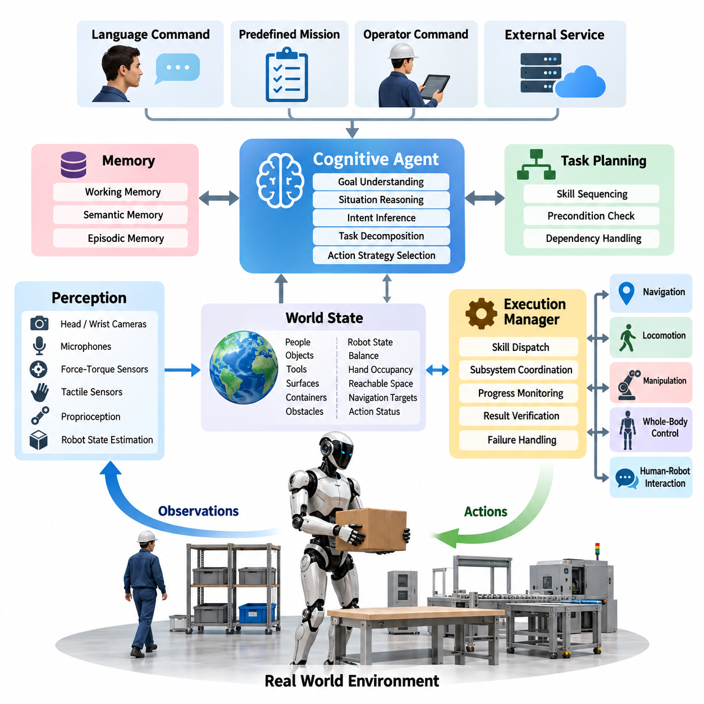{width="7.268055555555556in" height="7.268055555555556in"}

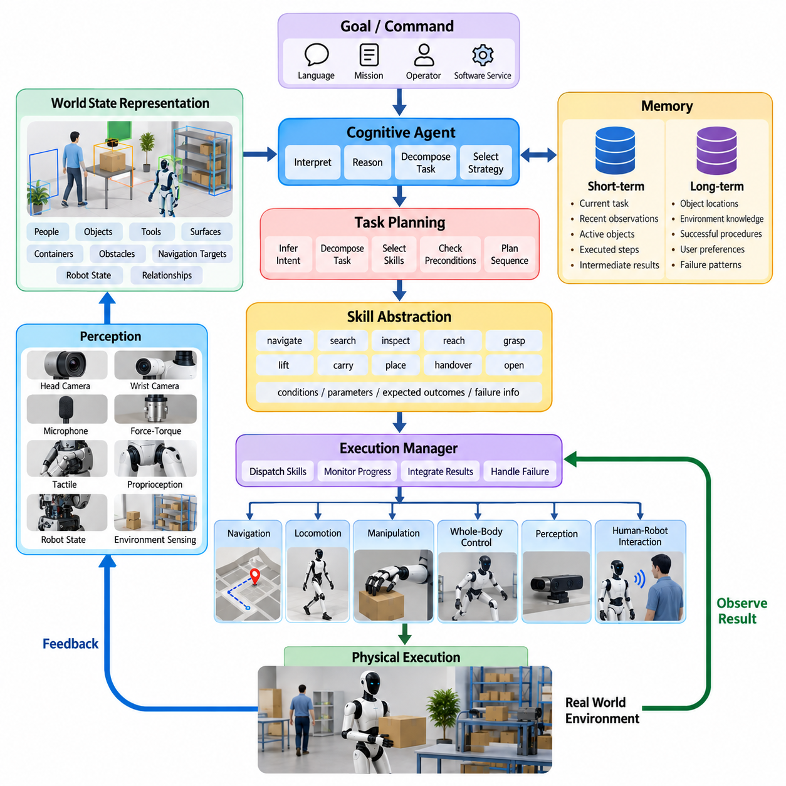{width="7.268055555555556in" height="7.268055555555556in"}

Humanoid AI agents extend conventional robot software by organizing perception, reasoning, memory, planning, and physical execution into a continuous closed-loop intelligence architecture. Rather than mapping a sensor observation directly to a predefined behavior, the agent interprets the current situation, relates it to a task objective, selects an appropriate action strategy, observes the physical consequence, and repeatedly updates its internal state until the objective is achieved. This perception-to-action organization provides the architectural foundation for the subsequent task-planning, memory, grounding, replanning, and safety functions defined in the humanoid AI agent stack. Volume_22_Humanoid_Robot_Softwa...

The perception layer converts heterogeneous observations from head cameras, wrist cameras, microphones, force-torque sensors, tactile sensors, proprioception, and robot state estimation into representations that the agent can reason about. Humanoid perception is inherently multimodal because manipulation, locomotion, communication, and physical interaction occur simultaneously. The architecture therefore requires temporal and spatial alignment of visual objects, human poses, language commands, contact states, robot configuration, and environmental geometry rather than treating each sensing modality as an isolated inference pipeline.

A world-state representation sits between raw perception and cognitive reasoning. It describes entities such as people, objects, tools, surfaces, containers, obstacles, manipulable regions, and navigation targets together with their attributes and relationships. Robot-centric information such as joint state, balance condition, hand occupancy, reachable workspace, locomotion mode, and current action status must also be represented. The resulting state acts as an operational abstraction of the physical environment that can be continuously updated as observations arrive and actions modify the scene.

The cognitive agent interprets the world state in relation to a goal expressed through language, a predefined mission, an operator command, or another software service. High-level reasoning determines what must happen rather than directly generating actuator commands. For a request such as placing an object into a container, the agent may infer that it must locate the object, approach it, establish a manipulation posture, grasp it, transport it, identify the destination, and release it. This decomposition separates semantic task reasoning from the lower-level control mechanisms required to physically realize each step.

Task planning transforms inferred intent into an executable sequence of skills while accounting for dependencies and physical preconditions. Agent actions can therefore be represented as parameterized capabilities such as navigate, search, inspect, reach, grasp, lift, carry, place, handover, open, close, speak, or wait. Each capability exposes conditions under which it can be invoked, required parameters, expected outcomes, and failure information. This skill abstraction prevents the reasoning system from operating directly on joint-level commands and creates a stable interface between cognitive intelligence and robot execution.

An execution manager bridges the relatively slow and nondeterministic reasoning process with deterministic robot subsystems. Once a skill is selected, the manager dispatches requests to navigation, locomotion, manipulation, whole-body control, perception, or human-robot interaction components and monitors their progress. A grasp command, for example, may activate object pose estimation, approach planning, arm motion, hand closure, force monitoring, and grasp verification while the high-level agent waits for a structured completion result instead of controlling every intermediate trajectory.

Humanoid embodiment makes this interface more complex than conventional software-agent tool invocation. Every symbolic action must ultimately satisfy physical constraints involving reachability, balance, collision avoidance, contact stability, actuator limits, available support polygons, and surrounding humans. A semantically valid plan can therefore be physically infeasible. The agent architecture must preserve a clear boundary between deciding what action is desirable and determining whether that action can safely be executed by the current robot configuration and control stack.

Memory provides continuity beyond instantaneous perception. Short-term working memory maintains the current task, recent observations, active objects, executed steps, intermediate outcomes, and unresolved conditions. Longer-lived semantic or episodic representations can preserve object locations, environment knowledge, previously successful procedures, user preferences, or recurring failure patterns. Memory allows the agent to reason over events that are no longer visible and prevents unnecessary rediscovery of information during long-horizon tasks involving movement between locations or multiple manipulation stages.

The perception-action loop must remain explicitly feedback driven because physical actions rarely produce perfectly predictable outcomes. After each meaningful operation, the robot should verify the resulting state rather than assume success from command completion. A grasp is confirmed through visual, tactile, force, or hand-state evidence; navigation is validated against localization and destination conditions; placement is checked by observing the object at the intended location. This verification converts an open-loop sequence of commands into an agent capable of detecting discrepancies between predicted and observed outcomes.

Failure handling is consequently a first-class architectural function rather than an exceptional software path. When execution fails, the agent should receive structured information describing the attempted action, observed condition, confidence, and relevant error state. It can then retry with modified parameters, reacquire perception, choose an alternative skill, revise the task sequence, request human assistance, or terminate safely. This mechanism becomes particularly important for humanoids because contact-rich manipulation and dynamic environments introduce uncertainty that cannot be eliminated entirely during planning.

Multiple time scales must coexist within the same architecture. Whole-body and actuator control may operate from hundreds of hertz to kilohertz, perception pipelines may update at video or sensor rates, learned policies may execute at tens of hertz, while language reasoning and task planning may operate over hundreds of milliseconds or seconds. The AI agent should therefore supervise rather than replace real-time control. Fast safety-critical stabilization remains within deterministic control layers, while slower cognitive processes provide goals, constraints, skill selection, and task-level adaptation.

Safety authority must remain independent of the cognitive agent. Agent-generated actions are treated as requests that pass through validation boundaries checking collision risk, joint and torque limits, balance feasibility, workspace restrictions, human proximity, forbidden actions, and operational policy. Emergency stopping, protective behavior, fall mitigation, and other critical safeguards cannot depend on successful language-model reasoning. This separation allows increasingly capable AI planning to be introduced without granting unrestricted authority over the humanoid\'s physical actuators.

A practical humanoid AI agent is therefore best understood as an orchestration architecture rather than a single intelligent model. Perception models establish what exists, multimodal grounding connects commands with physical entities, memory preserves task context, reasoning determines intent and dependencies, planning organizes skills, execution services invoke embodied capabilities, controllers realize motion, and verification closes the loop. The chapter structure intentionally develops these elements through task planning, cognitive memory, tool use, scene memory, failure-aware replanning, multimodal grounding, safety boundaries, and evaluation. Volume_22_Humanoid_Robot_Softwa...

This modular organization also allows different intelligence mechanisms to coexist. Deterministic state machines can manage safety-critical transitions, classical planners can enforce explicit task constraints, learned policies can perform dexterous skills, vision-language-action models can provide generalist behavior, and large language models can contribute semantic reasoning and task decomposition. The agent layer coordinates these components according to their strengths rather than forcing every problem into a single model, enabling the humanoid to combine predictable control with adaptable high-level intelligence.

The resulting perception-act architecture forms a recurring cycle of observe, interpret, reason, plan, execute, verify, and adapt. Its objective is not merely to make a humanoid respond intelligently to commands, but to maintain coherent behavior while the physical world changes during execution. By continuously connecting semantic understanding with embodied state and verified physical outcomes, the AI agent becomes the supervisory intelligence that transforms separate perception, locomotion, manipulation, VLA, and HRI capabilities into an integrated autonomous humanoid system.

## 10.02. LLM Based Task Planner for Humanoid [w/Code]

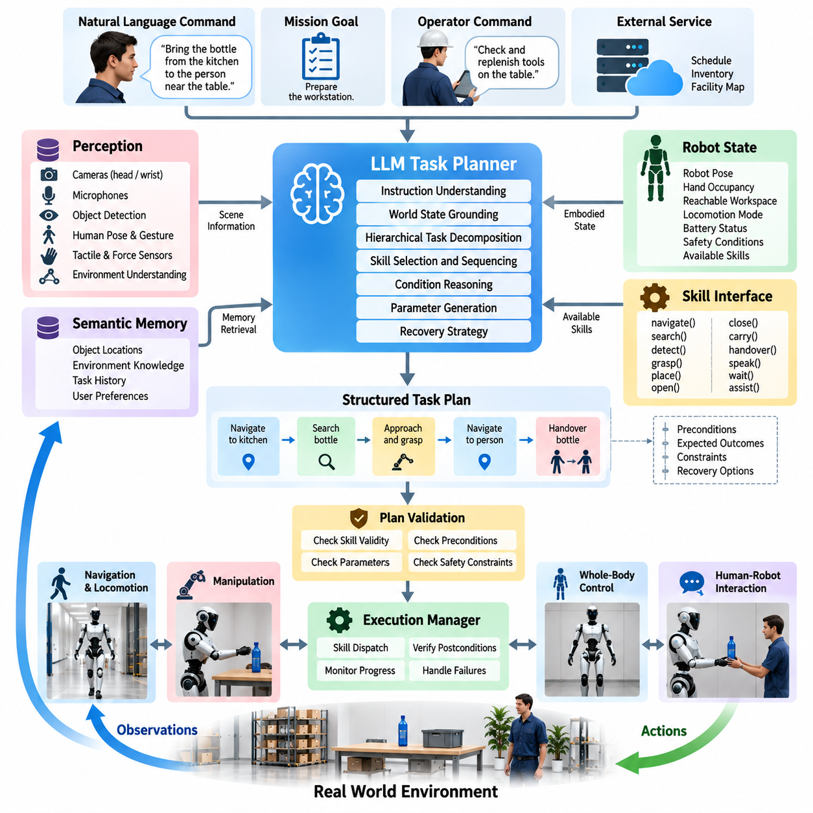{width="7.268055555555556in" height="7.268055555555556in"}

Large language model based task planning provides a semantic reasoning layer that converts natural-language goals into structured sequences of executable humanoid skills. Instead of requiring an operator to specify every navigation, perception, manipulation, and interaction command, the planner interprets the desired outcome and decomposes it into intermediate actions. Within the humanoid AI agent architecture, this capability extends the perception-action framework by connecting high-level intent with the robot's available embodied capabilities.

The LLM planner does not directly generate joint positions, torques, footsteps, or control trajectories. Its primary responsibility is task-level reasoning over symbolic and semantic representations. A command such as "bring the bottle from the kitchen to the person near the table" may be decomposed into locating the kitchen, navigating to it, searching for the bottle, approaching the object, grasping it, returning to the target person, and performing a safe handover. Lower-level robot modules remain responsible for realizing each selected skill.

A practical planner therefore requires a clearly defined skill interface. The humanoid may expose capabilities such as navigate, search, detect, inspect, reach, grasp, place, open, close, carry, handover, speak, wait, or request assistance. Each skill should describe its required parameters, preconditions, expected effects, execution constraints, and possible failure states. The LLM reasons over this bounded action vocabulary rather than inventing arbitrary actuator operations that cannot be executed by the physical robot.

Planning begins by grounding the user instruction in the current world state. References such as "that box," "the left shelf," or "the person who called me" cannot be interpreted reliably from language alone. The planner requires contextual information from perception, object tracking, semantic scene memory, human interaction, and robot state estimation. Multimodal grounding associates linguistic entities with observable people, objects, places, and actions so that generated task steps refer to physical targets that the robot can identify and manipulate.

The planning context should also contain the robot's current embodied state. A humanoid that is already holding an object, standing on stairs, carrying a load, operating with one unavailable arm, or experiencing reduced battery capacity cannot execute the same plan as a robot in an unconstrained initial state. Relevant context can include robot pose, hand occupancy, reachable regions, locomotion mode, active contacts, battery status, safety conditions, and currently available skills. This information constrains language-based reasoning with physical reality.

Long-horizon commands require hierarchical decomposition because a single instruction may contain many dependent subtasks. The LLM can first construct a high-level task sequence and then refine individual steps when execution approaches them. For example, "prepare the workstation" may expand into inspecting the workspace, identifying required tools, collecting missing objects, arranging them at designated locations, and verifying completion. Hierarchical planning limits unnecessary detail while preserving the ability to generate more specific actions when environmental information becomes available.

Preconditions and postconditions provide an important bridge between probabilistic language reasoning and deterministic task execution. Before executing grasp(object), the system may require that the object has been detected, its pose is sufficiently certain, the robot is within a reachable configuration, and the target hand is available. After execution, the planner should not simply assume that the object was acquired. A verified postcondition such as object-in-hand must be established through perception, tactile sensing, force information, or manipulator state before subsequent actions proceed.

Structured planner output is preferable to unrestricted natural-language responses. The LLM can produce an intermediate representation containing an action identifier, target entities, parameters, expected outcome, constraints, and recovery alternatives. A separate validation component parses this representation and rejects unknown actions, invalid arguments, inaccessible resources, or prohibited operations. This architecture treats the LLM as a reasoning component while maintaining software-defined interfaces between cognition and the executable humanoid control stack.

Task plans may combine sequential, conditional, and parallel relationships. Some actions must occur strictly in order, while perception or monitoring processes can operate concurrently with movement. Conditional branches are required when the correct next action depends on observations, such as whether a door is open, whether the requested object is present, or whether a person accepts a handover. The planner therefore benefits from representations resembling behavior trees, task graphs, finite-state structures, or symbolic plans rather than relying exclusively on a linear list of instructions.

Execution feedback continuously modifies the planning context. After every significant action, the execution manager reports whether the skill succeeded, failed, timed out, or produced an unexpected result. The planner can then compare the observed state with the expected postcondition and decide whether the original plan remains valid. This establishes a plan-execute-observe-replan loop in which language reasoning is repeatedly grounded in physical evidence instead of producing a complete plan once and assuming that the world remains unchanged.

Failure-aware replanning is especially important for humanoids because manipulation and locomotion operate in uncertain environments. If an object cannot be grasped, the planner may request another viewpoint, reposition the body, choose the other hand, select an alternative grasp, or ask a human for assistance. If a navigation route becomes blocked, the corresponding subtask can be replaced without necessarily regenerating the entire mission. Recovery should therefore preserve successful task progress and revise only the portions invalidated by new observations.

Memory enables the LLM planner to maintain coherence across extended tasks. Working memory can preserve the current objective, completed steps, unresolved conditions, recently observed entities, and previous failures. Semantic scene memory can provide information about known object locations and environmental relationships, while episodic memory can retain successful strategies from earlier interactions. These memory systems reduce repeated reasoning and allow later planning decisions to incorporate information acquired during earlier stages of execution.

Tool use extends the planner beyond purely linguistic reasoning. Robot perception services, map queries, object databases, motion feasibility checks, grasp planners, navigation systems, and diagnostic interfaces can be exposed as callable tools. When information is uncertain, the LLM should request the appropriate service rather than fabricate a result. For example, it can invoke object detection to confirm an item, query a semantic map for a destination, or request a reachability test before committing to a manipulation step.

Safety constraints must surround the planner rather than exist only as text inside its prompt. Generated actions should pass through independent checks for collision risk, human proximity, restricted areas, joint and torque limits, balance feasibility, payload limits, and operational permissions. A language model may recommend an action semantically consistent with the goal but physically unsafe. The safety architecture therefore retains authority to modify, reject, pause, or terminate agent requests regardless of the planner's confidence.

Latency and computational cost also influence the architecture. High-level LLM inference can operate at task-transition time scales, whereas balance, whole-body control, collision response, and actuator regulation require much faster deterministic loops. Replanning should consequently be triggered by meaningful state transitions, failures, ambiguity, or goal changes rather than every sensor frame. Frequently repeated physical behaviors can remain within cached skills or learned policies while the LLM concentrates on semantic decisions requiring broader context.

Planner reliability should be evaluated at both semantic and physical levels. A logically coherent decomposition is insufficient if its actions cannot be executed, if necessary preconditions are omitted, or if the resulting behavior repeatedly invokes expensive recovery procedures. Evaluation can therefore examine task completion, plan validity, unnecessary action count, execution efficiency, recovery success, grounding accuracy, safety violations, and robustness to changing environments. Such metrics distinguish fluent language generation from effective embodied planning.

The LLM-based task planner ultimately functions as the deliberative layer between human-level objectives and humanoid-level skills. Perception establishes the current situation, grounding connects language with physical entities, memory preserves relevant history, the LLM decomposes goals and selects actions, execution services invoke robot capabilities, and feedback verifies their consequences. Through this closed-loop organization, language models become useful not as direct robot controllers but as constrained task reasoners coordinating perception, locomotion, manipulation, interaction, and recovery within an embodied humanoid agent.

## 10.03. Cognitive Architecture Perception Memory Action [w/Code]

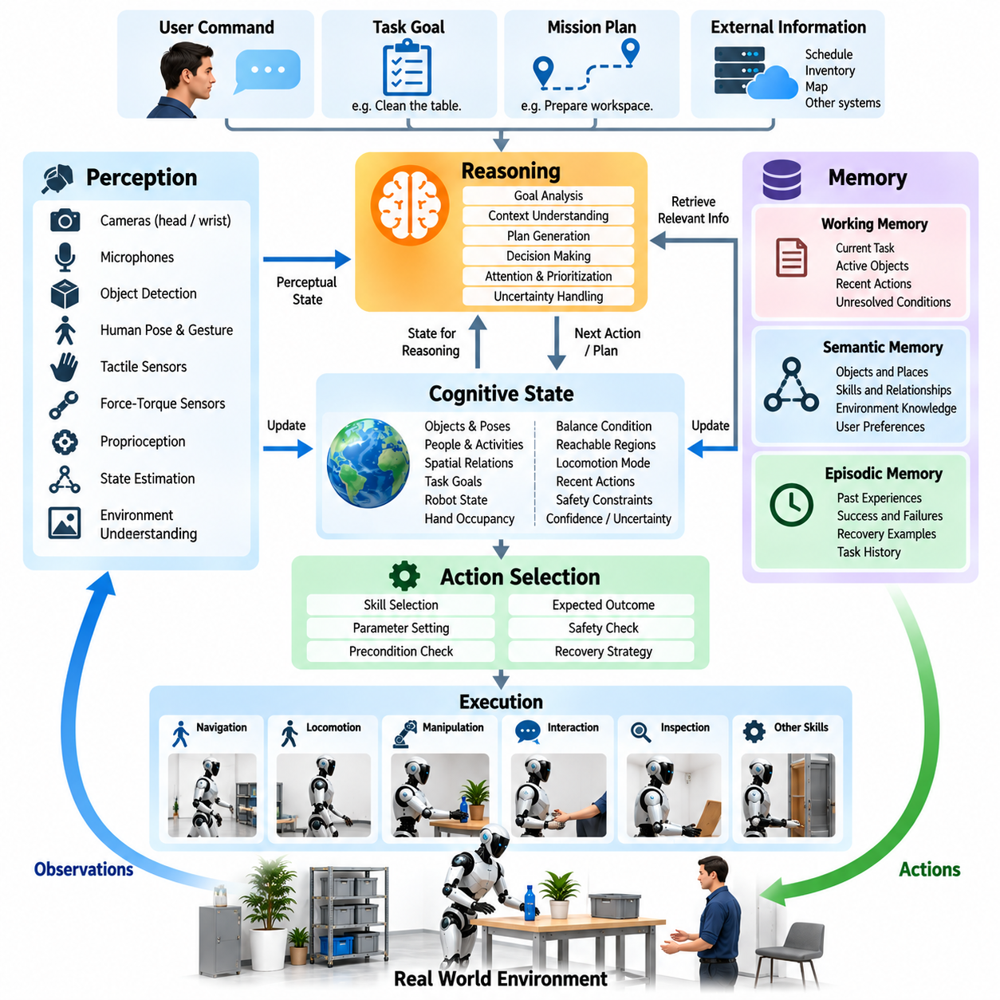{width="7.268055555555556in" height="7.268055555555556in"}

A cognitive architecture for a humanoid robot organizes intelligence as a continuous interaction among perception, memory, reasoning, and action. Perception estimates what is happening in the environment and within the robot, memory preserves information that cannot be recovered from the current observation alone, and action changes the physical world. Rather than operating as independent modules, these functions form a recurrent cognitive loop in which every action produces new observations that update the robot's internal state.

Perception forms the interface between the physical environment and the cognitive system. Cameras, microphones, tactile sensors, force-torque sensors, proprioception, and state estimation generate observations at different rates and levels of abstraction. The cognitive architecture does not require every raw measurement to enter high-level reasoning. Instead, perception transforms sensor streams into useful entities, events, spatial relationships, human activities, contact conditions, and confidence estimates that can support task decisions.

The resulting perceptual state must distinguish observation from interpretation. A camera may provide evidence that an object occupies a particular image region, while a perception model estimates its identity and pose and the cognitive layer interprets it as the tool required for the current task. Maintaining these distinctions helps the system represent uncertainty explicitly. When confidence is insufficient, the agent can acquire another viewpoint, approach the object, request clarification, or invoke a specialized perception capability before acting.

Working memory maintains information needed for the currently active task. It may contain the user's command, task goal, current plan, recently detected objects, selected target, completed actions, unresolved conditions, and execution failures. This representation prevents each reasoning cycle from starting from an empty context. When a humanoid leaves one room to retrieve an object from another, working memory preserves why the movement occurred and what should happen after the object has been acquired.

Semantic memory represents relatively persistent knowledge about objects, places, skills, and relationships. It can encode that a cabinet contains tools, a workstation has a designated material area, a particular object requires two-handed manipulation, or a named location corresponds to a region of the semantic map. Unlike transient sensor observations, semantic knowledge supports reasoning across time and allows the humanoid to use previously established environmental structure when planning future actions.

Episodic memory complements semantic memory by preserving task-specific experiences. An episode can record the initial situation, selected actions, important observations, failures, recoveries, and final outcome of an interaction. When a similar situation occurs later, the agent can retrieve relevant experience to guide planning. Episodic memory should not be treated as unquestionable truth because the environment may have changed; retrieved experience becomes contextual evidence that must be reconciled with current perception.

A unified cognitive state combines selected perceptual information with relevant memories and the robot's embodied condition. This state can include object identities and poses, people and their activities, spatial relationships, active task goals, hand occupancy, balance condition, reachable regions, locomotion mode, recent actions, and safety constraints. The representation acts as a shared context through which perception, planning, execution, and memory services exchange information without requiring every subsystem to interpret raw sensor data independently.

Attention and context selection become necessary because the complete sensory and memory history is too large for every reasoning cycle. The cognitive system should prioritize information relevant to the active goal while retaining mechanisms for detecting unexpected events. During a handover, for example, the target person, held object, hand pose, contact forces, and nearby obstacles may receive priority, while unrelated objects remain represented at lower detail. Attention therefore manages computational resources without eliminating environmental awareness.

Reasoning operates over this selected cognitive state to determine what should happen next. An LLM, symbolic planner, behavior tree, learned policy selector, or hybrid mechanism may participate depending on the task. The reasoning layer evaluates goals, current conditions, remembered information, skill preconditions, and expected consequences. Its output should normally identify an executable skill or planning decision rather than directly specifying actuator commands, preserving separation between cognition and real-time physical control.

Action selection translates cognitive decisions into requests for embodied robot capabilities. A selected operation may invoke navigation, locomotion, reaching, grasping, bimanual manipulation, speaking, inspection, or another predefined skill. Each skill operates through lower-level motion planning and control components that enforce kinematic, dynamic, contact, and balance constraints. This hierarchy allows cognitive reasoning to operate using meaningful actions while deterministic controllers manage the fast physical processes required to execute them safely.

The cognitive loop remains incomplete until action outcomes are perceived and interpreted. Command completion alone does not establish that the intended state was achieved. After grasping, the system must determine whether the object is actually secured; after placing, it must verify the object's final location; after speaking, it may need to observe whether the human responded. Verified outcomes update working memory and the cognitive state, providing the evidence required to continue, retry, or modify the plan.

Memory writing requires selection just as memory retrieval does. Storing every sensor sample and intermediate state as cognitive memory would create unnecessary scale and reduce retrieval quality. The architecture should instead preserve task-relevant events such as successful skill completion, changed object relationships, important human instructions, repeated failures, environmental discoveries, and recovery outcomes. Detailed sensor logs can remain in separate data systems while cognitive memory maintains compact representations useful for future reasoning.

Temporal reasoning is particularly important for humanoids because tasks unfold through sequences of changing physical states. The agent must distinguish what is currently true from what was previously true and what is expected after an action. An object remembered on a table may have been moved, a person may have left the workspace, or a door previously closed may now be open. Time-stamped observations and memory updates help prevent stale information from being treated as current physical reality.

Uncertainty should propagate through perception, memory, and action selection rather than disappear at module boundaries. Object identity may be uncertain, remembered location information may be outdated, and predicted action outcomes may have limited confidence. The cognitive architecture can use these uncertainties to decide when additional observation is more appropriate than immediate execution. Active perception therefore becomes part of cognition: the robot intentionally moves sensors or its body to obtain information required for safer decisions.

Failure creates another important interaction between memory and action. When execution reports that a grasp, navigation attempt, or manipulation skill failed, the cognitive state records both the failure and the conditions surrounding it. Reasoning can then determine whether to retry, modify parameters, select another skill, reacquire perception, or request assistance. Repeated failures can be summarized into memory so that the agent avoids cycling indefinitely through strategies that have already proved ineffective.

Safety information must remain continuously available within the cognitive loop while also being enforced independently of it. The agent can reason about restricted regions, nearby humans, payload limitations, unstable postures, or prohibited actions, but hard safety mechanisms must retain authority over execution. If cognitive reasoning requests an unsafe action, an external safety layer can reject or modify it. The resulting architecture combines context-aware safety reasoning with deterministic physical protection.

Different parts of cognition operate at different time scales. Perception and state estimation may update continuously, task reasoning may occur around meaningful events, memory retrieval may be triggered by contextual needs, and real-time controllers may execute at hundreds or thousands of cycles per second. Event-driven interfaces prevent the cognitive layer from unnecessarily reasoning over every sensor frame while allowing significant changes, failures, human commands, or safety events to immediately update the agent's decision context.

The perception-memory-action architecture therefore provides the internal continuity required for autonomous humanoid behavior. Perception grounds cognition in the present physical world, memory connects the present with relevant past information, reasoning converts goals and context into decisions, and action tests those decisions through physical execution. By repeatedly observing, remembering, deciding, acting, and verifying, the humanoid develops a coherent cognitive process capable of supporting long-horizon tasks, changing environments, human interaction, and failure-aware autonomous operation.

## 10.04. Multi Step Task Planning with Tool Use [w/Code]

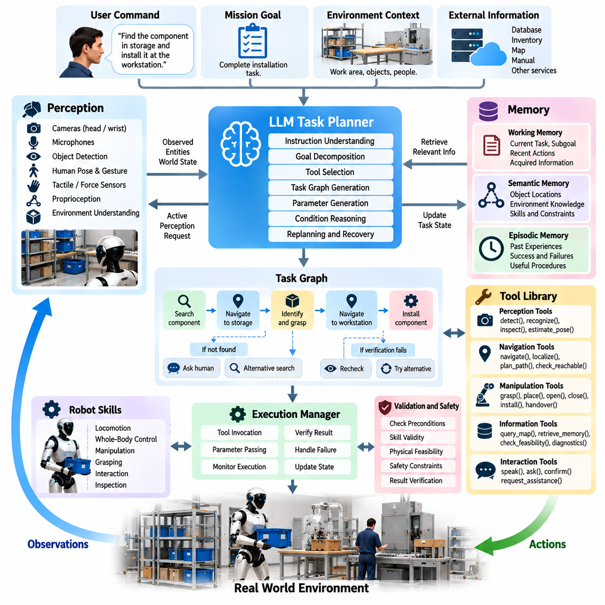{width="7.268055555555556in" height="7.268055555555556in"}

Multi-step task planning with tool use enables a humanoid agent to solve objectives that cannot be completed through a single skill or one reasoning operation. A complex instruction may require perception, navigation, manipulation, memory access, communication, and external information services in a coordinated sequence. The planner must therefore determine not only which physical actions are required, but also when specialized computational or robotic tools should be invoked to obtain information, validate assumptions, or execute subtasks.

A tool represents a bounded capability exposed to the cognitive agent through a defined interface. Physical tools may include navigation, reaching, grasping, bimanual manipulation, inspection, handover, or locomotion services, while informational tools may provide object detection, semantic map queries, memory retrieval, motion feasibility checking, diagnostics, or database access. The agent reasons about these capabilities through their descriptions and parameters rather than directly controlling their internal implementation.

Complex goals are first decomposed into intermediate states that establish dependencies between actions. For a request such as "find the requested component in storage and install it at the workstation," the agent may need to identify the component, determine its probable location, navigate to storage, search the relevant region, verify the object, grasp it, return to the workstation, inspect the installation location, and perform the required manipulation. Each completed step establishes conditions needed by later steps.

Tool selection should be driven by missing information or required physical capability. If the object location is unknown, the planner may query semantic scene memory before initiating a costly physical search. If several visually similar objects are present, it may invoke a specialized recognition service. Before manipulating a heavy or awkward component, it may request a reachability or payload feasibility check. Tool use therefore allows reasoning to actively acquire evidence instead of relying on unsupported assumptions.

Each tool should expose a structured contract containing its purpose, required arguments, preconditions, expected result, failure modes, and relevant constraints. For example, a grasp tool may require an object identifier, estimated pose, selected hand, and grasp strategy, while returning success status, grasp confidence, and updated hand occupancy. Explicit contracts reduce ambiguity between language-level planning and executable software and prevent the reasoning model from inventing parameters or capabilities unavailable on the robot.

Tool calls should be grounded in the current cognitive state. An instruction to inspect "the container beside the operator" requires the agent to associate the linguistic reference with a perceived physical entity before passing an identifier to an inspection tool. Similarly, navigation requires a valid destination, manipulation requires a reachable target, and handover requires identification of the intended recipient. Multimodal grounding therefore connects language reasoning, perception, memory, and executable tool interfaces.

The planner can represent a multi-step procedure as a task graph rather than a fixed sequence. Nodes describe actions or tool calls, while dependencies indicate which results must exist before subsequent operations begin. Some branches may execute conditionally, and independent perception or monitoring processes may run concurrently. This representation supports tasks in which the correct next action cannot be determined until an earlier tool returns information about the environment.

Observation is itself an important form of tool use. A humanoid may intentionally move its head, reposition its body, inspect an object with a wrist camera, or approach a region to reduce perceptual uncertainty. If a target is partially occluded, planning should not immediately classify the task as impossible or guess the hidden state. Instead, the agent can insert an active perception action that creates a more informative observation and then continue planning from the updated world state.

Memory retrieval also functions as a cognitive tool within long-horizon tasks. The agent may query semantic memory for known object locations, retrieve a previously successful procedure, or examine recent task history to determine which actions have already been attempted. Retrieved information should be treated as contextual evidence rather than guaranteed current truth. When physical conditions may have changed, memory results should be verified through present perception before they drive consequential actions.

A multi-step planner must maintain execution state across tool calls. This state records the original goal, current subgoal, completed actions, unresolved dependencies, acquired information, held objects, selected resources, and outstanding failures. Without persistent state, the agent may repeat completed work or lose the relationship between an earlier observation and a later action. The execution state therefore acts as the operational memory of the active plan.

Tool outputs should update the world model through structured observations rather than remain isolated textual responses. A successful navigation call changes the robot location; a grasp changes object ownership and hand occupancy; an inspection may update object identity or condition; opening a door modifies accessibility relationships. By converting tool results into state changes, the architecture allows subsequent reasoning to operate on the consequences of execution instead of merely storing a history of commands.

Verification gates are particularly important between dependent physical actions. A tool reporting that its command completed does not necessarily prove that the intended physical outcome occurred. After grasping, perception or tactile sensing should verify object retention before carrying begins. After opening a container, the system should verify access before searching inside. These gates prevent a single unnoticed execution error from propagating through the remaining steps of a long task.

Failures should return structured diagnostic information that can support local recovery. If navigation fails because a route is blocked, the planner can search for an alternative route without changing the manipulation portion of the mission. If grasping fails because the target pose is uncertain, it can reacquire perception rather than restart the entire task. Local replanning preserves successful progress and reduces the cost of recovery in long sequences containing many independent subtasks.

Tool-use planning must also distinguish recoverable failure from conditions requiring escalation. Repeated grasp failure may justify changing hands or viewpoints, while an unavailable object may require clarification from a human. A safety violation, hardware fault, or inaccessible workspace may require task suspension. The planner should therefore reason about retry limits, alternative capabilities, assistance requests, and termination conditions rather than repeatedly invoking the same unsuccessful tool.

Safety validation surrounds both physical and informational tool calls. Before executing a motion-related tool, independent mechanisms can check human proximity, collision risk, balance feasibility, joint limits, payload constraints, and restricted regions. Tool availability can also depend on operational mode and authorization. The cognitive planner proposes actions, but the safety and execution layers retain authority over whether those actions are physically permissible.

Efficient planning avoids unnecessary tool invocation. Repeated perception queries, redundant map searches, or excessive LLM reasoning can increase latency without improving task success. The agent can reuse sufficiently recent results, cache stable environmental information, and invoke expensive tools only when uncertainty affects the next decision. At the same time, stale information must be invalidated when actions or external events are likely to have changed the relevant state.

The architecture must separate slow deliberation from fast execution. An LLM may determine subgoals and choose tools at meaningful task transitions, while locomotion, whole-body control, manipulation, and protective responses execute through faster dedicated systems. Once a physical skill begins, the cognitive agent supervises its progress rather than generating every control update. This division preserves real-time stability while retaining semantic flexibility at the task level.

Evaluation of multi-step tool use should consider more than final task completion. Useful measures include valid tool selection, argument correctness, number of unnecessary calls, plan length, execution time, recovery efficiency, state consistency, grounding accuracy, and safety compliance. Long-horizon evaluation should additionally test whether the agent preserves context after many actions and whether early errors are detected before they cascade into later stages.

Multi-step planning with tool use ultimately turns the humanoid AI agent into an orchestrator of specialized intelligence and physical capabilities. The planner decomposes objectives, identifies missing information, selects appropriate tools, interprets their results, updates cognitive state, verifies physical outcomes, and replans when necessary. Through this iterative process, complex goals become manageable sequences of grounded decisions and embodied actions rather than monolithic commands expected to succeed without feedback.

## 10.05. Semantic Scene Memory and Object Tracking [w/Code]

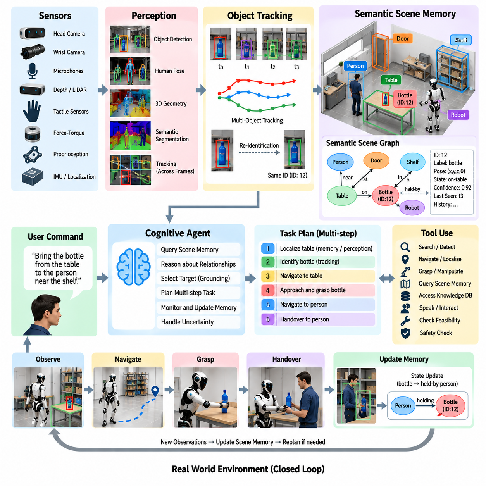{width="7.268055555555556in" height="7.268055555555556in"}

Semantic scene memory allows a humanoid agent to maintain a persistent representation of the environment beyond what is visible in the current sensor frame. A robot performing long-horizon tasks must remember where objects were observed, how they relate to surrounding structures, who interacted with them, and whether their states have changed. Combined with object tracking, scene memory provides continuity between perception events and enables reasoning about physical entities across movement, occlusion, manipulation, and time.

Conventional perception pipelines primarily describe what is currently observable, whereas semantic scene memory represents what the agent has learned about the environment over previous observations. The memory may contain objects, people, furniture, containers, tools, workstations, doors, navigable regions, and other task-relevant entities. Each entity can be associated with semantic labels, spatial position, attributes, relationships, confidence, observation history, and timestamps describing when the information was acquired or updated.

Persistent object identity is essential because repeated detections of the same physical object should not automatically create independent entities. Object tracking associates observations across frames and viewpoints by considering visual appearance, estimated pose, motion, geometry, semantic class, and temporal consistency. A persistent identifier allows the cognitive system to reason that the bottle currently held by the robot is the same bottle previously observed on a table even though its position and visual appearance have changed substantially.

Humanoid mobility makes object tracking particularly challenging because the observer itself moves through the environment. Head rotation, walking, body motion, manipulation, and changing camera viewpoints can create large apparent motion even when objects remain stationary. Tracking should therefore use robot localization, camera pose, depth information, and geometric transformations to separate ego-motion from object motion. Scene memory can then express object positions in stable world, map, room, or task-relative coordinate frames.

Occlusion requires the architecture to distinguish between an object that is not currently visible and an object that no longer exists at its remembered location. When a person passes in front of a tool or the humanoid turns away from a table, the object should remain represented in memory with decreasing confidence rather than immediately being deleted. If the robot later observes the region and the object is absent, the system can revise its belief and initiate search, reassociation, or state-change reasoning.

Semantic relationships make scene memory more useful than a collection of independent object records. The system can represent relations such as on, inside, beside, attached-to, held-by, reachable-from, belongs-to, or located-in. A cup may be represented as on a workstation, a component as inside a container, and a tool as held by a human operator. These relationships support task planning because many instructions refer to relational structure rather than absolute coordinates.

Manipulation directly changes the semantic scene graph and therefore requires explicit memory updates. When the humanoid grasps an object, its relationship may change from on-table to held-by-robot, and its pose becomes linked to the hand rather than the original surface. After placement, the object receives a new spatial relationship and world pose. Updating these transitions allows subsequent planning to reason from the physical consequences of actions rather than from stale pre-manipulation observations.

Object state should be represented separately from object identity. The same door can be open or closed, a container can be empty or occupied, a tool can be available or in use, and a component can be assembled or unassembled. State estimates may originate from perception, manipulation feedback, human instructions, or task execution results. Maintaining state history allows the agent to understand not only which entities exist but also how their task-relevant conditions evolve over time.

Memory entries should include uncertainty and freshness because stored information gradually becomes less reliable when it is not reobserved. Confidence may depend on detection quality, tracking consistency, elapsed time, environmental dynamics, and whether intervening actions could have changed the scene. A recently verified stationary cabinet may remain reliable for a long period, whereas the remembered location of a movable tool or person may become uncertain quickly. Planning can use this distinction to determine when reobservation is necessary.

Re-identification becomes important when an object disappears from view and later returns. The tracking system must determine whether a new detection corresponds to an existing memory entity or represents a different object of the same class. Appearance embeddings, geometry, dimensions, semantic attributes, last known pose, temporal constraints, and contextual relationships can contribute to this association. Ambiguous cases should preserve multiple hypotheses rather than forcing an incorrect identity assignment.

Scene memory can be organized hierarchically to support efficient reasoning. A building may contain rooms, rooms may contain work areas, work areas may contain furniture or equipment, and those structures may contain manipulable objects. Such hierarchy allows the agent to search at an appropriate level of abstraction. If a requested tool is not immediately visible, the robot can first reason about its likely room or workstation before performing detailed local perception.

Semantic scene memory also provides an important interface to language. Expressions such as "the box beside the printer," "the tool I used earlier," or "the component on the upper shelf" require the agent to resolve linguistic references against remembered entities and relationships. Language grounding can query scene memory for candidates, compare their semantic and spatial attributes, and request additional perception when several entities remain plausible.

Active perception can be triggered when scene memory is insufficient for a reliable decision. If an object is remembered inside a cabinet but its current state is uncertain, the agent may navigate to the cabinet, open it if permitted, and inspect the interior. If two similar objects cannot be distinguished, the humanoid may reposition its head or wrist camera to obtain a better view. Memory therefore guides perception toward information gaps instead of requiring exhaustive observation of the entire environment.

Scene memory must interact with task memory without becoming identical to it. Scene memory describes persistent entities and environmental relationships, while task memory records goals, completed actions, failures, and execution progress. The two systems intersect when task actions change the environment. A successful placement updates both the task state indicating that the step is complete and the scene state indicating the object's new location and relationship.

Multiple sensors can contribute evidence to the same persistent object. Head cameras provide broad environmental observations, wrist cameras provide close-range manipulation views, tactile sensing confirms contact, and force information can indicate whether an object remains held. Sensor fusion should update a common entity representation rather than generating disconnected identities for each modality. This becomes especially important during grasping, when visual visibility may decrease precisely as tactile evidence becomes more informative.

Memory management is necessary because continuously operating humanoids can accumulate enormous numbers of observations and transient entities. The system should retain task-relevant persistent objects and relationships while compressing or removing redundant observations. Frequently changing low-value details can remain in short-term storage, whereas stable semantic knowledge can be consolidated into longer-lived memory. Historical records may be preserved separately when they are useful for debugging, learning, or episodic reasoning.

Consistency checking prevents contradictory memory from silently influencing planning. An object should not simultaneously be represented as held by the robot and resting on a distant shelf unless uncertainty or multiple hypotheses explicitly explain the conflict. Action outcomes, new observations, and tracking results should trigger reconciliation of incompatible states. When contradictions cannot be resolved automatically, the agent can lower confidence and acquire additional evidence before taking consequential action.

Semantic scene memory and object tracking ultimately provide the spatial and temporal continuity required by an embodied cognitive agent. Tracking maintains identity across observations, semantic memory preserves relationships and state, uncertainty indicates when stored knowledge should be questioned, and active perception refreshes information when necessary. Together these mechanisms allow a humanoid to reason about objects that are visible, temporarily hidden, moved by actions, encountered earlier, or referenced later during complex multi-step tasks.

## 10.06. Failure Aware Task Replanning Agent [w/Code]

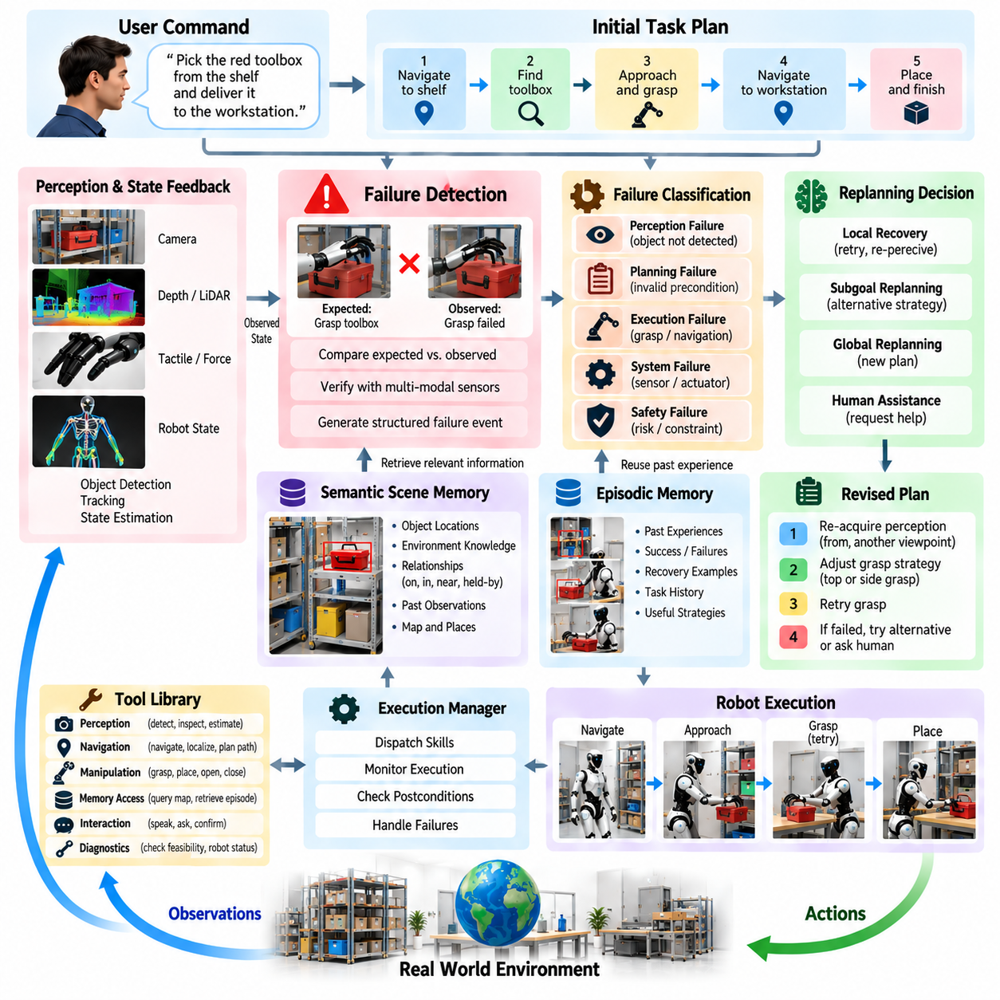{width="7.268055555555556in" height="7.268055555555556in"}

Failure-aware task replanning enables a humanoid agent to continue operating when actions do not produce their expected results. Physical environments contain uncertainty from perception errors, moving objects, human interference, contact dynamics, localization drift, and hardware limitations. A robust agent therefore cannot assume that an initially generated plan will remain valid. It must detect discrepancies, identify their consequences, preserve successful progress, and revise only the affected portions of the task.

Failure detection begins by comparing expected postconditions with observed outcomes. A navigation command may report completion while the robot remains outside the required interaction region, or a grasp command may finish without securely holding the object. The agent should therefore verify important state transitions using perception, proprioception, tactile sensing, force measurements, localization, and execution feedback rather than relying exclusively on software-level completion signals.

Failures should be represented as structured events rather than generic success-or-failure flags. Useful information includes the failed skill, target entity, execution phase, observed state, expected state, confidence, diagnostic code, elapsed time, and relevant environmental conditions. A grasp failure caused by uncertain object pose requires a different response from one caused by insufficient reach or excessive payload. Structured failure descriptions provide the context required for meaningful replanning.

Failure classification helps determine the appropriate recovery scope. Perceptual failures arise when required entities cannot be detected or identified reliably. Planning failures occur when preconditions or dependencies are invalid. Execution failures may involve blocked navigation, unsuccessful grasping, unstable contact, or motion infeasibility. System failures can include unavailable sensors, actuator faults, communication loss, or depleted resources. Safety failures occur when continued execution would violate operational constraints.

The replanning agent should first determine whether the failure can be resolved locally. If a grasp fails because the target pose is inaccurate, reacquiring perception and generating another grasp may be sufficient. If navigation fails because a temporary obstacle blocks the route, a local path update may restore progress. Local recovery avoids unnecessarily regenerating an entire long-horizon plan and preserves previously completed actions, acquired objects, environmental discoveries, and valid task dependencies.

When local recovery is insufficient, the agent may revise the current subgoal while preserving the higher-level objective. A humanoid unable to reach an object from its current posture can reposition its body, approach from another direction, use the opposite hand, or select a different manipulation strategy. This form of subgoal replanning changes how an objective is achieved without changing the objective itself, allowing the system to exploit multiple embodied strategies for the same semantic task.

More substantial failures can invalidate dependencies elsewhere in the plan. If the requested component is absent from its expected storage location, subsequent grasp, transport, and installation actions are no longer executable. The agent may need to search alternative locations, query semantic memory, inspect another container, or ask a human for information. Replanning must therefore propagate changed conditions through the task graph and identify which future actions remain valid and which must be replaced.

The cognitive state provides the continuity required during replanning. It should preserve the original goal, completed steps, current robot configuration, held objects, discovered scene information, attempted recovery strategies, and unresolved constraints. Without this state, the planner may repeat successful actions or lose physical resources already acquired. Failure recovery should begin from the actual current world state rather than reconstructing the mission from its original starting conditions.

Semantic scene memory supports recovery by providing alternative hypotheses about objects and locations. If a tool is missing from a workstation, memory may indicate another cabinet where it has previously been observed. Object tracking can reveal that the tool was moved by a person rather than lost by the perception system. However, remembered information may be stale, so the replanning agent should combine memory retrieval with current observation before committing to consequential recovery actions.

Active perception is often the safest first response to ambiguous failure. When the system cannot determine whether an object moved, a grasp slipped, or a detector simply lost visibility, additional observation may resolve the uncertainty without changing the task plan. The humanoid can move its head, reposition its body, use a wrist camera, inspect contact state, or request another sensor inference. Replanning should distinguish insufficient information from genuine physical impossibility.

Recovery policies should prevent uncontrolled repetition. A failed action may be retried when conditions have meaningfully changed, but repeating the same command with identical parameters can create an infinite failure loop. The agent can maintain retry counters, attempted parameter sets, previously selected viewpoints, and unsuccessful alternatives. Each recovery attempt should either acquire new information, modify execution conditions, or choose a different strategy before another attempt is authorized.

The agent should also estimate the cost and risk of recovery alternatives. Reattempting a nearby grasp may be inexpensive, while walking to another room, opening multiple containers, or reorganizing the environment may consume substantial time and energy. Recovery selection can consider expected success probability, execution time, energy consumption, task priority, physical risk, and disruption to humans. The best recovery is therefore not always the shortest sequence of actions.

Human assistance provides an important escalation path when autonomous recovery becomes unreliable or inefficient. The agent may ask which of several objects is intended, request that an inaccessible item be moved, report a blocked workspace, or explain that a required component cannot be found. Assistance requests should include concise contextual information describing what was attempted and what information or intervention is required, allowing collaboration without discarding the robot's existing task progress.

Safety mechanisms must remain authoritative throughout failure recovery. A replanning model must not relax collision constraints, torque limits, balance requirements, restricted zones, or human-proximity rules merely because the original action failed. Repeated failures can indicate that the requested objective is physically unsafe or currently infeasible. In such cases the correct response may be to suspend the task, enter a safe posture, request assistance, or terminate execution rather than continue searching for increasingly aggressive alternatives.

Hardware and software degradation require capability-aware replanning. If a wrist camera becomes unavailable, the agent may determine whether head-camera perception can support the remaining task. If one arm is disabled, some operations may be reassigned to the other arm while bimanual tasks become infeasible. The planner should update its available skill set and preconditions when system health changes so that newly generated plans do not depend on capabilities that are no longer operational.

Replanning should operate at a slower cognitive time scale than stabilization and protective control. A loss of balance, excessive contact force, or imminent collision requires immediate deterministic response before an LLM or task planner evaluates the situation. Once the robot reaches a safe state, the cognitive agent can analyze the event, update its task context, and determine whether and how execution should resume. This separation prevents deliberative latency from compromising physical safety.

Failure history can improve later decisions when summarized into episodic memory. The system may record that a particular grasp orientation repeatedly failed, that a route is often blocked at a certain time, or that a specific object requires two-handed handling. Future planning can retrieve these experiences to avoid known ineffective strategies. Such memory should remain contextual rather than absolute because robot configuration, environment, and operating conditions may change.

Evaluation of failure-aware agents should measure recovery behavior rather than task success alone. Relevant properties include failure detection accuracy, diagnosis quality, time to recovery, number of repeated attempts, preservation of completed progress, replanning validity, human intervention frequency, safety compliance, and final task completion. Tests should deliberately introduce perception errors, moved objects, blocked routes, manipulation failures, unavailable resources, and subsystem degradation to determine whether recovery remains coherent.

A failure-aware task replanning agent ultimately transforms failure from an exceptional termination condition into information for continued decision making. The agent detects deviations, diagnoses their context, updates perception and memory, selects an appropriate recovery scope, validates safety, and resumes execution from the resulting physical state. Through this closed-loop process, humanoid autonomy becomes resilient to the uncertainty and variability inherent in real environments while maintaining controlled, explainable, and goal-directed behavior.

## 10.07. Multi Modal Grounding for Agent Commands [w/Code]

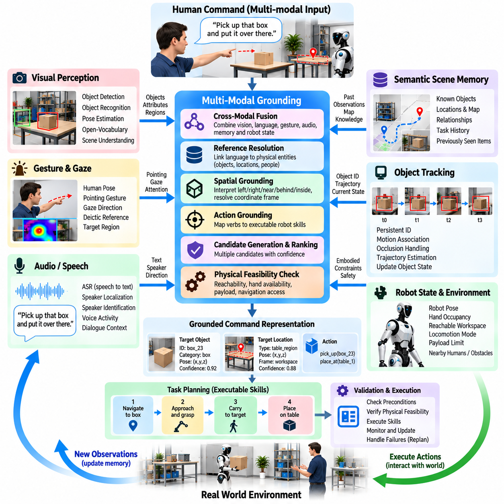{width="7.268055555555556in" height="7.268055555555556in"}

Multimodal grounding allows a humanoid agent to connect human commands with the physical entities, locations, actions, and events to which those commands refer. Language alone is often insufficient because instructions depend on what the robot can see, hear, remember, touch, or infer from its current situation. Grounding therefore links linguistic representations with visual perception, spatial information, gestures, gaze, audio, object state, robot state, and semantic memory before an agent converts an instruction into executable actions.

A command such as "pick up that box and put it over there" contains almost no explicit physical coordinates. The words "that box" and "over there" must be resolved using contextual evidence such as the speaker's pointing gesture, gaze direction, visible objects, spatial relationships, and recent dialogue. Multimodal grounding transforms these ambiguous expressions into persistent scene entities and target regions that task planning, navigation, and manipulation systems can reference reliably.

Visual grounding associates language with objects and regions detected by cameras or other environmental sensors. Object category, appearance, color, shape, size, pose, text labels, and surrounding context can all contribute to identifying a referenced entity. Open-vocabulary perception is particularly useful when users employ descriptions that are not part of a fixed object taxonomy. The grounding system should preserve candidate objects and confidence values when several visible entities satisfy the same linguistic description.

Spatial grounding interprets relational expressions such as left, right, behind, beside, above, inside, near, or closest. These terms are meaningful only with respect to an appropriate reference frame. "The box on the left" may refer to the speaker's viewpoint, the robot's viewpoint, or a workstation-centered frame. The agent must infer or clarify the intended frame before acting, because an incorrect spatial interpretation can produce a semantically plausible but physically incorrect action.

Gesture and gaze provide additional evidence when language contains deictic expressions such as "this," "that," "here," or "there." Human pose estimation can identify pointing direction, while head orientation or eye gaze can indicate the region receiving attention. These signals are probabilistic rather than exact coordinates, so they should be fused with object locations and scene geometry. A pointing ray intersecting several objects should generate ranked candidates rather than an unjustified single interpretation.

Audio contributes more than speech transcription. Speaker localization can associate a voice command with a particular person, which becomes important when several humans occupy the workspace. Voice activity, direction of arrival, dialogue history, and speaker identity can help determine who issued an instruction and which spatial perspective is relevant. Automatic speech recognition uncertainty should also be propagated because an incorrectly transcribed object or location name can corrupt later grounding decisions.

Semantic scene memory extends grounding beyond currently visible entities. A user may request "the tool we used earlier" even when the tool is no longer within the camera view. The agent can query memory for previously observed tools, task history, object identities, and their last known locations. Because remembered information may be stale, memory-based grounding should include timestamps and confidence and trigger reobservation when physical verification is important.

Object tracking maintains grounding as entities move or become temporarily occluded. Once a phrase has been associated with a persistent object identifier, later actions should refer to that identity rather than repeatedly resolving the original language description. If a person moves the referenced component after the command is issued, tracking can update its position while preserving its identity. This continuity is essential for long-horizon tasks in dynamic environments.

Robot embodiment also constrains grounding. Identifying the correct object does not guarantee that it can be reached, grasped, carried, or manipulated from the current configuration. Grounding should therefore connect semantic reference resolution with reachability, hand availability, payload limits, locomotion access, and manipulation feasibility. Physical feasibility can help disambiguate candidates, but it should not silently redefine user intent merely because one candidate is easier for the robot to manipulate.

Action grounding maps linguistic verbs and task expressions onto capabilities available in the humanoid skill library. Words such as bring, hand, place, inspect, open, hold, follow, or prepare may correspond to different sequences of navigation, perception, manipulation, and interaction skills. The system must determine both the intended semantic action and its executable realization. Unsupported actions should be identified explicitly rather than converted into invented robot capabilities.

Grounding can be represented as a structured set of bindings between command elements and world entities. A command representation may associate an action with a target object, source location, destination, recipient, constraints, and confidence values. Such bindings provide a stable interface between language interpretation and task planning. The planner can reason over object identifiers and spatial regions rather than repeatedly interpreting unconstrained natural-language expressions during every execution step.

Ambiguity should be treated as a measurable condition rather than hidden by the reasoning model. If two similar containers are equally plausible references, the agent can compare confidence, gather additional visual evidence, inspect gesture direction, consult dialogue context, or ask a clarification question. The cost of clarification should be balanced against the consequence of acting incorrectly. High-risk manipulation should generally require stronger grounding confidence than harmless conversational responses.

Active perception allows the robot to improve grounding when current observations are insufficient. The humanoid may rotate its head, move closer, change viewpoint, inspect an object with a wrist camera, or navigate around an obstruction. These actions are performed specifically to reduce uncertainty about command interpretation. Grounding therefore becomes an interactive process in which perception is deliberately controlled by the information requirements of reasoning rather than passively consumed.

Temporal grounding connects language with events and changing states. Expressions such as "the part you just moved," "the person who entered earlier," or "put it back where it was" require access to observation and action history. The agent must associate linguistic references with time-indexed scene states and previous actions. This capability connects multimodal grounding with episodic memory and allows instructions to refer to past physical events rather than only present objects.

Grounding must also account for dialogue context. Human instructions frequently omit information already established in previous exchanges. After a user identifies a component, a later command such as "now bring it here" depends on the previously grounded referent. Dialogue memory should preserve relevant bindings while allowing them to be revised when the conversation changes topic. This prevents repeated clarification while reducing the risk that outdated references persist indefinitely.

Uncertainty from different modalities should be fused rather than independently discarded. Vision may strongly support one object, pointing direction may weakly support another, and memory may suggest a third candidate. A grounding system can combine these sources using confidence-aware scoring, probabilistic inference, learned multimodal representations, or hybrid reasoning. The objective is not merely to choose a candidate but to estimate whether the available evidence is sufficient for safe action.

Safety boundaries must remain independent of successful grounding. Correctly understanding a command does not imply that the requested action is safe or authorized. A user may accurately indicate an object located beyond a restricted boundary or request manipulation that exceeds payload or balance limits. Grounding determines what the command refers to, while safety validation determines whether the corresponding action may proceed. Keeping these responsibilities separate prevents semantic confidence from being mistaken for execution permission.

Grounding performance should be evaluated across language, perception, memory, and physical execution. Useful measures include referent identification accuracy, spatial relation accuracy, gesture interpretation, speaker association, grounding confidence calibration, clarification frequency, temporal reference resolution, and downstream task success. Evaluation should include clutter, occlusion, similar objects, moving people, ambiguous commands, changing viewpoints, and delayed references to determine whether grounding remains reliable under realistic conditions.

Multimodal grounding ultimately provides the connection between symbolic human intent and the continuously changing physical world of the humanoid. Language specifies goals imperfectly, perception supplies present evidence, gesture and gaze provide contextual cues, memory extends reference across time, tracking preserves identity, and embodiment constrains executable interpretation. By integrating these sources before planning and action, the humanoid agent can transform ambiguous human commands into grounded, verifiable, and physically meaningful task representations.

## 10.08. Agent Safety Boundary and Override System [w/Code]

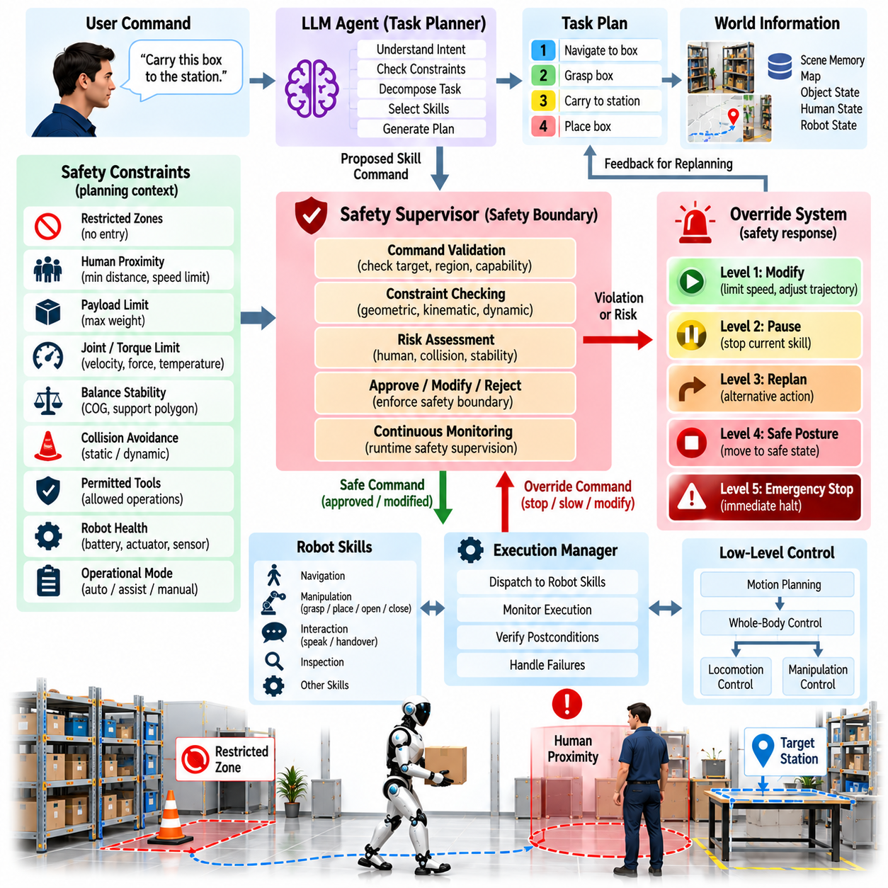{width="7.268055555555556in" height="7.268055555555556in"}

An agent safety boundary defines the operational limits within which a humanoid AI agent may perceive, reason, plan, and act. High-level intelligence can generate flexible solutions to complex tasks, but its decisions must remain subordinate to deterministic safety mechanisms. The safety architecture therefore separates semantic task reasoning from physical execution authority, ensuring that an apparently reasonable agent decision cannot directly bypass constraints required to protect humans, equipment, the environment, or the robot itself.

Safety boundaries should exist at multiple layers rather than as a single final check. A user command can first be evaluated for operational permission, a generated task plan can be checked for prohibited actions, individual skills can be validated before execution, and real-time controllers can continuously enforce physical limits. This layered structure provides defense in depth because an unsafe condition missed at one level can still be detected before it produces hazardous physical behavior.

The cognitive agent should treat safety constraints as explicit elements of its planning context. Restricted regions, payload limits, human proximity requirements, permitted tools, environmental hazards, robot health, and operational modes can influence which actions are considered valid. Including these constraints during planning reduces unnecessary rejection later in execution. However, cognitive awareness of safety does not replace independent enforcement because probabilistic reasoning may misunderstand, omit, or incorrectly prioritize constraints.

An independent safety supervisor provides a boundary between agent-generated intentions and executable robot commands. Before a requested skill reaches motion planning or control, the supervisor can validate its target, operating region, robot state, required capability, and current safety conditions. The supervisor should possess authority to approve, modify, delay, reject, or terminate an action regardless of the confidence assigned by the AI planner. This prevents the reasoning system from becoming the sole authority over physical behavior.

Human proximity requires continuous consideration because humanoids frequently operate in shared spaces. Perception can estimate human position, motion, body configuration, and interaction state, while safety logic determines acceptable speed, separation, force, and motion behavior. As a person approaches the robot, the system may reduce velocity, constrain manipulator motion, pause a task, or enter a protective state. These responses should occur independently of whether the current task planner considers the person relevant to its objective.

Workspace boundaries can restrict where the robot, its limbs, or carried objects are allowed to move. A humanoid may be permitted to navigate through one region while manipulation is prohibited there, or a tool may be restricted to a designated workstation. Geometric zones, semantic map labels, access permissions, and temporary exclusion regions can jointly define these limits. Planned trajectories should be validated against boundaries before execution and monitored for violations while motion is occurring.

Physical limits form another fundamental safety boundary. Joint position, velocity, acceleration, torque, contact force, payload, thermal condition, actuator current, and balance stability must remain within acceptable ranges. These constraints are most effective when enforced close to the real-time control layer rather than depending on high-level reasoning. The agent may understand that an object is heavy, but hardware-level and controller-level mechanisms should independently prevent commands that exceed safe mechanical capability.

Balance safety is especially important for humanoids because upper-body actions can destabilize the entire robot. Reaching, lifting, carrying, pushing, and interacting with humans change the center of mass and contact forces. Before executing such actions, the system can evaluate support configuration, reachable workspace, expected load, and stability margins. During execution, whole-body control and protective mechanisms should react immediately to unexpected disturbances without waiting for cognitive replanning.

Collision avoidance should combine predictive planning with reactive protection. Motion planners can evaluate anticipated collisions with static geometry and tracked dynamic objects before movement begins. During execution, updated perception and proximity sensing can detect changes that invalidate the original trajectory. If a person enters the path or an object unexpectedly moves, the safety layer can slow, stop, or redirect motion even when the task agent still considers the original plan logically valid.

The override system determines how normal agent control is interrupted when safety conditions change. Overrides can range from limiting speed or modifying a trajectory to pausing a skill, cancelling a subtask, entering a safe posture, or performing an emergency stop. Different levels are useful because not every abnormal condition requires complete shutdown. A graded response preserves productivity when possible while ensuring that increasingly severe conditions receive increasingly authoritative intervention.

Emergency stop behavior should remain independent of high-level AI reasoning. When an emergency stop is activated, hazardous motion should be inhibited through mechanisms whose effectiveness does not depend on an LLM, task planner, network service, or semantic interpretation. Recovery from an emergency stop should also follow controlled procedures. The cognitive agent should not automatically resume the interrupted task until the system state has been checked and appropriate authorization or recovery conditions have been satisfied.

Safety overrides must update the cognitive state rather than remaining invisible to the task planner. If a motion is stopped because a human entered the workspace, the agent needs to know that the expected postcondition was not achieved. The task state should record the interrupted skill, reason for intervention, current robot configuration, and relevant environmental change. This allows later replanning to begin from the actual physical state rather than incorrectly assuming that the interrupted action completed successfully.

Not every override should trigger immediate replanning. A short protective pause may allow execution to continue after a person leaves the controlled area, while a persistent obstruction may require an alternative route or manipulation strategy. The system should distinguish temporary safety interruptions from conditions that invalidate the current plan. This prevents excessive cognitive replanning while ensuring that significant changes propagate into task-level reasoning when necessary.

Agent-generated recovery actions must pass through the same safety boundary as ordinary actions. A failed grasp does not justify increasing force beyond limits, bypassing collision constraints, or reaching into a prohibited region. Replanning can change viewpoints, robot position, grasp strategy, hand selection, or task sequence, but it cannot redefine hard safety constraints. This prevents repeated failures from causing progressively more aggressive and hazardous behavior.

Capability degradation should dynamically modify the safety envelope. Reduced sensor coverage, actuator faults, communication problems, thermal limits, low battery state, or localization uncertainty may make actions unsafe even if they were previously permitted. The system can reduce speed, restrict workspace, disable affected skills, or suspend autonomous operation according to the degraded capability. Planning should receive these updated restrictions so that it does not continue proposing actions based on unavailable or unreliable functions.

Authorization boundaries are also relevant to agent safety. A robot may physically be capable of opening a door, moving equipment, accessing a room, or operating a machine without being permitted to do so. Safety architecture should therefore distinguish physical feasibility from operational authorization. Identity, task role, environment state, operating mode, and explicit permissions can determine whether a capability is available, preventing the planner from interpreting mechanical possibility as permission.

Safety monitoring should preserve sufficient event information for diagnosis and validation. Records can include the requested action, safety condition, override type, robot state, relevant sensor evidence, response latency, and final outcome. These records support debugging, system improvement, incident analysis, and verification of safety behavior. They also allow developers to determine whether an intervention originated from incorrect planning, changing environmental conditions, perception uncertainty, or a genuine physical hazard.

Testing should deliberately challenge the boundaries rather than evaluate only nominal task execution. Validation scenarios can introduce unexpected human entry, moving obstacles, excessive payloads, unreachable targets, unstable postures, sensor degradation, forbidden regions, interrupted communication, and invalid agent commands. The objective is to verify that unsafe requests are rejected, emerging hazards trigger appropriate overrides, and the robot transitions to a controlled state without depending on successful high-level reasoning.

Response latency is a critical design consideration because different hazards evolve at different speeds. Semantic permission checks and task-plan validation may operate at cognitive time scales, while imminent collision, excessive force, slipping contact, or loss of balance requires much faster intervention. Safety functions should therefore be assigned to the layer capable of responding within the required time budget. Fast hazards must never depend exclusively on slow deliberative inference.

An agent safety boundary and override system ultimately establishes a controlled separation between intelligent autonomy and physical authority. The AI agent can interpret goals, select tools, generate plans, and recover from failures, but independent safety layers determine whether proposed actions are permissible and continuously monitor whether execution remains safe. Through layered validation, real-time constraints, graded overrides, state feedback, and controlled recovery, a humanoid can retain flexible autonomous behavior without granting probabilistic reasoning unrestricted control over the physical system.

## 10.09. Agent Evaluation Success Rate Efficiency [w/Code]

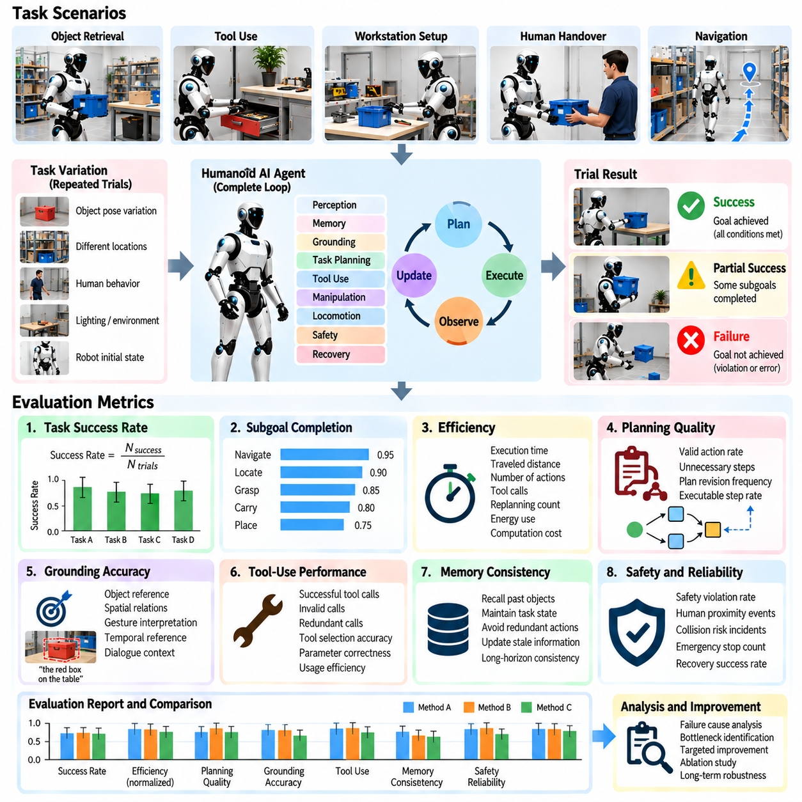{width="7.268055555555556in" height="7.268055555555556in"}

Evaluating a humanoid AI agent requires more than determining whether a task eventually succeeds. An autonomous agent integrates perception, memory, grounding, planning, tool use, manipulation, locomotion, safety, and recovery, so its performance must be measured across the complete decision-execution loop. The chapter structure explicitly positions success rate and efficiency as central evaluation concerns within the humanoid AI agent architecture. Volume_22_Humanoid_Robot_Softwa...

Task success rate is the most direct agent-level metric. A trial is successful when the robot reaches the intended goal state while satisfying required constraints, rather than merely completing a sequence of commands. For example, retrieving an object is not successful if the correct object was found but dropped before delivery. Success criteria should therefore be defined through observable final conditions that can be independently verified by perception, robot state, or task-specific validation logic.

Binary success alone can hide important differences between agents. A partially completed task may demonstrate successful navigation, object localization, and grasping even if the final placement fails. Evaluation can therefore record subgoal completion in addition to overall task success. This decomposition identifies which stages dominate failure and prevents improvements in one capability from being obscured by unrelated failures occurring later in a long-horizon task.

Success rate should be calculated over repeated trials rather than isolated demonstrations. Physical environments contain variation in object pose, human behavior, sensor observations, robot configuration, and execution dynamics. Repeating the same task under controlled variations reveals whether success is robust or dependent on favorable initial conditions. Results should preserve the number of trials and failure distribution so that a high percentage derived from a small or narrowly configured test set is not mistaken for reliable autonomy.

Efficiency measures how economically the agent reaches a successful outcome. Execution time is an important component, but efficiency also includes traveled distance, number of actions, unnecessary tool calls, repeated perception queries, replanning frequency, energy use, and computational cost. Two agents may achieve identical success rates while one repeatedly searches irrelevant locations or performs redundant verification. Agent evaluation should therefore distinguish eventual success from efficient goal-directed behavior.

A useful efficiency baseline is the shortest or reference task procedure available under the same conditions. The executed trajectory, number of manipulation attempts, or total task steps can be compared with an expert demonstration, predefined reference plan, or feasible lower bound. This comparison reveals planning inefficiency that raw completion time may miss. A longer execution can sometimes be justified when additional verification or safer motion is required, so efficiency should always be interpreted together with safety and reliability.

Planning quality can be evaluated before and during physical execution. Generated plans should contain valid skills, correct arguments, satisfied dependencies, reachable targets, and appropriate ordering of actions. Metrics can include invalid action rate, unnecessary step count, plan revision frequency, and percentage of generated steps that are executable without correction. These measurements separate reasoning failures from failures caused by lower-level locomotion or manipulation systems.

Grounding accuracy measures whether agent commands are connected to the correct physical entities and locations. Evaluation can test object reference resolution, spatial relations, gesture interpretation, temporal references, and dialogue-dependent expressions. A task may fail because the planner chose the wrong strategy, but it may also fail because "the red box beside the table" was associated with the wrong object. Recording grounding errors separately provides a more meaningful diagnosis of agent behavior.

Tool-use performance should measure both correctness and economy. The agent must select an appropriate perception, memory, navigation, manipulation, or diagnostic tool and provide valid parameters. Evaluation can record successful tool invocation, invalid calls, redundant calls, tool-selection errors, and whether returned information is incorporated into subsequent reasoning. Effective tool use means acquiring or executing what is necessary without repeatedly invoking services that do not change the decision state.

Long-horizon tasks require evaluation of memory and state consistency. The agent should remember completed subtasks, previously identified objects, failed strategies, held items, and unresolved conditions across many actions. Tests can measure whether relevant information remains available when needed and whether stale information is appropriately revised. Repeating a completed action or searching for an object already held by the robot indicates cognitive-state failure even if individual perception and control modules operate correctly.

Failure recovery is a major component of agent evaluation because real-world humanoid operation cannot depend on perfect execution. Tests should intentionally introduce blocked paths, moved objects, failed grasps, perception ambiguity, unavailable tools, and temporary human interference. Recovery success rate, time to recovery, number of retries, preserved task progress, and escalation frequency indicate whether the agent can convert unexpected events into controlled replanning rather than abandoning or restarting the entire mission.

Repeated failures should be analyzed for recovery efficiency as well as recovery success. An agent that eventually succeeds after ten identical grasp attempts is less capable than one that detects the cause, changes viewpoint, reacquires object pose, and succeeds on the next attempt. Evaluation should therefore record whether successive recovery attempts meaningfully alter information or execution conditions. This distinguishes adaptive replanning from uncontrolled repetition disguised as persistence.

Safety must be treated as a non-negotiable evaluation dimension rather than a tradeable efficiency metric. A faster task execution is not an improvement if it increases unsafe proximity, excessive force, unstable posture, collision risk, or safety overrides. Measurements can include safety-rule violations, protective stops, emergency interventions, rejected agent commands, minimum separation margins, and execution within defined physical constraints. Success achieved through unsafe behavior should not be classified as valid task success.

Human intervention provides another measure of autonomy. An agent may complete most trials but frequently require clarification, manual repositioning, object assistance, or operator recovery. Intervention rate, intervention type, and the stage at which assistance becomes necessary can therefore complement success rate. Appropriate clarification should not automatically be considered failure, however, because requesting information when grounding confidence is insufficient may represent safer and more intelligent behavior than acting on an unsupported assumption.

Latency should be evaluated at meaningful decision boundaries. Perception updates, grounding, LLM reasoning, tool selection, replanning, and skill initialization can each contribute delay before physical action begins or resumes. End-to-end task time alone cannot identify these bottlenecks. Measuring component and transition latency helps determine whether slow performance originates from cognitive inference, external tool calls, perception processing, motion planning, or physical execution.

Agent evaluation should include environmental variation to measure generalization rather than memorization of a fixed demonstration. Object positions, clutter, lighting, viewpoints, task wording, human location, route availability, and initial robot state can be systematically varied. More demanding tests can introduce previously unseen combinations while preserving the same task semantics. Performance degradation across these conditions provides evidence about how reliably the agent transfers its planning and grounding capabilities.

Evaluation scenarios should also increase task horizon and dependency depth. Short tasks may hide memory, planning, and recovery weaknesses because only a few decisions are required. Longer procedures introduce dependencies in which an early observation or action affects much later behavior. Measuring success as task length increases reveals whether context is preserved, errors accumulate, tool use remains efficient, and the planner can maintain coherent progress over extended execution.

Benchmark results should report distributions rather than only averages. Median task time, variation across trials, worst-case recovery behavior, failure categories, and percentile latency can reveal instability hidden by a single mean value. Comparing results across scenario classes also prevents easy tasks from dominating an aggregate score. A balanced evaluation should show where the agent is consistently reliable, where performance varies, and which operating conditions remain outside its dependable capability envelope.

Regression evaluation is necessary as the agent architecture evolves. Changes to an LLM, perception model, memory system, prompt, skill interface, or planner may improve one task while degrading another. A stable benchmark suite allows each software revision to be compared against previous versions using identical scenarios and acceptance criteria. Automated replay in simulation can provide broad coverage, while hardware trials confirm that improvements remain valid under real sensing, dynamics, contact, and latency.

A comprehensive agent score should therefore be interpreted as a collection of complementary measurements rather than a single universal number. Task success describes whether goals are achieved, efficiency describes the resources required, grounding and planning metrics explain decision quality, recovery measures resilience, safety establishes acceptable operation, and intervention measures practical autonomy. Keeping these dimensions visible prevents optimization of one metric from concealing degradation elsewhere.

Agent evaluation ultimately determines whether a humanoid AI architecture can transform perception and reasoning into dependable physical performance. A capable system should complete tasks repeatedly, choose valid and economical actions, preserve state over long horizons, recover intelligently from failures, respect safety boundaries, and minimize unnecessary human intervention. Evaluation based on success rate and efficiency therefore becomes a system-level test of whether the complete perception-memory-planning-action loop produces reliable, scalable, and useful humanoid autonomy.

## 10.10. Humanoid AI Agent Industrial Pilot Case

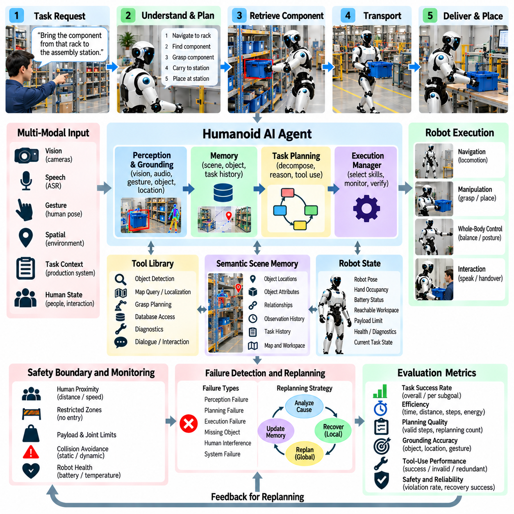{width="7.268055555555556in" height="7.268055555555556in"}

An industrial pilot for a humanoid AI agent evaluates whether an integrated cognitive and physical architecture can perform useful work under realistic production conditions. Unlike a laboratory demonstration focused on one isolated capability, the pilot combines perception, semantic memory, language understanding, task planning, tool use, locomotion, manipulation, safety supervision, and failure recovery. The objective is to determine whether these components can operate as one dependable autonomous system over repeated industrial task cycles.

A suitable pilot begins with a clearly bounded operational domain. The humanoid may support material handling, component retrieval, machine tending, workstation replenishment, inspection, kitting, or tool delivery within a controlled production area. Tasks should be complex enough to require reasoning and adaptation but sufficiently constrained for measurable validation. Defined work zones, object classes, equipment interfaces, human roles, and permitted actions establish the operational envelope within which autonomous behavior can be evaluated.

The pilot workflow can begin when a production system or human operator provides a task request such as retrieving a specified component and delivering it to an assembly station. The agent interprets the command, identifies the requested object and destination, checks available scene and task memory, and determines whether additional information is required. This initial grounding stage converts a symbolic production request into references to physical entities, locations, constraints, and executable robot capabilities.

Semantic scene memory provides continuity when relevant objects are not immediately visible. The agent may remember that a component type is normally stored in a particular rack or that a required tool was recently observed at another workstation. Memory entries include object identity, location, relationships, state, confidence, and observation time. Because industrial environments change continuously, remembered information is treated as a hypothesis that may require physical verification rather than as guaranteed current truth.

The task planner decomposes the requested operation into executable subgoals. A retrieval task may require navigating to storage, identifying the correct bin, inspecting its contents, selecting the target component, generating a grasp, transporting the object, locating the receiving workstation, and performing placement or handover. Dependencies between these steps are maintained so that later actions execute only after required physical conditions have been verified.

Tool use allows the agent to invoke specialized capabilities instead of attempting to solve every problem through general reasoning. The planner may call object detection, barcode or text recognition, semantic map queries, navigation, grasp planning, manipulation, diagnostics, or memory retrieval services. Each tool exposes defined inputs, outputs, constraints, and failure states. This structured interface separates high-level AI reasoning from specialized perception and control implementations used by the industrial robot platform.

Multimodal grounding becomes important when the humanoid collaborates with workers. An operator may say, "bring the part from that rack," while pointing toward a storage area, or may refer to "the component used in the previous assembly." The agent combines speech, visual perception, gesture, spatial relationships, dialogue history, and semantic memory to resolve the intended reference. When confidence remains insufficient, requesting clarification is preferable to acting on an unsupported interpretation.

Physical execution remains hierarchical. The cognitive agent determines goals, subgoals, and skill selection, while dedicated navigation, motion planning, whole-body control, grasping, and balance systems execute physical behavior at faster time scales. The agent does not directly generate every joint command. This separation allows semantic planning to remain flexible while deterministic and learned low-level controllers maintain stability, contact behavior, trajectory execution, and real-time responsiveness.

Verification is inserted between consequential steps. Reaching a storage rack does not prove that the correct rack was reached, and closing a gripper does not prove that the intended component was acquired. Cameras, tactile sensing, force feedback, object tracking, and robot state can verify critical postconditions. The task advances only when sufficient evidence indicates that the expected physical state has been achieved, reducing the propagation of unnoticed errors through long industrial sequences.

Industrial pilots inevitably expose failures that are uncommon in controlled demonstrations. A component may be missing, another object may obstruct access, a worker may temporarily block the route, a grasp may slip, or localization confidence may decrease. A failure-aware agent records the discrepancy between expected and observed states, identifies the affected task dependency, and determines whether local recovery, subgoal modification, broader replanning, or human assistance is appropriate.

Local recovery preserves completed progress whenever possible. If a grasp fails because the component pose estimate is inaccurate, the humanoid can obtain another viewpoint and regenerate the grasp without restarting navigation. If a route becomes blocked, the navigation system can select an alternative path while preserving the remaining task plan. This behavior is essential for industrial efficiency because restarting complete missions after every execution error would make autonomous operation slow and operationally impractical.

Repeated failures require controlled escalation rather than unlimited retries. The agent can track previous attempts, viewpoints, grasp strategies, and diagnostic results so that each recovery action meaningfully changes the conditions. If alternatives are exhausted, the robot can request assistance and explain the relevant context, such as an inaccessible component or an ambiguous storage location. Human intervention therefore becomes a managed recovery mechanism rather than an unstructured replacement for autonomy.

Safety supervision remains independent of the AI planner throughout the pilot. Human proximity, restricted zones, joint limits, payload constraints, collision risk, balance stability, contact force, and robot health are monitored by appropriate safety and control layers. The agent may propose an action, but independent mechanisms determine whether execution is permissible. Protective slowdown, pause, trajectory modification, task interruption, or emergency stopping can override cognitive decisions when required.

The pilot should include dynamic human interaction rather than assuming an isolated robot workspace. Workers may cross navigation paths, approach the humanoid during manipulation, request changes, or provide objects directly. The agent must distinguish temporary interruptions from task-invalidating changes. A brief protective pause may allow execution to resume automatically, whereas a changed destination or unavailable component may require the task plan and cognitive state to be updated before work continues.

System health also affects autonomous capability. A degraded wrist camera, reduced localization confidence, actuator temperature warning, communication problem, or low energy state may restrict which skills remain available. The agent architecture should receive updated capability information and avoid planning with unavailable resources. Depending on severity, the system can reduce speed, use alternative sensing, modify the task, return to a service location, or transfer responsibility to a human operator.

Pilot evaluation should measure complete task performance rather than showcase individual successful demonstrations. Repeated trials can record task success rate, subgoal completion, execution time, traveled distance, tool calls, manipulation attempts, replanning events, recovery time, human interventions, and safety overrides. Failure categories should also be preserved so that improvements can be attributed to perception, grounding, planning, manipulation, memory, or recovery rather than being hidden inside one aggregate success number.

Efficiency must be evaluated together with reliability. An agent that completes a task quickly but frequently requires human recovery may be less useful than one that operates slightly slower with consistent autonomy. Similarly, excessive perception queries, repeated LLM reasoning, redundant navigation, and unnecessary verification can reduce production value even when success remains high. Industrial evaluation therefore considers the amount of time, computation, energy, motion, and human attention required for each successful task cycle.

Pilot progression should increase complexity gradually. Early trials can use fixed object locations and controlled routes before introducing variable placements, clutter, moving workers, ambiguous commands, unavailable resources, and deliberate execution failures. Longer task sequences can then test memory persistence and dependency management. This staged approach makes it possible to identify the capability boundary at which performance begins to degrade instead of moving directly from laboratory testing to unconstrained deployment.

Operational logs provide the evidence required for improvement and regression testing. Each trial can preserve the original command, grounded entities, generated plan, tool calls, significant observations, state transitions, failures, recovery decisions, safety interventions, and final outcome. These records allow developers to reconstruct why the agent behaved as it did and create repeatable simulation or hardware tests from previously observed field failures.

A successful industrial pilot does not require the humanoid to solve every possible production task autonomously. It demonstrates that a defined class of tasks can be performed repeatedly within an explicit operational envelope, with predictable handling of uncertainty and safe escalation when autonomy reaches its limits. The important transition is from an impressive single demonstration to measurable, recoverable, and repeatable operation that can be integrated into an actual industrial workflow.

The humanoid AI agent industrial pilot therefore validates the complete perception-memory-reasoning-action architecture under physical operating conditions. Language and multimodal grounding establish intent, semantic memory preserves environmental context, planning coordinates specialized tools and skills, verification closes the execution loop, failure-aware replanning provides resilience, and independent safety mechanisms constrain physical authority. Together, these capabilities determine whether humanoid intelligence can progress from experimental autonomy toward dependable industrial operation.
