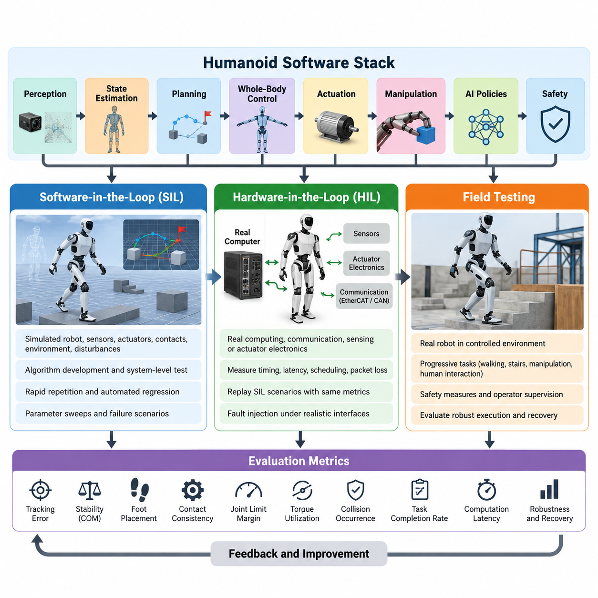
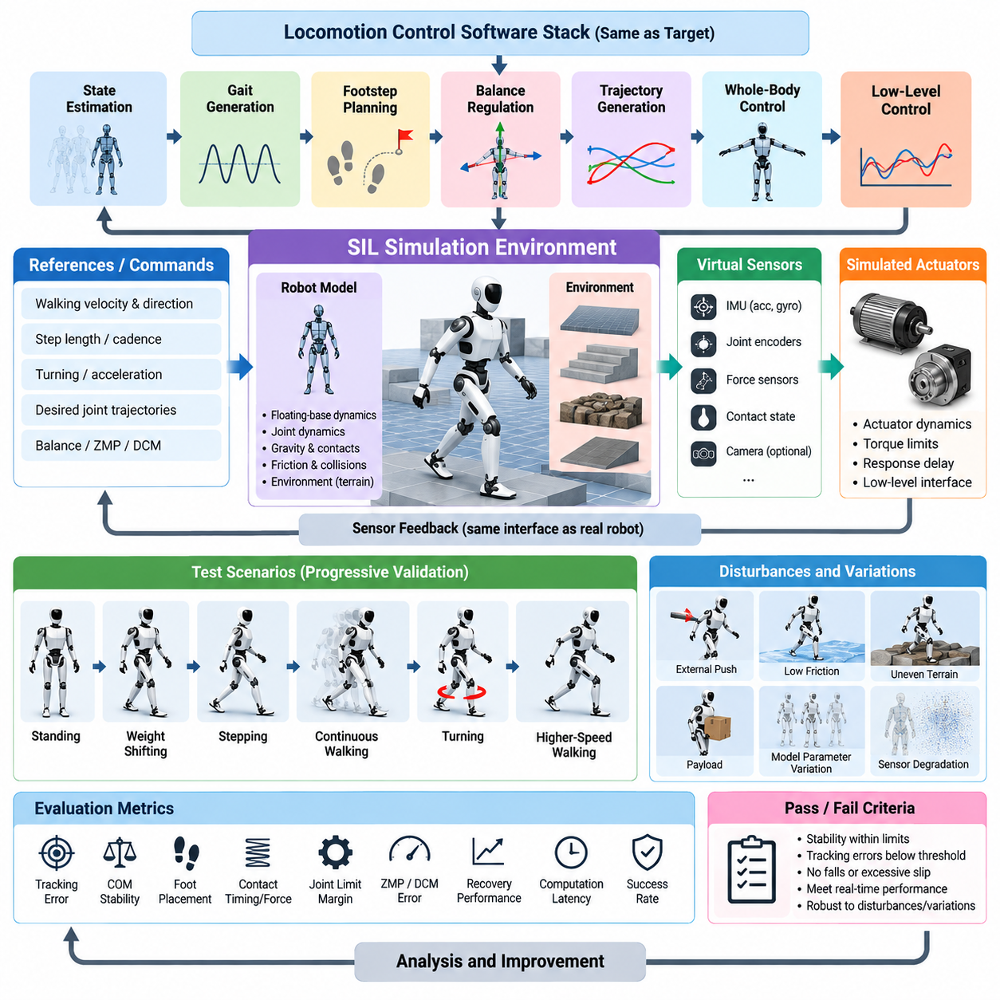
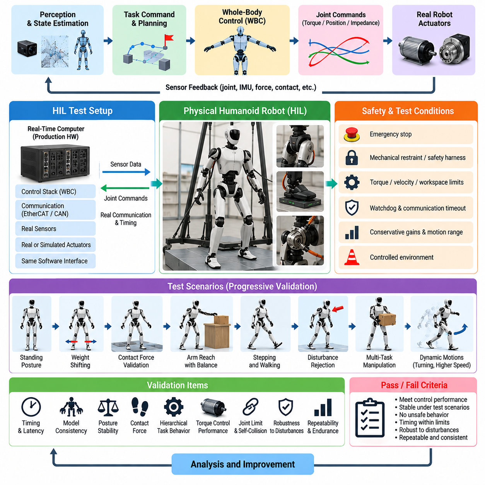
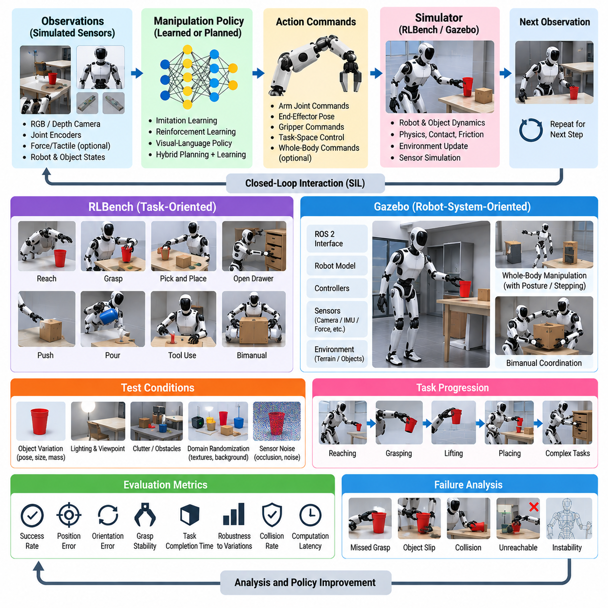
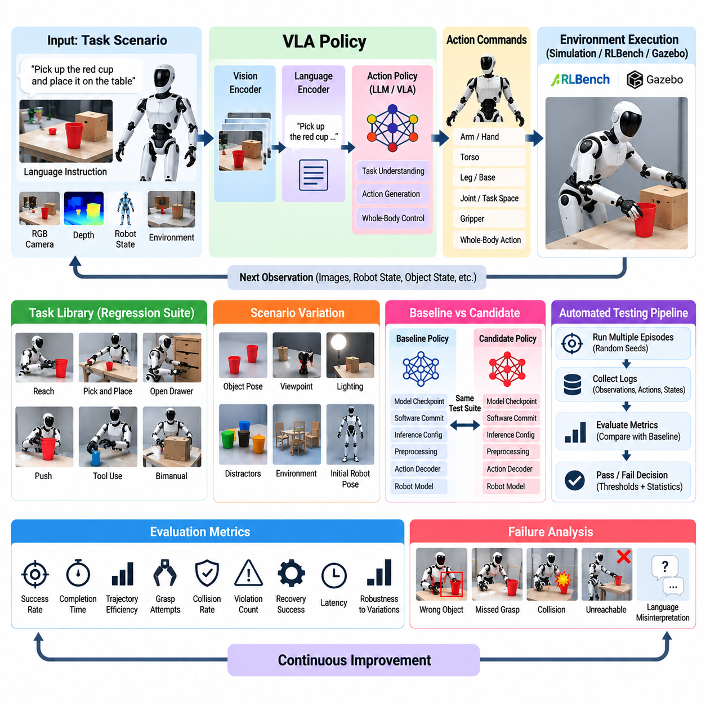
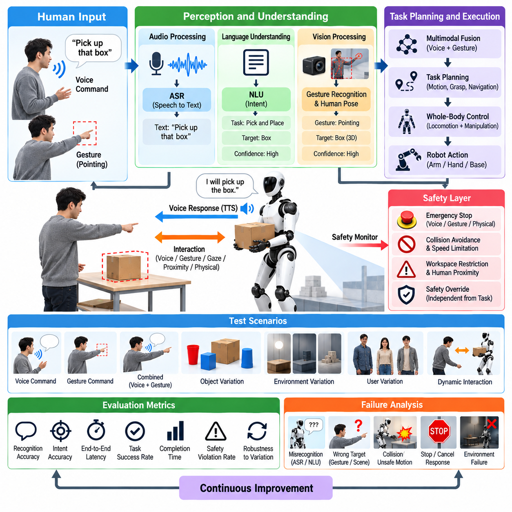
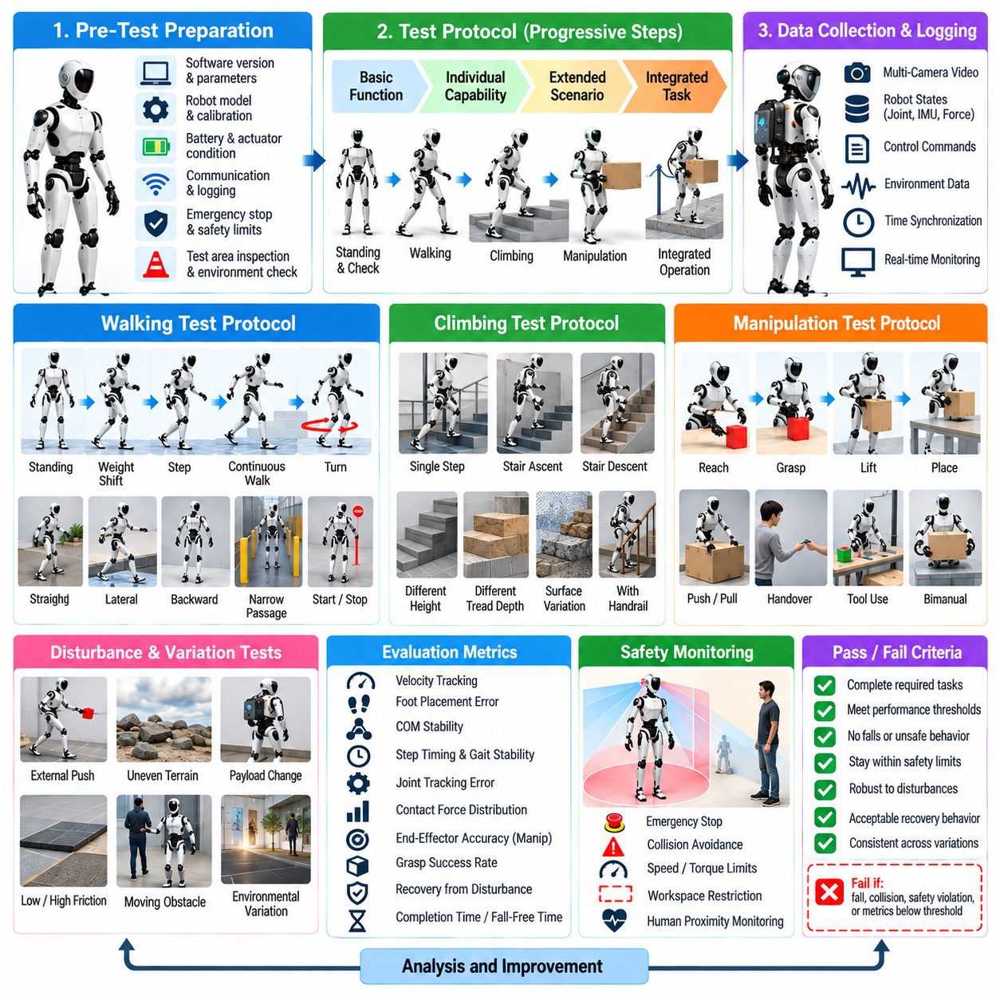
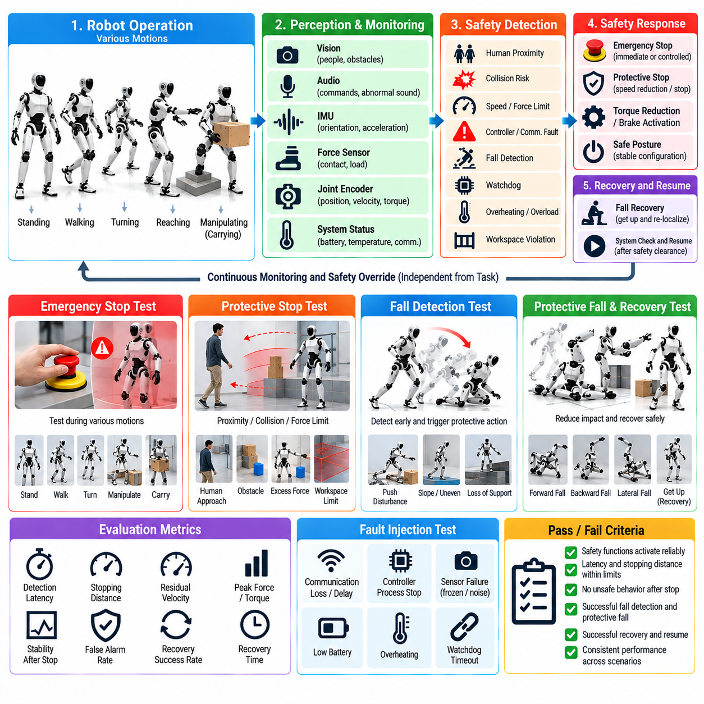
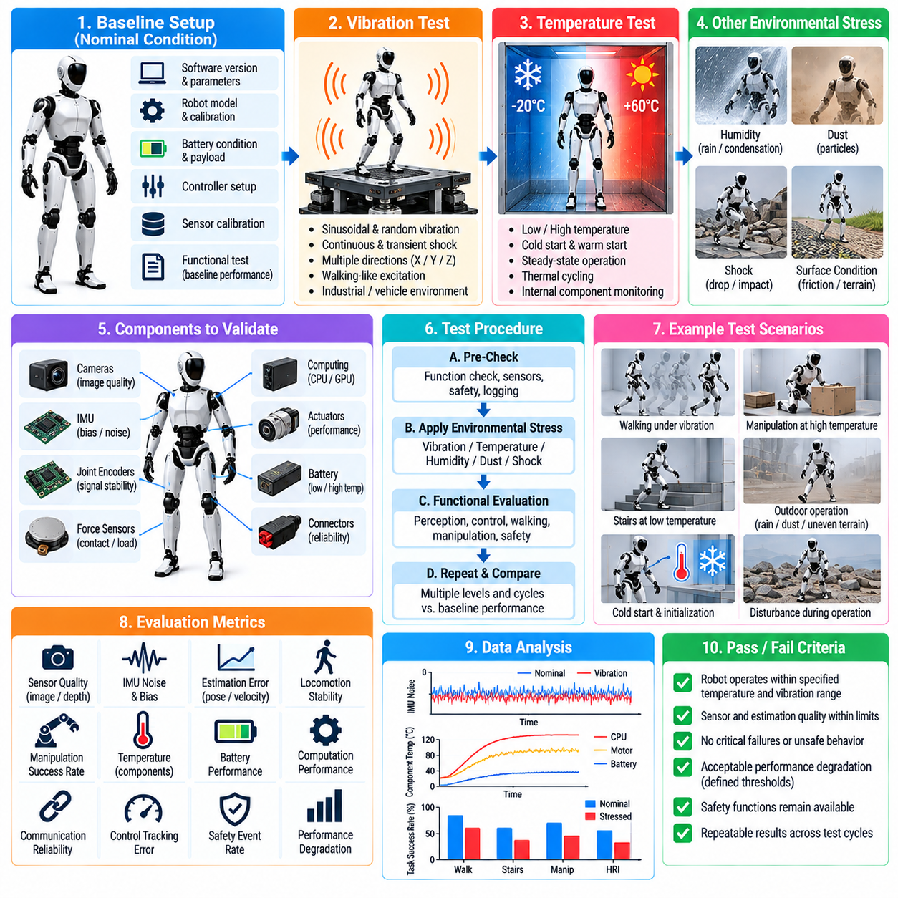
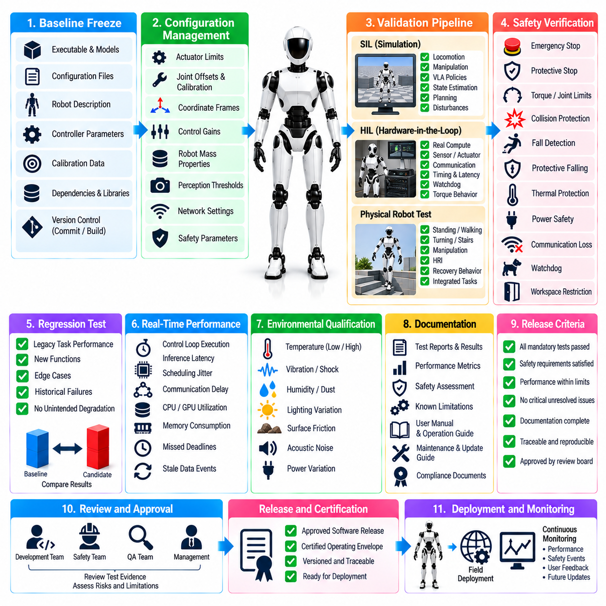

**Volume 22. Humanoid Robot Software**

# Chapter 11. Humanoid SW Testing and Validation

## 11.01. Humanoid SW Test Strategy SIL HIL Field

{width="7.268055555555556in" height="7.268055555555556in"}

A humanoid software test strategy must validate not only individual algorithms but the complete closed-loop behavior of perception, estimation, planning, whole-body control, actuation, and safety functions. Because a humanoid combines floating-base dynamics, intermittent contacts, high-dimensional actuation, manipulation, and human interaction, failures can rapidly become physical hazards. Validation therefore progresses through Software-in-the-Loop (SIL), Hardware-in-the-Loop (HIL), and controlled field testing, with increasingly realistic dynamics, hardware, environments, and operational uncertainty. Volume_22_Humanoid_Robot_Softwa...

SIL provides the first system-level environment in which production software can execute without exposing physical hardware to unsafe commands. The robot model, sensors, actuators, contacts, environment, and disturbances are represented in simulation while locomotion, balance, whole-body control, manipulation, perception, or AI policies execute through interfaces resembling the target platform. This stage enables rapid repetition, deterministic debugging, automated regression testing, and exploration of conditions that would be expensive or dangerous to reproduce on a real humanoid.

Effective SIL validation requires more than observing whether a simulated humanoid can complete a nominal task. Tests should define measurable requirements such as tracking error, center-of-mass stability, foot-placement accuracy, contact consistency, joint-limit margin, torque utilization, collision occurrence, task completion rate, and computation latency. Parameter sweeps can systematically vary friction, payload, terrain geometry, sensor noise, actuator response, communication delay, and external disturbances, transforming simulation from a demonstration environment into a quantitative verification system.

Simulation fidelity should increase according to the function being tested. Controller development may begin with simplified rigid-body models and ideal state feedback, while later tests introduce realistic actuator dynamics, sensor characteristics, contact uncertainty, timing jitter, and communication effects. The purpose is not to make every simulation maximally complex, but to expose assumptions embedded in software. Differences between ideal and degraded conditions reveal sensitivity before the same weakness appears as instability, falls, collisions, or task failure on physical hardware.

HIL validation introduces real computing, communication, sensing, actuator electronics, or selected mechanical components while retaining controlled simulation around them. Production processors can execute the actual real-time control stack against simulated robot dynamics, allowing engineers to measure scheduling behavior, end-to-end latency, EtherCAT or CAN communication timing, packet loss, watchdog operation, and command synchronization. This is particularly important for humanoid systems whose control architecture may contain high-rate loops operating near 1 kHz alongside slower perception and AI processes. Volume_22_Humanoid_Robot_Softwa...

The SIL-to-HIL transition should preserve test definitions and acceptance metrics wherever possible. A walking scenario validated in simulation can be replayed through production computers and interfaces so that changes in timing, numerical behavior, middleware, drivers, and hardware communication become measurable. Logged reference trajectories provide baselines for joint states, estimated base motion, contact forces, commanded torques, and controller states. Deviations beyond predefined tolerances can automatically fail a regression test rather than relying on subjective visual judgment.

Fault injection is essential throughout SIL and HIL because humanoid reliability depends strongly on behavior outside nominal conditions. Tests can introduce delayed sensor packets, frozen measurements, corrupted transforms, communication interruptions, actuator saturation, unexpected contact, state-estimation drift, inference timeout, or controller deadline misses. The system should detect these abnormalities and transition toward bounded behavior through degraded operation, motion inhibition, safe posture, protective stopping, or emergency shutdown instead of allowing a local fault to propagate into uncontrolled whole-body motion.

Field testing begins only after critical requirements have passed lower-risk validation stages. Early physical tests should use restricted workspaces, conservative velocity and torque limits, safety harnesses where appropriate, independent emergency-stop mechanisms, and clearly defined operator responsibilities. Complexity is then increased progressively from standing and simple stepping to continuous walking, disturbance recovery, stairs, object manipulation, combined locomotion-manipulation, and human interaction. This progression matches the broader humanoid stack, which separately develops locomotion, balance, WBC, perception, manipulation, VLA, HRI, and agent functions before integrated validation. Volume_22_Humanoid_Robot_Softwa...

A field-test protocol must distinguish successful task execution from safe and robust execution. A robot that completes a task once provides little evidence of production readiness. Repeated trials should capture completion probability, recovery frequency, intervention count, fall events, minimum stability margins, tracking errors, thermal state, power consumption, computational load, communication health, and execution time. Tests should also record environmental context so that failures can be correlated with surfaces, lighting, obstacles, payloads, contact configurations, or human behavior.

Traceability connects all three validation stages. Each software requirement should map to one or more tests, and every test should identify the software version, robot configuration, model version, parameter set, dataset or scenario, expected result, measured result, and pass/fail criterion. Logs from simulation and physical experiments should use compatible schemas and synchronized timestamps wherever practical. This allows engineers to reproduce a field failure in HIL or SIL and determine whether its origin lies in algorithms, timing, modeling assumptions, hardware interfaces, or environmental conditions.

Regression testing becomes increasingly important as humanoid software incorporates learned components. A new locomotion policy, perception model, VLA model, or manipulation policy may improve one benchmark while degrading behavior elsewhere. A common scenario library should therefore contain nominal tasks, historical failures, boundary conditions, disturbances, and safety-critical cases. Every significant software or model update can replay this library first in scalable SIL, then selected cases in HIL, before expensive physical testing is authorized.

The relationship among SIL, HIL, and field testing should be viewed as a continuous validation pipeline rather than three independent activities. SIL maximizes coverage and repeatability, HIL exposes implementation and hardware-interface effects, and field testing establishes evidence under real physical uncertainty. Failures discovered at later stages should generate new reproducible cases for earlier stages, creating a feedback loop in which the validation environment continuously accumulates operational knowledge and becomes more representative over the robot\'s development lifecycle.

A mature humanoid program ultimately uses risk-based test gates to control progression between these environments. Safety-critical functions require stronger evidence and broader fault coverage than convenience functions, while high-energy motions require stricter entry conditions than low-speed experiments. Release decisions should therefore combine functional performance, robustness, timing integrity, fault response, safety behavior, and regression status rather than depending on a single benchmark score. This prepares the foundation for the chapter\'s subsequent locomotion SIL, WBC HIL, policy regression, HRI, field, safety, environmental, and release-validation activities. Volume_22_Humanoid_Robot_Softwa...

## 11.02. Locomotion Control SIL Simulation Validation [w/Code]

{width="7.268055555555556in" height="7.268055555555556in"}

Locomotion control Software-in-the-Loop (SIL) validation provides a controlled environment for evaluating humanoid walking software before commands are executed on physical hardware. The objective is to verify that state estimation, gait generation, footstep planning, balance regulation, trajectory generation, and low-level control interact correctly as a closed-loop system. For a biped robot, simulation is especially important because small errors in contact timing or body motion can rapidly produce instability and falls.

A useful SIL architecture executes the same locomotion software intended for the target humanoid while replacing the physical robot with a simulated dynamic model. The simulator calculates floating-base motion, joint dynamics, gravity, contact forces, friction, and collisions, while virtual sensors generate joint, IMU, force, and other feedback signals. Control commands are returned to simulated actuators through interfaces that reproduce the structure of the production software stack as closely as practical.

Validation should begin with fundamental behaviors before progressing toward dynamic walking. Standing tests establish whether the controller maintains the desired center of mass, base orientation, joint posture, and ground contact without growing oscillation. Weight-shifting tests then move the center of mass between support regions, exposing errors in balance regulation and contact transitions. Only after these basic conditions remain stable should the test sequence introduce stepping, continuous walking, turning, and higher-speed locomotion.

Reference tracking is one of the primary measurements in locomotion SIL. Desired joint trajectories, center-of-mass motion, base orientation, foot trajectories, Zero Moment Point (ZMP), Divergent Component of Motion (DCM), or other controller references can be compared with simulated responses. Position, velocity, orientation, force, and timing errors should be recorded throughout each trial. These signals reveal whether poor behavior originates from trajectory generation, feedback control, dynamic modeling, or contact execution.

Foot contact requires particular attention because humanoid locomotion repeatedly switches between single-support and double-support conditions. Validation should examine touchdown position, touchdown velocity, contact timing, foot orientation, normal force, tangential force, and unintended slip. The simulated contact state should also be compared with the contact state assumed by the controller. A mismatch between them can corrupt state estimation or destabilize balance control even when joint tracking remains apparently accurate.

Footstep-planning validation evaluates whether commanded walking velocity and direction are converted into physically feasible support locations. Tests should cover forward and backward walking, lateral motion, turning, acceleration, deceleration, stopping, and changes in step length or cadence. Generated footsteps must respect kinematic reachability, self-collision constraints, support geometry, and stability requirements while remaining compatible with the swing-foot trajectory and whole-body motion generated downstream.

Disturbance testing transforms nominal simulation into robustness validation. External forces can be applied to the torso from different directions and at different phases of the gait cycle, while surface friction, ground height, payload, or model parameters are varied. The controller should demonstrate bounded recovery through ankle, hip, momentum, or stepping responses according to its design. Recovery time, maximum body deviation, additional step count, and whether the robot falls provide quantitative measures of disturbance tolerance.

Parameter variation is also necessary to identify how strongly locomotion depends on an ideal robot model. Link mass, center-of-mass position, joint damping, actuator response, friction coefficient, sensor noise, and control latency can be perturbed around nominal values. A controller that succeeds only with exact simulation parameters may fail immediately on hardware. Monte Carlo or systematic parameter sweeps therefore provide stronger evidence of robustness than repeated execution of a single deterministic walking scenario.

Sensor degradation should be incorporated into SIL because the locomotion controller depends on estimated rather than perfectly known physical states. IMU bias and noise, encoder noise, force-sensor error, delayed measurements, dropped samples, and temporary contact misclassification can be injected into virtual sensor streams. The resulting base pose, velocity, support state, and controller response reveal whether the state-estimation and control pipeline remains stable when measurements depart from ideal simulation conditions.

Timing behavior is another critical validation dimension. A humanoid may execute high-rate joint and whole-body control while planners, perception modules, and learned policies operate at substantially lower frequencies. SIL tests should reproduce these different update rates and introduce realistic computation delay, communication latency, and jitter. Deadline violations and stale commands must be detectable because a mathematically stable controller can become unstable when its assumptions about sampling time are violated.

Terrain scenarios extend validation beyond flat laboratory floors. The same controller can be evaluated on slopes, stairs, stepping stones, small height discontinuities, irregular surfaces, and regions with different friction coefficients. These environments test whether planned contacts remain reachable and whether balance control tolerates geometric uncertainty. Difficulty should increase gradually so that failures can be associated with specific terrain properties rather than introduced through uncontrolled combinations of challenges.

Transitions between locomotion modes deserve dedicated tests because failures frequently occur between otherwise stable behaviors. Standing-to-walking, walking-to-stopping, forward-to-lateral motion, speed changes, turning, stair entry, and recovery after disturbance all modify references, contacts, or controller states. SIL should verify continuity of position, velocity, torque, and internal state during these transitions and detect discontinuities capable of producing impulsive or physically unrealistic commands.

Safety constraints must remain active even though SIL cannot damage the physical robot. Joint position and velocity limits, torque limits, collision constraints, foot workspace restrictions, stability boundaries, and controller watchdog conditions should be evaluated exactly as they would be during hardware operation. Unsafe commands should produce identifiable faults or controlled fallback behavior. Treating simulation as unrestricted experimentation can hide defects in safety logic that later become critical during HIL or field testing.

Automated regression testing converts individual SIL experiments into a sustainable validation system. Representative walking scenarios and historical failure cases can be executed whenever locomotion software, robot models, controller parameters, or dependencies change. Each run should automatically calculate metrics such as walking success, fall occurrence, tracking error, foot-placement error, slip, stability margin, control saturation, and execution time, then compare them against stored acceptance thresholds and reference results.

Reproducibility requires every simulation result to be associated with its exact configuration. Software commit, robot model version, controller parameters, simulator settings, terrain definition, random seed, initial state, disturbance profile, and acceptance criteria should be recorded with the test output. Time-synchronized logs should preserve reference and measured states, contact information, actuator commands, estimator outputs, and controller modes so that a failed trial can be replayed and analyzed without relying on visual observation alone.

The final purpose of locomotion SIL is not to prove that simulation and reality are identical, but to remove preventable software defects before physical testing. Scenarios that consistently satisfy stability, tracking, contact, timing, robustness, and safety requirements can advance to HIL and controlled robot experiments. Failures observed later on the real humanoid should in turn be reconstructed as new SIL scenarios, allowing the simulation validation suite to evolve continuously with accumulated field experience.

## 11.03. WBC HIL Test with Physical Robot [w/Code]

{width="7.268055555555556in" height="7.268055555555556in"}

Whole-body control (WBC) Hardware-in-the-Loop (HIL) testing provides the critical transition between simulation validation and unrestricted physical humanoid operation. The objective is to execute production WBC software with real computing hardware, communication interfaces, sensors, actuators, and selected robot mechanisms while maintaining controlled safety conditions. This exposes implementation effects that ideal simulation cannot fully represent, including timing variation, actuator dynamics, structural compliance, friction, communication delay, and sensor imperfections.

A practical WBC HIL environment should preserve the software architecture intended for the final robot. The real-time controller receives measured joint states, inertial information, force or torque measurements, and contact estimates, then computes desired joint torque, position, or impedance commands. Depending on test maturity, commands may drive simulated dynamics, restrained actuators, selected limbs, or the complete physical humanoid. Maintaining production interfaces reduces the risk that separate test-specific software hides integration defects.

Initial HIL tests should begin with the robot mechanically secured or operated under conditions that prevent a controller error from producing a fall. Joint torque limits, velocity limits, workspace constraints, emergency-stop circuits, watchdogs, and communication timeout protection must be active before enabling WBC commands. Conservative gains and reduced motion ranges allow the engineering team to verify command direction, joint mapping, sensor polarity, coordinate frames, and actuator response before introducing dynamic whole-body behavior.

Timing validation is fundamental because WBC commonly depends on high-frequency deterministic execution. A nominal 1 kHz controller provides approximately one millisecond for state acquisition, model updates, optimization, command generation, and output transmission. HIL testing should therefore measure average and worst-case computation time, deadline misses, scheduling jitter, communication latency, and synchronization between sensor sampling and actuator commands. Rare timing violations can be more dangerous than moderate average latency because they introduce unpredictable control behavior.

The robot dynamics model used by WBC must also be validated against physical measurements. Joint positions and velocities define the configuration, while IMU and contact sensors contribute information about floating-base motion and support conditions. Model-derived quantities such as center of mass, Jacobians, mass matrices, gravity compensation, momentum, and contact transformations should remain consistent with measured behavior. Incorrect link parameters or frame definitions can produce systematic torque errors even when the optimization algorithm itself is mathematically correct.

Static posture regulation provides an appropriate first physical WBC experiment. The controller maintains a predefined standing configuration while regulating center-of-mass position, torso orientation, joint posture, and contact forces. Engineers can compare desired and measured quantities while gradually enabling torque or impedance control across additional joints. Persistent oscillation, asymmetric loading, unexpected joint motion, or actuator saturation should be resolved before progressing toward weight shifting or dynamic contact transitions.

Contact-force validation is particularly important because humanoid WBC distributes forces across multiple contacts while satisfying friction and unilateral-contact constraints. During double-support standing, measured left and right foot forces can be compared with optimized contact wrenches and expected load distribution. Controlled center-of-mass shifts then reveal whether the optimizer transfers load smoothly between support regions. Excessive tangential force, negative normal-force commands, or abrupt wrench changes indicate problems that must be corrected before stepping tests.

Hierarchical task behavior should be tested by introducing controlled conflicts among objectives. Balance and contact maintenance normally have higher priority than hand tracking, posture preferences, or secondary manipulation objectives. The physical robot can be commanded to reach with one arm while maintaining a stable stance, allowing engineers to verify that lower-priority tasks do not violate support constraints. Joint limits, self-collision avoidance, torque bounds, and contact conditions should remain satisfied even when the desired end-effector target cannot be reached.

Torque-control validation requires comparison between commanded and physically realized actuator behavior. Motor current, estimated joint torque, measured force, joint acceleration, temperature, and tracking response can reveal friction, backlash, compliance, saturation, or bandwidth limitations absent from the nominal model. These discrepancies should not simply be compensated by increasing controller gains. Instead, they should be characterized and incorporated into actuator models, limits, feedforward terms, or robust control margins used by WBC.

Disturbance experiments should progress gradually from small manually controlled perturbations to repeatable mechanical disturbances. Forces applied to the torso or limbs allow evaluation of center-of-mass regulation, momentum control, contact-force redistribution, and posture recovery. The magnitude and direction of each disturbance should be measured whenever possible. Recovery time, maximum orientation error, center-of-mass displacement, torque utilization, and stability margin provide quantitative evidence rather than relying solely on whether the robot visibly remained standing.

Communication and sensor faults must also be introduced under safe conditions. HIL tests can delay joint-state packets, interrupt force measurements, inject IMU bias, freeze a sensor value, or intentionally exceed a controller deadline. WBC should not continue indefinitely using invalid state information. Fault detection must trigger predefined responses such as holding a safe posture, reducing torque, switching control mode, disabling motion, or requesting a protective stop according to the severity and persistence of the abnormal condition.

As confidence increases, the test can advance from fixed double support to weight shifting, heel or toe unloading, single-support preparation, and controlled stepping. Each transition changes the active contact set and therefore the constraints solved by WBC. Contact activation and deactivation must be synchronized with measured physical contact rather than relying exclusively on nominal timing. Incorrect contact switching can generate discontinuous forces or torques and represents one of the most critical failure mechanisms in physical whole-body control.

Manipulation can then be combined with balance regulation to evaluate genuine whole-body coordination. Reaching, pushing, carrying, or bimanual tasks alter the robot\'s mass distribution and generate reaction forces that must be compensated through the legs and torso. Tests should compare performance with different payloads and end-effector forces while monitoring support stability. This stage determines whether WBC can preserve locomotion-related constraints while allocating available motion and torque to manipulation objectives.

Automated data collection should accompany every physical HIL experiment. Time-synchronized records should include desired and measured joint states, torque commands, actuator feedback, base pose, IMU measurements, contact states, foot wrenches, task errors, optimization status, constraint margins, computation time, and safety events. These records allow direct comparison with SIL results and make it possible to reproduce unexpected physical behavior in simulation rather than diagnosing failures from video or operator impressions alone.

Acceptance criteria should be defined before each test rather than adjusted after observing the robot. Relevant thresholds may include task-space tracking error, posture error, contact-force error, torque-limit utilization, control-loop deadline compliance, optimization convergence, stability margin, and absence of safety violations. Repeated trials are necessary because a single successful execution cannot demonstrate robustness. Variability between runs is itself valuable evidence about sensitivity to physical uncertainty and initialization conditions.

The final goal of WBC HIL testing is to establish that the controller remains stable, computationally reliable, constraint-compliant, and recoverable when connected to real humanoid hardware. Successful HIL results authorize progressively less constrained field experiments, while every failure should be converted into a reproducible SIL or HIL regression case. This closed validation loop allows physical experience to strengthen the test suite continuously and reduces the probability that known whole-body control weaknesses reappear in later software releases.

## 11.04. Manipulation Policy SIL RLBench Gazebo [w/Code]

{width="7.268055555555556in" height="7.268055555555556in"}

Manipulation policy Software-in-the-Loop (SIL) validation evaluates humanoid manipulation software in a repeatable virtual environment before policies are connected to physical arms, hands, and whole-body controllers. Within the chapter's broader validation structure, manipulation testing complements locomotion SIL and WBC HIL by focusing on learned or planned interaction with objects. RLBench and Gazebo can provide task-oriented and robot-system-oriented simulation environments for this purpose.

A manipulation SIL environment should reproduce the observation-action loop used by the target policy. Simulated cameras, joint encoders, force-related signals, object states, and robot states provide observations, while the policy generates arm, wrist, hand, gripper, or task-space commands. The simulator then updates robot and object dynamics and returns the next observation. Keeping this loop close to the production architecture helps expose interface, coordinate-frame, timing, and command interpretation errors before hardware deployment.

RLBench is particularly useful for structured manipulation evaluation because tasks can be represented through demonstrations, object configurations, task success conditions, and repeatable variations. A policy can be evaluated across many episodes while object poses and initial robot conditions change. Rather than judging a single visually successful trajectory, validation can measure whether the policy repeatedly completes the intended manipulation under controlled variations and whether failures cluster around specific task states.

Gazebo can complement task-level evaluation by integrating manipulation software with robot models, sensors, controllers, and ROS 2 interfaces. This makes it useful for examining how a manipulation policy behaves when embedded in a larger humanoid software stack rather than evaluated as an isolated learning model. Joint controllers, simulated cameras, collision geometry, transforms, communication topics, and other software interfaces can be exercised together, revealing integration defects that may not appear in policy-only evaluation.

Validation should begin with simple reaching and pre-grasp positioning before progressing to contact-rich manipulation. The first experiments can measure whether the end effector reaches commanded poses with acceptable position and orientation error while respecting joint limits and avoiding self-collision. Object interaction can then introduce grasping, lifting, placing, pushing, pouring, tool use, or bimanual behaviors according to the policy being tested. Increasing complexity gradually makes individual failure mechanisms easier to isolate.

Perception errors must be considered because manipulation policies rarely receive perfect object information on a physical humanoid. Virtual camera observations can be modified through changes in object pose, lighting, viewpoint, partial occlusion, background composition, and sensor noise. When a policy depends on estimated object pose or visual features, validation should measure how observation uncertainty propagates into reaching and grasping behavior. A policy that succeeds only with simulator ground-truth state is not sufficient evidence for deployment.

Grasp validation should examine more than whether an object is eventually lifted. The approach direction, pre-grasp pose, finger or gripper closure, contact formation, object displacement, grasp stability, and post-grasp trajectory all influence reliability. Failed attempts should be categorized according to where the sequence breaks down, such as perception error, unreachable target, collision, premature contact, poor grasp geometry, object slip, or unstable lifting. This decomposition makes policy improvement more systematic.

Object and environment variation provides a practical method for measuring policy generalization. Position, orientation, dimensions, mass, friction, and initial arrangement can be varied within defined ranges, while distractor objects or obstacles can be introduced around the target. For each condition, the same task definition and success criterion should be retained. Performance degradation across these variations reveals the operational envelope within which the manipulation policy can be trusted rather than merely its nominal success rate.

For humanoids, manipulation cannot always be separated from whole-body behavior. Reaching beyond the comfortable arm workspace may require torso motion, posture adjustment, or stepping, while carrying an object changes mass distribution and balance requirements. SIL tests should therefore include cases in which manipulation commands interact with posture or WBC constraints. The manipulation objective must not cause joint-limit violations, self-collision, unstable support, or physically infeasible body configurations.

Bimanual manipulation introduces additional coordination requirements. The two hands may need to maintain relative pose, share object load, synchronize contact, or perform different complementary roles. SIL validation can examine whether one arm interferes with the other, whether commanded trajectories produce self-collision, and whether an object remains stable when contact forces or grasp locations change. Tasks such as carrying, opening, holding-and-operating, or coordinated placement are useful for exposing synchronization weaknesses.

Policy robustness should also be tested through disturbances and execution uncertainty. Delayed observations, action latency, noisy joint states, imperfect object localization, changed friction, unexpected object displacement, or failed grasp closure can be introduced deliberately. The important question is whether the policy continues blindly after the world diverges from its expected state or detects the mismatch and recovers, retries, replans, or safely terminates. Recovery behavior is an essential component of practical manipulation reliability.

Learned manipulation policies require statistical evaluation because identical task categories can produce different outcomes across episodes. Success rate should therefore be reported together with the number and diversity of trials. Additional metrics can include completion time, trajectory length, number of grasp attempts, collision count, final object-pose error, control saturation, intervention requirement, and recovery frequency. These measures distinguish a consistently efficient policy from one that achieves a similar success rate through unstable or excessive actions.

Simulation-to-real sensitivity should be investigated by perturbing parameters that are uncertain on the physical robot. Joint damping, actuator response, contact friction, object mass, camera calibration, control delay, and grasp compliance can be varied around nominal settings. If small parameter changes cause large performance degradation, the policy may be exploiting simulator-specific behavior. Domain randomization or targeted parameter sweeps can expose these dependencies before they become physical deployment failures.

Safety logic should remain active during manipulation SIL even though no physical hardware can be damaged. Joint position, velocity, and torque limits, self-collision constraints, workspace boundaries, prohibited contact regions, and task-level stop conditions should be evaluated with the policy running. Unsafe actions should be rejected or transformed into controlled fallback behavior. This verifies that safety is enforced by the system architecture rather than being implicitly dependent on the learned policy behaving correctly.

Automated regression testing allows RLBench and Gazebo scenarios to become part of the software release pipeline. A fixed collection of representative tasks, boundary cases, and previously observed failures can be replayed whenever a policy, perception model, controller, robot description, or middleware component changes. Results should be compared with stored baselines so that improvements in one task do not conceal regressions in another manipulation capability.

Reproducibility requires each episode to record the policy version, simulator configuration, robot model, task definition, object parameters, random seed, observation configuration, controller settings, and success criteria. Time-synchronized logs should preserve observations, policy outputs, joint states, end-effector motion, contacts, collisions, and task events. Failed episodes can then be replayed exactly, inspected offline, and converted into permanent regression cases instead of being treated as isolated simulation anomalies.

The final purpose of manipulation policy SIL is to establish sufficient evidence for progression toward HIL and controlled physical manipulation tests. RLBench can provide repeatable task-oriented evaluation, while Gazebo can exercise integration with the broader humanoid software architecture. Policies that demonstrate consistent task completion, robustness, constraint compliance, recovery behavior, and acceptable performance across controlled variations become stronger candidates for real-robot testing, where simulation assumptions can be progressively challenged.

## 11.05. VLA Policy Regression Test Automation [w/Code]

{width="7.268055555555556in" height="7.268055555555556in"}

Vision-Language-Action (VLA) policy regression testing verifies that a humanoid generalist policy continues to perform previously validated capabilities after changes to models, datasets, prompts, action representations, perception modules, inference engines, or control interfaces. Unlike conventional deterministic software, a VLA policy can improve on one task while silently degrading another. Automated regression testing therefore provides a repeatable mechanism for detecting behavioral changes before a new policy is deployed to a physical humanoid.

A regression framework should maintain a controlled library of tasks representing the operational capabilities expected from the VLA system. Scenarios can include language-conditioned reaching, object selection, pick-and-place, tool interaction, bimanual manipulation, navigation-assisted manipulation, and multi-step task execution. Each scenario should specify initial conditions, observations, language instructions, success conditions, safety constraints, and evaluation metrics so that different policy versions can be compared under equivalent conditions.

Test coverage must include more than nominal commands. Language instructions should vary in wording while preserving the intended task, allowing evaluation of whether the policy remains robust to linguistic variation. Object positions, camera viewpoints, lighting, distractor objects, robot posture, and environmental arrangements can also be changed within controlled ranges. These variations help distinguish genuine task understanding from behavior that depends on a narrow combination of visual observations and command phrasing.

A baseline policy provides the reference against which candidate versions are evaluated. The baseline should be associated with an exact model checkpoint, software commit, inference configuration, preprocessing pipeline, action decoder, robot model, and scenario set. When a candidate policy is introduced, both versions should execute the same regression suite wherever practical. Differences in success, safety, efficiency, and action behavior can then be attributed more confidently to the policy or software change being evaluated.

Task success rate is an important metric but cannot describe the complete quality of a VLA policy. Regression evaluation should also measure completion time, number of actions, trajectory efficiency, grasp attempts, collisions, constraint violations, recovery events, unnecessary motions, and operator interventions. For language-conditioned tasks, the evaluator should additionally determine whether the executed behavior is semantically consistent with the instruction rather than merely reaching an acceptable final physical state through unintended actions.

Action-space regression deserves particular attention because humanoid VLA policies may command multiple body components simultaneously. A policy can generate arm, hand, torso, leg, or whole-body actions through joint-space, task-space, or tokenized representations. Changes to action normalization, scaling, token decoding, control frequency, or coordinate conventions can create large physical differences despite small software modifications. Automated tests should therefore verify both task outcomes and the numerical validity of generated actions.

Safety regression must operate independently from task success evaluation. A policy that completes more tasks but generates unsafe intermediate motions should not automatically be considered an improvement. Tests should monitor joint limits, velocity and torque constraints, self-collision, prohibited workspace entry, unstable posture, excessive contact force, and safety override activation. Safety events should be recorded explicitly and may be configured as immediate test failures even when the requested task is eventually completed.

Stochastic policies require repeated trials because a single execution cannot characterize behavioral reliability. Each scenario should be executed across multiple random seeds, environmental variations, and initial configurations where appropriate. Regression decisions can then use distributions of success rate, task duration, action count, and safety events instead of isolated values. Confidence intervals or predefined statistical tolerances can help distinguish meaningful degradation from normal variation between stochastic executions.

Failure classification makes automated regression results more useful for engineering. A failed task can originate from visual grounding, language interpretation, object localization, planning, action generation, grasp execution, whole-body coordination, recovery logic, or control integration. Logs should therefore preserve intermediate observations and policy outputs rather than recording only final success or failure. Grouping failures by stage helps determine whether a regression originates in the VLA model itself or in another component of the humanoid software stack.

Historical failures should become permanent members of the regression suite whenever they can be reproduced reliably. If a previous policy selected the wrong object, collided during reaching, failed after an occlusion, or continued executing after an unsuccessful grasp, the corresponding scenario should be retained after the defect is corrected. This converts operational experience into cumulative validation knowledge and prevents later model updates from reintroducing behavior that was already identified as unacceptable.

Automated regression can be integrated into the model and software development pipeline. Lightweight tests can execute whenever policy code, preprocessing, action decoding, or configuration files change, while larger simulation suites can run for candidate model checkpoints or release builds. Expensive scenarios involving high-fidelity physics or long multi-step tasks may be scheduled less frequently. This layered strategy provides rapid feedback during development while preserving broad coverage before deployment decisions.

Simulation environments make large-scale VLA regression practical because many episodes can be executed without consuming physical robot time. Tasks can be parallelized across compute resources, allowing combinations of language commands, object arrangements, disturbances, and random seeds to be evaluated systematically. Simulation also enables deliberate testing of dangerous edge cases. However, simulation success should be treated as a release gate toward physical validation rather than proof that equivalent performance will occur on hardware.

Dataset and model changes require especially careful regression analysis. Fine-tuning on new demonstrations may improve recently added tasks while causing catastrophic forgetting or shifting previously stable behaviors. Changes in vision encoders, language models, policy heads, or action datasets can similarly modify representations shared across many capabilities. The regression suite should therefore include both newly targeted tasks and stable legacy tasks so that capability acquisition and capability retention are measured together.

Performance regression must also include inference characteristics because VLA policies execute inside real-time robotic systems. Model updates can increase GPU memory consumption, inference latency, preprocessing time, or action-generation jitter even when task success improves. The test system should record end-to-end observation-to-action latency, inference throughput, memory utilization, deadline violations, and stale-action events. A policy that exceeds the timing budget of the humanoid control architecture may be unsuitable for deployment despite higher benchmark performance.

Reproducibility requires every automated run to capture the complete experiment configuration. Model checkpoint identifiers, software commits, datasets, simulator versions, robot descriptions, prompts, random seeds, task parameters, inference settings, controller configurations, and evaluation thresholds should accompany the results. Artifacts such as videos, observations, predicted actions, event logs, and metric summaries should be retained for failed or significantly changed cases so that engineers can reproduce and diagnose regressions.

Regression thresholds should be established before release evaluation. Some metrics may require zero tolerance, particularly severe safety violations, while statistical performance metrics may permit small variation. Candidate policies can be rejected when critical capabilities fall below minimum thresholds even if aggregate performance improves. This prevents a single overall score from hiding severe degradation in a specific manipulation, language-grounding, whole-body, or safety capability required by the target humanoid application.

The final purpose of VLA policy regression automation is to transform model evaluation from occasional demonstrations into continuous engineering evidence. Every policy update can be compared against a growing record of validated behaviors, known failures, safety constraints, and performance requirements. Policies that pass automated simulation regression can progress to controlled HIL and physical robot testing, while failures are returned to development as reproducible cases. This creates a validation loop in which the humanoid VLA system can evolve without silently sacrificing previously established capabilities.

## 11.06. HRI Function Test Voice Gesture Safety [w/Code]

{width="7.268055555555556in" height="7.268055555555556in"}

Human-Robot Interaction (HRI) functional testing verifies that a humanoid can perceive, interpret, and respond to human communication while maintaining safe physical behavior. Voice commands, gestures, gaze, proximity, and direct physical interaction may influence robot actions simultaneously, so testing must evaluate the complete perception-to-action loop rather than isolated recognition accuracy. The objective is to ensure that communication remains understandable, predictable, responsive, and safe under realistic operating conditions.

Voice-interface testing begins with the audio acquisition and speech-processing pipeline. Microphones must capture commands across expected distances, orientations, speaking volumes, accents, and environmental noise conditions. Automatic Speech Recognition (ASR) should be evaluated using representative vocabulary and sentence structures, while command interpretation must determine whether the recognized text corresponds to a valid robot intention. Recognition confidence, command latency, rejection rate, and incorrect activation provide useful quantitative measures.

Natural Language Understanding (NLU) testing should distinguish between correctly transcribed speech and correctly interpreted intent. A sentence may be recognized accurately while still producing an incorrect task representation. Tests should therefore include synonymous expressions, incomplete commands, ambiguous references, corrections, negation, and context-dependent instructions. When intent confidence is insufficient, the humanoid should request clarification or reject execution rather than selecting an uncertain physical action that could create a hazardous situation.

Speech output must also be validated because spoken feedback communicates robot state and intention to nearby people. Text-to-Speech (TTS) responses should be intelligible in the expected acoustic environment and delivered with acceptable latency. More importantly, verbal responses should correspond to actual system state. The robot should not announce that an action has stopped, completed, or become safe while its controller is still moving or while a safety transition remains incomplete.

Gesture testing evaluates whether visual perception can detect and interpret human body movements reliably. Representative commands may include pointing, waving, stop gestures, directional indications, handover cues, or task-specific signals. Tests should vary user position, distance, body orientation, clothing, background, lighting, partial occlusion, and motion speed. Recognition performance should be measured separately from downstream command execution so perception failures can be distinguished from planning or control failures.

Gesture meaning often depends on spatial context. A pointing action may identify an object, location, direction, or person, requiring the robot to combine human pose estimation with scene understanding. Functional tests should therefore evaluate whether gesture geometry is correctly transformed into the robot or world coordinate frame. Small errors in pose estimation or calibration can otherwise cause the humanoid to select the wrong object or move toward an unintended region even when the gesture itself was detected correctly.

Multimodal interaction introduces cases where voice and gesture provide complementary information. A user may say "bring that box" while pointing, or issue a verbal direction while indicating a destination with the hand. Tests should determine whether the system correctly associates signals occurring within an appropriate temporal window and resolves their semantic relationship. Conflicting modalities must also be tested so the robot does not arbitrarily execute one interpretation when speech and gesture indicate incompatible actions.

Interaction timing strongly influences usability and safety. End-to-end latency should be measured from the beginning or completion of a human command through recognition, interpretation, planning, and observable robot response. Excessive delay may cause users to repeat commands or approach the robot because they believe the command was ignored. The system should provide acknowledgement when processing takes time and prevent duplicated requests from unintentionally creating repeated physical actions.

Safety testing must remain independent from the conversational or gesture interpretation pipeline. Emergency stop, protective stop, collision avoidance, speed limitation, workspace restrictions, and other safety mechanisms should override task commands regardless of language-model or perception output. A high-confidence voice command must never bypass physical safety constraints. Likewise, uncertain perception should reduce or inhibit motion rather than allowing the robot to assume the most convenient interpretation.

Stop and cancellation behavior requires dedicated testing because these commands may be issued while the humanoid is already moving. Voice, gesture, interface, or physical safety signals should be tested during walking, reaching, carrying, and manipulation. The evaluation should measure detection latency, control response latency, stopping distance, residual motion, and final stability. The robot must transition to an appropriate safe state rather than simply removing commands and allowing uncontrolled posture or load behavior.

Human proximity testing evaluates how robot behavior changes as people enter different regions around the body. The humanoid should account for the motion of its arms, hands, torso, and legs rather than treating itself as a fixed obstacle. Tests can introduce stationary and moving people from different directions while the robot performs representative tasks. Minimum separation, speed adaptation, trajectory modification, protective stopping, and resumption behavior should be recorded under repeatable conditions.

Physical collaboration introduces additional requirements because contact with a person may be intentional. Object handover, cooperative carrying, guided motion, or assisted manipulation requires the system to distinguish expected interaction forces from collisions or disturbances. Tests should vary contact timing, grip force, object weight, human movement, and premature release. The humanoid must avoid excessive force while preserving balance and maintaining control of the shared object when human behavior differs from the expected sequence.

Failure and uncertainty scenarios are essential for HRI validation. Microphone dropout, corrupted audio, occluded hands, lost human tracking, conflicting speakers, simultaneous commands, delayed perception, or rapidly changing user intent should be introduced deliberately. The desired response is not necessarily successful task completion. In many cases the correct behavior is to pause, request clarification, return to a safe posture, or reject the command until reliable interaction context has been restored.

Testing should also examine unintended activation. Conversations not addressed to the robot, background television, machinery noise, incidental gestures, or movements by unrelated people can resemble valid commands. False activation is particularly important for humanoids because recognition errors can produce physical motion. Wake-word logic, speaker association, interaction state, confidence thresholds, and confirmation mechanisms should therefore be evaluated together rather than relying solely on raw ASR or gesture-classification accuracy.

Quantitative evaluation should combine perception, interaction, task, and safety metrics. Useful measures include speech recognition accuracy, intent accuracy, gesture recognition rate, false activation rate, multimodal grounding success, response latency, task completion rate, clarification frequency, operator intervention, minimum human-robot separation, safety-stop activation, and unsafe-action count. Repeated trials across users and environmental conditions are necessary to characterize variability rather than reporting isolated successful demonstrations.

Automated regression testing should preserve representative HRI scenarios whenever voice, perception, language models, gesture classifiers, task planners, or safety software change. Recorded or synthesized audio, visual sequences, scripted multimodal commands, and simulation scenarios can reproduce many conditions without requiring a human participant for every software build. Physical interaction cases can then be selected for controlled robot testing after lower-risk regression tests have passed.

Every HRI test should retain sufficient information for reproduction and failure analysis. Software and model versions, microphone and camera configurations, environmental conditions, user position, command transcript, recognition output, interpreted intent, planner response, robot action, timing information, and safety events should be synchronized in the test record. This traceability allows a field interaction failure to be reconstructed and converted into a permanent regression case.

The final objective of HRI functional validation is not merely to maximize recognition accuracy but to establish trustworthy interaction between humans and a physically capable humanoid. Voice and gesture commands must produce predictable actions, uncertainty must lead to conservative behavior, and independent safety mechanisms must remain authoritative throughout interaction. Only after these properties are demonstrated repeatedly should HRI functions progress toward broader field trials involving unconstrained users, environments, and collaborative tasks.

## 11.07. Field Test Protocol Walking Climbing Manip

{width="7.268055555555556in" height="7.268055555555556in"}

Field testing provides the final environment for evaluating whether humanoid software validated through SIL and HIL can operate reliably under real physical conditions. A structured protocol is essential because walking, climbing, and manipulation expose the robot to contact uncertainty, structural compliance, sensor errors, environmental variation, and unexpected disturbances simultaneously. Testing should progress from controlled individual capabilities toward integrated tasks while preserving measurable acceptance criteria and predefined safety boundaries.

Before every field session, the robot configuration must be verified against the approved test baseline. Software versions, controller parameters, robot model, calibration data, perception models, battery state, actuator condition, communication links, safety devices, and logging systems should be checked. Emergency-stop functions and protective limits must be tested before dynamic motion begins. The test area should also be inspected for hazards, escape paths, floor conditions, obstacles, and access by personnel not involved in the experiment.

Walking validation should begin on a level, high-friction surface with conservative velocity and acceleration limits. Initial trials can include standing, weight shifting, single stepping, short straight-line walking, stopping, and controlled turning. Once these behaviors are repeatable, the protocol can introduce longer trajectories, lateral motion, backward walking, speed changes, narrow passages, and repeated start-stop cycles. Each progression should occur only after the preceding condition satisfies its defined stability and safety requirements.

Walking performance should be measured quantitatively rather than judged only from visible success. Relevant measurements include commanded and achieved velocity, foot-placement error, base orientation, center-of-mass behavior, step timing, contact-force distribution, joint tracking error, torque utilization, slip events, and recovery actions. Completion distance and fall-free operating time provide useful system-level indicators, while detailed logs help identify whether degradation originates in estimation, planning, control, contact execution, or hardware behavior.

Disturbance testing evaluates whether walking remains stable when field conditions depart from nominal assumptions. Controlled pushes, small floor irregularities, payload changes, altered friction, unexpected stopping, or moving obstacles can be introduced progressively. The robot should either maintain locomotion, execute a recovery step, reduce speed, stop safely, or transition to another defined recovery state. A successful test therefore includes appropriate failure handling rather than requiring uninterrupted walking under every disturbance.

Climbing validation should progress separately because stairs and elevated surfaces create larger consequences for foot-placement and balance errors. Testing can begin with a single low step before advancing to repeated stairs or more complex elevation changes. Step height, tread depth, approach distance, foot orientation, support transitions, and handrail availability should be controlled and recorded. Mechanical support or fall-arrest equipment may be appropriate during early trials until sufficient repeatability has been established.

During stair ascent, the protocol should evaluate perception of the step geometry, placement of the leading foot, transfer of body weight, clearance of the trailing foot, and stabilization after each transition. Stair descent deserves independent testing because visibility, impact conditions, and balance requirements differ from ascent. Foot-edge proximity, touchdown velocity, vertical center-of-mass motion, contact-force peaks, torso orientation, and corrective actions should be monitored throughout both directions.

Climbing tests should include geometric uncertainty after nominal stair behavior becomes stable. Small variations in riser height, tread depth, approach angle, surface friction, or stair localization can reveal excessive dependence on an ideal environment model. The objective is not to force the robot through unsafe geometry but to identify the boundary at which performance degrades. When uncertainty exceeds the validated operating envelope, the expected response may be refusal, replanning, assistance request, or controlled retreat.

Manipulation field tests should begin with stationary tasks performed from a stable stance. Reaching, grasping, lifting, placing, pushing, pulling, and object handover can be evaluated using objects with known geometry and mass before introducing greater variation. Tests should record end-effector accuracy, grasp success, object slip, contact force, joint-limit margin, self-collision events, execution time, and recovery attempts. Failures should be classified according to perception, planning, grasping, control, or physical interaction.

Object variation should be introduced gradually through changes in pose, size, mass, surface friction, compliance, and visual appearance. Manipulation performance should also be evaluated under realistic lighting, background clutter, partial occlusion, and imperfect object localization. These conditions determine whether policies that performed successfully in simulation remain reliable when observations and contact properties differ from their training or validation distributions.

Whole-body manipulation combines manipulation with posture and balance control. Reaching beyond the nominal arm workspace, lifting a heavier object, pushing against the environment, or carrying a payload changes the robot\'s center of mass and reaction forces. Field tests should verify that the whole-body controller redistributes motion and contact forces without violating joint, torque, collision, or stability constraints. Manipulation success must never be achieved by sacrificing the stability of the humanoid.

Integrated locomotion-manipulation testing should follow successful independent walking and manipulation validation. Representative tasks can require the robot to walk toward an object, stop at an appropriate pose, grasp it, transport it, and place it at another location. Each transition between navigation, stance stabilization, reaching, grasping, carrying, and release should be monitored. These transitions often expose integration defects that remain hidden when individual subsystems are tested separately.

Combined climbing and manipulation represents a higher-risk validation stage and should be introduced only after both capabilities are independently mature. Carrying an object while stepping onto elevated surfaces changes visibility, arm availability, mass distribution, and balance margins. The protocol should begin with light payloads and simple geometry while restricting speed. If the robot cannot maintain sufficient perception, support stability, or manipulation control, it should stop rather than continue an increasingly unsafe task.

Human involvement requires explicit operational rules during field testing. Test personnel should have defined roles for robot operation, safety supervision, data collection, and emergency intervention. People should remain outside hazardous motion regions unless the specific test requires interaction. Communication between personnel must be unambiguous, particularly before enabling actuators or resetting a stopped robot. Restarting after a safety event should require confirmation that the cause has been understood and the test conditions remain valid.

Field failures should be treated as valuable validation data rather than isolated incidents. A fall, missed step, failed grasp, excessive contact force, localization error, controller timeout, or unexpected safety stop should trigger preservation of synchronized logs and configuration information. The event should be reconstructed in SIL or HIL whenever practical. Once the cause is corrected, the corresponding scenario should become part of the regression suite so the same failure mechanism can be detected in future software releases.

Environmental conditions should be recorded because field performance can change with temperature, floor material, illumination, vibration, dust, acoustic noise, network quality, and other external factors. These variables may affect perception, actuator performance, communication, thermal behavior, or contact estimation. Repeated testing across controlled environmental ranges helps distinguish random failures from systematic sensitivity and provides evidence for defining the robot\'s supported operating envelope.

A field-test report should connect each scenario to explicit entry conditions, procedure, measurements, acceptance criteria, observed anomalies, and final disposition. Successful completion requires more than reaching the task goal; the robot must remain within safety, stability, timing, and hardware limits throughout execution. Repeated trials are required to establish consistency, while unsuccessful trials should remain visible in the dataset rather than being excluded from performance statistics.

The final purpose of the walking, climbing, and manipulation field protocol is to establish evidence that the integrated humanoid system can perform useful physical tasks beyond controlled simulation and laboratory validation. Capability should expand progressively rather than through uncontrolled demonstrations. By connecting field observations back to SIL, HIL, regression testing, and safety requirements, every physical experiment contributes to a continuously improving validation process and a more defensible decision about software release readiness.

## 11.08. Safety Function Test E Stop Fall Recovery [w/Code]

{width="7.268055555555556in" height="7.268055555555556in"}

Humanoid safety-function testing verifies that the robot can detect hazardous conditions, interrupt unsafe behavior, protect nearby people and hardware, and transition toward a controlled state when normal operation can no longer be maintained. Emergency stop, protective stopping, fall detection, protective falling, and recovery must be evaluated as independent safety mechanisms rather than assumed consequences of normal control. Their behavior should remain predictable even when perception, planning, communication, or control functions fail.

Emergency-stop testing begins by verifying the complete path from the physical E-stop device to actuator inhibition. The test should confirm that activation is detected reliably, propagated through the safety architecture, and converted into the intended hardware and software response. Measurements should include detection latency, control shutdown latency, residual actuator command, stopping time, and final robot state. Repeated activation from different operating modes is necessary because stopping behavior can depend strongly on the robot\'s current motion and contact configuration.

An emergency stop should be tested during standing, walking, turning, reaching, manipulation, object carrying, and other representative motions. Simply removing actuator commands may be inappropriate for a dynamically balancing humanoid because uncontrolled torque loss can itself produce a fall. The safety architecture should therefore define whether each condition requires immediate power removal, controlled deceleration, torque reduction, posture stabilization, brake activation, or another protective transition before energy is fully removed.

Protective-stop testing addresses hazardous conditions that do not necessarily require the most severe emergency response. Human proximity, collision risk, excessive force, communication faults, controller errors, workspace violations, or degraded sensing may trigger controlled motion reduction or stopping. Tests should verify that protective functions remain independent of task objectives and that a planner or learned policy cannot override them merely because completing the current task has high confidence or priority.

Stopping performance should be characterized quantitatively. Relevant measurements include commanded speed before activation, detection time, stopping distance, residual joint velocity, peak contact force, torque decay, base displacement, and final stability. Tests should be repeated at different walking speeds, arm velocities, payloads, and body configurations. This establishes a measurable stopping envelope and reveals whether the robot requires different safety thresholds for low-energy and high-energy operating states.

Fault injection can verify whether safety functions remain available when the main software stack is degraded. Communication packets can be delayed, a control process can be intentionally stopped, sensor data can be frozen, or watchdog deadlines can be exceeded under controlled conditions. The safety system should detect loss of valid control authority and move toward a predefined safe state. A single failed application process should not prevent an independent emergency or protective-stop mechanism from functioning.

Fall detection requires combining signals that distinguish recoverable disturbances from an actual or imminent fall. Base orientation, angular velocity, center-of-mass behavior, foot contacts, joint states, IMU measurements, support geometry, and controller stability indicators can contribute to the decision. Thresholds should avoid reacting unnecessarily to normal dynamic motion while still detecting rapidly developing instability early enough for protective action. Tests therefore need both true-fall cases and aggressive but recoverable movements.

Fall-detection validation should begin in simulation and restrained physical conditions before deliberate fall experiments are attempted. Controlled perturbations can move the robot progressively from stable standing toward large posture deviations and loss of support. The recorded detection point should be compared with the physical evolution of the fall. False negatives are dangerous because protective behavior may start too late, while excessive false positives can make normal locomotion and manipulation impractical.

Once a fall becomes unavoidable, protective fall behavior should attempt to reduce injury and hardware damage rather than continue pursuing the original task. Depending on robot design and configuration, this may involve changing limb posture, reducing joint stiffness, avoiding dangerous arm placement, protecting the head or sensors, managing contact sequence, or limiting impact energy. The safety objective changes from maintaining task performance to reaching the ground in the least harmful achievable configuration.

Protective-fall testing should examine different fall directions because forward, backward, lateral, and rotational falls create different impact risks. Initial experiments should use simulation, harnesses, padding, reduced-energy conditions, or other appropriate protective measures. Impact location, orientation, joint loads, contact forces, actuator state, and structural response should be recorded. Testing should also consider whether a carried object or extended arm changes the expected protective strategy.

The transition between balance recovery and protective falling is especially important. If protective fall behavior activates too early, the robot may abandon disturbances that could have been recovered through ankle, hip, momentum, or stepping strategies. If it activates too late, the remaining time and configuration may be insufficient to reduce impact. Tests should therefore identify the boundary between recoverable instability and committed falling and evaluate whether the safety state machine changes modes consistently around that boundary.

After a fall, the robot should not immediately attempt to stand without assessing its condition. Post-fall checks can evaluate body orientation, joint position, actuator status, sensor health, communication state, unexpected contact, mechanical limits, and surrounding obstacles. The system should determine whether autonomous recovery is permitted, operator confirmation is required, or motion must remain disabled. This prevents a damaged or obstructed humanoid from generating additional hazardous motion after the initial event.

Fall recovery should be validated as a sequence of controlled states rather than a single stand-up motion. The robot may need to identify whether it is prone, supine, lateral, seated, or constrained by nearby objects, then select an appropriate recovery strategy. During recovery, joint limits, self-collision, environmental collision, torque limits, and contact stability remain active. If the expected support contact is unavailable or recovery becomes unstable, the motion should stop or transition to another safe strategy.

Recovery testing should include environmental variation because a stand-up behavior that succeeds on a clear laboratory floor may fail near walls, furniture, stairs, loose objects, or low-friction surfaces. The robot should verify that required support regions and limb motions are available before executing large recovery movements. When the environment does not permit safe autonomous recovery, requesting human assistance can be the correct system behavior rather than repeatedly attempting an infeasible maneuver.

Safety-state transitions must be deterministic and observable. Operators and higher-level software should be able to distinguish normal operation, degraded operation, protective stop, emergency stop, fall detected, protective fall, post-fall assessment, and recovery states. Each transition should record its trigger, timestamp, relevant sensor evidence, and resulting control mode. Clear state reporting is essential for diagnosing whether an unexpected physical outcome originated from detection, decision logic, control execution, or hardware response.

Reset and restart behavior deserves the same attention as stopping. Releasing an E-stop should not automatically restore motion or replay a previously interrupted command. The system should verify safety conditions, clear or acknowledge faults according to the defined procedure, reinitialize necessary state estimates and controllers, and require explicit authorization before returning to active operation. This prevents stale commands or invalid internal states from producing unexpected motion immediately after a safety event.

Repeated safety trials should measure both successful intervention and unwanted activation. Metrics can include E-stop response time, protective-stop distance, fall-detection latency, false-positive and false-negative rates, impact-related measurements, recovery success rate, operator intervention, and safety-state transition correctness. Results should be associated with robot configuration, payload, software version, motion state, surface condition, and test parameters so that performance changes can be traced across releases.

Every discovered safety failure should become a permanent regression case whenever reproducible. A delayed stop, missed fall, incorrect safety-state transition, unstable recovery, or unexpected restart can first be reconstructed in SIL or HIL where repeated investigation is less hazardous. After correction, the same scenario should be revalidated under controlled physical conditions. This creates cumulative safety evidence and reduces the possibility that later software changes reintroduce previously corrected failure mechanisms.

The final objective of E-stop, fall, and recovery validation is to demonstrate that the humanoid remains bounded by an independent safety architecture even when normal task execution fails. Safety is not defined only by preventing every fall, but by detecting hazardous states, limiting energy, reducing consequences, preserving control authority, and recovering only when conditions permit. These functions provide a critical release gate before broader field operation where people, obstacles, payloads, and environmental uncertainty increase the consequences of software or hardware failure.

## 11.09. Environmental Stress Test Vibration Temp [w/Code]

{width="7.268055555555556in" height="7.268055555555556in"}

Environmental stress testing evaluates whether a humanoid robot and its software stack continue to operate reliably when physical conditions differ from controlled laboratory environments. Vibration, temperature variation, mechanical shock, humidity, dust, and changing surface conditions can influence sensors, actuators, computing hardware, connectors, batteries, and structural components. The objective is to expose environment-dependent failures before field deployment and define a validated operating envelope for the complete robotic system.

Environmental validation should begin by establishing a reference configuration and nominal performance baseline. Robot hardware revision, software version, controller parameters, sensor calibration, battery condition, payload, and mechanical configuration should remain traceable throughout testing. Functional measurements collected at normal laboratory conditions provide the baseline against which stressed performance can be compared. Changes observed after exposure can then be separated from pre-existing variability or configuration differences.

Vibration testing is particularly important for humanoids because walking itself generates repeated mechanical excitation through foot impacts, joint motion, and structural oscillation. External vibration may also originate from vehicles, machinery, industrial floors, or transportation. Tests should characterize whether vibration affects cameras, IMUs, force sensors, joint encoders, connectors, computing modules, and actuator feedback. Both continuous vibration and transient excitation should be considered because they can produce different electrical and mechanical failure modes.

A vibration test should evaluate robot functionality while excitation is applied whenever safe and technically practical. Sensor streams can be monitored for increased noise, bias changes, dropped samples, synchronization errors, or intermittent communication. Control performance should also be observed for unexpected oscillation, state-estimation degradation, contact instability, or actuator-command variation. A robot that remains mechanically intact but loses reliable perception or control under vibration cannot be considered operationally robust.

The inertial measurement unit requires special attention because vibration can directly contaminate acceleration and angular-rate measurements used for floating-base state estimation. Tests should compare IMU bias, noise characteristics, orientation estimates, and estimator residuals before, during, and after vibration exposure. Filtering should suppress irrelevant high-frequency components without introducing excessive delay or removing dynamic information required for balance control. Estimator stability should therefore be evaluated together with raw sensor quality.

Vision systems can also degrade under mechanical excitation. Camera vibration may introduce image blur, rolling or global image displacement, calibration changes, and inconsistent depth measurements. Stereo or multi-camera systems may be especially sensitive if relative sensor alignment changes. Environmental testing should therefore monitor feature stability, object detection, depth estimation, visual localization, and camera-to-robot calibration while vibration is present and after repeated mechanical exposure.

Temperature testing evaluates performance across the thermal range expected during storage, startup, and operation. Low temperature can change battery behavior, lubricant characteristics, material stiffness, sensor response, and actuator friction, while high temperature can reduce computing performance, increase electrical resistance, accelerate thermal protection, and limit continuous actuator output. Tests should distinguish ambient temperature from internal component temperature because robot subsystems can experience substantial self-heating during operation.

Cold-start behavior should be tested separately from steady-state operation. A humanoid that has remained at low temperature may exhibit different joint friction, battery voltage, sensor bias, or initialization behavior than a robot that entered the same environment after warming internally. Startup tests should verify boot reliability, communication initialization, calibration validity, state-estimator convergence, actuator readiness, and safety-system availability before motion is enabled. Motion should remain inhibited when critical subsystems have not reached valid operating conditions.

High-temperature testing should examine both immediate functionality and sustained operation. Walking, manipulation, perception, and onboard inference can simultaneously generate heat in motors, drives, batteries, CPUs, GPUs, and power electronics. Temperature sensors, fan or pump operation, thermal throttling, actuator derating, and protective shutdown logic should be monitored. The robot should reduce workload or enter a controlled safe state before thermal conditions threaten hardware integrity or invalidate control assumptions.

Thermal cycling can reveal problems that do not appear at a single fixed temperature. Repeated expansion and contraction may affect connectors, cable routing, seals, mechanical interfaces, sensor alignment, and structural fasteners. Calibration parameters should therefore be checked after multiple temperature transitions rather than only during the first exposure. A system that returns to room temperature should also be evaluated for persistent drift, loosened connections, or other changes indicating cumulative environmental damage.

Environmental stress can alter actuator behavior even when no component fails completely. Motor constants, gearbox friction, brake response, joint damping, compliance, and torque estimation may vary with temperature or mechanical excitation. Tests should compare commanded and measured position, velocity, current, and torque under equivalent motions across environmental conditions. Whole-body controllers should tolerate expected parameter variation without requiring unsafe gain increases or producing instability near the edge of the operating range.

Battery and power-system behavior should be included because environmental temperature strongly influences available energy and peak power capability. Tests can monitor pack voltage, current, state-of-charge estimation, cell temperature, voltage sag, power-limit activation, and shutdown behavior during representative dynamic tasks. The control system should respond predictably when available power decreases, reducing motion demands or transitioning safely rather than allowing undervoltage or power limitation to create uncontrolled actuator behavior.

Combined stress testing becomes important after individual environmental factors have been characterized. Temperature and vibration may interact, while heavy computational load can combine with high ambient temperature and dynamic walking to produce conditions more severe than any isolated test. Representative combinations should therefore be selected from realistic operating scenarios. The purpose is not to combine every extreme simultaneously, but to identify credible interactions that can expose hidden dependencies between hardware, perception, estimation, and control.

Functional tests should be repeated during environmental exposure rather than limiting validation to component survival. Standing stability, walking, joint tracking, perception, communication, manipulation, emergency stopping, and safety monitoring can be exercised according to the risk level of the test environment. Performance degradation should be measured against predefined thresholds. When dynamic robot operation is unsafe inside environmental equipment, equivalent subsystem or HIL configurations can be used to preserve meaningful functional validation.

Environmental faults should produce controlled system responses. Sensor temperatures outside calibrated ranges, excessive actuator temperature, unstable power supply, communication degradation, or invalid state estimates should generate identifiable diagnostics and appropriate safety actions. The robot should not continue normal operation merely because individual components remain electrically active. Degraded operation, task restriction, controlled stopping, or shutdown should be selected according to the severity and recoverability of the detected condition.

Post-stress inspection is necessary because some environmental damage may remain hidden during operation. Connectors, cables, fasteners, covers, seals, joints, sensor mounts, cooling paths, and structural interfaces should be inspected after significant vibration or thermal exposure. Calibration checks and representative functional tests should then be repeated under nominal conditions. Differences between pre-test and post-test measurements help determine whether exposure caused permanent drift, mechanical loosening, or latent degradation.

Automated logging should preserve environmental conditions together with robot behavior. Ambient temperature, component temperatures, vibration measurements, power state, sensor diagnostics, controller timing, estimator status, communication errors, actuator feedback, safety events, and task-performance metrics should share synchronized timestamps. This allows engineers to correlate a failure with the environmental condition that preceded it rather than relying on approximate observations recorded after the event.

Acceptance criteria should define both survival and functional performance. A robot may pass structural inspection yet fail operational requirements because localization error, sensor noise, control latency, actuator output, or safety response has exceeded acceptable limits. Thresholds should therefore specify allowable degradation for critical functions as well as conditions requiring immediate termination. Repeated trials are necessary to determine whether environmental sensitivity is systematic, intermittent, or associated with a specific hardware unit.

Every reproducible environmental failure should become part of the regression process. Sensor dropout under vibration, calibration drift after thermal cycling, thermal throttling during inference, actuator derating, or power instability can be reconstructed at subsystem, SIL, HIL, or physical-system level where appropriate. After corrective changes, the same stress condition should be repeated to verify the fix and retained as a release test when the failure is relevant to future hardware or software revisions.

The final purpose of vibration and temperature stress testing is to demonstrate that humanoid functionality remains bounded, observable, and safe across the environmental conditions claimed for operation. Environmental qualification is not merely proof that hardware survives exposure; it must show that perception, estimation, control, computation, power management, and safety continue to interact correctly. The resulting evidence defines where the humanoid can operate normally, where degraded modes are required, and where operation must be prohibited.

## 11.10. Humanoid SW Release Checklist and Certification

{width="7.268055555555556in" height="7.268055555555556in"}

Humanoid software release is the final engineering decision that determines whether an integrated software baseline is sufficiently verified for deployment on physical robots. Unlike conventional software, a humanoid release can directly influence motion, contact forces, balance, and interaction with people. Release approval therefore requires evidence that perception, estimation, locomotion, manipulation, whole-body control, AI policies, communication, diagnostics, and safety functions operate together within defined limits.

The release process should begin by freezing a candidate baseline. Every executable, model checkpoint, configuration file, robot description, controller parameter set, calibration package, firmware dependency, middleware version, and external library should be associated with an identifiable release candidate. Source-control commits and build artifacts must remain traceable so that the exact software installed on a tested robot can later be reconstructed without relying on manually remembered configuration changes.

Configuration management is particularly important because identical source code can produce different robot behavior when parameters or models change. The release checklist should verify actuator limits, joint offsets, sensor calibration, coordinate frames, control gains, robot mass properties, perception thresholds, network settings, and safety parameters. Robot-specific calibration should be separated from common software configuration where appropriate, while compatibility between hardware revision and software release must be explicitly verified.

Software-in-the-Loop validation should be completed before release approval. Locomotion, manipulation, VLA policies, state estimation, planning, and failure-handling scenarios should pass their required simulation regression suites. Nominal cases alone are insufficient; boundary conditions, disturbances, sensor degradation, timing variation, and historical failures should also be represented. Any failed mandatory regression case should block release unless an authorized engineering process explicitly documents and accepts the associated limitation.

Hardware-in-the-Loop validation should confirm that software behavior remains acceptable when real computation, communication, sensors, actuators, or representative robot hardware are introduced. Controller timing, communication latency, actuator response, sensor synchronization, torque behavior, and watchdog operation should be measured against predefined limits. HIL results provide an essential bridge between deterministic simulation evidence and the uncertainties introduced by the complete physical humanoid.

Physical robot validation should demonstrate the integrated capabilities required by the intended release scope. Depending on the product or research platform, this may include standing, walking, turning, stair negotiation, reaching, grasping, object transport, whole-body manipulation, HRI, and recovery behavior. A release should only claim capabilities that have been tested under documented conditions. Successful demonstrations outside the controlled test matrix should not automatically expand the certified operating envelope.

Safety verification must be treated as a release gate independent of task-performance metrics. Emergency stop, protective stop, joint and torque limits, collision protection, fall detection, protective falling, post-fall behavior, watchdogs, communication-loss response, thermal protection, and power-related safety functions should have documented test evidence. Critical safety failures should not be averaged against successful task performance. A release with unresolved high-severity safety defects should remain ineligible for deployment.

Regression results should demonstrate that previously validated capabilities have not been unintentionally degraded. This is particularly important for learned policies because changes in datasets, model architecture, fine-tuning, perception encoders, or action decoding can improve one capability while damaging another. Candidate and baseline versions should therefore be compared across stable legacy tasks, newly introduced functions, known edge cases, and historical failure scenarios using repeatable metrics wherever practical.

Real-time performance should be included in release qualification because functional correctness alone is insufficient for humanoid control. Control-loop execution time, inference latency, scheduling jitter, missed deadlines, communication delay, CPU and GPU utilization, memory consumption, and stale-data events should remain within defined budgets. Performance should be evaluated under representative concurrent workloads so that locomotion, perception, manipulation, logging, and AI inference do not individually pass while failing when executed together.

Environmental qualification evidence should be reviewed when the release is intended for operation beyond laboratory conditions. Vibration, temperature, power variation, lighting, surface friction, acoustic noise, network degradation, and other relevant environmental factors may affect software behavior through sensors and hardware. The release checklist should identify the validated environmental range and any required degraded modes. Software must not silently continue normal operation when environmental conditions invalidate assumptions required for safe control.

Diagnostic coverage should allow operators and engineers to determine whether the robot is healthy before and during operation. Startup self-tests, sensor status, actuator faults, calibration validity, communication health, thermal conditions, battery state, controller status, estimator confidence, and safety-state information should be observable. Fault messages should identify actionable conditions rather than merely reporting generic failure. Critical faults should be logged persistently enough to support investigation after shutdown or restart.

Logging and traceability requirements should be verified before release because failures on physical humanoids can be difficult to reproduce. Time-synchronized records should capture relevant sensor data, state estimates, control commands, policy outputs, safety events, task transitions, communication faults, and system timing. Log formats and timestamps should remain compatible with analysis tools. Storage limits and retention policies should prevent critical evidence from being lost during long-duration operation or repeated experiments.

Recovery and restart behavior should be explicitly qualified. Software should define what occurs after controller failure, communication loss, protective stop, emergency stop, fall, power interruption, or subsystem restart. Returning to active operation should require valid state estimation, healthy sensors, appropriate actuator state, cleared safety conditions, and any necessary operator authorization. Previously interrupted motion commands should not resume automatically unless such behavior has been specifically designed, verified, and approved.

Installation and deployment procedures should themselves be tested. The release package should specify compatible hardware, dependencies, installation sequence, configuration requirements, model files, firmware assumptions, and verification steps. Deployment should produce the same identifiable software baseline across equivalent robots. Upgrade and rollback procedures should be validated so that a failed deployment can return the robot to a known operational version without leaving incompatible configuration or model artifacts behind.

Known limitations must be documented as part of release readiness rather than hidden behind overall success statistics. Unsupported terrain, payload restrictions, environmental limits, perception weaknesses, unavailable recovery modes, required human supervision, or restricted HRI functions should be stated explicitly. Operational procedures should prevent the robot from being intentionally used outside these limits unless the activity is conducted as a controlled engineering experiment with appropriate additional safeguards.

Certification evidence should connect requirements to verification results. Each safety, functional, performance, interface, and environmental requirement should have an identifiable verification method such as analysis, inspection, SIL, HIL, or physical testing. Test reports should record configuration, procedure, acceptance criteria, result, anomalies, and disposition. This requirement-to-evidence traceability provides a structured basis for internal release approval and, where applicable, external conformity or certification activities.

Unresolved defects should be classified according to severity, operational impact, detectability, and available mitigation. Not every minor defect necessarily prevents a research release, but acceptance must be explicit rather than accidental. Safety-critical defects, uncontrolled motion risks, corrupted state estimation, unreliable stopping, or failures that invalidate required capabilities should normally block deployment. Accepted residual issues should have documented restrictions, ownership, and conditions for future correction.

A formal release review should bring together software, controls, AI, hardware, test, safety, and system engineering evidence. The review should confirm that mandatory tests passed, deviations were dispositioned, documentation is complete, and the candidate corresponds exactly to the evaluated baseline. Approval authority should be defined in advance. Once accepted, the release identifier should remain immutable so later modifications create a new candidate rather than silently changing an already approved software package.

Post-release monitoring extends validation into controlled operation. Field faults, unusual safety events, performance degradation, operator interventions, and previously unseen environmental conditions should be collected and reviewed. Reproducible failures should return to SIL, HIL, or physical regression testing and become permanent test cases when appropriate. A release process is therefore not the end of validation but a controlled checkpoint within a continuing cycle of operational learning and software improvement.

The final purpose of the humanoid software release checklist and certification process is to convert diverse test results into a defensible deployment decision. Release readiness requires more than successful demonstrations: the software baseline must be identifiable, requirements traceable, regressions controlled, safety functions verified, operating limits documented, and recovery behavior understood. Only when this evidence is complete should the integrated humanoid software be authorized for its defined operational scope.
