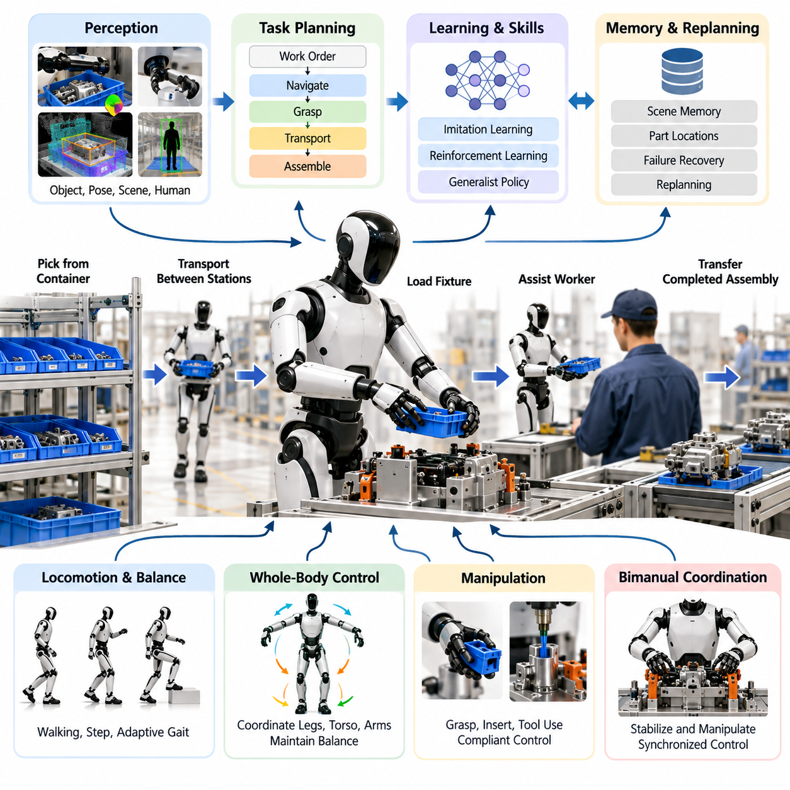
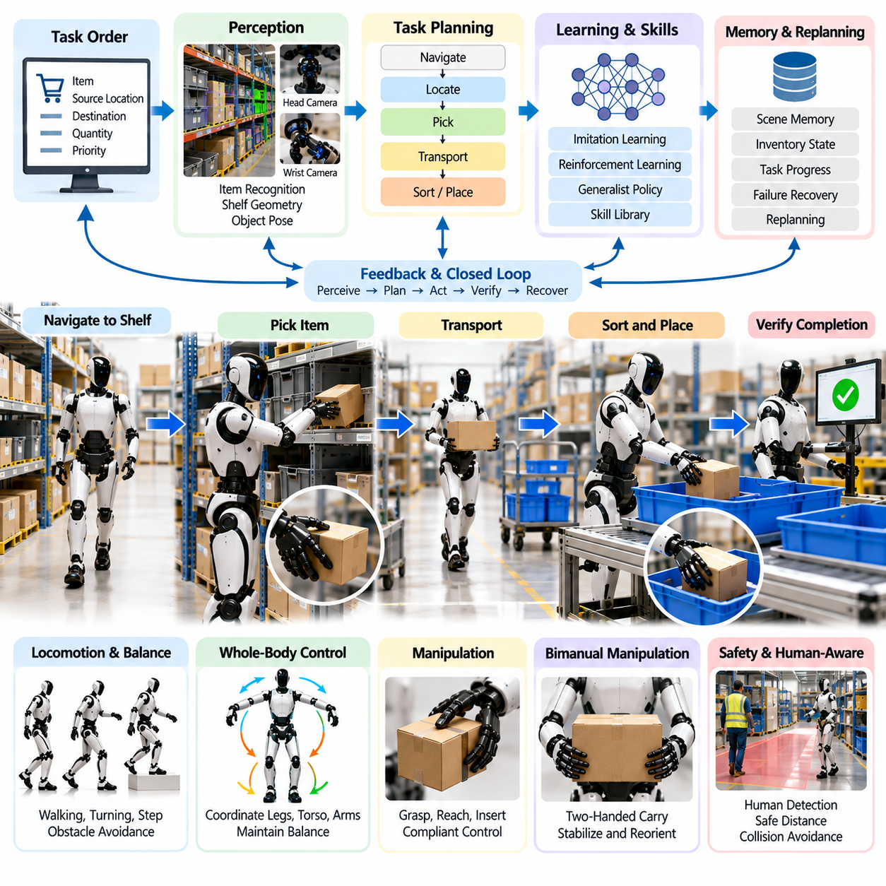
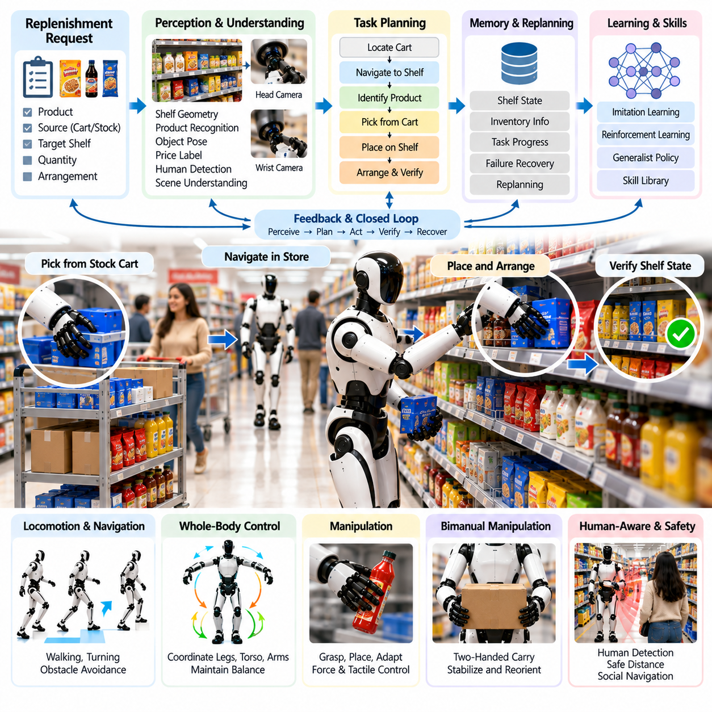
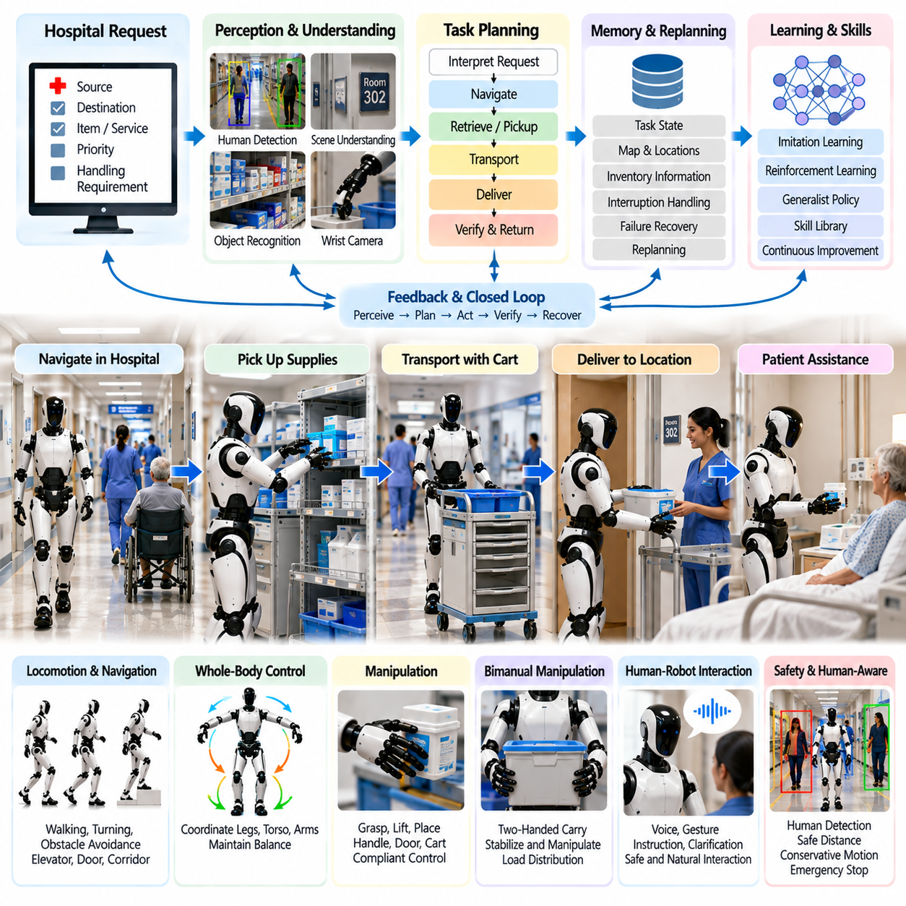
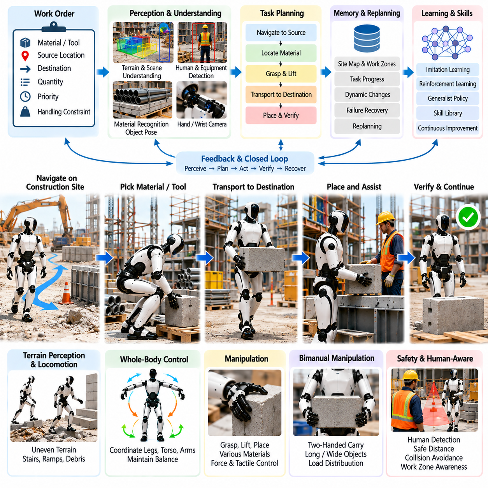
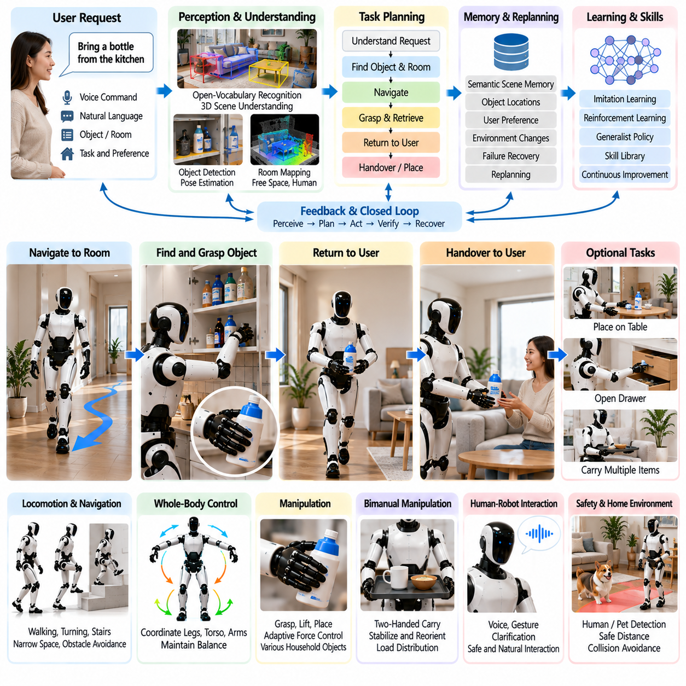
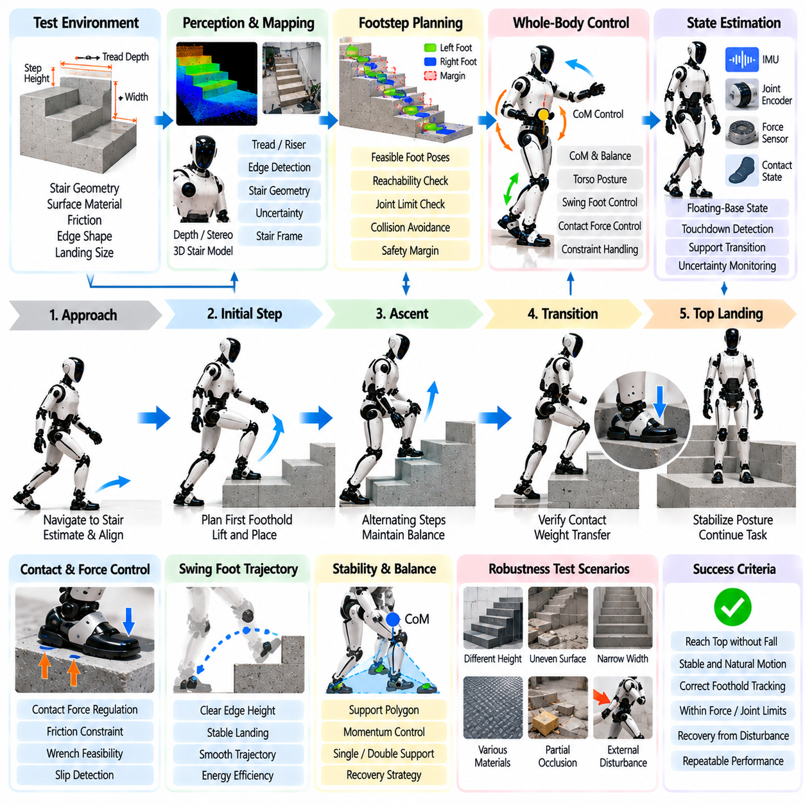
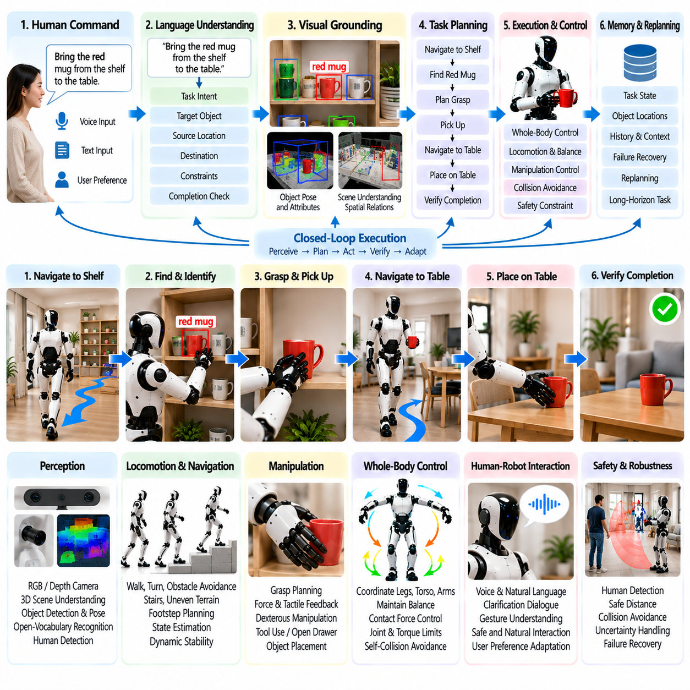
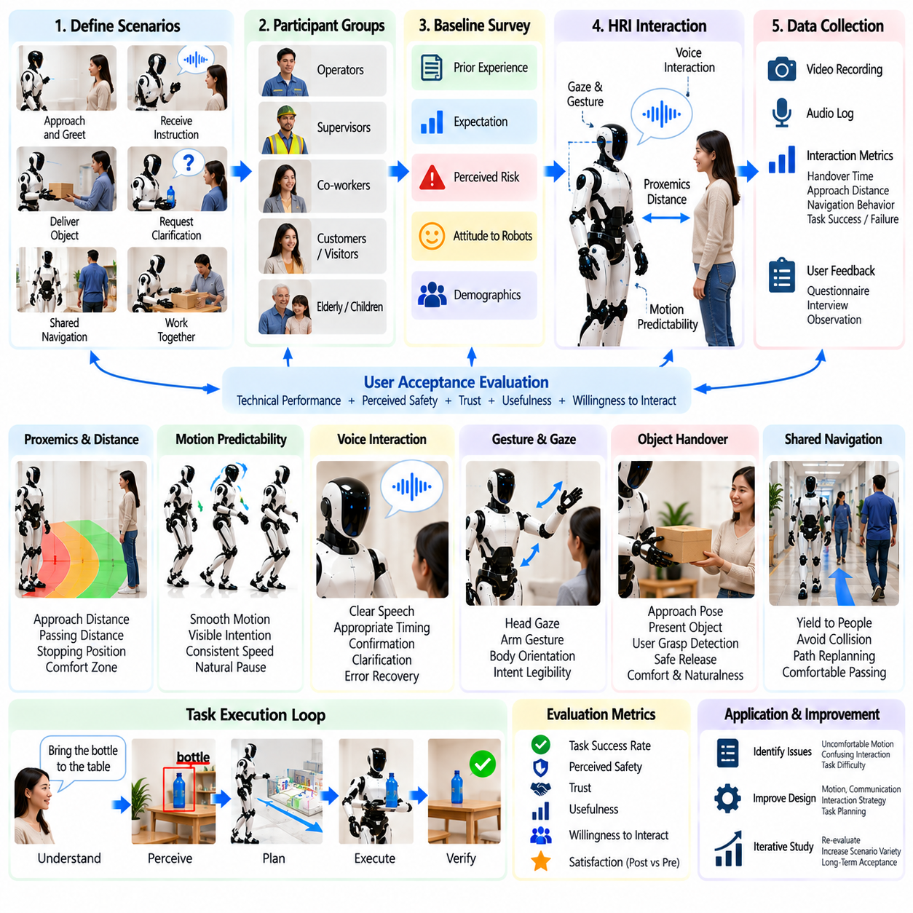
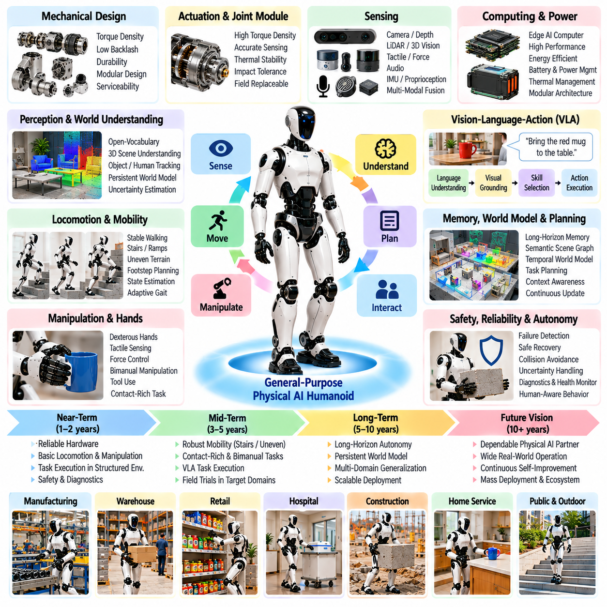

**Volume 22. Humanoid Robot Software**

# Chapter 12. Humanoid Case Studies

## 12.01. Manufacturing Assembly Line Humanoid Pilot Case

{width="7.268055555555556in" height="7.268055555555556in"}

제조 조립 라인 휴머노이드 파일럿(Manufacturing Assembly-Line Humanoid Pilot)은 범용 휴머노이드 능력(General Humanoid Capability)을 보여주기 위한 단순 시연이 아니라, 통제된 생산 실험(Controlled Production Experiment)으로 설계되어야 한다. 휴머노이드 소프트웨어 구조(Humanoid Software Structure)에서 파일럿은 보행(Locomotion), 균형(Balance), 전신 제어(Whole-Body Control), 인지(Perception), 조작(Manipulation), 범용 정책(Generalist Policies), 상호작용(Interaction), 에이전트 계획(Agent Planning), 검증(Validation)을 하나의 운영 워크플로(Operational Workflow)로 통합한다. 목표는 인간 작업자를 중심으로 설계된 기존 생산 환경에서 휴머노이드가 유용한 생산 작업을 안전하고 반복적으로 수행할 수 있는지를 확인하는 것이다.

첫 번째 배치 단계(Deployment Phase)에서는 처음부터 매우 높은 수준의 손재주(Dexterity)를 요구하지 않으면서 인간 호환형 형태(Human-Compatible Morphology)의 장점을 활용할 수 있는 작업을 선택해야 한다. 대표적인 후보로는 표준화된 부품함에서 부품 가져오기, 인접 작업장 사이에서 경량 부품 운반하기, 지그 또는 고정구(Fixture)에 부품 공급하기, 작업자에게 부품 전달하기, 간단한 손잡이 조작하기, 완성된 조립품 이동하기 등이 있다. 이러한 작업은 보행, 도달(Reaching), 파지(Grasping), 운반(Carrying), 배치(Placement)를 함께 시험하면서도 체계적인 공학적 평가가 가능하도록 작업 복잡도를 제한할 수 있다.

실용적인 파일럿(Pilot)은 생산 사이클(Production Cycle)을 관찰 가능한 로봇 기술(Robot Skills)로 세분화하는 것에서 시작한다. 하나의 조립 작업은 랙(Rack)으로의 이동, 객체 식별(Object Identification), 파지 자세 추정(Grasp Pose Estimation), 도달, 파지 확인(Grasp Verification), 운반, 고정구 위치 추정(Fixture Localization), 순응 삽입(Compliant Insertion), 해제(Release), 복귀(Return) 등으로 구성될 수 있다. 각 기술에는 측정 가능한 진입 조건(Entry Condition)과 종료 조건(Exit Condition)을 정의하여 전체 작업을 하나의 불투명한 인공지능 동작(AI Behavior)으로 취급하지 않고 실패 원인을 개별적으로 분리할 수 있어야 한다. 이를 통해 기존 자동화 로직(Conventional Automation Logic)과 학습 기반 정책(Learned Policy)을 함께 운용할 수도 있다.

인지 서브시스템(Perception Subsystem)은 단순히 객체를 검출하는 수준을 넘어 작업장 중심 표현(Task-Centered Representation)을 지속적으로 유지해야 한다. 머리와 몸체 카메라(Head and Body Cameras)는 넓은 환경 정보를 제공하고, 손목 카메라(Wrist Camera)는 근거리 파지와 정렬을 지원한다. 소프트웨어는 객체 종류, 6자유도 자세(6-DoF Pose), 고정구 상태(Fixture State), 사용 가능한 작업 공간(Free Workspace), 사람 위치(Human Location), 관련 접촉 상태(Contact Condition)를 추정해야 한다. 이를 통해 휴머노이드는 작업 환경을 단순 영상이 아니라 실제 행동에 필요한 구조화된 물리적 상태(Structured Physical State)로 이해할 수 있다.

휴머노이드의 팔은 부유 기반 몸체(Floating-Base Body) 위에서 동작하므로 조작(Manipulation)은 고정형 산업용 로봇과 다른 문제를 발생시킨다. 부품을 향해 팔을 뻗는 행동만으로도 무게중심(Center of Mass)이 이동하고, 특히 대상이 멀리 있거나 비대칭 위치에 있을 경우 안정성 여유(Stability Margin)가 감소할 수 있다. 따라서 전신 제어(Whole-Body Control)는 균형 제약(Balance Constraints)을 유지하면서 다리, 몸통, 팔, 접촉력(Contact Forces)을 동시에 조정해야 한다. 팔만 독립적으로 움직이도록 강제하는 대신 목표 자세가 불안정한 경우 발이나 몸통의 위치를 재조정하여 안정적인 작업 자세를 확보할 수 있어야 한다.

접촉이 많은 조립 작업(Contact-Rich Assembly)은 기하학적 궤적 추종(Geometric Trajectory Tracking)만으로 해결하기 어려운 제어 모드(Control Mode)를 요구한다. 커넥터 삽입, 부품의 고정구 정렬, 보호 장치가 있는 기구 조작, 공구 사용에서는 작은 위치 오차도 큰 접촉력을 발생시킬 수 있다. 팔 임피던스 제어(Arm Impedance Control)와 순응 관절 토크 제어(Compliant Joint Torque Control)는 이러한 불확실성을 흡수하고, 힘 및 촉각 피드백(Force and Tactile Feedback)은 실제 접촉 상태를 판단하는 정보를 제공한다. 따라서 시스템은 시각적 정렬만 사용하는 것이 아니라 운동 목표(Motion Objectives), 힘 제한(Force Limits), 충돌 제약(Collision Constraints), 작업별 접촉 조건(Task-Specific Contact Conditions)을 함께 고려해야 한다.

양손 작업(Bimanual Task)은 휴머노이드 형태(Humanoid Morphology)의 중요한 활용 근거가 될 수 있다. 한 손으로 부품을 고정하면서 다른 손으로 삽입, 체결, 검사 또는 공구 조작을 수행할 수 있기 때문이다. 그러나 두 팔의 운동은 몸통과 부유 기반(Floating Base)을 공유하므로 서로 독립적인 매니퓰레이터(Manipulator)처럼 계획할 수 없다. 협응 양손 제어(Coordinated Bimanual Control)는 공유 작업 공간(Shared Workspace), 자기 충돌(Self-Collision), 하중 분배(Load Distribution), 동기화(Synchronization), 균형(Balance)을 동시에 고려해야 한다. 이를 통해 두 팔뿐만 아니라 몸통과 다리까지 작업에 참여하는 진정한 전신 조작(Whole-Body Manipulation)이 가능해진다.

파일럿은 생산 목표(Production Objective)와 실시간 실행(Real-Time Execution)을 분리하는 계층형 작업 아키텍처(Hierarchical Task Architecture)를 사용하는 것이 적절하다. 작업 계획기(Task Planner)는 조립 작업장에 특정 부품을 공급하라는 작업 지시(Work Order)를 이동, 인지, 파지, 운반, 배치 행동으로 분해할 수 있다. 하위 제어기(Lower-Level Controller)는 결정론적 안전 제약(Deterministic Safety Constraints) 아래에서 이러한 행동을 실행한다. 의미론적 장면 메모리(Semantic Scene Memory)는 부품, 공구, 고정구, 작업장의 위치와 상태를 유지하고, 실패 인식 재계획(Failure-Aware Replanning)은 파지 실패나 목적지 차단 이후 수행해야 할 다음 행동을 결정한다.

명시적인 프로그래밍 비용이 커지는 영역에는 학습 기반 정책(Learned Policy)을 선택적으로 도입할 수 있다. 원격조작(Teleoperation) 시연으로 조작 과정에 필요한 모방학습(Imitation Learning) 데이터를 수집하고, 강화학습(Reinforcement Learning) 또는 모방학습-강화학습 하이브리드(IL-RL Hybrid) 방법을 이용하여 접촉이나 환경 변화에 적응해야 하는 행동을 개선할 수 있다. 범용 정책(Generalist Policy) 또는 시각-언어-행동 정책(Vision-Language-Action Policy)은 시각 관찰과 작업 명령을 상위 수준 행동에 연결할 수 있지만, 실제 생산 배치에서는 반드시 안전 오버라이드(Safety Override)와 폴백 동작(Fallback Behavior)을 유지해야 한다.

조립 라인과의 시스템 통합(System Integration) 역시 중요하다. 휴머노이드는 제조 실행 시스템(Manufacturing Execution System), 작업장 제어기(Workstation Controller), 기계 상태 신호(Machine Status Signal), 안전 설비(Safety Equipment), 생산 스케줄링 서비스(Production Scheduling Service)와 인터페이스해야 할 수 있다. 신뢰할 수 있는 디지털 인터페이스(Digital Interface)가 존재한다면 로봇이 기계의 준비 상태를 스스로 추측하기보다 명시적인 상태 정보를 사용하는 것이 바람직하다. 인지 시스템은 이를 물리적으로 재확인하여 명령된 생산 상태와 실제 관측 상태 사이의 불일치까지 검출할 수 있다.

인간-로봇 공존(Human-Robot Coexistence)은 동작 계획(Motion Planning)뿐만 아니라 생산 일정에도 영향을 준다. 휴머노이드는 작업자를 인식하고 적절한 분리 거리(Separation Distance)를 유지하며 필요한 경우 속도와 힘을 제한하고 공유 작업 공간이 점유되었을 때 작업자에게 양보해야 한다. 부품 전달과 같은 협업 행동(Collaborative Action)은 단순히 물체를 놓는 것이 아니라 작업자의 수령 준비 상태(Human Readiness)를 명시적으로 추정해야 한다. 음성 또는 제스처 상호작용(Voice or Gesture Interaction)은 보조 인터페이스로 활용할 수 있지만, 안전 핵심 명령(Safety-Critical Command)은 확률적인 언어 해석에만 의존하지 않고 결정론적 감독 메커니즘(Deterministic Supervisory Mechanism)과 연결되어야 한다.

생산 파일럿은 실제 배치 이전에 복구 동작(Recovery Behavior)을 정의해야 한다. 파지 실패는 인지 정보 갱신과 새로운 파지 후보 생성으로 연결되고, 예상하지 못한 장애물은 국소 재계획(Local Replanning)을 실행하며, 객체 식별의 불확실성이 높으면 사람에게 확인을 요청할 수 있다. 과도한 접촉력이 검출되면 조작 행동을 종료하고, 위치 추정이나 제어기 이상이 발생하면 안전 상태(Safe State)로 전환해야 한다. 실제 제조 환경에서는 시연 환경에서 제거되는 작은 변동들이 지속적으로 발생하기 때문에 정상 동작 성능보다 복구 범위(Recovery Coverage)가 시스템의 실질적인 생산성을 결정하는 경우가 많다.

검증(Validation)은 시뮬레이션(Simulation)과 소프트웨어 인 더 루프 시험(Software-in-the-Loop Testing)에서 시작하여 하드웨어 인 더 루프 평가(Hardware-in-the-Loop Evaluation)를 거쳐 제한된 실제 현장 운용(Restricted Field Operation)으로 단계적으로 진행해야 한다. 디지털 모델(Digital Model)에서는 객체 자세, 작업자 위치, 외란(Disturbance), 작업 순서의 수많은 변형을 먼저 시험할 수 있다. 이러한 시나리오가 충분한 안정성을 확보한 이후에만 동일하거나 유사한 조건을 실제 생산 셀(Production Cell)에 적용함으로써 물리적 로봇과 작업자에게 발생할 수 있는 위험을 줄일 수 있다.

파일럿 평가는 로봇이 결국 작업을 완료했는지만 측정해서는 안 된다. 유용한 지표에는 작업 성공률(Task Success Rate), 사이클 시간(Cycle Time), 개입 빈도(Intervention Frequency), 파지 및 삽입 성공률(Grasp and Insertion Success Rate), 위치 추정 신뢰성(Localization Reliability), 균형 복구(Balance Recovery), 안전 정지 빈도(Safety-Stop Frequency), 에너지 소비(Energy Consumption), 평균 운영 고장 간격(Mean Time Between Operational Failures) 등이 포함된다. 특히 사람의 개입(Human Intervention)은 독립적인 핵심 지표로 기록해야 한다. 높은 작업 성공률을 보이더라도 지속적인 원격 복구가 필요하다면 실제 생산 가치는 낮을 수 있기 때문이다.

생산 경제성(Production Economics)은 최종 배치 게이트(Deployment Gate)가 된다. 휴머노이드가 모든 개별 작업에서 특수 목적 자동화(Specialized Automation)보다 뛰어날 필요는 없다. 잠재적인 장점은 인간 중심으로 설계된 기존 인프라를 공유하면서 대규모 기계적 재설계 없이 여러 작업으로 재배치할 수 있다는 점에 있다. 따라서 파일럿에서는 기존 자동화 대안과 비교하여 통합 비용(Integration Cost), 작업 전환 비용(Changeover Effort), 설비 활용률(Utilization), 노동 지원 효과(Labor Assistance), 다운타임(Downtime), 유지보수(Maintenance), 소프트웨어 적응 비용(Software Adaptation)을 평가해야 한다. 이미 고정형 자동화가 효율적으로 처리하는 초고속 반복 작업보다 변동성이 높고 처리량 요구가 중간 수준인 작업이 초기 휴머노이드 적용에 더 적합할 수 있다.

성공적인 조립 라인 파일럿은 개별적인 휴머노이드 기능의 집합이 아니라 통합된 운영 능력(Integrated Operational Capability)을 입증해야 한다. 신뢰성 높은 보행(Locomotion)은 로봇을 작업장으로 이동시키고, 인지(Perception)는 물리적 상황을 파악하며, 전신 제어(Whole-Body Control)는 실행 가능한 안정적 운동을 유지한다. 순응 조작(Compliant Manipulation)은 실제 작업을 수행하고, 인공지능 정책(AI Policy)은 제한된 환경 변동에 대응하며, 에이전트 로직(Agent Logic)은 작업 진행을 관리한다. 이 모든 과정에서 결정론적 안전 메커니즘(Deterministic Safety Mechanism)이 행동 범위를 지속적으로 제한함으로써 휴머노이드를 단순한 시연 플랫폼이 아니라 실제 제조 시스템의 생산 자원(Production Resource)으로 전환할 수 있다.

## 12.02. Warehouse Picking and Sorting Humanoid Case

{width="7.268055555555556in" height="7.268055555555556in"}

창고 피킹 및 분류(Warehouse Picking and Sorting)는 기존 창고가 대부분 인간 작업자를 기준으로 설계된 선반, 토트(Tote), 카트(Cart), 작업대, 손잡이, 통로로 구성되어 있기 때문에 휴머노이드(Humanoid)의 유력한 적용 사례가 될 수 있다. 휴머노이드는 모든 저장 위치를 고정형 자동화(Fixed Automation)에 맞게 재설계하지 않고도 기존 인프라에서 작업할 가능성이 있다. 이 사례는 이동(Navigation), 인지(Perception), 파지(Grasping), 운반(Carrying), 배치(Placement), 균형(Balance), 작업 계획(Task Planning), 복구(Recovery)를 결합하므로 통합된 휴머노이드 소프트웨어 능력(Integrated Humanoid Software Capability)을 평가하기에 적합하다.

운영 워크플로(Operational Workflow)는 창고 관리 계층(Warehouse Management Layer)이 품목 식별 정보(Item Identity), 출발 위치(Source Location), 목적지(Destination), 수량(Quantity), 우선순위(Priority)를 포함하는 피킹 또는 분류 작업을 할당하면서 시작된다. 휴머노이드 작업 계획기(Task Planner)는 이를 선반으로 이동하기, 대상 컨테이너 찾기, 요청 객체 식별하기, 파지 선택하기, 물품 꺼내기, 획득 여부 확인하기, 운반하기, 지정된 토트 또는 분류 위치에 배치하기 등의 실행 가능한 행동으로 변환한다. 각 단계에는 명확한 성공 조건(Success Condition)과 실패 조건(Failure Condition)이 정의되어야 한다.

이동(Navigation)은 이족 보행 로봇(Biped Robot)의 고유한 특성을 고려해야 한다. 바퀴형 자율이동로봇(AMR)과 달리 휴머노이드는 통로를 이동하고, 선반 주변에서 방향을 전환하며, 임시 장애물을 피해 걷고, 작업면에 접근하는 동안 지속적으로 동적 안정성(Dynamic Stability)을 관리해야 한다. 발걸음 계획(Footstep Planning), 균형 제어(Balance Control), 상태 추정(State Estimation), 국소 장애물 회피(Local Obstacle Avoidance)가 함께 동작해야 한다. 또한 이후의 피킹 동작에서 과도하게 몸을 기울이거나 안정성 여유(Stability Margin)가 감소하지 않도록 충분한 조작 도달 범위를 확보할 수 있는 안정적인 접근 자세(Approach Pose)를 선택해야 한다.

창고 인지(Warehouse Perception)는 의미론적 품목 인식(Semantic Item Recognition)과 기하학적 조작 정보(Geometric Manipulation Information)를 연결해야 한다. 머리 장착 카메라(Head-Mounted Camera)는 선반과 통로의 넓은 영역을 관찰하고, 손목 카메라(Wrist Camera)는 최종 도달과 파지 과정에서 세부 영상을 제공할 수 있다. 시스템은 선반 형상(Shelf Geometry), 컨테이너 경계(Container Boundary), 객체 종류(Object Identity), 객체 자세(Object Pose), 자유 공간(Free Space), 사람 위치(Human Location), 가능한 파지 영역(Grasp Region)을 추정해야 한다. 개방형 어휘 인지(Open-Vocabulary Perception)는 기존 폐쇄형 검출기(Closed-Set Detector)의 재학습 속도보다 제품 구성이 빠르게 변화하는 창고에서도 유용하게 활용될 수 있다.

피킹(Picking)은 객체가 부분적으로 가려져 있거나, 밀집되어 있거나, 반사 특성을 가지거나, 변형 가능하거나, 시각적으로 서로 유사할 때 어려워진다. 따라서 신뢰성 높은 시스템은 인지(Perception)를 한 번의 검출 작업이 아니라 능동적인 과정(Active Process)으로 다루어야 한다. 휴머노이드는 추가 시점을 확보하기 위해 머리, 몸통 또는 손목 카메라를 움직이고, 허용되는 경우 주변 객체를 재배치하거나, 시각적 관찰 결과를 재고 정보(Inventory Information)와 비교할 수 있다. 식별 신뢰도가 낮으면 불확실한 예측을 즉시 물리적 조작으로 전달하지 않고 추가 검사 또는 사람의 확인을 요청해야 한다.

파지 생성(Grasp Generation)은 손이 객체를 잡을 수 있는지만 판단하는 것이 아니라 해당 파지 자세가 이후 작업까지 지원할 수 있는지를 고려해야 한다. 선반에서 물품을 꺼내기에는 적절한 파지라도 바코드 검사(Barcode Inspection)를 방해하거나 토트 내부에 배치하기 어려운 자세일 수 있다. 따라서 계획기(Planner)는 접근 가능성(Accessibility), 손 방향(Hand Orientation), 충돌 여유(Collision Clearance), 예상 하중(Expected Load), 객체 형상(Object Geometry), 이후 조작 요구사항(Downstream Manipulation Requirements)을 평가해야 한다. 촉각 및 힘 피드백(Tactile and Force Feedback)을 이용하면 접촉 상태와 미끄러짐(Slip)을 검출하고 운반을 시작하기 전에 객체가 실제로 안정적으로 파지되었는지 확인할 수 있다.

선반 높이의 변화(Shelf Height Variation)는 휴머노이드 형태(Humanoid Morphology)의 장점과 어려움을 동시에 보여준다. 낮은 위치에서는 웅크리기(Crouching)가 필요할 수 있고, 높은 선반에서는 다리, 몸통, 어깨, 팔을 협응하여 확장해야 한다. 이러한 동작은 특히 무거운 물체를 꺼낼 때 무게중심(Center of Mass)과 가용 안정성 여유(Available Stability Margin)를 변화시킨다. 전신 제어(Whole-Body Control)는 도달 목표보다 균형(Balance), 관절 한계(Joint Limits), 자기 충돌 회피(Self-Collision Avoidance), 접촉 제약(Contact Constraints), 액추에이터 토크 한계(Actuator Torque Limits)를 우선하면서 자세와 조작을 통합적으로 조정해야 한다.

양손 조작(Bimanual Manipulation)은 대형 포장물, 불안정한 컨테이너 또는 방향 재조정이 필요한 객체를 처리할 때 유용하다. 휴머노이드는 한 손으로 토트를 고정하면서 다른 손으로 물품을 꺼내거나, 운반 과정에서 포장물을 양손으로 잡거나, 더 적합한 배치 방향을 얻기 위해 물체를 한 손에서 다른 손으로 전달할 수 있다. 이러한 행동에는 공유 몸통(Shared Torso)과 부유 기반(Floating Base)을 통한 협응 팔 운동(Coordinated Arm Motion)이 필요하다. 운반 물체의 질량이 전체 로봇-객체 시스템(Robot-Object System)의 동역학을 변화시키므로 하중 분배(Load Distribution) 역시 균형 제어에 포함되어야 한다.

분류(Sorting)는 단순히 성공적인 피킹으로 끝나지 않는다. 물체를 획득한 이후 로봇은 작업 지시(Work Order), 관찰된 품목 종류 또는 창고 라우팅 정보(Warehouse Routing Information)를 이용하여 올바른 목적지를 결정하고 신뢰성 높은 배치를 수행해야 한다. 목적지 컨테이너에 이미 다른 물체가 존재할 수 있으므로 사용 가능한 배치 영역(Placement Region)은 지속적으로 변화한다. 인지 시스템은 물체를 놓기 전에 컨테이너 상태를 갱신해야 하며, 조작 계획은 충돌과 과도한 낙하 높이(Drop Height)를 방지해야 한다. 작업 기록을 완료하기 전에 시각 또는 다른 센서를 이용해 성공적인 배치 여부를 확인해야 한다.

범용 정책(Generalist Policy) 또는 시각-언어-행동 정책(Vision-Language-Action Policy)은 특정 제품을 찾아 지정된 빈(Bin)에 넣으라는 것과 같이 의미론적 명령(Semantic Instruction)으로 표현되는 창고 작업에 유연성을 제공할 수 있다. 그러나 언어 조건부 정책(Language-Conditioned Policy)이 안전 핵심 동작 경계(Safety-Critical Motion Boundary)를 독립적으로 제어해서는 안 된다. 상위 수준의 의미론적 추론(Semantic Reasoning)이 목표와 기술을 선택하고, 검증된 보행(Locomotion), 전신 제어(Whole-Body Control), 충돌 검사(Collision Checking), 파지 실행(Grasp Execution), 안전 감독(Safety Supervision)이 실제 물리적 행동을 제한하는 구조가 적합하다. 이러한 분리를 통해 학습 기반 지능의 적응성을 활용하면서 생산 안전이 제약되지 않은 모델 출력에 의존하는 것을 방지할 수 있다.

창고는 본질적으로 사람과 로봇이 공유하는 공간(Shared Space)이므로 실행 과정 전체에서 사람 검출(Human Detection)과 상호작용 기능이 활성화되어야 한다. 작업자는 통로에 진입하거나, 인접 선반에 손을 뻗거나, 카트를 이동하거나, 로봇의 계획 경로를 일시적으로 차단할 수 있다. 휴머노이드는 안전 분리 거리가 부족해지면 속도를 줄이거나 정지하고 필요하면 경로를 다시 계획해야 한다. 공동 피킹 작업에서는 의도 추정(Intent Estimation)을 이용하여 단순히 지나가는 작업자와 동일한 선반에서 작업하려는 사람을 구별할 수 있지만, 실제 운동 허가(Motion Permission)에 대한 최종 권한은 결정론적 안전 로직(Deterministic Safety Logic)이 유지해야 한다.

실패 복구(Failure Recovery)는 수천 번의 창고 처리 과정에서 피킹 오류가 빠르게 누적될 수 있기 때문에 필수적이다. 파지 실패가 발생하면 새로운 관찰 시점과 파지 후보를 생성하고, 물체가 미끄러지면 제어된 복구 동작(Controlled Recovery Response)을 실행해야 한다. 요청한 품목이 존재하지 않는 경우에는 인지 불확실성(Perception Uncertainty)과 재고 불일치(Inventory Inconsistency)를 구별해야 한다. 접근이 차단된 선반, 도달할 수 없는 객체, 이동 실패, 예상하지 못한 포장물 무게, 점유된 목적지 등은 명시적인 예외 상태(Exception State)로 생성되어 재계획(Replanning), 작업 재할당(Reassignment), 사람의 지원(Human Assistance)을 통해 해결할 수 있어야 한다.

소프트웨어 아키텍처(Software Architecture)는 이러한 복구 과정에서도 의미론적 작업 메모리(Semantic Task Memory)를 유지해야 한다. 로봇은 현재 어떤 주문을 수행하고 있는지, 어떤 위치를 이미 검사했는지, 어떤 물체를 파지했는지, 어떤 실패가 발생했는지, 어느 목적지가 여전히 유효한지를 기억해야 한다. 지속적인 작업 상태(Persistent Task State)가 없으면 복구 행동 이후 동일한 위치를 반복적으로 검색하거나 물품을 중복 처리할 수 있다. 따라서 인지(Perception), 메모리(Memory), 행동(Action), 다단계 계획(Multi-Step Planning), 실패 인식 재계획(Failure-Aware Replanning)을 결합하는 에이전트 아키텍처(Agent Architecture)는 여러 연속적인 의사결정을 요구하는 장시간 창고 워크플로에서 특히 중요하다.

평가(Evaluation)는 독립적인 선반 피킹 실험(Isolated Shelf-Picking Experiment)에서 시작하여 통합 창고 임무(Integrated Warehouse Mission)로 발전해야 한다. 시뮬레이션(Simulation)에서는 실제 배치 이전에 선반 형상, 객체 자세, 조명, 가림(Occlusion), 통로 교통량, 포장물 질량, 목적지 점유 상태 등을 다양하게 변화시킬 수 있다. 이후 하드웨어 시험(Hardware Test)을 통해 균형, 조작력, 인지 지연시간(Perception Latency), 안전 정지(Safety Stop), 복구 동작을 검증해야 한다. 통제된 조건에서 안정적인 행동이 입증된 이후 실제 재고와 사람의 이동을 단계적으로 추가하여 소프트웨어 검증에서 실제 운영 환경으로 명확하게 확장하는 것이 바람직하다.

성능 측정(Performance Measurement)에는 품목 인식 정확도(Item Recognition Accuracy), 파지 성공률(Grasp Success Rate), 첫 시도 피킹 성공률(First-Attempt Pick Rate), 배치 정확도(Placement Accuracy), 주문 완료율(Order Completion Rate), 사이클 시간(Cycle Time), 보행 시간(Walking Time), 개입 빈도(Intervention Frequency), 복구 성공률(Recovery Success Rate), 물품 손상률(Damaged-Item Rate), 안전 정지 빈도(Safety-Stop Frequency)가 포함되어야 한다. 빈번한 사람의 복구가 필요한 고속 시스템은 오히려 창고의 작업량을 증가시킬 수 있으므로 처리량(Throughput)만으로는 충분하지 않다. 따라서 완전 자율 완료(Autonomous Completion)와 보조 완료(Assisted Completion)를 구분하고 실패 원인을 기록하여 주요 운영 병목을 소프트웨어 개선 대상으로 연결해야 한다.

창고 휴머노이드(Warehouse Humanoid)의 경제적 가치는 단순히 특수 목적 자동화(Specialized Automation)의 속도를 따라잡는 것보다 유연성(Flexibility)에 의해 결정될 가능성이 높다. 고정형 컨베이어(Fixed Conveyor), 분류기(Sorter), 로봇 셀(Robotic Cell), 자율이동로봇(AMR)은 고도로 구조화된 물류 흐름에서 여전히 더 효율적일 수 있다. 휴머노이드는 인간 중심 선반, 다양한 취급 작업, 빈번한 레이아웃 변경(Layout Change), 이동과 조작을 동시에 요구하는 워크플로에서 경쟁력을 가질 수 있다. 따라서 가장 효과적인 배치 모델은 기존 자동화와 휴머노이드를 결합하여 각 플랫폼의 물리적·소프트웨어적 능력에 가장 적합한 작업을 할당하는 형태가 될 수 있다.

성공적인 창고 파일럿(Warehouse Pilot)은 궁극적으로 인지(Perception), 이동(Locomotion), 조작(Manipulation), 추론(Reasoning), 복구(Recovery)를 연결한 폐루프 자율성(Closed-Loop Autonomy)을 입증해야 한다. 휴머노이드는 올바른 위치로 이동하고, 주변 장면을 이해하며, 정확한 물체를 획득하고, 변화하는 하중에서도 균형을 유지하고, 올바른 목적지로 운반하여 작업 완료를 확인해야 한다. 동시에 예측 가능한 실패 상황을 지속적인 사람의 감독 없이 복구할 수 있어야 한다. 이러한 전체 사이클을 반복적으로 수행할 수 있을 때 창고 피킹 및 분류는 단순한 조작 벤치마크(Manipulation Benchmark)를 넘어 실제 생산 수준 휴머노이드 지능(Production-Grade Humanoid Intelligence)을 평가하는 실용적인 사례가 된다.

## 12.03. Retail Store Shelf Stocking Humanoid Case

{width="7.268055555555556in" height="7.268055555555556in"}

소매점 선반 진열(Retail Shelf Stocking)은 인간 중심 환경(Human-Centered Environment)에서 지속적으로 동작하면서 이동 조작(Mobile Manipulation)을 수행해야 하므로 까다로운 휴머노이드 적용 사례(Humanoid Case)이다. 비교적 통제된 통로와 재고 프로세스를 갖는 창고와 달리 소매점에는 고객, 직원, 쇼핑 카트, 계속 변경되는 진열대, 좁은 통로, 예상 위치에서 자주 이동되는 상품이 존재한다. 따라서 휴머노이드는 일반 고객 주변에서 안전한 동작을 유지하면서 인지(Perception), 보행(Locomotion), 조작(Manipulation), 작업 추론(Task Reasoning), 인간 인식 행동(Human-Aware Behavior)을 통합해야 한다.

작업 흐름(Workflow)은 재고 기록(Inventory Records), 선반 모니터링(Shelf Monitoring) 또는 직원의 지시를 통해 생성된 상품 보충 요청(Replenishment Request)에서 시작할 수 있다. 작업에는 상품, 공급 컨테이너(Source Container), 대상 선반(Target Shelf), 수량, 원하는 진열 상태 등이 지정될 수 있다. 휴머노이드 작업 계획기(Task Planner)는 이를 보충 카트 찾기, 올바른 상품 식별하기, 진열 구역으로 이동하기, 선반 위치 찾기, 허용되는 경우 잘못 배치된 상품 제거하기, 새 상품 배치하기, 상품 방향 정렬하기, 최종 선반 상태 확인하기 등의 행동으로 변환한다.

소매점 인지(Retail Perception)는 개별 상품뿐만 아니라 선반의 구조적 구성(Structural Organization)을 이해해야 한다. 머리 장착 카메라(Head-Mounted Camera)는 통로, 고객, 표지판, 선반, 장애물을 관찰하고, 손목 카메라(Wrist Camera)는 파지와 배치 과정에서 근거리 정보를 제공할 수 있다. 인지 시스템은 상품 종류(Product Identity), 객체 자세(Object Pose), 선반 경계(Shelf Boundary), 사용 가능한 배치 영역(Placement Region), 인접 상품, 가격표 위치(Price-Label Location), 사람 위치를 추정해야 한다. 개방형 어휘 인지(Open-Vocabulary Perception)는 수천 종류의 상품을 취급하고 상품 구성이 고정된 검출 클래스보다 빠르게 변화할 수 있는 소매 환경에서 특히 유용하다.

상품 식별(Product Identification)은 포장재가 유사한 색상, 형상, 로고 또는 크기를 가질 수 있기 때문에 어려울 수 있다. 또한 상품이 부분적으로 가려지거나 회전되어 있거나 적층되거나 다른 상품 뒤에 배치될 수도 있다. 휴머노이드는 가능한 경우 시각 인식(Visual Recognition)을 바코드(Barcode), 문자(Text), 재고 정보(Inventory Information), 선반 위치 정보(Shelf-Location Information)와 결합해야 한다. 인식 신뢰도가 낮으면 불확실한 분류 결과를 그대로 사용하여 잘못된 선반에 상품을 배치하는 대신 추가 관찰을 수행하거나 확인을 요청해야 한다.

선반 진열(Shelf Stocking)은 단순히 사용 가능한 공간에 물체를 놓는 것 이상을 요구한다. 일반적으로 상품은 정면 방향 유지(Facing Forward), 카테고리별 그룹 유지(Category Grouping), 포장 전면 정렬(Package-Front Alignment), 가격표 대응(Price-Label Correspondence), 적절한 간격 유지 등의 머천다이징 제약(Merchandising Constraints)을 따라야 한다. 따라서 로봇은 목표 선반 상태(Desired Shelf State)에 대한 표현을 가지고 현재 관찰된 상태와 비교해야 한다. 배치 계획(Placement Planning)은 물체가 기하학적으로 들어갈 수 있는 위치뿐만 아니라 머천다이징 목표에 따라 실제로 배치되어야 할 위치까지 결정해야 한다.

조작 난이도(Manipulation Difficulty)는 소매 상품의 종류에 따라 크게 달라진다. 단단한 상자는 단순한 평행 파지(Parallel Gripping)가 가능하지만 병, 봉지, 유연 포장재, 깨지기 쉬운 용기, 원통형 물체에는 서로 다른 파지 전략(Grasp Strategy)이 필요하다. 힘 및 촉각 센싱(Force and Tactile Sensing)은 안정적인 접촉, 과도한 압착, 물체 미끄러짐(Object Slip)을 감지하는 데 활용될 수 있다. 조작 시스템은 상품 특성에 따라 파지력(Grasp Force)과 손 형상(Hand Configuration)을 조정하면서 특히 깨지기 쉬운 상품이나 집중된 접촉력에 의해 변형될 수 있는 포장재에는 보수적인 힘 제한을 적용해야 한다.

선반 높이(Shelf Height)는 매장 전체에서 큰 변화를 보이므로 다른 휴머노이드 조작 작업과 마찬가지로 전신 제어(Whole-Body Control) 문제를 발생시킨다. 낮은 선반에서는 웅크리기(Crouching) 또는 무릎을 굽힌 자세가 필요할 수 있으며, 높은 선반에서는 다리, 몸통, 어깨, 팔을 협응하여 확장해야 한다. 제어기는 관절 한계(Joint Limits), 자기 충돌 제약(Self-Collision Constraints), 액추에이터 한계(Actuator Limits), 주변 환경과의 여유 공간(Environmental Clearance)을 만족하면서 무게중심 안정성(Center-of-Mass Stability)을 유지해야 한다. 과도한 도달 동작이 안정성이나 조작 정확도를 감소시킬 경우에는 발의 위치를 다시 조정하는 것이 우선되어야 한다.

여러 개의 동일 상품을 연속으로 보충하는 작업은 반복 조작(Repetitive Manipulation)과 지속적으로 변화하는 장면 형상(Scene Geometry)을 동시에 발생시킨다. 상품 하나를 배치할 때마다 사용 가능한 선반 공간이 달라지므로 다음 목표 자세(Target Pose)를 다시 계산해야 할 수 있다. 따라서 고정된 좌표의 동일한 동작을 반복하는 대신 로봇은 선반 상태를 반복적으로 관찰하면서 인지와 행동 사이의 폐루프(Closed Loop)를 유지해야 한다. 이러한 방식은 작은 배치 오차뿐만 아니라 진열 작업 중 고객이나 직원에 의해 발생하는 예상하지 못한 변화에도 대응할 수 있게 한다.

양손 조작(Bimanual Manipulation)은 트레이(Tray), 상자, 다중 포장 제품(Multipack), 불안정한 물체를 취급할 때 성능을 향상시킬 수 있다. 휴머노이드는 한 손으로 공급 상자를 잡고 다른 손으로 상품을 꺼내거나, 양손으로 큰 포장물을 운반하거나, 상품을 삽입하면서 주변 진열품을 안정화할 수 있다. 이러한 행동에는 양팔, 몸통 자세(Torso Posture), 균형 제어(Balance Control)의 협응이 필요하다. 비대칭 하중 운반(Asymmetric Carrying)은 로봇의 무게중심과 가능한 동작 범위를 크게 변화시킬 수 있으므로 제어기는 지속적으로 변화하는 하중 분배(Load Distribution)를 고려해야 한다.

소매점에서의 이동(Navigation)은 이전에 계획된 경로가 계속 비어 있다고 가정할 수 없다. 고객은 갑자기 멈출 수 있고, 쇼핑 카트가 통로를 막을 수 있으며, 어린이는 예측하기 어렵게 움직이고, 직원이 진열 구역을 일시적으로 점유할 수도 있다. 휴머노이드는 이동 중 지속적으로 국소 자유 공간(Local Free Space)을 갱신하고 사람을 고려한 안전 거리(Human-Aware Separation)를 유지해야 한다. 통로가 차단된 경우 공격적으로 통과하려 하기보다 기다리거나 경로를 재계획해야 한다. 보행 속도(Locomotion Speed)는 가시성, 보행자 밀도, 운반 하중, 현재 로봇의 안전 정지 능력을 고려하여 결정해야 한다.

인간-로봇 상호작용(Human-Robot Interaction)은 고립된 산업 환경보다 소매점에서 더욱 중요해진다. 고객은 로봇에게 접근하거나 질문하거나 이동 경로를 방해하거나 로봇의 손 주변에 있는 상품에 손을 뻗을 수 있다. 직원은 음성으로 지시하거나 진행 중인 진열 작업의 일시 중단을 요청할 수 있다. 음성 및 언어 인터페이스(Voice and Language Interface)는 이러한 상호작용을 지원할 수 있지만 물리적 안전(Physical Safety)은 결정론적 메커니즘(Deterministic Mechanism)에 의해 관리되어야 한다. 대화 기능이 충돌 회피(Collision Avoidance), 힘 제한(Force Limits), 비상 정지(Emergency Stop), 보호 동작 경계(Protected Motion Boundaries)를 무시해서는 안 된다.

언어 조건부 시스템(Language-Conditioned System) 또는 시각-언어-행동 시스템(Vision-Language-Action System)은 특정 상품 그룹을 지정된 선반에 배치하거나 잘못된 진열을 수정하는 것과 같은 명령을 해석하여 유연성을 높일 수 있다. 의미론적 추론(Semantic Reasoning)은 모든 작업을 수동으로 프로그래밍하지 않고도 상품 설명, 시각적 관찰, 작업 목표를 연결할 수 있다. 그러나 상위 수준 모델 출력(High-Level Model Output)은 검증된 로봇 기술(Validated Robot Skills)로 변환되어야 한다. 이동, 파지, 전신 제어, 충돌 검사, 물체 해제 동작은 시험된 실행 계층(Execution Layer)과 독립적인 안전 감독(Safety Supervision)의 제약을 받아야 한다.

실패 복구(Failure Recovery)는 예외 기능이 아니라 정상적인 소매점 운영의 일부로 고려해야 한다. 파지 실패가 발생하면 다른 파지 후보를 생성할 수 있고, 목표 선반 위치가 점유된 경우 올바른 인접 위치를 검색하거나 사람의 지원을 요청할 수 있다. 상품이 떨어지면 현재 작업 순서를 중단하고 안전하게 복구할 수 있는지를 평가해야 한다. 상품 누락, 잘못된 라벨, 차단된 진열 공간, 불확실한 상품 식별, 손상된 포장, 예상하지 못한 선반 구성 등은 통제되지 않은 임의 행동 대신 명시적인 예외 상태(Exception State)를 생성해야 한다.

하나의 진열 작업에 많은 상품과 위치가 포함되는 경우 지속적인 작업 메모리(Persistent Task Memory)가 필요하다. 로봇은 어떤 상품을 가져왔는지, 어떤 선반 위치의 작업이 완료되었는지, 어떤 배치가 실패했는지, 어떤 작업을 나중에 다시 검사해야 하는지를 유지해야 한다. 의미론적 장면 메모리(Semantic Scene Memory)를 이용하면 배치 이후 고객이 상품을 이동시켰는지 판단하는 데에도 도움을 받을 수 있다. 메모리와 실패 인식 재계획(Failure-Aware Replanning)을 결합하면 휴머노이드는 전체 진열 작업을 처음부터 다시 시작하거나 이미 완료된 행동을 중복하지 않고 중단된 작업을 재개할 수 있다.

시험(Testing)은 실제 매장의 복잡성을 도입하기 전에 통제된 선반 구성(Controlled Shelf Layout)에서 시작해야 한다. 시뮬레이션(Simulation)에서는 상품 형상, 선반 높이, 조명, 가림(Occlusion), 보행자 이동, 포장물 질량, 객체 배치 등을 변화시킬 수 있다. 이후 실제 선반과 대표 상품을 이용한 물리적 시험(Physical Test)을 통해 인지, 파지, 전신 안정성(Whole-Body Stability), 배치 정확도, 복구 성능을 측정할 수 있다. 기본적인 조작과 안전 행동이 안정된 이후 사람의 이동을 단계적으로 추가하여 실제 공공 공간(Public Space)에서의 상호작용을 평가하는 것이 적절하다.

유용한 파일럿 지표(Pilot Metrics)에는 상품 인식 정확도(Product Recognition Accuracy), 첫 시도 파지 성공률(First-Attempt Grasp Success), 배치 성공률(Placement Success), 상품 정면 정렬 정확도(Facing Accuracy), 선반 상태 검증 정확도(Shelf-State Verification Accuracy), 작업 완료 시간(Task Completion Time), 개입 빈도(Intervention Frequency), 복구 성공률(Recovery Success), 상품 손상(Product Damage), 이동 지연(Navigation Delay), 안전 정지 빈도(Safety-Stop Frequency)가 포함된다. 완전 자율 완료(Fully Autonomous Completion)와 직원 지원 완료(Employee-Assisted Completion)를 구분하여 평가해야 하며, 반복적인 수정이나 복구가 필요하다면 단순 처리량만으로 실제 운영 가치를 판단해서는 안 된다.

경제성(Economic Case)은 휴머노이드의 유연성(Flexibility)이 특수 목적 소매 자동화(Specialized Retail Automation)에 비해 상대적으로 낮은 작업 속도를 보완할 수 있는지에 따라 결정된다. 휴머노이드는 기존 통로를 이동하고, 사람을 위해 설계된 선반을 조작하며, 기존 카트와 컨테이너를 사용하고, 대규모 인프라 변경 없이 여러 관련 작업을 수행할 가능성이 있다. 따라서 상품 배치가 자주 변경되고, 지속적인 보충 작업이 필요하며, 선반 관리에 많은 노동력이 요구되거나 직원이 진열과 고객 대응 업무를 동시에 수행해야 하는 매장에서 가장 높은 활용 가능성을 가질 수 있다.

성공적인 소매점 파일럿(Retail Pilot)은 단순한 자율 상품 배치 이상의 능력을 입증해야 한다. 휴머노이드는 보충 목표(Replenishment Goal)를 이해하고, 지속적으로 변화하는 공공 환경에서 안전하게 이동하며, 올바른 상품을 인식하고, 손상 없이 조작하며, 서로 다른 선반 높이에서도 전신 안정성을 유지해야 한다. 또한 머천다이징 제약을 만족시키고, 최종 진열 상태를 확인하며, 일상적으로 발생하는 실패에서 복구할 수 있어야 한다. 이러한 기능이 하나의 폐루프 시스템(Closed-Loop System)으로 반복적으로 동작할 때 선반 진열은 인간을 위해 설계된 상업 환경에서 범용 휴머노이드(General-Purpose Humanoid)의 실제 배치 가능성을 평가하는 의미 있는 사례가 된다.

## 12.04. Hospital Logistics and Patient Assist Case

{width="7.268055555555556in" height="7.268055555555556in"}

병원 물류 및 환자 지원(Hospital Logistics and Patient Assistance)은 병원이 구조화된 운영 워크플로(Structured Operational Workflow)와 매우 동적인 인간 환경(Dynamic Human Environment)을 동시에 포함하기 때문에 까다로운 휴머노이드 적용 분야(Humanoid Application)이다. 휴머노이드는 물품 이동, 자재 배송, 문과 카트 조작, 물체 가져오기, 환자 또는 의료진에 대한 제한된 지원을 수행할 수 있다. 그러나 일반적인 산업 환경과 달리 모든 행동에서 취약한 사람(Vulnerable People), 임상적 우선순위(Clinical Priority), 개인정보 보호(Privacy), 감염 관리 절차(Infection-Control Procedure), 신체적 상호작용에 대한 엄격한 제한을 고려해야 한다.

실용적인 병원 파일럿(Hospital Pilot)은 환자와 직접 상호작용하기 전에 위험도가 낮은 물류 작업(Low-Risk Logistics Task)부터 시작해야 한다. 초기 임무에는 밀봉된 의료 물품 운반, 경량 자재 수거, 린넨(Linen) 배송, 승인된 카트 이동, 규정된 절차에 따른 검사실 용기 운반, 의료진이 자주 사용하는 물품 가져오기 등이 포함될 수 있다. 이러한 작업은 사람과 호환되는 이동 및 조작 능력(Human-Compatible Mobility and Manipulation)을 활용하면서 환자와의 고위험 신체 접촉을 즉시 도입하지 않고 시스템의 신뢰성을 확립할 수 있도록 한다.

작업 흐름(Workflow)은 병원 정보 시스템(Hospital Information System) 또는 물류 시스템(Logistics System)이 출발지(Source), 목적지(Destination), 물품 종류(Item Identity), 우선순위(Priority), 취급 요구사항(Handling Requirements)을 포함하는 요청을 할당하면서 시작될 수 있다. 휴머노이드 작업 계획기(Task Planner)는 이 요청을 이동, 접근, 물품 획득, 운반, 배송, 확인, 복귀 행동으로 변환한다. 응급 상황이나 시간에 민감한 임상 활동(Time-Critical Clinical Activity)은 항상 로봇 작업보다 우선해야 하므로 작업 아키텍처(Task Architecture)는 의료진 또는 운영 상황에 따라 작업 중단, 우선순위 변경, 취소, 안전한 일시 정지를 지원해야 한다.

병원 이동(Hospital Navigation)은 복도가 환자, 방문객, 간호사, 의사, 병상, 휠체어, 카트, 이동형 의료 장비와 지속적으로 공유된다는 점에서 일반적인 실내 이동과 다르다. 휴머노이드는 주변 움직임을 보수적으로 예측하면서 안정적인 이족 보행(Biped Locomotion)을 유지해야 한다. 국소 경로 계획(Local Planning)은 최단 경로 최적화보다 충분한 안전 거리와 위험도가 낮은 경로를 우선해야 한다. 엘리베이터, 자동문, 좁은 통로, 임시 배치 장비, 변경되는 접근 제한(Access Restriction) 역시 지속적인 환경 해석과 재계획(Replanning)을 요구한다.

인지(Perception)는 임상 환경에 대한 기하학적 인식(Geometric Awareness)과 의미론적 이해(Semantic Understanding)를 모두 제공해야 한다. 머리 카메라(Head Camera)는 복도, 병실, 표지판, 사람, 카트, 문, 장애물을 관찰할 수 있으며, 손목 카메라(Wrist Camera)는 손잡이, 컨테이너, 전달 물품의 근거리 조작을 지원한다. 사람 검출(Human Detection), 자세 추정(Pose Estimation), 객체 인식(Object Recognition), 3차원 장면 이해(3D Scene Understanding)가 함께 동작하여 이동 가능한 공간과 사람 또는 장비가 점유한 영역을 구별하고 할당된 작업에 필요한 물체를 식별할 수 있어야 한다.

사람 인지(Human Perception)는 환자가 천천히 또는 예측하기 어렵게 움직이거나 로봇의 존재를 충분히 인식하지 못할 수 있기 때문에 특히 보수적으로 처리해야 한다. 시스템은 검출된 사람이 스스로 로봇을 피할 것이라고 가정하지 않고 위치와 움직임을 추정해야 한다. 어린이, 고령 환자, 이동 보조기구(Mobility Aid)를 사용하는 사람, 일반적인 서 있는 자세와 다른 형태로 눕거나 앉아 있는 사람은 기존 인지 모델에 어려움을 줄 수 있다. 따라서 사람 검출의 불확실성이 높을수록 공격적으로 이동을 계속하기보다 속도를 낮추고, 더 큰 안전 거리를 유지하거나, 정지하는 방향으로 동작해야 한다.

조작 작업(Manipulation Task)은 초기에는 제어 가능한 인터페이스와 알려진 취급 제약(Handling Constraints)을 가진 물체를 중심으로 구성해야 한다. 휴머노이드는 의료 물품함을 파지하고, 승인된 문손잡이를 조작하며, 포장된 물품을 테이블 위에 놓거나, 경량 물체를 가져오거나, 로봇과의 상호작용을 고려해 설계된 카트를 조작할 수 있다. 힘 및 촉각 센싱(Force and Tactile Sensing)은 접촉 상태를 확인하고 미끄러짐을 감지하며, 순응 팔 제어(Compliant Arm Control)는 상호작용 힘을 제한할 수 있다. 깨지기 쉬운 물품, 멸균 물품(Sterile Object), 위험 물질, 의료적으로 중요한 물품은 추가적인 취급 규칙이 필요하며 초기 파일럿 범위에서 제외될 수도 있다.

전신 제어(Whole-Body Control)는 휴머노이드가 선반으로 팔을 뻗거나, 문을 열거나, 카트를 밀거나, 복도를 따라 물체를 운반할 때 중요해진다. 조작력(Manipulation Force)은 팔과 몸통을 거쳐 부유 기반 동역학(Floating-Base Dynamics)에 전달되므로 균형을 작업과 독립적으로 처리할 수 없다. 제어기는 관절, 토크, 접촉, 자기 충돌 제약(Self-Collision Constraints)을 만족하면서 발, 다리, 몸통, 팔을 협응해야 한다. 필요한 경우 불안정하게 팔을 멀리 뻗는 대신 조작을 시작하기 전에 발의 위치를 재조정해야 한다.

환자 지원(Patient Assistance)은 물류 작업보다 훨씬 높은 수준의 안전 기준(Safety Threshold)을 요구한다. 따라서 초기 지원 기능은 요청된 물품 가져오기, 길 안내, 의료진 호출, 환자가 손을 뻗을 수 있는 위치에 물체 제공하기, 간단한 의사소통 지원과 같은 비접촉 또는 제한적인 상호작용 기능을 중심으로 해야 한다. 환자를 들어 올리거나 이동시키고, 신체적으로 지지하거나, 움직임을 제한하거나, 의료 목적의 자세를 취하게 하는 작업은 전문적인 안전 공학(Safety Engineering)과 임상 검증(Clinical Validation)이 필요하며 일반적인 창고형 조작 작업의 단순한 확장으로 취급해서는 안 된다.

인간-로봇 상호작용(Human-Robot Interaction)은 로봇이 전문 의료진뿐만 아니라 일반인과도 의사소통해야 하므로 병원 운영에서 핵심적인 요소이다. 음성 인터페이스(Voice Interface)는 제한된 요청을 수신하고, 로봇의 행동 의도를 알리며, 목적지를 확인하거나, 불명확한 지시에 대한 추가 정보를 요청하는 데 사용할 수 있다. 제스처와 시선 정보(Gesture and Gaze Cue)는 사람이 로봇과 상호작용하려는 의도를 판단하는 데 도움을 줄 수 있다. 그러나 언어 해석(Language Interpretation)은 안전 핵심 실행(Safety-Critical Execution)과 분리되어야 하며, 요청된 물리적 행동의 허용 여부는 검증된 제어 계층(Validated Control Layer)이 결정해야 한다.

인공지능 에이전트(AI Agent)는 여러 위치와 상호작용을 포함하는 장시간 병원 임무(Long Hospital Mission)의 작업 문맥(Task Context)을 유지하며 전체 과정을 조정할 수 있다. 의미론적 메모리(Semantic Memory)는 현재 배송 목표, 획득한 물품, 목적지, 접근 상태, 완료 단계, 해결되지 않은 예외 상황을 저장할 수 있다. 복도가 차단되거나 목적지를 일시적으로 사용할 수 없는 경우 실패 인식 재계획(Failure-Aware Replanning)을 통해 다른 경로를 선택하거나 승인된 위치에서 기다리거나 의료진의 도움을 요청할 수 있다. 지속적인 상태 정보(Persistent State)는 중단된 임무가 잘못 다시 시작되거나 동일한 물품이 중복 배송되는 것을 방지한다.

언어 조건부 정책(Language-Conditioned Policy)과 시각-언어-행동 정책(Vision-Language-Action Policy)은 부서마다 지시 방식이 다르거나 물체가 고정된 식별자로 표현되지 않는 상황에서 유연성을 높일 수 있다. 의료진이 인근 보관 구역에서 특정 물품을 가져오도록 요청하면 의미론적 추론(Semantic Reasoning)이 언어 지시를 인식된 객체 및 사용 가능한 로봇 기술(Robot Skills)과 연결할 수 있다. 그러나 모델이 생성한 계획(Model-Generated Plan)은 검증된 행동으로 변환되어야 하며, 보행, 조작, 충돌 회피, 힘 제한, 접근 권한(Access Permission)은 결정론적 감독(Deterministic Supervision)의 통제를 받아야 한다.

병원 운영에서는 작은 로봇 오류도 임상 업무를 방해할 수 있으므로 명시적인 실패 처리(Failure Handling)가 필요하다. 이동 실패가 발생하면 가능한 경우 안전한 대기 상태(Safe Waiting State)로 전환해야 하며, 물체 식별이 불확실하면 확인이 완료될 때까지 배송해서는 안 된다. 물품 낙하, 예상하지 못한 접촉, 차단된 출입구, 위치 추정 손실(Localization Loss), 액추에이터 고장(Actuator Fault), 비상 정지(Emergency Stop)가 발생하면 정의된 복구 경로(Recovery Path)를 실행해야 한다. 할당된 작업을 완료하기 위해 안전 또는 임상적 제한을 임의로 우회해서는 안 된다.

운영 안전(Operational Safety)은 로봇 자체가 우선순위가 아닌 응급 상황에서의 행동까지 포함해야 한다. 의료진이 병상이나 응급 장비를 빠르게 이동시키는 경우 휴머노이드는 즉시 양보하고 접근 경로를 방해하지 않아야 한다. 안전 정지 위치(Safe-Stop Location)는 작동이 중단된 로봇 자체가 새로운 장애물이나 위험 요소가 되지 않도록 선정해야 한다. 감독 시스템(Supervisory System)은 의료진에게 로봇 상태, 임무 상태, 즉시 정지, 작업 취소, 수동 복구(Manual Recovery), 운영 구역에서 로봇을 제거할 수 있는 명확한 수단을 제공해야 한다.

개인정보 보호 및 데이터 거버넌스(Privacy and Data Governance) 역시 중요하다. 휴머노이드의 인지 시스템은 환자, 방문객, 의료진, 병실 식별 정보, 화면, 문서 등을 지속적으로 관찰할 수 있기 때문이다. 인지 아키텍처(Perception Architecture)는 로봇 운용에 필요하지 않은 정보의 수집과 보존을 최소화해야 한다. 저장된 센서 데이터, 작업 로그(Task Log), 의미론적 메모리에 대한 접근은 정의된 권한 관리(Authorization)와 감사 정책(Auditing Policy)을 따라야 한다. 배치 아키텍처가 허용하는 경우 개발용 데이터셋과 실제 운영 기록도 일상적인 임상 정보(Clinical Information)와 분리하여 관리해야 한다.

검증(Validation)은 시뮬레이션(Simulation)과 통제된 실험실 환경에서 시작하여 모의 병원 환경(Mock Hospital Environment)을 거쳐 제한된 임상 파일럿(Restricted Clinical Pilot)으로 진행해야 한다. 시험에서는 보행자 밀도, 복도 차단, 조명, 물체 위치, 문의 상태, 통신 잡음, 작업 중단 등의 조건을 변화시켜야 한다. 소프트웨어 인 더 루프 시험(Software-in-the-Loop Testing)과 하드웨어 인 더 루프 시험(Hardware-in-the-Loop Testing)을 통해 실제 사람과의 상호작용을 도입하기 전에 실패를 발견할 수 있다. 환자와 직접 대면하는 기능은 이동, 조작, 안전 감독, 복구 행동이 안정적인 성능을 입증한 이후에 추가되어야 한다.

유용한 물류 성능 지표(Logistics Metrics)에는 배송 성공률(Delivery Success), 작업 완료 시간(Task Completion Time), 자율 완료율(Autonomous Completion Rate), 이동 개입 빈도(Navigation Intervention), 물체 취급 성공률(Object-Handling Success), 위치 추정 신뢰성(Localization Reliability), 복구 성공률(Recovery Success), 안전 정지 빈도(Safety-Stop Frequency)가 포함된다. 환자 대상 평가(Patient-Facing Evaluation)에서는 상호작용 명확성(Interaction Clarity), 응답 적절성(Response Appropriateness), 최소 분리 거리(Minimum Separation), 의도하지 않은 접촉(Unintended Contact), 의료진 개입(Staff Intervention)도 측정해야 한다. 로봇이 목적지에 성공적으로 도달하더라도 임상적으로 허용할 수 없는 방해나 위험을 발생시킬 수 있으므로 기술적인 작업 완료와 임상적으로 적절한 실행(Clinically Acceptable Execution)을 구분해야 한다.

병원 휴머노이드(Hospital Humanoid)의 경제적·운영적 가치(Economic and Operational Value)는 최대 처리량보다 인간 중심 인프라(Human-Designed Infrastructure)에서 여러 작업을 수행할 수 있는 범용성(Versatility)에서 발생할 가능성이 높다. 병원에는 전용 자동화 장비로 처리하기 어려운 소량·가변 작업(Low-Volume, Variable Task)이 많이 존재한다. 기존 복도를 이동하고 일반적인 물체를 조작할 수 있는 휴머노이드는 여러 업무에서 의료진을 지원할 수 있다. 따라서 배치 가치는 절감된 의료진 작업 시간, 워크플로 방해(Workflow Disruption), 감독 요구량(Supervision Demand), 신뢰성, 유지보수 부담(Maintenance Burden), 시스템 통합 비용(Integration Cost)을 함께 고려하여 평가해야 한다.

성공적인 병원 파일럿(Hospital Pilot)은 인지(Perception)가 상황 인식(Situational Awareness)을 제공하고, 보행(Locomotion)이 안전한 이동성을 확보하며, 전신 제어(Whole-Body Control)가 물리적으로 실행 가능한 상태를 유지하고, 조작(Manipulation)이 제한된 작업을 수행하는 계층형 시스템(Layered System)을 필요로 한다. 인간-로봇 상호작용은 의사소통을 지원하고, 에이전트 로직(Agent Logic)은 장시간 임무를 조정해야 한다. 모든 계층에서는 안전 감독(Safety Supervision)이 최종 권한을 유지해야 하며, 이러한 기능들이 신뢰성 있게 통합될 때에만 휴머노이드는 통제된 병원 물류에서 신중하게 정의된 환자 지원 영역으로 단계적으로 확장될 수 있다.

## 12.05. Construction Material Handling Humanoid Case

{width="7.268055555555556in" height="7.268055555555556in"}

건설 자재 취급(Construction Material Handling)은 건설 현장이 비정형 지형(Unstructured Terrain), 지속적으로 변화하는 배치, 무겁거나 다루기 어려운 물체, 임시 장애물, 작업자와의 지속적인 상호작용을 포함하기 때문에 까다로운 휴머노이드 배치 사례(Humanoid Deployment Case)이다. 공장이나 창고와 달리 건설 환경은 몇 시간 만에도 크게 변화할 수 있다. 따라서 실용적인 휴머노이드는 불완전하고 빈번하게 변경되는 현장 정보에 적응하면서 지형 인지(Terrain Perception), 이족 보행(Biped Locomotion), 전신 균형(Whole-Body Balance), 조작(Manipulation), 작업 계획(Task Planning), 안전 감독(Safety Supervision)을 통합해야 한다.

실용적인 파일럿(Pilot)은 제한되지 않은 건설 작업보다 명확하게 범위가 정의된 자재 취급 작업(Bounded Material-Handling Task)에서 시작해야 한다. 적합한 작업에는 적재 구역(Staging Area) 사이에서 경량 부품 운반하기, 공구 가져오기, 포장된 자재 이동하기, 작업자에게 부품 공급하기, 재사용 가능한 부품 분류하기, 카트와 작업면 사이에서 물체 옮기기 등이 포함된다. 이러한 작업은 이동성과 조작 능력을 함께 시험하면서 전문 인증, 특수 공구 또는 숙련된 작업 기술이 필요한 고하중 작업이나 복잡한 건설 공정에 초기부터 의존하는 것을 피할 수 있다.

작업 흐름(Workflow)은 자재 종류, 출발지(Source), 목적지(Destination), 수량, 우선순위(Priority), 취급 제약(Handling Constraints)을 지정하는 디지털 작업 지시(Digital Work Order)에서 시작할 수 있다. 휴머노이드 작업 계획기(Task Planner)는 이를 이동, 객체 탐색, 파지 준비, 들어 올리기, 운반, 배치, 검증 행동으로 변환한다. 건설 일정과 작업 구역은 지속적으로 변화하므로 계획은 언제든 중단할 수 있어야 한다. 임시 접근 제한, 이동 장비, 작업자의 지시 또는 새롭게 확인된 위험 요소가 발생하면 이미 유효하지 않은 계획을 강제로 완료하는 대신 작업을 일시 중지하거나 재계획(Replanning)해야 한다.

지형 인지(Terrain Perception)는 로봇이 평평하고 장애물이 없는 바닥을 가정할 수 없기 때문에 핵심적인 기능이다. 건설 환경에는 경사로, 임시 철판, 케이블, 잔해물, 불규칙한 표면, 문턱, 부분적으로 완성된 계단, 바닥 높이 차이가 존재할 수 있다. 인지 시스템은 주변 작업자와 장비를 지속적으로 인식하면서 주행 가능 영역(Traversable Region), 표면 형상(Surface Geometry), 장애물 높이, 발 디딤 품질(Foothold Quality), 여유 공간(Clearance)을 추정해야 한다. 지형에 대한 불확실성이 높은 경우 공격적으로 통과하기보다 보수적인 보행 또는 대체 경로를 선택해야 한다.

이족 보행(Biped Locomotion)은 작업자를 위해 설계된 공간에 접근할 수 있다는 잠재적인 장점이 있지만 동시에 높은 수준의 안정성을 요구한다. 휴머노이드는 변화하는 지면에서 자재를 운반하면서 발걸음 계획(Footstep Planning), 상태 추정(State Estimation), 균형 제어(Balance Control), 국소 이동(Local Navigation)을 협응해야 한다. 보폭, 발 방향, 보행 속도, 몸체 자세는 지형과 하중에 따라 조정되어야 한다. 사용 가능한 발 디딤 위치가 불확실하면 로봇은 이동을 계속하기 전에 보폭을 줄이고 속도를 낮추며 안정성 여유(Stability Margin)를 증가시키거나 대체 경로를 선택해야 한다.

자재 취급(Material Handling)은 전체 로봇 시스템의 동역학(Dynamics)을 변화시킨다. 몸통 앞에서 운반하는 포장물은 로봇과 물체를 결합한 무게중심(Center of Mass)을 이동시키고, 한 손으로 잡은 물체는 비대칭 하중(Asymmetric Loading)을 발생시킨다. 전신 제어기(Whole-Body Controller)는 추정된 물체 질량과 파지 위치를 고려하면서 다리, 몸통, 팔을 협응해야 한다. 균형 제약(Balance Constraints)은 작업 속도보다 우선되어야 하며, 물체의 질량, 크기 또는 관성(Inertia)이 검증된 취급 한계를 초과하면 작업을 거부하거나 사람의 지원을 요청해야 한다.

파지 계획(Grasp Planning)은 표준화된 창고 상품과 크게 다른 다양한 건설 자재를 처리할 수 있어야 한다. 상자, 파이프, 패널, 컨테이너, 공구, 피팅(Fitting), 케이블, 불규칙한 부품은 서로 다른 파지 표면과 하중 특성을 가진다. 시각적 형상(Visual Geometry)을 이용하여 파지 후보를 생성하고 힘 및 촉각 센싱(Force and Tactile Sensing)을 통해 접촉 상태를 확인하고 미끄러짐을 감지할 수 있다. 또한 자율 취급 가능 여부를 결정할 때 날카로운 모서리, 불안정한 내용물, 변형 가능한 포장, 먼지나 습기로 오염된 표면까지 고려해야 한다.

양손 조작(Bimanual Manipulation)은 길거나 넓거나 불안정한 자재를 취급할 때 특히 유용하다. 휴머노이드는 양손으로 패널을 운반하거나, 컨테이너를 안정화하거나, 파이프의 위치를 변경하거나, 부품을 작업대로 옮길 수 있다. 물체가 로봇의 도달 가능한 작업 공간(Reachable Workspace)을 제한할 수 있기 때문에 협응 팔 운동(Coordinated Arm Motion)은 몸통 자세와 발 배치(Foot Placement)까지 통합하여 계획해야 한다. 제어기는 물체에 불필요한 응력을 가하거나 로봇의 안정성을 저해하지 않으면서 양손 사이에 적절한 내부 힘(Internal Force)을 유지해야 한다.

들어 올리기(Lifting)는 팔의 독립적인 궤적이 아니라 전신 동작(Whole-Body Motion)으로 계획되어야 한다. 바닥에서 물체를 들어 올릴 때 휴머노이드는 무게중심을 낮추고, 무릎을 굽히며, 몸통을 배치하고, 안정적인 파지를 확보한 후 균형을 유지하면서 다리를 펴야 할 수 있다. 높은 선반이나 상승된 플랫폼에서는 반대의 문제가 발생한다. 따라서 전체 들어 올리기 및 배치 궤적에서 관절 한계(Joint Limits), 액추에이터 토크(Actuator Torque), 접촉력(Contact Forces), 자기 충돌(Self-Collision), 하중 의존 안정성(Load-Dependent Stability)을 함께 고려해야 한다.

하중을 운반하면서 이동하는 경우에는 무부하 보행(Unloaded Walking)과 다른 제약이 필요하다. 운반 물체가 로봇 하부의 시야를 가리거나 몸체 외곽보다 돌출될 수 있으며 외란(Disturbance)에 대한 복구 능력을 감소시킬 수도 있다. 충돌 검사(Collision Checking)는 로봇 모델뿐만 아니라 운반 중인 물체까지 포함해야 한다. 계획기는 감소된 정지 능력, 좁아진 통과 여유 공간, 제한된 팔 움직임도 고려해야 한다. 시야가 충분하지 않다면 추가 카메라 또는 의도적인 머리와 몸통 움직임을 이용하여 다른 관측 시점을 확보할 수 있다.

건설 현장에는 작업자, 지게차, 이동 플랫폼, 크레인, 카트, 전동 공구 등이 존재하므로 복잡한 인간-기계 상호작용(Human-Machine Interaction)이 발생한다. 휴머노이드는 사람과 이동 장비를 지속적으로 검출하고 보수적인 안전 거리를 유지해야 한다. 로봇이 특정 경로를 계획했다는 이유만으로 작업자가 스스로 비켜줄 것이라고 가정해서는 안 된다. 음향 또는 시각적 의도 표시(Intention Signaling)를 통해 주변 작업자의 인식을 높일 수 있지만 안전 거리를 유지할 수 없는 경우에는 결정론적 안전 메커니즘(Deterministic Safety Mechanism)이 이동 속도를 낮추거나 정지 또는 작업 취소를 수행할 수 있는 최종 권한을 가져야 한다.

언어 조건부 인공지능 에이전트(Language-Conditioned AI Agent)는 건설 작업 지시가 정확한 로봇 좌표보다 작업 중심의 표현으로 전달되는 경우가 많기 때문에 유연성을 높일 수 있다. 현장 관리자가 특정 부품을 지정된 작업 구역으로 운반하도록 요청하면 의미론적 추론(Semantic Reasoning)은 이러한 지시를 인식된 자재, 현장 위치, 사용 가능한 로봇 기술(Robot Skills)과 연결할 수 있다. 그러나 언어 해석(Language Interpretation)은 작업 의도를 결정하는 역할을 수행해야 하며 물리적 제약을 우회해서는 안 된다. 실제 실행은 검증된 이동, 파지, 들어 올리기, 전신 제어기에 의해 관리되어야 한다.

의미론적 장면 메모리(Semantic Scene Memory)는 건설 환경이 작업 시간 동안 지속적으로 변화하기 때문에 유용하다. 로봇은 자재 적재 위치, 이전에 차단된 경로, 완료된 배송, 임시 위험 요소, 공구 위치, 완료되지 않은 작업 등을 기억해야 할 수 있다. 새로운 관찰 정보가 저장된 상태와 일치하지 않으면 해당 정보를 갱신해야 한다. 실패 인식 재계획(Failure-Aware Replanning)은 현재의 인지 정보와 작업 이력을 함께 사용하여 접근할 수 없는 경로를 반복적으로 시도하거나 이미 비어 있는 것으로 확인된 위치를 다시 검색하는 행동을 방지할 수 있다.

실패 복구(Failure Recovery)는 물체 낙하, 파지 손실, 예상하지 못한 무게, 차단된 경로, 불안정한 발 디딤 위치, 위치 추정 성능 저하(Localization Degradation), 작업자의 개입 등을 포함해야 한다. 측정된 하중이 예상과 크게 다르면 로봇은 작업을 계속하기보다 물체를 안전한 지지면(Safe Support Surface)에 다시 내려놓아야 한다. 지형에 대한 신뢰도가 손실되면 다음의 위험한 발걸음을 실행하기 전에 이동을 중단해야 한다. 복구 정책(Recovery Policy)은 사람이 휴머노이드의 신체를 긴급하게 지지하지 않고도 개입할 수 있는 안정적인 중간 상태(Stable Intermediate State)를 우선해야 한다.

시험(Testing)은 시뮬레이션 건설 환경(Simulated Construction Scene)에서 시작하여 통제된 모의 현장(Controlled Mock Site)을 거친 후 제한된 실제 현장 시험(Restricted Field Trial)으로 진행해야 한다. 시뮬레이션에서는 지형 거칠기(Terrain Roughness), 장애물 배치, 자재 형상, 물체 질량, 조명, 먼지와 유사한 시각적 성능 저하, 작업자 움직임 등을 변화시킬 수 있다. 하드웨어 시험(Hardware Testing)에서는 하중에 따른 균형, 파지 신뢰성, 발 배치, 충돌 회피, 보호 정지(Protective Stop)를 검증해야 한다. 대표적인 외란과 취급 실패에서 반복적인 복구 능력이 입증된 이후에만 실제 현장 노출 범위를 확대해야 한다.

평가(Evaluation)에는 작업 완료율(Task Completion Rate), 첫 시도 파지 성공률(First-Attempt Grasp Success), 하중 취급 성공률(Load-Handling Success), 보행 안정성(Walking Stability), 배치 정확도(Placement Accuracy), 개입 빈도(Intervention Frequency), 복구 성공률(Recovery Success), 경로 재계획(Route Replanning), 안전 정지(Safety Stop), 자재 손상(Material Damage)이 포함되어야 한다. 빈 컨테이너를 성공적으로 운반했다고 해서 무거운 물체에서도 동일한 능력이 입증되는 것은 아니므로 하중에 따른 성능(Load-Dependent Performance)을 별도로 평가해야 한다. 또한 완전 자율 실행과 원격 지원 실행(Remotely Assisted Execution)을 구분하여 시스템의 실제 운영 성숙도(Operational Maturity)를 명확하게 확인할 수 있어야 한다.

건설 휴머노이드(Construction Humanoid)의 경제적 가치는 특수 목적 중장비(Specialized Heavy Equipment)를 대체하는 데서 발생할 가능성이 낮다. 지게차, 크레인, 호이스트(Hoist), 전용 장비는 여전히 고하중 운송에 더 적합하다. 휴머노이드의 장점은 작업자 규모의 공간(Worker-Scale Space)에서 다양한 작업을 수행하면서 사람을 위해 설계된 인프라를 통해 자재를 가져오고, 운반하고, 위치시키고, 전달할 수 있는 잠재적 유연성(Flexibility)에 있다. 따라서 경제적으로 자동화하기 어려운 가변적인 자재 흐름(Variable Material Flow)을 담당함으로써 특수 목적 장비를 보완하는 역할이 적합하다.

성공적인 건설 파일럿(Construction Pilot)은 휴머노이드가 변화하는 지형을 인지하고, 안전한 발 디딤 위치를 선택하며, 다양한 자재를 조작하고, 하중이 있는 상태에서 균형을 유지하고, 작업자와 장비 주변을 안전하게 이동하며, 자재 전달을 확인하고, 일상적인 실패에서 복구할 수 있음을 하나의 통합 시스템(Integrated System)으로 입증해야 한다. 핵심적인 성과는 최대 인양 능력(Maximum Lifting Capacity)이 아니라 환경 변화 속에서도 신뢰할 수 있는 물리 인공지능(Physical Intelligence)을 구현하는 것이다. 이러한 능력은 통제된 자재 운송에서 시작하여 향후 더욱 복잡한 건설 지원(Construction Assistance)으로 휴머노이드의 역할을 단계적으로 확장할 수 있는 기반이 된다.

## 12.06. Domestic Home Service Humanoid Pilot Case

{width="7.268055555555556in" height="7.268055555555556in"}

가정용 홈 서비스 휴머노이드 파일럿(Domestic Home-Service Humanoid Pilot)은 가정이 매우 다양하고 구조화 수준이 낮으며 자동화가 아닌 인간의 신체 구조를 중심으로 설계되어 있기 때문에 범용 로봇공학(General-Purpose Robotics)을 평가하는 가장 포괄적인 시험 중 하나이다. 가구, 물체, 조명, 바닥 상태, 사용 가능한 공간은 가정마다 다르며 지속적으로 변화할 수 있다. 따라서 실용적인 휴머노이드는 인지(Perception), 보행(Locomotion), 조작(Manipulation), 언어 이해(Language Understanding), 메모리(Memory), 전신 제어(Whole-Body Control), 안전(Safety)을 하나의 적응형 시스템(Adaptive System)으로 통합해야 한다.

파일럿(Pilot)은 제한되지 않은 자율성(Unrestricted Autonomy)을 요구하지 않으면서 실질적인 가치를 제공하는 명확하게 범위가 정의된 가사 작업(Bounded Household Task)에서 시작해야 한다. 적합한 사례로는 물체 가져오기, 방 사이에서 경량 물품 운반하기, 지정된 생활용품 정리하기, 접시나 용기를 지정된 표면에 놓기, 허용된 문이나 서랍 열기, 간단한 테이블 정리 작업 등이 있다. 이러한 작업은 초기 배치 단계에서 운영 환경, 객체 종류, 허용되는 상호작용 범위를 명확하게 정의하면서 여러 휴머노이드 능력을 동시에 시험할 수 있다.

가정 내 임무(Household Mission)는 다른 방에 있는 특정 물체를 가져오라는 음성 또는 디지털 명령(Digital Instruction)에서 시작할 수 있다. 인공지능 작업 계획기(AI Task Planner)는 이러한 의미론적 요청(Semantic Request)을 요청된 물체 해석하기, 관련 방 찾기, 해당 위치로 이동하기, 물체 검색하기, 파지 선택하기, 물체 가져오기, 사용자에게 돌아가기, 안전하게 전달하기와 같은 실행 가능한 기술(Executable Skills)의 순서로 변환해야 한다. 각 단계에는 명확한 완료 조건(Completion Criteria)이 필요하며, 실패가 발생하면 다음 단계로 그대로 전달되는 대신 복구(Recovery)가 시작되어야 한다.

가정 환경 인지(Home Perception)는 가정용 물체를 소수의 고정된 클래스만으로 효과적으로 표현하기 어렵기 때문에 개방형 장면 이해(Open-Ended Scene Understanding)를 지원해야 한다. 머리 장착 비전(Head-Mounted Vision)은 방 전체 규모의 관찰 정보를 제공하고, 손목 카메라(Wrist Camera)는 근거리 조작을 지원할 수 있다. 개방형 어휘 인지(Open-Vocabulary Perception)는 자연어 객체 설명과 실제 보이는 물체를 연결하고, 3차원 장면 이해(3D Scene Understanding)는 표면, 자유 공간, 가구 형상, 객체 자세를 추정할 수 있다. 복잡한 가정 환경에서는 시각적 모호성이 불가피하므로 로봇은 인식 결과에 대한 신뢰도(Confidence)를 함께 유지해야 한다.

의미론적 장면 메모리(Semantic Scene Memory)는 가정의 물체 위치가 자주 변하기 때문에 특히 중요하다. 로봇은 컵이 일반적으로 찬장에 보관되거나 청소용품이 특정 공간에 있다는 정보를 기억할 수 있지만, 저장된 정보를 영구적인 사실로 취급해서는 안 된다. 현재의 인지 결과가 환경 변화를 발견하면 메모리를 갱신해야 한다. 의미론적 메모리와 객체 추적(Object Tracking)을 결합하면 휴머노이드는 가능성이 높은 위치부터 검색하면서도 예상하지 못한 물체 배치 변화에 적응할 수 있다.

가정 내 이동(Domestic Navigation)은 미리 정의된 웨이포인트(Waypoint) 사이를 이동하는 것 이상을 요구한다. 가정에는 좁은 복도, 가구, 카펫, 문턱, 계단, 반려동물, 사람, 일시적으로 바닥에 놓인 물체가 존재한다. 휴머노이드는 안정적인 이족 보행(Biped Locomotion)을 유지하면서 지속적으로 이동 가능한 공간(Traversable Space)을 추정해야 한다. 발걸음 계획(Footstep Planning)과 균형 제어(Balance Control)는 제한된 여유 공간과 바닥 상태 변화에 적응해야 하며, 지형이 불확실하거나 공간이 충분하지 않은 경우 무리하게 통과하기보다 정지하거나 자세를 재조정하거나 다른 경로를 선택해야 한다.

가정용 물체는 형상, 강성(Stiffness), 취약성(Fragility), 무게, 기능이 매우 다양하므로 조작(Manipulation) 역시 높은 다양성을 가진다. 단단한 병, 도자기 컵, 수건, 책, 리모컨, 식품 용기, 서랍 손잡이는 각각 서로 다른 파지 및 상호작용 전략(Grasp and Interaction Strategy)을 요구한다. 비전(Vision)은 파지 자세 후보를 생성하고 힘 및 촉각 센싱(Force and Tactile Sensing)은 접촉 상태를 확인하고 미끄러짐을 감지할 수 있다. 제어기는 파지력을 보수적으로 조정하고 물체 특성이나 필요한 힘이 검증된 운용 범위를 벗어나면 조작을 거부해야 한다.

전신 제어(Whole-Body Control)는 조작으로 인해 로봇의 자세나 균형이 변화하는 모든 상황에서 필요하다. 낮은 찬장 내부로 손을 뻗을 때는 웅크리기(Crouching)가 필요할 수 있고, 높은 선반에서 물체를 가져올 때는 몸통과 팔을 협응하여 확장해야 하며, 물체를 운반하면 결합된 무게중심(Center of Mass)이 이동한다. 제어기는 균형, 관절 한계(Joint Limits), 자기 충돌(Self-Collision), 환경과의 충돌(Environmental Collision), 토크 제약(Torque Constraints)을 만족하면서 다리, 몸통, 팔을 협응해야 한다. 불안정하게 팔을 멀리 뻗기보다 발의 위치를 재조정하는 것이 우선되어야 한다.

양손 조작(Bimanual Manipulation)은 수행 가능한 가사 활동의 범위를 확대한다. 휴머노이드는 한 손으로 용기를 잡고 다른 손으로 물체를 넣거나, 양손으로 트레이(Tray)를 운반하거나, 서랍을 안정화하면서 물체를 꺼내거나, 큰 포장물을 배치하기 전에 방향을 변경할 수 있다. 이러한 작업에는 양팔과 몸통 및 균형 제어의 동기화(Synchronization)가 필요하다. 또한 시스템은 시각적으로 단순해 보이는 작업이라도 물체의 크기, 질량 분포(Mass Distribution), 불안정성 때문에 양손 지지가 필요한지를 판단할 수 있어야 한다.

언어 상호작용(Language Interaction)은 가정 사용자가 로봇 좌표나 동작 순서를 직접 프로그래밍할 필요가 없기 때문에 자연스러운 인터페이스를 제공한다. 언어 조건부 에이전트(Language-Conditioned Agent)는 물체, 방, 원하는 결과를 중심으로 표현된 요청을 해석할 수 있다. 그러나 의미론적 해석(Semantic Interpretation)과 물리적 실행(Physical Execution)은 분리되어야 한다. 언어 모델(Language Model)이 사용자의 의도를 결정할 수 있지만 이동, 파지, 운반, 배치, 물체 전달을 실제로 수행하는 방법은 독립적인 안전 제약 아래에서 검증된 로봇 기술(Validated Robot Skills)이 결정해야 한다.

모호한 지시(Ambiguous Instruction)는 임의적인 행동이 아니라 대화(Dialogue)를 통해 해결해야 한다. 사용자가 컵을 가져오라고 요청했는데 여러 개의 컵이 보인다면 로봇은 어느 컵을 의미하는지 질문하거나 신뢰도가 충분한 경우 문맥 정보(Contextual Information)를 사용할 수 있다. 마찬가지로 테이블을 정리하라는 지시는 여러 가지 의미로 해석될 수 있으므로 명시적으로 허용된 하위 작업(Subtask)으로 분해해야 한다. 가정에는 개인 소유물이 존재하고 물리적 조작이 즉각적인 작업 이상의 결과를 발생시킬 수 있으므로 이러한 명확화 과정(Clarification Process)이 중요하다.

인간-로봇 상호작용(Human-Robot Interaction)은 가족 구성원이 갑자기 로봇에게 접근하거나, 이동 경로를 가로지르거나, 로봇이 운반하는 물체에 손을 뻗을 수 있기 때문에 근접 환경을 고려해야 한다. 사람 검출(Human Detection), 자세 추정(Pose Estimation), 제스처 인식(Gesture Recognition), 의도 추정(Intent Estimation)은 로봇의 행동을 조정하는 데 도움을 줄 수 있지만 결정론적 안전 감독(Deterministic Safety Supervision)이 최종 권한을 유지해야 한다. 이동 속도, 분리 거리(Separation Distance), 접촉력(Contact Force), 비상 정지(Emergency Stop)는 대화 시스템이나 학습 기반 의사결정 시스템과 독립적으로 제한되어야 한다.

가정에는 산업 환경에 익숙한 작업자와 다르게 행동하는 어린이, 고령자, 반려동물, 방문객도 존재할 수 있다. 로봇은 주변 사람이 계획된 로봇의 움직임을 이해하거나 지정된 운용 영역을 준수할 것이라고 가정해서는 안 된다. 사람 또는 동물의 움직임에 대한 불확실성이 높아지면 주의 수준을 높이고, 속도를 줄이거나, 조작을 일시 중지해야 한다. 사람을 직접 신체적으로 지지하는 작업은 훨씬 높은 수준의 안전 기준(Safety Threshold)을 요구하므로 특별히 설계되고 검증되지 않는 한 초기 범용 홈 서비스 파일럿의 범위에서 제외해야 한다.

실패 복구(Failure Recovery)는 가정 작업에 다양한 불확실성이 존재하기 때문에 핵심 요구사항이다. 파지 실패가 발생하면 새로운 관찰과 다른 파지 후보를 생성할 수 있으며, 물체를 찾지 못하면 가능성이 높은 위치를 대상으로 검색을 시작할 수 있다. 경로가 차단되면 재계획(Replanning)이 필요하고, 물체를 떨어뜨리면 현재 작업을 중단한 후 안전한 복구가 가능한지 평가해야 한다. 시스템의 신뢰도가 지나치게 낮아지면 잠재적으로 위험한 행동을 임의로 수행하기보다 사람의 지원(Human Assistance)을 요청하는 것이 적절하다.

지속적인 작업 메모리(Persistent Task Memory)는 휴머노이드가 여러 단계로 이루어진 장시간 작업을 관리할 수 있도록 한다. 로봇은 사용자의 요청, 이미 처리한 물체, 검색한 위치, 완료된 하위 작업, 발생한 실패, 현재 목표를 유지해야 한다. 실패 인식 재계획(Failure-Aware Replanning)을 이용하면 전체 임무를 처음부터 다시 시작하는 대신 유효한 중간 상태(Valid Intermediate State)에서 작업을 계속할 수 있다. 이러한 인지, 메모리, 행동, 재계획의 결합은 사람의 개입이나 예상하지 못한 환경 변화로 가사 작업이 중단되는 상황에서 특히 중요하다.

시각-언어-행동 정책(Vision-Language-Action Policy) 또는 범용 정책(Generalist Policy)은 가정에서 발생하는 다양한 시각 및 조작 상황에 대한 유용한 적응성(Adaptability)을 제공할 수 있다. 원격조작(Teleoperation) 시연을 이용하여 일반적인 가사 기술을 위한 모방학습(Imitation Learning) 데이터를 수집할 수 있고, 학습 기반 정책(Learned Policy)은 물체 외형과 배치 변화에 대한 일반화(Generalization)를 지원할 수 있다. 그러나 실제 배치에서는 안전 오버라이드(Safety Override)와 폴백 동작(Fallback Behavior)이 포함되어야 한다. 학습된 행동 생성은 제한 없는 전신 운동을 직접 명령하기보다 검증된 안전 경계(Validated Boundaries) 내부에서 동작해야 한다.

시험(Testing)은 실제 거주 가정에 배치하기 전에 시뮬레이션(Simulation)에서 통제된 아파트형 환경(Controlled Apartment-Like Environment)으로 단계적으로 진행해야 한다. 평가 시나리오에서는 가구 배치, 물체 위치, 조명, 복잡도(Clutter), 바닥 상태, 사람의 움직임, 지시 표현 등을 변화시킬 수 있다. 소프트웨어 인 더 루프 시험(Software-in-the-Loop Testing)과 하드웨어 인 더 루프 시험(Hardware-in-the-Loop Testing)을 통해 제한되지 않은 물리적 시험 전에 오류를 발견할 수 있다. 실제 가정 파일럿에서는 초기에는 접근 가능한 방, 객체 종류, 조작력, 작업 유형을 제한하면서 신뢰성과 복구 성능에 대한 구조화된 데이터를 수집해야 한다.

유용한 평가 지표(Metrics)에는 작업 성공률(Task Success Rate), 자율 완료율(Autonomous Completion Rate), 객체 인식 정확도(Object Recognition Accuracy), 파지 성공률(Grasp Success), 배치 정확도(Placement Accuracy), 이동 성공률(Navigation Success), 개입 빈도(Intervention Frequency), 복구 성공률(Recovery Success), 의도하지 않은 접촉(Unintended Contact), 안전 정지(Safety Stop), 작업 완료 시간(Task Completion Time)이 포함된다. 일반화 성능은 동일한 환경을 반복 시험하는 대신 방 배치와 객체 인스턴스(Object Instance)를 변경하여 측정해야 한다. 사용자 만족도(User Satisfaction) 역시 중요하지만 물리적 신뢰성과 안전에 대한 객관적인 평가를 대체하기보다 보완하는 지표로 사용해야 한다.

홈 서비스 휴머노이드(Home-Service Humanoid)의 가치는 궁극적으로 범용성(Versatility)에 의해 결정된다. 많은 개별 가사 기능에서는 전용 가전제품(Dedicated Appliance)이 계속해서 더 효율적일 수 있지만, 휴머노이드는 하나의 신체와 소프트웨어 플랫폼을 이용하여 인간을 위해 설계된 기존 인프라에서 다양한 저빈도 작업(Low-Frequency Task)을 수행할 가능성이 있다. 따라서 성공적인 파일럿은 하나의 인상적인 동작을 보여주는 것이 아니라 변화하는 가정 환경에서 인지, 보행, 조작, 언어 추론(Language Reasoning), 메모리, 복구, 안전을 신뢰성 있게 조합할 수 있음을 입증해야 한다.

장기적인 목표(Long-Term Objective)는 휴머노이드가 일반적인 인간의 표현으로 전달된 목표를 받아들이고, 주변의 물리적 상황을 이해하며, 실행 가능한 계획(Executable Plan)을 구성하고, 가정용 물체와 안전하게 상호작용할 수 있도록 하는 것이다. 또한 기존의 가정이나 판단이 더 이상 유효하지 않은 상황을 인식하고 필요할 경우 복구하거나 사람의 도움을 요청할 수 있어야 한다. 이러한 폐루프 능력(Closed-Loop Capability)이 구현되면 홈 서비스 로봇은 사전에 작성된 시연 동작의 집합을 넘어 일상적인 인간 환경에서 실질적으로 동작할 수 있는 적응형 물리 인공지능 시스템(Adaptive Physical AI System)으로 발전할 수 있다.

## 12.07. Humanoid WBC Stair Climbing Field Test Case

{width="7.268055555555556in" height="7.268055555555556in"}

계단 오르기(Stair Climbing)는 불연속 지형(Discontinuous Terrain), 큰 무게중심 운동(Center-of-Mass Motion), 교대로 변화하는 접촉 상태(Alternating Contacts), 제한된 발 디딤 면적(Foothold Area), 높은 관절 하중(Joint Loading)을 동시에 포함하므로 휴머노이드 전신 제어(Humanoid Whole-Body Control)를 평가하기 위한 까다로운 현장 시험(Field Test)이다. 평지 보행과 달리 각 계단에서는 지지 상태가 변화하는 동안 수직 및 전방 운동을 협응해야 한다. 따라서 성공적인 시험은 인지(Perception), 발걸음 계획(Footstep Planning), 상태 추정(State Estimation), 균형(Balance), 접촉 관리(Contact Management), 전신 제어(Whole-Body Control)를 하나의 긴밀하게 결합된 보행 시스템으로 평가해야 한다.

현장 시험(Field Test)은 알려지지 않은 계단 구조를 도입하기 전에 정확하게 특성이 정의된 계단에서 시작해야 한다. 계단 높이(Step Height), 디딤판 깊이(Tread Depth), 계단 폭(Stair Width), 경사(Inclination), 표면 마찰(Surface Friction), 모서리 형상(Edge Geometry), 계단참 크기(Landing Dimensions)를 측정하여 시험 환경에 반영해야 한다. 초기 시험에서는 충분한 폭과 예측 가능한 표면을 가진 균일한 계단을 사용할 수 있다. 이후 단계에서는 치수 변화, 불완전한 인지, 다양한 표면 재질, 환경 외란(Environmental Disturbance)을 추가하여 정상 조건을 넘어선 강건성(Robustness)을 평가할 수 있다.

계단 상승을 시작하기 전에 인지 시스템(Perception System)은 계단 형상을 추정하고 계단 기준 좌표계(Stair-Relative Coordinate Frame)를 설정해야 한다. 깊이 카메라(Depth Camera), 스테레오 비전(Stereo Vision) 또는 다른 3차원 센싱(3D Sensing)을 이용하여 디딤판 평면(Tread Plane), 수직면 경계(Riser Boundary), 계단 모서리(Stair Edge), 상부 계단참(Upper Landing)을 식별할 수 있다. 추정된 계단 높이나 모서리 위치의 작은 오차도 발의 여유 높이(Foot Clearance)와 착지 품질에 큰 영향을 줄 수 있으므로 기하학적 표현에는 불확실성(Uncertainty)이 포함되어야 한다. 따라서 인지 신뢰도(Perception Confidence)는 보행 계획의 공격성 수준에 영향을 주어야 한다.

발걸음 계획기(Footstep Planner)는 인지된 계단 형상을 실행 가능한 지지 위치(Feasible Support Location)의 연속적인 순서로 변환한다. 각 목표 발 자세(Target Foot Pose)는 다리의 도달 가능성(Leg Reachability), 관절 한계(Joint Limits), 충돌 여유(Collision Clearance), 다음 계단으로의 예상 전환을 만족하면서 충분한 접촉 면적을 제공해야 한다. 운동학적으로 도달 가능한 위치라도 계단 모서리에 지나치게 가까운 발 배치는 피해야 한다. 보수적인 발 디딤 여유(Foothold Margin)는 인지 오차, 상태 추정 드리프트(State-Estimation Drift), 현장 실행 과정에서 발생하는 작은 동작 편차에 대한 허용 범위를 제공한다.

계단 상승은 일반적인 보행보다 훨씬 큰 수직 무게중심 운동(Vertical Center-of-Mass Motion)을 발생시킨다. 제어기는 한쪽 다리에서 다른 쪽 다리로 지지를 전달하면서 몸체를 위쪽으로 상승시키되 동역학적으로 투영된 상태가 실행 가능한 지지 영역(Feasible Support Region)을 벗어나지 않도록 해야 한다. 따라서 무게중심 기준 궤적(Center-of-Mass Reference), 몸통 방향(Torso Orientation), 운동량(Momentum), 접촉력(Contact Force)을 협응하여 조절해야 한다. 과도한 전방 기울임은 도달 범위를 증가시킬 수 있지만 복구 여유(Recovery Margin)를 감소시키며, 전방 진행이 부족하면 비효율적이거나 동역학적으로 실행 불가능한 상승 운동이 발생할 수 있다.

스윙 발 궤적 생성(Swing-Foot Trajectory Generation)은 움직이는 발이 다음 디딤판에 도달하기 전에 계단 모서리를 안전하게 넘어야 하기 때문에 중요하다. 평지에서 충분한 궤적이라도 계단 상승 중에는 수직면(Riser)과 충돌할 수 있다. 따라서 계획기는 검출된 모서리 위에 수직 여유 공간(Vertical Clearance)을 포함하고 안정적인 착지가 가능하도록 접근 궤적을 형성해야 한다. 그러나 지나치게 높은 여유 공간은 관절 운동, 에너지 소비(Energy Consumption), 상체 외란을 증가시키므로 발의 여유 높이는 계단 형상의 불확실성을 고려하여 결정해야 한다.

전신 제어(Whole-Body Control)는 이러한 보행 목표를 동역학적으로 일관된 관절 토크(Joint Torque) 또는 제어 명령으로 변환한다. 제어기는 물리적 제약을 만족하면서 무게중심 운동, 몸통 자세, 스윙 발 자세, 지지 발 접촉, 선택된 관절 정규화 목표(Joint Regularization Objective)를 동시에 추종할 수 있다. 계층형 이차계획법(Hierarchical Quadratic Programming) 또는 이와 유사한 제약 기반 제어(Constrained Control) 구조를 사용하면 자세 선호도나 기준 관절 구성보다 균형과 접촉 실행 가능성(Contact Feasibility)에 더 높은 우선순위를 부여할 수 있다.

접촉 모델링(Contact Modeling)은 계단 전환 과정에서 특히 중요하다. 지지 발은 평지 보행보다 사용 가능한 접촉 면적이 작을 수 있으며, 디딤판 모서리 근처의 부분 접촉(Partial Contact)은 실행 가능한 렌치 영역(Feasible Wrench Region)을 감소시킬 수 있다. 제어기는 마찰 및 압력 중심 제약(Center-of-Pressure Constraints)을 만족하면서 접촉력을 조절해야 한다. 힘 또는 토크 센싱(Force or Torque Sensing)은 예상하지 못한 하중 패턴, 조기 접촉(Premature Contact), 불완전한 착지(Incomplete Landing), 발 미끄러짐(Foot Slip)을 감지하고 즉각적인 제어 응답 변경을 위한 정보를 제공할 수 있다.

상태 추정(State Estimation)은 충격과 빠른 지지 상태 변화에도 신뢰성을 유지해야 한다. 관성측정장치(IMU), 관절 엔코더(Joint Encoder), 운동학적 접촉 정보(Kinematic Contact Information), 사용 가능한 힘 센싱(Force Sensing)을 융합하여 부유 기반 상태(Floating-Base State)와 몸체 운동을 추정할 수 있다. 잘못된 접촉 분류(Contact Classification)는 상태 추정 결과를 오염시키고 제어기를 불안정하게 만들 수 있으므로 착지 검출(Touchdown Detection)과 지지 상태 전환(Support-State Transition)에는 강건한 로직이 필요하다. 계획된 모든 접촉이 예상대로 정확하게 발생했다고 가정하지 않고 추정 불확실성(Estimation Uncertainty)을 지속적으로 감시해야 한다.

이중 지지(Double Support)에서 단일 지지(Single Support)로의 전환은 각 계단 이동에서 가장 중요한 단계 중 하나이다. 뒤쪽 발의 하중을 제거하기 전에 제어기는 앞쪽 발이 충분한 접촉을 형성했는지 확인하고 추정된 몸체 상태가 허용 가능한 영역에 있는지를 검증해야 한다. 이후 접촉력과 균형 지표(Balance Indicator)를 감시하면서 점진적으로 체중 이동(Weight Transfer)을 수행할 수 있다. 새로운 지지가 신뢰할 수 없는 경우 다음 스윙 동작으로 진행하기보다 이중 지지를 유지하거나 다시 복원해야 한다.

손을 지지용으로 사용하지 않더라도 팔과 몸통 운동(Arm and Torso Motion)은 운동량 조절(Momentum Regulation)을 통해 균형 유지에 기여할 수 있다. 전신 제어기는 다리 운동이나 외부 외란을 보상하기 위해 상체 자세를 조정할 수 있지만 이러한 행동 역시 충돌 및 관절 제약 내에서 수행되어야 한다. 현장 시험에서는 팔을 고정한 전략(Fixed-Arm Strategy)과 팔을 협응하는 전략(Coordinated-Arm Strategy)을 비교하여 상체 운동량이 불필요한 움직임을 증가시키지 않으면서 계단 상승 중 안정성, 에너지 사용, 외란 복구 성능을 향상시키는지 평가할 수 있다.

외란 시험(Disturbance Testing)은 정상적인 계단 보행이 안정된 이후에 도입해야 한다. 통제된 외란에는 계단 치수의 중간 수준 변화, 작은 마찰 변화, 페이로드(Payload) 차이, 상태 추정 오프셋(State-Estimation Offset), 신중하게 제한된 외력(External Force) 등이 포함될 수 있다. 시험의 목적은 의도적으로 실패를 발생시키는 것이 아니라 안정성 여유가 어떻게 감소하는지와 제어기가 한계 접근을 감지할 수 있는지를 확인하는 것이다. 복구 동작은 일시 정지, 무게중심 낮추기, 이중 지지 복원, 검증된 발 디딤 위치로 되돌아가기 등을 포함할 수 있다.

계단 내려가기(Stair Descent)는 단순히 상승 과정을 역순으로 수행하는 것이 아니므로 별도의 검증이 필요하다. 로봇은 계단 형상에 의해 부분적으로 가려질 수 있는 아래쪽 표면에 스윙 발을 배치하면서 무게중심을 낮춰야 한다. 충격 관리(Impact Management), 시각적 관측 가능성(Visual Observability), 무릎 하중(Knee Loading), 전방 안정성(Forward Stability) 측면에서 상승과 다른 문제가 발생한다. 따라서 완전한 현장 시험 프로그램에서는 상승과 하강을 각각 독립적으로 평가하고 별도의 한계와 복구 기준을 검증한 이후 연속적인 다층 이동 임무(Multi-Floor Mission)로 결합해야 한다.

안전 감독(Safety Supervision)은 정상적인 전신 제어기와 독립적으로 동작해야 한다. 관절 위치 및 속도 한계, 토크 한계, 접촉력 임계값(Contact-Force Threshold), 몸체 방향, 발 미끄러짐 지표(Foot-Slip Indicator), 상태 추정 신뢰도, 통신 상태를 지속적으로 감시할 수 있다. 사전에 정의된 경계를 초과하면 안전 감독기는 로봇을 가능한 가장 안전한 상태로 전환해야 한다. 현재 지지 상태에 따라 진행 정지, 이중 지지 복원, 자세 낮추기 또는 검증된 보호 동작(Protective Response)을 실행할 수 있다.

현장 시험 계측(Field-Test Instrumentation)은 제어기 기준값(Controller Reference), 추정 상태, 관절 위치, 속도, 토크, 접촉력, 발 자세, 무게중심 운동, 인지 출력, 안전 이벤트를 시간 동기화하여 기록해야 한다. 외부 시점에서 촬영한 영상은 계단 모서리 접촉, 몸체 진동(Body Oscillation), 발 여유 공간 문제를 진단하기 위한 보완적인 정보를 제공할 수 있다. 계단 보행 실패는 하나의 독립된 구성요소보다 인지, 추정, 계획, 제어 사이의 상호작용에서 발생하는 경우가 많으므로 정확한 시간 동기화(Time Synchronization)가 필수적이다.

성능 평가(Performance Evaluation)에는 성공한 계단 수, 전체 계단 통과 성공률(Complete Staircase Success Rate), 발 배치 오차(Foot-Placement Error), 최소 모서리 여유(Minimum Edge Clearance), 무게중심 추종 성능, 몸통 편차(Torso Deviation), 접촉력 분포(Contact-Force Distribution), 미끄러짐 발생, 개입 빈도(Intervention Frequency), 복구 성공률(Recovery Success)이 포함되어야 한다. 전신 제어는 요구되는 실시간 갱신 주기(Real-Time Update Rate)를 유지해야 하므로 제어기 계산 시간(Controller Computation Time)과 데드라인 미스(Deadline Miss) 역시 측정해야 한다. 결과는 시각적으로 성공한 한 번의 계단 이동이 아니라 반복 시험을 기반으로 보고해야 한다.

유용한 강건성 평가(Robustness Evaluation)는 다른 조건을 통제하면서 하나의 조건을 단계적으로 변화시키는 방식으로 수행할 수 있다. 계단 치수, 페이로드, 이동 속도, 인지 잡음(Perception Noise), 표면 특성 등을 변화시켜 실제 운용 영역(Operational Envelope)을 확인할 수 있다. 이를 통해 휴머노이드가 단순히 계단을 오를 수 있는지를 넘어 어느 조건부터 성능이 저하되기 시작하는지를 파악할 수 있다. 이러한 경계 특성화(Boundary Characterization)는 계단 이동을 허용하거나 제한하거나 거부해야 하는 명시적인 조건을 제어 시스템에 제공한다는 점에서 실제 배치에 필수적이다.

성공적인 계단 보행 현장 시험(Stair-Climbing Field Test)은 단순히 한쪽 발을 다른 발보다 높은 위치에 올려놓을 수 있음을 의미하지 않는다. 이는 인지 시스템이 활용 가능한 지형 형상을 구성하고, 계획 시스템이 실행 가능한 접촉 위치를 생성하며, 상태 추정 시스템이 지속적으로 변화하는 부유 기반 시스템을 추적하고, 전신 제어가 균형을 유지하면서 힘과 운동을 협응할 수 있음을 보여준다. 이러한 기능이 반복 시험과 통제된 외란 조건에서도 안정적으로 유지될 때 계단 보행은 통합된 휴머노이드 보행 기술 성숙도(Integrated Humanoid Locomotion Maturity)를 입증하는 강력한 근거가 된다.

## 12.08. VLA Language Command Task Execution Case

{width="7.268055555555556in" height="7.268055555555556in"}

시각-언어-행동 실행(Vision-Language-Action Execution)은 휴머노이드가 인간의 의도(Human Intent)를 실제 물리적 행동으로 변환할 수 있는지를 평가하는 대표적인 시험이다. 로봇은 사전에 정의된 좌표나 고정된 동작 스크립트(Fixed Motion Script)를 받는 대신 물체 가져오기, 작업 공간 정리하기, 특정 위치에 물품 배치하기와 같은 명령을 받을 수 있다. 핵심 과제는 언어의 의미를 시각적 관찰(Visual Observation), 로봇의 능력(Robot Capability), 환경 제약(Environmental Constraints), 안전하게 실행 가능한 행동과 연결하는 것이다.

실행 파이프라인(Execution Pipeline)은 음성 또는 텍스트 명령이 구조화된 작업 표현(Structured Task Representation)으로 변환되면서 시작된다. 시스템은 요청된 물체, 원하는 행동, 목적지, 관련 제약 조건, 예상 완료 조건(Expected Completion Condition)을 식별해야 한다. "왼쪽에 있는 상자" 또는 "병 옆에 놓아라"와 같은 표현은 현재 장면에 의존하므로 언어 이해(Language Understanding)만으로는 충분하지 않다. 따라서 VLA 시스템은 물리적 행동을 계획하기 전에 언어적 참조(Linguistic Reference)를 시각 및 공간적 관찰 정보에 기반하여 연결해야 한다.

시각적 그라운딩(Visual Grounding)은 단어를 로봇 환경의 물체, 영역, 속성, 관계와 연결한다. 카메라 관찰(Camera Observation)을 처리하여 후보 물체를 식별하고, 자세를 추정하며, 관련 속성을 인식하고, 왼쪽, 오른쪽, 내부, 위쪽, 근처와 같은 공간 관계(Spatial Relation)를 판단할 수 있다. 여러 물체가 하나의 설명에 동시에 부합하는 경우 시스템은 임의로 하나의 목표를 선택하여 초기 의미론적 오류(Semantic Error)가 조작 단계까지 전파되도록 하기보다 여러 가설을 유지하거나 사용자에게 명확화를 요청해야 한다.

작업 분해(Task Decomposition)는 그라운딩된 명령(Grounded Instruction)을 일련의 로봇 기술(Robot Skills)로 변환한다. 선반에 있는 컨테이너를 테이블로 옮기라는 명령은 선반으로 이동하기, 물체 찾기, 접근 자세 선택하기, 파지 생성하기, 컨테이너 들어 올리기, 테이블로 이동하기, 배치 영역 선택하기, 물체 놓기, 완료 상태 확인하기 등의 단계가 필요할 수 있다. 이러한 계층적 분해(Hierarchical Decomposition)를 통해 의미론적 추론(Semantic Reasoning)은 작업 수준에서 수행되고 하위 계층에서는 검증된 이동 및 조작 프리미티브(Validated Locomotion and Manipulation Primitives)를 실행할 수 있다.

VLA 정책(VLA Policy)은 로봇의 신체 구현(Embodiment)을 명시적으로 인식하면서 동작해야 한다. 물리적으로 의미 있는 행동은 팔의 도달 범위(Arm Reach), 손 형상(Hand Configuration), 페이로드 한계(Payload Limit), 관절 가동 범위(Joint Range), 균형 상태(Balance State), 충돌 형상(Collision Geometry), 사용 가능한 발 디딤 위치(Foothold)에 의해 결정된다. 시각적으로 명확하게 보이는 물체라도 현재 자세에서는 도달할 수 없을 수 있다. 따라서 실행 아키텍처(Execution Architecture)는 의미론적 행동 제안과 실행 가능성 검사(Feasibility Check)를 연결하여 로봇이 몸체 위치를 재조정하거나 다른 파지를 선택하거나 검증된 물리적 한계를 초과하는 행동을 거부할 수 있도록 해야 한다.

전신 제어(Whole-Body Control)는 언어를 통해 생성된 작업이 물체에 손을 뻗거나, 몸을 굽히거나, 물체를 운반하거나, 서 있는 상태에서 물체와 상호작용하도록 요구할 때 필수적이다. 제어기는 균형을 유지하고 접촉, 관절, 토크, 충돌 제약을 만족하면서 부유 기반(Floating Base), 다리, 몸통, 팔을 협응해야 한다. 상위 수준 VLA 출력(High-Level VLA Output)은 제한 없는 관절 명령이 아니라 작업 목표(Task Objective)를 지정해야 한다. 이러한 분리는 학습된 의미론적 행동의 유연성을 유지하면서 동역학적으로 중요한 운동에 대한 결정론적 제어(Deterministic Control)를 보존한다.

폐루프 실행(Closed-Loop Execution)은 VLA 명령을 한 번 예측한 후 맹목적으로 행동하는 방식으로 처리할 수 없기 때문에 필요하다. 각각의 의미 있는 행동이 완료된 후 로봇은 환경을 다시 관찰하고 실제 결과 상태를 예상 상태와 비교해야 한다. 물체가 예상과 다르게 움직였거나, 파지가 실패했거나, 사람이 장면을 변경했다면 계획을 갱신해야 한다. 반복적인 인지-행동 피드백(Perception-Action Feedback)은 언어 조건부 행동(Language-Conditioned Behavior)을 개방루프 시연(Open-Loop Demonstration)에서 적응형 물리 작업 실행(Adaptive Physical Task Execution)으로 전환한다.

의미론적 메모리(Semantic Memory)는 시간에 걸쳐 축적된 정보에 의존하는 명령을 지원한다. 로봇은 어떤 물체를 이미 이동했는지, 어떤 위치를 검색했는지, 사용자가 무엇을 요청했는지, 이전 행동이 왜 실패했는지를 기억해야 할 수 있다. 지속적인 작업 상태(Persistent Task State)는 동일한 행동의 반복 실행을 방지하고 중단된 임무가 유효한 중간 지점에서 다시 시작될 수 있도록 한다. 물리적 환경은 정보가 저장된 이후에도 변화할 수 있으므로 메모리는 수정 가능한 상태로 유지되어야 한다.

모호성 관리(Ambiguity Management)는 언어 기반 로봇공학(Language-Driven Robotics)의 핵심 능력이다. 여러 개의 빨간 물체가 존재하는 상황에서 "빨간 것을 가져와"라는 명령은 충분한 정보가 없으며, "이 공간을 정리해"라는 지시 역시 다양한 행동을 의미할 수 있다. 로봇은 의미론적 신뢰도(Semantic Confidence)를 추정하고 추가적인 인지를 통해 해결할 수 있는 불확실성과 사용자에게 명확화를 요청해야 하는 불확실성을 구분해야 한다. 자신 있게 행동하지만 잘못 그라운딩된 물리적 행동을 수행하는 것보다 간결한 질문을 통해 확인하는 것이 적절하다.

장기 작업 명령(Long-Horizon Command)은 여러 단계에서 오류가 발생할 수 있으므로 실패 인식 재계획(Failure-Aware Replanning)이 필요하다. 목표 물체가 존재하지 않거나, 이동 경로가 차단되거나, 파지가 실패하거나, 목표 목적지를 더 이상 사용할 수 없을 수 있다. 에이전트(Agent)는 실패한 전제 조건(Precondition) 또는 기술을 식별하고 작업 상태를 갱신한 후 적절한 복구 행동(Recovery Action)을 선택해야 한다. 각각의 국소 실패(Local Failure)가 발생할 때마다 전체 언어 명령을 처음부터 다시 시작하는 것보다 현재 검증된 상태(Current Verified State)를 기준으로 재계획하는 것이 효율적이고 신뢰성이 높다.

범용 VLA 정책(Generalist VLA Policy)은 로봇 시연(Robot Demonstration), 원격조작 궤적(Teleoperation Trajectory), 이미지, 언어 주석(Language Annotation), 행동 시퀀스(Action Sequence)의 조합을 이용하여 학습할 수 있다. 다양한 학습 데이터는 시각적 변화와 언어적 변화를 공통의 물리적 기술과 연결하는 데 도움을 줄 수 있다. 그러나 일반화(Generalization)를 제한 없는 능력으로 해석해서는 안 된다. 배치 시스템은 현재 장면과 요청된 행동이 검증된 운용 범위(Validated Operating Envelope)에 포함되는지를 추정하고 신뢰도나 실행 가능성이 부족한 경우 폴백 행동(Fallback Behavior)을 실행해야 한다.

기술 라이브러리(Skill Library)는 범용 의미론적 추론과 실제 로봇 제어(Production Robot Control)를 연결하는 효과적인 방법을 제공한다. VLA 또는 에이전트 계층은 이동(Navigate), 검사(Inspect), 도달(Reach), 파지(Grasp), 들어 올리기(Lift), 운반(Carry), 배치(Place), 열기(Open), 전달(Hand Over)과 같은 매개변수화된 기술(Parameterized Skill)을 선택할 수 있다. 각 기술은 사전 조건(Precondition), 실행 제약(Execution Constraint), 성공 기준(Success Criteria), 실패 코드(Failure Code)를 제공할 수 있다. 이러한 구조는 학습 기반 추론의 해석 가능성을 높이고 언어 모델이 모든 저수준 제어 세부사항을 생성하지 않아도 작업 계획기가 실패에서 복구할 수 있도록 한다.

안전 감독(Safety Supervision)은 의미론적 작업 생성(Semantic Task Generation)과 독립적으로 유지되어야 한다. 언어 명령은 충돌 회피(Collision Avoidance), 관절 한계(Joint Limits), 토크 한계(Torque Limits), 보호 구역(Protected Zone), 사람과의 안전 거리 요구사항(Human Separation Requirement), 비상 정지 로직(Emergency-Stop Logic)을 무시할 수 없어야 한다. 올바르게 해석된 명령이라도 현재의 물리적 조건에서는 안전하지 않을 수 있다. 따라서 안전 계층(Safety Layer)은 실행 과정을 지속적으로 평가하고 VLA 모델이 높은 신뢰도를 보고하더라도 행동의 감속, 정지 또는 거부를 수행할 수 있어야 한다.

인간과의 상호작용(Human Interaction)은 작업 시작 시점에만 이루어지는 것이 아니라 실행 과정에서도 계속될 수 있다. 사용자는 로봇이 작업하는 동안 목표 물체를 수정하거나, 목적지를 변경하거나, 작업을 취소하거나, 추가적인 제약 조건을 제공할 수 있다. 에이전트는 이미 완료된 작업 진행 상태를 잃지 않으면서 이러한 변경 사항을 현재 작업 상태에 반영해야 한다. 되돌리기 어려운 행동, 가치가 높은 물체에 영향을 주는 행동, 사람과 가까운 거리에서 수행되는 행동의 경우 실행 전에 명시적인 확인(Explicit Confirmation)을 요청하는 것이 적절할 수 있다.

검증(Verification)은 모터 명령을 실행했다는 사실만으로 작업 완료를 판단할 수 없기 때문에 필요하다. 물체를 배치한 후 로봇은 목표 물체가 요청된 목적지에 존재하고 안정적으로 유지되는지 확인해야 한다. 서랍을 연 후에는 다음 행동을 수행하기 전에 실제 상태가 원하는 상태로 변경되었는지를 확인해야 한다. 시각적 관찰, 고유수용감각(Proprioception), 촉각 센싱(Tactile Sensing), 작업별 검사(Task-Specific Check)를 검증에 활용할 수 있다. 검증된 상태 전이(Verified State Transition)만 성공적으로 완료된 행동으로 의미론적 작업 메모리에 기록되어야 한다.

시험(Testing)은 전체 시스템을 평가하기 전에 의미론적 이해(Semantic Understanding)와 물리적 실행(Physical Execution)을 분리하여 수행해야 한다. 언어 그라운딩(Language Grounding)은 먼저 통제된 장면에서 시험하고, 조작 및 이동 기술은 독립적으로 검증할 수 있다. 이후 통합 시뮬레이션(Integrated Simulation)에서 객체 변화, 모호한 명령, 장면 변화, 기술 실패를 도입할 수 있다. 하드웨어 시험(Hardware Trial)은 모델의 결정, 제어기 상태, 복구 행동, 안전 개입(Safety Intervention)에 대한 상세 로그를 유지하면서 작업 길이와 환경 다양성을 단계적으로 확대해야 한다.

평가(Evaluation)에는 언어 그라운딩 정확도(Language Grounding Accuracy), 객체 선택 정확도(Object-Selection Accuracy), 작업 분해 정확도(Task Decomposition Correctness), 기술 성공률(Skill Success), 자율 완료율(Autonomous Completion Rate), 명확화 요청 빈도(Clarification Frequency), 재계획 성공률(Replanning Success), 실행 시간(Execution Time), 개입률(Intervention Rate), 안전 이벤트(Safety Event)가 포함되어야 한다. 장기 작업 평가(Long-Horizon Evaluation)에서는 국소적인 오류가 누적되어 전체 임무 실패로 이어지는지도 추가로 측정해야 한다. 표현을 변경한 명령(Paraphrased Instruction)과 학습되지 않은 객체 배치(Unseen Object Arrangement)를 시험하면 시스템이 소수의 명령 템플릿을 암기한 것이 아니라 전이 가능한 의미론적 관계(Transferable Semantic Relationship)를 학습했는지를 판단하는 데 도움이 된다.

성공적인 VLA 적용 사례는 휴머노이드가 의미론적 지능(Semantic Intelligence)과 신체화 제어(Embodied Control)를 신뢰성 있는 폐루프(Closed Loop)를 통해 연결할 수 있음을 보여준다. 언어(Language)는 목표를 제공하고, 비전(Vision)은 해당 목표를 물리적 장면에 그라운딩하며, 계획(Planning)은 행동을 구성하고, 검증된 기술(Validated Skills)은 이를 실행하며, 인지(Perception)는 실행 결과를 확인하고, 메모리(Memory)는 작업의 연속성을 유지한다. 실패 인식 재계획과 독립적인 안전 감독이 이 루프를 완성함으로써 학습 기반 지능은 물리적 운동에 대한 유일한 결정 권한을 갖지 않으면서도 높은 유연성을 유지할 수 있다.

언어 명령 실행(Language-Command Execution)의 더 넓은 의미는 휴머노이드를 프로그래밍하고 배치하는 방식을 변화시킨다는 데 있다. 모든 환경과 작업에 대해 각각의 동작 순서를 수동으로 지정하는 대신 사용자는 일반적인 언어로 원하는 결과를 설명하고 로봇은 해당 목표를 자신이 사용할 수 있는 능력과 연결하는 방법을 결정할 수 있다. 의미론적 추론, 시각적 그라운딩, 신체 구현 인식(Embodiment Awareness), 제어(Control), 검증, 안전이 함께 동작할 때 VLA는 인간의 의도와 실질적인 물리 인공지능 실행(Physical AI Execution)을 연결하는 인터페이스로 기능할 수 있다.

## 12.09. Humanoid HRI User Acceptance Study Case

{width="7.268055555555556in" height="7.268055555555556in"}

사용자 수용성(User Acceptance)은 기술적인 작업 성공이 사람들이 로봇을 신뢰하고, 이해하며, 자발적으로 함께 작업할 것임을 보장하지 않기 때문에 휴머노이드 배치(Humanoid Deployment)의 핵심적인 평가 요소이다. 휴머노이드는 안전하게 이동하고 할당된 작업을 완료하더라도 예측하기 어려운 움직임, 부적절한 접근 거리, 혼란스러운 의사소통, 과도한 대기 때문에 사용자에게 불편함을 줄 수 있다. 따라서 인간-로봇 상호작용 수용성 연구(HRI Acceptance Study)는 기술적 행동이 사용자에게 어떻게 인식되는지와 반복적인 상호작용을 통해 실질적인 신뢰가 형성되는지를 평가한다.

연구는 제한되지 않은 사회적 상호작용보다 명확하게 정의된 상호작용 시나리오(Interaction Scenario)에서 시작해야 한다. 대표적인 사례에는 사용자에게 접근하기, 음성 명령 받기, 물체 전달하기, 명확화 요청하기, 공유 이동 공간에서 양보하기, 사람 옆에서 작업하기, 경미한 작업 실패에서 복구하기 등이 포함될 수 있다. 이러한 시나리오는 인지(Perception), 의사소통(Communication), 움직임(Motion), 안전 행동(Safety Behavior)을 일관되게 평가하면서 참가자가 실제 휴머노이드 운용을 대표하는 상호작용을 경험할 수 있도록 한다.

참가자 그룹(Participant Group)은 역할, 경험, 기대 수준, 자동화 노출 정도에 따라 수용성이 달라질 수 있으므로 실제 배치 환경을 반영해야 한다. 작업장 연구에서는 운영자, 감독자, 유지보수 담당자, 주변 작업자를 구분할 수 있으며, 서비스 환경에서는 고객이나 방문객을 포함할 수 있다. 인구통계 정보(Demographic Information)는 유용한 배경 정보를 제공할 수 있지만 주요 목적은 상호작용 경험과 운영 역할이 인지된 안전성(Perceived Safety), 유용성, 예측 가능성(Predictability), 상호작용 의향에 어떤 영향을 주는지를 이해하는 것이다.

상호작용을 시작하기 전에 기초 측정(Baseline Measurement)을 통해 참가자의 기존 로봇 경험, 기대 수준, 인지된 위험(Perceived Risk), 자동화에 대한 일반적인 태도를 파악할 수 있다. 이러한 측정값은 상호작용 이후의 응답을 해석하기 위한 기준을 제공한다. 휴머노이드의 외형이 실제 능력과 다른 기대를 형성할 수 있으므로 수용성을 첫인상만으로 판단해서는 안 된다. 사용 전 기대와 실제 경험 이후의 평가를 비교하면 상호작용이 신뢰를 향상시키는지 또는 이전에 인식하지 못했던 우려를 드러내는지를 확인할 수 있다.

근접학(Proxemics)은 휴머노이드가 일반적으로 사람이 사용하는 공간에서 동작하기 때문에 중요한 실험 변수이다. 연구에서는 서로 다른 접근 거리, 통과 거리, 방향, 정지 위치에 사용자가 어떻게 반응하는지를 조사할 수 있다. 기술적으로 충돌이 없는 궤적(Collision-Free Trajectory)이라도 로봇이 지나치게 가까이 접근하거나 예상하지 못한 방향에서 접근하면 불편하게 느껴질 수 있다. 따라서 사회적으로 수용 가능한 이동 행동을 설계할 때 기하학적 충돌 여유(Geometric Collision Margin)뿐만 아니라 선호되는 대인 거리(Preferred Interpersonal Distance)도 고려해야 한다.

동작 예측 가능성(Motion Predictability)은 인지된 안전성에 큰 영향을 미친다. 참가자는 휴머노이드가 접근하려는지, 정지하려는지, 방향을 전환하려는지, 팔을 뻗으려는지 또는 물체를 전달하려는지를 이해할 수 있어야 한다. 부드러운 궤적(Smooth Trajectory), 명확한 준비 동작, 일관된 속도 변화, 적절한 일시 정지는 로봇의 행동을 더 쉽게 해석할 수 있도록 한다. 갑작스러운 상체 움직임이나 설명되지 않은 방향 변화는 제어기가 동역학적으로 안정된 상태를 유지하더라도 신뢰를 감소시킬 수 있으며, 이는 물리적 안정성(Physical Stability)과 인지된 안정성(Perceived Stability)이 서로 관련되어 있지만 동일한 특성은 아님을 보여준다.

음성 상호작용(Voice Interaction)은 명료성(Intelligibility), 응답 시점, 확인 행동(Confirmation Behavior), 오류 복구(Error Recovery)를 중심으로 평가해야 한다. 휴머노이드는 작업을 방해할 정도로 과도한 대화를 생성하지 않으면서 자신의 의도를 이해하는 데 충분한 정보를 전달해야 한다. 명령이 모호할 때 명확화를 요청하면 불확실성을 숨기지 않고 사용자에게 드러내므로 신뢰 향상에 도움이 될 수 있다. 그러나 불필요한 질문이 반복되면 사용성이 저하될 수 있으므로 로봇이 확인, 명확화 또는 자율적 진행을 선택하는 시점이 적절한지를 평가해야 한다.

제스처(Gesture), 시선(Gaze), 몸체 방향(Body Orientation)은 음성 의사소통을 보완할 수 있다. 머리 방향은 주의 대상을 나타낼 수 있고, 팔 움직임은 물체 전달 의도를 전달할 수 있으며, 몸통 방향은 이동 의도를 보다 쉽게 이해할 수 있도록 한다. 이러한 신호는 로봇의 실제 작업 상태와 일관되어야 한다. 시선이 한 사람을 향하고 있으면서 다른 사람에게 응답하거나 사용자가 상호작용 의도를 이해하기 전에 팔이 움직이기 시작하면 이러한 불일치가 혼란을 발생시키고 인지된 로봇 역량(Perceived Competence)을 감소시킬 수 있다.

물체 전달(Object Handover)은 인지, 의사소통, 조작(Manipulation), 힘 제어(Force Control), 상호 타이밍(Mutual Timing)을 결합하기 때문에 유용한 인간-로봇 상호작용 시험이 된다. 휴머노이드는 적절한 전달 자세로 접근하고, 사용자가 편안하게 손을 뻗을 수 있는 위치에 물체를 제시하며, 사용자가 안정적인 파지를 확보한 시점을 감지한 후 과도한 힘이나 지연 없이 물체를 놓아야 한다. 참가자는 편안함, 예측 가능성, 자연스러움을 평가할 수 있으며 기술 로그(Technical Log)를 통해 전달 시간, 파지력, 전달 실패, 수정 행동을 기록할 수 있다.

공유 공간 이동(Shared-Space Navigation)에서는 사람이 로봇의 경로를 가로지르거나, 로봇 옆을 걷거나, 접근 경로를 일시적으로 차단할 때 로봇이 어떻게 행동하는지를 조사해야 한다. 보수적인 정지는 안전성을 높일 수 있지만 정상적인 사람의 움직임에도 로봇이 불필요하게 정지하면 사용자에게 불편함을 줄 수 있다. 반대로 공격적인 경로 실행(Aggressive Path Execution)은 인지된 안전성을 감소시킬 수 있다. 따라서 수용성 시험에서는 효율성과 양보 행동(Deference) 사이의 균형을 평가하면서 객관적인 분리 거리와 로봇의 행동이 적절했다고 판단하는 주관적인 평가를 함께 측정해야 한다.

실패 행동(Failure Behavior)은 정상적인 성공보다 신뢰에 더 큰 영향을 미칠 수 있다. 가끔 실패하더라도 문제를 명확하게 전달하고 예측 가능한 방식으로 복구하는 로봇이 잘못된 행동을 수행하면서도 확신하는 것처럼 보이는 로봇보다 선호될 수 있다. 실험 시나리오에는 의도적으로 사용할 수 없도록 설정한 물체, 모호한 명령, 차단된 경로, 파지 실패 등을 포함할 수 있다. 연구에서는 사용자가 무엇이 발생했는지를 이해하는지, 복구 과정이 합리적으로 보이는지, 실패 이후 신뢰가 다시 회복되는지를 평가해야 한다.

투명성(Transparency)은 사용자의 필요에 맞게 조정되어야 한다. 휴머노이드가 모든 내부 계산 과정을 공개할 필요는 없지만 객체를 식별할 수 없음, 추가 공간이 필요함, 사람의 지원이 필요함과 같이 협업에 중요한 정보는 전달해야 한다. 간결한 설명은 사용자가 로봇이 할 수 있는 것과 할 수 없는 것을 이해하도록 도와 정신 모델 정렬(Mental-Model Alignment)을 향상시킬 수 있다. 그러나 지나치게 기술적인 설명은 인지 부하(Cognitive Load)를 증가시키고 일상적인 상호작용을 비효율적으로 만들 수 있다.

신뢰(Trust)는 긍정적인 인식을 최대화하는 목표가 아니라 적절하게 보정된 의존(Calibrated Reliance)의 관점에서 다루어야 한다. 과도한 신뢰는 사용자가 휴머노이드가 실제로 보유하지 않은 능력까지 가지고 있다고 가정하게 만들 수 있으며, 신뢰가 지나치게 낮으면 유용한 로봇의 활용 자체를 방해할 수 있다. 따라서 인터페이스는 로봇의 한계를 일관되게 표현하고 불확실한 행동을 보장된 능력처럼 제시하지 않아야 한다. 성공적인 수용성 연구는 참가자가 로봇이 실제로 보여준 운용 능력(Operational Capability)에 합리적으로 대응하는 기대를 형성하는지를 조사해야 한다.

안전 인식(Safety Perception)은 객관적인 안전 측정(Objective Safety Measurement)과 비교해야 한다. 최소 분리 거리와 힘 제한이 검증된 범위 내에 있더라도 참가자가 불편함을 느낄 수 있으며, 반대로 기술적으로 충분한 안전 여유가 없는 행동에서도 사용자가 안전하다고 느낄 수 있다. 설문 결과와 로봇 텔레메트리(Robot Telemetry)를 결합하면 이러한 차이를 식별할 수 있다. 이후 동작 속도, 접근 거리, 접촉력, 정지 이벤트, 개입 기록을 주관적 편안함과 인지된 위험 수준과 연계하여 분석할 수 있다.

반복 노출(Repeated Exposure)은 신규성 효과(Novelty Effect)가 초기 반응을 왜곡할 수 있기 때문에 중요하다. 참가자가 휴머노이드에 익숙하지 않다는 이유만으로 처음에는 지나치게 긍정적인 관심을 보이거나 과도하게 조심할 수 있다. 다중 세션 연구(Multi-Session Study)를 통해 반복적인 상호작용 이후 인지된 유용성, 신뢰, 작업 부하(Workload), 편안함이 안정되는지를 확인할 수 있다. 또한 처음에는 사소하게 보였던 불편함이 시간이 지나면서 더 중요한 문제가 되는지 또는 사용자가 상호작용 패턴을 학습하면서 협업 효율성이 향상되는지도 파악할 수 있다.

정량적 평가(Quantitative Evaluation)에는 작업 성공률(Task Success), 상호작용 시간(Interaction Time), 명확화 요청 빈도(Clarification Frequency), 개입률(Intervention Rate), 최소 인간-로봇 거리(Minimum Human-Robot Distance), 물체 전달 성공률(Handover Success), 응답 지연(Response Latency), 안전 정지 빈도(Safety-Stop Frequency)가 포함될 수 있다. 주관적 지표(Subjective Measure)는 인지된 안전성, 유용성, 사용 편의성(Ease of Use), 신뢰, 예측 가능성, 편안함, 작업 부하, 향후 사용 의향을 평가할 수 있다. 망설임, 회피, 반복 확인, 불필요한 개입과 같은 행동 관찰(Behavioral Observation)은 설문 응답에서 나타나지 않는 추가적인 근거를 제공할 수 있다.

실험 기록(Experimental Logging)은 로봇 상태, 인지 출력, 작업 이벤트, 대화, 이동 궤적, 안전 개입, 참가자의 반응을 시간 동기화하여 기록해야 한다. 연구가 적절한 동의(Consent) 및 개인정보 보호 절차를 준수한다는 조건에서 영상 기록은 몸체 방향, 망설임, 상호작용 타이밍을 사후 분석하는 데 활용할 수 있다. 정확한 시간 동기화(Time Synchronization)를 통해 세션 이후의 일반적인 인상에만 의존하지 않고 어떤 특정 로봇 행동이 긍정적 또는 부정적인 사용자 반응보다 먼저 발생했는지를 확인할 수 있다.

연구에서는 개인화(Personalization)가 예측 가능한 안전 행동을 약화시키지 않는 범위에서 적응(Adaptation)도 평가해야 한다. 휴머노이드는 사용자 선호에 따라 말하는 속도, 상호작용 거리, 확인 빈도 등을 조정할 수 있지만 안전 한계와 보호 행동(Protected Behavior)은 일관되게 유지되어야 한다. 적응은 로봇 행동의 이해 가능성을 유지하면서 불필요한 상호작용 마찰(Interaction Friction)을 줄일 때 가치가 있다. 사용자가 로봇의 사회적 상호작용 스타일이 변경될 때마다 기본적인 안전 기대를 다시 학습해야 해서는 안 된다.

성공적인 인간-로봇 상호작용 수용성 연구(HRI Acceptance Study)는 궁극적으로 공학적 성능(Engineering Performance)과 인간의 경험(Human Experience)을 연결해야 한다. 목적은 단순히 참가자가 휴머노이드를 좋아하는지를 입증하는 것이 아니라 사용자가 로봇의 의도를 이해하고, 적절하게 보정된 신뢰를 유지하며, 동일한 공간을 편안하게 공유하고, 오류가 발생한 이후에도 협업을 다시 회복할 수 있는지를 판단하는 것이다. 이러한 결과는 대규모 배치 전에 동작 계획(Motion Planning), 대화(Dialogue), 근접학, 물체 전달 행동, 실패 의사소통(Failure Communication), 인터페이스 설계(Interface Design)를 개선하는 데 활용할 수 있다.

따라서 휴머노이드 수용성(Humanoid Acceptance)은 기술 개발이 완료된 이후 수행하는 최종 사용성 검사(Final Usability Check)가 아니라 시스템 검증(System Validation)의 일부로 다루어야 한다. 인지, 보행(Locomotion), 조작, 언어 상호작용(Language Interaction), 안전은 모두 사람이 로봇을 어떻게 해석하는지에 영향을 미친다. 객관적인 성능 평가와 인간 중심 평가(Human-Centered Evaluation)를 함께 개발하면 인간-로봇 상호작용 연구는 기술적으로 동작하는 휴머노이드 프로토타입(Humanoid Prototype)과 일상적인 인간 환경에서 신뢰성 있게 운용될 수 있는 로봇 사이를 연결하는 실질적인 가교 역할을 할 수 있다.

## 12.10. Future Humanoid Platform Roadmap

{width="7.268055555555556in" height="7.268055555555556in"}

미래의 휴머노이드 플랫폼(Future Humanoid Platform)은 특수화된 시연(Specialized Demonstration)의 집합에서 신뢰할 수 있는 범용 물리 인공지능 시스템(General-Purpose Physical AI System)으로 발전해야 한다. 이를 위해서는 기계 설계(Mechanical Design), 구동(Actuation), 센싱(Sensing), 컴퓨팅(Computing), 보행(Locomotion), 조작(Manipulation), 지능(Intelligence), 안전(Safety), 소프트웨어 통합(Software Integration)의 동시적인 발전이 필요하다. 로드맵의 핵심 목표는 단순히 모델 능력을 향상시키는 것이 아니라 장시간 실제 임무에서 인지, 추론, 행동, 검증, 복구가 지속적으로 연결되는 신뢰성 있는 폐루프 운용(Closed-Loop Operation)을 구현하는 것이다.

단기적인 플랫폼 개발(Near-Term Platform Development)은 하드웨어 신뢰성(Hardware Reliability)과 유지보수성(Maintainability)을 우선해야 한다. 관절 모듈(Joint Module)은 충분한 토크 밀도(Torque Density), 낮은 백래시(Backlash), 열적 안정성(Thermal Stability), 충격 내성(Impact Tolerance), 정확한 센싱을 제공하면서 현장 환경에서 정비할 수 있어야 한다. 전기 아키텍처(Electrical Architecture)는 액추에이터, 센서, 배터리, 컴퓨팅 유닛의 모듈식 교체를 지원해야 한다. 지속적으로 운용되는 휴머노이드는 모든 기계 부품이 항상 정상 상태를 유지한다고 가정하기보다 진단 가시성(Diagnostic Visibility)과 예측 가능한 성능 저하(Predictable Degradation)를 중심으로 설계되어야 한다.

에너지 용량(Energy Capacity)은 휴머노이드가 균형, 보행, 컴퓨팅, 센싱, 조작에 지속적으로 전력을 소비하기 때문에 근본적인 제한 요소로 남아 있다. 미래 플랫폼에는 배터리 에너지 밀도(Battery Energy Density), 액추에이터 효율(Actuator Efficiency), 회생 동작(Regenerative Operation), 열 관리(Thermal Management), 전력 인식 계획(Power-Aware Planning)의 향상이 필요하다. 소프트웨어 스택(Software Stack)은 잔여 에너지를 운용 제약으로 이해하고 보행 속도, 작업 순서, 페이로드(Payload), 충전 결정을 조정해야 한다. 자율 도킹(Autonomous Docking) 또는 배터리 교체(Battery Exchange)는 별도의 유지보수 활동이 아니라 정상적인 임무 계획의 일부가 될 수 있다.

인지(Perception)는 개별적인 객체 검출(Object Detection)에서 지속적인 다중모달 세계 이해(Persistent Multimodal World Understanding)로 발전해야 한다. 카메라, 깊이 센서(Depth Sensor), 고유수용감각(Proprioception), 힘 센싱(Force Sensing), 촉각 배열(Tactile Array), 오디오(Audio), 잠재적인 기타 모달리티가 상호 보완적인 관찰 정보를 제공할 수 있다. 플랫폼은 물체, 사람, 표면, 자유 공간, 접촉 상태, 불확실성(Uncertainty)에 대한 표현을 지속적으로 갱신해야 한다. 유용한 물리 인공지능은 현재 보이는 것뿐만 아니라 환경이 어떻게 변화했으며 이전 행동이 어떠한 변화를 발생시켰는지를 이해해야 하므로 시간적 일관성(Temporal Consistency)이 필수적이다.

보행 기술(Locomotion Development)은 정비된 표면에서의 안정적인 보행에서 계단, 경사로, 불규칙 지형, 좁은 통로, 변화하는 발 디딤 위치(Foothold)를 통과할 수 있는 강건한 이동성(Robust Mobility)으로 확장되어야 한다. 상태 추정(State Estimation), 지형 인지(Terrain Perception), 발걸음 계획(Footstep Planning), 모델 기반 제어(Model-Based Control), 학습 기반 정책(Learned Policy), 전신 제어(Whole-Body Control)는 점차 하나의 협응된 스택(Coordinated Stack)으로 동작해야 한다. 목표는 최대 보행 속도가 아니라 휴머노이드가 안전한 지형을 인식하고 적절하게 보행 방식을 변경하며 안정성을 유지할 수 없는 경우 이동을 거부할 수 있는 넓은 운용 영역(Operational Envelope)을 확보하는 것이다.

전신 제어(Whole-Body Control)는 이동성과 조작을 연결하는 핵심 통합 계층(Integration Layer)으로 발전할 것이다. 미래의 휴머노이드는 물체 운반, 문 열기, 카트 밀기, 공구 사용, 작업면과의 상호작용 과정에서 발, 다리, 몸통, 팔, 접촉력을 협응해야 한다. 제어기는 균형, 마찰(Friction), 토크, 충돌, 관절, 접촉 제약을 실시간으로 반영해야 한다. 모델 기반 최적화(Model-Based Optimization)는 물리적 구조를 제공하고 학습 기반 구성요소(Learned Component)는 정확한 해석 모델(Analytical Model)을 유지하기 어려운 영역에서 적응성을 향상시킬 수 있다.

조작(Manipulation)은 독립적인 집기 및 배치(Pick-and-Place)에서 접촉이 풍부한 조작(Contact-Rich Manipulation)과 양손 조작(Bimanual Manipulation)으로 발전해야 한다. 미래의 로봇 손(Robot Hand)은 과도한 기계적 복잡성을 증가시키지 않으면서 향상된 촉각 센싱, 힘 제어, 내구성, 실용적인 파지 다양성(Grasp Diversity)을 제공해야 한다. 조작 정책은 객체 형상, 재질 특성(Material Properties), 예상 하중, 접촉 상태, 후속 작업 요구사항을 추론해야 한다. 재파지(Regrasping), 손 사이의 물체 전달(Hand-to-Hand Transfer), 공구 사용(Tool Use), 순응 삽입(Compliant Insertion), 협응 운반(Coordinated Carrying)은 인간 중심 환경에서 실용적인 운용을 위한 중요한 이정표가 될 것이다.

범용 시각-언어-행동 모델(Generalist Vision-Language-Action Model)은 인간의 지시와 시각적 관찰 및 로봇 기술을 연결하는 의미론적 계층(Semantic Layer)을 제공할 수 있다. 모든 작업 순서를 수동으로 프로그래밍하는 대신 미래 플랫폼은 목표를 해석하고 관련 객체와 위치를 식별하며 작업을 분해하고 적절한 행동을 선택해야 한다. VLA 능력은 물리적 행동을 제약 없는 언어 생성의 연장으로 취급하는 대신 도달 가능성(Reachability), 페이로드, 균형, 충돌, 조작 실행 가능성(Manipulation Feasibility)을 반영하는 신체 구현 인식(Embodiment-Aware) 능력을 유지해야 한다.

장기 자율성(Long-Horizon Autonomy)을 위해서는 개별 제어 주기를 넘어 지속되는 메모리(Memory)와 월드 모델(World Model)이 필요하다. 휴머노이드는 새로운 관찰 정보를 이용하여 지속적으로 정보를 수정하면서 작업 목표, 완료된 행동, 객체 위치, 상호작용 이력, 실패, 해결되지 않은 조건을 기억해야 한다. 시간 지능(Temporal Intelligence)은 환경이 앞으로 어떻게 변화할 수 있는지와 행동이 미래 상태에 어떤 영향을 주는지를 예측하는 데 도움을 줄 수 있다. 이를 통해 계획은 반응형 기술 실행(Reactive Skill Execution)에서 축적된 물리적 경험에 기반한 목적 지향적 다단계 행동(Purposeful Multi-Step Behavior)으로 발전할 수 있다.

실패 인식 지능(Failure-Aware Intelligence)은 아키텍처의 핵심 능력으로 발전해야 한다. 실제 환경에서는 인지 오류, 차단된 경로, 파지 실패, 예상하지 못한 접촉, 사용할 수 없는 물체, 변경된 지시가 필연적으로 발생한다. 플랫폼은 예측 상태와 관찰 상태가 서로 달라지는 시점을 감지하고 가능한 원인을 식별하며 현재 검증된 상태(Current Verified State)를 기준으로 복구 행동(Recovery Action)을 선택해야 한다. 신뢰성 있는 자율성은 모든 실패를 제거하는 것보다 국소적인 실패가 안전하지 않거나 복구할 수 없는 임무 수준의 고장으로 확대되는 것을 방지하는 능력에 더욱 의존하게 될 것이다.

학습 아키텍처(Learning Architecture)는 하나의 단일 정책(Monolithic Policy)이 모든 물리적 문제를 해결할 것이라고 가정하기보다 파운데이션 모델(Foundation Model)과 작업별 적응(Task-Specific Adaptation)을 결합해야 한다. 대규모 사전학습 모델(Large Pretrained Model)은 의미론적 지식과 광범위한 표현을 제공하고, 모방학습(Imitation Learning), 강화학습(Reinforcement Learning), 원격조작 데이터(Teleoperation Data), 시뮬레이션, 실제 경험을 이용하여 행동을 전문화할 수 있다. 기술 수준 정책(Skill-Level Policy)은 추론과 계획을 담당하는 에이전트 계층(Agent Layer) 아래에서 동작하고, 검증된 제어 및 안전 계층이 물리적 실행을 제한할 수 있다.

시뮬레이션(Simulation)과 합성 데이터(Synthetic Data)는 휴머노이드 개발 규모를 확대하는 데 필수적인 요소로 남을 것이다. 디지털 환경은 실제 환경에서 수집하기에 비용이 많이 들거나 위험할 수 있는 객체 자세, 조명, 지형, 접촉 조건, 외란, 사람 움직임, 작업 구조의 다양한 변형을 생성할 수 있다. 도메인 랜덤화(Domain Randomization)와 물리 기반 시뮬레이션(Physics-Based Simulation)은 학습 분포를 확장하고 실제 하드웨어 데이터는 시뮬레이션과 현실 사이의 차이를 식별할 수 있다. 개발 루프는 시뮬레이션, 실제 환경 평가, 실패 데이터 수집, 모델 적응, 회귀 시험(Regression Testing)을 지속적으로 연결해야 한다.

로봇 데이터 인프라(Robot Data Infrastructure)는 독립적인 로그의 집합에서 경험 파이프라인(Experience Pipeline)으로 발전해야 한다. 시간 동기화된 인지, 언어, 행동, 힘, 고유수용감각, 제어기 상태, 작업 결과, 실패 정보를 일관된 의미 체계(Semantics)와 함께 저장해야 한다. 이후 플릿 운용(Fleet Operation)을 통해 학습과 검증에 재사용할 수 있는 경험을 생성할 수 있다. 범용 휴머노이드 지능을 향상시키는 과정에서는 단순한 데이터셋 크기뿐만 아니라 데이터 품질(Data Quality), 타임스탬프 무결성(Timestamp Integrity), 데이터 출처 추적성(Provenance), 시나리오 범위(Scenario Coverage), 실패 라벨링(Failure Labeling)이 중요해질 것이다.

컴퓨팅 아키텍처(Compute Architecture)는 서로 다른 시간 규모(Multiple Time Scales)를 지원해야 한다. 고주파 안정화(High-Frequency Stabilization)와 액추에이터 제어는 결정론적이고 낮은 지연시간의 실행을 요구하는 반면 인지, 계획, VLA 추론, 메모리, 월드 모델 처리는 상대적으로 느린 주기로 동작한다. 엣지 컴퓨팅(Edge Computing)은 외부 연결을 사용할 수 없는 상황에서도 안전과 필수 자율성을 유지해야 한다. 온프레미스(On-Premise) 또는 클라우드(Cloud) 자원은 시간 임계 물리 제어(Time-Critical Physical Control)를 원격 의존 루프에 포함시키지 않으면서 대규모 학습, 플릿 분석, 모델 개선, 지식 통합을 지원할 수 있다.

안전 아키텍처(Safety Architecture)는 범용 인공지능 추론과 독립된 계층 구조를 유지해야 한다. 하드웨어 한계, 비상 정지(Emergency Stop), 관절 및 토크 경계, 충돌 감시(Collision Monitoring), 사람과의 안전 거리, 접촉력 제한(Contact-Force Limit), 보호 행동(Protective Behavior)은 학습 기반 정책보다 높은 권한을 유지해야 한다. 상위 수준 지능은 목표와 행동을 제안할 수 있지만 실제 실행은 검증된 운용 영역 내부에서 이루어져야 한다. 미래의 인증(Certification)은 인공지능 구성요소가 익숙하지 않은 상황을 만나더라도 안전 행동이 예측 가능하게 유지된다는 근거를 점점 더 요구하게 될 것이다.

인간-로봇 상호작용(Human-Robot Interaction)은 단순한 명령 수신에서 협업형 의사소통(Collaborative Communication)으로 발전해야 한다. 휴머노이드는 음성 목표를 이해하고, 필요한 경우 명확화를 요청하며, 자신의 이동 의도를 전달하고, 중요한 실패 원인을 설명하며, 과도한 인지 부하를 발생시키지 않으면서 상호작용 시점을 조정할 수 있어야 한다. 신뢰(Trust)는 실제로 입증된 능력에 맞추어 적절하게 보정되어야 한다. 불확실성을 전달하고 적절한 시점에 도움을 요청하는 플랫폼은 신뢰도가 낮은 상황에서도 모든 작업을 자율적으로 완료하려는 플랫폼보다 실질적으로 더 유용할 수 있다.

시험 방법론(Testing Methodology)은 자율성이 증가함에 따라 함께 확장되어야 한다. 인지, 관절, 손, 보행, 제어에 대한 구성요소 시험(Component Test)은 통합 시나리오 시험(Integrated Scenario Test), 소프트웨어 인 더 루프 평가(Software-in-the-Loop Evaluation), 하드웨어 인 더 루프 검증(Hardware-in-the-Loop Validation), 통제된 현장 시험(Controlled Field Trial)으로 연결되어야 한다. 열적 거동(Thermal Behavior), 보정 드리프트(Calibration Drift), 통신 장애, 누적 위치 추정 오차, 반복적인 조작 실패는 짧은 시연에서 나타나지 않을 수 있으므로 장시간 시험(Long-Duration Testing)이 특히 중요하다. 주요 소프트웨어 및 모델 업데이트마다 회귀 시험을 수행해야 한다.

배치(Deployment)는 명확하게 제한된 운용 영역(Operational Domain)을 통해 단계적으로 진행되어야 한다. 초기 시스템은 반복적인 자재 취급이나 구조화된 물류 작업을 수행하고 신뢰성이 향상됨에 따라 더욱 가변적인 산업 및 서비스 작업으로 확대할 수 있다. 이러한 확장은 시각적으로 인상적인 시연 품질이 아니라 측정된 운용 영역을 기준으로 결정해야 한다. 각각의 새로운 환경에서는 자율 운용을 확대하기 전에 지원 가능한 지형, 객체, 페이로드, 상호작용 방식, 환경 조건, 복구 능력, 인간 감독 요구사항을 정의해야 한다.

플릿 학습(Fleet Learning)은 개별 로봇의 학습에서 집단적인 성능 향상(Collective Improvement)으로 전환하는 중요한 단계이다. 여러 휴머노이드는 서로 다른 작업, 현장, 객체, 실패 조건에서 얻은 경험을 공유 학습 인프라(Shared Learning Infrastructure)에 제공할 수 있다. 이후 모델과 기술을 중앙에서 평가한 후 통제된 방식으로 로봇에 다시 배포할 수 있다. 이를 통해 배치된 시스템이 경험을 생성하고, 경험이 모델을 개선하며, 개선된 모델이 버전 관리(Version Control)와 검증을 유지하면서 운용 영역을 확대하는 피드백 루프(Feedback Loop)를 구축할 수 있다.

장기적으로 플랫폼은 독립적인 로봇보다 신체화 에이전트 생태계(Embodied Agent Ecosystem)에 가까운 형태로 발전할 것이다. 엣지 지능(Edge Intelligence)은 즉각적인 인지와 행동을 제공하고, 로컬 인프라(Local Infrastructure)는 여러 로봇과 공유 환경 정보를 조정하며, 대규모 파운데이션 시스템(Foundation System)은 플릿 전체의 지식을 통합할 수 있다. 휴머노이드는 이러한 계층 구조 안에서 하나의 물리적 신체 구현(Physical Embodiment)으로 기능하며, 자율적인 로컬 행동을 수행하는 동시에 집단 경험(Collective Experience), 공유 모델(Shared Model), 상위 수준 추론 자원(Higher-Level Reasoning Resource)의 이점을 활용할 수 있다.

궁극적인 로드맵 목표(Ultimate Roadmap Objective)는 익숙하지 않은 상황을 인지하고, 인간의 목표를 이해하며, 실행 가능한 계획을 구성하고, 전신 행동(Whole-Body Action)을 통해 이를 실행하며, 물리적 결과를 검증하고, 실패에서 복구하며, 축적된 경험으로부터 학습할 수 있는 신뢰성 높은 범용 휴머노이드 지능(General-Purpose Humanoid Intelligence)을 구현하는 것이다. 이러한 목표를 향한 발전은 개별적인 시연이 아니라 신뢰성(Reliability), 적응성(Adaptability), 안전성, 자율 운용 시간(Autonomy Duration), 복구 능력(Recovery Capability), 전이 가능한 작업 역량(Transferable Task Competence)을 기준으로 평가해야 한다. 이러한 전환이 휴머노이드 프로토타입(Humanoid Prototype)에서 확장 가능한 물리 인공지능 플랫폼(Scalable Physical AI Platform)으로 발전하는 경로를 정의한다.
